01_miRNA_analysis: QC
================
D. Ryazantsev, E. Sharova
2026-04-21

- [1 Analysis of miRNA array data from patients with Fuchs’
  dystrophy](#1-analysis-of-mirna-array-data-from-patients-with-fuchs-dystrophy)
- [2 Importing data from nSolver](#2-importing-data-from-nsolver)
  - [2.0.1 Do the logarithm of the expression
    data](#201-do-the-logarithm-of-the-expression-data)
  - [2.0.2 Importing and adjusting
    metadata](#202-importing-and-adjusting-metadata)
- [3 PCA](#pca)
  - [3.1 Screeplot](#31-screeplot)
  - [3.2 Pairsplot](#32-pairsplot)
  - [3.3 Loadings](#33-loadings)
  - [3.4 Eigencorrplot](#34-eigencorrplot)
  - [3.5 Biplot](#biplot)
    - [3.5.1 1-2 group](#351-1-2-group)
    - [3.5.2 1-2 expansion](#352-1-2-expansion)
    - [3.5.3 1-2 sex difference plot](#353-1-2-sex-difference-plot)
    - [3.5.4 1-2 run difference](#354-1-2-run-difference)
    - [3.5.5 1-2 age difference](#355-1-2-age-difference)
- [4 Heatmap](#heatmap)
  - [4.1 raw_data](#41-raw_data)
  - [4.2 top100 normalisation](#42-top100-normalisation)
  - [4.3 housekeeping genes
    normalisation](#43-housekeeping-genes-normalisation)
  - [4.4 ligation normalisation](#44-ligation-normalisation)
  - [4.5 Ligation w/o pos probes w/o
    thresholding](#45-ligation-wo-pos-probes-wo-thresholding)
  - [4.6 Ligation w/o pos probes with
    thresholding](#46-ligation-wo-pos-probes-with-thresholding)
  - [4.7 Allgenes normalisation](#47-allgenes-normalisation)
- [5 Summary statistics](#5-summary-statistics)
- [6 Differential expression](#6-differential-expression)
  - [6.1 t-test, u-test, limma](#61-t-test-u-test-limma)
  - [6.2 Intersection of genes from all
    tests](#62-intersection-of-genes-from-all-tests)
    - [6.2.1 Volcano plot DEG](#621-volcano-plot-deg)
    - [6.2.2 Boxplots DEG miRNAs](#622-boxplots-deg-mirnas)
- [7 ⭐Comparison with DEGs from another
  article](#7-comparison-with-degs-from-another-article)
  - [7.1 FC correlations scatter between Matt &
    Ours](#71-fc-correlations-scatter-between-matt--ours)
- [8 Сonfirm the expression through
  CPM](#сonfirm-the-expression-through-cpm)
  - [8.0.1 All our host genes in CPM
    corrs](#801-all-our-host-genes-in-cpm-corrs)
  - [8.0.2 all our mirtrones](#802-all-our-mirtrones)
  - [8.0.3 Our DEGs mirtrones expression
    corr](#803-our-degs-mirtrones-expression-corr)
  - [8.1 CPM Boxplots for DEGs: our,
    nar](#81-cpm-boxplots-for-degs-our-nar)
- [9 Проверим FC дэгов наши и из статьи на CPM
  сетах](#проверим-fc-дэгов-наши-и-из-статьи-на-cpm-сетах)
  - [9.1 Matthaei DEGS](#matthaei-degs)
    - [9.1.1 mat mirtrones](#911-mat-mirtrones)
    - [9.1.2 matt hg genes](#912-matt-hg-genes)
  - [9.2 Our signif degs mirtrones + HG
    genes](#92-our-signif-degs-mirtrones--hg-genes)
- [10 Check -5P/3P array expression
  difference](#10-check--5p3p-array-expression-difference)
- [11 miR-29 analysis](#11-mir-29-analysis)
  - [11.0.1 mir 630!](#1101-mir-630)
  - [11.0.2 Вытаскиваем список всех миРНК в чипе, чтобы потом получить
    их координаты из
    аннотации](#1102-вытаскиваем-список-всех-мирнк-в-чипе-чтобы-потом-получить-их-координаты-из-аннотации)
- [12 Конец 1 части анализа](#12-конец-1-части-анализа)

# 1 Analysis of miRNA array data from patients with Fuchs’ dystrophy

Тут общие слова, что зачем цель, задавчи, сколько образцов etc.  
перенести р сетап + чанк с лайбрари, емл дописать! экспортитровать
таблицу с Norm data, сделать ПСА.

1 подружить мета и данные по названию 2 QC дистрибьюшн, PCA

# 2 Importing data from nSolver

The data was normalized and processed in nSolver (Nanostring), and then
analyzed manually. Positive control samples, ligation samples, and other
samples must be removed from the table.

import other normalizations

### 2.0.1 Do the logarithm of the expression data

Why can’t we use raw data for PCA right away? For PCA, we need
logarithmically smoothed data; outliers in the data will greatly distort
the picture. Expression differences can vary by a factor of a million.
We need to reduce the absolute difference between features; PCA works
with absolute variances, so they need to be strictly logarithmized.
Conventionally, we need to narrow the broad scale.

If the difference is three orders of magnitude, then 10 log; if less
than 2 log. But if the range is small, then, conversely, we take the
square root. (The larger the logarithm base, the smaller the range the
data will be in)

What order of difference? (6 - 10,000, for example) =\> log10.

``` r
log_data <- lapply(norm_data, log10)
log_data <- as.data.frame(log_data)
rownames(log_data) <-  other_data$`Probe Name`
```

### 2.0.2 Importing and adjusting metadata

We read our objects with metadata and mark comparison groups with
colors.

> Pheatmap and PCATools require that the rownames (samples) in the
> metadata table match the colnames (samples) in the expression tables.

**Добавим новую метадату с поправленным полом.**

``` r
metadata <- read_delim("/data7a/bio/human_genomics/fuchs_dystrophy/nanostring/analisys/download/metadata_with_sex.csv", 
delim = ";", escape_double = FALSE, trim_ws = TRUE)

metadata <- metadata[order(metadata$Sample_name), ] # возвращает list
metadata <- as.data.frame(metadata)
metadata$Sample_name <- gsub('_endo', '', metadata$Sample_name)

metadata$run <- factor(metadata$run, levels = c(1, 2, 3))
metadata <- metadata %>%  mutate(Group = if_else(FECD == "yes", "FECD", "Control"))
metadata$Group <- factor(metadata$Group)


rownames(metadata) <- metadata$Sample_name # for PCA
#datatable(metadata, rownames=TRUE, caption = "FECD metadata")
meta4limma <- metadata
metadata <- metadata %>% dplyr::rename('Sex' = 'sex', 'Age' = 'age', 'Run' ='run')
saveRDS(metadata, file="/data7a/bio/human_genomics/fuchs_dystrophy/nanostring/analisys/RDS/metadata.RDS")
```

# 3 PCA

We’re setting up a PCA object, leaving the variability cutoff at 10% for
now to remove noise. We had to downgrade
[matrixStats](https://github.com/satijalab/seurat/issues/7501#issuecomment-1854571904).

Let’s build a PCA without the bad samples that we discarded in the
downstream analysis.

``` r
# need this
options(matrixStats.useNames.NA = "deprecated")
# remotes::install_version("matrixStats", version="1.1.0") # restart your session and run previous scripts

metadata_pca <- metadata[!(metadata$Sample_name %in% c('Dfu_209','Dfu_210', 'Dfu_223', 'C_209', 'C_210', 'C_211')), ]
log_data_pca <- log_data[, colnames(log_data) %in% metadata_pca$Sample_name]

pca <- pca(log_data_pca, metadata = metadata_pca, removeVar = 0.1)
rm(log_data_pca)
```

## 3.1 Screeplot

This plot helps us understand up to what component it makes sense to
evaluate variability. The component numbers indicate the order of
importance of each component in explaining data variance. The first
component explains ~80% of the data. This means that the data are highly
contrasting, those with high variability, and so on.

``` r
screeplot(pca, components = getComponents(pca, seq_len(6)))
```

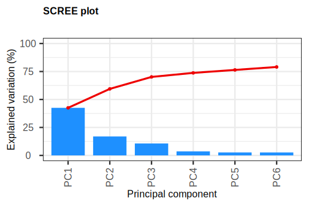<!-- -->

## 3.2 Pairsplot

This plot shows all possible component combinations for assessing which
component divides groups according to different principles.

I limited the number of components to four, since one component is still
the main one.

``` r
pairsplot(pca, components = getComponents(pca, seq_len(4)),
          colby = 'fecd_exp',
          triangle = TRUE, trianglelabSize = 6, titleLabSize = 6, axisLabSize=5, legendPosition = 'none')
```

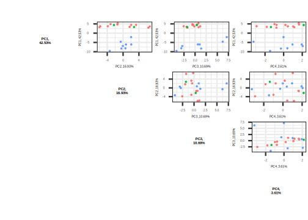<!-- -->

## 3.3 Loadings

This graph allows us to understand which genes determine which
component. That is, if the expected groups are well separated by a
component, we can immediately determine which genes contribute most, and
in which direction the component deviates based on sign.

Conclusion from the plot: we look at which miRNAs are in the component,
with a cutoff for low contribution. On PC1, all the miRNAs are clustered
together.

``` r
plotloadings(pca, components = getComponents(pca, seq_len(2)), rangeRetain = 0.03,
  col = c("red", "white", "blue"), colMidpoint = 0,
  shape = 21, shapeSizeRange = c(3, 3),
  axisLabSize = 10,  titleLabSize = 10)
```

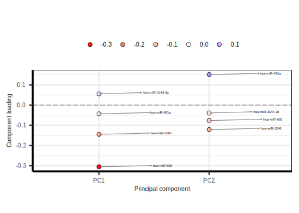<!-- -->

## 3.4 Eigencorrplot

This graph allows us to understand which metadata parameters are
correlated with which principal components. This means, when combined
with previous data, we can understand which genes determine variability
in which metadata component.

The Y-axis shows the metadata pulled from our_meta. Stars indicate the
correlation significance; the more stars there are, the higher the
correlation.

``` r
eigencorplot(pca, components = getComponents(pca, seq_len(4)), 
             metavars = c("Expaned_alleles", "fecd_exp", "exp", "Age"))
```

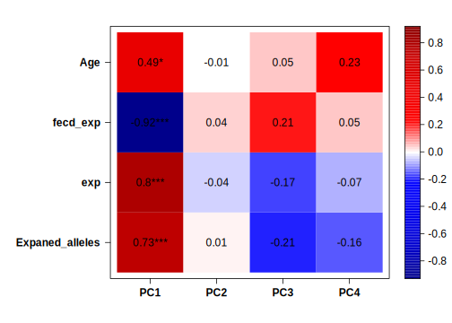<!-- -->

## 3.5 Biplot

Using a biplot, we can visualize the dispersion of samples in the space
of specific components.

Now let’s look at biplots—graphs in the space of two principal
components. In biplots, you can change the component numbers for
visualization.

### 3.5.1 1-2 group

We look at the clustering to see if the components are separated by a
straight line. If not, other components are at play.

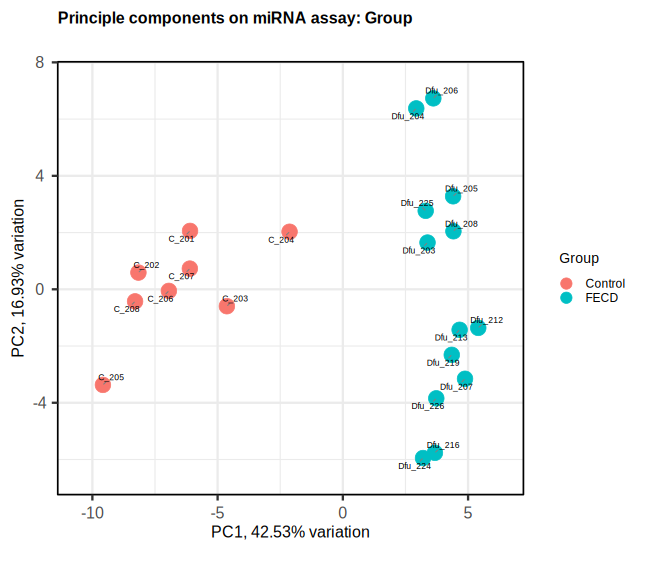<!-- -->

1.  The graph depicts the distribution of diseased and healthy samples
    in a two-component space.
2.  It is clear that the two groups of samples:
    1.  They are visually separable and do not mix.

    2.  They cluster well within their groups.

    3.  There is a small cluster of controls in the middle of the graph.
3.  The data are suitable for FECD vs. Control analysis. The outlier in
    the center of the graph is likely of an unknown biological origin.

### 3.5.2 1-2 expansion

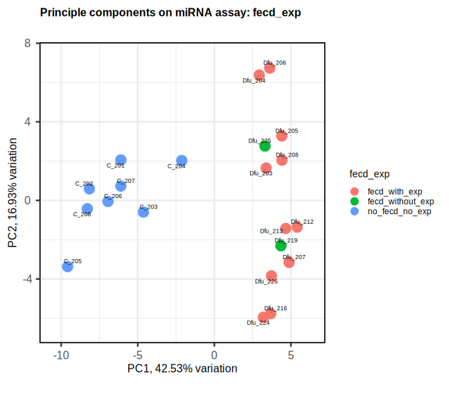<!-- -->

To compare the heterogeneity of the comparison groups, a principal
component analysis was performed. The plot of the first two components
shows that dystrophic and control samples cluster, with the presence or
absence of expansion inseparable. Thus, the endothelial microRNA profile
obtained using Nanostring technology is associated with the presence of
Fuchs’ corneal dystrophy.

### 3.5.3 1-2 sex difference plot

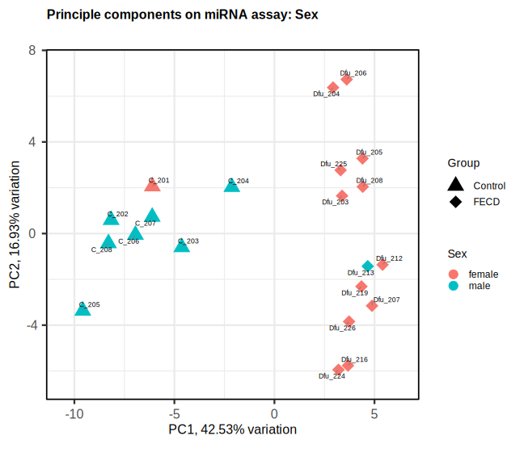<!-- -->

### 3.5.4 1-2 run difference

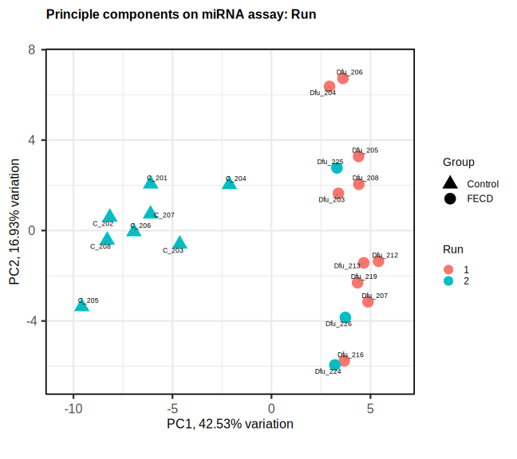<!-- -->

1.  The graph shows the instrument run number associated with the
    samples.
2.  It is clear that most patients were sequenced on one chip, while
    most controls were sequenced on the other two.
3.  A batch effect is possible when comparing expression patterns for
    patients and healthy controls, as the data were obtained from
    different instrument runs.

### 3.5.5 1-2 age difference

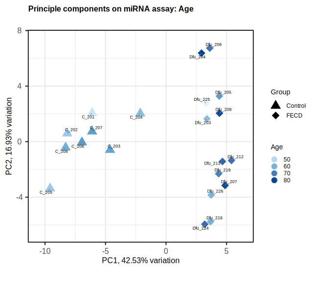<!-- -->

1.  We will evaluate the age grouping of samples in the diseased and
    healthy groups using the two principal component space.
2.  The results show that the collected samples are not balanced by age.
    The FECD group is significantly older than the control group.
3.  For a more reliable biological result, controls should have been
    selected from a closer age group. The average age difference between
    a diseased and healthy individual in the sample is ~20 years.

# 4 Heatmap

Let’s compare hitmaps of different normalizations from nSolver.

Reason: The raw data contains counts of the form 0, 1, 2, 3. Top 100
normalization significantly increases the values ​​in the Dfu samples.
Ultimately, based on the hitmap results, we switched to ligation
normalization.

## 4.1 raw_data

``` r
heatmap(as.matrix(raw_data), cexCol = 1.5)
```

<!-- -->

## 4.2 top100 normalisation

топ100 и лигация совпадают, тк мы взяли лигирование как norm_data.

``` r
heatmap(as.matrix(norm_data), cexCol = 2)
```

<!-- -->

## 4.3 housekeeping genes normalisation

``` r
heatmap(as.matrix(hkg_norm_data), cexCol = 1.5)
```

<!-- -->

## 4.4 ligation normalisation

``` r
heatmap(as.matrix(lig_norm_data), cexCol = 1.5)
```

<!-- -->

## 4.5 Ligation w/o pos probes w/o thresholding

``` r
heatmap(as.matrix(nopos_lig_norm_data), cexCol = 1.5)
```

<!-- -->

## 4.6 Ligation w/o pos probes with thresholding

``` r
heatmap(as.matrix(trh_lig_norm_data), cexCol = 1.5)
```

<!-- -->

## 4.7 Allgenes normalisation

``` r
heatmap(as.matrix(all_norm_data), cexCol = 1.5)
```

<!-- -->

# 5 Summary statistics

Let’s create a table with statistics. Query the Fisher test package for
the contingency table. We have 0 expanded counterfields, which
interferes with the Fisher test, so we’ll increase the number to 1, and
correspondingly increase the number of controls without expansion,
thereby maintaining the proportion, assuming that 5% of the population
is expanded.

Metadata without discarded samples, without trimming for paired
transcriptomes.

    ## [1] "mean M, F age: 61 65.5714285714286"

    ## [1] "CONTROL mean M, F age: 58.8333333333333 56"

    ## [1] "FECD mean M, F age: 74 67.1666666666667"

    ## [1] "CONTROL SD mean M, F age: 4.45 12.7"

    ## [1] "FECD SD mean M, F age: NA 11"

    ##                    FECD  Control                OR + Pval
    ## Patients             13        8                     <NA>
    ## Males                 1        6 OR = 0.037 pval = 0.0032
    ## Mean age ± sd 68 ± 10.7 58 ± 6.2     T = 2.6 pval = 0.018
    ## Expanded             11        0   OR = 36 pval = 7.1e-05

# 6 Differential expression

First, we’ll calculate differential expression using a t-test and the
nonparametric Mann-Whitney test. Limma is the core of edgeR, DESEQ, and
other tools.

> Limma is a general-purpose package that can be used in any analysis on
> any data, as it doesn’t have heuristics specific to specific data
> types and applications, like deseq for ngs. Limma builds a negative
> binomial distribution model and adjusts the weights of different genes
> to fit it. It works well with small samples, but for samples larger
> than 500, classic methods (t-test, U-test) can be used.

``` r
# no outliers
norm_data_cleaned <- norm_data[!(colnames(norm_data) %in% c('C_209', 'C_210', 'C_211', 'Dfu_209', 'Dfu_210', 'Dfu_223'))]
meta4limma_test <- meta4limma[!(meta4limma$Sample_name %in% c('C_209', 'C_210', 'C_211', 'Dfu_209',  'Dfu_210', 'Dfu_223')), ]
```

## 6.1 t-test, u-test, limma

What’s the test’s direction – we divide DFU by Control.

- LFC \> 0 → up‑regulation in FECD.

- LFC \< 0 → down‑regulation.

We need to remove the miRNA where **BOTH values ​​are low across groups**,
as such pairs **are artifactual**. A value where one is 1 and the other
is 0 is ok. We’ll immediately filter them out of the DEGs.

``` r
gr_1 <- sum(grepl("C_", colnames(norm_data_cleaned)))   #8 end of 1 gr
gr_2 <- gr_1 + 1 #  2 gr start


deg_ttest <- do.call(rbind, 
                      lapply(seq(1, nrow(norm_data_cleaned)), function(x)
  {f_tt <- t.test(norm_data_cleaned[x, 1:gr_1], norm_data_cleaned[x, gr_2:ncol(norm_data_cleaned)])
  
  mean_c <- (mean(unlist(norm_data_cleaned[x, 1:gr_1])))
  mean_f <- (mean(unlist((norm_data_cleaned[x, gr_2:ncol(norm_data_cleaned)]))))
  
  fc <- log2(mean_f / mean_c)
  
  return (unlist(c(fc, f_tt$p.value, mean_f, mean_c)))
  }
))

deg_ttest <- as.data.frame(deg_ttest)
colnames(deg_ttest) <- c('lfc', 't_pval', 'mean_f', 'mean_c')
rownames(deg_ttest) <-  other_data$`Probe Name`
deg_ttest <- deg_ttest %>% rownames_to_column('miRNA')

# filter ZERO miRNA in BOTH groups
low_mirna <- deg_ttest %>% filter((mean_c < 2.2) & (mean_f < 2.2)) %>% pull(miRNA)
deg_ttest <- deg_ttest %>% filter(!(miRNA %in% low_mirna))
deg_ttest$p_adj <- p.adjust(deg_ttest$t_pval, "fdr")

# u-test
deg_utest <- do.call(rbind, 
                      lapply(seq(1, nrow(norm_data_cleaned)), function(x)
  {u_tt <- wilcox.test(as.numeric(norm_data_cleaned[x, 1:gr_1]), as.numeric(norm_data_cleaned[x, gr_2:ncol(norm_data_cleaned)]))
  fc <- log2(
    mean(unlist((norm_data_cleaned[x, gr_2:ncol(norm_data_cleaned)]))) / mean(unlist(norm_data_cleaned[x, 1:gr_1]))
    )
  return (unlist(c(fc, u_tt$p.value)))
  }
))
deg_utest <- as.data.frame(deg_utest)
colnames(deg_utest) <- c('lfc', 'u_pval')
deg_utest$p_adj <- p.adjust(deg_utest$u_pval, "fdr")
rownames(deg_utest) <-  other_data$`Probe Name`
deg_utest <- deg_utest %>% rownames_to_column('miRNA') %>% filter(!(miRNA %in% low_mirna))

#limma
# create groups based on metadata
group <- factor(meta4limma_test$FECD, levels = c("no", "yes"))
# we create a design matrix, ~0 means without including the intercept (0)   
design <- model.matrix(~0 + group)
colnames(design) <- c("Control", "FECD")
# into matrix and log
limma_matrix <- as.matrix(norm_data_cleaned)
limma_matrix <- log2(limma_matrix)

# applying a linear regression model to a matrix
limma_fit <- lmFit(limma_matrix, design)

# Contrasts for comparing groups
contrast_matrix <- makeContrasts(FECD - Control, levels = design)
fit2 <- contrasts.fit(limma_fit, contrast_matrix)
# Bayesian analysis
fit2 <- eBayes(fit2)

# retrieving results
deg_limma <- topTable(fit2, adjust.method = "fdr", number = Inf)
deg_limma <- deg_limma %>% mutate(miRNA = rownames(.)) %>% filter(!(miRNA %in% low_mirna))
rm(fit2, limma_fit, limma_matrix, design, group, meta4limma_test)
```

Let’s also filter the dataframe

``` r
saveRDS(low_mirna, file="/data7a/bio/human_genomics/fuchs_dystrophy/nanostring/analisys/RDS/low_mirna.RDS")
norm_data_cleaned <- norm_data_cleaned %>% filter(!(rownames(.) %in% low_mirna))
```

**Filter DEGs**

We filter the tables to obtain only significant microRNAs. To do this,
we need to select a table consisting of rows with values ​​such that lfc
\> 1, lfc \< -1, and p_adj \< 0.05.

``` r
filtered_tt <- deg_ttest %>%
  filter(p_adj <= 0.05 & (lfc > 1 | lfc < -1))
filtered_ut <- deg_utest %>%
  filter(p_adj <= 0.05 & (lfc > 1 | lfc < -1))
filtered_limma <- deg_limma %>%
  filter(adj.P.Val <= 0.05 & (logFC > 1 | logFC < -1))
```

## 6.2 Intersection of genes from all tests

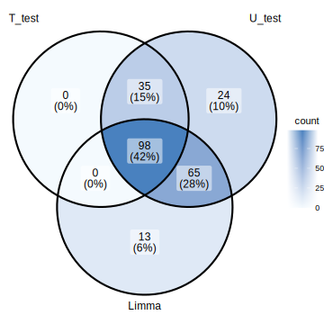<!-- -->

**Merge list of differential expression genes. Export.**

We’ll select genes that are present in all differential expression
lists. We’ll retain the LFC values ​​to allow for overlap with DEGs from
another article.

``` r
diffexpressed_mirna <- Reduce(intersect, list((filtered_tt$miRNA), (filtered_ut$miRNA), rownames(filtered_limma))) 
diffexpressed_mirna <- filtered_limma[ diffexpressed_mirna, ]  
saveRDS(diffexpressed_mirna, file="/data7a/bio/human_genomics/fuchs_dystrophy/nanostring/analisys/RDS/diffexpressed_mirna_v2.RDS")
#DT::datatable(diffexpressed_mirna, filter = 'top')
diffexpressed_mirna
```

    ##                                                   logFC   AveExpr          t
    ## hsa-let-7b-5p                                 -3.469873 4.8394699  -6.469868
    ## hsa-miR-103a-3p                                1.256394 0.7777674   5.922332
    ## hsa-miR-1193                                   1.063511 0.8194310   4.480666
    ## hsa-miR-1200                                   1.001429 0.7214070   4.633730
    ## hsa-miR-1205                                   1.082093 0.7185627   3.878807
    ## hsa-miR-1245b-3p                               1.253667 1.0657807   4.692796
    ## hsa-miR-1248                                   1.050539 0.7022225   4.392630
    ## hsa-miR-1268b                                  1.201413 0.9206206   3.650757
    ## hsa-miR-1273c                                  1.056796 0.8368561   3.513524
    ## hsa-miR-1279                                   1.011136 0.7007606   3.976880
    ## hsa-miR-1285-5p                               -4.563167 3.2066464 -11.165211
    ## hsa-miR-1287-3p                                1.046409 0.9142128   4.215899
    ## hsa-miR-1303                                  -3.052044 2.2483928  -8.594503
    ## hsa-miR-1305                                  -4.057884 3.2251040 -10.013215
    ## hsa-miR-1307-3p                                1.101882 0.9899907   3.831875
    ## hsa-miR-151a-3p                               -1.430510 2.0774157  -4.465901
    ## hsa-miR-181a-5p                               -3.081967 2.5808012  -6.432187
    ## hsa-miR-1827                                   1.314539 1.4818319   2.949712
    ## hsa-miR-186-5p                                -2.105045 2.5765581  -5.155636
    ## hsa-miR-1915-3p                               -3.831698 2.3918035 -14.369408
    ## hsa-miR-193a-3p                                1.002954 1.0282157   3.048700
    ## hsa-miR-196a-3p                                1.413543 1.0183743   5.030332
    ## hsa-miR-1972                                  -4.739800 3.2158139 -14.200601
    ## hsa-miR-200c-3p                               -2.667319 2.5160977  -5.934554
    ## hsa-miR-211-5p                                 1.047863 0.8407970   3.101422
    ## hsa-miR-2110                                   1.149978 0.7417397   5.018307
    ## hsa-miR-2116-5p                               -3.218586 2.9707410  -6.043708
    ## hsa-miR-217                                    1.261113 1.1737111   4.714034
    ## hsa-miR-219a-5p                                1.024297 0.9228900   4.087164
    ## hsa-miR-2682-5p                                1.232910 0.8151185   4.590453
    ## hsa-miR-302b-3p                                1.746134 1.4025757   6.524370
    ## hsa-miR-3074-3p                                1.155096 0.7678387   4.270321
    ## hsa-miR-30d-5p                                -2.357531 2.7686755  -5.918257
    ## hsa-miR-3144-3p                                2.015026 1.2473972   4.358283
    ## hsa-miR-3144-5p                                1.023298 0.8986096   3.629826
    ## hsa-miR-3158-3p                               -1.181083 1.3820453  -4.054256
    ## hsa-miR-3180-3p                                1.126930 0.7504027   3.923215
    ## hsa-miR-3180-5p                                1.142236 1.0479021   3.760638
    ## hsa-miR-328-5p                                 1.301509 0.8056957   5.530597
    ## hsa-miR-329-5p                                 1.104925 0.7869697   3.575097
    ## hsa-miR-339-3p                                 1.032930 0.6922121   4.092897
    ## hsa-miR-34b-3p                                 1.179588 0.7302213   5.394865
    ## hsa-miR-372-3p                                 1.301379 0.8056153   4.012438
    ## hsa-miR-373-3p                                 1.007439 0.8729633   3.742075
    ## hsa-miR-374a-3p                                1.184665 0.9388234   4.369967
    ## hsa-miR-376a-2-5p                              1.076815 0.8742271   3.921015
    ## hsa-miR-380-3p                                 1.127734 0.8231298   3.796998
    ## hsa-miR-3934-5p                                1.536655 1.1458031   5.658499
    ## hsa-miR-421                                   -2.192258 2.2130576  -6.481486
    ## hsa-miR-423-3p                                 1.181227 1.0498405   3.555657
    ## hsa-miR-433-5p                                 1.323281 1.2067249   4.961185
    ## hsa-miR-4451                                   1.097865 0.9750570   3.480043
    ## hsa-miR-4455                                  -1.919726 2.0123618  -5.097830
    ## hsa-miR-449a                                   1.054029 0.6524943   4.638344
    ## hsa-miR-449b-5p                                1.211158 0.7497645   5.090679
    ## hsa-miR-450b-3p                                1.498623 0.9764150   4.766072
    ## hsa-miR-4707-5p                                1.026383 0.7718750   3.940727
    ## hsa-miR-4787-5p                                1.095822 1.0696222   3.835099
    ## hsa-miR-490-3p                                 1.086255 0.8502228   3.232304
    ## hsa-miR-494-5p                                 1.130822 0.7000329   3.740324
    ## hsa-miR-503-3p                                 1.004069 0.8291937   3.598924
    ## hsa-miR-506-3p                                 1.374514 1.1308360   4.407601
    ## hsa-miR-513a-5p                                1.133025 0.8248753   4.203462
    ## hsa-miR-514a-3p                                1.096037 0.9156508   4.435103
    ## hsa-miR-515-3p                                 1.083005 0.8268716   4.176917
    ## hsa-miR-516a-5p                                1.037441 0.6909213   3.610849
    ## hsa-miR-518e-3p                                1.053865 0.6523929   3.803055
    ## hsa-miR-519d-3p                                1.337237 0.9009338   4.599746
    ## hsa-miR-525-3p                                 1.361171 0.8426299   4.003011
    ## hsa-miR-526a+hsa-miR-518c-5p+hsa-miR-518d-5p   1.008722 1.5644710   2.781532
    ## hsa-miR-542-5p                                 1.434127 1.1356677   4.354102
    ## hsa-miR-548e-3p                                1.029783 0.7106052   4.540189
    ## hsa-miR-548i                                   1.043982 1.1343256   3.517295
    ## hsa-miR-548n                                  -1.111017 1.7701097  -3.371342
    ## hsa-miR-564                                    1.259035 0.8542222   4.382494
    ## hsa-miR-574-5p                                -5.283956 3.2979157 -12.188267
    ## hsa-miR-576-3p                                 1.060835 0.8037477   3.459530
    ## hsa-miR-579-5p                                 1.312512 1.0399707   4.048541
    ## hsa-miR-580-3p                                 1.163129 0.9635792   3.648556
    ## hsa-miR-593-3p                                -1.096206 1.5035575  -3.837546
    ## hsa-miR-617                                    1.109627 1.1547138   3.355960
    ## hsa-miR-626                                    1.164540 1.0079980   3.971618
    ## hsa-miR-630                                  -11.664441 6.3696005 -17.591445
    ## hsa-miR-637                                    1.025062 0.7440912   3.895505
    ## hsa-miR-6503-3p                                1.025062 0.7440912   5.096349
    ## hsa-miR-652-5p                                 1.093158 0.7593444   3.545238
    ## hsa-miR-654-5p                                 1.138118 0.9002857   4.108814
    ## hsa-miR-665                                    1.395251 1.0284186   3.815352
    ## hsa-miR-6720-3p                                1.029923 0.7422394   5.122643
    ## hsa-miR-6721-5p                                1.016427 2.2458164   2.949984
    ## hsa-miR-675-5p                                 1.179827 0.7303689   4.318261
    ## hsa-miR-766-3p                                 1.063682 1.0180985   3.275951
    ## hsa-miR-770-5p                                 1.175712 0.7278217   4.830743
    ## hsa-miR-802                                    1.263589 0.8350009   4.539451
    ## hsa-miR-876-5p                                 1.007411 0.7021796   4.408723
    ## hsa-miR-885-3p                                 1.071500 0.8798904   4.515852
    ## hsa-miR-891b                                   1.386645 1.2346833   4.251523
    ## hsa-miR-933                                    1.111852 0.8325923   3.946359
    ##                                                   P.Value    adj.P.Val
    ## hsa-let-7b-5p                                6.514583e-07 2.260277e-05
    ## hsa-miR-103a-3p                              2.706402e-06 6.614976e-05
    ## hsa-miR-1193                                 1.254828e-04 1.451235e-03
    ## hsa-miR-1200                                 8.337615e-05 1.090724e-03
    ## hsa-miR-1205                                 6.179660e-04 3.400944e-03
    ## hsa-miR-1245b-3p                             7.119723e-05 9.629727e-04
    ## hsa-miR-1248                                 1.586845e-04 1.623464e-03
    ## hsa-miR-1268b                                1.119511e-03 5.193498e-03
    ## hsa-miR-1273c                                1.594520e-03 6.362136e-03
    ## hsa-miR-1279                                 4.776208e-04 2.954585e-03
    ## hsa-miR-1285-5p                              1.449798e-11 1.652770e-09
    ## hsa-miR-1287-3p                              2.538961e-04 2.221821e-03
    ## hsa-miR-1303                                 3.594060e-09 2.206200e-07
    ## hsa-miR-1305                                 1.545931e-10 1.233653e-08
    ## hsa-miR-1307-3p                              6.987586e-04 3.691474e-03
    ## hsa-miR-151a-3p                              1.305247e-04 1.487981e-03
    ## hsa-miR-181a-5p                              7.178759e-07 2.386938e-05
    ## hsa-miR-1827                                 6.538721e-03 1.733521e-02
    ## hsa-miR-186-5p                               2.065669e-05 3.833497e-04
    ## hsa-miR-1915-3p                              4.367112e-14 1.537645e-11
    ## hsa-miR-193a-3p                              5.133368e-03 1.447501e-02
    ## hsa-miR-196a-3p                              2.886932e-05 4.701574e-04
    ## hsa-miR-1972                                 5.780620e-14 1.537645e-11
    ## hsa-miR-200c-3p                              2.620948e-06 6.614976e-05
    ## hsa-miR-211-5p                               4.507598e-03 1.317606e-02
    ## hsa-miR-2110                                 2.981229e-05 4.758041e-04
    ## hsa-miR-2116-5p                              1.969058e-06 5.237694e-05
    ## hsa-miR-217                                  6.726648e-05 9.254939e-04
    ## hsa-miR-219a-5p                              3.570582e-04 2.645099e-03
    ## hsa-miR-2682-5p                              9.359844e-05 1.167056e-03
    ## hsa-miR-302b-3p                              5.662625e-07 2.151798e-05
    ## hsa-miR-3074-3p                              2.197299e-04 2.030846e-03
    ## hsa-miR-30d-5p                               2.735517e-06 6.614976e-05
    ## hsa-miR-3144-3p                              1.738868e-04 1.690542e-03
    ## hsa-miR-3144-5p                              1.181804e-03 5.358408e-03
    ## hsa-miR-3158-3p                              3.894882e-04 2.645099e-03
    ## hsa-miR-3180-3p                              5.500011e-04 3.197544e-03
    ## hsa-miR-3180-5p                              8.415596e-04 4.120028e-03
    ## hsa-miR-328-5p                               7.612579e-06 1.687455e-04
    ## hsa-miR-329-5p                               1.361092e-03 5.895583e-03
    ## hsa-miR-339-3p                               3.516880e-04 2.645099e-03
    ## hsa-miR-34b-3p                               1.091792e-05 2.292764e-04
    ## hsa-miR-372-3p                               4.349157e-04 2.732777e-03
    ## hsa-miR-373-3p                               8.832388e-04 4.265330e-03
    ## hsa-miR-374a-3p                              1.685594e-04 1.660622e-03
    ## hsa-miR-376a-2-5p                            5.531882e-04 3.197544e-03
    ## hsa-miR-380-3p                               7.654255e-04 3.890507e-03
    ## hsa-miR-3934-5p                              5.424788e-06 1.236852e-04
    ## hsa-miR-421                                  6.322671e-07 2.260277e-05
    ## hsa-miR-423-3p                               1.430947e-03 6.026990e-03
    ## hsa-miR-433-5p                               3.473119e-05 5.434410e-04
    ## hsa-miR-4451                                 1.737332e-03 6.863322e-03
    ## hsa-miR-4455                                 2.410489e-05 4.084731e-04
    ## hsa-miR-449a                                 8.235411e-05 1.090724e-03
    ## hsa-miR-449b-5p                              2.456981e-05 4.084731e-04
    ## hsa-miR-450b-3p                              5.852725e-05 8.193815e-04
    ## hsa-miR-4707-5p                              5.252699e-04 3.128100e-03
    ## hsa-miR-4787-5p                              6.928920e-04 3.686185e-03
    ## hsa-miR-490-3p                               3.254149e-03 1.042896e-02
    ## hsa-miR-494-5p                               8.872742e-04 4.265330e-03
    ## hsa-miR-503-3p                               1.279996e-03 5.612288e-03
    ## hsa-miR-506-3p                               1.524780e-04 1.580227e-03
    ## hsa-miR-513a-5p                              2.624135e-04 2.251677e-03
    ## hsa-miR-514a-3p                              1.416992e-04 1.566524e-03
    ## hsa-miR-515-3p                               2.815513e-04 2.365031e-03
    ## hsa-miR-516a-5p                              1.241196e-03 5.564462e-03
    ## hsa-miR-518e-3p                              7.534174e-04 3.854020e-03
    ## hsa-miR-519d-3p                              9.130290e-05 1.156503e-03
    ## hsa-miR-525-3p                               4.458572e-04 2.779641e-03
    ## hsa-miR-526a+hsa-miR-518c-5p+hsa-miR-518d-5p 9.797231e-03 2.299468e-02
    ## hsa-miR-542-5p                               1.758333e-04 1.690542e-03
    ## hsa-miR-548e-3p                              1.070478e-04 1.277505e-03
    ## hsa-miR-548i                                 1.579171e-03 6.347229e-03
    ## hsa-miR-548n                                 2.291776e-03 8.258305e-03
    ## hsa-miR-564                                  1.630277e-04 1.646786e-03
    ## hsa-miR-574-5p                               2.020388e-12 3.224539e-10
    ## hsa-miR-576-3p                               1.830886e-03 7.092460e-03
    ## hsa-miR-579-5p                               3.954087e-04 2.645099e-03
    ## hsa-miR-580-3p                               1.125909e-03 5.193498e-03
    ## hsa-miR-593-3p                               6.884711e-04 3.686185e-03
    ## hsa-miR-617                                  2.382920e-03 8.400527e-03
    ## hsa-miR-626                                  4.842816e-04 2.972744e-03
    ## hsa-miR-630                                  3.240834e-16 2.586185e-13
    ## hsa-miR-637                                  5.914934e-04 3.339944e-03
    ## hsa-miR-6503-3p                              2.420046e-05 4.084731e-04
    ## hsa-miR-652-5p                               1.469809e-03 6.062012e-03
    ## hsa-miR-654-5p                               3.371923e-04 2.645099e-03
    ## hsa-miR-665                                  7.296006e-04 3.756266e-03
    ## hsa-miR-6720-3p                              2.255911e-05 4.084731e-04
    ## hsa-miR-6721-5p                              6.534412e-03 1.733521e-02
    ## hsa-miR-675-5p                               1.934322e-04 1.837606e-03
    ## hsa-miR-766-3p                               2.916371e-03 9.533912e-03
    ## hsa-miR-770-5p                               4.923038e-05 7.275155e-04
    ## hsa-miR-802                                  1.072592e-04 1.277505e-03
    ## hsa-miR-876-5p                               1.520228e-04 1.580227e-03
    ## hsa-miR-885-3p                               1.142349e-04 1.340580e-03
    ## hsa-miR-891b                                 2.309827e-04 2.071058e-03
    ## hsa-miR-933                                  5.175505e-04 3.128100e-03
    ##                                                        B
    ## hsa-let-7b-5p                                 5.84897763
    ## hsa-miR-103a-3p                               4.43047661
    ## hsa-miR-1193                                  0.63385350
    ## hsa-miR-1200                                  1.03574284
    ## hsa-miR-1205                                 -0.92364347
    ## hsa-miR-1245b-3p                              1.19120281
    ## hsa-miR-1248                                  0.40348151
    ## hsa-miR-1268b                                -1.49904071
    ## hsa-miR-1273c                                -1.83983594
    ## hsa-miR-1279                                 -0.67320945
    ## hsa-miR-1285-5p                              16.51682819
    ## hsa-miR-1287-3p                              -0.05677565
    ## hsa-miR-1303                                 11.03816467
    ## hsa-miR-1305                                 14.17066030
    ## hsa-miR-1307-3p                              -1.04289166
    ## hsa-miR-151a-3p                               0.59517274
    ## hsa-miR-181a-5p                               5.75219463
    ## hsa-miR-1827                                 -3.18329778
    ## hsa-miR-186-5p                                2.41310060
    ## hsa-miR-1915-3p                              22.20951118
    ## hsa-miR-193a-3p                              -2.95512821
    ## hsa-miR-196a-3p                               2.08197537
    ## hsa-miR-1972                                 21.93713585
    ## hsa-miR-200c-3p                               4.46239803
    ## hsa-miR-211-5p                               -2.83212596
    ## hsa-miR-2110                                  2.05020207
    ## hsa-miR-2116-5p                               4.74701270
    ## hsa-miR-217                                   1.24714288
    ## hsa-miR-219a-5p                              -0.38976907
    ## hsa-miR-2682-5p                               0.92196144
    ## hsa-miR-302b-3p                               5.98871727
    ## hsa-miR-3074-3p                               0.08460464
    ## hsa-miR-30d-5p                                4.41983075
    ## hsa-miR-3144-3p                               0.31378657
    ## hsa-miR-3144-5p                              -1.55130518
    ## hsa-miR-3158-3p                              -0.47453649
    ## hsa-miR-3180-3p                              -0.81044666
    ## hsa-miR-3180-5p                              -1.22310186
    ## hsa-miR-328-5p                                3.40264937
    ## hsa-miR-329-5p                               -1.68748580
    ## hsa-miR-339-3p                               -0.37498694
    ## hsa-miR-34b-3p                                3.04485470
    ## hsa-miR-372-3p                               -0.58202296
    ## hsa-miR-373-3p                               -1.26989555
    ## hsa-miR-374a-3p                               0.34428812
    ## hsa-miR-376a-2-5p                            -0.81606285
    ## hsa-miR-380-3p                               -1.13124420
    ## hsa-miR-3934-5p                               3.73913190
    ## hsa-miR-421                                   5.87878860
    ## hsa-miR-423-3p                               -1.73568835
    ## hsa-miR-433-5p                                1.89928593
    ## hsa-miR-4451                                 -1.92227759
    ## hsa-miR-4455                                  2.26034364
    ## hsa-miR-449a                                  1.04788120
    ## hsa-miR-449b-5p                               2.24144585
    ## hsa-miR-450b-3p                               1.38428722
    ## hsa-miR-4707-5p                              -0.76571696
    ## hsa-miR-4787-5p                              -1.03471334
    ## hsa-miR-490-3p                               -2.52263120
    ## hsa-miR-494-5p                               -1.27430721
    ## hsa-miR-503-3p                               -1.62828390
    ## hsa-miR-506-3p                                0.44261288
    ## hsa-miR-513a-5p                              -0.08903490
    ## hsa-miR-514a-3p                               0.51454337
    ## hsa-miR-515-3p                               -0.15783036
    ## hsa-miR-516a-5p                              -1.59860410
    ## hsa-miR-518e-3p                              -1.11591848
    ## hsa-miR-519d-3p                               0.94638556
    ## hsa-miR-525-3p                               -0.60621861
    ## hsa-miR-526a+hsa-miR-518c-5p+hsa-miR-518d-5p -3.56204690
    ## hsa-miR-542-5p                                0.30287611
    ## hsa-miR-548e-3p                               0.78995489
    ## hsa-miR-548i                                 -1.83053361
    ## hsa-miR-548n                                 -2.18787426
    ## hsa-miR-564                                   0.37700292
    ## hsa-miR-574-5p                               18.46077170
    ## hsa-miR-576-3p                               -1.97264403
    ## hsa-miR-579-5p                               -0.48924083
    ## hsa-miR-580-3p                               -1.50454202
    ## hsa-miR-593-3p                               -1.02850415
    ## hsa-miR-617                                  -2.22519355
    ## hsa-miR-626                                  -0.68668660
    ## hsa-miR-630                                  26.91518958
    ## hsa-miR-637                                  -0.88112016
    ## hsa-miR-6503-3p                               2.25642935
    ## hsa-miR-652-5p                               -1.76148458
    ## hsa-miR-654-5p                               -0.33392061
    ## hsa-miR-665                                  -1.08477810
    ## hsa-miR-6720-3p                               2.32591476
    ## hsa-miR-6721-5p                              -3.18267767
    ## hsa-miR-675-5p                                0.20941329
    ## hsa-miR-766-3p                               -2.41817702
    ## hsa-miR-770-5p                                1.55487090
    ## hsa-miR-802                                   0.78801645
    ## hsa-miR-876-5p                                0.44554569
    ## hsa-miR-885-3p                                0.72609899
    ## hsa-miR-891b                                  0.03573275
    ## hsa-miR-933                                  -0.75131944
    ##                                                                                     miRNA
    ## hsa-let-7b-5p                                                               hsa-let-7b-5p
    ## hsa-miR-103a-3p                                                           hsa-miR-103a-3p
    ## hsa-miR-1193                                                                 hsa-miR-1193
    ## hsa-miR-1200                                                                 hsa-miR-1200
    ## hsa-miR-1205                                                                 hsa-miR-1205
    ## hsa-miR-1245b-3p                                                         hsa-miR-1245b-3p
    ## hsa-miR-1248                                                                 hsa-miR-1248
    ## hsa-miR-1268b                                                               hsa-miR-1268b
    ## hsa-miR-1273c                                                               hsa-miR-1273c
    ## hsa-miR-1279                                                                 hsa-miR-1279
    ## hsa-miR-1285-5p                                                           hsa-miR-1285-5p
    ## hsa-miR-1287-3p                                                           hsa-miR-1287-3p
    ## hsa-miR-1303                                                                 hsa-miR-1303
    ## hsa-miR-1305                                                                 hsa-miR-1305
    ## hsa-miR-1307-3p                                                           hsa-miR-1307-3p
    ## hsa-miR-151a-3p                                                           hsa-miR-151a-3p
    ## hsa-miR-181a-5p                                                           hsa-miR-181a-5p
    ## hsa-miR-1827                                                                 hsa-miR-1827
    ## hsa-miR-186-5p                                                             hsa-miR-186-5p
    ## hsa-miR-1915-3p                                                           hsa-miR-1915-3p
    ## hsa-miR-193a-3p                                                           hsa-miR-193a-3p
    ## hsa-miR-196a-3p                                                           hsa-miR-196a-3p
    ## hsa-miR-1972                                                                 hsa-miR-1972
    ## hsa-miR-200c-3p                                                           hsa-miR-200c-3p
    ## hsa-miR-211-5p                                                             hsa-miR-211-5p
    ## hsa-miR-2110                                                                 hsa-miR-2110
    ## hsa-miR-2116-5p                                                           hsa-miR-2116-5p
    ## hsa-miR-217                                                                   hsa-miR-217
    ## hsa-miR-219a-5p                                                           hsa-miR-219a-5p
    ## hsa-miR-2682-5p                                                           hsa-miR-2682-5p
    ## hsa-miR-302b-3p                                                           hsa-miR-302b-3p
    ## hsa-miR-3074-3p                                                           hsa-miR-3074-3p
    ## hsa-miR-30d-5p                                                             hsa-miR-30d-5p
    ## hsa-miR-3144-3p                                                           hsa-miR-3144-3p
    ## hsa-miR-3144-5p                                                           hsa-miR-3144-5p
    ## hsa-miR-3158-3p                                                           hsa-miR-3158-3p
    ## hsa-miR-3180-3p                                                           hsa-miR-3180-3p
    ## hsa-miR-3180-5p                                                           hsa-miR-3180-5p
    ## hsa-miR-328-5p                                                             hsa-miR-328-5p
    ## hsa-miR-329-5p                                                             hsa-miR-329-5p
    ## hsa-miR-339-3p                                                             hsa-miR-339-3p
    ## hsa-miR-34b-3p                                                             hsa-miR-34b-3p
    ## hsa-miR-372-3p                                                             hsa-miR-372-3p
    ## hsa-miR-373-3p                                                             hsa-miR-373-3p
    ## hsa-miR-374a-3p                                                           hsa-miR-374a-3p
    ## hsa-miR-376a-2-5p                                                       hsa-miR-376a-2-5p
    ## hsa-miR-380-3p                                                             hsa-miR-380-3p
    ## hsa-miR-3934-5p                                                           hsa-miR-3934-5p
    ## hsa-miR-421                                                                   hsa-miR-421
    ## hsa-miR-423-3p                                                             hsa-miR-423-3p
    ## hsa-miR-433-5p                                                             hsa-miR-433-5p
    ## hsa-miR-4451                                                                 hsa-miR-4451
    ## hsa-miR-4455                                                                 hsa-miR-4455
    ## hsa-miR-449a                                                                 hsa-miR-449a
    ## hsa-miR-449b-5p                                                           hsa-miR-449b-5p
    ## hsa-miR-450b-3p                                                           hsa-miR-450b-3p
    ## hsa-miR-4707-5p                                                           hsa-miR-4707-5p
    ## hsa-miR-4787-5p                                                           hsa-miR-4787-5p
    ## hsa-miR-490-3p                                                             hsa-miR-490-3p
    ## hsa-miR-494-5p                                                             hsa-miR-494-5p
    ## hsa-miR-503-3p                                                             hsa-miR-503-3p
    ## hsa-miR-506-3p                                                             hsa-miR-506-3p
    ## hsa-miR-513a-5p                                                           hsa-miR-513a-5p
    ## hsa-miR-514a-3p                                                           hsa-miR-514a-3p
    ## hsa-miR-515-3p                                                             hsa-miR-515-3p
    ## hsa-miR-516a-5p                                                           hsa-miR-516a-5p
    ## hsa-miR-518e-3p                                                           hsa-miR-518e-3p
    ## hsa-miR-519d-3p                                                           hsa-miR-519d-3p
    ## hsa-miR-525-3p                                                             hsa-miR-525-3p
    ## hsa-miR-526a+hsa-miR-518c-5p+hsa-miR-518d-5p hsa-miR-526a+hsa-miR-518c-5p+hsa-miR-518d-5p
    ## hsa-miR-542-5p                                                             hsa-miR-542-5p
    ## hsa-miR-548e-3p                                                           hsa-miR-548e-3p
    ## hsa-miR-548i                                                                 hsa-miR-548i
    ## hsa-miR-548n                                                                 hsa-miR-548n
    ## hsa-miR-564                                                                   hsa-miR-564
    ## hsa-miR-574-5p                                                             hsa-miR-574-5p
    ## hsa-miR-576-3p                                                             hsa-miR-576-3p
    ## hsa-miR-579-5p                                                             hsa-miR-579-5p
    ## hsa-miR-580-3p                                                             hsa-miR-580-3p
    ## hsa-miR-593-3p                                                             hsa-miR-593-3p
    ## hsa-miR-617                                                                   hsa-miR-617
    ## hsa-miR-626                                                                   hsa-miR-626
    ## hsa-miR-630                                                                   hsa-miR-630
    ## hsa-miR-637                                                                   hsa-miR-637
    ## hsa-miR-6503-3p                                                           hsa-miR-6503-3p
    ## hsa-miR-652-5p                                                             hsa-miR-652-5p
    ## hsa-miR-654-5p                                                             hsa-miR-654-5p
    ## hsa-miR-665                                                                   hsa-miR-665
    ## hsa-miR-6720-3p                                                           hsa-miR-6720-3p
    ## hsa-miR-6721-5p                                                           hsa-miR-6721-5p
    ## hsa-miR-675-5p                                                             hsa-miR-675-5p
    ## hsa-miR-766-3p                                                             hsa-miR-766-3p
    ## hsa-miR-770-5p                                                             hsa-miR-770-5p
    ## hsa-miR-802                                                                   hsa-miR-802
    ## hsa-miR-876-5p                                                             hsa-miR-876-5p
    ## hsa-miR-885-3p                                                             hsa-miR-885-3p
    ## hsa-miR-891b                                                                 hsa-miR-891b
    ## hsa-miR-933                                                                   hsa-miR-933

**Preprocessing for further analysis**

We need to obtain the names of differentially expressed miRNAs in the
HGNC entry for further processing, without hsa, and move the information
about 3/5p to a separate column. The resulting table contains
differential expressions with the classic entry, the HGNC symbol, and
the MIMAT ID.

``` r
# hsa-miR-1234-3p -> MIR2114 
diffexpressed_mirna_HGNC <- sapply(diffexpressed_mirna$miRNA, toupper)
diffexpressed_mirna_HGNC <- gsub('HSA-', '', diffexpressed_mirna_HGNC)
diffexpressed_mirna_HGNC <- as.data.frame(diffexpressed_mirna_HGNC, row.names = NULL)
colnames(diffexpressed_mirna_HGNC) <- 'HGNC_symbol'
# 5/3p 
diffexpressed_mirna_HGNC$strand <- ifelse(grepl("5P", diffexpressed_mirna_HGNC$HGNC_symbol), "5P",
                             ifelse(grepl("3P", diffexpressed_mirna_HGNC$HGNC_symbol), "3P", "5P"))

diffexpressed_mirna_HGNC$HGNC_symbol <- gsub('-', '', gsub('-5P', '', gsub('-3P', '', diffexpressed_mirna_HGNC$HGNC_symbol)))

# вручную добавляем названия мирнк (почему - см ниже)
diffexpressed_mirna_HGNC <- rbind(diffexpressed_mirna_HGNC, data.frame(HGNC_symbol = c("MIR128-1", "MIR128-2", "MIR1283-1", "MIR1283-2"), strand = c('-', '-', '-', '-'), stringsAsFactors = FALSE))

diffexpressed_mirna_HGNC$miRNA <- row.names(diffexpressed_mirna_HGNC)

# MIMAT id 
diffexpressed_mirna_HGNC <- merge(diffexpressed_mirna_HGNC, other_data[, c("Probe Name", "Accession #")], 
                          by.x = "miRNA", by.y = "Probe Name")
diffexpressed_mirna_HGNC <- rename(diffexpressed_mirna_HGNC, 'MIMAT_ID' = "Accession #")

saveRDS(diffexpressed_mirna_HGNC, file="/data7a/bio/human_genomics/fuchs_dystrophy/nanostring/analisys/RDS/diffexpressed_mirna_HGNC.RDS")

#DT::datatable(diffexpressed_mirna_HGNC, caption = "Дифэкспрессированная микроРНК")
diffexpressed_mirna_HGNC
```

    ##                                           miRNA             HGNC_symbol strand
    ## 1                                 hsa-let-7b-5p                   LET7B     5P
    ## 2                               hsa-miR-103a-3p                 MIR103A     3P
    ## 3                                  hsa-miR-1193                 MIR1193     5P
    ## 4                                  hsa-miR-1200                 MIR1200     5P
    ## 5                                  hsa-miR-1205                 MIR1205     5P
    ## 6                              hsa-miR-1245b-3p                MIR1245B     3P
    ## 7                                  hsa-miR-1248                 MIR1248     5P
    ## 8                                 hsa-miR-1268b                MIR1268B     5P
    ## 9                                 hsa-miR-1273c                MIR1273C     5P
    ## 10                                 hsa-miR-1279                 MIR1279     5P
    ## 11                              hsa-miR-1285-5p                 MIR1285     5P
    ## 12                              hsa-miR-1287-3p                 MIR1287     3P
    ## 13                                 hsa-miR-1303                 MIR1303     5P
    ## 14                                 hsa-miR-1305                 MIR1305     5P
    ## 15                              hsa-miR-1307-3p                 MIR1307     3P
    ## 16                              hsa-miR-151a-3p                 MIR151A     3P
    ## 17                              hsa-miR-181a-5p                 MIR181A     5P
    ## 18                                 hsa-miR-1827                 MIR1827     5P
    ## 19                               hsa-miR-186-5p                  MIR186     5P
    ## 20                              hsa-miR-1915-3p                 MIR1915     3P
    ## 21                              hsa-miR-193a-3p                 MIR193A     3P
    ## 22                              hsa-miR-196a-3p                 MIR196A     3P
    ## 23                                 hsa-miR-1972                 MIR1972     5P
    ## 24                              hsa-miR-200c-3p                 MIR200C     3P
    ## 25                               hsa-miR-211-5p                  MIR211     5P
    ## 26                                 hsa-miR-2110                 MIR2110     5P
    ## 27                              hsa-miR-2116-5p                 MIR2116     5P
    ## 28                                  hsa-miR-217                  MIR217     5P
    ## 29                              hsa-miR-219a-5p                 MIR219A     5P
    ## 30                              hsa-miR-2682-5p                 MIR2682     5P
    ## 31                              hsa-miR-302b-3p                 MIR302B     3P
    ## 32                              hsa-miR-3074-3p                 MIR3074     3P
    ## 33                               hsa-miR-30d-5p                  MIR30D     5P
    ## 34                              hsa-miR-3144-3p                 MIR3144     3P
    ## 35                              hsa-miR-3144-5p                 MIR3144     5P
    ## 36                              hsa-miR-3158-3p                 MIR3158     3P
    ## 37                              hsa-miR-3180-3p                 MIR3180     3P
    ## 38                              hsa-miR-3180-5p                 MIR3180     5P
    ## 39                               hsa-miR-328-5p                  MIR328     5P
    ## 40                               hsa-miR-329-5p                  MIR329     5P
    ## 41                               hsa-miR-339-3p                  MIR339     3P
    ## 42                               hsa-miR-34b-3p                  MIR34B     3P
    ## 43                               hsa-miR-372-3p                  MIR372     3P
    ## 44                               hsa-miR-373-3p                  MIR373     3P
    ## 45                              hsa-miR-374a-3p                 MIR374A     3P
    ## 46                            hsa-miR-376a-2-5p                MIR376A2     5P
    ## 47                               hsa-miR-380-3p                  MIR380     3P
    ## 48                              hsa-miR-3934-5p                 MIR3934     5P
    ## 49                                  hsa-miR-421                  MIR421     5P
    ## 50                               hsa-miR-423-3p                  MIR423     3P
    ## 51                               hsa-miR-433-5p                  MIR433     5P
    ## 52                                 hsa-miR-4451                 MIR4451     5P
    ## 53                                 hsa-miR-4455                 MIR4455     5P
    ## 54                                 hsa-miR-449a                 MIR449A     5P
    ## 55                              hsa-miR-449b-5p                 MIR449B     5P
    ## 56                              hsa-miR-450b-3p                 MIR450B     3P
    ## 57                              hsa-miR-4707-5p                 MIR4707     5P
    ## 58                              hsa-miR-4787-5p                 MIR4787     5P
    ## 59                               hsa-miR-490-3p                  MIR490     3P
    ## 60                               hsa-miR-494-5p                  MIR494     5P
    ## 61                               hsa-miR-503-3p                  MIR503     3P
    ## 62                               hsa-miR-506-3p                  MIR506     3P
    ## 63                              hsa-miR-513a-5p                 MIR513A     5P
    ## 64                              hsa-miR-514a-3p                 MIR514A     3P
    ## 65                               hsa-miR-515-3p                  MIR515     3P
    ## 66                              hsa-miR-516a-5p                 MIR516A     5P
    ## 67                              hsa-miR-518e-3p                 MIR518E     3P
    ## 68                              hsa-miR-519d-3p                 MIR519D     3P
    ## 69                               hsa-miR-525-3p                  MIR525     3P
    ## 70 hsa-miR-526a+hsa-miR-518c-5p+hsa-miR-518d-5p MIR526A+MIR518C+MIR518D     5P
    ## 71                               hsa-miR-542-5p                  MIR542     5P
    ## 72                              hsa-miR-548e-3p                 MIR548E     3P
    ## 73                                 hsa-miR-548i                 MIR548I     5P
    ## 74                                 hsa-miR-548n                 MIR548N     5P
    ## 75                                  hsa-miR-564                  MIR564     5P
    ## 76                               hsa-miR-574-5p                  MIR574     5P
    ## 77                               hsa-miR-576-3p                  MIR576     3P
    ## 78                               hsa-miR-579-5p                  MIR579     5P
    ## 79                               hsa-miR-580-3p                  MIR580     3P
    ## 80                               hsa-miR-593-3p                  MIR593     3P
    ## 81                                  hsa-miR-617                  MIR617     5P
    ## 82                                  hsa-miR-626                  MIR626     5P
    ## 83                                  hsa-miR-630                  MIR630     5P
    ## 84                                  hsa-miR-637                  MIR637     5P
    ## 85                              hsa-miR-6503-3p                 MIR6503     3P
    ## 86                               hsa-miR-652-5p                  MIR652     5P
    ## 87                               hsa-miR-654-5p                  MIR654     5P
    ## 88                                  hsa-miR-665                  MIR665     5P
    ## 89                              hsa-miR-6720-3p                 MIR6720     3P
    ## 90                              hsa-miR-6721-5p                 MIR6721     5P
    ## 91                               hsa-miR-675-5p                  MIR675     5P
    ## 92                               hsa-miR-766-3p                  MIR766     3P
    ## 93                               hsa-miR-770-5p                  MIR770     5P
    ## 94                                  hsa-miR-802                  MIR802     5P
    ## 95                               hsa-miR-876-5p                  MIR876     5P
    ## 96                               hsa-miR-885-3p                  MIR885     3P
    ## 97                                 hsa-miR-891b                 MIR891B     5P
    ## 98                                  hsa-miR-933                  MIR933     5P
    ##        MIMAT_ID
    ## 1  MIMAT0000063
    ## 2  MIMAT0000101
    ## 3  MIMAT0015049
    ## 4  MIMAT0005863
    ## 5  MIMAT0005869
    ## 6  MIMAT0019951
    ## 7  MIMAT0005900
    ## 8  MIMAT0018925
    ## 9  MIMAT0015017
    ## 10 MIMAT0005937
    ## 11 MIMAT0022719
    ## 12 MIMAT0026738
    ## 13 MIMAT0005891
    ## 14 MIMAT0005893
    ## 15 MIMAT0005951
    ## 16 MIMAT0000757
    ## 17 MIMAT0000256
    ## 18 MIMAT0006767
    ## 19 MIMAT0000456
    ## 20 MIMAT0007892
    ## 21 MIMAT0000459
    ## 22 MIMAT0004562
    ## 23 MIMAT0009447
    ## 24 MIMAT0000617
    ## 25 MIMAT0000268
    ## 26 MIMAT0010133
    ## 27 MIMAT0011160
    ## 28 MIMAT0000274
    ## 29 MIMAT0000276
    ## 30 MIMAT0013517
    ## 31 MIMAT0000715
    ## 32 MIMAT0015027
    ## 33 MIMAT0000245
    ## 34 MIMAT0015015
    ## 35 MIMAT0015014
    ## 36 MIMAT0015032
    ## 37 MIMAT0015058
    ## 38 MIMAT0015057
    ## 39 MIMAT0026486
    ## 40 MIMAT0026555
    ## 41 MIMAT0004702
    ## 42 MIMAT0004676
    ## 43 MIMAT0000724
    ## 44 MIMAT0000726
    ## 45 MIMAT0004688
    ## 46 MIMAT0022928
    ## 47 MIMAT0000735
    ## 48 MIMAT0018349
    ## 49 MIMAT0003339
    ## 50 MIMAT0001340
    ## 51 MIMAT0026554
    ## 52 MIMAT0018973
    ## 53 MIMAT0018977
    ## 54 MIMAT0001541
    ## 55 MIMAT0003327
    ## 56 MIMAT0004910
    ## 57 MIMAT0019807
    ## 58 MIMAT0019956
    ## 59 MIMAT0002806
    ## 60 MIMAT0026607
    ## 61 MIMAT0022925
    ## 62 MIMAT0002878
    ## 63 MIMAT0002877
    ## 64 MIMAT0002883
    ## 65 MIMAT0002827
    ## 66 MIMAT0004770
    ## 67 MIMAT0002861
    ## 68 MIMAT0002853
    ## 69 MIMAT0002839
    ## 70 MIMAT0002845
    ## 71 MIMAT0003340
    ## 72 MIMAT0005874
    ## 73 MIMAT0005935
    ## 74 MIMAT0005916
    ## 75 MIMAT0003228
    ## 76 MIMAT0004795
    ## 77 MIMAT0004796
    ## 78 MIMAT0026616
    ## 79 MIMAT0003245
    ## 80 MIMAT0004802
    ## 81 MIMAT0003286
    ## 82 MIMAT0003295
    ## 83 MIMAT0003299
    ## 84 MIMAT0003307
    ## 85 MIMAT0025463
    ## 86 MIMAT0022709
    ## 87 MIMAT0003330
    ## 88 MIMAT0004952
    ## 89 MIMAT0025851
    ## 90 MIMAT0025852
    ## 91 MIMAT0004284
    ## 92 MIMAT0003888
    ## 93 MIMAT0003948
    ## 94 MIMAT0004185
    ## 95 MIMAT0004924
    ## 96 MIMAT0004948
    ## 97 MIMAT0004913
    ## 98 MIMAT0004976

### 6.2.1 Volcano plot DEG

We are building a Volcano plot using all our DEGs.

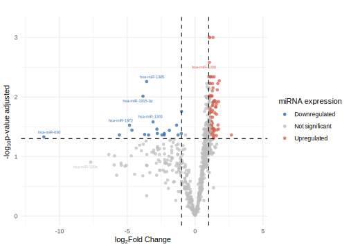<!-- -->

    ##   n_upregulated n_downregulated total_DEGs
    ## 1            79              19         98

### 6.2.2 Boxplots DEG miRNAs

Build in log scale or without? – Better in regular counts, it’s more
visual.

All together, ordered by logFC (-,+)

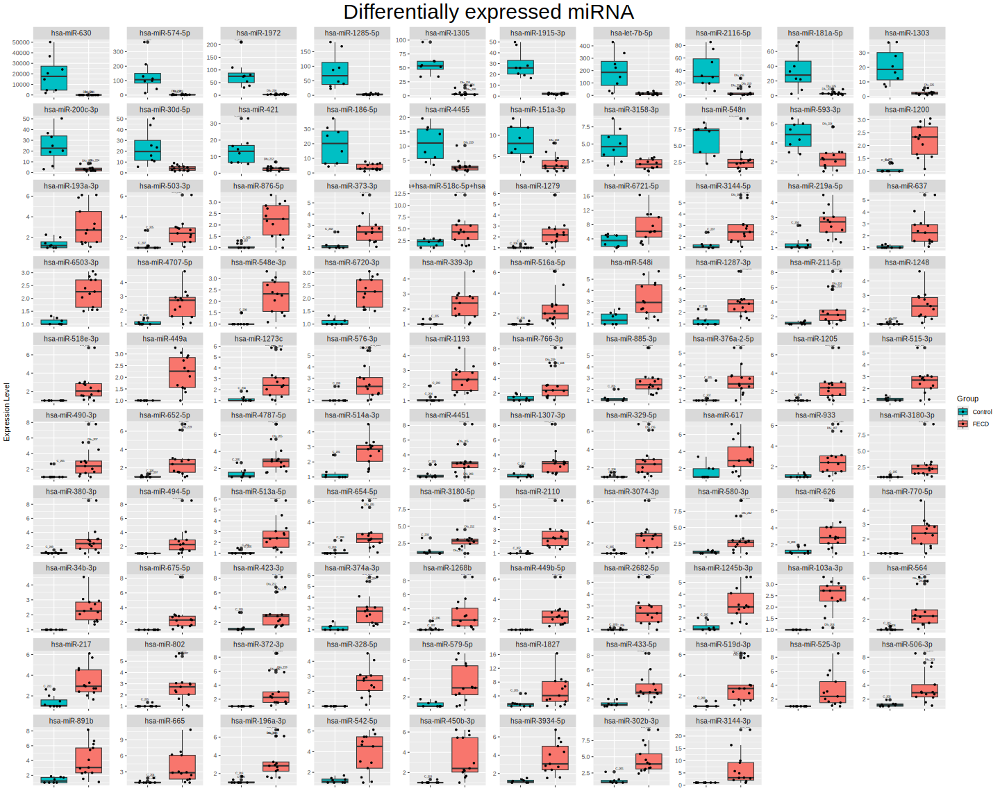<!-- -->

UP and DOWN separately.

``` r
for_plot_long <- for_plot %>% filter(logFC < 0)
ggplot(for_plot_long,  aes(x = Group, y = Expression, fill = Group)) +
  geom_boxplot(show.legend = T)+
  scale_fill_manual(values = c("Control" = "#00BFC4", "FECD" = "#F8766D")) +
  geom_jitter(position=position_jitter(0.3), cex=1) +
  geom_text(
    data = filter(for_plot_long, is_outlier), aes(label = Sample),
    position = position_jitter(width = 0.2), vjust = -1, size = 1.5,
    color = "black") +
  theme(axis.text.x = element_blank(),
        plot.title = element_text(size = 20, hjust = 0.5),
        strip.text = element_text(size = 10)) +
  labs(y = "Expression Level", x='', title = 'DEGs downregulated') +
  facet_wrap(~reorder(miRNA, logFC), scales = "free")
```

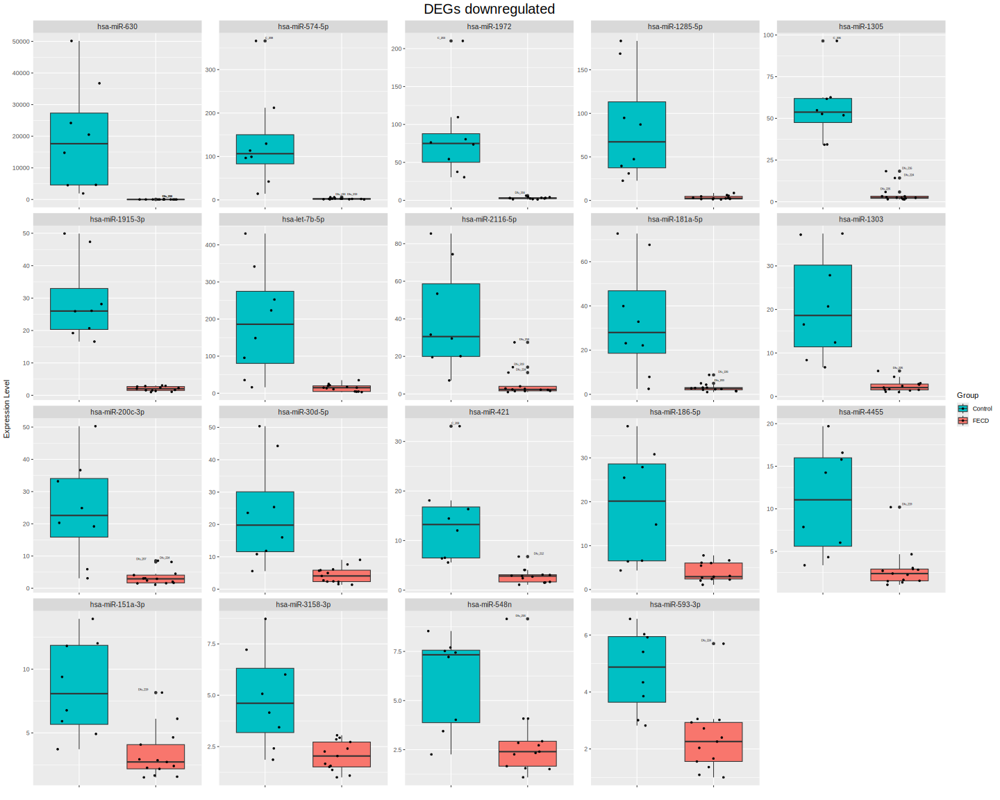<!-- -->

``` r
for_plot_long <- for_plot %>% filter(logFC > 0)
ggplot(for_plot_long,  aes(x = Group, y = Expression, fill = Group)) +
  geom_boxplot(show.legend = T)+
  scale_fill_manual(values = c("Control" = "#00BFC4", "FECD" = "#F8766D")) +
  geom_jitter(position=position_jitter(0.3), cex=1) +
  geom_text(
    data = filter(for_plot_long, is_outlier), aes(label = Sample),
    position = position_jitter(width = 0.2), vjust = -1, size = 1.5,
    color = "black") +
  theme(axis.text.x = element_blank(),
        plot.title = element_text(size = 20, hjust = 0.5),
        strip.text = element_text(size = 10)) +
  labs(y = "Expression Level", x='', title = 'DEGs upwnregulated') +
  facet_wrap(~reorder(miRNA, logFC), scales = "free")
```

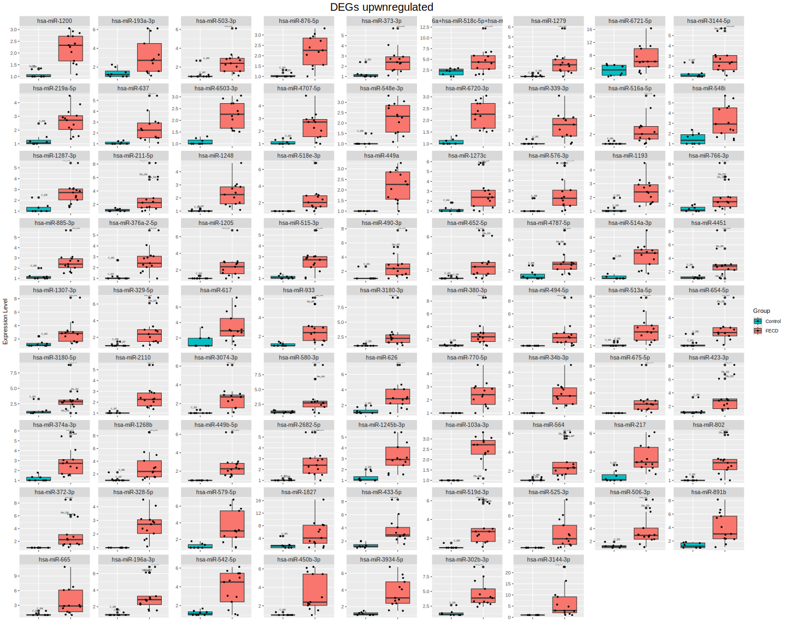<!-- -->

``` r
for_plot_long <- for_plot %>%
  group_by(miRNA, Sample) %>% arrange(desc(logFC)) %>% slice_head(n = 3) %>% ungroup() %>%
  bind_rows(
    for_plot %>% group_by(miRNA, Sample) %>% arrange(logFC) %>% slice_head(n = 3) %>% ungroup() ) %>% ungroup()
```

For article version

``` r
top_miRNA <- for_plot %>% distinct(miRNA, logFC) %>% arrange(desc(logFC)) %>%
  {bind_rows(slice_head(., n = 8), slice_tail(., n = 8))} %>% pull(miRNA)              

for_plot_long <- for_plot %>% filter(miRNA %in% top_miRNA)

ggplot(for_plot_long,  aes(x = Group, y = Expression, fill = Group)) +
  geom_boxplot(show.legend = T, outliers = F)+
  scale_fill_manual(values = c("Control" = "#00BFC4", "FECD" = "#F8766D")) +
  geom_jitter(position=position_jitter(width = 0.3, height = 0),  size = 0.7, shape = 16, alpha = 0.7 ) +
#   geom_text_repel(  
#     data = filter(for_plot_long, is_outlier),
#     aes(label = Sample),
#     size = 1.7, color = "black", box.padding = 0.1,   
#     point.padding = 0.3, min.segment.length = 0, segment.size = 0.3,      
#     segment.color = "grey50",
#     position = position_jitter(width = 0.2)) +
  theme(axis.text.x = element_blank(),
        axis.ticks.x = element_blank(),
        plot.title = element_text(size = 20, hjust = 0.5),
        strip.text = element_text(size = 7.2)) +
  labs(y = "Expression level (normalized counts)", x='') +
  facet_wrap(~reorder(miRNA, logFC), scales = "free") 
```

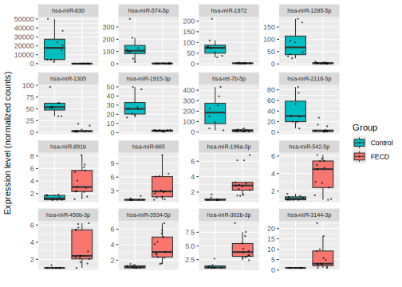<!-- -->

# 7 ⭐Comparison with DEGs from another article

Let’s compare our DEGs with the DEGs obtained earlier from another
article on miRNA in FECD ([Article
link](https://iovs.arvojournals.org/article.aspx?articleid=2128120)).
List of DEGs is in suppl materials. Also add a table with a list of
miRNAs from their array (TaqMan Open Array) and compare our arrays.

Are the data logarithmic? Let’s fix this I thought they were logarithmic
because there were negative values, but in fact this is not the case.

If FC = 0.5, that is, half as much, then it is the same as -2 times as
much, that is, FC -2. To obtain such a value, you need
$$negFC = -1 / FC$$To return them to the normal scale, i need to
$-1/negFC$.

We need to bring them into logFC, and our accounts into negFC, compare
both ways.

Let’s intersect their essays with ours, then their essays with the DEGs
from their article.

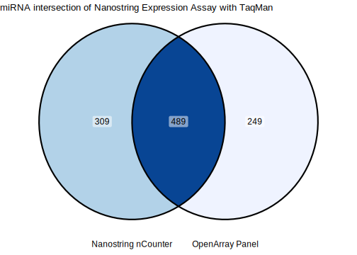<!-- -->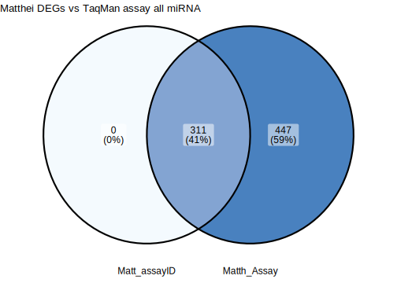<!-- -->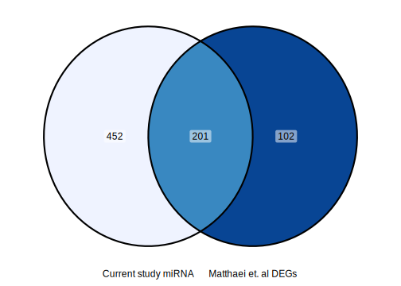<!-- -->

Intersection of our and their miRNA DEGs (100%)

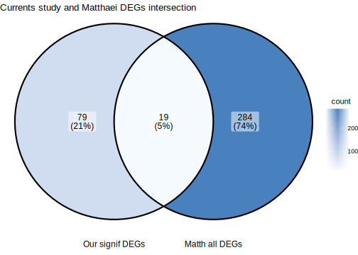<!-- -->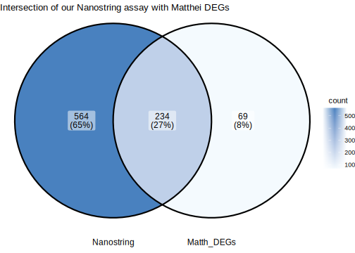<!-- -->

Fold change values distribution from both data.

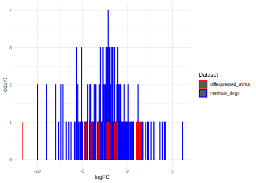<!-- -->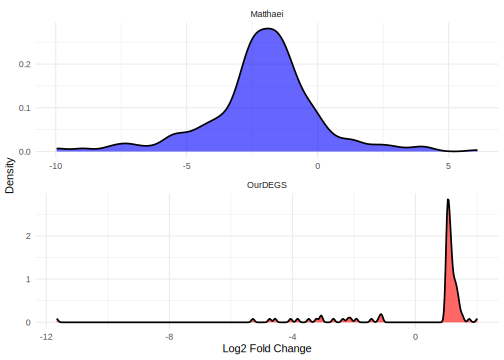<!-- -->

## 7.1 FC correlations scatter between Matt & Ours

Let us check whether the FCs of intersecting miRNAs correlate between
DEGs and between all occurrences.

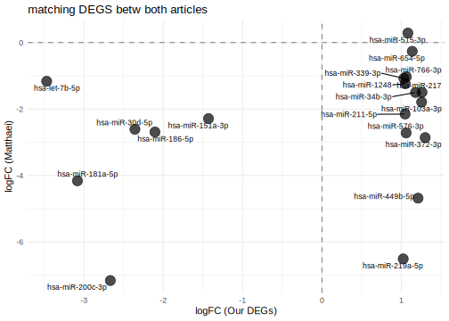<!-- -->

Let’s try to take **all of our FCs, not just DEGs,** and pull the values
​​from the T-test (not from the limma, because it calculates them more
cleverly). This way we will understand whether our data distributions
are the same. We expect that they are. Note mir-29.

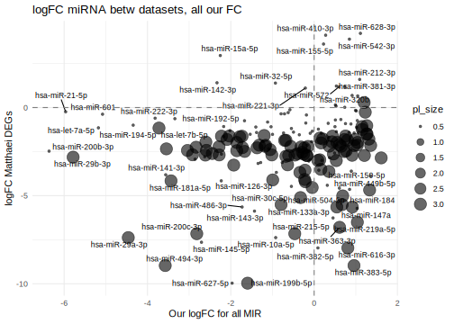<!-- -->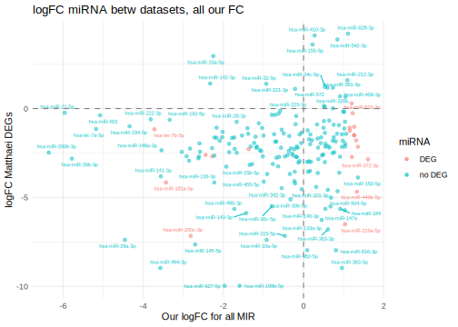<!-- -->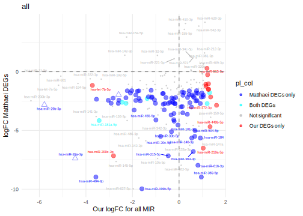<!-- -->

Let’s do it differently: ours - theirs: blue pink, deg not deg is form.
Let’s take only the significant deg from them.

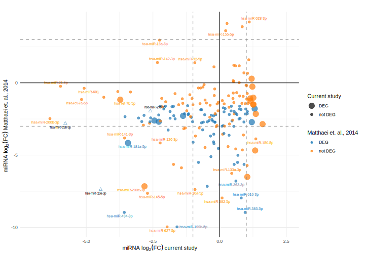<!-- -->

    ##             miRNA       lfc       t_pval   mean_f   mean_c       p_adj
    ## 1 hsa-miR-103a-3p  1.314362 2.624108e-06 2.486923  1.00000 0.000996178
    ## 2 hsa-miR-151a-3p -1.370282 4.947455e-03 3.313077  8.56500 0.029786902
    ## 3 hsa-miR-181a-5p -3.434795 1.200430e-02 3.106923 33.59750 0.043531963
    ## 4  hsa-miR-186-5p -2.279214 1.163295e-02 3.953846 19.19250 0.043531963
    ## 5  hsa-miR-30d-5p -2.444620 1.212039e-02 4.311538 23.47125 0.043531963
    ## 6  hsa-miR-576-3p  1.206243 4.681051e-03 2.670769  1.15750 0.029614539
    ##   Dataset.our FoldChange P.Value      miRNA_raw     trueFC     logFC Assay_ID
    ## 1     OurDEGS      -3.46   0.001    hsa-miR-103 0.28901734 -1.790772   000439
    ## 2     OurDEGS      -4.88   0.008 hsa-miR-151-3p 0.20491803 -2.286881   002254
    ## 3     OurDEGS     -17.86   0.001   hsa-miR-181a 0.05599104 -4.158660   000480
    ## 4     OurDEGS      -6.45   0.001    hsa-miR-186 0.15503876 -2.689299   002285
    ## 5     OurDEGS      -6.10   0.006    hsa-miR-30d 0.16393443 -2.608809   000420
    ## 6     OurDEGS      -6.58   0.043 hsa-miR-576-3p 0.15197568 -2.718088   002351
    ##   HGNC_name strand Well Number Well Name     Assay Name   Assay Target Sequence
    ## 1    MIR103     5P          56        C8    hsa-miR-103 AGCAGCAUUGUACAGGGCUAUGA
    ## 2    MIR151     3P         214       I22 hsa-miR-151-3p   CUAGACUGAAGCUCCUUGAGG
    ## 3   MIR181A     5P         104        E8   hsa-miR-181a AACAUUCAACGCUGUCGGUGAGU
    ## 4    MIR186     5P         111       E15    hsa-miR-186  CAAAGAAUUCUCCUUUUGGGCU
    ## 5    MIR30D     5P           5        A5    hsa-miR-30d  UGUAAACAUCCCCGACUGGAAG
    ## 6    MIR576     3P         309       M21 hsa-miR-576-3p  AAGAUGUGGAAAAAUUGGAAUC
    ##                       miRBase Alias   Plate Dataset.matt pl_size pl_col pl_mir
    ## 1 hsa-miR-103(16), hsa-miR-103a(17) Human A     Matthaei       5    DEG   <NA>
    ## 2                hsa-miR-151-3p(17) Human B     Matthaei       5    DEG   <NA>
    ## 3                  hsa-miR-181a(17) Human A     Matthaei       5    DEG   <NA>
    ## 4                   hsa-miR-186(17) Human A     Matthaei       5    DEG   <NA>
    ## 5                   hsa-miR-30d(17) Human B     Matthaei       5    DEG   <NA>
    ## 6                                NA Human A     Matthaei       5    DEG   <NA>
    ##   shape_mir
    ## 1        19
    ## 2        19
    ## 3        19
    ## 4        19
    ## 5        19
    ## 6        19

    ## # A tibble: 3 × 32
    ##   RNA   miRNA MIMAT_ID Correlation p_value  p_adj Ctrl.nar Ctrl.our FECD_exp.nar
    ##   <chr> <chr> <chr>          <dbl>   <dbl>  <dbl>    <dbl>    <dbl>        <dbl>
    ## 1 GBP4  hsa-… MIMAT00…      -0.786    0    0         0.346     1.90         3.75
    ## 2 PPP1… hsa-… MIMAT00…      -0.857    0.01 0.0193    8.23      7.08         5.89
    ## 3 SLC7… hsa-… MIMAT00…      -0.762    0    0         3.00      2.91         5.24
    ## # ℹ 23 more variables: FECD_noexp.nar <dbl>, FECD_exp.our <dbl>,
    ## #   FECD_noexp.our <dbl>, HCEC <dbl>, nar.fe <dbl>, nar.fne <dbl>,
    ## #   HCEC.fe <dbl>, HCEC.fne <dbl>, check_HCEC <chr>, dups_miRNA <int>,
    ## #   dups_mimat <int>, HGNC_name <chr>, mir_strand <chr>, seqnames <fct>,
    ## #   start <int>, end <int>, width <int>, strand <fct>, type <fct>, ID <chr>,
    ## #   Name <chr>, Derives_from <chr>, uniq_pos <chr>

compare FC from limma vs FC from classic way. – They’re almost the same.

``` r
for_plot <- left_join(deg_limma, deg_ttest , by='miRNA') %>% 
  rename(manual_FC = lfc, limma_FC = logFC) %>% pivot_longer(cols = c(manual_FC, limma_FC), names_to = 'Test', values_to = 'logFC') 

ggplot(for_plot, aes(x=reorder(miRNA, logFC), y=(logFC), fill=Test)) +
  geom_col(position = position_dodge(width = 0.8), width = 0.7)
```

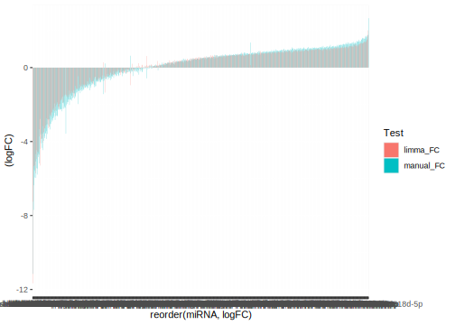<!-- -->

``` r
ggplot(for_plot, aes( x=(logFC), fill=Test)) + geom_density(alpha=0.4)
```

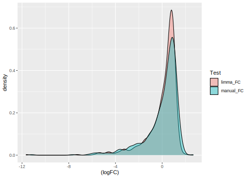<!-- -->

# 8 Сonfirm the expression through CPM

Let’s confirm expression using CPM: plot a scatterplot of the
correlation between counts (not just DEGs) from the assay and counts
from CPM. If it’s positive, the counts are not artifactual.

CPM contains some values ​​for both the miRNA and its gene (HG - host
gene). We’ll look at the expression of the host genes present in our
dataset. We need to plot this on all miRNAs, not just HG.

### 8.0.1 All our host genes in CPM corrs

``` r
cpm.symbol <- readRDS("/data7a/bio/human_genomics/fuchs_dystrophy/illumina/Fuchs_transcriptomes/analysis/transcript_analysis/RDS/expression/cpm.symbol_list.RDS")
cpm.symbol <- cpm.symbol[[1]] %>% dplyr::select(-c('C_209', 'C_210', 'C_211','Dfu_209', 'Dfu_223', 'Dfu_210'))

grep("MIR", rownames(cpm.symbol), value = TRUE)
```

    ##  [1] "MIR100HG"    "MIR124-1HG"  "MIR130AHG"   "MIR181A1HG"  "MIR1915HG"  
    ##  [6] "MIR210HG"    "MIR222HG"    "MIR223HG"    "MIR22HG"     "MIR23AHG"   
    ## [11] "MIR29B2CHG"  "MIR30DHG"    "MIR34AHG"    "MIR3648-2"   "MIR3681HG"  
    ## [16] "MIR3936HG"   "MIR4435-2HG" "MIR4453HG"   "MIR4458HG"   "MIR600HG"   
    ## [21] "MIR646HG"    "MIR663A"     "MIR663AHG"   "MIR99AHG"    "MIRLET7A1HG"
    ## [26] "MIRLET7BHG"  "MIRLET7IHG"

``` r
cpm.symbol_hg <- cpm.symbol
cpm.symbol_hg <- cpm.symbol_hg[grep("MIR", rownames(cpm.symbol_hg)) ,]
# похожа ли mir с её HG? - Да, remove it
cor(as.numeric(cpm.symbol_hg['MIR663A', ]), as.numeric(cpm.symbol_hg['MIR663AHG', ]))
```

    ## [1] 0.9704288

``` r
cpm.symbol_hg <- cpm.symbol_hg[rownames(cpm.symbol_hg) != "MIR663A", , drop = F]

rownames(cpm.symbol_hg) <- str_remove(rownames(cpm.symbol_hg), "HG")
```

What are the Host Genes on matthaei degs mRNA in our CPMs?

``` r
intersect(matthaei_degs$HGNC_name, rownames(cpm.symbol_hg))
```

    ##  [1] "MIR100"  "MIR130A" "MIR210"  "MIR22"   "MIR222"  "MIR223"  "MIR23A" 
    ##  [8] "MIR30D"  "MIR34A"  "MIR646"  "MIR99A"

Plot of all intersecting miRNAs (not just DEGs) in the Nanostring chip
and their host gene from CPM with lm line and spearman correlation

log CPM vs de-log miRNA counts

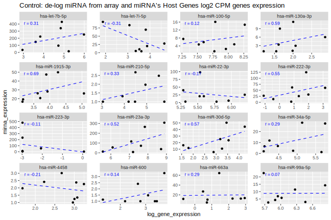<!-- -->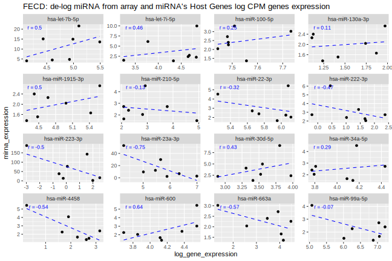<!-- -->

### 8.0.2 all our mirtrones

### 8.0.3 Our DEGs mirtrones expression corr

Let’s build the same thing, but using our DEGs and their mirtrons, not
all host genes. LogFC order is (-inf, +inf).

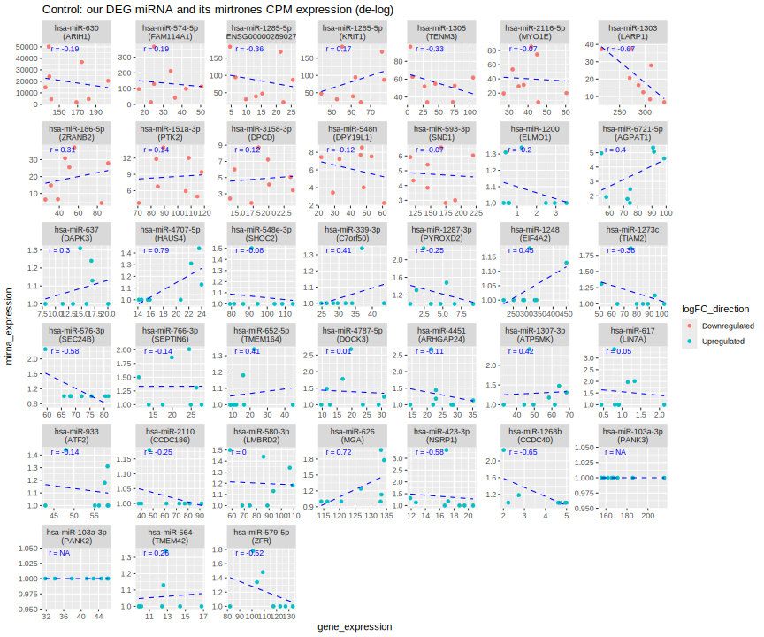<!-- -->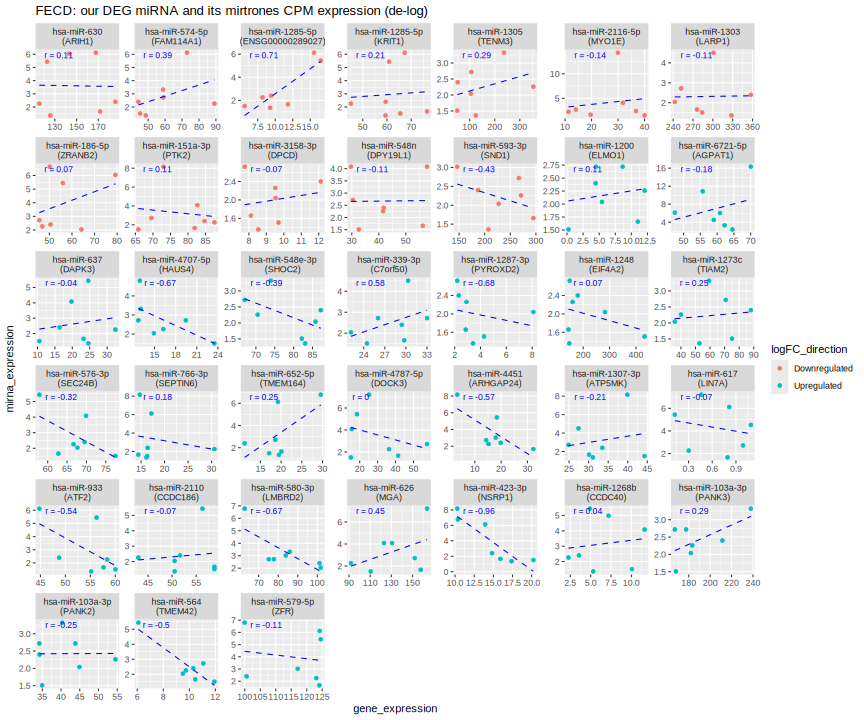<!-- -->

Let’s make a cropped chart with correlations for the article ~ 8x8.

``` r
# title="FECD: our DEG miRNA and its mirtrones CPM expression (de-log)"

selected_groups <- for_plot_long %>%
  group_by(MIR_gene) %>%
  summarise(mean_logFC = mean(logFC, na.rm = TRUE)) %>%
  arrange(desc(mean_logFC)) %>%
  {bind_rows(slice_head(., n = 8), slice_tail(., n = 8))} %>%
  pull(MIR_gene) %>% as.character()

for_plot_long2 <- for_plot_long %>% filter(MIR_gene %in% selected_groups)


ggplot(for_plot_long2, aes(x=gene_expression, y= mirna_expression, color = logFC_direction)) + 
  geom_point() +
  facet_wrap(~MIR_gene, scales = 'free') +
  geom_smooth(method = "lm", se = F, color = "blue", linewidth=0.5, linetype='dashed') +
  geom_text(data = cor_data %>% filter(MIR_gene %in% for_plot_long2$MIR_gene), 
    aes(x = x_pos, y = y_pos, label = cor_label),
    color = "blue", size = 3, hjust = -0.3, vjust = 1.4) +
  
  labs(y='miRNA expression in normalized counts', x='Gene expression in CPM',
       color = "DE miRNA") + 
  theme(legend.position = "bottom",
       legend.box = "horizontal")
```

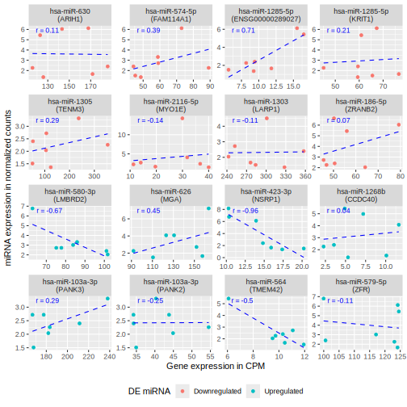<!-- -->

Correlations Fecd, Control on same plot

``` r
for_plot_long <- for_plot %>%
  mutate(group = if_else(str_detect(Sample_name, "C"), "Control", "FECD"))

cor_data <- for_plot_long %>%
  group_by(MIR_gene, group) %>%
  summarise(
    cor = cor(gene_expression, mirna_expression, method = "spearman"),
    cor_label = paste0("r = ", round(cor, 2)),
    .groups = 'drop'
  ) %>%
  mutate(x_pos = -Inf,  y_pos = Inf)


ggplot(for_plot_long, aes(x = gene_expression, y = mirna_expression)) + 
  geom_point(aes(color = group, shape = logFC_direction), 
             size = 3, alpha = 0.7) + 
  
  geom_smooth(aes(color = group, linetype = group), 
              method = "lm", se = FALSE, linewidth = 0.8) +
  
  # Подписи корреляций
  geom_text(data = cor_data, 
            aes(x = x_pos, y = y_pos, label = cor_label, color = group),
            hjust = -0.1, vjust = 1.5, size = 3.5, show.legend = FALSE) +
  
  scale_color_manual(values = c("Control" = "#1f77b4", "FECD" = "#ff7f0e")) +
  scale_shape_manual(values = c("Upregulated" = 16, "Downregulated" = 17)) +
  scale_linetype_manual(values = c("Control" = "dashed", "FECD" = "dashed")) +
  
  labs(
    title = "miRNA vs Gene Expression Correlation",
    subtitle = "Control (blue) vs FECD (orange) groups",
    x = "Gene Expression (CPM)",
    y = "miRNA Expression",
    color = "Group",
    shape = "LogFC Direction",
    linetype = "Group"
  ) +
  theme_bw() +
  theme(
    strip.text = element_text(size = 9),
    legend.position = "bottom",
    legend.box = "horizontal",
    panel.grid.minor = element_blank()
  ) +
  guides(
    color = guide_legend(order = 1),
    shape = guide_legend(order = 2),
    linetype = guide_legend(order = 1)) +
      facet_wrap(~ MIR_gene, scales = 'free') 
```

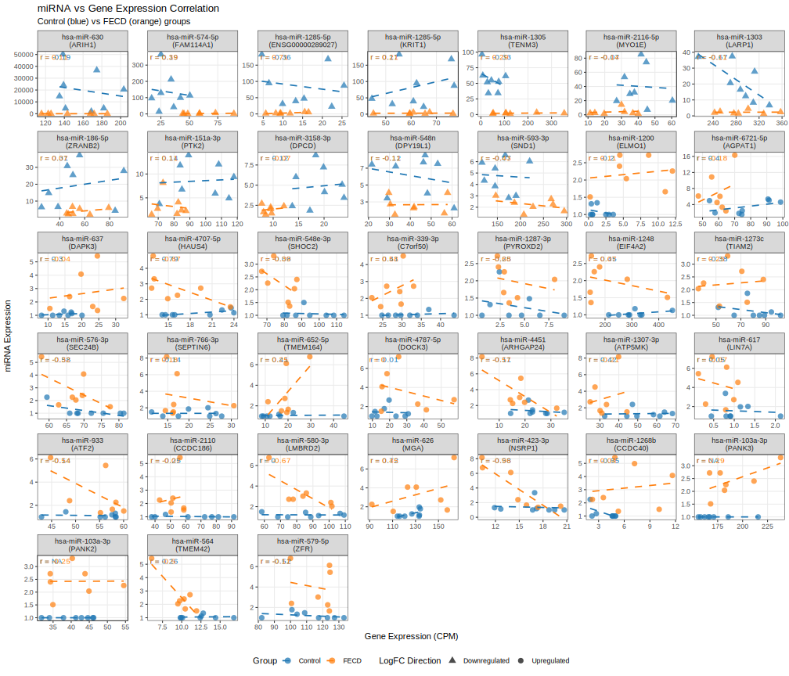<!-- -->

Также построим бокспоты по каждой миРНК с экспрессией семплов в чипе и
CPM в лог и не лог.

Теперь по Fecd

## 8.1 CPM Boxplots for DEGs: our, nar

We need to build boxes only for DEGs: separately for our up and down and
for the Nar set. For each up: our Fecd, Control; Nar’s Fecd, Control,
for a total of 4 boxes.

> Для наши х ап и даун отдельно бокс плот наш fexd, наш контрол, нар
> фекд, нар контроль прекурсора

``` r
nar <- readRDS("/data7a/bio/human_genomics/fuchs_dystrophy/illumina/Fuchs_transcriptomes/analysis/transcript_analysis/RDS/expression/cpm.symbol_list.RDS")
nar <- nar[[3]] 

grep("MIR", rownames(nar), value = TRUE)
```

    ##  [1] "MIR100HG"    "MIR1915HG"   "MIR210HG"    "MIR22HG"     "MIR23AHG"   
    ##  [6] "MIR29B2CHG"  "MIR30DHG"    "MIR34AHG"    "MIR3648-2"   "MIR3681HG"  
    ## [11] "MIR3936HG"   "MIR4435-2HG" "MIR4453HG"   "MIR4458HG"   "MIR600HG"   
    ## [16] "MIR646HG"    "MIR663A"     "MIR663AHG"   "MIR99AHG"    "MIRLET7A1HG"
    ## [21] "MIRLET7BHG"  "MIRLET7IHG"

``` r
nar <- nar[grep("MIR", rownames(nar)) ,]
# похожа ли mir с её HG? - Да, remove it
cor(as.numeric(nar['MIR663A', ]), as.numeric(nar['MIR663AHG', ]))
```

    ## [1] 0.944541

``` r
nar_hg <- nar[rownames(nar) != "MIR663A", , drop = F]

# оставим для добавление 2х мирнк генов
rownames(nar_hg) <- str_remove(rownames(nar_hg), "HG")
```

Not all host genes are in CPM, but many miRNAs don’t have their own gene
because they are mirtrones, meaning their host gene is some
protein-coding gene. I previously intersected them with bedtools, so now
let’s try using these genes. Let’s add a strand-specific bed with such
intersections: `annot_chipdf_genes_s_y.bed`. There’s a transcript level
there, and it would be better to select its sum as gene expression
values, but this is probably fine.

Конечно мы потеряем -5P/3P, тк будем вытягивать по HGNC названию

те 2 найденные в спм плотить отдельно или как-либо встроить сюда? Те 2
ДЭГ мирнки, на которых есть host gene в полученной таблице отсутствуют.
сначала к ней подтянуть, а потом к остальным миртроны. добавил вручную
их HG

попробуем сразу сделать cpm с нужными генами

``` r
# colors for box
my_colors <- c("nar control" = "#338050", "nar fecd" = "#A83232", "our control" = "#78C679", "our fecd" = "#FF6B6B")

# all mirtrones
for_plot <- diffexpressed_mirna_HGNC %>% 
  left_join(
    mirtrones %>% select(gene_name, gene_name_mir), by = c('HGNC_symbol' = 'gene_name_mir')) %>% 
  #filter(!is.na(gene_name)) %>% 
  rename(in_gene = gene_name) %>% 
  mutate(
    in_gene = case_when(
      HGNC_symbol == "MIR1915" ~ "MIR1915HG", 
      HGNC_symbol =="MIR30D" ~ "MIR30DHG", 
      TRUE ~ in_gene)) %>% 
  left_join(nar %>% rownames_to_column('in_gene'), by='in_gene') %>% 
  left_join(cpm.symbol %>% rownames_to_column('in_gene'), by='in_gene') %>% 
  left_join(diffexpressed_mirna %>% select(miRNA, logFC), by='miRNA') %>% 
  filter(!is.na(in_gene)) %>% filter(!is.na(Ctrl0)) %>%  # убрать которых нет в спм 
  mutate(MIR_gene = str_glue("{miRNA}\n({in_gene})"))
```

Пересечём с mimat миртронами. плохо, что я не добавил оба mimat id когда
пересекал.

Есть ли среди наших ДЭГов разные миРНК, которые лежат внутри одинакового
гена – есть 1 миРНК, с разным суффиксом -5р\3р. Есть ли миРНК, которые
лежат внутри нескольких генов?

``` r
for_plot <- diffexpressed_mirna_HGNC %>% 
  left_join(
    mirtrones_mimat %>% select(gene_name, gene_id_mir, seqnames), by = c('miRNA' = 'gene_id_mir')) %>% 
  #filter(!is.na(gene_name)) %>% 
  rename(in_gene = gene_name) %>% 
  mutate(
    in_gene = case_when(
      HGNC_symbol == "MIR1915" ~ "MIR1915HG", 
      HGNC_symbol =="MIR30D" ~ "MIR30DHG", 
      TRUE ~ in_gene)) %>% 
  left_join(nar %>% rownames_to_column('in_gene'), by='in_gene') %>% 
  left_join(cpm.symbol %>% rownames_to_column('in_gene'), by='in_gene') %>% 
  left_join(diffexpressed_mirna %>% select(miRNA, logFC), by='miRNA') %>% 
  filter(!is.na(in_gene)) %>% filter(!is.na(Ctrl0)) %>%  # убрать которых нет в спм 
  mutate(MIR_gene = str_glue("{miRNA}\n({in_gene})"))


# same genes
for_plot %>% group_by(in_gene) %>% summarise(
    unique_mirna_count = n_distinct(miRNA))  %>%
  filter(unique_mirna_count > 1) #%>% DT::datatable(caption = "Mirtrone genes with multiple miRNA in them")
```

    ## # A tibble: 0 × 2
    ## # ℹ 2 variables: in_gene <chr>, unique_mirna_count <int>

``` r
for_plot %>% group_by(miRNA) %>% summarise(
    unique_mirna_count = n_distinct(in_gene))  %>%
  filter(unique_mirna_count > 1) #%>% DT::datatable(caption = "MIR found in multiple genes")
```

    ## # A tibble: 2 × 2
    ##   miRNA           unique_mirna_count
    ##   <chr>                        <int>
    ## 1 hsa-miR-103a-3p                  2
    ## 2 hsa-miR-1285-5p                  2

``` r
# rm 
for_plot <- for_plot %>% filter(!(miRNA %in% c('hsa-miR-103a-3p', 'hsa-miR-1285-5p')))
```

**Разделим по значению logFC:**

- UP – В Fecd её больше, чем в Control

- DOWN - в Control больше чем в Fecd

- Следовательно host genes миртронов должны обладать той же зависимостью

Поменять шкалу free на фикс

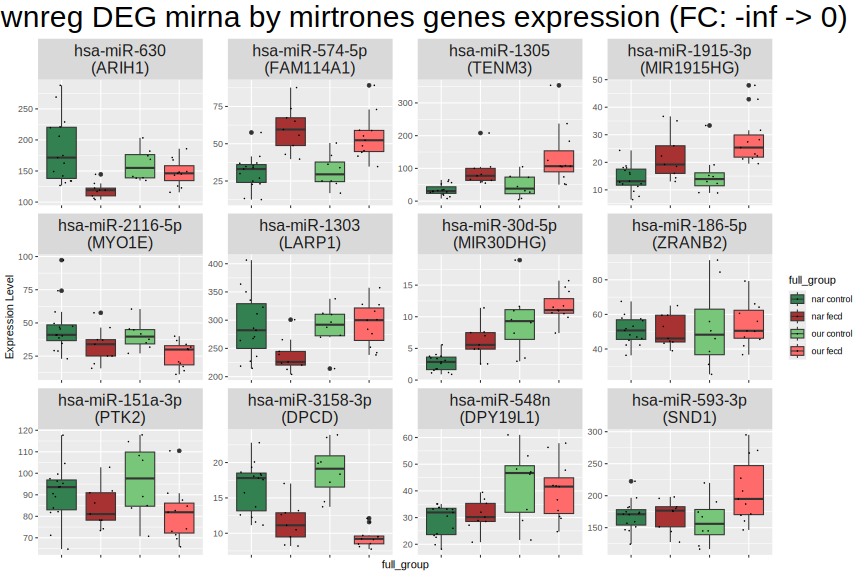<!-- -->

Up. (сделать тут от inf до 0)

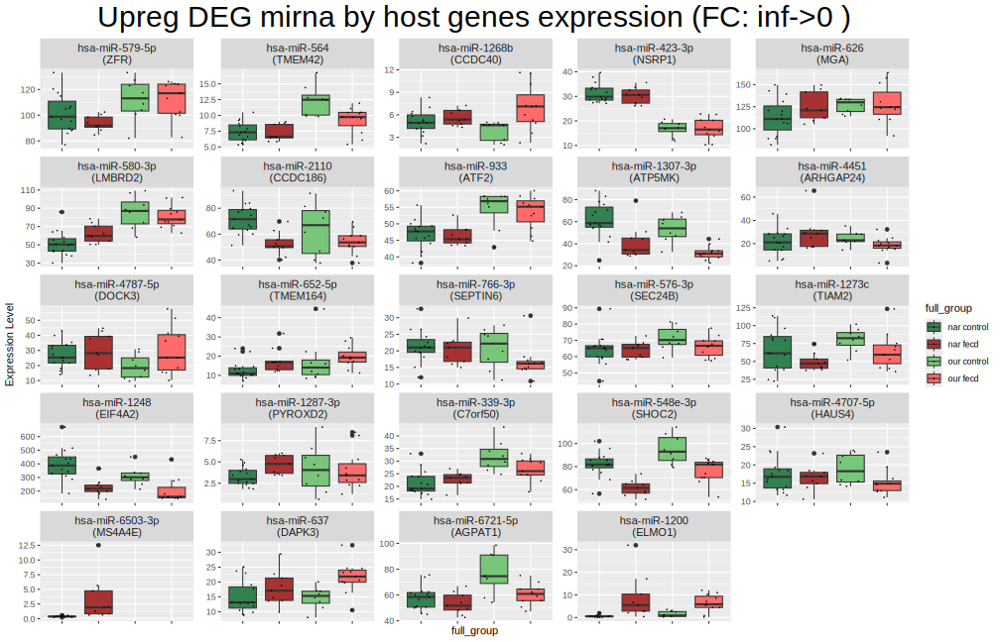<!-- -->

сделаем все для статьи на 1 картинке снова 8х8

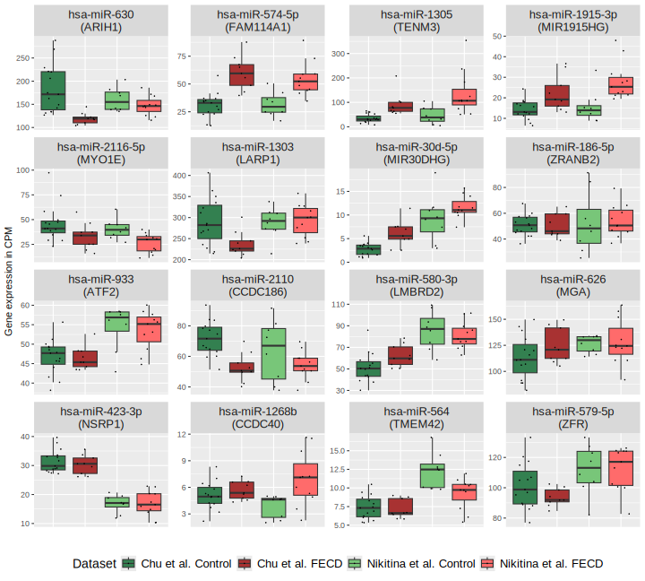<!-- -->

``` r
for_plot_long <- for_plot_long %>%
  mutate(
    GroupSet = ifelse(MIR_gene %in% head(facet_order, 8), "Bottom 8", "Top 8")
  )

ggplot(for_plot_long, aes(x = Dataset, y = expression, fill = Dataset)) +
  geom_boxplot(outliers = F) +
  geom_jitter(position = position_jitter(0.3), size = 0.1) +
  scale_fill_manual(values = my_colors) +
  facet_grid(GroupSet ~ MIR_gene, scales = "free", space = "free_x") +
  labs(y = "Gene expression in CPM", x='') +
  theme(
    axis.text.x = element_blank(), 
    axis.ticks.x = element_blank(),
    plot.title = element_text(size = 30, hjust = 0.5),
    strip.text = element_text(size = 13), 
    legend.position = "bottom", 
    legend.text=element_text(size=13),
    legend.title=element_text(size=14),
    legend.box = "horizontal"
  )
```

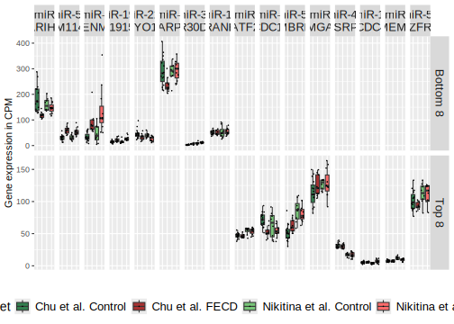<!-- -->

# 9 Проверим FC дэгов наши и из статьи на CPM сетах

Сравниваем FC их DEG мирнк с экспрессией их миртрон-генов (которые я
получил пересечением bed) в обоих датасетах: nar, our. Так мы сможем
понять, насколько их Fold Change коррелируют с нашими данными. То же
самое потом и на наших DEG.

Добавим к названиям генов из статьи экспрессию их генов. Сначала я
добавлял из пересечения нашей таблицы против аннотации без миРНК, потом
я отдельно пересёк с ней миРНК гены из статьи, получились те же гены,
хотя в пересечении с аннотацией было всего 80/120 вхождений.

    ## # A tibble: 27 × 2
    ##    in_gene unique_mirna_count
    ##    <chr>                <int>
    ##  1 AATK                     2
    ##  2 AOPEP                    4
    ##  3 ATP11C                   2
    ##  4 BLACAT1                  2
    ##  5 C7orf50                  2
    ##  6 CCPG1                    2
    ##  7 CLCN5                    9
    ##  8 COL27A1                  2
    ##  9 COPZ1                    2
    ## 10 CTDSP1                   2
    ## # ℹ 17 more rows

    ## [1] 28.61736 47.58842 98.07074

Сложность:

- В миртронах matthaei есть много миРНК на 1 ген. По-хорошему тут нужно
  считать CPM на уровень транскриптов, но думаю будет ок если мы
  посчитаем их с равной экспр.

- Также есть миРНК, сидящая в нескольких генах, ака местах генома, что с
  ней делать? – Думаю просто выбросить, тк мы не сможем однозначно
  соопоставить её с несколькими генами.

## 9.1 Matthaei DEGS

### 9.1.1 mat mirtrones

Из-за повторяющихся хостов для нескольких миРНК факторные ранги
неверные, нужно сделать численно.

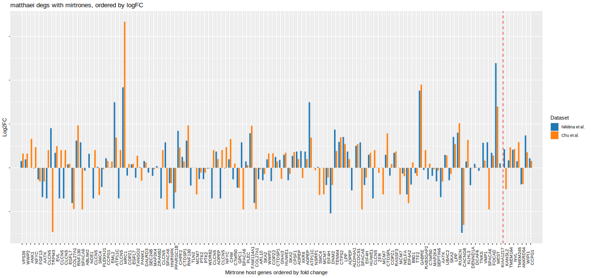<!-- -->

пресекающиеся ДЭГи у нас и у Matth

``` r
for_plot_long <- for_plot %>% filter(miRNA %in% diffexpressed_mirna$miRNA) %>% 
  arrange(logFC) %>% 
  rownames_to_column('fc_rank2') %>% 
  mutate(fc_rank2 = as.numeric(fc_rank2)) %>% 
  select(miRNA, in_gene, our_logFC, logFC, nar_logFC, fc_rank2) %>%
  
  pivot_longer(
    cols = c(our_logFC, logFC, nar_logFC),
    names_to = "dataset",
    values_to = "logFC") %>%
  mutate(dataset = factor(dataset,
                          levels = c("our_logFC", "logFC", "nar_logFC"),
                          labels = c("Our Data", "Mat Data", "Nar Data"))) %>% 
  filter(dataset %in% c('Nar Data','Our Data'))

first_positive_gene <- 6.5

ggplot(for_plot_long, aes(x = fc_rank2, y = logFC, fill = dataset)) +
 geom_col(position = position_dodge(width = 0.8), width = 0.7) + 
  theme(axis.text.x = element_text(angle = 90, size = 15)) +
  geom_vline(xintercept = first_positive_gene, linetype = "dashed", color = "red") +
  scale_x_continuous(
    breaks = for_plot_long$fc_rank2,
    labels = for_plot_long$in_gene,
    expand = c(0.02, 0.02) )+
  labs(title = 'intersected matthaei degs with mirtrones, ordered by logFC') +
  scale_fill_manual(
    name = "Dataset", values = c("Our Data" = "#1f77b4", "Nar Data" = "#ff7f0e"), 
    labels = c("Our Data" = "Nikitina et al.", "Nar Data" = "Chu et al.") )
```

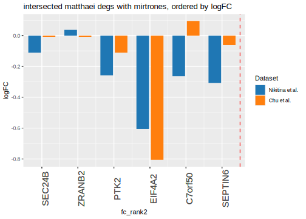<!-- -->

проверим по спм тоже самое, вдруг на наих логФС попадаются обравки
генов, мелкие кусочки, нужно понять порядок спм каунтов, тк лфс нам
этого не скажет

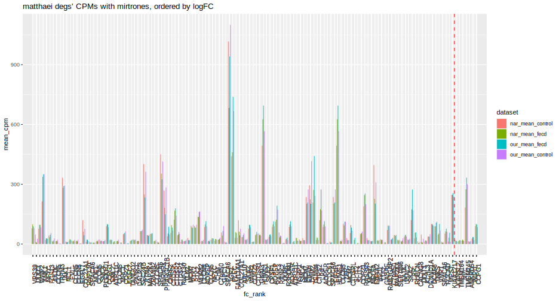<!-- -->

### 9.1.2 matt hg genes

По HG, пересекающимся с matthe,обяз добавить перевал через 0 или
подписать тупо.

matthaei degs with Host genes, ordered by logFC

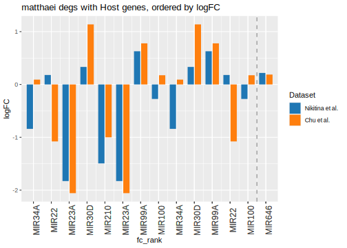<!-- -->

и то же самое по нашим мирнк FC

## 9.2 Our signif degs mirtrones + HG genes

сразу +2 HG. мб убрать забор, отсечь мелкий logFC. Тут сразу

Построим такой же график по миртронам и HG генам для наших ДЭГ миРНК.

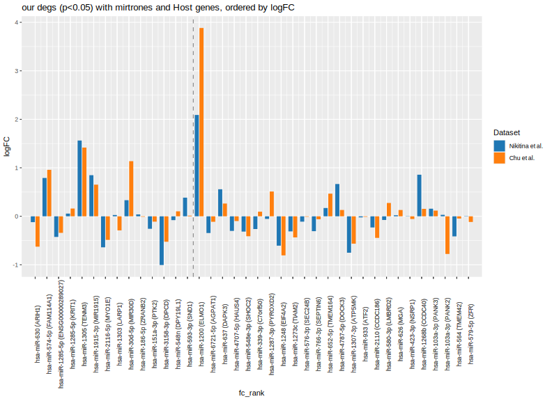<!-- -->

проверим по спм тоже самое, вдруг на наих логФС попадаются обравки
генов, мелкие кусочки, нужно понять порядок спм каунтов, тк лфс нам
этого не скажет

итог: гены родительские мирнк не смещены нив хай ни в даун

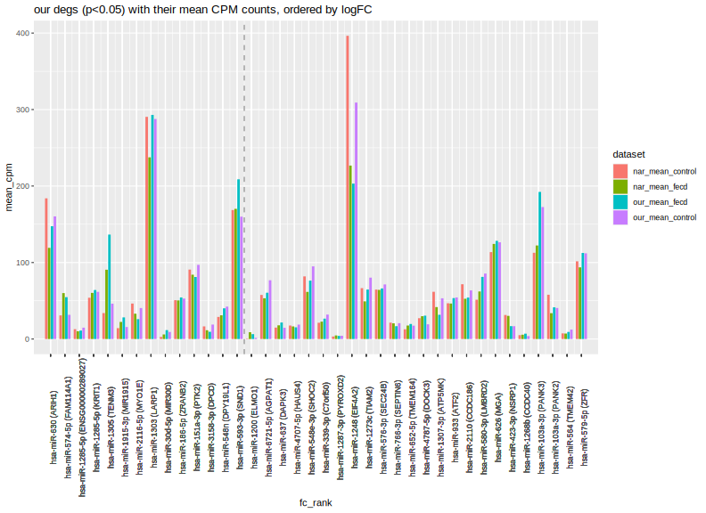<!-- -->

Вывод: не коррелируют с эксроессией чипа, сложности с определением похо

``` r
for_plot %>% group_by(in_gene) %>%    summarise(
    unique_mirna_count = n_distinct(miRNA))  %>%
  filter(unique_mirna_count > 1)
```

    ## # A tibble: 0 × 2
    ## # ℹ 2 variables: in_gene <chr>, unique_mirna_count <int>

``` r
for_plot %>% group_by(in_gene) %>%    summarise(
    unique_gene_count = n_distinct(in_gene))  %>%
  filter(unique_gene_count > 1)
```

    ## # A tibble: 0 × 2
    ## # ℹ 2 variables: in_gene <chr>, unique_gene_count <int>

# 10 Check -5P/3P array expression difference

Проверим есть ли разница в экспрессии у миРНК у Control, Fecd, построим
боксплоты по каждому.

Видим, что у fecd большая часть положительно скоррелирована, а Control
-50\50.

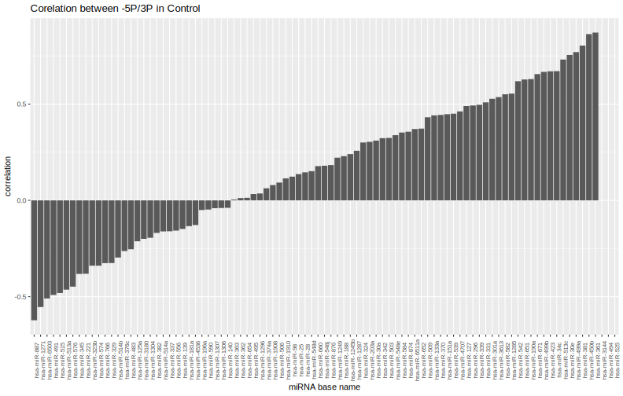<!-- -->

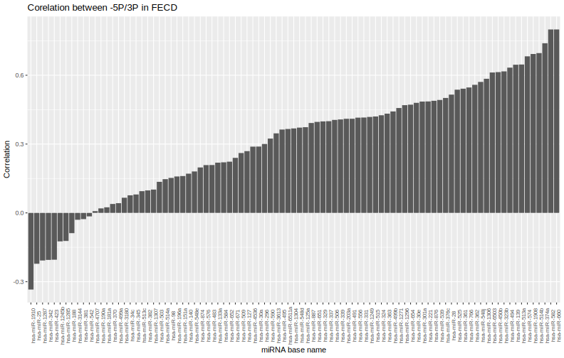<!-- -->

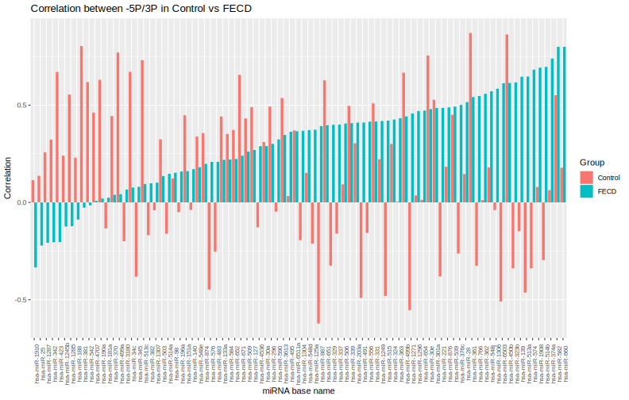<!-- -->

# 11 miR-29 analysis

уровни разбросов mir29 боксплоты (3х2), не прошли pvalue

``` r
for_plot <- norm_data_cleaned[grep('hsa-miR-29[abc]', rownames(norm_data_cleaned)), ] %>%
  rownames_to_column("miRNA") %>% 
  pivot_longer(cols = -miRNA, names_to = "Sample", values_to = "Expression") %>% 
  mutate(Group = case_when(
    str_detect(Sample, "C") ~ "Control",
    str_detect(Sample, "D") ~ "FECD")) %>% left_join(diffexpressed_mirna, by='miRNA') 

ggplot(for_plot,  aes(x = Group, y = Expression, fill = Group)) +
  geom_boxplot(show.legend = T)+
  scale_fill_manual(values = c("Control" = "#00BFC4", "FECD" = "#F8766D")) +
  geom_jitter(position=position_jitter(0.3), cex=1) +
    theme(axis.text.x = element_blank(),
        plot.title = element_text(size = 30, hjust = 0.5),
        strip.text = element_text(size = 10)) +
  labs(
    #title = expression("Differentially expressed miRNA (" * log[2] * ")"),
    #title = "Differentially expressed miRNA",
    #y = expression(Log[2]~"Expression Level"), x='') +
    y = "Expression Level", x='') +
  facet_wrap(~reorder(miRNA, logFC), scales = "free")
```

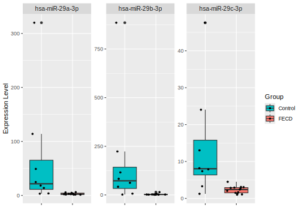<!-- -->

мир29 депрессед, таргеты её шарашат, как и в той статье.

разделение fecd/c

``` r
v <- c('COL1A1', 'COL4A1', 'LAMC1')
for_plot <- bind_rows(
    cpm.symbol %>% rownames_to_column('gene') %>% filter(gene %in% v) %>% 
        pivot_longer(cols = -gene, names_to = 'Sample', values_to = 'Expression') %>% 
        mutate(Dataset = 'Nikitina et al.'),
    nar %>% rownames_to_column('gene') %>% filter(gene %in% v) %>% 
        pivot_longer(cols = -gene, names_to = 'Sample', values_to = 'Expression') %>% 
        mutate(Dataset = 'Chu et al.')
) %>% 
    mutate(
    Group = case_when(
      grepl("^Ctrl|^C_", Sample) ~ "Control",
      grepl("^FECD|^Dfu", Sample) ~ "FECD",
      TRUE ~ NA_character_),
    Dataset_Group = interaction(Dataset, Group))

ggplot(for_plot, aes(x=Dataset, y=Expression, fill = Group))    + geom_boxplot(outliers = F) + 
    geom_jitter( position = position_jitterdodge(  jitter.width = 0.2,
      jitter.height = 0,    # Вертикальный разброс (0 = нет)
      dodge.width = 0.8     # Совпадает с position_dodge для boxplot
    ), size=0.2, alpha = 0.7)+ 
    scale_fill_manual(values = c("Control" = "#00BFC4", "FECD" = "#F8766D")) +
    facet_wrap(~gene, scales = 'free') +
  labs(y = "Expression level (normalized counts)", x='')
```

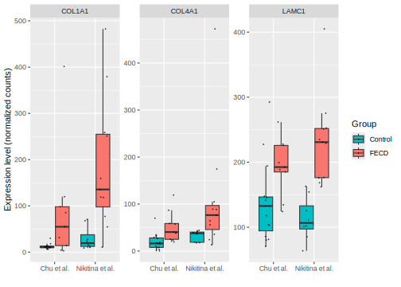<!-- -->

пока что результаты согласуются - мир29 репрессирована в фекд, а её
таргеты (которые они привели) обладают повышенной экспрессией. какие
есть ещё потенциальные таргеты? их под 600, там есть почти все колы,
можно плотнуть по ним.

``` r
targets_table <- readRDS("/data7a/bio/human_genomics/fuchs_dystrophy/nanostring/analisys/RDS/targetsV10.RDS") %>% filter(`Support Type` != "Functional MTI (Weak)" & `Support Type` != "Non-Functional MTI (Weak)") %>% distinct()
```

all cols targets.

``` r
col_targets <- targets_table %>% filter(str_detect(miRNA, 'hsa-miR-29[abc]'), str_detect(`Target Gene`, '^COL' )) %>% pull(`Target Gene`)
for_plot <- bind_rows(
    cpm.symbol %>% rownames_to_column('gene') %>% filter(gene %in% col_targets) %>% 
        pivot_longer(cols = -gene, names_to = 'Sample', values_to = 'Expression') %>% 
        mutate(Dataset = 'Nikitina et al.'),
    nar %>% rownames_to_column('gene') %>% filter(gene %in% col_targets) %>% 
        pivot_longer(cols = -gene, names_to = 'Sample', values_to = 'Expression') %>% 
        mutate(Dataset = 'Chu et al.')
) %>% 
    mutate(
    Group = case_when(
      grepl("^Ctrl|^C_", Sample) ~ "Control",
      grepl("^FECD|^Dfu", Sample) ~ "FECD",
      TRUE ~ NA_character_))

ggplot(for_plot, aes(x=Dataset, y=Expression, fill = Group))    + geom_boxplot(outliers = F) + 
    #geom_jitter(aes(fill = Group), position = position_jitterdodge(  jitter.width = 0.2, jitter.height = 0, dodge.width = 0.8), size=0.2, alpha = 0.7) +
    scale_fill_manual(values = c("Control" = "#00BFC4", "FECD" = "#F8766D")) +
    facet_wrap(~gene, scales = 'free') 
```

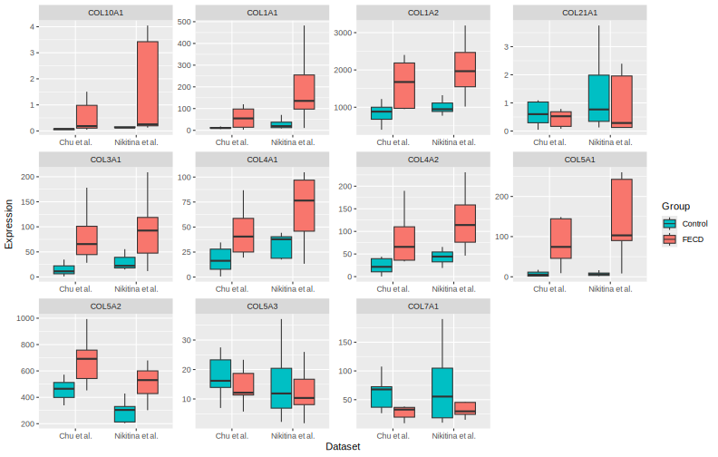<!-- -->

объединим из статьи + коллагены

``` r
col_targets <- targets_table %>% filter(str_detect(miRNA, 'hsa-miR-29[abc]'), str_detect(`Target Gene`, '^COL' )) %>% pull(`Target Gene`) 

col_targets <- append(col_targets, 'LAMC1')

for_plot <- bind_rows(
    cpm.symbol %>% rownames_to_column('gene') %>% filter(gene %in% col_targets) %>% 
        pivot_longer(cols = -gene, names_to = 'Sample', values_to = 'Expression') %>% 
        mutate(Dataset = 'Nikitina et al.'),
    nar %>% rownames_to_column('gene') %>% filter(gene %in% col_targets) %>% 
        pivot_longer(cols = -gene, names_to = 'Sample', values_to = 'Expression') %>% 
        mutate(Dataset = 'Chu et al.')
) %>% 
    mutate(
    Group = case_when(
      grepl("^Ctrl|^C_", Sample) ~ "Control",
      grepl("^FECD|^Dfu", Sample) ~ "FECD",
      TRUE ~ NA_character_))

ggplot(for_plot, aes(x=Dataset, y=Expression, fill = Group))    + geom_boxplot(outliers = F) + 
    #geom_jitter(aes(fill = Group), position = position_jitterdodge(  jitter.width = 0.2, jitter.height = 0, dodge.width = 0.8), size=0.2, alpha = 0.7) +
    scale_fill_manual(values = c("Control" = "#00BFC4", "FECD" = "#F8766D")) +
    facet_wrap(~gene, scales = 'free') +
  labs(x='', y='Expression in CPM')
```

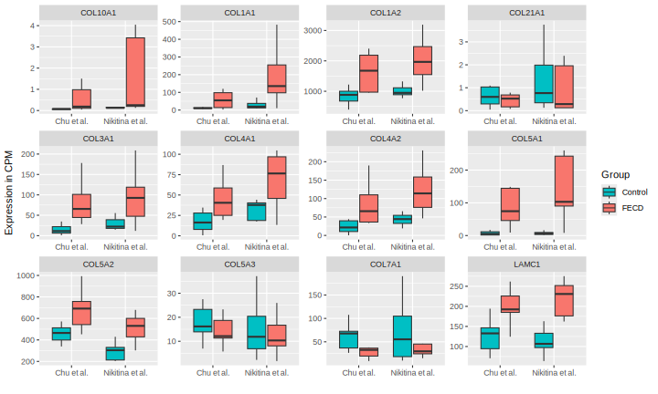<!-- -->

all targets

``` r
col_targets <- targets_table %>% filter(str_detect(miRNA, 'hsa-miR-29[abc]')) %>% pull(`Target Gene`)

for_plot <- bind_rows(
    cpm.symbol %>% rownames_to_column('gene') %>% filter(gene %in% col_targets) %>% 
        pivot_longer(cols = -gene, names_to = 'Sample', values_to = 'Expression') %>% 
        mutate(Dataset = 'Nikitina et al.'),
    nar %>% rownames_to_column('gene') %>% filter(gene %in% col_targets) %>% 
        pivot_longer(cols = -gene, names_to = 'Sample', values_to = 'Expression') %>% 
        mutate(Dataset = 'Chu et al.')
) %>% 
    mutate(
    Group = case_when(
      grepl("^Ctrl|^C_", Sample) ~ "Control",
      grepl("^FECD|^Dfu", Sample) ~ "FECD",
      TRUE ~ NA_character_))

ggplot(for_plot, aes(x=Dataset, y=Expression, fill = Group))    + geom_boxplot(outliers = F) + 
    geom_jitter(aes(fill = Group), position = position_jitterdodge(  jitter.width = 0.2,
      jitter.height = 0, dodge.width = 0.8), size=0.2, alpha = 0.7) +
    scale_fill_manual(values = c("Control" = "#00BFC4", "FECD" = "#F8766D")) +
    facet_wrap(~gene, scales = 'free') 
```

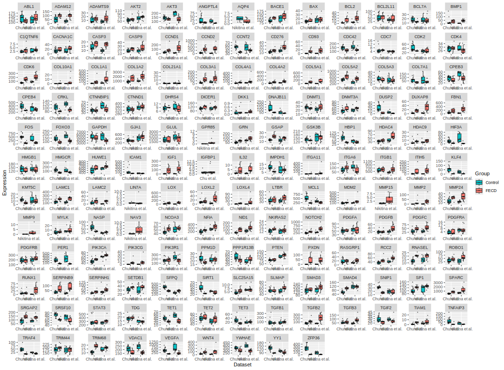<!-- -->

надо бы все эти таргеты прогнать через тест и дэг глянуть. + объединить
их по kegg в какую-то структуру только logFC \> +1

``` r
mir29_fc <- for_plot %>%
  group_by(gene, Dataset, Group) %>%
  summarise(mean_expression = mean(Expression, na.rm = TRUE), .groups = "drop") %>%
  pivot_wider(names_from = Group, values_from = mean_expression, names_prefix = "mean_") %>%
  mutate(
    FC = mean_FECD / mean_Control,
    log2FC = log2(FC)) %>%
  ungroup()
#saveRDS(mir29_fc, file="/data7a/bio/human_genomics/fuchs_dystrophy/nanostring/analisys/RDS/mir29_targets.RDS")

# Отбираем гены с |log2FC| > 1 (Fold Change > 2 или < 0.5)
v <- mir29_fc %>%
  filter((log2FC) > 1) %>%
  arrange(Dataset, desc((log2FC)))


for_plot_long <- for_plot %>%  filter(gene %in% v$gene)

ggplot(for_plot_long, aes(x=Dataset, y=Expression, fill = Group))   + geom_boxplot(outliers = F) + 
    geom_jitter(aes(fill = Group), position = position_jitterdodge(  jitter.width = 0.2,
      jitter.height = 0, dodge.width = 0.8), size=0.2, alpha = 0.7) +
    scale_fill_manual(values = c("Control" = "#00BFC4", "FECD" = "#F8766D")) +
    facet_wrap(~gene, scales = 'free') 
```

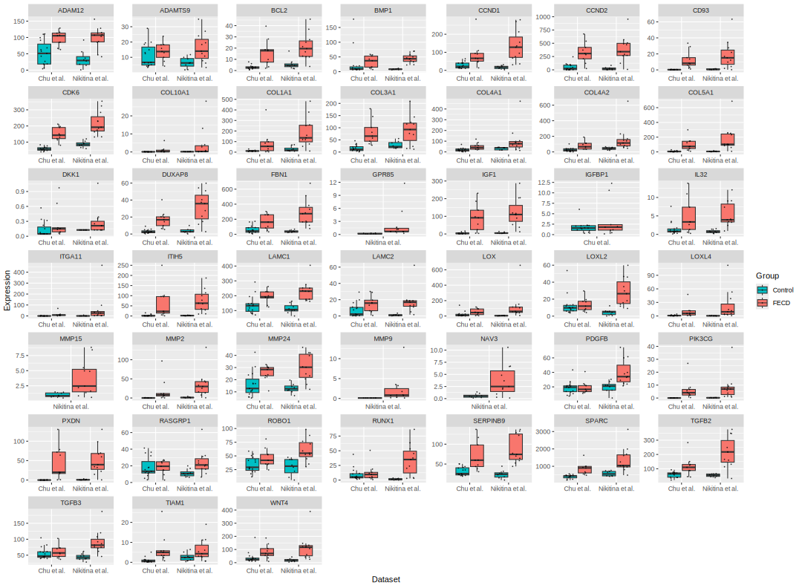<!-- -->

kegg по таргетам дал похожий результат, как и в fecd таргетах (p adj
sorted)


отберём топ 8 с + связью и - связью по FC

``` r
top_miRNA <- mir29_fc %>% distinct(gene, log2FC) %>% arrange(desc(log2FC)) %>%
  {bind_rows(slice_head(., n = 8), slice_tail(., n = 8))} %>% pull(gene) %>% unique()          

for_plot_long <- for_plot %>% filter(gene %in% top_miRNA) %>% 
    left_join(mir29_fc, by=c('gene', 'Dataset'))

ggplot(for_plot_long, aes(x=Dataset, y=Expression, fill = Group))   + geom_boxplot(outliers = F) + 
    geom_jitter(aes(fill = Group), position = position_jitterdodge(  jitter.width = 0.2,
      jitter.height = 0, dodge.width = 0.8), size=0.2, alpha = 0.7) +
    scale_fill_manual(values = c("Control" = "#00BFC4", "FECD" = "#F8766D")) +
    facet_wrap(~~reorder(gene, log2FC), scales = 'free')
```

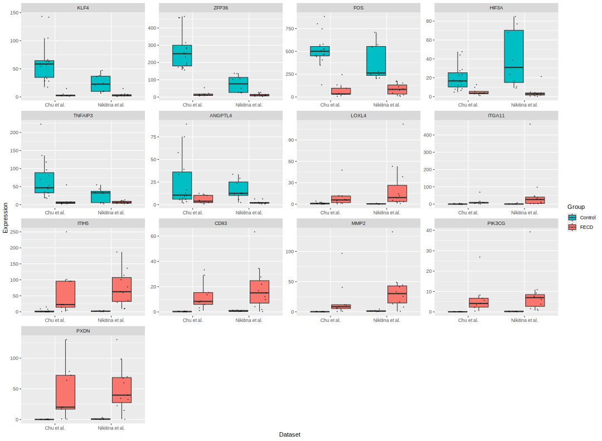<!-- -->

в control парах (где много) коррелирует с BCL2, мб какие-то
апоптотические фишки.

глянуть их дерегуляцию - незначительные изменения, можно написать

``` r
v <- c('DICER1', 'DROSHA',  'DGCR8')
for_plot <- bind_rows(
    cpm.symbol %>% rownames_to_column('gene') %>% filter(gene %in% v) %>% 
        pivot_longer(cols = -gene, names_to = 'Sample', values_to = 'Expression') %>% 
        mutate(Dataset = 'Nikitina et al.'),
    nar %>% rownames_to_column('gene') %>% filter(gene %in% v) %>% 
        pivot_longer(cols = -gene, names_to = 'Sample', values_to = 'Expression') %>% 
        mutate(Dataset = 'Chu et al.')
) %>% 
    mutate(
    Group = case_when(
      grepl("^Ctrl|^C_", Sample) ~ "Control",
      grepl("^FECD|^Dfu", Sample) ~ "FECD",
      TRUE ~ NA_character_),
    Order = case_when(gene == 'DICER1' ~ 1, gene == 'DROSHA' ~ 2, gene == 'DGCR8' ~ 3))

ggplot(for_plot, aes(x=Dataset, y=Expression, fill = Group))    + geom_boxplot(outliers = F,position = position_dodge(width = 1)) + 
    geom_jitter(aes(fill = Group), position = position_jitterdodge(  jitter.width = 0.2,       jitter.height = 0, dodge.width = 0.8), size=0.2, alpha = 0.7) +
    scale_fill_manual(values = c("Control" = "#00BFC4", "FECD" = "#F8766D")) +
    facet_wrap(~ reorder(gene, Order), scales = 'free') +
  labs(y = "Expression level (normalized counts)", x='')
```

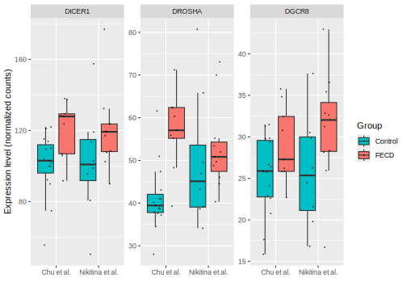<!-- -->

### 11.0.1 mir 630!

``` r
v <- targets_table %>% filter(str_detect(miRNA, 'hsa-miR-630')) %>% pull(`Target Gene`)
for_plot <- bind_rows(
    cpm.symbol %>% rownames_to_column('gene') %>% filter(gene %in% v) %>% 
        pivot_longer(cols = -gene, names_to = 'Sample', values_to = 'Expression') %>% 
        mutate(Dataset = 'Nikitina et al.'),
    nar %>% rownames_to_column('gene') %>% filter(gene %in% v) %>% 
        pivot_longer(cols = -gene, names_to = 'Sample', values_to = 'Expression') %>% 
        mutate(Dataset = 'Chu et al.')
) %>% 
    mutate(
    Group = case_when(
      grepl("^Ctrl|^C_", Sample) ~ "Control",
      grepl("^FECD|^Dfu", Sample) ~ "FECD",
      TRUE ~ NA_character_))

ggplot(for_plot, aes(x=Dataset, y=Expression, fill = Group))    + geom_boxplot(outliers = F) + 
    geom_jitter(aes(fill = Group), position = position_jitterdodge(jitter.width = 0.2,
      jitter.height = 0, dodge.width = 0.8), size=0.2, alpha = 0.7) +
    scale_fill_manual(values = c("Control" = "#00BFC4", "FECD" = "#F8766D")) +
    facet_wrap(~gene, scales = 'free') +
  labs(y = "Expression level (normalized counts)", x='')
```

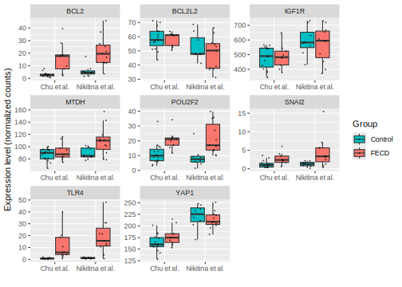<!-- -->

Как будто 630 практически ни на что не влияет, только есть snai2 - EMT
change

про иммунку можно написать, вместе с оверэкспрессией hla, но непонятно
что там

цветом покраси. среднее по вектору нарис рядом. для тех у кого есть хост
построить корр плот кто лучше с хостом коррелируют

скаттерплот средняя экспрессия (по 3 и по 5) против корреляции по
фекд-контролю.

пересчитать корр по фекд и контрол отдельно

уточнить про таргеты 29 в базе таргетов, по а б с

хосты

``` r
all_plot_data <- long_data %>%
  mutate(type = ifelse(str_detect(miRNA, "-3p$"), "3p", "5p")) %>%
  pivot_wider(names_from = type, values_from = expression)

ggplot(all_plot_data, aes(x = `3p`, y = `5p`)) +
  geom_point(alpha = 0.5) +
  geom_smooth(method = "lm", se = FALSE) +
  facet_wrap(~ base_name, scales = "free") +
  labs(title = "Корреляция между -3p и -5p формами miRNA",
       x = "Экспрессия -3p",
       y = "Экспрессия -5p") +
  theme_minimal()
```

### 11.0.2 Вытаскиваем список всех миРНК в чипе, чтобы потом получить их координаты из аннотации

``` r
chip_names <- rownames(norm_data)
chip_names <- sapply(chip_names, toupper)
chip_names <- gsub('HSA-', '', chip_names)
chip_names <- as.data.frame(chip_names, row.names = NULL)
colnames(chip_names) <- 'HGNC_name'

# сохраняем исходное имя мирнк для таблицы с таргетами
chip_names$miRNA <- row.names(chip_names)

# выделяем 5/3p в колонку
# если не указан стрэнд - пишем 5p
chip_names$mir_strand <- ifelse(grepl("5P", chip_names$HGNC_name), "5P",
                             ifelse(grepl("3P", chip_names$HGNC_name), "3P", "5P"))


# сокращаем название (удаляем 5P 3P) 
# раньше удалял все "-", теперь оставляем тк есть имена 1185-2
chip_names$HGNC_name <- gsub('-5P', '', gsub('-3P', '', chip_names$HGNC_name))


# вынести в отдельную колонку суффикс, как и в аннот.
# надо ли это делать? мб будет сложнее сметчить по колонкам
# как будто проще потом дометчить по другой колонке
# пока уберём
# chip_names <- separate(chip_names, HGNC_name, into = c("HGNC_name", "name_suffix"), sep = "-", remove = F)


# удаляем первое вхождение "-"
# тк в HGNC MIR пишется слитно с цифрой
chip_names$HGNC_name <- sub("-", "", chip_names$HGNC_name)


# добавляю MIMAT id
chip_names <- merge(chip_names, other_data[, c("Probe Name", "Accession #")], 
                          by.x = "miRNA", by.y = "Probe Name")
chip_names <- rename(chip_names, 'MIMAT_ID' = "Accession #")


# LET7A --> MIRLET7A
# изменим это в изначальном chip, тк имена должны быть как в анноте
chip_names$HGNC_name <- gsub("^LET", "MIRLET", chip_names$HGNC_name)
chip_names$HGNC_name <- gsub("MIRLET7A", "MIRLET7A", chip_names$HGNC_name)

# MIR1+MIR2+MIR3 --> MIR1
# есть мирнк через +, оставим только 1ю часть
# части после + пока уберём
chip_names$HGNC_name <- sub("\\+.*", "", chip_names$HGNC_name)

# Удаляем миРНК, отозванные из аннотации
# 10.02.25 - не будем удалять
# chip_names <- chip_names %>%
#   filter(!grepl("MIR1254|MIR4461|MIR4532|MIR4792|MIR566", HGNC_name))

# MIR92A-1 --> MIR92A1
# удаляем лишний дефис в названиях
# мержим по полному имени
chip_names$HGNC_name <- gsub("(MIR[0-9]+[A-Z]+)-([0-9]+)", "\\1\\2", chip_names$HGNC_name)

saveRDS(chip_names, file="/data7a/bio/human_genomics/fuchs_dystrophy/nanostring/analisys/RDS/chip_names.RDS")
```

``` r
# вытащим назв-я образцов в правильном виде (а зачем?)
samples_names <- colnames(norm_data)
samples_names <- gsub("^C_(\\d+)$", "C_2\\1", samples_names) 
samples_names <- gsub("^D_(\\d+)$", "D_2\\1", samples_names)  
# saveRDS(samples_names, file="/data7a/bio/human_genomics/fuchs_dystrophy/nanostring/analisys/RDS/samples_names.RDS")
```

Мы получили список дифэкспрессированых микроРНК и список всех микроРНК
генов в чипе. Исправили названия для последующей обработки. На этом 1
этап анализа завершён.

# 12 Конец 1 части анализа

------------------------------------------------------------------------
