03 miRNA analysis: correlation with RNA-seq and miRNA’s targets
================
D. Ryazantsev, E. Sharova
2025-08-24

- [1 Data import & filtering](#1-data-import--filtering)
  - [1.0.1 Filtering gene expression
    data](#101-filtering-gene-expression-data)
  - [1.0.2 Removing near-zero Values](#102-removing-near-zero-values)
  - [1.0.3 Evaluate and filter the miRNA expression
    distribution](#103-evaluate-and-filter-the-mirna-expression-distribution)
- [2 Correlation Analysis](#2-correlation-analysis)
  - [2.1 Correlation in FECD and
    Control](#21-correlation-in-fecd-and-control)
    - [2.1.1 Control correlations](#211-control-correlations)
    - [2.1.2 FECD correlation](#212-fecd-correlation)
- [3 MIR-Target gene pair trimming](#3-mir-target-gene-pair-trimming)
  - [3.1 P-value FECD and Control Bootstrap
    (permutation)](#31-p-value-fecd-and-control-bootstrap-permutation)
- [4 Comparison of selected pairs miRNA-Target with expression groups
  and
  HCEC](#comparison-of-selected-pairs-mirna-target-with-expression-groups-and-hcec)
  - [4.1 Control vs groups and HCEC](#41-control-vs-groups-and-hcec)
  - [4.2 FECD vs groups and HCEC](#42-fecd-vs-groups-and-hcec)
- [5 Final miRNA–Target gene pairs](#5-final-mirnatarget-gene-pairs)
  - [5.1 Gencode annotation](#gencode-annotation)
    - [5.1.1 Final pairs Control](#511-final-pairs-control)
    - [5.1.2 Final pairs FECD](#512-final-pairs-fecd)
    - [5.1.3 Intersection of 2 groups](#513-intersection-of-2-groups)
  - [5.2 MIMAT table annotation](#mimat-table-annotation)
    - [5.2.1 Final pairs Control](#521-final-pairs-control)
    - [5.2.2 Final pairs FECD](#522-final-pairs-fecd)
  - [5.3 Gencode vs MIMAT annotation
    comparison](#53-gencode-vs-mimat-annotation-comparison)
- [6 Venn diagrams on results](#6-venn-diagrams-on-results)
  - [6.1 Intersection with DE miRNA](#61-intersection-with-de-mirna)
  - [6.2 Target expression level](#62-target-expression-level)

# 1 Data import & filtering

**Analysis steps:**

1.  **Load and preprocess data**
    - miRNA: normalized counts (NanoString), remove poor samples
      (`C_209`–`C_211`, `Dfu_209`, `Dfu_223`)  
    - RNA‑seq: CPM counts (log‑transformed → back‑transformed), filter
      genes with CPM \< 15
2.  **Spearman correlation analysis**
    - Separately for Control and FECD samples  
    - Between every gene and every miRNA
3.  **Select negatively correlated pairs**
    - Threshold ≤ –0.7 (potential miRNA–target interactions)
4.  **Statistical significance assessment**
    - Permutation test (100 iterations) for each pair  
    - Compute p‑value and FDR
5.  **Filter by experimentally supported targets**
    - Keep only pairs present in miRTarBase v10
6.  **Validate on independent RNA‑seq datasets**
    - Add gene expression from two sources: our dataset and NAR Chu et
      al.  
    - Add expression in HCEC cell line
7.  **Calculate log₂FC (FECD vs Control)**
    - Subtract log‑transformed values (FECD – Control)
8.  **Final pair selection**
    - Criterion: \|log₂FC\| ≥ 2 (at least 4‑fold change in gene
      expression)  
    - Additionally flag whether the pattern is reproducible in HCEC
      (`check_HCEC`)
9.  **Annotate pairs**
    - Gencode (HGNC symbols, strand, coordinates, gene type)  
    - MIMAT (mirBase)
10. **Overlap with previously identified differentially expressed
    miRNAs**
    - Compare final pairs with DEGs from `01_QC`
11. **Visualisation**
    - Venn diagrams (unique genes and miRNAs in Control vs FECD,
      overlaps with all miRNAs and DEGs)  
    - Boxplots of gene expression for final pairs (log‑transformed CPM,
      with outliers highlighted)

``` r
a <- dirname(rstudioapi::getSourceEditorContext()$path) 
setwd(a)
diffexpressed_mirna_HGNC <- readRDS("/data7a/bio/human_genomics/fuchs_dystrophy/nanostring/analisys/RDS/diffexpressed_mirna_HGNC.RDS")
chip_names <- readRDS("/data7a/bio/human_genomics/fuchs_dystrophy/nanostring/analisys/RDS/chip_names.RDS")
norm_data <- readRDS("/data7a/bio/human_genomics/fuchs_dystrophy/nanostring/analisys/RDS/norm_data.RDS")
metadata <- readRDS("/data7a/bio/human_genomics/fuchs_dystrophy/nanostring/analisys/RDS/metadata.RDS")
metadata$Sample_name <- sub('_endo', '', metadata$Sample_name)
annot_chipdf <- readRDS("/data7a/bio/human_genomics/fuchs_dystrophy/nanostring/analisys/RDS/annot_chipdf.RDS") %>% filter(type == "gene") %>% dplyr::select(where(~ !all(is.na(.))))
```

**Load expression data**

Obtained CPM counts from Elena. They are in log-transformed format and
need to be converted back. Files in the directory:

- `cpm.symbol.RDS` — matrix with gene symbols and their counts
- `cpm.symbol.group.RDS` — gene symbols grouped by dataset (cult, fetal,
  nar, etc.) with control/FECD samples
- `cpm.tr.RDS` — transcripts with ENST IDs
- `cpm.tr.group.RDS` — grouped by dataset

**Work plan**

1.  Select genes present in our analysis
2.  Remove log transformation, filter by low expression threshold, try
    different cutoffs
3.  Plot distribution
4.  Generate correlation plots

``` r
cpm.symbol <- readRDS("/data7a/bio/human_genomics/fuchs_dystrophy/illumina/Fuchs_transcriptomes/analysis/transcript_analysis/RDS/expression/cpm.symbol_list.RDS")
HCEC_cpm <- as.data.frame(cpm.symbol[[2]])
HCEC_cpm <- HCEC_cpm[, "HCEC", drop = FALSE]
cpm.symbol <- cpm.symbol[[1]]
cpm.symbol.group <- readRDS("/data7a/bio/human_genomics/fuchs_dystrophy/illumina/Fuchs_transcriptomes/analysis/transcript_analysis/RDS/expression/cpm.symbol.group_list.RDS")
```

**Let’s try removing samples C209-C211 from the analysis.**

Samples C209-C211 should be excluded from the analysis because they have
strange transcriptomes.

As a result, the expression graph’s dome flattened, and the final table
expanded from ~170 to 511 pairs. Elena said this is ok, so we’ll keep
it.

Let’s also try removing Dfu_209, 223 because they’re not corneal
endothelium.

``` r
# select columns (cut by miRNA samples)
samples_names <- c("C_201", "C_202", "C_203", "C_204", "C_205", "C_206", "C_207", "C_208", "C_209", "C_210", "C_211", "Dfu_203", "Dfu_204", "Dfu_205", "Dfu_206", "Dfu_207", "Dfu_208", "Dfu_209", "Dfu_210", "Dfu_212", "Dfu_213", "Dfu_216", "Dfu_219", "Dfu_223", "Dfu_224", "Dfu_225", "Dfu_226")

# remove С209-С211
samples_names <- samples_names[-which(samples_names %in% c("C_209", "C_210", "C_211", "Dfu_209", "Dfu_223") )]

# remove C_209", "C_210", "C_211 (already removed)
norm_data <- norm_data %>% select(-c("C_209", "C_210", "C_211", 'Dfu_209', 'Dfu_223'))
cpm.symbol <- cpm.symbol[, colnames(cpm.symbol) %in% samples_names]
```

### 1.0.1 Filtering gene expression data

**Convert from log to normal form.** Sometimes it’s necessary to
subtract 1, because 0s aren’t logarithmized and 1 (pseudocount) is
added. Subtracting 1 is a bad idea, so we don’t do that here.

Returning the matrix from the logarithmized state

``` r
cpm.symbol <- 2^cpm.symbol
min(cpm.symbol) # the minimum is not 1, which means they got rid of the zeros using another method
```

    ## [1] 0.1268116

### 1.0.2 Removing near-zero Values

We need to filter out near-zero values obtained in the logarithm
procedure. To do this, we’ll construct a distribution and find the peak
corresponding to the zero value.

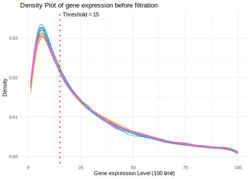<!-- -->

Let’s trim low expressed genes in the expression matrix at the `max 15`
cpm boundary and see the result.
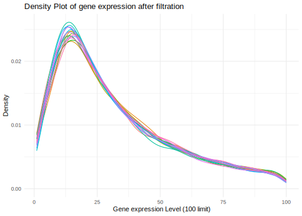<!-- -->

The curve looks roughly the same, but our goal wasn’t to completely
remove the peak—only the zero values, which introduce noise. We’ll also
evaluate the miRNA expression distribution. It will likely need to be
trimmed as well, as noise could interfere with the correlation.

### 1.0.3 Evaluate and filter the miRNA expression distribution

We’ll do the same, but for MIR. We’ll plot a graph combining the
expression of all miRNA samples. The presence of noise at the beginning
is evident.

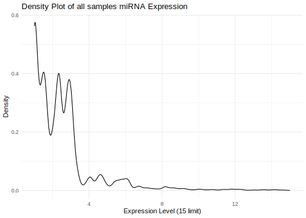<!-- -->

Let’s build a plot using the samples.

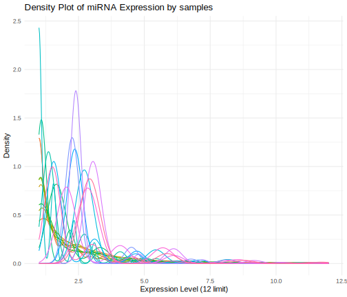<!-- -->

A graph with all samples as facets. We look at the chip (run ID) and
phenotype (FECD). We’ll do a log10.

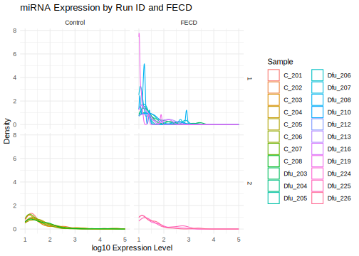<!-- -->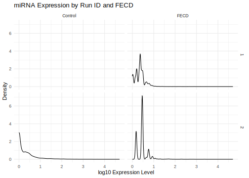<!-- -->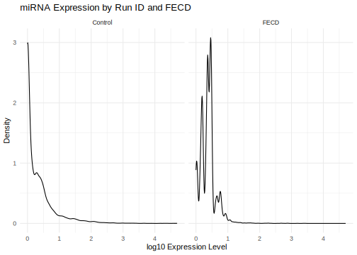<!-- -->

# 2 Correlation Analysis

We used Spearman’s rank correlation to determine which miRNAs correlated
with which RNA counts within the samples.

``` r
common_samples <- intersect(colnames(cpm.symbol), colnames(norm_data))
filtered_genes <- cpm.symbol[, common_samples, drop = FALSE]
norm_data_genes <- norm_data[, common_samples, drop = FALSE]
correlation_matrix <- cor(t(filtered_genes), t(norm_data_genes), method = "spearman")
```

Let’s estimate the correlation thresholds (if there’s a 1, it means the
numbers are identical and there’s an error somewhere) and the
distribution of values in the matrix. We’ll be interested in the numbers
in the tails—the strongest positive and negative correlations.

    ## [1] 0.9689922

    ## [1] -0.9570633

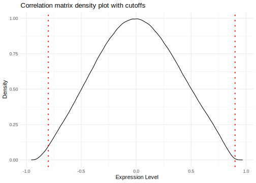<!-- -->

Let’s select the most highly and least correlated pairs, from min to
-0.8 and from +0.9 to max.

**Which correlations are of interest to us?**

- Negative - miRNA regulates the gene (target)

- Positive - miRNA is located within the gene (mirtron), expressed in
  parallel with it

**Looking for cutoffs**

We’ll try different cutoffs for the expression matrix. We’ll plot
scatterplots for different cutoffs (+0.9 and -0.9), separately for +cor
and -cor, etc., to understand where the counts are clustered:

- corr ~ cpm RNA counts

- corr ~ miRNA counts

- cpm RNA counts ~ miRNA counts

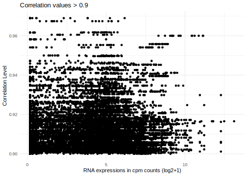<!-- -->

From plot

    ## [1] 1541

<!-- -->

**down-correlated pairs visualization**

To do this, we need to add miRNA and gene expression values from the
transcriptome for each sample in the group to the pairs. We also need to
add control-fecd coloring. We’ll create a table for the graphs.

Now lets plot the dependence of RNA counts on miRNA for each of the
downregulated pairs.

NB. I removed the big plot from final HTML to decrease its filesize.
**From the plot, we see:**

1.  Most controls with high gene expression have low miRNA expression.
2.  Most experimental samples have low or moderate gene expression and
    high miRNA counts.
3.  But that’s not important here. The main thing we’re looking at is
    the correlation line, which should be from left to right, top to
    bottom, to see if they correlate negatively. A negative line is
    visible in many samples.
4.  However, the samples are clustered {.underline}, meaning we need to
    calculate the correlation within each of the FECD Control groups.

## 2.1 Correlation in FECD and Control

We calculate the same thing (correlation and further), but for each
group separately. Let’s try using Spearman’s rank correlation—it was
used in [article](https://pmc.ncbi.nlm.nih.gov/articles/PMC10056610/)

### 2.1.1 Control correlations

``` r
common_samples <- intersect(colnames(cpm.symbol), colnames(norm_data))
common_samples <- common_samples[grepl("C_", common_samples)]
filtered_genes <- cpm.symbol[, common_samples, drop = FALSE]
norm_data_genes <- norm_data[, common_samples, drop = FALSE]
# t() to calculate the correction between rows, not columns
correlation_matrix <- cor(t(filtered_genes), t(norm_data_genes), method = "spearman")
```

**Visualizing the Control distribution.** Lets visualise the Control
distribution to find cutoffs and try different ones.
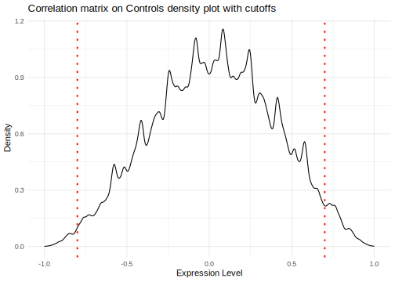<!-- -->

Control: set 0,9 cutoff, then 0.7.

``` r
# cutoff value
CUTOFF_CONTROL <- -0.7

# set the cutoff
filtered_matrix <- correlation_matrix
# convert to long format
filtered_matrix <- as.data.frame(as.table(filtered_matrix)) %>%
filter((Freq) <= CUTOFF_CONTROL)
# plot the dependence of correlation values on RNA counts
# to do this, intersect the correlation matrix with the expression matrix by gene name
# to merge them, convert each to long format
# expression
df_long <- cpm.symbol %>%
as.data.frame() %>%
rownames_to_column("Gene") %>%
select(Gene, matches("^C")) %>% # only columns with "C" in the header
pivot_longer(
cols = -Gene,
names_to = "Sample",
values_to = "Expression")

# merge
merged_data <- merge(filtered_matrix, df_long, by.x = "Var1", by.y = "Gene", all.y = F, all.x = F)

# ggplot(merged_data, aes(x = Expression, y = Freq)) +
# geom_point() +
# labs(x = "RNA expressions in cpm counts (de-log2)", y = "Control Correlation Level", title = glue("Control Correlation values <= {CUTOFF_CONTROL}")) + theme_minimal()

# extract pairs from this cutoff
# filter: try filtering by

downcorr_pairs_c <- merged_data %>% select(-Sample, -Expression) %>% distinct()
```

**Cutoff is**: -0.7

Let’s add an HCEC cell line as a reference for the presence of
transcription of selected genes in the specified line. To understand
which genes are expressed in it, compare gene counts gene-by-gene and
create a vector.

### 2.1.2 FECD correlation

Now lets calculate the correlation only for FECD samples.

``` r
common_samples <- intersect(colnames(cpm.symbol), colnames(norm_data))
# choose FECD
common_samples <- common_samples[grepl("D", common_samples)]
filtered_genes <- cpm.symbol[, common_samples, drop = FALSE]
norm_data_genes <- norm_data[, common_samples, drop = FALSE]
correlation_matrix <- cor(t(filtered_genes), t(norm_data_genes), method = "spearman")
```

FECD distribution

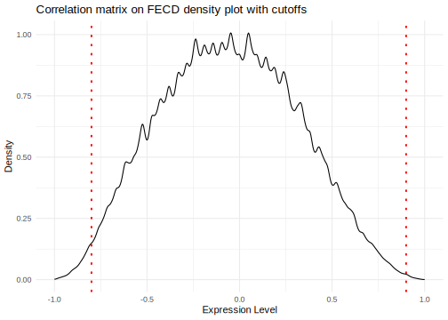<!-- -->

FECD cutoff

``` r
CUTOFF_FECD <- -0.7
# set a cutoff
filtered_matrix <- correlation_matrix
# convert to long format
filtered_matrix <- as.data.frame(as.table(filtered_matrix)) %>%
filter((Freq) <= CUTOFF_FECD)

# plot the dependence of correlation values on RNA counts
# to do this, intersect the correlation matrix with the expression matrix by gene name

# to merge them, convert each to long format
# expression
df_long <- cpm.symbol %>%
as.data.frame() %>%
rownames_to_column("Gene") %>%
select(Gene, matches("^D")) %>%  
pivot_longer(
cols = -Gene,
names_to = "Sample",
values_to = "Expression"
)
# merge
merged_data <- merge(filtered_matrix, df_long, by.x = "Var1", by.y = "Gene", all.y = F, all.x = F)

# extract pairs from this cutoff
downcorr_pairs_f <- merged_data %>% 
  select(-Sample, -Expression) %>%
  distinct()
```

**Biological Cutoff**

We cutoff at 0.9 because we were targeting a small sample size to ensure
everything worked. However, values of 0.9+ aren’t very biological and
are likely erroneous, as this is too high a correlation. A true
biological correlation should be between 0.7 and 0.8. We can see from
the scatterplot for the cutoff that there are many correlations at 0,
and we can’t immediately determine whether it’s true or false. The
biological correlation is around 0.5, so we’re targeting 0.7.

**We’ll cutoff at 0.7 (**correct the constant in the previous code**)**
and continue working with this sample. First, we’ll select the
miRNA-Target pairs from the cutoff in the target table. Out of 61,192,
567 pairs remain.

# 3 MIR-Target gene pair trimming

Now we need to select from the downcorrelated pairs those that are in
the miRNA-Target Gene table We’ll select the desired pairs for both
groups here so we can delete the target table later. Let’s try the
target table v10 (previously it was v8). Table 10 is an order of
magnitude larger than 8.

``` r
targets_table <- readRDS("/data7a/bio/human_genomics/fuchs_dystrophy/nanostring/analisys/RDS/targetsV10.RDS")
targets_table <- targets_table %>% mutate(pair = paste(`Target Gene`, miRNA, sep = "++"))
# Control was 61192 now 567
# create additional columns to combine tables
downcorr_pairs_c <- downcorr_pairs_c %>% mutate(pair = paste(Var1, Var2, sep = "++"))
# calculate the average correlation across all samples
downcorr_pairs_c <- downcorr_pairs_c %>%
group_by(pair) %>% # group by pair
summarise(Freq = mean(Freq)) %>%
ungroup() %>%
separate(pair, into = c("Var1", "Var2"), sep = "\\+\\+", remove = F)

# select by pairs
downcorr_pairs_c <- downcorr_pairs_c %>%
 filter(pair %in% targets_table$pair)

# FECD was 171173 now 1849
# create additional columns to combine tables
downcorr_pairs_f <- downcorr_pairs_f %>%
mutate(pair = paste(Var1, Var2, sep = "++"))

# calculate the average correlation across all samples
downcorr_pairs_f <- downcorr_pairs_f %>%
group_by(pair) %>% # group by pair
summarise(Freq = mean(Freq)) %>%
ungroup() %>%
separate(pair, into = c("Var1", "Var2"), sep = "\\+\\+", remove = F)

downcorr_pairs_f <- downcorr_pairs_f %>% 
filter(pair %in% targets_table$pair)

# add targets to diffexpr
# got 51491, without weak: 275
diffexpressed_mirna_targets <- diffexpressed_mirna_HGNC %>% 
left_join(targets_table, by="miRNA") %>% 
filter(`Support Type` != "Functional MTI (Weak)" & `Support Type` != "Non-Functional MTI (Weak)")

n_distinct(diffexpressed_mirna_targets$miRNA)
```

    ## [1] 66

``` r
rm(targets_table)
gc()
```

    ##            used  (Mb) gc trigger   (Mb)  max used   (Mb)
    ## Ncells  3696659 197.5   12185912  650.8  15232390  813.5
    ## Vcells 52725319 402.3  181137749 1382.0 181137749 1382.0

I added targets to the differentially expressed ones, 51,491 in total,
excluding “Non-Functional MTI (Weak)” (275). However, only 21/31 miRNAs
were targeted. Without filtering, all 31 were targeted.

| miRNA           | HGNC_symbol | strand | MIMAT_ID     | miRTarBase ID | Species (miRNA) | Target Gene | Target Gene (Entrez ID) | Species (Target Gene) | Experiments                                                                                                                                                                    | Support Type       | References (PMID) | pair                       |
|:----------------|:------------|:-------|:-------------|:--------------|:----------------|-------------|-------------------------|:----------------------|:-------------------------------------------------------------------------------------------------------------------------------------------------------------------------------|:-------------------|------------------:|:---------------------------|
| hsa-let-7b-5p   | LET7B       | 5P     | MIMAT0000063 | MIRT001229    | hsa             | CDC34       | 997                     | hsa                   | Luciferase reporter assay//Western blot                                                                                                                                        | Functional MTI     |          19126550 | CDC34++hsa-let-7b-5p       |
| hsa-let-7b-5p   | LET7B       | 5P     | MIMAT0000063 | MIRT001229    | hsa             | CDC34       | 997                     | hsa                   | Luciferase reporter assay//Western blot                                                                                                                                        | Functional MTI     |          19126550 | CDC34++hsa-let-7b-5p       |
| hsa-let-7b-5p   | LET7B       | 5P     | MIMAT0000063 | MIRT001229    | hsa             | CDC34       | 997                     | hsa                   | Luciferase reporter assay                                                                                                                                                      | Non-Functional MTI |          19126550 | CDC34++hsa-let-7b-5p       |
| hsa-let-7b-5p   | LET7B       | 5P     | MIMAT0000063 | MIRT001229    | hsa             | CDC34       | 997                     | hsa                   | Luciferase reporter assay                                                                                                                                                      | Non-Functional MTI |          19126550 | CDC34++hsa-let-7b-5p       |
| hsa-let-7b-5p   | LET7B       | 5P     | MIMAT0000063 | MIRT003834    | hsa             | LIN28B      | 389421                  | hsa                   | Luciferase reporter assay                                                                                                                                                      | Functional MTI     |          16971064 | LIN28B++hsa-let-7b-5p      |
| hsa-let-7b-5p   | LET7B       | 5P     | MIMAT0000063 | MIRT003834    | hsa             | LIN28B      | 389421                  | hsa                   | Luciferase reporter assay                                                                                                                                                      | Functional MTI     |          16971064 | LIN28B++hsa-let-7b-5p      |
| hsa-let-7b-5p   | LET7B       | 5P     | MIMAT0000063 | MIRT003834    | hsa             | LIN28B      | 389421                  | hsa                   | Luciferase reporter assay                                                                                                                                                      | Non-Functional MTI |          16971064 | LIN28B++hsa-let-7b-5p      |
| hsa-let-7b-5p   | LET7B       | 5P     | MIMAT0000063 | MIRT003834    | hsa             | LIN28B      | 389421                  | hsa                   | Luciferase reporter assay                                                                                                                                                      | Non-Functional MTI |          16971064 | LIN28B++hsa-let-7b-5p      |
| hsa-let-7b-5p   | LET7B       | 5P     | MIMAT0000063 | MIRT003834    | hsa             | LIN28B      | 389421                  | hsa                   | Luciferase reporter assay                                                                                                                                                      | Non-Functional MTI |          16971064 | LIN28B++hsa-let-7b-5p      |
| hsa-let-7b-5p   | LET7B       | 5P     | MIMAT0000063 | MIRT001229    | hsa             | CDC34       | 997                     | hsa                   | Luciferase reporter assay                                                                                                                                                      | Functional MTI     |          19126550 | CDC34++hsa-let-7b-5p       |
| hsa-let-7b-5p   | LET7B       | 5P     | MIMAT0000063 | MIRT004614    | hsa             | IFNB1       | 3456                    | hsa                   | ELISA//Luciferase reporter assay//qRT-PCR                                                                                                                                      | Functional MTI     |          20130213 | IFNB1++hsa-let-7b-5p       |
| hsa-let-7b-5p   | LET7B       | 5P     | MIMAT0000063 | MIRT002484    | hsa             | CCND1       | 595                     | hsa                   | immunoblot//Luciferase reporter assay//Northern blot//Western blot                                                                                                             | Functional MTI     |          20133835 | CCND1++hsa-let-7b-5p       |
| hsa-let-7b-5p   | LET7B       | 5P     | MIMAT0000063 | MIRT004618    | hsa             | NR2E1       | 7101                    | hsa                   | immunoblot//Luciferase reporter assay//Northern blot//Western blot                                                                                                             | Functional MTI     |          20133835 | NR2E1++hsa-let-7b-5p       |
| hsa-let-7b-5p   | LET7B       | 5P     | MIMAT0000063 | MIRT002082    | hsa             | HMGA2       | 8091                    | hsa                   | Luciferase reporter assay//qRT-PCR                                                                                                                                             | Functional MTI     |          17437991 | HMGA2++hsa-let-7b-5p       |
| hsa-let-7b-5p   | LET7B       | 5P     | MIMAT0000063 | MIRT002082    | hsa             | HMGA2       | 8091                    | hsa                   | Luciferase reporter assay//qRT-PCR                                                                                                                                             | Functional MTI     |          17437991 | HMGA2++hsa-let-7b-5p       |
| hsa-let-7b-5p   | LET7B       | 5P     | MIMAT0000063 | MIRT002082    | hsa             | HMGA2       | 8091                    | hsa                   | Luciferase reporter assay//qRT-PCR                                                                                                                                             | Functional MTI     |          17437991 | HMGA2++hsa-let-7b-5p       |
| hsa-let-7b-5p   | LET7B       | 5P     | MIMAT0000063 | MIRT002082    | hsa             | HMGA2       | 8091                    | hsa                   | Luciferase reporter assay//qRT-PCR                                                                                                                                             | Functional MTI     |          17437991 | HMGA2++hsa-let-7b-5p       |
| hsa-let-7b-5p   | LET7B       | 5P     | MIMAT0000063 | MIRT002082    | hsa             | HMGA2       | 8091                    | hsa                   | Luciferase reporter assay//qRT-PCR                                                                                                                                             | Functional MTI     |          17437991 | HMGA2++hsa-let-7b-5p       |
| hsa-let-7b-5p   | LET7B       | 5P     | MIMAT0000063 | MIRT002082    | hsa             | HMGA2       | 8091                    | hsa                   | Luciferase reporter assay//qRT-PCR                                                                                                                                             | Functional MTI     |          17437991 | HMGA2++hsa-let-7b-5p       |
| hsa-let-7b-5p   | LET7B       | 5P     | MIMAT0000063 | MIRT001600    | hsa             | RDH10       | 157506                  | hsa                   | pSILAC//Luciferase reporter assay                                                                                                                                              | Functional MTI     |          18668040 | RDH10++hsa-let-7b-5p       |
| hsa-let-7b-5p   | LET7B       | 5P     | MIMAT0000063 | MIRT002297    | hsa             | CDK6        | 1021                    | hsa                   | Luciferase reporter assay//Microarray//Western blot                                                                                                                            | Functional MTI     |          17699775 | CDK6++hsa-let-7b-5p        |
| hsa-let-7b-5p   | LET7B       | 5P     | MIMAT0000063 | MIRT002296    | hsa             | CDC25A      | 993                     | hsa                   | Luciferase reporter assay//Microarray//Western blot                                                                                                                            | Functional MTI     |          17699775 | CDC25A++hsa-let-7b-5p      |
| hsa-let-7b-5p   | LET7B       | 5P     | MIMAT0000063 | MIRT003835    | hsa             | CCND2       | 894                     | hsa                   | Luciferase reporter assay                                                                                                                                                      | Functional MTI     |          17699775 | CCND2++hsa-let-7b-5p       |
| hsa-let-7b-5p   | LET7B       | 5P     | MIMAT0000063 | MIRT003836    | hsa             | NRAS        | 4893                    | hsa                   | Luciferase reporter assay                                                                                                                                                      | Functional MTI     |          17699775 | NRAS++hsa-let-7b-5p        |
| hsa-let-7b-5p   | LET7B       | 5P     | MIMAT0000063 | MIRT002484    | hsa             | CCND1       | 595                     | hsa                   | Immunoblot//Immunofluorescence//Luciferase reporter assay//qRT-PCR                                                                                                             | Functional MTI     |          18379589 | CCND1++hsa-let-7b-5p       |
| hsa-let-7b-5p   | LET7B       | 5P     | MIMAT0000063 | MIRT003999    | hsa             | CCNA2       | 890                     | hsa                   | Immunoblot//Immunofluorescence//Luciferase reporter assay//qRT-PCR                                                                                                             | Functional MTI     |          18379589 | CCNA2++hsa-let-7b-5p       |
| hsa-let-7b-5p   | LET7B       | 5P     | MIMAT0000063 | MIRT004011    | hsa             | LIN28A      | 79727                   | hsa                   | Luciferase reporter assay                                                                                                                                                      | Functional MTI     |          15131085 | LIN28A++hsa-let-7b-5p      |
| hsa-let-7b-5p   | LET7B       | 5P     | MIMAT0000063 | MIRT001852    | hsa             | ACTG1       | 71                      | hsa                   | Luciferase reporter assay                                                                                                                                                      | Non-Functional MTI |          15131085 | ACTG1++hsa-let-7b-5p       |
| hsa-let-7b-5p   | LET7B       | 5P     | MIMAT0000063 | MIRT001851    | hsa             | RPIA        | 22934                   | hsa                   | Luciferase reporter assay                                                                                                                                                      | Non-Functional MTI |          15131085 | RPIA++hsa-let-7b-5p        |
| hsa-let-7b-5p   | LET7B       | 5P     | MIMAT0000063 | MIRT005513    | hsa             | PRDM1       | 639                     | hsa                   | Immunohistochemistry//Luciferase reporter assay//qRT-PCR//Western blot                                                                                                         | Functional MTI     |          20651244 | PRDM1++hsa-let-7b-5p       |
| hsa-let-7b-5p   | LET7B       | 5P     | MIMAT0000063 | MIRT005513    | hsa             | PRDM1       | 639                     | hsa                   | Immunohistochemistry//Luciferase reporter assay//qRT-PCR//Western blot                                                                                                         | Non-Functional MTI |          20651244 | PRDM1++hsa-let-7b-5p       |
| hsa-let-7b-5p   | LET7B       | 5P     | MIMAT0000063 | MIRT006057    | hsa             | HRAS        | 3265                    | hsa                   | Immunoblot//qRT-PCR//Western blot                                                                                                                                              | Functional MTI     |          21252116 | HRAS++hsa-let-7b-5p        |
| hsa-let-7b-5p   | LET7B       | 5P     | MIMAT0000063 | MIRT001229    | hsa             | CDC34       | 997                     | hsa                   | Immunoblot//qRT-PCR//Western blot                                                                                                                                              | Functional MTI     |          21252116 | CDC34++hsa-let-7b-5p       |
| hsa-let-7b-5p   | LET7B       | 5P     | MIMAT0000063 | MIRT001621    | hsa             | IGF2BP1     | 10642                   | hsa                   | Immunoblot//qRT-PCR//Western blot                                                                                                                                              | Functional MTI     |          21252116 | IGF2BP1++hsa-let-7b-5p     |
| hsa-let-7b-5p   | LET7B       | 5P     | MIMAT0000063 | MIRT006057    | hsa             | HRAS        | 3265                    | hsa                   | Immunoblot//qRT-PCR//Western blot                                                                                                                                              | Functional MTI     |          21252116 | HRAS++hsa-let-7b-5p        |
| hsa-let-7b-5p   | LET7B       | 5P     | MIMAT0000063 | MIRT001229    | hsa             | CDC34       | 997                     | hsa                   | Immunoblot//qRT-PCR//Western blot                                                                                                                                              | Functional MTI     |          21252116 | CDC34++hsa-let-7b-5p       |
| hsa-let-7b-5p   | LET7B       | 5P     | MIMAT0000063 | MIRT001621    | hsa             | IGF2BP1     | 10642                   | hsa                   | Immunoblot//qRT-PCR//Western blot                                                                                                                                              | Functional MTI     |          21252116 | IGF2BP1++hsa-let-7b-5p     |
| hsa-let-7b-5p   | LET7B       | 5P     | MIMAT0000063 | MIRT006057    | hsa             | HRAS        | 3265                    | hsa                   | Immunoblot//qRT-PCR//Western blot                                                                                                                                              | Functional MTI     |          21252116 | HRAS++hsa-let-7b-5p        |
| hsa-let-7b-5p   | LET7B       | 5P     | MIMAT0000063 | MIRT001229    | hsa             | CDC34       | 997                     | hsa                   | Immunoblot//qRT-PCR//Western blot                                                                                                                                              | Functional MTI     |          21252116 | CDC34++hsa-let-7b-5p       |
| hsa-let-7b-5p   | LET7B       | 5P     | MIMAT0000063 | MIRT001621    | hsa             | IGF2BP1     | 10642                   | hsa                   | Immunoblot//qRT-PCR//Western blot                                                                                                                                              | Functional MTI     |          21252116 | IGF2BP1++hsa-let-7b-5p     |
| hsa-let-7b-5p   | LET7B       | 5P     | MIMAT0000063 | MIRT006875    | hsa             | CYP2J2      | 1573                    | hsa                   | Luciferase reporter assay//qRT-PCR//Western blot                                                                                                                               | Functional MTI     |          22761738 | CYP2J2++hsa-let-7b-5p      |
| hsa-let-7b-5p   | LET7B       | 5P     | MIMAT0000063 | MIRT001625    | hsa             | HMGA1       | 3159                    | hsa                   | Luciferase reporter assay//Microarray//qRT-PCR//Western blot                                                                                                                   | Functional MTI     |          23798998 | HMGA1++hsa-let-7b-5p       |
| hsa-let-7b-5p   | LET7B       | 5P     | MIMAT0000063 | MIRT002484    | hsa             | CCND1       | 595                     | hsa                   | Immunoblot//Microarray//qRT-PCR//Western blot//Annexin V-FITC                                                                                                                  | Functional MTI     |          23806108 | CCND1++hsa-let-7b-5p       |
| hsa-let-7b-5p   | LET7B       | 5P     | MIMAT0000063 | MIRT002082    | hsa             | HMGA2       | 8091                    | hsa                   | Immunohistochemistry//Luciferase reporter assay//QRTPCR//Western blot                                                                                                          | Functional MTI     |          23482325 | HMGA2++hsa-let-7b-5p       |
| hsa-let-7b-5p   | LET7B       | 5P     | MIMAT0000063 | MIRT003835    | hsa             | CCND2       | 894                     | hsa                   | Immunohistochemistry//Luciferase reporter assay//QRTPCR//Western blot                                                                                                          | Functional MTI     |          23482325 | CCND2++hsa-let-7b-5p       |
| hsa-let-7b-5p   | LET7B       | 5P     | MIMAT0000063 | MIRT054075    | hsa             | IGF1R       | 3480                    | hsa                   | Immunohistochemistry//Luciferase reporter assay//QRTPCR//Western blot                                                                                                          | Functional MTI     |          23482325 | IGF1R++hsa-let-7b-5p       |
| hsa-let-7b-5p   | LET7B       | 5P     | MIMAT0000063 | MIRT005241    | hsa             | IGF2BP2     | 10644                   | hsa                   | Immunohistochemistry//Luciferase reporter assay//QRTPCR//Western blot                                                                                                          | Functional MTI     |          23482325 | IGF2BP2++hsa-let-7b-5p     |
| hsa-let-7b-5p   | LET7B       | 5P     | MIMAT0000063 | MIRT054120    | hsa             | COL3A1      | 1281                    | hsa                   | Luciferase reporter assay//Microarray//qRT-PCR                                                                                                                                 | Functional MTI     |          22995917 | COL3A1++hsa-let-7b-5p      |
| hsa-let-7b-5p   | LET7B       | 5P     | MIMAT0000063 | MIRT054121    | hsa             | CPEB1       | 64506                   | hsa                   | Luciferase reporter assay//Microarray//qRT-PCR                                                                                                                                 | Functional MTI     |          22995917 | CPEB1++hsa-let-7b-5p       |
| hsa-let-7b-5p   | LET7B       | 5P     | MIMAT0000063 | MIRT054122    | hsa             | CPEB3       | 22849                   | hsa                   | Luciferase reporter assay//Microarray//qRT-PCR                                                                                                                                 | Functional MTI     |          22995917 | CPEB3++hsa-let-7b-5p       |
| hsa-let-7b-5p   | LET7B       | 5P     | MIMAT0000063 | MIRT054123    | hsa             | ACVR1       | 90                      | hsa                   | Luciferase reporter assay//Microarray//qRT-PCR                                                                                                                                 | Non-Functional MTI |          22995917 | ACVR1++hsa-let-7b-5p       |
| hsa-let-7b-5p   | LET7B       | 5P     | MIMAT0000063 | MIRT004955    | hsa             | PDGFRA      | 5156                    | hsa                   | Luciferase reporter assay//Microarray//qRT-PCR                                                                                                                                 | Non-Functional MTI |          22995917 | PDGFRA++hsa-let-7b-5p      |
| hsa-let-7b-5p   | LET7B       | 5P     | MIMAT0000063 | MIRT054124    | hsa             | LRIG1       | 26018                   | hsa                   | Luciferase reporter assay//Microarray//qRT-PCR                                                                                                                                 | Non-Functional MTI |          22995917 | LRIG1++hsa-let-7b-5p       |
| hsa-let-7b-5p   | LET7B       | 5P     | MIMAT0000063 | MIRT054125    | hsa             | CPEB4       | 80315                   | hsa                   | Luciferase reporter assay//Microarray//qRT-PCR                                                                                                                                 | Non-Functional MTI |          22995917 | CPEB4++hsa-let-7b-5p       |
| hsa-let-7b-5p   | LET7B       | 5P     | MIMAT0000063 | MIRT054832    | hsa             | TGFBR1      | 7046                    | hsa                   | GFP reporter assay//Western blot//ELISA                                                                                                                                        | Functional MTI     |          24978044 | TGFBR1++hsa-let-7b-5p      |
| hsa-let-7b-5p   | LET7B       | 5P     | MIMAT0000063 | MIRT002082    | hsa             | HMGA2       | 8091                    | hsa                   | Luciferase reporter assay                                                                                                                                                      | Functional MTI     |          23318420 | HMGA2++hsa-let-7b-5p       |
| hsa-let-7b-5p   | LET7B       | 5P     | MIMAT0000063 | MIRT001621    | hsa             | IGF2BP1     | 10642                   | hsa                   | Immunofluorescence//Luciferase reporter assay//qRT-PCR//Western blot                                                                                                           | Functional MTI     |          23824794 | IGF2BP1++hsa-let-7b-5p     |
| hsa-let-7b-5p   | LET7B       | 5P     | MIMAT0000063 | MIRT001621    | hsa             | IGF2BP1     | 10642                   | hsa                   | Immunofluorescence//Luciferase reporter assay//qRT-PCR//Western blot                                                                                                           | Non-Functional MTI |          23824794 | IGF2BP1++hsa-let-7b-5p     |
| hsa-let-7b-5p   | LET7B       | 5P     | MIMAT0000063 | MIRT052100    | hsa             | AGO1        | 26523                   | hsa                   | Immunohistochemistry//Immunoprecipitaion//Luciferase reporter assay//Northern blot//qRT-PCR//Western blot                                                                      | Functional MTI     |          23426184 | AGO1++hsa-let-7b-5p        |
| hsa-let-7b-5p   | LET7B       | 5P     | MIMAT0000063 | MIRT052219    | hsa             | IRS2        | 8660                    | hsa                   | Flow//Luciferase reporter assay//qRT-PCR//Western blot                                                                                                                         | Functional MTI     |          24810113 | IRS2++hsa-let-7b-5p        |
| hsa-let-7b-5p   | LET7B       | 5P     | MIMAT0000063 | MIRT052219    | hsa             | IRS2        | 8660                    | hsa                   | Flow//Luciferase reporter assay//qRT-PCR//Western blot                                                                                                                         | Non-Functional MTI |          24810113 | IRS2++hsa-let-7b-5p        |
| hsa-let-7b-5p   | LET7B       | 5P     | MIMAT0000063 | MIRT438635    | hsa             | TNFRSF10B   | 8795                    | hsa                   | qRT-PCR//Western blot                                                                                                                                                          | Functional MTI     |          24120475 | TNFRSF10B++hsa-let-7b-5p   |
| hsa-let-7b-5p   | LET7B       | 5P     | MIMAT0000063 | MIRT438116    | hsa             | TLR4        | 7099                    | hsa                   | Luciferase reporter assay                                                                                                                                                      | Functional MTI     |          23437218 | TLR4++hsa-let-7b-5p        |
| hsa-let-7b-5p   | LET7B       | 5P     | MIMAT0000063 | MIRT438116    | hsa             | TLR4        | 7099                    | hsa                   | Luciferase reporter assay                                                                                                                                                      | Functional MTI     |          23437218 | TLR4++hsa-let-7b-5p        |
| hsa-let-7b-5p   | LET7B       | 5P     | MIMAT0000063 | MIRT437977    | hsa             | AKT2        | 208                     | hsa                   | Luciferase reporter assay//qRT-PCR//Western blot                                                                                                                               | Functional MTI     |          25288334 | AKT2++hsa-let-7b-5p        |
| hsa-let-7b-5p   | LET7B       | 5P     | MIMAT0000063 | MIRT437977    | hsa             | AKT2        | 208                     | hsa                   | Luciferase reporter assay//qRT-PCR//Western blot                                                                                                                               | Non-Functional MTI |          25288334 | AKT2++hsa-let-7b-5p        |
| hsa-let-7b-5p   | LET7B       | 5P     | MIMAT0000063 | MIRT437975    | hsa             | CTHRC1      | 115908                  | hsa                   | Luciferase reporter assay//qRT-PCR//Western blot                                                                                                                               | Functional MTI     |          25510669 | CTHRC1++hsa-let-7b-5p      |
| hsa-let-7b-5p   | LET7B       | 5P     | MIMAT0000063 | MIRT437975    | hsa             | CTHRC1      | 115908                  | hsa                   | Luciferase reporter assay//qRT-PCR//Western blot                                                                                                                               | Non-Functional MTI |          25510669 | CTHRC1++hsa-let-7b-5p      |
| hsa-let-7b-5p   | LET7B       | 5P     | MIMAT0000063 | MIRT052219    | hsa             | IRS2        | 8660                    | hsa                   | Flow//Luciferase reporter assay//qRT-PCR//Western blot                                                                                                                         | Functional MTI     |          24810113 | IRS2++hsa-let-7b-5p        |
| hsa-let-7b-5p   | LET7B       | 5P     | MIMAT0000063 | MIRT052219    | hsa             | IRS2        | 8660                    | hsa                   | Flow//Luciferase reporter assay//qRT-PCR//Western blot                                                                                                                         | Non-Functional MTI |          24810113 | IRS2++hsa-let-7b-5p        |
| hsa-let-7b-5p   | LET7B       | 5P     | MIMAT0000063 | MIRT438635    | hsa             | TNFRSF10B   | 8795                    | hsa                   | qRT-PCR//Western blot                                                                                                                                                          | Functional MTI     |          24120475 | TNFRSF10B++hsa-let-7b-5p   |
| hsa-let-7b-5p   | LET7B       | 5P     | MIMAT0000063 | MIRT438116    | hsa             | TLR4        | 7099                    | hsa                   | Luciferase reporter assay                                                                                                                                                      | Functional MTI     |          23437218 | TLR4++hsa-let-7b-5p        |
| hsa-let-7b-5p   | LET7B       | 5P     | MIMAT0000063 | MIRT438116    | hsa             | TLR4        | 7099                    | hsa                   | Luciferase reporter assay                                                                                                                                                      | Functional MTI     |          23437218 | TLR4++hsa-let-7b-5p        |
| hsa-let-7b-5p   | LET7B       | 5P     | MIMAT0000063 | MIRT437977    | hsa             | AKT2        | 208                     | hsa                   | Luciferase reporter assay//qRT-PCR//Western blot                                                                                                                               | Functional MTI     |          25288334 | AKT2++hsa-let-7b-5p        |
| hsa-let-7b-5p   | LET7B       | 5P     | MIMAT0000063 | MIRT437977    | hsa             | AKT2        | 208                     | hsa                   | Luciferase reporter assay//qRT-PCR//Western blot                                                                                                                               | Non-Functional MTI |          25288334 | AKT2++hsa-let-7b-5p        |
| hsa-let-7b-5p   | LET7B       | 5P     | MIMAT0000063 | MIRT437975    | hsa             | CTHRC1      | 115908                  | hsa                   | Luciferase reporter assay//qRT-PCR//Western blot                                                                                                                               | Functional MTI     |          25510669 | CTHRC1++hsa-let-7b-5p      |
| hsa-let-7b-5p   | LET7B       | 5P     | MIMAT0000063 | MIRT437975    | hsa             | CTHRC1      | 115908                  | hsa                   | Luciferase reporter assay//qRT-PCR//Western blot                                                                                                                               | Non-Functional MTI |          25510669 | CTHRC1++hsa-let-7b-5p      |
| hsa-let-7b-5p   | LET7B       | 5P     | MIMAT0000063 | MIRT001653    | hsa             | ANAPC1      | 64682                   | hsa                   | Microarray//qRT-PCR//Western blot                                                                                                                                              | Functional MTI     |          26540468 | ANAPC1++hsa-let-7b-5p      |
| hsa-let-7b-5p   | LET7B       | 5P     | MIMAT0000063 | MIRT733213    | hsa             | TLR2        | 7097                    | hsa                   | Microarray//Western blotting                                                                                                                                                   | Functional MTI     |          32669469 | TLR2++hsa-let-7b-5p        |
| hsa-let-7b-5p   | LET7B       | 5P     | MIMAT0000063 | MIRT492219    | hsa             | SOCS1       | 8651                    | hsa                   | Luciferase reporter assay//qRT-PCR//Western blotting                                                                                                                           | Functional MTI     |          33005103 | SOCS1++hsa-let-7b-5p       |
| hsa-let-7b-5p   | LET7B       | 5P     | MIMAT0000063 | MIRT492219    | hsa             | SOCS1       | 8651                    | hsa                   | Luciferase reporter assay//qRT-PCR//Western blotting                                                                                                                           | Functional MTI     |          33005103 | SOCS1++hsa-let-7b-5p       |
| hsa-let-7b-5p   | LET7B       | 5P     | MIMAT0000063 | MIRT244066    | hsa             | EDN1        | 1906                    | hsa                   | Luciferase reporter assay//qRT-PCR                                                                                                                                             | Functional MTI     |          33314303 | EDN1++hsa-let-7b-5p        |
| hsa-let-7b-5p   | LET7B       | 5P     | MIMAT0000063 | MIRT492219    | hsa             | SOCS1       | 8651                    | hsa                   | ELISA//Luciferase reporter assay//qRT-PCR                                                                                                                                      | Functional MTI     |          33005103 | SOCS1++hsa-let-7b-5p       |
| hsa-let-7b-5p   | LET7B       | 5P     | MIMAT0000063 | MIRT734444    | hsa             | STAT1       | 6772                    | hsa                   | ELISA//Luciferase reporter assay//qRT-PCR                                                                                                                                      | Functional MTI     |          33005103 | STAT1++hsa-let-7b-5p       |
| hsa-let-7b-5p   | LET7B       | 5P     | MIMAT0000063 | MIRT734445    | hsa             | STAT5A      | 6776                    | hsa                   | ELISA//Luciferase reporter assay//qRT-PCR                                                                                                                                      | Functional MTI     |          33005103 | STAT5A++hsa-let-7b-5p      |
| hsa-let-7b-5p   | LET7B       | 5P     | MIMAT0000063 | MIRT734651    | hsa             | SERP1       | 27230                   | hsa                   | Luciferase reporter assay//Western blotting//Immunoprecipitaion (IP)//Immunofluorescence//ELISA                                                                                | Functional MTI     |          32534478 | SERP1++hsa-let-7b-5p       |
| hsa-let-7b-5p   | LET7B       | 5P     | MIMAT0000063 | MIRT001649    | hsa             | AURKB       | 9212                    | hsa                   | Luciferase reporter assay//Western blotting//Immunohistochemistry (IHC)//qRT-PCR//Flow cytometry                                                                               | Functional MTI     |          32856506 | AURKB++hsa-let-7b-5p       |
| hsa-let-7b-5p   | LET7B       | 5P     | MIMAT0000063 | MIRT001580    | hsa             | UHRF1       | 29128                   | hsa                   | Luciferase reporter assay//Western blotting//qRT-PCR                                                                                                                           | Functional MTI     |          31873045 | UHRF1++hsa-let-7b-5p       |
| hsa-let-7b-5p   | LET7B       | 5P     | MIMAT0000063 | MIRT735895    | hsa             | HAS2        | 3037                    | hsa                   | Luciferase reporter assay//Western blotting//qRT-PCR//Flow cytometry                                                                                                           | Functional MTI     |          31736114 | HAS2++hsa-let-7b-5p        |
| hsa-let-7b-5p   | LET7B       | 5P     | MIMAT0000063 | MIRT004011    | hsa             | LIN28A      | 79727                   | hsa                   | Luciferase reporter assay//qRT-PCR                                                                                                                                             | Functional MTI     |          32697599 | LIN28A++hsa-let-7b-5p      |
| hsa-let-7b-5p   | LET7B       | 5P     | MIMAT0000063 | MIRT736797    | hsa             | SNHG16      | 100507246               | hsa                   | Luciferase reporter assay//Western blotting//qRT-PCR                                                                                                                           | Functional MTI     |          31696971 | SNHG16++hsa-let-7b-5p      |
| hsa-let-7b-5p   | LET7B       | 5P     | MIMAT0000063 | MIRT736798    | hsa             | CDC25B      | 994                     | hsa                   | Luciferase reporter assay//Western blotting//qRT-PCR                                                                                                                           | Functional MTI     |          31696971 | CDC25B++hsa-let-7b-5p      |
| hsa-let-7b-5p   | LET7B       | 5P     | MIMAT0000063 | MIRT005322    | hsa             | DICER1      | 23405                   | hsa                   | Western blotting//Microarray//RNA-seq//qRT-PCR                                                                                                                                 | Functional MTI     |          32204397 | DICER1++hsa-let-7b-5p      |
| hsa-let-7b-5p   | LET7B       | 5P     | MIMAT0000063 | MIRT755344    | hsa             | NKD1        | 85407                   | hsa                   | Luciferase reporter assay//Western blotting//qRT-PCR                                                                                                                           | Functional MTI     |          36445120 | NKD1++hsa-let-7b-5p        |
| hsa-let-7b-5p   | LET7B       | 5P     | MIMAT0000063 | MIRT054075    | hsa             | IGF1R       | 3480                    | hsa                   | Western blotting//Microarray//qRT-PCR//RNA-seq//in vitro cullelar assays//Flow cytometry                                                                                       | Functional MTI     |          35111808 | IGF1R++hsa-let-7b-5p       |
| hsa-let-7b-5p   | LET7B       | 5P     | MIMAT0000063 | MIRT501242    | hsa             | SEMA4C      | 54910                   | hsa                   | Western blotting//Immunoprecipitaion (IP)//RNA-seq//Immunofluorescence                                                                                                         | Functional MTI     |          35261797 | SEMA4C++hsa-let-7b-5p      |
| hsa-let-7b-5p   | LET7B       | 5P     | MIMAT0000063 | MIRT755344    | hsa             | NKD1        | 85407                   | hsa                   | Luciferase reporter assay//Western blotting//qRT-PCR                                                                                                                           | Functional MTI     |          36445120 | NKD1++hsa-let-7b-5p        |
| hsa-let-7b-5p   | LET7B       | 5P     | MIMAT0000063 | MIRT567432    | hsa             | GNG5        | 2787                    | hsa                   | Luciferase reporter assay//Western blotting//qRT-PCR//Flow cytometry                                                                                                           | Functional MTI     |          36643646 | GNG5++hsa-let-7b-5p        |
| hsa-let-7b-5p   | LET7B       | 5P     | MIMAT0000063 | MIRT437975    | hsa             | CTHRC1      | 115908                  | hsa                   | Luciferase reporter assay//Western blotting//qRT-PCR//Immunofluorescence                                                                                                       | Functional MTI     |          34950211 | CTHRC1++hsa-let-7b-5p      |
| hsa-let-7b-5p   | LET7B       | 5P     | MIMAT0000063 | MIRT005241    | hsa             | IGF2BP2     | 10644                   | hsa                   | Luciferase reporter assay//Western blotting//qRT-PCR//Immunoprecipitaion (IP)                                                                                                  | Functional MTI     |          38443392 | IGF2BP2++hsa-let-7b-5p     |
| hsa-let-7b-5p   | LET7B       | 5P     | MIMAT0000063 | MIRT756355    | hsa             | RUNX2       | 860                     | hsa                   | Luciferase reporter assay//Western blotting//qRT-PCR                                                                                                                           | Functional MTI     |          36611957 | RUNX2++hsa-let-7b-5p       |
| hsa-miR-103a-3p | MIR103A     | 3P     | MIMAT0000101 | MIRT004762    | hsa             | CCNE1       | 898                     | hsa                   | Luciferase reporter assay//qRT-PCR//Western blot                                                                                                                               | Functional MTI     |          20886090 | CCNE1++hsa-miR-103a-3p     |
| hsa-miR-103a-3p | MIR103A     | 3P     | MIMAT0000101 | MIRT004764    | hsa             | CDK2        | 1017                    | hsa                   | Luciferase reporter assay//qRT-PCR//Western blot                                                                                                                               | Functional MTI     |          20886090 | CDK2++hsa-miR-103a-3p      |
| hsa-miR-103a-3p | MIR103A     | 3P     | MIMAT0000101 | MIRT004766    | hsa             | CREB1       | 1385                    | hsa                   | Luciferase reporter assay//qRT-PCR//Western blot                                                                                                                               | Functional MTI     |          20886090 | CREB1++hsa-miR-103a-3p     |
| hsa-miR-103a-3p | MIR103A     | 3P     | MIMAT0000101 | MIRT005347    | hsa             | DICER1      | 23405                   | hsa                   | Luciferase reporter assay//qRT-PCR                                                                                                                                             | Functional MTI     |          20603000 | DICER1++hsa-miR-103a-3p    |
| hsa-miR-103a-3p | MIR103A     | 3P     | MIMAT0000101 | MIRT001842    | hsa             | GPD1        | 2819                    | hsa                   | Luciferase reporter assay                                                                                                                                                      | Non-Functional MTI |          15131085 | GPD1++hsa-miR-103a-3p      |
| hsa-miR-103a-3p | MIR103A     | 3P     | MIMAT0000101 | MIRT005347    | hsa             | DICER1      | 23405                   | hsa                   | Luciferase reporter assay//qRT-PCR                                                                                                                                             | Functional MTI     |          20603000 | DICER1++hsa-miR-103a-3p    |
| hsa-miR-103a-3p | MIR103A     | 3P     | MIMAT0000101 | MIRT005347    | hsa             | DICER1      | 23405                   | hsa                   | Luciferase reporter assay//qRT-PCR                                                                                                                                             | Non-Functional MTI |          20603000 | DICER1++hsa-miR-103a-3p    |
| hsa-miR-103a-3p | MIR103A     | 3P     | MIMAT0000101 | MIRT006428    | hsa             | CAV1        | 857                     | hsa                   | Luciferase reporter assay//Microarray                                                                                                                                          | Functional MTI     |          21654750 | CAV1++hsa-miR-103a-3p      |
| hsa-miR-103a-3p | MIR103A     | 3P     | MIMAT0000101 | MIRT006428    | hsa             | CAV1        | 857                     | hsa                   | Luciferase reporter assay//Microarray                                                                                                                                          | Functional MTI     |          21654750 | CAV1++hsa-miR-103a-3p      |
| hsa-miR-103a-3p | MIR103A     | 3P     | MIMAT0000101 | MIRT006428    | hsa             | CAV1        | 857                     | hsa                   | Luciferase reporter assay//Microarray                                                                                                                                          | Functional MTI     |          21654750 | CAV1++hsa-miR-103a-3p      |
| hsa-miR-103a-3p | MIR103A     | 3P     | MIMAT0000101 | MIRT006688    | hsa             | KLF4        | 9314                    | hsa                   | Luciferase reporter assay//Western blot                                                                                                                                        | Functional MTI     |          22593189 | KLF4++hsa-miR-103a-3p      |
| hsa-miR-103a-3p | MIR103A     | 3P     | MIMAT0000101 | MIRT006688    | hsa             | KLF4        | 9314                    | hsa                   | Luciferase reporter assay//Western blot                                                                                                                                        | Functional MTI     |          22593189 | KLF4++hsa-miR-103a-3p      |
| hsa-miR-103a-3p | MIR103A     | 3P     | MIMAT0000101 | MIRT006688    | hsa             | KLF4        | 9314                    | hsa                   | Luciferase reporter assay//Western blot                                                                                                                                        | Non-Functional MTI |          22593189 | KLF4++hsa-miR-103a-3p      |
| hsa-miR-103a-3p | MIR103A     | 3P     | MIMAT0000101 | MIRT006688    | hsa             | KLF4        | 9314                    | hsa                   | Luciferase reporter assay//Western blot                                                                                                                                        | Non-Functional MTI |          22593189 | KLF4++hsa-miR-103a-3p      |
| hsa-miR-103a-3p | MIR103A     | 3P     | MIMAT0000101 | MIRT006690    | hsa             | DAPK1       | 1612                    | hsa                   | Luciferase reporter assay//Western blot                                                                                                                                        | Functional MTI     |          22593189 | DAPK1++hsa-miR-103a-3p     |
| hsa-miR-103a-3p | MIR103A     | 3P     | MIMAT0000101 | MIRT006690    | hsa             | DAPK1       | 1612                    | hsa                   | Luciferase reporter assay//Western blot                                                                                                                                        | Non-Functional MTI |          22593189 | DAPK1++hsa-miR-103a-3p     |
| hsa-miR-103a-3p | MIR103A     | 3P     | MIMAT0000101 | MIRT006693    | hsa             | PTEN        | 5728                    | hsa                   | Western blot                                                                                                                                                                   | Non-Functional MTI |          22593189 | PTEN++hsa-miR-103a-3p      |
| hsa-miR-103a-3p | MIR103A     | 3P     | MIMAT0000101 | MIRT006955    | hsa             | CYP2C8      | 1558                    | hsa                   | qRT-PCR//Western blot                                                                                                                                                          | Functional MTI     |          22723340 | CYP2C8++hsa-miR-103a-3p    |
| hsa-miR-103a-3p | MIR103A     | 3P     | MIMAT0000101 | MIRT006991    | hsa             | TIMP3       | 7078                    | hsa                   | Luciferase reporter assay                                                                                                                                                      | Functional MTI     |          22783422 | TIMP3++hsa-miR-103a-3p     |
| hsa-miR-103a-3p | MIR103A     | 3P     | MIMAT0000101 | MIRT006991    | hsa             | TIMP3       | 7078                    | hsa                   | Luciferase reporter assay                                                                                                                                                      | Non-Functional MTI |          22783422 | TIMP3++hsa-miR-103a-3p     |
| hsa-miR-103a-3p | MIR103A     | 3P     | MIMAT0000101 | MIRT007062    | hsa             | ID2         | 3398                    | hsa                   | Immunoblot//Immunohistochemistry//Luciferase reporter assay//Northern blot//qRT-PCR                                                                                            | Functional MTI     |          22848373 | ID2++hsa-miR-103a-3p       |
| hsa-miR-103a-3p | MIR103A     | 3P     | MIMAT0000101 | MIRT005347    | hsa             | DICER1      | 23405                   | hsa                   | Luciferase reporter assay//Western blot                                                                                                                                        | Functional MTI     |          24828205 | DICER1++hsa-miR-103a-3p    |
| hsa-miR-103a-3p | MIR103A     | 3P     | MIMAT0000101 | MIRT006428    | hsa             | CAV1        | 857                     | hsa                   | Luciferase reporter assay//Microarray//qRT-PCR//Western blot                                                                                                                   | Functional MTI     |          25407491 | CAV1++hsa-miR-103a-3p      |
| hsa-miR-103a-3p | MIR103A     | 3P     | MIMAT0000101 | MIRT006428    | hsa             | CAV1        | 857                     | hsa                   | Luciferase reporter assay//Microarray//qRT-PCR//Western blot                                                                                                                   | Non-Functional MTI |          25407491 | CAV1++hsa-miR-103a-3p      |
| hsa-miR-103a-3p | MIR103A     | 3P     | MIMAT0000101 | MIRT054262    | hsa             | MYB         | 4602                    | hsa                   | Luciferase reporter assay//qRT-PCR//Western blot                                                                                                                               | Functional MTI     |          25530421 | MYB++hsa-miR-103a-3p       |
| hsa-miR-103a-3p | MIR103A     | 3P     | MIMAT0000101 | MIRT054262    | hsa             | MYB         | 4602                    | hsa                   | Luciferase reporter assay//qRT-PCR//Western blot                                                                                                                               | Non-Functional MTI |          25530421 | MYB++hsa-miR-103a-3p       |
| hsa-miR-103a-3p | MIR103A     | 3P     | MIMAT0000101 | MIRT054599    | hsa             | SNCG        | 6623                    | hsa                   | Luciferase reporter assay//qRT-PCR//Western blot                                                                                                                               | Functional MTI     |          24040069 | SNCG++hsa-miR-103a-3p      |
| hsa-miR-103a-3p | MIR103A     | 3P     | MIMAT0000101 | MIRT006693    | hsa             | PTEN        | 5728                    | hsa                   | Luciferase reporter assay//Western blot                                                                                                                                        | Functional MTI     |          24828205 | PTEN++hsa-miR-103a-3p      |
| hsa-miR-103a-3p | MIR103A     | 3P     | MIMAT0000101 | MIRT249123    | hsa             | AGO1        | 26523                   | hsa                   | Immunohistochemistry//Immunoprecipitaion//Luciferase reporter assay//Northern blot//qRT-PCR//Western blot                                                                      | Functional MTI     |          23426184 | AGO1++hsa-miR-103a-3p      |
| hsa-miR-103a-3p | MIR103A     | 3P     | MIMAT0000101 | MIRT027144    | hsa             | RAD51       | 5888                    | hsa                   | Luciferase reporter assay                                                                                                                                                      | Functional MTI     |          24088786 | RAD51++hsa-miR-103a-3p     |
| hsa-miR-103a-3p | MIR103A     | 3P     | MIMAT0000101 | MIRT027144    | hsa             | RAD51       | 5888                    | hsa                   | Luciferase reporter assay                                                                                                                                                      | Functional MTI     |          24088786 | RAD51++hsa-miR-103a-3p     |
| hsa-miR-103a-3p | MIR103A     | 3P     | MIMAT0000101 | MIRT027144    | hsa             | RAD51       | 5888                    | hsa                   | Luciferase reporter assay                                                                                                                                                      | Functional MTI     |          24088786 | RAD51++hsa-miR-103a-3p     |
| hsa-miR-103a-3p | MIR103A     | 3P     | MIMAT0000101 | MIRT027144    | hsa             | RAD51       | 5888                    | hsa                   | Luciferase reporter assay                                                                                                                                                      | Functional MTI     |          24088786 | RAD51++hsa-miR-103a-3p     |
| hsa-miR-103a-3p | MIR103A     | 3P     | MIMAT0000101 | MIRT731528    | hsa             | SERPINB5    | 5268                    | hsa                   | Immunoprecipitaion//Luciferase reporter assay//Microarray//qRT-PCR//Western blot                                                                                               | Functional MTI     |          26296971 | SERPINB5++hsa-miR-103a-3p  |
| hsa-miR-103a-3p | MIR103A     | 3P     | MIMAT0000101 | MIRT731528    | hsa             | SERPINB5    | 5268                    | hsa                   | Immunoprecipitaion//Luciferase reporter assay//Microarray//qRT-PCR//Western blot                                                                                               | Non-Functional MTI |          26296971 | SERPINB5++hsa-miR-103a-3p  |
| hsa-miR-103a-3p | MIR103A     | 3P     | MIMAT0000101 | MIRT027234    | hsa             | CDK6        | 1021                    | hsa                   | Luciferase reporter assay//Microarray//qRT-PCR//Western blot                                                                                                                   | Functional MTI     |          26160438 | CDK6++hsa-miR-103a-3p      |
| hsa-miR-103a-3p | MIR103A     | 3P     | MIMAT0000101 | MIRT027234    | hsa             | CDK6        | 1021                    | hsa                   | Luciferase reporter assay//Microarray//qRT-PCR//Western blot                                                                                                                   | Non-Functional MTI |          26160438 | CDK6++hsa-miR-103a-3p      |
| hsa-miR-103a-3p | MIR103A     | 3P     | MIMAT0000101 | MIRT006688    | hsa             | KLF4        | 9314                    | hsa                   | Flow//Luciferase reporter assay//qRT-PCR//Western blot                                                                                                                         | Functional MTI     |          28445396 | KLF4++hsa-miR-103a-3p      |
| hsa-miR-103a-3p | MIR103A     | 3P     | MIMAT0000101 | MIRT006688    | hsa             | KLF4        | 9314                    | hsa                   | Flow//Luciferase reporter assay//qRT-PCR//Western blot                                                                                                                         | Non-Functional MTI |          28445396 | KLF4++hsa-miR-103a-3p      |
| hsa-miR-103a-3p | MIR103A     | 3P     | MIMAT0000101 | MIRT054262    | hsa             | MYB         | 4602                    | hsa                   | Luciferase reporter assay//Western blot                                                                                                                                        | Functional MTI     |          27888798 | MYB++hsa-miR-103a-3p       |
| hsa-miR-103a-3p | MIR103A     | 3P     | MIMAT0000101 | MIRT054262    | hsa             | MYB         | 4602                    | hsa                   | Luciferase reporter assay//Western blot                                                                                                                                        | Non-Functional MTI |          27888798 | MYB++hsa-miR-103a-3p       |
| hsa-miR-103a-3p | MIR103A     | 3P     | MIMAT0000101 | MIRT731528    | hsa             | SERPINB5    | 5268                    | hsa                   | ChIP-seq//Immunohistochemistry//Luciferase reporter assay//qRT-PCR//Western blot                                                                                               | Functional MTI     |          27409165 | SERPINB5++hsa-miR-103a-3p  |
| hsa-miR-103a-3p | MIR103A     | 3P     | MIMAT0000101 | MIRT006688    | hsa             | KLF4        | 9314                    | hsa                   | Luciferase reporter assay//qRT-PCR//RNA-seq//Western blotting                                                                                                                  | Functional MTI     |          32061112 | KLF4++hsa-miR-103a-3p      |
| hsa-miR-103a-3p | MIR103A     | 3P     | MIMAT0000101 | MIRT027137    | hsa             | AXIN2       | 8313                    | hsa                   | Luciferase reporter assay//Western blotting//Immunofluorescence//qRT-PCR//Flow cytometry                                                                                       | Functional MTI     |          31650542 | AXIN2++hsa-miR-103a-3p     |
| hsa-miR-103a-3p | MIR103A     | 3P     | MIMAT0000101 | MIRT736640    | hsa             | GACAT3      | 104797537               | hsa                   | Luciferase reporter assay//qRT-PCR                                                                                                                                             | Functional MTI     |          32462718 | GACAT3++hsa-miR-103a-3p    |
| hsa-miR-103a-3p | MIR103A     | 3P     | MIMAT0000101 | MIRT006688    | hsa             | KLF4        | 9314                    | hsa                   | Luciferase reporter assay//Western blotting//RNA-seq//qRT-PCR                                                                                                                  | Functional MTI     |          32061112 | KLF4++hsa-miR-103a-3p      |
| hsa-miR-103a-3p | MIR103A     | 3P     | MIMAT0000101 | MIRT755314    | hsa             | ACOX1       | 51                      | hsa                   | Luciferase reporter assay//Western blotting//qRT-PCR                                                                                                                           | Functional MTI     |          35606603 | ACOX1++hsa-miR-103a-3p     |
| hsa-miR-103a-3p | MIR103A     | 3P     | MIMAT0000101 | MIRT755354    | hsa             | HMGA2       | 8091                    | hsa                   | Luciferase reporter assay//Western blotting//qRT-PCR//Immunohistochemistry (IHC)                                                                                               | Functional MTI     |          35466471 | HMGA2++hsa-miR-103a-3p     |
| hsa-miR-103a-3p | MIR103A     | 3P     | MIMAT0000101 | MIRT755355    | hsa             | SNHG1       | 23642                   | hsa                   | Luciferase reporter assay//Western blotting//qRT-PCR//Immunohistochemistry (IHC)                                                                                               | Functional MTI     |          35466471 | SNHG1++hsa-miR-103a-3p     |
| hsa-miR-103a-3p | MIR103A     | 3P     | MIMAT0000101 | MIRT027232    | hsa             | FBXW7       | 55294                   | hsa                   | Luciferase reporter assay//Western blotting//qRT-PCR                                                                                                                           | Functional MTI     |          35094292 | FBXW7++hsa-miR-103a-3p     |
| hsa-miR-103a-3p | MIR103A     | 3P     | MIMAT0000101 | MIRT755870    | hsa             | OTUD4       | 54726                   | hsa                   | Luciferase reporter assay//Western blotting//qRT-PCR                                                                                                                           | Functional MTI     |          35317262 | OTUD4++hsa-miR-103a-3p     |
| hsa-miR-103a-3p | MIR103A     | 3P     | MIMAT0000101 | MIRT756056    | hsa             | SYNPO2      | 171024                  | hsa                   | Luciferase reporter assay//Immunoprecipitaion (IP)                                                                                                                             | Functional MTI     |          35592920 | SYNPO2++hsa-miR-103a-3p    |
| hsa-miR-103a-3p | MIR103A     | 3P     | MIMAT0000101 | MIRT756282    | hsa             | BCL2L13     | 23786                   | hsa                   | Luciferase reporter assay//Western blotting//qRT-PCR                                                                                                                           | Functional MTI     |          37442983 | BCL2L13++hsa-miR-103a-3p   |
| hsa-miR-103a-3p | MIR103A     | 3P     | MIMAT0000101 | MIRT756333    | hsa             | GREM2       | 64388                   | hsa                   | Luciferase reporter assay//Western blotting//qRT-PCR                                                                                                                           | Functional MTI     |          35619575 | GREM2++hsa-miR-103a-3p     |
| hsa-miR-1193    | MIR1193     | 5P     | MIMAT0015049 | MIRT736372    | hsa             | CLDN7       | 1366                    | hsa                   | Luciferase reporter assay//Western blotting//qRT-PCR                                                                                                                           | Functional MTI     |          32547067 | CLDN7++hsa-miR-1193        |
| hsa-miR-1200    | MIR1200     | 5P     | MIMAT0005863 | MIRT755675    | hsa             | MAP3K1      | 4214                    | hsa                   | Luciferase reporter assay//qRT-PCR                                                                                                                                             | Functional MTI     |          35230926 | MAP3K1++hsa-miR-1200       |
| hsa-miR-1200    | MIR1200     | 5P     | MIMAT0005863 | MIRT756446    | hsa             | CDX2        | 1045                    | hsa                   | Luciferase reporter assay                                                                                                                                                      | Functional MTI     |          36076262 | CDX2++hsa-miR-1200         |
| hsa-miR-1205    | MIR1205     | 5P     | MIMAT0005869 | MIRT737001    | hsa             | AGO2        | 27161                   | hsa                   | Luciferase reporter assay//Western blotting//Microarray//Immunohistochemistry (IHC)//qRT-PCR//Flow cytometry                                                                   | Functional MTI     |          31955010 | AGO2++hsa-miR-1205         |
| hsa-miR-1205    | MIR1205     | 5P     | MIMAT0005869 | MIRT737002    | hsa             | UCA1        | 652995                  | hsa                   | Luciferase reporter assay//Western blotting//Microarray//Immunohistochemistry (IHC)//qRT-PCR//Flow cytometry                                                                   | Functional MTI     |          31955010 | UCA1++hsa-miR-1205         |
| hsa-miR-1205    | MIR1205     | 5P     | MIMAT0005869 | MIRT737002    | hsa             | UCA1        | 652995                  | hsa                   | Luciferase reporter assay//Western blotting//Microarray//Immunohistochemistry (IHC)//qRT-PCR//Flow cytometry                                                                   | Functional MTI     |          31955010 | UCA1++hsa-miR-1205         |
| hsa-miR-1205    | MIR1205     | 5P     | MIMAT0005869 | MIRT755490    | hsa             | E2F1        | 1869                    | hsa                   | Luciferase reporter assay//Western blotting//qRT-PCR//Immunoprecipitaion (IP)                                                                                                  | Functional MTI     |          35994229 | E2F1++hsa-miR-1205         |
| hsa-miR-1248    | MIR1248     | 5P     | MIMAT0005900 | MIRT735206    | hsa             | AGO2        | 27161                   | hsa                   | Luciferase reporter assay//Immunoprecipitaion (IP)//qRT-PCR                                                                                                                    | Functional MTI     |          32608539 | AGO2++hsa-miR-1248         |
| hsa-miR-1248    | MIR1248     | 5P     | MIMAT0005900 | MIRT735241    | hsa             | CITED2      | 10370                   | hsa                   | Luciferase reporter assay//Western blotting//Immunohistochemistry (IHC)//RNA-seq//Immunofluorescence//Flow cytometry                                                           | Functional MTI     |          32294623 | CITED2++hsa-miR-1248       |
| hsa-miR-1303    | MIR1303     | 5P     | MIMAT0005891 | MIRT053762    | hsa             | CLDN18      | 51208                   | hsa                   | Luciferase reporter assay//qRT-PCR//Western blot                                                                                                                               | Functional MTI     |          24647998 | CLDN18++hsa-miR-1303       |
| hsa-miR-1303    | MIR1303     | 5P     | MIMAT0005891 | MIRT053762    | hsa             | CLDN18      | 51208                   | hsa                   | Luciferase reporter assay//qRT-PCR//Western blot                                                                                                                               | Non-Functional MTI |          24647998 | CLDN18++hsa-miR-1303       |
| hsa-miR-1303    | MIR1303     | 5P     | MIMAT0005891 | MIRT733414    | hsa             | BAG2        | 9532                    | hsa                   | qRT-PCR//Western blotting                                                                                                                                                      | Functional MTI     |          34212217 | BAG2++hsa-miR-1303         |
| hsa-miR-1303    | MIR1303     | 5P     | MIMAT0005891 | MIRT756135    | hsa             | THSD7A      | 221981                  | hsa                   | Luciferase reporter assay//Western blotting//qRT-PCR                                                                                                                           | Functional MTI     |          37847360 | THSD7A++hsa-miR-1303       |
| hsa-miR-1305    | MIR1305     | 5P     | MIMAT0005893 | MIRT562993    | hsa             | MDM2        | 4193                    | hsa                   | Western blotting                                                                                                                                                               | Functional MTI     |          33854583 | MDM2++hsa-miR-1305         |
| hsa-miR-1305    | MIR1305     | 5P     | MIMAT0005893 | MIRT736243    | hsa             | CRIP2       | 1397                    | hsa                   | Luciferase reporter assay//Western blotting                                                                                                                                    | Functional MTI     |          32019579 | CRIP2++hsa-miR-1305        |
| hsa-miR-1305    | MIR1305     | 5P     | MIMAT0005893 | MIRT736243    | hsa             | CRIP2       | 1397                    | hsa                   | Luciferase reporter assay//Western blotting                                                                                                                                    | Functional MTI     |          32019579 | CRIP2++hsa-miR-1305        |
| hsa-miR-1305    | MIR1305     | 5P     | MIMAT0005893 | MIRT736243    | hsa             | CRIP2       | 1397                    | hsa                   | Luciferase reporter assay//Western blotting                                                                                                                                    | Functional MTI     |          32019579 | CRIP2++hsa-miR-1305        |
| hsa-miR-1305    | MIR1305     | 5P     | MIMAT0005893 | MIRT736243    | hsa             | CRIP2       | 1397                    | hsa                   | Luciferase reporter assay//Western blotting                                                                                                                                    | Functional MTI     |          32019579 | CRIP2++hsa-miR-1305        |
| hsa-miR-1305    | MIR1305     | 5P     | MIMAT0005893 | MIRT736243    | hsa             | CRIP2       | 1397                    | hsa                   | Luciferase reporter assay//Western blotting                                                                                                                                    | Functional MTI     |          32019579 | CRIP2++hsa-miR-1305        |
| hsa-miR-1305    | MIR1305     | 5P     | MIMAT0005893 | MIRT736243    | hsa             | CRIP2       | 1397                    | hsa                   | Luciferase reporter assay//Western blotting                                                                                                                                    | Functional MTI     |          32019579 | CRIP2++hsa-miR-1305        |
| hsa-miR-1305    | MIR1305     | 5P     | MIMAT0005893 | MIRT736243    | hsa             | CRIP2       | 1397                    | hsa                   | Luciferase reporter assay//Western blotting                                                                                                                                    | Functional MTI     |          32019579 | CRIP2++hsa-miR-1305        |
| hsa-miR-1305    | MIR1305     | 5P     | MIMAT0005893 | MIRT736243    | hsa             | CRIP2       | 1397                    | hsa                   | Luciferase reporter assay//Western blotting                                                                                                                                    | Functional MTI     |          32019579 | CRIP2++hsa-miR-1305        |
| hsa-miR-151a-3p | MIR151A     | 3P     | MIMAT0000757 | MIRT005722    | hsa             | ZNF763      | 284390                  | hsa                   | Luciferase reporter assay                                                                                                                                                      | Non-Functional MTI |          20591824 | ZNF763++hsa-miR-151a-3p    |
| hsa-miR-151a-3p | MIR151A     | 3P     | MIMAT0000757 | MIRT005962    | hsa             | NTRK3       | 4916                    | hsa                   | Luciferase reporter assay                                                                                                                                                      | Functional MTI     |          21143953 | NTRK3++hsa-miR-151a-3p     |
| hsa-miR-151a-3p | MIR151A     | 3P     | MIMAT0000757 | MIRT035523    | hsa             | CCNE1       | 898                     | hsa                   | Luciferase reporter assay                                                                                                                                                      | Functional MTI     |          23416081 | CCNE1++hsa-miR-151a-3p     |
| hsa-miR-151a-3p | MIR151A     | 3P     | MIMAT0000757 | MIRT731547    | hsa             | TWIST1      | 7291                    | hsa                   | Luciferase reporter assay//qRT-PCR//Western blot                                                                                                                               | Functional MTI     |          27930738 | TWIST1++hsa-miR-151a-3p    |
| hsa-miR-151a-3p | MIR151A     | 3P     | MIMAT0000757 | MIRT731547    | hsa             | TWIST1      | 7291                    | hsa                   | Luciferase reporter assay//qRT-PCR//Western blot                                                                                                                               | Non-Functional MTI |          27930738 | TWIST1++hsa-miR-151a-3p    |
| hsa-miR-181a-5p | MIR181A     | 5P     | MIMAT0000256 | MIRT004327    | hsa             | KAT2B       | 8850                    | hsa                   | Western blot//Luciferase reporter assay                                                                                                                                        | Functional MTI     |          18728182 | KAT2B++hsa-miR-181a-5p     |
| hsa-miR-181a-5p | MIR181A     | 5P     | MIMAT0000256 | MIRT000698    | hsa             | PLAG1       | 5324                    | hsa                   | Western blot//Luciferase reporter assay//Microarray                                                                                                                            | Functional MTI     |          19692702 | PLAG1++hsa-miR-181a-5p     |
| hsa-miR-181a-5p | MIR181A     | 5P     | MIMAT0000256 | MIRT000245    | hsa             | CDX2        | 1045                    | hsa                   | Luciferase reporter assay                                                                                                                                                      | Functional MTI     |          19585654 | CDX2++hsa-miR-181a-5p      |
| hsa-miR-181a-5p | MIR181A     | 5P     | MIMAT0000256 | MIRT000244    | hsa             | GATA6       | 2627                    | hsa                   | Luciferase reporter assay                                                                                                                                                      | Functional MTI     |          19585654 | GATA6++hsa-miR-181a-5p     |
| hsa-miR-181a-5p | MIR181A     | 5P     | MIMAT0000256 | MIRT000243    | hsa             | NLK         | 51701                   | hsa                   | Luciferase reporter assay                                                                                                                                                      | Functional MTI     |          19585654 | NLK++hsa-miR-181a-5p       |
| hsa-miR-181a-5p | MIR181A     | 5P     | MIMAT0000256 | MIRT000698    | hsa             | PLAG1       | 5324                    | hsa                   | Luciferase reporter assay                                                                                                                                                      | Functional MTI     |          19692702 | PLAG1++hsa-miR-181a-5p     |
| hsa-miR-181a-5p | MIR181A     | 5P     | MIMAT0000256 | MIRT004327    | hsa             | KAT2B       | 8850                    | hsa                   | Luciferase reporter assay                                                                                                                                                      | Functional MTI     |          18728182 | KAT2B++hsa-miR-181a-5p     |
| hsa-miR-181a-5p | MIR181A     | 5P     | MIMAT0000256 | MIRT004554    | hsa             | CDKN1B      | 1027                    | hsa                   | Luciferase reporter assay//Western blot                                                                                                                                        | Functional MTI     |          19273599 | CDKN1B++hsa-miR-181a-5p    |
| hsa-miR-181a-5p | MIR181A     | 5P     | MIMAT0000256 | MIRT004554    | hsa             | CDKN1B      | 1027                    | hsa                   | Luciferase reporter assay//Western blot                                                                                                                                        | Functional MTI     |          19273599 | CDKN1B++hsa-miR-181a-5p    |
| hsa-miR-181a-5p | MIR181A     | 5P     | MIMAT0000256 | MIRT004554    | hsa             | CDKN1B      | 1027                    | hsa                   | Luciferase reporter assay//Western blot                                                                                                                                        | Functional MTI     |          19273599 | CDKN1B++hsa-miR-181a-5p    |
| hsa-miR-181a-5p | MIR181A     | 5P     | MIMAT0000256 | MIRT004554    | hsa             | CDKN1B      | 1027                    | hsa                   | Luciferase reporter assay//Western blot                                                                                                                                        | Functional MTI     |          19273599 | CDKN1B++hsa-miR-181a-5p    |
| hsa-miR-181a-5p | MIR181A     | 5P     | MIMAT0000256 | MIRT003630    | hsa             | PROX1       | 5629                    | hsa                   | Luciferase reporter assay//qRT-PCR//Western blot                                                                                                                               | Functional MTI     |          20558617 | PROX1++hsa-miR-181a-5p     |
| hsa-miR-181a-5p | MIR181A     | 5P     | MIMAT0000256 | MIRT003630    | hsa             | PROX1       | 5629                    | hsa                   | Luciferase reporter assay//qRT-PCR//Western blot                                                                                                                               | Functional MTI     |          20558617 | PROX1++hsa-miR-181a-5p     |
| hsa-miR-181a-5p | MIR181A     | 5P     | MIMAT0000256 | MIRT003501    | hsa             | BCL2        | 596                     | hsa                   | Luciferase reporter assay//qRT-PCR//Western blot                                                                                                                               | Functional MTI     |          20162574 | BCL2++hsa-miR-181a-5p      |
| hsa-miR-181a-5p | MIR181A     | 5P     | MIMAT0000256 | MIRT003501    | hsa             | BCL2        | 596                     | hsa                   | Luciferase reporter assay//qRT-PCR//Western blot                                                                                                                               | Functional MTI     |          20162574 | BCL2++hsa-miR-181a-5p      |
| hsa-miR-181a-5p | MIR181A     | 5P     | MIMAT0000256 | MIRT005544    | hsa             | ZNF763      | 284390                  | hsa                   | Luciferase reporter assay//Microarray//Western blot                                                                                                                            | Functional MTI     |          20591824 | ZNF763++hsa-miR-181a-5p    |
| hsa-miR-181a-5p | MIR181A     | 5P     | MIMAT0000256 | MIRT005575    | hsa             | DDIT4       | 54541                   | hsa                   | Immunoblot//Luciferase reporter assay//qRT-PCR                                                                                                                                 | Functional MTI     |          21274007 | DDIT4++hsa-miR-181a-5p     |
| hsa-miR-181a-5p | MIR181A     | 5P     | MIMAT0000256 | MIRT005576    | hsa             | ATM         | 472                     | hsa                   | Immunoblot//Luciferase reporter assay//qRT-PCR                                                                                                                                 | Functional MTI     |          21274007 | ATM++hsa-miR-181a-5p       |
| hsa-miR-181a-5p | MIR181A     | 5P     | MIMAT0000256 | MIRT005577    | hsa             | HIPK2       | 28996                   | hsa                   | Immunoblot//Luciferase reporter assay//qRT-PCR                                                                                                                                 | Functional MTI     |          21274007 | HIPK2++hsa-miR-181a-5p     |
| hsa-miR-181a-5p | MIR181A     | 5P     | MIMAT0000256 | MIRT005767    | hsa             | BCL2L11     | 10018                   | hsa                   | Luciferase reporter assay//qRT-PCR//Western blot                                                                                                                               | Functional MTI     |          20841506 | BCL2L11++hsa-miR-181a-5p   |
| hsa-miR-181a-5p | MIR181A     | 5P     | MIMAT0000256 | MIRT005880    | hsa             | HRAS        | 3265                    | hsa                   | Luciferase reporter assay//qRT-PCR//Western blot                                                                                                                               | Functional MTI     |          21167132 | HRAS++hsa-miR-181a-5p      |
| hsa-miR-181a-5p | MIR181A     | 5P     | MIMAT0000256 | MIRT005880    | hsa             | HRAS        | 3265                    | hsa                   | Luciferase reporter assay//qRT-PCR//Western blot                                                                                                                               | Functional MTI     |          21167132 | HRAS++hsa-miR-181a-5p      |
| hsa-miR-181a-5p | MIR181A     | 5P     | MIMAT0000256 | MIRT006166    | hsa             | RNF2        | 6045                    | hsa                   | Luciferase reporter assay//Microarray//qRT-PCR//Western blot                                                                                                                   | Functional MTI     |          21840484 | RNF2++hsa-miR-181a-5p      |
| hsa-miR-181a-5p | MIR181A     | 5P     | MIMAT0000256 | MIRT006166    | hsa             | RNF2        | 6045                    | hsa                   | Luciferase reporter assay//Microarray//qRT-PCR//Western blot                                                                                                                   | Non-Functional MTI |          21840484 | RNF2++hsa-miR-181a-5p      |
| hsa-miR-181a-5p | MIR181A     | 5P     | MIMAT0000256 | MIRT006166    | hsa             | RNF2        | 6045                    | hsa                   | Luciferase reporter assay//Microarray//qRT-PCR//Western blot                                                                                                                   | Non-Functional MTI |          21840484 | RNF2++hsa-miR-181a-5p      |
| hsa-miR-181a-5p | MIR181A     | 5P     | MIMAT0000256 | MIRT006194    | hsa             | RALA        | 5898                    | hsa                   | Flow//Luciferase reporter assay//Microarray//qRT-PCR//Western blot                                                                                                             | Functional MTI     |          22442671 | RALA++hsa-miR-181a-5p      |
| hsa-miR-181a-5p | MIR181A     | 5P     | MIMAT0000256 | MIRT006213    | hsa             | SIRT1       | 23411                   | hsa                   | Immunoblot//Luciferase reporter assay//qRT-PCR                                                                                                                                 | Functional MTI     |          22476949 | SIRT1++hsa-miR-181a-5p     |
| hsa-miR-181a-5p | MIR181A     | 5P     | MIMAT0000256 | MIRT006213    | hsa             | SIRT1       | 23411                   | hsa                   | Immunoblot//Luciferase reporter assay//qRT-PCR                                                                                                                                 | Functional MTI     |          22476949 | SIRT1++hsa-miR-181a-5p     |
| hsa-miR-181a-5p | MIR181A     | 5P     | MIMAT0000256 | MIRT003501    | hsa             | BCL2        | 596                     | hsa                   | Luciferase reporter assay                                                                                                                                                      | Functional MTI     |          22285729 | BCL2++hsa-miR-181a-5p      |
| hsa-miR-181a-5p | MIR181A     | 5P     | MIMAT0000256 | MIRT006194    | hsa             | RALA        | 5898                    | hsa                   | Luciferase reporter assay//Microarray//qRT-PCR//Western blot                                                                                                                   | Functional MTI     |          22442671 | RALA++hsa-miR-181a-5p      |
| hsa-miR-181a-5p | MIR181A     | 5P     | MIMAT0000256 | MIRT006194    | hsa             | RALA        | 5898                    | hsa                   | Luciferase reporter assay//Microarray//qRT-PCR//Western blot                                                                                                                   | Functional MTI     |          22442671 | RALA++hsa-miR-181a-5p      |
| hsa-miR-181a-5p | MIR181A     | 5P     | MIMAT0000256 | MIRT006213    | hsa             | SIRT1       | 23411                   | hsa                   | Luciferase reporter assay                                                                                                                                                      | Functional MTI     |          22228303 | SIRT1++hsa-miR-181a-5p     |
| hsa-miR-181a-5p | MIR181A     | 5P     | MIMAT0000256 | MIRT006213    | hsa             | SIRT1       | 23411                   | hsa                   | Luciferase reporter assay                                                                                                                                                      | Non-Functional MTI |          22228303 | SIRT1++hsa-miR-181a-5p     |
| hsa-miR-181a-5p | MIR181A     | 5P     | MIMAT0000256 | MIRT006395    | hsa             | PRAP1       | 118471                  | hsa                   | Luciferase reporter assay                                                                                                                                                      | Functional MTI     |          21779487 | PRAP1++hsa-miR-181a-5p     |
| hsa-miR-181a-5p | MIR181A     | 5P     | MIMAT0000256 | MIRT006395    | hsa             | PRAP1       | 118471                  | hsa                   | Luciferase reporter assay                                                                                                                                                      | Functional MTI     |          21779487 | PRAP1++hsa-miR-181a-5p     |
| hsa-miR-181a-5p | MIR181A     | 5P     | MIMAT0000256 | MIRT006395    | hsa             | PRAP1       | 118471                  | hsa                   | Luciferase reporter assay                                                                                                                                                      | Non-Functional MTI |          21779487 | PRAP1++hsa-miR-181a-5p     |
| hsa-miR-181a-5p | MIR181A     | 5P     | MIMAT0000256 | MIRT006395    | hsa             | PRAP1       | 118471                  | hsa                   | Luciferase reporter assay                                                                                                                                                      | Non-Functional MTI |          21779487 | PRAP1++hsa-miR-181a-5p     |
| hsa-miR-181a-5p | MIR181A     | 5P     | MIMAT0000256 | MIRT006166    | hsa             | RNF2        | 6045                    | hsa                   | Luciferase reporter assay//Microarray//qRT-PCR//Western blot                                                                                                                   | Functional MTI     |          21840484 | RNF2++hsa-miR-181a-5p      |
| hsa-miR-181a-5p | MIR181A     | 5P     | MIMAT0000256 | MIRT006166    | hsa             | RNF2        | 6045                    | hsa                   | Luciferase reporter assay//Microarray//qRT-PCR//Western blot                                                                                                                   | Non-Functional MTI |          21840484 | RNF2++hsa-miR-181a-5p      |
| hsa-miR-181a-5p | MIR181A     | 5P     | MIMAT0000256 | MIRT006166    | hsa             | RNF2        | 6045                    | hsa                   | Luciferase reporter assay//Microarray//qRT-PCR//Western blot                                                                                                                   | Non-Functional MTI |          21840484 | RNF2++hsa-miR-181a-5p      |
| hsa-miR-181a-5p | MIR181A     | 5P     | MIMAT0000256 | MIRT006194    | hsa             | RALA        | 5898                    | hsa                   | Flow//Luciferase reporter assay//Microarray//qRT-PCR//Western blot                                                                                                             | Functional MTI     |          22442671 | RALA++hsa-miR-181a-5p      |
| hsa-miR-181a-5p | MIR181A     | 5P     | MIMAT0000256 | MIRT006213    | hsa             | SIRT1       | 23411                   | hsa                   | Immunoblot//Luciferase reporter assay//qRT-PCR                                                                                                                                 | Functional MTI     |          22476949 | SIRT1++hsa-miR-181a-5p     |
| hsa-miR-181a-5p | MIR181A     | 5P     | MIMAT0000256 | MIRT006213    | hsa             | SIRT1       | 23411                   | hsa                   | Immunoblot//Luciferase reporter assay//qRT-PCR                                                                                                                                 | Functional MTI     |          22476949 | SIRT1++hsa-miR-181a-5p     |
| hsa-miR-181a-5p | MIR181A     | 5P     | MIMAT0000256 | MIRT003501    | hsa             | BCL2        | 596                     | hsa                   | Luciferase reporter assay                                                                                                                                                      | Functional MTI     |          22285729 | BCL2++hsa-miR-181a-5p      |
| hsa-miR-181a-5p | MIR181A     | 5P     | MIMAT0000256 | MIRT006194    | hsa             | RALA        | 5898                    | hsa                   | Luciferase reporter assay//Microarray//qRT-PCR//Western blot                                                                                                                   | Functional MTI     |          22442671 | RALA++hsa-miR-181a-5p      |
| hsa-miR-181a-5p | MIR181A     | 5P     | MIMAT0000256 | MIRT006194    | hsa             | RALA        | 5898                    | hsa                   | Luciferase reporter assay//Microarray//qRT-PCR//Western blot                                                                                                                   | Functional MTI     |          22442671 | RALA++hsa-miR-181a-5p      |
| hsa-miR-181a-5p | MIR181A     | 5P     | MIMAT0000256 | MIRT006213    | hsa             | SIRT1       | 23411                   | hsa                   | Luciferase reporter assay                                                                                                                                                      | Functional MTI     |          22228303 | SIRT1++hsa-miR-181a-5p     |
| hsa-miR-181a-5p | MIR181A     | 5P     | MIMAT0000256 | MIRT006213    | hsa             | SIRT1       | 23411                   | hsa                   | Luciferase reporter assay                                                                                                                                                      | Non-Functional MTI |          22228303 | SIRT1++hsa-miR-181a-5p     |
| hsa-miR-181a-5p | MIR181A     | 5P     | MIMAT0000256 | MIRT006395    | hsa             | PRAP1       | 118471                  | hsa                   | Luciferase reporter assay                                                                                                                                                      | Functional MTI     |          21779487 | PRAP1++hsa-miR-181a-5p     |
| hsa-miR-181a-5p | MIR181A     | 5P     | MIMAT0000256 | MIRT006395    | hsa             | PRAP1       | 118471                  | hsa                   | Luciferase reporter assay                                                                                                                                                      | Functional MTI     |          21779487 | PRAP1++hsa-miR-181a-5p     |
| hsa-miR-181a-5p | MIR181A     | 5P     | MIMAT0000256 | MIRT006395    | hsa             | PRAP1       | 118471                  | hsa                   | Luciferase reporter assay                                                                                                                                                      | Non-Functional MTI |          21779487 | PRAP1++hsa-miR-181a-5p     |
| hsa-miR-181a-5p | MIR181A     | 5P     | MIMAT0000256 | MIRT006395    | hsa             | PRAP1       | 118471                  | hsa                   | Luciferase reporter assay                                                                                                                                                      | Non-Functional MTI |          21779487 | PRAP1++hsa-miR-181a-5p     |
| hsa-miR-181a-5p | MIR181A     | 5P     | MIMAT0000256 | MIRT006481    | hsa             | DUSP6       | 1848                    | hsa                   | Luciferase reporter assay//Western blot                                                                                                                                        | Functional MTI     |          17382377 | DUSP6++hsa-miR-181a-5p     |
| hsa-miR-181a-5p | MIR181A     | 5P     | MIMAT0000256 | MIRT006481    | hsa             | DUSP6       | 1848                    | hsa                   | Luciferase reporter assay//Western blot                                                                                                                                        | Functional MTI     |          17382377 | DUSP6++hsa-miR-181a-5p     |
| hsa-miR-181a-5p | MIR181A     | 5P     | MIMAT0000256 | MIRT006481    | hsa             | DUSP6       | 1848                    | hsa                   | Luciferase reporter assay//Western blot                                                                                                                                        | Functional MTI     |          17382377 | DUSP6++hsa-miR-181a-5p     |
| hsa-miR-181a-5p | MIR181A     | 5P     | MIMAT0000256 | MIRT006481    | hsa             | DUSP6       | 1848                    | hsa                   | Luciferase reporter assay//Western blot                                                                                                                                        | Non-Functional MTI |          17382377 | DUSP6++hsa-miR-181a-5p     |
| hsa-miR-181a-5p | MIR181A     | 5P     | MIMAT0000256 | MIRT006482    | hsa             | PTPN11      | 5781                    | hsa                   | Luciferase reporter assay//Western blot                                                                                                                                        | Functional MTI     |          17382377 | PTPN11++hsa-miR-181a-5p    |
| hsa-miR-181a-5p | MIR181A     | 5P     | MIMAT0000256 | MIRT006482    | hsa             | PTPN11      | 5781                    | hsa                   | Luciferase reporter assay//Western blot                                                                                                                                        | Non-Functional MTI |          17382377 | PTPN11++hsa-miR-181a-5p    |
| hsa-miR-181a-5p | MIR181A     | 5P     | MIMAT0000256 | MIRT006483    | hsa             | DUSP5       | 1847                    | hsa                   | Luciferase reporter assay//Western blot                                                                                                                                        | Functional MTI     |          17382377 | DUSP5++hsa-miR-181a-5p     |
| hsa-miR-181a-5p | MIR181A     | 5P     | MIMAT0000256 | MIRT006483    | hsa             | DUSP5       | 1847                    | hsa                   | Luciferase reporter assay//Western blot                                                                                                                                        | Non-Functional MTI |          17382377 | DUSP5++hsa-miR-181a-5p     |
| hsa-miR-181a-5p | MIR181A     | 5P     | MIMAT0000256 | MIRT006483    | hsa             | DUSP5       | 1847                    | hsa                   | Luciferase reporter assay//Western blot                                                                                                                                        | Functional MTI     |          17382377 | DUSP5++hsa-miR-181a-5p     |
| hsa-miR-181a-5p | MIR181A     | 5P     | MIMAT0000256 | MIRT006483    | hsa             | DUSP5       | 1847                    | hsa                   | Luciferase reporter assay//Western blot                                                                                                                                        | Non-Functional MTI |          17382377 | DUSP5++hsa-miR-181a-5p     |
| hsa-miR-181a-5p | MIR181A     | 5P     | MIMAT0000256 | MIRT006483    | hsa             | DUSP5       | 1847                    | hsa                   | Luciferase reporter assay//Western blot                                                                                                                                        | Functional MTI     |          17382377 | DUSP5++hsa-miR-181a-5p     |
| hsa-miR-181a-5p | MIR181A     | 5P     | MIMAT0000256 | MIRT006483    | hsa             | DUSP5       | 1847                    | hsa                   | Luciferase reporter assay//Western blot                                                                                                                                        | Non-Functional MTI |          17382377 | DUSP5++hsa-miR-181a-5p     |
| hsa-miR-181a-5p | MIR181A     | 5P     | MIMAT0000256 | MIRT006484    | hsa             | PTPN22      | 26191                   | hsa                   | Luciferase reporter assay//Western blot                                                                                                                                        | Functional MTI     |          17382377 | PTPN22++hsa-miR-181a-5p    |
| hsa-miR-181a-5p | MIR181A     | 5P     | MIMAT0000256 | MIRT006484    | hsa             | PTPN22      | 26191                   | hsa                   | Luciferase reporter assay//Western blot                                                                                                                                        | Functional MTI     |          17382377 | PTPN22++hsa-miR-181a-5p    |
| hsa-miR-181a-5p | MIR181A     | 5P     | MIMAT0000256 | MIRT006484    | hsa             | PTPN22      | 26191                   | hsa                   | Luciferase reporter assay//Western blot                                                                                                                                        | Functional MTI     |          17382377 | PTPN22++hsa-miR-181a-5p    |
| hsa-miR-181a-5p | MIR181A     | 5P     | MIMAT0000256 | MIRT006484    | hsa             | PTPN22      | 26191                   | hsa                   | Luciferase reporter assay//Western blot                                                                                                                                        | Functional MTI     |          17382377 | PTPN22++hsa-miR-181a-5p    |
| hsa-miR-181a-5p | MIR181A     | 5P     | MIMAT0000256 | MIRT006484    | hsa             | PTPN22      | 26191                   | hsa                   | Luciferase reporter assay//Western blot                                                                                                                                        | Functional MTI     |          17382377 | PTPN22++hsa-miR-181a-5p    |
| hsa-miR-181a-5p | MIR181A     | 5P     | MIMAT0000256 | MIRT006484    | hsa             | PTPN22      | 26191                   | hsa                   | Luciferase reporter assay//Western blot                                                                                                                                        | Functional MTI     |          17382377 | PTPN22++hsa-miR-181a-5p    |
| hsa-miR-181a-5p | MIR181A     | 5P     | MIMAT0000256 | MIRT006484    | hsa             | PTPN22      | 26191                   | hsa                   | Luciferase reporter assay//Western blot                                                                                                                                        | Non-Functional MTI |          17382377 | PTPN22++hsa-miR-181a-5p    |
| hsa-miR-181a-5p | MIR181A     | 5P     | MIMAT0000256 | MIRT006166    | hsa             | RNF2        | 6045                    | hsa                   | Luciferase reporter assay//Microarray//qRT-PCR//Western blot                                                                                                                   | Functional MTI     |          21840484 | RNF2++hsa-miR-181a-5p      |
| hsa-miR-181a-5p | MIR181A     | 5P     | MIMAT0000256 | MIRT006166    | hsa             | RNF2        | 6045                    | hsa                   | Luciferase reporter assay//Microarray//qRT-PCR//Western blot                                                                                                                   | Non-Functional MTI |          21840484 | RNF2++hsa-miR-181a-5p      |
| hsa-miR-181a-5p | MIR181A     | 5P     | MIMAT0000256 | MIRT006166    | hsa             | RNF2        | 6045                    | hsa                   | Luciferase reporter assay//Microarray//qRT-PCR//Western blot                                                                                                                   | Non-Functional MTI |          21840484 | RNF2++hsa-miR-181a-5p      |
| hsa-miR-181a-5p | MIR181A     | 5P     | MIMAT0000256 | MIRT006194    | hsa             | RALA        | 5898                    | hsa                   | Flow//Luciferase reporter assay//Microarray//qRT-PCR//Western blot                                                                                                             | Functional MTI     |          22442671 | RALA++hsa-miR-181a-5p      |
| hsa-miR-181a-5p | MIR181A     | 5P     | MIMAT0000256 | MIRT006213    | hsa             | SIRT1       | 23411                   | hsa                   | Immunoblot//Luciferase reporter assay//qRT-PCR                                                                                                                                 | Functional MTI     |          22476949 | SIRT1++hsa-miR-181a-5p     |
| hsa-miR-181a-5p | MIR181A     | 5P     | MIMAT0000256 | MIRT006213    | hsa             | SIRT1       | 23411                   | hsa                   | Immunoblot//Luciferase reporter assay//qRT-PCR                                                                                                                                 | Functional MTI     |          22476949 | SIRT1++hsa-miR-181a-5p     |
| hsa-miR-181a-5p | MIR181A     | 5P     | MIMAT0000256 | MIRT003501    | hsa             | BCL2        | 596                     | hsa                   | Luciferase reporter assay                                                                                                                                                      | Functional MTI     |          22285729 | BCL2++hsa-miR-181a-5p      |
| hsa-miR-181a-5p | MIR181A     | 5P     | MIMAT0000256 | MIRT006194    | hsa             | RALA        | 5898                    | hsa                   | Luciferase reporter assay//Microarray//qRT-PCR//Western blot                                                                                                                   | Functional MTI     |          22442671 | RALA++hsa-miR-181a-5p      |
| hsa-miR-181a-5p | MIR181A     | 5P     | MIMAT0000256 | MIRT006194    | hsa             | RALA        | 5898                    | hsa                   | Luciferase reporter assay//Microarray//qRT-PCR//Western blot                                                                                                                   | Functional MTI     |          22442671 | RALA++hsa-miR-181a-5p      |
| hsa-miR-181a-5p | MIR181A     | 5P     | MIMAT0000256 | MIRT006213    | hsa             | SIRT1       | 23411                   | hsa                   | Luciferase reporter assay                                                                                                                                                      | Functional MTI     |          22228303 | SIRT1++hsa-miR-181a-5p     |
| hsa-miR-181a-5p | MIR181A     | 5P     | MIMAT0000256 | MIRT006213    | hsa             | SIRT1       | 23411                   | hsa                   | Luciferase reporter assay                                                                                                                                                      | Non-Functional MTI |          22228303 | SIRT1++hsa-miR-181a-5p     |
| hsa-miR-181a-5p | MIR181A     | 5P     | MIMAT0000256 | MIRT006395    | hsa             | PRAP1       | 118471                  | hsa                   | Luciferase reporter assay                                                                                                                                                      | Functional MTI     |          21779487 | PRAP1++hsa-miR-181a-5p     |
| hsa-miR-181a-5p | MIR181A     | 5P     | MIMAT0000256 | MIRT006395    | hsa             | PRAP1       | 118471                  | hsa                   | Luciferase reporter assay                                                                                                                                                      | Functional MTI     |          21779487 | PRAP1++hsa-miR-181a-5p     |
| hsa-miR-181a-5p | MIR181A     | 5P     | MIMAT0000256 | MIRT006395    | hsa             | PRAP1       | 118471                  | hsa                   | Luciferase reporter assay                                                                                                                                                      | Non-Functional MTI |          21779487 | PRAP1++hsa-miR-181a-5p     |
| hsa-miR-181a-5p | MIR181A     | 5P     | MIMAT0000256 | MIRT006395    | hsa             | PRAP1       | 118471                  | hsa                   | Luciferase reporter assay                                                                                                                                                      | Non-Functional MTI |          21779487 | PRAP1++hsa-miR-181a-5p     |
| hsa-miR-181a-5p | MIR181A     | 5P     | MIMAT0000256 | MIRT006481    | hsa             | DUSP6       | 1848                    | hsa                   | Luciferase reporter assay//Western blot                                                                                                                                        | Functional MTI     |          17382377 | DUSP6++hsa-miR-181a-5p     |
| hsa-miR-181a-5p | MIR181A     | 5P     | MIMAT0000256 | MIRT006481    | hsa             | DUSP6       | 1848                    | hsa                   | Luciferase reporter assay//Western blot                                                                                                                                        | Functional MTI     |          17382377 | DUSP6++hsa-miR-181a-5p     |
| hsa-miR-181a-5p | MIR181A     | 5P     | MIMAT0000256 | MIRT006481    | hsa             | DUSP6       | 1848                    | hsa                   | Luciferase reporter assay//Western blot                                                                                                                                        | Functional MTI     |          17382377 | DUSP6++hsa-miR-181a-5p     |
| hsa-miR-181a-5p | MIR181A     | 5P     | MIMAT0000256 | MIRT006481    | hsa             | DUSP6       | 1848                    | hsa                   | Luciferase reporter assay//Western blot                                                                                                                                        | Non-Functional MTI |          17382377 | DUSP6++hsa-miR-181a-5p     |
| hsa-miR-181a-5p | MIR181A     | 5P     | MIMAT0000256 | MIRT006482    | hsa             | PTPN11      | 5781                    | hsa                   | Luciferase reporter assay//Western blot                                                                                                                                        | Functional MTI     |          17382377 | PTPN11++hsa-miR-181a-5p    |
| hsa-miR-181a-5p | MIR181A     | 5P     | MIMAT0000256 | MIRT006482    | hsa             | PTPN11      | 5781                    | hsa                   | Luciferase reporter assay//Western blot                                                                                                                                        | Non-Functional MTI |          17382377 | PTPN11++hsa-miR-181a-5p    |
| hsa-miR-181a-5p | MIR181A     | 5P     | MIMAT0000256 | MIRT006483    | hsa             | DUSP5       | 1847                    | hsa                   | Luciferase reporter assay//Western blot                                                                                                                                        | Functional MTI     |          17382377 | DUSP5++hsa-miR-181a-5p     |
| hsa-miR-181a-5p | MIR181A     | 5P     | MIMAT0000256 | MIRT006483    | hsa             | DUSP5       | 1847                    | hsa                   | Luciferase reporter assay//Western blot                                                                                                                                        | Non-Functional MTI |          17382377 | DUSP5++hsa-miR-181a-5p     |
| hsa-miR-181a-5p | MIR181A     | 5P     | MIMAT0000256 | MIRT006483    | hsa             | DUSP5       | 1847                    | hsa                   | Luciferase reporter assay//Western blot                                                                                                                                        | Functional MTI     |          17382377 | DUSP5++hsa-miR-181a-5p     |
| hsa-miR-181a-5p | MIR181A     | 5P     | MIMAT0000256 | MIRT006483    | hsa             | DUSP5       | 1847                    | hsa                   | Luciferase reporter assay//Western blot                                                                                                                                        | Non-Functional MTI |          17382377 | DUSP5++hsa-miR-181a-5p     |
| hsa-miR-181a-5p | MIR181A     | 5P     | MIMAT0000256 | MIRT006483    | hsa             | DUSP5       | 1847                    | hsa                   | Luciferase reporter assay//Western blot                                                                                                                                        | Functional MTI     |          17382377 | DUSP5++hsa-miR-181a-5p     |
| hsa-miR-181a-5p | MIR181A     | 5P     | MIMAT0000256 | MIRT006483    | hsa             | DUSP5       | 1847                    | hsa                   | Luciferase reporter assay//Western blot                                                                                                                                        | Non-Functional MTI |          17382377 | DUSP5++hsa-miR-181a-5p     |
| hsa-miR-181a-5p | MIR181A     | 5P     | MIMAT0000256 | MIRT006484    | hsa             | PTPN22      | 26191                   | hsa                   | Luciferase reporter assay//Western blot                                                                                                                                        | Functional MTI     |          17382377 | PTPN22++hsa-miR-181a-5p    |
| hsa-miR-181a-5p | MIR181A     | 5P     | MIMAT0000256 | MIRT006484    | hsa             | PTPN22      | 26191                   | hsa                   | Luciferase reporter assay//Western blot                                                                                                                                        | Functional MTI     |          17382377 | PTPN22++hsa-miR-181a-5p    |
| hsa-miR-181a-5p | MIR181A     | 5P     | MIMAT0000256 | MIRT006484    | hsa             | PTPN22      | 26191                   | hsa                   | Luciferase reporter assay//Western blot                                                                                                                                        | Functional MTI     |          17382377 | PTPN22++hsa-miR-181a-5p    |
| hsa-miR-181a-5p | MIR181A     | 5P     | MIMAT0000256 | MIRT006484    | hsa             | PTPN22      | 26191                   | hsa                   | Luciferase reporter assay//Western blot                                                                                                                                        | Functional MTI     |          17382377 | PTPN22++hsa-miR-181a-5p    |
| hsa-miR-181a-5p | MIR181A     | 5P     | MIMAT0000256 | MIRT006484    | hsa             | PTPN22      | 26191                   | hsa                   | Luciferase reporter assay//Western blot                                                                                                                                        | Functional MTI     |          17382377 | PTPN22++hsa-miR-181a-5p    |
| hsa-miR-181a-5p | MIR181A     | 5P     | MIMAT0000256 | MIRT006484    | hsa             | PTPN22      | 26191                   | hsa                   | Luciferase reporter assay//Western blot                                                                                                                                        | Functional MTI     |          17382377 | PTPN22++hsa-miR-181a-5p    |
| hsa-miR-181a-5p | MIR181A     | 5P     | MIMAT0000256 | MIRT006484    | hsa             | PTPN22      | 26191                   | hsa                   | Luciferase reporter assay//Western blot                                                                                                                                        | Non-Functional MTI |          17382377 | PTPN22++hsa-miR-181a-5p    |
| hsa-miR-181a-5p | MIR181A     | 5P     | MIMAT0000256 | MIRT003501    | hsa             | BCL2        | 596                     | hsa                   | Luciferase reporter assay//qRT-PCR//Western blot                                                                                                                               | Functional MTI     |          22209977 | BCL2++hsa-miR-181a-5p      |
| hsa-miR-181a-5p | MIR181A     | 5P     | MIMAT0000256 | MIRT003501    | hsa             | BCL2        | 596                     | hsa                   | Luciferase reporter assay//qRT-PCR//Western blot                                                                                                                               | Functional MTI     |          22209977 | BCL2++hsa-miR-181a-5p      |
| hsa-miR-181a-5p | MIR181A     | 5P     | MIMAT0000256 | MIRT003501    | hsa             | BCL2        | 596                     | hsa                   | Immunoblot//Luciferase reporter assay//qRT-PCR//Western blot                                                                                                                   | Functional MTI     |          21958558 | BCL2++hsa-miR-181a-5p      |
| hsa-miR-181a-5p | MIR181A     | 5P     | MIMAT0000256 | MIRT003501    | hsa             | BCL2        | 596                     | hsa                   | Immunoblot//Luciferase reporter assay//qRT-PCR//Western blot                                                                                                                   | Functional MTI     |          21958558 | BCL2++hsa-miR-181a-5p      |
| hsa-miR-181a-5p | MIR181A     | 5P     | MIMAT0000256 | MIRT006851    | hsa             | FOS         | 2353                    | hsa                   | Luciferase reporter assay                                                                                                                                                      | Functional MTI     |          22956783 | FOS++hsa-miR-181a-5p       |
| hsa-miR-181a-5p | MIR181A     | 5P     | MIMAT0000256 | MIRT006851    | hsa             | FOS         | 2353                    | hsa                   | Luciferase reporter assay                                                                                                                                                      | Non-Functional MTI |          22956783 | FOS++hsa-miR-181a-5p       |
| hsa-miR-181a-5p | MIR181A     | 5P     | MIMAT0000256 | MIRT006871    | hsa             | MTMR3       | 8897                    | hsa                   | Luciferase reporter assay                                                                                                                                                      | Functional MTI     |          22971574 | MTMR3++hsa-miR-181a-5p     |
| hsa-miR-181a-5p | MIR181A     | 5P     | MIMAT0000256 | MIRT006871    | hsa             | MTMR3       | 8897                    | hsa                   | Luciferase reporter assay                                                                                                                                                      | Functional MTI     |          22971574 | MTMR3++hsa-miR-181a-5p     |
| hsa-miR-181a-5p | MIR181A     | 5P     | MIMAT0000256 | MIRT006939    | hsa             | KLF6        | 1316                    | hsa                   | Luciferase reporter assay//qRT-PCR//Western blot                                                                                                                               | Functional MTI     |          22581522 | KLF6++hsa-miR-181a-5p      |
| hsa-miR-181a-5p | MIR181A     | 5P     | MIMAT0000256 | MIRT006939    | hsa             | KLF6        | 1316                    | hsa                   | Luciferase reporter assay//qRT-PCR//Western blot                                                                                                                               | Non-Functional MTI |          22581522 | KLF6++hsa-miR-181a-5p      |
| hsa-miR-181a-5p | MIR181A     | 5P     | MIMAT0000256 | MIRT006939    | hsa             | KLF6        | 1316                    | hsa                   | Luciferase reporter assay//qRT-PCR//Western blot                                                                                                                               | Non-Functional MTI |          22581522 | KLF6++hsa-miR-181a-5p      |
| hsa-miR-181a-5p | MIR181A     | 5P     | MIMAT0000256 | MIRT006939    | hsa             | KLF6        | 1316                    | hsa                   | Luciferase reporter assay//qRT-PCR//Western blot                                                                                                                               | Non-Functional MTI |          22581522 | KLF6++hsa-miR-181a-5p      |
| hsa-miR-181a-5p | MIR181A     | 5P     | MIMAT0000256 | MIRT003501    | hsa             | BCL2        | 596                     | hsa                   | Luciferase reporter assay                                                                                                                                                      | Functional MTI     |          22610076 | BCL2++hsa-miR-181a-5p      |
| hsa-miR-181a-5p | MIR181A     | 5P     | MIMAT0000256 | MIRT006949    | hsa             | MCL1        | 4170                    | hsa                   | Luciferase reporter assay                                                                                                                                                      | Functional MTI     |          22610076 | MCL1++hsa-miR-181a-5p      |
| hsa-miR-181a-5p | MIR181A     | 5P     | MIMAT0000256 | MIRT006950    | hsa             | XIAP        | 331                     | hsa                   | Luciferase reporter assay                                                                                                                                                      | Functional MTI     |          22610076 | XIAP++hsa-miR-181a-5p      |
| hsa-miR-181a-5p | MIR181A     | 5P     | MIMAT0000256 | MIRT007058    | hsa             | GPR78       | 27201                   | hsa                   | Luciferase reporter assay                                                                                                                                                      | Functional MTI     |          23085757 | GPR78++hsa-miR-181a-5p     |
| hsa-miR-181a-5p | MIR181A     | 5P     | MIMAT0000256 | MIRT004554    | hsa             | CDKN1B      | 1027                    | hsa                   | Reporter assay;Western blot;qRT-PCR                                                                                                                                            | Functional MTI     |          19273599 | CDKN1B++hsa-miR-181a-5p    |
| hsa-miR-181a-5p | MIR181A     | 5P     | MIMAT0000256 | MIRT003501    | hsa             | BCL2        | 596                     | hsa                   | Reporter assay;Western blot;Other                                                                                                                                              | Functional MTI     |          20162574 | BCL2++hsa-miR-181a-5p      |
| hsa-miR-181a-5p | MIR181A     | 5P     | MIMAT0000256 | MIRT035538    | hsa             | NOTCH1      | 4851                    | hsa                   | Luciferase reporter assay                                                                                                                                                      | Functional MTI     |          22916024 | NOTCH1++hsa-miR-181a-5p    |
| hsa-miR-181a-5p | MIR181A     | 5P     | MIMAT0000256 | MIRT035538    | hsa             | NOTCH1      | 4851                    | hsa                   | Luciferase reporter assay                                                                                                                                                      | Functional MTI     |          22916024 | NOTCH1++hsa-miR-181a-5p    |
| hsa-miR-181a-5p | MIR181A     | 5P     | MIMAT0000256 | MIRT035538    | hsa             | NOTCH1      | 4851                    | hsa                   | Western blot                                                                                                                                                                   | Functional MTI     |          22916024 | NOTCH1++hsa-miR-181a-5p    |
| hsa-miR-181a-5p | MIR181A     | 5P     | MIMAT0000256 | MIRT035538    | hsa             | NOTCH1      | 4851                    | hsa                   | Western blot                                                                                                                                                                   | Functional MTI     |          22916024 | NOTCH1++hsa-miR-181a-5p    |
| hsa-miR-181a-5p | MIR181A     | 5P     | MIMAT0000256 | MIRT035538    | hsa             | NOTCH1      | 4851                    | hsa                   | Western blot                                                                                                                                                                   | Functional MTI     |          22916024 | NOTCH1++hsa-miR-181a-5p    |
| hsa-miR-181a-5p | MIR181A     | 5P     | MIMAT0000256 | MIRT052976    | hsa             | PBX3        | 5090                    | hsa                   | Luciferase reporter assay//qRT-PCR//Western blot                                                                                                                               | Functional MTI     |          22251480 | PBX3++hsa-miR-181a-5p      |
| hsa-miR-181a-5p | MIR181A     | 5P     | MIMAT0000256 | MIRT052976    | hsa             | PBX3        | 5090                    | hsa                   | Luciferase reporter assay//qRT-PCR//Western blot                                                                                                                               | Non-Functional MTI |          22251480 | PBX3++hsa-miR-181a-5p      |
| hsa-miR-181a-5p | MIR181A     | 5P     | MIMAT0000256 | MIRT052992    | hsa             | TIMP1       | 7076                    | hsa                   | Luciferase reporter assay//qRT-PCR//Western blot                                                                                                                               | Functional MTI     |          22492871 | TIMP1++hsa-miR-181a-5p     |
| hsa-miR-181a-5p | MIR181A     | 5P     | MIMAT0000256 | MIRT025200    | hsa             | DDX3X       | 1654                    | hsa                   | Luciferase reporter assay//qRT-PCR//Western blot                                                                                                                               | Functional MTI     |          22492871 | DDX3X++hsa-miR-181a-5p     |
| hsa-miR-181a-5p | MIR181A     | 5P     | MIMAT0000256 | MIRT052993    | hsa             | PGR         | 5241                    | hsa                   | Luciferase reporter assay//qRT-PCR//Western blot                                                                                                                               | Functional MTI     |          22492871 | PGR++hsa-miR-181a-5p       |
| hsa-miR-181a-5p | MIR181A     | 5P     | MIMAT0000256 | MIRT053039    | hsa             | COL16A1     | 1307                    | hsa                   | Luciferase reporter assay//qRT-PCR//Western blot                                                                                                                               | Functional MTI     |          23238588 | COL16A1++hsa-miR-181a-5p   |
| hsa-miR-181a-5p | MIR181A     | 5P     | MIMAT0000256 | MIRT005576    | hsa             | ATM         | 472                     | hsa                   | Luciferase reporter assay//Western blot                                                                                                                                        | Functional MTI     |          23656790 | ATM++hsa-miR-181a-5p       |
| hsa-miR-181a-5p | MIR181A     | 5P     | MIMAT0000256 | MIRT053196    | hsa             | PPP3CA      | 5530                    | hsa                   | Luciferase reporter assay                                                                                                                                                      | Functional MTI     |          23677691 | PPP3CA++hsa-miR-181a-5p    |
| hsa-miR-181a-5p | MIR181A     | 5P     | MIMAT0000256 | MIRT053197    | hsa             | ATG5        | 9474                    | hsa                   | Immunoblot//Luciferase reporter assay//qRT-PCR                                                                                                                                 | Functional MTI     |          23322078 | ATG5++hsa-miR-181a-5p      |
| hsa-miR-181a-5p | MIR181A     | 5P     | MIMAT0000256 | MIRT053201    | hsa             | CD4         | 920                     | hsa                   | Flow//qRT-PCR//Western blot                                                                                                                                                    | Non-Functional MTI |          23393335 | CD4++hsa-miR-181a-5p       |
| hsa-miR-181a-5p | MIR181A     | 5P     | MIMAT0000256 | MIRT005576    | hsa             | ATM         | 472                     | hsa                   | Flow//Luciferase reporter assay//qRT-PCR//Western blot                                                                                                                         | Functional MTI     |          24531888 | ATM++hsa-miR-181a-5p       |
| hsa-miR-181a-5p | MIR181A     | 5P     | MIMAT0000256 | MIRT005576    | hsa             | ATM         | 472                     | hsa                   | Flow//Luciferase reporter assay//qRT-PCR//Western blot                                                                                                                         | Functional MTI     |          24531888 | ATM++hsa-miR-181a-5p       |
| hsa-miR-181a-5p | MIR181A     | 5P     | MIMAT0000256 | MIRT053663    | hsa             | TGFBR1      | 7046                    | hsa                   | Luciferase reporter assay//qRT-PCR//Western blot                                                                                                                               | Functional MTI     |          22714950 | TGFBR1++hsa-miR-181a-5p    |
| hsa-miR-181a-5p | MIR181A     | 5P     | MIMAT0000256 | MIRT053663    | hsa             | TGFBR1      | 7046                    | hsa                   | Luciferase reporter assay//qRT-PCR//Western blot                                                                                                                               | Functional MTI     |          22714950 | TGFBR1++hsa-miR-181a-5p    |
| hsa-miR-181a-5p | MIR181A     | 5P     | MIMAT0000256 | MIRT053662    | hsa             | TGFBRAP1    | 9392                    | hsa                   | Luciferase reporter assay//qRT-PCR//Western blot                                                                                                                               | Functional MTI     |          22714950 | TGFBRAP1++hsa-miR-181a-5p  |
| hsa-miR-181a-5p | MIR181A     | 5P     | MIMAT0000256 | MIRT053662    | hsa             | TGFBRAP1    | 9392                    | hsa                   | Luciferase reporter assay//qRT-PCR//Western blot                                                                                                                               | Functional MTI     |          22714950 | TGFBRAP1++hsa-miR-181a-5p  |
| hsa-miR-181a-5p | MIR181A     | 5P     | MIMAT0000256 | MIRT054422    | hsa             | E2F5        | 1875                    | hsa                   | Immunohistochemistry//Luciferase reporter assay//qRT-PCR//Western blot                                                                                                         | Functional MTI     |          24529171 | E2F5++hsa-miR-181a-5p      |
| hsa-miR-181a-5p | MIR181A     | 5P     | MIMAT0000256 | MIRT054422    | hsa             | E2F5        | 1875                    | hsa                   | Immunohistochemistry//Luciferase reporter assay//qRT-PCR//Western blot                                                                                                         | Non-Functional MTI |          24529171 | E2F5++hsa-miR-181a-5p      |
| hsa-miR-181a-5p | MIR181A     | 5P     | MIMAT0000256 | MIRT054562    | hsa             | RAP1B       | 5908                    | hsa                   | Immunofluorescence//Luciferase reporter assay//qRT-PCR//Western blot                                                                                                           | Functional MTI     |          24573637 | RAP1B++hsa-miR-181a-5p     |
| hsa-miR-181a-5p | MIR181A     | 5P     | MIMAT0000256 | MIRT054562    | hsa             | RAP1B       | 5908                    | hsa                   | Immunofluorescence//Luciferase reporter assay//qRT-PCR//Western blot                                                                                                           | Non-Functional MTI |          24573637 | RAP1B++hsa-miR-181a-5p     |
| hsa-miR-181a-5p | MIR181A     | 5P     | MIMAT0000256 | MIRT054562    | hsa             | RAP1B       | 5908                    | hsa                   | Immunofluorescence//Luciferase reporter assay//qRT-PCR//Western blot                                                                                                           | Functional MTI     |          24573637 | RAP1B++hsa-miR-181a-5p     |
| hsa-miR-181a-5p | MIR181A     | 5P     | MIMAT0000256 | MIRT054562    | hsa             | RAP1B       | 5908                    | hsa                   | Immunofluorescence//Luciferase reporter assay//qRT-PCR//Western blot                                                                                                           | Non-Functional MTI |          24573637 | RAP1B++hsa-miR-181a-5p     |
| hsa-miR-181a-5p | MIR181A     | 5P     | MIMAT0000256 | MIRT025201    | hsa             | KRAS        | 3845                    | hsa                   | Luciferase reporter assay//qRT-PCR//Western blot                                                                                                                               | Functional MTI     |          23752186 | KRAS++hsa-miR-181a-5p      |
| hsa-miR-181a-5p | MIR181A     | 5P     | MIMAT0000256 | MIRT437399    | hsa             | ABCG2       | 9429                    | hsa                   | Luciferase reporter assay//Microarray//qRT-PCR//Western blot                                                                                                                   | Functional MTI     |          23780685 | ABCG2++hsa-miR-181a-5p     |
| hsa-miR-181a-5p | MIR181A     | 5P     | MIMAT0000256 | MIRT437399    | hsa             | ABCG2       | 9429                    | hsa                   | Luciferase reporter assay//Microarray//qRT-PCR//Western blot                                                                                                                   | Non-Functional MTI |          23780685 | ABCG2++hsa-miR-181a-5p     |
| hsa-miR-181a-5p | MIR181A     | 5P     | MIMAT0000256 | MIRT437399    | hsa             | ABCG2       | 9429                    | hsa                   | Luciferase reporter assay//Microarray//qRT-PCR//Western blot                                                                                                                   | Functional MTI     |          23780685 | ABCG2++hsa-miR-181a-5p     |
| hsa-miR-181a-5p | MIR181A     | 5P     | MIMAT0000256 | MIRT437399    | hsa             | ABCG2       | 9429                    | hsa                   | Luciferase reporter assay//Microarray//qRT-PCR//Western blot                                                                                                                   | Non-Functional MTI |          23780685 | ABCG2++hsa-miR-181a-5p     |
| hsa-miR-181a-5p | MIR181A     | 5P     | MIMAT0000256 | MIRT005767    | hsa             | BCL2L11     | 10018                   | hsa                   | Luciferase reporter assay                                                                                                                                                      | Functional MTI     |          23241956 | BCL2L11++hsa-miR-181a-5p   |
| hsa-miR-181a-5p | MIR181A     | 5P     | MIMAT0000256 | MIRT005767    | hsa             | BCL2L11     | 10018                   | hsa                   | Luciferase reporter assay                                                                                                                                                      | Non-Functional MTI |          23241956 | BCL2L11++hsa-miR-181a-5p   |
| hsa-miR-181a-5p | MIR181A     | 5P     | MIMAT0000256 | MIRT437924    | hsa             | TERT        | 7015                    | hsa                   | GFP reporter assay//Luciferase reporter assay//qRT-PCR                                                                                                                         | Functional MTI     |          25444904 | TERT++hsa-miR-181a-5p      |
| hsa-miR-181a-5p | MIR181A     | 5P     | MIMAT0000256 | MIRT025120    | hsa             | MAP2K1      | 5604                    | hsa                   | Luciferase reporter assay//Microarray//qRT-PCR//Western blot                                                                                                                   | Functional MTI     |          23911747 | MAP2K1++hsa-miR-181a-5p    |
| hsa-miR-181a-5p | MIR181A     | 5P     | MIMAT0000256 | MIRT025120    | hsa             | MAP2K1      | 5604                    | hsa                   | Luciferase reporter assay//Microarray//qRT-PCR//Western blot                                                                                                                   | Functional MTI     |          23911747 | MAP2K1++hsa-miR-181a-5p    |
| hsa-miR-181a-5p | MIR181A     | 5P     | MIMAT0000256 | MIRT438857    | hsa             | MAPK1       | 5594                    | hsa                   | Luciferase reporter assay//Microarray//qRT-PCR//Western blot                                                                                                                   | Functional MTI     |          23911747 | MAPK1++hsa-miR-181a-5p     |
| hsa-miR-181a-5p | MIR181A     | 5P     | MIMAT0000256 | MIRT003501    | hsa             | BCL2        | 596                     | hsa                   | Immunoblot//qRT-PCR//Western blot                                                                                                                                              | Functional MTI     |          24002437 | BCL2++hsa-miR-181a-5p      |
| hsa-miR-181a-5p | MIR181A     | 5P     | MIMAT0000256 | MIRT438509    | hsa             | TWIST1      | 7291                    | hsa                   | Luciferase reporter assay                                                                                                                                                      | Functional MTI     |          24148247 | TWIST1++hsa-miR-181a-5p    |
| hsa-miR-181a-5p | MIR181A     | 5P     | MIMAT0000256 | MIRT438437    | hsa             | WIF1        | 11197                   | hsa                   | Immunofluorescence//Immunohistochemistry//In situ hybridization//Luciferase reporter assay//Microarray//qRT-PCR//Western blot                                                  | Functional MTI     |          24755295 | WIF1++hsa-miR-181a-5p      |
| hsa-miR-181a-5p | MIR181A     | 5P     | MIMAT0000256 | MIRT438437    | hsa             | WIF1        | 11197                   | hsa                   | Immunofluorescence//Immunohistochemistry//In situ hybridization//Luciferase reporter assay//Microarray//qRT-PCR//Western blot                                                  | Non-Functional MTI |          24755295 | WIF1++hsa-miR-181a-5p      |
| hsa-miR-181a-5p | MIR181A     | 5P     | MIMAT0000256 | MIRT006939    | hsa             | KLF6        | 1316                    | hsa                   | Luciferase reporter assay//qRT-PCR//Western blot                                                                                                                               | Functional MTI     |          25182666 | KLF6++hsa-miR-181a-5p      |
| hsa-miR-181a-5p | MIR181A     | 5P     | MIMAT0000256 | MIRT006939    | hsa             | KLF6        | 1316                    | hsa                   | Luciferase reporter assay//qRT-PCR//Western blot                                                                                                                               | Non-Functional MTI |          25182666 | KLF6++hsa-miR-181a-5p      |
| hsa-miR-181a-5p | MIR181A     | 5P     | MIMAT0000256 | MIRT006939    | hsa             | KLF6        | 1316                    | hsa                   | Luciferase reporter assay//qRT-PCR//Western blot                                                                                                                               | Functional MTI     |          25182666 | KLF6++hsa-miR-181a-5p      |
| hsa-miR-181a-5p | MIR181A     | 5P     | MIMAT0000256 | MIRT006939    | hsa             | KLF6        | 1316                    | hsa                   | Luciferase reporter assay//qRT-PCR//Western blot                                                                                                                               | Non-Functional MTI |          25182666 | KLF6++hsa-miR-181a-5p      |
| hsa-miR-181a-5p | MIR181A     | 5P     | MIMAT0000256 | MIRT438217    | hsa             | STAT3       | 6774                    | hsa                   | qRT-PCR//Western blot                                                                                                                                                          | Functional MTI     |          24329418 | STAT3++hsa-miR-181a-5p     |
| hsa-miR-181a-5p | MIR181A     | 5P     | MIMAT0000256 | MIRT438216    | hsa             | AHR         | 196                     | hsa                   | qRT-PCR//Western blot                                                                                                                                                          | Functional MTI     |          24329418 | AHR++hsa-miR-181a-5p       |
| hsa-miR-181a-5p | MIR181A     | 5P     | MIMAT0000256 | MIRT163342    | hsa             | PRKCD       | 5580                    | hsa                   | Luciferase reporter assay                                                                                                                                                      | Functional MTI     |          24183997 | PRKCD++hsa-miR-181a-5p     |
| hsa-miR-181a-5p | MIR181A     | 5P     | MIMAT0000256 | MIRT163342    | hsa             | PRKCD       | 5580                    | hsa                   | Luciferase reporter assay                                                                                                                                                      | Non-Functional MTI |          24183997 | PRKCD++hsa-miR-181a-5p     |
| hsa-miR-181a-5p | MIR181A     | 5P     | MIMAT0000256 | MIRT003501    | hsa             | BCL2        | 596                     | hsa                   | Luciferase reporter assay//qRT-PCR//Western blot                                                                                                                               | Functional MTI     |          24335172 | BCL2++hsa-miR-181a-5p      |
| hsa-miR-181a-5p | MIR181A     | 5P     | MIMAT0000256 | MIRT437969    | hsa             | IFNG        | 3458                    | hsa                   | qRT-PCR//Luciferase reporter assay//Western blot                                                                                                                               | Functional MTI     |          24704866 | IFNG++hsa-miR-181a-5p      |
| hsa-miR-181a-5p | MIR181A     | 5P     | MIMAT0000256 | MIRT437942    | hsa             | RGS5        | 8490                    | hsa                   | ChIP-seq//qRT-PCR//Luciferase reporter assay                                                                                                                                   | Functional MTI     |          23308108 | RGS5++hsa-miR-181a-5p      |
| hsa-miR-181a-5p | MIR181A     | 5P     | MIMAT0000256 | MIRT025120    | hsa             | MAP2K1      | 5604                    | hsa                   | Luciferase reporter assay//Microarray//qRT-PCR//Western blot                                                                                                                   | Functional MTI     |          23911747 | MAP2K1++hsa-miR-181a-5p    |
| hsa-miR-181a-5p | MIR181A     | 5P     | MIMAT0000256 | MIRT025120    | hsa             | MAP2K1      | 5604                    | hsa                   | Luciferase reporter assay//Microarray//qRT-PCR//Western blot                                                                                                                   | Functional MTI     |          23911747 | MAP2K1++hsa-miR-181a-5p    |
| hsa-miR-181a-5p | MIR181A     | 5P     | MIMAT0000256 | MIRT438857    | hsa             | MAPK1       | 5594                    | hsa                   | Luciferase reporter assay//Microarray//qRT-PCR//Western blot                                                                                                                   | Functional MTI     |          23911747 | MAPK1++hsa-miR-181a-5p     |
| hsa-miR-181a-5p | MIR181A     | 5P     | MIMAT0000256 | MIRT003501    | hsa             | BCL2        | 596                     | hsa                   | Immunoblot//qRT-PCR//Western blot                                                                                                                                              | Functional MTI     |          24002437 | BCL2++hsa-miR-181a-5p      |
| hsa-miR-181a-5p | MIR181A     | 5P     | MIMAT0000256 | MIRT438509    | hsa             | TWIST1      | 7291                    | hsa                   | Luciferase reporter assay                                                                                                                                                      | Functional MTI     |          24148247 | TWIST1++hsa-miR-181a-5p    |
| hsa-miR-181a-5p | MIR181A     | 5P     | MIMAT0000256 | MIRT438437    | hsa             | WIF1        | 11197                   | hsa                   | Immunofluorescence//Immunohistochemistry//In situ hybridization//Luciferase reporter assay//Microarray//qRT-PCR//Western blot                                                  | Functional MTI     |          24755295 | WIF1++hsa-miR-181a-5p      |
| hsa-miR-181a-5p | MIR181A     | 5P     | MIMAT0000256 | MIRT438437    | hsa             | WIF1        | 11197                   | hsa                   | Immunofluorescence//Immunohistochemistry//In situ hybridization//Luciferase reporter assay//Microarray//qRT-PCR//Western blot                                                  | Non-Functional MTI |          24755295 | WIF1++hsa-miR-181a-5p      |
| hsa-miR-181a-5p | MIR181A     | 5P     | MIMAT0000256 | MIRT006939    | hsa             | KLF6        | 1316                    | hsa                   | Luciferase reporter assay//qRT-PCR//Western blot                                                                                                                               | Functional MTI     |          25182666 | KLF6++hsa-miR-181a-5p      |
| hsa-miR-181a-5p | MIR181A     | 5P     | MIMAT0000256 | MIRT006939    | hsa             | KLF6        | 1316                    | hsa                   | Luciferase reporter assay//qRT-PCR//Western blot                                                                                                                               | Non-Functional MTI |          25182666 | KLF6++hsa-miR-181a-5p      |
| hsa-miR-181a-5p | MIR181A     | 5P     | MIMAT0000256 | MIRT006939    | hsa             | KLF6        | 1316                    | hsa                   | Luciferase reporter assay//qRT-PCR//Western blot                                                                                                                               | Functional MTI     |          25182666 | KLF6++hsa-miR-181a-5p      |
| hsa-miR-181a-5p | MIR181A     | 5P     | MIMAT0000256 | MIRT006939    | hsa             | KLF6        | 1316                    | hsa                   | Luciferase reporter assay//qRT-PCR//Western blot                                                                                                                               | Non-Functional MTI |          25182666 | KLF6++hsa-miR-181a-5p      |
| hsa-miR-181a-5p | MIR181A     | 5P     | MIMAT0000256 | MIRT438217    | hsa             | STAT3       | 6774                    | hsa                   | qRT-PCR//Western blot                                                                                                                                                          | Functional MTI     |          24329418 | STAT3++hsa-miR-181a-5p     |
| hsa-miR-181a-5p | MIR181A     | 5P     | MIMAT0000256 | MIRT438216    | hsa             | AHR         | 196                     | hsa                   | qRT-PCR//Western blot                                                                                                                                                          | Functional MTI     |          24329418 | AHR++hsa-miR-181a-5p       |
| hsa-miR-181a-5p | MIR181A     | 5P     | MIMAT0000256 | MIRT163342    | hsa             | PRKCD       | 5580                    | hsa                   | Luciferase reporter assay                                                                                                                                                      | Functional MTI     |          24183997 | PRKCD++hsa-miR-181a-5p     |
| hsa-miR-181a-5p | MIR181A     | 5P     | MIMAT0000256 | MIRT163342    | hsa             | PRKCD       | 5580                    | hsa                   | Luciferase reporter assay                                                                                                                                                      | Non-Functional MTI |          24183997 | PRKCD++hsa-miR-181a-5p     |
| hsa-miR-181a-5p | MIR181A     | 5P     | MIMAT0000256 | MIRT003501    | hsa             | BCL2        | 596                     | hsa                   | Luciferase reporter assay//qRT-PCR//Western blot                                                                                                                               | Functional MTI     |          24335172 | BCL2++hsa-miR-181a-5p      |
| hsa-miR-181a-5p | MIR181A     | 5P     | MIMAT0000256 | MIRT437969    | hsa             | IFNG        | 3458                    | hsa                   | qRT-PCR//Luciferase reporter assay//Western blot                                                                                                                               | Functional MTI     |          24704866 | IFNG++hsa-miR-181a-5p      |
| hsa-miR-181a-5p | MIR181A     | 5P     | MIMAT0000256 | MIRT437942    | hsa             | RGS5        | 8490                    | hsa                   | ChIP-seq//qRT-PCR//Luciferase reporter assay                                                                                                                                   | Functional MTI     |          23308108 | RGS5++hsa-miR-181a-5p      |
| hsa-miR-181a-5p | MIR181A     | 5P     | MIMAT0000256 | MIRT163342    | hsa             | PRKCD       | 5580                    | hsa                   | qRT-PCR//Luciferase reporter assay//Western blot                                                                                                                               | Functional MTI     |          25174404 | PRKCD++hsa-miR-181a-5p     |
| hsa-miR-181a-5p | MIR181A     | 5P     | MIMAT0000256 | MIRT163342    | hsa             | PRKCD       | 5580                    | hsa                   | qRT-PCR//Luciferase reporter assay//Western blot                                                                                                                               | Functional MTI     |          25174404 | PRKCD++hsa-miR-181a-5p     |
| hsa-miR-181a-5p | MIR181A     | 5P     | MIMAT0000256 | MIRT731063    | hsa             | CTDSPL      | 10217                   | hsa                   | qRT-PCR//Luciferase reporter assay//Western blot                                                                                                                               | Functional MTI     |          25174404 | CTDSPL++hsa-miR-181a-5p    |
| hsa-miR-181a-5p | MIR181A     | 5P     | MIMAT0000256 | MIRT731063    | hsa             | CTDSPL      | 10217                   | hsa                   | qRT-PCR//Luciferase reporter assay//Western blot                                                                                                                               | Functional MTI     |          25174404 | CTDSPL++hsa-miR-181a-5p    |
| hsa-miR-181a-5p | MIR181A     | 5P     | MIMAT0000256 | MIRT731063    | hsa             | CTDSPL      | 10217                   | hsa                   | qRT-PCR//Luciferase reporter assay//Western blot                                                                                                                               | Functional MTI     |          25174404 | CTDSPL++hsa-miR-181a-5p    |
| hsa-miR-181a-5p | MIR181A     | 5P     | MIMAT0000256 | MIRT731063    | hsa             | CTDSPL      | 10217                   | hsa                   | qRT-PCR//Luciferase reporter assay//Western blot                                                                                                                               | Functional MTI     |          25174404 | CTDSPL++hsa-miR-181a-5p    |
| hsa-miR-181a-5p | MIR181A     | 5P     | MIMAT0000256 | MIRT731063    | hsa             | CTDSPL      | 10217                   | hsa                   | qRT-PCR//Luciferase reporter assay//Western blot                                                                                                                               | Functional MTI     |          25174404 | CTDSPL++hsa-miR-181a-5p    |
| hsa-miR-181a-5p | MIR181A     | 5P     | MIMAT0000256 | MIRT731063    | hsa             | CTDSPL      | 10217                   | hsa                   | qRT-PCR//Luciferase reporter assay//Western blot                                                                                                                               | Functional MTI     |          25174404 | CTDSPL++hsa-miR-181a-5p    |
| hsa-miR-181a-5p | MIR181A     | 5P     | MIMAT0000256 | MIRT731063    | hsa             | CTDSPL      | 10217                   | hsa                   | qRT-PCR//Luciferase reporter assay//Western blot                                                                                                                               | Functional MTI     |          25174404 | CTDSPL++hsa-miR-181a-5p    |
| hsa-miR-181a-5p | MIR181A     | 5P     | MIMAT0000256 | MIRT731063    | hsa             | CTDSPL      | 10217                   | hsa                   | qRT-PCR//Luciferase reporter assay//Western blot                                                                                                                               | Functional MTI     |          25174404 | CTDSPL++hsa-miR-181a-5p    |
| hsa-miR-181a-5p | MIR181A     | 5P     | MIMAT0000256 | MIRT731403    | hsa             | TUSC3       | 7991                    | hsa                   | Luciferase reporter assay//Western blot                                                                                                                                        | Functional MTI     |          28288641 | TUSC3++hsa-miR-181a-5p     |
| hsa-miR-181a-5p | MIR181A     | 5P     | MIMAT0000256 | MIRT731403    | hsa             | TUSC3       | 7991                    | hsa                   | Luciferase reporter assay//Western blot                                                                                                                                        | Functional MTI     |          28288641 | TUSC3++hsa-miR-181a-5p     |
| hsa-miR-181a-5p | MIR181A     | 5P     | MIMAT0000256 | MIRT726747    | hsa             | RGS16       | 6004                    | hsa                   | Luciferase reporter assay//qRT-PCR//Western blot                                                                                                                               | Functional MTI     |          26013170 | RGS16++hsa-miR-181a-5p     |
| hsa-miR-181a-5p | MIR181A     | 5P     | MIMAT0000256 | MIRT726747    | hsa             | RGS16       | 6004                    | hsa                   | Luciferase reporter assay//qRT-PCR//Western blot                                                                                                                               | Non-Functional MTI |          26013170 | RGS16++hsa-miR-181a-5p     |
| hsa-miR-181a-5p | MIR181A     | 5P     | MIMAT0000256 | MIRT731765    | hsa             | MEG3        | 55384                   | hsa                   | Luciferase reporter assay//qRT-PCR//Western blot                                                                                                                               | Functional MTI     |          26253106 | MEG3++hsa-miR-181a-5p      |
| hsa-miR-181a-5p | MIR181A     | 5P     | MIMAT0000256 | MIRT731765    | hsa             | MEG3        | 55384                   | hsa                   | Luciferase reporter assay//qRT-PCR//Western blot                                                                                                                               | Non-Functional MTI |          26253106 | MEG3++hsa-miR-181a-5p      |
| hsa-miR-181a-5p | MIR181A     | 5P     | MIMAT0000256 | MIRT731765    | hsa             | MEG3        | 55384                   | hsa                   | Luciferase reporter assay//qRT-PCR//Western blot                                                                                                                               | Functional MTI     |          26253106 | MEG3++hsa-miR-181a-5p      |
| hsa-miR-181a-5p | MIR181A     | 5P     | MIMAT0000256 | MIRT731765    | hsa             | MEG3        | 55384                   | hsa                   | Luciferase reporter assay//qRT-PCR//Western blot                                                                                                                               | Non-Functional MTI |          26253106 | MEG3++hsa-miR-181a-5p      |
| hsa-miR-181a-5p | MIR181A     | 5P     | MIMAT0000256 | MIRT731765    | hsa             | MEG3        | 55384                   | hsa                   | Luciferase reporter assay//qRT-PCR//Western blot                                                                                                                               | Functional MTI     |          26253106 | MEG3++hsa-miR-181a-5p      |
| hsa-miR-181a-5p | MIR181A     | 5P     | MIMAT0000256 | MIRT731765    | hsa             | MEG3        | 55384                   | hsa                   | Luciferase reporter assay//qRT-PCR//Western blot                                                                                                                               | Non-Functional MTI |          26253106 | MEG3++hsa-miR-181a-5p      |
| hsa-miR-181a-5p | MIR181A     | 5P     | MIMAT0000256 | MIRT731765    | hsa             | MEG3        | 55384                   | hsa                   | Luciferase reporter assay//qRT-PCR//Western blot                                                                                                                               | Functional MTI     |          26253106 | MEG3++hsa-miR-181a-5p      |
| hsa-miR-181a-5p | MIR181A     | 5P     | MIMAT0000256 | MIRT731765    | hsa             | MEG3        | 55384                   | hsa                   | Luciferase reporter assay//qRT-PCR//Western blot                                                                                                                               | Non-Functional MTI |          26253106 | MEG3++hsa-miR-181a-5p      |
| hsa-miR-181a-5p | MIR181A     | 5P     | MIMAT0000256 | MIRT731852    | hsa             | PHLPP2      | 23035                   | hsa                   | Luciferase reporter assay//Microarray//qRT-PCR//Western blot                                                                                                                   | Functional MTI     |          27915346 | PHLPP2++hsa-miR-181a-5p    |
| hsa-miR-181a-5p | MIR181A     | 5P     | MIMAT0000256 | MIRT731852    | hsa             | PHLPP2      | 23035                   | hsa                   | Luciferase reporter assay//Microarray//qRT-PCR//Western blot                                                                                                                   | Non-Functional MTI |          27915346 | PHLPP2++hsa-miR-181a-5p    |
| hsa-miR-181a-5p | MIR181A     | 5P     | MIMAT0000256 | MIRT731887    | hsa             | GPD1L       | 23171                   | hsa                   | Luciferase reporter assay//qRT-PCR//Western blot                                                                                                                               | Functional MTI     |          28280258 | GPD1L++hsa-miR-181a-5p     |
| hsa-miR-181a-5p | MIR181A     | 5P     | MIMAT0000256 | MIRT731887    | hsa             | GPD1L       | 23171                   | hsa                   | Luciferase reporter assay//qRT-PCR//Western blot                                                                                                                               | Functional MTI     |          28280258 | GPD1L++hsa-miR-181a-5p     |
| hsa-miR-181a-5p | MIR181A     | 5P     | MIMAT0000256 | MIRT053197    | hsa             | ATG5        | 9474                    | hsa                   | qRT-PCR//Western blot                                                                                                                                                          | Functional MTI     |          26589846 | ATG5++hsa-miR-181a-5p      |
| hsa-miR-181a-5p | MIR181A     | 5P     | MIMAT0000256 | MIRT053197    | hsa             | ATG5        | 9474                    | hsa                   | qRT-PCR//Western blot                                                                                                                                                          | Functional MTI     |          26589846 | ATG5++hsa-miR-181a-5p      |
| hsa-miR-181a-5p | MIR181A     | 5P     | MIMAT0000256 | MIRT732079    | hsa             | PTEN        | 5728                    | hsa                   | Luciferase reporter assay//Western blot                                                                                                                                        | Functional MTI     |          26323677 | PTEN++hsa-miR-181a-5p      |
| hsa-miR-181a-5p | MIR181A     | 5P     | MIMAT0000256 | MIRT732079    | hsa             | PTEN        | 5728                    | hsa                   | Luciferase reporter assay//Western blot                                                                                                                                        | Non-Functional MTI |          26323677 | PTEN++hsa-miR-181a-5p      |
| hsa-miR-181a-5p | MIR181A     | 5P     | MIMAT0000256 | MIRT005576    | hsa             | ATM         | 472                     | hsa                   | Luciferase reporter assay//qPCR//Western blot                                                                                                                                  | Functional MTI     |          26113450 | ATM++hsa-miR-181a-5p       |
| hsa-miR-181a-5p | MIR181A     | 5P     | MIMAT0000256 | MIRT005576    | hsa             | ATM         | 472                     | hsa                   | Luciferase reporter assay//qRT-PCR//Western blot                                                                                                                               | Functional MTI     |          26113450 | ATM++hsa-miR-181a-5p       |
| hsa-miR-181a-5p | MIR181A     | 5P     | MIMAT0000256 | MIRT005576    | hsa             | ATM         | 472                     | hsa                   | Luciferase reporter assay//qRT-PCR//Western blot                                                                                                                               | Non-Functional MTI |          26113450 | ATM++hsa-miR-181a-5p       |
| hsa-miR-181a-5p | MIR181A     | 5P     | MIMAT0000256 | MIRT004554    | hsa             | CDKN1B      | 1027                    | hsa                   | qRT-PCR//Western blot                                                                                                                                                          | Functional MTI     |          27534652 | CDKN1B++hsa-miR-181a-5p    |
| hsa-miR-181a-5p | MIR181A     | 5P     | MIMAT0000256 | MIRT003630    | hsa             | PROX1       | 5629                    | hsa                   | Luciferase reporter assay//qRT-PCR//Western blot                                                                                                                               | Functional MTI     |          25706394 | PROX1++hsa-miR-181a-5p     |
| hsa-miR-181a-5p | MIR181A     | 5P     | MIMAT0000256 | MIRT003630    | hsa             | PROX1       | 5629                    | hsa                   | Luciferase reporter assay//qRT-PCR//Western blot                                                                                                                               | Non-Functional MTI |          25706394 | PROX1++hsa-miR-181a-5p     |
| hsa-miR-181a-5p | MIR181A     | 5P     | MIMAT0000256 | MIRT003501    | hsa             | BCL2        | 596                     | hsa                   | Luciferase reporter assay//qRT-PCR//Western blot                                                                                                                               | Functional MTI     |          27802900 | BCL2++hsa-miR-181a-5p      |
| hsa-miR-181a-5p | MIR181A     | 5P     | MIMAT0000256 | MIRT003501    | hsa             | BCL2        | 596                     | hsa                   | Luciferase reporter assay//qRT-PCR//Western blot                                                                                                                               | Non-Functional MTI |          27802900 | BCL2++hsa-miR-181a-5p      |
| hsa-miR-181a-5p | MIR181A     | 5P     | MIMAT0000256 | MIRT003501    | hsa             | BCL2        | 596                     | hsa                   | Luciferase reporter assay//qRT-PCR//Western blot                                                                                                                               | Functional MTI     |          27802900 | BCL2++hsa-miR-181a-5p      |
| hsa-miR-181a-5p | MIR181A     | 5P     | MIMAT0000256 | MIRT003501    | hsa             | BCL2        | 596                     | hsa                   | Luciferase reporter assay//qRT-PCR//Western blot                                                                                                                               | Non-Functional MTI |          27802900 | BCL2++hsa-miR-181a-5p      |
| hsa-miR-181a-5p | MIR181A     | 5P     | MIMAT0000256 | MIRT003501    | hsa             | BCL2        | 596                     | hsa                   | Luciferase reporter assay//qRT-PCR//Western blot                                                                                                                               | Functional MTI     |          27802900 | BCL2++hsa-miR-181a-5p      |
| hsa-miR-181a-5p | MIR181A     | 5P     | MIMAT0000256 | MIRT003501    | hsa             | BCL2        | 596                     | hsa                   | Luciferase reporter assay//qRT-PCR//Western blot                                                                                                                               | Non-Functional MTI |          27802900 | BCL2++hsa-miR-181a-5p      |
| hsa-miR-181a-5p | MIR181A     | 5P     | MIMAT0000256 | MIRT003501    | hsa             | BCL2        | 596                     | hsa                   | Luciferase reporter assay//qRT-PCR//Western blot                                                                                                                               | Functional MTI     |          27802900 | BCL2++hsa-miR-181a-5p      |
| hsa-miR-181a-5p | MIR181A     | 5P     | MIMAT0000256 | MIRT003501    | hsa             | BCL2        | 596                     | hsa                   | Luciferase reporter assay//qRT-PCR//Western blot                                                                                                                               | Non-Functional MTI |          27802900 | BCL2++hsa-miR-181a-5p      |
| hsa-miR-181a-5p | MIR181A     | 5P     | MIMAT0000256 | MIRT003501    | hsa             | BCL2        | 596                     | hsa                   | Luciferase reporter assay//qRT-PCR//Western blot                                                                                                                               | Functional MTI     |          27802900 | BCL2++hsa-miR-181a-5p      |
| hsa-miR-181a-5p | MIR181A     | 5P     | MIMAT0000256 | MIRT003501    | hsa             | BCL2        | 596                     | hsa                   | Luciferase reporter assay//qRT-PCR//Western blot                                                                                                                               | Non-Functional MTI |          27802900 | BCL2++hsa-miR-181a-5p      |
| hsa-miR-181a-5p | MIR181A     | 5P     | MIMAT0000256 | MIRT025042    | hsa             | RASSF6      | 166824                  | hsa                   | Luciferase reporter assay//qRT-PCR//Western blot                                                                                                                               | Functional MTI     |          28043911 | RASSF6++hsa-miR-181a-5p    |
| hsa-miR-181a-5p | MIR181A     | 5P     | MIMAT0000256 | MIRT025042    | hsa             | RASSF6      | 166824                  | hsa                   | Luciferase reporter assay//qRT-PCR//Western blot                                                                                                                               | Non-Functional MTI |          28043911 | RASSF6++hsa-miR-181a-5p    |
| hsa-miR-181a-5p | MIR181A     | 5P     | MIMAT0000256 | MIRT731852    | hsa             | PHLPP2      | 23035                   | hsa                   | Luciferase reporter assay//qRT-PCR//Western blot                                                                                                                               | Functional MTI     |          28224609 | PHLPP2++hsa-miR-181a-5p    |
| hsa-miR-181a-5p | MIR181A     | 5P     | MIMAT0000256 | MIRT755393    | hsa             | CTNNB1      | 1499                    | hsa                   | Luciferase reporter assay//Western blot                                                                                                                                        | Functional MTI     |          28086904 | CTNNB1++hsa-miR-181a-5p    |
| hsa-miR-181a-5p | MIR181A     | 5P     | MIMAT0000256 | MIRT755393    | hsa             | CTNNB1      | 1499                    | hsa                   | Luciferase reporter assay//Western blot                                                                                                                                        | Non-Functional MTI |          28086904 | CTNNB1++hsa-miR-181a-5p    |
| hsa-miR-181a-5p | MIR181A     | 5P     | MIMAT0000256 | MIRT438437    | hsa             | WIF1        | 11197                   | hsa                   | Luciferase reporter assay//Western blot                                                                                                                                        | Functional MTI     |          28184923 | WIF1++hsa-miR-181a-5p      |
| hsa-miR-181a-5p | MIR181A     | 5P     | MIMAT0000256 | MIRT732079    | hsa             | PTEN        | 5728                    | hsa                   | Western blot                                                                                                                                                                   | Functional MTI     |          28322462 | PTEN++hsa-miR-181a-5p      |
| hsa-miR-181a-5p | MIR181A     | 5P     | MIMAT0000256 | MIRT006871    | hsa             | MTMR3       | 8897                    | hsa                   | qRT-PCR//Western blot                                                                                                                                                          | Functional MTI     |          28447759 | MTMR3++hsa-miR-181a-5p     |
| hsa-miR-181a-5p | MIR181A     | 5P     | MIMAT0000256 | MIRT025201    | hsa             | KRAS        | 3845                    | hsa                   | Luciferase reporter assay//qRT-PCR//Western blot                                                                                                                               | Functional MTI     |          27517749 | KRAS++hsa-miR-181a-5p      |
| hsa-miR-181a-5p | MIR181A     | 5P     | MIMAT0000256 | MIRT025201    | hsa             | KRAS        | 3845                    | hsa                   | Luciferase reporter assay//qRT-PCR//Western blot                                                                                                                               | Non-Functional MTI |          27517749 | KRAS++hsa-miR-181a-5p      |
| hsa-miR-181a-5p | MIR181A     | 5P     | MIMAT0000256 | MIRT025201    | hsa             | KRAS        | 3845                    | hsa                   | Luciferase reporter assay//qRT-PCR//Western blot                                                                                                                               | Functional MTI     |          27517749 | KRAS++hsa-miR-181a-5p      |
| hsa-miR-181a-5p | MIR181A     | 5P     | MIMAT0000256 | MIRT025201    | hsa             | KRAS        | 3845                    | hsa                   | Luciferase reporter assay//qRT-PCR//Western blot                                                                                                                               | Non-Functional MTI |          27517749 | KRAS++hsa-miR-181a-5p      |
| hsa-miR-181a-5p | MIR181A     | 5P     | MIMAT0000256 | MIRT438857    | hsa             | MAPK1       | 5594                    | hsa                   | Luciferase reporter assay//qRT-PCR//Western blot                                                                                                                               | Functional MTI     |          27517749 | MAPK1++hsa-miR-181a-5p     |
| hsa-miR-181a-5p | MIR181A     | 5P     | MIMAT0000256 | MIRT438857    | hsa             | MAPK1       | 5594                    | hsa                   | Luciferase reporter assay//qRT-PCR//Western blot                                                                                                                               | Non-Functional MTI |          27517749 | MAPK1++hsa-miR-181a-5p     |
| hsa-miR-181a-5p | MIR181A     | 5P     | MIMAT0000256 | MIRT438857    | hsa             | MAPK1       | 5594                    | hsa                   | Luciferase reporter assay//qRT-PCR//Western blot                                                                                                                               | Functional MTI     |          27517749 | MAPK1++hsa-miR-181a-5p     |
| hsa-miR-181a-5p | MIR181A     | 5P     | MIMAT0000256 | MIRT438857    | hsa             | MAPK1       | 5594                    | hsa                   | Luciferase reporter assay//qRT-PCR//Western blot                                                                                                                               | Non-Functional MTI |          27517749 | MAPK1++hsa-miR-181a-5p     |
| hsa-miR-181a-5p | MIR181A     | 5P     | MIMAT0000256 | MIRT755446    | hsa             | RUNX1       | 861                     | hsa                   | Luciferase reporter assay                                                                                                                                                      | Functional MTI     |          26580398 | RUNX1++hsa-miR-181a-5p     |
| hsa-miR-181a-5p | MIR181A     | 5P     | MIMAT0000256 | MIRT755446    | hsa             | RUNX1       | 861                     | hsa                   | Luciferase reporter assay                                                                                                                                                      | Functional MTI     |          26580398 | RUNX1++hsa-miR-181a-5p     |
| hsa-miR-181a-5p | MIR181A     | 5P     | MIMAT0000256 | MIRT755446    | hsa             | RUNX1       | 861                     | hsa                   | Luciferase reporter assay                                                                                                                                                      | Functional MTI     |          26580398 | RUNX1++hsa-miR-181a-5p     |
| hsa-miR-181a-5p | MIR181A     | 5P     | MIMAT0000256 | MIRT755446    | hsa             | RUNX1       | 861                     | hsa                   | Luciferase reporter assay                                                                                                                                                      | Non-Functional MTI |          26580398 | RUNX1++hsa-miR-181a-5p     |
| hsa-miR-181a-5p | MIR181A     | 5P     | MIMAT0000256 | MIRT755446    | hsa             | RUNX1       | 861                     | hsa                   | Luciferase reporter assay                                                                                                                                                      | Non-Functional MTI |          26580398 | RUNX1++hsa-miR-181a-5p     |
| hsa-miR-181a-5p | MIR181A     | 5P     | MIMAT0000256 | MIRT755446    | hsa             | RUNX1       | 861                     | hsa                   | Luciferase reporter assay                                                                                                                                                      | Non-Functional MTI |          26580398 | RUNX1++hsa-miR-181a-5p     |
| hsa-miR-181a-5p | MIR181A     | 5P     | MIMAT0000256 | MIRT732079    | hsa             | PTEN        | 5728                    | hsa                   | Luciferase reporter assay//qRT-PCR//Western blot                                                                                                                               | Functional MTI     |          28388883 | PTEN++hsa-miR-181a-5p      |
| hsa-miR-181a-5p | MIR181A     | 5P     | MIMAT0000256 | MIRT732079    | hsa             | PTEN        | 5728                    | hsa                   | Luciferase reporter assay//qRT-PCR//Western blot                                                                                                                               | Non-Functional MTI |          28388883 | PTEN++hsa-miR-181a-5p      |
| hsa-miR-181a-5p | MIR181A     | 5P     | MIMAT0000256 | MIRT732869    | hsa             | OCLN        | 100506658               | hsa                   | Western blotting//qRT-PCR                                                                                                                                                      | Functional MTI     |          33001231 | OCLN++hsa-miR-181a-5p      |
| hsa-miR-181a-5p | MIR181A     | 5P     | MIMAT0000256 | MIRT733229    | hsa             | SFRP4       | 6424                    | hsa                   | Immunocytochemistry (ICC)//Luciferase reporter assay//qRT-PCR                                                                                                                  | Functional MTI     |          33574092 | SFRP4++hsa-miR-181a-5p     |
| hsa-miR-181a-5p | MIR181A     | 5P     | MIMAT0000256 | MIRT735227    | hsa             | CCND1       | 595                     | hsa                   | Western blotting//qRT-PCR                                                                                                                                                      | Functional MTI     |          32566002 | CCND1++hsa-miR-181a-5p     |
| hsa-miR-181a-5p | MIR181A     | 5P     | MIMAT0000256 | MIRT735678    | hsa             | CARD11      | 84433                   | hsa                   | Luciferase reporter assay//Western blotting//qRT-PCR//Flow cytometry                                                                                                           | Functional MTI     |          31662757 | CARD11++hsa-miR-181a-5p    |
| hsa-miR-181a-5p | MIR181A     | 5P     | MIMAT0000256 | MIRT003501    | hsa             | BCL2        | 596                     | hsa                   | Luciferase reporter assay//Western blotting//Microarray//qRT-PCR                                                                                                               | Functional MTI     |          31541355 | BCL2++hsa-miR-181a-5p      |
| hsa-miR-181a-5p | MIR181A     | 5P     | MIMAT0000256 | MIRT736560    | hsa             | CBLB        | 868                     | hsa                   | Luciferase reporter assay//Western blotting//qRT-PCR                                                                                                                           | Functional MTI     |          32612385 | CBLB++hsa-miR-181a-5p      |
| hsa-miR-181a-5p | MIR181A     | 5P     | MIMAT0000256 | MIRT736696    | hsa             | CCAT1       | 100507056               | hsa                   | Luciferase reporter assay//Western blotting//qRT-PCR//Flow cytometry//Immunocytochemistry (ICC)                                                                                | Functional MTI     |          31599709 | CCAT1++hsa-miR-181a-5p     |
| hsa-miR-181a-5p | MIR181A     | 5P     | MIMAT0000256 | MIRT755393    | hsa             | CTNNB1      | 1499                    | hsa                   | Luciferase reporter assay//qRT-PCR//Immunofluorescence                                                                                                                         | Functional MTI     |          35336965 | CTNNB1++hsa-miR-181a-5p    |
| hsa-miR-181a-5p | MIR181A     | 5P     | MIMAT0000256 | MIRT755446    | hsa             | RUNX1       | 861                     | hsa                   | Luciferase reporter assay//Western blotting//qRT-PCR                                                                                                                           | Functional MTI     |          36604945 | RUNX1++hsa-miR-181a-5p     |
| hsa-miR-181a-5p | MIR181A     | 5P     | MIMAT0000256 | MIRT732079    | hsa             | PTEN        | 5728                    | hsa                   | Western blotting//qRT-PCR                                                                                                                                                      | Functional MTI     |          36463188 | PTEN++hsa-miR-181a-5p      |
| hsa-miR-181a-5p | MIR181A     | 5P     | MIMAT0000256 | MIRT053197    | hsa             | ATG5        | 9474                    | hsa                   | Luciferase reporter assay//Western blotting//qRT-PCR//Immunocytochemistry (ICC)                                                                                                | Functional MTI     |          35029026 | ATG5++hsa-miR-181a-5p      |
| hsa-miR-181a-5p | MIR181A     | 5P     | MIMAT0000256 | MIRT728278    | hsa             | ATG2B       | 55102                   | hsa                   | Luciferase reporter assay//Western blotting//qRT-PCR//Immunocytochemistry (ICC)                                                                                                | Functional MTI     |          35029026 | ATG2B++hsa-miR-181a-5p     |
| hsa-miR-181a-5p | MIR181A     | 5P     | MIMAT0000256 | MIRT756076    | hsa             | PCYOX1      | 51449                   | hsa                   | Luciferase reporter assay//Western blotting//qRT-PCR                                                                                                                           | Functional MTI     |          37076891 | PCYOX1++hsa-miR-181a-5p    |
| hsa-miR-181a-5p | MIR181A     | 5P     | MIMAT0000256 | MIRT756199    | hsa             | IL33        | 90865                   | hsa                   | Luciferase reporter assay//Western blotting//qRT-PCR                                                                                                                           | Functional MTI     |          34978772 | IL33++hsa-miR-181a-5p      |
| hsa-miR-181a-5p | MIR181A     | 5P     | MIMAT0000256 | MIRT756422    | hsa             | HSPA5       | 3309                    | hsa                   | Luciferase reporter assay//Microarray//qRT-PCR                                                                                                                                 | Functional MTI     |          35715868 | HSPA5++hsa-miR-181a-5p     |
| hsa-miR-1827    | MIR1827     | 5P     | MIMAT0006767 | MIRT732444    | hsa             | MDM2        | 4193                    | hsa                   | In situ hybridization//Luciferase reporter assay//qRT-PCR//Western blotting                                                                                                    | Functional MTI     |          34268375 | MDM2++hsa-miR-1827         |
| hsa-miR-1827    | MIR1827     | 5P     | MIMAT0006767 | MIRT756413    | hsa             | SNHG3       | 8420                    | hsa                   | Luciferase reporter assay//Western blotting//qRT-PCR                                                                                                                           | Functional MTI     |          35814830 | SNHG3++hsa-miR-1827        |
| hsa-miR-186-5p  | MIR186      | 5P     | MIMAT0000456 | MIRT004356    | hsa             | P2RX7       | 5027                    | hsa                   | qRT-PCR//Luciferase reporter assay                                                                                                                                             | Functional MTI     |          18682393 | P2RX7++hsa-miR-186-5p      |
| hsa-miR-186-5p  | MIR186      | 5P     | MIMAT0000456 | MIRT004356    | hsa             | P2RX7       | 5027                    | hsa                   | Luciferase reporter assay                                                                                                                                                      | Functional MTI     |          18682393 | P2RX7++hsa-miR-186-5p      |
| hsa-miR-186-5p  | MIR186      | 5P     | MIMAT0000456 | MIRT003297    | hsa             | FOXO1       | 2308                    | hsa                   | Immunohistochemistry//Northern blot//qRT-PCR//Western blot                                                                                                                     | Functional MTI     |          20028871 | FOXO1++hsa-miR-186-5p      |
| hsa-miR-186-5p  | MIR186      | 5P     | MIMAT0000456 | MIRT003297    | hsa             | FOXO1       | 2308                    | hsa                   | Immunohistochemistry//Northern blot//qRT-PCR//Western blot                                                                                                                     | Functional MTI     |          20028871 | FOXO1++hsa-miR-186-5p      |
| hsa-miR-186-5p  | MIR186      | 5P     | MIMAT0000456 | MIRT005871    | hsa             | AKAP12      | 9590                    | hsa                   | Immunohistochemistry//Luciferase reporter assay//Microarray//qRT-PCR//Western blot                                                                                             | Functional MTI     |          20979053 | AKAP12++hsa-miR-186-5p     |
| hsa-miR-186-5p  | MIR186      | 5P     | MIMAT0000456 | MIRT005871    | hsa             | AKAP12      | 9590                    | hsa                   | Immunohistochemistry//Luciferase reporter assay//Microarray//qRT-PCR//Western blot                                                                                             | Non-Functional MTI |          20979053 | AKAP12++hsa-miR-186-5p     |
| hsa-miR-186-5p  | MIR186      | 5P     | MIMAT0000456 | MIRT007210    | hsa             | CSNK2A1     | 1457                    | hsa                   | Immunoblot//Luciferase reporter assay//qRT-PCR//Western blot                                                                                                                   | Functional MTI     |          23137536 | CSNK2A1++hsa-miR-186-5p    |
| hsa-miR-186-5p  | MIR186      | 5P     | MIMAT0000456 | MIRT044923    | hsa             | PTTG1       | 9232                    | hsa                   | Luciferase reporter assay                                                                                                                                                      | Functional MTI     |          23671127 | PTTG1++hsa-miR-186-5p      |
| hsa-miR-186-5p  | MIR186      | 5P     | MIMAT0000456 | MIRT438453    | hsa             | NCSTN       | 23385                   | hsa                   | Luciferase reporter assay//ELISA                                                                                                                                               | Functional MTI     |          25100943 | NCSTN++hsa-miR-186-5p      |
| hsa-miR-186-5p  | MIR186      | 5P     | MIMAT0000456 | MIRT438453    | hsa             | NCSTN       | 23385                   | hsa                   | Luciferase reporter assay//ELISA                                                                                                                                               | Functional MTI     |          25100943 | NCSTN++hsa-miR-186-5p      |
| hsa-miR-186-5p  | MIR186      | 5P     | MIMAT0000456 | MIRT731564    | hsa             | ABCB1       | 5243                    | hsa                   | Luciferase reporter assay                                                                                                                                                      | Functional MTI     |          26626440 | ABCB1++hsa-miR-186-5p      |
| hsa-miR-186-5p  | MIR186      | 5P     | MIMAT0000456 | MIRT731564    | hsa             | ABCB1       | 5243                    | hsa                   | Luciferase reporter assay                                                                                                                                                      | Non-Functional MTI |          26626440 | ABCB1++hsa-miR-186-5p      |
| hsa-miR-186-5p  | MIR186      | 5P     | MIMAT0000456 | MIRT731626    | hsa             | SETD2       | 29072                   | hsa                   | Luciferase reporter assay                                                                                                                                                      | Functional MTI     |          27159677 | SETD2++hsa-miR-186-5p      |
| hsa-miR-186-5p  | MIR186      | 5P     | MIMAT0000456 | MIRT731626    | hsa             | SETD2       | 29072                   | hsa                   | Luciferase reporter assay                                                                                                                                                      | Non-Functional MTI |          27159677 | SETD2++hsa-miR-186-5p      |
| hsa-miR-186-5p  | MIR186      | 5P     | MIMAT0000456 | MIRT021161    | hsa             | FGF2        | 2247                    | hsa                   | Luciferase reporter assay                                                                                                                                                      | Functional MTI     |          28213656 | FGF2++hsa-miR-186-5p       |
| hsa-miR-186-5p  | MIR186      | 5P     | MIMAT0000456 | MIRT021161    | hsa             | FGF2        | 2247                    | hsa                   | Luciferase reporter assay                                                                                                                                                      | Non-Functional MTI |          28213656 | FGF2++hsa-miR-186-5p       |
| hsa-miR-186-5p  | MIR186      | 5P     | MIMAT0000456 | MIRT732766    | hsa             | RAB27A      | 5873                    | hsa                   | Luciferase reporter assay//qRT-PCR//Western blotting                                                                                                                           | Functional MTI     |          34291859 | RAB27A++hsa-miR-186-5p     |
| hsa-miR-186-5p  | MIR186      | 5P     | MIMAT0000456 | MIRT732767    | hsa             | RAB27B      | 5874                    | hsa                   | Luciferase reporter assay//qRT-PCR//Western blotting                                                                                                                           | Functional MTI     |          34291859 | RAB27B++hsa-miR-186-5p     |
| hsa-miR-186-5p  | MIR186      | 5P     | MIMAT0000456 | MIRT735037    | hsa             | SNHG6       | 641638                  | hsa                   | Luciferase reporter assay//Microarray//qRT-PCR                                                                                                                                 | Functional MTI     |          32968636 | SNHG6++hsa-miR-186-5p      |
| hsa-miR-186-5p  | MIR186      | 5P     | MIMAT0000456 | MIRT735099    | hsa             | F8          | 2157                    | hsa                   | Luciferase reporter assay//Western blotting//qRT-PCR                                                                                                                           | Functional MTI     |          32850803 | F8++hsa-miR-186-5p         |
| hsa-miR-186-5p  | MIR186      | 5P     | MIMAT0000456 | MIRT735225    | hsa             | SIRT6       | 51548                   | hsa                   | Western blotting//qRT-PCR                                                                                                                                                      | Functional MTI     |          32573339 | SIRT6++hsa-miR-186-5p      |
| hsa-miR-186-5p  | MIR186      | 5P     | MIMAT0000456 | MIRT735757    | hsa             | HOXA9       | 3205                    | hsa                   | Luciferase reporter assay//Western blotting//qRT-PCR                                                                                                                           | Functional MTI     |          31802902 | HOXA9++hsa-miR-186-5p      |
| hsa-miR-186-5p  | MIR186      | 5P     | MIMAT0000456 | MIRT736566    | hsa             | KRT8        | 3856                    | hsa                   | Luciferase reporter assay//Western blotting//Immunohistochemistry (IHC)//qRT-PCR                                                                                               | Functional MTI     |          33061604 | KRT8++hsa-miR-186-5p       |
| hsa-miR-186-5p  | MIR186      | 5P     | MIMAT0000456 | MIRT547394    | hsa             | MOB1A       | 55233                   | hsa                   | Luciferase reporter assay//Western blotting//RNA-seq//qRT-PCR                                                                                                                  | Functional MTI     |          33413543 | MOB1A++hsa-miR-186-5p      |
| hsa-miR-186-5p  | MIR186      | 5P     | MIMAT0000456 | MIRT755477    | hsa             | HCST        | 10870                   | hsa                   | Luciferase reporter assay//Western blotting//qRT-PCR                                                                                                                           | Functional MTI     |          36499501 | HCST++hsa-miR-186-5p       |
| hsa-miR-186-5p  | MIR186      | 5P     | MIMAT0000456 | MIRT755650    | hsa             | METTL3      | 56339                   | hsa                   | Luciferase reporter assay//Western blotting//qRT-PCR                                                                                                                           | Functional MTI     |          38463829 | METTL3++hsa-miR-186-5p     |
| hsa-miR-186-5p  | MIR186      | 5P     | MIMAT0000456 | MIRT755820    | hsa             | DEFB1       | 1672                    | hsa                   | Western blotting//qRT-PCR                                                                                                                                                      | Functional MTI     |          36678471 | DEFB1++hsa-miR-186-5p      |
| hsa-miR-186-5p  | MIR186      | 5P     | MIMAT0000456 | MIRT756107    | hsa             | CXCL13      | 10563                   | hsa                   | Luciferase reporter assay//Western blotting//qRT-PCR                                                                                                                           | Functional MTI     |          35251568 | CXCL13++hsa-miR-186-5p     |
| hsa-miR-186-5p  | MIR186      | 5P     | MIMAT0000456 | MIRT756264    | hsa             | ANXA9       | 8416                    | hsa                   | Luciferase reporter assay//Western blotting//qRT-PCR                                                                                                                           | Functional MTI     |          37841425 | ANXA9++hsa-miR-186-5p      |
| hsa-miR-1915-3p | MIR1915     | 3P     | MIMAT0007892 | MIRT756384    | hsa             | USP2        | 9099                    | hsa                   | Luciferase reporter assay//Western blotting//Immunohistochemistry (IHC)                                                                                                        | Functional MTI     |          34599680 | USP2++hsa-miR-1915-3p      |
| hsa-miR-1915-3p | MIR1915     | 3P     | MIMAT0007892 | MIRT756385    | hsa             | PFKFB3      | 5209                    | hsa                   | Luciferase reporter assay//Western blotting//Immunohistochemistry (IHC)                                                                                                        | Functional MTI     |          34599680 | PFKFB3++hsa-miR-1915-3p    |
| hsa-miR-193a-3p | MIR193A     | 3P     | MIMAT0000459 | MIRT002485    | hsa             | MCL1        | 4170                    | hsa                   | Luciferase reporter assay//Western blot                                                                                                                                        | Functional MTI     |          20829195 | MCL1++hsa-miR-193a-3p      |
| hsa-miR-193a-3p | MIR193A     | 3P     | MIMAT0000459 | MIRT002487    | hsa             | E2F6        | 1876                    | hsa                   | Luciferase reporter assay//qRT-PCR//Western blot                                                                                                                               | Functional MTI     |          18381414 | E2F6++hsa-miR-193a-3p      |
| hsa-miR-193a-3p | MIR193A     | 3P     | MIMAT0000459 | MIRT002485    | hsa             | MCL1        | 4170                    | hsa                   | Luciferase reporter assay//qRT-PCR//Western blot                                                                                                                               | Non-Functional MTI |          18381414 | MCL1++hsa-miR-193a-3p      |
| hsa-miR-193a-3p | MIR193A     | 3P     | MIMAT0000459 | MIRT004001    | hsa             | PTK2        | 5747                    | hsa                   | Luciferase reporter assay//qRT-PCR//Western blot                                                                                                                               | Non-Functional MTI |          18381414 | PTK2++hsa-miR-193a-3p      |
| hsa-miR-193a-3p | MIR193A     | 3P     | MIMAT0000459 | MIRT006394    | hsa             | PRAP1       | 118471                  | hsa                   | Luciferase reporter assay                                                                                                                                                      | Functional MTI     |          21779487 | PRAP1++hsa-miR-193a-3p     |
| hsa-miR-193a-3p | MIR193A     | 3P     | MIMAT0000459 | MIRT006394    | hsa             | PRAP1       | 118471                  | hsa                   | Luciferase reporter assay                                                                                                                                                      | Non-Functional MTI |          21779487 | PRAP1++hsa-miR-193a-3p     |
| hsa-miR-193a-3p | MIR193A     | 3P     | MIMAT0000459 | MIRT006394    | hsa             | PRAP1       | 118471                  | hsa                   | Luciferase reporter assay                                                                                                                                                      | Non-Functional MTI |          21779487 | PRAP1++hsa-miR-193a-3p     |
| hsa-miR-193a-3p | MIR193A     | 3P     | MIMAT0000459 | MIRT006394    | hsa             | PRAP1       | 118471                  | hsa                   | Luciferase reporter assay                                                                                                                                                      | Non-Functional MTI |          21779487 | PRAP1++hsa-miR-193a-3p     |
| hsa-miR-193a-3p | MIR193A     | 3P     | MIMAT0000459 | MIRT002485    | hsa             | MCL1        | 4170                    | hsa                   | Immunofluorescence//Luciferase reporter assay//Western blot                                                                                                                    | Functional MTI     |          23546867 | MCL1++hsa-miR-193a-3p      |
| hsa-miR-193a-3p | MIR193A     | 3P     | MIMAT0000459 | MIRT002485    | hsa             | MCL1        | 4170                    | hsa                   | Immunofluorescence//Luciferase reporter assay//Western blot                                                                                                                    | Functional MTI     |          23546867 | MCL1++hsa-miR-193a-3p      |
| hsa-miR-193a-3p | MIR193A     | 3P     | MIMAT0000459 | MIRT002485    | hsa             | MCL1        | 4170                    | hsa                   | Luciferase reporter assay//qRT-PCR//Western blot                                                                                                                               | Functional MTI     |          23546867 | MCL1++hsa-miR-193a-3p      |
| hsa-miR-193a-3p | MIR193A     | 3P     | MIMAT0000459 | MIRT002485    | hsa             | MCL1        | 4170                    | hsa                   | Luciferase reporter assay//qRT-PCR//Western blot                                                                                                                               | Functional MTI     |          23546867 | MCL1++hsa-miR-193a-3p      |
| hsa-miR-193a-3p | MIR193A     | 3P     | MIMAT0000459 | MIRT002485    | hsa             | MCL1        | 4170                    | hsa                   | Luciferase reporter assay//Microarray//qRT-PCR//Western blot                                                                                                                   | Functional MTI     |          23588298 | MCL1++hsa-miR-193a-3p      |
| hsa-miR-193a-3p | MIR193A     | 3P     | MIMAT0000459 | MIRT054240    | hsa             | SLC7A5      | 8140                    | hsa                   | Immunoflourescence//Luciferase reporter assay//qRT-PCR//Western blot                                                                                                           | Functional MTI     |          23527086 | SLC7A5++hsa-miR-193a-3p    |
| hsa-miR-193a-3p | MIR193A     | 3P     | MIMAT0000459 | MIRT438506    | hsa             | ERBB2       | 2064                    | hsa                   | Luciferase reporter assay                                                                                                                                                      | Functional MTI     |          24148764 | ERBB2++hsa-miR-193a-3p     |
| hsa-miR-193a-3p | MIR193A     | 3P     | MIMAT0000459 | MIRT006394    | hsa             | PRAP1       | 118471                  | hsa                   | Luciferase reporter assay//Western blot                                                                                                                                        | Functional MTI     |          24330766 | PRAP1++hsa-miR-193a-3p     |
| hsa-miR-193a-3p | MIR193A     | 3P     | MIMAT0000459 | MIRT002485    | hsa             | MCL1        | 4170                    | hsa                   | ELISA//qRT-PCR//Western blot                                                                                                                                                   | Functional MTI     |          24356455 | MCL1++hsa-miR-193a-3p      |
| hsa-miR-193a-3p | MIR193A     | 3P     | MIMAT0000459 | MIRT438506    | hsa             | ERBB2       | 2064                    | hsa                   | Luciferase reporter assay                                                                                                                                                      | Functional MTI     |          24148764 | ERBB2++hsa-miR-193a-3p     |
| hsa-miR-193a-3p | MIR193A     | 3P     | MIMAT0000459 | MIRT006394    | hsa             | PRAP1       | 118471                  | hsa                   | Luciferase reporter assay//Western blot                                                                                                                                        | Functional MTI     |          24330766 | PRAP1++hsa-miR-193a-3p     |
| hsa-miR-193a-3p | MIR193A     | 3P     | MIMAT0000459 | MIRT002485    | hsa             | MCL1        | 4170                    | hsa                   | ELISA//qRT-PCR//Western blot                                                                                                                                                   | Functional MTI     |          24356455 | MCL1++hsa-miR-193a-3p      |
| hsa-miR-193a-3p | MIR193A     | 3P     | MIMAT0000459 | MIRT731238    | hsa             | TGFB2       | 7042                    | hsa                   | Luciferase reporter assay                                                                                                                                                      | Functional MTI     |          26822621 | TGFB2++hsa-miR-193a-3p     |
| hsa-miR-193a-3p | MIR193A     | 3P     | MIMAT0000459 | MIRT731238    | hsa             | TGFB2       | 7042                    | hsa                   | Luciferase reporter assay                                                                                                                                                      | Non-Functional MTI |          26822621 | TGFB2++hsa-miR-193a-3p     |
| hsa-miR-193a-3p | MIR193A     | 3P     | MIMAT0000459 | MIRT731603    | hsa             | RAB27B      | 5874                    | hsa                   | Luciferase reporter assay                                                                                                                                                      | Functional MTI     |          26913720 | RAB27B++hsa-miR-193a-3p    |
| hsa-miR-193a-3p | MIR193A     | 3P     | MIMAT0000459 | MIRT731603    | hsa             | RAB27B      | 5874                    | hsa                   | Luciferase reporter assay                                                                                                                                                      | Functional MTI     |          26913720 | RAB27B++hsa-miR-193a-3p    |
| hsa-miR-193a-3p | MIR193A     | 3P     | MIMAT0000459 | MIRT731603    | hsa             | RAB27B      | 5874                    | hsa                   | Luciferase reporter assay                                                                                                                                                      | Non-Functional MTI |          26913720 | RAB27B++hsa-miR-193a-3p    |
| hsa-miR-193a-3p | MIR193A     | 3P     | MIMAT0000459 | MIRT731603    | hsa             | RAB27B      | 5874                    | hsa                   | Luciferase reporter assay                                                                                                                                                      | Non-Functional MTI |          26913720 | RAB27B++hsa-miR-193a-3p    |
| hsa-miR-193a-3p | MIR193A     | 3P     | MIMAT0000459 | MIRT731603    | hsa             | RAB27B      | 5874                    | hsa                   | Luciferase reporter assay                                                                                                                                                      | Non-Functional MTI |          26913720 | RAB27B++hsa-miR-193a-3p    |
| hsa-miR-193a-3p | MIR193A     | 3P     | MIMAT0000459 | MIRT246929    | hsa             | CCND1       | 595                     | hsa                   | Luciferase reporter assay//Microarray//qRT-PCR//Western blot                                                                                                                   | Functional MTI     |          27307030 | CCND1++hsa-miR-193a-3p     |
| hsa-miR-193a-3p | MIR193A     | 3P     | MIMAT0000459 | MIRT246929    | hsa             | CCND1       | 595                     | hsa                   | Luciferase reporter assay//Microarray//qRT-PCR//Western blot                                                                                                                   | Non-Functional MTI |          27307030 | CCND1++hsa-miR-193a-3p     |
| hsa-miR-193a-3p | MIR193A     | 3P     | MIMAT0000459 | MIRT732270    | hsa             | SELENON     | 57190                   | hsa                   | Luciferase reporter assay//Microarray//qRT-PCR//Western blot                                                                                                                   | Functional MTI     |          27307030 | SELENON++hsa-miR-193a-3p   |
| hsa-miR-193a-3p | MIR193A     | 3P     | MIMAT0000459 | MIRT732270    | hsa             | SELENON     | 57190                   | hsa                   | Luciferase reporter assay//Microarray//qRT-PCR//Western blot                                                                                                                   | Non-Functional MTI |          27307030 | SELENON++hsa-miR-193a-3p   |
| hsa-miR-193a-3p | MIR193A     | 3P     | MIMAT0000459 | MIRT127249    | hsa             | PLAU        | 5328                    | hsa                   | Luciferase reporter assay//Microarray//qRT-PCR//Western blot                                                                                                                   | Functional MTI     |          27307030 | PLAU++hsa-miR-193a-3p      |
| hsa-miR-193a-3p | MIR193A     | 3P     | MIMAT0000459 | MIRT127249    | hsa             | PLAU        | 5328                    | hsa                   | Luciferase reporter assay//Microarray//qRT-PCR//Western blot                                                                                                                   | Non-Functional MTI |          27307030 | PLAU++hsa-miR-193a-3p      |
| hsa-miR-193a-3p | MIR193A     | 3P     | MIMAT0000459 | MIRT734765    | hsa             | PTEN        | 5728                    | hsa                   | Luciferase reporter assay//qRT-PCR//Western blot                                                                                                                               | Functional MTI     |          26753960 | PTEN++hsa-miR-193a-3p      |
| hsa-miR-193a-3p | MIR193A     | 3P     | MIMAT0000459 | MIRT734765    | hsa             | PTEN        | 5728                    | hsa                   | Luciferase reporter assay//qRT-PCR//Western blot                                                                                                                               | Non-Functional MTI |          26753960 | PTEN++hsa-miR-193a-3p      |
| hsa-miR-193a-3p | MIR193A     | 3P     | MIMAT0000459 | MIRT002487    | hsa             | E2F6        | 1876                    | hsa                   | qRT-PCR//Western blot                                                                                                                                                          | Functional MTI     |          26125439 | E2F6++hsa-miR-193a-3p      |
| hsa-miR-193a-3p | MIR193A     | 3P     | MIMAT0000459 | MIRT728355    | hsa             | ALKBH5      | 54890                   | hsa                   | Immunohistochemistry (IHC)//Immunoprecipitaion (IP)//Luciferase reporter assay//qRT-PCR//Western blotting                                                                      | Functional MTI     |          33968717 | ALKBH5++hsa-miR-193a-3p    |
| hsa-miR-193a-3p | MIR193A     | 3P     | MIMAT0000459 | MIRT733552    | hsa             | ACTG2       | 72                      | hsa                   | Luciferase reporter assay//qRT-PCR//Western blotting                                                                                                                           | Functional MTI     |          33510768 | ACTG2++hsa-miR-193a-3p     |
| hsa-miR-193a-3p | MIR193A     | 3P     | MIMAT0000459 | MIRT246929    | hsa             | CCND1       | 595                     | hsa                   | Luciferase reporter assay//qRT-PCR                                                                                                                                             | Functional MTI     |          32705210 | CCND1++hsa-miR-193a-3p     |
| hsa-miR-193a-3p | MIR193A     | 3P     | MIMAT0000459 | MIRT246929    | hsa             | CCND1       | 595                     | hsa                   | Luciferase reporter assay//qRT-PCR                                                                                                                                             | Functional MTI     |          32705210 | CCND1++hsa-miR-193a-3p     |
| hsa-miR-193a-3p | MIR193A     | 3P     | MIMAT0000459 | MIRT733765    | hsa             | LRRC1       | 55227                   | hsa                   | Luciferase reporter assay//Western blotting//qRT-PCR//Flow cytometry                                                                                                           | Functional MTI     |          32978367 | LRRC1++hsa-miR-193a-3p     |
| hsa-miR-193a-3p | MIR193A     | 3P     | MIMAT0000459 | MIRT734765    | hsa             | PTEN        | 5728                    | hsa                   | Western blotting//RNA-seq//qRT-PCR                                                                                                                                             | Functional MTI     |          33664995 | PTEN++hsa-miR-193a-3p      |
| hsa-miR-193a-3p | MIR193A     | 3P     | MIMAT0000459 | MIRT736207    | hsa             | ZC3H12A     | 80149                   | hsa                   | Western blotting//Immunohistochemistry (IHC)//RNA-seq//qRT-PCR                                                                                                                 | Functional MTI     |          33544962 | ZC3H12A++hsa-miR-193a-3p   |
| hsa-miR-193a-3p | MIR193A     | 3P     | MIMAT0000459 | MIRT736523    | hsa             | EGFR        | 1956                    | hsa                   | Luciferase reporter assay//Western blotting                                                                                                                                    | Functional MTI     |          34288281 | EGFR++hsa-miR-193a-3p      |
| hsa-miR-193a-3p | MIR193A     | 3P     | MIMAT0000459 | MIRT736524    | hsa             | BRAF        | 673                     | hsa                   | Luciferase reporter assay//Western blotting                                                                                                                                    | Functional MTI     |          34288281 | BRAF++hsa-miR-193a-3p      |
| hsa-miR-193a-3p | MIR193A     | 3P     | MIMAT0000459 | MIRT737032    | hsa             | TRA         | 6955                    | hsa                   | Luciferase reporter assay//Western blotting//Flow cytometry                                                                                                                    | Functional MTI     |          34288281 | TRA++hsa-miR-193a-3p       |
| hsa-miR-193a-3p | MIR193A     | 3P     | MIMAT0000459 | MIRT736523    | hsa             | EGFR        | 1956                    | hsa                   | Luciferase reporter assay//Western blotting//Flow cytometry                                                                                                                    | Functional MTI     |          34288281 | EGFR++hsa-miR-193a-3p      |
| hsa-miR-193a-3p | MIR193A     | 3P     | MIMAT0000459 | MIRT736524    | hsa             | BRAF        | 673                     | hsa                   | Luciferase reporter assay//Western blotting//Flow cytometry                                                                                                                    | Functional MTI     |          34288281 | BRAF++hsa-miR-193a-3p      |
| hsa-miR-193a-3p | MIR193A     | 3P     | MIMAT0000459 | MIRT756125    | hsa             | PAK3        | 5063                    | hsa                   | Luciferase reporter assay//qRT-PCR                                                                                                                                             | Functional MTI     |          35273739 | PAK3++hsa-miR-193a-3p      |
| hsa-miR-196a-3p | MIR196A     | 3P     | MIMAT0004562 | MIRT731959    | hsa             | FGF2        | 2247                    | hsa                   | Microarray//qRT-PCR//Western blot                                                                                                                                              | Functional MTI     |          28317323 | FGF2++hsa-miR-196a-3p      |
| hsa-miR-196a-3p | MIR196A     | 3P     | MIMAT0004562 | MIRT731959    | hsa             | FGF2        | 2247                    | hsa                   | Microarray//qRT-PCR//Western blot                                                                                                                                              | Non-Functional MTI |          28317323 | FGF2++hsa-miR-196a-3p      |
| hsa-miR-196a-3p | MIR196A     | 3P     | MIMAT0004562 | MIRT735249    | hsa             | DHFR        | 1719                    | hsa                   | Luciferase reporter assay//Western blotting//qRT-PCR                                                                                                                           | Functional MTI     |          32509188 | DHFR++hsa-miR-196a-3p      |
| hsa-miR-196a-3p | MIR196A     | 3P     | MIMAT0004562 | MIRT735991    | hsa             | SFRP1       | 6422                    | hsa                   | Luciferase reporter assay//Western blotting//Microarray//qRT-PCR                                                                                                               | Functional MTI     |          31609675 | SFRP1++hsa-miR-196a-3p     |
| hsa-miR-1972    | MIR1972     | 5P     | MIMAT0009447 | MIRT734845    | hsa             | BAIAP3      | 8938                    | hsa                   | Luciferase reporter assay//Western blotting//Microarray//qRT-PCR                                                                                                               | Functional MTI     |          33561007 | BAIAP3++hsa-miR-1972       |
| hsa-miR-1972    | MIR1972     | 5P     | MIMAT0009447 | MIRT465450    | hsa             | TP53        | 7157                    | hsa                   | Western blotting//qRT-PCR                                                                                                                                                      | Functional MTI     |          35350778 | TP53++hsa-miR-1972         |
| hsa-miR-200c-3p | MIR200C     | 3P     | MIMAT0000617 | MIRT002286    | hsa             | ZEB1        | 6935                    | hsa                   | qRT-PCR//Luciferase reporter assay//Western blot                                                                                                                               | Functional MTI     |          18381893 | ZEB1++hsa-miR-200c-3p      |
| hsa-miR-200c-3p | MIR200C     | 3P     | MIMAT0000617 | MIRT001036    | hsa             | ZEB2        | 9839                    | hsa                   | qRT-PCR//Luciferase reporter assay//Western blot                                                                                                                               | Functional MTI     |          18381893 | ZEB2++hsa-miR-200c-3p      |
| hsa-miR-200c-3p | MIR200C     | 3P     | MIMAT0000617 | MIRT002286    | hsa             | ZEB1        | 6935                    | hsa                   | Luciferase reporter assay                                                                                                                                                      | Functional MTI     |          19839049 | ZEB1++hsa-miR-200c-3p      |
| hsa-miR-200c-3p | MIR200C     | 3P     | MIMAT0000617 | MIRT001036    | hsa             | ZEB2        | 9839                    | hsa                   | Luciferase reporter assay                                                                                                                                                      | Functional MTI     |          19839049 | ZEB2++hsa-miR-200c-3p      |
| hsa-miR-200c-3p | MIR200C     | 3P     | MIMAT0000617 | MIRT002286    | hsa             | ZEB1        | 6935                    | hsa                   | Luciferase reporter assay                                                                                                                                                      | Functional MTI     |          19854497 | ZEB1++hsa-miR-200c-3p      |
| hsa-miR-200c-3p | MIR200C     | 3P     | MIMAT0000617 | MIRT001036    | hsa             | ZEB2        | 9839                    | hsa                   | Luciferase reporter assay                                                                                                                                                      | Functional MTI     |          19854497 | ZEB2++hsa-miR-200c-3p      |
| hsa-miR-200c-3p | MIR200C     | 3P     | MIMAT0000617 | MIRT002286    | hsa             | ZEB1        | 6935                    | hsa                   | immunoblot//Luciferase reporter assay//qRT-PCR                                                                                                                                 | Functional MTI     |          20049172 | ZEB1++hsa-miR-200c-3p      |
| hsa-miR-200c-3p | MIR200C     | 3P     | MIMAT0000617 | MIRT000196    | hsa             | TUBB3       | 10381                   | hsa                   | Western blot                                                                                                                                                                   | Functional MTI     |          20049172 | TUBB3++hsa-miR-200c-3p     |
| hsa-miR-200c-3p | MIR200C     | 3P     | MIMAT0000617 | MIRT004624    | hsa             | ZFPM2       | 23414                   | hsa                   | Luciferase reporter assay//Western blot                                                                                                                                        | Functional MTI     |          20005803 | ZFPM2++hsa-miR-200c-3p     |
| hsa-miR-200c-3p | MIR200C     | 3P     | MIMAT0000617 | MIRT004624    | hsa             | ZFPM2       | 23414                   | hsa                   | Luciferase reporter assay//Western blot                                                                                                                                        | Functional MTI     |          20005803 | ZFPM2++hsa-miR-200c-3p     |
| hsa-miR-200c-3p | MIR200C     | 3P     | MIMAT0000617 | MIRT004624    | hsa             | ZFPM2       | 23414                   | hsa                   | Luciferase reporter assay//Western blot                                                                                                                                        | Functional MTI     |          20005803 | ZFPM2++hsa-miR-200c-3p     |
| hsa-miR-200c-3p | MIR200C     | 3P     | MIMAT0000617 | MIRT002286    | hsa             | ZEB1        | 6935                    | hsa                   | Immunoblot//Luciferase reporter assay//qRT-PCR                                                                                                                                 | Functional MTI     |          18483486 | ZEB1++hsa-miR-200c-3p      |
| hsa-miR-200c-3p | MIR200C     | 3P     | MIMAT0000617 | MIRT002286    | hsa             | ZEB1        | 6935                    | hsa                   | Immunoblot//Luciferase reporter assay//qRT-PCR                                                                                                                                 | Functional MTI     |          18483486 | ZEB1++hsa-miR-200c-3p      |
| hsa-miR-200c-3p | MIR200C     | 3P     | MIMAT0000617 | MIRT005087    | hsa             | UBE2I       | 7329                    | hsa                   | qRT-PCR//Western blot                                                                                                                                                          | Non-Functional MTI |          19223510 | UBE2I++hsa-miR-200c-3p     |
| hsa-miR-200c-3p | MIR200C     | 3P     | MIMAT0000617 | MIRT000196    | hsa             | TUBB3       | 10381                   | hsa                   | ELISA//Immunoblot//Immunocytochemistry//Luciferase reporter assay//Microarray//qRT-PCR                                                                                         | Functional MTI     |          19435871 | TUBB3++hsa-miR-200c-3p     |
| hsa-miR-200c-3p | MIR200C     | 3P     | MIMAT0000617 | MIRT000196    | hsa             | TUBB3       | 10381                   | hsa                   | ELISA//Immunoblot//Immunocytochemistry//Luciferase reporter assay//Microarray//qRT-PCR                                                                                         | Non-Functional MTI |          19435871 | TUBB3++hsa-miR-200c-3p     |
| hsa-miR-200c-3p | MIR200C     | 3P     | MIMAT0000617 | MIRT000197    | hsa             | BMI1        | 648                     | hsa                   | Luciferase reporter assay//Western blot                                                                                                                                        | Functional MTI     |          19665978 | BMI1++hsa-miR-200c-3p      |
| hsa-miR-200c-3p | MIR200C     | 3P     | MIMAT0000617 | MIRT000197    | hsa             | BMI1        | 648                     | hsa                   | Luciferase reporter assay//Western blot                                                                                                                                        | Non-Functional MTI |          19665978 | BMI1++hsa-miR-200c-3p      |
| hsa-miR-200c-3p | MIR200C     | 3P     | MIMAT0000617 | MIRT002286    | hsa             | ZEB1        | 6935                    | hsa                   | Luciferase reporter assay//qRT-PCR                                                                                                                                             | Non-Functional MTI |          18411277 | ZEB1++hsa-miR-200c-3p      |
| hsa-miR-200c-3p | MIR200C     | 3P     | MIMAT0000617 | MIRT001036    | hsa             | ZEB2        | 9839                    | hsa                   | Luciferase reporter assay//qRT-PCR                                                                                                                                             | Non-Functional MTI |          18411277 | ZEB2++hsa-miR-200c-3p      |
| hsa-miR-200c-3p | MIR200C     | 3P     | MIMAT0000617 | MIRT005593    | hsa             | PTPN13      | 5783                    | hsa                   | FACS//Luciferase reporter assay//qRT-PCR//Western blot                                                                                                                         | Functional MTI     |          20620960 | PTPN13++hsa-miR-200c-3p    |
| hsa-miR-200c-3p | MIR200C     | 3P     | MIMAT0000617 | MIRT005593    | hsa             | PTPN13      | 5783                    | hsa                   | FACS//Luciferase reporter assay//qRT-PCR//Western blot                                                                                                                         | Non-Functional MTI |          20620960 | PTPN13++hsa-miR-200c-3p    |
| hsa-miR-200c-3p | MIR200C     | 3P     | MIMAT0000617 | MIRT000197    | hsa             | BMI1        | 648                     | hsa                   | Immunoblot//Luciferase reporter assay//qRT-PCR                                                                                                                                 | Functional MTI     |          21294122 | BMI1++hsa-miR-200c-3p      |
| hsa-miR-200c-3p | MIR200C     | 3P     | MIMAT0000617 | MIRT002286    | hsa             | ZEB1        | 6935                    | hsa                   | Immunoblot//Luciferase reporter assay//qRT-PCR                                                                                                                                 | Functional MTI     |          21294122 | ZEB1++hsa-miR-200c-3p      |
| hsa-miR-200c-3p | MIR200C     | 3P     | MIMAT0000617 | MIRT001036    | hsa             | ZEB2        | 9839                    | hsa                   | Immunoblot//Luciferase reporter assay//qRT-PCR                                                                                                                                 | Functional MTI     |          21294122 | ZEB2++hsa-miR-200c-3p      |
| hsa-miR-200c-3p | MIR200C     | 3P     | MIMAT0000617 | MIRT001036    | hsa             | ZEB2        | 9839                    | hsa                   | Luciferase reporter assay                                                                                                                                                      | Functional MTI     |          20620960 | ZEB2++hsa-miR-200c-3p      |
| hsa-miR-200c-3p | MIR200C     | 3P     | MIMAT0000617 | MIRT001036    | hsa             | ZEB2        | 9839                    | hsa                   | Luciferase reporter assay                                                                                                                                                      | Non-Functional MTI |          20620960 | ZEB2++hsa-miR-200c-3p      |
| hsa-miR-200c-3p | MIR200C     | 3P     | MIMAT0000617 | MIRT000197    | hsa             | BMI1        | 648                     | hsa                   | Luciferase reporter assay//Northern blot//qRT-PCR//Western blot                                                                                                                | Functional MTI     |          21294122 | BMI1++hsa-miR-200c-3p      |
| hsa-miR-200c-3p | MIR200C     | 3P     | MIMAT0000617 | MIRT000197    | hsa             | BMI1        | 648                     | hsa                   | Luciferase reporter assay//Northern blot//qRT-PCR//Western blot                                                                                                                | Non-Functional MTI |          21294122 | BMI1++hsa-miR-200c-3p      |
| hsa-miR-200c-3p | MIR200C     | 3P     | MIMAT0000617 | MIRT002286    | hsa             | ZEB1        | 6935                    | hsa                   | Luciferase reporter assay//qRT-PCR//Western blot                                                                                                                               | Functional MTI     |          21049046 | ZEB1++hsa-miR-200c-3p      |
| hsa-miR-200c-3p | MIR200C     | 3P     | MIMAT0000617 | MIRT001036    | hsa             | ZEB2        | 9839                    | hsa                   | Luciferase reporter assay//qRT-PCR//Western blot                                                                                                                               | Functional MTI     |          21049046 | ZEB2++hsa-miR-200c-3p      |
| hsa-miR-200c-3p | MIR200C     | 3P     | MIMAT0000617 | MIRT002286    | hsa             | ZEB1        | 6935                    | hsa                   | qRT-PCR//Western blot                                                                                                                                                          | Functional MTI     |          21389093 | ZEB1++hsa-miR-200c-3p      |
| hsa-miR-200c-3p | MIR200C     | 3P     | MIMAT0000617 | MIRT001036    | hsa             | ZEB2        | 9839                    | hsa                   | qRT-PCR//Western blot                                                                                                                                                          | Functional MTI     |          21389093 | ZEB2++hsa-miR-200c-3p      |
| hsa-miR-200c-3p | MIR200C     | 3P     | MIMAT0000617 | MIRT006164    | hsa             | RNF2        | 6045                    | hsa                   | LacZ reporter assay//Microarray//qRT-PCR//Western blot                                                                                                                         | Functional MTI     |          21840484 | RNF2++hsa-miR-200c-3p      |
| hsa-miR-200c-3p | MIR200C     | 3P     | MIMAT0000617 | MIRT006164    | hsa             | RNF2        | 6045                    | hsa                   | LacZ reporter assay//Microarray//qRT-PCR//Western blot                                                                                                                         | Non-Functional MTI |          21840484 | RNF2++hsa-miR-200c-3p      |
| hsa-miR-200c-3p | MIR200C     | 3P     | MIMAT0000617 | MIRT006164    | hsa             | RNF2        | 6045                    | hsa                   | LacZ reporter assay//Microarray//qRT-PCR//Western blot                                                                                                                         | Non-Functional MTI |          21840484 | RNF2++hsa-miR-200c-3p      |
| hsa-miR-200c-3p | MIR200C     | 3P     | MIMAT0000617 | MIRT000197    | hsa             | BMI1        | 648                     | hsa                   | Luciferase reporter assay//Microarray//qRT-PCR//Western blot                                                                                                                   | Functional MTI     |          21840484 | BMI1++hsa-miR-200c-3p      |
| hsa-miR-200c-3p | MIR200C     | 3P     | MIMAT0000617 | MIRT000197    | hsa             | BMI1        | 648                     | hsa                   | Luciferase reporter assay//Microarray//qRT-PCR//Western blot                                                                                                                   | Non-Functional MTI |          21840484 | BMI1++hsa-miR-200c-3p      |
| hsa-miR-200c-3p | MIR200C     | 3P     | MIMAT0000617 | MIRT000197    | hsa             | BMI1        | 648                     | hsa                   | Luciferase reporter assay//Microarray//qRT-PCR//Western blot                                                                                                                   | Non-Functional MTI |          21840484 | BMI1++hsa-miR-200c-3p      |
| hsa-miR-200c-3p | MIR200C     | 3P     | MIMAT0000617 | MIRT001036    | hsa             | ZEB2        | 9839                    | hsa                   | qRT-PCR//Western blot                                                                                                                                                          | Functional MTI     |          21874049 | ZEB2++hsa-miR-200c-3p      |
| hsa-miR-200c-3p | MIR200C     | 3P     | MIMAT0000617 | MIRT002286    | hsa             | ZEB1        | 6935                    | hsa                   | Luciferase reporter assay//Western blot                                                                                                                                        | Functional MTI     |          21867514 | ZEB1++hsa-miR-200c-3p      |
| hsa-miR-200c-3p | MIR200C     | 3P     | MIMAT0000617 | MIRT006172    | hsa             | RCOR3       | 55758                   | hsa                   | Luciferase reporter assay//Western blot                                                                                                                                        | Functional MTI     |          21867514 | RCOR3++hsa-miR-200c-3p     |
| hsa-miR-200c-3p | MIR200C     | 3P     | MIMAT0000617 | MIRT006343    | hsa             | ACVR2B      | 93                      | hsa                   | Luciferase reporter assay//Western blot                                                                                                                                        | Functional MTI     |          22431721 | ACVR2B++hsa-miR-200c-3p    |
| hsa-miR-200c-3p | MIR200C     | 3P     | MIMAT0000617 | MIRT006343    | hsa             | ACVR2B      | 93                      | hsa                   | Luciferase reporter assay//Western blot                                                                                                                                        | Functional MTI     |          22431721 | ACVR2B++hsa-miR-200c-3p    |
| hsa-miR-200c-3p | MIR200C     | 3P     | MIMAT0000617 | MIRT006433    | hsa             | MSN         | 4478                    | hsa                   | Immunoblot//Luciferase reporter assay//qRT-PCR//Western blot                                                                                                                   | Functional MTI     |          21501518 | MSN++hsa-miR-200c-3p       |
| hsa-miR-200c-3p | MIR200C     | 3P     | MIMAT0000617 | MIRT006433    | hsa             | MSN         | 4478                    | hsa                   | Immunoblot//Luciferase reporter assay//qRT-PCR//Western blot                                                                                                                   | Functional MTI     |          21501518 | MSN++hsa-miR-200c-3p       |
| hsa-miR-200c-3p | MIR200C     | 3P     | MIMAT0000617 | MIRT003959    | hsa             | FN1         | 2335                    | hsa                   | Immunoblot//Luciferase reporter assay//qRT-PCR//Western blot                                                                                                                   | Functional MTI     |          21501518 | FN1++hsa-miR-200c-3p       |
| hsa-miR-200c-3p | MIR200C     | 3P     | MIMAT0000617 | MIRT003959    | hsa             | FN1         | 2335                    | hsa                   | Immunoblot//Luciferase reporter assay//qRT-PCR//Western blot                                                                                                                   | Functional MTI     |          21501518 | FN1++hsa-miR-200c-3p       |
| hsa-miR-200c-3p | MIR200C     | 3P     | MIMAT0000617 | MIRT006434    | hsa             | NTRK2       | 4915                    | hsa                   | Immunoblot//Luciferase reporter assay//qRT-PCR//Western blot                                                                                                                   | Functional MTI     |          21501518 | NTRK2++hsa-miR-200c-3p     |
| hsa-miR-200c-3p | MIR200C     | 3P     | MIMAT0000617 | MIRT002286    | hsa             | ZEB1        | 6935                    | hsa                   | qRT-PCR//Western blot                                                                                                                                                          | Functional MTI     |          21389093 | ZEB1++hsa-miR-200c-3p      |
| hsa-miR-200c-3p | MIR200C     | 3P     | MIMAT0000617 | MIRT001036    | hsa             | ZEB2        | 9839                    | hsa                   | qRT-PCR//Western blot                                                                                                                                                          | Functional MTI     |          21389093 | ZEB2++hsa-miR-200c-3p      |
| hsa-miR-200c-3p | MIR200C     | 3P     | MIMAT0000617 | MIRT006164    | hsa             | RNF2        | 6045                    | hsa                   | LacZ reporter assay//Microarray//qRT-PCR//Western blot                                                                                                                         | Functional MTI     |          21840484 | RNF2++hsa-miR-200c-3p      |
| hsa-miR-200c-3p | MIR200C     | 3P     | MIMAT0000617 | MIRT006164    | hsa             | RNF2        | 6045                    | hsa                   | LacZ reporter assay//Microarray//qRT-PCR//Western blot                                                                                                                         | Non-Functional MTI |          21840484 | RNF2++hsa-miR-200c-3p      |
| hsa-miR-200c-3p | MIR200C     | 3P     | MIMAT0000617 | MIRT006164    | hsa             | RNF2        | 6045                    | hsa                   | LacZ reporter assay//Microarray//qRT-PCR//Western blot                                                                                                                         | Non-Functional MTI |          21840484 | RNF2++hsa-miR-200c-3p      |
| hsa-miR-200c-3p | MIR200C     | 3P     | MIMAT0000617 | MIRT000197    | hsa             | BMI1        | 648                     | hsa                   | Luciferase reporter assay//Microarray//qRT-PCR//Western blot                                                                                                                   | Functional MTI     |          21840484 | BMI1++hsa-miR-200c-3p      |
| hsa-miR-200c-3p | MIR200C     | 3P     | MIMAT0000617 | MIRT000197    | hsa             | BMI1        | 648                     | hsa                   | Luciferase reporter assay//Microarray//qRT-PCR//Western blot                                                                                                                   | Non-Functional MTI |          21840484 | BMI1++hsa-miR-200c-3p      |
| hsa-miR-200c-3p | MIR200C     | 3P     | MIMAT0000617 | MIRT000197    | hsa             | BMI1        | 648                     | hsa                   | Luciferase reporter assay//Microarray//qRT-PCR//Western blot                                                                                                                   | Non-Functional MTI |          21840484 | BMI1++hsa-miR-200c-3p      |
| hsa-miR-200c-3p | MIR200C     | 3P     | MIMAT0000617 | MIRT001036    | hsa             | ZEB2        | 9839                    | hsa                   | qRT-PCR//Western blot                                                                                                                                                          | Functional MTI     |          21874049 | ZEB2++hsa-miR-200c-3p      |
| hsa-miR-200c-3p | MIR200C     | 3P     | MIMAT0000617 | MIRT002286    | hsa             | ZEB1        | 6935                    | hsa                   | Luciferase reporter assay//Western blot                                                                                                                                        | Functional MTI     |          21867514 | ZEB1++hsa-miR-200c-3p      |
| hsa-miR-200c-3p | MIR200C     | 3P     | MIMAT0000617 | MIRT006172    | hsa             | RCOR3       | 55758                   | hsa                   | Luciferase reporter assay//Western blot                                                                                                                                        | Functional MTI     |          21867514 | RCOR3++hsa-miR-200c-3p     |
| hsa-miR-200c-3p | MIR200C     | 3P     | MIMAT0000617 | MIRT006343    | hsa             | ACVR2B      | 93                      | hsa                   | Luciferase reporter assay//Western blot                                                                                                                                        | Functional MTI     |          22431721 | ACVR2B++hsa-miR-200c-3p    |
| hsa-miR-200c-3p | MIR200C     | 3P     | MIMAT0000617 | MIRT006343    | hsa             | ACVR2B      | 93                      | hsa                   | Luciferase reporter assay//Western blot                                                                                                                                        | Functional MTI     |          22431721 | ACVR2B++hsa-miR-200c-3p    |
| hsa-miR-200c-3p | MIR200C     | 3P     | MIMAT0000617 | MIRT006433    | hsa             | MSN         | 4478                    | hsa                   | Immunoblot//Luciferase reporter assay//qRT-PCR//Western blot                                                                                                                   | Functional MTI     |          21501518 | MSN++hsa-miR-200c-3p       |
| hsa-miR-200c-3p | MIR200C     | 3P     | MIMAT0000617 | MIRT006433    | hsa             | MSN         | 4478                    | hsa                   | Immunoblot//Luciferase reporter assay//qRT-PCR//Western blot                                                                                                                   | Functional MTI     |          21501518 | MSN++hsa-miR-200c-3p       |
| hsa-miR-200c-3p | MIR200C     | 3P     | MIMAT0000617 | MIRT003959    | hsa             | FN1         | 2335                    | hsa                   | Immunoblot//Luciferase reporter assay//qRT-PCR//Western blot                                                                                                                   | Functional MTI     |          21501518 | FN1++hsa-miR-200c-3p       |
| hsa-miR-200c-3p | MIR200C     | 3P     | MIMAT0000617 | MIRT003959    | hsa             | FN1         | 2335                    | hsa                   | Immunoblot//Luciferase reporter assay//qRT-PCR//Western blot                                                                                                                   | Functional MTI     |          21501518 | FN1++hsa-miR-200c-3p       |
| hsa-miR-200c-3p | MIR200C     | 3P     | MIMAT0000617 | MIRT006434    | hsa             | NTRK2       | 4915                    | hsa                   | Immunoblot//Luciferase reporter assay//qRT-PCR//Western blot                                                                                                                   | Functional MTI     |          21501518 | NTRK2++hsa-miR-200c-3p     |
| hsa-miR-200c-3p | MIR200C     | 3P     | MIMAT0000617 | MIRT006520    | hsa             | ERRFI1      | 54206                   | hsa                   | Luciferase reporter assay                                                                                                                                                      | Functional MTI     |          19671845 | ERRFI1++hsa-miR-200c-3p    |
| hsa-miR-200c-3p | MIR200C     | 3P     | MIMAT0000617 | MIRT006520    | hsa             | ERRFI1      | 54206                   | hsa                   | Luciferase reporter assay                                                                                                                                                      | Non-Functional MTI |          19671845 | ERRFI1++hsa-miR-200c-3p    |
| hsa-miR-200c-3p | MIR200C     | 3P     | MIMAT0000617 | MIRT006520    | hsa             | ERRFI1      | 54206                   | hsa                   | Luciferase reporter assay                                                                                                                                                      | Non-Functional MTI |          19671845 | ERRFI1++hsa-miR-200c-3p    |
| hsa-miR-200c-3p | MIR200C     | 3P     | MIMAT0000617 | MIRT002286    | hsa             | ZEB1        | 6935                    | hsa                   | qRT-PCR//Western blot                                                                                                                                                          | Functional MTI     |          21389093 | ZEB1++hsa-miR-200c-3p      |
| hsa-miR-200c-3p | MIR200C     | 3P     | MIMAT0000617 | MIRT001036    | hsa             | ZEB2        | 9839                    | hsa                   | qRT-PCR//Western blot                                                                                                                                                          | Functional MTI     |          21389093 | ZEB2++hsa-miR-200c-3p      |
| hsa-miR-200c-3p | MIR200C     | 3P     | MIMAT0000617 | MIRT006164    | hsa             | RNF2        | 6045                    | hsa                   | LacZ reporter assay//Microarray//qRT-PCR//Western blot                                                                                                                         | Functional MTI     |          21840484 | RNF2++hsa-miR-200c-3p      |
| hsa-miR-200c-3p | MIR200C     | 3P     | MIMAT0000617 | MIRT006164    | hsa             | RNF2        | 6045                    | hsa                   | LacZ reporter assay//Microarray//qRT-PCR//Western blot                                                                                                                         | Non-Functional MTI |          21840484 | RNF2++hsa-miR-200c-3p      |
| hsa-miR-200c-3p | MIR200C     | 3P     | MIMAT0000617 | MIRT006164    | hsa             | RNF2        | 6045                    | hsa                   | LacZ reporter assay//Microarray//qRT-PCR//Western blot                                                                                                                         | Non-Functional MTI |          21840484 | RNF2++hsa-miR-200c-3p      |
| hsa-miR-200c-3p | MIR200C     | 3P     | MIMAT0000617 | MIRT000197    | hsa             | BMI1        | 648                     | hsa                   | Luciferase reporter assay//Microarray//qRT-PCR//Western blot                                                                                                                   | Functional MTI     |          21840484 | BMI1++hsa-miR-200c-3p      |
| hsa-miR-200c-3p | MIR200C     | 3P     | MIMAT0000617 | MIRT000197    | hsa             | BMI1        | 648                     | hsa                   | Luciferase reporter assay//Microarray//qRT-PCR//Western blot                                                                                                                   | Non-Functional MTI |          21840484 | BMI1++hsa-miR-200c-3p      |
| hsa-miR-200c-3p | MIR200C     | 3P     | MIMAT0000617 | MIRT000197    | hsa             | BMI1        | 648                     | hsa                   | Luciferase reporter assay//Microarray//qRT-PCR//Western blot                                                                                                                   | Non-Functional MTI |          21840484 | BMI1++hsa-miR-200c-3p      |
| hsa-miR-200c-3p | MIR200C     | 3P     | MIMAT0000617 | MIRT001036    | hsa             | ZEB2        | 9839                    | hsa                   | qRT-PCR//Western blot                                                                                                                                                          | Functional MTI     |          21874049 | ZEB2++hsa-miR-200c-3p      |
| hsa-miR-200c-3p | MIR200C     | 3P     | MIMAT0000617 | MIRT002286    | hsa             | ZEB1        | 6935                    | hsa                   | Luciferase reporter assay//Western blot                                                                                                                                        | Functional MTI     |          21867514 | ZEB1++hsa-miR-200c-3p      |
| hsa-miR-200c-3p | MIR200C     | 3P     | MIMAT0000617 | MIRT006172    | hsa             | RCOR3       | 55758                   | hsa                   | Luciferase reporter assay//Western blot                                                                                                                                        | Functional MTI     |          21867514 | RCOR3++hsa-miR-200c-3p     |
| hsa-miR-200c-3p | MIR200C     | 3P     | MIMAT0000617 | MIRT006343    | hsa             | ACVR2B      | 93                      | hsa                   | Luciferase reporter assay//Western blot                                                                                                                                        | Functional MTI     |          22431721 | ACVR2B++hsa-miR-200c-3p    |
| hsa-miR-200c-3p | MIR200C     | 3P     | MIMAT0000617 | MIRT006343    | hsa             | ACVR2B      | 93                      | hsa                   | Luciferase reporter assay//Western blot                                                                                                                                        | Functional MTI     |          22431721 | ACVR2B++hsa-miR-200c-3p    |
| hsa-miR-200c-3p | MIR200C     | 3P     | MIMAT0000617 | MIRT006433    | hsa             | MSN         | 4478                    | hsa                   | Immunoblot//Luciferase reporter assay//qRT-PCR//Western blot                                                                                                                   | Functional MTI     |          21501518 | MSN++hsa-miR-200c-3p       |
| hsa-miR-200c-3p | MIR200C     | 3P     | MIMAT0000617 | MIRT006433    | hsa             | MSN         | 4478                    | hsa                   | Immunoblot//Luciferase reporter assay//qRT-PCR//Western blot                                                                                                                   | Functional MTI     |          21501518 | MSN++hsa-miR-200c-3p       |
| hsa-miR-200c-3p | MIR200C     | 3P     | MIMAT0000617 | MIRT003959    | hsa             | FN1         | 2335                    | hsa                   | Immunoblot//Luciferase reporter assay//qRT-PCR//Western blot                                                                                                                   | Functional MTI     |          21501518 | FN1++hsa-miR-200c-3p       |
| hsa-miR-200c-3p | MIR200C     | 3P     | MIMAT0000617 | MIRT003959    | hsa             | FN1         | 2335                    | hsa                   | Immunoblot//Luciferase reporter assay//qRT-PCR//Western blot                                                                                                                   | Functional MTI     |          21501518 | FN1++hsa-miR-200c-3p       |
| hsa-miR-200c-3p | MIR200C     | 3P     | MIMAT0000617 | MIRT006434    | hsa             | NTRK2       | 4915                    | hsa                   | Immunoblot//Luciferase reporter assay//qRT-PCR//Western blot                                                                                                                   | Functional MTI     |          21501518 | NTRK2++hsa-miR-200c-3p     |
| hsa-miR-200c-3p | MIR200C     | 3P     | MIMAT0000617 | MIRT006520    | hsa             | ERRFI1      | 54206                   | hsa                   | Luciferase reporter assay                                                                                                                                                      | Functional MTI     |          19671845 | ERRFI1++hsa-miR-200c-3p    |
| hsa-miR-200c-3p | MIR200C     | 3P     | MIMAT0000617 | MIRT006520    | hsa             | ERRFI1      | 54206                   | hsa                   | Luciferase reporter assay                                                                                                                                                      | Non-Functional MTI |          19671845 | ERRFI1++hsa-miR-200c-3p    |
| hsa-miR-200c-3p | MIR200C     | 3P     | MIMAT0000617 | MIRT006520    | hsa             | ERRFI1      | 54206                   | hsa                   | Luciferase reporter assay                                                                                                                                                      | Non-Functional MTI |          19671845 | ERRFI1++hsa-miR-200c-3p    |
| hsa-miR-200c-3p | MIR200C     | 3P     | MIMAT0000617 | MIRT006219    | hsa             | BRD7        | 29117                   | hsa                   | Immunohistochemistry//Luciferase reporter assay//Microarray//Western blot                                                                                                      | Functional MTI     |          22015043 | BRD7++hsa-miR-200c-3p      |
| hsa-miR-200c-3p | MIR200C     | 3P     | MIMAT0000617 | MIRT006667    | hsa             | CCNE2       | 9134                    | hsa                   | Luciferase reporter assay                                                                                                                                                      | Functional MTI     |          22183793 | CCNE2++hsa-miR-200c-3p     |
| hsa-miR-200c-3p | MIR200C     | 3P     | MIMAT0000617 | MIRT006672    | hsa             | XIAP        | 331                     | hsa                   | Luciferase reporter assay//qRT-PCR//Western blot                                                                                                                               | Functional MTI     |          21993663 | XIAP++hsa-miR-200c-3p      |
| hsa-miR-200c-3p | MIR200C     | 3P     | MIMAT0000617 | MIRT006673    | hsa             | BCL2        | 596                     | hsa                   | Luciferase reporter assay//qRT-PCR//Western blot                                                                                                                               | Functional MTI     |          21993663 | BCL2++hsa-miR-200c-3p      |
| hsa-miR-200c-3p | MIR200C     | 3P     | MIMAT0000617 | MIRT006769    | hsa             | TIMP2       | 7077                    | hsa                   | Luciferase reporter assay                                                                                                                                                      | Functional MTI     |          22685266 | TIMP2++hsa-miR-200c-3p     |
| hsa-miR-200c-3p | MIR200C     | 3P     | MIMAT0000617 | MIRT006770    | hsa             | FBLN5       | 10516                   | hsa                   | Luciferase reporter assay                                                                                                                                                      | Functional MTI     |          22685266 | FBLN5++hsa-miR-200c-3p     |
| hsa-miR-200c-3p | MIR200C     | 3P     | MIMAT0000617 | MIRT006771    | hsa             | VEGFA       | 7422                    | hsa                   | Luciferase reporter assay                                                                                                                                                      | Functional MTI     |          22685266 | VEGFA++hsa-miR-200c-3p     |
| hsa-miR-200c-3p | MIR200C     | 3P     | MIMAT0000617 | MIRT006773    | hsa             | NCAM1       | 4684                    | hsa                   | Luciferase reporter assay                                                                                                                                                      | Functional MTI     |          22707408 | NCAM1++hsa-miR-200c-3p     |
| hsa-miR-200c-3p | MIR200C     | 3P     | MIMAT0000617 | MIRT002286    | hsa             | ZEB1        | 6935                    | hsa                   | Luciferase reporter assay//Western blot                                                                                                                                        | Functional MTI     |          22569286 | ZEB1++hsa-miR-200c-3p      |
| hsa-miR-200c-3p | MIR200C     | 3P     | MIMAT0000617 | MIRT001036    | hsa             | ZEB2        | 9839                    | hsa                   | Luciferase reporter assay//Western blot                                                                                                                                        | Functional MTI     |          22569286 | ZEB2++hsa-miR-200c-3p      |
| hsa-miR-200c-3p | MIR200C     | 3P     | MIMAT0000617 | MIRT006884    | hsa             | IKBKB       | 3551                    | hsa                   | Luciferase reporter assay//Western blot                                                                                                                                        | Functional MTI     |          22569286 | IKBKB++hsa-miR-200c-3p     |
| hsa-miR-200c-3p | MIR200C     | 3P     | MIMAT0000617 | MIRT006771    | hsa             | VEGFA       | 7422                    | hsa                   | Luciferase reporter assay//Western blot                                                                                                                                        | Functional MTI     |          22569286 | VEGFA++hsa-miR-200c-3p     |
| hsa-miR-200c-3p | MIR200C     | 3P     | MIMAT0000617 | MIRT006885    | hsa             | FLT1        | 2321                    | hsa                   | Luciferase reporter assay//Western blot                                                                                                                                        | Functional MTI     |          22569286 | FLT1++hsa-miR-200c-3p      |
| hsa-miR-200c-3p | MIR200C     | 3P     | MIMAT0000617 | MIRT006886    | hsa             | KLF9        | 687                     | hsa                   | Luciferase reporter assay//Western blot                                                                                                                                        | Functional MTI     |          22569286 | KLF9++hsa-miR-200c-3p      |
| hsa-miR-200c-3p | MIR200C     | 3P     | MIMAT0000617 | MIRT006770    | hsa             | FBLN5       | 10516                   | hsa                   | Luciferase reporter assay//Western blot                                                                                                                                        | Functional MTI     |          22569286 | FBLN5++hsa-miR-200c-3p     |
| hsa-miR-200c-3p | MIR200C     | 3P     | MIMAT0000617 | MIRT002286    | hsa             | ZEB1        | 6935                    | hsa                   | Luciferase reporter assay//qRT-PCR//Western blot                                                                                                                               | Functional MTI     |          22407310 | ZEB1++hsa-miR-200c-3p      |
| hsa-miR-200c-3p | MIR200C     | 3P     | MIMAT0000617 | MIRT002286    | hsa             | ZEB1        | 6935                    | hsa                   | Luciferase reporter assay//qRT-PCR//Western blot                                                                                                                               | Functional MTI     |          22407310 | ZEB1++hsa-miR-200c-3p      |
| hsa-miR-200c-3p | MIR200C     | 3P     | MIMAT0000617 | MIRT006971    | hsa             | TBK1        | 29110                   | hsa                   | Luciferase reporter assay//Western blot                                                                                                                                        | Functional MTI     |          22991189 | TBK1++hsa-miR-200c-3p      |
| hsa-miR-200c-3p | MIR200C     | 3P     | MIMAT0000617 | MIRT006971    | hsa             | TBK1        | 29110                   | hsa                   | Luciferase reporter assay//Western blot                                                                                                                                        | Functional MTI     |          22991189 | TBK1++hsa-miR-200c-3p      |
| hsa-miR-200c-3p | MIR200C     | 3P     | MIMAT0000617 | MIRT007095    | hsa             | NTF3        | 4908                    | hsa                   | Luciferase reporter assay                                                                                                                                                      | Functional MTI     |          23185507 | NTF3++hsa-miR-200c-3p      |
| hsa-miR-200c-3p | MIR200C     | 3P     | MIMAT0000617 | MIRT007095    | hsa             | NTF3        | 4908                    | hsa                   | Luciferase reporter assay                                                                                                                                                      | Functional MTI     |          23185507 | NTF3++hsa-miR-200c-3p      |
| hsa-miR-200c-3p | MIR200C     | 3P     | MIMAT0000617 | MIRT007095    | hsa             | NTF3        | 4908                    | hsa                   | Luciferase reporter assay                                                                                                                                                      | Non-Functional MTI |          23185507 | NTF3++hsa-miR-200c-3p      |
| hsa-miR-200c-3p | MIR200C     | 3P     | MIMAT0000617 | MIRT007095    | hsa             | NTF3        | 4908                    | hsa                   | Luciferase reporter assay                                                                                                                                                      | Non-Functional MTI |          23185507 | NTF3++hsa-miR-200c-3p      |
| hsa-miR-200c-3p | MIR200C     | 3P     | MIMAT0000617 | MIRT007343    | hsa             | LPAR1       | 1902                    | hsa                   | Luciferase reporter assay//qRT-PCR//Western blot                                                                                                                               | Functional MTI     |          23272142 | LPAR1++hsa-miR-200c-3p     |
| hsa-miR-200c-3p | MIR200C     | 3P     | MIMAT0000617 | MIRT007344    | hsa             | EDNRA       | 1909                    | hsa                   | Luciferase reporter assay//qRT-PCR//Western blot                                                                                                                               | Functional MTI     |          23272142 | EDNRA++hsa-miR-200c-3p     |
| hsa-miR-200c-3p | MIR200C     | 3P     | MIMAT0000617 | MIRT007345    | hsa             | RHOA        | 387                     | hsa                   | Luciferase reporter assay//qRT-PCR//Western blot                                                                                                                               | Functional MTI     |          23272142 | RHOA++hsa-miR-200c-3p      |
| hsa-miR-200c-3p | MIR200C     | 3P     | MIMAT0000617 | MIRT002286    | hsa             | ZEB1        | 6935                    | hsa                   | Western blot                                                                                                                                                                   | Functional MTI     |          20049172 | ZEB1++hsa-miR-200c-3p      |
| hsa-miR-200c-3p | MIR200C     | 3P     | MIMAT0000617 | MIRT002286    | hsa             | ZEB1        | 6935                    | hsa                   | Immunohistochemistry//Luciferase reporter assay//qRT-PCR//Western blot                                                                                                         | Functional MTI     |          22247255 | ZEB1++hsa-miR-200c-3p      |
| hsa-miR-200c-3p | MIR200C     | 3P     | MIMAT0000617 | MIRT052964    | hsa             | MYB         | 4602                    | hsa                   | Luciferase reporter assay//Western blot                                                                                                                                        | Functional MTI     |          22101269 | MYB++hsa-miR-200c-3p       |
| hsa-miR-200c-3p | MIR200C     | 3P     | MIMAT0000617 | MIRT006885    | hsa             | FLT1        | 2321                    | hsa                   | Luciferase reporter assay//qRT-PCR//Western blot                                                                                                                               | Functional MTI     |          22735571 | FLT1++hsa-miR-200c-3p      |
| hsa-miR-200c-3p | MIR200C     | 3P     | MIMAT0000617 | MIRT053059    | hsa             | ETS1        | 2113                    | hsa                   | Luciferase reporter assay//qRT-PCR//Western blot                                                                                                                               | Functional MTI     |          22735571 | ETS1++hsa-miR-200c-3p      |
| hsa-miR-200c-3p | MIR200C     | 3P     | MIMAT0000617 | MIRT002286    | hsa             | ZEB1        | 6935                    | hsa                   | Luciferase reporter assay//qRT-PCR//Western blot                                                                                                                               | Functional MTI     |          22735571 | ZEB1++hsa-miR-200c-3p      |
| hsa-miR-200c-3p | MIR200C     | 3P     | MIMAT0000617 | MIRT002286    | hsa             | ZEB1        | 6935                    | hsa                   | In situ hybridization//qRT-PCR//Western blot                                                                                                                                   | Functional MTI     |          22012804 | ZEB1++hsa-miR-200c-3p      |
| hsa-miR-200c-3p | MIR200C     | 3P     | MIMAT0000617 | MIRT053497    | hsa             | EFNA1       | 1942                    | hsa                   | Luciferase reporter assay//qRT-PCR                                                                                                                                             | Functional MTI     |          23065816 | EFNA1++hsa-miR-200c-3p     |
| hsa-miR-200c-3p | MIR200C     | 3P     | MIMAT0000617 | MIRT000196    | hsa             | TUBB3       | 10381                   | hsa                   | qRT-PCR//Western blot                                                                                                                                                          | Functional MTI     |          23806972 | TUBB3++hsa-miR-200c-3p     |
| hsa-miR-200c-3p | MIR200C     | 3P     | MIMAT0000617 | MIRT053531    | hsa             | RND3        | 390                     | hsa                   | Luciferase reporter assay//qRT-PCR//Western blot                                                                                                                               | Functional MTI     |          23821457 | RND3++hsa-miR-200c-3p      |
| hsa-miR-200c-3p | MIR200C     | 3P     | MIMAT0000617 | MIRT053571    | hsa             | DNMT3A      | 1788                    | hsa                   | In situ hybridization//Luciferase reporter assay//qRT-PCR//Western blot                                                                                                        | Functional MTI     |          23995857 | DNMT3A++hsa-miR-200c-3p    |
| hsa-miR-200c-3p | MIR200C     | 3P     | MIMAT0000617 | MIRT053572    | hsa             | DNMT3B      | 1789                    | hsa                   | In situ hybridization//Luciferase reporter assay//qRT-PCR//Western blot                                                                                                        | Functional MTI     |          23995857 | DNMT3B++hsa-miR-200c-3p    |
| hsa-miR-200c-3p | MIR200C     | 3P     | MIMAT0000617 | MIRT053573    | hsa             | SP1         | 6667                    | hsa                   | In situ hybridization//Luciferase reporter assay//qRT-PCR//Western blot                                                                                                        | Functional MTI     |          23995857 | SP1++hsa-miR-200c-3p       |
| hsa-miR-200c-3p | MIR200C     | 3P     | MIMAT0000617 | MIRT054101    | hsa             | CFL2        | 1073                    | hsa                   | Immunohistochemistry//Luciferase reporter assay//Microarray//QRTPCR                                                                                                            | Functional MTI     |          23497265 | CFL2++hsa-miR-200c-3p      |
| hsa-miR-200c-3p | MIR200C     | 3P     | MIMAT0000617 | MIRT054102    | hsa             | CDH11       | 1009                    | hsa                   | Immunohistochemistry//Luciferase reporter assay//Microarray//QRTPCR                                                                                                            | Functional MTI     |          23497265 | CDH11++hsa-miR-200c-3p     |
| hsa-miR-200c-3p | MIR200C     | 3P     | MIMAT0000617 | MIRT054103    | hsa             | SEC23A      | 10484                   | hsa                   | Immunohistochemistry//Luciferase reporter assay//Microarray//QRTPCR                                                                                                            | Functional MTI     |          23497265 | SEC23A++hsa-miR-200c-3p    |
| hsa-miR-200c-3p | MIR200C     | 3P     | MIMAT0000617 | MIRT054103    | hsa             | SEC23A      | 10484                   | hsa                   | Immunohistochemistry//Luciferase reporter assay//Microarray//QRTPCR                                                                                                            | Functional MTI     |          23497265 | SEC23A++hsa-miR-200c-3p    |
| hsa-miR-200c-3p | MIR200C     | 3P     | MIMAT0000617 | MIRT002286    | hsa             | ZEB1        | 6935                    | hsa                   | Immunohistochemistry//Luciferase reporter assay//Microarray//QRTPCR                                                                                                            | Functional MTI     |          23497265 | ZEB1++hsa-miR-200c-3p      |
| hsa-miR-200c-3p | MIR200C     | 3P     | MIMAT0000617 | MIRT002286    | hsa             | ZEB1        | 6935                    | hsa                   | Luciferase reporter assay//qRT-PCR//Western blot                                                                                                                               | Functional MTI     |          25502084 | ZEB1++hsa-miR-200c-3p      |
| hsa-miR-200c-3p | MIR200C     | 3P     | MIMAT0000617 | MIRT002286    | hsa             | ZEB1        | 6935                    | hsa                   | Luciferase reporter assay//qRT-PCR//Western blot                                                                                                                               | Non-Functional MTI |          25502084 | ZEB1++hsa-miR-200c-3p      |
| hsa-miR-200c-3p | MIR200C     | 3P     | MIMAT0000617 | MIRT001036    | hsa             | ZEB2        | 9839                    | hsa                   | Luciferase reporter assay//qRT-PCR//Western blot                                                                                                                               | Functional MTI     |          25502084 | ZEB2++hsa-miR-200c-3p      |
| hsa-miR-200c-3p | MIR200C     | 3P     | MIMAT0000617 | MIRT001036    | hsa             | ZEB2        | 9839                    | hsa                   | Luciferase reporter assay//qRT-PCR//Western blot                                                                                                                               | Non-Functional MTI |          25502084 | ZEB2++hsa-miR-200c-3p      |
| hsa-miR-200c-3p | MIR200C     | 3P     | MIMAT0000617 | MIRT054543    | hsa             | HFE         | 3077                    | hsa                   | Western blot//qRT-PCR                                                                                                                                                          | Functional MTI     |          23708087 | HFE++hsa-miR-200c-3p       |
| hsa-miR-200c-3p | MIR200C     | 3P     | MIMAT0000617 | MIRT054549    | hsa             | DLC1        | 10395                   | hsa                   | Western blot//qRT-PCR                                                                                                                                                          | Functional MTI     |          23708087 | DLC1++hsa-miR-200c-3p      |
| hsa-miR-200c-3p | MIR200C     | 3P     | MIMAT0000617 | MIRT054549    | hsa             | DLC1        | 10395                   | hsa                   | Western blot//qRT-PCR                                                                                                                                                          | Functional MTI     |          23708087 | DLC1++hsa-miR-200c-3p      |
| hsa-miR-200c-3p | MIR200C     | 3P     | MIMAT0000617 | MIRT054549    | hsa             | DLC1        | 10395                   | hsa                   | Western blot//qRT-PCR                                                                                                                                                          | Functional MTI     |          23708087 | DLC1++hsa-miR-200c-3p      |
| hsa-miR-200c-3p | MIR200C     | 3P     | MIMAT0000617 | MIRT054549    | hsa             | DLC1        | 10395                   | hsa                   | Western blot//qRT-PCR                                                                                                                                                          | Functional MTI     |          23708087 | DLC1++hsa-miR-200c-3p      |
| hsa-miR-200c-3p | MIR200C     | 3P     | MIMAT0000617 | MIRT054549    | hsa             | DLC1        | 10395                   | hsa                   | Western blot//qRT-PCR                                                                                                                                                          | Functional MTI     |          23708087 | DLC1++hsa-miR-200c-3p      |
| hsa-miR-200c-3p | MIR200C     | 3P     | MIMAT0000617 | MIRT054549    | hsa             | DLC1        | 10395                   | hsa                   | Western blot//qRT-PCR                                                                                                                                                          | Functional MTI     |          23708087 | DLC1++hsa-miR-200c-3p      |
| hsa-miR-200c-3p | MIR200C     | 3P     | MIMAT0000617 | MIRT054552    | hsa             | ATRX        | 546                     | hsa                   | Western blot//qRT-PCR                                                                                                                                                          | Functional MTI     |          23708087 | ATRX++hsa-miR-200c-3p      |
| hsa-miR-200c-3p | MIR200C     | 3P     | MIMAT0000617 | MIRT054552    | hsa             | ATRX        | 546                     | hsa                   | Western blot//qRT-PCR                                                                                                                                                          | Functional MTI     |          23708087 | ATRX++hsa-miR-200c-3p      |
| hsa-miR-200c-3p | MIR200C     | 3P     | MIMAT0000617 | MIRT054552    | hsa             | ATRX        | 546                     | hsa                   | Western blot//qRT-PCR                                                                                                                                                          | Functional MTI     |          23708087 | ATRX++hsa-miR-200c-3p      |
| hsa-miR-200c-3p | MIR200C     | 3P     | MIMAT0000617 | MIRT054637    | hsa             | ZNF217      | 7764                    | hsa                   | Luciferase reporter assay//Microarray//qRT-PCR//Western blot                                                                                                                   | Functional MTI     |          24615544 | ZNF217++hsa-miR-200c-3p    |
| hsa-miR-200c-3p | MIR200C     | 3P     | MIMAT0000617 | MIRT054637    | hsa             | ZNF217      | 7764                    | hsa                   | Luciferase reporter assay//Microarray//qRT-PCR//Western blot                                                                                                                   | Non-Functional MTI |          24615544 | ZNF217++hsa-miR-200c-3p    |
| hsa-miR-200c-3p | MIR200C     | 3P     | MIMAT0000617 | MIRT002286    | hsa             | ZEB1        | 6935                    | hsa                   | Luciferase reporter assay//Microarray//qRT-PCR//Western blot                                                                                                                   | Functional MTI     |          24615544 | ZEB1++hsa-miR-200c-3p      |
| hsa-miR-200c-3p | MIR200C     | 3P     | MIMAT0000617 | MIRT002286    | hsa             | ZEB1        | 6935                    | hsa                   | Luciferase reporter assay//Microarray//qRT-PCR//Western blot                                                                                                                   | Non-Functional MTI |          24615544 | ZEB1++hsa-miR-200c-3p      |
| hsa-miR-200c-3p | MIR200C     | 3P     | MIMAT0000617 | MIRT002286    | hsa             | ZEB1        | 6935                    | hsa                   | Luciferase reporter assay                                                                                                                                                      | Functional MTI     |          23318420 | ZEB1++hsa-miR-200c-3p      |
| hsa-miR-200c-3p | MIR200C     | 3P     | MIMAT0000617 | MIRT002286    | hsa             | ZEB1        | 6935                    | hsa                   | qRT-PCR//Western blot                                                                                                                                                          | Functional MTI     |          23754305 | ZEB1++hsa-miR-200c-3p      |
| hsa-miR-200c-3p | MIR200C     | 3P     | MIMAT0000617 | MIRT053466    | hsa             | USP25       | 29761                   | hsa                   | Immunofluorescence//Immunohistochemistry//Luciferase reporter assay//QRTPCRWestern blot                                                                                        | Functional MTI     |          24997798 | USP25++hsa-miR-200c-3p     |
| hsa-miR-200c-3p | MIR200C     | 3P     | MIMAT0000617 | MIRT437875    | hsa             | BTC         | 685                     | hsa                   | ELISA//Immunohistochemistry//Immunoprecipitaion//Luciferase reporter assay//Microarray//qRT-PCR//Western blot                                                                  | Functional MTI     |          24762440 | BTC++hsa-miR-200c-3p       |
| hsa-miR-200c-3p | MIR200C     | 3P     | MIMAT0000617 | MIRT437875    | hsa             | BTC         | 685                     | hsa                   | ELISA//Immunohistochemistry//Immunoprecipitaion//Luciferase reporter assay//Microarray//qRT-PCR//Western blot                                                                  | Non-Functional MTI |          24762440 | BTC++hsa-miR-200c-3p       |
| hsa-miR-200c-3p | MIR200C     | 3P     | MIMAT0000617 | MIRT437881    | hsa             | ZFPM1       | 161882                  | hsa                   | ELISA//Immunohistochemistry//Immunoprecipitaion//Luciferase reporter assay//Microarray//qRT-PCR//Western blot                                                                  | Functional MTI     |          24762440 | ZFPM1++hsa-miR-200c-3p     |
| hsa-miR-200c-3p | MIR200C     | 3P     | MIMAT0000617 | MIRT437881    | hsa             | ZFPM1       | 161882                  | hsa                   | ELISA//Immunohistochemistry//Immunoprecipitaion//Luciferase reporter assay//Microarray//qRT-PCR//Western blot                                                                  | Non-Functional MTI |          24762440 | ZFPM1++hsa-miR-200c-3p     |
| hsa-miR-200c-3p | MIR200C     | 3P     | MIMAT0000617 | MIRT437915    | hsa             | PIN1        | 5300                    | hsa                   | Flow//Luciferase reporter assay//qRT-PCR//Western blot                                                                                                                         | Functional MTI     |          24786790 | PIN1++hsa-miR-200c-3p      |
| hsa-miR-200c-3p | MIR200C     | 3P     | MIMAT0000617 | MIRT437915    | hsa             | PIN1        | 5300                    | hsa                   | Flow//Luciferase reporter assay//qRT-PCR//Western blot                                                                                                                         | Non-Functional MTI |          24786790 | PIN1++hsa-miR-200c-3p      |
| hsa-miR-200c-3p | MIR200C     | 3P     | MIMAT0000617 | MIRT002286    | hsa             | ZEB1        | 6935                    | hsa                   | ChIP-seq//Flow//Immunofluorescence//Luciferase reporter assay//qRT-PCR//Western blot                                                                                           | Functional MTI     |          23765923 | ZEB1++hsa-miR-200c-3p      |
| hsa-miR-200c-3p | MIR200C     | 3P     | MIMAT0000617 | MIRT002286    | hsa             | ZEB1        | 6935                    | hsa                   | ChIP-seq//Flow//Immunofluorescence//Luciferase reporter assay//qRT-PCR//Western blot                                                                                           | Functional MTI     |          23765923 | ZEB1++hsa-miR-200c-3p      |
| hsa-miR-200c-3p | MIR200C     | 3P     | MIMAT0000617 | MIRT002286    | hsa             | ZEB1        | 6935                    | hsa                   | ChIP-seq//Flow//Immunofluorescence//Luciferase reporter assay//qRT-PCR//Western blot                                                                                           | Non-Functional MTI |          23765923 | ZEB1++hsa-miR-200c-3p      |
| hsa-miR-200c-3p | MIR200C     | 3P     | MIMAT0000617 | MIRT002286    | hsa             | ZEB1        | 6935                    | hsa                   | Flow//qRT-PCR//Western blot                                                                                                                                                    | Functional MTI     |          23869586 | ZEB1++hsa-miR-200c-3p      |
| hsa-miR-200c-3p | MIR200C     | 3P     | MIMAT0000617 | MIRT438548    | hsa             | E2F3        | 1871                    | hsa                   | Luciferase reporter assay//Western blot                                                                                                                                        | Functional MTI     |          25017995 | E2F3++hsa-miR-200c-3p      |
| hsa-miR-200c-3p | MIR200C     | 3P     | MIMAT0000617 | MIRT002286    | hsa             | ZEB1        | 6935                    | hsa                   | qRT-PCR//Western blot                                                                                                                                                          | Functional MTI     |          24127332 | ZEB1++hsa-miR-200c-3p      |
| hsa-miR-200c-3p | MIR200C     | 3P     | MIMAT0000617 | MIRT001036    | hsa             | ZEB2        | 9839                    | hsa                   | qRT-PCR//Western blot                                                                                                                                                          | Functional MTI     |          24127332 | ZEB2++hsa-miR-200c-3p      |
| hsa-miR-200c-3p | MIR200C     | 3P     | MIMAT0000617 | MIRT438528    | hsa             | UBQLN1      | 29979                   | hsa                   | Immunohistochemistry//Luciferase reporter assay                                                                                                                                | Functional MTI     |          25044403 | UBQLN1++hsa-miR-200c-3p    |
| hsa-miR-200c-3p | MIR200C     | 3P     | MIMAT0000617 | MIRT438528    | hsa             | UBQLN1      | 29979                   | hsa                   | Immunohistochemistry//Luciferase reporter assay                                                                                                                                | Functional MTI     |          25044403 | UBQLN1++hsa-miR-200c-3p    |
| hsa-miR-200c-3p | MIR200C     | 3P     | MIMAT0000617 | MIRT438203    | hsa             | ROCK2       | 9475                    | hsa                   | Luciferase reporter assay                                                                                                                                                      | Functional MTI     |          24169343 | ROCK2++hsa-miR-200c-3p     |
| hsa-miR-200c-3p | MIR200C     | 3P     | MIMAT0000617 | MIRT438202    | hsa             | SUZ12       | 23512                   | hsa                   | Luciferase reporter assay                                                                                                                                                      | Functional MTI     |          24169343 | SUZ12++hsa-miR-200c-3p     |
| hsa-miR-200c-3p | MIR200C     | 3P     | MIMAT0000617 | MIRT438134    | hsa             | GATA4       | 2626                    | hsa                   | Flow//Immunofluorescence//Luciferase reporter assay//qRT-PCR//Western blot                                                                                                     | Functional MTI     |          24365599 | GATA4++hsa-miR-200c-3p     |
| hsa-miR-200c-3p | MIR200C     | 3P     | MIMAT0000617 | MIRT438134    | hsa             | GATA4       | 2626                    | hsa                   | Flow//Immunofluorescence//Luciferase reporter assay//qRT-PCR//Western blot                                                                                                     | Non-Functional MTI |          24365599 | GATA4++hsa-miR-200c-3p     |
| hsa-miR-200c-3p | MIR200C     | 3P     | MIMAT0000617 | MIRT438134    | hsa             | GATA4       | 2626                    | hsa                   | Flow//Immunofluorescence//Luciferase reporter assay//qRT-PCR//Western blot                                                                                                     | Non-Functional MTI |          24365599 | GATA4++hsa-miR-200c-3p     |
| hsa-miR-200c-3p | MIR200C     | 3P     | MIMAT0000617 | MIRT438061    | hsa             | NOTCH1      | 4851                    | hsa                   | Luciferase reporter assay//qRT-PCR//Western blot                                                                                                                               | Functional MTI     |          23955600 | NOTCH1++hsa-miR-200c-3p    |
| hsa-miR-200c-3p | MIR200C     | 3P     | MIMAT0000617 | MIRT438025    | hsa             | KRAS        | 3845                    | hsa                   | Luciferase reporter assay//Western blot//qRT-PCR                                                                                                                               | Functional MTI     |          24368337 | KRAS++hsa-miR-200c-3p      |
| hsa-miR-200c-3p | MIR200C     | 3P     | MIMAT0000617 | MIRT006884    | hsa             | IKBKB       | 3551                    | hsa                   | Luciferase reporter assay                                                                                                                                                      | Functional MTI     |          24755559 | IKBKB++hsa-miR-200c-3p     |
| hsa-miR-200c-3p | MIR200C     | 3P     | MIMAT0000617 | MIRT006884    | hsa             | IKBKB       | 3551                    | hsa                   | Luciferase reporter assay                                                                                                                                                      | Functional MTI     |          24755559 | IKBKB++hsa-miR-200c-3p     |
| hsa-miR-200c-3p | MIR200C     | 3P     | MIMAT0000617 | MIRT000196    | hsa             | TUBB3       | 10381                   | hsa                   | qRT-PCR//Luciferase reporter assay//Western blot                                                                                                                               | Functional MTI     |          23394580 | TUBB3++hsa-miR-200c-3p     |
| hsa-miR-200c-3p | MIR200C     | 3P     | MIMAT0000617 | MIRT002286    | hsa             | ZEB1        | 6935                    | hsa                   | ChIP-seq//Flow//Immunofluorescence//Luciferase reporter assay//qRT-PCR//Western blot                                                                                           | Functional MTI     |          23765923 | ZEB1++hsa-miR-200c-3p      |
| hsa-miR-200c-3p | MIR200C     | 3P     | MIMAT0000617 | MIRT002286    | hsa             | ZEB1        | 6935                    | hsa                   | ChIP-seq//Flow//Immunofluorescence//Luciferase reporter assay//qRT-PCR//Western blot                                                                                           | Functional MTI     |          23765923 | ZEB1++hsa-miR-200c-3p      |
| hsa-miR-200c-3p | MIR200C     | 3P     | MIMAT0000617 | MIRT002286    | hsa             | ZEB1        | 6935                    | hsa                   | ChIP-seq//Flow//Immunofluorescence//Luciferase reporter assay//qRT-PCR//Western blot                                                                                           | Non-Functional MTI |          23765923 | ZEB1++hsa-miR-200c-3p      |
| hsa-miR-200c-3p | MIR200C     | 3P     | MIMAT0000617 | MIRT002286    | hsa             | ZEB1        | 6935                    | hsa                   | Flow//qRT-PCR//Western blot                                                                                                                                                    | Functional MTI     |          23869586 | ZEB1++hsa-miR-200c-3p      |
| hsa-miR-200c-3p | MIR200C     | 3P     | MIMAT0000617 | MIRT438548    | hsa             | E2F3        | 1871                    | hsa                   | Luciferase reporter assay//Western blot                                                                                                                                        | Functional MTI     |          25017995 | E2F3++hsa-miR-200c-3p      |
| hsa-miR-200c-3p | MIR200C     | 3P     | MIMAT0000617 | MIRT002286    | hsa             | ZEB1        | 6935                    | hsa                   | qRT-PCR//Western blot                                                                                                                                                          | Functional MTI     |          24127332 | ZEB1++hsa-miR-200c-3p      |
| hsa-miR-200c-3p | MIR200C     | 3P     | MIMAT0000617 | MIRT001036    | hsa             | ZEB2        | 9839                    | hsa                   | qRT-PCR//Western blot                                                                                                                                                          | Functional MTI     |          24127332 | ZEB2++hsa-miR-200c-3p      |
| hsa-miR-200c-3p | MIR200C     | 3P     | MIMAT0000617 | MIRT438528    | hsa             | UBQLN1      | 29979                   | hsa                   | Immunohistochemistry//Luciferase reporter assay                                                                                                                                | Functional MTI     |          25044403 | UBQLN1++hsa-miR-200c-3p    |
| hsa-miR-200c-3p | MIR200C     | 3P     | MIMAT0000617 | MIRT438528    | hsa             | UBQLN1      | 29979                   | hsa                   | Immunohistochemistry//Luciferase reporter assay                                                                                                                                | Functional MTI     |          25044403 | UBQLN1++hsa-miR-200c-3p    |
| hsa-miR-200c-3p | MIR200C     | 3P     | MIMAT0000617 | MIRT438203    | hsa             | ROCK2       | 9475                    | hsa                   | Luciferase reporter assay                                                                                                                                                      | Functional MTI     |          24169343 | ROCK2++hsa-miR-200c-3p     |
| hsa-miR-200c-3p | MIR200C     | 3P     | MIMAT0000617 | MIRT438202    | hsa             | SUZ12       | 23512                   | hsa                   | Luciferase reporter assay                                                                                                                                                      | Functional MTI     |          24169343 | SUZ12++hsa-miR-200c-3p     |
| hsa-miR-200c-3p | MIR200C     | 3P     | MIMAT0000617 | MIRT438134    | hsa             | GATA4       | 2626                    | hsa                   | Flow//Immunofluorescence//Luciferase reporter assay//qRT-PCR//Western blot                                                                                                     | Functional MTI     |          24365599 | GATA4++hsa-miR-200c-3p     |
| hsa-miR-200c-3p | MIR200C     | 3P     | MIMAT0000617 | MIRT438134    | hsa             | GATA4       | 2626                    | hsa                   | Flow//Immunofluorescence//Luciferase reporter assay//qRT-PCR//Western blot                                                                                                     | Non-Functional MTI |          24365599 | GATA4++hsa-miR-200c-3p     |
| hsa-miR-200c-3p | MIR200C     | 3P     | MIMAT0000617 | MIRT438134    | hsa             | GATA4       | 2626                    | hsa                   | Flow//Immunofluorescence//Luciferase reporter assay//qRT-PCR//Western blot                                                                                                     | Non-Functional MTI |          24365599 | GATA4++hsa-miR-200c-3p     |
| hsa-miR-200c-3p | MIR200C     | 3P     | MIMAT0000617 | MIRT438061    | hsa             | NOTCH1      | 4851                    | hsa                   | Luciferase reporter assay//qRT-PCR//Western blot                                                                                                                               | Functional MTI     |          23955600 | NOTCH1++hsa-miR-200c-3p    |
| hsa-miR-200c-3p | MIR200C     | 3P     | MIMAT0000617 | MIRT438025    | hsa             | KRAS        | 3845                    | hsa                   | Luciferase reporter assay//Western blot//qRT-PCR                                                                                                                               | Functional MTI     |          24368337 | KRAS++hsa-miR-200c-3p      |
| hsa-miR-200c-3p | MIR200C     | 3P     | MIMAT0000617 | MIRT006884    | hsa             | IKBKB       | 3551                    | hsa                   | Luciferase reporter assay                                                                                                                                                      | Functional MTI     |          24755559 | IKBKB++hsa-miR-200c-3p     |
| hsa-miR-200c-3p | MIR200C     | 3P     | MIMAT0000617 | MIRT006884    | hsa             | IKBKB       | 3551                    | hsa                   | Luciferase reporter assay                                                                                                                                                      | Functional MTI     |          24755559 | IKBKB++hsa-miR-200c-3p     |
| hsa-miR-200c-3p | MIR200C     | 3P     | MIMAT0000617 | MIRT000196    | hsa             | TUBB3       | 10381                   | hsa                   | qRT-PCR//Luciferase reporter assay//Western blot                                                                                                                               | Functional MTI     |          23394580 | TUBB3++hsa-miR-200c-3p     |
| hsa-miR-200c-3p | MIR200C     | 3P     | MIMAT0000617 | MIRT438025    | hsa             | KRAS        | 3845                    | hsa                   | In situ hybridization//Luciferase reporter assay//qRT-PCR//Western blot                                                                                                        | Functional MTI     |          26392416 | KRAS++hsa-miR-200c-3p      |
| hsa-miR-200c-3p | MIR200C     | 3P     | MIMAT0000617 | MIRT438025    | hsa             | KRAS        | 3845                    | hsa                   | In situ hybridization//Luciferase reporter assay//qRT-PCR//Western blot                                                                                                        | Functional MTI     |          26392416 | KRAS++hsa-miR-200c-3p      |
| hsa-miR-200c-3p | MIR200C     | 3P     | MIMAT0000617 | MIRT053465    | hsa             | DUSP1       | 1843                    | hsa                   | Luciferase reporter assay//qRT-PCR//Western blot                                                                                                                               | Functional MTI     |          27696308 | DUSP1++hsa-miR-200c-3p     |
| hsa-miR-200c-3p | MIR200C     | 3P     | MIMAT0000617 | MIRT731897    | hsa             | MALAT1      | 378938                  | hsa                   | Luciferase reporter assay//qRT-PCR                                                                                                                                             | Functional MTI     |          27693631 | MALAT1++hsa-miR-200c-3p    |
| hsa-miR-200c-3p | MIR200C     | 3P     | MIMAT0000617 | MIRT731897    | hsa             | MALAT1      | 378938                  | hsa                   | Luciferase reporter assay//qRT-PCR                                                                                                                                             | Functional MTI     |          27693631 | MALAT1++hsa-miR-200c-3p    |
| hsa-miR-200c-3p | MIR200C     | 3P     | MIMAT0000617 | MIRT731897    | hsa             | MALAT1      | 378938                  | hsa                   | Luciferase reporter assay//qRT-PCR                                                                                                                                             | Non-Functional MTI |          27693631 | MALAT1++hsa-miR-200c-3p    |
| hsa-miR-200c-3p | MIR200C     | 3P     | MIMAT0000617 | MIRT731897    | hsa             | MALAT1      | 378938                  | hsa                   | Luciferase reporter assay//qRT-PCR                                                                                                                                             | Non-Functional MTI |          27693631 | MALAT1++hsa-miR-200c-3p    |
| hsa-miR-200c-3p | MIR200C     | 3P     | MIMAT0000617 | MIRT054637    | hsa             | ZNF217      | 7764                    | hsa                   | Luciferase reporter assay                                                                                                                                                      | Functional MTI     |          27090737 | ZNF217++hsa-miR-200c-3p    |
| hsa-miR-200c-3p | MIR200C     | 3P     | MIMAT0000617 | MIRT054637    | hsa             | ZNF217      | 7764                    | hsa                   | Luciferase reporter assay                                                                                                                                                      | Non-Functional MTI |          27090737 | ZNF217++hsa-miR-200c-3p    |
| hsa-miR-200c-3p | MIR200C     | 3P     | MIMAT0000617 | MIRT732203    | hsa             | CDK2        | 1017                    | hsa                   | Immunohistochemistry//Luciferase reporter assay//Microarray//qRT-PCR//Western blot                                                                                             | Functional MTI     |          26248649 | CDK2++hsa-miR-200c-3p      |
| hsa-miR-200c-3p | MIR200C     | 3P     | MIMAT0000617 | MIRT732203    | hsa             | CDK2        | 1017                    | hsa                   | Immunohistochemistry//Luciferase reporter assay//Microarray//qRT-PCR//Western blot                                                                                             | Non-Functional MTI |          26248649 | CDK2++hsa-miR-200c-3p      |
| hsa-miR-200c-3p | MIR200C     | 3P     | MIMAT0000617 | MIRT053571    | hsa             | DNMT3A      | 1788                    | hsa                   | Immunohistochemistry//Luciferase reporter assay//qRT-PCR//Western blot                                                                                                         | Functional MTI     |          27498672 | DNMT3A++hsa-miR-200c-3p    |
| hsa-miR-200c-3p | MIR200C     | 3P     | MIMAT0000617 | MIRT053571    | hsa             | DNMT3A      | 1788                    | hsa                   | Immunohistochemistry//Luciferase reporter assay//qRT-PCR//Western blot                                                                                                         | Non-Functional MTI |          27498672 | DNMT3A++hsa-miR-200c-3p    |
| hsa-miR-200c-3p | MIR200C     | 3P     | MIMAT0000617 | MIRT002286    | hsa             | ZEB1        | 6935                    | hsa                   | qRT-PCR//Western blot                                                                                                                                                          | Functional MTI     |          27930974 | ZEB1++hsa-miR-200c-3p      |
| hsa-miR-200c-3p | MIR200C     | 3P     | MIMAT0000617 | MIRT002286    | hsa             | ZEB1        | 6935                    | hsa                   | qRT-PCR//Western blot                                                                                                                                                          | Functional MTI     |          27930974 | ZEB1++hsa-miR-200c-3p      |
| hsa-miR-200c-3p | MIR200C     | 3P     | MIMAT0000617 | MIRT002286    | hsa             | ZEB1        | 6935                    | hsa                   | qRT-PCR//Western blot                                                                                                                                                          | Functional MTI     |          27930974 | ZEB1++hsa-miR-200c-3p      |
| hsa-miR-200c-3p | MIR200C     | 3P     | MIMAT0000617 | MIRT002286    | hsa             | ZEB1        | 6935                    | hsa                   | qRT-PCR//Western blot                                                                                                                                                          | Functional MTI     |          27930974 | ZEB1++hsa-miR-200c-3p      |
| hsa-miR-200c-3p | MIR200C     | 3P     | MIMAT0000617 | MIRT003959    | hsa             | FN1         | 2335                    | hsa                   | Immunohistochemistry//Luciferase reporter assay//qRT-PCR//Western blot                                                                                                         | Functional MTI     |          28113080 | FN1++hsa-miR-200c-3p       |
| hsa-miR-200c-3p | MIR200C     | 3P     | MIMAT0000617 | MIRT003959    | hsa             | FN1         | 2335                    | hsa                   | Immunohistochemistry//Luciferase reporter assay//qRT-PCR//Western blot                                                                                                         | Non-Functional MTI |          28113080 | FN1++hsa-miR-200c-3p       |
| hsa-miR-200c-3p | MIR200C     | 3P     | MIMAT0000617 | MIRT755674    | hsa             | PTEN        | 5728                    | hsa                   | Luciferase reporter assay                                                                                                                                                      | Functional MTI     |          28008308 | PTEN++hsa-miR-200c-3p      |
| hsa-miR-200c-3p | MIR200C     | 3P     | MIMAT0000617 | MIRT002286    | hsa             | ZEB1        | 6935                    | hsa                   | Immunofluorescence//Immunohistochemistry//Immunoprecipitaion//qRT-PCR//Western blot                                                                                            | Functional MTI     |          28334634 | ZEB1++hsa-miR-200c-3p      |
| hsa-miR-200c-3p | MIR200C     | 3P     | MIMAT0000617 | MIRT755412    | hsa             | CRKL        | 1399                    | hsa                   | Luciferase reporter assay//qRT-PCR//Western blot                                                                                                                               | Functional MTI     |          26079153 | CRKL++hsa-miR-200c-3p      |
| hsa-miR-200c-3p | MIR200C     | 3P     | MIMAT0000617 | MIRT755412    | hsa             | CRKL        | 1399                    | hsa                   | Luciferase reporter assay//qRT-PCR//Western blot                                                                                                                               | Non-Functional MTI |          26079153 | CRKL++hsa-miR-200c-3p      |
| hsa-miR-200c-3p | MIR200C     | 3P     | MIMAT0000617 | MIRT755674    | hsa             | PTEN        | 5728                    | hsa                   | Luciferase reporter assay//Microarray//Western blot                                                                                                                            | Functional MTI     |          28029649 | PTEN++hsa-miR-200c-3p      |
| hsa-miR-200c-3p | MIR200C     | 3P     | MIMAT0000617 | MIRT755674    | hsa             | PTEN        | 5728                    | hsa                   | Luciferase reporter assay//Microarray//Western blot                                                                                                                            | Non-Functional MTI |          28029649 | PTEN++hsa-miR-200c-3p      |
| hsa-miR-200c-3p | MIR200C     | 3P     | MIMAT0000617 | MIRT755674    | hsa             | PTEN        | 5728                    | hsa                   | Luciferase reporter assay//Microarray//Western blot                                                                                                                            | Non-Functional MTI |          28029649 | PTEN++hsa-miR-200c-3p      |
| hsa-miR-200c-3p | MIR200C     | 3P     | MIMAT0000617 | MIRT736129    | hsa             | MYLK        | 4638                    | hsa                   | Immunofluorescence//Luciferase reporter assay//Microarray//qRT-PCR//Western blot                                                                                               | Functional MTI     |          26334100 | MYLK++hsa-miR-200c-3p      |
| hsa-miR-200c-3p | MIR200C     | 3P     | MIMAT0000617 | MIRT736129    | hsa             | MYLK        | 4638                    | hsa                   | Immunofluorescence//Luciferase reporter assay//Microarray//qRT-PCR//Western blot                                                                                               | Functional MTI     |          26334100 | MYLK++hsa-miR-200c-3p      |
| hsa-miR-200c-3p | MIR200C     | 3P     | MIMAT0000617 | MIRT736129    | hsa             | MYLK        | 4638                    | hsa                   | Immunofluorescence//Luciferase reporter assay//Microarray//qRT-PCR//Western blot                                                                                               | Functional MTI     |          26334100 | MYLK++hsa-miR-200c-3p      |
| hsa-miR-200c-3p | MIR200C     | 3P     | MIMAT0000617 | MIRT438061    | hsa             | NOTCH1      | 4851                    | hsa                   | Immunofluorescence//Western blot                                                                                                                                               | Functional MTI     |          26400206 | NOTCH1++hsa-miR-200c-3p    |
| hsa-miR-200c-3p | MIR200C     | 3P     | MIMAT0000617 | MIRT755412    | hsa             | CRKL        | 1399                    | hsa                   | Luciferase reporter assay                                                                                                                                                      | Functional MTI     |          26728244 | CRKL++hsa-miR-200c-3p      |
| hsa-miR-200c-3p | MIR200C     | 3P     | MIMAT0000617 | MIRT755412    | hsa             | CRKL        | 1399                    | hsa                   | Luciferase reporter assay                                                                                                                                                      | Non-Functional MTI |          26728244 | CRKL++hsa-miR-200c-3p      |
| hsa-miR-200c-3p | MIR200C     | 3P     | MIMAT0000617 | MIRT006672    | hsa             | XIAP        | 331                     | hsa                   | Immunoblot//Luciferase reporter assay//qRT-PCR                                                                                                                                 | Functional MTI     |          25985365 | XIAP++hsa-miR-200c-3p      |
| hsa-miR-200c-3p | MIR200C     | 3P     | MIMAT0000617 | MIRT000196    | hsa             | TUBB3       | 10381                   | hsa                   | qRT-PCR//Western blot                                                                                                                                                          | Functional MTI     |          28003747 | TUBB3++hsa-miR-200c-3p     |
| hsa-miR-200c-3p | MIR200C     | 3P     | MIMAT0000617 | MIRT731897    | hsa             | MALAT1      | 378938                  | hsa                   | Luciferase reporter assay//qRT-PCR                                                                                                                                             | Functional MTI     |          26461224 | MALAT1++hsa-miR-200c-3p    |
| hsa-miR-200c-3p | MIR200C     | 3P     | MIMAT0000617 | MIRT731897    | hsa             | MALAT1      | 378938                  | hsa                   | Luciferase reporter assay//qRT-PCR                                                                                                                                             | Functional MTI     |          26461224 | MALAT1++hsa-miR-200c-3p    |
| hsa-miR-200c-3p | MIR200C     | 3P     | MIMAT0000617 | MIRT054549    | hsa             | DLC1        | 10395                   | hsa                   | Luciferase reporter assay//qRT-PCR//Western blotting                                                                                                                           | Functional MTI     |          34071861 | DLC1++hsa-miR-200c-3p      |
| hsa-miR-200c-3p | MIR200C     | 3P     | MIMAT0000617 | MIRT054549    | hsa             | DLC1        | 10395                   | hsa                   | Luciferase reporter assay//qRT-PCR//Western blotting                                                                                                                           | Functional MTI     |          34071861 | DLC1++hsa-miR-200c-3p      |
| hsa-miR-200c-3p | MIR200C     | 3P     | MIMAT0000617 | MIRT733537    | hsa             | BRMS1       | 25855                   | hsa                   | Luciferase reporter assay//Western blotting                                                                                                                                    | Functional MTI     |          34096224 | BRMS1++hsa-miR-200c-3p     |
| hsa-miR-200c-3p | MIR200C     | 3P     | MIMAT0000617 | MIRT733953    | hsa             | RAC1        | 5879                    | hsa                   | Immunofluorescence//Immunohistochemistry (IHC)//Luciferase reporter assay//qRT-PCR//Western blotting                                                                           | Functional MTI     |          33122632 | RAC1++hsa-miR-200c-3p      |
| hsa-miR-200c-3p | MIR200C     | 3P     | MIMAT0000617 | MIRT003137    | hsa             | ZEB1        | 6935                    | hsa                   | Immunocytochemistry (ICC)//Western blotting                                                                                                                                    | Functional MTI     |          33045679 | ZEB1++hsa-miR-200c-3p      |
| hsa-miR-200c-3p | MIR200C     | 3P     | MIMAT0000617 | MIRT734668    | hsa             | ACE2        | 59272                   | hsa                   | Luciferase reporter assay//Western blotting//qRT-PCR                                                                                                                           | Functional MTI     |          32891636 | ACE2++hsa-miR-200c-3p      |
| hsa-miR-200c-3p | MIR200C     | 3P     | MIMAT0000617 | MIRT735914    | hsa             | FERMT2      | 10979                   | hsa                   | Luciferase reporter assay//Western blotting//Immunoprecipitaion (IP)//Immunofluorescence//qRT-PCR                                                                              | Functional MTI     |          33125708 | FERMT2++hsa-miR-200c-3p    |
| hsa-miR-200c-3p | MIR200C     | 3P     | MIMAT0000617 | MIRT736339    | hsa             | NRP1        | 8829                    | hsa                   | Western blotting//Immunofluorescence//qRT-PCR                                                                                                                                  | Functional MTI     |          31898520 | NRP1++hsa-miR-200c-3p      |
| hsa-miR-200c-3p | MIR200C     | 3P     | MIMAT0000617 | MIRT736597    | hsa             | HIF1A       | 3091                    | hsa                   | Luciferase reporter assay//Western blotting//Immunohistochemistry (IHC)//qRT-PCR                                                                                               | Functional MTI     |          32960511 | HIF1A++hsa-miR-200c-3p     |
| hsa-miR-200c-3p | MIR200C     | 3P     | MIMAT0000617 | MIRT044384    | hsa             | FLNA        | 2316                    | hsa                   | Luciferase reporter assay//Western blotting//qRT-PCR                                                                                                                           | Functional MTI     |          31747409 | FLNA++hsa-miR-200c-3p      |
| hsa-miR-200c-3p | MIR200C     | 3P     | MIMAT0000617 | MIRT737212    | hsa             | LINC02582   | 100505817               | hsa                   | Luciferase reporter assay//Western blotting//Microarray//Immunoprecipitaion (IP)//Immunohistochemistry (IHC)//Immunofluorescence//qRT-PCR//In situ hybridization               | Functional MTI     |          31601781 | LINC02582++hsa-miR-200c-3p |
| hsa-miR-200c-3p | MIR200C     | 3P     | MIMAT0000617 | MIRT737365    | hsa             | EGFR        | 1956                    | hsa                   | Western blotting//RNA-seq//qRT-PCR                                                                                                                                             | Functional MTI     |          32417760 | EGFR++hsa-miR-200c-3p      |
| hsa-miR-200c-3p | MIR200C     | 3P     | MIMAT0000617 | MIRT755332    | hsa             | SERPINC1    | 462                     | hsa                   | Luciferase reporter assay//Western blotting//qRT-PCR//ELISA//in vivo gain/loss-of-function experiments                                                                         | Functional MTI     |          34783290 | SERPINC1++hsa-miR-200c-3p  |
| hsa-miR-200c-3p | MIR200C     | 3P     | MIMAT0000617 | MIRT755412    | hsa             | CRKL        | 1399                    | hsa                   | Luciferase reporter assay//Western blotting//qRT-PCR                                                                                                                           | Functional MTI     |          38717531 | CRKL++hsa-miR-200c-3p      |
| hsa-miR-200c-3p | MIR200C     | 3P     | MIMAT0000617 | MIRT755493    | hsa             | ATP2A2      | 488                     | hsa                   | Luciferase reporter assay                                                                                                                                                      | Functional MTI     |          35079913 | ATP2A2++hsa-miR-200c-3p    |
| hsa-miR-200c-3p | MIR200C     | 3P     | MIMAT0000617 | MIRT755674    | hsa             | PTEN        | 5728                    | hsa                   | Luciferase reporter assay//Western blotting//qRT-PCR                                                                                                                           | Functional MTI     |          37667322 | PTEN++hsa-miR-200c-3p      |
| hsa-miR-200c-3p | MIR200C     | 3P     | MIMAT0000617 | MIRT755888    | hsa             | YWHAG       | 7532                    | hsa                   | Luciferase reporter assay//Western blotting//qRT-PCR                                                                                                                           | Functional MTI     |          35342350 | YWHAG++hsa-miR-200c-3p     |
| hsa-miR-200c-3p | MIR200C     | 3P     | MIMAT0000617 | MIRT756010    | hsa             | ETV5        | 2119                    | hsa                   | Luciferase reporter assay//Western blotting//qRT-PCR                                                                                                                           | Functional MTI     |          34753799 | ETV5++hsa-miR-200c-3p      |
| hsa-miR-200c-3p | MIR200C     | 3P     | MIMAT0000617 | MIRT755888    | hsa             | YWHAG       | 7532                    | hsa                   | Luciferase reporter assay//Western blotting//qRT-PCR                                                                                                                           | Functional MTI     |          35342350 | YWHAG++hsa-miR-200c-3p     |
| hsa-miR-200c-3p | MIR200C     | 3P     | MIMAT0000617 | MIRT756451    | hsa             | ITGA3       | 3675                    | hsa                   | Luciferase reporter assay//Western blotting//qRT-PCR                                                                                                                           | Functional MTI     |          36995683 | ITGA3++hsa-miR-200c-3p     |
| hsa-miR-200c-3p | MIR200C     | 3P     | MIMAT0000617 | MIRT756455    | hsa             | ITGB4       | 3691                    | hsa                   | Luciferase reporter assay//Western blotting//qRT-PCR                                                                                                                           | Functional MTI     |          36995683 | ITGB4++hsa-miR-200c-3p     |
| hsa-miR-200c-3p | MIR200C     | 3P     | MIMAT0000617 | MIRT756456    | hsa             | AR          | 367                     | hsa                   | Western blotting//qRT-PCR                                                                                                                                                      | Functional MTI     |          36995683 | AR++hsa-miR-200c-3p        |
| hsa-miR-200c-3p | MIR200C     | 3P     | MIMAT0000617 | MIRT756460    | hsa             | CD44        | 960                     | hsa                   | Western blotting                                                                                                                                                               | Functional MTI     |          36995683 | CD44++hsa-miR-200c-3p      |
| hsa-miR-211-5p  | MIR211      | 5P     | MIMAT0000268 | MIRT006257    | hsa             | CDH5        | 1003                    | hsa                   | Luciferase reporter assay                                                                                                                                                      | Functional MTI     |          22235338 | CDH5++hsa-miR-211-5p       |
| hsa-miR-211-5p  | MIR211      | 5P     | MIMAT0000268 | MIRT006355    | hsa             | POU3F2      | 5454                    | hsa                   | Luciferase reporter assay//Western blot                                                                                                                                        | Functional MTI     |          21435193 | POU3F2++hsa-miR-211-5p     |
| hsa-miR-211-5p  | MIR211      | 5P     | MIMAT0000268 | MIRT006355    | hsa             | POU3F2      | 5454                    | hsa                   | Luciferase reporter assay//Western blot                                                                                                                                        | Functional MTI     |          21435193 | POU3F2++hsa-miR-211-5p     |
| hsa-miR-211-5p  | MIR211      | 5P     | MIMAT0000268 | MIRT006355    | hsa             | POU3F2      | 5454                    | hsa                   | Luciferase reporter assay//Western blot                                                                                                                                        | Functional MTI     |          21435193 | POU3F2++hsa-miR-211-5p     |
| hsa-miR-211-5p  | MIR211      | 5P     | MIMAT0000268 | MIRT006355    | hsa             | POU3F2      | 5454                    | hsa                   | Luciferase reporter assay//Western blot                                                                                                                                        | Non-Functional MTI |          21435193 | POU3F2++hsa-miR-211-5p     |
| hsa-miR-211-5p  | MIR211      | 5P     | MIMAT0000268 | MIRT006355    | hsa             | POU3F2      | 5454                    | hsa                   | Luciferase reporter assay//Western blot                                                                                                                                        | Non-Functional MTI |          21435193 | POU3F2++hsa-miR-211-5p     |
| hsa-miR-211-5p  | MIR211      | 5P     | MIMAT0000268 | MIRT006257    | hsa             | CDH5        | 1003                    | hsa                   | Luciferase reporter assay                                                                                                                                                      | Functional MTI     |          22235338 | CDH5++hsa-miR-211-5p       |
| hsa-miR-211-5p  | MIR211      | 5P     | MIMAT0000268 | MIRT006355    | hsa             | POU3F2      | 5454                    | hsa                   | Luciferase reporter assay//Western blot                                                                                                                                        | Functional MTI     |          21435193 | POU3F2++hsa-miR-211-5p     |
| hsa-miR-211-5p  | MIR211      | 5P     | MIMAT0000268 | MIRT006355    | hsa             | POU3F2      | 5454                    | hsa                   | Luciferase reporter assay//Western blot                                                                                                                                        | Functional MTI     |          21435193 | POU3F2++hsa-miR-211-5p     |
| hsa-miR-211-5p  | MIR211      | 5P     | MIMAT0000268 | MIRT006355    | hsa             | POU3F2      | 5454                    | hsa                   | Luciferase reporter assay//Western blot                                                                                                                                        | Functional MTI     |          21435193 | POU3F2++hsa-miR-211-5p     |
| hsa-miR-211-5p  | MIR211      | 5P     | MIMAT0000268 | MIRT006355    | hsa             | POU3F2      | 5454                    | hsa                   | Luciferase reporter assay//Western blot                                                                                                                                        | Non-Functional MTI |          21435193 | POU3F2++hsa-miR-211-5p     |
| hsa-miR-211-5p  | MIR211      | 5P     | MIMAT0000268 | MIRT006355    | hsa             | POU3F2      | 5454                    | hsa                   | Luciferase reporter assay//Western blot                                                                                                                                        | Non-Functional MTI |          21435193 | POU3F2++hsa-miR-211-5p     |
| hsa-miR-211-5p  | MIR211      | 5P     | MIMAT0000268 | MIRT006462    | hsa             | CREB5       | 9586                    | hsa                   | Immunofluorescence//Microarray//qRT-PCR//Western blot                                                                                                                          | Functional MTI     |          22523078 | CREB5++hsa-miR-211-5p      |
| hsa-miR-211-5p  | MIR211      | 5P     | MIMAT0000268 | MIRT006463    | hsa             | ELOVL6      | 79071                   | hsa                   | Immunofluorescence//Microarray//qRT-PCR//Western blot                                                                                                                          | Functional MTI     |          22523078 | ELOVL6++hsa-miR-211-5p     |
| hsa-miR-211-5p  | MIR211      | 5P     | MIMAT0000268 | MIRT006464    | hsa             | TCF12       | 6938                    | hsa                   | Immunofluorescence//Microarray//qRT-PCR//Western blot                                                                                                                          | Functional MTI     |          22523078 | TCF12++hsa-miR-211-5p      |
| hsa-miR-211-5p  | MIR211      | 5P     | MIMAT0000268 | MIRT006465    | hsa             | RAB22A      | 57403                   | hsa                   | Immunofluorescence//Microarray//qRT-PCR//Western blot                                                                                                                          | Functional MTI     |          22523078 | RAB22A++hsa-miR-211-5p     |
| hsa-miR-211-5p  | MIR211      | 5P     | MIMAT0000268 | MIRT006257    | hsa             | CDH5        | 1003                    | hsa                   | Luciferase reporter assay                                                                                                                                                      | Functional MTI     |          22235338 | CDH5++hsa-miR-211-5p       |
| hsa-miR-211-5p  | MIR211      | 5P     | MIMAT0000268 | MIRT006355    | hsa             | POU3F2      | 5454                    | hsa                   | Luciferase reporter assay//Western blot                                                                                                                                        | Functional MTI     |          21435193 | POU3F2++hsa-miR-211-5p     |
| hsa-miR-211-5p  | MIR211      | 5P     | MIMAT0000268 | MIRT006355    | hsa             | POU3F2      | 5454                    | hsa                   | Luciferase reporter assay//Western blot                                                                                                                                        | Functional MTI     |          21435193 | POU3F2++hsa-miR-211-5p     |
| hsa-miR-211-5p  | MIR211      | 5P     | MIMAT0000268 | MIRT006355    | hsa             | POU3F2      | 5454                    | hsa                   | Luciferase reporter assay//Western blot                                                                                                                                        | Functional MTI     |          21435193 | POU3F2++hsa-miR-211-5p     |
| hsa-miR-211-5p  | MIR211      | 5P     | MIMAT0000268 | MIRT006355    | hsa             | POU3F2      | 5454                    | hsa                   | Luciferase reporter assay//Western blot                                                                                                                                        | Non-Functional MTI |          21435193 | POU3F2++hsa-miR-211-5p     |
| hsa-miR-211-5p  | MIR211      | 5P     | MIMAT0000268 | MIRT006355    | hsa             | POU3F2      | 5454                    | hsa                   | Luciferase reporter assay//Western blot                                                                                                                                        | Non-Functional MTI |          21435193 | POU3F2++hsa-miR-211-5p     |
| hsa-miR-211-5p  | MIR211      | 5P     | MIMAT0000268 | MIRT006462    | hsa             | CREB5       | 9586                    | hsa                   | Immunofluorescence//Microarray//qRT-PCR//Western blot                                                                                                                          | Functional MTI     |          22523078 | CREB5++hsa-miR-211-5p      |
| hsa-miR-211-5p  | MIR211      | 5P     | MIMAT0000268 | MIRT006463    | hsa             | ELOVL6      | 79071                   | hsa                   | Immunofluorescence//Microarray//qRT-PCR//Western blot                                                                                                                          | Functional MTI     |          22523078 | ELOVL6++hsa-miR-211-5p     |
| hsa-miR-211-5p  | MIR211      | 5P     | MIMAT0000268 | MIRT006464    | hsa             | TCF12       | 6938                    | hsa                   | Immunofluorescence//Microarray//qRT-PCR//Western blot                                                                                                                          | Functional MTI     |          22523078 | TCF12++hsa-miR-211-5p      |
| hsa-miR-211-5p  | MIR211      | 5P     | MIMAT0000268 | MIRT006465    | hsa             | RAB22A      | 57403                   | hsa                   | Immunofluorescence//Microarray//qRT-PCR//Western blot                                                                                                                          | Functional MTI     |          22523078 | RAB22A++hsa-miR-211-5p     |
| hsa-miR-211-5p  | MIR211      | 5P     | MIMAT0000268 | MIRT007023    | hsa             | IL11        | 3589                    | hsa                   | Luciferase reporter assay                                                                                                                                                      | Functional MTI     |          22629385 | IL11++hsa-miR-211-5p       |
| hsa-miR-211-5p  | MIR211      | 5P     | MIMAT0000268 | MIRT053337    | hsa             | TGFB1       | 7040                    | hsa                   | Luciferase reporter assay//qRT-PCR//Western blot                                                                                                                               | Functional MTI     |          23726841 | TGFB1++hsa-miR-211-5p      |
| hsa-miR-211-5p  | MIR211      | 5P     | MIMAT0000268 | MIRT006465    | hsa             | RAB22A      | 57403                   | hsa                   | Luciferase reporter assay//Microarray//qRT-PCR//Western blot                                                                                                                   | Functional MTI     |          24039954 | RAB22A++hsa-miR-211-5p     |
| hsa-miR-211-5p  | MIR211      | 5P     | MIMAT0000268 | MIRT054445    | hsa             | AP1S2       | 8905                    | hsa                   | Luciferase reporter assay//Microarray//qRT-PCR//Western blot                                                                                                                   | Functional MTI     |          24039954 | AP1S2++hsa-miR-211-5p      |
| hsa-miR-211-5p  | MIR211      | 5P     | MIMAT0000268 | MIRT054446    | hsa             | SERINC3     | 10955                   | hsa                   | Luciferase reporter assay//Microarray//qRT-PCR//Western blot                                                                                                                   | Functional MTI     |          24039954 | SERINC3++hsa-miR-211-5p    |
| hsa-miR-211-5p  | MIR211      | 5P     | MIMAT0000268 | MIRT054448    | hsa             | M6PR        | 4074                    | hsa                   | Luciferase reporter assay//Microarray//qRT-PCR//Western blot                                                                                                                   | Functional MTI     |          24039954 | M6PR++hsa-miR-211-5p       |
| hsa-miR-211-5p  | MIR211      | 5P     | MIMAT0000268 | MIRT054449    | hsa             | IGFBP5      | 3488                    | hsa                   | Luciferase reporter assay//Microarray//qRT-PCR//Western blot                                                                                                                   | Functional MTI     |          24039954 | IGFBP5++hsa-miR-211-5p     |
| hsa-miR-211-5p  | MIR211      | 5P     | MIMAT0000268 | MIRT054450    | hsa             | PDE3A       | 5139                    | hsa                   | Luciferase reporter assay//Microarray//qRT-PCR//Western blot                                                                                                                   | Functional MTI     |          24039954 | PDE3A++hsa-miR-211-5p      |
| hsa-miR-211-5p  | MIR211      | 5P     | MIMAT0000268 | MIRT054451    | hsa             | SSRP1       | 6749                    | hsa                   | Luciferase reporter assay//Microarray//qRT-PCR//Western blot                                                                                                                   | Functional MTI     |          24039954 | SSRP1++hsa-miR-211-5p      |
| hsa-miR-211-5p  | MIR211      | 5P     | MIMAT0000268 | MIRT054452    | hsa             | TGFBR2      | 7048                    | hsa                   | Luciferase reporter assay//Microarray//qRT-PCR//Western blot                                                                                                                   | Functional MTI     |          24039954 | TGFBR2++hsa-miR-211-5p     |
| hsa-miR-211-5p  | MIR211      | 5P     | MIMAT0000268 | MIRT054453    | hsa             | NFAT5       | 10725                   | hsa                   | Luciferase reporter assay//Microarray//qRT-PCR//Western blot                                                                                                                   | Functional MTI     |          24039954 | NFAT5++hsa-miR-211-5p      |
| hsa-miR-211-5p  | MIR211      | 5P     | MIMAT0000268 | MIRT054454    | hsa             | IGF2R       | 3482                    | hsa                   | Luciferase reporter assay//Microarray//qRT-PCR//Western blot                                                                                                                   | Functional MTI     |          24039954 | IGF2R++hsa-miR-211-5p      |
| hsa-miR-211-5p  | MIR211      | 5P     | MIMAT0000268 | MIRT007023    | hsa             | IL11        | 3589                    | hsa                   | Luciferase reporter assay//Microarray//qRT-PCR//Western blot                                                                                                                   | Functional MTI     |          24039954 | IL11++hsa-miR-211-5p       |
| hsa-miR-211-5p  | MIR211      | 5P     | MIMAT0000268 | MIRT054455    | hsa             | DDIT3       | 1649                    | hsa                   | Luciferase reporter assay//Microarray//qRT-PCR//Western blot                                                                                                                   | Functional MTI     |          24039954 | DDIT3++hsa-miR-211-5p      |
| hsa-miR-211-5p  | MIR211      | 5P     | MIMAT0000268 | MIRT438782    | hsa             | MAP2K1      | 5604                    | hsa                   | qRT-PCR//Western blot                                                                                                                                                          | Functional MTI     |          24960059 | MAP2K1++hsa-miR-211-5p     |
| hsa-miR-211-5p  | MIR211      | 5P     | MIMAT0000268 | MIRT438782    | hsa             | MAP2K1      | 5604                    | hsa                   | qRT-PCR//Western blot                                                                                                                                                          | Non-Functional MTI |          24960059 | MAP2K1++hsa-miR-211-5p     |
| hsa-miR-211-5p  | MIR211      | 5P     | MIMAT0000268 | MIRT162736    | hsa             | ITPR1       | 3708                    | hsa                   | qRT-PCR//Western blot                                                                                                                                                          | Functional MTI     |          24960059 | ITPR1++hsa-miR-211-5p      |
| hsa-miR-211-5p  | MIR211      | 5P     | MIMAT0000268 | MIRT162736    | hsa             | ITPR1       | 3708                    | hsa                   | qRT-PCR//Western blot                                                                                                                                                          | Non-Functional MTI |          24960059 | ITPR1++hsa-miR-211-5p      |
| hsa-miR-211-5p  | MIR211      | 5P     | MIMAT0000268 | MIRT438781    | hsa             | BCL2        | 596                     | hsa                   | qRT-PCR//Western blot                                                                                                                                                          | Functional MTI     |          24960059 | BCL2++hsa-miR-211-5p       |
| hsa-miR-211-5p  | MIR211      | 5P     | MIMAT0000268 | MIRT438781    | hsa             | BCL2        | 596                     | hsa                   | qRT-PCR//Western blot                                                                                                                                                          | Non-Functional MTI |          24960059 | BCL2++hsa-miR-211-5p       |
| hsa-miR-211-5p  | MIR211      | 5P     | MIMAT0000268 | MIRT438707    | hsa             | HMX1        | 3166                    | hsa                   | Immunocytochemistry//Luciferase reporter assay//qRT-PCR//Western blot                                                                                                          | Functional MTI     |          24641951 | HMX1++hsa-miR-211-5p       |
| hsa-miR-211-5p  | MIR211      | 5P     | MIMAT0000268 | MIRT438079    | hsa             | NUAK1       | 9891                    | hsa                   | Luciferase reporter assay//Western blot//qRT-PCR                                                                                                                               | Functional MTI     |          23934065 | NUAK1++hsa-miR-211-5p      |
| hsa-miR-211-5p  | MIR211      | 5P     | MIMAT0000268 | MIRT438079    | hsa             | NUAK1       | 9891                    | hsa                   | Luciferase reporter assay//Western blot//qRT-PCR                                                                                                                               | Functional MTI     |          23934065 | NUAK1++hsa-miR-211-5p      |
| hsa-miR-211-5p  | MIR211      | 5P     | MIMAT0000268 | MIRT438079    | hsa             | NUAK1       | 9891                    | hsa                   | Luciferase reporter assay//Western blot//qRT-PCR                                                                                                                               | Non-Functional MTI |          23934065 | NUAK1++hsa-miR-211-5p      |
| hsa-miR-211-5p  | MIR211      | 5P     | MIMAT0000268 | MIRT438079    | hsa             | NUAK1       | 9891                    | hsa                   | Luciferase reporter assay//Western blot//qRT-PCR                                                                                                                               | Functional MTI     |          23934065 | NUAK1++hsa-miR-211-5p      |
| hsa-miR-211-5p  | MIR211      | 5P     | MIMAT0000268 | MIRT438782    | hsa             | MAP2K1      | 5604                    | hsa                   | qRT-PCR//Western blot                                                                                                                                                          | Functional MTI     |          24960059 | MAP2K1++hsa-miR-211-5p     |
| hsa-miR-211-5p  | MIR211      | 5P     | MIMAT0000268 | MIRT438782    | hsa             | MAP2K1      | 5604                    | hsa                   | qRT-PCR//Western blot                                                                                                                                                          | Non-Functional MTI |          24960059 | MAP2K1++hsa-miR-211-5p     |
| hsa-miR-211-5p  | MIR211      | 5P     | MIMAT0000268 | MIRT162736    | hsa             | ITPR1       | 3708                    | hsa                   | qRT-PCR//Western blot                                                                                                                                                          | Functional MTI     |          24960059 | ITPR1++hsa-miR-211-5p      |
| hsa-miR-211-5p  | MIR211      | 5P     | MIMAT0000268 | MIRT162736    | hsa             | ITPR1       | 3708                    | hsa                   | qRT-PCR//Western blot                                                                                                                                                          | Non-Functional MTI |          24960059 | ITPR1++hsa-miR-211-5p      |
| hsa-miR-211-5p  | MIR211      | 5P     | MIMAT0000268 | MIRT438781    | hsa             | BCL2        | 596                     | hsa                   | qRT-PCR//Western blot                                                                                                                                                          | Functional MTI     |          24960059 | BCL2++hsa-miR-211-5p       |
| hsa-miR-211-5p  | MIR211      | 5P     | MIMAT0000268 | MIRT438781    | hsa             | BCL2        | 596                     | hsa                   | qRT-PCR//Western blot                                                                                                                                                          | Non-Functional MTI |          24960059 | BCL2++hsa-miR-211-5p       |
| hsa-miR-211-5p  | MIR211      | 5P     | MIMAT0000268 | MIRT438707    | hsa             | HMX1        | 3166                    | hsa                   | Immunocytochemistry//Luciferase reporter assay//qRT-PCR//Western blot                                                                                                          | Functional MTI     |          24641951 | HMX1++hsa-miR-211-5p       |
| hsa-miR-211-5p  | MIR211      | 5P     | MIMAT0000268 | MIRT438079    | hsa             | NUAK1       | 9891                    | hsa                   | Luciferase reporter assay//Western blot//qRT-PCR                                                                                                                               | Functional MTI     |          23934065 | NUAK1++hsa-miR-211-5p      |
| hsa-miR-211-5p  | MIR211      | 5P     | MIMAT0000268 | MIRT438079    | hsa             | NUAK1       | 9891                    | hsa                   | Luciferase reporter assay//Western blot//qRT-PCR                                                                                                                               | Functional MTI     |          23934065 | NUAK1++hsa-miR-211-5p      |
| hsa-miR-211-5p  | MIR211      | 5P     | MIMAT0000268 | MIRT438079    | hsa             | NUAK1       | 9891                    | hsa                   | Luciferase reporter assay//Western blot//qRT-PCR                                                                                                                               | Non-Functional MTI |          23934065 | NUAK1++hsa-miR-211-5p      |
| hsa-miR-211-5p  | MIR211      | 5P     | MIMAT0000268 | MIRT438079    | hsa             | NUAK1       | 9891                    | hsa                   | Luciferase reporter assay//Western blot//qRT-PCR                                                                                                                               | Functional MTI     |          23934065 | NUAK1++hsa-miR-211-5p      |
| hsa-miR-211-5p  | MIR211      | 5P     | MIMAT0000268 | MIRT646744    | hsa             | MUC4        | 4585                    | hsa                   | Luciferase reporter assay//Microarray//qRT-PCR//Western blot                                                                                                                   | Functional MTI     |          27923652 | MUC4++hsa-miR-211-5p       |
| hsa-miR-211-5p  | MIR211      | 5P     | MIMAT0000268 | MIRT646744    | hsa             | MUC4        | 4585                    | hsa                   | Luciferase reporter assay//Microarray//qRT-PCR//Western blot                                                                                                                   | Non-Functional MTI |          27923652 | MUC4++hsa-miR-211-5p       |
| hsa-miR-211-5p  | MIR211      | 5P     | MIMAT0000268 | MIRT130079    | hsa             | TXNIP       | 10628                   | hsa                   | Luciferase reporter assay                                                                                                                                                      | Functional MTI     |          27121770 | TXNIP++hsa-miR-211-5p      |
| hsa-miR-211-5p  | MIR211      | 5P     | MIMAT0000268 | MIRT317185    | hsa             | SOX4        | 6659                    | hsa                   | Luciferase reporter assay//qRT-PCR//Western blot                                                                                                                               | Functional MTI     |          26823713 | SOX4++hsa-miR-211-5p       |
| hsa-miR-211-5p  | MIR211      | 5P     | MIMAT0000268 | MIRT317185    | hsa             | SOX4        | 6659                    | hsa                   | Luciferase reporter assay//qRT-PCR//Western blot                                                                                                                               | Non-Functional MTI |          26823713 | SOX4++hsa-miR-211-5p       |
| hsa-miR-211-5p  | MIR211      | 5P     | MIMAT0000268 | MIRT053337    | hsa             | TGFB1       | 7040                    | hsa                   | Luciferase reporter assay//Western blotting//Immunoprecipitaion (IP)//qRT-PCR                                                                                                  | Functional MTI     |          32720595 | TGFB1++hsa-miR-211-5p      |
| hsa-miR-211-5p  | MIR211      | 5P     | MIMAT0000268 | MIRT734670    | hsa             | DYRK1A      | 1859                    | hsa                   | Luciferase reporter assay//Western blotting//qRT-PCR                                                                                                                           | Functional MTI     |          34121317 | DYRK1A++hsa-miR-211-5p     |
| hsa-miR-211-5p  | MIR211      | 5P     | MIMAT0000268 | MIRT735041    | hsa             | HDAC9       | 9734                    | hsa                   | Luciferase reporter assay//Western blotting//qRT-PCR                                                                                                                           | Functional MTI     |          32893379 | HDAC9++hsa-miR-211-5p      |
| hsa-miR-211-5p  | MIR211      | 5P     | MIMAT0000268 | MIRT438781    | hsa             | BCL2        | 596                     | hsa                   | Luciferase reporter assay//Western blotting//Immunofluorescence//qRT-PCR                                                                                                       | Functional MTI     |          31637455 | BCL2++hsa-miR-211-5p       |
| hsa-miR-211-5p  | MIR211      | 5P     | MIMAT0000268 | MIRT737243    | hsa             | ACSL4       | 2182                    | hsa                   | Luciferase reporter assay//Western blotting//RNA-seq//qRT-PCR                                                                                                                  | Functional MTI     |          32859232 | ACSL4++hsa-miR-211-5p      |
| hsa-miR-211-5p  | MIR211      | 5P     | MIMAT0000268 | MIRT054451    | hsa             | SSRP1       | 6749                    | hsa                   | Luciferase reporter assay//Western blotting//qRT-PCR                                                                                                                           | Functional MTI     |          35474446 | SSRP1++hsa-miR-211-5p      |
| hsa-miR-211-5p  | MIR211      | 5P     | MIMAT0000268 | MIRT755893    | hsa             | E2F3        | 1871                    | hsa                   | Luciferase reporter assay//Western blotting//qRT-PCR//Immunoprecipitaion (IP)                                                                                                  | Functional MTI     |          35174780 | E2F3++hsa-miR-211-5p       |
| hsa-miR-211-5p  | MIR211      | 5P     | MIMAT0000268 | MIRT756021    | hsa             | ARHGAP11A   | 9824                    | hsa                   | Luciferase reporter assay//Western blotting//qRT-PCR                                                                                                                           | Functional MTI     |          35495761 | ARHGAP11A++hsa-miR-211-5p  |
| hsa-miR-217     | MIR217      | 5P     | MIMAT0000274 | MIRT000533    | hsa             | PTEN        | 5728                    | hsa                   | Review//Luciferase reporter assay//Western blot                                                                                                                                | Functional MTI     |          20216554 | PTEN++hsa-miR-217          |
| hsa-miR-217     | MIR217      | 5P     | MIMAT0000274 | MIRT000481    | hsa             | ROBO1       | 6091                    | hsa                   | qRT-PCR//Luciferase reporter assay//Western blot                                                                                                                               | Functional MTI     |          20300657 | ROBO1++hsa-miR-217         |
| hsa-miR-217     | MIR217      | 5P     | MIMAT0000274 | MIRT003535    | hsa             | NR4A2       | 4929                    | hsa                   | Luciferase reporter assay//Microarray                                                                                                                                          | Functional MTI     |          19885849 | NR4A2++hsa-miR-217         |
| hsa-miR-217     | MIR217      | 5P     | MIMAT0000274 | MIRT000144    | hsa             | SIRT1       | 23411                   | hsa                   | Luciferase reporter assay//Western blot                                                                                                                                        | Functional MTI     |          19786632 | SIRT1++hsa-miR-217         |
| hsa-miR-217     | MIR217      | 5P     | MIMAT0000274 | MIRT004010    | hsa             | EZH2        | 2146                    | hsa                   | Luciferase reporter assay//qRT-PCR//Western blot                                                                                                                               | Non-Functional MTI |          19008416 | EZH2++hsa-miR-217          |
| hsa-miR-217     | MIR217      | 5P     | MIMAT0000274 | MIRT005685    | hsa             | PPM1D       | 8493                    | hsa                   | Luciferase reporter assay                                                                                                                                                      | Non-Functional MTI |          20668064 | PPM1D++hsa-miR-217         |
| hsa-miR-217     | MIR217      | 5P     | MIMAT0000274 | MIRT006363    | hsa             | FHIT        | 2272                    | hsa                   | Luciferase reporter assay                                                                                                                                                      | Functional MTI     |          21711110 | FHIT++hsa-miR-217          |
| hsa-miR-217     | MIR217      | 5P     | MIMAT0000274 | MIRT006501    | hsa             | KRAS        | 3845                    | hsa                   | Luciferase reporter assay                                                                                                                                                      | Functional MTI     |          20675343 | KRAS++hsa-miR-217          |
| hsa-miR-217     | MIR217      | 5P     | MIMAT0000274 | MIRT006501    | hsa             | KRAS        | 3845                    | hsa                   | Luciferase reporter assay                                                                                                                                                      | Non-Functional MTI |          20675343 | KRAS++hsa-miR-217          |
| hsa-miR-217     | MIR217      | 5P     | MIMAT0000274 | MIRT006501    | hsa             | KRAS        | 3845                    | hsa                   | Luciferase reporter assay                                                                                                                                                      | Non-Functional MTI |          20675343 | KRAS++hsa-miR-217          |
| hsa-miR-217     | MIR217      | 5P     | MIMAT0000274 | MIRT000533    | hsa             | PTEN        | 5728                    | hsa                   | Luciferase reporter assay                                                                                                                                                      | Functional MTI     |          23471579 | PTEN++hsa-miR-217          |
| hsa-miR-217     | MIR217      | 5P     | MIMAT0000274 | MIRT000533    | hsa             | PTEN        | 5728                    | hsa                   | Luciferase reporter assay                                                                                                                                                      | Non-Functional MTI |          23471579 | PTEN++hsa-miR-217          |
| hsa-miR-217     | MIR217      | 5P     | MIMAT0000274 | MIRT007153    | hsa             | SMAD7       | 4092                    | hsa                   | Luciferase reporter assay                                                                                                                                                      | Functional MTI     |          23471579 | SMAD7++hsa-miR-217         |
| hsa-miR-217     | MIR217      | 5P     | MIMAT0000274 | MIRT007153    | hsa             | SMAD7       | 4092                    | hsa                   | Luciferase reporter assay                                                                                                                                                      | Non-Functional MTI |          23471579 | SMAD7++hsa-miR-217         |
| hsa-miR-217     | MIR217      | 5P     | MIMAT0000274 | MIRT053154    | hsa             | E2F3        | 1871                    | hsa                   | Immunohistochemistry//Luciferase reporter assay//Western blot                                                                                                                  | Functional MTI     |          24671492 | E2F3++hsa-miR-217          |
| hsa-miR-217     | MIR217      | 5P     | MIMAT0000274 | MIRT054838    | hsa             | DACH1       | 1602                    | hsa                   | Luciferase reporter assay/Western blot//qRT-PCR                                                                                                                                | Functional MTI     |          25653720 | DACH1++hsa-miR-217         |
| hsa-miR-217     | MIR217      | 5P     | MIMAT0000274 | MIRT000144    | hsa             | SIRT1       | 23411                   | hsa                   | Luciferase reporter assay//Western blot//qRT-PCR                                                                                                                               | Functional MTI     |          25172416 | SIRT1++hsa-miR-217         |
| hsa-miR-217     | MIR217      | 5P     | MIMAT0000274 | MIRT000144    | hsa             | SIRT1       | 23411                   | hsa                   | Luciferase reporter assay//Western blot//qRT-PCR                                                                                                                               | Functional MTI     |          25172416 | SIRT1++hsa-miR-217         |
| hsa-miR-217     | MIR217      | 5P     | MIMAT0000274 | MIRT004010    | hsa             | EZH2        | 2146                    | hsa                   | Immunohistochemistry//Luciferase reporter assay//qRT-PCR//Western blot                                                                                                         | Functional MTI     |          25869101 | EZH2++hsa-miR-217          |
| hsa-miR-217     | MIR217      | 5P     | MIMAT0000274 | MIRT004010    | hsa             | EZH2        | 2146                    | hsa                   | Immunohistochemistry//Luciferase reporter assay//qRT-PCR//Western blot                                                                                                         | Non-Functional MTI |          25869101 | EZH2++hsa-miR-217          |
| hsa-miR-217     | MIR217      | 5P     | MIMAT0000274 | MIRT004010    | hsa             | EZH2        | 2146                    | hsa                   | Immunohistochemistry//Luciferase reporter assay//qRT-PCR//Western blot                                                                                                         | Functional MTI     |          25869101 | EZH2++hsa-miR-217          |
| hsa-miR-217     | MIR217      | 5P     | MIMAT0000274 | MIRT004010    | hsa             | EZH2        | 2146                    | hsa                   | Immunohistochemistry//Luciferase reporter assay//qRT-PCR//Western blot                                                                                                         | Non-Functional MTI |          25869101 | EZH2++hsa-miR-217          |
| hsa-miR-217     | MIR217      | 5P     | MIMAT0000274 | MIRT438314    | hsa             | GPC5        | 2262                    | hsa                   | Luciferase reporter assay//Northern blot//qRT-PCR//Western blot                                                                                                                | Functional MTI     |          26098560 | GPC5++hsa-miR-217          |
| hsa-miR-217     | MIR217      | 5P     | MIMAT0000274 | MIRT438314    | hsa             | GPC5        | 2262                    | hsa                   | Luciferase reporter assay//Northern blot//qRT-PCR//Western blot                                                                                                                | Non-Functional MTI |          26098560 | GPC5++hsa-miR-217          |
| hsa-miR-217     | MIR217      | 5P     | MIMAT0000274 | MIRT315221    | hsa             | FOXO3       | 2309                    | hsa                   | Luciferase reporter assay//Western blot//qRT_PCR                                                                                                                               | Functional MTI     |          24376725 | FOXO3++hsa-miR-217         |
| hsa-miR-217     | MIR217      | 5P     | MIMAT0000274 | MIRT315221    | hsa             | FOXO3       | 2309                    | hsa                   | Luciferase reporter assay//Western blot//qRT_PCR                                                                                                                               | Functional MTI     |          24376725 | FOXO3++hsa-miR-217         |
| hsa-miR-217     | MIR217      | 5P     | MIMAT0000274 | MIRT000144    | hsa             | SIRT1       | 23411                   | hsa                   | Luciferase reporter assay//Western blot//qRT-PCR                                                                                                                               | Functional MTI     |          25172416 | SIRT1++hsa-miR-217         |
| hsa-miR-217     | MIR217      | 5P     | MIMAT0000274 | MIRT000144    | hsa             | SIRT1       | 23411                   | hsa                   | Luciferase reporter assay//Western blot//qRT-PCR                                                                                                                               | Functional MTI     |          25172416 | SIRT1++hsa-miR-217         |
| hsa-miR-217     | MIR217      | 5P     | MIMAT0000274 | MIRT004010    | hsa             | EZH2        | 2146                    | hsa                   | Immunohistochemistry//Luciferase reporter assay//qRT-PCR//Western blot                                                                                                         | Functional MTI     |          25869101 | EZH2++hsa-miR-217          |
| hsa-miR-217     | MIR217      | 5P     | MIMAT0000274 | MIRT004010    | hsa             | EZH2        | 2146                    | hsa                   | Immunohistochemistry//Luciferase reporter assay//qRT-PCR//Western blot                                                                                                         | Non-Functional MTI |          25869101 | EZH2++hsa-miR-217          |
| hsa-miR-217     | MIR217      | 5P     | MIMAT0000274 | MIRT004010    | hsa             | EZH2        | 2146                    | hsa                   | Immunohistochemistry//Luciferase reporter assay//qRT-PCR//Western blot                                                                                                         | Functional MTI     |          25869101 | EZH2++hsa-miR-217          |
| hsa-miR-217     | MIR217      | 5P     | MIMAT0000274 | MIRT004010    | hsa             | EZH2        | 2146                    | hsa                   | Immunohistochemistry//Luciferase reporter assay//qRT-PCR//Western blot                                                                                                         | Non-Functional MTI |          25869101 | EZH2++hsa-miR-217          |
| hsa-miR-217     | MIR217      | 5P     | MIMAT0000274 | MIRT438314    | hsa             | GPC5        | 2262                    | hsa                   | Luciferase reporter assay//Northern blot//qRT-PCR//Western blot                                                                                                                | Functional MTI     |          26098560 | GPC5++hsa-miR-217          |
| hsa-miR-217     | MIR217      | 5P     | MIMAT0000274 | MIRT438314    | hsa             | GPC5        | 2262                    | hsa                   | Luciferase reporter assay//Northern blot//qRT-PCR//Western blot                                                                                                                | Non-Functional MTI |          26098560 | GPC5++hsa-miR-217          |
| hsa-miR-217     | MIR217      | 5P     | MIMAT0000274 | MIRT315221    | hsa             | FOXO3       | 2309                    | hsa                   | Luciferase reporter assay//Western blot//qRT_PCR                                                                                                                               | Functional MTI     |          24376725 | FOXO3++hsa-miR-217         |
| hsa-miR-217     | MIR217      | 5P     | MIMAT0000274 | MIRT315221    | hsa             | FOXO3       | 2309                    | hsa                   | Luciferase reporter assay//Western blot//qRT_PCR                                                                                                                               | Functional MTI     |          24376725 | FOXO3++hsa-miR-217         |
| hsa-miR-217     | MIR217      | 5P     | MIMAT0000274 | MIRT004010    | hsa             | EZH2        | 2146                    | hsa                   | Microarray//qRT-PCR//Western blot                                                                                                                                              | Functional MTI     |          28062277 | EZH2++hsa-miR-217          |
| hsa-miR-217     | MIR217      | 5P     | MIMAT0000274 | MIRT732481    | hsa             | CLU         | 1191                    | hsa                   | Luciferase reporter assay//qRT-PCR//Western blotting                                                                                                                           | Functional MTI     |          33993322 | CLU++hsa-miR-217           |
| hsa-miR-217     | MIR217      | 5P     | MIMAT0000274 | MIRT000144    | hsa             | SIRT1       | 23411                   | hsa                   | Luciferase reporter assay//Western blotting//qRT-PCR                                                                                                                           | Functional MTI     |          32267139 | SIRT1++hsa-miR-217         |
| hsa-miR-217     | MIR217      | 5P     | MIMAT0000274 | MIRT000144    | hsa             | SIRT1       | 23411                   | hsa                   | Luciferase reporter assay//Western blotting//qRT-PCR//ELISA                                                                                                                    | Functional MTI     |          31432137 | SIRT1++hsa-miR-217         |
| hsa-miR-217     | MIR217      | 5P     | MIMAT0000274 | MIRT737306    | hsa             | SNHG14      | 104472715               | hsa                   | Luciferase reporter assay//Western blotting//qRT-PCR//Flow cytometry                                                                                                           | Functional MTI     |          32581548 | SNHG14++hsa-miR-217        |
| hsa-miR-217     | MIR217      | 5P     | MIMAT0000274 | MIRT737325    | hsa             | HOTAIR      | 100124700               | hsa                   | Luciferase reporter assay//Western blotting//qRT-PCR                                                                                                                           | Functional MTI     |          32315535 | HOTAIR++hsa-miR-217        |
| hsa-miR-217     | MIR217      | 5P     | MIMAT0000274 | MIRT755748    | hsa             | HNF1B       | 6928                    | hsa                   | Luciferase reporter assay//Western blotting//qRT-PCR//Flow cytometry                                                                                                           | Functional MTI     |          35046625 | HNF1B++hsa-miR-217         |
| hsa-miR-219a-5p | MIR219A     | 5P     | MIMAT0000276 | MIRT004446    | hsa             | CAMK2G      | 818                     | hsa                   | Luciferase reporter assay                                                                                                                                                      | Functional MTI     |          19196972 | CAMK2G++hsa-miR-219a-5p    |
| hsa-miR-219a-5p | MIR219A     | 5P     | MIMAT0000276 | MIRT006231    | hsa             | GPC3        | 2719                    | hsa                   | Immunohistochemistry//Luciferase reporter assay//qRT-PCR//Western blot                                                                                                         | Functional MTI     |          22449976 | GPC3++hsa-miR-219a-5p      |
| hsa-miR-219a-5p | MIR219A     | 5P     | MIMAT0000276 | MIRT006231    | hsa             | GPC3        | 2719                    | hsa                   | Immunohistochemistry//Luciferase reporter assay//qRT-PCR//Western blot                                                                                                         | Functional MTI     |          22449976 | GPC3++hsa-miR-219a-5p      |
| hsa-miR-219a-5p | MIR219A     | 5P     | MIMAT0000276 | MIRT006231    | hsa             | GPC3        | 2719                    | hsa                   | Immunohistochemistry//Luciferase reporter assay//qRT-PCR//Western blot                                                                                                         | Functional MTI     |          22449976 | GPC3++hsa-miR-219a-5p      |
| hsa-miR-219a-5p | MIR219A     | 5P     | MIMAT0000276 | MIRT006231    | hsa             | GPC3        | 2719                    | hsa                   | Immunohistochemistry//Luciferase reporter assay//qRT-PCR//Western blot                                                                                                         | Functional MTI     |          22449976 | GPC3++hsa-miR-219a-5p      |
| hsa-miR-219a-5p | MIR219A     | 5P     | MIMAT0000276 | MIRT006231    | hsa             | GPC3        | 2719                    | hsa                   | Immunohistochemistry//Luciferase reporter assay//qRT-PCR//Western blot                                                                                                         | Functional MTI     |          22449976 | GPC3++hsa-miR-219a-5p      |
| hsa-miR-219a-5p | MIR219A     | 5P     | MIMAT0000276 | MIRT006231    | hsa             | GPC3        | 2719                    | hsa                   | Immunohistochemistry//Luciferase reporter assay//qRT-PCR//Western blot                                                                                                         | Functional MTI     |          22449976 | GPC3++hsa-miR-219a-5p      |
| hsa-miR-219a-5p | MIR219A     | 5P     | MIMAT0000276 | MIRT054487    | hsa             | EGFR        | 1956                    | hsa                   | Luciferase reporter assay//Microarray//Western blot//qRT-PCR                                                                                                                   | Functional MTI     |          23690991 | EGFR++hsa-miR-219a-5p      |
| hsa-miR-219a-5p | MIR219A     | 5P     | MIMAT0000276 | MIRT054487    | hsa             | EGFR        | 1956                    | hsa                   | Luciferase reporter assay//Microarray//Western blot//qRT-PCR                                                                                                                   | Functional MTI     |          23690991 | EGFR++hsa-miR-219a-5p      |
| hsa-miR-219a-5p | MIR219A     | 5P     | MIMAT0000276 | MIRT731777    | hsa             | SALL4       | 57167                   | hsa                   | Luciferase reporter assay//qRT-PCR//Western blot                                                                                                                               | Functional MTI     |          26238082 | SALL4++hsa-miR-219a-5p     |
| hsa-miR-219a-5p | MIR219A     | 5P     | MIMAT0000276 | MIRT731777    | hsa             | SALL4       | 57167                   | hsa                   | Luciferase reporter assay//qRT-PCR//Western blot                                                                                                                               | Non-Functional MTI |          26238082 | SALL4++hsa-miR-219a-5p     |
| hsa-miR-219a-5p | MIR219A     | 5P     | MIMAT0000276 | MIRT733541    | hsa             | MTO1        | 25821                   | hsa                   | Immunofluorescence//qRT-PCR//Western blotting                                                                                                                                  | Functional MTI     |          34113391 | MTO1++hsa-miR-219a-5p      |
| hsa-miR-219a-5p | MIR219A     | 5P     | MIMAT0000276 | MIRT054487    | hsa             | EGFR        | 1956                    | hsa                   | Immunofluorescence//qRT-PCR//Western blotting                                                                                                                                  | Functional MTI     |          34113391 | EGFR++hsa-miR-219a-5p      |
| hsa-miR-219a-5p | MIR219A     | 5P     | MIMAT0000276 | MIRT736626    | hsa             | SHC1        | 6464                    | hsa                   | Luciferase reporter assay//Western blotting//qRT-PCR                                                                                                                           | Functional MTI     |          31428222 | SHC1++hsa-miR-219a-5p      |
| hsa-miR-2682-5p | MIR2682     | 5P     | MIMAT0013517 | MIRT737235    | hsa             | HOXB8       | 3218                    | hsa                   | Luciferase reporter assay//Western blotting//Immunofluorescence//qRT-PCR                                                                                                       | Functional MTI     |          32989886 | HOXB8++hsa-miR-2682-5p     |
| hsa-miR-302b-3p | MIR302B     | 3P     | MIMAT0000715 | MIRT003555    | hsa             | CCND2       | 894                     | hsa                   | Luciferase reporter assay//Western blot                                                                                                                                        | Functional MTI     |          18930031 | CCND2++hsa-miR-302b-3p     |
| hsa-miR-302b-3p | MIR302B     | 3P     | MIMAT0000715 | MIRT003555    | hsa             | CCND2       | 894                     | hsa                   | Luciferase reporter assay//Western blot                                                                                                                                        | Functional MTI     |          18930031 | CCND2++hsa-miR-302b-3p     |
| hsa-miR-302b-3p | MIR302B     | 3P     | MIMAT0000715 | MIRT005670    | hsa             | BMI1        | 648                     | hsa                   | Luciferase reporter assay//Microarray//Northern blot//Western blot                                                                                                             | Functional MTI     |          21062975 | BMI1++hsa-miR-302b-3p      |
| hsa-miR-302b-3p | MIR302B     | 3P     | MIMAT0000715 | MIRT005670    | hsa             | BMI1        | 648                     | hsa                   | Luciferase reporter assay//Microarray//Northern blot//Western blot                                                                                                             | Non-Functional MTI |          21062975 | BMI1++hsa-miR-302b-3p      |
| hsa-miR-302b-3p | MIR302B     | 3P     | MIMAT0000715 | MIRT005670    | hsa             | BMI1        | 648                     | hsa                   | Luciferase reporter assay//Microarray//Northern blot//Western blot                                                                                                             | Functional MTI     |          21062975 | BMI1++hsa-miR-302b-3p      |
| hsa-miR-302b-3p | MIR302B     | 3P     | MIMAT0000715 | MIRT005670    | hsa             | BMI1        | 648                     | hsa                   | Luciferase reporter assay//Microarray//Northern blot//Western blot                                                                                                             | Non-Functional MTI |          21062975 | BMI1++hsa-miR-302b-3p      |
| hsa-miR-302b-3p | MIR302B     | 3P     | MIMAT0000715 | MIRT005930    | hsa             | TGFBR2      | 7048                    | hsa                   | Immunocytochemistry//Luciferase reporter assay//Microarray//qRT-PCR//Western blot                                                                                              | Functional MTI     |          21490602 | TGFBR2++hsa-miR-302b-3p    |
| hsa-miR-302b-3p | MIR302B     | 3P     | MIMAT0000715 | MIRT005930    | hsa             | TGFBR2      | 7048                    | hsa                   | Immunocytochemistry//Luciferase reporter assay//Microarray//qRT-PCR//Western blot                                                                                              | Non-Functional MTI |          21490602 | TGFBR2++hsa-miR-302b-3p    |
| hsa-miR-302b-3p | MIR302B     | 3P     | MIMAT0000715 | MIRT005933    | hsa             | RHOC        | 389                     | hsa                   | Immunocytochemistry//Luciferase reporter assay//Microarray//qRT-PCR//Western blot                                                                                              | Functional MTI     |          21490602 | RHOC++hsa-miR-302b-3p      |
| hsa-miR-302b-3p | MIR302B     | 3P     | MIMAT0000715 | MIRT005933    | hsa             | RHOC        | 389                     | hsa                   | Immunocytochemistry//Luciferase reporter assay//Microarray//qRT-PCR//Western blot                                                                                              | Non-Functional MTI |          21490602 | RHOC++hsa-miR-302b-3p      |
| hsa-miR-302b-3p | MIR302B     | 3P     | MIMAT0000715 | MIRT007172    | hsa             | AKT1        | 207                     | hsa                   | Luciferase reporter assay                                                                                                                                                      | Functional MTI     |          23185040 | AKT1++hsa-miR-302b-3p      |
| hsa-miR-302b-3p | MIR302B     | 3P     | MIMAT0000715 | MIRT007172    | hsa             | AKT1        | 207                     | hsa                   | Luciferase reporter assay                                                                                                                                                      | Non-Functional MTI |          23185040 | AKT1++hsa-miR-302b-3p      |
| hsa-miR-302b-3p | MIR302B     | 3P     | MIMAT0000715 | MIRT054097    | hsa             | HDAC4       | 9759                    | hsa                   | Luciferase reporter assay//Microarray//qRT-PCR//Western blot                                                                                                                   | Functional MTI     |          23484053 | HDAC4++hsa-miR-302b-3p     |
| hsa-miR-302b-3p | MIR302B     | 3P     | MIMAT0000715 | MIRT054661    | hsa             | EGFR        | 1956                    | hsa                   | Luciferase reporter assay//qRT-PCR//Western blot                                                                                                                               | Functional MTI     |          24083596 | EGFR++hsa-miR-302b-3p      |
| hsa-miR-302b-3p | MIR302B     | 3P     | MIMAT0000715 | MIRT054661    | hsa             | EGFR        | 1956                    | hsa                   | Luciferase reporter assay//qRT-PCR//Western blot                                                                                                                               | Non-Functional MTI |          24083596 | EGFR++hsa-miR-302b-3p      |
| hsa-miR-302b-3p | MIR302B     | 3P     | MIMAT0000715 | MIRT054800    | hsa             | ERBB4       | 2066                    | hsa                   | Luciferase reporter assay//qRT-PCR//Western blot                                                                                                                               | Functional MTI     |          24438167 | ERBB4++hsa-miR-302b-3p     |
| hsa-miR-302b-3p | MIR302B     | 3P     | MIMAT0000715 | MIRT438208    | hsa             | AKT2        | 208                     | hsa                   | qRT-PCR//Western blot                                                                                                                                                          | Functional MTI     |          24337067 | AKT2++hsa-miR-302b-3p      |
| hsa-miR-302b-3p | MIR302B     | 3P     | MIMAT0000715 | MIRT438208    | hsa             | AKT2        | 208                     | hsa                   | qRT-PCR//Western blot                                                                                                                                                          | Functional MTI     |          24337067 | AKT2++hsa-miR-302b-3p      |
| hsa-miR-302b-3p | MIR302B     | 3P     | MIMAT0000715 | MIRT438208    | hsa             | AKT2        | 208                     | hsa                   | qRT-PCR//Western blot                                                                                                                                                          | Functional MTI     |          24337067 | AKT2++hsa-miR-302b-3p      |
| hsa-miR-302b-3p | MIR302B     | 3P     | MIMAT0000715 | MIRT438208    | hsa             | AKT2        | 208                     | hsa                   | qRT-PCR//Western blot                                                                                                                                                          | Functional MTI     |          24337067 | AKT2++hsa-miR-302b-3p      |
| hsa-miR-302b-3p | MIR302B     | 3P     | MIMAT0000715 | MIRT731314    | hsa             | MAP3K1      | 4214                    | hsa                   | Luciferase reporter assay                                                                                                                                                      | Functional MTI     |          26842910 | MAP3K1++hsa-miR-302b-3p    |
| hsa-miR-302b-3p | MIR302B     | 3P     | MIMAT0000715 | MIRT731314    | hsa             | MAP3K1      | 4214                    | hsa                   | Luciferase reporter assay                                                                                                                                                      | Non-Functional MTI |          26842910 | MAP3K1++hsa-miR-302b-3p    |
| hsa-miR-302b-3p | MIR302B     | 3P     | MIMAT0000715 | MIRT735096    | hsa             | ITGA6       | 3655                    | hsa                   | Western blotting//qRT-PCR                                                                                                                                                      | Functional MTI     |          32806777 | ITGA6++hsa-miR-302b-3p     |
| hsa-miR-302b-3p | MIR302B     | 3P     | MIMAT0000715 | MIRT735097    | hsa             | YY1         | 7528                    | hsa                   | Western blotting//qRT-PCR                                                                                                                                                      | Functional MTI     |          32806777 | YY1++hsa-miR-302b-3p       |
| hsa-miR-302b-3p | MIR302B     | 3P     | MIMAT0000715 | MIRT735907    | hsa             | SLC25A12    | 8604                    | hsa                   | Luciferase reporter assay//Microarray//Immunoprecipitaion (IP)//qRT-PCR//ELISA                                                                                                 | Functional MTI     |          31767682 | SLC25A12++hsa-miR-302b-3p  |
| hsa-miR-3074-3p | MIR3074     | 3P     | MIMAT0015027 | MIRT737115    | hsa             | CAV1        | 857                     | hsa                   | Luciferase reporter assay//Immunofluorescence//qRT-PCR                                                                                                                         | Functional MTI     |          32438970 | CAV1++hsa-miR-3074-3p      |
| hsa-miR-30d-5p  | MIR30D      | 5P     | MIMAT0000245 | MIRT003274    | hsa             | GNAI2       | 2771                    | hsa                   | Western blot                                                                                                                                                                   | Functional MTI     |          20054866 | GNAI2++hsa-miR-30d-5p      |
| hsa-miR-30d-5p  | MIR30D      | 5P     | MIMAT0000245 | MIRT003274    | hsa             | GNAI2       | 2771                    | hsa                   | Western blot                                                                                                                                                                   | Functional MTI     |          20054866 | GNAI2++hsa-miR-30d-5p      |
| hsa-miR-30d-5p  | MIR30D      | 5P     | MIMAT0000245 | MIRT003274    | hsa             | GNAI2       | 2771                    | hsa                   | Western blot                                                                                                                                                                   | Non-Functional MTI |          20054866 | GNAI2++hsa-miR-30d-5p      |
| hsa-miR-30d-5p  | MIR30D      | 5P     | MIMAT0000245 | MIRT003274    | hsa             | GNAI2       | 2771                    | hsa                   | Western blot                                                                                                                                                                   | Non-Functional MTI |          20054866 | GNAI2++hsa-miR-30d-5p      |
| hsa-miR-30d-5p  | MIR30D      | 5P     | MIMAT0000245 | MIRT005418    | hsa             | TP53        | 7157                    | hsa                   | Luciferase reporter assay//qRT-PCR//Western blot                                                                                                                               | Functional MTI     |          20935678 | TP53++hsa-miR-30d-5p       |
| hsa-miR-30d-5p  | MIR30D      | 5P     | MIMAT0000245 | MIRT005418    | hsa             | TP53        | 7157                    | hsa                   | Luciferase reporter assay//qRT-PCR//Western blot                                                                                                                               | Non-Functional MTI |          20935678 | TP53++hsa-miR-30d-5p       |
| hsa-miR-30d-5p  | MIR30D      | 5P     | MIMAT0000245 | MIRT006240    | hsa             | CASP3       | 836                     | hsa                   | Luciferase reporter assay//Western blot                                                                                                                                        | Functional MTI     |          22058146 | CASP3++hsa-miR-30d-5p      |
| hsa-miR-30d-5p  | MIR30D      | 5P     | MIMAT0000245 | MIRT006322    | hsa             | SMAD1       | 4086                    | hsa                   | Luciferase reporter assay//Western blot                                                                                                                                        | Functional MTI     |          22253433 | SMAD1++hsa-miR-30d-5p      |
| hsa-miR-30d-5p  | MIR30D      | 5P     | MIMAT0000245 | MIRT006240    | hsa             | CASP3       | 836                     | hsa                   | Luciferase reporter assay//Western blot                                                                                                                                        | Functional MTI     |          22058146 | CASP3++hsa-miR-30d-5p      |
| hsa-miR-30d-5p  | MIR30D      | 5P     | MIMAT0000245 | MIRT006322    | hsa             | SMAD1       | 4086                    | hsa                   | Luciferase reporter assay//Western blot                                                                                                                                        | Functional MTI     |          22253433 | SMAD1++hsa-miR-30d-5p      |
| hsa-miR-30d-5p  | MIR30D      | 5P     | MIMAT0000245 | MIRT006240    | hsa             | CASP3       | 836                     | hsa                   | Luciferase reporter assay//Western blot                                                                                                                                        | Functional MTI     |          22058146 | CASP3++hsa-miR-30d-5p      |
| hsa-miR-30d-5p  | MIR30D      | 5P     | MIMAT0000245 | MIRT006322    | hsa             | SMAD1       | 4086                    | hsa                   | Luciferase reporter assay//Western blot                                                                                                                                        | Functional MTI     |          22253433 | SMAD1++hsa-miR-30d-5p      |
| hsa-miR-30d-5p  | MIR30D      | 5P     | MIMAT0000245 | MIRT006763    | hsa             | SNAI1       | 6615                    | hsa                   | Luciferase reporter assay//qRT-PCR//Western blot                                                                                                                               | Functional MTI     |          21633953 | SNAI1++hsa-miR-30d-5p      |
| hsa-miR-30d-5p  | MIR30D      | 5P     | MIMAT0000245 | MIRT006763    | hsa             | SNAI1       | 6615                    | hsa                   | Luciferase reporter assay//qRT-PCR//Western blot                                                                                                                               | Functional MTI     |          21633953 | SNAI1++hsa-miR-30d-5p      |
| hsa-miR-30d-5p  | MIR30D      | 5P     | MIMAT0000245 | MIRT006920    | hsa             | EZH2        | 2146                    | hsa                   | Luciferase reporter assay//qRT-PCR//Western blot                                                                                                                               | Functional MTI     |          22399519 | EZH2++hsa-miR-30d-5p       |
| hsa-miR-30d-5p  | MIR30D      | 5P     | MIMAT0000245 | MIRT007057    | hsa             | GPR78       | 27201                   | hsa                   | Luciferase reporter assay                                                                                                                                                      | Functional MTI     |          23085757 | GPR78++hsa-miR-30d-5p      |
| hsa-miR-30d-5p  | MIR30D      | 5P     | MIMAT0000245 | MIRT025969    | hsa             | RUNX2       | 860                     | hsa                   | Reporter assay;Western blot                                                                                                                                                    | Functional MTI     |          21767385 | RUNX2++hsa-miR-30d-5p      |
| hsa-miR-30d-5p  | MIR30D      | 5P     | MIMAT0000245 | MIRT053037    | hsa             | SOCS1       | 8651                    | hsa                   | Luciferase reporter assay//Western blot                                                                                                                                        | Functional MTI     |          23231923 | SOCS1++hsa-miR-30d-5p      |
| hsa-miR-30d-5p  | MIR30D      | 5P     | MIMAT0000245 | MIRT053037    | hsa             | SOCS1       | 8651                    | hsa                   | Luciferase reporter assay//Western blot                                                                                                                                        | Functional MTI     |          23231923 | SOCS1++hsa-miR-30d-5p      |
| hsa-miR-30d-5p  | MIR30D      | 5P     | MIMAT0000245 | MIRT053037    | hsa             | SOCS1       | 8651                    | hsa                   | Luciferase reporter assay//Western blot                                                                                                                                        | Non-Functional MTI |          23231923 | SOCS1++hsa-miR-30d-5p      |
| hsa-miR-30d-5p  | MIR30D      | 5P     | MIMAT0000245 | MIRT054617    | hsa             | BCL9        | 607                     | hsa                   | Immunofluorescence//Immunohistochemistry//In situ hybridization//Luciferase reporter assay//qRT-PCR//Western blot                                                              | Functional MTI     |          24599134 | BCL9++hsa-miR-30d-5p       |
| hsa-miR-30d-5p  | MIR30D      | 5P     | MIMAT0000245 | MIRT054617    | hsa             | BCL9        | 607                     | hsa                   | Immunofluorescence//Immunohistochemistry//In situ hybridization//Luciferase reporter assay//qRT-PCR//Western blot                                                              | Non-Functional MTI |          24599134 | BCL9++hsa-miR-30d-5p       |
| hsa-miR-30d-5p  | MIR30D      | 5P     | MIMAT0000245 | MIRT054617    | hsa             | BCL9        | 607                     | hsa                   | Immunofluorescence//Immunohistochemistry//In situ hybridization//Luciferase reporter assay//qRT-PCR//Western blot                                                              | Functional MTI     |          24599134 | BCL9++hsa-miR-30d-5p       |
| hsa-miR-30d-5p  | MIR30D      | 5P     | MIMAT0000245 | MIRT054617    | hsa             | BCL9        | 607                     | hsa                   | Immunofluorescence//Immunohistochemistry//In situ hybridization//Luciferase reporter assay//qRT-PCR//Western blot                                                              | Non-Functional MTI |          24599134 | BCL9++hsa-miR-30d-5p       |
| hsa-miR-30d-5p  | MIR30D      | 5P     | MIMAT0000245 | MIRT437490    | hsa             | NOTCH1      | 4851                    | hsa                   | Luciferase reporter assay//qRT-PCR//Western blot                                                                                                                               | Functional MTI     |          24029422 | NOTCH1++hsa-miR-30d-5p     |
| hsa-miR-30d-5p  | MIR30D      | 5P     | MIMAT0000245 | MIRT437490    | hsa             | NOTCH1      | 4851                    | hsa                   | Luciferase reporter assay//qRT-PCR//Western blot                                                                                                                               | Non-Functional MTI |          24029422 | NOTCH1++hsa-miR-30d-5p     |
| hsa-miR-30d-5p  | MIR30D      | 5P     | MIMAT0000245 | MIRT005418    | hsa             | TP53        | 7157                    | hsa                   | Luciferase reporter assay//qRT-PCR//Western blot                                                                                                                               | Functional MTI     |          24029422 | TP53++hsa-miR-30d-5p       |
| hsa-miR-30d-5p  | MIR30D      | 5P     | MIMAT0000245 | MIRT438873    | hsa             | BECN1       | 8678                    | hsa                   | Luciferase reporter assay                                                                                                                                                      | Functional MTI     |          23274497 | BECN1++hsa-miR-30d-5p      |
| hsa-miR-30d-5p  | MIR30D      | 5P     | MIMAT0000245 | MIRT438872    | hsa             | BNIP3L      | 665                     | hsa                   | Luciferase reporter assay                                                                                                                                                      | Functional MTI     |          23274497 | BNIP3L++hsa-miR-30d-5p     |
| hsa-miR-30d-5p  | MIR30D      | 5P     | MIMAT0000245 | MIRT438871    | hsa             | ATG12       | 9140                    | hsa                   | Luciferase reporter assay                                                                                                                                                      | Functional MTI     |          23274497 | ATG12++hsa-miR-30d-5p      |
| hsa-miR-30d-5p  | MIR30D      | 5P     | MIMAT0000245 | MIRT438870    | hsa             | ATG5        | 9474                    | hsa                   | Luciferase reporter assay                                                                                                                                                      | Functional MTI     |          23274497 | ATG5++hsa-miR-30d-5p       |
| hsa-miR-30d-5p  | MIR30D      | 5P     | MIMAT0000245 | MIRT438869    | hsa             | ATG2B       | 55102                   | hsa                   | Luciferase reporter assay                                                                                                                                                      | Functional MTI     |          23274497 | ATG2B++hsa-miR-30d-5p      |
| hsa-miR-30d-5p  | MIR30D      | 5P     | MIMAT0000245 | MIRT438722    | hsa             | KPNB1       | 3837                    | hsa                   | Luciferase reporter assay//qRT-PCR//Western blot                                                                                                                               | Functional MTI     |          24132643 | KPNB1++hsa-miR-30d-5p      |
| hsa-miR-30d-5p  | MIR30D      | 5P     | MIMAT0000245 | MIRT438722    | hsa             | KPNB1       | 3837                    | hsa                   | Luciferase reporter assay//qRT-PCR//Western blot                                                                                                                               | Non-Functional MTI |          24132643 | KPNB1++hsa-miR-30d-5p      |
| hsa-miR-30d-5p  | MIR30D      | 5P     | MIMAT0000245 | MIRT438873    | hsa             | BECN1       | 8678                    | hsa                   | Luciferase reporter assay                                                                                                                                                      | Functional MTI     |          23274497 | BECN1++hsa-miR-30d-5p      |
| hsa-miR-30d-5p  | MIR30D      | 5P     | MIMAT0000245 | MIRT438872    | hsa             | BNIP3L      | 665                     | hsa                   | Luciferase reporter assay                                                                                                                                                      | Functional MTI     |          23274497 | BNIP3L++hsa-miR-30d-5p     |
| hsa-miR-30d-5p  | MIR30D      | 5P     | MIMAT0000245 | MIRT438871    | hsa             | ATG12       | 9140                    | hsa                   | Luciferase reporter assay                                                                                                                                                      | Functional MTI     |          23274497 | ATG12++hsa-miR-30d-5p      |
| hsa-miR-30d-5p  | MIR30D      | 5P     | MIMAT0000245 | MIRT438870    | hsa             | ATG5        | 9474                    | hsa                   | Luciferase reporter assay                                                                                                                                                      | Functional MTI     |          23274497 | ATG5++hsa-miR-30d-5p       |
| hsa-miR-30d-5p  | MIR30D      | 5P     | MIMAT0000245 | MIRT438869    | hsa             | ATG2B       | 55102                   | hsa                   | Luciferase reporter assay                                                                                                                                                      | Functional MTI     |          23274497 | ATG2B++hsa-miR-30d-5p      |
| hsa-miR-30d-5p  | MIR30D      | 5P     | MIMAT0000245 | MIRT438722    | hsa             | KPNB1       | 3837                    | hsa                   | Luciferase reporter assay//qRT-PCR//Western blot                                                                                                                               | Functional MTI     |          24132643 | KPNB1++hsa-miR-30d-5p      |
| hsa-miR-30d-5p  | MIR30D      | 5P     | MIMAT0000245 | MIRT438722    | hsa             | KPNB1       | 3837                    | hsa                   | Luciferase reporter assay//qRT-PCR//Western blot                                                                                                                               | Non-Functional MTI |          24132643 | KPNB1++hsa-miR-30d-5p      |
| hsa-miR-30d-5p  | MIR30D      | 5P     | MIMAT0000245 | MIRT244293    | hsa             | SERPINE1    | 5054                    | hsa                   | Luciferase reporter assay//Western blotting//qRT-PCR                                                                                                                           | Functional MTI     |          38393683 | SERPINE1++hsa-miR-30d-5p   |
| hsa-miR-328-5p  | MIR328      | 5P     | MIMAT0026486 | MIRT732929    | hsa             | ITGB2-AS1   | 100505746               | hsa                   | Immunohistochemistry (IHC)//Immunoprecipitaion (IP)//Luciferase reporter assay//Western blotting                                                                               | Functional MTI     |          34170494 | ITGB2-AS1++hsa-miR-328-5p  |
| hsa-miR-328-5p  | MIR328      | 5P     | MIMAT0026486 | MIRT732930    | hsa             | HMGA1       | 3159                    | hsa                   | Immunohistochemistry (IHC)//Immunoprecipitaion (IP)//Luciferase reporter assay//Western blotting                                                                               | Functional MTI     |          34170494 | HMGA1++hsa-miR-328-5p      |
| hsa-miR-328-5p  | MIR328      | 5P     | MIMAT0026486 | MIRT736914    | hsa             | TPTEP1      | 387590                  | hsa                   | Luciferase reporter assay//Western blotting//qRT-PCR                                                                                                                           | Functional MTI     |          32323798 | TPTEP1++hsa-miR-328-5p     |
| hsa-miR-328-5p  | MIR328      | 5P     | MIMAT0026486 | MIRT737438    | hsa             | DAB2IP      | 153090                  | hsa                   | Luciferase reporter assay//Western blotting//qRT-PCR//Flow cytometry                                                                                                           | Functional MTI     |          31776329 | DAB2IP++hsa-miR-328-5p     |
| hsa-miR-328-5p  | MIR328      | 5P     | MIMAT0026486 | MIRT755466    | hsa             | SPON2       | 10417                   | hsa                   | Luciferase reporter assay//Western blotting//qRT-PCR//Immunoprecipitaion (IP)//In situ hybridization                                                                           | Functional MTI     |          36153414 | SPON2++hsa-miR-328-5p      |
| hsa-miR-329-5p  | MIR329      | 5P     | MIMAT0026555 | MIRT756324    | hsa             | FAP         | 2191                    | hsa                   | Luciferase reporter assay//Western blotting//qRT-PCR                                                                                                                           | Functional MTI     |          38459511 | FAP++hsa-miR-329-5p        |
| hsa-miR-34b-3p  | MIR34B      | 3P     | MIMAT0004676 | MIRT003450    | hsa             | CDK4        | 1019                    | hsa                   | Microarray//Western blot//RTPCR                                                                                                                                                | Functional MTI     |          20924086 | CDK4++hsa-miR-34b-3p       |
| hsa-miR-34b-3p  | MIR34B      | 3P     | MIMAT0004676 | MIRT004825    | hsa             | MET         | 4233                    | hsa                   | Microarray//Western blot//RTPCR                                                                                                                                                | Functional MTI     |          20924086 | MET++hsa-miR-34b-3p        |
| hsa-miR-34b-3p  | MIR34B      | 3P     | MIMAT0004676 | MIRT005319    | hsa             | MYC         | 4609                    | hsa                   | Luciferase reporter assay//Western blot                                                                                                                                        | Functional MTI     |          18768788 | MYC++hsa-miR-34b-3p        |
| hsa-miR-34b-3p  | MIR34B      | 3P     | MIMAT0004676 | MIRT005319    | hsa             | MYC         | 4609                    | hsa                   | Luciferase reporter assay//Western blot                                                                                                                                        | Non-Functional MTI |          18768788 | MYC++hsa-miR-34b-3p        |
| hsa-miR-34b-3p  | MIR34B      | 3P     | MIMAT0004676 | MIRT003579    | hsa             | CDK6        | 1021                    | hsa                   | Luciferase reporter assay//Western blot                                                                                                                                        | Functional MTI     |          18768788 | CDK6++hsa-miR-34b-3p       |
| hsa-miR-34b-3p  | MIR34B      | 3P     | MIMAT0004676 | MIRT003579    | hsa             | CDK6        | 1021                    | hsa                   | Luciferase reporter assay//Western blot                                                                                                                                        | Non-Functional MTI |          18768788 | CDK6++hsa-miR-34b-3p       |
| hsa-miR-34b-3p  | MIR34B      | 3P     | MIMAT0004676 | MIRT004519    | hsa             | VEGFA       | 7422                    | hsa                   | ELISA//Luciferase reporter assay                                                                                                                                               | Non-Functional MTI |          18320040 | VEGFA++hsa-miR-34b-3p      |
| hsa-miR-34b-3p  | MIR34B      | 3P     | MIMAT0004676 | MIRT005761    | hsa             | ZAP70       | 7535                    | hsa                   | Immunoblot//Luciferase reporter assay                                                                                                                                          | Functional MTI     |          21205967 | ZAP70++hsa-miR-34b-3p      |
| hsa-miR-34b-3p  | MIR34B      | 3P     | MIMAT0004676 | MIRT005761    | hsa             | ZAP70       | 7535                    | hsa                   | Immunoblot//Luciferase reporter assay                                                                                                                                          | Non-Functional MTI |          21205967 | ZAP70++hsa-miR-34b-3p      |
| hsa-miR-34b-3p  | MIR34B      | 3P     | MIMAT0004676 | MIRT005761    | hsa             | ZAP70       | 7535                    | hsa                   | Immunoblot//Luciferase reporter assay                                                                                                                                          | Non-Functional MTI |          21205967 | ZAP70++hsa-miR-34b-3p      |
| hsa-miR-34b-3p  | MIR34B      | 3P     | MIMAT0004676 | MIRT006224    | hsa             | MYCN        | 4613                    | hsa                   | Luciferase reporter assay//Western blot                                                                                                                                        | Functional MTI     |          22020437 | MYCN++hsa-miR-34b-3p       |
| hsa-miR-34b-3p  | MIR34B      | 3P     | MIMAT0004676 | MIRT006226    | hsa             | SOX2        | 6657                    | hsa                   | Luciferase reporter assay//Western blot                                                                                                                                        | Functional MTI     |          22020437 | SOX2++hsa-miR-34b-3p       |
| hsa-miR-34b-3p  | MIR34B      | 3P     | MIMAT0004676 | MIRT006229    | hsa             | NANOG       | 79923                   | hsa                   | Luciferase reporter assay//Western blot                                                                                                                                        | Functional MTI     |          22020437 | NANOG++hsa-miR-34b-3p      |
| hsa-miR-34b-3p  | MIR34B      | 3P     | MIMAT0004676 | MIRT006290    | hsa             | CCND1       | 595                     | hsa                   | Luciferase reporter assay//qRT-PCR//Western blot                                                                                                                               | Functional MTI     |          22113133 | CCND1++hsa-miR-34b-3p      |
| hsa-miR-34b-3p  | MIR34B      | 3P     | MIMAT0004676 | MIRT006291    | hsa             | JAG1        | 182                     | hsa                   | Luciferase reporter assay//qRT-PCR//Western blot                                                                                                                               | Functional MTI     |          22113133 | JAG1++hsa-miR-34b-3p       |
| hsa-miR-34b-3p  | MIR34B      | 3P     | MIMAT0004676 | MIRT004825    | hsa             | MET         | 4233                    | hsa                   | Luciferase reporter assay                                                                                                                                                      | Functional MTI     |          22419847 | MET++hsa-miR-34b-3p        |
| hsa-miR-34b-3p  | MIR34B      | 3P     | MIMAT0004676 | MIRT004825    | hsa             | MET         | 4233                    | hsa                   | Luciferase reporter assay                                                                                                                                                      | Functional MTI     |          22419847 | MET++hsa-miR-34b-3p        |
| hsa-miR-34b-3p  | MIR34B      | 3P     | MIMAT0004676 | MIRT004825    | hsa             | MET         | 4233                    | hsa                   | Luciferase reporter assay                                                                                                                                                      | Functional MTI     |          22419847 | MET++hsa-miR-34b-3p        |
| hsa-miR-34b-3p  | MIR34B      | 3P     | MIMAT0004676 | MIRT004825    | hsa             | MET         | 4233                    | hsa                   | Luciferase reporter assay                                                                                                                                                      | Functional MTI     |          22419847 | MET++hsa-miR-34b-3p        |
| hsa-miR-34b-3p  | MIR34B      | 3P     | MIMAT0004676 | MIRT006458    | hsa             | NOTCH1      | 4851                    | hsa                   | Luciferase reporter assay//Microarray//qRT-PCR//Western blot                                                                                                                   | Functional MTI     |          22498974 | NOTCH1++hsa-miR-34b-3p     |
| hsa-miR-34b-3p  | MIR34B      | 3P     | MIMAT0004676 | MIRT006224    | hsa             | MYCN        | 4613                    | hsa                   | Luciferase reporter assay//Western blot                                                                                                                                        | Functional MTI     |          22020437 | MYCN++hsa-miR-34b-3p       |
| hsa-miR-34b-3p  | MIR34B      | 3P     | MIMAT0004676 | MIRT006226    | hsa             | SOX2        | 6657                    | hsa                   | Luciferase reporter assay//Western blot                                                                                                                                        | Functional MTI     |          22020437 | SOX2++hsa-miR-34b-3p       |
| hsa-miR-34b-3p  | MIR34B      | 3P     | MIMAT0004676 | MIRT006229    | hsa             | NANOG       | 79923                   | hsa                   | Luciferase reporter assay//Western blot                                                                                                                                        | Functional MTI     |          22020437 | NANOG++hsa-miR-34b-3p      |
| hsa-miR-34b-3p  | MIR34B      | 3P     | MIMAT0004676 | MIRT006290    | hsa             | CCND1       | 595                     | hsa                   | Luciferase reporter assay//qRT-PCR//Western blot                                                                                                                               | Functional MTI     |          22113133 | CCND1++hsa-miR-34b-3p      |
| hsa-miR-34b-3p  | MIR34B      | 3P     | MIMAT0004676 | MIRT006291    | hsa             | JAG1        | 182                     | hsa                   | Luciferase reporter assay//qRT-PCR//Western blot                                                                                                                               | Functional MTI     |          22113133 | JAG1++hsa-miR-34b-3p       |
| hsa-miR-34b-3p  | MIR34B      | 3P     | MIMAT0004676 | MIRT004825    | hsa             | MET         | 4233                    | hsa                   | Luciferase reporter assay                                                                                                                                                      | Functional MTI     |          22419847 | MET++hsa-miR-34b-3p        |
| hsa-miR-34b-3p  | MIR34B      | 3P     | MIMAT0004676 | MIRT004825    | hsa             | MET         | 4233                    | hsa                   | Luciferase reporter assay                                                                                                                                                      | Functional MTI     |          22419847 | MET++hsa-miR-34b-3p        |
| hsa-miR-34b-3p  | MIR34B      | 3P     | MIMAT0004676 | MIRT004825    | hsa             | MET         | 4233                    | hsa                   | Luciferase reporter assay                                                                                                                                                      | Functional MTI     |          22419847 | MET++hsa-miR-34b-3p        |
| hsa-miR-34b-3p  | MIR34B      | 3P     | MIMAT0004676 | MIRT004825    | hsa             | MET         | 4233                    | hsa                   | Luciferase reporter assay                                                                                                                                                      | Functional MTI     |          22419847 | MET++hsa-miR-34b-3p        |
| hsa-miR-34b-3p  | MIR34B      | 3P     | MIMAT0004676 | MIRT006458    | hsa             | NOTCH1      | 4851                    | hsa                   | Luciferase reporter assay//Microarray//qRT-PCR//Western blot                                                                                                                   | Functional MTI     |          22498974 | NOTCH1++hsa-miR-34b-3p     |
| hsa-miR-34b-3p  | MIR34B      | 3P     | MIMAT0004676 | MIRT006224    | hsa             | MYCN        | 4613                    | hsa                   | Luciferase reporter assay//Western blot                                                                                                                                        | Functional MTI     |          22020437 | MYCN++hsa-miR-34b-3p       |
| hsa-miR-34b-3p  | MIR34B      | 3P     | MIMAT0004676 | MIRT006226    | hsa             | SOX2        | 6657                    | hsa                   | Luciferase reporter assay//Western blot                                                                                                                                        | Functional MTI     |          22020437 | SOX2++hsa-miR-34b-3p       |
| hsa-miR-34b-3p  | MIR34B      | 3P     | MIMAT0004676 | MIRT006229    | hsa             | NANOG       | 79923                   | hsa                   | Luciferase reporter assay//Western blot                                                                                                                                        | Functional MTI     |          22020437 | NANOG++hsa-miR-34b-3p      |
| hsa-miR-34b-3p  | MIR34B      | 3P     | MIMAT0004676 | MIRT006290    | hsa             | CCND1       | 595                     | hsa                   | Luciferase reporter assay//qRT-PCR//Western blot                                                                                                                               | Functional MTI     |          22113133 | CCND1++hsa-miR-34b-3p      |
| hsa-miR-34b-3p  | MIR34B      | 3P     | MIMAT0004676 | MIRT006291    | hsa             | JAG1        | 182                     | hsa                   | Luciferase reporter assay//qRT-PCR//Western blot                                                                                                                               | Functional MTI     |          22113133 | JAG1++hsa-miR-34b-3p       |
| hsa-miR-34b-3p  | MIR34B      | 3P     | MIMAT0004676 | MIRT004825    | hsa             | MET         | 4233                    | hsa                   | Luciferase reporter assay                                                                                                                                                      | Functional MTI     |          22419847 | MET++hsa-miR-34b-3p        |
| hsa-miR-34b-3p  | MIR34B      | 3P     | MIMAT0004676 | MIRT004825    | hsa             | MET         | 4233                    | hsa                   | Luciferase reporter assay                                                                                                                                                      | Functional MTI     |          22419847 | MET++hsa-miR-34b-3p        |
| hsa-miR-34b-3p  | MIR34B      | 3P     | MIMAT0004676 | MIRT004825    | hsa             | MET         | 4233                    | hsa                   | Luciferase reporter assay                                                                                                                                                      | Functional MTI     |          22419847 | MET++hsa-miR-34b-3p        |
| hsa-miR-34b-3p  | MIR34B      | 3P     | MIMAT0004676 | MIRT004825    | hsa             | MET         | 4233                    | hsa                   | Luciferase reporter assay                                                                                                                                                      | Functional MTI     |          22419847 | MET++hsa-miR-34b-3p        |
| hsa-miR-34b-3p  | MIR34B      | 3P     | MIMAT0004676 | MIRT006458    | hsa             | NOTCH1      | 4851                    | hsa                   | Luciferase reporter assay//Microarray//qRT-PCR//Western blot                                                                                                                   | Functional MTI     |          22498974 | NOTCH1++hsa-miR-34b-3p     |
| hsa-miR-34b-3p  | MIR34B      | 3P     | MIMAT0004676 | MIRT054032    | hsa             | YY1         | 7528                    | hsa                   | Flow//Luciferase reporter assay//qRT-PCR//Western blot                                                                                                                         | Functional MTI     |          24970812 | YY1++hsa-miR-34b-3p        |
| hsa-miR-34b-3p  | MIR34B      | 3P     | MIMAT0004676 | MIRT005319    | hsa             | MYC         | 4609                    | hsa                   | Immunoprecipitaion//Luciferase reporter assay//Microarray//qRT-PCR//Western blot                                                                                               | Functional MTI     |          22585994 | MYC++hsa-miR-34b-3p        |
| hsa-miR-34b-3p  | MIR34B      | 3P     | MIMAT0004676 | MIRT020342    | hsa             | CREB1       | 1385                    | hsa                   | Microarray//QRTPCR//Western blot                                                                                                                                               | Functional MTI     |          24816316 | CREB1++hsa-miR-34b-3p      |
| hsa-miR-34b-3p  | MIR34B      | 3P     | MIMAT0004676 | MIRT003449    | hsa             | BCL2        | 596                     | hsa                   | qRT-PCR//Western blot                                                                                                                                                          | Functional MTI     |          24960059 | BCL2++hsa-miR-34b-3p       |
| hsa-miR-34b-3p  | MIR34B      | 3P     | MIMAT0004676 | MIRT003449    | hsa             | BCL2        | 596                     | hsa                   | qRT-PCR//Western blot                                                                                                                                                          | Non-Functional MTI |          24960059 | BCL2++hsa-miR-34b-3p       |
| hsa-miR-34b-3p  | MIR34B      | 3P     | MIMAT0004676 | MIRT438776    | hsa             | ITPR1       | 3708                    | hsa                   | qRT-PCR//Western blot                                                                                                                                                          | Functional MTI     |          24960059 | ITPR1++hsa-miR-34b-3p      |
| hsa-miR-34b-3p  | MIR34B      | 3P     | MIMAT0004676 | MIRT438776    | hsa             | ITPR1       | 3708                    | hsa                   | qRT-PCR//Western blot                                                                                                                                                          | Non-Functional MTI |          24960059 | ITPR1++hsa-miR-34b-3p      |
| hsa-miR-34b-3p  | MIR34B      | 3P     | MIMAT0004676 | MIRT438775    | hsa             | MAP2K1      | 5604                    | hsa                   | qRT-PCR//Western blot                                                                                                                                                          | Functional MTI     |          24960059 | MAP2K1++hsa-miR-34b-3p     |
| hsa-miR-34b-3p  | MIR34B      | 3P     | MIMAT0004676 | MIRT438775    | hsa             | MAP2K1      | 5604                    | hsa                   | qRT-PCR//Western blot                                                                                                                                                          | Non-Functional MTI |          24960059 | MAP2K1++hsa-miR-34b-3p     |
| hsa-miR-34b-3p  | MIR34B      | 3P     | MIMAT0004676 | MIRT438703    | hsa             | IL6R        | 3570                    | hsa                   | ChIP-seq//Immunofluorescence//qRT-PCR//Western blot                                                                                                                            | Functional MTI     |          24642471 | IL6R++hsa-miR-34b-3p       |
| hsa-miR-34b-3p  | MIR34B      | 3P     | MIMAT0004676 | MIRT438637    | hsa             | TBXAS1      | 6916                    | hsa                   | Luciferase reporter assay                                                                                                                                                      | Functional MTI     |          24115277 | TBXAS1++hsa-miR-34b-3p     |
| hsa-miR-34b-3p  | MIR34B      | 3P     | MIMAT0004676 | MIRT438416    | hsa             | GALNT7      | 51809                   | hsa                   | Luciferase reporter assay//qRT-PCR//Western blot                                                                                                                               | Functional MTI     |          24482044 | GALNT7++hsa-miR-34b-3p     |
| hsa-miR-34b-3p  | MIR34B      | 3P     | MIMAT0004676 | MIRT438416    | hsa             | GALNT7      | 51809                   | hsa                   | Luciferase reporter assay//qRT-PCR//Western blot                                                                                                                               | Functional MTI     |          24482044 | GALNT7++hsa-miR-34b-3p     |
| hsa-miR-34b-3p  | MIR34B      | 3P     | MIMAT0004676 | MIRT006458    | hsa             | NOTCH1      | 4851                    | hsa                   | Luciferase reporter assay//qRT-PCR//Western blot                                                                                                                               | Functional MTI     |          23955600 | NOTCH1++hsa-miR-34b-3p     |
| hsa-miR-34b-3p  | MIR34B      | 3P     | MIMAT0004676 | MIRT003449    | hsa             | BCL2        | 596                     | hsa                   | qRT-PCR//Western blot                                                                                                                                                          | Functional MTI     |          24960059 | BCL2++hsa-miR-34b-3p       |
| hsa-miR-34b-3p  | MIR34B      | 3P     | MIMAT0004676 | MIRT003449    | hsa             | BCL2        | 596                     | hsa                   | qRT-PCR//Western blot                                                                                                                                                          | Non-Functional MTI |          24960059 | BCL2++hsa-miR-34b-3p       |
| hsa-miR-34b-3p  | MIR34B      | 3P     | MIMAT0004676 | MIRT438776    | hsa             | ITPR1       | 3708                    | hsa                   | qRT-PCR//Western blot                                                                                                                                                          | Functional MTI     |          24960059 | ITPR1++hsa-miR-34b-3p      |
| hsa-miR-34b-3p  | MIR34B      | 3P     | MIMAT0004676 | MIRT438776    | hsa             | ITPR1       | 3708                    | hsa                   | qRT-PCR//Western blot                                                                                                                                                          | Non-Functional MTI |          24960059 | ITPR1++hsa-miR-34b-3p      |
| hsa-miR-34b-3p  | MIR34B      | 3P     | MIMAT0004676 | MIRT438775    | hsa             | MAP2K1      | 5604                    | hsa                   | qRT-PCR//Western blot                                                                                                                                                          | Functional MTI     |          24960059 | MAP2K1++hsa-miR-34b-3p     |
| hsa-miR-34b-3p  | MIR34B      | 3P     | MIMAT0004676 | MIRT438775    | hsa             | MAP2K1      | 5604                    | hsa                   | qRT-PCR//Western blot                                                                                                                                                          | Non-Functional MTI |          24960059 | MAP2K1++hsa-miR-34b-3p     |
| hsa-miR-34b-3p  | MIR34B      | 3P     | MIMAT0004676 | MIRT438703    | hsa             | IL6R        | 3570                    | hsa                   | ChIP-seq//Immunofluorescence//qRT-PCR//Western blot                                                                                                                            | Functional MTI     |          24642471 | IL6R++hsa-miR-34b-3p       |
| hsa-miR-34b-3p  | MIR34B      | 3P     | MIMAT0004676 | MIRT438637    | hsa             | TBXAS1      | 6916                    | hsa                   | Luciferase reporter assay                                                                                                                                                      | Functional MTI     |          24115277 | TBXAS1++hsa-miR-34b-3p     |
| hsa-miR-34b-3p  | MIR34B      | 3P     | MIMAT0004676 | MIRT438416    | hsa             | GALNT7      | 51809                   | hsa                   | Luciferase reporter assay//qRT-PCR//Western blot                                                                                                                               | Functional MTI     |          24482044 | GALNT7++hsa-miR-34b-3p     |
| hsa-miR-34b-3p  | MIR34B      | 3P     | MIMAT0004676 | MIRT438416    | hsa             | GALNT7      | 51809                   | hsa                   | Luciferase reporter assay//qRT-PCR//Western blot                                                                                                                               | Functional MTI     |          24482044 | GALNT7++hsa-miR-34b-3p     |
| hsa-miR-34b-3p  | MIR34B      | 3P     | MIMAT0004676 | MIRT006458    | hsa             | NOTCH1      | 4851                    | hsa                   | Luciferase reporter assay//qRT-PCR//Western blot                                                                                                                               | Functional MTI     |          23955600 | NOTCH1++hsa-miR-34b-3p     |
| hsa-miR-34b-3p  | MIR34B      | 3P     | MIMAT0004676 | MIRT529584    | hsa             | IGBP1       | 3476                    | hsa                   | Luciferase reporter assay//qRT-PCR//Western blot                                                                                                                               | Functional MTI     |          28012229 | IGBP1++hsa-miR-34b-3p      |
| hsa-miR-34b-3p  | MIR34B      | 3P     | MIMAT0004676 | MIRT529584    | hsa             | IGBP1       | 3476                    | hsa                   | Luciferase reporter assay//qRT-PCR//Western blot                                                                                                                               | Functional MTI     |          28012229 | IGBP1++hsa-miR-34b-3p      |
| hsa-miR-34b-3p  | MIR34B      | 3P     | MIMAT0004676 | MIRT529584    | hsa             | IGBP1       | 3476                    | hsa                   | Luciferase reporter assay//qRT-PCR//Western blot                                                                                                                               | Functional MTI     |          28012229 | IGBP1++hsa-miR-34b-3p      |
| hsa-miR-34b-3p  | MIR34B      | 3P     | MIMAT0004676 | MIRT734159    | hsa             | ZFAS1       | 441951                  | hsa                   | Luciferase reporter assay//qRT-PCR//Western blotting                                                                                                                           | Functional MTI     |          33725330 | ZFAS1++hsa-miR-34b-3p      |
| hsa-miR-34b-3p  | MIR34B      | 3P     | MIMAT0004676 | MIRT005319    | hsa             | MYC         | 4609                    | hsa                   | Western blotting//Microarray//Immunohistochemistry (IHC)//qRT-PCR                                                                                                              | Functional MTI     |          33300049 | MYC++hsa-miR-34b-3p        |
| hsa-miR-34b-3p  | MIR34B      | 3P     | MIMAT0004676 | MIRT004825    | hsa             | MET         | 4233                    | hsa                   | Western blotting//Microarray//Immunohistochemistry (IHC)//qRT-PCR                                                                                                              | Functional MTI     |          33300049 | MET++hsa-miR-34b-3p        |
| hsa-miR-34b-3p  | MIR34B      | 3P     | MIMAT0004676 | MIRT755976    | hsa             | FN1         | 2335                    | hsa                   | Luciferase reporter assay//Western blotting//qRT-PCR                                                                                                                           | Functional MTI     |          38477044 | FN1++hsa-miR-34b-3p        |
| hsa-miR-372-3p  | MIR372      | 3P     | MIMAT0000724 | MIRT000590    | hsa             | CDKN1A      | 1026                    | hsa                   | qRT-PCR//Luciferase reporter assay//Western blot                                                                                                                               | Functional MTI     |          18212054 | CDKN1A++hsa-miR-372-3p     |
| hsa-miR-372-3p  | MIR372      | 3P     | MIMAT0000724 | MIRT000590    | hsa             | CDKN1A      | 1026                    | hsa                   | qRT-PCR//Luciferase reporter assay//Western blot                                                                                                                               | Functional MTI     |          20190813 | CDKN1A++hsa-miR-372-3p     |
| hsa-miR-372-3p  | MIR372      | 3P     | MIMAT0000724 | MIRT002446    | hsa             | LATS2       | 26524                   | hsa                   | Review//Luciferase reporter assay//Western blot                                                                                                                                | Functional MTI     |          20216554 | LATS2++hsa-miR-372-3p      |
| hsa-miR-372-3p  | MIR372      | 3P     | MIMAT0000724 | MIRT003538    | hsa             | NR4A2       | 4929                    | hsa                   | Luciferase reporter assay//Microarray                                                                                                                                          | Functional MTI     |          19885849 | NR4A2++hsa-miR-372-3p      |
| hsa-miR-372-3p  | MIR372      | 3P     | MIMAT0000724 | MIRT003538    | hsa             | NR4A2       | 4929                    | hsa                   | Luciferase reporter assay//Microarray                                                                                                                                          | Functional MTI     |          19885849 | NR4A2++hsa-miR-372-3p      |
| hsa-miR-372-3p  | MIR372      | 3P     | MIMAT0000724 | MIRT003532    | hsa             | ERBB4       | 2066                    | hsa                   | Luciferase reporter assay//Microarray                                                                                                                                          | Functional MTI     |          19885849 | ERBB4++hsa-miR-372-3p      |
| hsa-miR-372-3p  | MIR372      | 3P     | MIMAT0000724 | MIRT002446    | hsa             | LATS2       | 26524                   | hsa                   | Luciferase reporter assay//Microarray//qRT-PCR//Western blot                                                                                                                   | Functional MTI     |          16564011 | LATS2++hsa-miR-372-3p      |
| hsa-miR-372-3p  | MIR372      | 3P     | MIMAT0000724 | MIRT002446    | hsa             | LATS2       | 26524                   | hsa                   | Luciferase reporter assay                                                                                                                                                      | Functional MTI     |          18155131 | LATS2++hsa-miR-372-3p      |
| hsa-miR-372-3p  | MIR372      | 3P     | MIMAT0000724 | MIRT002446    | hsa             | LATS2       | 26524                   | hsa                   | Luciferase reporter assay                                                                                                                                                      | Non-Functional MTI |          18155131 | LATS2++hsa-miR-372-3p      |
| hsa-miR-372-3p  | MIR372      | 3P     | MIMAT0000724 | MIRT004461    | hsa             | VEGFA       | 7422                    | hsa                   | ELISA//Luciferase reporter assay                                                                                                                                               | Functional MTI     |          18320040 | VEGFA++hsa-miR-372-3p      |
| hsa-miR-372-3p  | MIR372      | 3P     | MIMAT0000724 | MIRT004461    | hsa             | VEGFA       | 7422                    | hsa                   | ELISA//Luciferase reporter assay                                                                                                                                               | Non-Functional MTI |          18320040 | VEGFA++hsa-miR-372-3p      |
| hsa-miR-372-3p  | MIR372      | 3P     | MIMAT0000724 | MIRT004461    | hsa             | VEGFA       | 7422                    | hsa                   | ELISA//Luciferase reporter assay                                                                                                                                               | Functional MTI     |          18320040 | VEGFA++hsa-miR-372-3p      |
| hsa-miR-372-3p  | MIR372      | 3P     | MIMAT0000724 | MIRT004461    | hsa             | VEGFA       | 7422                    | hsa                   | ELISA//Luciferase reporter assay                                                                                                                                               | Non-Functional MTI |          18320040 | VEGFA++hsa-miR-372-3p      |
| hsa-miR-372-3p  | MIR372      | 3P     | MIMAT0000724 | MIRT004461    | hsa             | VEGFA       | 7422                    | hsa                   | ELISA//Luciferase reporter assay                                                                                                                                               | Non-Functional MTI |          18320040 | VEGFA++hsa-miR-372-3p      |
| hsa-miR-372-3p  | MIR372      | 3P     | MIMAT0000724 | MIRT000058    | hsa             | TRPS1       | 7227                    | hsa                   | Luciferase reporter assay//Microarray                                                                                                                                          | Functional MTI     |          19229866 | TRPS1++hsa-miR-372-3p      |
| hsa-miR-372-3p  | MIR372      | 3P     | MIMAT0000724 | MIRT000060    | hsa             | KLF13       | 51621                   | hsa                   | Luciferase reporter assay//Microarray                                                                                                                                          | Functional MTI     |          19229866 | KLF13++hsa-miR-372-3p      |
| hsa-miR-372-3p  | MIR372      | 3P     | MIMAT0000724 | MIRT000060    | hsa             | KLF13       | 51621                   | hsa                   | Luciferase reporter assay//Microarray                                                                                                                                          | Functional MTI     |          19229866 | KLF13++hsa-miR-372-3p      |
| hsa-miR-372-3p  | MIR372      | 3P     | MIMAT0000724 | MIRT000059    | hsa             | MBNL2       | 10150                   | hsa                   | Luciferase reporter assay//Microarray                                                                                                                                          | Functional MTI     |          19229866 | MBNL2++hsa-miR-372-3p      |
| hsa-miR-372-3p  | MIR372      | 3P     | MIMAT0000724 | MIRT000057    | hsa             | WEE1        | 7465                    | hsa                   | Luciferase reporter assay                                                                                                                                                      | Non-Functional MTI |          19823043 | WEE1++hsa-miR-372-3p       |
| hsa-miR-372-3p  | MIR372      | 3P     | MIMAT0000724 | MIRT005931    | hsa             | TGFBR2      | 7048                    | hsa                   | Immunocytochemistry//Luciferase reporter assay//Microarray//qRT-PCR//Western blot                                                                                              | Functional MTI     |          21490602 | TGFBR2++hsa-miR-372-3p     |
| hsa-miR-372-3p  | MIR372      | 3P     | MIMAT0000724 | MIRT005931    | hsa             | TGFBR2      | 7048                    | hsa                   | Immunocytochemistry//Luciferase reporter assay//Microarray//qRT-PCR//Western blot                                                                                              | Non-Functional MTI |          21490602 | TGFBR2++hsa-miR-372-3p     |
| hsa-miR-372-3p  | MIR372      | 3P     | MIMAT0000724 | MIRT005932    | hsa             | RHOC        | 389                     | hsa                   | Immunocytochemistry//Luciferase reporter assay//Microarray//qRT-PCR//Western blot                                                                                              | Functional MTI     |          21490602 | RHOC++hsa-miR-372-3p       |
| hsa-miR-372-3p  | MIR372      | 3P     | MIMAT0000724 | MIRT005932    | hsa             | RHOC        | 389                     | hsa                   | Immunocytochemistry//Luciferase reporter assay//Microarray//qRT-PCR//Western blot                                                                                              | Non-Functional MTI |          21490602 | RHOC++hsa-miR-372-3p       |
| hsa-miR-372-3p  | MIR372      | 3P     | MIMAT0000724 | MIRT002446    | hsa             | LATS2       | 26524                   | hsa                   | Luciferase reporter assay//Western blot                                                                                                                                        | Functional MTI     |          22027184 | LATS2++hsa-miR-372-3p      |
| hsa-miR-372-3p  | MIR372      | 3P     | MIMAT0000724 | MIRT002446    | hsa             | LATS2       | 26524                   | hsa                   | Luciferase reporter assay//Western blot                                                                                                                                        | Functional MTI     |          22027184 | LATS2++hsa-miR-372-3p      |
| hsa-miR-372-3p  | MIR372      | 3P     | MIMAT0000724 | MIRT002446    | hsa             | LATS2       | 26524                   | hsa                   | Luciferase reporter assay//Western blot                                                                                                                                        | Functional MTI     |          22027184 | LATS2++hsa-miR-372-3p      |
| hsa-miR-372-3p  | MIR372      | 3P     | MIMAT0000724 | MIRT002446    | hsa             | LATS2       | 26524                   | hsa                   | Luciferase reporter assay//Western blot                                                                                                                                        | Functional MTI     |          22027184 | LATS2++hsa-miR-372-3p      |
| hsa-miR-372-3p  | MIR372      | 3P     | MIMAT0000724 | MIRT002446    | hsa             | LATS2       | 26524                   | hsa                   | Luciferase reporter assay//Western blot                                                                                                                                        | Functional MTI     |          22027184 | LATS2++hsa-miR-372-3p      |
| hsa-miR-372-3p  | MIR372      | 3P     | MIMAT0000724 | MIRT002446    | hsa             | LATS2       | 26524                   | hsa                   | Luciferase reporter assay//Western blot                                                                                                                                        | Functional MTI     |          22027184 | LATS2++hsa-miR-372-3p      |
| hsa-miR-372-3p  | MIR372      | 3P     | MIMAT0000724 | MIRT006734    | hsa             | NFIB        | 4781                    | hsa                   | ELISA//Luciferase reporter assay//Microarray//qRT-PCR//Western blot                                                                                                            | Functional MTI     |          21608007 | NFIB++hsa-miR-372-3p       |
| hsa-miR-372-3p  | MIR372      | 3P     | MIMAT0000724 | MIRT006734    | hsa             | NFIB        | 4781                    | hsa                   | ELISA//Luciferase reporter assay//Microarray//qRT-PCR//Western blot                                                                                                            | Functional MTI     |          21608007 | NFIB++hsa-miR-372-3p       |
| hsa-miR-372-3p  | MIR372      | 3P     | MIMAT0000724 | MIRT006734    | hsa             | NFIB        | 4781                    | hsa                   | ELISA//Luciferase reporter assay//Microarray//qRT-PCR//Western blot                                                                                                            | Functional MTI     |          21608007 | NFIB++hsa-miR-372-3p       |
| hsa-miR-372-3p  | MIR372      | 3P     | MIMAT0000724 | MIRT006734    | hsa             | NFIB        | 4781                    | hsa                   | ELISA//Luciferase reporter assay//Microarray//qRT-PCR//Western blot                                                                                                            | Functional MTI     |          21608007 | NFIB++hsa-miR-372-3p       |
| hsa-miR-372-3p  | MIR372      | 3P     | MIMAT0000724 | MIRT006766    | hsa             | CDK2        | 1017                    | hsa                   | FACS//GFP reporter assay//qRT-PCR//Western blot                                                                                                                                | Functional MTI     |          21646351 | CDK2++hsa-miR-372-3p       |
| hsa-miR-372-3p  | MIR372      | 3P     | MIMAT0000724 | MIRT006766    | hsa             | CDK2        | 1017                    | hsa                   | FACS//GFP reporter assay//qRT-PCR//Western blot                                                                                                                                | Functional MTI     |          21646351 | CDK2++hsa-miR-372-3p       |
| hsa-miR-372-3p  | MIR372      | 3P     | MIMAT0000724 | MIRT006767    | hsa             | CCNA1       | 8900                    | hsa                   | FACS//GFP reporter assay//qRT-PCR//Western blot                                                                                                                                | Functional MTI     |          21646351 | CCNA1++hsa-miR-372-3p      |
| hsa-miR-372-3p  | MIR372      | 3P     | MIMAT0000724 | MIRT006767    | hsa             | CCNA1       | 8900                    | hsa                   | FACS//GFP reporter assay//qRT-PCR//Western blot                                                                                                                                | Functional MTI     |          21646351 | CCNA1++hsa-miR-372-3p      |
| hsa-miR-372-3p  | MIR372      | 3P     | MIMAT0000724 | MIRT053041    | hsa             | TNFAIP1     | 7126                    | hsa                   | Luciferase reporter assay//qRT-PCR//Western blot                                                                                                                               | Functional MTI     |          23242208 | TNFAIP1++hsa-miR-372-3p    |
| hsa-miR-372-3p  | MIR372      | 3P     | MIMAT0000724 | MIRT053041    | hsa             | TNFAIP1     | 7126                    | hsa                   | Luciferase reporter assay//qRT-PCR//Western blot                                                                                                                               | Functional MTI     |          23242208 | TNFAIP1++hsa-miR-372-3p    |
| hsa-miR-372-3p  | MIR372      | 3P     | MIMAT0000724 | MIRT053299    | hsa             | DKK1        | 22943                   | hsa                   | Luciferase reporter assay//qRT-PCR//Western blot                                                                                                                               | Functional MTI     |          22020335 | DKK1++hsa-miR-372-3p       |
| hsa-miR-372-3p  | MIR372      | 3P     | MIMAT0000724 | MIRT005931    | hsa             | TGFBR2      | 7048                    | hsa                   | Luciferase reporter assay//qRT-PCR//Western blot                                                                                                                               | Functional MTI     |          22020335 | TGFBR2++hsa-miR-372-3p     |
| hsa-miR-372-3p  | MIR372      | 3P     | MIMAT0000724 | MIRT053302    | hsa             | BTG1        | 694                     | hsa                   | Luciferase reporter assay//qRT-PCR//Western blot                                                                                                                               | Functional MTI     |          22020335 | BTG1++hsa-miR-372-3p       |
| hsa-miR-372-3p  | MIR372      | 3P     | MIMAT0000724 | MIRT053304    | hsa             | LEFTY1      | 10637                   | hsa                   | Luciferase reporter assay//qRT-PCR//Western blot                                                                                                                               | Functional MTI     |          22020335 | LEFTY1++hsa-miR-372-3p     |
| hsa-miR-372-3p  | MIR372      | 3P     | MIMAT0000724 | MIRT002446    | hsa             | LATS2       | 26524                   | hsa                   | Luciferase reporter assay//Northern blot//qRT-PCR//Western blot                                                                                                                | Functional MTI     |          19937137 | LATS2++hsa-miR-372-3p      |
| hsa-miR-372-3p  | MIR372      | 3P     | MIMAT0000724 | MIRT053041    | hsa             | TNFAIP1     | 7126                    | hsa                   | Immunofluorescence//Luciferase reporter assay//qRT-PCR//Western blot                                                                                                           | Functional MTI     |          23242208 | TNFAIP1++hsa-miR-372-3p    |
| hsa-miR-372-3p  | MIR372      | 3P     | MIMAT0000724 | MIRT053041    | hsa             | TNFAIP1     | 7126                    | hsa                   | Immunofluorescence//Luciferase reporter assay//qRT-PCR//Western blot                                                                                                           | Functional MTI     |          23242208 | TNFAIP1++hsa-miR-372-3p    |
| hsa-miR-372-3p  | MIR372      | 3P     | MIMAT0000724 | MIRT006766    | hsa             | CDK2        | 1017                    | hsa                   | Luciferase reporter assay//Western blot//qRT-PCR                                                                                                                               | Functional MTI     |          23479742 | CDK2++hsa-miR-372-3p       |
| hsa-miR-372-3p  | MIR372      | 3P     | MIMAT0000724 | MIRT054430    | hsa             | ATAD2       | 29028                   | hsa                   | Immunohistochemistry//Luciferase reporter assay//qRT-PCR//Western blot                                                                                                         | Functional MTI     |          24552534 | ATAD2++hsa-miR-372-3p      |
| hsa-miR-372-3p  | MIR372      | 3P     | MIMAT0000724 | MIRT054430    | hsa             | ATAD2       | 29028                   | hsa                   | Immunohistochemistry//Luciferase reporter assay//qRT-PCR//Western blot                                                                                                         | Non-Functional MTI |          24552534 | ATAD2++hsa-miR-372-3p      |
| hsa-miR-372-3p  | MIR372      | 3P     | MIMAT0000724 | MIRT731062    | hsa             | PHLPP2      | 23035                   | hsa                   | qRT-PCR//Luciferase reporter assay//Western blot                                                                                                                               | Functional MTI     |          25160587 | PHLPP2++hsa-miR-372-3p     |
| hsa-miR-372-3p  | MIR372      | 3P     | MIMAT0000724 | MIRT731062    | hsa             | PHLPP2      | 23035                   | hsa                   | qRT-PCR//Luciferase reporter assay//Western blot                                                                                                                               | Functional MTI     |          25160587 | PHLPP2++hsa-miR-372-3p     |
| hsa-miR-372-3p  | MIR372      | 3P     | MIMAT0000724 | MIRT736653    | hsa             | ADAMTS9     | 56999                   | hsa                   | Luciferase reporter assay//Western blotting//qRT-PCR                                                                                                                           | Functional MTI     |          31637209 | ADAMTS9++hsa-miR-372-3p    |
| hsa-miR-372-3p  | MIR372      | 3P     | MIMAT0000724 | MIRT450922    | hsa             | CADM2       | 253559                  | hsa                   | Luciferase reporter assay//Western blotting//qRT-PCR                                                                                                                           | Functional MTI     |          31637209 | CADM2++hsa-miR-372-3p      |
| hsa-miR-372-3p  | MIR372      | 3P     | MIMAT0000724 | MIRT737453    | hsa             | ZBTB7A      | 51341                   | hsa                   | Western blotting//Immunoprecipitaion (IP)//RNA-seq//qRT-PCR                                                                                                                    | Functional MTI     |          32083004 | ZBTB7A++hsa-miR-372-3p     |
| hsa-miR-372-3p  | MIR372      | 3P     | MIMAT0000724 | MIRT755376    | hsa             | ADAM23      | 8745                    | hsa                   | Luciferase reporter assay//Western blotting//qRT-PCR                                                                                                                           | Functional MTI     |          35003396 | ADAM23++hsa-miR-372-3p     |
| hsa-miR-373-3p  | MIR373      | 3P     | MIMAT0000726 | MIRT001754    | hsa             | LATS2       | 26524                   | hsa                   | Luciferase reporter assay//Western blot                                                                                                                                        | Functional MTI     |          19501585 | LATS2++hsa-miR-373-3p      |
| hsa-miR-373-3p  | MIR373      | 3P     | MIMAT0000726 | MIRT001754    | hsa             | LATS2       | 26524                   | hsa                   | Luciferase reporter assay//Western blot                                                                                                                                        | Functional MTI     |          19501585 | LATS2++hsa-miR-373-3p      |
| hsa-miR-373-3p  | MIR373      | 3P     | MIMAT0000726 | MIRT000606    | hsa             | RECK        | 8434                    | hsa                   | Western blot//qRT-PCR//Luciferase reporter assay                                                                                                                               | Functional MTI     |          20154725 | RECK++hsa-miR-373-3p       |
| hsa-miR-373-3p  | MIR373      | 3P     | MIMAT0000726 | MIRT001754    | hsa             | LATS2       | 26524                   | hsa                   | Review//Luciferase reporter assay//Western blot                                                                                                                                | Functional MTI     |          20216554 | LATS2++hsa-miR-373-3p      |
| hsa-miR-373-3p  | MIR373      | 3P     | MIMAT0000726 | MIRT001754    | hsa             | LATS2       | 26524                   | hsa                   | Luciferase reporter assay                                                                                                                                                      | Functional MTI     |          19501585 | LATS2++hsa-miR-373-3p      |
| hsa-miR-373-3p  | MIR373      | 3P     | MIMAT0000726 | MIRT002428    | hsa             | CD44        | 960                     | hsa                   | Western blot                                                                                                                                                                   | Functional MTI     |          19158933 | CD44++hsa-miR-373-3p       |
| hsa-miR-373-3p  | MIR373      | 3P     | MIMAT0000726 | MIRT002428    | hsa             | CD44        | 960                     | hsa                   | Luciferase reporter assay                                                                                                                                                      | Functional MTI     |          19158933 | CD44++hsa-miR-373-3p       |
| hsa-miR-373-3p  | MIR373      | 3P     | MIMAT0000726 | MIRT002428    | hsa             | CD44        | 960                     | hsa                   | Luciferase reporter assay//qRT-PCR//Western blot                                                                                                                               | Functional MTI     |          19158933 | CD44++hsa-miR-373-3p       |
| hsa-miR-373-3p  | MIR373      | 3P     | MIMAT0000726 | MIRT001754    | hsa             | LATS2       | 26524                   | hsa                   | Luciferase reporter assay//Microarray//qRT-PCR//Western blot                                                                                                                   | Functional MTI     |          16564011 | LATS2++hsa-miR-373-3p      |
| hsa-miR-373-3p  | MIR373      | 3P     | MIMAT0000726 | MIRT003914    | hsa             | RAD52       | 5893                    | hsa                   | Luciferase reporter assay//qRT-PCR//Western blot                                                                                                                               | Functional MTI     |          19141645 | RAD52++hsa-miR-373-3p      |
| hsa-miR-373-3p  | MIR373      | 3P     | MIMAT0000726 | MIRT000056    | hsa             | RAD23B      | 5887                    | hsa                   | Luciferase reporter assay//qRT-PCR//Western blot                                                                                                                               | Functional MTI     |          19141645 | RAD23B++hsa-miR-373-3p     |
| hsa-miR-373-3p  | MIR373      | 3P     | MIMAT0000726 | MIRT003918    | hsa             | XPA         | 7507                    | hsa                   | Western blot                                                                                                                                                                   | Non-Functional MTI |          19141645 | XPA++hsa-miR-373-3p        |
| hsa-miR-373-3p  | MIR373      | 3P     | MIMAT0000726 | MIRT002428    | hsa             | CD44        | 960                     | hsa                   | Luciferase reporter assay//Western blot                                                                                                                                        | Functional MTI     |          18193036 | CD44++hsa-miR-373-3p       |
| hsa-miR-373-3p  | MIR373      | 3P     | MIMAT0000726 | MIRT002428    | hsa             | CD44        | 960                     | hsa                   | Luciferase reporter assay//Western blot                                                                                                                                        | Non-Functional MTI |          18193036 | CD44++hsa-miR-373-3p       |
| hsa-miR-373-3p  | MIR373      | 3P     | MIMAT0000726 | MIRT000721    | hsa             | VEGFA       | 7422                    | hsa                   | ELISA//Luciferase reporter assay                                                                                                                                               | Functional MTI     |          18320040 | VEGFA++hsa-miR-373-3p      |
| hsa-miR-373-3p  | MIR373      | 3P     | MIMAT0000726 | MIRT005561    | hsa             | TXNIP       | 10628                   | hsa                   | Luciferase reporter assay//qRT-PCR//Western blot                                                                                                                               | Functional MTI     |          21271679 | TXNIP++hsa-miR-373-3p      |
| hsa-miR-373-3p  | MIR373      | 3P     | MIMAT0000726 | MIRT005562    | hsa             | RABEP1      | 9135                    | hsa                   | Luciferase reporter assay//qRT-PCR//Western blot                                                                                                                               | Functional MTI     |          21271679 | RABEP1++hsa-miR-373-3p     |
| hsa-miR-373-3p  | MIR373      | 3P     | MIMAT0000726 | MIRT006016    | hsa             | MYC         | 4609                    | hsa                   | In situ hybridization//Microarray//qRT-PCR//Western blot                                                                                                                       | Functional MTI     |          21059911 | MYC++hsa-miR-373-3p        |
| hsa-miR-373-3p  | MIR373      | 3P     | MIMAT0000726 | MIRT006021    | hsa             | MBD2        | 8932                    | hsa                   | Luciferase reporter assay//qRT-PCR//Western blot                                                                                                                               | Functional MTI     |          21086164 | MBD2++hsa-miR-373-3p       |
| hsa-miR-373-3p  | MIR373      | 3P     | MIMAT0000726 | MIRT006022    | hsa             | RASSF1      | 11186                   | hsa                   | Luciferase reporter assay//qRT-PCR//Western blot                                                                                                                               | Functional MTI     |          21086164 | RASSF1++hsa-miR-373-3p     |
| hsa-miR-373-3p  | MIR373      | 3P     | MIMAT0000726 | MIRT006022    | hsa             | RASSF1      | 11186                   | hsa                   | Luciferase reporter assay//qRT-PCR//Western blot                                                                                                                               | Functional MTI     |          21086164 | RASSF1++hsa-miR-373-3p     |
| hsa-miR-373-3p  | MIR373      | 3P     | MIMAT0000726 | MIRT006157    | hsa             | MTOR        | 2475                    | hsa                   | Luciferase reporter assay//qRT-PCR//Western blot                                                                                                                               | Functional MTI     |          21898400 | MTOR++hsa-miR-373-3p       |
| hsa-miR-373-3p  | MIR373      | 3P     | MIMAT0000726 | MIRT006157    | hsa             | MTOR        | 2475                    | hsa                   | Luciferase reporter assay//qRT-PCR//Western blot                                                                                                                               | Non-Functional MTI |          21898400 | MTOR++hsa-miR-373-3p       |
| hsa-miR-373-3p  | MIR373      | 3P     | MIMAT0000726 | MIRT006158    | hsa             | SIRT1       | 23411                   | hsa                   | Luciferase reporter assay//qRT-PCR//Western blot                                                                                                                               | Functional MTI     |          21898400 | SIRT1++hsa-miR-373-3p      |
| hsa-miR-373-3p  | MIR373      | 3P     | MIMAT0000726 | MIRT006158    | hsa             | SIRT1       | 23411                   | hsa                   | Luciferase reporter assay//qRT-PCR//Western blot                                                                                                                               | Non-Functional MTI |          21898400 | SIRT1++hsa-miR-373-3p      |
| hsa-miR-373-3p  | MIR373      | 3P     | MIMAT0000726 | MIRT001754    | hsa             | LATS2       | 26524                   | hsa                   | Luciferase reporter assay//Western blot                                                                                                                                        | Functional MTI     |          22027184 | LATS2++hsa-miR-373-3p      |
| hsa-miR-373-3p  | MIR373      | 3P     | MIMAT0000726 | MIRT001754    | hsa             | LATS2       | 26524                   | hsa                   | Luciferase reporter assay//Western blot                                                                                                                                        | Functional MTI     |          22027184 | LATS2++hsa-miR-373-3p      |
| hsa-miR-373-3p  | MIR373      | 3P     | MIMAT0000726 | MIRT006016    | hsa             | MYC         | 4609                    | hsa                   | In situ hybridization//Microarray//qRT-PCR//Western blot                                                                                                                       | Functional MTI     |          21059911 | MYC++hsa-miR-373-3p        |
| hsa-miR-373-3p  | MIR373      | 3P     | MIMAT0000726 | MIRT006021    | hsa             | MBD2        | 8932                    | hsa                   | Luciferase reporter assay//qRT-PCR//Western blot                                                                                                                               | Functional MTI     |          21086164 | MBD2++hsa-miR-373-3p       |
| hsa-miR-373-3p  | MIR373      | 3P     | MIMAT0000726 | MIRT006022    | hsa             | RASSF1      | 11186                   | hsa                   | Luciferase reporter assay//qRT-PCR//Western blot                                                                                                                               | Functional MTI     |          21086164 | RASSF1++hsa-miR-373-3p     |
| hsa-miR-373-3p  | MIR373      | 3P     | MIMAT0000726 | MIRT006022    | hsa             | RASSF1      | 11186                   | hsa                   | Luciferase reporter assay//qRT-PCR//Western blot                                                                                                                               | Functional MTI     |          21086164 | RASSF1++hsa-miR-373-3p     |
| hsa-miR-373-3p  | MIR373      | 3P     | MIMAT0000726 | MIRT006157    | hsa             | MTOR        | 2475                    | hsa                   | Luciferase reporter assay//qRT-PCR//Western blot                                                                                                                               | Functional MTI     |          21898400 | MTOR++hsa-miR-373-3p       |
| hsa-miR-373-3p  | MIR373      | 3P     | MIMAT0000726 | MIRT006157    | hsa             | MTOR        | 2475                    | hsa                   | Luciferase reporter assay//qRT-PCR//Western blot                                                                                                                               | Non-Functional MTI |          21898400 | MTOR++hsa-miR-373-3p       |
| hsa-miR-373-3p  | MIR373      | 3P     | MIMAT0000726 | MIRT006158    | hsa             | SIRT1       | 23411                   | hsa                   | Luciferase reporter assay//qRT-PCR//Western blot                                                                                                                               | Functional MTI     |          21898400 | SIRT1++hsa-miR-373-3p      |
| hsa-miR-373-3p  | MIR373      | 3P     | MIMAT0000726 | MIRT006158    | hsa             | SIRT1       | 23411                   | hsa                   | Luciferase reporter assay//qRT-PCR//Western blot                                                                                                                               | Non-Functional MTI |          21898400 | SIRT1++hsa-miR-373-3p      |
| hsa-miR-373-3p  | MIR373      | 3P     | MIMAT0000726 | MIRT001754    | hsa             | LATS2       | 26524                   | hsa                   | Luciferase reporter assay//Western blot                                                                                                                                        | Functional MTI     |          22027184 | LATS2++hsa-miR-373-3p      |
| hsa-miR-373-3p  | MIR373      | 3P     | MIMAT0000726 | MIRT001754    | hsa             | LATS2       | 26524                   | hsa                   | Luciferase reporter assay//Western blot                                                                                                                                        | Functional MTI     |          22027184 | LATS2++hsa-miR-373-3p      |
| hsa-miR-373-3p  | MIR373      | 3P     | MIMAT0000726 | MIRT006016    | hsa             | MYC         | 4609                    | hsa                   | In situ hybridization//Microarray//qRT-PCR//Western blot                                                                                                                       | Functional MTI     |          21059911 | MYC++hsa-miR-373-3p        |
| hsa-miR-373-3p  | MIR373      | 3P     | MIMAT0000726 | MIRT006021    | hsa             | MBD2        | 8932                    | hsa                   | Luciferase reporter assay//qRT-PCR//Western blot                                                                                                                               | Functional MTI     |          21086164 | MBD2++hsa-miR-373-3p       |
| hsa-miR-373-3p  | MIR373      | 3P     | MIMAT0000726 | MIRT006022    | hsa             | RASSF1      | 11186                   | hsa                   | Luciferase reporter assay//qRT-PCR//Western blot                                                                                                                               | Functional MTI     |          21086164 | RASSF1++hsa-miR-373-3p     |
| hsa-miR-373-3p  | MIR373      | 3P     | MIMAT0000726 | MIRT006022    | hsa             | RASSF1      | 11186                   | hsa                   | Luciferase reporter assay//qRT-PCR//Western blot                                                                                                                               | Functional MTI     |          21086164 | RASSF1++hsa-miR-373-3p     |
| hsa-miR-373-3p  | MIR373      | 3P     | MIMAT0000726 | MIRT006157    | hsa             | MTOR        | 2475                    | hsa                   | Luciferase reporter assay//qRT-PCR//Western blot                                                                                                                               | Functional MTI     |          21898400 | MTOR++hsa-miR-373-3p       |
| hsa-miR-373-3p  | MIR373      | 3P     | MIMAT0000726 | MIRT006157    | hsa             | MTOR        | 2475                    | hsa                   | Luciferase reporter assay//qRT-PCR//Western blot                                                                                                                               | Non-Functional MTI |          21898400 | MTOR++hsa-miR-373-3p       |
| hsa-miR-373-3p  | MIR373      | 3P     | MIMAT0000726 | MIRT006158    | hsa             | SIRT1       | 23411                   | hsa                   | Luciferase reporter assay//qRT-PCR//Western blot                                                                                                                               | Functional MTI     |          21898400 | SIRT1++hsa-miR-373-3p      |
| hsa-miR-373-3p  | MIR373      | 3P     | MIMAT0000726 | MIRT006158    | hsa             | SIRT1       | 23411                   | hsa                   | Luciferase reporter assay//qRT-PCR//Western blot                                                                                                                               | Non-Functional MTI |          21898400 | SIRT1++hsa-miR-373-3p      |
| hsa-miR-373-3p  | MIR373      | 3P     | MIMAT0000726 | MIRT001754    | hsa             | LATS2       | 26524                   | hsa                   | Luciferase reporter assay//Western blot                                                                                                                                        | Functional MTI     |          22027184 | LATS2++hsa-miR-373-3p      |
| hsa-miR-373-3p  | MIR373      | 3P     | MIMAT0000726 | MIRT001754    | hsa             | LATS2       | 26524                   | hsa                   | Luciferase reporter assay//Western blot                                                                                                                                        | Functional MTI     |          22027184 | LATS2++hsa-miR-373-3p      |
| hsa-miR-373-3p  | MIR373      | 3P     | MIMAT0000726 | MIRT006735    | hsa             | NFIB        | 4781                    | hsa                   | ELISA//Luciferase reporter assay//Microarray//qRT-PCR//Western blot                                                                                                            | Functional MTI     |          21608007 | NFIB++hsa-miR-373-3p       |
| hsa-miR-373-3p  | MIR373      | 3P     | MIMAT0000726 | MIRT006735    | hsa             | NFIB        | 4781                    | hsa                   | ELISA//Luciferase reporter assay//Microarray//qRT-PCR//Western blot                                                                                                            | Functional MTI     |          21608007 | NFIB++hsa-miR-373-3p       |
| hsa-miR-373-3p  | MIR373      | 3P     | MIMAT0000726 | MIRT006735    | hsa             | NFIB        | 4781                    | hsa                   | ELISA//Luciferase reporter assay//Microarray//qRT-PCR//Western blot                                                                                                            | Functional MTI     |          21608007 | NFIB++hsa-miR-373-3p       |
| hsa-miR-373-3p  | MIR373      | 3P     | MIMAT0000726 | MIRT006735    | hsa             | NFIB        | 4781                    | hsa                   | ELISA//Luciferase reporter assay//Microarray//qRT-PCR//Western blot                                                                                                            | Functional MTI     |          21608007 | NFIB++hsa-miR-373-3p       |
| hsa-miR-373-3p  | MIR373      | 3P     | MIMAT0000726 | MIRT053300    | hsa             | DKK1        | 22943                   | hsa                   | Luciferase reporter assay//qRT-PCR//Western blot                                                                                                                               | Functional MTI     |          22020335 | DKK1++hsa-miR-373-3p       |
| hsa-miR-373-3p  | MIR373      | 3P     | MIMAT0000726 | MIRT053301    | hsa             | TGFBR2      | 7048                    | hsa                   | Luciferase reporter assay//qRT-PCR//Western blot                                                                                                                               | Functional MTI     |          22020335 | TGFBR2++hsa-miR-373-3p     |
| hsa-miR-373-3p  | MIR373      | 3P     | MIMAT0000726 | MIRT053303    | hsa             | BTG1        | 694                     | hsa                   | Luciferase reporter assay//qRT-PCR//Western blot                                                                                                                               | Functional MTI     |          22020335 | BTG1++hsa-miR-373-3p       |
| hsa-miR-373-3p  | MIR373      | 3P     | MIMAT0000726 | MIRT053305    | hsa             | LEFTY1      | 10637                   | hsa                   | Luciferase reporter assay//qRT-PCR//Western blot                                                                                                                               | Functional MTI     |          22020335 | LEFTY1++hsa-miR-373-3p     |
| hsa-miR-373-3p  | MIR373      | 3P     | MIMAT0000726 | MIRT002521    | hsa             | TNFAIP1     | 7126                    | hsa                   | Luciferase reporter assay//qRT-PCR//Western blot                                                                                                                               | Functional MTI     |          24179536 | TNFAIP1++hsa-miR-373-3p    |
| hsa-miR-373-3p  | MIR373      | 3P     | MIMAT0000726 | MIRT002521    | hsa             | TNFAIP1     | 7126                    | hsa                   | Luciferase reporter assay//qRT-PCR//Western blot                                                                                                                               | Functional MTI     |          24179536 | TNFAIP1++hsa-miR-373-3p    |
| hsa-miR-373-3p  | MIR373      | 3P     | MIMAT0000726 | MIRT053305    | hsa             | LEFTY1      | 10637                   | hsa                   | Luciferase reporter assay                                                                                                                                                      | Functional MTI     |          24709321 | LEFTY1++hsa-miR-373-3p     |
| hsa-miR-373-3p  | MIR373      | 3P     | MIMAT0000726 | MIRT437959    | hsa             | LEFTY2      | 7044                    | hsa                   | Luciferase reporter assay                                                                                                                                                      | Functional MTI     |          24709321 | LEFTY2++hsa-miR-373-3p     |
| hsa-miR-373-3p  | MIR373      | 3P     | MIMAT0000726 | MIRT437959    | hsa             | LEFTY2      | 7044                    | hsa                   | Luciferase reporter assay                                                                                                                                                      | Functional MTI     |          24709321 | LEFTY2++hsa-miR-373-3p     |
| hsa-miR-373-3p  | MIR373      | 3P     | MIMAT0000726 | MIRT053305    | hsa             | LEFTY1      | 10637                   | hsa                   | Luciferase reporter assay                                                                                                                                                      | Functional MTI     |          24709321 | LEFTY1++hsa-miR-373-3p     |
| hsa-miR-373-3p  | MIR373      | 3P     | MIMAT0000726 | MIRT437959    | hsa             | LEFTY2      | 7044                    | hsa                   | Luciferase reporter assay                                                                                                                                                      | Functional MTI     |          24709321 | LEFTY2++hsa-miR-373-3p     |
| hsa-miR-373-3p  | MIR373      | 3P     | MIMAT0000726 | MIRT437959    | hsa             | LEFTY2      | 7044                    | hsa                   | Luciferase reporter assay                                                                                                                                                      | Functional MTI     |          24709321 | LEFTY2++hsa-miR-373-3p     |
| hsa-miR-373-3p  | MIR373      | 3P     | MIMAT0000726 | MIRT731191    | hsa             | JAK1        | 3716                    | hsa                   | Immunoprecipitaion//qRT-PCR//Luciferase reporter assay//Western blot                                                                                                           | Functional MTI     |          25589644 | JAK1++hsa-miR-373-3p       |
| hsa-miR-373-3p  | MIR373      | 3P     | MIMAT0000726 | MIRT731191    | hsa             | JAK1        | 3716                    | hsa                   | Immunoprecipitaion//qRT-PCR//Luciferase reporter assay//Western blot                                                                                                           | Functional MTI     |          25589644 | JAK1++hsa-miR-373-3p       |
| hsa-miR-373-3p  | MIR373      | 3P     | MIMAT0000726 | MIRT190679    | hsa             | IRF9        | 10379                   | hsa                   | Immunoprecipitaion//qRT-PCR//Luciferase reporter assay//Western blot                                                                                                           | Functional MTI     |          25589644 | IRF9++hsa-miR-373-3p       |
| hsa-miR-373-3p  | MIR373      | 3P     | MIMAT0000726 | MIRT190679    | hsa             | IRF9        | 10379                   | hsa                   | Immunoprecipitaion//qRT-PCR//Luciferase reporter assay//Western blot                                                                                                           | Functional MTI     |          25589644 | IRF9++hsa-miR-373-3p       |
| hsa-miR-373-3p  | MIR373      | 3P     | MIMAT0000726 | MIRT731192    | hsa             | PIK3CA      | 5290                    | hsa                   | Western blot//Luciferase reporter assay//Microarray                                                                                                                            | Functional MTI     |          25591738 | PIK3CA++hsa-miR-373-3p     |
| hsa-miR-373-3p  | MIR373      | 3P     | MIMAT0000726 | MIRT731192    | hsa             | PIK3CA      | 5290                    | hsa                   | Western blot//Luciferase reporter assay//Microarray                                                                                                                            | Functional MTI     |          25591738 | PIK3CA++hsa-miR-373-3p     |
| hsa-miR-373-3p  | MIR373      | 3P     | MIMAT0000726 | MIRT053300    | hsa             | DKK1        | 22943                   | hsa                   | Luciferase reporter assay//qRT-PCR//Western blot                                                                                                                               | Functional MTI     |          28337453 | DKK1++hsa-miR-373-3p       |
| hsa-miR-373-3p  | MIR373      | 3P     | MIMAT0000726 | MIRT053300    | hsa             | DKK1        | 22943                   | hsa                   | Luciferase reporter assay//qRT-PCR//Western blot                                                                                                                               | Non-Functional MTI |          28337453 | DKK1++hsa-miR-373-3p       |
| hsa-miR-373-3p  | MIR373      | 3P     | MIMAT0000726 | MIRT002428    | hsa             | CD44        | 960                     | hsa                   | ChIP-seq//Flow//Immunoprecipitaion//Luciferase reporter assay//qRT-PCR//Western blot                                                                                           | Functional MTI     |          27512943 | CD44++hsa-miR-373-3p       |
| hsa-miR-373-3p  | MIR373      | 3P     | MIMAT0000726 | MIRT002428    | hsa             | CD44        | 960                     | hsa                   | ChIP-seq//Flow//Immunoprecipitaion//Luciferase reporter assay//qRT-PCR//Western blot                                                                                           | Non-Functional MTI |          27512943 | CD44++hsa-miR-373-3p       |
| hsa-miR-373-3p  | MIR373      | 3P     | MIMAT0000726 | MIRT005561    | hsa             | TXNIP       | 10628                   | hsa                   | Luciferase reporter assay//Western blot                                                                                                                                        | Functional MTI     |          26196741 | TXNIP++hsa-miR-373-3p      |
| hsa-miR-373-3p  | MIR373      | 3P     | MIMAT0000726 | MIRT733534    | hsa             | BRMS1       | 25855                   | hsa                   | Luciferase reporter assay//Western blotting                                                                                                                                    | Functional MTI     |          34096224 | BRMS1++hsa-miR-373-3p      |
| hsa-miR-373-3p  | MIR373      | 3P     | MIMAT0000726 | MIRT053301    | hsa             | TGFBR2      | 7048                    | hsa                   | Luciferase reporter assay//Microarray//qRT-PCR//Western blotting                                                                                                               | Functional MTI     |          33955122 | TGFBR2++hsa-miR-373-3p     |
| hsa-miR-373-3p  | MIR373      | 3P     | MIMAT0000726 | MIRT053301    | hsa             | TGFBR2      | 7048                    | hsa                   | Luciferase reporter assay//Microarray//qRT-PCR//Western blotting                                                                                                               | Functional MTI     |          33955122 | TGFBR2++hsa-miR-373-3p     |
| hsa-miR-373-3p  | MIR373      | 3P     | MIMAT0000726 | MIRT053301    | hsa             | TGFBR2      | 7048                    | hsa                   | Luciferase reporter assay//Microarray//qRT-PCR//Western blotting                                                                                                               | Functional MTI     |          33955122 | TGFBR2++hsa-miR-373-3p     |
| hsa-miR-373-3p  | MIR373      | 3P     | MIMAT0000726 | MIRT735010    | hsa             | NEAT1       | 283131                  | hsa                   | Luciferase reporter assay//qRT-PCR//In situ hybridization//Flow cytometry                                                                                                      | Functional MTI     |          33093438 | NEAT1++hsa-miR-373-3p      |
| hsa-miR-373-3p  | MIR373      | 3P     | MIMAT0000726 | MIRT735012    | hsa             | FLT1        | 2321                    | hsa                   | Luciferase reporter assay//qRT-PCR//In situ hybridization//Flow cytometry                                                                                                      | Functional MTI     |          33093438 | FLT1++hsa-miR-373-3p       |
| hsa-miR-373-3p  | MIR373      | 3P     | MIMAT0000726 | MIRT001931    | hsa             | CSDC2       | 27254                   | hsa                   | Western blotting//qRT-PCR                                                                                                                                                      | Functional MTI     |          31572429 | CSDC2++hsa-miR-373-3p      |
| hsa-miR-373-3p  | MIR373      | 3P     | MIMAT0000726 | MIRT736009    | hsa             | PDE4D       | 5144                    | hsa                   | Western blotting//qRT-PCR                                                                                                                                                      | Functional MTI     |          31572429 | PDE4D++hsa-miR-373-3p      |
| hsa-miR-373-3p  | MIR373      | 3P     | MIMAT0000726 | MIRT053301    | hsa             | TGFBR2      | 7048                    | hsa                   | Luciferase reporter assay//qRT-PCR                                                                                                                                             | Functional MTI     |          34643247 | TGFBR2++hsa-miR-373-3p     |
| hsa-miR-374a-3p | MIR374A     | 3P     | MIMAT0004688 | MIRT735835    | hsa             | TADA2A      | 6871                    | hsa                   | Luciferase reporter assay//Western blotting//qRT-PCR                                                                                                                           | Functional MTI     |          32799891 | TADA2A++hsa-miR-374a-3p    |
| hsa-miR-374a-3p | MIR374A     | 3P     | MIMAT0004688 | MIRT735836    | hsa             | KLF14       | 136259                  | hsa                   | Luciferase reporter assay//Western blotting//qRT-PCR                                                                                                                           | Functional MTI     |          32799891 | KLF14++hsa-miR-374a-3p     |
| hsa-miR-380-3p  | MIR380      | 3P     | MIMAT0000735 | MIRT755329    | hsa             | CSN1S1      | 1446                    | hsa                   | Luciferase reporter assay//Western blotting//qRT-PCR//CLIP-seq                                                                                                                 | Functional MTI     |          37170511 | CSN1S1++hsa-miR-380-3p     |
| hsa-miR-3934-5p | MIR3934     | 5P     | MIMAT0018349 | MIRT734191    | hsa             | EGFR        | 1956                    | hsa                   | FACS//Microarray//Western blotting                                                                                                                                             | Functional MTI     |          33605506 | EGFR++hsa-miR-3934-5p      |
| hsa-miR-421     | MIR421      | 5P     | MIMAT0003339 | MIRT001104    | hsa             | CBX7        | 23492                   | hsa                   | qRT-PCR//Western blot                                                                                                                                                          | Functional MTI     |          19802518 | CBX7++hsa-miR-421          |
| hsa-miR-421     | MIR421      | 5P     | MIMAT0003339 | MIRT001103    | hsa             | RBMXL1      | 494115                  | hsa                   | qRT-PCR//Western blot                                                                                                                                                          | Functional MTI     |          19802518 | RBMXL1++hsa-miR-421        |
| hsa-miR-421     | MIR421      | 5P     | MIMAT0003339 | MIRT003215    | hsa             | ATM         | 472                     | hsa                   | Luciferase reporter assay//qRT-PCR//Western blot                                                                                                                               | Functional MTI     |          20080624 | ATM++hsa-miR-421           |
| hsa-miR-421     | MIR421      | 5P     | MIMAT0003339 | MIRT003215    | hsa             | ATM         | 472                     | hsa                   | Luciferase reporter assay//qRT-PCR//Western blot                                                                                                                               | Non-Functional MTI |          20080624 | ATM++hsa-miR-421           |
| hsa-miR-421     | MIR421      | 5P     | MIMAT0003339 | MIRT006190    | hsa             | SMAD4       | 4089                    | hsa                   | Luciferase reporter assay//qRT-PCR//Western blot                                                                                                                               | Functional MTI     |          21352803 | SMAD4++hsa-miR-421         |
| hsa-miR-421     | MIR421      | 5P     | MIMAT0003339 | MIRT006190    | hsa             | SMAD4       | 4089                    | hsa                   | Luciferase reporter assay//qRT-PCR//Western blot                                                                                                                               | Functional MTI     |          21352803 | SMAD4++hsa-miR-421         |
| hsa-miR-421     | MIR421      | 5P     | MIMAT0003339 | MIRT006190    | hsa             | SMAD4       | 4089                    | hsa                   | Luciferase reporter assay//qRT-PCR//Western blot                                                                                                                               | Functional MTI     |          21352803 | SMAD4++hsa-miR-421         |
| hsa-miR-421     | MIR421      | 5P     | MIMAT0003339 | MIRT054129    | hsa             | CASP3       | 836                     | hsa                   | qRT-PCR//Western blot                                                                                                                                                          | Functional MTI     |          25041019 | CASP3++hsa-miR-421         |
| hsa-miR-421     | MIR421      | 5P     | MIMAT0003339 | MIRT003215    | hsa             | ATM         | 472                     | hsa                   | Luciferase reporter assay                                                                                                                                                      | Functional MTI     |          23199656 | ATM++hsa-miR-421           |
| hsa-miR-421     | MIR421      | 5P     | MIMAT0003339 | MIRT437900    | hsa             | FOXO4       | 4303                    | hsa                   | Luciferase reporter assay//Western blot                                                                                                                                        | Functional MTI     |          23707940 | FOXO4++hsa-miR-421         |
| hsa-miR-421     | MIR421      | 5P     | MIMAT0003339 | MIRT437900    | hsa             | FOXO4       | 4303                    | hsa                   | Luciferase reporter assay//Western blot                                                                                                                                        | Functional MTI     |          23707940 | FOXO4++hsa-miR-421         |
| hsa-miR-421     | MIR421      | 5P     | MIMAT0003339 | MIRT003215    | hsa             | ATM         | 472                     | hsa                   | Luciferase reporter assay//qRT-PCR//Western blot                                                                                                                               | Functional MTI     |          23818585 | ATM++hsa-miR-421           |
| hsa-miR-421     | MIR421      | 5P     | MIMAT0003339 | MIRT003215    | hsa             | ATM         | 472                     | hsa                   | Luciferase reporter assay//qRT-PCR//Western blot                                                                                                                               | Non-Functional MTI |          23818585 | ATM++hsa-miR-421           |
| hsa-miR-421     | MIR421      | 5P     | MIMAT0003339 | MIRT003215    | hsa             | ATM         | 472                     | hsa                   | Luciferase reporter assay//qRT-PCR//Western blot                                                                                                                               | Functional MTI     |          23818585 | ATM++hsa-miR-421           |
| hsa-miR-421     | MIR421      | 5P     | MIMAT0003339 | MIRT003215    | hsa             | ATM         | 472                     | hsa                   | Luciferase reporter assay//qRT-PCR//Western blot                                                                                                                               | Non-Functional MTI |          23818585 | ATM++hsa-miR-421           |
| hsa-miR-421     | MIR421      | 5P     | MIMAT0003339 | MIRT731384    | hsa             | CDH1        | 999                     | hsa                   | Luciferase reporter assay                                                                                                                                                      | Functional MTI     |          27016414 | CDH1++hsa-miR-421          |
| hsa-miR-421     | MIR421      | 5P     | MIMAT0003339 | MIRT731384    | hsa             | CDH1        | 999                     | hsa                   | Luciferase reporter assay                                                                                                                                                      | Functional MTI     |          27016414 | CDH1++hsa-miR-421          |
| hsa-miR-421     | MIR421      | 5P     | MIMAT0003339 | MIRT054129    | hsa             | CASP3       | 836                     | hsa                   | Luciferase reporter assay                                                                                                                                                      | Functional MTI     |          27016414 | CASP3++hsa-miR-421         |
| hsa-miR-421     | MIR421      | 5P     | MIMAT0003339 | MIRT054129    | hsa             | CASP3       | 836                     | hsa                   | Luciferase reporter assay                                                                                                                                                      | Functional MTI     |          27016414 | CASP3++hsa-miR-421         |
| hsa-miR-421     | MIR421      | 5P     | MIMAT0003339 | MIRT732205    | hsa             | SIRT3       | 23410                   | hsa                   | Luciferase reporter assay                                                                                                                                                      | Functional MTI     |          27107702 | SIRT3++hsa-miR-421         |
| hsa-miR-421     | MIR421      | 5P     | MIMAT0003339 | MIRT732205    | hsa             | SIRT3       | 23410                   | hsa                   | Luciferase reporter assay                                                                                                                                                      | Non-Functional MTI |          27107702 | SIRT3++hsa-miR-421         |
| hsa-miR-421     | MIR421      | 5P     | MIMAT0003339 | MIRT731384    | hsa             | CDH1        | 999                     | hsa                   | Immunofluorescence//Immunohistochemistry//Luciferase reporter assay//qRT-PCR//Western blot                                                                                     | Functional MTI     |          27016414 | CDH1++hsa-miR-421          |
| hsa-miR-421     | MIR421      | 5P     | MIMAT0003339 | MIRT731384    | hsa             | CDH1        | 999                     | hsa                   | Immunofluorescence//Immunohistochemistry//Luciferase reporter assay//qRT-PCR//Western blot                                                                                     | Non-Functional MTI |          27016414 | CDH1++hsa-miR-421          |
| hsa-miR-421     | MIR421      | 5P     | MIMAT0003339 | MIRT054129    | hsa             | CASP3       | 836                     | hsa                   | Immunofluorescence//Immunohistochemistry//Luciferase reporter assay//qRT-PCR//Western blot                                                                                     | Functional MTI     |          27016414 | CASP3++hsa-miR-421         |
| hsa-miR-421     | MIR421      | 5P     | MIMAT0003339 | MIRT054129    | hsa             | CASP3       | 836                     | hsa                   | Immunofluorescence//Immunohistochemistry//Luciferase reporter assay//qRT-PCR//Western blot                                                                                     | Non-Functional MTI |          27016414 | CASP3++hsa-miR-421         |
| hsa-miR-421     | MIR421      | 5P     | MIMAT0003339 | MIRT732639    | hsa             | FGD5-AS1    | 100505641               | hsa                   | Luciferase reporter assay//qRT-PCR//Western blotting                                                                                                                           | Functional MTI     |          34046402 | FGD5-AS1++hsa-miR-421      |
| hsa-miR-421     | MIR421      | 5P     | MIMAT0003339 | MIRT733949    | hsa             | EXOC6B      | 23233                   | hsa                   | In situ hybridization//Luciferase reporter assay//qRT-PCR//Western blotting                                                                                                    | Functional MTI     |          32884301 | EXOC6B++hsa-miR-421        |
| hsa-miR-421     | MIR421      | 5P     | MIMAT0003339 | MIRT733950    | hsa             | RSU1        | 6251                    | hsa                   | In situ hybridization//Luciferase reporter assay//qRT-PCR//Western blotting                                                                                                    | Functional MTI     |          32884301 | RSU1++hsa-miR-421          |
| hsa-miR-421     | MIR421      | 5P     | MIMAT0003339 | MIRT756439    | hsa             | TMEM100     | 55273                   | hsa                   | Luciferase reporter assay//qRT-PCR                                                                                                                                             | Functional MTI     |          35371319 | TMEM100++hsa-miR-421       |
| hsa-miR-423-3p  | MIR423      | 3P     | MIMAT0001340 | MIRT000589    | hsa             | CDKN1A      | 1026                    | hsa                   | qRT-PCR//Luciferase reporter assay//Western blot                                                                                                                               | Functional MTI     |          20190813 | CDKN1A++hsa-miR-423-3p     |
| hsa-miR-423-3p  | MIR423      | 3P     | MIMAT0001340 | MIRT732904    | hsa             | RUNX1       | 861                     | hsa                   | Immunofluorescence//RNA-seq//qRT-PCR//Western blotting                                                                                                                         | Functional MTI     |          33239422 | RUNX1++hsa-miR-423-3p      |
| hsa-miR-423-3p  | MIR423      | 3P     | MIMAT0001340 | MIRT732905    | hsa             | STAT1       | 6772                    | hsa                   | Immunofluorescence//RNA-seq//qRT-PCR//Western blotting                                                                                                                         | Functional MTI     |          33239422 | STAT1++hsa-miR-423-3p      |
| hsa-miR-423-3p  | MIR423      | 3P     | MIMAT0001340 | MIRT735592    | hsa             | HDAC5       | 10014                   | hsa                   | Western blotting//Immunohistochemistry (IHC)//qRT-PCR                                                                                                                          | Functional MTI     |          32089706 | HDAC5++hsa-miR-423-3p      |
| hsa-miR-423-3p  | MIR423      | 3P     | MIMAT0001340 | MIRT755425    | hsa             | VLDLR       | 7436                    | hsa                   | Luciferase reporter assay//Western blotting//qRT-PCR                                                                                                                           | Functional MTI     |          36352275 | VLDLR++hsa-miR-423-3p      |
| hsa-miR-449a    | MIR449A     | 5P     | MIMAT0001541 | MIRT003187    | hsa             | CDK6        | 1021                    | hsa                   | Luciferase reporter assay//Microarray//qRT-PCR//Western blot                                                                                                                   | Functional MTI     |          19833767 | CDK6++hsa-miR-449a         |
| hsa-miR-449a    | MIR449A     | 5P     | MIMAT0001541 | MIRT003187    | hsa             | CDK6        | 1021                    | hsa                   | Luciferase reporter assay//Microarray//qRT-PCR//Western blot                                                                                                                   | Functional MTI     |          19833767 | CDK6++hsa-miR-449a         |
| hsa-miR-449a    | MIR449A     | 5P     | MIMAT0001541 | MIRT003187    | hsa             | CDK6        | 1021                    | hsa                   | Luciferase reporter assay//Microarray//qRT-PCR//Western blot                                                                                                                   | Functional MTI     |          19833767 | CDK6++hsa-miR-449a         |
| hsa-miR-449a    | MIR449A     | 5P     | MIMAT0001541 | MIRT003187    | hsa             | CDK6        | 1021                    | hsa                   | Luciferase reporter assay//Microarray//qRT-PCR//Western blot                                                                                                                   | Functional MTI     |          19833767 | CDK6++hsa-miR-449a         |
| hsa-miR-449a    | MIR449A     | 5P     | MIMAT0001541 | MIRT003186    | hsa             | CDC25A      | 993                     | hsa                   | Luciferase reporter assay//Microarray//qRT-PCR//Western blot                                                                                                                   | Functional MTI     |          19833767 | CDC25A++hsa-miR-449a       |
| hsa-miR-449a    | MIR449A     | 5P     | MIMAT0001541 | MIRT004679    | hsa             | CCND1       | 595                     | hsa                   | Flow//Immunoblot//Luciferase reporter assay                                                                                                                                    | Functional MTI     |          20948989 | CCND1++hsa-miR-449a        |
| hsa-miR-449a    | MIR449A     | 5P     | MIMAT0001541 | MIRT003761    | hsa             | HDAC8       | 55869                   | hsa                   | Western blot                                                                                                                                                                   | Non-Functional MTI |          19252524 | HDAC8++hsa-miR-449a        |
| hsa-miR-449a    | MIR449A     | 5P     | MIMAT0001541 | MIRT006262    | hsa             | HNF4A       | 3172                    | hsa                   | Luciferase reporter assay//Western blot                                                                                                                                        | Functional MTI     |          22232426 | HNF4A++hsa-miR-449a        |
| hsa-miR-449a    | MIR449A     | 5P     | MIMAT0001541 | MIRT006262    | hsa             | HNF4A       | 3172                    | hsa                   | Luciferase reporter assay//Western blot                                                                                                                                        | Functional MTI     |          22232426 | HNF4A++hsa-miR-449a        |
| hsa-miR-449a    | MIR449A     | 5P     | MIMAT0001541 | MIRT006345    | hsa             | GMNN        | 51053                   | hsa                   | Luciferase reporter assay//Western blot                                                                                                                                        | Functional MTI     |          21418558 | GMNN++hsa-miR-449a         |
| hsa-miR-449a    | MIR449A     | 5P     | MIMAT0001541 | MIRT006346    | hsa             | MET         | 4233                    | hsa                   | Luciferase reporter assay//Western blot                                                                                                                                        | Functional MTI     |          21418558 | MET++hsa-miR-449a          |
| hsa-miR-449a    | MIR449A     | 5P     | MIMAT0001541 | MIRT006347    | hsa             | CCNE2       | 9134                    | hsa                   | Luciferase reporter assay//Western blot                                                                                                                                        | Functional MTI     |          21418558 | CCNE2++hsa-miR-449a        |
| hsa-miR-449a    | MIR449A     | 5P     | MIMAT0001541 | MIRT006348    | hsa             | SIRT1       | 23411                   | hsa                   | Luciferase reporter assay//Western blot                                                                                                                                        | Functional MTI     |          21418558 | SIRT1++hsa-miR-449a        |
| hsa-miR-449a    | MIR449A     | 5P     | MIMAT0001541 | MIRT003760    | hsa             | HDAC1       | 3065                    | hsa                   | Luciferase reporter assay//Western blot                                                                                                                                        | Functional MTI     |          21418558 | HDAC1++hsa-miR-449a        |
| hsa-miR-449a    | MIR449A     | 5P     | MIMAT0001541 | MIRT006445    | hsa             | BCL2        | 596                     | hsa                   | ChIP-seq//Luciferase reporter assay                                                                                                                                            | Functional MTI     |          21569010 | BCL2++hsa-miR-449a         |
| hsa-miR-449a    | MIR449A     | 5P     | MIMAT0001541 | MIRT006446    | hsa             | NOTCH1      | 4851                    | hsa                   | ChIP-seq//Luciferase reporter assay                                                                                                                                            | Functional MTI     |          21569010 | NOTCH1++hsa-miR-449a       |
| hsa-miR-449a    | MIR449A     | 5P     | MIMAT0001541 | MIRT006262    | hsa             | HNF4A       | 3172                    | hsa                   | Luciferase reporter assay//Western blot                                                                                                                                        | Functional MTI     |          22232426 | HNF4A++hsa-miR-449a        |
| hsa-miR-449a    | MIR449A     | 5P     | MIMAT0001541 | MIRT006345    | hsa             | GMNN        | 51053                   | hsa                   | Luciferase reporter assay//Western blot                                                                                                                                        | Functional MTI     |          21418558 | GMNN++hsa-miR-449a         |
| hsa-miR-449a    | MIR449A     | 5P     | MIMAT0001541 | MIRT006346    | hsa             | MET         | 4233                    | hsa                   | Luciferase reporter assay//Western blot                                                                                                                                        | Functional MTI     |          21418558 | MET++hsa-miR-449a          |
| hsa-miR-449a    | MIR449A     | 5P     | MIMAT0001541 | MIRT006347    | hsa             | CCNE2       | 9134                    | hsa                   | Luciferase reporter assay//Western blot                                                                                                                                        | Functional MTI     |          21418558 | CCNE2++hsa-miR-449a        |
| hsa-miR-449a    | MIR449A     | 5P     | MIMAT0001541 | MIRT006348    | hsa             | SIRT1       | 23411                   | hsa                   | Luciferase reporter assay//Western blot                                                                                                                                        | Functional MTI     |          21418558 | SIRT1++hsa-miR-449a        |
| hsa-miR-449a    | MIR449A     | 5P     | MIMAT0001541 | MIRT006262    | hsa             | HNF4A       | 3172                    | hsa                   | Luciferase reporter assay//Western blot                                                                                                                                        | Functional MTI     |          22232426 | HNF4A++hsa-miR-449a        |
| hsa-miR-449a    | MIR449A     | 5P     | MIMAT0001541 | MIRT006345    | hsa             | GMNN        | 51053                   | hsa                   | Luciferase reporter assay//Western blot                                                                                                                                        | Functional MTI     |          21418558 | GMNN++hsa-miR-449a         |
| hsa-miR-449a    | MIR449A     | 5P     | MIMAT0001541 | MIRT006346    | hsa             | MET         | 4233                    | hsa                   | Luciferase reporter assay//Western blot                                                                                                                                        | Functional MTI     |          21418558 | MET++hsa-miR-449a          |
| hsa-miR-449a    | MIR449A     | 5P     | MIMAT0001541 | MIRT006347    | hsa             | CCNE2       | 9134                    | hsa                   | Luciferase reporter assay//Western blot                                                                                                                                        | Functional MTI     |          21418558 | CCNE2++hsa-miR-449a        |
| hsa-miR-449a    | MIR449A     | 5P     | MIMAT0001541 | MIRT006348    | hsa             | SIRT1       | 23411                   | hsa                   | Luciferase reporter assay//Western blot                                                                                                                                        | Functional MTI     |          21418558 | SIRT1++hsa-miR-449a        |
| hsa-miR-449a    | MIR449A     | 5P     | MIMAT0001541 | MIRT016631    | hsa             | CDK4        | 1019                    | hsa                   | Western blot                                                                                                                                                                   | Functional MTI     |          19833767 | CDK4++hsa-miR-449a         |
| hsa-miR-449a    | MIR449A     | 5P     | MIMAT0001541 | MIRT003187    | hsa             | CDK6        | 1021                    | hsa                   | Reporter assay;Western blot;Other                                                                                                                                              | Functional MTI     |          19833767 | CDK6++hsa-miR-449a         |
| hsa-miR-449a    | MIR449A     | 5P     | MIMAT0001541 | MIRT003186    | hsa             | CDC25A      | 993                     | hsa                   | Reporter assay;Western blot;Other                                                                                                                                              | Functional MTI     |          19833767 | CDC25A++hsa-miR-449a       |
| hsa-miR-449a    | MIR449A     | 5P     | MIMAT0001541 | MIRT053005    | hsa             | LEF1        | 51176                   | hsa                   | Luciferase reporter assay//qRT-PCR//Western blot                                                                                                                               | Functional MTI     |          22769578 | LEF1++hsa-miR-449a         |
| hsa-miR-449a    | MIR449A     | 5P     | MIMAT0001541 | MIRT053065    | hsa             | E2F3        | 1871                    | hsa                   | Luciferase reporter assay//qRT-PCR//Western blot                                                                                                                               | Functional MTI     |          24211326 | E2F3++hsa-miR-449a         |
| hsa-miR-449a    | MIR449A     | 5P     | MIMAT0001541 | MIRT006445    | hsa             | BCL2        | 596                     | hsa                   | Flow//Luciferase reporter assay//qRT-PCR//Western blot                                                                                                                         | Functional MTI     |          24248414 | BCL2++hsa-miR-449a         |
| hsa-miR-449a    | MIR449A     | 5P     | MIMAT0001541 | MIRT004679    | hsa             | CCND1       | 595                     | hsa                   | Flow//Luciferase reporter assay//qRT-PCR//Western blot                                                                                                                         | Functional MTI     |          24248414 | CCND1++hsa-miR-449a        |
| hsa-miR-449a    | MIR449A     | 5P     | MIMAT0001541 | MIRT006445    | hsa             | BCL2        | 596                     | hsa                   | Flow//Luciferase reporter assay//qRT-PCR//Western blot                                                                                                                         | Functional MTI     |          24248414 | BCL2++hsa-miR-449a         |
| hsa-miR-449a    | MIR449A     | 5P     | MIMAT0001541 | MIRT006445    | hsa             | BCL2        | 596                     | hsa                   | Luciferase reporter assay//qRT-PCR//Western blot                                                                                                                               | Functional MTI     |          24260067 | BCL2++hsa-miR-449a         |
| hsa-miR-449a    | MIR449A     | 5P     | MIMAT0001541 | MIRT003187    | hsa             | CDK6        | 1021                    | hsa                   | ChIP-seq//Flow//Immunohistochemistry//Immunoprecipitaion//qRT-PCR//Western blot                                                                                                | Functional MTI     |          24810364 | CDK6++hsa-miR-449a         |
| hsa-miR-449a    | MIR449A     | 5P     | MIMAT0001541 | MIRT006446    | hsa             | NOTCH1      | 4851                    | hsa                   | Immunofluorescence//Luciferase reporter assay//qRT-PCR//Western blot                                                                                                           | Functional MTI     |          23226395 | NOTCH1++hsa-miR-449a       |
| hsa-miR-449a    | MIR449A     | 5P     | MIMAT0001541 | MIRT003187    | hsa             | CDK6        | 1021                    | hsa                   | Immunofluorescence//qRT-PCR//Western blot                                                                                                                                      | Functional MTI     |          25202363 | CDK6++hsa-miR-449a         |
| hsa-miR-449a    | MIR449A     | 5P     | MIMAT0001541 | MIRT006346    | hsa             | MET         | 4233                    | hsa                   | Luciferase reporter assay//Western Blot//qRT-PCR                                                                                                                               | Functional MTI     |          23734217 | MET++hsa-miR-449a          |
| hsa-miR-449a    | MIR449A     | 5P     | MIMAT0001541 | MIRT003186    | hsa             | CDC25A      | 993                     | hsa                   | Luciferase reporter assay                                                                                                                                                      | Functional MTI     |          23590309 | CDC25A++hsa-miR-449a       |
| hsa-miR-449a    | MIR449A     | 5P     | MIMAT0001541 | MIRT006262    | hsa             | HNF4A       | 3172                    | hsa                   | Luciferase reporter assay                                                                                                                                                      | Functional MTI     |          23298640 | HNF4A++hsa-miR-449a        |
| hsa-miR-449a    | MIR449A     | 5P     | MIMAT0001541 | MIRT006262    | hsa             | HNF4A       | 3172                    | hsa                   | Luciferase reporter assay                                                                                                                                                      | Functional MTI     |          23298640 | HNF4A++hsa-miR-449a        |
| hsa-miR-449a    | MIR449A     | 5P     | MIMAT0001541 | MIRT438778    | hsa             | MAP2K1      | 5604                    | hsa                   | qRT-PCR//Western blot                                                                                                                                                          | Functional MTI     |          24960059 | MAP2K1++hsa-miR-449a       |
| hsa-miR-449a    | MIR449A     | 5P     | MIMAT0001541 | MIRT438778    | hsa             | MAP2K1      | 5604                    | hsa                   | qRT-PCR//Western blot                                                                                                                                                          | Non-Functional MTI |          24960059 | MAP2K1++hsa-miR-449a       |
| hsa-miR-449a    | MIR449A     | 5P     | MIMAT0001541 | MIRT438777    | hsa             | ITPR1       | 3708                    | hsa                   | qRT-PCR//Western blot                                                                                                                                                          | Functional MTI     |          24960059 | ITPR1++hsa-miR-449a        |
| hsa-miR-449a    | MIR449A     | 5P     | MIMAT0001541 | MIRT438777    | hsa             | ITPR1       | 3708                    | hsa                   | qRT-PCR//Western blot                                                                                                                                                          | Non-Functional MTI |          24960059 | ITPR1++hsa-miR-449a        |
| hsa-miR-449a    | MIR449A     | 5P     | MIMAT0001541 | MIRT006445    | hsa             | BCL2        | 596                     | hsa                   | qRT-PCR//Western blot                                                                                                                                                          | Functional MTI     |          24960059 | BCL2++hsa-miR-449a         |
| hsa-miR-449a    | MIR449A     | 5P     | MIMAT0001541 | MIRT006445    | hsa             | BCL2        | 596                     | hsa                   | qRT-PCR//Western blot                                                                                                                                                          | Non-Functional MTI |          24960059 | BCL2++hsa-miR-449a         |
| hsa-miR-449a    | MIR449A     | 5P     | MIMAT0001541 | MIRT053065    | hsa             | E2F3        | 1871                    | hsa                   | Flow//Luciferase reporter assay//qRT-PCR//Western blot                                                                                                                         | Functional MTI     |          25871967 | E2F3++hsa-miR-449a         |
| hsa-miR-449a    | MIR449A     | 5P     | MIMAT0001541 | MIRT053065    | hsa             | E2F3        | 1871                    | hsa                   | Flow//Luciferase reporter assay//qRT-PCR//Western blot                                                                                                                         | Non-Functional MTI |          25871967 | E2F3++hsa-miR-449a         |
| hsa-miR-449a    | MIR449A     | 5P     | MIMAT0001541 | MIRT006262    | hsa             | HNF4A       | 3172                    | hsa                   | Luciferase reporter assay                                                                                                                                                      | Functional MTI     |          23298640 | HNF4A++hsa-miR-449a        |
| hsa-miR-449a    | MIR449A     | 5P     | MIMAT0001541 | MIRT006262    | hsa             | HNF4A       | 3172                    | hsa                   | Luciferase reporter assay                                                                                                                                                      | Functional MTI     |          23298640 | HNF4A++hsa-miR-449a        |
| hsa-miR-449a    | MIR449A     | 5P     | MIMAT0001541 | MIRT438778    | hsa             | MAP2K1      | 5604                    | hsa                   | qRT-PCR//Western blot                                                                                                                                                          | Functional MTI     |          24960059 | MAP2K1++hsa-miR-449a       |
| hsa-miR-449a    | MIR449A     | 5P     | MIMAT0001541 | MIRT438778    | hsa             | MAP2K1      | 5604                    | hsa                   | qRT-PCR//Western blot                                                                                                                                                          | Non-Functional MTI |          24960059 | MAP2K1++hsa-miR-449a       |
| hsa-miR-449a    | MIR449A     | 5P     | MIMAT0001541 | MIRT438777    | hsa             | ITPR1       | 3708                    | hsa                   | qRT-PCR//Western blot                                                                                                                                                          | Functional MTI     |          24960059 | ITPR1++hsa-miR-449a        |
| hsa-miR-449a    | MIR449A     | 5P     | MIMAT0001541 | MIRT438777    | hsa             | ITPR1       | 3708                    | hsa                   | qRT-PCR//Western blot                                                                                                                                                          | Non-Functional MTI |          24960059 | ITPR1++hsa-miR-449a        |
| hsa-miR-449a    | MIR449A     | 5P     | MIMAT0001541 | MIRT006445    | hsa             | BCL2        | 596                     | hsa                   | qRT-PCR//Western blot                                                                                                                                                          | Functional MTI     |          24960059 | BCL2++hsa-miR-449a         |
| hsa-miR-449a    | MIR449A     | 5P     | MIMAT0001541 | MIRT006445    | hsa             | BCL2        | 596                     | hsa                   | qRT-PCR//Western blot                                                                                                                                                          | Non-Functional MTI |          24960059 | BCL2++hsa-miR-449a         |
| hsa-miR-449a    | MIR449A     | 5P     | MIMAT0001541 | MIRT053065    | hsa             | E2F3        | 1871                    | hsa                   | Flow//Luciferase reporter assay//qRT-PCR//Western blot                                                                                                                         | Functional MTI     |          25871967 | E2F3++hsa-miR-449a         |
| hsa-miR-449a    | MIR449A     | 5P     | MIMAT0001541 | MIRT053065    | hsa             | E2F3        | 1871                    | hsa                   | Flow//Luciferase reporter assay//qRT-PCR//Western blot                                                                                                                         | Non-Functional MTI |          25871967 | E2F3++hsa-miR-449a         |
| hsa-miR-449a    | MIR449A     | 5P     | MIMAT0001541 | MIRT115549    | hsa             | MAZ         | 4150                    | hsa                   | Luciferase reporter assay//qRT-PCR//Western blot                                                                                                                               | Functional MTI     |          25487955 | MAZ++hsa-miR-449a          |
| hsa-miR-449a    | MIR449A     | 5P     | MIMAT0001541 | MIRT731559    | hsa             | MYCN        | 4613                    | hsa                   | Luciferase reporter assay                                                                                                                                                      | Functional MTI     |          26891231 | MYCN++hsa-miR-449a         |
| hsa-miR-449a    | MIR449A     | 5P     | MIMAT0001541 | MIRT731559    | hsa             | MYCN        | 4613                    | hsa                   | Luciferase reporter assay                                                                                                                                                      | Functional MTI     |          26891231 | MYCN++hsa-miR-449a         |
| hsa-miR-449a    | MIR449A     | 5P     | MIMAT0001541 | MIRT731696    | hsa             | RRAS        | 6237                    | hsa                   | Immunocytochemistry//In situ hybridization//Luciferase reporter assay//qRT-PCR//Western blot                                                                                   | Functional MTI     |          26381333 | RRAS++hsa-miR-449a         |
| hsa-miR-449a    | MIR449A     | 5P     | MIMAT0001541 | MIRT731696    | hsa             | RRAS        | 6237                    | hsa                   | Immunocytochemistry//In situ hybridization//Luciferase reporter assay//qRT-PCR//Western blot                                                                                   | Functional MTI     |          26381333 | RRAS++hsa-miR-449a         |
| hsa-miR-449a    | MIR449A     | 5P     | MIMAT0001541 | MIRT731696    | hsa             | RRAS        | 6237                    | hsa                   | Immunocytochemistry//In situ hybridization//Luciferase reporter assay//qRT-PCR//Western blot                                                                                   | Functional MTI     |          26381333 | RRAS++hsa-miR-449a         |
| hsa-miR-449a    | MIR449A     | 5P     | MIMAT0001541 | MIRT731696    | hsa             | RRAS        | 6237                    | hsa                   | Immunocytochemistry//In situ hybridization//Luciferase reporter assay//qRT-PCR//Western blot                                                                                   | Functional MTI     |          26381333 | RRAS++hsa-miR-449a         |
| hsa-miR-449a    | MIR449A     | 5P     | MIMAT0001541 | MIRT732072    | hsa             | FLOT2       | 2319                    | hsa                   | Luciferase reporter assay//qRT-PCR//Western blot                                                                                                                               | Functional MTI     |          26576674 | FLOT2++hsa-miR-449a        |
| hsa-miR-449a    | MIR449A     | 5P     | MIMAT0001541 | MIRT732072    | hsa             | FLOT2       | 2319                    | hsa                   | Luciferase reporter assay//qRT-PCR//Western blot                                                                                                                               | Non-Functional MTI |          26576674 | FLOT2++hsa-miR-449a        |
| hsa-miR-449a    | MIR449A     | 5P     | MIMAT0001541 | MIRT006348    | hsa             | SIRT1       | 23411                   | hsa                   | Immunoblot//Luciferase reporter assay//qRT-PCR                                                                                                                                 | Functional MTI     |          26988912 | SIRT1++hsa-miR-449a        |
| hsa-miR-449a    | MIR449A     | 5P     | MIMAT0001541 | MIRT006348    | hsa             | SIRT1       | 23411                   | hsa                   | Immunoblot//Luciferase reporter assay//qRT-PCR                                                                                                                                 | Non-Functional MTI |          26988912 | SIRT1++hsa-miR-449a        |
| hsa-miR-449a    | MIR449A     | 5P     | MIMAT0001541 | MIRT731559    | hsa             | MYCN        | 4613                    | hsa                   | Luciferase reporter assay                                                                                                                                                      | Functional MTI     |          27764804 | MYCN++hsa-miR-449a         |
| hsa-miR-449a    | MIR449A     | 5P     | MIMAT0001541 | MIRT006348    | hsa             | SIRT1       | 23411                   | hsa                   | Luciferase reporter assay//qRT-PCR//Western blot                                                                                                                               | Functional MTI     |          27421775 | SIRT1++hsa-miR-449a        |
| hsa-miR-449a    | MIR449A     | 5P     | MIMAT0001541 | MIRT006348    | hsa             | SIRT1       | 23411                   | hsa                   | Luciferase reporter assay//qRT-PCR//Western blot                                                                                                                               | Functional MTI     |          27421775 | SIRT1++hsa-miR-449a        |
| hsa-miR-449a    | MIR449A     | 5P     | MIMAT0001541 | MIRT006445    | hsa             | BCL2        | 596                     | hsa                   | Western blot                                                                                                                                                                   | Functional MTI     |          27351886 | BCL2++hsa-miR-449a         |
| hsa-miR-449a    | MIR449A     | 5P     | MIMAT0001541 | MIRT006445    | hsa             | BCL2        | 596                     | hsa                   | Western blot                                                                                                                                                                   | Non-Functional MTI |          27351886 | BCL2++hsa-miR-449a         |
| hsa-miR-449a    | MIR449A     | 5P     | MIMAT0001541 | MIRT006445    | hsa             | BCL2        | 596                     | hsa                   | Western blot                                                                                                                                                                   | Functional MTI     |          27351886 | BCL2++hsa-miR-449a         |
| hsa-miR-449a    | MIR449A     | 5P     | MIMAT0001541 | MIRT006445    | hsa             | BCL2        | 596                     | hsa                   | Western blot                                                                                                                                                                   | Non-Functional MTI |          27351886 | BCL2++hsa-miR-449a         |
| hsa-miR-449a    | MIR449A     | 5P     | MIMAT0001541 | MIRT006445    | hsa             | BCL2        | 596                     | hsa                   | Western blot                                                                                                                                                                   | Functional MTI     |          27351886 | BCL2++hsa-miR-449a         |
| hsa-miR-449a    | MIR449A     | 5P     | MIMAT0001541 | MIRT006445    | hsa             | BCL2        | 596                     | hsa                   | Western blot                                                                                                                                                                   | Non-Functional MTI |          27351886 | BCL2++hsa-miR-449a         |
| hsa-miR-449a    | MIR449A     | 5P     | MIMAT0001541 | MIRT006445    | hsa             | BCL2        | 596                     | hsa                   | Western blot                                                                                                                                                                   | Functional MTI     |          27351886 | BCL2++hsa-miR-449a         |
| hsa-miR-449a    | MIR449A     | 5P     | MIMAT0001541 | MIRT006445    | hsa             | BCL2        | 596                     | hsa                   | Western blot                                                                                                                                                                   | Non-Functional MTI |          27351886 | BCL2++hsa-miR-449a         |
| hsa-miR-449a    | MIR449A     | 5P     | MIMAT0001541 | MIRT438778    | hsa             | MAP2K1      | 5604                    | hsa                   | Luciferase reporter assay//qRT-PCR//Western blot                                                                                                                               | Functional MTI     |          26609480 | MAP2K1++hsa-miR-449a       |
| hsa-miR-449a    | MIR449A     | 5P     | MIMAT0001541 | MIRT438778    | hsa             | MAP2K1      | 5604                    | hsa                   | Luciferase reporter assay//qRT-PCR//Western blot                                                                                                                               | Functional MTI     |          26609480 | MAP2K1++hsa-miR-449a       |
| hsa-miR-449a    | MIR449A     | 5P     | MIMAT0001541 | MIRT438778    | hsa             | MAP2K1      | 5604                    | hsa                   | Luciferase reporter assay//qRT-PCR//Western blot                                                                                                                               | Non-Functional MTI |          26609480 | MAP2K1++hsa-miR-449a       |
| hsa-miR-449a    | MIR449A     | 5P     | MIMAT0001541 | MIRT438778    | hsa             | MAP2K1      | 5604                    | hsa                   | Luciferase reporter assay//qRT-PCR//Western blot                                                                                                                               | Functional MTI     |          26609480 | MAP2K1++hsa-miR-449a       |
| hsa-miR-449a    | MIR449A     | 5P     | MIMAT0001541 | MIRT438778    | hsa             | MAP2K1      | 5604                    | hsa                   | Luciferase reporter assay//qRT-PCR//Western blot                                                                                                                               | Non-Functional MTI |          26609480 | MAP2K1++hsa-miR-449a       |
| hsa-miR-449a    | MIR449A     | 5P     | MIMAT0001541 | MIRT438778    | hsa             | MAP2K1      | 5604                    | hsa                   | Luciferase reporter assay//qRT-PCR//Western blot                                                                                                                               | Functional MTI     |          26609480 | MAP2K1++hsa-miR-449a       |
| hsa-miR-449a    | MIR449A     | 5P     | MIMAT0001541 | MIRT438778    | hsa             | MAP2K1      | 5604                    | hsa                   | Luciferase reporter assay//qRT-PCR//Western blot                                                                                                                               | Non-Functional MTI |          26609480 | MAP2K1++hsa-miR-449a       |
| hsa-miR-449a    | MIR449A     | 5P     | MIMAT0001541 | MIRT438778    | hsa             | MAP2K1      | 5604                    | hsa                   | Luciferase reporter assay//qRT-PCR//Western blot                                                                                                                               | Functional MTI     |          26609480 | MAP2K1++hsa-miR-449a       |
| hsa-miR-449a    | MIR449A     | 5P     | MIMAT0001541 | MIRT438778    | hsa             | MAP2K1      | 5604                    | hsa                   | Luciferase reporter assay//qRT-PCR//Western blot                                                                                                                               | Non-Functional MTI |          26609480 | MAP2K1++hsa-miR-449a       |
| hsa-miR-449a    | MIR449A     | 5P     | MIMAT0001541 | MIRT438778    | hsa             | MAP2K1      | 5604                    | hsa                   | Luciferase reporter assay//qRT-PCR//Western blot                                                                                                                               | Functional MTI     |          26609480 | MAP2K1++hsa-miR-449a       |
| hsa-miR-449a    | MIR449A     | 5P     | MIMAT0001541 | MIRT438778    | hsa             | MAP2K1      | 5604                    | hsa                   | Luciferase reporter assay//qRT-PCR//Western blot                                                                                                                               | Non-Functional MTI |          26609480 | MAP2K1++hsa-miR-449a       |
| hsa-miR-449a    | MIR449A     | 5P     | MIMAT0001541 | MIRT003760    | hsa             | HDAC1       | 3065                    | hsa                   | Luciferase reporter assay                                                                                                                                                      | Functional MTI     |          25405810 | HDAC1++hsa-miR-449a        |
| hsa-miR-449a    | MIR449A     | 5P     | MIMAT0001541 | MIRT003187    | hsa             | CDK6        | 1021                    | hsa                   | Luciferase reporter assay                                                                                                                                                      | Functional MTI     |          25760387 | CDK6++hsa-miR-449a         |
| hsa-miR-449a    | MIR449A     | 5P     | MIMAT0001541 | MIRT003187    | hsa             | CDK6        | 1021                    | hsa                   | Luciferase reporter assay                                                                                                                                                      | Functional MTI     |          25760387 | CDK6++hsa-miR-449a         |
| hsa-miR-449a    | MIR449A     | 5P     | MIMAT0001541 | MIRT006346    | hsa             | MET         | 4233                    | hsa                   | Luciferase reporter assay//qRT-PCR//Western blot                                                                                                                               | Functional MTI     |          26471185 | MET++hsa-miR-449a          |
| hsa-miR-449a    | MIR449A     | 5P     | MIMAT0001541 | MIRT105101    | hsa             | MYC         | 4609                    | hsa                   | Luciferase reporter assay//Western blot                                                                                                                                        | Functional MTI     |          27250340 | MYC++hsa-miR-449a          |
| hsa-miR-449a    | MIR449A     | 5P     | MIMAT0001541 | MIRT105101    | hsa             | MYC         | 4609                    | hsa                   | Luciferase reporter assay//Western blot                                                                                                                                        | Functional MTI     |          27250340 | MYC++hsa-miR-449a          |
| hsa-miR-449a    | MIR449A     | 5P     | MIMAT0001541 | MIRT505779    | hsa             | SATB2       | 23314                   | hsa                   | Luciferase reporter assay//qRT-PCR//In situ hybridization                                                                                                                      | Functional MTI     |          33787491 | SATB2++hsa-miR-449a        |
| hsa-miR-449a    | MIR449A     | 5P     | MIMAT0001541 | MIRT006446    | hsa             | NOTCH1      | 4851                    | hsa                   | Luciferase reporter assay//qRT-PCR                                                                                                                                             | Functional MTI     |          32402942 | NOTCH1++hsa-miR-449a       |
| hsa-miR-449a    | MIR449A     | 5P     | MIMAT0001541 | MIRT737108    | hsa             | NOTCH2      | 4853                    | hsa                   | Luciferase reporter assay//qRT-PCR                                                                                                                                             | Functional MTI     |          32402942 | NOTCH2++hsa-miR-449a       |
| hsa-miR-449a    | MIR449A     | 5P     | MIMAT0001541 | MIRT006446    | hsa             | NOTCH1      | 4851                    | hsa                   | Luciferase reporter assay//Western blotting//RNA-seq//qRT-PCR                                                                                                                  | Functional MTI     |          31853185 | NOTCH1++hsa-miR-449a       |
| hsa-miR-449a    | MIR449A     | 5P     | MIMAT0001541 | MIRT755571    | hsa             | CCNB1       | 891                     | hsa                   | Western blotting                                                                                                                                                               | Functional MTI     |          36545680 | CCNB1++hsa-miR-449a        |
| hsa-miR-449b-5p | MIR449B     | 5P     | MIMAT0003327 | MIRT006349    | hsa             | SIRT1       | 23411                   | hsa                   | Luciferase reporter assay//Western blot                                                                                                                                        | Functional MTI     |          21418558 | SIRT1++hsa-miR-449b-5p     |
| hsa-miR-449b-5p | MIR449B     | 5P     | MIMAT0003327 | MIRT006350    | hsa             | CCNE2       | 9134                    | hsa                   | Luciferase reporter assay//Western blot                                                                                                                                        | Functional MTI     |          21418558 | CCNE2++hsa-miR-449b-5p     |
| hsa-miR-449b-5p | MIR449B     | 5P     | MIMAT0003327 | MIRT006351    | hsa             | MET         | 4233                    | hsa                   | Luciferase reporter assay//Western blot                                                                                                                                        | Functional MTI     |          21418558 | MET++hsa-miR-449b-5p       |
| hsa-miR-449b-5p | MIR449B     | 5P     | MIMAT0003327 | MIRT006352    | hsa             | GMNN        | 51053                   | hsa                   | Luciferase reporter assay//Western blot                                                                                                                                        | Functional MTI     |          21418558 | GMNN++hsa-miR-449b-5p      |
| hsa-miR-449b-5p | MIR449B     | 5P     | MIMAT0003327 | MIRT006353    | hsa             | HDAC1       | 3065                    | hsa                   | Luciferase reporter assay//Western blot                                                                                                                                        | Functional MTI     |          21418558 | HDAC1++hsa-miR-449b-5p     |
| hsa-miR-449b-5p | MIR449B     | 5P     | MIMAT0003327 | MIRT006349    | hsa             | SIRT1       | 23411                   | hsa                   | Luciferase reporter assay//Western blot                                                                                                                                        | Functional MTI     |          21418558 | SIRT1++hsa-miR-449b-5p     |
| hsa-miR-449b-5p | MIR449B     | 5P     | MIMAT0003327 | MIRT006350    | hsa             | CCNE2       | 9134                    | hsa                   | Luciferase reporter assay//Western blot                                                                                                                                        | Functional MTI     |          21418558 | CCNE2++hsa-miR-449b-5p     |
| hsa-miR-449b-5p | MIR449B     | 5P     | MIMAT0003327 | MIRT006351    | hsa             | MET         | 4233                    | hsa                   | Luciferase reporter assay//Western blot                                                                                                                                        | Functional MTI     |          21418558 | MET++hsa-miR-449b-5p       |
| hsa-miR-449b-5p | MIR449B     | 5P     | MIMAT0003327 | MIRT006352    | hsa             | GMNN        | 51053                   | hsa                   | Luciferase reporter assay//Western blot                                                                                                                                        | Functional MTI     |          21418558 | GMNN++hsa-miR-449b-5p      |
| hsa-miR-449b-5p | MIR449B     | 5P     | MIMAT0003327 | MIRT006353    | hsa             | HDAC1       | 3065                    | hsa                   | Luciferase reporter assay//Western blot                                                                                                                                        | Functional MTI     |          21418558 | HDAC1++hsa-miR-449b-5p     |
| hsa-miR-449b-5p | MIR449B     | 5P     | MIMAT0003327 | MIRT006349    | hsa             | SIRT1       | 23411                   | hsa                   | Luciferase reporter assay//Western blot                                                                                                                                        | Functional MTI     |          21418558 | SIRT1++hsa-miR-449b-5p     |
| hsa-miR-449b-5p | MIR449B     | 5P     | MIMAT0003327 | MIRT006350    | hsa             | CCNE2       | 9134                    | hsa                   | Luciferase reporter assay//Western blot                                                                                                                                        | Functional MTI     |          21418558 | CCNE2++hsa-miR-449b-5p     |
| hsa-miR-449b-5p | MIR449B     | 5P     | MIMAT0003327 | MIRT006351    | hsa             | MET         | 4233                    | hsa                   | Luciferase reporter assay//Western blot                                                                                                                                        | Functional MTI     |          21418558 | MET++hsa-miR-449b-5p       |
| hsa-miR-449b-5p | MIR449B     | 5P     | MIMAT0003327 | MIRT006352    | hsa             | GMNN        | 51053                   | hsa                   | Luciferase reporter assay//Western blot                                                                                                                                        | Functional MTI     |          21418558 | GMNN++hsa-miR-449b-5p      |
| hsa-miR-449b-5p | MIR449B     | 5P     | MIMAT0003327 | MIRT006353    | hsa             | HDAC1       | 3065                    | hsa                   | Luciferase reporter assay//Western blot                                                                                                                                        | Functional MTI     |          21418558 | HDAC1++hsa-miR-449b-5p     |
| hsa-miR-449b-5p | MIR449B     | 5P     | MIMAT0003327 | MIRT016137    | hsa             | CDK4        | 1019                    | hsa                   | Western blot                                                                                                                                                                   | Non-Functional MTI |          19833767 | CDK4++hsa-miR-449b-5p      |
| hsa-miR-449b-5p | MIR449B     | 5P     | MIMAT0003327 | MIRT016138    | hsa             | CDC25A      | 993                     | hsa                   | Reporter assay;Western blot                                                                                                                                                    | Functional MTI     |          19833767 | CDC25A++hsa-miR-449b-5p    |
| hsa-miR-449b-5p | MIR449B     | 5P     | MIMAT0003327 | MIRT016139    | hsa             | CDK6        | 1021                    | hsa                   | Reporter assay;Western blot                                                                                                                                                    | Functional MTI     |          19833767 | CDK6++hsa-miR-449b-5p      |
| hsa-miR-449b-5p | MIR449B     | 5P     | MIMAT0003327 | MIRT736369    | hsa             | HSPA1A      | 3303                    | hsa                   | Luciferase reporter assay                                                                                                                                                      | Functional MTI     |          32374522 | HSPA1A++hsa-miR-449b-5p    |
| hsa-miR-490-3p  | MIR490      | 3P     | MIMAT0002806 | MIRT054259    | hsa             | SMARCD1     | 6602                    | hsa                   | ChIP-seq//Luciferase reporter assay//Microarray//qRT-PCR//Western blot                                                                                                         | Functional MTI     |          25503559 | SMARCD1++hsa-miR-490-3p    |
| hsa-miR-490-3p  | MIR490      | 3P     | MIMAT0002806 | MIRT054259    | hsa             | SMARCD1     | 6602                    | hsa                   | ChIP-seq//Luciferase reporter assay//Microarray//qRT-PCR//Western blot                                                                                                         | Non-Functional MTI |          25503559 | SMARCD1++hsa-miR-490-3p    |
| hsa-miR-490-3p  | MIR490      | 3P     | MIMAT0002806 | MIRT054840    | hsa             | CCND1       | 595                     | hsa                   | Luciferase reporter assay//qRT-PCR//Western blot                                                                                                                               | Functional MTI     |          24440705 | CCND1++hsa-miR-490-3p      |
| hsa-miR-490-3p  | MIR490      | 3P     | MIMAT0002806 | MIRT437513    | hsa             | PAPPA       | 5069                    | hsa                   | ChIP-seq//ELISA//Luciferase reporter assay//Microarray//qRT-PCR//Western blot                                                                                                  | Functional MTI     |          23821525 | PAPPA++hsa-miR-490-3p      |
| hsa-miR-490-3p  | MIR490      | 3P     | MIMAT0002806 | MIRT437513    | hsa             | PAPPA       | 5069                    | hsa                   | ChIP-seq//ELISA//Luciferase reporter assay//Microarray//qRT-PCR//Western blot                                                                                                  | Non-Functional MTI |          23821525 | PAPPA++hsa-miR-490-3p      |
| hsa-miR-490-3p  | MIR490      | 3P     | MIMAT0002806 | MIRT731994    | hsa             | ABCC2       | 1244                    | hsa                   | Immunohistochemistry//Luciferase reporter assay//qRT-PCR//Western blot                                                                                                         | Functional MTI     |          28386339 | ABCC2++hsa-miR-490-3p      |
| hsa-miR-490-3p  | MIR490      | 3P     | MIMAT0002806 | MIRT731994    | hsa             | ABCC2       | 1244                    | hsa                   | Immunohistochemistry//Luciferase reporter assay//qRT-PCR//Western blot                                                                                                         | Non-Functional MTI |          28386339 | ABCC2++hsa-miR-490-3p      |
| hsa-miR-490-3p  | MIR490      | 3P     | MIMAT0002806 | MIRT732226    | hsa             | TGFBR1      | 7046                    | hsa                   | Luciferase reporter assay//Western blot                                                                                                                                        | Functional MTI     |          26714817 | TGFBR1++hsa-miR-490-3p     |
| hsa-miR-490-3p  | MIR490      | 3P     | MIMAT0002806 | MIRT732226    | hsa             | TGFBR1      | 7046                    | hsa                   | Luciferase reporter assay//Western blot                                                                                                                                        | Non-Functional MTI |          26714817 | TGFBR1++hsa-miR-490-3p     |
| hsa-miR-490-3p  | MIR490      | 3P     | MIMAT0002806 | MIRT737470    | hsa             | TNKS2       | 80351                   | hsa                   | Luciferase reporter assay//qRT-PCR//Western blot                                                                                                                               | Functional MTI     |          27506313 | TNKS2++hsa-miR-490-3p      |
| hsa-miR-490-3p  | MIR490      | 3P     | MIMAT0002806 | MIRT737470    | hsa             | TNKS2       | 80351                   | hsa                   | Luciferase reporter assay//qRT-PCR//Western blot                                                                                                                               | Functional MTI     |          27506313 | TNKS2++hsa-miR-490-3p      |
| hsa-miR-490-3p  | MIR490      | 3P     | MIMAT0002806 | MIRT732730    | hsa             | MAPK1       | 5594                    | hsa                   | Luciferase reporter assay//Immunoprecipitaion (IP)//qRT-PCR                                                                                                                    | Functional MTI     |          32494004 | MAPK1++hsa-miR-490-3p      |
| hsa-miR-490-3p  | MIR490      | 3P     | MIMAT0002806 | MIRT737470    | hsa             | TNKS2       | 80351                   | hsa                   | Luciferase reporter assay//Western blotting                                                                                                                                    | Functional MTI     |          31858324 | TNKS2++hsa-miR-490-3p      |
| hsa-miR-490-3p  | MIR490      | 3P     | MIMAT0002806 | MIRT755515    | hsa             | HMGB2       | 3148                    | hsa                   | Luciferase reporter assay                                                                                                                                                      | Functional MTI     |          36445573 | HMGB2++hsa-miR-490-3p      |
| hsa-miR-503-3p  | MIR503      | 3P     | MIMAT0022925 | MIRT732887    | hsa             | SGK1        | 6446                    | hsa                   | Luciferase reporter assay//Microarray//qRT-PCR                                                                                                                                 | Functional MTI     |          32432919 | SGK1++hsa-miR-503-3p       |
| hsa-miR-503-3p  | MIR503      | 3P     | MIMAT0022925 | MIRT733115    | hsa             | PDK1        | 5163                    | hsa                   | Luciferase reporter assay//Western blotting//qRT-PCR//Flow cytometry                                                                                                           | Functional MTI     |          31802909 | PDK1++hsa-miR-503-3p       |
| hsa-miR-506-3p  | MIR506      | 3P     | MIMAT0002878 | MIRT007234    | hsa             | FXN         | 2395                    | hsa                   | Luciferase reporter assay                                                                                                                                                      | Functional MTI     |          23382970 | FXN++hsa-miR-506-3p        |
| hsa-miR-506-3p  | MIR506      | 3P     | MIMAT0002878 | MIRT054282    | hsa             | SNAI2       | 6591                    | hsa                   | Immunohistochemistry//Luciferase reporter assay//qRT-PCR//Western blot                                                                                                         | Functional MTI     |          25707493 | SNAI2++hsa-miR-506-3p      |
| hsa-miR-506-3p  | MIR506      | 3P     | MIMAT0002878 | MIRT054282    | hsa             | SNAI2       | 6591                    | hsa                   | Immunohistochemistry//Luciferase reporter assay//qRT-PCR//Western blot                                                                                                         | Non-Functional MTI |          25707493 | SNAI2++hsa-miR-506-3p      |
| hsa-miR-506-3p  | MIR506      | 3P     | MIMAT0002878 | MIRT054282    | hsa             | SNAI2       | 6591                    | hsa                   | Immunohistochemistry//Luciferase reporter assay//qRT-PCR//Western blot                                                                                                         | Functional MTI     |          25707493 | SNAI2++hsa-miR-506-3p      |
| hsa-miR-506-3p  | MIR506      | 3P     | MIMAT0002878 | MIRT054282    | hsa             | SNAI2       | 6591                    | hsa                   | Immunohistochemistry//Luciferase reporter assay//qRT-PCR//Western blot                                                                                                         | Non-Functional MTI |          25707493 | SNAI2++hsa-miR-506-3p      |
| hsa-miR-506-3p  | MIR506      | 3P     | MIMAT0002878 | MIRT054282    | hsa             | SNAI2       | 6591                    | hsa                   | Immunohistochemistry//Luciferase reporter assay//qRT-PCR//Western blot                                                                                                         | Functional MTI     |          25707493 | SNAI2++hsa-miR-506-3p      |
| hsa-miR-506-3p  | MIR506      | 3P     | MIMAT0002878 | MIRT054282    | hsa             | SNAI2       | 6591                    | hsa                   | Immunohistochemistry//Luciferase reporter assay//qRT-PCR//Western blot                                                                                                         | Non-Functional MTI |          25707493 | SNAI2++hsa-miR-506-3p      |
| hsa-miR-506-3p  | MIR506      | 3P     | MIMAT0002878 | MIRT054566    | hsa             | CD151       | 977                     | hsa                   | Luciferase reporter assay//qRT-PCR//Western blot                                                                                                                               | Functional MTI     |          23717581 | CD151++hsa-miR-506-3p      |
| hsa-miR-506-3p  | MIR506      | 3P     | MIMAT0002878 | MIRT054566    | hsa             | CD151       | 977                     | hsa                   | Luciferase reporter assay//qRT-PCR//Western blot                                                                                                                               | Functional MTI     |          23717581 | CD151++hsa-miR-506-3p      |
| hsa-miR-506-3p  | MIR506      | 3P     | MIMAT0002878 | MIRT054567    | hsa             | VIM         | 7431                    | hsa                   | Luciferase reporter assay//qRT-PCR//Western blot                                                                                                                               | Functional MTI     |          23717581 | VIM++hsa-miR-506-3p        |
| hsa-miR-506-3p  | MIR506      | 3P     | MIMAT0002878 | MIRT054567    | hsa             | VIM         | 7431                    | hsa                   | Luciferase reporter assay//qRT-PCR//Western blot                                                                                                                               | Functional MTI     |          23717581 | VIM++hsa-miR-506-3p        |
| hsa-miR-506-3p  | MIR506      | 3P     | MIMAT0002878 | MIRT054282    | hsa             | SNAI2       | 6591                    | hsa                   | Luciferase reporter assay//qRT-PCR//Western blot                                                                                                                               | Functional MTI     |          23717581 | SNAI2++hsa-miR-506-3p      |
| hsa-miR-506-3p  | MIR506      | 3P     | MIMAT0002878 | MIRT054282    | hsa             | SNAI2       | 6591                    | hsa                   | Luciferase reporter assay//qRT-PCR//Western blot                                                                                                                               | Functional MTI     |          23717581 | SNAI2++hsa-miR-506-3p      |
| hsa-miR-506-3p  | MIR506      | 3P     | MIMAT0002878 | MIRT054620    | hsa             | CDK4        | 1019                    | hsa                   | Immunohistochemistry//Luciferase reporter assay//Microarray//qRT-PCR//Western blot                                                                                             | Functional MTI     |          24604117 | CDK4++hsa-miR-506-3p       |
| hsa-miR-506-3p  | MIR506      | 3P     | MIMAT0002878 | MIRT054620    | hsa             | CDK4        | 1019                    | hsa                   | Immunohistochemistry//Luciferase reporter assay//Microarray//qRT-PCR//Western blot                                                                                             | Non-Functional MTI |          24604117 | CDK4++hsa-miR-506-3p       |
| hsa-miR-506-3p  | MIR506      | 3P     | MIMAT0002878 | MIRT054621    | hsa             | CDK6        | 1021                    | hsa                   | Immunohistochemistry//Luciferase reporter assay//Microarray//qRT-PCR//Western blot                                                                                             | Functional MTI     |          24604117 | CDK6++hsa-miR-506-3p       |
| hsa-miR-506-3p  | MIR506      | 3P     | MIMAT0002878 | MIRT054621    | hsa             | CDK6        | 1021                    | hsa                   | Immunohistochemistry//Luciferase reporter assay//Microarray//qRT-PCR//Western blot                                                                                             | Non-Functional MTI |          24604117 | CDK6++hsa-miR-506-3p       |
| hsa-miR-506-3p  | MIR506      | 3P     | MIMAT0002878 | MIRT054621    | hsa             | CDK6        | 1021                    | hsa                   | Immunohistochemistry//Luciferase reporter assay//Microarray//qRT-PCR//Western blot                                                                                             | Functional MTI     |          24604117 | CDK6++hsa-miR-506-3p       |
| hsa-miR-506-3p  | MIR506      | 3P     | MIMAT0002878 | MIRT054621    | hsa             | CDK6        | 1021                    | hsa                   | Immunohistochemistry//Luciferase reporter assay//Microarray//qRT-PCR//Western blot                                                                                             | Non-Functional MTI |          24604117 | CDK6++hsa-miR-506-3p       |
| hsa-miR-506-3p  | MIR506      | 3P     | MIMAT0002878 | MIRT437836    | hsa             | SNAI1       | 6615                    | hsa                   | Immunofluorescence//Immunohistochemistry//In situ hybridization//Luciferase reporter assay//Microarray//qRT-PCR//Western blot                                                  | Functional MTI     |          23410973 | SNAI1++hsa-miR-506-3p      |
| hsa-miR-506-3p  | MIR506      | 3P     | MIMAT0002878 | MIRT438349    | hsa             | YAP1        | 10413                   | hsa                   | Luciferase reporter assay//qRT-PCR//Western blot                                                                                                                               | Functional MTI     |          25846731 | YAP1++hsa-miR-506-3p       |
| hsa-miR-506-3p  | MIR506      | 3P     | MIMAT0002878 | MIRT438349    | hsa             | YAP1        | 10413                   | hsa                   | Luciferase reporter assay//qRT-PCR//Western blot                                                                                                                               | Non-Functional MTI |          25846731 | YAP1++hsa-miR-506-3p       |
| hsa-miR-506-3p  | MIR506      | 3P     | MIMAT0002878 | MIRT438349    | hsa             | YAP1        | 10413                   | hsa                   | Luciferase reporter assay//qRT-PCR//Western blot                                                                                                                               | Functional MTI     |          25846731 | YAP1++hsa-miR-506-3p       |
| hsa-miR-506-3p  | MIR506      | 3P     | MIMAT0002878 | MIRT438349    | hsa             | YAP1        | 10413                   | hsa                   | Luciferase reporter assay//qRT-PCR//Western blot                                                                                                                               | Non-Functional MTI |          25846731 | YAP1++hsa-miR-506-3p       |
| hsa-miR-506-3p  | MIR506      | 3P     | MIMAT0002878 | MIRT731258    | hsa             | SPHK1       | 8877                    | hsa                   | Luciferase reporter assay and western blot                                                                                                                                     | Functional MTI     |          27065335 | SPHK1++hsa-miR-506-3p      |
| hsa-miR-506-3p  | MIR506      | 3P     | MIMAT0002878 | MIRT731258    | hsa             | SPHK1       | 8877                    | hsa                   | Luciferase reporter assay//qRT-PCR//Western blot                                                                                                                               | Functional MTI     |          26549227 | SPHK1++hsa-miR-506-3p      |
| hsa-miR-506-3p  | MIR506      | 3P     | MIMAT0002878 | MIRT731717    | hsa             | ROCK1       | 6093                    | hsa                   | Luciferase reporter assay//qRT-PCR//Western blot                                                                                                                               | Functional MTI     |          26474697 | ROCK1++hsa-miR-506-3p      |
| hsa-miR-506-3p  | MIR506      | 3P     | MIMAT0002878 | MIRT731717    | hsa             | ROCK1       | 6093                    | hsa                   | Luciferase reporter assay//qRT-PCR//Western blot                                                                                                                               | Non-Functional MTI |          26474697 | ROCK1++hsa-miR-506-3p      |
| hsa-miR-506-3p  | MIR506      | 3P     | MIMAT0002878 | MIRT731241    | hsa             | ETS1        | 2113                    | hsa                   | Immunohistochemistry//Luciferase reporter assay//qRT-PCR//Western blot                                                                                                         | Functional MTI     |          26362716 | ETS1++hsa-miR-506-3p       |
| hsa-miR-506-3p  | MIR506      | 3P     | MIMAT0002878 | MIRT731241    | hsa             | ETS1        | 2113                    | hsa                   | Immunohistochemistry//Luciferase reporter assay//qRT-PCR//Western blot                                                                                                         | Non-Functional MTI |          26362716 | ETS1++hsa-miR-506-3p       |
| hsa-miR-506-3p  | MIR506      | 3P     | MIMAT0002878 | MIRT408575    | hsa             | FOXQ1       | 94234                   | hsa                   | Luciferase reporter assay//qRT-PCR//Western blot                                                                                                                               | Functional MTI     |          26935526 | FOXQ1++hsa-miR-506-3p      |
| hsa-miR-506-3p  | MIR506      | 3P     | MIMAT0002878 | MIRT408575    | hsa             | FOXQ1       | 94234                   | hsa                   | Luciferase reporter assay//qRT-PCR//Western blot                                                                                                                               | Non-Functional MTI |          26935526 | FOXQ1++hsa-miR-506-3p      |
| hsa-miR-506-3p  | MIR506      | 3P     | MIMAT0002878 | MIRT732252    | hsa             | TCF3        | 6929                    | hsa                   | Luciferase reporter assay//qRT-PCR                                                                                                                                             | Functional MTI     |          27538704 | TCF3++hsa-miR-506-3p       |
| hsa-miR-506-3p  | MIR506      | 3P     | MIMAT0002878 | MIRT732252    | hsa             | TCF3        | 6929                    | hsa                   | Luciferase reporter assay//qRT-PCR                                                                                                                                             | Non-Functional MTI |          27538704 | TCF3++hsa-miR-506-3p       |
| hsa-miR-506-3p  | MIR506      | 3P     | MIMAT0002878 | MIRT408575    | hsa             | FOXQ1       | 94234                   | hsa                   | Luciferase reporter assay//qRT-PCR//Western blot                                                                                                                               | Functional MTI     |          25856555 | FOXQ1++hsa-miR-506-3p      |
| hsa-miR-506-3p  | MIR506      | 3P     | MIMAT0002878 | MIRT408575    | hsa             | FOXQ1       | 94234                   | hsa                   | Luciferase reporter assay//qRT-PCR//Western blot                                                                                                                               | Non-Functional MTI |          25856555 | FOXQ1++hsa-miR-506-3p      |
| hsa-miR-506-3p  | MIR506      | 3P     | MIMAT0002878 | MIRT054567    | hsa             | VIM         | 7431                    | hsa                   | Luciferase reporter assay                                                                                                                                                      | Functional MTI     |          25230372 | VIM++hsa-miR-506-3p        |
| hsa-miR-506-3p  | MIR506      | 3P     | MIMAT0002878 | MIRT438349    | hsa             | YAP1        | 10413                   | hsa                   | Luciferase reporter assay//Western blot                                                                                                                                        | Functional MTI     |          26550114 | YAP1++hsa-miR-506-3p       |
| hsa-miR-506-3p  | MIR506      | 3P     | MIMAT0002878 | MIRT732967    | hsa             | EZH2        | 2146                    | hsa                   | Luciferase reporter assay//qRT-PCR//Western blotting                                                                                                                           | Functional MTI     |          34288823 | EZH2++hsa-miR-506-3p       |
| hsa-miR-506-3p  | MIR506      | 3P     | MIMAT0002878 | MIRT733352    | hsa             | BCAT1       | 586                     | hsa                   | Luciferase reporter assay//qRT-PCR//Western blotting                                                                                                                           | Functional MTI     |          32273770 | BCAT1++hsa-miR-506-3p      |
| hsa-miR-506-3p  | MIR506      | 3P     | MIMAT0002878 | MIRT735714    | hsa             | SRSF6       | 6431                    | hsa                   | Luciferase reporter assay//Western blotting//Immunofluorescence//qRT-PCR                                                                                                       | Functional MTI     |          33905374 | SRSF6++hsa-miR-506-3p      |
| hsa-miR-506-3p  | MIR506      | 3P     | MIMAT0002878 | MIRT735850    | hsa             | PACRGL      | 133015                  | hsa                   | Luciferase reporter assay//Western blotting//Immunofluorescence//qRT-PCR                                                                                                       | Functional MTI     |          32713345 | PACRGL++hsa-miR-506-3p     |
| hsa-miR-506-3p  | MIR506      | 3P     | MIMAT0002878 | MIRT737151    | hsa             | PENK        | 5179                    | hsa                   | Luciferase reporter assay//Western blotting//qRT-PCR                                                                                                                           | Functional MTI     |          34062009 | PENK++hsa-miR-506-3p       |
| hsa-miR-506-3p  | MIR506      | 3P     | MIMAT0002878 | MIRT735714    | hsa             | SRSF6       | 6431                    | hsa                   | Luciferase reporter assay//Western blotting//Immunoprecipitaion (IP)//Immunohistochemistry (IHC)//RNA-seq//Immunofluorescence//qRT-PCR                                         | Functional MTI     |          33905374 | SRSF6++hsa-miR-506-3p      |
| hsa-miR-506-3p  | MIR506      | 3P     | MIMAT0002878 | MIRT755406    | hsa             | RAD17       | 5884                    | hsa                   | Luciferase reporter assay//Western blotting//qRT-PCR                                                                                                                           | Functional MTI     |          35924161 | RAD17++hsa-miR-506-3p      |
| hsa-miR-513a-5p | MIR513A     | 5P     | MIMAT0002877 | MIRT003923    | hsa             | CD274       | 29126                   | hsa                   | Luciferase reporter assay//Western blot                                                                                                                                        | Functional MTI     |          19155478 | CD274++hsa-miR-513a-5p     |
| hsa-miR-513a-5p | MIR513A     | 5P     | MIMAT0002877 | MIRT003923    | hsa             | CD274       | 29126                   | hsa                   | Luciferase reporter assay//Western blot                                                                                                                                        | Non-Functional MTI |          19155478 | CD274++hsa-miR-513a-5p     |
| hsa-miR-513a-5p | MIR513A     | 5P     | MIMAT0002877 | MIRT054515    | hsa             | GNG13       | 51764                   | hsa                   | Luciferase reporter assay//qRT-PCR//Western blot                                                                                                                               | Functional MTI     |          24252134 | GNG13++hsa-miR-513a-5p     |
| hsa-miR-513a-5p | MIR513A     | 5P     | MIMAT0002877 | MIRT054518    | hsa             | DR1         | 1810                    | hsa                   | Luciferase reporter assay//qRT-PCR//Western blot                                                                                                                               | Functional MTI     |          24252134 | DR1++hsa-miR-513a-5p       |
| hsa-miR-513a-5p | MIR513A     | 5P     | MIMAT0002877 | MIRT054521    | hsa             | BTG3        | 10950                   | hsa                   | Luciferase reporter assay//qRT-PCR//Western blot                                                                                                                               | Functional MTI     |          24252134 | BTG3++hsa-miR-513a-5p      |
| hsa-miR-513a-5p | MIR513A     | 5P     | MIMAT0002877 | MIRT734164    | hsa             | NEDD4L      | 23327                   | hsa                   | Luciferase reporter assay//Microarray//qRT-PCR//Western blotting                                                                                                               | Functional MTI     |          31805126 | NEDD4L++hsa-miR-513a-5p    |
| hsa-miR-513a-5p | MIR513A     | 5P     | MIMAT0002877 | MIRT734644    | hsa             | STMN1       | 3925                    | hsa                   | Luciferase reporter assay//Western blotting//qRT-PCR                                                                                                                           | Functional MTI     |          31702387 | STMN1++hsa-miR-513a-5p     |
| hsa-miR-513a-5p | MIR513A     | 5P     | MIMAT0002877 | MIRT734645    | hsa             | UCA1        | 652995                  | hsa                   | Luciferase reporter assay//Western blotting//qRT-PCR                                                                                                                           | Functional MTI     |          31702387 | UCA1++hsa-miR-513a-5p      |
| hsa-miR-513a-5p | MIR513A     | 5P     | MIMAT0002877 | MIRT736637    | hsa             | HK2         | 3099                    | hsa                   | Luciferase reporter assay//Western blotting//qRT-PCR                                                                                                                           | Functional MTI     |          32537015 | HK2++hsa-miR-513a-5p       |
| hsa-miR-513a-5p | MIR513A     | 5P     | MIMAT0002877 | MIRT755836    | hsa             | VEGFC       | 7424                    | hsa                   | Luciferase reporter assay//Western blotting//qRT-PCR//in vitro cullelar assays//In situ hybridization//Flow cytometry//in vivo gain/loss-of-function experiments               | Functional MTI     |          36617735 | VEGFC++hsa-miR-513a-5p     |
| hsa-miR-515-3p  | MIR515      | 3P     | MIMAT0002827 | MIRT000588    | hsa             | CDKN1A      | 1026                    | hsa                   | qRT-PCR//Luciferase reporter assay//Western blot                                                                                                                               | Functional MTI     |          20190813 | CDKN1A++hsa-miR-515-3p     |
| hsa-miR-516a-5p | MIR516A     | 5P     | MIMAT0004770 | MIRT734902    | hsa             | MMP9        | 4318                    | hsa                   | Luciferase reporter assay//Western blotting//Immunoprecipitaion (IP)//Immunohistochemistry (IHC)//qRT-PCR                                                                      | Functional MTI     |          33377649 | MMP9++hsa-miR-516a-5p      |
| hsa-miR-516a-5p | MIR516A     | 5P     | MIMAT0004770 | MIRT734903    | hsa             | SMURF1      | 57154                   | hsa                   | Luciferase reporter assay//Western blotting//Immunoprecipitaion (IP)//Immunohistochemistry (IHC)//qRT-PCR                                                                      | Functional MTI     |          33377649 | SMURF1++hsa-miR-516a-5p    |
| hsa-miR-519d-3p | MIR519D     | 3P     | MIMAT0002853 | MIRT000630    | hsa             | PPARA       | 5465                    | hsa                   | Luciferase reporter assay//qRT-PCR//Western blot                                                                                                                               | Functional MTI     |          20057369 | PPARA++hsa-miR-519d-3p     |
| hsa-miR-519d-3p | MIR519D     | 3P     | MIMAT0002853 | MIRT000586    | hsa             | CDKN1A      | 1026                    | hsa                   | qRT-PCR//Luciferase reporter assay//Western blot                                                                                                                               | Functional MTI     |          20190813 | CDKN1A++hsa-miR-519d-3p    |
| hsa-miR-519d-3p | MIR519D     | 3P     | MIMAT0002853 | MIRT006196    | hsa             | PTEN        | 5728                    | hsa                   | Luciferase reporter assay//Western blot                                                                                                                                        | Functional MTI     |          22262409 | PTEN++hsa-miR-519d-3p      |
| hsa-miR-519d-3p | MIR519D     | 3P     | MIMAT0002853 | MIRT006197    | hsa             | AKT3        | 10000                   | hsa                   | Luciferase reporter assay//Western blot                                                                                                                                        | Functional MTI     |          22262409 | AKT3++hsa-miR-519d-3p      |
| hsa-miR-519d-3p | MIR519D     | 3P     | MIMAT0002853 | MIRT006198    | hsa             | TIMP2       | 7077                    | hsa                   | Luciferase reporter assay//Western blot                                                                                                                                        | Functional MTI     |          22262409 | TIMP2++hsa-miR-519d-3p     |
| hsa-miR-519d-3p | MIR519D     | 3P     | MIMAT0002853 | MIRT000586    | hsa             | CDKN1A      | 1026                    | hsa                   | Luciferase reporter assay//Western blot                                                                                                                                        | Functional MTI     |          22262409 | CDKN1A++hsa-miR-519d-3p    |
| hsa-miR-519d-3p | MIR519D     | 3P     | MIMAT0002853 | MIRT006196    | hsa             | PTEN        | 5728                    | hsa                   | Luciferase reporter assay//Western blot                                                                                                                                        | Functional MTI     |          22262409 | PTEN++hsa-miR-519d-3p      |
| hsa-miR-519d-3p | MIR519D     | 3P     | MIMAT0002853 | MIRT006197    | hsa             | AKT3        | 10000                   | hsa                   | Luciferase reporter assay//Western blot                                                                                                                                        | Functional MTI     |          22262409 | AKT3++hsa-miR-519d-3p      |
| hsa-miR-519d-3p | MIR519D     | 3P     | MIMAT0002853 | MIRT006198    | hsa             | TIMP2       | 7077                    | hsa                   | Luciferase reporter assay//Western blot                                                                                                                                        | Functional MTI     |          22262409 | TIMP2++hsa-miR-519d-3p     |
| hsa-miR-519d-3p | MIR519D     | 3P     | MIMAT0002853 | MIRT000586    | hsa             | CDKN1A      | 1026                    | hsa                   | Luciferase reporter assay//Western blot                                                                                                                                        | Functional MTI     |          22262409 | CDKN1A++hsa-miR-519d-3p    |
| hsa-miR-519d-3p | MIR519D     | 3P     | MIMAT0002853 | MIRT006196    | hsa             | PTEN        | 5728                    | hsa                   | Luciferase reporter assay//Western blot                                                                                                                                        | Functional MTI     |          22262409 | PTEN++hsa-miR-519d-3p      |
| hsa-miR-519d-3p | MIR519D     | 3P     | MIMAT0002853 | MIRT006197    | hsa             | AKT3        | 10000                   | hsa                   | Luciferase reporter assay//Western blot                                                                                                                                        | Functional MTI     |          22262409 | AKT3++hsa-miR-519d-3p      |
| hsa-miR-519d-3p | MIR519D     | 3P     | MIMAT0002853 | MIRT006198    | hsa             | TIMP2       | 7077                    | hsa                   | Luciferase reporter assay//Western blot                                                                                                                                        | Functional MTI     |          22262409 | TIMP2++hsa-miR-519d-3p     |
| hsa-miR-519d-3p | MIR519D     | 3P     | MIMAT0002853 | MIRT000586    | hsa             | CDKN1A      | 1026                    | hsa                   | Luciferase reporter assay//Western blot                                                                                                                                        | Functional MTI     |          22262409 | CDKN1A++hsa-miR-519d-3p    |
| hsa-miR-519d-3p | MIR519D     | 3P     | MIMAT0002853 | MIRT726433    | hsa             | STAT3       | 6774                    | hsa                   | Luciferase reporter assay//qRT-PCR//Western blot                                                                                                                               | Functional MTI     |          26238950 | STAT3++hsa-miR-519d-3p     |
| hsa-miR-519d-3p | MIR519D     | 3P     | MIMAT0002853 | MIRT727823    | hsa             | E2F1        | 1869                    | hsa                   | Luciferase reporter assay                                                                                                                                                      | Functional MTI     |          28146423 | E2F1++hsa-miR-519d-3p      |
| hsa-miR-519d-3p | MIR519D     | 3P     | MIMAT0002853 | MIRT511554    | hsa             | HMGB1       | 3146                    | hsa                   | Luciferase reporter assay//Western blotting//qRT-PCR//Flow cytometry                                                                                                           | Functional MTI     |          32602212 | HMGB1++hsa-miR-519d-3p     |
| hsa-miR-519d-3p | MIR519D     | 3P     | MIMAT0002853 | MIRT734529    | hsa             | MBOAT2      | 129642                  | hsa                   | Luciferase reporter assay//Immunoprecipitaion (IP)//qRT-PCR                                                                                                                    | Functional MTI     |          32796815 | MBOAT2++hsa-miR-519d-3p    |
| hsa-miR-519d-3p | MIR519D     | 3P     | MIMAT0002853 | MIRT734530    | hsa             | TROAP       | 10024                   | hsa                   | Luciferase reporter assay//Immunoprecipitaion (IP)//qRT-PCR                                                                                                                    | Functional MTI     |          32796815 | TROAP++hsa-miR-519d-3p     |
| hsa-miR-519d-3p | MIR519D     | 3P     | MIMAT0002853 | MIRT735277    | hsa             | PDCD4       | 27250                   | hsa                   | Western blotting//qRT-PCR                                                                                                                                                      | Functional MTI     |          32432496 | PDCD4++hsa-miR-519d-3p     |
| hsa-miR-519d-3p | MIR519D     | 3P     | MIMAT0002853 | MIRT006196    | hsa             | PTEN        | 5728                    | hsa                   | Western blotting//qRT-PCR                                                                                                                                                      | Functional MTI     |          32422900 | PTEN++hsa-miR-519d-3p      |
| hsa-miR-519d-3p | MIR519D     | 3P     | MIMAT0002853 | MIRT206201    | hsa             | RAB10       | 10890                   | hsa                   | Luciferase reporter assay//Western blotting//Microarray//Immunohistochemistry (IHC)//qRT-PCR                                                                                   | Functional MTI     |          32346312 | RAB10++hsa-miR-519d-3p     |
| hsa-miR-519d-3p | MIR519D     | 3P     | MIMAT0002853 | MIRT070750    | hsa             | HIF1A       | 3091                    | hsa                   | Luciferase reporter assay//Western blotting//qRT-PCR//Immunohistochemistry (IHC)//Immunofluorescence//Flow cytometry                                                           | Functional MTI     |          35959792 | HIF1A++hsa-miR-519d-3p     |
| hsa-miR-525-3p  | MIR525      | 3P     | MIMAT0002839 | MIRT054613    | hsa             | ZNF395      | 55893                   | hsa                   | Luciferase reporter assay//qRT-PCR//Western blot                                                                                                                               | Functional MTI     |          24599008 | ZNF395++hsa-miR-525-3p     |
| hsa-miR-525-3p  | MIR525      | 3P     | MIMAT0002839 | MIRT054613    | hsa             | ZNF395      | 55893                   | hsa                   | Luciferase reporter assay//qRT-PCR//Western blot                                                                                                                               | Non-Functional MTI |          24599008 | ZNF395++hsa-miR-525-3p     |
| hsa-miR-525-3p  | MIR525      | 3P     | MIMAT0002839 | MIRT438235    | hsa             | ARRB1       | 408                     | hsa                   | Luciferase reporter assay                                                                                                                                                      | Functional MTI     |          24147004 | ARRB1++hsa-miR-525-3p      |
| hsa-miR-525-3p  | MIR525      | 3P     | MIMAT0002839 | MIRT438236    | hsa             | ESD         | 2098                    | hsa                   | Luciferase reporter assay                                                                                                                                                      | Functional MTI     |          24147004 | ESD++hsa-miR-525-3p        |
| hsa-miR-525-3p  | MIR525      | 3P     | MIMAT0002839 | MIRT438237    | hsa             | PPIG        | 9360                    | hsa                   | Luciferase reporter assay                                                                                                                                                      | Functional MTI     |          24147004 | PPIG++hsa-miR-525-3p       |
| hsa-miR-525-3p  | MIR525      | 3P     | MIMAT0002839 | MIRT438236    | hsa             | ESD         | 2098                    | hsa                   | Luciferase reporter assay                                                                                                                                                      | Functional MTI     |          24147004 | ESD++hsa-miR-525-3p        |
| hsa-miR-525-3p  | MIR525      | 3P     | MIMAT0002839 | MIRT438235    | hsa             | ARRB1       | 408                     | hsa                   | Luciferase reporter assay                                                                                                                                                      | Functional MTI     |          24147004 | ARRB1++hsa-miR-525-3p      |
| hsa-miR-525-3p  | MIR525      | 3P     | MIMAT0002839 | MIRT438235    | hsa             | ARRB1       | 408                     | hsa                   | Luciferase reporter assay                                                                                                                                                      | Functional MTI     |          24147004 | ARRB1++hsa-miR-525-3p      |
| hsa-miR-525-3p  | MIR525      | 3P     | MIMAT0002839 | MIRT438236    | hsa             | ESD         | 2098                    | hsa                   | Luciferase reporter assay                                                                                                                                                      | Functional MTI     |          24147004 | ESD++hsa-miR-525-3p        |
| hsa-miR-525-3p  | MIR525      | 3P     | MIMAT0002839 | MIRT438237    | hsa             | PPIG        | 9360                    | hsa                   | Luciferase reporter assay                                                                                                                                                      | Functional MTI     |          24147004 | PPIG++hsa-miR-525-3p       |
| hsa-miR-525-3p  | MIR525      | 3P     | MIMAT0002839 | MIRT438236    | hsa             | ESD         | 2098                    | hsa                   | Luciferase reporter assay                                                                                                                                                      | Functional MTI     |          24147004 | ESD++hsa-miR-525-3p        |
| hsa-miR-525-3p  | MIR525      | 3P     | MIMAT0002839 | MIRT438235    | hsa             | ARRB1       | 408                     | hsa                   | Luciferase reporter assay                                                                                                                                                      | Functional MTI     |          24147004 | ARRB1++hsa-miR-525-3p      |
| hsa-miR-542-5p  | MIR542      | 5P     | MIMAT0003340 | MIRT006330    | hsa             | EGFR        | 1956                    | hsa                   | Luciferase reporter assay//qRT-PCR//Western blot                                                                                                                               | Functional MTI     |          22426479 | EGFR++hsa-miR-542-5p       |
| hsa-miR-542-5p  | MIR542      | 5P     | MIMAT0003340 | MIRT006330    | hsa             | EGFR        | 1956                    | hsa                   | Luciferase reporter assay//qRT-PCR//Western blot                                                                                                                               | Functional MTI     |          22426479 | EGFR++hsa-miR-542-5p       |
| hsa-miR-542-5p  | MIR542      | 5P     | MIMAT0003340 | MIRT006330    | hsa             | EGFR        | 1956                    | hsa                   | Luciferase reporter assay//qRT-PCR//Western blot                                                                                                                               | Functional MTI     |          22426479 | EGFR++hsa-miR-542-5p       |
| hsa-miR-542-5p  | MIR542      | 5P     | MIMAT0003340 | MIRT734335    | hsa             | ATG7        | 10533                   | hsa                   | Luciferase reporter assay//Western blotting                                                                                                                                    | Functional MTI     |          33394350 | ATG7++hsa-miR-542-5p       |
| hsa-miR-548i    | MIR548I     | 5P     | MIMAT0005935 | MIRT756060    | hsa             | OGN         | 4969                    | hsa                   | Luciferase reporter assay//qRT-PCR                                                                                                                                             | Functional MTI     |          36926413 | OGN++hsa-miR-548i          |
| hsa-miR-564     | MIR564      | 5P     | MIMAT0003228 | MIRT734981    | hsa             | TMEM63C     | 57156                   | hsa                   | Luciferase reporter assay//Western blotting//qRT-PCR                                                                                                                           | Functional MTI     |          33080601 | TMEM63C++hsa-miR-564       |
| hsa-miR-564     | MIR564      | 5P     | MIMAT0003228 | MIRT735187    | hsa             | PCSK9       | 255738                  | hsa                   | Western blotting//qRT-PCR                                                                                                                                                      | Functional MTI     |          33899508 | PCSK9++hsa-miR-564         |
| hsa-miR-564     | MIR564      | 5P     | MIMAT0003228 | MIRT755413    | hsa             | MTDH        | 92140                   | hsa                   | Luciferase reporter assay//Western blotting//qRT-PCR                                                                                                                           | Functional MTI     |          36081570 | MTDH++hsa-miR-564          |
| hsa-miR-574-5p  | MIR574      | 5P     | MIMAT0004795 | MIRT007196    | hsa             | FOXN3       | 1112                    | hsa                   | Luciferase reporter assay//qRT-PCR//Western blot                                                                                                                               | Functional MTI     |          23133627 | FOXN3++hsa-miR-574-5p      |
| hsa-miR-574-5p  | MIR574      | 5P     | MIMAT0004795 | MIRT733855    | hsa             | HMGB1       | 3146                    | hsa                   | Luciferase reporter assay//qRT-PCR                                                                                                                                             | Functional MTI     |          33202146 | HMGB1++hsa-miR-574-5p      |
| hsa-miR-574-5p  | MIR574      | 5P     | MIMAT0004795 | MIRT735956    | hsa             | MAP3K9      | 4293                    | hsa                   | Luciferase reporter assay//Western blotting//qRT-PCR                                                                                                                           | Functional MTI     |          31663119 | MAP3K9++hsa-miR-574-5p     |
| hsa-miR-574-5p  | MIR574      | 5P     | MIMAT0004795 | MIRT755375    | hsa             | HDAC9       | 9734                    | hsa                   | Luciferase reporter assay//Western blotting//qRT-PCR                                                                                                                           | Functional MTI     |          34976438 | HDAC9++hsa-miR-574-5p      |
| hsa-miR-574-5p  | MIR574      | 5P     | MIMAT0004795 | MIRT756116    | hsa             | HOTTIP      | 100316868               | hsa                   | Luciferase reporter assay//qRT-PCR                                                                                                                                             | Functional MTI     |          38238652 | HOTTIP++hsa-miR-574-5p     |
| hsa-miR-574-5p  | MIR574      | 5P     | MIMAT0004795 | MIRT756438    | hsa             | CTDSP1      | 58190                   | hsa                   | Luciferase reporter assay//qRT-PCR                                                                                                                                             | Functional MTI     |          36311195 | CTDSP1++hsa-miR-574-5p     |
| hsa-miR-576-3p  | MIR576      | 3P     | MIMAT0004796 | MIRT735157    | hsa             | CSNK1A1L    | 122011                  | hsa                   | Western blotting                                                                                                                                                               | Functional MTI     |          32765697 | CSNK1A1L++hsa-miR-576-3p   |
| hsa-miR-580-3p  | MIR580      | 3P     | MIMAT0003245 | MIRT053796    | hsa             | TWIST1      | 7291                    | hsa                   | Luciferase reporter assay//Western blot                                                                                                                                        | Functional MTI     |          22266852 | TWIST1++hsa-miR-580-3p     |
| hsa-miR-593-3p  | MIR593      | 3P     | MIMAT0004802 | MIRT438395    | hsa             | CD274       | 29126                   | hsa                   | Luciferase reporter assay//qRT-PCR                                                                                                                                             | Functional MTI     |          24577056 | CD274++hsa-miR-593-3p      |
| hsa-miR-593-3p  | MIR593      | 3P     | MIMAT0004802 | MIRT438395    | hsa             | CD274       | 29126                   | hsa                   | Luciferase reporter assay//qRT-PCR                                                                                                                                             | Functional MTI     |          24577056 | CD274++hsa-miR-593-3p      |
| hsa-miR-593-3p  | MIR593      | 3P     | MIMAT0004802 | MIRT731114    | hsa             | PROP1       | 5626                    | hsa                   | Western blot//Luciferase reporter assay                                                                                                                                        | Functional MTI     |          25434367 | PROP1++hsa-miR-593-3p      |
| hsa-miR-593-3p  | MIR593      | 3P     | MIMAT0004802 | MIRT731114    | hsa             | PROP1       | 5626                    | hsa                   | Western blot//Luciferase reporter assay                                                                                                                                        | Functional MTI     |          25434367 | PROP1++hsa-miR-593-3p      |
| hsa-miR-593-3p  | MIR593      | 3P     | MIMAT0004802 | MIRT731114    | hsa             | PROP1       | 5626                    | hsa                   | Western blot//Luciferase reporter assay                                                                                                                                        | Functional MTI     |          25434367 | PROP1++hsa-miR-593-3p      |
| hsa-miR-593-3p  | MIR593      | 3P     | MIMAT0004802 | MIRT731114    | hsa             | PROP1       | 5626                    | hsa                   | Western blot//Luciferase reporter assay                                                                                                                                        | Functional MTI     |          25434367 | PROP1++hsa-miR-593-3p      |
| hsa-miR-617     | MIR617      | 5P     | MIMAT0003286 | MIRT004881    | hsa             | NTRK3       | 4916                    | hsa                   | Luciferase reporter assay                                                                                                                                                      | Non-Functional MTI |          19370765 | NTRK3++hsa-miR-617         |
| hsa-miR-617     | MIR617      | 5P     | MIMAT0003286 | MIRT004881    | hsa             | NTRK3       | 4916                    | hsa                   | Luciferase reporter assay                                                                                                                                                      | Non-Functional MTI |          19370765 | NTRK3++hsa-miR-617         |
| hsa-miR-626     | MIR626      | 5P     | MIMAT0003295 | MIRT004144    | hsa             | SLC7A5      | 8140                    | hsa                   | Immunofluorescence//Luciferase reporter assay//qRT-PCR//Western blot//Immunoprecipitation                                                                                      | Non-Functional MTI |          19892711 | SLC7A5++hsa-miR-626        |
| hsa-miR-626     | MIR626      | 5P     | MIMAT0003295 | MIRT535684    | hsa             | NFIB        | 4781                    | hsa                   | Luciferase reporter assay//Western blotting//qRT-PCR                                                                                                                           | Functional MTI     |          35711020 | NFIB++hsa-miR-626          |
| hsa-miR-630     | MIR630      | 5P     | MIMAT0003299 | MIRT005578    | hsa             | BCL2        | 596                     | hsa                   | Immunoblot//Luciferase reporter assay//qRT-PCR                                                                                                                                 | Functional MTI     |          21274007 | BCL2++hsa-miR-630          |
| hsa-miR-630     | MIR630      | 5P     | MIMAT0003299 | MIRT005579    | hsa             | BCL2L2      | 599                     | hsa                   | Immunoblot//Luciferase reporter assay//qRT-PCR                                                                                                                                 | Functional MTI     |          21274007 | BCL2L2++hsa-miR-630        |
| hsa-miR-630     | MIR630      | 5P     | MIMAT0003299 | MIRT005580    | hsa             | YAP1        | 10413                   | hsa                   | Immunoblot//Luciferase reporter assay//qRT-PCR                                                                                                                                 | Functional MTI     |          21274007 | YAP1++hsa-miR-630          |
| hsa-miR-630     | MIR630      | 5P     | MIMAT0003299 | MIRT007241    | hsa             | SNAI2       | 6591                    | hsa                   | Luciferase reporter assay                                                                                                                                                      | Functional MTI     |          23434592 | SNAI2++hsa-miR-630         |
| hsa-miR-630     | MIR630      | 5P     | MIMAT0003299 | MIRT007241    | hsa             | SNAI2       | 6591                    | hsa                   | Luciferase reporter assay                                                                                                                                                      | Non-Functional MTI |          23434592 | SNAI2++hsa-miR-630         |
| hsa-miR-630     | MIR630      | 5P     | MIMAT0003299 | MIRT007241    | hsa             | SNAI2       | 6591                    | hsa                   | Luciferase reporter assay                                                                                                                                                      | Functional MTI     |          23435373 | SNAI2++hsa-miR-630         |
| hsa-miR-630     | MIR630      | 5P     | MIMAT0003299 | MIRT053232    | hsa             | IGF1R       | 3480                    | hsa                   | Chip//Luciferase assay//Microarray//QRTPCR//Western blot                                                                                                                       | Functional MTI     |          23675407 | IGF1R++hsa-miR-630         |
| hsa-miR-630     | MIR630      | 5P     | MIMAT0003299 | MIRT005578    | hsa             | BCL2L2      | 599                     | hsa                   | Luciferase reporter assay//Western blot                                                                                                                                        | Functional MTI     |          26263387 | BCL2L2++hsa-miR-630        |
| hsa-miR-630     | MIR630      | 5P     | MIMAT0003299 | MIRT472898    | hsa             | MTDH        | 92140                   | hsa                   | Luciferase reporter assay//qRT-PCR//Western blot                                                                                                                               | Functional MTI     |          26595523 | MTDH++hsa-miR-630          |
| hsa-miR-630     | MIR630      | 5P     | MIMAT0003299 | MIRT472898    | hsa             | MTDH        | 92140                   | hsa                   | Luciferase reporter assay//qRT-PCR//Western blot                                                                                                                               | Non-Functional MTI |          26595523 | MTDH++hsa-miR-630          |
| hsa-miR-630     | MIR630      | 5P     | MIMAT0003299 | MIRT736664    | hsa             | POU2F2      | 5452                    | hsa                   | Luciferase reporter assay//Western blotting//Immunoprecipitaion (IP)//qRT-PCR                                                                                                  | Functional MTI     |          31649850 | POU2F2++hsa-miR-630        |
| hsa-miR-630     | MIR630      | 5P     | MIMAT0003299 | MIRT722922    | hsa             | TLR4        | 7099                    | hsa                   | Luciferase reporter assay//qRT-PCR                                                                                                                                             | Functional MTI     |          36926413 | TLR4++hsa-miR-630          |
| hsa-miR-637     | MIR637      | 5P     | MIMAT0003307 | MIRT006147    | hsa             | SP7         | 121340                  | hsa                   | Luciferase reporter assay//qRT-PCR//Western blot                                                                                                                               | Functional MTI     |          21880893 | SP7++hsa-miR-637           |
| hsa-miR-637     | MIR637      | 5P     | MIMAT0003307 | MIRT006147    | hsa             | SP7         | 121340                  | hsa                   | Luciferase reporter assay//qRT-PCR//Western blot                                                                                                                               | Non-Functional MTI |          21880893 | SP7++hsa-miR-637           |
| hsa-miR-637     | MIR637      | 5P     | MIMAT0003307 | MIRT006147    | hsa             | SP7         | 121340                  | hsa                   | Luciferase reporter assay//qRT-PCR//Western blot                                                                                                                               | Functional MTI     |          21880893 | SP7++hsa-miR-637           |
| hsa-miR-637     | MIR637      | 5P     | MIMAT0003307 | MIRT006147    | hsa             | SP7         | 121340                  | hsa                   | Luciferase reporter assay//qRT-PCR//Western blot                                                                                                                               | Non-Functional MTI |          21880893 | SP7++hsa-miR-637           |
| hsa-miR-637     | MIR637      | 5P     | MIMAT0003307 | MIRT006147    | hsa             | SP7         | 121340                  | hsa                   | Luciferase reporter assay//qRT-PCR//Western blot                                                                                                                               | Functional MTI     |          21880893 | SP7++hsa-miR-637           |
| hsa-miR-637     | MIR637      | 5P     | MIMAT0003307 | MIRT006147    | hsa             | SP7         | 121340                  | hsa                   | Luciferase reporter assay//qRT-PCR//Western blot                                                                                                                               | Non-Functional MTI |          21880893 | SP7++hsa-miR-637           |
| hsa-miR-637     | MIR637      | 5P     | MIMAT0003307 | MIRT731198    | hsa             | AKT1        | 207                     | hsa                   | Immunohistochemistry//In situ hybridization//Western blot//Luciferase reporter assay                                                                                           | Functional MTI     |          25597410 | AKT1++hsa-miR-637          |
| hsa-miR-637     | MIR637      | 5P     | MIMAT0003307 | MIRT731198    | hsa             | AKT1        | 207                     | hsa                   | Immunohistochemistry//In situ hybridization//Western blot//Luciferase reporter assay                                                                                           | Functional MTI     |          25597410 | AKT1++hsa-miR-637          |
| hsa-miR-637     | MIR637      | 5P     | MIMAT0003307 | MIRT755463    | hsa             | PACS2       | 23241                   | hsa                   | Luciferase reporter assay                                                                                                                                                      | Functional MTI     |          35951762 | PACS2++hsa-miR-637         |
| hsa-miR-637     | MIR637      | 5P     | MIMAT0003307 | MIRT755522    | hsa             | FOXM1       | 2305                    | hsa                   | Luciferase reporter assay//Western blotting//qRT-PCR                                                                                                                           | Functional MTI     |          34519627 | FOXM1++hsa-miR-637         |
| hsa-miR-6503-3p | MIR6503     | 3P     | MIMAT0025463 | MIRT734308    | hsa             | ENO4        | 387712                  | hsa                   | Immunofluorescence//qRT-PCR//RNA-seq//Western blotting                                                                                                                         | Functional MTI     |          31735554 | ENO4++hsa-miR-6503-3p      |
| hsa-miR-6503-3p | MIR6503     | 3P     | MIMAT0025463 | MIRT734317    | hsa             | KIF27       | 55582                   | hsa                   | Immunofluorescence//qRT-PCR//RNA-seq//Western blotting                                                                                                                         | Functional MTI     |          31735554 | KIF27++hsa-miR-6503-3p     |
| hsa-miR-6503-3p | MIR6503     | 3P     | MIMAT0025463 | MIRT734324    | hsa             | STK36       | 27148                   | hsa                   | Immunofluorescence//qRT-PCR//RNA-seq//Western blotting                                                                                                                         | Functional MTI     |          31735554 | STK36++hsa-miR-6503-3p     |
| hsa-miR-652-5p  | MIR652      | 5P     | MIMAT0022709 | MIRT734806    | hsa             | HOXA9       | 3205                    | hsa                   | Luciferase reporter assay//Western blotting//qRT-PCR                                                                                                                           | Functional MTI     |          31740654 | HOXA9++hsa-miR-652-5p      |
| hsa-miR-654-5p  | MIR654      | 5P     | MIMAT0003330 | MIRT734259    | hsa             | MIF         | 4282                    | hsa                   | Luciferase reporter assay//Western blotting//qRT-PCR//ELISA                                                                                                                    | Functional MTI     |          31608058 | MIF++hsa-miR-654-5p        |
| hsa-miR-654-5p  | MIR654      | 5P     | MIMAT0003330 | MIRT735035    | hsa             | BMP2        | 650                     | hsa                   | Luciferase reporter assay//Western blotting//Microarray//qRT-PCR                                                                                                               | Functional MTI     |          32898999 | BMP2++hsa-miR-654-5p       |
| hsa-miR-654-5p  | MIR654      | 5P     | MIMAT0003330 | MIRT755736    | hsa             | RNF8        | 9025                    | hsa                   | Luciferase reporter assay//Western blotting//qRT-PCR                                                                                                                           | Functional MTI     |          35742854 | RNF8++hsa-miR-654-5p       |
| hsa-miR-665     | MIR665      | 5P     | MIMAT0004952 | MIRT438440    | hsa             | CNR2        | 1269                    | hsa                   | Luciferase reporter assay//Western blot                                                                                                                                        | Functional MTI     |          25111814 | CNR2++hsa-miR-665          |
| hsa-miR-665     | MIR665      | 5P     | MIMAT0004952 | MIRT438440    | hsa             | CNR2        | 1269                    | hsa                   | Luciferase reporter assay//Western blot                                                                                                                                        | Non-Functional MTI |          25111814 | CNR2++hsa-miR-665          |
| hsa-miR-665     | MIR665      | 5P     | MIMAT0004952 | MIRT438440    | hsa             | CNR2        | 1269                    | hsa                   | Luciferase reporter assay//Western blot                                                                                                                                        | Functional MTI     |          25111814 | CNR2++hsa-miR-665          |
| hsa-miR-665     | MIR665      | 5P     | MIMAT0004952 | MIRT438440    | hsa             | CNR2        | 1269                    | hsa                   | Luciferase reporter assay//Western blot                                                                                                                                        | Non-Functional MTI |          25111814 | CNR2++hsa-miR-665          |
| hsa-miR-665     | MIR665      | 5P     | MIMAT0004952 | MIRT438440    | hsa             | CNR2        | 1269                    | hsa                   | Luciferase reporter assay//Western blot                                                                                                                                        | Functional MTI     |          25111814 | CNR2++hsa-miR-665          |
| hsa-miR-665     | MIR665      | 5P     | MIMAT0004952 | MIRT438440    | hsa             | CNR2        | 1269                    | hsa                   | Luciferase reporter assay//Western blot                                                                                                                                        | Non-Functional MTI |          25111814 | CNR2++hsa-miR-665          |
| hsa-miR-665     | MIR665      | 5P     | MIMAT0004952 | MIRT438440    | hsa             | CNR2        | 1269                    | hsa                   | Luciferase reporter assay//Western blot                                                                                                                                        | Non-Functional MTI |          25111814 | CNR2++hsa-miR-665          |
| hsa-miR-665     | MIR665      | 5P     | MIMAT0004952 | MIRT438440    | hsa             | CNR2        | 1269                    | hsa                   | Luciferase reporter assay//Western blot                                                                                                                                        | Functional MTI     |          25111814 | CNR2++hsa-miR-665          |
| hsa-miR-665     | MIR665      | 5P     | MIMAT0004952 | MIRT438440    | hsa             | CNR2        | 1269                    | hsa                   | Luciferase reporter assay//Western blot                                                                                                                                        | Non-Functional MTI |          25111814 | CNR2++hsa-miR-665          |
| hsa-miR-665     | MIR665      | 5P     | MIMAT0004952 | MIRT438440    | hsa             | CNR2        | 1269                    | hsa                   | Luciferase reporter assay//Western blot                                                                                                                                        | Functional MTI     |          25111814 | CNR2++hsa-miR-665          |
| hsa-miR-665     | MIR665      | 5P     | MIMAT0004952 | MIRT438440    | hsa             | CNR2        | 1269                    | hsa                   | Luciferase reporter assay//Western blot                                                                                                                                        | Non-Functional MTI |          25111814 | CNR2++hsa-miR-665          |
| hsa-miR-665     | MIR665      | 5P     | MIMAT0004952 | MIRT438440    | hsa             | CNR2        | 1269                    | hsa                   | Luciferase reporter assay//Western blot                                                                                                                                        | Functional MTI     |          25111814 | CNR2++hsa-miR-665          |
| hsa-miR-665     | MIR665      | 5P     | MIMAT0004952 | MIRT438440    | hsa             | CNR2        | 1269                    | hsa                   | Luciferase reporter assay//Western blot                                                                                                                                        | Non-Functional MTI |          25111814 | CNR2++hsa-miR-665          |
| hsa-miR-665     | MIR665      | 5P     | MIMAT0004952 | MIRT438440    | hsa             | CNR2        | 1269                    | hsa                   | Luciferase reporter assay//Western blot                                                                                                                                        | Non-Functional MTI |          25111814 | CNR2++hsa-miR-665          |
| hsa-miR-665     | MIR665      | 5P     | MIMAT0004952 | MIRT438402    | hsa             | CD274       | 29126                   | hsa                   | Luciferase reporter assay//qRT-PCR                                                                                                                                             | Functional MTI     |          24577056 | CD274++hsa-miR-665         |
| hsa-miR-665     | MIR665      | 5P     | MIMAT0004952 | MIRT438440    | hsa             | CNR2        | 1269                    | hsa                   | Luciferase reporter assay//Western blot                                                                                                                                        | Functional MTI     |          25111814 | CNR2++hsa-miR-665          |
| hsa-miR-665     | MIR665      | 5P     | MIMAT0004952 | MIRT438440    | hsa             | CNR2        | 1269                    | hsa                   | Luciferase reporter assay//Western blot                                                                                                                                        | Non-Functional MTI |          25111814 | CNR2++hsa-miR-665          |
| hsa-miR-665     | MIR665      | 5P     | MIMAT0004952 | MIRT438440    | hsa             | CNR2        | 1269                    | hsa                   | Luciferase reporter assay//Western blot                                                                                                                                        | Functional MTI     |          25111814 | CNR2++hsa-miR-665          |
| hsa-miR-665     | MIR665      | 5P     | MIMAT0004952 | MIRT438440    | hsa             | CNR2        | 1269                    | hsa                   | Luciferase reporter assay//Western blot                                                                                                                                        | Non-Functional MTI |          25111814 | CNR2++hsa-miR-665          |
| hsa-miR-665     | MIR665      | 5P     | MIMAT0004952 | MIRT438440    | hsa             | CNR2        | 1269                    | hsa                   | Luciferase reporter assay//Western blot                                                                                                                                        | Functional MTI     |          25111814 | CNR2++hsa-miR-665          |
| hsa-miR-665     | MIR665      | 5P     | MIMAT0004952 | MIRT438440    | hsa             | CNR2        | 1269                    | hsa                   | Luciferase reporter assay//Western blot                                                                                                                                        | Non-Functional MTI |          25111814 | CNR2++hsa-miR-665          |
| hsa-miR-665     | MIR665      | 5P     | MIMAT0004952 | MIRT438440    | hsa             | CNR2        | 1269                    | hsa                   | Luciferase reporter assay//Western blot                                                                                                                                        | Non-Functional MTI |          25111814 | CNR2++hsa-miR-665          |
| hsa-miR-665     | MIR665      | 5P     | MIMAT0004952 | MIRT438440    | hsa             | CNR2        | 1269                    | hsa                   | Luciferase reporter assay//Western blot                                                                                                                                        | Functional MTI     |          25111814 | CNR2++hsa-miR-665          |
| hsa-miR-665     | MIR665      | 5P     | MIMAT0004952 | MIRT438440    | hsa             | CNR2        | 1269                    | hsa                   | Luciferase reporter assay//Western blot                                                                                                                                        | Non-Functional MTI |          25111814 | CNR2++hsa-miR-665          |
| hsa-miR-665     | MIR665      | 5P     | MIMAT0004952 | MIRT438440    | hsa             | CNR2        | 1269                    | hsa                   | Luciferase reporter assay//Western blot                                                                                                                                        | Functional MTI     |          25111814 | CNR2++hsa-miR-665          |
| hsa-miR-665     | MIR665      | 5P     | MIMAT0004952 | MIRT438440    | hsa             | CNR2        | 1269                    | hsa                   | Luciferase reporter assay//Western blot                                                                                                                                        | Non-Functional MTI |          25111814 | CNR2++hsa-miR-665          |
| hsa-miR-665     | MIR665      | 5P     | MIMAT0004952 | MIRT438440    | hsa             | CNR2        | 1269                    | hsa                   | Luciferase reporter assay//Western blot                                                                                                                                        | Functional MTI     |          25111814 | CNR2++hsa-miR-665          |
| hsa-miR-665     | MIR665      | 5P     | MIMAT0004952 | MIRT438440    | hsa             | CNR2        | 1269                    | hsa                   | Luciferase reporter assay//Western blot                                                                                                                                        | Non-Functional MTI |          25111814 | CNR2++hsa-miR-665          |
| hsa-miR-665     | MIR665      | 5P     | MIMAT0004952 | MIRT438440    | hsa             | CNR2        | 1269                    | hsa                   | Luciferase reporter assay//Western blot                                                                                                                                        | Non-Functional MTI |          25111814 | CNR2++hsa-miR-665          |
| hsa-miR-665     | MIR665      | 5P     | MIMAT0004952 | MIRT438402    | hsa             | CD274       | 29126                   | hsa                   | Luciferase reporter assay//qRT-PCR                                                                                                                                             | Functional MTI     |          24577056 | CD274++hsa-miR-665         |
| hsa-miR-665     | MIR665      | 5P     | MIMAT0004952 | MIRT733468    | hsa             | SMAD3       | 4088                    | hsa                   | Luciferase reporter assay//qRT-PCR//Western blotting                                                                                                                           | Functional MTI     |          34196584 | SMAD3++hsa-miR-665         |
| hsa-miR-665     | MIR665      | 5P     | MIMAT0004952 | MIRT733635    | hsa             | CDH3        | 1001                    | hsa                   | ELISA//Luciferase reporter assay//Western blotting                                                                                                                             | Functional MTI     |          33968210 | CDH3++hsa-miR-665          |
| hsa-miR-665     | MIR665      | 5P     | MIMAT0004952 | MIRT733936    | hsa             | SDC1        | 6382                    | hsa                   | Western blotting//Microarray//Immunofluorescence//qRT-PCR//Flow cytometry                                                                                                      | Functional MTI     |                 1 | SDC1++hsa-miR-665          |
| hsa-miR-665     | MIR665      | 5P     | MIMAT0004952 | MIRT733936    | hsa             | SDC1        | 6382                    | hsa                   | Flow cytometry//Immunofluorescence//Microarray//qRT-PCR//Western blotting                                                                                                      | Functional MTI     |          33042414 | SDC1++hsa-miR-665          |
| hsa-miR-665     | MIR665      | 5P     | MIMAT0004952 | MIRT622095    | hsa             | SRCIN1      | 80725                   | hsa                   | Luciferase reporter assay//qRT-PCR//Western blotting                                                                                                                           | Functional MTI     |          32010277 | SRCIN1++hsa-miR-665        |
| hsa-miR-665     | MIR665      | 5P     | MIMAT0004952 | MIRT735215    | hsa             | CRIM1       | 51232                   | hsa                   | Luciferase reporter assay//Western blotting//qRT-PCR                                                                                                                           | Functional MTI     |          32523379 | CRIM1++hsa-miR-665         |
| hsa-miR-665     | MIR665      | 5P     | MIMAT0004952 | MIRT755340    | hsa             | CUL4A       | 8451                    | hsa                   | Luciferase reporter assay//qRT-PCR//RNA pull down assay                                                                                                                        | Functional MTI     |          37507642 | CUL4A++hsa-miR-665         |
| hsa-miR-665     | MIR665      | 5P     | MIMAT0004952 | MIRT755955    | hsa             | MAPK8IP2    | 23542                   | hsa                   | Luciferase reporter assay//Western blotting//qRT-PCR//Immunoprecipitaion (IP)//Immunohistochemistry (IHC)//Flow cytometry//RNA pull down assay                                 | Functional MTI     |          38097567 | MAPK8IP2++hsa-miR-665      |
| hsa-miR-665     | MIR665      | 5P     | MIMAT0004952 | MIRT755340    | hsa             | CUL4A       | 8451                    | hsa                   | Luciferase reporter assay//qRT-PCR//Flow cytometry//ELISA//RNA pull down assay                                                                                                 | Functional MTI     |          37507642 | CUL4A++hsa-miR-665         |
| hsa-miR-675-5p  | MIR675      | 5P     | MIMAT0004284 | MIRT004749    | hsa             | RB1         | 5925                    | hsa                   | Luciferase reporter assay//qRT-PCR                                                                                                                                             | Functional MTI     |          19926638 | RB1++hsa-miR-675-5p        |
| hsa-miR-675-5p  | MIR675      | 5P     | MIMAT0004284 | MIRT053591    | hsa             | RUNX1       | 861                     | hsa                   | Luciferase reporter assay//qRT-PCR//Western blot                                                                                                                               | Functional MTI     |          24388988 | RUNX1++hsa-miR-675-5p      |
| hsa-miR-675-5p  | MIR675      | 5P     | MIMAT0004284 | MIRT053591    | hsa             | RUNX1       | 861                     | hsa                   | Luciferase reporter assay//qRT-PCR//Western blot                                                                                                                               | Non-Functional MTI |          24388988 | RUNX1++hsa-miR-675-5p      |
| hsa-miR-675-5p  | MIR675      | 5P     | MIMAT0004284 | MIRT053772    | hsa             | CALN1       | 83698                   | hsa                   | Luciferase reporter assay//Microarray//qRT-PCR//Western blot                                                                                                                   | Functional MTI     |          24810858 | CALN1++hsa-miR-675-5p      |
| hsa-miR-675-5p  | MIR675      | 5P     | MIMAT0004284 | MIRT054364    | hsa             | NOMO1       | 23420                   | hsa                   | Luciferase reporter assay//Western blot                                                                                                                                        | Functional MTI     |          22832245 | NOMO1++hsa-miR-675-5p      |
| hsa-miR-675-5p  | MIR675      | 5P     | MIMAT0004284 | MIRT054364    | hsa             | NOMO1       | 23420                   | hsa                   | Luciferase reporter assay//Western blot                                                                                                                                        | Non-Functional MTI |          22832245 | NOMO1++hsa-miR-675-5p      |
| hsa-miR-675-5p  | MIR675      | 5P     | MIMAT0004284 | MIRT437499    | hsa             | TGFBI       | 7045                    | hsa                   | Luciferase reporter assay//QRTPCR//Western blot                                                                                                                                | Functional MTI     |          24988946 | TGFBI++hsa-miR-675-5p      |
| hsa-miR-675-5p  | MIR675      | 5P     | MIMAT0004284 | MIRT438186    | hsa             | CDC6        | 990                     | hsa                   | Luciferase reporter assay//qRT-PCR//Western blot                                                                                                                               | Functional MTI     |          24532688 | CDC6++hsa-miR-675-5p       |
| hsa-miR-675-5p  | MIR675      | 5P     | MIMAT0004284 | MIRT438168    | hsa             | MITF        | 4286                    | hsa                   | Flow//Immunohistochemistry//Luciferase reporter assay//Microarray//qRT-PCR//Western blot                                                                                       | Functional MTI     |          24335901 | MITF++hsa-miR-675-5p       |
| hsa-miR-675-5p  | MIR675      | 5P     | MIMAT0004284 | MIRT438168    | hsa             | MITF        | 4286                    | hsa                   | Flow//Immunohistochemistry//Luciferase reporter assay//Microarray//qRT-PCR//Western blot                                                                                       | Non-Functional MTI |          24335901 | MITF++hsa-miR-675-5p       |
| hsa-miR-675-5p  | MIR675      | 5P     | MIMAT0004284 | MIRT438186    | hsa             | CDC6        | 990                     | hsa                   | Luciferase reporter assay//qRT-PCR//Western blot                                                                                                                               | Functional MTI     |          24532688 | CDC6++hsa-miR-675-5p       |
| hsa-miR-675-5p  | MIR675      | 5P     | MIMAT0004284 | MIRT438168    | hsa             | MITF        | 4286                    | hsa                   | Flow//Immunohistochemistry//Luciferase reporter assay//Microarray//qRT-PCR//Western blot                                                                                       | Functional MTI     |          24335901 | MITF++hsa-miR-675-5p       |
| hsa-miR-675-5p  | MIR675      | 5P     | MIMAT0004284 | MIRT438168    | hsa             | MITF        | 4286                    | hsa                   | Flow//Immunohistochemistry//Luciferase reporter assay//Microarray//qRT-PCR//Western blot                                                                                       | Non-Functional MTI |          24335901 | MITF++hsa-miR-675-5p       |
| hsa-miR-675-5p  | MIR675      | 5P     | MIMAT0004284 | MIRT731634    | hsa             | REPS2       | 9185                    | hsa                   | Luciferase reporter assay                                                                                                                                                      | Functional MTI     |          27120794 | REPS2++hsa-miR-675-5p      |
| hsa-miR-675-5p  | MIR675      | 5P     | MIMAT0004284 | MIRT731634    | hsa             | REPS2       | 9185                    | hsa                   | Luciferase reporter assay                                                                                                                                                      | Functional MTI     |          27120794 | REPS2++hsa-miR-675-5p      |
| hsa-miR-675-5p  | MIR675      | 5P     | MIMAT0004284 | MIRT053591    | hsa             | RUNX1       | 861                     | hsa                   | qRT-PCR//Western blot                                                                                                                                                          | Functional MTI     |          26931432 | RUNX1++hsa-miR-675-5p      |
| hsa-miR-675-5p  | MIR675      | 5P     | MIMAT0004284 | MIRT732446    | hsa             | PFKFB3      | 5209                    | hsa                   | Immunofluorescence//Immunohistochemistry (IHC)//qRT-PCR//Western blotting                                                                                                      | Functional MTI     |          33762576 | PFKFB3++hsa-miR-675-5p     |
| hsa-miR-675-5p  | MIR675      | 5P     | MIMAT0004284 | MIRT732958    | hsa             | TP53        | 7157                    | hsa                   | ChIP-seq////Immunoprecipitaion (IP)//Luciferase reporter assay//qRT-PCR//Western blotting                                                                                      | Functional MTI     |          31734182 | TP53++hsa-miR-675-5p       |
| hsa-miR-675-5p  | MIR675      | 5P     | MIMAT0004284 | MIRT734300    | hsa             | GSK3B       | 2932                    | hsa                   | ELISA//Immunofluorescence//Luciferase reporter assay//qRT-PCR//Western blotting                                                                                                | Functional MTI     |          32481626 | GSK3B++hsa-miR-675-5p      |
| hsa-miR-675-5p  | MIR675      | 5P     | MIMAT0004284 | MIRT734301    | hsa             | PPP2CA      | 5515                    | hsa                   | ELISA//Immunofluorescence//Luciferase reporter assay//qRT-PCR//Western blotting                                                                                                | Functional MTI     |          32481626 | PPP2CA++hsa-miR-675-5p     |
| hsa-miR-675-5p  | MIR675      | 5P     | MIMAT0004284 | MIRT734853    | hsa             | GATA2       | 2624                    | hsa                   | Luciferase reporter assay//Western blotting//RNA-seq                                                                                                                           | Functional MTI     |          33513878 | GATA2++hsa-miR-675-5p      |
| hsa-miR-675-5p  | MIR675      | 5P     | MIMAT0004284 | MIRT734854    | hsa             | MMP13       | 4322                    | hsa                   | Luciferase reporter assay//Western blotting//RNA-seq                                                                                                                           | Functional MTI     |          33513878 | MMP13++hsa-miR-675-5p      |
| hsa-miR-675-5p  | MIR675      | 5P     | MIMAT0004284 | MIRT734855    | hsa             | MMP14       | 4323                    | hsa                   | Luciferase reporter assay//Western blotting//RNA-seq                                                                                                                           | Functional MTI     |          33513878 | MMP14++hsa-miR-675-5p      |
| hsa-miR-766-3p  | MIR766      | 3P     | MIMAT0003888 | MIRT006264    | hsa             | HNF4A       | 3172                    | hsa                   | Luciferase reporter assay                                                                                                                                                      | Non-Functional MTI |          22232426 | HNF4A++hsa-miR-766-3p      |
| hsa-miR-766-3p  | MIR766      | 3P     | MIMAT0003888 | MIRT006264    | hsa             | HNF4A       | 3172                    | hsa                   | Luciferase reporter assay                                                                                                                                                      | Non-Functional MTI |          22232426 | HNF4A++hsa-miR-766-3p      |
| hsa-miR-766-3p  | MIR766      | 3P     | MIMAT0003888 | MIRT006264    | hsa             | HNF4A       | 3172                    | hsa                   | Luciferase reporter assay                                                                                                                                                      | Non-Functional MTI |          22232426 | HNF4A++hsa-miR-766-3p      |
| hsa-miR-766-3p  | MIR766      | 3P     | MIMAT0003888 | MIRT438137    | hsa             | BAX         | 581                     | hsa                   | Flow//Luciferase reporter assay//Microarray//qRT-PCR//Western blot                                                                                                             | Functional MTI     |          24356076 | BAX++hsa-miR-766-3p        |
| hsa-miR-766-3p  | MIR766      | 3P     | MIMAT0003888 | MIRT438137    | hsa             | BAX         | 581                     | hsa                   | Flow//Luciferase reporter assay//Microarray//qRT-PCR//Western blot                                                                                                             | Functional MTI     |          24356076 | BAX++hsa-miR-766-3p        |
| hsa-miR-766-3p  | MIR766      | 3P     | MIMAT0003888 | MIRT732539    | hsa             | MAPT        | 4137                    | hsa                   | Microarray//qRT-PCR//Western blotting                                                                                                                                          | Functional MTI     |          31496800 | MAPT++hsa-miR-766-3p       |
| hsa-miR-766-3p  | MIR766      | 3P     | MIMAT0003888 | MIRT732539    | hsa             | MAPT        | 4137                    | hsa                   | Microarray//qRT-PCR//Western blotting                                                                                                                                          | Functional MTI     |          31496800 | MAPT++hsa-miR-766-3p       |
| hsa-miR-766-3p  | MIR766      | 3P     | MIMAT0003888 | MIRT736108    | hsa             | BCL9L       | 283149                  | hsa                   | Luciferase reporter assay//Western blotting//Immunohistochemistry (IHC)//Immunofluorescence//qRT-PCR                                                                           | Functional MTI     |          33117820 | BCL9L++hsa-miR-766-3p      |
| hsa-miR-766-3p  | MIR766      | 3P     | MIMAT0003888 | MIRT737305    | hsa             | HOXA13      | 3209                    | hsa                   | Luciferase reporter assay//Western blotting//Microarray//qRT-PCR                                                                                                               | Functional MTI     |          32589328 | HOXA13++hsa-miR-766-3p     |
| hsa-miR-766-3p  | MIR766      | 3P     | MIMAT0003888 | MIRT755611    | hsa             | COL1A1      | 1277                    | hsa                   | Luciferase reporter assay//Western blotting//qRT-PCR                                                                                                                           | Functional MTI     |          38230216 | COL1A1++hsa-miR-766-3p     |
| hsa-miR-770-5p  | MIR770      | 5P     | MIMAT0003948 | MIRT735562    | hsa             | BAG5        | 9529                    | hsa                   | Luciferase reporter assay//qRT-PCR//Western blotting                                                                                                                           | Functional MTI     |          33986829 | BAG5++hsa-miR-770-5p       |
| hsa-miR-770-5p  | MIR770      | 5P     | MIMAT0003948 | MIRT736993    | hsa             | MAP3K1      | 4214                    | hsa                   | Luciferase reporter assay//Western blotting//Immunohistochemistry (IHC)//Immunofluorescence//qRT-PCR                                                                           | Functional MTI     |          34195198 | MAP3K1++hsa-miR-770-5p     |
| hsa-miR-802     | MIR802      | 5P     | MIMAT0004185 | MIRT000441    | hsa             | MECP2       | 4204                    | hsa                   | Review//Luciferase reporter assay//qRT-PCR//Microarray                                                                                                                         | Functional MTI     |          20388499 | MECP2++hsa-miR-802         |
| hsa-miR-802     | MIR802      | 5P     | MIMAT0004185 | MIRT000441    | hsa             | MECP2       | 4204                    | hsa                   | Immunohistochemistry//Luciferase reporter assay//qRT-PCR//Western blot                                                                                                         | Functional MTI     |          19897480 | MECP2++hsa-miR-802         |
| hsa-miR-802     | MIR802      | 5P     | MIMAT0004185 | MIRT000441    | hsa             | MECP2       | 4204                    | hsa                   | Immunohistochemistry//Luciferase reporter assay//qRT-PCR//Western blot                                                                                                         | Non-Functional MTI |          19897480 | MECP2++hsa-miR-802         |
| hsa-miR-802     | MIR802      | 5P     | MIMAT0004185 | MIRT735797    | hsa             | PRKAB1      | 5564                    | hsa                   | Luciferase reporter assay//Western blotting//qRT-PCR                                                                                                                           | Functional MTI     |          33391522 | PRKAB1++hsa-miR-802        |
| hsa-miR-802     | MIR802      | 5P     | MIMAT0004185 | MIRT736338    | hsa             | MYLIP       | 29116                   | hsa                   | Luciferase reporter assay//Western blotting//qRT-PCR                                                                                                                           | Functional MTI     |          33185588 | MYLIP++hsa-miR-802         |
| hsa-miR-802     | MIR802      | 5P     | MIMAT0004185 | MIRT736782    | hsa             | RAN         | 5901                    | hsa                   | Luciferase reporter assay//Western blotting//qRT-PCR                                                                                                                           | Functional MTI     |          32273766 | RAN++hsa-miR-802           |
| hsa-miR-802     | MIR802      | 5P     | MIMAT0004185 | MIRT736782    | hsa             | RAN         | 5901                    | hsa                   | Luciferase reporter assay//Western blotting//qRT-PCR                                                                                                                           | Functional MTI     |          32273766 | RAN++hsa-miR-802           |
| hsa-miR-802     | MIR802      | 5P     | MIMAT0004185 | MIRT736782    | hsa             | RAN         | 5901                    | hsa                   | Luciferase reporter assay//Western blotting//qRT-PCR                                                                                                                           | Functional MTI     |          32273766 | RAN++hsa-miR-802           |
| hsa-miR-802     | MIR802      | 5P     | MIMAT0004185 | MIRT736782    | hsa             | RAN         | 5901                    | hsa                   | Luciferase reporter assay//Western blotting//qRT-PCR                                                                                                                           | Functional MTI     |          32273766 | RAN++hsa-miR-802           |
| hsa-miR-802     | MIR802      | 5P     | MIMAT0004185 | MIRT736974    | hsa             | EGFR        | 1956                    | hsa                   | Luciferase reporter assay//Western blotting//Immunohistochemistry (IHC)//Translational profiling//in vitro cullelar assays//qRT-PCR//in vivo gain/loss-of-function experiments | Functional MTI     |          32210368 | EGFR++hsa-miR-802          |
| hsa-miR-802     | MIR802      | 5P     | MIMAT0004185 | MIRT756059    | hsa             | FOXP1       | 27086                   | hsa                   | Luciferase reporter assay//qRT-PCR                                                                                                                                             | Functional MTI     |          35783017 | FOXP1++hsa-miR-802         |
| hsa-miR-876-5p  | MIR876      | 5P     | MIMAT0004924 | MIRT734378    | hsa             | CREB5       | 9586                    | hsa                   | Luciferase reporter assay//qRT-PCR//Western blotting                                                                                                                           | Functional MTI     |          32024541 | CREB5++hsa-miR-876-5p      |
| hsa-miR-876-5p  | MIR876      | 5P     | MIMAT0004924 | MIRT735086    | hsa             | GNG7        | 2788                    | hsa                   | Luciferase reporter assay//Western blotting//qRT-PCR                                                                                                                           | Functional MTI     |          34221006 | GNG7++hsa-miR-876-5p       |
| hsa-miR-876-5p  | MIR876      | 5P     | MIMAT0004924 | MIRT737292    | hsa             | TGFBR1      | 7046                    | hsa                   | Luciferase reporter assay//Western blotting//qRT-PCR                                                                                                                           | Functional MTI     |          32724369 | TGFBR1++hsa-miR-876-5p     |
| hsa-miR-885-3p  | MIR885      | 3P     | MIMAT0004948 | MIRT438396    | hsa             | CD274       | 29126                   | hsa                   | Luciferase reporter assay//qRT-PCR                                                                                                                                             | Functional MTI     |          24577056 | CD274++hsa-miR-885-3p      |
| hsa-miR-885-3p  | MIR885      | 3P     | MIMAT0004948 | MIRT438396    | hsa             | CD274       | 29126                   | hsa                   | Luciferase reporter assay//qRT-PCR                                                                                                                                             | Functional MTI     |          24577056 | CD274++hsa-miR-885-3p      |
| hsa-miR-885-3p  | MIR885      | 3P     | MIMAT0004948 | MIRT735572    | hsa             | TLR4        | 7099                    | hsa                   | ELISA//Luciferase reporter assay//qRT-PCR//Western blotting                                                                                                                    | Functional MTI     |          31763742 | TLR4++hsa-miR-885-3p       |
| hsa-miR-885-3p  | MIR885      | 3P     | MIMAT0004948 | MIRT735572    | hsa             | TLR4        | 7099                    | hsa                   | Luciferase reporter assay//Western blotting//qRT-PCR                                                                                                                           | Functional MTI     |          35156897 | TLR4++hsa-miR-885-3p       |
| hsa-miR-891b    | MIR891B     | 5P     | MIMAT0004913 | MIRT731259    | hsa             | CBLB        | 868                     | hsa                   | Luciferase reporter assay//qRT-PCR//Western blot                                                                                                                               | Functional MTI     |          27494897 | CBLB++hsa-miR-891b         |
| hsa-miR-891b    | MIR891B     | 5P     | MIMAT0004913 | MIRT731259    | hsa             | CBLB        | 868                     | hsa                   | Luciferase reporter assay//qRT-PCR//Western blot                                                                                                                               | Non-Functional MTI |          27494897 | CBLB++hsa-miR-891b         |

Differentially expressed miRNAs with targets (evidence cutoff)

**Differences between version 8 and 10 databases.**

| Group   | Result: Pairs | After pruning by V8 targets | After pruning by V10 targets |
|:--------|---------------|:----------------------------|:-----------------------------|
| Control | 61192         | 567                         | 2260                         |
| FECD    | 171173        | 1849                        | 6121                         |

## 3.1 P-value FECD and Control Bootstrap (permutation)

I tried different methods to obtain correlations’ p-values, and came to
conclusion than permutation method will be the most accurate way.

We calculate the p-value based on its definition: how many equal or
smaller values (if the correlation is negative, more if the correlation
is positive, i.e., greater in absolute value) will be obtained when
repeated 100 times. We need to ensure that permutation combinations do
not repeat. We shuffle the RNA symbols and sample names.

Two calculation options:

1.  Record all generated intersections and then calculate the % across
    all of them.
2.  Compare on the fly and record the counts, showing how many are
    higher and how many are lower, then divide by the number of
    permutations.

<u>Principle:</u> correlation is calculated as MIR-1 x RNA-1 across all
samples, i.e. MIR-1 (S1,S2,Sn) x RNA-1 (S1,S2,Sn). Therefore, to
calculate the probability of obtaining such a correlation value by
chance (aka p-vale), we need to substitute different sample values into
one of the matrices: RNA-1 (Sn) x MIR-1 (MIR-x).

It appears that cor simply counts the rows in order (since changing the
names didn’t work), so we’ll change the row order. The function is
concerned with the order of the values in the vector, not their names.

``` r
n_permutations <- 100

# Shuffle only samples (colnames)
permute_and_calculate <- function() {

# create a df for shuffling
permuted_norm_data <- norm_data_genes[sample(ncol(norm_data_genes)), ]
# Take a sample of norm_data_genes columns
permuted_names <- sample(colnames(norm_data_genes))

# Substitute names from the sample
colnames(permuted_norm_data) <- permuted_names
cor(t(filtered_genes), t(permuted_norm_data), method = "spearman")
}

# permutations. replicate uses the function many times.
system.time({
perm_cor_list <- replicate(n_permutations, permute_and_calculate(), simplify = FALSE)
})
# So we got a list with matrices from different permutations.
# Now we need to calculate pval.
# Convert the list to an array.
perm_cor_list <- array(unlist(perm_cor_list), dim = c(nrow(filtered_genes), nrow(norm_data_genes), n_permutations))

# Calculate the p value.
pvals_permute <- matrix(NA, nrow = nrow(filtered_genes), ncol = nrow(norm_data_genes))

system.time({
for (i in 1:nrow(filtered_genes)) {
for (j in 1:nrow(norm_data_genes)) {
# Extract all values in a cell using [i, j, ] 
perm_cor_values <- perm_cor_list[i, j, ] 
pvals_permute[i, j] <- mean(abs(perm_cor_values) >= abs(correlation_matrix[i, j])) 
}
}
})

# padj:
p_adj_control <- matrix(p.adjust((pvals_permute), method = "fdr"), 
nrow = nrow(pvals_permute), ncol = ncol(pvals_permute))
sum(p_adj_control <= 0.05, na.rm = TRUE)

dimnames(p_adj_control) <- dimnames(correlation_matrix)

ggplot() +
  geom_density(aes(unlist(pvals_permute), color = "Permuted"), show.legend = TRUE) +
  geom_density(aes(unlist(p_adj_control), color = "Adjusted"), show.legend = TRUE) +
  labs(
    title = "P adjusted (permuted) vs permuted values differences",
    x = "pvals adjusted",
    y = "Density") +
    scale_y_continuous(limits = c(0, 3.5)) +
  geom_vline(xintercept = 0.05, linetype = "dashed", color = "red", size = 1) +
  theme_minimal()
```

**Control permutation**

``` r
# create a dataframe with all counts for permutation
# select suitable genes from cpm.symbol
df_long <- cpm.symbol[rownames(cpm.symbol) %in% downcorr_pairs_c$Var1, ] %>%
rownames_to_column("Var1")

# add the required columns from cpm.symbol
downcorr_pairs_c <- downcorr_pairs_c %>%
left_join(df_long, by = "Var1") %>%
rename_with(~ paste0(.,"_rna"), starts_with("C_")) %>%
select(-starts_with("Dfu_"))

# now add the miRNA values
df_long <- norm_data[rownames(norm_data) %in% downcorr_pairs_c$Var2, ] %>%
rownames_to_column("Var2")
# merge
downcorr_pairs_c <- downcorr_pairs_c %>%
  left_join(df_long, by = "Var2") %>%
  rename_with(
    ~ paste0(.,"_mir"), 
    .cols = grep("^C_\\d+$", colnames(.), value = TRUE)
  ) %>%
  select(-starts_with("Dfu_"))
```

Now we permute and calculate the p_value. Comparing
$P_{value} \leq P_{perm}$

``` r
permute_and_calculate <- function(per_table) {

  permuted_table <- per_table

  n_last <- ncol(permuted_table)
  first_indx <- 5
  gr_1 <- sum(grepl("rna", colnames(permuted_table))) + first_indx -1  
  gr_2 <- gr_1 + 1

# We shuffle the values for each row separately, only in the second group
  permuted_table[, gr_2:n_last] <- t(apply(
    permuted_table[, gr_2:n_last], 1, sample))

  sapply(1:nrow(permuted_table), function(row_index) {
    group1 <- as.numeric(permuted_table[row_index, first_indx:gr_1]) 
    group2 <- as.numeric(permuted_table[row_index, gr_2:n_last]) 
    cor(group1, group2, method = "spearman")})}


# perm
n_permutations <- 100
perm_cor_list <- replicate(n_permutations, permute_and_calculate(downcorr_pairs_c), simplify = FALSE)

perm_cor_list <- array(unlist(perm_cor_list), dim = c(nrow(downcorr_pairs_c), n_permutations))
# p-value
pvals_perm_c <- numeric(nrow(downcorr_pairs_c))

for (i in 1:nrow(downcorr_pairs_c)) {
  perm_cor_values <- perm_cor_list[i, ]
  observed_corr <- downcorr_pairs_c$Freq[i]

  pvals_perm_c[i] <- mean((perm_cor_values) <= (observed_corr))}

saveRDS(pvals_perm_c, "/data7a/bio/human_genomics/fuchs_dystrophy/nanostring/analisys/RDS/skip_permute_c.RDS")
```

``` r
pvals_perm_c <- readRDS("/data7a/bio/human_genomics/fuchs_dystrophy/nanostring/analisys/RDS/skip_permute_c.RDS")
downcorr_pairs_c$p_value <- pvals_perm_c 
downcorr_pairs_c$p_adj <- p.adjust(pvals_perm_c, method = "fdr")
```

The p-values were binned to 100ths due to 100 permutations; increasing
the order increased the range to 1000ths.

All correlations were significant, most were 0. This is most likely due
to the small sample size and the test’s power. P-adjust replicates the
p-values.

Let’s calculate how many unique RNAs and miRNAs are in our pairs.

    ## Unique RNA in Control: 4028 из 8159

    ## Unique miRNA in Control: 599 из 8159

**FECD permutation**

``` r
df_long <- cpm.symbol[rownames(cpm.symbol) %in% downcorr_pairs_f$Var1, ] %>% 
  rownames_to_column("Var1")

# add cpm.symbol
downcorr_pairs_f <- downcorr_pairs_f %>%
  left_join(df_long, by = "Var1") %>% 
  rename_with(~ paste0(.,"_rna"), starts_with("Dfu_")) %>% 
  select(-starts_with("C_"))

# add miRNA counts
common_samples <- intersect(colnames(cpm.symbol), colnames(norm_data))
df_long <- norm_data[rownames(norm_data) %in% downcorr_pairs_f$Var2, ] %>% 
  select(any_of(common_samples)) %>% 
  rownames_to_column("Var2")

# merge
downcorr_pairs_f <- downcorr_pairs_f %>%
  left_join(df_long, by = "Var2") %>%
  rename_with(
    ~ paste0(.,"_mir"), 
    .cols = grep("^Dfu_\\d+$", colnames(.), value = TRUE)
  ) %>%
  select(-starts_with("C_"))
```

``` r
permute_and_calculate_f <- function(per_table) {

  permuted_table <- per_table
  n_last <- ncol(permuted_table)
  first_indx <- 5
  gr_1 <- sum(grepl("rna", colnames(permuted_table))) + first_indx -1 
  gr_2 <- gr_1 + 1

  permuted_table[, gr_2:n_last] <- t(apply(
    permuted_table[, gr_2:n_last], 1, sample))

  sapply(1:nrow(permuted_table), function(row_index) {
    group1 <- as.numeric(permuted_table[row_index, first_indx:gr_1]) 
    group2 <- as.numeric(permuted_table[row_index, gr_2:n_last]) 
    cor(group1, group2, method = "spearman")})
}

n_permutations <- 100
perm_cor_list <- replicate(n_permutations, permute_and_calculate_f(downcorr_pairs_f), simplify = FALSE)

perm_cor_list <- array(unlist(perm_cor_list), dim = c(nrow(downcorr_pairs_f), n_permutations))

# p-value 
pvals_perm_f <- numeric(nrow(downcorr_pairs_f))

for (i in 1:nrow(downcorr_pairs_f)) {
  perm_cor_values <- perm_cor_list[i, ]
  observed_corr <- downcorr_pairs_f$Freq[i]
  pvals_perm_f[i] <- mean((perm_cor_values) <= (observed_corr))}

saveRDS(pvals_perm_f, "/data7a/bio/human_genomics/fuchs_dystrophy/nanostring/analisys/RDS/skip_permute_f.RDS")
```

``` r
pvals_perm_f <- readRDS("/data7a/bio/human_genomics/fuchs_dystrophy/nanostring/analisys/RDS/skip_permute_f.RDS")
downcorr_pairs_f$p_value <- pvals_perm_f 
downcorr_pairs_f$p_adj <- p.adjust(pvals_perm_f, method = "fdr")
```

# 4 Comparison of selected pairs miRNA-Target with expression groups and HCEC

We’ve already obtained statistically significant negative correlations
(miRNA–gene) in the Control and FECD groups. Now we need to:

1.  Confirm these relationships using independent data – use two RNA-seq
    samples: ours (our) and from the article (NAR). If the correlation
    is reproduced in both, the confidence in the pair is higher.

2.  Evaluate the magnitude of expression change – calculate the
    logarithmic ratio of FECD to Control (log₂FC). Select pairs with a
    strong change (\|log₂FC\| ≥ 2, i.e., at least a 4-fold difference).

3.  Screen out pairs that won’t work in the HCEC cell line – compare
    gene expression in HCEC with that in FECD samples. Pairs where the
    gene differs only slightly from HCEC or changes in the opposite
    direction are less promising for further experiments.

In summary, we obtain a short list of miRNA targets that are
consistently negatively correlated in the two datasets, change
significantly during disease, and differ from HCEC – such pairs are
worth testing in cellular models.

## 4.1 Control vs groups and HCEC

Add expression values by group from `cpm.symbol.group` and expression
values in the HCEC cell line to the table. Remove the columns with
counts.

The cpm structure has changed; it is now a nested sheet. Let’s parse it
into separate tables.

``` r
our <- as.data.frame(cpm.symbol.group$our)
our$Gene <- rownames(cpm.symbol.group$our)

nar <- as.data.frame(cpm.symbol.group$nar)
nar$Gene <- rownames(cpm.symbol.group$nar)

nar_our <- full_join(our, nar, by = "Gene", suffix = c(".our", ".nar"))
rownames(nar_our) <- nar_our$Gene
nar_our$nar_our <- NULL
```

``` r
downcorr_pairs_c <- downcorr_pairs_c %>% 
  select(-contains("C"), -pair) %>%

  left_join(
    nar_our %>% select(Ctrl.nar, Ctrl.our, FECD_exp.nar, FECD_noexp.nar, FECD_exp.our, FECD_noexp.our) %>% 
      rownames_to_column(var = "Gene"),
    by = c("Var1" = "Gene")) %>% 
  rename(RNA = Var1, miRNA = Var2, Correlation = Freq)
# add HCEC
downcorr_pairs_c <- downcorr_pairs_c %>% 
  left_join(
    HCEC_cpm %>%
      rownames_to_column(var = "Gene"),
    by = c("RNA" = "Gene"))

downcorr_pairs_c
```

    ## # A tibble: 8,159 × 12
    ##    RNA      miRNA      Correlation p_value  p_adj Ctrl.nar Ctrl.our FECD_exp.nar
    ##    <chr>    <chr>            <dbl>   <dbl>  <dbl>    <dbl>    <dbl>        <dbl>
    ##  1 AAGAB    hsa-miR-1…      -0.833    0.01 0.0198     5.78     5.56         5.79
    ##  2 AAK1     hsa-miR-2…      -0.738    0.01 0.0198     6.39     6.76         6.37
    ##  3 AAK1     hsa-miR-2…      -0.762    0.03 0.0354     6.39     6.76         6.37
    ##  4 AARSD1   hsa-miR-2…      -0.738    0.02 0.0282     3.68     3.63         3.72
    ##  5 AASDHPPT hsa-miR-9…      -0.748    0.02 0.0282     5.37     5.68         5.44
    ##  6 AASS     hsa-miR-3…      -0.774    0.02 0.0282     4.86     4.77         5.62
    ##  7 ABAT     hsa-miR-1…      -0.905    0.02 0.0282     4.01     3.97         4.43
    ##  8 ABAT     hsa-miR-5…      -0.738    0.02 0.0282     4.01     3.97         4.43
    ##  9 ABCA2    hsa-miR-1…      -0.761    0.02 0.0282     5.91     6.81         5.80
    ## 10 ABCA5    hsa-miR-3…      -0.822    0.01 0.0198     6.59     7.29         5.91
    ## # ℹ 8,149 more rows
    ## # ℹ 4 more variables: FECD_noexp.nar <dbl>, FECD_exp.our <dbl>,
    ## #   FECD_noexp.our <dbl>, HCEC <dbl>

Let’s estimate the expression distribution. Scatterplots by FECD.

We’ll look at how similar the counts are in the datasets: ours and
NAR’s, to see if they are interchangeable.

    ## [1] "inside datasets"

    ## [1] NA

    ## [1] 0.9073181

    ## [1] "between datasets"

    ## [1] NA

    ## [1] NA

    ## [1] NA

Using the selected genes in the table, we’ll calculate the ratio between
the nar:FECD and Ctrl groups, with FECD expanded and non-expanded,
respectively. We’ll look at the largest expression difference in these
pairs. Then we’ll compare it with expression in HCEC.

The data are logarithmic, so to understand the difference, they need to
be subtracted (not divided, as with raw counts). This yields the log
fold change (not fc).

> The logarithm is taken as a function of 2, as this represents one PCR
> cycle.

``` r
# FECD - Control
downcorr_pairs_c$nar.fe <- (downcorr_pairs_c$FECD_exp.nar - downcorr_pairs_c$Ctrl.nar)
downcorr_pairs_c$nar.fne <-(downcorr_pairs_c$FECD_noexp.nar - downcorr_pairs_c$Ctrl.nar)
# HCEC
downcorr_pairs_c$HCEC.fe <- (downcorr_pairs_c$FECD_exp.nar - downcorr_pairs_c$HCEC)
downcorr_pairs_c$HCEC.fne <- (downcorr_pairs_c$FECD_noexp.nar - downcorr_pairs_c$HCEC)
# almost same
cor(downcorr_pairs_c$nar.fe, downcorr_pairs_c$nar.fne) 
```

    ## [1] NA

``` r
cor(downcorr_pairs_c$HCEC.fe, downcorr_pairs_c$HCEC.fne)
```

    ## [1] NA

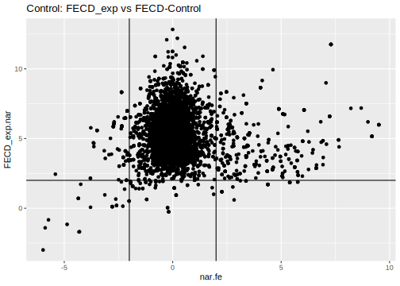<!-- -->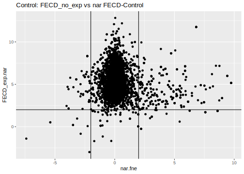<!-- -->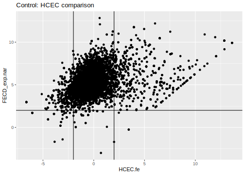<!-- -->

Let’s get the final pairs. We’ll extract the pairs by HCEC. I think we
should do this in two separate lists and see how they intersect.

Perhaps we should have only compared the selected final pairs with HCEC?
Otherwise, we got the differential expression in HCEC in the second list
and that’s it. Probably just pairs.

``` r
final_control <- downcorr_pairs_c %>% 
  filter((nar.fe >= 2 & FECD_exp.nar >= 2) | (nar.fe <= -2 & FECD_exp.nar >= 2)) %>% 
  mutate(check_HCEC = if_else(
    (HCEC.fe >= 2 & FECD_exp.nar >= 2) | (HCEC.fe <= -2 & FECD_exp.nar >= 2),
    "yes", "no"))
knitr::kable(final_control)
```

| RNA       | miRNA             | Correlation | p_value |     p_adj |   Ctrl.nar |   Ctrl.our | FECD_exp.nar | FECD_noexp.nar | FECD_exp.our | FECD_noexp.our |       HCEC |    nar.fe |    nar.fne |    HCEC.fe |   HCEC.fne | check_HCEC |
|:----------|:------------------|------------:|--------:|----------:|-----------:|-----------:|-------------:|---------------:|-------------:|---------------:|-----------:|----------:|-----------:|-----------:|-----------:|:-----------|
| ADAM33    | hsa-miR-1976      |  -0.8624887 |    0.01 | 0.0197650 | -2.8632477 |  2.5964002 |     2.212841 |      0.5917825 |    2.8057809 |       3.048214 |         NA |  5.076088 |  3.4550302 |         NA |         NA | NA         |
| ADM       | hsa-miR-329-5p    |  -0.7637626 |    0.03 | 0.0353612 |  8.5969350 |  8.3072188 |     5.861211 |      6.0933773 |    6.9882061 |       6.166485 |  3.7117574 | -2.735724 | -2.5035577 |  2.1494537 |  2.3816199 | yes        |
| ADM       | hsa-miR-338-5p    |  -0.7319251 |    0.01 | 0.0197650 |  8.5969350 |  8.3072188 |     5.861211 |      6.0933773 |    6.9882061 |       6.166485 |  3.7117574 | -2.735724 | -2.5035577 |  2.1494537 |  2.3816199 | yes        |
| ADM       | hsa-miR-374c-5p   |  -0.7545045 |    0.02 | 0.0281685 |  8.5969350 |  8.3072188 |     5.861211 |      6.0933773 |    6.9882061 |       6.166485 |  3.7117574 | -2.735724 | -2.5035577 |  2.1494537 |  2.3816199 | yes        |
| ADM       | hsa-miR-380-3p    |  -0.7092081 |    0.05 | 0.0515479 |  8.5969350 |  8.3072188 |     5.861211 |      6.0933773 |    6.9882061 |       6.166485 |  3.7117574 | -2.735724 | -2.5035577 |  2.1494537 |  2.3816199 | yes        |
| ADM       | hsa-miR-486-3p    |  -0.8333333 |    0.00 | 0.0000000 |  8.5969350 |  8.3072188 |     5.861211 |      6.0933773 |    6.9882061 |       6.166485 |  3.7117574 | -2.735724 | -2.5035577 |  2.1494537 |  2.3816199 | yes        |
| AKAP12    | hsa-miR-607       |  -0.8503146 |    0.00 | 0.0000000 |  2.8948098 |  4.0017242 |     5.483505 |      4.7588934 |    5.0405787 |       5.809774 |  9.3995458 |  2.588695 |  1.8640836 | -3.9160407 | -4.6406524 | yes        |
| AMOTL1    | hsa-miR-3690      |  -0.7904333 |    0.02 | 0.0281685 |  6.0133210 |  6.3271979 |     8.236553 |      7.9137774 |    8.6710984 |       8.671409 |  7.8320706 |  2.223232 |  1.9004564 |  0.4044826 |  0.0817068 | no         |
| AMOTL1    | hsa-miR-532-3p    |  -0.8728716 |    0.00 | 0.0000000 |  6.0133210 |  6.3271979 |     8.236553 |      7.9137774 |    8.6710984 |       8.671409 |  7.8320706 |  2.223232 |  1.9004564 |  0.4044826 |  0.0817068 | no         |
| ANGPT1    | hsa-miR-543       |  -0.7380952 |    0.01 | 0.0197650 | -0.6301259 |  1.4383333 |     2.669209 |      2.3530234 |    3.4340511 |       4.377876 | -1.9831705 |  3.299335 |  2.9831494 |  4.6523795 |  4.3361939 | yes        |
| ANKRD33B  | hsa-miR-3614-3p   |  -0.7325886 |    0.02 | 0.0281685 |  2.0936710 |  2.8613259 |     5.072975 |      4.1807738 |    4.9612799 |       5.683353 |  6.5367804 |  2.979304 |  2.0871028 | -1.4638052 | -2.3560066 | no         |
| ANKRD33B  | hsa-miR-371b-5p   |  -0.8117541 |    0.05 | 0.0515479 |  2.0936710 |  2.8613259 |     5.072975 |      4.1807738 |    4.9612799 |       5.683353 |  6.5367804 |  2.979304 |  2.0871028 | -1.4638052 | -2.3560066 | no         |
| ANKRD33B  | hsa-miR-649       |  -0.7142857 |    0.01 | 0.0197650 |  2.0936710 |  2.8613259 |     5.072975 |      4.1807738 |    4.9612799 |       5.683353 |  6.5367804 |  2.979304 |  2.0871028 | -1.4638052 | -2.3560066 | no         |
| APLN      | hsa-miR-296-5p    |  -0.7990704 |    0.02 | 0.0281685 |  3.1223248 |  4.2837021 |     5.655780 |      6.3545960 |    5.4900304 |       6.489342 |  2.9303513 |  2.533455 |  3.2322711 |  2.7254283 |  3.4242447 | yes        |
| APLN      | hsa-miR-3196      |  -0.7092081 |    0.03 | 0.0353612 |  3.1223248 |  4.2837021 |     5.655780 |      6.3545960 |    5.4900304 |       6.489342 |  2.9303513 |  2.533455 |  3.2322711 |  2.7254283 |  3.4242447 | yes        |
| APOL4     | hsa-miR-1303      |  -0.7142857 |    0.02 | 0.0281685 |  3.6221370 |  3.5131523 |     5.674869 |      4.5830155 |    5.3215218 |       3.845440 |         NA |  2.052732 |  0.9608786 |         NA |         NA | NA         |
| APOL4     | hsa-miR-3127-5p   |  -0.7075276 |    0.02 | 0.0281685 |  3.6221370 |  3.5131523 |     5.674869 |      4.5830155 |    5.3215218 |       3.845440 |         NA |  2.052732 |  0.9608786 |         NA |         NA | NA         |
| APOL4     | hsa-miR-4455      |  -0.9047619 |    0.00 | 0.0000000 |  3.6221370 |  3.5131523 |     5.674869 |      4.5830155 |    5.3215218 |       3.845440 |         NA |  2.052732 |  0.9608786 |         NA |         NA | NA         |
| APOL4     | hsa-miR-548n      |  -0.8571429 |    0.01 | 0.0197650 |  3.6221370 |  3.5131523 |     5.674869 |      4.5830155 |    5.3215218 |       3.845440 |         NA |  2.052732 |  0.9608786 |         NA |         NA | NA         |
| ARAP2     | hsa-miR-519c-3p   |  -0.7485931 |    0.01 | 0.0197650 | -0.3197946 |  1.5677163 |     3.032296 |      3.0913278 |    2.9755414 |       4.292086 |  3.4403767 |  3.352090 |  3.4111223 | -0.4080808 | -0.3490489 | no         |
| ARHGAP18  | hsa-miR-578       |  -0.7142857 |    0.01 | 0.0197650 |  3.2274277 |  3.3201359 |     5.803334 |      5.1024079 |    5.5053598 |       5.554920 |  4.2408275 |  2.575906 |  1.8749802 |  1.5625065 |  0.8615804 | no         |
| ARHGAP28  | hsa-miR-196a-5p   |  -0.7065995 |    0.01 | 0.0197650 | -1.2504591 |  1.7287814 |     3.710861 |      1.4653433 |    3.4931241 |       4.620814 |  3.5092783 |  4.961320 |  2.7158024 |  0.2015824 | -2.0439350 | no         |
| ARHGAP28  | hsa-miR-3161      |  -0.8313253 |    0.00 | 0.0000000 | -1.2504591 |  1.7287814 |     3.710861 |      1.4653433 |    3.4931241 |       4.620814 |  3.5092783 |  4.961320 |  2.7158024 |  0.2015824 | -2.0439350 | no         |
| ARHGAP28  | hsa-miR-548l      |  -0.7731371 |    0.03 | 0.0353612 | -1.2504591 |  1.7287814 |     3.710861 |      1.4653433 |    3.4931241 |       4.620814 |  3.5092783 |  4.961320 |  2.7158024 |  0.2015824 | -2.0439350 | no         |
| ATP11A    | hsa-miR-1248      |  -0.7325886 |    0.03 | 0.0353612 |  4.0422134 |  4.7041567 |     6.522910 |      6.1175165 |    6.9263222 |       6.896304 |  7.2865138 |  2.480696 |  2.0753031 | -0.7636041 | -1.1689973 | no         |
| ATP11A    | hsa-miR-3144-5p   |  -0.7863867 |    0.01 | 0.0197650 |  4.0422134 |  4.7041567 |     6.522910 |      6.1175165 |    6.9263222 |       6.896304 |  7.2865138 |  2.480696 |  2.0753031 | -0.7636041 | -1.1689973 | no         |
| ATP11A    | hsa-miR-365b-5p   |  -0.8624887 |    0.02 | 0.0281685 |  4.0422134 |  4.7041567 |     6.522910 |      6.1175165 |    6.9263222 |       6.896304 |  7.2865138 |  2.480696 |  2.0753031 | -0.7636041 | -1.1689973 | no         |
| ATP11A    | hsa-miR-448       |  -0.7102848 |    0.00 | 0.0000000 |  4.0422134 |  4.7041567 |     6.522910 |      6.1175165 |    6.9263222 |       6.896304 |  7.2865138 |  2.480696 |  2.0753031 | -0.7636041 | -1.1689973 | no         |
| B3GALT5   | hsa-miR-4284      |  -0.7863867 |    0.02 | 0.0281685 | -1.6633518 |  1.0637103 |     2.169973 |      1.0079862 |    2.4013494 |       3.530652 |         NA |  3.833324 |  2.6713380 |         NA |         NA | NA         |
| BCAT1     | hsa-miR-484       |  -0.7075276 |    0.04 | 0.0432093 |  1.5985282 |  2.1599709 |     3.922726 |      4.9530012 |    4.1517576 |       6.588365 |  2.4060042 |  2.324198 |  3.3544729 |  1.5167219 |  2.5469969 | no         |
| BCL2      | hsa-miR-3150b-3p  |  -0.7325886 |    0.02 | 0.0281685 |  1.6538746 |  3.3196874 |     4.459298 |      3.3495742 |    4.6315455 |       5.235366 |  4.7285989 |  2.805423 |  1.6956997 | -0.2693012 | -1.3790246 | no         |
| BCL2      | hsa-miR-577       |  -0.7380952 |    0.01 | 0.0197650 |  1.6538746 |  3.3196874 |     4.459298 |      3.3495742 |    4.6315455 |       5.235366 |  4.7285989 |  2.805423 |  1.6956997 | -0.2693012 | -1.3790246 | no         |
| BCL2      | hsa-miR-630       |  -0.8095238 |    0.01 | 0.0197650 |  1.6538746 |  3.3196874 |     4.459298 |      3.3495742 |    4.6315455 |       5.235366 |  4.7285989 |  2.805423 |  1.6956997 | -0.2693012 | -1.3790246 | no         |
| BGN       | hsa-miR-4455      |  -0.7619048 |    0.01 | 0.0197650 |  4.8504099 |  5.3489535 |     8.115935 |      7.2892421 |    8.7822938 |       9.471014 |  2.1308541 |  3.265525 |  2.4388323 |  5.9850805 |  5.1583881 | yes        |
| BHLHE40   | hsa-miR-342-5p    |  -0.7425283 |    0.02 | 0.0281685 |  8.6928568 |  8.2203033 |     6.457674 |      6.3576149 |    6.5073285 |       6.686206 |  4.9480290 | -2.235183 | -2.3352419 |  1.5096453 |  1.4095859 | no         |
| C1QTNF1   | hsa-miR-342-5p    |  -0.8503146 |    0.00 | 0.0000000 | -0.2669507 |  2.3008313 |     2.291862 |      1.6816104 |    3.3194127 |       3.749403 |  2.7101395 |  2.558813 |  1.9485611 | -0.4182776 | -1.0285291 | no         |
| CADM3     | hsa-miR-1275      |  -0.8878560 |    0.00 | 0.0000000 |  1.9280626 |  2.3251665 |     8.997181 |      6.9931204 |    8.8096621 |       8.424482 |  3.8156907 |  7.069118 |  5.0650578 |  5.1814904 |  3.1774297 | yes        |
| CCDC68    | hsa-miR-3161      |  -0.8742672 |    0.00 | 0.0000000 | -0.3563672 |  1.6589579 |     3.692159 |      3.1568621 |    3.5220833 |       3.496107 |  2.4894784 |  4.048527 |  3.5132293 |  1.2026810 |  0.6673837 | no         |
| CCDC80    | hsa-miR-650       |  -0.8455943 |    0.01 | 0.0197650 |  5.1163721 |  4.9739458 |     7.932326 |      7.6384470 |    8.3565198 |       9.461286 |  4.5004443 |  2.815954 |  2.5220749 |  3.4318818 |  3.1380027 | yes        |
| CCND2     | hsa-miR-371b-5p   |  -0.7102848 |    0.01 | 0.0197650 |  4.6053056 |  5.9741890 |     8.653750 |      9.3228109 |    8.7430956 |      10.248973 |  4.4330564 |  4.048444 |  4.7175053 |  4.2206932 |  4.8897544 | yes        |
| CCND2     | hsa-miR-520b      |  -0.7637626 |    0.01 | 0.0197650 |  4.6053056 |  5.9741890 |     8.653750 |      9.3228109 |    8.7430956 |      10.248973 |  4.4330564 |  4.048444 |  4.7175053 |  4.2206932 |  4.8897544 | yes        |
| CCND2     | hsa-miR-761       |  -0.8263621 |    0.02 | 0.0281685 |  4.6053056 |  5.9741890 |     8.653750 |      9.3228109 |    8.7430956 |      10.248973 |  4.4330564 |  4.048444 |  4.7175053 |  4.2206932 |  4.8897544 | yes        |
| CCR5      | hsa-miR-628-5p    |  -0.8643935 |    0.00 | 0.0000000 | -3.6767572 | -1.9322730 |     2.303106 |      1.9114467 |    2.7172220 |       3.871610 |         NA |  5.979863 |  5.5882038 |         NA |         NA | NA         |
| CD109     | hsa-miR-515-5p    |  -0.9221722 |    0.00 | 0.0000000 | -0.4911663 |  1.4175009 |     2.223720 |      1.9045805 |    2.5140644 |       5.076415 |  6.9862223 |  2.714886 |  2.3957468 | -4.7625024 | -5.0816419 | yes        |
| CD44      | hsa-miR-1276      |  -0.8095238 |    0.00 | 0.0000000 |  0.7584947 |  3.2553460 |     2.878702 |      3.7277747 |    3.3398867 |       6.930978 |  6.8722079 |  2.120207 |  2.9692799 | -3.9935064 | -3.1444333 | yes        |
| CD74      | hsa-miR-4458      |  -0.7619048 |    0.02 | 0.0281685 |  5.0393442 |  6.0842404 |     9.166999 |      8.9015353 |    9.1270067 |      10.687615 | -3.7037091 |  4.127654 |  3.8621911 | 12.8707077 | 12.6052444 | yes        |
| CD84      | hsa-miR-4425      |  -0.7610194 |    0.04 | 0.0432093 | -0.9225859 |  0.4606987 |     4.524674 |      4.6583924 |    3.3749845 |       5.302307 |         NA |  5.447260 |  5.5809783 |         NA |         NA | NA         |
| CD9       | hsa-miR-338-5p    |  -0.9027076 |    0.01 | 0.0197650 |  0.4866676 |  3.6015344 |     3.982263 |      3.2852701 |    3.6880233 |       5.369555 |  6.2798302 |  3.495596 |  2.7986025 | -2.2975668 | -2.9945600 | yes        |
| CDH11     | hsa-miR-181a-5p   |  -0.7619048 |    0.00 | 0.0000000 |  5.8699227 |  6.4623213 |     8.347220 |      7.7398609 |    8.6222526 |       8.625492 | -3.7037091 |  2.477297 |  1.8699382 | 12.0509289 | 11.4435700 | yes        |
| CDH11     | hsa-miR-200c-3p   |  -0.7619048 |    0.00 | 0.0000000 |  5.8699227 |  6.4623213 |     8.347220 |      7.7398609 |    8.6222526 |       8.625492 | -3.7037091 |  2.477297 |  1.8699382 | 12.0509289 | 11.4435700 | yes        |
| CDH11     | hsa-miR-27b-3p    |  -0.8095238 |    0.00 | 0.0000000 |  5.8699227 |  6.4623213 |     8.347220 |      7.7398609 |    8.6222526 |       8.625492 | -3.7037091 |  2.477297 |  1.8699382 | 12.0509289 | 11.4435700 | yes        |
| CDKL1     | hsa-miR-4435      |  -0.8295151 |    0.01 | 0.0197650 |  1.2551750 |  1.7689207 |     3.459837 |      2.4859579 |    3.0788498 |       3.782387 |  2.3365915 |  2.204662 |  1.2307829 |  1.1232458 |  0.1493664 | no         |
| CDKL1     | hsa-miR-597-5p    |  -0.8624887 |    0.01 | 0.0197650 |  1.2551750 |  1.7689207 |     3.459837 |      2.4859579 |    3.0788498 |       3.782387 |  2.3365915 |  2.204662 |  1.2307829 |  1.1232458 |  0.1493664 | no         |
| CDKN2B    | hsa-miR-641       |  -0.7637626 |    0.02 | 0.0281685 |  0.5348140 |  0.5664104 |     5.860912 |      6.5174096 |    6.0063652 |       7.959331 |  5.3631354 |  5.326098 |  5.9825956 |  0.4977761 |  1.1542742 | no         |
| CHST11    | hsa-miR-654-5p    |  -0.7325886 |    0.05 | 0.0515479 | -0.6816881 |  2.9726625 |     3.167416 |      3.0998485 |    3.2824451 |       5.072248 |  3.1966762 |  3.849104 |  3.7815366 | -0.0292600 | -0.0968277 | no         |
| CIITA     | hsa-miR-4421      |  -0.7863867 |    0.01 | 0.0197650 | -0.6212365 |  1.5513810 |     6.204975 |      5.1102011 |    5.1840167 |       6.353117 |  2.2177815 |  6.826212 |  5.7314376 |  3.9871936 |  2.8924195 | yes        |
| CNTN3     | hsa-miR-107       |  -0.9047619 |    0.01 | 0.0197650 |  3.0467186 |  4.0064593 |     5.799730 |      5.0390219 |    5.7328720 |       5.740925 | -3.0328158 |  2.753011 |  1.9923033 |  8.8325459 |  8.0718377 | yes        |
| CNTN3     | hsa-miR-485-3p    |  -0.7380952 |    0.01 | 0.0197650 |  3.0467186 |  4.0064593 |     5.799730 |      5.0390219 |    5.7328720 |       5.740925 | -3.0328158 |  2.753011 |  1.9923033 |  8.8325459 |  8.0718377 | yes        |
| COL1A1    | hsa-miR-1275      |  -0.9132233 |    0.00 | 0.0000000 |  3.6516923 |  5.7042907 |     6.836717 |      7.8943470 |    7.7646191 |      11.893221 |  5.4343382 |  3.185025 |  4.2426547 |  1.4023792 |  2.4600087 | no         |
| COL1A1    | hsa-miR-371b-5p   |  -0.8244377 |    0.00 | 0.0000000 |  3.6516923 |  5.7042907 |     6.836717 |      7.8943470 |    7.7646191 |      11.893221 |  5.4343382 |  3.185025 |  4.2426547 |  1.4023792 |  2.4600087 | no         |
| COL1A1    | hsa-miR-612       |  -0.7857143 |    0.02 | 0.0281685 |  3.6516923 |  5.7042907 |     6.836717 |      7.8943470 |    7.7646191 |      11.893221 |  5.4343382 |  3.185025 |  4.2426547 |  1.4023792 |  2.4600087 | no         |
| COL4A1    | hsa-miR-548k      |  -0.8728716 |    0.02 | 0.0281685 |  3.4310628 |  5.3372451 |     6.060179 |      7.4639988 |    7.1079627 |       7.980302 |  6.6150684 |  2.629116 |  4.0329361 | -0.5548898 |  0.8489304 | no         |
| COL4A2    | hsa-miR-361-5p    |  -0.7380952 |    0.02 | 0.0281685 |  3.8615227 |  6.3673652 |     6.710153 |      7.9390694 |    7.6636143 |       8.404873 |  7.3533811 |  2.848631 |  4.0775467 | -0.6432280 |  0.5856883 | no         |
| COL5A1    | hsa-miR-1973      |  -0.7229685 |    0.05 | 0.0515479 |  2.2324863 |  4.6288415 |     7.126937 |      8.1224739 |    7.7987026 |       9.579623 |  1.9497452 |  4.894450 |  5.8899877 |  5.1771914 |  6.1727288 | yes        |
| COL5A1    | hsa-miR-4755-5p   |  -0.7904333 |    0.01 | 0.0197650 |  2.2324863 |  4.6288415 |     7.126937 |      8.1224739 |    7.7987026 |       9.579623 |  1.9497452 |  4.894450 |  5.8899877 |  5.1771914 |  6.1727288 | yes        |
| COL5A1    | hsa-miR-490-5p    |  -0.7364854 |    0.02 | 0.0281685 |  2.2324863 |  4.6288415 |     7.126937 |      8.1224739 |    7.7987026 |       9.579623 |  1.9497452 |  4.894450 |  5.8899877 |  5.1771914 |  6.1727288 | yes        |
| COL5A1    | hsa-miR-548q      |  -0.7857143 |    0.02 | 0.0281685 |  2.2324863 |  4.6288415 |     7.126937 |      8.1224739 |    7.7987026 |       9.579623 |  1.9497452 |  4.894450 |  5.8899877 |  5.1771914 |  6.1727288 | yes        |
| COL5A1    | hsa-miR-654-5p    |  -0.7637626 |    0.02 | 0.0281685 |  2.2324863 |  4.6288415 |     7.126937 |      8.1224739 |    7.7987026 |       9.579623 |  1.9497452 |  4.894450 |  5.8899877 |  5.1771914 |  6.1727288 | yes        |
| COL6A2    | hsa-miR-3158-3p   |  -0.7142857 |    0.01 | 0.0197650 |  1.6879448 |  5.5780856 |     6.765640 |      6.8993001 |    6.6929534 |       9.481885 |  3.9022627 |  5.077695 |  5.2113553 |  2.8633770 |  2.9970374 | yes        |
| COL6A2    | hsa-miR-596       |  -0.8263621 |    0.02 | 0.0281685 |  1.6879448 |  5.5780856 |     6.765640 |      6.8993001 |    6.6929534 |       9.481885 |  3.9022627 |  5.077695 |  5.2113553 |  2.8633770 |  2.9970374 | yes        |
| CSMD1     | hsa-miR-3613-3p   |  -0.8383384 |    0.00 | 0.0000000 |  0.1423343 |  0.6014452 |     2.417909 |     -0.1602256 |    2.9203579 |       1.404244 |         NA |  2.275575 | -0.3025599 |         NA |         NA | NA         |
| CSMD1     | hsa-miR-492       |  -0.7863867 |    0.01 | 0.0197650 |  0.1423343 |  0.6014452 |     2.417909 |     -0.1602256 |    2.9203579 |       1.404244 |         NA |  2.275575 | -0.3025599 |         NA |         NA | NA         |
| CSMD1     | hsa-miR-568       |  -0.8051176 |    0.01 | 0.0197650 |  0.1423343 |  0.6014452 |     2.417909 |     -0.1602256 |    2.9203579 |       1.404244 |         NA |  2.275575 | -0.3025599 |         NA |         NA | NA         |
| CSMD2     | hsa-miR-3180-5p   |  -0.9132233 |    0.00 | 0.0000000 |  5.5153358 |  6.3406760 |     3.470503 |      5.7313915 |    4.4105327 |       5.563599 | -1.4747524 | -2.044833 |  0.2160557 |  4.9452552 |  7.2061439 | yes        |
| CSMD2     | hsa-miR-3202      |  -0.7356521 |    0.03 | 0.0353612 |  5.5153358 |  6.3406760 |     3.470503 |      5.7313915 |    4.4105327 |       5.563599 | -1.4747524 | -2.044833 |  0.2160557 |  4.9452552 |  7.2061439 | yes        |
| CSRNP1    | hsa-miR-1254      |  -0.7102848 |    0.03 | 0.0353612 |  7.8840428 |  6.4391649 |     5.014589 |      5.0222985 |    5.0426172 |       4.948360 |  5.1770575 | -2.869454 | -2.8617443 | -0.1624683 | -0.1547590 | no         |
| CTH       | hsa-miR-302e      |  -0.9515026 |    0.00 | 0.0000000 |  5.5542977 |  4.6764590 |     3.382611 |      3.5755079 |    3.2686429 |       3.048110 |  0.4516994 | -2.171687 | -1.9787898 |  2.9309115 |  3.1238085 | yes        |
| DCLK1     | hsa-miR-1244      |  -0.7664808 |    0.03 | 0.0353612 |  1.5729744 |  2.3304598 |     6.729208 |      4.6583443 |    7.3382779 |       5.356505 |  5.0686558 |  5.156233 |  3.0853699 |  1.6605521 | -0.4103115 | no         |
| DCLK1     | hsa-miR-409-3p    |  -0.7910399 |    0.03 | 0.0353612 |  1.5729744 |  2.3304598 |     6.729208 |      4.6583443 |    7.3382779 |       5.356505 |  5.0686558 |  5.156233 |  3.0853699 |  1.6605521 | -0.4103115 | no         |
| DDAH1     | hsa-miR-654-3p    |  -0.7305520 |    0.04 | 0.0432093 |  4.6719745 |  4.2063221 |     7.067633 |      6.6689455 |    7.1882730 |       7.049366 |  7.1512328 |  2.395658 |  1.9969710 | -0.0836001 | -0.4822874 | no         |
| DDIT4     | hsa-miR-1202      |  -0.8982197 |    0.00 | 0.0000000 |  9.0707000 |  8.9097659 |     5.583672 |      5.8526462 |    5.9768843 |       5.719470 |  6.7277894 | -3.487028 | -3.2180539 | -1.1441178 | -0.8751432 | no         |
| DDIT4     | hsa-miR-590-3p    |  -0.8295151 |    0.00 | 0.0000000 |  9.0707000 |  8.9097659 |     5.583672 |      5.8526462 |    5.9768843 |       5.719470 |  6.7277894 | -3.487028 | -3.2180539 | -1.1441178 | -0.8751432 | no         |
| DDIT4     | hsa-miR-671-5p    |  -0.8455943 |    0.00 | 0.0000000 |  9.0707000 |  8.9097659 |     5.583672 |      5.8526462 |    5.9768843 |       5.719470 |  6.7277894 | -3.487028 | -3.2180539 | -1.1441178 | -0.8751432 | no         |
| DKK3      | hsa-miR-1290      |  -0.7857143 |    0.01 | 0.0197650 |  4.1199922 |  5.1515078 |     7.514778 |      6.5685838 |    7.4395962 |       8.498007 |  5.9876433 |  3.394786 |  2.4485916 |  1.5271346 |  0.5809405 | no         |
| DKK3      | hsa-miR-4516      |  -0.7142857 |    0.02 | 0.0281685 |  4.1199922 |  5.1515078 |     7.514778 |      6.5685838 |    7.4395962 |       8.498007 |  5.9876433 |  3.394786 |  2.4485916 |  1.5271346 |  0.5809405 | no         |
| DKK3      | hsa-miR-513a-3p   |  -0.7619048 |    0.01 | 0.0197650 |  4.1199922 |  5.1515078 |     7.514778 |      6.5685838 |    7.4395962 |       8.498007 |  5.9876433 |  3.394786 |  2.4485916 |  1.5271346 |  0.5809405 | no         |
| DKK3      | hsa-miR-92b-3p    |  -0.7319251 |    0.02 | 0.0281685 |  4.1199922 |  5.1515078 |     7.514778 |      6.5685838 |    7.4395962 |       8.498007 |  5.9876433 |  3.394786 |  2.4485916 |  1.5271346 |  0.5809405 | no         |
| DRAM1     | hsa-miR-1827      |  -0.7075276 |    0.01 | 0.0197650 |  0.2188802 |  0.4781008 |     2.639977 |      3.4229963 |    2.9170623 |       5.412302 |  4.2353092 |  2.421097 |  3.2041161 | -1.5953321 | -0.8123129 | no         |
| DRAM1     | hsa-miR-199a-5p   |  -0.7142857 |    0.04 | 0.0432093 |  0.2188802 |  0.4781008 |     2.639977 |      3.4229963 |    2.9170623 |       5.412302 |  4.2353092 |  2.421097 |  3.2041161 | -1.5953321 | -0.8123129 | no         |
| DRAM1     | hsa-miR-4435      |  -0.7075276 |    0.06 | 0.0606542 |  0.2188802 |  0.4781008 |     2.639977 |      3.4229963 |    2.9170623 |       5.412302 |  4.2353092 |  2.421097 |  3.2041161 | -1.5953321 | -0.8123129 | no         |
| DRAM1     | hsa-miR-509-3-5p  |  -0.8051176 |    0.01 | 0.0197650 |  0.2188802 |  0.4781008 |     2.639977 |      3.4229963 |    2.9170623 |       5.412302 |  4.2353092 |  2.421097 |  3.2041161 | -1.5953321 | -0.8123129 | no         |
| DRAM1     | hsa-miR-582-3p    |  -0.7610194 |    0.02 | 0.0281685 |  0.2188802 |  0.4781008 |     2.639977 |      3.4229963 |    2.9170623 |       5.412302 |  4.2353092 |  2.421097 |  3.2041161 | -1.5953321 | -0.8123129 | no         |
| EDN1      | hsa-miR-433-3p    |  -0.8577942 |    0.00 | 0.0000000 | -1.0053236 | -1.1031905 |     3.598336 |      4.1615425 |    3.9868603 |       3.673215 |         NA |  4.603660 |  5.1668662 |         NA |         NA | NA         |
| EDN1      | hsa-miR-765       |  -0.7610194 |    0.03 | 0.0353612 | -1.0053236 | -1.1031905 |     3.598336 |      4.1615425 |    3.9868603 |       3.673215 |         NA |  4.603660 |  5.1668662 |         NA |         NA | NA         |
| EGR1      | hsa-miR-1261      |  -0.7664808 |    0.05 | 0.0515479 |  8.8836727 |  7.8502421 |     6.185002 |      6.4767651 |    5.8436512 |       6.832949 |  6.5344647 | -2.698671 | -2.4069076 | -0.3494630 | -0.0576996 | no         |
| EGR1      | hsa-miR-1322      |  -0.8333333 |    0.01 | 0.0197650 |  8.8836727 |  7.8502421 |     6.185002 |      6.4767651 |    5.8436512 |       6.832949 |  6.5344647 | -2.698671 | -2.4069076 | -0.3494630 | -0.0576996 | no         |
| EMILIN2   | hsa-miR-202-3p    |  -0.7425283 |    0.02 | 0.0281685 |  1.5537759 |  2.5095667 |     3.580811 |      3.1039914 |    4.0757886 |       4.458298 |  3.6767897 |  2.027035 |  1.5502155 | -0.0959787 | -0.5727983 | no         |
| ENC1      | hsa-miR-876-5p    |  -0.7325886 |    0.07 | 0.0702497 |  0.3755497 |  0.3595031 |     3.754760 |      6.0895759 |    4.2035512 |       6.570522 |  6.7973937 |  3.379210 |  5.7140262 | -3.0426342 | -0.7078178 | yes        |
| ENC1      | hsa-miR-922       |  -0.7356521 |    0.00 | 0.0000000 |  0.3755497 |  0.3595031 |     3.754760 |      6.0895759 |    4.2035512 |       6.570522 |  6.7973937 |  3.379210 |  5.7140262 | -3.0426342 | -0.7078178 | yes        |
| ENTPD1    | hsa-miR-1257      |  -0.7857143 |    0.03 | 0.0353612 |  0.0156868 |  2.5003973 |     4.096306 |      3.9524042 |    3.4224080 |       4.852554 |         NA |  4.080619 |  3.9367174 |         NA |         NA | NA         |
| ENTPD1    | hsa-miR-4461      |  -0.7319251 |    0.03 | 0.0353612 |  0.0156868 |  2.5003973 |     4.096306 |      3.9524042 |    3.4224080 |       4.852554 |         NA |  4.080619 |  3.9367174 |         NA |         NA | NA         |
| ENTPD1    | hsa-miR-582-5p    |  -0.8333333 |    0.02 | 0.0281685 |  0.0156868 |  2.5003973 |     4.096306 |      3.9524042 |    3.4224080 |       4.852554 |         NA |  4.080619 |  3.9367174 |         NA |         NA | NA         |
| EPB41L3   | hsa-miR-627-3p    |  -0.8051176 |    0.03 | 0.0353612 | -1.0634259 |  2.1506199 |     4.249914 |      4.3672632 |    4.7451160 |       5.916052 |  0.6702006 |  5.313340 |  5.4306891 |  3.5797133 |  3.6970626 | yes        |
| F5        | hsa-miR-323a-3p   |  -0.7075276 |    0.02 | 0.0281685 |  5.3156432 |  6.0173870 |     9.939030 |      7.5466070 |    9.9184608 |       8.643854 |         NA |  4.623386 |  2.2309638 |         NA |         NA | NA         |
| FAT4      | hsa-miR-1305      |  -0.8333333 |    0.01 | 0.0197650 |  2.9808087 |  4.2570258 |     4.994954 |      4.2184895 |    4.7324870 |       5.322740 |  6.1026175 |  2.014145 |  1.2376808 | -1.1076637 | -1.8841280 | no         |
| FEZ1      | hsa-miR-661       |  -0.8742672 |    0.01 | 0.0197650 |  1.2385547 |  2.3066795 |     3.679877 |      3.1314228 |    3.6006860 |       4.405603 |  1.6856391 |  2.441323 |  1.8928681 |  1.9942381 |  1.4457837 | no         |
| FGD4      | hsa-miR-198       |  -0.7185758 |    0.01 | 0.0197650 |  1.9498097 |  3.6254949 |     4.274169 |      4.4567736 |    4.0520862 |       5.734811 |  6.8762358 |  2.324359 |  2.5069639 | -2.6020666 | -2.4194622 | yes        |
| FGD4      | hsa-miR-324-3p    |  -0.9027076 |    0.00 | 0.0000000 |  1.9498097 |  3.6254949 |     4.274169 |      4.4567736 |    4.0520862 |       5.734811 |  6.8762358 |  2.324359 |  2.5069639 | -2.6020666 | -2.4194622 | yes        |
| FGD4      | hsa-miR-582-5p    |  -0.8333333 |    0.02 | 0.0281685 |  1.9498097 |  3.6254949 |     4.274169 |      4.4567736 |    4.0520862 |       5.734811 |  6.8762358 |  2.324359 |  2.5069639 | -2.6020666 | -2.4194622 | yes        |
| FHL2      | hsa-miR-1262      |  -0.7619048 |    0.00 | 0.0000000 |  5.1280628 |  5.1630978 |     7.303614 |      6.6683938 |    7.4273329 |       7.461474 |  7.1662977 |  2.175552 |  1.5403310 |  0.1373167 | -0.4979039 | no         |
| FHL2      | hsa-miR-142-5p    |  -0.7325886 |    0.01 | 0.0197650 |  5.1280628 |  5.1630978 |     7.303614 |      6.6683938 |    7.4273329 |       7.461474 |  7.1662977 |  2.175552 |  1.5403310 |  0.1373167 | -0.4979039 | no         |
| FLNC      | hsa-miR-3127-5p   |  -0.9515026 |    0.00 | 0.0000000 |  0.2742860 |  6.7252637 |     3.663972 |      5.4837194 |    4.7948661 |       7.708896 |  8.1311753 |  3.389686 |  5.2094334 | -4.4672030 | -2.6474558 | yes        |
| FLNC      | hsa-miR-3196      |  -0.8728716 |    0.00 | 0.0000000 |  0.2742860 |  6.7252637 |     3.663972 |      5.4837194 |    4.7948661 |       7.708896 |  8.1311753 |  3.389686 |  5.2094334 | -4.4672030 | -2.6474558 | yes        |
| FLNC      | hsa-miR-320c      |  -0.9132233 |    0.00 | 0.0000000 |  0.2742860 |  6.7252637 |     3.663972 |      5.4837194 |    4.7948661 |       7.708896 |  8.1311753 |  3.389686 |  5.2094334 | -4.4672030 | -2.6474558 | yes        |
| FLNC      | hsa-miR-485-5p    |  -0.7637626 |    0.02 | 0.0281685 |  0.2742860 |  6.7252637 |     3.663972 |      5.4837194 |    4.7948661 |       7.708896 |  8.1311753 |  3.389686 |  5.2094334 | -4.4672030 | -2.6474558 | yes        |
| FMN1      | hsa-miR-1197      |  -0.7610194 |    0.01 | 0.0197650 |  0.5899430 |  2.7593989 |     3.573346 |      4.1621720 |    3.1372314 |       4.479254 |  0.8575948 |  2.983403 |  3.5722289 |  2.7157516 |  3.3045772 | yes        |
| FMNL3     | hsa-miR-515-3p    |  -0.8624887 |    0.02 | 0.0281685 |  0.5210427 |  2.6436234 |     5.371993 |      5.0787508 |    4.4242940 |       6.249742 |  6.5174409 |  4.850951 |  4.5577081 | -1.1454476 | -1.4386901 | no         |
| FN1       | hsa-miR-202-3p    |  -0.8503146 |    0.02 | 0.0281685 |  4.4574493 |  5.2451828 |    11.755040 |     11.2742448 |   11.6143860 |      12.699088 |  7.8017573 |  7.297591 |  6.8167955 |  3.9532826 |  3.4724875 | yes        |
| FN1       | hsa-miR-3185      |  -0.7075276 |    0.04 | 0.0432093 |  4.4574493 |  5.2451828 |    11.755040 |     11.2742448 |   11.6143860 |      12.699088 |  7.8017573 |  7.297591 |  6.8167955 |  3.9532826 |  3.4724875 | yes        |
| FN1       | hsa-miR-320d      |  -0.7142857 |    0.05 | 0.0515479 |  4.4574493 |  5.2451828 |    11.755040 |     11.2742448 |   11.6143860 |      12.699088 |  7.8017573 |  7.297591 |  6.8167955 |  3.9532826 |  3.4724875 | yes        |
| FN1       | hsa-miR-384       |  -0.8051176 |    0.01 | 0.0197650 |  4.4574493 |  5.2451828 |    11.755040 |     11.2742448 |   11.6143860 |      12.699088 |  7.8017573 |  7.297591 |  6.8167955 |  3.9532826 |  3.4724875 | yes        |
| FN1       | hsa-miR-520a-5p   |  -0.7425283 |    0.02 | 0.0281685 |  4.4574493 |  5.2451828 |    11.755040 |     11.2742448 |   11.6143860 |      12.699088 |  7.8017573 |  7.297591 |  6.8167955 |  3.9532826 |  3.4724875 | yes        |
| FOS       | hsa-miR-3065-3p   |  -0.7910399 |    0.04 | 0.0432093 |  9.0758672 |  8.5561444 |     6.557092 |      6.3095730 |    6.5267460 |       6.462065 |  3.4345807 | -2.518775 | -2.7662942 |  3.1225118 |  2.8749923 | yes        |
| FRAS1     | hsa-miR-1224-3p   |  -0.7637626 |    0.04 | 0.0432093 | -0.4252206 |  1.5478708 |     2.199995 |      1.9040291 |    2.5401193 |       5.010538 |  3.2522744 |  2.625216 |  2.3292497 | -1.0522793 | -1.3482453 | no         |
| FRAS1     | hsa-miR-3202      |  -0.7356521 |    0.03 | 0.0353612 | -0.4252206 |  1.5478708 |     2.199995 |      1.9040291 |    2.5401193 |       5.010538 |  3.2522744 |  2.625216 |  2.3292497 | -1.0522793 | -1.3482453 | no         |
| FRAS1     | hsa-miR-637       |  -0.8455943 |    0.01 | 0.0197650 | -0.4252206 |  1.5478708 |     2.199995 |      1.9040291 |    2.5401193 |       5.010538 |  3.2522744 |  2.625216 |  2.3292497 | -1.0522793 | -1.3482453 | no         |
| FXYD5     | hsa-miR-520a-3p   |  -0.7325886 |    0.03 | 0.0353612 | -2.2301804 |  0.4648686 |     3.235011 |      2.5761154 |    2.9864730 |       4.403562 |  4.7919998 |  5.465192 |  4.8062958 | -1.5569886 | -2.2158844 | no         |
| GALNT1    | hsa-miR-224-5p    |  -0.8333333 |    0.00 | 0.0000000 |  4.5645085 |  4.7995696 |     6.626043 |      6.8987049 |    6.8908597 |       7.851567 |  5.9935091 |  2.061535 |  2.3341964 |  0.6325344 |  0.9051959 | no         |
| GAS7      | hsa-miR-1275      |  -0.7990704 |    0.00 | 0.0000000 | -0.9301519 |  4.2414707 |     3.405532 |      3.9557695 |    3.0512798 |       5.503288 |  3.5287502 |  4.335684 |  4.8859214 | -0.1232184 |  0.4270193 | no         |
| GAS7      | hsa-miR-1287-5p   |  -0.9132233 |    0.00 | 0.0000000 | -0.9301519 |  4.2414707 |     3.405532 |      3.9557695 |    3.0512798 |       5.503288 |  3.5287502 |  4.335684 |  4.8859214 | -0.1232184 |  0.4270193 | no         |
| GAS7      | hsa-miR-3614-3p   |  -0.7325886 |    0.00 | 0.0000000 | -0.9301519 |  4.2414707 |     3.405532 |      3.9557695 |    3.0512798 |       5.503288 |  3.5287502 |  4.335684 |  4.8859214 | -0.1232184 |  0.4270193 | no         |
| GBP4      | hsa-miR-556-5p    |  -0.7737031 |    0.02 | 0.0281685 |  0.3458418 |  1.9004527 |     3.746100 |      3.4889737 |    3.0791795 |       4.761262 | -3.7037091 |  3.400259 |  3.1431319 |  7.4498094 |  7.1926828 | yes        |
| GBP4      | hsa-miR-892b      |  -0.7229685 |    0.02 | 0.0281685 |  0.3458418 |  1.9004527 |     3.746100 |      3.4889737 |    3.0791795 |       4.761262 | -3.7037091 |  3.400259 |  3.1431319 |  7.4498094 |  7.1926828 | yes        |
| GBP4      | hsa-miR-940       |  -0.7319251 |    0.01 | 0.0197650 |  0.3458418 |  1.9004527 |     3.746100 |      3.4889737 |    3.0791795 |       4.761262 | -3.7037091 |  3.400259 |  3.1431319 |  7.4498094 |  7.1926828 | yes        |
| GFRA1     | hsa-miR-548ak     |  -0.7820704 |    0.02 | 0.0281685 | -4.0310692 |  0.7063379 |     5.158410 |      5.7085038 |    5.2625578 |       7.885137 |  3.5591649 |  9.189480 |  9.7395730 |  1.5992455 |  2.1493389 | no         |
| GFRA1     | hsa-miR-573       |  -0.7022469 |    0.05 | 0.0515479 | -4.0310692 |  0.7063379 |     5.158410 |      5.7085038 |    5.2625578 |       7.885137 |  3.5591649 |  9.189480 |  9.7395730 |  1.5992455 |  2.1493389 | no         |
| GFRA1     | hsa-miR-649       |  -0.7364854 |    0.06 | 0.0606542 | -4.0310692 |  0.7063379 |     5.158410 |      5.7085038 |    5.2625578 |       7.885137 |  3.5591649 |  9.189480 |  9.7395730 |  1.5992455 |  2.1493389 | no         |
| GFRA1     | hsa-miR-936       |  -0.8385255 |    0.04 | 0.0432093 | -4.0310692 |  0.7063379 |     5.158410 |      5.7085038 |    5.2625578 |       7.885137 |  3.5591649 |  9.189480 |  9.7395730 |  1.5992455 |  2.1493389 | no         |
| GLIPR1    | hsa-miR-626       |  -0.7863867 |    0.02 | 0.0281685 | -1.5268170 |  2.3292575 |     4.757805 |      6.6940381 |    5.3096962 |       7.404917 |  3.8175325 |  6.284622 |  8.2208551 |  0.9402724 |  2.8765056 | no         |
| GLIPR2    | hsa-miR-320c      |  -0.7273107 |    0.03 | 0.0353612 | -1.6988973 |  0.6135538 |     4.070693 |      3.8206110 |    4.1470776 |       4.989608 |  4.2856722 |  5.769591 |  5.5195083 | -0.2149789 | -0.4650612 | no         |
| GLIPR2    | hsa-miR-320d      |  -0.9221722 |    0.00 | 0.0000000 | -1.6988973 |  0.6135538 |     4.070693 |      3.8206110 |    4.1470776 |       4.989608 |  4.2856722 |  5.769591 |  5.5195083 | -0.2149789 | -0.4650612 | no         |
| GNAL      | hsa-miR-30e-3p    |  -0.7102848 |    0.02 | 0.0281685 |  1.0334770 |  1.9027952 |     3.682374 |      0.5694359 |    3.8449308 |       2.317537 |  1.6468788 |  2.648897 | -0.4640412 |  2.0354958 | -1.0774429 | yes        |
| GNB4      | hsa-miR-1224-3p   |  -0.7325886 |    0.00 | 0.0000000 | -1.8178116 |  2.5305049 |     2.781841 |      3.1957309 |    3.5261302 |       5.929016 |  5.6589138 |  4.599653 |  5.0135425 | -2.8770728 | -2.4631830 | yes        |
| GNB4      | hsa-miR-1254      |  -0.8878560 |    0.00 | 0.0000000 | -1.8178116 |  2.5305049 |     2.781841 |      3.1957309 |    3.5261302 |       5.929016 |  5.6589138 |  4.599653 |  5.0135425 | -2.8770728 | -2.4631830 | yes        |
| GNB4      | hsa-miR-371b-5p   |  -0.7102848 |    0.03 | 0.0353612 | -1.8178116 |  2.5305049 |     2.781841 |      3.1957309 |    3.5261302 |       5.929016 |  5.6589138 |  4.599653 |  5.0135425 | -2.8770728 | -2.4631830 | yes        |
| GNB4      | hsa-miR-515-5p    |  -0.7545045 |    0.02 | 0.0281685 | -1.8178116 |  2.5305049 |     2.781841 |      3.1957309 |    3.5261302 |       5.929016 |  5.6589138 |  4.599653 |  5.0135425 | -2.8770728 | -2.4631830 | yes        |
| GNB4      | hsa-miR-520a-3p   |  -0.7325886 |    0.06 | 0.0606542 | -1.8178116 |  2.5305049 |     2.781841 |      3.1957309 |    3.5261302 |       5.929016 |  5.6589138 |  4.599653 |  5.0135425 | -2.8770728 | -2.4631830 | yes        |
| GNG2      | hsa-miR-371b-5p   |  -0.7863867 |    0.01 | 0.0197650 | -2.2764116 |  1.9976374 |     4.195864 |      3.6472703 |    4.7263761 |       5.737201 |  0.7597946 |  6.472276 |  5.9236819 |  3.4360696 |  2.8874757 | yes        |
| GOLM1     | hsa-miR-548ak     |  -0.7545045 |    0.03 | 0.0353612 |  1.8442362 |  2.6265956 |     4.646525 |      4.1300246 |    4.2774451 |       4.727754 |  6.3700338 |  2.802288 |  2.2857885 | -1.7235092 | -2.2400092 | no         |
| GPR65     | hsa-miR-650       |  -0.8728716 |    0.01 | 0.0197650 |  0.9518142 |  1.3807584 |     3.244390 |      2.6926594 |    3.9028028 |       3.717048 |         NA |  2.292576 |  1.7408451 |         NA |         NA | NA         |
| HAVCR2    | hsa-miR-450a-1-3p |  -0.8878560 |    0.00 | 0.0000000 | -0.9239548 |  0.4543767 |     3.071997 |      3.3666229 |    2.9504244 |       4.672681 |         NA |  3.995952 |  4.2905777 |         NA |         NA | NA         |
| HHIPL1    | hsa-miR-891b      |  -0.7229685 |    0.01 | 0.0197650 |  0.3603595 |  1.7308092 |     3.301319 |      2.5597630 |    3.8639666 |       3.651497 | -2.2907965 |  2.940960 |  2.1994035 |  5.5921158 |  4.8505595 | yes        |
| HIF3A     | hsa-miR-650       |  -0.7364854 |    0.03 | 0.0353612 |  4.5378884 |  5.9024572 |     2.044580 |      2.5579110 |    2.1526005 |       1.550712 |         NA | -2.493308 | -1.9799774 |         NA |         NA | NA         |
| HLA-DOA   | hsa-miR-485-5p    |  -0.7637626 |    0.03 | 0.0353612 | -0.6631137 |  0.4492150 |     4.186326 |      4.2579385 |    4.1610237 |       5.724007 |         NA |  4.849440 |  4.9210522 |         NA |         NA | NA         |
| HSPA5     | hsa-miR-122-5p    |  -0.7857143 |    0.01 | 0.0197650 | 10.6846151 | 10.0162986 |     8.327009 |      8.3897830 |    8.5223826 |       8.572995 |  9.0113289 | -2.357606 | -2.2948321 | -0.6843197 | -0.6215459 | no         |
| HSPA5     | hsa-miR-338-5p    |  -0.7807201 |    0.00 | 0.0000000 | 10.6846151 | 10.0162986 |     8.327009 |      8.3897830 |    8.5223826 |       8.572995 |  9.0113289 | -2.357606 | -2.2948321 | -0.6843197 | -0.6215459 | no         |
| HSPA5     | hsa-miR-378f      |  -0.7065995 |    0.03 | 0.0353612 | 10.6846151 | 10.0162986 |     8.327009 |      8.3897830 |    8.5223826 |       8.572995 |  9.0113289 | -2.357606 | -2.2948321 | -0.6843197 | -0.6215459 | no         |
| HSPA5     | hsa-miR-545-3p    |  -0.7075276 |    0.03 | 0.0353612 | 10.6846151 | 10.0162986 |     8.327009 |      8.3897830 |    8.5223826 |       8.572995 |  9.0113289 | -2.357606 | -2.2948321 | -0.6843197 | -0.6215459 | no         |
| HSPA5     | hsa-miR-548j-3p   |  -0.7380952 |    0.00 | 0.0000000 | 10.6846151 | 10.0162986 |     8.327009 |      8.3897830 |    8.5223826 |       8.572995 |  9.0113289 | -2.357606 | -2.2948321 | -0.6843197 | -0.6215459 | no         |
| ICOSLG    | hsa-miR-548j-3p   |  -0.8095238 |    0.01 | 0.0197650 |  0.6634372 |  1.6130994 |     3.222630 |      2.7049639 |    3.0963688 |       4.055471 |  3.7774083 |  2.559192 |  2.0415267 | -0.5547789 | -1.0724445 | no         |
| ICOSLG    | hsa-miR-671-5p    |  -0.7364854 |    0.04 | 0.0432093 |  0.6634372 |  1.6130994 |     3.222630 |      2.7049639 |    3.0963688 |       4.055471 |  3.7774083 |  2.559192 |  2.0415267 | -0.5547789 | -1.0724445 | no         |
| ID2       | hsa-miR-1276      |  -0.7142857 |    0.00 | 0.0000000 |  6.6397395 |  5.2409142 |     4.174287 |      4.2328045 |    3.9660548 |       4.541910 |  0.9910898 | -2.465453 | -2.4069350 |  3.1831972 |  3.2417147 | yes        |
| IER5      | hsa-miR-1289      |  -0.7807201 |    0.03 | 0.0353612 |  6.2862691 |  5.0999291 |     4.105643 |      4.0107690 |    4.0645526 |       5.042166 |  6.4100194 | -2.180626 | -2.2755000 | -2.3043765 | -2.3992503 | yes        |
| IER5      | hsa-miR-34c-5p    |  -0.8263621 |    0.00 | 0.0000000 |  6.2862691 |  5.0999291 |     4.105643 |      4.0107690 |    4.0645526 |       5.042166 |  6.4100194 | -2.180626 | -2.2755000 | -2.3043765 | -2.3992503 | yes        |
| IER5      | hsa-miR-486-3p    |  -0.7619048 |    0.01 | 0.0197650 |  6.2862691 |  5.0999291 |     4.105643 |      4.0107690 |    4.0645526 |       5.042166 |  6.4100194 | -2.180626 | -2.2755000 | -2.3043765 | -2.3992503 | yes        |
| IER5      | hsa-miR-548d-3p   |  -0.7619048 |    0.04 | 0.0432093 |  6.2862691 |  5.0999291 |     4.105643 |      4.0107690 |    4.0645526 |       5.042166 |  6.4100194 | -2.180626 | -2.2755000 | -2.3043765 | -2.3992503 | yes        |
| IFRD1     | hsa-miR-548d-3p   |  -0.7619048 |    0.01 | 0.0197650 |  6.7779047 |  5.0260631 |     3.840362 |      4.1400827 |    3.7696711 |       4.606880 |  5.6088769 | -2.937543 | -2.6378221 | -1.7685155 | -1.4687943 | no         |
| IGF1      | hsa-miR-190a-5p   |  -0.7619048 |    0.01 | 0.0197650 |  0.9938881 |  2.8300728 |     7.050028 |      4.8627201 |    7.1494267 |       5.985823 |         NA |  6.056140 |  3.8688320 |         NA |         NA | NA         |
| IGF1      | hsa-miR-302a-3p   |  -0.7364854 |    0.00 | 0.0000000 |  0.9938881 |  2.8300728 |     7.050028 |      4.8627201 |    7.1494267 |       5.985823 |         NA |  6.056140 |  3.8688320 |         NA |         NA | NA         |
| IGF1      | hsa-miR-505-3p    |  -0.7737031 |    0.00 | 0.0000000 |  0.9938881 |  2.8300728 |     7.050028 |      4.8627201 |    7.1494267 |       5.985823 |         NA |  6.056140 |  3.8688320 |         NA |         NA | NA         |
| IGF1      | hsa-miR-576-5p    |  -0.7065995 |    0.02 | 0.0281685 |  0.9938881 |  2.8300728 |     7.050028 |      4.8627201 |    7.1494267 |       5.985823 |         NA |  6.056140 |  3.8688320 |         NA |         NA | NA         |
| IGFBP4    | hsa-miR-188-3p    |  -0.7325886 |    0.05 | 0.0515479 |  3.6087482 |  5.5122432 |     6.285972 |      7.3570948 |    7.7242635 |       9.201690 |  8.5497810 |  2.677224 |  3.7483466 | -2.2638089 | -1.1926862 | yes        |
| IGFBP4    | hsa-miR-2053      |  -0.7610194 |    0.01 | 0.0197650 |  3.6087482 |  5.5122432 |     6.285972 |      7.3570948 |    7.7242635 |       9.201690 |  8.5497810 |  2.677224 |  3.7483466 | -2.2638089 | -1.1926862 | yes        |
| IL1RAP    | hsa-miR-620       |  -0.7229685 |    0.03 | 0.0353612 |  1.6769977 |  2.1798973 |     4.419972 |      2.7859536 |    4.5804753 |       4.332044 |  4.8309505 |  2.742974 |  1.1089559 | -0.4109787 | -2.0449969 | no         |
| IL32      | hsa-miR-29b-3p    |  -0.7619048 |    0.01 | 0.0197650 |  0.6480468 |  0.3933652 |     2.754948 |      2.4389780 |    2.7109931 |       5.463240 |  2.3162095 |  2.106901 |  1.7909312 |  0.4387384 |  0.1227685 | no         |
| IL32      | hsa-miR-98-5p     |  -0.7380952 |    0.03 | 0.0353612 |  0.6480468 |  0.3933652 |     2.754948 |      2.4389780 |    2.7109931 |       5.463240 |  2.3162095 |  2.106901 |  1.7909312 |  0.4387384 |  0.1227685 | no         |
| IL4R      | hsa-miR-331-3p    |  -0.7142857 |    0.02 | 0.0281685 | -0.4764163 |  1.3157890 |     3.376579 |      2.3793634 |    2.9925716 |       4.366304 |  4.6417122 |  3.852995 |  2.8557797 | -1.2651333 | -2.2623488 | no         |
| IRAK3     | hsa-miR-566       |  -0.7142857 |    0.01 | 0.0197650 | -1.3591207 |  1.4339620 |     3.854541 |      3.8040391 |    3.0030582 |       4.873386 |         NA |  5.213662 |  5.1631598 |         NA |         NA | NA         |
| IRF1      | hsa-miR-371b-5p   |  -0.7356521 |    0.03 | 0.0353612 |  8.3538092 |  6.5924169 |     4.697779 |      4.4095676 |    4.9107076 |       5.596863 |  5.4252468 | -3.656031 | -3.9442416 | -0.7274682 | -1.0156792 | no         |
| ITGA4     | hsa-miR-548y      |  -0.8095238 |    0.01 | 0.0197650 | -2.1885794 |  0.8812454 |     3.757293 |      3.7631654 |    3.6685319 |       5.206025 | -3.7037091 |  5.945873 |  5.9517449 |  7.4610024 |  7.4668745 | yes        |
| ITGB8     | hsa-miR-1297      |  -0.8571429 |    0.00 | 0.0000000 |  2.6874219 |  3.0596331 |     5.495839 |      4.3088087 |    6.1019886 |       5.655597 |  1.7829652 |  2.808417 |  1.6213869 |  3.7128736 |  2.5258436 | yes        |
| ITGB8     | hsa-miR-548d-5p   |  -0.7380952 |    0.02 | 0.0281685 |  2.6874219 |  3.0596331 |     5.495839 |      4.3088087 |    6.1019886 |       5.655597 |  1.7829652 |  2.808417 |  1.6213869 |  3.7128736 |  2.5258436 | yes        |
| ITIH5     | hsa-miR-513a-3p   |  -0.7380952 |    0.04 | 0.0432093 | -0.6438062 |  3.0086268 |     6.592645 |      5.2389542 |    6.3996277 |       6.924377 |  5.0276113 |  7.236452 |  5.8827604 |  1.5650341 |  0.2113429 | no         |
| ITIH5     | hsa-miR-520a-3p   |  -0.7637626 |    0.01 | 0.0197650 | -0.6438062 |  3.0086268 |     6.592645 |      5.2389542 |    6.3996277 |       6.924377 |  5.0276113 |  7.236452 |  5.8827604 |  1.5650341 |  0.2113429 | no         |
| ITIH5     | hsa-miR-520a-5p   |  -0.8503146 |    0.00 | 0.0000000 | -0.6438062 |  3.0086268 |     6.592645 |      5.2389542 |    6.3996277 |       6.924377 |  5.0276113 |  7.236452 |  5.8827604 |  1.5650341 |  0.2113429 | no         |
| JAG1      | hsa-miR-137       |  -0.7563226 |    0.05 | 0.0515479 |  3.1070440 |  3.9545518 |     5.761117 |      4.5899635 |    5.7250790 |       5.612147 |  6.2504904 |  2.654073 |  1.4829195 | -0.4893730 | -1.6605269 | no         |
| JMJD6     | hsa-miR-1248      |  -0.7637626 |    0.03 | 0.0353612 |  6.6863329 |  5.3528418 |     3.578144 |      3.8152861 |    3.6647027 |       4.036824 |  4.7700894 | -3.108189 | -2.8710468 | -1.1919456 | -0.9548033 | no         |
| KCNE4     | hsa-miR-512-5p    |  -0.8293893 |    0.01 | 0.0197650 | -2.5145992 |  2.5638196 |     2.657042 |      1.7355091 |    3.4215910 |       5.108330 |  0.6008911 |  5.171641 |  4.2501082 |  2.0561509 |  1.1346179 | yes        |
| KCNMA1    | hsa-miR-512-3p    |  -0.8915663 |    0.00 | 0.0000000 |  1.8042596 |  2.5596987 |     5.272946 |      4.6415326 |    5.2248088 |       5.472556 |  2.7921001 |  3.468686 |  2.8372730 |  2.4808456 |  1.8494325 | yes        |
| KLF11     | hsa-miR-628-3p    |  -0.7637626 |    0.03 | 0.0353612 |  5.4208359 |  4.4712861 |     3.397387 |      3.8689228 |    3.3695333 |       3.654072 |  4.4462727 | -2.023449 | -1.5519130 | -1.0488853 | -0.5773498 | no         |
| KLF4      | hsa-miR-137       |  -0.9515026 |    0.00 | 0.0000000 |  5.9406580 |  4.7885188 |     2.147193 |      2.0842883 |    1.2101633 |       3.648523 |  3.2483602 | -3.793465 | -3.8563697 | -1.1011671 | -1.1640718 | no         |
| KLF4      | hsa-miR-548n      |  -0.7380952 |    0.02 | 0.0281685 |  5.9406580 |  4.7885188 |     2.147193 |      2.0842883 |    1.2101633 |       3.648523 |  3.2483602 | -3.793465 | -3.8563697 | -1.1011671 | -1.1640718 | no         |
| KRT80     | hsa-miR-125a-3p   |  -0.7356521 |    0.01 | 0.0197650 | -1.8303439 | -2.0052051 |     3.525854 |      2.8903017 |    3.4395742 |       3.896025 |  5.9044570 |  5.356198 |  4.7206457 | -2.3786030 | -3.0141553 | yes        |
| KRT80     | hsa-miR-378i      |  -0.8624887 |    0.01 | 0.0197650 | -1.8303439 | -2.0052051 |     3.525854 |      2.8903017 |    3.4395742 |       3.896025 |  5.9044570 |  5.356198 |  4.7206457 | -2.3786030 | -3.0141553 | yes        |
| LAIR1     | hsa-miR-512-3p    |  -0.7240490 |    0.04 | 0.0432093 | -3.2677560 | -0.0335065 |     4.404263 |      4.3580771 |    3.2375669 |       5.110447 |         NA |  7.672019 |  7.6258332 |         NA |         NA | NA         |
| LIMA1     | hsa-miR-628-3p    |  -0.7910399 |    0.03 | 0.0353612 |  5.6404691 |  5.5884517 |     7.826799 |      7.1340637 |    7.4999337 |       7.470094 |  5.6198768 |  2.186330 |  1.4935947 |  2.2069225 |  1.5141870 | yes        |
| LONRF3    | hsa-miR-1249-5p   |  -0.7910399 |    0.03 | 0.0353612 |  5.3696857 |  5.0827453 |     3.114063 |      3.2321870 |    3.8112637 |       2.881764 |  2.3074252 | -2.255623 | -2.1374987 |  0.8066375 |  0.9247618 | no         |
| LONRF3    | hsa-miR-329-3p    |  -0.7910399 |    0.01 | 0.0197650 |  5.3696857 |  5.0827453 |     3.114063 |      3.2321870 |    3.8112637 |       2.881764 |  2.3074252 | -2.255623 | -2.1374987 |  0.8066375 |  0.9247618 | no         |
| LONRF3    | hsa-miR-761       |  -0.7305520 |    0.02 | 0.0281685 |  5.3696857 |  5.0827453 |     3.114063 |      3.2321870 |    3.8112637 |       2.881764 |  2.3074252 | -2.255623 | -2.1374987 |  0.8066375 |  0.9247618 | no         |
| LONRF3    | hsa-miR-92b-3p    |  -0.7075276 |    0.02 | 0.0281685 |  5.3696857 |  5.0827453 |     3.114063 |      3.2321870 |    3.8112637 |       2.881764 |  2.3074252 | -2.255623 | -2.1374987 |  0.8066375 |  0.9247618 | no         |
| LOXL4     | hsa-miR-595       |  -0.7325886 |    0.05 | 0.0515479 | -0.5337900 | -0.2691447 |     3.717882 |      4.9859062 |    3.9603716 |       5.853247 |         NA |  4.251672 |  5.5196962 |         NA |         NA | NA         |
| LPCAT2    | hsa-miR-1262      |  -0.8333333 |    0.00 | 0.0000000 |  0.4883440 |  2.7033268 |     4.916764 |      4.9472325 |    5.0000215 |       6.248949 |  4.1777105 |  4.428420 |  4.4588885 |  0.7390531 |  0.7695220 | no         |
| LPCAT2    | hsa-miR-1293      |  -0.7075276 |    0.05 | 0.0515479 |  0.4883440 |  2.7033268 |     4.916764 |      4.9472325 |    5.0000215 |       6.248949 |  4.1777105 |  4.428420 |  4.4588885 |  0.7390531 |  0.7695220 | no         |
| LRRC32    | hsa-miR-142-3p    |  -0.7142857 |    0.01 | 0.0197650 |  1.0866924 |  1.1678099 |     4.521095 |      4.1015302 |    5.5045812 |       5.683954 | -2.7350384 |  3.434403 |  3.0148378 |  7.2561335 |  6.8365686 | yes        |
| LYN       | hsa-miR-4458      |  -0.7380952 |    0.05 | 0.0515479 |  1.1063426 |  1.6531105 |     4.386563 |      4.3394731 |    4.5269152 |       6.267072 |  3.0648069 |  3.280220 |  3.2331305 |  1.3217561 |  1.2746662 | no         |
| LYN       | hsa-miR-548v      |  -0.7425283 |    0.03 | 0.0353612 |  1.1063426 |  1.6531105 |     4.386563 |      4.3394731 |    4.5269152 |       6.267072 |  3.0648069 |  3.280220 |  3.2331305 |  1.3217561 |  1.2746662 | no         |
| MAFF      | hsa-miR-1224-3p   |  -0.7637626 |    0.01 | 0.0197650 |  7.2824462 |  5.6371493 |     4.126040 |      4.2253877 |    4.3787455 |       4.769959 |  4.5438293 | -3.156406 | -3.0570585 | -0.4177890 | -0.3184416 | no         |
| MARCKS    | hsa-miR-3185      |  -0.7075276 |    0.05 | 0.0515479 |  0.2965652 |  2.7726889 |     4.699995 |      4.8619478 |    4.5250026 |       7.248245 |  6.6745350 |  4.403430 |  4.5653827 | -1.9745394 | -1.8125871 | no         |
| MASP1     | hsa-miR-760       |  -0.8539126 |    0.01 | 0.0197650 |  0.8854067 |  1.2952622 |     3.824093 |      1.7665482 |    4.3935904 |       5.181871 |         NA |  2.938687 |  0.8811415 |         NA |         NA | NA         |
| MBNL3     | hsa-miR-302e      |  -0.7075276 |    0.02 | 0.0281685 | -0.7875492 |  0.9926901 |     3.006465 |      1.7672931 |    4.2872596 |       6.809695 | -3.1047035 |  3.794014 |  2.5548422 |  6.1111687 |  4.8719966 | yes        |
| MDK       | hsa-miR-4286      |  -0.7857143 |    0.01 | 0.0197650 |  3.8196341 |  4.8098891 |     5.847104 |      6.0707439 |    5.9289071 |       6.202638 |  4.3604585 |  2.027470 |  2.2511098 |  1.4866455 |  1.7102854 | no         |
| MEST      | hsa-miR-548l      |  -0.8051176 |    0.01 | 0.0197650 |  2.8179136 |  3.5381601 |     5.314878 |      5.6826629 |    5.8826452 |       6.134583 |  5.1037515 |  2.496965 |  2.8647493 |  0.2111269 |  0.5789114 | no         |
| MFHAS1    | hsa-miR-650       |  -0.7910399 |    0.03 | 0.0353612 |  0.8456936 |  2.5272309 |     3.375029 |      2.7331281 |    3.9697259 |       4.508092 |  6.3203925 |  2.529336 |  1.8874345 | -2.9453634 | -3.5872645 | yes        |
| MME       | hsa-miR-1269b     |  -0.8862434 |    0.00 | 0.0000000 |  2.0987584 |  3.4151432 |     6.049038 |      5.9950334 |    5.0725939 |       7.277396 |  4.9156878 |  3.950279 |  3.8962750 |  1.1333499 |  1.0793456 | no         |
| MMP2      | hsa-miR-3185      |  -0.8539126 |    0.01 | 0.0197650 | -2.0867035 |  3.2419023 |     4.842536 |      5.4180324 |    5.3968227 |       7.857253 | -0.1452854 |  6.929240 |  7.5047359 |  4.9878215 |  5.5633178 | yes        |
| MMP2      | hsa-miR-936       |  -0.8051176 |    0.01 | 0.0197650 | -2.0867035 |  3.2419023 |     4.842536 |      5.4180324 |    5.3968227 |       7.857253 | -0.1452854 |  6.929240 |  7.5047359 |  4.9878215 |  5.5633178 | yes        |
| MOXD1     | hsa-miR-96-5p     |  -0.7102848 |    0.05 | 0.0515479 |  2.2833887 |  1.5276661 |     4.625519 |      3.6937461 |    3.7653115 |       5.437960 |  2.6133696 |  2.342131 |  1.4103575 |  2.0121498 |  1.0803765 | yes        |
| MS4A7     | hsa-miR-512-3p    |  -0.7820704 |    0.03 | 0.0353612 | -3.2990775 | -0.6994646 |     3.641556 |      3.1649478 |    2.7763136 |       4.514580 |         NA |  6.940633 |  6.4640253 |         NA |         NA | NA         |
| MYH14     | hsa-miR-3130-3p   |  -0.7619048 |    0.03 | 0.0353612 |  4.1424007 |  4.6249355 |     2.011197 |      3.4611124 |    2.1264114 |       2.387138 |         NA | -2.131203 | -0.6812882 |         NA |         NA | NA         |
| MYH14     | hsa-miR-485-5p    |  -0.7910399 |    0.03 | 0.0353612 |  4.1424007 |  4.6249355 |     2.011197 |      3.4611124 |    2.1264114 |       2.387138 |         NA | -2.131203 | -0.6812882 |         NA |         NA | NA         |
| MYH14     | hsa-miR-5196-5p   |  -0.7305520 |    0.01 | 0.0197650 |  4.1424007 |  4.6249355 |     2.011197 |      3.4611124 |    2.1264114 |       2.387138 |         NA | -2.131203 | -0.6812882 |         NA |         NA | NA         |
| MYO1F     | hsa-miR-1234-3p   |  -0.7400705 |    0.02 | 0.0281685 | -0.3304903 |  1.3412820 |     3.013733 |      2.7637622 |    3.5069918 |       5.853141 |         NA |  3.344223 |  3.0942525 |         NA |         NA | NA         |
| MYO1F     | hsa-miR-520e      |  -0.7017910 |    0.07 | 0.0702497 | -0.3304903 |  1.3412820 |     3.013733 |      2.7637622 |    3.5069918 |       5.853141 |         NA |  3.344223 |  3.0942525 |         NA |         NA | NA         |
| N4BP3     | hsa-miR-1289      |  -0.7807201 |    0.00 | 0.0000000 |  5.4862348 |  5.6427258 |     3.019295 |      3.4195350 |    3.5538146 |       2.979517 |         NA | -2.466940 | -2.0666998 |         NA |         NA | NA         |
| N4BP3     | hsa-miR-548q      |  -0.7857143 |    0.01 | 0.0197650 |  5.4862348 |  5.6427258 |     3.019295 |      3.4195350 |    3.5538146 |       2.979517 |         NA | -2.466940 | -2.0666998 |         NA |         NA | NA         |
| NAMPT     | hsa-miR-338-5p    |  -0.8539126 |    0.00 | 0.0000000 |  8.7544906 |  7.7626189 |     6.044481 |      6.1550093 |    6.5350361 |       7.930221 |  7.1653593 | -2.710010 | -2.5994812 | -1.1208783 | -1.0103499 | no         |
| NAMPT     | hsa-miR-548d-3p   |  -0.7857143 |    0.00 | 0.0000000 |  8.7544906 |  7.7626189 |     6.044481 |      6.1550093 |    6.5350361 |       7.930221 |  7.1653593 | -2.710010 | -2.5994812 | -1.1208783 | -1.0103499 | no         |
| NEGR1     | hsa-miR-1269b     |  -0.7425283 |    0.02 | 0.0281685 | -0.8398309 |  1.6891351 |     4.478805 |      3.8565126 |    4.9522122 |       5.361659 |  4.1527887 |  5.318636 |  4.6963435 |  0.3260167 | -0.2962761 | no         |
| NEGR1     | hsa-miR-3192-5p   |  -0.7637626 |    0.02 | 0.0281685 | -0.8398309 |  1.6891351 |     4.478805 |      3.8565126 |    4.9522122 |       5.361659 |  4.1527887 |  5.318636 |  4.6963435 |  0.3260167 | -0.2962761 | no         |
| NEURL1B   | hsa-miR-1254      |  -0.7017910 |    0.02 | 0.0281685 | -3.7413796 |  1.8974959 |     2.875515 |      3.7293016 |    4.5311902 |       4.959579 |  5.9593897 |  6.616895 |  7.4706812 | -3.0838743 | -2.2300881 | yes        |
| NEURL1B   | hsa-miR-320c      |  -0.7273107 |    0.05 | 0.0515479 | -3.7413796 |  1.8974959 |     2.875515 |      3.7293016 |    4.5311902 |       4.959579 |  5.9593897 |  6.616895 |  7.4706812 | -3.0838743 | -2.2300881 | yes        |
| NEURL1B   | hsa-miR-320d      |  -0.9461247 |    0.00 | 0.0000000 | -3.7413796 |  1.8974959 |     2.875515 |      3.7293016 |    4.5311902 |       4.959579 |  5.9593897 |  6.616895 |  7.4706812 | -3.0838743 | -2.2300881 | yes        |
| NEURL1B   | hsa-miR-520a-5p   |  -0.9518072 |    0.00 | 0.0000000 | -3.7413796 |  1.8974959 |     2.875515 |      3.7293016 |    4.5311902 |       4.959579 |  5.9593897 |  6.616895 |  7.4706812 | -3.0838743 | -2.2300881 | yes        |
| NEURL1B   | hsa-miR-761       |  -0.7710843 |    0.01 | 0.0197650 | -3.7413796 |  1.8974959 |     2.875515 |      3.7293016 |    4.5311902 |       4.959579 |  5.9593897 |  6.616895 |  7.4706812 | -3.0838743 | -2.2300881 | yes        |
| NFAM1     | hsa-miR-378f      |  -0.9059484 |    0.00 | 0.0000000 | -3.4123327 | -1.2890267 |     2.370117 |      2.3772302 |    2.8928264 |       5.240241 |         NA |  5.782450 |  5.7895630 |         NA |         NA | NA         |
| NFAM1     | hsa-miR-499b-5p   |  -0.7610194 |    0.05 | 0.0515479 | -3.4123327 | -1.2890267 |     2.370117 |      2.3772302 |    2.8928264 |       5.240241 |         NA |  5.782450 |  5.7895630 |         NA |         NA | NA         |
| NFKBIA    | hsa-miR-548k      |  -0.7364854 |    0.02 | 0.0281685 |  9.5469854 |  7.9890520 |     5.771294 |      5.8243076 |    5.6844172 |       6.008720 |  4.8867425 | -3.775691 | -3.7226778 |  0.8845517 |  0.9375651 | no         |
| NFKBIZ    | hsa-miR-573       |  -0.7662142 |    0.01 | 0.0197650 |  6.7009734 |  4.5793986 |     3.877450 |      3.8833676 |    3.2712280 |       4.325418 |  3.0864964 | -2.823523 | -2.8176058 |  0.7909535 |  0.7968712 | no         |
| NOP2      | hsa-miR-1226-3p   |  -0.7364854 |    0.03 | 0.0353612 |  6.0184896 |  4.5962480 |     3.951738 |      4.0457031 |    4.0807233 |       4.273731 |  6.5335186 | -2.066752 | -1.9727865 | -2.5817807 | -2.4878155 | yes        |
| NOP2      | hsa-miR-1305      |  -0.7380952 |    0.04 | 0.0432093 |  6.0184896 |  4.5962480 |     3.951738 |      4.0457031 |    4.0807233 |       4.273731 |  6.5335186 | -2.066752 | -1.9727865 | -2.5817807 | -2.4878155 | yes        |
| NOX4      | hsa-miR-1303      |  -0.8539126 |    0.01 | 0.0197650 | -2.1102220 | -0.0259643 |     4.737868 |      4.6471147 |    5.0109266 |       5.369867 | -1.3838305 |  6.848090 |  6.7573367 |  6.1216986 |  6.0309451 | yes        |
| NRP2      | hsa-miR-23c       |  -0.7325886 |    0.04 | 0.0432093 |  3.2812145 |  5.0147264 |     5.928453 |      6.3625760 |    6.3441944 |       7.742221 |  1.7132275 |  2.647239 |  3.0813614 |  4.2152257 |  4.6493485 | yes        |
| NRP2      | hsa-miR-922       |  -0.7737031 |    0.05 | 0.0515479 |  3.2812145 |  5.0147264 |     5.928453 |      6.3625760 |    6.3441944 |       7.742221 |  1.7132275 |  2.647239 |  3.0813614 |  4.2152257 |  4.6493485 | yes        |
| P3H2      | hsa-miR-1275      |  -0.7863867 |    0.01 | 0.0197650 |  2.6627425 |  3.3285027 |     6.058448 |      4.4045178 |    5.9396513 |       5.263086 |  4.1474757 |  3.395706 |  1.7417753 |  1.9109725 |  0.2570421 | no         |
| PADI2     | hsa-miR-650       |  -0.7910399 |    0.02 | 0.0281685 |  2.5700210 |  1.6599913 |     5.354480 |      4.0480919 |    5.5763402 |       5.841452 |         NA |  2.784459 |  1.4780709 |         NA |         NA | NA         |
| PAG1      | hsa-miR-1297      |  -0.7910399 |    0.02 | 0.0281685 | -2.3136526 |  0.3892131 |     3.427232 |      3.1745046 |    3.4219233 |       5.310187 |  5.8770437 |  5.740885 |  5.4881572 | -2.4498117 | -2.7025391 | yes        |
| PAG1      | hsa-miR-1323      |  -0.7910399 |    0.05 | 0.0515479 | -2.3136526 |  0.3892131 |     3.427232 |      3.1745046 |    3.4219233 |       5.310187 |  5.8770437 |  5.740885 |  5.4881572 | -2.4498117 | -2.7025391 | yes        |
| PAG1      | hsa-miR-661       |  -0.7820704 |    0.01 | 0.0197650 | -2.3136526 |  0.3892131 |     3.427232 |      3.1745046 |    3.4219233 |       5.310187 |  5.8770437 |  5.740885 |  5.4881572 | -2.4498117 | -2.7025391 | yes        |
| PCDH10    | hsa-miR-1269b     |  -0.7305520 |    0.04 | 0.0432093 | -1.0439508 |  1.5893015 |     7.171516 |      7.7193590 |    6.7666247 |       8.997633 |  4.7123144 |  8.215466 |  8.7633098 |  2.4592013 |  3.0070445 | yes        |
| PCSK1     | hsa-miR-4647      |  -0.8648649 |    0.00 | 0.0000000 | -2.7371449 | -1.7322946 |     2.307182 |      1.5138824 |    2.4016026 |       2.087727 |         NA |  5.044327 |  4.2510273 |         NA |         NA | NA         |
| PCSK1     | hsa-miR-607       |  -0.7400705 |    0.01 | 0.0197650 | -2.7371449 | -1.7322946 |     2.307182 |      1.5138824 |    2.4016026 |       2.087727 |         NA |  5.044327 |  4.2510273 |         NA |         NA | NA         |
| PDK4      | hsa-miR-548d-3p   |  -0.7142857 |    0.02 | 0.0281685 |  6.7959990 |  6.1400494 |     4.251288 |      4.6743520 |    4.8097498 |       3.901652 |  2.6111901 | -2.544711 | -2.1216470 |  1.6400981 |  2.0631619 | no         |
| PEAR1     | hsa-miR-1245b-5p  |  -0.8095238 |    0.01 | 0.0197650 | -1.1866046 |  1.9795723 |     4.807481 |      4.2703389 |    4.7512353 |       5.399743 |  2.4697695 |  5.994086 |  5.4569435 |  2.3377119 |  1.8005695 | yes        |
| PEAR1     | hsa-miR-137       |  -0.7807201 |    0.02 | 0.0281685 | -1.1866046 |  1.9795723 |     4.807481 |      4.2703389 |    4.7512353 |       5.399743 |  2.4697695 |  5.994086 |  5.4569435 |  2.3377119 |  1.8005695 | yes        |
| PEAR1     | hsa-miR-512-5p    |  -0.8878560 |    0.01 | 0.0197650 | -1.1866046 |  1.9795723 |     4.807481 |      4.2703389 |    4.7512353 |       5.399743 |  2.4697695 |  5.994086 |  5.4569435 |  2.3377119 |  1.8005695 | yes        |
| PGBD5     | hsa-miR-520c-3p   |  -0.8783101 |    0.02 | 0.0281685 | -0.8735204 | -0.7767851 |     2.102618 |      1.4075111 |    1.9109942 |       2.533841 | -2.1075176 |  2.976138 |  2.2810315 |  4.2101357 |  3.5150288 | yes        |
| PGBD5     | hsa-miR-520e      |  -0.7798129 |    0.04 | 0.0432093 | -0.8735204 | -0.7767851 |     2.102618 |      1.4075111 |    1.9109942 |       2.533841 | -2.1075176 |  2.976138 |  2.2810315 |  4.2101357 |  3.5150288 | yes        |
| PIK3CG    | hsa-miR-1276      |  -0.8117541 |    0.01 | 0.0197650 | -3.8054209 | -1.0177751 |     3.125242 |      3.1614033 |    3.3276135 |       5.130370 |         NA |  6.930663 |  6.9668243 |         NA |         NA | NA         |
| PIM1      | hsa-miR-1289      |  -0.8539126 |    0.01 | 0.0197650 |  5.9332845 |  5.3074670 |     3.653331 |      4.2176620 |    4.6899041 |       5.650656 |  2.8801557 | -2.279954 | -1.7156225 |  0.7731749 |  1.3375063 | no         |
| PIM1      | hsa-miR-371b-5p   |  -0.8751723 |    0.01 | 0.0197650 |  5.9332845 |  5.3074670 |     3.653331 |      4.2176620 |    4.6899041 |       5.650656 |  2.8801557 | -2.279954 | -1.7156225 |  0.7731749 |  1.3375063 | no         |
| PIM1      | hsa-miR-486-3p    |  -0.8333333 |    0.00 | 0.0000000 |  5.9332845 |  5.3074670 |     3.653331 |      4.2176620 |    4.6899041 |       5.650656 |  2.8801557 | -2.279954 | -1.7156225 |  0.7731749 |  1.3375063 | no         |
| PIM1      | hsa-miR-671-5p    |  -0.8728716 |    0.00 | 0.0000000 |  5.9332845 |  5.3074670 |     3.653331 |      4.2176620 |    4.6899041 |       5.650656 |  2.8801557 | -2.279954 | -1.7156225 |  0.7731749 |  1.3375063 | no         |
| PKD2      | hsa-miR-1976      |  -0.8624887 |    0.00 | 0.0000000 |  4.1288338 |  4.5728957 |     6.171368 |      6.0548863 |    6.0122022 |       6.895792 |  5.4886172 |  2.042534 |  1.9260525 |  0.6827506 |  0.5662691 | no         |
| PKD2      | hsa-miR-298       |  -0.9515026 |    0.01 | 0.0197650 |  4.1288338 |  4.5728957 |     6.171368 |      6.0548863 |    6.0122022 |       6.895792 |  5.4886172 |  2.042534 |  1.9260525 |  0.6827506 |  0.5662691 | no         |
| PKD2      | hsa-miR-3918      |  -0.7364854 |    0.02 | 0.0281685 |  4.1288338 |  4.5728957 |     6.171368 |      6.0548863 |    6.0122022 |       6.895792 |  5.4886172 |  2.042534 |  1.9260525 |  0.6827506 |  0.5662691 | no         |
| PKD2      | hsa-miR-520b      |  -0.7325886 |    0.03 | 0.0353612 |  4.1288338 |  4.5728957 |     6.171368 |      6.0548863 |    6.0122022 |       6.895792 |  5.4886172 |  2.042534 |  1.9260525 |  0.6827506 |  0.5662691 | no         |
| PKD2      | hsa-miR-520d-3p   |  -0.7610194 |    0.01 | 0.0197650 |  4.1288338 |  4.5728957 |     6.171368 |      6.0548863 |    6.0122022 |       6.895792 |  5.4886172 |  2.042534 |  1.9260525 |  0.6827506 |  0.5662691 | no         |
| PKD2      | hsa-miR-648       |  -0.7142857 |    0.01 | 0.0197650 |  4.1288338 |  4.5728957 |     6.171368 |      6.0548863 |    6.0122022 |       6.895792 |  5.4886172 |  2.042534 |  1.9260525 |  0.6827506 |  0.5662691 | no         |
| PLAT      | hsa-miR-4531      |  -0.7142857 |    0.04 | 0.0432093 |  3.4594357 |  3.7980477 |     6.024242 |      5.1704416 |    6.2205419 |       5.515461 |  5.2134285 |  2.564806 |  1.7110060 |  0.8108134 | -0.0429869 | no         |
| PLCB1     | hsa-miR-137       |  -0.7075276 |    0.04 | 0.0432093 | -1.7059861 |  2.9247528 |     2.928642 |      2.2651667 |    3.1031017 |       3.857631 |  2.6937867 |  4.634628 |  3.9711528 |  0.2348554 | -0.4286200 | no         |
| PLCB1     | hsa-miR-3614-3p   |  -0.7637626 |    0.00 | 0.0000000 | -1.7059861 |  2.9247528 |     2.928642 |      2.2651667 |    3.1031017 |       3.857631 |  2.6937867 |  4.634628 |  3.9711528 |  0.2348554 | -0.4286200 | no         |
| PLCB1     | hsa-miR-371b-5p   |  -0.9132233 |    0.00 | 0.0000000 | -1.7059861 |  2.9247528 |     2.928642 |      2.2651667 |    3.1031017 |       3.857631 |  2.6937867 |  4.634628 |  3.9711528 |  0.2348554 | -0.4286200 | no         |
| PLGLB2    | hsa-miR-612       |  -0.7619048 |    0.06 | 0.0606542 |  0.8170606 |  1.4020140 |     2.871099 |      1.9740808 |    2.9408948 |       2.993671 |         NA |  2.054038 |  1.1570202 |         NA |         NA | NA         |
| PLS3      | hsa-miR-548l      |  -0.9027076 |    0.01 | 0.0197650 | -0.3339037 |  3.8523530 |     4.414953 |      4.9884657 |    4.3178439 |       6.405235 |  7.3520105 |  4.748856 |  5.3223694 | -2.9370578 | -2.3635447 | yes        |
| PMEPA1    | hsa-miR-1299      |  -0.7910399 |    0.00 | 0.0000000 |  1.1060161 |  3.7636135 |     3.710602 |      4.6177374 |    5.3587307 |       6.754397 |  4.8626169 |  2.604586 |  3.5117213 | -1.1520150 | -0.2448795 | no         |
| PMEPA1    | hsa-miR-3180-5p   |  -0.8498050 |    0.01 | 0.0197650 |  1.1060161 |  3.7636135 |     3.710602 |      4.6177374 |    5.3587307 |       6.754397 |  4.8626169 |  2.604586 |  3.5117213 | -1.1520150 | -0.2448795 | no         |
| PMEPA1    | hsa-miR-3185      |  -0.8051176 |    0.01 | 0.0197650 |  1.1060161 |  3.7636135 |     3.710602 |      4.6177374 |    5.3587307 |       6.754397 |  4.8626169 |  2.604586 |  3.5117213 | -1.1520150 | -0.2448795 | no         |
| PMEPA1    | hsa-miR-4707-3p   |  -0.7142857 |    0.01 | 0.0197650 |  1.1060161 |  3.7636135 |     3.710602 |      4.6177374 |    5.3587307 |       6.754397 |  4.8626169 |  2.604586 |  3.5117213 | -1.1520150 | -0.2448795 | no         |
| PMEPA1    | hsa-miR-507       |  -0.7637626 |    0.01 | 0.0197650 |  1.1060161 |  3.7636135 |     3.710602 |      4.6177374 |    5.3587307 |       6.754397 |  4.8626169 |  2.604586 |  3.5117213 | -1.1520150 | -0.2448795 | no         |
| PMEPA1    | hsa-miR-513a-3p   |  -0.9523810 |    0.00 | 0.0000000 |  1.1060161 |  3.7636135 |     3.710602 |      4.6177374 |    5.3587307 |       6.754397 |  4.8626169 |  2.604586 |  3.5117213 | -1.1520150 | -0.2448795 | no         |
| PMEPA1    | hsa-miR-637       |  -0.7092081 |    0.02 | 0.0281685 |  1.1060161 |  3.7636135 |     3.710602 |      4.6177374 |    5.3587307 |       6.754397 |  4.8626169 |  2.604586 |  3.5117213 | -1.1520150 | -0.2448795 | no         |
| PNMA2     | hsa-miR-628-5p    |  -0.7305520 |    0.02 | 0.0281685 |  0.5738213 |  1.9718481 |     4.547829 |      3.2314968 |    4.2049391 |       4.526530 |  6.0437561 |  3.974008 |  2.6576755 | -1.4959267 | -2.8122592 | no         |
| PPP1R15A  | hsa-miR-363-5p    |  -0.7807201 |    0.03 | 0.0353612 |  8.2942637 |  6.2235255 |     4.658371 |      4.8363665 |    4.3262442 |       5.457467 |  5.8427724 | -3.635893 | -3.4578972 | -1.1844015 | -1.0064060 | no         |
| PPP1R15B  | hsa-miR-190b      |  -0.7364854 |    0.02 | 0.0281685 |  8.2307129 |  7.0766158 |     5.885284 |      6.0307901 |    6.2408197 |       6.240737 |  5.3806662 | -2.345429 | -2.1999228 |  0.5046180 |  0.6501239 | no         |
| PPP1R15B  | hsa-miR-3185      |  -0.8051176 |    0.01 | 0.0197650 |  8.2307129 |  7.0766158 |     5.885284 |      6.0307901 |    6.2408197 |       6.240737 |  5.3806662 | -2.345429 | -2.1999228 |  0.5046180 |  0.6501239 | no         |
| PPP1R15B  | hsa-miR-371b-5p   |  -0.7610194 |    0.03 | 0.0353612 |  8.2307129 |  7.0766158 |     5.885284 |      6.0307901 |    6.2408197 |       6.240737 |  5.3806662 | -2.345429 | -2.1999228 |  0.5046180 |  0.6501239 | no         |
| PPP1R15B  | hsa-miR-520a-5p   |  -0.8503146 |    0.01 | 0.0197650 |  8.2307129 |  7.0766158 |     5.885284 |      6.0307901 |    6.2408197 |       6.240737 |  5.3806662 | -2.345429 | -2.1999228 |  0.5046180 |  0.6501239 | no         |
| PPP1R15B  | hsa-miR-549a      |  -0.8571429 |    0.00 | 0.0000000 |  8.2307129 |  7.0766158 |     5.885284 |      6.0307901 |    6.2408197 |       6.240737 |  5.3806662 | -2.345429 | -2.1999228 |  0.5046180 |  0.6501239 | no         |
| PPP1R15B  | hsa-miR-550a-5p   |  -0.7910399 |    0.02 | 0.0281685 |  8.2307129 |  7.0766158 |     5.885284 |      6.0307901 |    6.2408197 |       6.240737 |  5.3806662 | -2.345429 | -2.1999228 |  0.5046180 |  0.6501239 | no         |
| PPP1R15B  | hsa-miR-761       |  -0.7784571 |    0.04 | 0.0432093 |  8.2307129 |  7.0766158 |     5.885284 |      6.0307901 |    6.2408197 |       6.240737 |  5.3806662 | -2.345429 | -2.1999228 |  0.5046180 |  0.6501239 | no         |
| PPP1R15B  | hsa-miR-944       |  -0.7610194 |    0.04 | 0.0432093 |  8.2307129 |  7.0766158 |     5.885284 |      6.0307901 |    6.2408197 |       6.240737 |  5.3806662 | -2.345429 | -2.1999228 |  0.5046180 |  0.6501239 | no         |
| PREX1     | hsa-miR-519c-3p   |  -0.7731371 |    0.01 | 0.0197650 | -2.7459906 |  1.2759625 |     4.902102 |      4.4572207 |    4.5003777 |       6.630424 |  4.3446579 |  7.648093 |  7.2032114 |  0.5574443 |  0.1125628 | no         |
| PREX1     | hsa-miR-650       |  -0.7820704 |    0.01 | 0.0197650 | -2.7459906 |  1.2759625 |     4.902102 |      4.4572207 |    4.5003777 |       6.630424 |  4.3446579 |  7.648093 |  7.2032114 |  0.5574443 |  0.1125628 | no         |
| PRKCH     | hsa-miR-940       |  -0.7563226 |    0.00 | 0.0000000 |  2.1569926 |  1.8248725 |     5.125098 |      4.4531994 |    5.0397790 |       4.861720 |  2.6613738 |  2.968105 |  2.2962068 |  2.4637238 |  1.7918256 | yes        |
| PRKX      | hsa-miR-1297      |  -0.9761905 |    0.00 | 0.0000000 |  1.3027104 |  2.3703175 |     3.815338 |      3.1611171 |    3.4746146 |       5.133730 |  6.1690037 |  2.512628 |  1.8584067 | -2.3536654 | -3.0078866 | yes        |
| PRKX      | hsa-miR-607       |  -0.7425283 |    0.01 | 0.0197650 |  1.3027104 |  2.3703175 |     3.815338 |      3.1611171 |    3.4746146 |       5.133730 |  6.1690037 |  2.512628 |  1.8584067 | -2.3536654 | -3.0078866 | yes        |
| PRKX      | hsa-miR-892a      |  -0.7142857 |    0.00 | 0.0000000 |  1.3027104 |  2.3703175 |     3.815338 |      3.1611171 |    3.4746146 |       5.133730 |  6.1690037 |  2.512628 |  1.8584067 | -2.3536654 | -3.0078866 | yes        |
| PRSS12    | hsa-miR-190b      |  -0.8385255 |    0.02 | 0.0281685 | -3.5325600 |  1.0026994 |     3.099293 |      5.2153236 |    4.5466374 |       6.769696 | -1.6117741 |  6.631853 |  8.7478836 |  4.7110674 |  6.8270976 | yes        |
| PRSS23    | hsa-miR-508-5p    |  -0.8455943 |    0.00 | 0.0000000 |  2.2501285 |  3.0747454 |     5.985207 |      5.3103947 |    5.8237977 |       7.402995 |  7.2733367 |  3.735078 |  3.0602662 | -1.2881301 | -1.9629420 | no         |
| PTAFR     | hsa-miR-371b-5p   |  -0.7798129 |    0.04 | 0.0432093 | -0.6356636 | -0.6983674 |     3.128028 |      3.0103014 |    3.1412525 |       4.958859 |  3.0425077 |  3.763692 |  3.6459650 |  0.0855203 | -0.0322062 | no         |
| PTAFR     | hsa-miR-590-3p    |  -0.7750000 |    0.02 | 0.0281685 | -0.6356636 | -0.6983674 |     3.128028 |      3.0103014 |    3.1412525 |       4.958859 |  3.0425077 |  3.763692 |  3.6459650 |  0.0855203 | -0.0322062 | no         |
| PTAFR     | hsa-miR-671-5p    |  -0.8385255 |    0.01 | 0.0197650 | -0.6356636 | -0.6983674 |     3.128028 |      3.0103014 |    3.1412525 |       4.958859 |  3.0425077 |  3.763692 |  3.6459650 |  0.0855203 | -0.0322062 | no         |
| PTCHD4    | hsa-miR-514b-3p   |  -0.8095238 |    0.03 | 0.0353612 | -0.7734418 |  0.9295979 |     4.446981 |      3.9458706 |    5.1899153 |       6.917016 |  0.4764767 |  5.220422 |  4.7193124 |  3.9705039 |  3.4693938 | yes        |
| PTPN3     | hsa-miR-4421      |  -0.7102848 |    0.01 | 0.0197650 |  0.4228748 |  2.1911853 |     4.109867 |      3.4747698 |    3.9674194 |       4.672717 |  6.1766247 |  3.686992 |  3.0518950 | -2.0667578 | -2.7018549 | yes        |
| PTPRG     | hsa-miR-567       |  -0.7075276 |    0.01 | 0.0197650 |  3.1290478 |  4.3188546 |     5.700438 |      4.4041888 |    6.1027990 |       6.144804 |  3.9716093 |  2.571391 |  1.2751410 |  1.7288292 |  0.4325796 | no         |
| PXDN      | hsa-miR-1224-3p   |  -0.7637626 |    0.04 | 0.0432093 | -3.5157794 |  2.5277659 |     5.990411 |      5.9033266 |    5.8563042 |       7.305837 |  8.1980278 |  9.506191 |  9.4191060 | -2.2076167 | -2.2947012 | yes        |
| PXDN      | hsa-miR-3147      |  -0.7102848 |    0.00 | 0.0000000 | -3.5157794 |  2.5277659 |     5.990411 |      5.9033266 |    5.8563042 |       7.305837 |  8.1980278 |  9.506191 |  9.4191060 | -2.2076167 | -2.2947012 | yes        |
| PXDN      | hsa-miR-542-3p    |  -0.7910399 |    0.02 | 0.0281685 | -3.5157794 |  2.5277659 |     5.990411 |      5.9033266 |    5.8563042 |       7.305837 |  8.1980278 |  9.506191 |  9.4191060 | -2.2076167 | -2.2947012 | yes        |
| RAB23     | hsa-miR-520c-3p   |  -0.7142857 |    0.02 | 0.0281685 |  2.5791087 |  3.8634807 |     4.968452 |      3.9745344 |    4.6919772 |       5.281860 |  4.6319632 |  2.389343 |  1.3954257 |  0.3364891 | -0.6574288 | no         |
| RAB27B    | hsa-miR-1297      |  -0.8571429 |    0.00 | 0.0000000 | -0.5380056 |  0.5402477 |     2.359556 |      1.4187932 |    2.5656981 |       3.458200 |  3.9093442 |  2.897562 |  1.9567988 | -1.5497879 | -2.4905510 | no         |
| RAB27B    | hsa-miR-769-3p    |  -0.7637626 |    0.02 | 0.0281685 | -0.5380056 |  0.5402477 |     2.359556 |      1.4187932 |    2.5656981 |       3.458200 |  3.9093442 |  2.897562 |  1.9567988 | -1.5497879 | -2.4905510 | no         |
| RAPH1     | hsa-miR-374b-5p   |  -0.7619048 |    0.02 | 0.0281685 |  2.6549271 |  3.3672914 |     5.278738 |      4.8509437 |    5.5685234 |       6.787624 |  5.9701167 |  2.623810 |  2.1960166 | -0.6913791 | -1.1191730 | no         |
| RASA3     | hsa-miR-1254      |  -0.7102848 |    0.00 | 0.0000000 |  2.5258523 |  3.6504465 |     4.734655 |      4.1133188 |    4.5946396 |       5.311803 |  5.3001106 |  2.208802 |  1.5874665 | -0.5654559 | -1.1867919 | no         |
| RASAL2    | hsa-miR-1193      |  -0.7637626 |    0.00 | 0.0000000 |  1.6733554 |  2.8339298 |     4.475193 |      4.6991845 |    4.4896107 |       6.038296 |  6.5813989 |  2.801838 |  3.0258291 | -2.1062056 | -1.8822144 | yes        |
| RBPMS     | hsa-miR-520b      |  -0.7637626 |    0.02 | 0.0281685 | -2.0480346 |  4.7954228 |     3.000135 |      2.0169892 |    2.6987006 |       4.370561 |  4.0484004 |  5.048170 |  4.0650238 | -1.0482652 | -2.0314112 | no         |
| RIMS4     | hsa-miR-184       |  -0.7863867 |    0.01 | 0.0197650 | -0.5598949 |  1.7281644 |     2.413114 |      0.0063628 |    2.8608973 |       2.395873 |  4.8866618 |  2.973009 |  0.5662577 | -2.4735479 | -4.8802990 | yes        |
| RIMS4     | hsa-miR-922       |  -0.7229685 |    0.03 | 0.0353612 | -0.5598949 |  1.7281644 |     2.413114 |      0.0063628 |    2.8608973 |       2.395873 |  4.8866618 |  2.973009 |  0.5662577 | -2.4735479 | -4.8802990 | yes        |
| RPL9      | hsa-miR-186-5p    |  -0.7857143 |    0.00 | 0.0000000 |  8.0753001 |  7.3415867 |     5.703935 |      6.5877291 |    6.5162415 |       5.679564 |  3.9395296 | -2.371366 | -1.4875710 |  1.7644050 |  2.6481995 | no         |
| SAMHD1    | hsa-miR-483-3p    |  -0.8117541 |    0.00 | 0.0000000 | -0.0385033 |  3.9989925 |     4.119794 |      3.9083723 |    4.2287890 |       6.206649 |  7.5679079 |  4.158297 |  3.9468756 | -3.4481142 | -3.6595356 | yes        |
| SCN8A     | hsa-miR-4421      |  -0.8498050 |    0.01 | 0.0197650 |  0.8372869 |  1.1679340 |     3.507581 |      3.8594517 |    3.7077967 |       3.818827 |  6.2566793 |  2.670294 |  3.0221648 | -2.7490984 | -2.3972276 | yes        |
| SERPINA3  | hsa-miR-499b-5p   |  -0.8333333 |    0.01 | 0.0197650 |  7.8546758 |  4.1337362 |     2.445882 |      3.8251149 |    3.3702024 |       4.138773 |  0.6550396 | -5.408793 | -4.0295609 |  1.7908428 |  3.1700754 | no         |
| SEZ6L2    | hsa-miR-1972      |  -0.8571429 |    0.00 | 0.0000000 | -1.5702632 | -0.3317148 |     4.105265 |      3.3503013 |    4.0368573 |       4.674993 |  5.4523956 |  5.675528 |  4.9205645 | -1.3471310 | -2.1020942 | no         |
| SHROOM4   | hsa-miR-891b      |  -0.7229685 |    0.04 | 0.0432093 |  0.8380381 |  1.9194220 |     3.881213 |      3.2516388 |    4.2555383 |       4.495965 |  3.3771229 |  3.043175 |  2.4136007 |  0.5040904 | -0.1254842 | no         |
| SKAP2     | hsa-miR-16-5p     |  -0.9047619 |    0.01 | 0.0197650 | -0.3777810 |  1.1636481 |     2.448354 |      2.4380714 |    2.6253785 |       4.589990 |  5.0908476 |  2.826135 |  2.8158524 | -2.6424937 | -2.6527762 | yes        |
| SLA       | hsa-miR-1275      |  -0.7229685 |    0.03 | 0.0353612 |  1.6501753 |  3.5509728 |     3.965062 |      3.9738341 |    3.3343980 |       5.065043 |         NA |  2.314887 |  2.3236588 |         NA |         NA | NA         |
| SLC1A2    | hsa-miR-484       |  -0.8539126 |    0.00 | 0.0000000 |  2.5428736 |  3.5637236 |     5.386655 |      3.9890472 |    5.3311917 |       4.173885 | -3.7037091 |  2.843782 |  1.4461736 |  9.0903646 |  7.6927563 | yes        |
| SLC1A5    | hsa-miR-302e      |  -0.7807201 |    0.00 | 0.0000000 |  1.2553196 |  2.2675026 |     3.505819 |      3.2312138 |    3.9123163 |       5.058594 |  6.7181536 |  2.250499 |  1.9758942 | -3.2123347 | -3.4869398 | yes        |
| SLC40A1   | hsa-miR-595       |  -0.7325886 |    0.03 | 0.0353612 |  4.5079885 |  4.1222120 |     6.846970 |      5.8530981 |    6.9136540 |       6.797330 |  2.2865046 |  2.338982 |  1.3451096 |  4.5604656 |  3.5665936 | yes        |
| SLC7A2    | hsa-miR-1260b     |  -0.7305520 |    0.03 | 0.0353612 | -2.6784842 |  1.2589233 |     2.948968 |      3.4624272 |    3.6003205 |       5.958565 |  4.9030102 |  5.627452 |  6.1409114 | -1.9540420 | -1.4405830 | no         |
| SLC7A2    | hsa-miR-1279      |  -0.7325886 |    0.03 | 0.0353612 | -2.6784842 |  1.2589233 |     2.948968 |      3.4624272 |    3.6003205 |       5.958565 |  4.9030102 |  5.627452 |  6.1409114 | -1.9540420 | -1.4405830 | no         |
| SLC7A2    | hsa-miR-205-5p    |  -0.7102848 |    0.04 | 0.0432093 | -2.6784842 |  1.2589233 |     2.948968 |      3.4624272 |    3.6003205 |       5.958565 |  4.9030102 |  5.627452 |  6.1409114 | -1.9540420 | -1.4405830 | no         |
| SLC7A2    | hsa-miR-337-3p    |  -0.7142857 |    0.03 | 0.0353612 | -2.6784842 |  1.2589233 |     2.948968 |      3.4624272 |    3.6003205 |       5.958565 |  4.9030102 |  5.627452 |  6.1409114 | -1.9540420 | -1.4405830 | no         |
| SLC7A2    | hsa-miR-542-3p    |  -0.7910399 |    0.02 | 0.0281685 | -2.6784842 |  1.2589233 |     2.948968 |      3.4624272 |    3.6003205 |       5.958565 |  4.9030102 |  5.627452 |  6.1409114 | -1.9540420 | -1.4405830 | no         |
| SLC7A2    | hsa-miR-548a-5p   |  -0.7857143 |    0.02 | 0.0281685 | -2.6784842 |  1.2589233 |     2.948968 |      3.4624272 |    3.6003205 |       5.958565 |  4.9030102 |  5.627452 |  6.1409114 | -1.9540420 | -1.4405830 | no         |
| SLC7A2    | hsa-miR-568       |  -0.8539126 |    0.00 | 0.0000000 | -2.6784842 |  1.2589233 |     2.948968 |      3.4624272 |    3.6003205 |       5.958565 |  4.9030102 |  5.627452 |  6.1409114 | -1.9540420 | -1.4405830 | no         |
| SLC7A2    | hsa-miR-582-5p    |  -0.9047619 |    0.00 | 0.0000000 | -2.6784842 |  1.2589233 |     2.948968 |      3.4624272 |    3.6003205 |       5.958565 |  4.9030102 |  5.627452 |  6.1409114 | -1.9540420 | -1.4405830 | no         |
| SLC7A5    | hsa-miR-3144-5p   |  -0.7610194 |    0.03 | 0.0353612 |  2.9998130 |  2.9107597 |     5.237253 |      5.1230627 |    5.9587526 |       6.510596 |  6.2569932 |  2.237439 |  2.1232496 | -1.0197407 | -1.1339305 | no         |
| SLC7A5    | hsa-miR-626       |  -0.7102848 |    0.01 | 0.0197650 |  2.9998130 |  2.9107597 |     5.237253 |      5.1230627 |    5.9587526 |       6.510596 |  6.2569932 |  2.237439 |  2.1232496 | -1.0197407 | -1.1339305 | no         |
| SLC8A1    | hsa-miR-1305      |  -0.7857143 |    0.02 | 0.0281685 | -1.2644404 |  0.7229647 |     4.355273 |      3.8933729 |    4.1846115 |       5.747341 |  3.9352125 |  5.619713 |  5.1578133 |  0.4200603 | -0.0418396 | no         |
| SLC8A1    | hsa-miR-513a-3p   |  -0.7380952 |    0.03 | 0.0353612 | -1.2644404 |  0.7229647 |     4.355273 |      3.8933729 |    4.1846115 |       5.747341 |  3.9352125 |  5.619713 |  5.1578133 |  0.4200603 | -0.0418396 | no         |
| SLC9A9    | hsa-miR-206       |  -0.7619048 |    0.00 | 0.0000000 | -2.5680506 |  1.4485162 |     2.498933 |      2.9870139 |    2.0163890 |       3.745102 | -0.7385534 |  5.066983 |  5.5550646 |  3.2374862 |  3.7255673 | yes        |
| SLC9A9    | hsa-miR-630       |  -0.7857143 |    0.01 | 0.0197650 | -2.5680506 |  1.4485162 |     2.498933 |      2.9870139 |    2.0163890 |       3.745102 | -0.7385534 |  5.066983 |  5.5550646 |  3.2374862 |  3.7255673 | yes        |
| SMOC2     | hsa-miR-515-5p    |  -0.8982197 |    0.00 | 0.0000000 | -3.1485488 |  5.3341454 |     2.607533 |     -1.3132947 |    0.6763519 |       5.270905 |         NA |  5.756082 |  1.8352541 |         NA |         NA | NA         |
| SMOC2     | hsa-miR-556-5p    |  -0.7229685 |    0.03 | 0.0353612 | -3.1485488 |  5.3341454 |     2.607533 |     -1.3132947 |    0.6763519 |       5.270905 |         NA |  5.756082 |  1.8352541 |         NA |         NA | NA         |
| SRGAP1    | hsa-miR-204-5p    |  -0.7319251 |    0.04 | 0.0432093 |  1.7060473 |  2.8464042 |     5.013852 |      4.6905708 |    5.0564577 |       4.695924 |  5.8610638 |  3.307805 |  2.9845235 | -0.8472117 | -1.1704930 | no         |
| SRGAP1    | hsa-miR-325       |  -0.7807201 |    0.01 | 0.0197650 |  1.7060473 |  2.8464042 |     5.013852 |      4.6905708 |    5.0564577 |       4.695924 |  5.8610638 |  3.307805 |  2.9845235 | -0.8472117 | -1.1704930 | no         |
| SRGAP1    | hsa-miR-498       |  -0.8095238 |    0.03 | 0.0353612 |  1.7060473 |  2.8464042 |     5.013852 |      4.6905708 |    5.0564577 |       4.695924 |  5.8610638 |  3.307805 |  2.9845235 | -0.8472117 | -1.1704930 | no         |
| SRGAP1    | hsa-miR-620       |  -0.7102848 |    0.03 | 0.0353612 |  1.7060473 |  2.8464042 |     5.013852 |      4.6905708 |    5.0564577 |       4.695924 |  5.8610638 |  3.307805 |  2.9845235 | -0.8472117 | -1.1704930 | no         |
| SRGAP1    | hsa-miR-769-3p    |  -0.7637626 |    0.02 | 0.0281685 |  1.7060473 |  2.8464042 |     5.013852 |      4.6905708 |    5.0564577 |       4.695924 |  5.8610638 |  3.307805 |  2.9845235 | -0.8472117 | -1.1704930 | no         |
| SYK       | hsa-miR-515-5p    |  -0.7710843 |    0.00 | 0.0000000 | -2.4753725 | -0.2290492 |     3.967697 |      3.9827012 |    3.2780427 |       5.284614 | -2.9767893 |  6.443069 |  6.4580737 |  6.9444860 |  6.9594904 | yes        |
| TAGLN     | hsa-miR-764       |  -0.8455943 |    0.01 | 0.0197650 |  2.0597572 |  7.0029114 |     4.866849 |      6.9441456 |    5.3922252 |       8.419379 |  7.3579954 |  2.807092 |  4.8843884 | -2.4911466 | -0.4138498 | yes        |
| TANC2     | hsa-miR-4755-5p   |  -0.7185758 |    0.04 | 0.0432093 |  2.6485770 |  3.6683299 |     4.910590 |      4.9961128 |    4.7754605 |       6.243502 |  7.1631044 |  2.262013 |  2.3475358 | -2.2525140 | -2.1669917 | yes        |
| TFPI2     | hsa-miR-371b-5p   |  -0.9097817 |    0.01 | 0.0197650 | -0.2496179 | -0.0645069 |     2.696683 |      4.1787913 |    4.3546848 |       3.707776 |  2.9728263 |  2.946301 |  4.4284092 | -0.2761435 |  1.2059650 | no         |
| THBS2     | hsa-miR-940       |  -0.8051176 |    0.03 | 0.0353612 |  1.2496911 |  3.8699296 |     5.170188 |      4.9817340 |    5.9023801 |       7.906397 |  1.5100144 |  3.920497 |  3.7320429 |  3.6601736 |  3.4717196 | yes        |
| THSD4     | hsa-miR-1193      |  -0.7637626 |    0.01 | 0.0197650 |  1.8478669 |  4.1838969 |     5.386349 |      4.9413448 |    5.3197402 |       6.165400 |  7.0232925 |  3.538483 |  3.0934778 | -1.6369430 | -2.0819477 | no         |
| THSD4     | hsa-miR-1299      |  -0.7092081 |    0.03 | 0.0353612 |  1.8478669 |  4.1838969 |     5.386349 |      4.9413448 |    5.3197402 |       6.165400 |  7.0232925 |  3.538483 |  3.0934778 | -1.6369430 | -2.0819477 | no         |
| THSD4     | hsa-miR-3065-3p   |  -0.7637626 |    0.00 | 0.0000000 |  1.8478669 |  4.1838969 |     5.386349 |      4.9413448 |    5.3197402 |       6.165400 |  7.0232925 |  3.538483 |  3.0934778 | -1.6369430 | -2.0819477 | no         |
| THSD4     | hsa-miR-3180      |  -0.7483358 |    0.03 | 0.0353612 |  1.8478669 |  4.1838969 |     5.386349 |      4.9413448 |    5.3197402 |       6.165400 |  7.0232925 |  3.538483 |  3.0934778 | -1.6369430 | -2.0819477 | no         |
| THSD4     | hsa-miR-4521      |  -0.7545045 |    0.03 | 0.0353612 |  1.8478669 |  4.1838969 |     5.386349 |      4.9413448 |    5.3197402 |       6.165400 |  7.0232925 |  3.538483 |  3.0934778 | -1.6369430 | -2.0819477 | no         |
| THSD4     | hsa-miR-491-3p    |  -0.7910399 |    0.00 | 0.0000000 |  1.8478669 |  4.1838969 |     5.386349 |      4.9413448 |    5.3197402 |       6.165400 |  7.0232925 |  3.538483 |  3.0934778 | -1.6369430 | -2.0819477 | no         |
| THSD4     | hsa-miR-637       |  -0.8728716 |    0.01 | 0.0197650 |  1.8478669 |  4.1838969 |     5.386349 |      4.9413448 |    5.3197402 |       6.165400 |  7.0232925 |  3.538483 |  3.0934778 | -1.6369430 | -2.0819477 | no         |
| THSD4     | hsa-miR-760       |  -0.8051176 |    0.00 | 0.0000000 |  1.8478669 |  4.1838969 |     5.386349 |      4.9413448 |    5.3197402 |       6.165400 |  7.0232925 |  3.538483 |  3.0934778 | -1.6369430 | -2.0819477 | no         |
| THY1      | hsa-miR-330-5p    |  -0.8643935 |    0.01 | 0.0197650 | -3.4794210 | -1.7962323 |     2.783791 |      3.7832862 |    2.4643360 |       6.655806 |  6.5291276 |  6.263212 |  7.2627072 | -3.7453365 | -2.7458414 | yes        |
| TMEM154   | hsa-miR-514b-5p   |  -0.7854091 |    0.01 | 0.0197650 | -1.4134409 | -0.1785550 |     2.532336 |      2.0628750 |    2.6005039 |       5.326401 | -3.3303605 |  3.945777 |  3.4763159 |  5.8626962 |  5.3932355 | yes        |
| TNC       | hsa-miR-378g      |  -0.7325886 |    0.03 | 0.0353612 | -2.8056898 | -0.2307862 |     6.198198 |      5.3331826 |    6.4814056 |       7.869213 |  1.5905684 |  9.003887 |  8.1388724 |  4.6076294 |  3.7426142 | yes        |
| TNFAIP3   | hsa-miR-4521      |  -0.7065995 |    0.05 | 0.0515479 |  5.9209953 |  4.5683751 |     3.823333 |      4.0425450 |    2.5420176 |       4.702009 |  4.9430516 | -2.097662 | -1.8784503 | -1.1197182 | -0.9005066 | no         |
| TNFAIP3   | hsa-miR-548j-3p   |  -0.8809524 |    0.01 | 0.0197650 |  5.9209953 |  4.5683751 |     3.823333 |      4.0425450 |    2.5420176 |       4.702009 |  4.9430516 | -2.097662 | -1.8784503 | -1.1197182 | -0.9005066 | no         |
| TNFRSF11B | hsa-miR-371b-5p   |  -0.7273107 |    0.00 | 0.0000000 | -2.4937287 | -1.4096860 |     4.596424 |      5.4743190 |    5.4000292 |       6.575203 | -2.1643176 |  7.090153 |  7.9680477 |  6.7607418 |  7.6386367 | yes        |
| TPBG      | hsa-miR-1206      |  -0.8051176 |    0.01 | 0.0197650 | -0.9096559 |  0.4851916 |     3.809118 |      3.2381016 |    3.8461244 |       4.538411 |  5.9208645 |  4.718773 |  4.1477574 | -2.1117470 | -2.6827629 | yes        |
| TRA2B     | hsa-miR-4755-5p   |  -0.8622909 |    0.01 | 0.0197650 |  8.6513319 |  7.8327154 |     6.471238 |      6.7281502 |    6.5020399 |       6.715670 |  7.1663442 | -2.180094 | -1.9231817 | -0.6951061 | -0.4381940 | no         |
| TRA2B     | hsa-miR-490-5p    |  -0.7637626 |    0.01 | 0.0197650 |  8.6513319 |  7.8327154 |     6.471238 |      6.7281502 |    6.5020399 |       6.715670 |  7.1663442 | -2.180094 | -1.9231817 | -0.6951061 | -0.4381940 | no         |
| TRA2B     | hsa-miR-548d-3p   |  -0.7619048 |    0.03 | 0.0353612 |  8.6513319 |  7.8327154 |     6.471238 |      6.7281502 |    6.5020399 |       6.715670 |  7.1663442 | -2.180094 | -1.9231817 | -0.6951061 | -0.4381940 | no         |
| TUBB6     | hsa-miR-3127-5p   |  -0.8783101 |    0.01 | 0.0197650 |  1.0174041 |  2.3544389 |     4.393393 |      4.5343519 |    4.6648419 |       5.762292 |  8.0889235 |  3.375989 |  3.5169478 | -3.6955303 | -3.5545716 | yes        |
| UBE2QL1   | hsa-miR-591       |  -0.9027076 |    0.00 | 0.0000000 | -0.6156917 |  0.7690536 |     2.489266 |      0.8006793 |    3.3584233 |       3.396051 | -1.0648089 |  3.104957 |  1.4163710 |  3.5540746 |  1.8654882 | yes        |
| UBE2QL1   | hsa-miR-620       |  -0.7229685 |    0.04 | 0.0432093 | -0.6156917 |  0.7690536 |     2.489266 |      0.8006793 |    3.3584233 |       3.396051 | -1.0648089 |  3.104957 |  1.4163710 |  3.5540746 |  1.8654882 | yes        |
| VANGL1    | hsa-miR-2117      |  -0.7142857 |    0.03 | 0.0353612 |  0.6859967 |  1.8170797 |     3.059374 |      2.7753186 |    3.4426489 |       4.322116 |  6.2065601 |  2.373377 |  2.0893219 | -3.1471860 | -3.4312414 | yes        |
| VANGL1    | hsa-miR-499a-3p   |  -0.7380952 |    0.02 | 0.0281685 |  0.6859967 |  1.8170797 |     3.059374 |      2.7753186 |    3.4426489 |       4.322116 |  6.2065601 |  2.373377 |  2.0893219 | -3.1471860 | -3.4312414 | yes        |
| VANGL1    | hsa-miR-548d-5p   |  -0.8095238 |    0.01 | 0.0197650 |  0.6859967 |  1.8170797 |     3.059374 |      2.7753186 |    3.4426489 |       4.322116 |  6.2065601 |  2.373377 |  2.0893219 | -3.1471860 | -3.4312414 | yes        |
| VANGL1    | hsa-miR-769-3p    |  -0.7637626 |    0.01 | 0.0197650 |  0.6859967 |  1.8170797 |     3.059374 |      2.7753186 |    3.4426489 |       4.322116 |  6.2065601 |  2.373377 |  2.0893219 | -3.1471860 | -3.4312414 | yes        |
| VASH1     | hsa-miR-1269b     |  -0.8263621 |    0.00 | 0.0000000 |  1.0239933 |  2.0898299 |     4.484559 |      3.5747676 |    4.1284318 |       5.320850 |  4.2244342 |  3.460565 |  2.5507743 |  0.2601244 | -0.6496666 | no         |
| VASH1     | hsa-miR-30c-5p    |  -0.7142857 |    0.00 | 0.0000000 |  1.0239933 |  2.0898299 |     4.484559 |      3.5747676 |    4.1284318 |       5.320850 |  4.2244342 |  3.460565 |  2.5507743 |  0.2601244 | -0.6496666 | no         |
| VASH1     | hsa-miR-3150b-3p  |  -0.7637626 |    0.02 | 0.0281685 |  1.0239933 |  2.0898299 |     4.484559 |      3.5747676 |    4.1284318 |       5.320850 |  4.2244342 |  3.460565 |  2.5507743 |  0.2601244 | -0.6496666 | no         |
| VASH1     | hsa-miR-324-3p    |  -0.7075276 |    0.02 | 0.0281685 |  1.0239933 |  2.0898299 |     4.484559 |      3.5747676 |    4.1284318 |       5.320850 |  4.2244342 |  3.460565 |  2.5507743 |  0.2601244 | -0.6496666 | no         |
| VASH1     | hsa-miR-5001-3p   |  -0.7910399 |    0.02 | 0.0281685 |  1.0239933 |  2.0898299 |     4.484559 |      3.5747676 |    4.1284318 |       5.320850 |  4.2244342 |  3.460565 |  2.5507743 |  0.2601244 | -0.6496666 | no         |
| VASH1     | hsa-miR-665       |  -0.7325886 |    0.03 | 0.0353612 |  1.0239933 |  2.0898299 |     4.484559 |      3.5747676 |    4.1284318 |       5.320850 |  4.2244342 |  3.460565 |  2.5507743 |  0.2601244 | -0.6496666 | no         |
| VCAM1     | hsa-miR-136-5p    |  -0.7380952 |    0.03 | 0.0353612 | -1.5039037 |  4.1748139 |     7.187654 |      6.9664991 |    7.3441180 |       8.155669 | -3.7037091 |  8.691558 |  8.4704028 | 10.8913636 | 10.6702082 | yes        |
| VCAN      | hsa-miR-1261      |  -0.7065995 |    0.05 | 0.0515479 | -1.6069349 |  1.8481906 |     3.374195 |      7.3763788 |    4.8984113 |       8.470256 |  5.8120149 |  4.981130 |  8.9833136 | -2.4378202 |  1.5643638 | yes        |
| VCAN      | hsa-miR-4521      |  -0.8503146 |    0.00 | 0.0000000 | -1.6069349 |  1.8481906 |     3.374195 |      7.3763788 |    4.8984113 |       8.470256 |  5.8120149 |  4.981130 |  8.9833136 | -2.4378202 |  1.5643638 | yes        |
| VEGFA     | hsa-miR-147a      |  -0.7637626 |    0.00 | 0.0000000 |  9.0783041 |  9.2635060 |     6.980758 |      7.2591553 |    7.4387871 |       7.348856 |  6.0429576 | -2.097547 | -1.8191488 |  0.9377998 |  1.2161977 | no         |
| VEGFA     | hsa-miR-1976      |  -0.8498050 |    0.00 | 0.0000000 |  9.0783041 |  9.2635060 |     6.980758 |      7.2591553 |    7.4387871 |       7.348856 |  6.0429576 | -2.097547 | -1.8191488 |  0.9377998 |  1.2161977 | no         |
| VEGFA     | hsa-miR-452-5p    |  -0.7610194 |    0.00 | 0.0000000 |  9.0783041 |  9.2635060 |     6.980758 |      7.2591553 |    7.4387871 |       7.348856 |  6.0429576 | -2.097547 | -1.8191488 |  0.9377998 |  1.2161977 | no         |
| VEGFA     | hsa-miR-520b      |  -0.7325886 |    0.06 | 0.0606542 |  9.0783041 |  9.2635060 |     6.980758 |      7.2591553 |    7.4387871 |       7.348856 |  6.0429576 | -2.097547 | -1.8191488 |  0.9377998 |  1.2161977 | no         |
| VEGFA     | hsa-miR-520c-3p   |  -0.7142857 |    0.02 | 0.0281685 |  9.0783041 |  9.2635060 |     6.980758 |      7.2591553 |    7.4387871 |       7.348856 |  6.0429576 | -2.097547 | -1.8191488 |  0.9377998 |  1.2161977 | no         |
| VEGFA     | hsa-miR-520d-3p   |  -0.7737031 |    0.03 | 0.0353612 |  9.0783041 |  9.2635060 |     6.980758 |      7.2591553 |    7.4387871 |       7.348856 |  6.0429576 | -2.097547 | -1.8191488 |  0.9377998 |  1.2161977 | no         |
| VEGFA     | hsa-miR-520g-3p   |  -0.7356521 |    0.06 | 0.0606542 |  9.0783041 |  9.2635060 |     6.980758 |      7.2591553 |    7.4387871 |       7.348856 |  6.0429576 | -2.097547 | -1.8191488 |  0.9377998 |  1.2161977 | no         |
| VEGFA     | hsa-miR-590-3p    |  -0.8051176 |    0.01 | 0.0197650 |  9.0783041 |  9.2635060 |     6.980758 |      7.2591553 |    7.4387871 |       7.348856 |  6.0429576 | -2.097547 | -1.8191488 |  0.9377998 |  1.2161977 | no         |
| VEGFA     | hsa-miR-638       |  -0.7075276 |    0.01 | 0.0197650 |  9.0783041 |  9.2635060 |     6.980758 |      7.2591553 |    7.4387871 |       7.348856 |  6.0429576 | -2.097547 | -1.8191488 |  0.9377998 |  1.2161977 | no         |
| VSTM4     | hsa-miR-4286      |  -0.9285714 |    0.00 | 0.0000000 | -0.2503842 |  2.8124215 |     2.144984 |      1.7999378 |    2.4680437 |       3.279375 | -3.0582234 |  2.395368 |  2.0503220 |  5.2032071 |  4.8581612 | yes        |
| WNT2B     | hsa-miR-152-3p    |  -0.7610194 |    0.01 | 0.0197650 |  1.7320782 |  2.8492491 |     5.248110 |      3.6933049 |    5.2362926 |       6.171679 |  1.1004793 |  3.516032 |  1.9612268 |  4.1476310 |  2.5928256 | yes        |
| ZBTB8A    | hsa-miR-1254      |  -0.7610194 |    0.00 | 0.0000000 | -1.7055155 |  1.1771266 |     2.653433 |      1.9735176 |    2.5636179 |       3.311289 |  4.3864422 |  4.358948 |  3.6790331 | -1.7330095 | -2.4129246 | no         |
| ZBTB8A    | hsa-miR-301b-3p   |  -0.7910399 |    0.01 | 0.0197650 | -1.7055155 |  1.1771266 |     2.653433 |      1.9735176 |    2.5636179 |       3.311289 |  4.3864422 |  4.358948 |  3.6790331 | -1.7330095 | -2.4129246 | no         |
| ZBTB8A    | hsa-miR-371b-5p   |  -0.7102848 |    0.01 | 0.0197650 | -1.7055155 |  1.1771266 |     2.653433 |      1.9735176 |    2.5636179 |       3.311289 |  4.3864422 |  4.358948 |  3.6790331 | -1.7330095 | -2.4129246 | no         |
| ZBTB8A    | hsa-miR-4435      |  -0.7807201 |    0.00 | 0.0000000 | -1.7055155 |  1.1771266 |     2.653433 |      1.9735176 |    2.5636179 |       3.311289 |  4.3864422 |  4.358948 |  3.6790331 | -1.7330095 | -2.4129246 | no         |
| ZEB2      | hsa-miR-298       |  -0.7807201 |    0.02 | 0.0281685 | -0.7033947 |  3.9243143 |     5.526543 |      5.2216431 |    5.7454871 |       7.046389 |  5.1166194 |  6.229938 |  5.9250378 |  0.4099236 |  0.1050238 | no         |
| ZFP36     | hsa-miR-944       |  -0.7102848 |    0.02 | 0.0281685 |  8.0622023 |  6.3271769 |     4.426802 |      4.1973973 |    3.6337102 |       4.499845 |  5.1771011 | -3.635400 | -3.8648050 | -0.7502992 | -0.9797038 | no         |

**Total for Control:**

- List of negatively correlated MIR-RNA pairs

## 4.2 FECD vs groups and HCEC

We’ll add expression values by group from `cpm.symbol.group` and
expression values in the HCEC cell line to the table. We’ll remove the
columns with counts.

Why: To analyze not just outliers in our set and individual samples, but
consistently high-expression samples in two sets (ours, narugo),
specifically in control samples. We additionally compared them with HCEC
to identify a miRNA target subgroup for experimental validation in cell
culture.

``` r
downcorr_pairs_f <- downcorr_pairs_f %>% 
  select(-contains("Dfu"), -pair) %>%

  left_join(
    nar_our %>% select(Ctrl.nar, Ctrl.our, FECD_exp.nar, FECD_noexp.nar, FECD_exp.our, FECD_noexp.our) %>% 
      rownames_to_column(var = "Gene"),
    by = c("Var1" = "Gene")) %>% 
  rename(RNA = Var1, miRNA = Var2, Correlation = Freq)

# add HCEC
downcorr_pairs_f <- downcorr_pairs_f %>% 
  left_join(
    HCEC_cpm %>%
      rownames_to_column(var = "Gene"), by = c("RNA" = "Gene"))

downcorr_pairs_f
```

    ## # A tibble: 11,624 × 12
    ##    RNA    miRNA        Correlation p_value  p_adj Ctrl.nar Ctrl.our FECD_exp.nar
    ##    <chr>  <chr>              <dbl>   <dbl>  <dbl>    <dbl>    <dbl>        <dbl>
    ##  1 AAAS   hsa-miR-129…      -0.810    0    0          4.48     4.80         4.48
    ##  2 AAGAB  hsa-miR-1257      -0.714    0.02 0.0279     5.78     5.56         5.79
    ##  3 AAK1   hsa-miR-125…      -0.810    0    0          6.39     6.76         6.37
    ##  4 AAK1   hsa-miR-318…      -0.707    0.06 0.0605     6.39     6.76         6.37
    ##  5 ABCA10 hsa-miR-3161      -0.714    0.03 0.0349     3.27     4.24         2.91
    ##  6 ABCA5  hsa-miR-1248      -0.714    0.04 0.0426     6.59     7.29         5.91
    ##  7 ABCA5  hsa-miR-335…      -0.714    0.06 0.0605     6.59     7.29         5.91
    ##  8 ABCA5  hsa-miR-369…      -0.738    0.04 0.0426     6.59     7.29         5.91
    ##  9 ABCA5  hsa-miR-507       -0.714    0.02 0.0279     6.59     7.29         5.91
    ## 10 ABCA5  hsa-miR-590…      -0.714    0.01 0.0196     6.59     7.29         5.91
    ## # ℹ 11,614 more rows
    ## # ℹ 4 more variables: FECD_noexp.nar <dbl>, FECD_exp.our <dbl>,
    ## #   FECD_noexp.our <dbl>, HCEC <dbl>

Let’s estimate the expression distribution. Scatterplots by FECD.

We’ll look at how similar the counts are in the datasets: ours and
NAR’s, to see if they are interchangeable.

``` r
paste('inside datasets')
```

    ## [1] "inside datasets"

``` r
cor(downcorr_pairs_f$`FECD_exp.nar`, downcorr_pairs_f$FECD_noexp.nar)
```

    ## [1] NA

``` r
cor(downcorr_pairs_f$`FECD_exp.our`, downcorr_pairs_f$FECD_noexp.our)
```

    ## [1] 0.953611

``` r
paste('between datasets')
```

    ## [1] "between datasets"

``` r
cor(downcorr_pairs_f$`FECD_exp.nar`, downcorr_pairs_f$FECD_exp.our)
```

    ## [1] NA

``` r
cor(downcorr_pairs_f$`FECD_exp.nar`, downcorr_pairs_f$FECD_noexp.our)
```

    ## [1] NA

``` r
cor(downcorr_pairs_f$`Ctrl.nar`, downcorr_pairs_f$Ctrl.our)
```

    ## [1] NA

Using the selected genes in the table, we’ll calculate the ratio between
the nar:FECD and Ctrl groups, with FECD expanded and non-expanded,
respectively. We’ll look at the largest expression difference in these
pairs. Then we’ll compare it with expression in HCEC.

The data are logarithmic, so to understand the difference, they need to
be subtracted (not divided, as with raw counts). This yields the log
fold change (not fc).

> The logarithm is taken as a function of 2, as this represents one PCR
> cycle.

``` r
# FECD - Control
downcorr_pairs_f$nar.fe <- (downcorr_pairs_f$FECD_exp.nar - downcorr_pairs_f$Ctrl.nar)
downcorr_pairs_f$nar.fne <-(downcorr_pairs_f$FECD_noexp.nar - downcorr_pairs_f$Ctrl.nar)
# HCEC
downcorr_pairs_f$HCEC.fe <- (downcorr_pairs_f$FECD_exp.nar - downcorr_pairs_f$HCEC)
downcorr_pairs_f$HCEC.fne <- (downcorr_pairs_f$FECD_noexp.nar - downcorr_pairs_f$HCEC)

cor(downcorr_pairs_f$nar.fe, downcorr_pairs_f$nar.fne) 
```

    ## [1] NA

``` r
cor(downcorr_pairs_f$HCEC.fe, downcorr_pairs_f$HCEC.fne)
```

    ## [1] NA

``` r
ggplot(downcorr_pairs_f, aes(x=nar.fe, y=FECD_exp.nar)) +
  geom_point() +
  geom_vline(xintercept = -2) + 
  geom_vline(xintercept = 2) + 
  geom_hline(yintercept = 2) +
  labs(title = "FECD: FECD_exp vs nar FECD-Control in FECD ") 
```

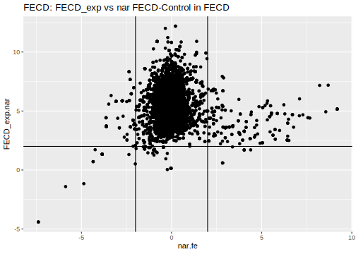<!-- -->

``` r
ggplot(downcorr_pairs_f, aes(x=HCEC.fe, y=FECD_exp.nar )) +
  geom_point() +
  geom_vline(xintercept = -2) + 
  geom_vline(xintercept = 2) + 
  geom_hline(yintercept = 2) +
  labs(title = "FECD: HCEC comparison") 
```

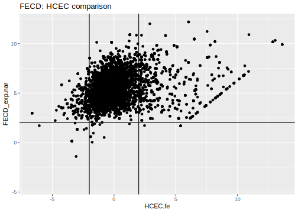<!-- -->

We’re interested in the pairs in the top corners. Let’s get the final
pairs. We’ll extract the pairs by HCEC. I think we should do this in two
separate lists and see how they intersect.

Perhaps we should have compared only the selected final pairs with HCEC?
Otherwise, we got the differential expression in HCEC in the second list
and that’s it. Probably just the pairs.

``` r
final_FECD <- downcorr_pairs_f %>% 
  filter((nar.fe >= 2 & FECD_exp.nar >= 2) | (nar.fe <= -2 & FECD_exp.nar >= 2)) %>% 
  mutate(check_HCEC = if_else(
    (HCEC.fe >= 2 & FECD_exp.nar >= 2) | (HCEC.fe <= -2 & FECD_exp.nar >= -2),
    "yes", "no"))

knitr::kable(final_FECD)
```

| RNA        | miRNA             | Correlation | p_value |     p_adj |   Ctrl.nar |   Ctrl.our | FECD_exp.nar | FECD_noexp.nar | FECD_exp.our | FECD_noexp.our |       HCEC |    nar.fe |    nar.fne |    HCEC.fe |   HCEC.fne | check_HCEC |
|:-----------|:------------------|------------:|--------:|----------:|-----------:|-----------:|-------------:|---------------:|-------------:|---------------:|-----------:|----------:|-----------:|-----------:|-----------:|:-----------|
| ADM        | hsa-miR-1248      |  -0.7380952 |    0.03 | 0.0348964 |  8.5969350 |  8.3072188 |     5.861211 |      6.0933773 |    6.9882061 |       6.166485 |  3.7117574 | -2.735724 | -2.5035577 |  2.1494537 |  2.3816199 | yes        |
| ADM        | hsa-miR-26a-5p    |  -0.8809524 |    0.01 | 0.0195559 |  8.5969350 |  8.3072188 |     5.861211 |      6.0933773 |    6.9882061 |       6.166485 |  3.7117574 | -2.735724 | -2.5035577 |  2.1494537 |  2.3816199 | yes        |
| ADM        | hsa-miR-302f      |  -0.7380952 |    0.04 | 0.0425788 |  8.5969350 |  8.3072188 |     5.861211 |      6.0933773 |    6.9882061 |       6.166485 |  3.7117574 | -2.735724 | -2.5035577 |  2.1494537 |  2.3816199 | yes        |
| ADM        | hsa-miR-3065-5p   |  -0.7380952 |    0.01 | 0.0195559 |  8.5969350 |  8.3072188 |     5.861211 |      6.0933773 |    6.9882061 |       6.166485 |  3.7117574 | -2.735724 | -2.5035577 |  2.1494537 |  2.3816199 | yes        |
| ADM        | hsa-miR-3140-3p   |  -0.7380952 |    0.02 | 0.0279423 |  8.5969350 |  8.3072188 |     5.861211 |      6.0933773 |    6.9882061 |       6.166485 |  3.7117574 | -2.735724 | -2.5035577 |  2.1494537 |  2.3816199 | yes        |
| ADM        | hsa-miR-338-5p    |  -0.7380952 |    0.06 | 0.0604787 |  8.5969350 |  8.3072188 |     5.861211 |      6.0933773 |    6.9882061 |       6.166485 |  3.7117574 | -2.735724 | -2.5035577 |  2.1494537 |  2.3816199 | yes        |
| ADM        | hsa-miR-374c-5p   |  -0.7380952 |    0.01 | 0.0195559 |  8.5969350 |  8.3072188 |     5.861211 |      6.0933773 |    6.9882061 |       6.166485 |  3.7117574 | -2.735724 | -2.5035577 |  2.1494537 |  2.3816199 | yes        |
| ADM        | hsa-miR-4521      |  -0.7619048 |    0.02 | 0.0279423 |  8.5969350 |  8.3072188 |     5.861211 |      6.0933773 |    6.9882061 |       6.166485 |  3.7117574 | -2.735724 | -2.5035577 |  2.1494537 |  2.3816199 | yes        |
| ADM        | hsa-miR-4532      |  -0.7380952 |    0.00 | 0.0000000 |  8.5969350 |  8.3072188 |     5.861211 |      6.0933773 |    6.9882061 |       6.166485 |  3.7117574 | -2.735724 | -2.5035577 |  2.1494537 |  2.3816199 | yes        |
| ADM        | hsa-miR-485-5p    |  -0.7380952 |    0.03 | 0.0348964 |  8.5969350 |  8.3072188 |     5.861211 |      6.0933773 |    6.9882061 |       6.166485 |  3.7117574 | -2.735724 | -2.5035577 |  2.1494537 |  2.3816199 | yes        |
| ADM        | hsa-miR-544a      |  -0.8095238 |    0.00 | 0.0000000 |  8.5969350 |  8.3072188 |     5.861211 |      6.0933773 |    6.9882061 |       6.166485 |  3.7117574 | -2.735724 | -2.5035577 |  2.1494537 |  2.3816199 | yes        |
| ADM        | hsa-miR-573       |  -0.7380952 |    0.02 | 0.0279423 |  8.5969350 |  8.3072188 |     5.861211 |      6.0933773 |    6.9882061 |       6.166485 |  3.7117574 | -2.735724 | -2.5035577 |  2.1494537 |  2.3816199 | yes        |
| ADM        | hsa-miR-574-3p    |  -0.7380952 |    0.02 | 0.0279423 |  8.5969350 |  8.3072188 |     5.861211 |      6.0933773 |    6.9882061 |       6.166485 |  3.7117574 | -2.735724 | -2.5035577 |  2.1494537 |  2.3816199 | yes        |
| ADM        | hsa-miR-650       |  -0.7380952 |    0.01 | 0.0195559 |  8.5969350 |  8.3072188 |     5.861211 |      6.0933773 |    6.9882061 |       6.166485 |  3.7117574 | -2.735724 | -2.5035577 |  2.1494537 |  2.3816199 | yes        |
| ADM        | hsa-miR-655-3p    |  -0.7380952 |    0.03 | 0.0348964 |  8.5969350 |  8.3072188 |     5.861211 |      6.0933773 |    6.9882061 |       6.166485 |  3.7117574 | -2.735724 | -2.5035577 |  2.1494537 |  2.3816199 | yes        |
| ADM        | hsa-miR-660-5p    |  -0.7380952 |    0.02 | 0.0279423 |  8.5969350 |  8.3072188 |     5.861211 |      6.0933773 |    6.9882061 |       6.166485 |  3.7117574 | -2.735724 | -2.5035577 |  2.1494537 |  2.3816199 | yes        |
| AK5        | hsa-miR-4488      |  -0.7380952 |    0.01 | 0.0195559 |  1.5268524 |  1.9432640 |     3.633151 |      3.5629269 |    3.2827795 |       3.610120 | -3.7037091 |  2.106298 |  2.0360745 |  7.3368596 |  7.2666360 | yes        |
| ALPK3      | hsa-miR-1299      |  -0.7380952 |    0.00 | 0.0000000 |  0.3870635 |  3.8693169 |     2.460359 |      1.8243052 |    2.6905323 |       3.302404 |         NA |  2.073295 |  1.4372417 |         NA |         NA | NA         |
| ALPK3      | hsa-miR-26b-5p    |  -0.7142857 |    0.05 | 0.0512567 |  0.3870635 |  3.8693169 |     2.460359 |      1.8243052 |    2.6905323 |       3.302404 |         NA |  2.073295 |  1.4372417 |         NA |         NA | NA         |
| ALPK3      | hsa-miR-342-3p    |  -0.7619048 |    0.03 | 0.0348964 |  0.3870635 |  3.8693169 |     2.460359 |      1.8243052 |    2.6905323 |       3.302404 |         NA |  2.073295 |  1.4372417 |         NA |         NA | NA         |
| ANKRD33B   | hsa-miR-1254      |  -0.7305520 |    0.04 | 0.0425788 |  2.0936710 |  2.8613259 |     5.072975 |      4.1807738 |    4.9612799 |       5.683353 |  6.5367804 |  2.979304 |  2.0871028 | -1.4638052 | -2.3560066 | no         |
| ANKRD33B   | hsa-miR-519d-3p   |  -0.7305520 |    0.03 | 0.0348964 |  2.0936710 |  2.8613259 |     5.072975 |      4.1807738 |    4.9612799 |       5.683353 |  6.5367804 |  2.979304 |  2.0871028 | -1.4638052 | -2.3560066 | no         |
| AR         | hsa-miR-342-5p    |  -0.8383384 |    0.00 | 0.0000000 |  0.5387768 |  1.6278714 |     2.880454 |      0.3949065 |    2.4763593 |       3.367754 |  6.1697177 |  2.341677 | -0.1438704 | -3.2892641 | -5.7748112 | yes        |
| AR         | hsa-miR-509-5p    |  -0.8383384 |    0.01 | 0.0195559 |  0.5387768 |  1.6278714 |     2.880454 |      0.3949065 |    2.4763593 |       3.367754 |  6.1697177 |  2.341677 | -0.1438704 | -3.2892641 | -5.7748112 | yes        |
| ATF3       | hsa-miR-377-3p    |  -0.7142857 |    0.03 | 0.0348964 |  4.0889515 |  4.6307178 |     2.078115 |      3.1790749 |    1.6287586 |       3.480446 |  3.8535504 | -2.010837 | -0.9098766 | -1.7754357 | -0.6744755 | no         |
| ATF3       | hsa-miR-378i      |  -0.8571429 |    0.00 | 0.0000000 |  4.0889515 |  4.6307178 |     2.078115 |      3.1790749 |    1.6287586 |       3.480446 |  3.8535504 | -2.010837 | -0.9098766 | -1.7754357 | -0.6744755 | no         |
| ATF3       | hsa-miR-492       |  -0.7142857 |    0.03 | 0.0348964 |  4.0889515 |  4.6307178 |     2.078115 |      3.1790749 |    1.6287586 |       3.480446 |  3.8535504 | -2.010837 | -0.9098766 | -1.7754357 | -0.6744755 | no         |
| ATP11A     | hsa-miR-769-5p    |  -0.8809524 |    0.00 | 0.0000000 |  4.0422134 |  4.7041567 |     6.522910 |      6.1175165 |    6.9263222 |       6.896304 |  7.2865138 |  2.480696 |  2.0753031 | -0.7636041 | -1.1689973 | no         |
| ATP8B4     | hsa-miR-502-3p    |  -0.7857143 |    0.03 | 0.0348964 | -0.5245955 |  1.6751132 |     3.609067 |      3.5206067 |    2.9445629 |       4.379142 |         NA |  4.133662 |  4.0452022 |         NA |         NA | NA         |
| ATP8B4     | hsa-miR-515-5p    |  -0.7380952 |    0.04 | 0.0425788 | -0.5245955 |  1.6751132 |     3.609067 |      3.5206067 |    2.9445629 |       4.379142 |         NA |  4.133662 |  4.0452022 |         NA |         NA | NA         |
| BCAT1      | hsa-miR-21-5p     |  -0.7619048 |    0.00 | 0.0000000 |  1.5985282 |  2.1599709 |     3.922726 |      4.9530012 |    4.1517576 |       6.588365 |  2.4060042 |  2.324198 |  3.3544729 |  1.5167219 |  2.5469969 | no         |
| BCAT1      | hsa-miR-367-3p    |  -0.7425283 |    0.01 | 0.0195559 |  1.5985282 |  2.1599709 |     3.922726 |      4.9530012 |    4.1517576 |       6.588365 |  2.4060042 |  2.324198 |  3.3544729 |  1.5167219 |  2.5469969 | no         |
| BCAT1      | hsa-miR-769-5p    |  -0.8333333 |    0.01 | 0.0195559 |  1.5985282 |  2.1599709 |     3.922726 |      4.9530012 |    4.1517576 |       6.588365 |  2.4060042 |  2.324198 |  3.3544729 |  1.5167219 |  2.5469969 | no         |
| BDNF       | hsa-miR-132-3p    |  -0.7784571 |    0.02 | 0.0279423 | -0.0512062 |  1.6965900 |     5.443197 |      5.1101973 |    5.1204303 |       5.791494 |  4.5936852 |  5.494403 |  5.1614035 |  0.8495118 |  0.5165121 | no         |
| BDNF       | hsa-miR-16-5p     |  -0.7857143 |    0.01 | 0.0195559 | -0.0512062 |  1.6965900 |     5.443197 |      5.1101973 |    5.1204303 |       5.791494 |  4.5936852 |  5.494403 |  5.1614035 |  0.8495118 |  0.5165121 | no         |
| BHLHE40    | hsa-miR-1257      |  -0.7619048 |    0.03 | 0.0348964 |  8.6928568 |  8.2203033 |     6.457674 |      6.3576149 |    6.5073285 |       6.686206 |  4.9480290 | -2.235183 | -2.3352419 |  1.5096453 |  1.4095859 | no         |
| BHLHE40    | hsa-miR-329-3p    |  -0.8571429 |    0.02 | 0.0279423 |  8.6928568 |  8.2203033 |     6.457674 |      6.3576149 |    6.5073285 |       6.686206 |  4.9480290 | -2.235183 | -2.3352419 |  1.5096453 |  1.4095859 | no         |
| BHLHE40    | hsa-miR-486-3p    |  -0.8333333 |    0.00 | 0.0000000 |  8.6928568 |  8.2203033 |     6.457674 |      6.3576149 |    6.5073285 |       6.686206 |  4.9480290 | -2.235183 | -2.3352419 |  1.5096453 |  1.4095859 | no         |
| BHLHE40    | hsa-miR-512-5p    |  -0.8333333 |    0.01 | 0.0195559 |  8.6928568 |  8.2203033 |     6.457674 |      6.3576149 |    6.5073285 |       6.686206 |  4.9480290 | -2.235183 | -2.3352419 |  1.5096453 |  1.4095859 | no         |
| BHLHE40    | hsa-miR-548v      |  -0.8333333 |    0.00 | 0.0000000 |  8.6928568 |  8.2203033 |     6.457674 |      6.3576149 |    6.5073285 |       6.686206 |  4.9480290 | -2.235183 | -2.3352419 |  1.5096453 |  1.4095859 | no         |
| BIN1       | hsa-miR-1254      |  -0.7305520 |    0.03 | 0.0348964 |  1.6842598 |  4.2205820 |     4.179798 |      3.7285780 |    3.9542062 |       5.016841 |  4.7934310 |  2.495538 |  2.0443182 | -0.6136332 | -1.0648530 | no         |
| BMP4       | hsa-miR-567       |  -0.7425283 |    0.02 | 0.0279423 | -3.1404533 |  1.1469929 |     3.630005 |      2.7918494 |    3.8026235 |       4.950823 |  3.8966271 |  6.770458 |  5.9323027 | -0.2666227 | -1.1047777 | no         |
| CCDC80     | hsa-miR-16-5p     |  -0.7380952 |    0.01 | 0.0195559 |  5.1163721 |  4.9739458 |     7.932326 |      7.6384470 |    8.3565198 |       9.461286 |  4.5004443 |  2.815954 |  2.5220749 |  3.4318818 |  3.1380027 | yes        |
| CCND1      | hsa-miR-16-5p     |  -0.7857143 |    0.02 | 0.0279423 |  4.5094043 |  4.3277485 |     6.756705 |      7.3524150 |    7.0303489 |       8.207403 |  5.8005894 |  2.247301 |  2.8430107 |  0.9561154 |  1.5518257 | no         |
| CCND1      | hsa-miR-26b-5p    |  -0.7380952 |    0.01 | 0.0195559 |  4.5094043 |  4.3277485 |     6.756705 |      7.3524150 |    7.0303489 |       8.207403 |  5.8005894 |  2.247301 |  2.8430107 |  0.9561154 |  1.5518257 | no         |
| CD109      | hsa-miR-342-5p    |  -0.7065995 |    0.04 | 0.0425788 | -0.4911663 |  1.4175009 |     2.223720 |      1.9045805 |    2.5140644 |       5.076415 |  6.9862223 |  2.714886 |  2.3957468 | -4.7625024 | -5.0816419 | yes        |
| CD163      | hsa-miR-548d-5p   |  -0.7305520 |    0.07 | 0.0701993 | -0.0468395 |  3.2747591 |     4.101638 |      5.4547721 |    4.1151741 |       6.235750 |         NA |  4.148478 |  5.5016116 |         NA |         NA | NA         |
| CD163      | hsa-miR-802       |  -0.7142857 |    0.07 | 0.0701993 | -0.0468395 |  3.2747591 |     4.101638 |      5.4547721 |    4.1151741 |       6.235750 |         NA |  4.148478 |  5.5016116 |         NA |         NA | NA         |
| CD177      | hsa-miR-335-5p    |  -0.7065995 |    0.05 | 0.0512567 |  0.7770321 |  1.4392440 |     3.637130 |      2.3842806 |    3.2814485 |       3.563179 |         NA |  2.860098 |  1.6072485 |         NA |         NA | NA         |
| CD177      | hsa-miR-361-5p    |  -0.7065995 |    0.02 | 0.0279423 |  0.7770321 |  1.4392440 |     3.637130 |      2.3842806 |    3.2814485 |       3.563179 |         NA |  2.860098 |  1.6072485 |         NA |         NA | NA         |
| CD177      | hsa-miR-483-3p    |  -0.7065995 |    0.00 | 0.0000000 |  0.7770321 |  1.4392440 |     3.637130 |      2.3842806 |    3.2814485 |       3.563179 |         NA |  2.860098 |  1.6072485 |         NA |         NA | NA         |
| CD28       | hsa-miR-302a-3p   |  -0.7664808 |    0.04 | 0.0425788 | -3.8801290 | -1.2469003 |     2.537246 |      3.2257219 |    2.2879015 |       4.155711 |         NA |  6.417375 |  7.1058509 |         NA |         NA | NA         |
| CD28       | hsa-miR-520d-3p   |  -0.7664808 |    0.01 | 0.0195559 | -3.8801290 | -1.2469003 |     2.537246 |      3.2257219 |    2.2879015 |       4.155711 |         NA |  6.417375 |  7.1058509 |         NA |         NA | NA         |
| CD28       | hsa-miR-520e      |  -0.7857143 |    0.02 | 0.0279423 | -3.8801290 | -1.2469003 |     2.537246 |      3.2257219 |    2.2879015 |       4.155711 |         NA |  6.417375 |  7.1058509 |         NA |         NA | NA         |
| CD4        | hsa-miR-1254      |  -0.7305520 |    0.03 | 0.0348964 |  0.9306328 |  1.7382585 |     4.743378 |      4.9764052 |    4.5269703 |       6.391926 |         NA |  3.812746 |  4.0457724 |         NA |         NA | NA         |
| CD4        | hsa-miR-638       |  -0.8503146 |    0.01 | 0.0195559 |  0.9306328 |  1.7382585 |     4.743378 |      4.9764052 |    4.5269703 |       6.391926 |         NA |  3.812746 |  4.0457724 |         NA |         NA | NA         |
| CD68       | hsa-miR-302e      |  -0.8024096 |    0.02 | 0.0279423 |  0.5052216 | -0.7023272 |     2.939249 |      3.6150729 |    3.6263722 |       6.002465 |  5.0501467 |  2.434027 |  3.1098513 | -2.1108978 | -1.4350738 | yes        |
| CD84       | hsa-miR-3615      |  -0.7065995 |    0.01 | 0.0195559 | -0.9225859 |  0.4606987 |     4.524674 |      4.6583924 |    3.3749845 |       5.302307 |         NA |  5.447260 |  5.5809783 |         NA |         NA | NA         |
| CD84       | hsa-miR-520d-3p   |  -0.7065995 |    0.02 | 0.0279423 | -0.9225859 |  0.4606987 |     4.524674 |      4.6583924 |    3.3749845 |       5.302307 |         NA |  5.447260 |  5.5809783 |         NA |         NA | NA         |
| CD84       | hsa-miR-520e      |  -0.7142857 |    0.03 | 0.0348964 | -0.9225859 |  0.4606987 |     4.524674 |      4.6583924 |    3.3749845 |       5.302307 |         NA |  5.447260 |  5.5809783 |         NA |         NA | NA         |
| CDKN2B     | hsa-miR-543       |  -0.7545045 |    0.01 | 0.0195559 |  0.5348140 |  0.5664104 |     5.860912 |      6.5174096 |    6.0063652 |       7.959331 |  5.3631354 |  5.326098 |  5.9825956 |  0.4977761 |  1.1542742 | no         |
| CLEC7A     | hsa-miR-555       |  -0.7142857 |    0.01 | 0.0195559 | -2.1868112 |  0.3393329 |     4.301249 |      4.1571974 |    2.8402768 |       4.443453 |         NA |  6.488060 |  6.3440086 |         NA |         NA | NA         |
| COL18A1    | hsa-miR-302e      |  -0.8263621 |    0.00 | 0.0000000 |  0.2741104 |  4.7702888 |     5.459344 |      3.1918717 |    5.8934896 |       6.142824 |  4.8237249 |  5.185234 |  2.9177613 |  0.6356195 | -1.6318532 | no         |
| COL4A2     | hsa-miR-302e      |  -0.8263621 |    0.02 | 0.0279423 |  3.8615227 |  6.3673652 |     6.710153 |      7.9390694 |    7.6636143 |       8.404873 |  7.3533811 |  2.848631 |  4.0775467 | -0.6432280 |  0.5856883 | no         |
| COL4A2     | hsa-miR-361-3p    |  -0.7185758 |    0.02 | 0.0279423 |  3.8615227 |  6.3673652 |     6.710153 |      7.9390694 |    7.6636143 |       8.404873 |  7.3533811 |  2.848631 |  4.0775467 | -0.6432280 |  0.5856883 | no         |
| COL4A2     | hsa-miR-543       |  -0.8263621 |    0.04 | 0.0425788 |  3.8615227 |  6.3673652 |     6.710153 |      7.9390694 |    7.6636143 |       8.404873 |  7.3533811 |  2.848631 |  4.0775467 | -0.6432280 |  0.5856883 | no         |
| CRABP2     | hsa-miR-1303      |  -0.7380952 |    0.02 | 0.0279423 |  5.4056698 |  6.3180321 |     2.783267 |      5.0218895 |    3.4247991 |       4.240306 |  3.5345986 | -2.622403 | -0.3837803 | -0.7513319 |  1.4872909 | no         |
| CSMD2      | hsa-miR-362-3p    |  -0.7619048 |    0.01 | 0.0195559 |  5.5153358 |  6.3406760 |     3.470503 |      5.7313915 |    4.4105327 |       5.563599 | -1.4747524 | -2.044833 |  0.2160557 |  4.9452552 |  7.2061439 | yes        |
| CSMD2      | hsa-miR-490-5p    |  -0.7619048 |    0.02 | 0.0279423 |  5.5153358 |  6.3406760 |     3.470503 |      5.7313915 |    4.4105327 |       5.563599 | -1.4747524 | -2.044833 |  0.2160557 |  4.9452552 |  7.2061439 | yes        |
| CSMD2      | hsa-miR-603       |  -0.7619048 |    0.00 | 0.0000000 |  5.5153358 |  6.3406760 |     3.470503 |      5.7313915 |    4.4105327 |       5.563599 | -1.4747524 | -2.044833 |  0.2160557 |  4.9452552 |  7.2061439 | yes        |
| CSMD2      | hsa-miR-650       |  -0.7619048 |    0.04 | 0.0425788 |  5.5153358 |  6.3406760 |     3.470503 |      5.7313915 |    4.4105327 |       5.563599 | -1.4747524 | -2.044833 |  0.2160557 |  4.9452552 |  7.2061439 | yes        |
| CSMD2      | hsa-miR-875-3p    |  -0.7619048 |    0.01 | 0.0195559 |  5.5153358 |  6.3406760 |     3.470503 |      5.7313915 |    4.4105327 |       5.563599 | -1.4747524 | -2.044833 |  0.2160557 |  4.9452552 |  7.2061439 | yes        |
| CTSS       | hsa-miR-302e      |  -0.8024096 |    0.02 | 0.0279423 |  0.4636065 |  1.1854888 |     4.168127 |      4.4431823 |    4.3615923 |       7.203049 |         NA |  3.704521 |  3.9795758 |         NA |         NA | NA         |
| CTSS       | hsa-miR-519d-3p   |  -0.7065995 |    0.00 | 0.0000000 |  0.4636065 |  1.1854888 |     4.168127 |      4.4431823 |    4.3615923 |       7.203049 |         NA |  3.704521 |  3.9795758 |         NA |         NA | NA         |
| DACT1      | hsa-miR-638       |  -0.7185758 |    0.02 | 0.0279423 | -1.5466061 |  1.5962978 |     2.230325 |      2.0573499 |    2.9884107 |       4.205016 |         NA |  3.776931 |  3.6039560 |         NA |         NA | NA         |
| DDIT4      | hsa-miR-423-5p    |  -0.7065995 |    0.03 | 0.0348964 |  9.0707000 |  8.9097659 |     5.583672 |      5.8526462 |    5.9768843 |       5.719470 |  6.7277894 | -3.487028 | -3.2180539 | -1.1441178 | -0.8751432 | no         |
| DGKI       | hsa-miR-543       |  -0.8622909 |    0.01 | 0.0195559 | -0.5289998 |  5.6716764 |     4.195401 |      6.0370983 |    4.9452837 |       7.354113 |  1.8026592 |  4.724401 |  6.5660981 |  2.3927421 |  4.2344392 | yes        |
| DOCK8      | hsa-miR-361-3p    |  -0.8503146 |    0.01 | 0.0195559 |  2.2915126 |  3.1145826 |     5.094900 |      4.9621263 |    4.6132354 |       6.235009 |         NA |  2.803387 |  2.6706137 |         NA |         NA | NA         |
| EDN1       | hsa-let-7g-5p     |  -0.7619048 |    0.00 | 0.0000000 | -1.0053236 | -1.1031905 |     3.598336 |      4.1615425 |    3.9868603 |       3.673215 |         NA |  4.603660 |  5.1668662 |         NA |         NA | NA         |
| EPB41L3    | hsa-miR-125a-3p   |  -0.7619048 |    0.03 | 0.0348964 | -1.0634259 |  2.1506199 |     4.249914 |      4.3672632 |    4.7451160 |       5.916052 |  0.6702006 |  5.313340 |  5.4306891 |  3.5797133 |  3.6970626 | yes        |
| EPHB1      | hsa-miR-1248      |  -0.7619048 |    0.01 | 0.0195559 |  6.3534129 |  6.8944751 |     4.217931 |      6.4640757 |    4.5958752 |       5.063719 | -2.2151448 | -2.135482 |  0.1106628 |  6.4330755 |  8.6792206 | yes        |
| EPHB1      | hsa-miR-128-3p    |  -0.7619048 |    0.00 | 0.0000000 |  6.3534129 |  6.8944751 |     4.217931 |      6.4640757 |    4.5958752 |       5.063719 | -2.2151448 | -2.135482 |  0.1106628 |  6.4330755 |  8.6792206 | yes        |
| EPHB1      | hsa-miR-3147      |  -0.7619048 |    0.02 | 0.0279423 |  6.3534129 |  6.8944751 |     4.217931 |      6.4640757 |    4.5958752 |       5.063719 | -2.2151448 | -2.135482 |  0.1106628 |  6.4330755 |  8.6792206 | yes        |
| EPHB1      | hsa-miR-450b-5p   |  -0.7619048 |    0.00 | 0.0000000 |  6.3534129 |  6.8944751 |     4.217931 |      6.4640757 |    4.5958752 |       5.063719 | -2.2151448 | -2.135482 |  0.1106628 |  6.4330755 |  8.6792206 | yes        |
| EPHB1      | hsa-miR-509-3-5p  |  -0.7619048 |    0.01 | 0.0195559 |  6.3534129 |  6.8944751 |     4.217931 |      6.4640757 |    4.5958752 |       5.063719 | -2.2151448 | -2.135482 |  0.1106628 |  6.4330755 |  8.6792206 | yes        |
| EPHB1      | hsa-miR-579-3p    |  -0.7619048 |    0.03 | 0.0348964 |  6.3534129 |  6.8944751 |     4.217931 |      6.4640757 |    4.5958752 |       5.063719 | -2.2151448 | -2.135482 |  0.1106628 |  6.4330755 |  8.6792206 | yes        |
| EPHB1      | hsa-miR-627-3p    |  -0.7619048 |    0.02 | 0.0279423 |  6.3534129 |  6.8944751 |     4.217931 |      6.4640757 |    4.5958752 |       5.063719 | -2.2151448 | -2.135482 |  0.1106628 |  6.4330755 |  8.6792206 | yes        |
| EPHB1      | hsa-miR-664b-3p   |  -0.7619048 |    0.02 | 0.0279423 |  6.3534129 |  6.8944751 |     4.217931 |      6.4640757 |    4.5958752 |       5.063719 | -2.2151448 | -2.135482 |  0.1106628 |  6.4330755 |  8.6792206 | yes        |
| FAM102B    | hsa-miR-1254      |  -0.7545045 |    0.01 | 0.0195559 | -0.7489928 |  3.1298688 |     3.284090 |      2.5594303 |    3.3979811 |       4.340651 |  5.3500135 |  4.033083 |  3.3084231 | -2.0659232 | -2.7905832 | yes        |
| FAM102B    | hsa-miR-302e      |  -0.7065995 |    0.04 | 0.0425788 | -0.7489928 |  3.1298688 |     3.284090 |      2.5594303 |    3.3979811 |       4.340651 |  5.3500135 |  4.033083 |  3.3084231 | -2.0659232 | -2.7905832 | yes        |
| FAM102B    | hsa-miR-515-5p    |  -0.7857143 |    0.01 | 0.0195559 | -0.7489928 |  3.1298688 |     3.284090 |      2.5594303 |    3.3979811 |       4.340651 |  5.3500135 |  4.033083 |  3.3084231 | -2.0659232 | -2.7905832 | yes        |
| FAM102B    | hsa-miR-543       |  -0.7784571 |    0.01 | 0.0195559 | -0.7489928 |  3.1298688 |     3.284090 |      2.5594303 |    3.3979811 |       4.340651 |  5.3500135 |  4.033083 |  3.3084231 | -2.0659232 | -2.7905832 | yes        |
| FAM102B    | hsa-miR-567       |  -0.7784571 |    0.01 | 0.0195559 | -0.7489928 |  3.1298688 |     3.284090 |      2.5594303 |    3.3979811 |       4.340651 |  5.3500135 |  4.033083 |  3.3084231 | -2.0659232 | -2.7905832 | yes        |
| FAM102B    | hsa-miR-612       |  -0.7619048 |    0.01 | 0.0195559 | -0.7489928 |  3.1298688 |     3.284090 |      2.5594303 |    3.3979811 |       4.340651 |  5.3500135 |  4.033083 |  3.3084231 | -2.0659232 | -2.7905832 | yes        |
| FAT4       | hsa-miR-567       |  -0.7545045 |    0.02 | 0.0279423 |  2.9808087 |  4.2570258 |     4.994954 |      4.2184895 |    4.7324870 |       5.322740 |  6.1026175 |  2.014145 |  1.2376808 | -1.1076637 | -1.8841280 | no         |
| FBN1       | hsa-miR-638       |  -0.7425283 |    0.01 | 0.0195559 |  4.9236481 |  5.9937278 |     7.810672 |      8.4669641 |    8.4264687 |       9.852018 |  8.4941635 |  2.887024 |  3.5433160 | -0.6834919 | -0.0271995 | no         |
| FGD4       | hsa-miR-302e      |  -0.8263621 |    0.01 | 0.0195559 |  1.9498097 |  3.6254949 |     4.274169 |      4.4567736 |    4.0520862 |       5.734811 |  6.8762358 |  2.324359 |  2.5069639 | -2.6020666 | -2.4194622 | yes        |
| FGD4       | hsa-miR-617       |  -0.8333333 |    0.02 | 0.0279423 |  1.9498097 |  3.6254949 |     4.274169 |      4.4567736 |    4.0520862 |       5.734811 |  6.8762358 |  2.324359 |  2.5069639 | -2.6020666 | -2.4194622 | yes        |
| FGL2       | hsa-miR-543       |  -0.7545045 |    0.00 | 0.0000000 | -2.6089435 |  1.3845327 |     4.676863 |      3.8382202 |    4.8618226 |       6.248308 |         NA |  7.285806 |  6.4471636 |         NA |         NA | NA         |
| FHOD3      | hsa-miR-342-5p    |  -0.7065995 |    0.01 | 0.0195559 | -2.6404810 |  0.8813082 |     2.269605 |      3.8702145 |    2.7354017 |       4.261827 |  3.6968721 |  4.910086 |  6.5106955 | -1.4272668 |  0.1733425 | no         |
| FLNC       | hsa-miR-361-3p    |  -0.8024096 |    0.00 | 0.0000000 |  0.2742860 |  6.7252637 |     3.663972 |      5.4837194 |    4.7948661 |       7.708896 |  8.1311753 |  3.389686 |  5.2094334 | -4.4672030 | -2.6474558 | yes        |
| FMN1       | hsa-miR-367-3p    |  -0.8862434 |    0.00 | 0.0000000 |  0.5899430 |  2.7593989 |     3.573346 |      4.1621720 |    3.1372314 |       4.479254 |  0.8575948 |  2.983403 |  3.5722289 |  2.7157516 |  3.3045772 | yes        |
| FMN1       | hsa-miR-520d-3p   |  -0.8862434 |    0.00 | 0.0000000 |  0.5899430 |  2.7593989 |     3.573346 |      4.1621720 |    3.1372314 |       4.479254 |  0.8575948 |  2.983403 |  3.5722289 |  2.7157516 |  3.3045772 | yes        |
| FMN1       | hsa-miR-520e      |  -0.9047619 |    0.01 | 0.0195559 |  0.5899430 |  2.7593989 |     3.573346 |      4.1621720 |    3.1372314 |       4.479254 |  0.8575948 |  2.983403 |  3.5722289 |  2.7157516 |  3.3045772 | yes        |
| FMN1       | hsa-miR-542-3p    |  -0.7904333 |    0.02 | 0.0279423 |  0.5899430 |  2.7593989 |     3.573346 |      4.1621720 |    3.1372314 |       4.479254 |  0.8575948 |  2.983403 |  3.5722289 |  2.7157516 |  3.3045772 | yes        |
| FMNL3      | hsa-miR-519d-3p   |  -0.7065995 |    0.04 | 0.0425788 |  0.5210427 |  2.6436234 |     5.371993 |      5.0787508 |    4.4242940 |       6.249742 |  6.5174409 |  4.850951 |  4.5577081 | -1.1454476 | -1.4386901 | no         |
| FSTL3      | hsa-miR-1254      |  -0.8024096 |    0.02 | 0.0279423 |  2.3026383 |  3.3003026 |     4.386370 |      4.4832801 |    4.9910208 |       6.389771 |  4.3054091 |  2.083732 |  2.1806419 |  0.0809614 |  0.1778710 | no         |
| FSTL3      | hsa-miR-378g      |  -0.7142857 |    0.01 | 0.0195559 |  2.3026383 |  3.3003026 |     4.386370 |      4.4832801 |    4.9910208 |       6.389771 |  4.3054091 |  2.083732 |  2.1806419 |  0.0809614 |  0.1778710 | no         |
| FXYD5      | hsa-miR-302e      |  -0.7185758 |    0.03 | 0.0348964 | -2.2301804 |  0.4648686 |     3.235011 |      2.5761154 |    2.9864730 |       4.403562 |  4.7919998 |  5.465192 |  4.8062958 | -1.5569886 | -2.2158844 | no         |
| GAS1       | hsa-miR-3127-5p   |  -0.7142857 |    0.06 | 0.0604787 |  4.4269576 |  5.6629467 |     6.730212 |      6.2540804 |    7.3730550 |       7.623167 |  4.5928193 |  2.303255 |  1.8271228 |  2.1373928 |  1.6612611 | yes        |
| GAS1       | hsa-miR-34c-5p    |  -0.7142857 |    0.03 | 0.0348964 |  4.4269576 |  5.6629467 |     6.730212 |      6.2540804 |    7.3730550 |       7.623167 |  4.5928193 |  2.303255 |  1.8271228 |  2.1373928 |  1.6612611 | yes        |
| GBP4       | hsa-miR-1276      |  -0.8024096 |    0.01 | 0.0195559 |  0.3458418 |  1.9004527 |     3.746100 |      3.4889737 |    3.0791795 |       4.761262 | -3.7037091 |  3.400259 |  3.1431319 |  7.4498094 |  7.1926828 | yes        |
| GBP4       | hsa-miR-140-3p    |  -0.8095238 |    0.01 | 0.0195559 |  0.3458418 |  1.9004527 |     3.746100 |      3.4889737 |    3.0791795 |       4.761262 | -3.7037091 |  3.400259 |  3.1431319 |  7.4498094 |  7.1926828 | yes        |
| GBP4       | hsa-miR-296-5p    |  -0.8024096 |    0.00 | 0.0000000 |  0.3458418 |  1.9004527 |     3.746100 |      3.4889737 |    3.0791795 |       4.761262 | -3.7037091 |  3.400259 |  3.1431319 |  7.4498094 |  7.1926828 | yes        |
| GBP4       | hsa-miR-320c      |  -0.8024096 |    0.01 | 0.0195559 |  0.3458418 |  1.9004527 |     3.746100 |      3.4889737 |    3.0791795 |       4.761262 | -3.7037091 |  3.400259 |  3.1431319 |  7.4498094 |  7.1926828 | yes        |
| GBP4       | hsa-miR-576-3p    |  -0.7857143 |    0.01 | 0.0195559 |  0.3458418 |  1.9004527 |     3.746100 |      3.4889737 |    3.0791795 |       4.761262 | -3.7037091 |  3.400259 |  3.1431319 |  7.4498094 |  7.1926828 | yes        |
| GBP4       | hsa-miR-661       |  -0.8024096 |    0.01 | 0.0195559 |  0.3458418 |  1.9004527 |     3.746100 |      3.4889737 |    3.0791795 |       4.761262 | -3.7037091 |  3.400259 |  3.1431319 |  7.4498094 |  7.1926828 | yes        |
| GFRA1      | hsa-miR-342-5p    |  -0.7784571 |    0.03 | 0.0348964 | -4.0310692 |  0.7063379 |     5.158410 |      5.7085038 |    5.2625578 |       7.885137 |  3.5591649 |  9.189480 |  9.7395730 |  1.5992455 |  2.1493389 | no         |
| GFRA1      | hsa-miR-509-5p    |  -0.7784571 |    0.00 | 0.0000000 | -4.0310692 |  0.7063379 |     5.158410 |      5.7085038 |    5.2625578 |       7.885137 |  3.5591649 |  9.189480 |  9.7395730 |  1.5992455 |  2.1493389 | no         |
| GFRA1      | hsa-miR-520d-3p   |  -0.7784571 |    0.01 | 0.0195559 | -4.0310692 |  0.7063379 |     5.158410 |      5.7085038 |    5.2625578 |       7.885137 |  3.5591649 |  9.189480 |  9.7395730 |  1.5992455 |  2.1493389 | no         |
| GFRA1      | hsa-miR-520e      |  -0.7619048 |    0.03 | 0.0348964 | -4.0310692 |  0.7063379 |     5.158410 |      5.7085038 |    5.2625578 |       7.885137 |  3.5591649 |  9.189480 |  9.7395730 |  1.5992455 |  2.1493389 | no         |
| GFRA1      | hsa-miR-542-3p    |  -0.7065995 |    0.01 | 0.0195559 | -4.0310692 |  0.7063379 |     5.158410 |      5.7085038 |    5.2625578 |       7.885137 |  3.5591649 |  9.189480 |  9.7395730 |  1.5992455 |  2.1493389 | no         |
| GFRA1      | hsa-miR-548d-5p   |  -0.7784571 |    0.01 | 0.0195559 | -4.0310692 |  0.7063379 |     5.158410 |      5.7085038 |    5.2625578 |       7.885137 |  3.5591649 |  9.189480 |  9.7395730 |  1.5992455 |  2.1493389 | no         |
| GLIPR1     | hsa-miR-543       |  -0.7545045 |    0.00 | 0.0000000 | -1.5268170 |  2.3292575 |     4.757805 |      6.6940381 |    5.3096962 |       7.404917 |  3.8175325 |  6.284622 |  8.2208551 |  0.9402724 |  2.8765056 | no         |
| GNB4       | hsa-miR-302e      |  -0.7185758 |    0.04 | 0.0425788 | -1.8178116 |  2.5305049 |     2.781841 |      3.1957309 |    3.5261302 |       5.929016 |  5.6589138 |  4.599653 |  5.0135425 | -2.8770728 | -2.4631830 | yes        |
| GPRIN3     | hsa-miR-302e      |  -0.8263621 |    0.01 | 0.0195559 | -3.1393021 |  0.5566820 |     4.428890 |      4.0466776 |    4.2719960 |       5.574813 |         NA |  7.568192 |  7.1859797 |         NA |         NA | NA         |
| GPRIN3     | hsa-miR-519d-3p   |  -0.7305520 |    0.00 | 0.0000000 | -3.1393021 |  0.5566820 |     4.428890 |      4.0466776 |    4.2719960 |       5.574813 |         NA |  7.568192 |  7.1859797 |         NA |         NA | NA         |
| HLA-DPB1   | hsa-miR-617       |  -0.7619048 |    0.03 | 0.0348964 |  4.8232709 |  4.7148863 |     6.857175 |      6.2837871 |    6.6415552 |       7.664328 | -3.7037091 |  2.033905 |  1.4605163 | 10.5608845 |  9.9874962 | yes        |
| HSPA5      | hsa-miR-520d-3p   |  -0.7545045 |    0.01 | 0.0195559 | 10.6846151 | 10.0162986 |     8.327009 |      8.3897830 |    8.5223826 |       8.572995 |  9.0113289 | -2.357606 | -2.2948321 | -0.6843197 | -0.6215459 | no         |
| HSPA5      | hsa-miR-520e      |  -0.7619048 |    0.01 | 0.0195559 | 10.6846151 | 10.0162986 |     8.327009 |      8.3897830 |    8.5223826 |       8.572995 |  9.0113289 | -2.357606 | -2.2948321 | -0.6843197 | -0.6215459 | no         |
| HSPA5      | hsa-miR-769-5p    |  -0.7380952 |    0.03 | 0.0348964 | 10.6846151 | 10.0162986 |     8.327009 |      8.3897830 |    8.5223826 |       8.572995 |  9.0113289 | -2.357606 | -2.2948321 | -0.6843197 | -0.6215459 | no         |
| ICOSLG     | hsa-miR-617       |  -0.8095238 |    0.02 | 0.0279423 |  0.6634372 |  1.6130994 |     3.222630 |      2.7049639 |    3.0963688 |       4.055471 |  3.7774083 |  2.559192 |  2.0415267 | -0.5547789 | -1.0724445 | no         |
| IER3       | hsa-miR-142-3p    |  -0.7142857 |    0.03 | 0.0348964 |  9.9676078 |  8.3928843 |     7.668213 |      7.8736001 |    8.1047445 |       7.730653 |  5.6078860 | -2.299395 | -2.0940077 |  2.0603265 |  2.2657141 | yes        |
| IER3       | hsa-miR-27a-3p    |  -0.8095238 |    0.01 | 0.0195559 |  9.9676078 |  8.3928843 |     7.668213 |      7.8736001 |    8.1047445 |       7.730653 |  5.6078860 | -2.299395 | -2.0940077 |  2.0603265 |  2.2657141 | yes        |
| IER3       | hsa-miR-4741      |  -0.7380952 |    0.03 | 0.0348964 |  9.9676078 |  8.3928843 |     7.668213 |      7.8736001 |    8.1047445 |       7.730653 |  5.6078860 | -2.299395 | -2.0940077 |  2.0603265 |  2.2657141 | yes        |
| IL1RAP     | hsa-miR-590-5p    |  -0.7857143 |    0.02 | 0.0279423 |  1.6769977 |  2.1798973 |     4.419972 |      2.7859536 |    4.5804753 |       4.332044 |  4.8309505 |  2.742974 |  1.1089559 | -0.4109787 | -2.0449969 | no         |
| ITGB8      | hsa-miR-376a-3p   |  -0.7142857 |    0.03 | 0.0348964 |  2.6874219 |  3.0596331 |     5.495839 |      4.3088087 |    6.1019886 |       5.655597 |  1.7829652 |  2.808417 |  1.6213869 |  3.7128736 |  2.5258436 | yes        |
| JUNB       | hsa-miR-3180      |  -0.8095238 |    0.04 | 0.0425788 |  9.6668754 |  8.3777289 |     6.311965 |      5.6195303 |    5.6812015 |       6.065034 |  3.4884694 | -3.354910 | -4.0473451 |  2.8234960 |  2.1310609 | yes        |
| KCNJ3      | hsa-miR-567       |  -0.8263621 |    0.00 | 0.0000000 | -3.5747780 |  2.6302045 |     2.867832 |      0.5244439 |    3.6072920 |       5.601067 |         NA |  6.442610 |  4.0992218 |         NA |         NA | NA         |
| KDR        | hsa-miR-369-3p    |  -0.7142857 |    0.03 | 0.0348964 |  7.3732426 |  7.4202382 |     4.386248 |      6.7845359 |    5.0626543 |       5.160090 |         NA | -2.986995 | -0.5887067 |         NA |         NA | NA         |
| KLF10      | hsa-miR-1257      |  -0.7857143 |    0.04 | 0.0425788 |  8.8939090 |  6.9142060 |     5.813086 |      6.1050181 |    5.2166645 |       5.817640 |  5.0612940 | -3.080823 | -2.7888909 |  0.7517917 |  1.0437241 | no         |
| KLF10      | hsa-miR-1305      |  -0.7380952 |    0.02 | 0.0279423 |  8.8939090 |  6.9142060 |     5.813086 |      6.1050181 |    5.2166645 |       5.817640 |  5.0612940 | -3.080823 | -2.7888909 |  0.7517917 |  1.0437241 | no         |
| KLF10      | hsa-miR-23c       |  -0.7380952 |    0.05 | 0.0512567 |  8.8939090 |  6.9142060 |     5.813086 |      6.1050181 |    5.2166645 |       5.817640 |  5.0612940 | -3.080823 | -2.7888909 |  0.7517917 |  1.0437241 | no         |
| KLF10      | hsa-miR-3161      |  -0.7142857 |    0.04 | 0.0425788 |  8.8939090 |  6.9142060 |     5.813086 |      6.1050181 |    5.2166645 |       5.817640 |  5.0612940 | -3.080823 | -2.7888909 |  0.7517917 |  1.0437241 | no         |
| KLF10      | hsa-miR-381-3p    |  -0.8333333 |    0.00 | 0.0000000 |  8.8939090 |  6.9142060 |     5.813086 |      6.1050181 |    5.2166645 |       5.817640 |  5.0612940 | -3.080823 | -2.7888909 |  0.7517917 |  1.0437241 | no         |
| KLF10      | hsa-miR-409-3p    |  -0.7142857 |    0.02 | 0.0279423 |  8.8939090 |  6.9142060 |     5.813086 |      6.1050181 |    5.2166645 |       5.817640 |  5.0612940 | -3.080823 | -2.7888909 |  0.7517917 |  1.0437241 | no         |
| KLF10      | hsa-miR-548ak     |  -0.7380952 |    0.01 | 0.0195559 |  8.8939090 |  6.9142060 |     5.813086 |      6.1050181 |    5.2166645 |       5.817640 |  5.0612940 | -3.080823 | -2.7888909 |  0.7517917 |  1.0437241 | no         |
| KLF10      | hsa-miR-548k      |  -0.7380952 |    0.04 | 0.0425788 |  8.8939090 |  6.9142060 |     5.813086 |      6.1050181 |    5.2166645 |       5.817640 |  5.0612940 | -3.080823 | -2.7888909 |  0.7517917 |  1.0437241 | no         |
| KLF10      | hsa-miR-548y      |  -0.7380952 |    0.00 | 0.0000000 |  8.8939090 |  6.9142060 |     5.813086 |      6.1050181 |    5.2166645 |       5.817640 |  5.0612940 | -3.080823 | -2.7888909 |  0.7517917 |  1.0437241 | no         |
| LAIR1      | hsa-miR-302e      |  -0.8024096 |    0.00 | 0.0000000 | -3.2677560 | -0.0335065 |     4.404263 |      4.3580771 |    3.2375669 |       5.110447 |         NA |  7.672019 |  7.6258332 |         NA |         NA | NA         |
| LCP1       | hsa-miR-3690      |  -0.7380952 |    0.02 | 0.0279423 |  2.2380631 |  2.5528777 |     4.399081 |      4.2130244 |    4.6389166 |       6.927612 |         NA |  2.161018 |  1.9749613 |         NA |         NA | NA         |
| LCP1       | hsa-miR-543       |  -0.8503146 |    0.01 | 0.0195559 |  2.2380631 |  2.5528777 |     4.399081 |      4.2130244 |    4.6389166 |       6.927612 |         NA |  2.161018 |  1.9749613 |         NA |         NA | NA         |
| LPCAT2     | hsa-miR-548d-5p   |  -0.7065995 |    0.02 | 0.0279423 |  0.4883440 |  2.7033268 |     4.916764 |      4.9472325 |    5.0000215 |       6.248949 |  4.1777105 |  4.428420 |  4.4588885 |  0.7390531 |  0.7695220 | no         |
| LRRK1      | hsa-miR-1291      |  -0.7142857 |    0.04 | 0.0425788 | -0.8336156 |  1.4832787 |     4.698643 |      3.9741275 |    3.3909349 |       5.180811 | -0.2309586 |  5.532259 |  4.8077430 |  4.9296021 |  4.2050861 | yes        |
| LY75-CD302 | hsa-miR-922       |  -0.7185758 |    0.02 | 0.0279423 |  0.3596693 |  1.1807959 |     3.115866 |      2.0735111 |    3.5140880 |       2.451837 |         NA |  2.756197 |  1.7138418 |         NA |         NA | NA         |
| MAP3K8     | hsa-miR-375       |  -0.9047619 |    0.01 | 0.0195559 |  6.4657060 |  4.1427244 |     3.569786 |      3.6098479 |    2.8513103 |       3.826026 |  2.0210585 | -2.895920 | -2.8558581 |  1.5487276 |  1.5887894 | no         |
| MAP3K8     | hsa-miR-590-5p    |  -0.8571429 |    0.01 | 0.0195559 |  6.4657060 |  4.1427244 |     3.569786 |      3.6098479 |    2.8513103 |       3.826026 |  2.0210585 | -2.895920 | -2.8558581 |  1.5487276 |  1.5887894 | no         |
| MARCKS     | hsa-miR-509-5p    |  -0.7065995 |    0.00 | 0.0000000 |  0.2965652 |  2.7726889 |     4.699995 |      4.8619478 |    4.5250026 |       7.248245 |  6.6745350 |  4.403430 |  4.5653827 | -1.9745394 | -1.8125871 | no         |
| MARCKS     | hsa-miR-638       |  -0.7065995 |    0.05 | 0.0512567 |  0.2965652 |  2.7726889 |     4.699995 |      4.8619478 |    4.5250026 |       7.248245 |  6.6745350 |  4.403430 |  4.5653827 | -1.9745394 | -1.8125871 | no         |
| MBNL3      | hsa-miR-155-5p    |  -0.8095238 |    0.02 | 0.0279423 | -0.7875492 |  0.9926901 |     3.006465 |      1.7672931 |    4.2872596 |       6.809695 | -3.1047035 |  3.794014 |  2.5548422 |  6.1111687 |  4.8719966 | yes        |
| MEF2C      | hsa-let-7c-5p     |  -0.7380952 |    0.02 | 0.0279423 | -2.0162529 |  2.7958129 |     4.690002 |      4.4814899 |    3.6369239 |       5.519171 | -3.7037091 |  6.706255 |  6.4977428 |  8.3937108 |  8.1851990 | yes        |
| MEF2C      | hsa-miR-302e      |  -0.8263621 |    0.00 | 0.0000000 | -2.0162529 |  2.7958129 |     4.690002 |      4.4814899 |    3.6369239 |       5.519171 | -3.7037091 |  6.706255 |  6.4977428 |  8.3937108 |  8.1851990 | yes        |
| MEF2C      | hsa-miR-638       |  -0.8024096 |    0.02 | 0.0279423 | -2.0162529 |  2.7958129 |     4.690002 |      4.4814899 |    3.6369239 |       5.519171 | -3.7037091 |  6.706255 |  6.4977428 |  8.3937108 |  8.1851990 | yes        |
| MEST       | hsa-miR-548d-5p   |  -0.7904333 |    0.00 | 0.0000000 |  2.8179136 |  3.5381601 |     5.314878 |      5.6826629 |    5.8826452 |       6.134583 |  5.1037515 |  2.496965 |  2.8647493 |  0.2111269 |  0.5789114 | no         |
| MEST       | hsa-miR-654-5p    |  -0.7857143 |    0.01 | 0.0195559 |  2.8179136 |  3.5381601 |     5.314878 |      5.6826629 |    5.8826452 |       6.134583 |  5.1037515 |  2.496965 |  2.8647493 |  0.2111269 |  0.5789114 | no         |
| MMP12      | hsa-miR-145-5p    |  -0.7380952 |    0.05 | 0.0512567 | -2.6441863 | -2.8474617 |     3.350184 |      3.5161227 |    2.6081451 |       5.883003 |         NA |  5.994370 |  6.1603090 |         NA |         NA | NA         |
| MMP16      | hsa-let-7g-5p     |  -0.7380952 |    0.04 | 0.0425788 |  0.4373262 |  1.6393027 |     3.641129 |      3.6881116 |    3.4454006 |       3.958268 | -0.2630127 |  3.203803 |  3.2507854 |  3.9041415 |  3.9511243 | yes        |
| MMP16      | hsa-miR-1197      |  -0.9761905 |    0.00 | 0.0000000 |  0.4373262 |  1.6393027 |     3.641129 |      3.6881116 |    3.4454006 |       3.958268 | -0.2630127 |  3.203803 |  3.2507854 |  3.9041415 |  3.9511243 | yes        |
| MMP16      | hsa-miR-1205      |  -0.7142857 |    0.04 | 0.0425788 |  0.4373262 |  1.6393027 |     3.641129 |      3.6881116 |    3.4454006 |       3.958268 | -0.2630127 |  3.203803 |  3.2507854 |  3.9041415 |  3.9511243 | yes        |
| MMP16      | hsa-miR-671-5p    |  -0.7142857 |    0.01 | 0.0195559 |  0.4373262 |  1.6393027 |     3.641129 |      3.6881116 |    3.4454006 |       3.958268 | -0.2630127 |  3.203803 |  3.2507854 |  3.9041415 |  3.9511243 | yes        |
| MOXD1      | hsa-miR-513a-5p   |  -0.7142857 |    0.03 | 0.0348964 |  2.2833887 |  1.5276661 |     4.625519 |      3.6937461 |    3.7653115 |       5.437960 |  2.6133696 |  2.342131 |  1.4103575 |  2.0121498 |  1.0803765 | yes        |
| MOXD1      | hsa-miR-576-5p    |  -0.7664808 |    0.02 | 0.0279423 |  2.2833887 |  1.5276661 |     4.625519 |      3.6937461 |    3.7653115 |       5.437960 |  2.6133696 |  2.342131 |  1.4103575 |  2.0121498 |  1.0803765 | yes        |
| MYH14      | hsa-miR-1249-5p   |  -0.8333333 |    0.00 | 0.0000000 |  4.1424007 |  4.6249355 |     2.011197 |      3.4611124 |    2.1264114 |       2.387138 |         NA | -2.131203 | -0.6812882 |         NA |         NA | NA         |
| MYO1F      | hsa-miR-302e      |  -0.8263621 |    0.00 | 0.0000000 | -0.3304903 |  1.3412820 |     3.013733 |      2.7637622 |    3.5069918 |       5.853141 |         NA |  3.344223 |  3.0942525 |         NA |         NA | NA         |
| MYO1F      | hsa-miR-519d-3p   |  -0.7305520 |    0.02 | 0.0279423 | -0.3304903 |  1.3412820 |     3.013733 |      2.7637622 |    3.5069918 |       5.853141 |         NA |  3.344223 |  3.0942525 |         NA |         NA | NA         |
| MYOF       | hsa-miR-342-5p    |  -0.7065995 |    0.06 | 0.0604787 |  4.3714841 |  5.9548278 |     6.802081 |      6.5240406 |    6.8475040 |       7.741851 |  7.3806838 |  2.430597 |  2.1525565 | -0.5786025 | -0.8566433 | no         |
| N4BP3      | hsa-miR-423-5p    |  -0.7185758 |    0.00 | 0.0000000 |  5.4862348 |  5.6427258 |     3.019295 |      3.4195350 |    3.5538146 |       2.979517 |         NA | -2.466940 | -2.0666998 |         NA |         NA | NA         |
| NOP2       | hsa-miR-1301-3p   |  -0.7664808 |    0.02 | 0.0279423 |  6.0184896 |  4.5962480 |     3.951738 |      4.0457031 |    4.0807233 |       4.273731 |  6.5335186 | -2.066752 | -1.9727865 | -2.5817807 | -2.4878155 | yes        |
| NR1D1      | hsa-miR-140-5p    |  -0.7857143 |    0.00 | 0.0000000 |  8.2823845 |  8.1188151 |     5.795277 |      5.8679296 |    5.1701897 |       4.613932 |  3.3377882 | -2.487108 | -2.4144550 |  2.4574887 |  2.5301414 | yes        |
| NT5E       | hsa-miR-320e      |  -0.7857143 |    0.01 | 0.0195559 |  4.5121276 |  3.8504545 |     6.710247 |      6.4201307 |    6.9588493 |       6.856916 |  7.5701568 |  2.198120 |  1.9080031 | -0.8599096 | -1.1500260 | no         |
| NTRK3      | hsa-miR-410-3p    |  -0.8333333 |    0.02 | 0.0279423 |  0.3594147 |  3.2360121 |     5.654331 |      3.2312450 |    5.4506780 |       3.654954 |         NA |  5.294916 |  2.8718303 |         NA |         NA | NA         |
| PAG1       | hsa-miR-520d-3p   |  -0.7305520 |    0.01 | 0.0195559 | -2.3136526 |  0.3892131 |     3.427232 |      3.1745046 |    3.4219233 |       5.310187 |  5.8770437 |  5.740885 |  5.4881572 | -2.4498117 | -2.7025391 | yes        |
| PAG1       | hsa-miR-520e      |  -0.7380952 |    0.01 | 0.0195559 | -2.3136526 |  0.3892131 |     3.427232 |      3.1745046 |    3.4219233 |       5.310187 |  5.8770437 |  5.740885 |  5.4881572 | -2.4498117 | -2.7025391 | yes        |
| PAG1       | hsa-miR-543       |  -0.7065995 |    0.04 | 0.0425788 | -2.3136526 |  0.3892131 |     3.427232 |      3.1745046 |    3.4219233 |       5.310187 |  5.8770437 |  5.740885 |  5.4881572 | -2.4498117 | -2.7025391 | yes        |
| PAK3       | hsa-miR-150-5p    |  -0.7857143 |    0.02 | 0.0279423 | -0.6877209 |  1.5220001 |     2.415585 |      2.5671649 |    3.8565424 |       4.189118 | -0.7050674 |  3.103306 |  3.2548858 |  3.1206523 |  3.2722324 | yes        |
| PCDH10     | hsa-miR-30b-5p    |  -0.7904333 |    0.01 | 0.0195559 | -1.0439508 |  1.5893015 |     7.171516 |      7.7193590 |    6.7666247 |       8.997633 |  4.7123144 |  8.215466 |  8.7633098 |  2.4592013 |  3.0070445 | yes        |
| PCSK1      | hsa-miR-498       |  -0.7619048 |    0.01 | 0.0195559 | -2.7371449 | -1.7322946 |     2.307182 |      1.5138824 |    2.4016026 |       2.087727 |         NA |  5.044327 |  4.2510273 |         NA |         NA | NA         |
| PCSK1      | hsa-miR-600       |  -0.7142857 |    0.02 | 0.0279423 | -2.7371449 | -1.7322946 |     2.307182 |      1.5138824 |    2.4016026 |       2.087727 |         NA |  5.044327 |  4.2510273 |         NA |         NA | NA         |
| PIK3AP1    | hsa-miR-1254      |  -0.7065995 |    0.05 | 0.0512567 |  0.5749417 |  0.7805358 |     3.612857 |      3.7670384 |    3.4398771 |       5.403005 |  3.1130729 |  3.037915 |  3.1920968 |  0.4997842 |  0.6539655 | no         |
| PIK3AP1    | hsa-miR-302e      |  -0.8024096 |    0.02 | 0.0279423 |  0.5749417 |  0.7805358 |     3.612857 |      3.7670384 |    3.4398771 |       5.403005 |  3.1130729 |  3.037915 |  3.1920968 |  0.4997842 |  0.6539655 | no         |
| PIM1       | hsa-miR-124-3p    |  -0.7380952 |    0.03 | 0.0348964 |  5.9332845 |  5.3074670 |     3.653331 |      4.2176620 |    4.6899041 |       5.650656 |  2.8801557 | -2.279954 | -1.7156225 |  0.7731749 |  1.3375063 | no         |
| PIM1       | hsa-miR-1246      |  -0.7142857 |    0.01 | 0.0195559 |  5.9332845 |  5.3074670 |     3.653331 |      4.2176620 |    4.6899041 |       5.650656 |  2.8801557 | -2.279954 | -1.7156225 |  0.7731749 |  1.3375063 | no         |
| PIM1       | hsa-miR-1270      |  -0.7380952 |    0.02 | 0.0279423 |  5.9332845 |  5.3074670 |     3.653331 |      4.2176620 |    4.6899041 |       5.650656 |  2.8801557 | -2.279954 | -1.7156225 |  0.7731749 |  1.3375063 | no         |
| PIM1       | hsa-miR-424-5p    |  -0.7142857 |    0.03 | 0.0348964 |  5.9332845 |  5.3074670 |     3.653331 |      4.2176620 |    4.6899041 |       5.650656 |  2.8801557 | -2.279954 | -1.7156225 |  0.7731749 |  1.3375063 | no         |
| PIM1       | hsa-miR-4286      |  -0.7380952 |    0.00 | 0.0000000 |  5.9332845 |  5.3074670 |     3.653331 |      4.2176620 |    4.6899041 |       5.650656 |  2.8801557 | -2.279954 | -1.7156225 |  0.7731749 |  1.3375063 | no         |
| PIM1       | hsa-miR-4516      |  -0.8571429 |    0.01 | 0.0195559 |  5.9332845 |  5.3074670 |     3.653331 |      4.2176620 |    4.6899041 |       5.650656 |  2.8801557 | -2.279954 | -1.7156225 |  0.7731749 |  1.3375063 | no         |
| PIM1       | hsa-miR-486-3p    |  -0.7380952 |    0.04 | 0.0425788 |  5.9332845 |  5.3074670 |     3.653331 |      4.2176620 |    4.6899041 |       5.650656 |  2.8801557 | -2.279954 | -1.7156225 |  0.7731749 |  1.3375063 | no         |
| PIM1       | hsa-miR-554       |  -0.7380952 |    0.02 | 0.0279423 |  5.9332845 |  5.3074670 |     3.653331 |      4.2176620 |    4.6899041 |       5.650656 |  2.8801557 | -2.279954 | -1.7156225 |  0.7731749 |  1.3375063 | no         |
| PLAT       | hsa-miR-4531      |  -0.7619048 |    0.02 | 0.0279423 |  3.4594357 |  3.7980477 |     6.024242 |      5.1704416 |    6.2205419 |       5.515461 |  5.2134285 |  2.564806 |  1.7110060 |  0.8108134 | -0.0429869 | no         |
| PLCB1      | hsa-miR-34c-5p    |  -0.7142857 |    0.03 | 0.0348964 | -1.7059861 |  2.9247528 |     2.928642 |      2.2651667 |    3.1031017 |       3.857631 |  2.6937867 |  4.634628 |  3.9711528 |  0.2348554 | -0.4286200 | no         |
| PLD4       | hsa-miR-3690      |  -0.7380952 |    0.02 | 0.0279423 | -0.2474993 |  0.6344555 |     2.732295 |      1.5868450 |    2.8380160 |       3.643830 |         NA |  2.979794 |  1.8343443 |         NA |         NA | NA         |
| PLD4       | hsa-miR-378i      |  -0.7619048 |    0.02 | 0.0279423 | -0.2474993 |  0.6344555 |     2.732295 |      1.5868450 |    2.8380160 |       3.643830 |         NA |  2.979794 |  1.8343443 |         NA |         NA | NA         |
| PPP1R15B   | hsa-let-7g-5p     |  -0.8571429 |    0.00 | 0.0000000 |  8.2307129 |  7.0766158 |     5.885284 |      6.0307901 |    6.2408197 |       6.240737 |  5.3806662 | -2.345429 | -2.1999228 |  0.5046180 |  0.6501239 | no         |
| PPP1R15B   | hsa-miR-142-3p    |  -0.7619048 |    0.03 | 0.0348964 |  8.2307129 |  7.0766158 |     5.885284 |      6.0307901 |    6.2408197 |       6.240737 |  5.3806662 | -2.345429 | -2.1999228 |  0.5046180 |  0.6501239 | no         |
| PPP1R15B   | hsa-miR-19a-3p    |  -0.7380952 |    0.02 | 0.0279423 |  8.2307129 |  7.0766158 |     5.885284 |      6.0307901 |    6.2408197 |       6.240737 |  5.3806662 | -2.345429 | -2.1999228 |  0.5046180 |  0.6501239 | no         |
| PPP1R15B   | hsa-miR-30d-5p    |  -0.8571429 |    0.00 | 0.0000000 |  8.2307129 |  7.0766158 |     5.885284 |      6.0307901 |    6.2408197 |       6.240737 |  5.3806662 | -2.345429 | -2.1999228 |  0.5046180 |  0.6501239 | no         |
| PRSS23     | hsa-miR-617       |  -0.7380952 |    0.05 | 0.0512567 |  2.2501285 |  3.0747454 |     5.985207 |      5.3103947 |    5.8237977 |       7.402995 |  7.2733367 |  3.735078 |  3.0602662 | -1.2881301 | -1.9629420 | no         |
| PTAFR      | hsa-miR-1254      |  -0.7305520 |    0.02 | 0.0279423 | -0.6356636 | -0.6983674 |     3.128028 |      3.0103014 |    3.1412525 |       4.958859 |  3.0425077 |  3.763692 |  3.6459650 |  0.0855203 | -0.0322062 | no         |
| PTAFR      | hsa-miR-302e      |  -0.8263621 |    0.02 | 0.0279423 | -0.6356636 | -0.6983674 |     3.128028 |      3.0103014 |    3.1412525 |       4.958859 |  3.0425077 |  3.763692 |  3.6459650 |  0.0855203 | -0.0322062 | no         |
| PTAFR      | hsa-miR-567       |  -0.7784571 |    0.00 | 0.0000000 | -0.6356636 | -0.6983674 |     3.128028 |      3.0103014 |    3.1412525 |       4.958859 |  3.0425077 |  3.763692 |  3.6459650 |  0.0855203 | -0.0322062 | no         |
| RAB23      | hsa-miR-16-5p     |  -0.7142857 |    0.04 | 0.0425788 |  2.5791087 |  3.8634807 |     4.968452 |      3.9745344 |    4.6919772 |       5.281860 |  4.6319632 |  2.389343 |  1.3954257 |  0.3364891 | -0.6574288 | no         |
| RAB23      | hsa-miR-509-5p    |  -0.7065995 |    0.02 | 0.0279423 |  2.5791087 |  3.8634807 |     4.968452 |      3.9745344 |    4.6919772 |       5.281860 |  4.6319632 |  2.389343 |  1.3954257 |  0.3364891 | -0.6574288 | no         |
| RAB23      | hsa-miR-520d-3p   |  -0.7065995 |    0.03 | 0.0348964 |  2.5791087 |  3.8634807 |     4.968452 |      3.9745344 |    4.6919772 |       5.281860 |  4.6319632 |  2.389343 |  1.3954257 |  0.3364891 | -0.6574288 | no         |
| RAB23      | hsa-miR-520e      |  -0.7142857 |    0.03 | 0.0348964 |  2.5791087 |  3.8634807 |     4.968452 |      3.9745344 |    4.6919772 |       5.281860 |  4.6319632 |  2.389343 |  1.3954257 |  0.3364891 | -0.6574288 | no         |
| RAPH1      | hsa-miR-302e      |  -0.7185758 |    0.01 | 0.0195559 |  2.6549271 |  3.3672914 |     5.278738 |      4.8509437 |    5.5685234 |       6.787624 |  5.9701167 |  2.623810 |  2.1960166 | -0.6913791 | -1.1191730 | no         |
| RAPH1      | hsa-miR-543       |  -0.7185758 |    0.03 | 0.0348964 |  2.6549271 |  3.3672914 |     5.278738 |      4.8509437 |    5.5685234 |       6.787624 |  5.9701167 |  2.623810 |  2.1960166 | -0.6913791 | -1.1191730 | no         |
| RORB       | hsa-miR-1197      |  -0.7619048 |    0.01 | 0.0195559 | -1.7186733 |  2.4181256 |     3.055740 |      1.4652614 |    4.0898520 |       4.642562 | -0.7873020 |  4.774413 |  3.1839347 |  3.8430421 |  2.2525635 | yes        |
| SKAP2      | hsa-miR-543       |  -0.7065995 |    0.04 | 0.0425788 | -0.3777810 |  1.1636481 |     2.448354 |      2.4380714 |    2.6253785 |       4.589990 |  5.0908476 |  2.826135 |  2.8158524 | -2.6424937 | -2.6527762 | yes        |
| SLC18A2    | hsa-miR-509-5p    |  -0.7185758 |    0.02 | 0.0279423 |  0.2278174 |  0.3517417 |     5.285472 |      2.9502815 |    5.3852640 |       4.841011 |         NA |  5.057654 |  2.7224640 |         NA |         NA | NA         |
| SLC18A2    | hsa-miR-543       |  -0.7904333 |    0.00 | 0.0000000 |  0.2278174 |  0.3517417 |     5.285472 |      2.9502815 |    5.3852640 |       4.841011 |         NA |  5.057654 |  2.7224640 |         NA |         NA | NA         |
| SLC18A2    | hsa-miR-567       |  -0.7904333 |    0.01 | 0.0195559 |  0.2278174 |  0.3517417 |     5.285472 |      2.9502815 |    5.3852640 |       4.841011 |         NA |  5.057654 |  2.7224640 |         NA |         NA | NA         |
| SLC1A2     | hsa-miR-1254      |  -0.7185758 |    0.05 | 0.0512567 |  2.5428736 |  3.5637236 |     5.386655 |      3.9890472 |    5.3311917 |       4.173885 | -3.7037091 |  2.843782 |  1.4461736 |  9.0903646 |  7.6927563 | yes        |
| SLC1A2     | hsa-miR-361-3p    |  -0.7065995 |    0.03 | 0.0348964 |  2.5428736 |  3.5637236 |     5.386655 |      3.9890472 |    5.3311917 |       4.173885 | -3.7037091 |  2.843782 |  1.4461736 |  9.0903646 |  7.6927563 | yes        |
| SLC40A1    | hsa-miR-520d-3p   |  -0.7545045 |    0.02 | 0.0279423 |  4.5079885 |  4.1222120 |     6.846970 |      5.8530981 |    6.9136540 |       6.797330 |  2.2865046 |  2.338982 |  1.3451096 |  4.5604656 |  3.5665936 | yes        |
| SLC40A1    | hsa-miR-520e      |  -0.7857143 |    0.02 | 0.0279423 |  4.5079885 |  4.1222120 |     6.846970 |      5.8530981 |    6.9136540 |       6.797330 |  2.2865046 |  2.338982 |  1.3451096 |  4.5604656 |  3.5665936 | yes        |
| SLC7A2     | hsa-miR-302e      |  -0.7185758 |    0.01 | 0.0195559 | -2.6784842 |  1.2589233 |     2.948968 |      3.4624272 |    3.6003205 |       5.958565 |  4.9030102 |  5.627452 |  6.1409114 | -1.9540420 | -1.4405830 | no         |
| SLC7A2     | hsa-miR-514b-5p   |  -0.7142857 |    0.02 | 0.0279423 | -2.6784842 |  1.2589233 |     2.948968 |      3.4624272 |    3.6003205 |       5.958565 |  4.9030102 |  5.627452 |  6.1409114 | -1.9540420 | -1.4405830 | no         |
| SLC7A5     | hsa-miR-126-3p    |  -0.7065995 |    0.01 | 0.0195559 |  2.9998130 |  2.9107597 |     5.237253 |      5.1230627 |    5.9587526 |       6.510596 |  6.2569932 |  2.237439 |  2.1232496 | -1.0197407 | -1.1339305 | no         |
| SLC7A5     | hsa-miR-1291      |  -0.7380952 |    0.05 | 0.0512567 |  2.9998130 |  2.9107597 |     5.237253 |      5.1230627 |    5.9587526 |       6.510596 |  6.2569932 |  2.237439 |  2.1232496 | -1.0197407 | -1.1339305 | no         |
| SLC7A5     | hsa-miR-30d-5p    |  -0.7619048 |    0.01 | 0.0195559 |  2.9998130 |  2.9107597 |     5.237253 |      5.1230627 |    5.9587526 |       6.510596 |  6.2569932 |  2.237439 |  2.1232496 | -1.0197407 | -1.1339305 | no         |
| SMOC2      | hsa-miR-509-5p    |  -0.7065995 |    0.02 | 0.0279423 | -3.1485488 |  5.3341454 |     2.607533 |     -1.3132947 |    0.6763519 |       5.270905 |         NA |  5.756082 |  1.8352541 |         NA |         NA | NA         |
| SMOC2      | hsa-miR-548d-5p   |  -0.7065995 |    0.03 | 0.0348964 | -3.1485488 |  5.3341454 |     2.607533 |     -1.3132947 |    0.6763519 |       5.270905 |         NA |  5.756082 |  1.8352541 |         NA |         NA | NA         |
| SOCS3      | hsa-miR-1291      |  -0.8571429 |    0.00 | 0.0000000 |  7.2454806 |  4.5874653 |     4.556822 |      4.1246392 |    5.0818252 |       5.655874 |  2.4466761 | -2.688658 | -3.1208414 |  2.1101464 |  1.6779631 | yes        |
| SPAG6      | hsa-miR-606       |  -0.7619048 |    0.03 | 0.0348964 |  0.9822288 |  0.5730292 |     3.062794 |      2.9730331 |    2.3100624 |       3.105173 |         NA |  2.080565 |  1.9908043 |         NA |         NA | NA         |
| SPP1       | hsa-miR-146a-5p   |  -0.7784571 |    0.00 | 0.0000000 | -1.0709454 |  2.5717751 |     6.029711 |      6.6195542 |    7.6973867 |       8.529180 | -3.7037091 |  7.100656 |  7.6904997 |  9.7334198 | 10.3232633 | yes        |
| SRGAP1     | hsa-miR-1302      |  -0.7380952 |    0.02 | 0.0279423 |  1.7060473 |  2.8464042 |     5.013852 |      4.6905708 |    5.0564577 |       4.695924 |  5.8610638 |  3.307805 |  2.9845235 | -0.8472117 | -1.1704930 | no         |
| SYK        | hsa-miR-302e      |  -0.8263621 |    0.01 | 0.0195559 | -2.4753725 | -0.2290492 |     3.967697 |      3.9827012 |    3.2780427 |       5.284614 | -2.9767893 |  6.443069 |  6.4580737 |  6.9444860 |  6.9594904 | yes        |
| SYK        | hsa-miR-617       |  -0.7380952 |    0.01 | 0.0195559 | -2.4753725 | -0.2290492 |     3.967697 |      3.9827012 |    3.2780427 |       5.284614 | -2.9767893 |  6.443069 |  6.4580737 |  6.9444860 |  6.9594904 | yes        |
| TANC2      | hsa-miR-342-5p    |  -0.7065995 |    0.04 | 0.0425788 |  2.6485770 |  3.6683299 |     4.910590 |      4.9961128 |    4.7754605 |       6.243502 |  7.1631044 |  2.262013 |  2.3475358 | -2.2525140 | -2.1669917 | yes        |
| TANC2      | hsa-miR-509-5p    |  -0.7065995 |    0.04 | 0.0425788 |  2.6485770 |  3.6683299 |     4.910590 |      4.9961128 |    4.7754605 |       6.243502 |  7.1631044 |  2.262013 |  2.3475358 | -2.2525140 | -2.1669917 | yes        |
| TANC2      | hsa-miR-520d-3p   |  -0.7065995 |    0.02 | 0.0279423 |  2.6485770 |  3.6683299 |     4.910590 |      4.9961128 |    4.7754605 |       6.243502 |  7.1631044 |  2.262013 |  2.3475358 | -2.2525140 | -2.1669917 | yes        |
| TANC2      | hsa-miR-548d-5p   |  -0.7065995 |    0.05 | 0.0512567 |  2.6485770 |  3.6683299 |     4.910590 |      4.9961128 |    4.7754605 |       6.243502 |  7.1631044 |  2.262013 |  2.3475358 | -2.2525140 | -2.1669917 | yes        |
| TIAM1      | hsa-miR-617       |  -0.8095238 |    0.00 | 0.0000000 | -0.5541903 |  4.1288796 |     3.174689 |      3.0024877 |    2.7352255 |       4.697443 |  6.4899393 |  3.728880 |  3.5566780 | -3.3152497 | -3.4874516 | yes        |
| TLR7       | hsa-miR-302e      |  -0.7185758 |    0.02 | 0.0279423 | -4.0065855 | -1.7124055 |     2.504710 |      2.8428278 |    3.3657232 |       4.653657 |         NA |  6.511296 |  6.8494133 |         NA |         NA | NA         |
| TMEM154    | hsa-miR-520d-3p   |  -0.7784571 |    0.03 | 0.0348964 | -1.4134409 | -0.1785550 |     2.532336 |      2.0628750 |    2.6005039 |       5.326401 | -3.3303605 |  3.945777 |  3.4763159 |  5.8626962 |  5.3932355 | yes        |
| TMEM154    | hsa-miR-520e      |  -0.7857143 |    0.01 | 0.0195559 | -1.4134409 | -0.1785550 |     2.532336 |      2.0628750 |    2.6005039 |       5.326401 | -3.3303605 |  3.945777 |  3.4763159 |  5.8626962 |  5.3932355 | yes        |
| TMOD1      | hsa-miR-1185-1-3p |  -0.8333333 |    0.02 | 0.0279423 |  7.3259739 |  7.1025930 |     3.706093 |      6.5049827 |    3.8589033 |       5.075996 |  3.6655553 | -3.619881 | -0.8209912 |  0.0405379 |  2.8394274 | no         |
| TMOD1      | hsa-miR-1202      |  -0.7857143 |    0.01 | 0.0195559 |  7.3259739 |  7.1025930 |     3.706093 |      6.5049827 |    3.8589033 |       5.075996 |  3.6655553 | -3.619881 | -0.8209912 |  0.0405379 |  2.8394274 | no         |
| TMOD1      | hsa-miR-1245b-5p  |  -0.8333333 |    0.01 | 0.0195559 |  7.3259739 |  7.1025930 |     3.706093 |      6.5049827 |    3.8589033 |       5.075996 |  3.6655553 | -3.619881 | -0.8209912 |  0.0405379 |  2.8394274 | no         |
| TMOD1      | hsa-miR-1293      |  -0.8333333 |    0.00 | 0.0000000 |  7.3259739 |  7.1025930 |     3.706093 |      6.5049827 |    3.8589033 |       5.075996 |  3.6655553 | -3.619881 | -0.8209912 |  0.0405379 |  2.8394274 | no         |
| TMOD1      | hsa-miR-139-3p    |  -0.8095238 |    0.01 | 0.0195559 |  7.3259739 |  7.1025930 |     3.706093 |      6.5049827 |    3.8589033 |       5.075996 |  3.6655553 | -3.619881 | -0.8209912 |  0.0405379 |  2.8394274 | no         |
| TMOD1      | hsa-miR-199b-5p   |  -0.8333333 |    0.00 | 0.0000000 |  7.3259739 |  7.1025930 |     3.706093 |      6.5049827 |    3.8589033 |       5.075996 |  3.6655553 | -3.619881 | -0.8209912 |  0.0405379 |  2.8394274 | no         |
| TMOD1      | hsa-miR-299-3p    |  -0.8333333 |    0.00 | 0.0000000 |  7.3259739 |  7.1025930 |     3.706093 |      6.5049827 |    3.8589033 |       5.075996 |  3.6655553 | -3.619881 | -0.8209912 |  0.0405379 |  2.8394274 | no         |
| TMOD1      | hsa-miR-3065-3p   |  -0.8333333 |    0.00 | 0.0000000 |  7.3259739 |  7.1025930 |     3.706093 |      6.5049827 |    3.8589033 |       5.075996 |  3.6655553 | -3.619881 | -0.8209912 |  0.0405379 |  2.8394274 | no         |
| TMOD1      | hsa-miR-337-3p    |  -0.8333333 |    0.04 | 0.0425788 |  7.3259739 |  7.1025930 |     3.706093 |      6.5049827 |    3.8589033 |       5.075996 |  3.6655553 | -3.619881 | -0.8209912 |  0.0405379 |  2.8394274 | no         |
| TMOD1      | hsa-miR-384       |  -0.7545045 |    0.00 | 0.0000000 |  7.3259739 |  7.1025930 |     3.706093 |      6.5049827 |    3.8589033 |       5.075996 |  3.6655553 | -3.619881 | -0.8209912 |  0.0405379 |  2.8394274 | no         |
| TMOD1      | hsa-miR-4435      |  -0.8333333 |    0.00 | 0.0000000 |  7.3259739 |  7.1025930 |     3.706093 |      6.5049827 |    3.8589033 |       5.075996 |  3.6655553 | -3.619881 | -0.8209912 |  0.0405379 |  2.8394274 | no         |
| TMOD1      | hsa-miR-448       |  -0.7857143 |    0.01 | 0.0195559 |  7.3259739 |  7.1025930 |     3.706093 |      6.5049827 |    3.8589033 |       5.075996 |  3.6655553 | -3.619881 | -0.8209912 |  0.0405379 |  2.8394274 | no         |
| TMOD1      | hsa-miR-502-5p    |  -0.8333333 |    0.00 | 0.0000000 |  7.3259739 |  7.1025930 |     3.706093 |      6.5049827 |    3.8589033 |       5.075996 |  3.6655553 | -3.619881 | -0.8209912 |  0.0405379 |  2.8394274 | no         |
| TMOD1      | hsa-miR-513a-3p   |  -0.7545045 |    0.02 | 0.0279423 |  7.3259739 |  7.1025930 |     3.706093 |      6.5049827 |    3.8589033 |       5.075996 |  3.6655553 | -3.619881 | -0.8209912 |  0.0405379 |  2.8394274 | no         |
| TMOD1      | hsa-miR-544a      |  -0.9047619 |    0.00 | 0.0000000 |  7.3259739 |  7.1025930 |     3.706093 |      6.5049827 |    3.8589033 |       5.075996 |  3.6655553 | -3.619881 | -0.8209912 |  0.0405379 |  2.8394274 | no         |
| TMOD1      | hsa-miR-604       |  -0.8333333 |    0.02 | 0.0279423 |  7.3259739 |  7.1025930 |     3.706093 |      6.5049827 |    3.8589033 |       5.075996 |  3.6655553 | -3.619881 | -0.8209912 |  0.0405379 |  2.8394274 | no         |
| TMOD1      | hsa-miR-876-3p    |  -0.8333333 |    0.02 | 0.0279423 |  7.3259739 |  7.1025930 |     3.706093 |      6.5049827 |    3.8589033 |       5.075996 |  3.6655553 | -3.619881 | -0.8209912 |  0.0405379 |  2.8394274 | no         |
| TMOD1      | hsa-miR-885-5p    |  -0.8333333 |    0.02 | 0.0279423 |  7.3259739 |  7.1025930 |     3.706093 |      6.5049827 |    3.8589033 |       5.075996 |  3.6655553 | -3.619881 | -0.8209912 |  0.0405379 |  2.8394274 | no         |
| TMOD1      | hsa-miR-922       |  -0.8095238 |    0.00 | 0.0000000 |  7.3259739 |  7.1025930 |     3.706093 |      6.5049827 |    3.8589033 |       5.075996 |  3.6655553 | -3.619881 | -0.8209912 |  0.0405379 |  2.8394274 | no         |
| TNFAIP3    | hsa-miR-626       |  -0.8862434 |    0.00 | 0.0000000 |  5.9209953 |  4.5683751 |     3.823333 |      4.0425450 |    2.5420176 |       4.702009 |  4.9430516 | -2.097662 | -1.8784503 | -1.1197182 | -0.9005066 | no         |
| TNFRSF11B  | hsa-miR-21-5p     |  -0.7142857 |    0.02 | 0.0279423 | -2.4937287 | -1.4096860 |     4.596424 |      5.4743190 |    5.4000292 |       6.575203 | -2.1643176 |  7.090153 |  7.9680477 |  6.7607418 |  7.6386367 | yes        |
| TNFRSF1B   | hsa-miR-125a-3p   |  -0.7857143 |    0.00 | 0.0000000 | -0.7127965 |  1.1457189 |     4.826301 |      4.2898038 |    5.2704208 |       6.746819 |         NA |  5.539098 |  5.0026002 |         NA |         NA | NA         |
| TNFRSF1B   | hsa-miR-302e      |  -0.7065995 |    0.03 | 0.0348964 | -0.7127965 |  1.1457189 |     4.826301 |      4.2898038 |    5.2704208 |       6.746819 |         NA |  5.539098 |  5.0026002 |         NA |         NA | NA         |
| TNFRSF1B   | hsa-miR-378g      |  -0.7857143 |    0.00 | 0.0000000 | -0.7127965 |  1.1457189 |     4.826301 |      4.2898038 |    5.2704208 |       6.746819 |         NA |  5.539098 |  5.0026002 |         NA |         NA | NA         |
| TPBG       | hsa-miR-16-5p     |  -0.7380952 |    0.04 | 0.0425788 | -0.9096559 |  0.4851916 |     3.809118 |      3.2381016 |    3.8461244 |       4.538411 |  5.9208645 |  4.718773 |  4.1477574 | -2.1117470 | -2.6827629 | yes        |
| TSHR       | hsa-miR-4531      |  -0.7380952 |    0.04 | 0.0425788 | -3.6210713 | -1.4419762 |     4.936519 |      3.0489749 |    4.8210179 |       3.583847 |         NA |  8.557590 |  6.6700462 |         NA |         NA | NA         |
| VANGL1     | hsa-miR-509-5p    |  -0.7784571 |    0.01 | 0.0195559 |  0.6859967 |  1.8170797 |     3.059374 |      2.7753186 |    3.4426489 |       4.322116 |  6.2065601 |  2.373377 |  2.0893219 | -3.1471860 | -3.4312414 | yes        |
| VANGL1     | hsa-miR-548d-5p   |  -0.7784571 |    0.02 | 0.0279423 |  0.6859967 |  1.8170797 |     3.059374 |      2.7753186 |    3.4426489 |       4.322116 |  6.2065601 |  2.373377 |  2.0893219 | -3.1471860 | -3.4312414 | yes        |
| VANGL1     | hsa-miR-802       |  -0.7380952 |    0.00 | 0.0000000 |  0.6859967 |  1.8170797 |     3.059374 |      2.7753186 |    3.4426489 |       4.322116 |  6.2065601 |  2.373377 |  2.0893219 | -3.1471860 | -3.4312414 | yes        |
| VAV3       | hsa-miR-149-5p    |  -0.7142857 |    0.01 | 0.0195559 |  5.0140529 |  5.2099736 |     2.541557 |      4.4264609 |    3.2296735 |       3.779565 | -3.7037091 | -2.472496 | -0.5875920 |  6.2452659 |  8.1301700 | yes        |
| VAV3       | hsa-miR-513a-3p   |  -0.8622909 |    0.00 | 0.0000000 |  5.0140529 |  5.2099736 |     2.541557 |      4.4264609 |    3.2296735 |       3.779565 | -3.7037091 | -2.472496 | -0.5875920 |  6.2452659 |  8.1301700 | yes        |
| VCAM1      | hsa-miR-3127-5p   |  -0.8095238 |    0.04 | 0.0425788 | -1.5039037 |  4.1748139 |     7.187654 |      6.9664991 |    7.3441180 |       8.155669 | -3.7037091 |  8.691558 |  8.4704028 | 10.8913636 | 10.6702082 | yes        |
| VEGFA      | hsa-miR-139-5p    |  -0.7305520 |    0.03 | 0.0348964 |  9.0783041 |  9.2635060 |     6.980758 |      7.2591553 |    7.4387871 |       7.348856 |  6.0429576 | -2.097547 | -1.8191488 |  0.9377998 |  1.2161977 | no         |
| VEGFA      | hsa-miR-613       |  -0.7305520 |    0.04 | 0.0425788 |  9.0783041 |  9.2635060 |     6.980758 |      7.2591553 |    7.4387871 |       7.348856 |  6.0429576 | -2.097547 | -1.8191488 |  0.9377998 |  1.2161977 | no         |
| VGLL3      | hsa-miR-509-5p    |  -0.7065995 |    0.06 | 0.0604787 | -1.0786041 |  2.1649976 |     4.787946 |      5.8425148 |    4.9696251 |       7.357763 |  4.9201677 |  5.866550 |  6.9211188 | -0.1322218 |  0.9223470 | no         |
| VGLL3      | hsa-miR-548d-5p   |  -0.7065995 |    0.05 | 0.0512567 | -1.0786041 |  2.1649976 |     4.787946 |      5.8425148 |    4.9696251 |       7.357763 |  4.9201677 |  5.866550 |  6.9211188 | -0.1322218 |  0.9223470 | no         |
| VGLL3      | hsa-miR-769-5p    |  -0.8095238 |    0.00 | 0.0000000 | -1.0786041 |  2.1649976 |     4.787946 |      5.8425148 |    4.9696251 |       7.357763 |  4.9201677 |  5.866550 |  6.9211188 | -0.1322218 |  0.9223470 | no         |
| ZBTB8A     | hsa-miR-1254      |  -0.7065995 |    0.02 | 0.0279423 | -1.7055155 |  1.1771266 |     2.653433 |      1.9735176 |    2.5636179 |       3.311289 |  4.3864422 |  4.358948 |  3.6790331 | -1.7330095 | -2.4129246 | no         |
| ZBTB8A     | hsa-miR-302e      |  -0.8024096 |    0.03 | 0.0348964 | -1.7055155 |  1.1771266 |     2.653433 |      1.9735176 |    2.5636179 |       3.311289 |  4.3864422 |  4.358948 |  3.6790331 | -1.7330095 | -2.4129246 | no         |
| ZBTB8A     | hsa-miR-543       |  -0.7545045 |    0.03 | 0.0348964 | -1.7055155 |  1.1771266 |     2.653433 |      1.9735176 |    2.5636179 |       3.311289 |  4.3864422 |  4.358948 |  3.6790331 | -1.7330095 | -2.4129246 | no         |
| ZBTB8A     | hsa-miR-617       |  -0.7619048 |    0.01 | 0.0195559 | -1.7055155 |  1.1771266 |     2.653433 |      1.9735176 |    2.5636179 |       3.311289 |  4.3864422 |  4.358948 |  3.6790331 | -1.7330095 | -2.4129246 | no         |
| ZEB2       | hsa-miR-567       |  -0.8263621 |    0.00 | 0.0000000 | -0.7033947 |  3.9243143 |     5.526543 |      5.2216431 |    5.7454871 |       7.046389 |  5.1166194 |  6.229938 |  5.9250378 |  0.4099236 |  0.1050238 | no         |
| ZFP36      | hsa-miR-27a-3p    |  -0.8095238 |    0.01 | 0.0195559 |  8.0622023 |  6.3271769 |     4.426802 |      4.1973973 |    3.6337102 |       4.499845 |  5.1771011 | -3.635400 | -3.8648050 | -0.7502992 | -0.9797038 | no         |
| ZFP36      | hsa-miR-492       |  -0.8095238 |    0.00 | 0.0000000 |  8.0622023 |  6.3271769 |     4.426802 |      4.1973973 |    3.6337102 |       4.499845 |  5.1771011 | -3.635400 | -3.8648050 | -0.7502992 | -0.9797038 | no         |
| ZFP36      | hsa-miR-516b-5p   |  -0.7619048 |    0.00 | 0.0000000 |  8.0622023 |  6.3271769 |     4.426802 |      4.1973973 |    3.6337102 |       4.499845 |  5.1771011 | -3.635400 | -3.8648050 | -0.7502992 | -0.9797038 | no         |

# 5 Final miRNA–Target gene pairs

We add the table from the annotation with strands and genes in the HGNC
nomenclature to the obtained MIR-GEN pairs. Lets try Gencode and MIMAT
annotaion (Mirbase). First we merge by HGNC symbol name, another one
from MIMAT_ID, obtained from initial Nanostring miRNA table.

## 5.1 Gencode annotation

### 5.1.1 Final pairs Control

    ## Unique RNA in Control: 211 from 473

    ## Unique miRNA in Control: 231 from 473

| RNA       | miRNA             | gene_name | HGNC_name | name_suffix | mir_strand | seqnames |     start | strand |       end | width | gene_id                 | ID      | hgnc_id    | Correlation | check_HCEC | p_value |     p_adj | MIMAT_ID     | source  | gene_type | type | level |   Ctrl.nar |   Ctrl.our | FECD_exp.nar | FECD_noexp.nar | FECD_exp.our | FECD_noexp.our |       HCEC |    nar.fe |    nar.fne |    HCEC.fe |   HCEC.fne | tag | name_base |
|:----------|:------------------|:----------|:----------|:------------|:-----------|:---------|----------:|:-------|----------:|------:|:------------------------|:--------|:-----------|------------:|:-----------|--------:|----------:|:-------------|:--------|:----------|:-----|:------|-----------:|-----------:|-------------:|---------------:|-------------:|---------------:|-----------:|----------:|-----------:|-----------:|-----------:|:----|:----------|
| ADAM33    | hsa-miR-1976      | MIR1976   | MIR1976   | NA          | 5P         | chr1     |  26554542 | \+     |  26554593 |    52 | ENSG00000238705.1       | 53898   | HGNC:37064 |  -0.8624887 | NA         |    0.01 | 0.0197650 | MIMAT0009451 | ENSEMBL | miRNA     | gene | 3     | -2.8632477 |  2.5964002 |     2.212841 |      0.5917825 |    2.8057809 |       3.048214 |         NA |  5.076088 |  3.4550302 |         NA |         NA | NA  | NA        |
| ADM       | hsa-miR-329-5p    | MIR329-2  | MIR329    | 2           | 5P         | chr14    | 101027100 | \+     | 101027183 |    84 | ENSG00000207762.1       | 2364109 | HGNC:32051 |  -0.7637626 | yes        |    0.03 | 0.0353612 | MIMAT0026555 | ENSEMBL | miRNA     | gene | 3     |  8.5969350 |  8.3072188 |     5.861211 |      6.0933773 |    6.9882061 |       6.166485 |  3.7117574 | -2.735724 | -2.5035577 |  2.1494537 |  2.3816199 | NA  | NA        |
| ADM       | hsa-miR-329-5p    | MIR329-1  | MIR329    | 1           | 5P         | chr14    | 101026785 | \+     | 101026864 |    80 | ENSG00000207761.3       | 2364106 | HGNC:32050 |  -0.7637626 | yes        |    0.03 | 0.0353612 | MIMAT0026555 | ENSEMBL | miRNA     | gene | 3     |  8.5969350 |  8.3072188 |     5.861211 |      6.0933773 |    6.9882061 |       6.166485 |  3.7117574 | -2.735724 | -2.5035577 |  2.1494537 |  2.3816199 | NA  | NA        |
| ADM       | hsa-miR-338-5p    | MIR338    | MIR338    | NA          | 5P         | chr17    |  81125883 | \-     |  81125949 |    67 | ENSG00000283604.1       | 2842695 | HGNC:31775 |  -0.7319251 | yes        |    0.01 | 0.0197650 | MIMAT0004701 | ENSEMBL | miRNA     | gene | 3     |  8.5969350 |  8.3072188 |     5.861211 |      6.0933773 |    6.9882061 |       6.166485 |  3.7117574 | -2.735724 | -2.5035577 |  2.1494537 |  2.3816199 | NA  | NA        |
| ADM       | hsa-miR-374c-5p   | MIR374C   | MIR374C   | NA          | 5P         | chrX     |  74218549 | \+     |  74218618 |    70 | ENSG00000283534.1       | 3363231 | HGNC:38907 |  -0.7545045 | yes        |    0.02 | 0.0281685 | MIMAT0018443 | ENSEMBL | miRNA     | gene | 3     |  8.5969350 |  8.3072188 |     5.861211 |      6.0933773 |    6.9882061 |       6.166485 |  3.7117574 | -2.735724 | -2.5035577 |  2.1494537 |  2.3816199 | NA  | NA        |
| ADM       | hsa-miR-380-3p    | MIR380    | MIR380    | NA          | 3P         | chr14    | 101025017 | \+     | 101025077 |    61 | ENSG00000198982.4       | 2364094 | HGNC:31873 |  -0.7092081 | yes        |    0.05 | 0.0515479 | MIMAT0000735 | ENSEMBL | miRNA     | gene | 3     |  8.5969350 |  8.3072188 |     5.861211 |      6.0933773 |    6.9882061 |       6.166485 |  3.7117574 | -2.735724 | -2.5035577 |  2.1494537 |  2.3816199 | NA  | NA        |
| ADM       | hsa-miR-486-3p    | MIR486-2  | MIR486    | 2           | 3P         | chr8     |  41660444 | \+     |  41660507 |    64 | ENSG00000283450.1       | 1461298 | HGNC:50213 |  -0.8333333 | yes        |    0.00 | 0.0000000 | MIMAT0004762 | ENSEMBL | miRNA     | gene | 3     |  8.5969350 |  8.3072188 |     5.861211 |      6.0933773 |    6.9882061 |       6.166485 |  3.7117574 | -2.735724 | -2.5035577 |  2.1494537 |  2.3816199 | NA  | NA        |
| ADM       | hsa-miR-486-3p    | MIR486-1  | MIR486    | 1           | 3P         | chr8     |  41660441 | \-     |  41660508 |    68 | ENSG00000274705.2       | 1461295 | HGNC:32342 |  -0.8333333 | yes        |    0.00 | 0.0000000 | MIMAT0004762 | ENSEMBL | miRNA     | gene | 3     |  8.5969350 |  8.3072188 |     5.861211 |      6.0933773 |    6.9882061 |       6.166485 |  3.7117574 | -2.735724 | -2.5035577 |  2.1494537 |  2.3816199 | NA  | NA        |
| AKAP12    | hsa-miR-607       | MIR607    | MIR607    | NA          | 5P         | chr10    |  96828669 | \-     |  96828764 |    96 | ENSG00000207976.1       | 1767742 | HGNC:32863 |  -0.8503146 | yes        |    0.00 | 0.0000000 | MIMAT0003275 | ENSEMBL | miRNA     | gene | 3     |  2.8948098 |  4.0017242 |     5.483505 |      4.7588934 |    5.0405787 |       5.809774 |  9.3995458 |  2.588695 |  1.8640836 | -3.9160407 | -4.6406524 | NA  | NA        |
| AMOTL1    | hsa-miR-3690      | MIR3690   | MIR3690   | NA          | 5P         | chrY     |   1293918 | \+     |   1293992 |    75 | ENSG00000265658.6_PAR_Y | 3415660 | HGNC:38967 |  -0.7904333 | no         |    0.02 | 0.0281685 | MIMAT0018119 | ENSEMBL | miRNA     | gene | 3     |  6.0133210 |  6.3271979 |     8.236553 |      7.9137774 |    8.6710984 |       8.671409 |  7.8320706 |  2.223232 |  1.9004564 |  0.4044826 |  0.0817068 | PAR | NA        |
| AMOTL1    | hsa-miR-3690      | MIR3690   | MIR3690   | NA          | 5P         | chrX     |   1293918 | \+     |   1293992 |    75 | ENSG00000265658.6       | 3295002 | HGNC:38967 |  -0.7904333 | no         |    0.02 | 0.0281685 | MIMAT0018119 | ENSEMBL | miRNA     | gene | 3     |  6.0133210 |  6.3271979 |     8.236553 |      7.9137774 |    8.6710984 |       8.671409 |  7.8320706 |  2.223232 |  1.9004564 |  0.4044826 |  0.0817068 | NA  | NA        |
| AMOTL1    | hsa-miR-532-3p    | MIR532    | MIR532    | NA          | 3P         | chrX     |  50003148 | \+     |  50003238 |    91 | ENSG00000207758.1       | 3340445 | HGNC:32795 |  -0.8728716 | no         |    0.00 | 0.0000000 | MIMAT0004780 | ENSEMBL | miRNA     | gene | 3     |  6.0133210 |  6.3271979 |     8.236553 |      7.9137774 |    8.6710984 |       8.671409 |  7.8320706 |  2.223232 |  1.9004564 |  0.4044826 |  0.0817068 | NA  | NA        |
| ANGPT1    | hsa-miR-543       | MIR543    | MIR543    | NA          | 5P         | chr14    | 101031987 | \+     | 101032064 |    78 | ENSG00000212040.3       | 2364118 | HGNC:33664 |  -0.7380952 | yes        |    0.01 | 0.0197650 | MIMAT0004954 | ENSEMBL | miRNA     | gene | 3     | -0.6301259 |  1.4383333 |     2.669209 |      2.3530234 |    3.4340511 |       4.377876 | -1.9831705 |  3.299335 |  2.9831494 |  4.6523795 |  4.3361939 | NA  | NA        |
| ANKRD33B  | hsa-miR-3614-3p   | MIR3614   | MIR3614   | NA          | 3P         | chr17    |  56891270 | \-     |  56891355 |    86 | ENSG00000284542.1       | 2789185 | HGNC:38995 |  -0.7325886 | no         |    0.02 | 0.0281685 | MIMAT0017993 | ENSEMBL | miRNA     | gene | 3     |  2.0936710 |  2.8613259 |     5.072975 |      4.1807738 |    4.9612799 |       5.683353 |  6.5367804 |  2.979304 |  2.0871028 | -1.4638052 | -2.3560066 | NA  | NA        |
| ANKRD33B  | hsa-miR-371b-5p   | MIR371B   | MIR371B   | NA          | 5P         | chr19    |  53787677 | \-     |  53787742 |    66 | ENSG00000284568.1       | 3086584 | HGNC:41863 |  -0.8117541 | no         |    0.05 | 0.0515479 | MIMAT0019892 | ENSEMBL | miRNA     | gene | 3     |  2.0936710 |  2.8613259 |     5.072975 |      4.1807738 |    4.9612799 |       5.683353 |  6.5367804 |  2.979304 |  2.0871028 | -1.4638052 | -2.3560066 | NA  | NA        |
| ANKRD33B  | hsa-miR-649       | MIR649    | MIR649    | NA          | 5P         | chr22    |  21034176 | \-     |  21034272 |    97 | ENSG00000207575.1       | 3233299 | HGNC:32905 |  -0.7142857 | no         |    0.01 | 0.0197650 | MIMAT0003319 | ENSEMBL | miRNA     | gene | 3     |  2.0936710 |  2.8613259 |     5.072975 |      4.1807738 |    4.9612799 |       5.683353 |  6.5367804 |  2.979304 |  2.0871028 | -1.4638052 | -2.3560066 | NA  | NA        |
| APLN      | hsa-miR-296-5p    | MIR296    | MIR296    | NA          | 5P         | chr20    |  58817615 | \-     |  58817694 |    80 | ENSG00000284040.1       | 3172736 | HGNC:31617 |  -0.7990704 | yes        |    0.02 | 0.0281685 | MIMAT0000690 | ENSEMBL | miRNA     | gene | 3     |  3.1223248 |  4.2837021 |     5.655780 |      6.3545960 |    5.4900304 |       6.489342 |  2.9303513 |  2.533455 |  3.2322711 |  2.7254283 |  3.4242447 | NA  | NA        |
| APLN      | hsa-miR-3196      | MIR3196   | MIR3196   | NA          | 5P         | chr20    |  63238779 | \+     |  63238842 |    64 | ENSG00000266463.1       | 3179628 | HGNC:38198 |  -0.7092081 | yes        |    0.03 | 0.0353612 | MIMAT0015080 | ENSEMBL | miRNA     | gene | 3     |  3.1223248 |  4.2837021 |     5.655780 |      6.3545960 |    5.4900304 |       6.489342 |  2.9303513 |  2.533455 |  3.2322711 |  2.7254283 |  3.4242447 | NA  | NA        |
| APOL4     | hsa-miR-1303      | MIR1303   | MIR1303   | NA          | 5P         | chr5     | 154685776 | \+     | 154685861 |    86 | ENSG00000221552.1       | 1066182 | HGNC:35301 |  -0.7142857 | NA         |    0.02 | 0.0281685 | MIMAT0005891 | ENSEMBL | miRNA     | gene | 3     |  3.6221370 |  3.5131523 |     5.674869 |      4.5830155 |    5.3215218 |       3.845440 |         NA |  2.052732 |  0.9608786 |         NA |         NA | NA  | NA        |
| APOL4     | hsa-miR-3127-5p   | MIR3127   | MIR3127   | NA          | 5P         | chr2     |  96798278 | \+     |  96798353 |    76 | ENSG00000264157.3       | 420790  | HGNC:38269 |  -0.7075276 | NA         |    0.02 | 0.0281685 | MIMAT0014990 | ENSEMBL | miRNA     | gene | 3     |  3.6221370 |  3.5131523 |     5.674869 |      4.5830155 |    5.3215218 |       3.845440 |         NA |  2.052732 |  0.9608786 |         NA |         NA | NA  | NA        |
| APOL4     | hsa-miR-4455      | MIR4455   | MIR4455   | NA          | 5P         | chr4     | 184938383 | \-     | 184938440 |    58 | ENSG00000263458.1       | 937737  | HGNC:41536 |  -0.9047619 | NA         |    0.00 | 0.0000000 | MIMAT0018977 | ENSEMBL | miRNA     | gene | 3     |  3.6221370 |  3.5131523 |     5.674869 |      4.5830155 |    5.3215218 |       3.845440 |         NA |  2.052732 |  0.9608786 |         NA |         NA | NA  | NA        |
| APOL4     | hsa-miR-548n      | MIR548N   | MIR548N   | NA          | 5P         | chr7     |  34940760 | \-     |  34940834 |    75 | ENSG00000221669.1       | 1291349 | HGNC:35330 |  -0.8571429 | NA         |    0.01 | 0.0197650 | MIMAT0005916 | ENSEMBL | miRNA     | gene | 3     |  3.6221370 |  3.5131523 |     5.674869 |      4.5830155 |    5.3215218 |       3.845440 |         NA |  2.052732 |  0.9608786 |         NA |         NA | NA  | NA        |
| ARAP2     | hsa-miR-519c-3p   | MIR519C   | MIR519C   | NA          | 3P         | chr19    |  53686469 | \+     |  53686555 |    87 | ENSG00000207788.1       | 3086435 | HGNC:32098 |  -0.7485931 | no         |    0.01 | 0.0197650 | MIMAT0002832 | ENSEMBL | miRNA     | gene | 3     | -0.3197946 |  1.5677163 |     3.032296 |      3.0913278 |    2.9755414 |       4.292086 |  3.4403767 |  3.352090 |  3.4111223 | -0.4080808 | -0.3490489 | NA  | NA        |
| ARHGAP18  | hsa-miR-578       | MIR578    | MIR578    | NA          | 5P         | chr4     | 165386242 | \+     | 165386337 |    96 | ENSG00000207559.1       | 927500  | HGNC:32834 |  -0.7142857 | no         |    0.01 | 0.0197650 | MIMAT0003243 | ENSEMBL | miRNA     | gene | 3     |  3.2274277 |  3.3201359 |     5.803334 |      5.1024079 |    5.5053598 |       5.554920 |  4.2408275 |  2.575906 |  1.8749802 |  1.5625065 |  0.8615804 | NA  | NA        |
| ARHGAP28  | hsa-miR-196a-5p   | MIR196A2  | MIR196A   | 2           | 5P         | chr12    |  53991738 | \+     |  53991847 |   110 | ENSG00000207924.3       | 2097543 | HGNC:31568 |  -0.7065995 | no         |    0.01 | 0.0197650 | MIMAT0000226 | ENSEMBL | miRNA     | gene | 3     | -1.2504591 |  1.7287814 |     3.710861 |      1.4653433 |    3.4931241 |       4.620814 |  3.5092783 |  4.961320 |  2.7158024 |  0.2015824 | -2.0439350 | NA  | NA        |
| ARHGAP28  | hsa-miR-196a-5p   | MIR196A1  | MIR196A   | 1           | 5P         | chr17    |  48632490 | \-     |  48632559 |    70 | ENSG00000210741.1       | 2776447 | HGNC:31567 |  -0.7065995 | no         |    0.01 | 0.0197650 | MIMAT0000226 | ENSEMBL | miRNA     | gene | 3     | -1.2504591 |  1.7287814 |     3.710861 |      1.4653433 |    3.4931241 |       4.620814 |  3.5092783 |  4.961320 |  2.7158024 |  0.2015824 | -2.0439350 | NA  | NA        |
| ARHGAP28  | hsa-miR-3161      | MIR3161   | MIR3161   | NA          | 5P         | chr11    |  48096782 | \+     |  48096858 |    77 | ENSG00000263693.1       | 1883113 | HGNC:38285 |  -0.8313253 | no         |    0.00 | 0.0000000 | MIMAT0015035 | ENSEMBL | miRNA     | gene | 3     | -1.2504591 |  1.7287814 |     3.710861 |      1.4653433 |    3.4931241 |       4.620814 |  3.5092783 |  4.961320 |  2.7158024 |  0.2015824 | -2.0439350 | NA  | NA        |
| ARHGAP28  | hsa-miR-548l      | MIR548L   | MIR548L   | NA          | 5P         | chr11    |  94466495 | \-     |  94466580 |    86 | ENSG00000221230.1       | 1966366 | HGNC:35292 |  -0.7731371 | no         |    0.03 | 0.0353612 | MIMAT0005889 | ENSEMBL | miRNA     | gene | 3     | -1.2504591 |  1.7287814 |     3.710861 |      1.4653433 |    3.4931241 |       4.620814 |  3.5092783 |  4.961320 |  2.7158024 |  0.2015824 | -2.0439350 | NA  | NA        |
| ATP11A    | hsa-miR-1248      | MIR1248   | MIR1248   | NA          | 5P         | chr3     | 186786672 | \+     | 186786777 |   106 | ENSG00000283958.1       | 783501  | HGNC:35314 |  -0.7325886 | no         |    0.03 | 0.0353612 | MIMAT0005900 | ENSEMBL | miRNA     | gene | 3     |  4.0422134 |  4.7041567 |     6.522910 |      6.1175165 |    6.9263222 |       6.896304 |  7.2865138 |  2.480696 |  2.0753031 | -0.7636041 | -1.1689973 | NA  | NA        |
| ATP11A    | hsa-miR-3144-5p   | MIR3144   | MIR3144   | NA          | 5P         | chr6     | 120015179 | \+     | 120015257 |    79 | ENSG00000265725.1       | 1214993 | HGNC:38331 |  -0.7863867 | no         |    0.01 | 0.0197650 | MIMAT0015014 | ENSEMBL | miRNA     | gene | 3     |  4.0422134 |  4.7041567 |     6.522910 |      6.1175165 |    6.9263222 |       6.896304 |  7.2865138 |  2.480696 |  2.0753031 | -0.7636041 | -1.1689973 | NA  | NA        |
| ATP11A    | hsa-miR-365b-5p   | MIR365B   | MIR365B   | NA          | 5P         | chr17    |  31575411 | \+     |  31575521 |   111 | ENSG00000283978.1       | 2724052 | HGNC:33693 |  -0.8624887 | no         |    0.02 | 0.0281685 | MIMAT0022833 | ENSEMBL | miRNA     | gene | 3     |  4.0422134 |  4.7041567 |     6.522910 |      6.1175165 |    6.9263222 |       6.896304 |  7.2865138 |  2.480696 |  2.0753031 | -0.7636041 | -1.1689973 | NA  | NA        |
| ATP11A    | hsa-miR-448       | MIR448    | MIR448    | NA          | 5P         | chrX     | 114823454 | \+     | 114823564 |   111 | ENSG00000199001.1       | 3380966 | HGNC:26069 |  -0.7102848 | no         |    0.00 | 0.0000000 | MIMAT0001532 | ENSEMBL | miRNA     | gene | 3     |  4.0422134 |  4.7041567 |     6.522910 |      6.1175165 |    6.9263222 |       6.896304 |  7.2865138 |  2.480696 |  2.0753031 | -0.7636041 | -1.1689973 | NA  | NA        |
| B3GALT5   | hsa-miR-4284      | MIR4284   | MIR4284   | NA          | 5P         | chr7     |  73711317 | \+     |  73711397 |    81 | ENSG00000265724.1       | 1318053 | HGNC:38322 |  -0.7863867 | NA         |    0.02 | 0.0281685 | MIMAT0016915 | ENSEMBL | miRNA     | gene | 3     | -1.6633518 |  1.0637103 |     2.169973 |      1.0079862 |    2.4013494 |       3.530652 |         NA |  3.833324 |  2.6713380 |         NA |         NA | NA  | NA        |
| BCAT1     | hsa-miR-484       | MIR484    | MIR484    | NA          | 5P         | chr16    |  15643294 | \+     |  15643372 |    79 | ENSG00000283736.1       | 2544780 | HGNC:32341 |  -0.7075276 | no         |    0.04 | 0.0432093 | MIMAT0002174 | ENSEMBL | miRNA     | gene | 3     |  1.5985282 |  2.1599709 |     3.922726 |      4.9530012 |    4.1517576 |       6.588365 |  2.4060042 |  2.324198 |  3.3544729 |  1.5167219 |  2.5469969 | NA  | NA        |
| BCL2      | hsa-miR-3150b-3p  | MIR3150B  | MIR3150B  | NA          | 3P         | chr8     |  95072911 | \-     |  95072996 |    86 | ENSG00000284147.1       | 1500298 | HGNC:38938 |  -0.7325886 | no         |    0.02 | 0.0281685 | MIMAT0018194 | ENSEMBL | miRNA     | gene | 3     |  1.6538746 |  3.3196874 |     4.459298 |      3.3495742 |    4.6315455 |       5.235366 |  4.7285989 |  2.805423 |  1.6956997 | -0.2693012 | -1.3790246 | NA  | NA        |
| BCL2      | hsa-miR-577       | MIR577    | MIR577    | NA          | 5P         | chr4     | 114656759 | \+     | 114656854 |    96 | ENSG00000207931.1       | 896117  | HGNC:32833 |  -0.7380952 | no         |    0.01 | 0.0197650 | MIMAT0003242 | ENSEMBL | miRNA     | gene | 3     |  1.6538746 |  3.3196874 |     4.459298 |      3.3495742 |    4.6315455 |       5.235366 |  4.7285989 |  2.805423 |  1.6956997 | -0.2693012 | -1.3790246 | NA  | NA        |
| BCL2      | hsa-miR-630       | MIR630    | MIR630    | NA          | 5P         | chr15    |  72587217 | \+     |  72587313 |    97 | ENSG00000283798.1       | 2461303 | HGNC:32886 |  -0.8095238 | no         |    0.01 | 0.0197650 | MIMAT0003299 | ENSEMBL | miRNA     | gene | 3     |  1.6538746 |  3.3196874 |     4.459298 |      3.3495742 |    4.6315455 |       5.235366 |  4.7285989 |  2.805423 |  1.6956997 | -0.2693012 | -1.3790246 | NA  | NA        |
| BGN       | hsa-miR-4455      | MIR4455   | MIR4455   | NA          | 5P         | chr4     | 184938383 | \-     | 184938440 |    58 | ENSG00000263458.1       | 937737  | HGNC:41536 |  -0.7619048 | yes        |    0.01 | 0.0197650 | MIMAT0018977 | ENSEMBL | miRNA     | gene | 3     |  4.8504099 |  5.3489535 |     8.115935 |      7.2892421 |    8.7822938 |       9.471014 |  2.1308541 |  3.265525 |  2.4388323 |  5.9850805 |  5.1583881 | NA  | NA        |
| BHLHE40   | hsa-miR-342-5p    | MIR342    | MIR342    | NA          | 5P         | chr14    | 100109655 | \+     | 100109753 |    99 | ENSG00000199082.1       | 2361542 | HGNC:31778 |  -0.7425283 | no         |    0.02 | 0.0281685 | MIMAT0004694 | ENSEMBL | miRNA     | gene | 3     |  8.6928568 |  8.2203033 |     6.457674 |      6.3576149 |    6.5073285 |       6.686206 |  4.9480290 | -2.235183 | -2.3352419 |  1.5096453 |  1.4095859 | NA  | NA        |
| C1QTNF1   | hsa-miR-342-5p    | MIR342    | MIR342    | NA          | 5P         | chr14    | 100109655 | \+     | 100109753 |    99 | ENSG00000199082.1       | 2361542 | HGNC:31778 |  -0.8503146 | no         |    0.00 | 0.0000000 | MIMAT0004694 | ENSEMBL | miRNA     | gene | 3     | -0.2669507 |  2.3008313 |     2.291862 |      1.6816104 |    3.3194127 |       3.749403 |  2.7101395 |  2.558813 |  1.9485611 | -0.4182776 | -1.0285291 | NA  | NA        |
| CADM3     | hsa-miR-1275      | MIR1275   | MIR1275   | NA          | 5P         | chr6     |  33999972 | \-     |  34000051 |    80 | ENSG00000221697.1       | 1141214 | HGNC:35346 |  -0.8878560 | yes        |    0.00 | 0.0000000 | MIMAT0005929 | ENSEMBL | miRNA     | gene | 3     |  1.9280626 |  2.3251665 |     8.997181 |      6.9931204 |    8.8096621 |       8.424482 |  3.8156907 |  7.069118 |  5.0650578 |  5.1814904 |  3.1774297 | NA  | NA        |
| CCDC68    | hsa-miR-3161      | MIR3161   | MIR3161   | NA          | 5P         | chr11    |  48096782 | \+     |  48096858 |    77 | ENSG00000263693.1       | 1883113 | HGNC:38285 |  -0.8742672 | no         |    0.00 | 0.0000000 | MIMAT0015035 | ENSEMBL | miRNA     | gene | 3     | -0.3563672 |  1.6589579 |     3.692159 |      3.1568621 |    3.5220833 |       3.496107 |  2.4894784 |  4.048527 |  3.5132293 |  1.2026810 |  0.6673837 | NA  | NA        |
| CCDC80    | hsa-miR-650       | MIR650    | MIR650    | NA          | 5P         | chr22    |  22822776 | \+     |  22822871 |    96 | ENSG00000284049.1       | 3237191 | HGNC:32906 |  -0.8455943 | yes        |    0.01 | 0.0197650 | MIMAT0003320 | ENSEMBL | miRNA     | gene | 3     |  5.1163721 |  4.9739458 |     7.932326 |      7.6384470 |    8.3565198 |       9.461286 |  4.5004443 |  2.815954 |  2.5220749 |  3.4318818 |  3.1380027 | NA  | NA        |
| CCND2     | hsa-miR-371b-5p   | MIR371B   | MIR371B   | NA          | 5P         | chr19    |  53787677 | \-     |  53787742 |    66 | ENSG00000284568.1       | 3086584 | HGNC:41863 |  -0.7102848 | yes        |    0.01 | 0.0197650 | MIMAT0019892 | ENSEMBL | miRNA     | gene | 3     |  4.6053056 |  5.9741890 |     8.653750 |      9.3228109 |    8.7430956 |      10.248973 |  4.4330564 |  4.048444 |  4.7175053 |  4.2206932 |  4.8897544 | NA  | NA        |
| CCND2     | hsa-miR-520b      | MIR520B   | MIR520B   | NA          | 5P         | chr19    |  53701227 | \+     |  53701287 |    61 | ENSG00000207722.1       | 3086459 | HGNC:32105 |  -0.7637626 | yes        |    0.01 | 0.0197650 | MIMAT0002843 | ENSEMBL | miRNA     | gene | 3     |  4.6053056 |  5.9741890 |     8.653750 |      9.3228109 |    8.7430956 |      10.248973 |  4.4330564 |  4.048444 |  4.7175053 |  4.2206932 |  4.8897544 | NA  | NA        |
| CCND2     | hsa-miR-761       | MIR761    | MIR761    | NA          | 5P         | chr1     |  51836344 | \-     |  51836402 |    59 | ENSG00000283899.1       | 105146  | HGNC:37305 |  -0.8263621 | yes        |    0.02 | 0.0281685 | MIMAT0010364 | ENSEMBL | miRNA     | gene | 3     |  4.6053056 |  5.9741890 |     8.653750 |      9.3228109 |    8.7430956 |      10.248973 |  4.4330564 |  4.048444 |  4.7175053 |  4.2206932 |  4.8897544 | NA  | NA        |
| CCR5      | hsa-miR-628-5p    | MIR628    | MIR628    | NA          | 5P         | chr15    |  55372940 | \-     |  55373034 |    95 | ENSG00000283891.1       | 2436412 | HGNC:32884 |  -0.8643935 | NA         |    0.00 | 0.0000000 | MIMAT0004809 | ENSEMBL | miRNA     | gene | 3     | -3.6767572 | -1.9322730 |     2.303106 |      1.9114467 |    2.7172220 |       3.871610 |         NA |  5.979863 |  5.5882038 |         NA |         NA | NA  | NA        |
| CD109     | hsa-miR-515-5p    | MIR515-1  | MIR515    | 1           | 5P         | chr19    |  53679003 | \+     |  53679085 |    83 | ENSG00000207616.1       | 3086423 | HGNC:32094 |  -0.9221722 | yes        |    0.00 | 0.0000000 | MIMAT0002826 | ENSEMBL | miRNA     | gene | 3     | -0.4911663 |  1.4175009 |     2.223720 |      1.9045805 |    2.5140644 |       5.076415 |  6.9862223 |  2.714886 |  2.3957468 | -4.7625024 | -5.0816419 | NA  | NA        |
| CD109     | hsa-miR-515-5p    | MIR515-2  | MIR515    | 2           | 5P         | chr19    |  53685009 | \+     |  53685091 |    83 | ENSG00000207615.3       | 3086432 | HGNC:32097 |  -0.9221722 | yes        |    0.00 | 0.0000000 | MIMAT0002826 | ENSEMBL | miRNA     | gene | 3     | -0.4911663 |  1.4175009 |     2.223720 |      1.9045805 |    2.5140644 |       5.076415 |  6.9862223 |  2.714886 |  2.3957468 | -4.7625024 | -5.0816419 | NA  | NA        |
| CD44      | hsa-miR-1276      | MIR1276   | MIR1276   | NA          | 5P         | chr15    |  85770496 | \-     |  85770578 |    83 | ENSG00000221634.1       | 2485939 | HGNC:35347 |  -0.8095238 | yes        |    0.00 | 0.0000000 | MIMAT0005930 | ENSEMBL | miRNA     | gene | 3     |  0.7584947 |  3.2553460 |     2.878702 |      3.7277747 |    3.3398867 |       6.930978 |  6.8722079 |  2.120207 |  2.9692799 | -3.9935064 | -3.1444333 | NA  | NA        |
| CD74      | hsa-miR-4458      | MIR4458   | MIR4458   | NA          | 5P         | chr5     |   8460925 | \+     |   8460999 |    75 | ENSG00000284000.1       | 947998  | HGNC:41674 |  -0.7619048 | yes        |    0.02 | 0.0281685 | MIMAT0018980 | ENSEMBL | miRNA     | gene | 3     |  5.0393442 |  6.0842404 |     9.166999 |      8.9015353 |    9.1270067 |      10.687615 | -3.7037091 |  4.127654 |  3.8621911 | 12.8707077 | 12.6052444 | NA  | NA        |
| CD84      | hsa-miR-4425      | MIR4425   | MIR4425   | NA          | 5P         | chr1     |  25023503 | \+     |  25023586 |    84 | ENSG00000264371.1       | 49563   | HGNC:41891 |  -0.7610194 | NA         |    0.04 | 0.0432093 | MIMAT0018940 | ENSEMBL | miRNA     | gene | 3     | -0.9225859 |  0.4606987 |     4.524674 |      4.6583924 |    3.3749845 |       5.302307 |         NA |  5.447260 |  5.5809783 |         NA |         NA | NA  | NA        |
| CD9       | hsa-miR-338-5p    | MIR338    | MIR338    | NA          | 5P         | chr17    |  81125883 | \-     |  81125949 |    67 | ENSG00000283604.1       | 2842695 | HGNC:31775 |  -0.9027076 | yes        |    0.01 | 0.0197650 | MIMAT0004701 | ENSEMBL | miRNA     | gene | 3     |  0.4866676 |  3.6015344 |     3.982263 |      3.2852701 |    3.6880233 |       5.369555 |  6.2798302 |  3.495596 |  2.7986025 | -2.2975668 | -2.9945600 | NA  | NA        |
| CDH11     | hsa-miR-181a-5p   | MIR181A1  | MIR181A   | 1           | 5P         | chr1     | 198859044 | \-     | 198859153 |   110 | ENSG00000207759.1       | 258483  | HGNC:31590 |  -0.7619048 | yes        |    0.00 | 0.0000000 | MIMAT0000256 | ENSEMBL | miRNA     | gene | 3     |  5.8699227 |  6.4623213 |     8.347220 |      7.7398609 |    8.6222526 |       8.625492 | -3.7037091 |  2.477297 |  1.8699382 | 12.0509289 | 11.4435700 | NA  | NA        |
| CDH11     | hsa-miR-200c-3p   | MIR200C   | MIR200C   | NA          | 3P         | chr12    |   6963699 | \+     |   6963766 |    68 | ENSG00000207713.3       | 2033070 | HGNC:31580 |  -0.7619048 | yes        |    0.00 | 0.0000000 | MIMAT0000617 | ENSEMBL | miRNA     | gene | 3     |  5.8699227 |  6.4623213 |     8.347220 |      7.7398609 |    8.6222526 |       8.625492 | -3.7037091 |  2.477297 |  1.8699382 | 12.0509289 | 11.4435700 | NA  | NA        |
| CDH11     | hsa-miR-27b-3p    | MIR27B    | MIR27B    | NA          | 3P         | chr9     |  95085445 | \+     |  95085541 |    97 | ENSG00000207864.3       | 1606421 | HGNC:31614 |  -0.8095238 | yes        |    0.00 | 0.0000000 | MIMAT0000419 | ENSEMBL | miRNA     | gene | 3     |  5.8699227 |  6.4623213 |     8.347220 |      7.7398609 |    8.6222526 |       8.625492 | -3.7037091 |  2.477297 |  1.8699382 | 12.0509289 | 11.4435700 | NA  | NA        |
| CDKL1     | hsa-miR-4435      | MIR4435-2 | MIR4435   | 2           | 5P         | chr2     | 111321013 | \-     | 111321086 |    74 | ENSG00000266139.2       | 436602  | HGNC:41837 |  -0.8295151 | no         |    0.01 | 0.0197650 | MIMAT0018951 | ENSEMBL | miRNA     | gene | 3     |  1.2551750 |  1.7689207 |     3.459837 |      2.4859579 |    3.0788498 |       3.782387 |  2.3365915 |  2.204662 |  1.2307829 |  1.1232458 |  0.1493664 | NA  | NA        |
| CDKL1     | hsa-miR-4435      | MIR4435-1 | MIR4435   | 1           | 5P         | chr2     |  87629755 | \+     |  87629834 |    80 | ENSG00000265507.1       | 413765  | HGNC:41713 |  -0.8295151 | no         |    0.01 | 0.0197650 | MIMAT0018951 | ENSEMBL | miRNA     | gene | 3     |  1.2551750 |  1.7689207 |     3.459837 |      2.4859579 |    3.0788498 |       3.782387 |  2.3365915 |  2.204662 |  1.2307829 |  1.1232458 |  0.1493664 | NA  | NA        |
| CDKL1     | hsa-miR-597-5p    | MIR597    | MIR597    | NA          | 5P         | chr8     |   9741672 | \+     |   9741768 |    97 | ENSG00000207701.1       | 1428285 | HGNC:32853 |  -0.8624887 | no         |    0.01 | 0.0197650 | MIMAT0003265 | ENSEMBL | miRNA     | gene | 3     |  1.2551750 |  1.7689207 |     3.459837 |      2.4859579 |    3.0788498 |       3.782387 |  2.3365915 |  2.204662 |  1.2307829 |  1.1232458 |  0.1493664 | NA  | NA        |
| CDKN2B    | hsa-miR-641       | MIR641    | MIR641    | NA          | 5P         | chr19    |  40282543 | \-     |  40282641 |    99 | ENSG00000207631.1       | 3033434 | HGNC:32897 |  -0.7637626 | no         |    0.02 | 0.0281685 | MIMAT0003311 | ENSEMBL | miRNA     | gene | 3     |  0.5348140 |  0.5664104 |     5.860912 |      6.5174096 |    6.0063652 |       7.959331 |  5.3631354 |  5.326098 |  5.9825956 |  0.4977761 |  1.1542742 | NA  | NA        |
| CHST11    | hsa-miR-654-5p    | MIR654    | MIR654    | NA          | 5P         | chr14    | 101040219 | \+     | 101040299 |    81 | ENSG00000207934.1       | 2364130 | HGNC:32910 |  -0.7325886 | no         |    0.05 | 0.0515479 | MIMAT0003330 | ENSEMBL | miRNA     | gene | 3     | -0.6816881 |  2.9726625 |     3.167416 |      3.0998485 |    3.2824451 |       5.072248 |  3.1966762 |  3.849104 |  3.7815366 | -0.0292600 | -0.0968277 | NA  | NA        |
| CIITA     | hsa-miR-4421      | MIR4421   | MIR4421   | NA          | 5P         | chr1     |  51059837 | \+     |  51059905 |    69 | ENSG00000265538.1       | 102863  | HGNC:41879 |  -0.7863867 | yes        |    0.01 | 0.0197650 | MIMAT0018934 | ENSEMBL | miRNA     | gene | 3     | -0.6212365 |  1.5513810 |     6.204975 |      5.1102011 |    5.1840167 |       6.353117 |  2.2177815 |  6.826212 |  5.7314376 |  3.9871936 |  2.8924195 | NA  | NA        |
| CNTN3     | hsa-miR-107       | MIR107    | MIR107    | NA          | 5P         | chr10    |  89592747 | \-     |  89592827 |    81 | ENSG00000198997.2       | 1757711 | HGNC:31496 |  -0.9047619 | yes        |    0.01 | 0.0197650 | MIMAT0000104 | ENSEMBL | miRNA     | gene | 3     |  3.0467186 |  4.0064593 |     5.799730 |      5.0390219 |    5.7328720 |       5.740925 | -3.0328158 |  2.753011 |  1.9923033 |  8.8325459 |  8.0718377 | NA  | NA        |
| CNTN3     | hsa-miR-485-3p    | MIR485    | MIR485    | NA          | 3P         | chr14    | 101055419 | \+     | 101055491 |    73 | ENSG00000208027.4       | 2364229 | HGNC:32067 |  -0.7380952 | yes        |    0.01 | 0.0197650 | MIMAT0002176 | ENSEMBL | miRNA     | gene | 3     |  3.0467186 |  4.0064593 |     5.799730 |      5.0390219 |    5.7328720 |       5.740925 | -3.0328158 |  2.753011 |  1.9923033 |  8.8325459 |  8.0718377 | NA  | NA        |
| COL1A1    | hsa-miR-1275      | MIR1275   | MIR1275   | NA          | 5P         | chr6     |  33999972 | \-     |  34000051 |    80 | ENSG00000221697.1       | 1141214 | HGNC:35346 |  -0.9132233 | no         |    0.00 | 0.0000000 | MIMAT0005929 | ENSEMBL | miRNA     | gene | 3     |  3.6516923 |  5.7042907 |     6.836717 |      7.8943470 |    7.7646191 |      11.893221 |  5.4343382 |  3.185025 |  4.2426547 |  1.4023792 |  2.4600087 | NA  | NA        |
| COL1A1    | hsa-miR-371b-5p   | MIR371B   | MIR371B   | NA          | 5P         | chr19    |  53787677 | \-     |  53787742 |    66 | ENSG00000284568.1       | 3086584 | HGNC:41863 |  -0.8244377 | no         |    0.00 | 0.0000000 | MIMAT0019892 | ENSEMBL | miRNA     | gene | 3     |  3.6516923 |  5.7042907 |     6.836717 |      7.8943470 |    7.7646191 |      11.893221 |  5.4343382 |  3.185025 |  4.2426547 |  1.4023792 |  2.4600087 | NA  | NA        |
| COL1A1    | hsa-miR-612       | MIR612    | MIR612    | NA          | 5P         | chr11    |  65444458 | \+     |  65444557 |   100 | ENSG00000283791.1       | 1916071 | HGNC:32868 |  -0.7857143 | no         |    0.02 | 0.0281685 | MIMAT0003280 | ENSEMBL | miRNA     | gene | 3     |  3.6516923 |  5.7042907 |     6.836717 |      7.8943470 |    7.7646191 |      11.893221 |  5.4343382 |  3.185025 |  4.2426547 |  1.4023792 |  2.4600087 | NA  | NA        |
| COL4A1    | hsa-miR-548k      | MIR548K   | MIR548K   | NA          | 5P         | chr11    |  70283955 | \+     |  70284070 |   116 | ENSG00000221333.1       | 1934367 | HGNC:35285 |  -0.8728716 | no         |    0.02 | 0.0281685 | MIMAT0005882 | ENSEMBL | miRNA     | gene | 3     |  3.4310628 |  5.3372451 |     6.060179 |      7.4639988 |    7.1079627 |       7.980302 |  6.6150684 |  2.629116 |  4.0329361 | -0.5548898 |  0.8489304 | NA  | NA        |
| COL4A2    | hsa-miR-361-5p    | MIR361    | MIR361    | NA          | 5P         | chrX     |  85903636 | \-     |  85903707 |    72 | ENSG00000199051.3       | 3367728 | HGNC:31867 |  -0.7380952 | no         |    0.02 | 0.0281685 | MIMAT0000703 | ENSEMBL | miRNA     | gene | 3     |  3.8615227 |  6.3673652 |     6.710153 |      7.9390694 |    7.6636143 |       8.404873 |  7.3533811 |  2.848631 |  4.0775467 | -0.6432280 |  0.5856883 | NA  | NA        |
| COL5A1    | hsa-miR-1973      | MIR1973   | MIR1973   | NA          | 5P         | chr4     | 116299725 | \+     | 116299768 |    44 | ENSG00000284253.1       | 896262  | HGNC:37061 |  -0.7229685 | yes        |    0.05 | 0.0515479 | MIMAT0009448 | ENSEMBL | miRNA     | gene | 3     |  2.2324863 |  4.6288415 |     7.126937 |      8.1224739 |    7.7987026 |       9.579623 |  1.9497452 |  4.894450 |  5.8899877 |  5.1771914 |  6.1727288 | NA  | NA        |
| COL5A1    | hsa-miR-4755-5p   | MIR4755   | MIR4755   | NA          | 5P         | chr20    |  34049119 | \+     |  34049190 |    72 | ENSG00000264616.1       | 3137162 | HGNC:41815 |  -0.7904333 | yes        |    0.01 | 0.0197650 | MIMAT0019895 | ENSEMBL | miRNA     | gene | 3     |  2.2324863 |  4.6288415 |     7.126937 |      8.1224739 |    7.7987026 |       9.579623 |  1.9497452 |  4.894450 |  5.8899877 |  5.1771914 |  6.1727288 | NA  | NA        |
| COL5A1    | hsa-miR-490-5p    | MIR490    | MIR490    | NA          | 5P         | chr7     | 136903167 | \+     | 136903294 |   128 | ENSG00000207597.1       | 1397379 | HGNC:32075 |  -0.7364854 | yes        |    0.02 | 0.0281685 | MIMAT0004764 | ENSEMBL | miRNA     | gene | 3     |  2.2324863 |  4.6288415 |     7.126937 |      8.1224739 |    7.7987026 |       9.579623 |  1.9497452 |  4.894450 |  5.8899877 |  5.1771914 |  6.1727288 | NA  | NA        |
| COL5A1    | hsa-miR-548q      | MIR548Q   | MIR548Q   | NA          | 5P         | chr10    |  12725254 | \-     |  12725353 |   100 | ENSG00000221331.1       | 1688293 | HGNC:37312 |  -0.7857143 | yes        |    0.02 | 0.0281685 | MIMAT0011163 | ENSEMBL | miRNA     | gene | 3     |  2.2324863 |  4.6288415 |     7.126937 |      8.1224739 |    7.7987026 |       9.579623 |  1.9497452 |  4.894450 |  5.8899877 |  5.1771914 |  6.1727288 | NA  | NA        |
| COL5A1    | hsa-miR-654-5p    | MIR654    | MIR654    | NA          | 5P         | chr14    | 101040219 | \+     | 101040299 |    81 | ENSG00000207934.1       | 2364130 | HGNC:32910 |  -0.7637626 | yes        |    0.02 | 0.0281685 | MIMAT0003330 | ENSEMBL | miRNA     | gene | 3     |  2.2324863 |  4.6288415 |     7.126937 |      8.1224739 |    7.7987026 |       9.579623 |  1.9497452 |  4.894450 |  5.8899877 |  5.1771914 |  6.1727288 | NA  | NA        |
| COL6A2    | hsa-miR-3158-3p   | MIR3158-1 | MIR3158   | 1           | 3P         | chr10    | 101601417 | \+     | 101601497 |    81 | ENSG00000263436.1       | 1776969 | HGNC:38196 |  -0.7142857 | yes        |    0.01 | 0.0197650 | MIMAT0015032 | ENSEMBL | miRNA     | gene | 3     |  1.6879448 |  5.5780856 |     6.765640 |      6.8993001 |    6.6929534 |       9.481885 |  3.9022627 |  5.077695 |  5.2113553 |  2.8633770 |  2.9970374 | NA  | NA        |
| COL6A2    | hsa-miR-3158-3p   | MIR3158-2 | MIR3158   | 2           | 3P         | chr10    | 101601417 | \-     | 101601497 |    81 | ENSG00000283558.1       | 1776966 | HGNC:38279 |  -0.7142857 | yes        |    0.01 | 0.0197650 | MIMAT0015032 | ENSEMBL | miRNA     | gene | 3     |  1.6879448 |  5.5780856 |     6.765640 |      6.8993001 |    6.6929534 |       9.481885 |  3.9022627 |  5.077695 |  5.2113553 |  2.8633770 |  2.9970374 | NA  | NA        |
| COL6A2    | hsa-miR-596       | MIR596    | MIR596    | NA          | 5P         | chr8     |   1817231 | \+     |   1817307 |    77 | ENSG00000207826.1       | 1423097 | HGNC:32852 |  -0.8263621 | yes        |    0.02 | 0.0281685 | MIMAT0003264 | ENSEMBL | miRNA     | gene | 3     |  1.6879448 |  5.5780856 |     6.765640 |      6.8993001 |    6.6929534 |       9.481885 |  3.9022627 |  5.077695 |  5.2113553 |  2.8633770 |  2.9970374 | NA  | NA        |
| CSMD1     | hsa-miR-3613-3p   | MIR3613   | MIR3613   | NA          | 3P         | chr13    |  49996415 | \-     |  49996501 |    87 | ENSG00000264864.1       | 2229443 | HGNC:38964 |  -0.8383384 | NA         |    0.00 | 0.0000000 | MIMAT0017991 | ENSEMBL | miRNA     | gene | 3     |  0.1423343 |  0.6014452 |     2.417909 |     -0.1602256 |    2.9203579 |       1.404244 |         NA |  2.275575 | -0.3025599 |         NA |         NA | NA  | NA        |
| CSMD1     | hsa-miR-492       | MIR492    | MIR492    | NA          | 5P         | chr12    |  94834398 | \+     |  94834513 |   116 | ENSG00000283998.1       | 2145119 | HGNC:32081 |  -0.7863867 | NA         |    0.01 | 0.0197650 | MIMAT0002812 | ENSEMBL | miRNA     | gene | 3     |  0.1423343 |  0.6014452 |     2.417909 |     -0.1602256 |    2.9203579 |       1.404244 |         NA |  2.275575 | -0.3025599 |         NA |         NA | NA  | NA        |
| CSMD1     | hsa-miR-568       | MIR568    | MIR568    | NA          | 5P         | chr3     | 114316475 | \-     | 114316569 |    95 | ENSG00000284134.1       | 702008  | HGNC:32824 |  -0.8051176 | NA         |    0.01 | 0.0197650 | MIMAT0003232 | ENSEMBL | miRNA     | gene | 3     |  0.1423343 |  0.6014452 |     2.417909 |     -0.1602256 |    2.9203579 |       1.404244 |         NA |  2.275575 | -0.3025599 |         NA |         NA | NA  | NA        |
| CSMD2     | hsa-miR-3180-5p   | MIR3180-1 | MIR3180   | 1           | 5P         | chr16    |  14911220 | \+     |  14911313 |    94 | ENSG00000265537.1       | 2542604 | HGNC:38382 |  -0.9132233 | yes        |    0.00 | 0.0000000 | MIMAT0015057 | ENSEMBL | miRNA     | gene | 3     |  5.5153358 |  6.3406760 |     3.470503 |      5.7313915 |    4.4105327 |       5.563599 | -1.4747524 | -2.044833 |  0.2160557 |  4.9452552 |  7.2061439 | NA  | NA        |
| CSMD2     | hsa-miR-3180-5p   | MIR3180-4 | MIR3180   | 4           | 5P         | chr16    |  15154850 | \-     |  15155002 |   153 | ENSG00000264115.1       | 2543741 | HGNC:38920 |  -0.9132233 | yes        |    0.00 | 0.0000000 | MIMAT0015057 | ENSEMBL | miRNA     | gene | 3     |  5.5153358 |  6.3406760 |     3.470503 |      5.7313915 |    4.4105327 |       5.563599 | -1.4747524 | -2.044833 |  0.2160557 |  4.9452552 |  7.2061439 | NA  | NA        |
| CSMD2     | hsa-miR-3180-5p   | MIR3180-5 | MIR3180   | 5           | 5P         | chr16    |   2135977 | \-     |   2136129 |   153 | ENSG00000264397.1       | 2518543 | HGNC:38969 |  -0.9132233 | yes        |    0.00 | 0.0000000 | MIMAT0015057 | ENSEMBL | miRNA     | gene | 3     |  5.5153358 |  6.3406760 |     3.470503 |      5.7313915 |    4.4105327 |       5.563599 | -1.4747524 | -2.044833 |  0.2160557 |  4.9452552 |  7.2061439 | NA  | NA        |
| CSMD2     | hsa-miR-3180-5p   | MIR3180-3 | MIR3180   | 3           | 5P         | chr16    |  18402178 | \-     |  18402271 |    94 | ENSG00000266291.1       | 2547883 | HGNC:38239 |  -0.9132233 | yes        |    0.00 | 0.0000000 | MIMAT0015057 | ENSEMBL | miRNA     | gene | 3     |  5.5153358 |  6.3406760 |     3.470503 |      5.7313915 |    4.4105327 |       5.563599 | -1.4747524 | -2.044833 |  0.2160557 |  4.9452552 |  7.2061439 | NA  | NA        |
| CSMD2     | hsa-miR-3180-5p   | MIR3180-2 | MIR3180   | 2           | 5P         | chr16    |  16309879 | \+     |  16309966 |    88 | ENSG00000265373.2       | 2547144 | HGNC:38343 |  -0.9132233 | yes        |    0.00 | 0.0000000 | MIMAT0015057 | ENSEMBL | miRNA     | gene | 3     |  5.5153358 |  6.3406760 |     3.470503 |      5.7313915 |    4.4105327 |       5.563599 | -1.4747524 | -2.044833 |  0.2160557 |  4.9452552 |  7.2061439 | NA  | NA        |
| CSMD2     | hsa-miR-3202      | MIR3202-2 | MIR3202   | 2           | 5P         | chrX     | 153981098 | \-     | 153981176 |    79 | ENSG00000283694.1       | 3408050 | HGNC:38228 |  -0.7356521 | yes        |    0.03 | 0.0353612 | MIMAT0015089 | ENSEMBL | miRNA     | gene | 3     |  5.5153358 |  6.3406760 |     3.470503 |      5.7313915 |    4.4105327 |       5.563599 | -1.4747524 | -2.044833 |  0.2160557 |  4.9452552 |  7.2061439 | NA  | NA        |
| CSMD2     | hsa-miR-3202      | MIR3202-1 | MIR3202   | 1           | 5P         | chrX     | 153981097 | \+     | 153981177 |    81 | ENSG00000265176.1       | 3408047 | HGNC:38224 |  -0.7356521 | yes        |    0.03 | 0.0353612 | MIMAT0015089 | ENSEMBL | miRNA     | gene | 3     |  5.5153358 |  6.3406760 |     3.470503 |      5.7313915 |    4.4105327 |       5.563599 | -1.4747524 | -2.044833 |  0.2160557 |  4.9452552 |  7.2061439 | NA  | NA        |
| CSRNP1    | hsa-miR-1254      | NA        | NA        | NA          | NA         | NA       |        NA | NA     |        NA |    NA | NA                      | NA      | NA         |  -0.7102848 | no         |    0.03 | 0.0353612 | NA           | NA      | NA        | NA   | NA    |  7.8840428 |  6.4391649 |     5.014589 |      5.0222985 |    5.0426172 |       4.948360 |  5.1770575 | -2.869454 | -2.8617443 | -0.1624683 | -0.1547590 | NA  | NA        |
| CTH       | hsa-miR-302e      | MIR302E   | MIR302E   | NA          | 5P         | chr11    |   7234766 | \+     |   7234837 |    72 | ENSG00000221703.1       | 1834113 | HGNC:35348 |  -0.9515026 | yes        |    0.00 | 0.0000000 | MIMAT0005931 | ENSEMBL | miRNA     | gene | 3     |  5.5542977 |  4.6764590 |     3.382611 |      3.5755079 |    3.2686429 |       3.048110 |  0.4516994 | -2.171687 | -1.9787898 |  2.9309115 |  3.1238085 | NA  | NA        |
| DCLK1     | hsa-miR-1244      | MIR1244-2 | MIR1244   | 2           | 5P         | chr5     | 118974586 | \+     | 118974670 |    85 | ENSG00000283498.1       | 1020744 | HGNC:38321 |  -0.7664808 | no         |    0.03 | 0.0353612 | MIMAT0005896 | ENSEMBL | miRNA     | gene | 3     |  1.5729744 |  2.3304598 |     6.729208 |      4.6583443 |    7.3382779 |       5.356505 |  5.0686558 |  5.156233 |  3.0853699 |  1.6605521 | -0.4103115 | NA  | NA        |
| DCLK1     | hsa-miR-1244      | MIR1244-4 | MIR1244   | 4           | 5P         | chr12    |  12111952 | \+     |  12112036 |    85 | ENSG00000283475.1       | 2042775 | HGNC:50831 |  -0.7664808 | no         |    0.03 | 0.0353612 | MIMAT0005896 | ENSEMBL | miRNA     | gene | 3     |  1.5729744 |  2.3304598 |     6.729208 |      4.6583443 |    7.3382779 |       5.356505 |  5.0686558 |  5.156233 |  3.0853699 |  1.6605521 | -0.4103115 | NA  | NA        |
| DCLK1     | hsa-miR-1244      | MIR1244-3 | MIR1244   | 3           | 5P         | chr12    |   9239467 | \-     |   9239551 |    85 | ENSG00000283429.1       | 2038811 | HGNC:38390 |  -0.7664808 | no         |    0.03 | 0.0353612 | MIMAT0005896 | ENSEMBL | miRNA     | gene | 3     |  1.5729744 |  2.3304598 |     6.729208 |      4.6583443 |    7.3382779 |       5.356505 |  5.0686558 |  5.156233 |  3.0853699 |  1.6605521 | -0.4103115 | NA  | NA        |
| DCLK1     | hsa-miR-1244      | MIR1244-1 | MIR1244   | 1           | 5P         | chr2     | 231713314 | \+     | 231713398 |    85 | ENSG00000284378.1       | 558820  | HGNC:35310 |  -0.7664808 | no         |    0.03 | 0.0353612 | MIMAT0005896 | ENSEMBL | miRNA     | gene | 3     |  1.5729744 |  2.3304598 |     6.729208 |      4.6583443 |    7.3382779 |       5.356505 |  5.0686558 |  5.156233 |  3.0853699 |  1.6605521 | -0.4103115 | NA  | NA        |
| DCLK1     | hsa-miR-409-3p    | MIR409    | MIR409    | NA          | 3P         | chr14    | 101065300 | \+     | 101065378 |    79 | ENSG00000199107.3       | 2364247 | HGNC:32055 |  -0.7910399 | no         |    0.03 | 0.0353612 | MIMAT0001639 | ENSEMBL | miRNA     | gene | 3     |  1.5729744 |  2.3304598 |     6.729208 |      4.6583443 |    7.3382779 |       5.356505 |  5.0686558 |  5.156233 |  3.0853699 |  1.6605521 | -0.4103115 | NA  | NA        |
| DDAH1     | hsa-miR-654-3p    | MIR654    | MIR654    | NA          | 3P         | chr14    | 101040219 | \+     | 101040299 |    81 | ENSG00000207934.1       | 2364130 | HGNC:32910 |  -0.7305520 | no         |    0.04 | 0.0432093 | MIMAT0004814 | ENSEMBL | miRNA     | gene | 3     |  4.6719745 |  4.2063221 |     7.067633 |      6.6689455 |    7.1882730 |       7.049366 |  7.1512328 |  2.395658 |  1.9969710 | -0.0836001 | -0.4822874 | NA  | NA        |
| DDIT4     | hsa-miR-1202      | MIR1202   | MIR1202   | NA          | 5P         | chr6     | 155946797 | \+     | 155946879 |    83 | ENSG00000221456.1       | 1245040 | HGNC:35268 |  -0.8982197 | no         |    0.00 | 0.0000000 | MIMAT0005865 | ENSEMBL | miRNA     | gene | 3     |  9.0707000 |  8.9097659 |     5.583672 |      5.8526462 |    5.9768843 |       5.719470 |  6.7277894 | -3.487028 | -3.2180539 | -1.1441178 | -0.8751432 | NA  | NA        |
| DDIT4     | hsa-miR-590-3p    | MIR590    | MIR590    | NA          | 3P         | chr7     |  74191198 | \+     |  74191294 |    97 | ENSG00000207741.1       | 1319954 | HGNC:32846 |  -0.8295151 | no         |    0.00 | 0.0000000 | MIMAT0004801 | ENSEMBL | miRNA     | gene | 3     |  9.0707000 |  8.9097659 |     5.583672 |      5.8526462 |    5.9768843 |       5.719470 |  6.7277894 | -3.487028 | -3.2180539 | -1.1441178 | -0.8751432 | NA  | NA        |
| DDIT4     | hsa-miR-671-5p    | MIR671    | MIR671    | NA          | 5P         | chr7     | 151238421 | \+     | 151238538 |   118 | ENSG00000284191.1       | 1414038 | HGNC:33134 |  -0.8455943 | no         |    0.00 | 0.0000000 | MIMAT0003880 | ENSEMBL | miRNA     | gene | 3     |  9.0707000 |  8.9097659 |     5.583672 |      5.8526462 |    5.9768843 |       5.719470 |  6.7277894 | -3.487028 | -3.2180539 | -1.1441178 | -0.8751432 | NA  | NA        |
| DKK3      | hsa-miR-1290      | MIR1290   | MIR1290   | NA          | 5P         | chr1     |  18897071 | \-     |  18897148 |    78 | ENSG00000221662.1       | 36923   | HGNC:35283 |  -0.7857143 | no         |    0.01 | 0.0197650 | MIMAT0005880 | ENSEMBL | miRNA     | gene | 3     |  4.1199922 |  5.1515078 |     7.514778 |      6.5685838 |    7.4395962 |       8.498007 |  5.9876433 |  3.394786 |  2.4485916 |  1.5271346 |  0.5809405 | NA  | NA        |
| DKK3      | hsa-miR-4516      | MIR4516   | MIR4516   | NA          | 5P         | chr16    |   2133119 | \+     |   2133204 |    86 | ENSG00000265867.1       | 2518540 | HGNC:41617 |  -0.7142857 | no         |    0.02 | 0.0281685 | MIMAT0019053 | ENSEMBL | miRNA     | gene | 3     |  4.1199922 |  5.1515078 |     7.514778 |      6.5685838 |    7.4395962 |       8.498007 |  5.9876433 |  3.394786 |  2.4485916 |  1.5271346 |  0.5809405 | NA  | NA        |
| DKK3      | hsa-miR-513a-3p   | MIR513A1  | MIR513A   | 1           | 3P         | chrX     | 147213463 | \-     | 147213591 |   129 | ENSG00000207873.1       | 3398054 | HGNC:32141 |  -0.7619048 | no         |    0.01 | 0.0197650 | MIMAT0004777 | ENSEMBL | miRNA     | gene | 3     |  4.1199922 |  5.1515078 |     7.514778 |      6.5685838 |    7.4395962 |       8.498007 |  5.9876433 |  3.394786 |  2.4485916 |  1.5271346 |  0.5809405 | NA  | NA        |
| DKK3      | hsa-miR-513a-3p   | MIR513A2  | MIR513A   | 2           | 3P         | chrX     | 147225826 | \-     | 147225952 |   127 | ENSG00000207984.1       | 3398057 | HGNC:32142 |  -0.7619048 | no         |    0.01 | 0.0197650 | MIMAT0004777 | ENSEMBL | miRNA     | gene | 3     |  4.1199922 |  5.1515078 |     7.514778 |      6.5685838 |    7.4395962 |       8.498007 |  5.9876433 |  3.394786 |  2.4485916 |  1.5271346 |  0.5809405 | NA  | NA        |
| DKK3      | hsa-miR-92b-3p    | MIR92B    | MIR92B    | NA          | 3P         | chr1     | 155195177 | \+     | 155195272 |    96 | ENSG00000284586.1       | 205279  | HGNC:32920 |  -0.7319251 | no         |    0.02 | 0.0281685 | MIMAT0003218 | ENSEMBL | miRNA     | gene | 3     |  4.1199922 |  5.1515078 |     7.514778 |      6.5685838 |    7.4395962 |       8.498007 |  5.9876433 |  3.394786 |  2.4485916 |  1.5271346 |  0.5809405 | NA  | NA        |
| DRAM1     | hsa-miR-1827      | MIR1827   | MIR1827   | NA          | 5P         | chr12    | 100189884 | \+     | 100189949 |    66 | ENSG00000221476.2       | 2150766 | HGNC:35391 |  -0.7075276 | no         |    0.01 | 0.0197650 | MIMAT0006767 | ENSEMBL | miRNA     | gene | 3     |  0.2188802 |  0.4781008 |     2.639977 |      3.4229963 |    2.9170623 |       5.412302 |  4.2353092 |  2.421097 |  3.2041161 | -1.5953321 | -0.8123129 | NA  | NA        |
| DRAM1     | hsa-miR-199a-5p   | MIR199A2  | MIR199A   | 2           | 5P         | chr1     | 172144535 | \-     | 172144644 |   110 | ENSG00000208024.1       | 239360  | HGNC:31572 |  -0.7142857 | no         |    0.04 | 0.0432093 | MIMAT0000231 | ENSEMBL | miRNA     | gene | 3     |  0.2188802 |  0.4781008 |     2.639977 |      3.4229963 |    2.9170623 |       5.412302 |  4.2353092 |  2.421097 |  3.2041161 | -1.5953321 | -0.8123129 | NA  | NA        |
| DRAM1     | hsa-miR-199a-5p   | MIR199A1  | MIR199A   | 1           | 5P         | chr19    |  10817426 | \-     |  10817496 |    71 | ENSG00000207752.1       | 2957274 | HGNC:31571 |  -0.7142857 | no         |    0.04 | 0.0432093 | MIMAT0000231 | ENSEMBL | miRNA     | gene | 3     |  0.2188802 |  0.4781008 |     2.639977 |      3.4229963 |    2.9170623 |       5.412302 |  4.2353092 |  2.421097 |  3.2041161 | -1.5953321 | -0.8123129 | NA  | NA        |
| DRAM1     | hsa-miR-4435      | MIR4435-2 | MIR4435   | 2           | 5P         | chr2     | 111321013 | \-     | 111321086 |    74 | ENSG00000266139.2       | 436602  | HGNC:41837 |  -0.7075276 | no         |    0.06 | 0.0606542 | MIMAT0018951 | ENSEMBL | miRNA     | gene | 3     |  0.2188802 |  0.4781008 |     2.639977 |      3.4229963 |    2.9170623 |       5.412302 |  4.2353092 |  2.421097 |  3.2041161 | -1.5953321 | -0.8123129 | NA  | NA        |
| DRAM1     | hsa-miR-4435      | MIR4435-1 | MIR4435   | 1           | 5P         | chr2     |  87629755 | \+     |  87629834 |    80 | ENSG00000265507.1       | 413765  | HGNC:41713 |  -0.7075276 | no         |    0.06 | 0.0606542 | MIMAT0018951 | ENSEMBL | miRNA     | gene | 3     |  0.2188802 |  0.4781008 |     2.639977 |      3.4229963 |    2.9170623 |       5.412302 |  4.2353092 |  2.421097 |  3.2041161 | -1.5953321 | -0.8123129 | NA  | NA        |
| DRAM1     | hsa-miR-509-3-5p  | NA        | MIR509-3  | 3           | 5P         | chrX     | 147259652 | \-     | 147259726 |    75 | ENSG00000212014.1       | 3398075 | HGNC:33675 |  -0.8051176 | no         |    0.01 | 0.0197650 | MIMAT0004975 | ENSEMBL | miRNA     | gene | 3     |  0.2188802 |  0.4781008 |     2.639977 |      3.4229963 |    2.9170623 |       5.412302 |  4.2353092 |  2.421097 |  3.2041161 | -1.5953321 | -0.8123129 | NA  | MIR509    |
| DRAM1     | hsa-miR-582-3p    | MIR582    | MIR582    | NA          | 3P         | chr5     |  59703606 | \-     |  59703703 |    98 | ENSG00000202601.4       | 974595  | HGNC:32838 |  -0.7610194 | no         |    0.02 | 0.0281685 | MIMAT0004797 | ENSEMBL | miRNA     | gene | 3     |  0.2188802 |  0.4781008 |     2.639977 |      3.4229963 |    2.9170623 |       5.412302 |  4.2353092 |  2.421097 |  3.2041161 | -1.5953321 | -0.8123129 | NA  | NA        |
| EDN1      | hsa-miR-433-3p    | MIR433    | MIR433    | NA          | 3P         | chr14    | 100881886 | \+     | 100881978 |    93 | ENSG00000207569.2       | 2363317 | HGNC:32026 |  -0.8577942 | NA         |    0.00 | 0.0000000 | MIMAT0001627 | ENSEMBL | miRNA     | gene | 3     | -1.0053236 | -1.1031905 |     3.598336 |      4.1615425 |    3.9868603 |       3.673215 |         NA |  4.603660 |  5.1668662 |         NA |         NA | NA  | NA        |
| EDN1      | hsa-miR-765       | MIR765    | MIR765    | NA          | 5P         | chr1     | 156936131 | \-     | 156936244 |   114 | ENSG00000211581.1       | 216052  | HGNC:33141 |  -0.7610194 | NA         |    0.03 | 0.0353612 | MIMAT0003945 | ENSEMBL | miRNA     | gene | 3     | -1.0053236 | -1.1031905 |     3.598336 |      4.1615425 |    3.9868603 |       3.673215 |         NA |  4.603660 |  5.1668662 |         NA |         NA | NA  | NA        |
| EGR1      | hsa-miR-1261      | MIR1261   | MIR1261   | NA          | 5P         | chr11    |  90869121 | \-     |  90869202 |    82 | ENSG00000221586.1       | 1963891 | HGNC:35327 |  -0.7664808 | no         |    0.05 | 0.0515479 | MIMAT0005913 | ENSEMBL | miRNA     | gene | 3     |  8.8836727 |  7.8502421 |     6.185002 |      6.4767651 |    5.8436512 |       6.832949 |  6.5344647 | -2.698671 | -2.4069076 | -0.3494630 | -0.0576996 | NA  | NA        |
| EGR1      | hsa-miR-1322      | MIR1322   | MIR1322   | NA          | 5P         | chr8     |  10825373 | \-     |  10825443 |    71 | ENSG00000283210.1       | 1428975 | HGNC:35374 |  -0.8333333 | no         |    0.01 | 0.0197650 | MIMAT0005953 | ENSEMBL | miRNA     | gene | 3     |  8.8836727 |  7.8502421 |     6.185002 |      6.4767651 |    5.8436512 |       6.832949 |  6.5344647 | -2.698671 | -2.4069076 | -0.3494630 | -0.0576996 | NA  | NA        |
| EMILIN2   | hsa-miR-202-3p    | MIR202    | MIR202    | NA          | 3P         | chr10    | 133247511 | \-     | 133247620 |   110 | ENSG00000284219.1       | 1809443 | HGNC:32080 |  -0.7425283 | no         |    0.02 | 0.0281685 | MIMAT0002811 | ENSEMBL | miRNA     | gene | 3     |  1.5537759 |  2.5095667 |     3.580811 |      3.1039914 |    4.0757886 |       4.458298 |  3.6767897 |  2.027035 |  1.5502155 | -0.0959787 | -0.5727983 | NA  | NA        |
| ENC1      | hsa-miR-876-5p    | MIR876    | MIR876    | NA          | 5P         | chr9     |  28863626 | \-     |  28863706 |    81 | ENSG00000215966.1       | 1564092 | HGNC:33653 |  -0.7325886 | yes        |    0.07 | 0.0702497 | MIMAT0004924 | ENSEMBL | miRNA     | gene | 3     |  0.3755497 |  0.3595031 |     3.754760 |      6.0895759 |    4.2035512 |       6.570522 |  6.7973937 |  3.379210 |  5.7140262 | -3.0426342 | -0.7078178 | NA  | NA        |
| ENC1      | hsa-miR-922       | MIR922    | MIR922    | NA          | 5P         | chr3     | 197674496 | \-     | 197674576 |    81 | ENSG00000284146.1       | 799299  | HGNC:33672 |  -0.7356521 | yes        |    0.00 | 0.0000000 | MIMAT0004972 | ENSEMBL | miRNA     | gene | 3     |  0.3755497 |  0.3595031 |     3.754760 |      6.0895759 |    4.2035512 |       6.570522 |  6.7973937 |  3.379210 |  5.7140262 | -3.0426342 | -0.7078178 | NA  | NA        |
| ENTPD1    | hsa-miR-1257      | MIR1257   | MIR1257   | NA          | 5P         | chr20    |  61953546 | \-     |  61953662 |   117 | ENSG00000284193.1       | 3176844 | HGNC:35322 |  -0.7857143 | NA         |    0.03 | 0.0353612 | MIMAT0005908 | ENSEMBL | miRNA     | gene | 3     |  0.0156868 |  2.5003973 |     4.096306 |      3.9524042 |    3.4224080 |       4.852554 |         NA |  4.080619 |  3.9367174 |         NA |         NA | NA  | NA        |
| ENTPD1    | hsa-miR-4461      | NA        | NA        | NA          | NA         | NA       |        NA | NA     |        NA |    NA | NA                      | NA      | NA         |  -0.7319251 | NA         |    0.03 | 0.0353612 | NA           | NA      | NA        | NA   | NA    |  0.0156868 |  2.5003973 |     4.096306 |      3.9524042 |    3.4224080 |       4.852554 |         NA |  4.080619 |  3.9367174 |         NA |         NA | NA  | NA        |
| ENTPD1    | hsa-miR-582-5p    | MIR582    | MIR582    | NA          | 5P         | chr5     |  59703606 | \-     |  59703703 |    98 | ENSG00000202601.4       | 974595  | HGNC:32838 |  -0.8333333 | NA         |    0.02 | 0.0281685 | MIMAT0003247 | ENSEMBL | miRNA     | gene | 3     |  0.0156868 |  2.5003973 |     4.096306 |      3.9524042 |    3.4224080 |       4.852554 |         NA |  4.080619 |  3.9367174 |         NA |         NA | NA  | NA        |
| EPB41L3   | hsa-miR-627-3p    | MIR627    | MIR627    | NA          | 3P         | chr15    |  42199570 | \-     |  42199666 |    97 | ENSG00000207712.1       | 2412044 | HGNC:32883 |  -0.8051176 | yes        |    0.03 | 0.0353612 | MIMAT0026623 | ENSEMBL | miRNA     | gene | 3     | -1.0634259 |  2.1506199 |     4.249914 |      4.3672632 |    4.7451160 |       5.916052 |  0.6702006 |  5.313340 |  5.4306891 |  3.5797133 |  3.6970626 | NA  | NA        |
| F5        | hsa-miR-323a-3p   | MIR323A   | MIR323A   | NA          | 3P         | chr14    | 101025732 | \+     | 101025817 |    86 | ENSG00000199069.3       | 2364100 | HGNC:31766 |  -0.7075276 | NA         |    0.02 | 0.0281685 | MIMAT0000755 | ENSEMBL | miRNA     | gene | 3     |  5.3156432 |  6.0173870 |     9.939030 |      7.5466070 |    9.9184608 |       8.643854 |         NA |  4.623386 |  2.2309638 |         NA |         NA | NA  | NA        |
| FAT4      | hsa-miR-1305      | MIR1305   | MIR1305   | NA          | 5P         | chr4     | 182169293 | \+     | 182169378 |    86 | ENSG00000221227.1       | 934486  | HGNC:35303 |  -0.8333333 | no         |    0.01 | 0.0197650 | MIMAT0005893 | ENSEMBL | miRNA     | gene | 3     |  2.9808087 |  4.2570258 |     4.994954 |      4.2184895 |    4.7324870 |       5.322740 |  6.1026175 |  2.014145 |  1.2376808 | -1.1076637 | -1.8841280 | NA  | NA        |
| FEZ1      | hsa-miR-661       | MIR661    | MIR661    | NA          | 5P         | chr8     | 143945191 | \-     | 143945279 |    89 | ENSG00000207574.1       | 1540990 | HGNC:32917 |  -0.8742672 | no         |    0.01 | 0.0197650 | MIMAT0003324 | ENSEMBL | miRNA     | gene | 3     |  1.2385547 |  2.3066795 |     3.679877 |      3.1314228 |    3.6006860 |       4.405603 |  1.6856391 |  2.441323 |  1.8928681 |  1.9942381 |  1.4457837 | NA  | NA        |
| FGD4      | hsa-miR-198       | MIR198    | MIR198    | NA          | 5P         | chr3     | 120395668 | \-     | 120395729 |    62 | ENSG00000284121.1       | 705161  | HGNC:31570 |  -0.7185758 | yes        |    0.01 | 0.0197650 | MIMAT0000228 | ENSEMBL | miRNA     | gene | 3     |  1.9498097 |  3.6254949 |     4.274169 |      4.4567736 |    4.0520862 |       5.734811 |  6.8762358 |  2.324359 |  2.5069639 | -2.6020666 | -2.4194622 | NA  | NA        |
| FGD4      | hsa-miR-324-3p    | MIR324    | MIR324    | NA          | 3P         | chr17    |   7223297 | \-     |   7223379 |    83 | ENSG00000199053.3       | 2677246 | HGNC:31767 |  -0.9027076 | yes        |    0.00 | 0.0000000 | MIMAT0000762 | ENSEMBL | miRNA     | gene | 3     |  1.9498097 |  3.6254949 |     4.274169 |      4.4567736 |    4.0520862 |       5.734811 |  6.8762358 |  2.324359 |  2.5069639 | -2.6020666 | -2.4194622 | NA  | NA        |
| FGD4      | hsa-miR-582-5p    | MIR582    | MIR582    | NA          | 5P         | chr5     |  59703606 | \-     |  59703703 |    98 | ENSG00000202601.4       | 974595  | HGNC:32838 |  -0.8333333 | yes        |    0.02 | 0.0281685 | MIMAT0003247 | ENSEMBL | miRNA     | gene | 3     |  1.9498097 |  3.6254949 |     4.274169 |      4.4567736 |    4.0520862 |       5.734811 |  6.8762358 |  2.324359 |  2.5069639 | -2.6020666 | -2.4194622 | NA  | NA        |
| FHL2      | hsa-miR-1262      | MIR1262   | MIR1262   | NA          | 5P         | chr1     |  68183518 | \-     |  68183610 |    93 | ENSG00000221203.1       | 126529  | HGNC:35328 |  -0.7619048 | no         |    0.00 | 0.0000000 | MIMAT0005914 | ENSEMBL | miRNA     | gene | 3     |  5.1280628 |  5.1630978 |     7.303614 |      6.6683938 |    7.4273329 |       7.461474 |  7.1662977 |  2.175552 |  1.5403310 |  0.1373167 | -0.4979039 | NA  | NA        |
| FHL2      | hsa-miR-142-5p    | MIR142    | MIR142    | NA          | 5P         | chr17    |  58331232 | \-     |  58331318 |    87 | ENSG00000284353.1       | 2792124 | HGNC:31529 |  -0.7325886 | no         |    0.01 | 0.0197650 | MIMAT0000433 | ENSEMBL | miRNA     | gene | 3     |  5.1280628 |  5.1630978 |     7.303614 |      6.6683938 |    7.4273329 |       7.461474 |  7.1662977 |  2.175552 |  1.5403310 |  0.1373167 | -0.4979039 | NA  | NA        |
| FLNC      | hsa-miR-3127-5p   | MIR3127   | MIR3127   | NA          | 5P         | chr2     |  96798278 | \+     |  96798353 |    76 | ENSG00000264157.3       | 420790  | HGNC:38269 |  -0.9515026 | yes        |    0.00 | 0.0000000 | MIMAT0014990 | ENSEMBL | miRNA     | gene | 3     |  0.2742860 |  6.7252637 |     3.663972 |      5.4837194 |    4.7948661 |       7.708896 |  8.1311753 |  3.389686 |  5.2094334 | -4.4672030 | -2.6474558 | NA  | NA        |
| FLNC      | hsa-miR-3196      | MIR3196   | MIR3196   | NA          | 5P         | chr20    |  63238779 | \+     |  63238842 |    64 | ENSG00000266463.1       | 3179628 | HGNC:38198 |  -0.8728716 | yes        |    0.00 | 0.0000000 | MIMAT0015080 | ENSEMBL | miRNA     | gene | 3     |  0.2742860 |  6.7252637 |     3.663972 |      5.4837194 |    4.7948661 |       7.708896 |  8.1311753 |  3.389686 |  5.2094334 | -4.4672030 | -2.6474558 | NA  | NA        |
| FLNC      | hsa-miR-320c      | MIR320C2  | MIR320C   | 2           | 5P         | chr18    |  24321686 | \+     |  24321735 |    50 | ENSG00000212051.1       | 2876386 | HGNC:35387 |  -0.9132233 | yes        |    0.00 | 0.0000000 | MIMAT0005793 | ENSEMBL | miRNA     | gene | 3     |  0.2742860 |  6.7252637 |     3.663972 |      5.4837194 |    4.7948661 |       7.708896 |  8.1311753 |  3.389686 |  5.2094334 | -4.4672030 | -2.6474558 | NA  | NA        |
| FLNC      | hsa-miR-320c      | MIR320C1  | MIR320C   | 1           | 5P         | chr18    |  21683510 | \+     |  21683597 |    88 | ENSG00000221493.1       | 2873015 | HGNC:35248 |  -0.9132233 | yes        |    0.00 | 0.0000000 | MIMAT0005793 | ENSEMBL | miRNA     | gene | 3     |  0.2742860 |  6.7252637 |     3.663972 |      5.4837194 |    4.7948661 |       7.708896 |  8.1311753 |  3.389686 |  5.2094334 | -4.4672030 | -2.6474558 | NA  | NA        |
| FLNC      | hsa-miR-485-5p    | MIR485    | MIR485    | NA          | 5P         | chr14    | 101055419 | \+     | 101055491 |    73 | ENSG00000208027.4       | 2364229 | HGNC:32067 |  -0.7637626 | yes        |    0.02 | 0.0281685 | MIMAT0002175 | ENSEMBL | miRNA     | gene | 3     |  0.2742860 |  6.7252637 |     3.663972 |      5.4837194 |    4.7948661 |       7.708896 |  8.1311753 |  3.389686 |  5.2094334 | -4.4672030 | -2.6474558 | NA  | NA        |
| FMN1      | hsa-miR-1197      | MIR1197   | MIR1197   | NA          | 5P         | chr14    | 101025564 | \+     | 101025651 |    88 | ENSG00000221745.3       | 2364097 | HGNC:35376 |  -0.7610194 | yes        |    0.01 | 0.0197650 | MIMAT0005955 | ENSEMBL | miRNA     | gene | 3     |  0.5899430 |  2.7593989 |     3.573346 |      4.1621720 |    3.1372314 |       4.479254 |  0.8575948 |  2.983403 |  3.5722289 |  2.7157516 |  3.3045772 | NA  | NA        |
| FMNL3     | hsa-miR-515-3p    | MIR515-1  | MIR515    | 1           | 3P         | chr19    |  53679003 | \+     |  53679085 |    83 | ENSG00000207616.1       | 3086423 | HGNC:32094 |  -0.8624887 | no         |    0.02 | 0.0281685 | MIMAT0002827 | ENSEMBL | miRNA     | gene | 3     |  0.5210427 |  2.6436234 |     5.371993 |      5.0787508 |    4.4242940 |       6.249742 |  6.5174409 |  4.850951 |  4.5577081 | -1.1454476 | -1.4386901 | NA  | NA        |
| FMNL3     | hsa-miR-515-3p    | MIR515-2  | MIR515    | 2           | 3P         | chr19    |  53685009 | \+     |  53685091 |    83 | ENSG00000207615.3       | 3086432 | HGNC:32097 |  -0.8624887 | no         |    0.02 | 0.0281685 | MIMAT0002827 | ENSEMBL | miRNA     | gene | 3     |  0.5210427 |  2.6436234 |     5.371993 |      5.0787508 |    4.4242940 |       6.249742 |  6.5174409 |  4.850951 |  4.5577081 | -1.1454476 | -1.4386901 | NA  | NA        |
| FN1       | hsa-miR-202-3p    | MIR202    | MIR202    | NA          | 3P         | chr10    | 133247511 | \-     | 133247620 |   110 | ENSG00000284219.1       | 1809443 | HGNC:32080 |  -0.8503146 | yes        |    0.02 | 0.0281685 | MIMAT0002811 | ENSEMBL | miRNA     | gene | 3     |  4.4574493 |  5.2451828 |    11.755040 |     11.2742448 |   11.6143860 |      12.699088 |  7.8017573 |  7.297591 |  6.8167955 |  3.9532826 |  3.4724875 | NA  | NA        |
| FN1       | hsa-miR-3185      | MIR3185   | MIR3185   | NA          | 5P         | chr17    |  48724408 | \-     |  48724475 |    68 | ENSG00000263602.1       | 2776539 | HGNC:38391 |  -0.7075276 | yes        |    0.04 | 0.0432093 | MIMAT0015065 | ENSEMBL | miRNA     | gene | 3     |  4.4574493 |  5.2451828 |    11.755040 |     11.2742448 |   11.6143860 |      12.699088 |  7.8017573 |  7.297591 |  6.8167955 |  3.9532826 |  3.4724875 | NA  | NA        |
| FN1       | hsa-miR-320d      | MIR320D2  | MIR320D   | 2           | 5P         | chrX     | 140926172 | \-     | 140926219 |    48 | ENSG00000221081.1       | 3397478 | HGNC:35388 |  -0.7142857 | yes        |    0.05 | 0.0515479 | MIMAT0006764 | ENSEMBL | miRNA     | gene | 3     |  4.4574493 |  5.2451828 |    11.755040 |     11.2742448 |   11.6143860 |      12.699088 |  7.8017573 |  7.297591 |  6.8167955 |  3.9532826 |  3.4724875 | NA  | NA        |
| FN1       | hsa-miR-320d      | MIR320D1  | MIR320D   | 1           | 5P         | chr13    |  40727828 | \-     |  40727875 |    48 | ENSG00000211491.2       | 2221252 | HGNC:35386 |  -0.7142857 | yes        |    0.05 | 0.0515479 | MIMAT0006764 | ENSEMBL | miRNA     | gene | 3     |  4.4574493 |  5.2451828 |    11.755040 |     11.2742448 |   11.6143860 |      12.699088 |  7.8017573 |  7.297591 |  6.8167955 |  3.9532826 |  3.4724875 | NA  | NA        |
| FN1       | hsa-miR-384       | MIR384    | MIR384    | NA          | 5P         | chrX     |  76919273 | \-     |  76919360 |    88 | ENSG00000283242.1       | 3364163 | HGNC:31878 |  -0.8051176 | yes        |    0.01 | 0.0197650 | MIMAT0001075 | ENSEMBL | miRNA     | gene | 3     |  4.4574493 |  5.2451828 |    11.755040 |     11.2742448 |   11.6143860 |      12.699088 |  7.8017573 |  7.297591 |  6.8167955 |  3.9532826 |  3.4724875 | NA  | NA        |
| FN1       | hsa-miR-520a-5p   | MIR520A   | MIR520A   | NA          | 5P         | chr19    |  53690881 | \+     |  53690965 |    85 | ENSG00000207594.1       | 3086441 | HGNC:32099 |  -0.7425283 | yes        |    0.02 | 0.0281685 | MIMAT0002833 | ENSEMBL | miRNA     | gene | 3     |  4.4574493 |  5.2451828 |    11.755040 |     11.2742448 |   11.6143860 |      12.699088 |  7.8017573 |  7.297591 |  6.8167955 |  3.9532826 |  3.4724875 | NA  | NA        |
| FOS       | hsa-miR-3065-3p   | MIR3065   | MIR3065   | NA          | 3P         | chr17    |  81125877 | \+     |  81125955 |    79 | ENSG00000211563.4       | 2842692 | HGNC:38234 |  -0.7910399 | yes        |    0.04 | 0.0432093 | MIMAT0015378 | ENSEMBL | miRNA     | gene | 3     |  9.0758672 |  8.5561444 |     6.557092 |      6.3095730 |    6.5267460 |       6.462065 |  3.4345807 | -2.518775 | -2.7662942 |  3.1225118 |  2.8749923 | NA  | NA        |
| FRAS1     | hsa-miR-1224-3p   | MIR1224   | MIR1224   | NA          | 3P         | chr3     | 184241405 | \+     | 184241489 |    85 | ENSG00000221120.1       | 776427  | HGNC:33923 |  -0.7637626 | no         |    0.04 | 0.0432093 | MIMAT0005459 | ENSEMBL | miRNA     | gene | 3     | -0.4252206 |  1.5478708 |     2.199995 |      1.9040291 |    2.5401193 |       5.010538 |  3.2522744 |  2.625216 |  2.3292497 | -1.0522793 | -1.3482453 | NA  | NA        |
| FRAS1     | hsa-miR-3202      | MIR3202-2 | MIR3202   | 2           | 5P         | chrX     | 153981098 | \-     | 153981176 |    79 | ENSG00000283694.1       | 3408050 | HGNC:38228 |  -0.7356521 | no         |    0.03 | 0.0353612 | MIMAT0015089 | ENSEMBL | miRNA     | gene | 3     | -0.4252206 |  1.5478708 |     2.199995 |      1.9040291 |    2.5401193 |       5.010538 |  3.2522744 |  2.625216 |  2.3292497 | -1.0522793 | -1.3482453 | NA  | NA        |
| FRAS1     | hsa-miR-3202      | MIR3202-1 | MIR3202   | 1           | 5P         | chrX     | 153981097 | \+     | 153981177 |    81 | ENSG00000265176.1       | 3408047 | HGNC:38224 |  -0.7356521 | no         |    0.03 | 0.0353612 | MIMAT0015089 | ENSEMBL | miRNA     | gene | 3     | -0.4252206 |  1.5478708 |     2.199995 |      1.9040291 |    2.5401193 |       5.010538 |  3.2522744 |  2.625216 |  2.3292497 | -1.0522793 | -1.3482453 | NA  | NA        |
| FRAS1     | hsa-miR-637       | MIR637    | MIR637    | NA          | 5P         | chr19    |   3961414 | \-     |   3961512 |    99 | ENSG00000283928.1       | 2931090 | HGNC:32893 |  -0.8455943 | no         |    0.01 | 0.0197650 | MIMAT0003307 | ENSEMBL | miRNA     | gene | 3     | -0.4252206 |  1.5478708 |     2.199995 |      1.9040291 |    2.5401193 |       5.010538 |  3.2522744 |  2.625216 |  2.3292497 | -1.0522793 | -1.3482453 | NA  | NA        |
| FXYD5     | hsa-miR-520a-3p   | MIR520A   | MIR520A   | NA          | 3P         | chr19    |  53690881 | \+     |  53690965 |    85 | ENSG00000207594.1       | 3086441 | HGNC:32099 |  -0.7325886 | no         |    0.03 | 0.0353612 | MIMAT0002834 | ENSEMBL | miRNA     | gene | 3     | -2.2301804 |  0.4648686 |     3.235011 |      2.5761154 |    2.9864730 |       4.403562 |  4.7919998 |  5.465192 |  4.8062958 | -1.5569886 | -2.2158844 | NA  | NA        |
| GALNT1    | hsa-miR-224-5p    | MIR224    | MIR224    | NA          | 5P         | chrX     | 151958578 | \-     | 151958658 |    81 | ENSG00000284363.1       | 3402532 | HGNC:31604 |  -0.8333333 | no         |    0.00 | 0.0000000 | MIMAT0000281 | ENSEMBL | miRNA     | gene | 3     |  4.5645085 |  4.7995696 |     6.626043 |      6.8987049 |    6.8908597 |       7.851567 |  5.9935091 |  2.061535 |  2.3341964 |  0.6325344 |  0.9051959 | NA  | NA        |
| GAS7      | hsa-miR-1275      | MIR1275   | MIR1275   | NA          | 5P         | chr6     |  33999972 | \-     |  34000051 |    80 | ENSG00000221697.1       | 1141214 | HGNC:35346 |  -0.7990704 | no         |    0.00 | 0.0000000 | MIMAT0005929 | ENSEMBL | miRNA     | gene | 3     | -0.9301519 |  4.2414707 |     3.405532 |      3.9557695 |    3.0512798 |       5.503288 |  3.5287502 |  4.335684 |  4.8859214 | -0.1232184 |  0.4270193 | NA  | NA        |
| GAS7      | hsa-miR-1287-5p   | MIR1287   | MIR1287   | NA          | 5P         | chr10    |  98395218 | \-     |  98395307 |    90 | ENSG00000284415.1       | 1771092 | HGNC:35280 |  -0.9132233 | no         |    0.00 | 0.0000000 | MIMAT0005878 | ENSEMBL | miRNA     | gene | 3     | -0.9301519 |  4.2414707 |     3.405532 |      3.9557695 |    3.0512798 |       5.503288 |  3.5287502 |  4.335684 |  4.8859214 | -0.1232184 |  0.4270193 | NA  | NA        |
| GAS7      | hsa-miR-3614-3p   | MIR3614   | MIR3614   | NA          | 3P         | chr17    |  56891270 | \-     |  56891355 |    86 | ENSG00000284542.1       | 2789185 | HGNC:38995 |  -0.7325886 | no         |    0.00 | 0.0000000 | MIMAT0017993 | ENSEMBL | miRNA     | gene | 3     | -0.9301519 |  4.2414707 |     3.405532 |      3.9557695 |    3.0512798 |       5.503288 |  3.5287502 |  4.335684 |  4.8859214 | -0.1232184 |  0.4270193 | NA  | NA        |
| GBP4      | hsa-miR-556-5p    | MIR556    | MIR556    | NA          | 5P         | chr1     | 162342546 | \+     | 162342640 |    95 | ENSG00000207729.3       | 230266  | HGNC:32812 |  -0.7737031 | yes        |    0.02 | 0.0281685 | MIMAT0003220 | ENSEMBL | miRNA     | gene | 3     |  0.3458418 |  1.9004527 |     3.746100 |      3.4889737 |    3.0791795 |       4.761262 | -3.7037091 |  3.400259 |  3.1431319 |  7.4498094 |  7.1926828 | NA  | NA        |
| GBP4      | hsa-miR-892b      | MIR892B   | MIR892B   | NA          | 5P         | chrX     | 145997198 | \-     | 145997274 |    77 | ENSG00000216098.1       | 3397919 | HGNC:33649 |  -0.7229685 | yes        |    0.02 | 0.0281685 | MIMAT0004918 | ENSEMBL | miRNA     | gene | 3     |  0.3458418 |  1.9004527 |     3.746100 |      3.4889737 |    3.0791795 |       4.761262 | -3.7037091 |  3.400259 |  3.1431319 |  7.4498094 |  7.1926828 | NA  | NA        |
| GBP4      | hsa-miR-940       | MIR940    | MIR940    | NA          | 5P         | chr16    |   2271747 | \+     |   2271840 |    94 | ENSG00000284346.1       | 2520180 | HGNC:33683 |  -0.7319251 | yes        |    0.01 | 0.0197650 | MIMAT0004983 | ENSEMBL | miRNA     | gene | 3     |  0.3458418 |  1.9004527 |     3.746100 |      3.4889737 |    3.0791795 |       4.761262 | -3.7037091 |  3.400259 |  3.1431319 |  7.4498094 |  7.1926828 | NA  | NA        |
| GFRA1     | hsa-miR-548ak     | MIR548AK  | MIR548AK  | NA          | 5P         | chr10    |  12130760 | \-     |  12130816 |    57 | ENSG00000265653.1       | 1687896 | HGNC:41893 |  -0.7820704 | no         |    0.02 | 0.0281685 | MIMAT0019013 | ENSEMBL | miRNA     | gene | 3     | -4.0310692 |  0.7063379 |     5.158410 |      5.7085038 |    5.2625578 |       7.885137 |  3.5591649 |  9.189480 |  9.7395730 |  1.5992455 |  2.1493389 | NA  | NA        |
| GFRA1     | hsa-miR-573       | MIR573    | MIR573    | NA          | 5P         | chr4     |  24520192 | \-     |  24520290 |    99 | ENSG00000207697.1       | 823410  | HGNC:32829 |  -0.7022469 | no         |    0.05 | 0.0515479 | MIMAT0003238 | ENSEMBL | miRNA     | gene | 3     | -4.0310692 |  0.7063379 |     5.158410 |      5.7085038 |    5.2625578 |       7.885137 |  3.5591649 |  9.189480 |  9.7395730 |  1.5992455 |  2.1493389 | NA  | NA        |
| GFRA1     | hsa-miR-649       | MIR649    | MIR649    | NA          | 5P         | chr22    |  21034176 | \-     |  21034272 |    97 | ENSG00000207575.1       | 3233299 | HGNC:32905 |  -0.7364854 | no         |    0.06 | 0.0606542 | MIMAT0003319 | ENSEMBL | miRNA     | gene | 3     | -4.0310692 |  0.7063379 |     5.158410 |      5.7085038 |    5.2625578 |       7.885137 |  3.5591649 |  9.189480 |  9.7395730 |  1.5992455 |  2.1493389 | NA  | NA        |
| GFRA1     | hsa-miR-936       | MIR936    | MIR936    | NA          | 5P         | chr10    | 104048089 | \-     | 104048186 |    98 | ENSG00000283788.1       | 1784826 | HGNC:33679 |  -0.8385255 | no         |    0.04 | 0.0432093 | MIMAT0004979 | ENSEMBL | miRNA     | gene | 3     | -4.0310692 |  0.7063379 |     5.158410 |      5.7085038 |    5.2625578 |       7.885137 |  3.5591649 |  9.189480 |  9.7395730 |  1.5992455 |  2.1493389 | NA  | NA        |
| GLIPR1    | hsa-miR-626       | MIR626    | MIR626    | NA          | 5P         | chr15    |  41691585 | \+     |  41691678 |    94 | ENSG00000207766.1       | 2410206 | HGNC:32882 |  -0.7863867 | no         |    0.02 | 0.0281685 | MIMAT0003295 | ENSEMBL | miRNA     | gene | 3     | -1.5268170 |  2.3292575 |     4.757805 |      6.6940381 |    5.3096962 |       7.404917 |  3.8175325 |  6.284622 |  8.2208551 |  0.9402724 |  2.8765056 | NA  | NA        |
| GLIPR2    | hsa-miR-320c      | MIR320C2  | MIR320C   | 2           | 5P         | chr18    |  24321686 | \+     |  24321735 |    50 | ENSG00000212051.1       | 2876386 | HGNC:35387 |  -0.7273107 | no         |    0.03 | 0.0353612 | MIMAT0005793 | ENSEMBL | miRNA     | gene | 3     | -1.6988973 |  0.6135538 |     4.070693 |      3.8206110 |    4.1470776 |       4.989608 |  4.2856722 |  5.769591 |  5.5195083 | -0.2149789 | -0.4650612 | NA  | NA        |
| GLIPR2    | hsa-miR-320c      | MIR320C1  | MIR320C   | 1           | 5P         | chr18    |  21683510 | \+     |  21683597 |    88 | ENSG00000221493.1       | 2873015 | HGNC:35248 |  -0.7273107 | no         |    0.03 | 0.0353612 | MIMAT0005793 | ENSEMBL | miRNA     | gene | 3     | -1.6988973 |  0.6135538 |     4.070693 |      3.8206110 |    4.1470776 |       4.989608 |  4.2856722 |  5.769591 |  5.5195083 | -0.2149789 | -0.4650612 | NA  | NA        |
| GLIPR2    | hsa-miR-320d      | MIR320D2  | MIR320D   | 2           | 5P         | chrX     | 140926172 | \-     | 140926219 |    48 | ENSG00000221081.1       | 3397478 | HGNC:35388 |  -0.9221722 | no         |    0.00 | 0.0000000 | MIMAT0006764 | ENSEMBL | miRNA     | gene | 3     | -1.6988973 |  0.6135538 |     4.070693 |      3.8206110 |    4.1470776 |       4.989608 |  4.2856722 |  5.769591 |  5.5195083 | -0.2149789 | -0.4650612 | NA  | NA        |
| GLIPR2    | hsa-miR-320d      | MIR320D1  | MIR320D   | 1           | 5P         | chr13    |  40727828 | \-     |  40727875 |    48 | ENSG00000211491.2       | 2221252 | HGNC:35386 |  -0.9221722 | no         |    0.00 | 0.0000000 | MIMAT0006764 | ENSEMBL | miRNA     | gene | 3     | -1.6988973 |  0.6135538 |     4.070693 |      3.8206110 |    4.1470776 |       4.989608 |  4.2856722 |  5.769591 |  5.5195083 | -0.2149789 | -0.4650612 | NA  | NA        |
| GNAL      | hsa-miR-30e-3p    | MIR30E    | MIR30E    | NA          | 3P         | chr1     |  40754355 | \+     |  40754446 |    92 | ENSG00000198974.3       | 82385   | HGNC:31629 |  -0.7102848 | yes        |    0.02 | 0.0281685 | MIMAT0000693 | ENSEMBL | miRNA     | gene | 3     |  1.0334770 |  1.9027952 |     3.682374 |      0.5694359 |    3.8449308 |       2.317537 |  1.6468788 |  2.648897 | -0.4640412 |  2.0354958 | -1.0774429 | NA  | NA        |
| GNB4      | hsa-miR-1224-3p   | MIR1224   | MIR1224   | NA          | 3P         | chr3     | 184241405 | \+     | 184241489 |    85 | ENSG00000221120.1       | 776427  | HGNC:33923 |  -0.7325886 | yes        |    0.00 | 0.0000000 | MIMAT0005459 | ENSEMBL | miRNA     | gene | 3     | -1.8178116 |  2.5305049 |     2.781841 |      3.1957309 |    3.5261302 |       5.929016 |  5.6589138 |  4.599653 |  5.0135425 | -2.8770728 | -2.4631830 | NA  | NA        |
| GNB4      | hsa-miR-1254      | NA        | NA        | NA          | NA         | NA       |        NA | NA     |        NA |    NA | NA                      | NA      | NA         |  -0.8878560 | yes        |    0.00 | 0.0000000 | NA           | NA      | NA        | NA   | NA    | -1.8178116 |  2.5305049 |     2.781841 |      3.1957309 |    3.5261302 |       5.929016 |  5.6589138 |  4.599653 |  5.0135425 | -2.8770728 | -2.4631830 | NA  | NA        |
| GNB4      | hsa-miR-371b-5p   | MIR371B   | MIR371B   | NA          | 5P         | chr19    |  53787677 | \-     |  53787742 |    66 | ENSG00000284568.1       | 3086584 | HGNC:41863 |  -0.7102848 | yes        |    0.03 | 0.0353612 | MIMAT0019892 | ENSEMBL | miRNA     | gene | 3     | -1.8178116 |  2.5305049 |     2.781841 |      3.1957309 |    3.5261302 |       5.929016 |  5.6589138 |  4.599653 |  5.0135425 | -2.8770728 | -2.4631830 | NA  | NA        |
| GNB4      | hsa-miR-515-5p    | MIR515-1  | MIR515    | 1           | 5P         | chr19    |  53679003 | \+     |  53679085 |    83 | ENSG00000207616.1       | 3086423 | HGNC:32094 |  -0.7545045 | yes        |    0.02 | 0.0281685 | MIMAT0002826 | ENSEMBL | miRNA     | gene | 3     | -1.8178116 |  2.5305049 |     2.781841 |      3.1957309 |    3.5261302 |       5.929016 |  5.6589138 |  4.599653 |  5.0135425 | -2.8770728 | -2.4631830 | NA  | NA        |
| GNB4      | hsa-miR-515-5p    | MIR515-2  | MIR515    | 2           | 5P         | chr19    |  53685009 | \+     |  53685091 |    83 | ENSG00000207615.3       | 3086432 | HGNC:32097 |  -0.7545045 | yes        |    0.02 | 0.0281685 | MIMAT0002826 | ENSEMBL | miRNA     | gene | 3     | -1.8178116 |  2.5305049 |     2.781841 |      3.1957309 |    3.5261302 |       5.929016 |  5.6589138 |  4.599653 |  5.0135425 | -2.8770728 | -2.4631830 | NA  | NA        |
| GNB4      | hsa-miR-520a-3p   | MIR520A   | MIR520A   | NA          | 3P         | chr19    |  53690881 | \+     |  53690965 |    85 | ENSG00000207594.1       | 3086441 | HGNC:32099 |  -0.7325886 | yes        |    0.06 | 0.0606542 | MIMAT0002834 | ENSEMBL | miRNA     | gene | 3     | -1.8178116 |  2.5305049 |     2.781841 |      3.1957309 |    3.5261302 |       5.929016 |  5.6589138 |  4.599653 |  5.0135425 | -2.8770728 | -2.4631830 | NA  | NA        |
| GNG2      | hsa-miR-371b-5p   | MIR371B   | MIR371B   | NA          | 5P         | chr19    |  53787677 | \-     |  53787742 |    66 | ENSG00000284568.1       | 3086584 | HGNC:41863 |  -0.7863867 | yes        |    0.01 | 0.0197650 | MIMAT0019892 | ENSEMBL | miRNA     | gene | 3     | -2.2764116 |  1.9976374 |     4.195864 |      3.6472703 |    4.7263761 |       5.737201 |  0.7597946 |  6.472276 |  5.9236819 |  3.4360696 |  2.8874757 | NA  | NA        |
| GOLM1     | hsa-miR-548ak     | MIR548AK  | MIR548AK  | NA          | 5P         | chr10    |  12130760 | \-     |  12130816 |    57 | ENSG00000265653.1       | 1687896 | HGNC:41893 |  -0.7545045 | no         |    0.03 | 0.0353612 | MIMAT0019013 | ENSEMBL | miRNA     | gene | 3     |  1.8442362 |  2.6265956 |     4.646525 |      4.1300246 |    4.2774451 |       4.727754 |  6.3700338 |  2.802288 |  2.2857885 | -1.7235092 | -2.2400092 | NA  | NA        |
| GPR65     | hsa-miR-650       | MIR650    | MIR650    | NA          | 5P         | chr22    |  22822776 | \+     |  22822871 |    96 | ENSG00000284049.1       | 3237191 | HGNC:32906 |  -0.8728716 | NA         |    0.01 | 0.0197650 | MIMAT0003320 | ENSEMBL | miRNA     | gene | 3     |  0.9518142 |  1.3807584 |     3.244390 |      2.6926594 |    3.9028028 |       3.717048 |         NA |  2.292576 |  1.7408451 |         NA |         NA | NA  | NA        |
| HAVCR2    | hsa-miR-450a-1-3p | NA        | MIR450A1  | 1           | 3P         | chrX     | 134540341 | \-     | 134540431 |    91 | ENSG00000199132.1       | 3392455 | HGNC:28008 |  -0.8878560 | NA         |    0.00 | 0.0000000 | MIMAT0022700 | ENSEMBL | miRNA     | gene | 3     | -0.9239548 |  0.4543767 |     3.071997 |      3.3666229 |    2.9504244 |       4.672681 |         NA |  3.995952 |  4.2905777 |         NA |         NA | NA  | MIR450A   |
| HHIPL1    | hsa-miR-891b      | MIR891B   | MIR891B   | NA          | 5P         | chrX     | 146001053 | \-     | 146001131 |    79 | ENSG00000216064.1       | 3397922 | HGNC:33645 |  -0.7229685 | yes        |    0.01 | 0.0197650 | MIMAT0004913 | ENSEMBL | miRNA     | gene | 3     |  0.3603595 |  1.7308092 |     3.301319 |      2.5597630 |    3.8639666 |       3.651497 | -2.2907965 |  2.940960 |  2.1994035 |  5.5921158 |  4.8505595 | NA  | NA        |
| HIF3A     | hsa-miR-650       | MIR650    | MIR650    | NA          | 5P         | chr22    |  22822776 | \+     |  22822871 |    96 | ENSG00000284049.1       | 3237191 | HGNC:32906 |  -0.7364854 | NA         |    0.03 | 0.0353612 | MIMAT0003320 | ENSEMBL | miRNA     | gene | 3     |  4.5378884 |  5.9024572 |     2.044580 |      2.5579110 |    2.1526005 |       1.550712 |         NA | -2.493308 | -1.9799774 |         NA |         NA | NA  | NA        |
| HLA-DOA   | hsa-miR-485-5p    | MIR485    | MIR485    | NA          | 5P         | chr14    | 101055419 | \+     | 101055491 |    73 | ENSG00000208027.4       | 2364229 | HGNC:32067 |  -0.7637626 | NA         |    0.03 | 0.0353612 | MIMAT0002175 | ENSEMBL | miRNA     | gene | 3     | -0.6631137 |  0.4492150 |     4.186326 |      4.2579385 |    4.1610237 |       5.724007 |         NA |  4.849440 |  4.9210522 |         NA |         NA | NA  | NA        |
| HSPA5     | hsa-miR-122-5p    | MIR122    | MIR122    | NA          | 5P         | chr18    |  58451074 | \+     |  58451158 |    85 | ENSG00000284440.1       | 2903356 | HGNC:31501 |  -0.7857143 | no         |    0.01 | 0.0197650 | MIMAT0000421 | ENSEMBL | miRNA     | gene | 3     | 10.6846151 | 10.0162986 |     8.327009 |      8.3897830 |    8.5223826 |       8.572995 |  9.0113289 | -2.357606 | -2.2948321 | -0.6843197 | -0.6215459 | NA  | NA        |
| HSPA5     | hsa-miR-338-5p    | MIR338    | MIR338    | NA          | 5P         | chr17    |  81125883 | \-     |  81125949 |    67 | ENSG00000283604.1       | 2842695 | HGNC:31775 |  -0.7807201 | no         |    0.00 | 0.0000000 | MIMAT0004701 | ENSEMBL | miRNA     | gene | 3     | 10.6846151 | 10.0162986 |     8.327009 |      8.3897830 |    8.5223826 |       8.572995 |  9.0113289 | -2.357606 | -2.2948321 | -0.6843197 | -0.6215459 | NA  | NA        |
| HSPA5     | hsa-miR-378f      | MIR378F   | MIR378F   | NA          | 5P         | chr1     |  23929070 | \+     |  23929147 |    78 | ENSG00000264926.1       | 47737   | HGNC:41686 |  -0.7065995 | no         |    0.03 | 0.0353612 | MIMAT0018932 | ENSEMBL | miRNA     | gene | 3     | 10.6846151 | 10.0162986 |     8.327009 |      8.3897830 |    8.5223826 |       8.572995 |  9.0113289 | -2.357606 | -2.2948321 | -0.6843197 | -0.6215459 | NA  | NA        |
| HSPA5     | hsa-miR-545-3p    | MIR545    | MIR545    | NA          | 3P         | chrX     |  74287104 | \-     |  74287209 |   106 | ENSG00000207820.1       | 3363249 | HGNC:32531 |  -0.7075276 | no         |    0.03 | 0.0353612 | MIMAT0003165 | ENSEMBL | miRNA     | gene | 3     | 10.6846151 | 10.0162986 |     8.327009 |      8.3897830 |    8.5223826 |       8.572995 |  9.0113289 | -2.357606 | -2.2948321 | -0.6843197 | -0.6215459 | NA  | NA        |
| HSPA5     | hsa-miR-548j-3p   | MIR548J   | MIR548J   | NA          | 3P         | chr22    |  26555212 | \-     |  26555323 |   112 | ENSG00000221760.1       | 3244673 | HGNC:35276 |  -0.7380952 | no         |    0.00 | 0.0000000 | MIMAT0026737 | ENSEMBL | miRNA     | gene | 3     | 10.6846151 | 10.0162986 |     8.327009 |      8.3897830 |    8.5223826 |       8.572995 |  9.0113289 | -2.357606 | -2.2948321 | -0.6843197 | -0.6215459 | NA  | NA        |
| ICOSLG    | hsa-miR-548j-3p   | MIR548J   | MIR548J   | NA          | 3P         | chr22    |  26555212 | \-     |  26555323 |   112 | ENSG00000221760.1       | 3244673 | HGNC:35276 |  -0.8095238 | no         |    0.01 | 0.0197650 | MIMAT0026737 | ENSEMBL | miRNA     | gene | 3     |  0.6634372 |  1.6130994 |     3.222630 |      2.7049639 |    3.0963688 |       4.055471 |  3.7774083 |  2.559192 |  2.0415267 | -0.5547789 | -1.0724445 | NA  | NA        |
| ICOSLG    | hsa-miR-671-5p    | MIR671    | MIR671    | NA          | 5P         | chr7     | 151238421 | \+     | 151238538 |   118 | ENSG00000284191.1       | 1414038 | HGNC:33134 |  -0.7364854 | no         |    0.04 | 0.0432093 | MIMAT0003880 | ENSEMBL | miRNA     | gene | 3     |  0.6634372 |  1.6130994 |     3.222630 |      2.7049639 |    3.0963688 |       4.055471 |  3.7774083 |  2.559192 |  2.0415267 | -0.5547789 | -1.0724445 | NA  | NA        |
| ID2       | hsa-miR-1276      | MIR1276   | MIR1276   | NA          | 5P         | chr15    |  85770496 | \-     |  85770578 |    83 | ENSG00000221634.1       | 2485939 | HGNC:35347 |  -0.7142857 | yes        |    0.00 | 0.0000000 | MIMAT0005930 | ENSEMBL | miRNA     | gene | 3     |  6.6397395 |  5.2409142 |     4.174287 |      4.2328045 |    3.9660548 |       4.541910 |  0.9910898 | -2.465453 | -2.4069350 |  3.1831972 |  3.2417147 | NA  | NA        |
| IER5      | hsa-miR-1289      | MIR1289-1 | MIR1289   | 1           | 5P         | chr20    |  35453954 | \-     |  35454097 |   144 | ENSG00000221763.1       | 3140662 | HGNC:35281 |  -0.7807201 | yes        |    0.03 | 0.0353612 | MIMAT0005879 | ENSEMBL | miRNA     | gene | 3     |  6.2862691 |  5.0999291 |     4.105643 |      4.0107690 |    4.0645526 |       5.042166 |  6.4100194 | -2.180626 | -2.2755000 | -2.3043765 | -2.3992503 | NA  | NA        |
| IER5      | hsa-miR-1289      | MIR1289-2 | MIR1289   | 2           | 5P         | chr5     | 133427596 | \-     | 133427706 |   111 | ENSG00000221287.1       | 1034496 | HGNC:35282 |  -0.7807201 | yes        |    0.03 | 0.0353612 | MIMAT0005879 | ENSEMBL | miRNA     | gene | 3     |  6.2862691 |  5.0999291 |     4.105643 |      4.0107690 |    4.0645526 |       5.042166 |  6.4100194 | -2.180626 | -2.2755000 | -2.3043765 | -2.3992503 | NA  | NA        |
| IER5      | hsa-miR-34c-5p    | MIR34C    | MIR34C    | NA          | 5P         | chr11    | 111513439 | \+     | 111513515 |    77 | ENSG00000207562.3       | 1980063 | HGNC:31637 |  -0.8263621 | yes        |    0.00 | 0.0000000 | MIMAT0000686 | ENSEMBL | miRNA     | gene | 3     |  6.2862691 |  5.0999291 |     4.105643 |      4.0107690 |    4.0645526 |       5.042166 |  6.4100194 | -2.180626 | -2.2755000 | -2.3043765 | -2.3992503 | NA  | NA        |
| IER5      | hsa-miR-486-3p    | MIR486-2  | MIR486    | 2           | 3P         | chr8     |  41660444 | \+     |  41660507 |    64 | ENSG00000283450.1       | 1461298 | HGNC:50213 |  -0.7619048 | yes        |    0.01 | 0.0197650 | MIMAT0004762 | ENSEMBL | miRNA     | gene | 3     |  6.2862691 |  5.0999291 |     4.105643 |      4.0107690 |    4.0645526 |       5.042166 |  6.4100194 | -2.180626 | -2.2755000 | -2.3043765 | -2.3992503 | NA  | NA        |
| IER5      | hsa-miR-486-3p    | MIR486-1  | MIR486    | 1           | 3P         | chr8     |  41660441 | \-     |  41660508 |    68 | ENSG00000274705.2       | 1461295 | HGNC:32342 |  -0.7619048 | yes        |    0.01 | 0.0197650 | MIMAT0004762 | ENSEMBL | miRNA     | gene | 3     |  6.2862691 |  5.0999291 |     4.105643 |      4.0107690 |    4.0645526 |       5.042166 |  6.4100194 | -2.180626 | -2.2755000 | -2.3043765 | -2.3992503 | NA  | NA        |
| IER5      | hsa-miR-548d-3p   | MIR548D2  | MIR548D   | 2           | 3P         | chr17    |  67471489 | \-     |  67471585 |    97 | ENSG00000263690.2       | 2811330 | HGNC:32802 |  -0.7619048 | yes        |    0.04 | 0.0432093 | MIMAT0003323 | ENSEMBL | miRNA     | gene | 3     |  6.2862691 |  5.0999291 |     4.105643 |      4.0107690 |    4.0645526 |       5.042166 |  6.4100194 | -2.180626 | -2.2755000 | -2.3043765 | -2.3992503 | NA  | NA        |
| IER5      | hsa-miR-548d-3p   | MIR548D1  | MIR548D   | 1           | 3P         | chr8     | 123348034 | \-     | 123348130 |    97 | ENSG00000283172.1       | 1520036 | HGNC:32801 |  -0.7619048 | yes        |    0.04 | 0.0432093 | MIMAT0003323 | ENSEMBL | miRNA     | gene | 3     |  6.2862691 |  5.0999291 |     4.105643 |      4.0107690 |    4.0645526 |       5.042166 |  6.4100194 | -2.180626 | -2.2755000 | -2.3043765 | -2.3992503 | NA  | NA        |
| IFRD1     | hsa-miR-548d-3p   | MIR548D2  | MIR548D   | 2           | 3P         | chr17    |  67471489 | \-     |  67471585 |    97 | ENSG00000263690.2       | 2811330 | HGNC:32802 |  -0.7619048 | no         |    0.01 | 0.0197650 | MIMAT0003323 | ENSEMBL | miRNA     | gene | 3     |  6.7779047 |  5.0260631 |     3.840362 |      4.1400827 |    3.7696711 |       4.606880 |  5.6088769 | -2.937543 | -2.6378221 | -1.7685155 | -1.4687943 | NA  | NA        |
| IFRD1     | hsa-miR-548d-3p   | MIR548D1  | MIR548D   | 1           | 3P         | chr8     | 123348034 | \-     | 123348130 |    97 | ENSG00000283172.1       | 1520036 | HGNC:32801 |  -0.7619048 | no         |    0.01 | 0.0197650 | MIMAT0003323 | ENSEMBL | miRNA     | gene | 3     |  6.7779047 |  5.0260631 |     3.840362 |      4.1400827 |    3.7696711 |       4.606880 |  5.6088769 | -2.937543 | -2.6378221 | -1.7685155 | -1.4687943 | NA  | NA        |
| IGF1      | hsa-miR-190a-5p   | MIR190A   | MIR190A   | NA          | 5P         | chr15    |  62823957 | \+     |  62824041 |    85 | ENSG00000211137.1       | 2444383 | HGNC:31560 |  -0.7619048 | NA         |    0.01 | 0.0197650 | MIMAT0000458 | ENSEMBL | miRNA     | gene | 3     |  0.9938881 |  2.8300728 |     7.050028 |      4.8627201 |    7.1494267 |       5.985823 |         NA |  6.056140 |  3.8688320 |         NA |         NA | NA  | NA        |
| IGF1      | hsa-miR-302a-3p   | MIR302A   | MIR302A   | NA          | 3P         | chr4     | 112648183 | \-     | 112648251 |    69 | ENSG00000207927.1       | 886753  | HGNC:31623 |  -0.7364854 | NA         |    0.00 | 0.0000000 | MIMAT0000684 | ENSEMBL | miRNA     | gene | 3     |  0.9938881 |  2.8300728 |     7.050028 |      4.8627201 |    7.1494267 |       5.985823 |         NA |  6.056140 |  3.8688320 |         NA |         NA | NA  | NA        |
| IGF1      | hsa-miR-505-3p    | MIR505    | MIR505    | NA          | 3P         | chrX     | 139924148 | \-     | 139924231 |    84 | ENSG00000207633.3       | 3397267 | HGNC:32140 |  -0.7737031 | NA         |    0.00 | 0.0000000 | MIMAT0002876 | ENSEMBL | miRNA     | gene | 3     |  0.9938881 |  2.8300728 |     7.050028 |      4.8627201 |    7.1494267 |       5.985823 |         NA |  6.056140 |  3.8688320 |         NA |         NA | NA  | NA        |
| IGF1      | hsa-miR-576-5p    | MIR576    | MIR576    | NA          | 5P         | chr4     | 109488698 | \+     | 109488795 |    98 | ENSG00000207988.1       | 883919  | HGNC:32832 |  -0.7065995 | NA         |    0.02 | 0.0281685 | MIMAT0003241 | ENSEMBL | miRNA     | gene | 3     |  0.9938881 |  2.8300728 |     7.050028 |      4.8627201 |    7.1494267 |       5.985823 |         NA |  6.056140 |  3.8688320 |         NA |         NA | NA  | NA        |
| IGFBP4    | hsa-miR-188-3p    | MIR188    | MIR188    | NA          | 3P         | chrX     |  50003503 | \+     |  50003588 |    86 | ENSG00000207768.3       | 3340448 | HGNC:31559 |  -0.7325886 | yes        |    0.05 | 0.0515479 | MIMAT0004613 | ENSEMBL | miRNA     | gene | 3     |  3.6087482 |  5.5122432 |     6.285972 |      7.3570948 |    7.7242635 |       9.201690 |  8.5497810 |  2.677224 |  3.7483466 | -2.2638089 | -1.1926862 | NA  | NA        |
| IGFBP4    | hsa-miR-2053      | MIR2053   | MIR2053   | NA          | 5P         | chr8     | 112643493 | \+     | 112643583 |    91 | ENSG00000238399.1       | 1514423 | HGNC:37069 |  -0.7610194 | yes        |    0.01 | 0.0197650 | MIMAT0009978 | ENSEMBL | miRNA     | gene | 3     |  3.6087482 |  5.5122432 |     6.285972 |      7.3570948 |    7.7242635 |       9.201690 |  8.5497810 |  2.677224 |  3.7483466 | -2.2638089 | -1.1926862 | NA  | NA        |
| IL1RAP    | hsa-miR-620       | MIR620    | MIR620    | NA          | 5P         | chr12    | 116148560 | \-     | 116148654 |    95 | ENSG00000207967.1       | 2176270 | HGNC:32876 |  -0.7229685 | no         |    0.03 | 0.0353612 | MIMAT0003289 | ENSEMBL | miRNA     | gene | 3     |  1.6769977 |  2.1798973 |     4.419972 |      2.7859536 |    4.5804753 |       4.332044 |  4.8309505 |  2.742974 |  1.1089559 | -0.4109787 | -2.0449969 | NA  | NA        |
| IL32      | hsa-miR-29b-3p    | MIR29B1   | MIR29B    | 1           | 3P         | chr7     | 130877459 | \-     | 130877539 |    81 | ENSG00000283797.1       | 1393660 | HGNC:31619 |  -0.7619048 | no         |    0.01 | 0.0197650 | MIMAT0000100 | ENSEMBL | miRNA     | gene | 3     |  0.6480468 |  0.3933652 |     2.754948 |      2.4389780 |    2.7109931 |       5.463240 |  2.3162095 |  2.106901 |  1.7909312 |  0.4387384 |  0.1227685 | NA  | NA        |
| IL32      | hsa-miR-29b-3p    | MIR29B2   | MIR29B    | 2           | 3P         | chr1     | 207802443 | \-     | 207802523 |    81 | ENSG00000284203.1       | 275576  | HGNC:31620 |  -0.7619048 | no         |    0.01 | 0.0197650 | MIMAT0000100 | ENSEMBL | miRNA     | gene | 3     |  0.6480468 |  0.3933652 |     2.754948 |      2.4389780 |    2.7109931 |       5.463240 |  2.3162095 |  2.106901 |  1.7909312 |  0.4387384 |  0.1227685 | NA  | NA        |
| IL32      | hsa-miR-98-5p     | MIR98     | MIR98     | NA          | 5P         | chrX     |  53556223 | \-     |  53556341 |   119 | ENSG00000271886.1       | 3345015 | HGNC:31649 |  -0.7380952 | no         |    0.03 | 0.0353612 | MIMAT0000096 | ENSEMBL | miRNA     | gene | 3     |  0.6480468 |  0.3933652 |     2.754948 |      2.4389780 |    2.7109931 |       5.463240 |  2.3162095 |  2.106901 |  1.7909312 |  0.4387384 |  0.1227685 | NA  | NA        |
| IL4R      | hsa-miR-331-3p    | MIR331    | MIR331    | NA          | 3P         | chr12    |  95308420 | \+     |  95308513 |    94 | ENSG00000199172.3       | 2146263 | HGNC:31772 |  -0.7142857 | no         |    0.02 | 0.0281685 | MIMAT0000760 | ENSEMBL | miRNA     | gene | 3     | -0.4764163 |  1.3157890 |     3.376579 |      2.3793634 |    2.9925716 |       4.366304 |  4.6417122 |  3.852995 |  2.8557797 | -1.2651333 | -2.2623488 | NA  | NA        |
| IRAK3     | hsa-miR-566       | NA        | NA        | NA          | NA         | NA       |        NA | NA     |        NA |    NA | NA                      | NA      | NA         |  -0.7142857 | NA         |    0.01 | 0.0197650 | NA           | NA      | NA        | NA   | NA    | -1.3591207 |  1.4339620 |     3.854541 |      3.8040391 |    3.0030582 |       4.873386 |         NA |  5.213662 |  5.1631598 |         NA |         NA | NA  | NA        |
| IRF1      | hsa-miR-371b-5p   | MIR371B   | MIR371B   | NA          | 5P         | chr19    |  53787677 | \-     |  53787742 |    66 | ENSG00000284568.1       | 3086584 | HGNC:41863 |  -0.7356521 | no         |    0.03 | 0.0353612 | MIMAT0019892 | ENSEMBL | miRNA     | gene | 3     |  8.3538092 |  6.5924169 |     4.697779 |      4.4095676 |    4.9107076 |       5.596863 |  5.4252468 | -3.656031 | -3.9442416 | -0.7274682 | -1.0156792 | NA  | NA        |
| ITGA4     | hsa-miR-548y      | MIR548Y   | MIR548Y   | NA          | 5P         | chr14    |  47760995 | \-     |  47761104 |   110 | ENSG00000263945.1       | 2299232 | HGNC:38980 |  -0.8095238 | yes        |    0.01 | 0.0197650 | MIMAT0018354 | ENSEMBL | miRNA     | gene | 3     | -2.1885794 |  0.8812454 |     3.757293 |      3.7631654 |    3.6685319 |       5.206025 | -3.7037091 |  5.945873 |  5.9517449 |  7.4610024 |  7.4668745 | NA  | NA        |
| ITGB8     | hsa-miR-1297      | MIR1297   | MIR1297   | NA          | 5P         | chr13    |  54311972 | \-     |  54312048 |    77 | ENSG00000283126.1       | 2234071 | HGNC:35289 |  -0.8571429 | yes        |    0.00 | 0.0000000 | MIMAT0005886 | ENSEMBL | miRNA     | gene | 3     |  2.6874219 |  3.0596331 |     5.495839 |      4.3088087 |    6.1019886 |       5.655597 |  1.7829652 |  2.808417 |  1.6213869 |  3.7128736 |  2.5258436 | NA  | NA        |
| ITGB8     | hsa-miR-548d-5p   | MIR548D2  | MIR548D   | 2           | 5P         | chr17    |  67471489 | \-     |  67471585 |    97 | ENSG00000263690.2       | 2811330 | HGNC:32802 |  -0.7380952 | yes        |    0.02 | 0.0281685 | MIMAT0004812 | ENSEMBL | miRNA     | gene | 3     |  2.6874219 |  3.0596331 |     5.495839 |      4.3088087 |    6.1019886 |       5.655597 |  1.7829652 |  2.808417 |  1.6213869 |  3.7128736 |  2.5258436 | NA  | NA        |
| ITGB8     | hsa-miR-548d-5p   | MIR548D1  | MIR548D   | 1           | 5P         | chr8     | 123348034 | \-     | 123348130 |    97 | ENSG00000283172.1       | 1520036 | HGNC:32801 |  -0.7380952 | yes        |    0.02 | 0.0281685 | MIMAT0004812 | ENSEMBL | miRNA     | gene | 3     |  2.6874219 |  3.0596331 |     5.495839 |      4.3088087 |    6.1019886 |       5.655597 |  1.7829652 |  2.808417 |  1.6213869 |  3.7128736 |  2.5258436 | NA  | NA        |
| ITIH5     | hsa-miR-513a-3p   | MIR513A1  | MIR513A   | 1           | 3P         | chrX     | 147213463 | \-     | 147213591 |   129 | ENSG00000207873.1       | 3398054 | HGNC:32141 |  -0.7380952 | no         |    0.04 | 0.0432093 | MIMAT0004777 | ENSEMBL | miRNA     | gene | 3     | -0.6438062 |  3.0086268 |     6.592645 |      5.2389542 |    6.3996277 |       6.924377 |  5.0276113 |  7.236452 |  5.8827604 |  1.5650341 |  0.2113429 | NA  | NA        |
| ITIH5     | hsa-miR-513a-3p   | MIR513A2  | MIR513A   | 2           | 3P         | chrX     | 147225826 | \-     | 147225952 |   127 | ENSG00000207984.1       | 3398057 | HGNC:32142 |  -0.7380952 | no         |    0.04 | 0.0432093 | MIMAT0004777 | ENSEMBL | miRNA     | gene | 3     | -0.6438062 |  3.0086268 |     6.592645 |      5.2389542 |    6.3996277 |       6.924377 |  5.0276113 |  7.236452 |  5.8827604 |  1.5650341 |  0.2113429 | NA  | NA        |
| ITIH5     | hsa-miR-520a-3p   | MIR520A   | MIR520A   | NA          | 3P         | chr19    |  53690881 | \+     |  53690965 |    85 | ENSG00000207594.1       | 3086441 | HGNC:32099 |  -0.7637626 | no         |    0.01 | 0.0197650 | MIMAT0002834 | ENSEMBL | miRNA     | gene | 3     | -0.6438062 |  3.0086268 |     6.592645 |      5.2389542 |    6.3996277 |       6.924377 |  5.0276113 |  7.236452 |  5.8827604 |  1.5650341 |  0.2113429 | NA  | NA        |
| ITIH5     | hsa-miR-520a-5p   | MIR520A   | MIR520A   | NA          | 5P         | chr19    |  53690881 | \+     |  53690965 |    85 | ENSG00000207594.1       | 3086441 | HGNC:32099 |  -0.8503146 | no         |    0.00 | 0.0000000 | MIMAT0002833 | ENSEMBL | miRNA     | gene | 3     | -0.6438062 |  3.0086268 |     6.592645 |      5.2389542 |    6.3996277 |       6.924377 |  5.0276113 |  7.236452 |  5.8827604 |  1.5650341 |  0.2113429 | NA  | NA        |
| JAG1      | hsa-miR-137       | MIR137    | MIR137    | NA          | 5P         | chr1     |  98046070 | \-     |  98046171 |   102 | ENSG00000284202.1       | 147249  | HGNC:31523 |  -0.7563226 | no         |    0.05 | 0.0515479 | MIMAT0000429 | ENSEMBL | miRNA     | gene | 3     |  3.1070440 |  3.9545518 |     5.761117 |      4.5899635 |    5.7250790 |       5.612147 |  6.2504904 |  2.654073 |  1.4829195 | -0.4893730 | -1.6605269 | NA  | NA        |
| JMJD6     | hsa-miR-1248      | MIR1248   | MIR1248   | NA          | 5P         | chr3     | 186786672 | \+     | 186786777 |   106 | ENSG00000283958.1       | 783501  | HGNC:35314 |  -0.7637626 | no         |    0.03 | 0.0353612 | MIMAT0005900 | ENSEMBL | miRNA     | gene | 3     |  6.6863329 |  5.3528418 |     3.578144 |      3.8152861 |    3.6647027 |       4.036824 |  4.7700894 | -3.108189 | -2.8710468 | -1.1919456 | -0.9548033 | NA  | NA        |
| KCNE4     | hsa-miR-512-5p    | MIR512-1  | MIR512    | 1           | 5P         | chr19    |  53666679 | \+     |  53666762 |    84 | ENSG00000207645.2       | 3086408 | HGNC:32090 |  -0.8293893 | yes        |    0.01 | 0.0197650 | MIMAT0002822 | ENSEMBL | miRNA     | gene | 3     | -2.5145992 |  2.5638196 |     2.657042 |      1.7355091 |    3.4215910 |       5.108330 |  0.6008911 |  5.171641 |  4.2501082 |  2.0561509 |  1.1346179 | NA  | NA        |
| KCNE4     | hsa-miR-512-5p    | MIR512-2  | MIR512    | 2           | 5P         | chr19    |  53669157 | \+     |  53669254 |    98 | ENSG00000207644.1       | 3086411 | HGNC:32091 |  -0.8293893 | yes        |    0.01 | 0.0197650 | MIMAT0002822 | ENSEMBL | miRNA     | gene | 3     | -2.5145992 |  2.5638196 |     2.657042 |      1.7355091 |    3.4215910 |       5.108330 |  0.6008911 |  5.171641 |  4.2501082 |  2.0561509 |  1.1346179 | NA  | NA        |
| KCNMA1    | hsa-miR-512-3p    | MIR512-1  | MIR512    | 1           | 3P         | chr19    |  53666679 | \+     |  53666762 |    84 | ENSG00000207645.2       | 3086408 | HGNC:32090 |  -0.8915663 | yes        |    0.00 | 0.0000000 | MIMAT0002823 | ENSEMBL | miRNA     | gene | 3     |  1.8042596 |  2.5596987 |     5.272946 |      4.6415326 |    5.2248088 |       5.472556 |  2.7921001 |  3.468686 |  2.8372730 |  2.4808456 |  1.8494325 | NA  | NA        |
| KCNMA1    | hsa-miR-512-3p    | MIR512-2  | MIR512    | 2           | 3P         | chr19    |  53669157 | \+     |  53669254 |    98 | ENSG00000207644.1       | 3086411 | HGNC:32091 |  -0.8915663 | yes        |    0.00 | 0.0000000 | MIMAT0002823 | ENSEMBL | miRNA     | gene | 3     |  1.8042596 |  2.5596987 |     5.272946 |      4.6415326 |    5.2248088 |       5.472556 |  2.7921001 |  3.468686 |  2.8372730 |  2.4808456 |  1.8494325 | NA  | NA        |
| KLF11     | hsa-miR-628-3p    | MIR628    | MIR628    | NA          | 3P         | chr15    |  55372940 | \-     |  55373034 |    95 | ENSG00000283891.1       | 2436412 | HGNC:32884 |  -0.7637626 | no         |    0.03 | 0.0353612 | MIMAT0003297 | ENSEMBL | miRNA     | gene | 3     |  5.4208359 |  4.4712861 |     3.397387 |      3.8689228 |    3.3695333 |       3.654072 |  4.4462727 | -2.023449 | -1.5519130 | -1.0488853 | -0.5773498 | NA  | NA        |
| KLF4      | hsa-miR-137       | MIR137    | MIR137    | NA          | 5P         | chr1     |  98046070 | \-     |  98046171 |   102 | ENSG00000284202.1       | 147249  | HGNC:31523 |  -0.9515026 | no         |    0.00 | 0.0000000 | MIMAT0000429 | ENSEMBL | miRNA     | gene | 3     |  5.9406580 |  4.7885188 |     2.147193 |      2.0842883 |    1.2101633 |       3.648523 |  3.2483602 | -3.793465 | -3.8563697 | -1.1011671 | -1.1640718 | NA  | NA        |
| KLF4      | hsa-miR-548n      | MIR548N   | MIR548N   | NA          | 5P         | chr7     |  34940760 | \-     |  34940834 |    75 | ENSG00000221669.1       | 1291349 | HGNC:35330 |  -0.7380952 | no         |    0.02 | 0.0281685 | MIMAT0005916 | ENSEMBL | miRNA     | gene | 3     |  5.9406580 |  4.7885188 |     2.147193 |      2.0842883 |    1.2101633 |       3.648523 |  3.2483602 | -3.793465 | -3.8563697 | -1.1011671 | -1.1640718 | NA  | NA        |
| KRT80     | hsa-miR-125a-3p   | MIR125A   | MIR125A   | NA          | 3P         | chr19    |  51693254 | \+     |  51693339 |    86 | ENSG00000208008.1       | 3080968 | HGNC:31505 |  -0.7356521 | yes        |    0.01 | 0.0197650 | MIMAT0004602 | ENSEMBL | miRNA     | gene | 3     | -1.8303439 | -2.0052051 |     3.525854 |      2.8903017 |    3.4395742 |       3.896025 |  5.9044570 |  5.356198 |  4.7206457 | -2.3786030 | -3.0141553 | NA  | NA        |
| KRT80     | hsa-miR-378i      | MIR378I   | MIR378I   | NA          | 5P         | chr22    |  41923222 | \-     |  41923297 |    76 | ENSG00000283829.1       | 3278360 | HGNC:41620 |  -0.8624887 | yes        |    0.01 | 0.0197650 | MIMAT0019074 | ENSEMBL | miRNA     | gene | 3     | -1.8303439 | -2.0052051 |     3.525854 |      2.8903017 |    3.4395742 |       3.896025 |  5.9044570 |  5.356198 |  4.7206457 | -2.3786030 | -3.0141553 | NA  | NA        |
| LAIR1     | hsa-miR-512-3p    | MIR512-1  | MIR512    | 1           | 3P         | chr19    |  53666679 | \+     |  53666762 |    84 | ENSG00000207645.2       | 3086408 | HGNC:32090 |  -0.7240490 | NA         |    0.04 | 0.0432093 | MIMAT0002823 | ENSEMBL | miRNA     | gene | 3     | -3.2677560 | -0.0335065 |     4.404263 |      4.3580771 |    3.2375669 |       5.110447 |         NA |  7.672019 |  7.6258332 |         NA |         NA | NA  | NA        |
| LAIR1     | hsa-miR-512-3p    | MIR512-2  | MIR512    | 2           | 3P         | chr19    |  53669157 | \+     |  53669254 |    98 | ENSG00000207644.1       | 3086411 | HGNC:32091 |  -0.7240490 | NA         |    0.04 | 0.0432093 | MIMAT0002823 | ENSEMBL | miRNA     | gene | 3     | -3.2677560 | -0.0335065 |     4.404263 |      4.3580771 |    3.2375669 |       5.110447 |         NA |  7.672019 |  7.6258332 |         NA |         NA | NA  | NA        |
| LIMA1     | hsa-miR-628-3p    | MIR628    | MIR628    | NA          | 3P         | chr15    |  55372940 | \-     |  55373034 |    95 | ENSG00000283891.1       | 2436412 | HGNC:32884 |  -0.7910399 | yes        |    0.03 | 0.0353612 | MIMAT0003297 | ENSEMBL | miRNA     | gene | 3     |  5.6404691 |  5.5884517 |     7.826799 |      7.1340637 |    7.4999337 |       7.470094 |  5.6198768 |  2.186330 |  1.4935947 |  2.2069225 |  1.5141870 | NA  | NA        |
| LONRF3    | hsa-miR-1249-5p   | MIR1249   | MIR1249   | NA          | 5P         | chr22    |  45200954 | \-     |  45201019 |    66 | ENSG00000221598.3       | 3283481 | HGNC:35315 |  -0.7910399 | no         |    0.03 | 0.0353612 | MIMAT0032029 | ENSEMBL | miRNA     | gene | 3     |  5.3696857 |  5.0827453 |     3.114063 |      3.2321870 |    3.8112637 |       2.881764 |  2.3074252 | -2.255623 | -2.1374987 |  0.8066375 |  0.9247618 | NA  | NA        |
| LONRF3    | hsa-miR-329-3p    | MIR329-2  | MIR329    | 2           | 3P         | chr14    | 101027100 | \+     | 101027183 |    84 | ENSG00000207762.1       | 2364109 | HGNC:32051 |  -0.7910399 | no         |    0.01 | 0.0197650 | MIMAT0001629 | ENSEMBL | miRNA     | gene | 3     |  5.3696857 |  5.0827453 |     3.114063 |      3.2321870 |    3.8112637 |       2.881764 |  2.3074252 | -2.255623 | -2.1374987 |  0.8066375 |  0.9247618 | NA  | NA        |
| LONRF3    | hsa-miR-329-3p    | MIR329-1  | MIR329    | 1           | 3P         | chr14    | 101026785 | \+     | 101026864 |    80 | ENSG00000207761.3       | 2364106 | HGNC:32050 |  -0.7910399 | no         |    0.01 | 0.0197650 | MIMAT0001629 | ENSEMBL | miRNA     | gene | 3     |  5.3696857 |  5.0827453 |     3.114063 |      3.2321870 |    3.8112637 |       2.881764 |  2.3074252 | -2.255623 | -2.1374987 |  0.8066375 |  0.9247618 | NA  | NA        |
| LONRF3    | hsa-miR-761       | MIR761    | MIR761    | NA          | 5P         | chr1     |  51836344 | \-     |  51836402 |    59 | ENSG00000283899.1       | 105146  | HGNC:37305 |  -0.7305520 | no         |    0.02 | 0.0281685 | MIMAT0010364 | ENSEMBL | miRNA     | gene | 3     |  5.3696857 |  5.0827453 |     3.114063 |      3.2321870 |    3.8112637 |       2.881764 |  2.3074252 | -2.255623 | -2.1374987 |  0.8066375 |  0.9247618 | NA  | NA        |
| LONRF3    | hsa-miR-92b-3p    | MIR92B    | MIR92B    | NA          | 3P         | chr1     | 155195177 | \+     | 155195272 |    96 | ENSG00000284586.1       | 205279  | HGNC:32920 |  -0.7075276 | no         |    0.02 | 0.0281685 | MIMAT0003218 | ENSEMBL | miRNA     | gene | 3     |  5.3696857 |  5.0827453 |     3.114063 |      3.2321870 |    3.8112637 |       2.881764 |  2.3074252 | -2.255623 | -2.1374987 |  0.8066375 |  0.9247618 | NA  | NA        |
| LOXL4     | hsa-miR-595       | MIR595    | MIR595    | NA          | 5P         | chr7     | 158532718 | \-     | 158532813 |    96 | ENSG00000207637.1       | 1421243 | HGNC:32851 |  -0.7325886 | NA         |    0.05 | 0.0515479 | MIMAT0003263 | ENSEMBL | miRNA     | gene | 3     | -0.5337900 | -0.2691447 |     3.717882 |      4.9859062 |    3.9603716 |       5.853247 |         NA |  4.251672 |  5.5196962 |         NA |         NA | NA  | NA        |
| LPCAT2    | hsa-miR-1262      | MIR1262   | MIR1262   | NA          | 5P         | chr1     |  68183518 | \-     |  68183610 |    93 | ENSG00000221203.1       | 126529  | HGNC:35328 |  -0.8333333 | no         |    0.00 | 0.0000000 | MIMAT0005914 | ENSEMBL | miRNA     | gene | 3     |  0.4883440 |  2.7033268 |     4.916764 |      4.9472325 |    5.0000215 |       6.248949 |  4.1777105 |  4.428420 |  4.4588885 |  0.7390531 |  0.7695220 | NA  | NA        |
| LPCAT2    | hsa-miR-1293      | MIR1293   | MIR1293   | NA          | 5P         | chr12    |  50234142 | \-     |  50234212 |    71 | ENSG00000221604.1       | 2086068 | HGNC:35286 |  -0.7075276 | no         |    0.05 | 0.0515479 | MIMAT0005883 | ENSEMBL | miRNA     | gene | 3     |  0.4883440 |  2.7033268 |     4.916764 |      4.9472325 |    5.0000215 |       6.248949 |  4.1777105 |  4.428420 |  4.4588885 |  0.7390531 |  0.7695220 | NA  | NA        |
| LRRC32    | hsa-miR-142-3p    | MIR142    | MIR142    | NA          | 3P         | chr17    |  58331232 | \-     |  58331318 |    87 | ENSG00000284353.1       | 2792124 | HGNC:31529 |  -0.7142857 | yes        |    0.01 | 0.0197650 | MIMAT0000434 | ENSEMBL | miRNA     | gene | 3     |  1.0866924 |  1.1678099 |     4.521095 |      4.1015302 |    5.5045812 |       5.683954 | -2.7350384 |  3.434403 |  3.0148378 |  7.2561335 |  6.8365686 | NA  | NA        |
| LYN       | hsa-miR-4458      | MIR4458   | MIR4458   | NA          | 5P         | chr5     |   8460925 | \+     |   8460999 |    75 | ENSG00000284000.1       | 947998  | HGNC:41674 |  -0.7380952 | no         |    0.05 | 0.0515479 | MIMAT0018980 | ENSEMBL | miRNA     | gene | 3     |  1.1063426 |  1.6531105 |     4.386563 |      4.3394731 |    4.5269152 |       6.267072 |  3.0648069 |  3.280220 |  3.2331305 |  1.3217561 |  1.2746662 | NA  | NA        |
| LYN       | hsa-miR-548v      | MIR548V   | MIR548V   | NA          | 5P         | chr8     |  17681578 | \-     |  17681657 |    80 | ENSG00000265520.1       | 1434702 | HGNC:38302 |  -0.7425283 | no         |    0.03 | 0.0353612 | MIMAT0015020 | ENSEMBL | miRNA     | gene | 3     |  1.1063426 |  1.6531105 |     4.386563 |      4.3394731 |    4.5269152 |       6.267072 |  3.0648069 |  3.280220 |  3.2331305 |  1.3217561 |  1.2746662 | NA  | NA        |
| MAFF      | hsa-miR-1224-3p   | MIR1224   | MIR1224   | NA          | 3P         | chr3     | 184241405 | \+     | 184241489 |    85 | ENSG00000221120.1       | 776427  | HGNC:33923 |  -0.7637626 | no         |    0.01 | 0.0197650 | MIMAT0005459 | ENSEMBL | miRNA     | gene | 3     |  7.2824462 |  5.6371493 |     4.126040 |      4.2253877 |    4.3787455 |       4.769959 |  4.5438293 | -3.156406 | -3.0570585 | -0.4177890 | -0.3184416 | NA  | NA        |
| MARCKS    | hsa-miR-3185      | MIR3185   | MIR3185   | NA          | 5P         | chr17    |  48724408 | \-     |  48724475 |    68 | ENSG00000263602.1       | 2776539 | HGNC:38391 |  -0.7075276 | no         |    0.05 | 0.0515479 | MIMAT0015065 | ENSEMBL | miRNA     | gene | 3     |  0.2965652 |  2.7726889 |     4.699995 |      4.8619478 |    4.5250026 |       7.248245 |  6.6745350 |  4.403430 |  4.5653827 | -1.9745394 | -1.8125871 | NA  | NA        |
| MASP1     | hsa-miR-760       | MIR760    | MIR760    | NA          | 5P         | chr1     |  93846832 | \+     |  93846911 |    80 | ENSG00000211575.3       | 144854  | HGNC:33666 |  -0.8539126 | NA         |    0.01 | 0.0197650 | MIMAT0004957 | ENSEMBL | miRNA     | gene | 3     |  0.8854067 |  1.2952622 |     3.824093 |      1.7665482 |    4.3935904 |       5.181871 |         NA |  2.938687 |  0.8811415 |         NA |         NA | NA  | NA        |
| MBNL3     | hsa-miR-302e      | MIR302E   | MIR302E   | NA          | 5P         | chr11    |   7234766 | \+     |   7234837 |    72 | ENSG00000221703.1       | 1834113 | HGNC:35348 |  -0.7075276 | yes        |    0.02 | 0.0281685 | MIMAT0005931 | ENSEMBL | miRNA     | gene | 3     | -0.7875492 |  0.9926901 |     3.006465 |      1.7672931 |    4.2872596 |       6.809695 | -3.1047035 |  3.794014 |  2.5548422 |  6.1111687 |  4.8719966 | NA  | NA        |
| MDK       | hsa-miR-4286      | MIR4286   | MIR4286   | NA          | 5P         | chr8     |  10666978 | \+     |  10667070 |    93 | ENSG00000263762.1       | 1428771 | HGNC:38186 |  -0.7857143 | no         |    0.01 | 0.0197650 | MIMAT0016916 | ENSEMBL | miRNA     | gene | 3     |  3.8196341 |  4.8098891 |     5.847104 |      6.0707439 |    5.9289071 |       6.202638 |  4.3604585 |  2.027470 |  2.2511098 |  1.4866455 |  1.7102854 | NA  | NA        |
| MEST      | hsa-miR-548l      | MIR548L   | MIR548L   | NA          | 5P         | chr11    |  94466495 | \-     |  94466580 |    86 | ENSG00000221230.1       | 1966366 | HGNC:35292 |  -0.8051176 | no         |    0.01 | 0.0197650 | MIMAT0005889 | ENSEMBL | miRNA     | gene | 3     |  2.8179136 |  3.5381601 |     5.314878 |      5.6826629 |    5.8826452 |       6.134583 |  5.1037515 |  2.496965 |  2.8647493 |  0.2111269 |  0.5789114 | NA  | NA        |
| MFHAS1    | hsa-miR-650       | MIR650    | MIR650    | NA          | 5P         | chr22    |  22822776 | \+     |  22822871 |    96 | ENSG00000284049.1       | 3237191 | HGNC:32906 |  -0.7910399 | yes        |    0.03 | 0.0353612 | MIMAT0003320 | ENSEMBL | miRNA     | gene | 3     |  0.8456936 |  2.5272309 |     3.375029 |      2.7331281 |    3.9697259 |       4.508092 |  6.3203925 |  2.529336 |  1.8874345 | -2.9453634 | -3.5872645 | NA  | NA        |
| MME       | hsa-miR-1269b     | MIR1269B  | MIR1269B  | NA          | 5P         | chr17    |  12917268 | \-     |  12917342 |    75 | ENSG00000265503.1       | 2693708 | HGNC:41787 |  -0.8862434 | no         |    0.00 | 0.0000000 | MIMAT0019059 | ENSEMBL | miRNA     | gene | 3     |  2.0987584 |  3.4151432 |     6.049038 |      5.9950334 |    5.0725939 |       7.277396 |  4.9156878 |  3.950279 |  3.8962750 |  1.1333499 |  1.0793456 | NA  | NA        |
| MMP2      | hsa-miR-3185      | MIR3185   | MIR3185   | NA          | 5P         | chr17    |  48724408 | \-     |  48724475 |    68 | ENSG00000263602.1       | 2776539 | HGNC:38391 |  -0.8539126 | yes        |    0.01 | 0.0197650 | MIMAT0015065 | ENSEMBL | miRNA     | gene | 3     | -2.0867035 |  3.2419023 |     4.842536 |      5.4180324 |    5.3968227 |       7.857253 | -0.1452854 |  6.929240 |  7.5047359 |  4.9878215 |  5.5633178 | NA  | NA        |
| MMP2      | hsa-miR-936       | MIR936    | MIR936    | NA          | 5P         | chr10    | 104048089 | \-     | 104048186 |    98 | ENSG00000283788.1       | 1784826 | HGNC:33679 |  -0.8051176 | yes        |    0.01 | 0.0197650 | MIMAT0004979 | ENSEMBL | miRNA     | gene | 3     | -2.0867035 |  3.2419023 |     4.842536 |      5.4180324 |    5.3968227 |       7.857253 | -0.1452854 |  6.929240 |  7.5047359 |  4.9878215 |  5.5633178 | NA  | NA        |
| MOXD1     | hsa-miR-96-5p     | MIR96     | MIR96     | NA          | 5P         | chr7     | 129774692 | \-     | 129774769 |    78 | ENSG00000199158.1       | 1390739 | HGNC:31648 |  -0.7102848 | yes        |    0.05 | 0.0515479 | MIMAT0000095 | ENSEMBL | miRNA     | gene | 3     |  2.2833887 |  1.5276661 |     4.625519 |      3.6937461 |    3.7653115 |       5.437960 |  2.6133696 |  2.342131 |  1.4103575 |  2.0121498 |  1.0803765 | NA  | NA        |
| MS4A7     | hsa-miR-512-3p    | MIR512-1  | MIR512    | 1           | 3P         | chr19    |  53666679 | \+     |  53666762 |    84 | ENSG00000207645.2       | 3086408 | HGNC:32090 |  -0.7820704 | NA         |    0.03 | 0.0353612 | MIMAT0002823 | ENSEMBL | miRNA     | gene | 3     | -3.2990775 | -0.6994646 |     3.641556 |      3.1649478 |    2.7763136 |       4.514580 |         NA |  6.940633 |  6.4640253 |         NA |         NA | NA  | NA        |
| MS4A7     | hsa-miR-512-3p    | MIR512-2  | MIR512    | 2           | 3P         | chr19    |  53669157 | \+     |  53669254 |    98 | ENSG00000207644.1       | 3086411 | HGNC:32091 |  -0.7820704 | NA         |    0.03 | 0.0353612 | MIMAT0002823 | ENSEMBL | miRNA     | gene | 3     | -3.2990775 | -0.6994646 |     3.641556 |      3.1649478 |    2.7763136 |       4.514580 |         NA |  6.940633 |  6.4640253 |         NA |         NA | NA  | NA        |
| MYH14     | hsa-miR-3130-3p   | MIR3130-2 | MIR3130   | 2           | 3P         | chr2     | 206783234 | \+     | 206783308 |    75 | ENSG00000263468.1       | 527053  | HGNC:38363 |  -0.7619048 | NA         |    0.03 | 0.0353612 | MIMAT0014994 | ENSEMBL | miRNA     | gene | 3     |  4.1424007 |  4.6249355 |     2.011197 |      3.4611124 |    2.1264114 |       2.387138 |         NA | -2.131203 | -0.6812882 |         NA |         NA | NA  | NA        |
| MYH14     | hsa-miR-3130-3p   | MIR3130-1 | MIR3130   | 1           | 3P         | chr2     | 206783234 | \-     | 206783308 |    75 | ENSG00000283469.1       | 527050  | HGNC:38275 |  -0.7619048 | NA         |    0.03 | 0.0353612 | MIMAT0014994 | ENSEMBL | miRNA     | gene | 3     |  4.1424007 |  4.6249355 |     2.011197 |      3.4611124 |    2.1264114 |       2.387138 |         NA | -2.131203 | -0.6812882 |         NA |         NA | NA  | NA        |
| MYH14     | hsa-miR-485-5p    | MIR485    | MIR485    | NA          | 5P         | chr14    | 101055419 | \+     | 101055491 |    73 | ENSG00000208027.4       | 2364229 | HGNC:32067 |  -0.7910399 | NA         |    0.03 | 0.0353612 | MIMAT0002175 | ENSEMBL | miRNA     | gene | 3     |  4.1424007 |  4.6249355 |     2.011197 |      3.4611124 |    2.1264114 |       2.387138 |         NA | -2.131203 | -0.6812882 |         NA |         NA | NA  | NA        |
| MYH14     | hsa-miR-5196-5p   | MIR5196   | MIR5196   | NA          | 5P         | chr19    |  35345513 | \+     |  35345627 |   115 | ENSG00000284034.1       | 3011509 | HGNC:43542 |  -0.7305520 | NA         |    0.01 | 0.0197650 | MIMAT0021128 | ENSEMBL | miRNA     | gene | 3     |  4.1424007 |  4.6249355 |     2.011197 |      3.4611124 |    2.1264114 |       2.387138 |         NA | -2.131203 | -0.6812882 |         NA |         NA | NA  | NA        |
| MYO1F     | hsa-miR-1234-3p   | MIR1234   | MIR1234   | NA          | 3P         | chr8     | 144400086 | \-     | 144400165 |    80 | ENSG00000284139.1       | 1544891 | HGNC:33926 |  -0.7400705 | NA         |    0.02 | 0.0281685 | MIMAT0005589 | ENSEMBL | miRNA     | gene | 3     | -0.3304903 |  1.3412820 |     3.013733 |      2.7637622 |    3.5069918 |       5.853141 |         NA |  3.344223 |  3.0942525 |         NA |         NA | NA  | NA        |
| MYO1F     | hsa-miR-520e      | MIR520E   | MIR520E   | NA          | 5P         | chr19    |  53675711 | \+     |  53675797 |    87 | ENSG00000207599.1       | 3086420 | HGNC:32093 |  -0.7017910 | NA         |    0.07 | 0.0702497 | MIMAT0002825 | ENSEMBL | miRNA     | gene | 3     | -0.3304903 |  1.3412820 |     3.013733 |      2.7637622 |    3.5069918 |       5.853141 |         NA |  3.344223 |  3.0942525 |         NA |         NA | NA  | NA        |
| N4BP3     | hsa-miR-1289      | MIR1289-1 | MIR1289   | 1           | 5P         | chr20    |  35453954 | \-     |  35454097 |   144 | ENSG00000221763.1       | 3140662 | HGNC:35281 |  -0.7807201 | NA         |    0.00 | 0.0000000 | MIMAT0005879 | ENSEMBL | miRNA     | gene | 3     |  5.4862348 |  5.6427258 |     3.019295 |      3.4195350 |    3.5538146 |       2.979517 |         NA | -2.466940 | -2.0666998 |         NA |         NA | NA  | NA        |
| N4BP3     | hsa-miR-1289      | MIR1289-2 | MIR1289   | 2           | 5P         | chr5     | 133427596 | \-     | 133427706 |   111 | ENSG00000221287.1       | 1034496 | HGNC:35282 |  -0.7807201 | NA         |    0.00 | 0.0000000 | MIMAT0005879 | ENSEMBL | miRNA     | gene | 3     |  5.4862348 |  5.6427258 |     3.019295 |      3.4195350 |    3.5538146 |       2.979517 |         NA | -2.466940 | -2.0666998 |         NA |         NA | NA  | NA        |
| N4BP3     | hsa-miR-548q      | MIR548Q   | MIR548Q   | NA          | 5P         | chr10    |  12725254 | \-     |  12725353 |   100 | ENSG00000221331.1       | 1688293 | HGNC:37312 |  -0.7857143 | NA         |    0.01 | 0.0197650 | MIMAT0011163 | ENSEMBL | miRNA     | gene | 3     |  5.4862348 |  5.6427258 |     3.019295 |      3.4195350 |    3.5538146 |       2.979517 |         NA | -2.466940 | -2.0666998 |         NA |         NA | NA  | NA        |
| NAMPT     | hsa-miR-338-5p    | MIR338    | MIR338    | NA          | 5P         | chr17    |  81125883 | \-     |  81125949 |    67 | ENSG00000283604.1       | 2842695 | HGNC:31775 |  -0.8539126 | no         |    0.00 | 0.0000000 | MIMAT0004701 | ENSEMBL | miRNA     | gene | 3     |  8.7544906 |  7.7626189 |     6.044481 |      6.1550093 |    6.5350361 |       7.930221 |  7.1653593 | -2.710010 | -2.5994812 | -1.1208783 | -1.0103499 | NA  | NA        |
| NAMPT     | hsa-miR-548d-3p   | MIR548D2  | MIR548D   | 2           | 3P         | chr17    |  67471489 | \-     |  67471585 |    97 | ENSG00000263690.2       | 2811330 | HGNC:32802 |  -0.7857143 | no         |    0.00 | 0.0000000 | MIMAT0003323 | ENSEMBL | miRNA     | gene | 3     |  8.7544906 |  7.7626189 |     6.044481 |      6.1550093 |    6.5350361 |       7.930221 |  7.1653593 | -2.710010 | -2.5994812 | -1.1208783 | -1.0103499 | NA  | NA        |
| NAMPT     | hsa-miR-548d-3p   | MIR548D1  | MIR548D   | 1           | 3P         | chr8     | 123348034 | \-     | 123348130 |    97 | ENSG00000283172.1       | 1520036 | HGNC:32801 |  -0.7857143 | no         |    0.00 | 0.0000000 | MIMAT0003323 | ENSEMBL | miRNA     | gene | 3     |  8.7544906 |  7.7626189 |     6.044481 |      6.1550093 |    6.5350361 |       7.930221 |  7.1653593 | -2.710010 | -2.5994812 | -1.1208783 | -1.0103499 | NA  | NA        |
| NEGR1     | hsa-miR-1269b     | MIR1269B  | MIR1269B  | NA          | 5P         | chr17    |  12917268 | \-     |  12917342 |    75 | ENSG00000265503.1       | 2693708 | HGNC:41787 |  -0.7425283 | no         |    0.02 | 0.0281685 | MIMAT0019059 | ENSEMBL | miRNA     | gene | 3     | -0.8398309 |  1.6891351 |     4.478805 |      3.8565126 |    4.9522122 |       5.361659 |  4.1527887 |  5.318636 |  4.6963435 |  0.3260167 | -0.2962761 | NA  | NA        |
| NEGR1     | hsa-miR-3192-5p   | MIR3192   | MIR3192   | NA          | 5P         | chr20    |  18470615 | \+     |  18470691 |    77 | ENSG00000265137.3       | 3124353 | HGNC:38202 |  -0.7637626 | no         |    0.02 | 0.0281685 | MIMAT0015076 | ENSEMBL | miRNA     | gene | 3     | -0.8398309 |  1.6891351 |     4.478805 |      3.8565126 |    4.9522122 |       5.361659 |  4.1527887 |  5.318636 |  4.6963435 |  0.3260167 | -0.2962761 | NA  | NA        |
| NEURL1B   | hsa-miR-1254      | NA        | NA        | NA          | NA         | NA       |        NA | NA     |        NA |    NA | NA                      | NA      | NA         |  -0.7017910 | yes        |    0.02 | 0.0281685 | NA           | NA      | NA        | NA   | NA    | -3.7413796 |  1.8974959 |     2.875515 |      3.7293016 |    4.5311902 |       4.959579 |  5.9593897 |  6.616895 |  7.4706812 | -3.0838743 | -2.2300881 | NA  | NA        |
| NEURL1B   | hsa-miR-320c      | MIR320C2  | MIR320C   | 2           | 5P         | chr18    |  24321686 | \+     |  24321735 |    50 | ENSG00000212051.1       | 2876386 | HGNC:35387 |  -0.7273107 | yes        |    0.05 | 0.0515479 | MIMAT0005793 | ENSEMBL | miRNA     | gene | 3     | -3.7413796 |  1.8974959 |     2.875515 |      3.7293016 |    4.5311902 |       4.959579 |  5.9593897 |  6.616895 |  7.4706812 | -3.0838743 | -2.2300881 | NA  | NA        |
| NEURL1B   | hsa-miR-320c      | MIR320C1  | MIR320C   | 1           | 5P         | chr18    |  21683510 | \+     |  21683597 |    88 | ENSG00000221493.1       | 2873015 | HGNC:35248 |  -0.7273107 | yes        |    0.05 | 0.0515479 | MIMAT0005793 | ENSEMBL | miRNA     | gene | 3     | -3.7413796 |  1.8974959 |     2.875515 |      3.7293016 |    4.5311902 |       4.959579 |  5.9593897 |  6.616895 |  7.4706812 | -3.0838743 | -2.2300881 | NA  | NA        |
| NEURL1B   | hsa-miR-320d      | MIR320D2  | MIR320D   | 2           | 5P         | chrX     | 140926172 | \-     | 140926219 |    48 | ENSG00000221081.1       | 3397478 | HGNC:35388 |  -0.9461247 | yes        |    0.00 | 0.0000000 | MIMAT0006764 | ENSEMBL | miRNA     | gene | 3     | -3.7413796 |  1.8974959 |     2.875515 |      3.7293016 |    4.5311902 |       4.959579 |  5.9593897 |  6.616895 |  7.4706812 | -3.0838743 | -2.2300881 | NA  | NA        |
| NEURL1B   | hsa-miR-320d      | MIR320D1  | MIR320D   | 1           | 5P         | chr13    |  40727828 | \-     |  40727875 |    48 | ENSG00000211491.2       | 2221252 | HGNC:35386 |  -0.9461247 | yes        |    0.00 | 0.0000000 | MIMAT0006764 | ENSEMBL | miRNA     | gene | 3     | -3.7413796 |  1.8974959 |     2.875515 |      3.7293016 |    4.5311902 |       4.959579 |  5.9593897 |  6.616895 |  7.4706812 | -3.0838743 | -2.2300881 | NA  | NA        |
| NEURL1B   | hsa-miR-520a-5p   | MIR520A   | MIR520A   | NA          | 5P         | chr19    |  53690881 | \+     |  53690965 |    85 | ENSG00000207594.1       | 3086441 | HGNC:32099 |  -0.9518072 | yes        |    0.00 | 0.0000000 | MIMAT0002833 | ENSEMBL | miRNA     | gene | 3     | -3.7413796 |  1.8974959 |     2.875515 |      3.7293016 |    4.5311902 |       4.959579 |  5.9593897 |  6.616895 |  7.4706812 | -3.0838743 | -2.2300881 | NA  | NA        |
| NEURL1B   | hsa-miR-761       | MIR761    | MIR761    | NA          | 5P         | chr1     |  51836344 | \-     |  51836402 |    59 | ENSG00000283899.1       | 105146  | HGNC:37305 |  -0.7710843 | yes        |    0.01 | 0.0197650 | MIMAT0010364 | ENSEMBL | miRNA     | gene | 3     | -3.7413796 |  1.8974959 |     2.875515 |      3.7293016 |    4.5311902 |       4.959579 |  5.9593897 |  6.616895 |  7.4706812 | -3.0838743 | -2.2300881 | NA  | NA        |
| NFAM1     | hsa-miR-378f      | MIR378F   | MIR378F   | NA          | 5P         | chr1     |  23929070 | \+     |  23929147 |    78 | ENSG00000264926.1       | 47737   | HGNC:41686 |  -0.9059484 | NA         |    0.00 | 0.0000000 | MIMAT0018932 | ENSEMBL | miRNA     | gene | 3     | -3.4123327 | -1.2890267 |     2.370117 |      2.3772302 |    2.8928264 |       5.240241 |         NA |  5.782450 |  5.7895630 |         NA |         NA | NA  | NA        |
| NFAM1     | hsa-miR-499b-5p   | MIR499B   | MIR499B   | NA          | 5P         | chr20    |  34990400 | \-     |  34990472 |    73 | ENSG00000283441.1       | 3139837 | HGNC:41640 |  -0.7610194 | NA         |    0.05 | 0.0515479 | MIMAT0019897 | ENSEMBL | miRNA     | gene | 3     | -3.4123327 | -1.2890267 |     2.370117 |      2.3772302 |    2.8928264 |       5.240241 |         NA |  5.782450 |  5.7895630 |         NA |         NA | NA  | NA        |
| NFKBIA    | hsa-miR-548k      | MIR548K   | MIR548K   | NA          | 5P         | chr11    |  70283955 | \+     |  70284070 |   116 | ENSG00000221333.1       | 1934367 | HGNC:35285 |  -0.7364854 | no         |    0.02 | 0.0281685 | MIMAT0005882 | ENSEMBL | miRNA     | gene | 3     |  9.5469854 |  7.9890520 |     5.771294 |      5.8243076 |    5.6844172 |       6.008720 |  4.8867425 | -3.775691 | -3.7226778 |  0.8845517 |  0.9375651 | NA  | NA        |
| NFKBIZ    | hsa-miR-573       | MIR573    | MIR573    | NA          | 5P         | chr4     |  24520192 | \-     |  24520290 |    99 | ENSG00000207697.1       | 823410  | HGNC:32829 |  -0.7662142 | no         |    0.01 | 0.0197650 | MIMAT0003238 | ENSEMBL | miRNA     | gene | 3     |  6.7009734 |  4.5793986 |     3.877450 |      3.8833676 |    3.2712280 |       4.325418 |  3.0864964 | -2.823523 | -2.8176058 |  0.7909535 |  0.7968712 | NA  | NA        |
| NOP2      | hsa-miR-1226-3p   | MIR1226   | MIR1226   | NA          | 3P         | chr3     |  47849555 | \+     |  47849629 |    75 | ENSG00000221585.1       | 638702  | HGNC:33922 |  -0.7364854 | yes        |    0.03 | 0.0353612 | MIMAT0005577 | ENSEMBL | miRNA     | gene | 3     |  6.0184896 |  4.5962480 |     3.951738 |      4.0457031 |    4.0807233 |       4.273731 |  6.5335186 | -2.066752 | -1.9727865 | -2.5817807 | -2.4878155 | NA  | NA        |
| NOP2      | hsa-miR-1305      | MIR1305   | MIR1305   | NA          | 5P         | chr4     | 182169293 | \+     | 182169378 |    86 | ENSG00000221227.1       | 934486  | HGNC:35303 |  -0.7380952 | yes        |    0.04 | 0.0432093 | MIMAT0005893 | ENSEMBL | miRNA     | gene | 3     |  6.0184896 |  4.5962480 |     3.951738 |      4.0457031 |    4.0807233 |       4.273731 |  6.5335186 | -2.066752 | -1.9727865 | -2.5817807 | -2.4878155 | NA  | NA        |
| NOX4      | hsa-miR-1303      | MIR1303   | MIR1303   | NA          | 5P         | chr5     | 154685776 | \+     | 154685861 |    86 | ENSG00000221552.1       | 1066182 | HGNC:35301 |  -0.8539126 | yes        |    0.01 | 0.0197650 | MIMAT0005891 | ENSEMBL | miRNA     | gene | 3     | -2.1102220 | -0.0259643 |     4.737868 |      4.6471147 |    5.0109266 |       5.369867 | -1.3838305 |  6.848090 |  6.7573367 |  6.1216986 |  6.0309451 | NA  | NA        |
| NRP2      | hsa-miR-23c       | MIR23C    | MIR23C    | NA          | 5P         | chrX     |  20017088 | \-     |  20017187 |   100 | ENSG00000264566.3       | 3309690 | HGNC:38913 |  -0.7325886 | yes        |    0.04 | 0.0432093 | MIMAT0018000 | ENSEMBL | miRNA     | gene | 3     |  3.2812145 |  5.0147264 |     5.928453 |      6.3625760 |    6.3441944 |       7.742221 |  1.7132275 |  2.647239 |  3.0813614 |  4.2152257 |  4.6493485 | NA  | NA        |
| NRP2      | hsa-miR-922       | MIR922    | MIR922    | NA          | 5P         | chr3     | 197674496 | \-     | 197674576 |    81 | ENSG00000284146.1       | 799299  | HGNC:33672 |  -0.7737031 | yes        |    0.05 | 0.0515479 | MIMAT0004972 | ENSEMBL | miRNA     | gene | 3     |  3.2812145 |  5.0147264 |     5.928453 |      6.3625760 |    6.3441944 |       7.742221 |  1.7132275 |  2.647239 |  3.0813614 |  4.2152257 |  4.6493485 | NA  | NA        |
| P3H2      | hsa-miR-1275      | MIR1275   | MIR1275   | NA          | 5P         | chr6     |  33999972 | \-     |  34000051 |    80 | ENSG00000221697.1       | 1141214 | HGNC:35346 |  -0.7863867 | no         |    0.01 | 0.0197650 | MIMAT0005929 | ENSEMBL | miRNA     | gene | 3     |  2.6627425 |  3.3285027 |     6.058448 |      4.4045178 |    5.9396513 |       5.263086 |  4.1474757 |  3.395706 |  1.7417753 |  1.9109725 |  0.2570421 | NA  | NA        |
| PADI2     | hsa-miR-650       | MIR650    | MIR650    | NA          | 5P         | chr22    |  22822776 | \+     |  22822871 |    96 | ENSG00000284049.1       | 3237191 | HGNC:32906 |  -0.7910399 | NA         |    0.02 | 0.0281685 | MIMAT0003320 | ENSEMBL | miRNA     | gene | 3     |  2.5700210 |  1.6599913 |     5.354480 |      4.0480919 |    5.5763402 |       5.841452 |         NA |  2.784459 |  1.4780709 |         NA |         NA | NA  | NA        |
| PAG1      | hsa-miR-1297      | MIR1297   | MIR1297   | NA          | 5P         | chr13    |  54311972 | \-     |  54312048 |    77 | ENSG00000283126.1       | 2234071 | HGNC:35289 |  -0.7910399 | yes        |    0.02 | 0.0281685 | MIMAT0005886 | ENSEMBL | miRNA     | gene | 3     | -2.3136526 |  0.3892131 |     3.427232 |      3.1745046 |    3.4219233 |       5.310187 |  5.8770437 |  5.740885 |  5.4881572 | -2.4498117 | -2.7025391 | NA  | NA        |
| PAG1      | hsa-miR-1323      | MIR1323   | MIR1323   | NA          | 5P         | chr19    |  53671968 | \+     |  53672040 |    73 | ENSG00000221017.1       | 3086414 | HGNC:35251 |  -0.7910399 | yes        |    0.05 | 0.0515479 | MIMAT0005795 | ENSEMBL | miRNA     | gene | 3     | -2.3136526 |  0.3892131 |     3.427232 |      3.1745046 |    3.4219233 |       5.310187 |  5.8770437 |  5.740885 |  5.4881572 | -2.4498117 | -2.7025391 | NA  | NA        |
| PAG1      | hsa-miR-661       | MIR661    | MIR661    | NA          | 5P         | chr8     | 143945191 | \-     | 143945279 |    89 | ENSG00000207574.1       | 1540990 | HGNC:32917 |  -0.7820704 | yes        |    0.01 | 0.0197650 | MIMAT0003324 | ENSEMBL | miRNA     | gene | 3     | -2.3136526 |  0.3892131 |     3.427232 |      3.1745046 |    3.4219233 |       5.310187 |  5.8770437 |  5.740885 |  5.4881572 | -2.4498117 | -2.7025391 | NA  | NA        |
| PCDH10    | hsa-miR-1269b     | MIR1269B  | MIR1269B  | NA          | 5P         | chr17    |  12917268 | \-     |  12917342 |    75 | ENSG00000265503.1       | 2693708 | HGNC:41787 |  -0.7305520 | yes        |    0.04 | 0.0432093 | MIMAT0019059 | ENSEMBL | miRNA     | gene | 3     | -1.0439508 |  1.5893015 |     7.171516 |      7.7193590 |    6.7666247 |       8.997633 |  4.7123144 |  8.215466 |  8.7633098 |  2.4592013 |  3.0070445 | NA  | NA        |
| PCSK1     | hsa-miR-4647      | MIR4647   | MIR4647   | NA          | 5P         | chr6     |  44254206 | \-     |  44254285 |    80 | ENSG00000284427.1       | 1159635 | HGNC:41594 |  -0.8648649 | NA         |    0.00 | 0.0000000 | MIMAT0019709 | ENSEMBL | miRNA     | gene | 3     | -2.7371449 | -1.7322946 |     2.307182 |      1.5138824 |    2.4016026 |       2.087727 |         NA |  5.044327 |  4.2510273 |         NA |         NA | NA  | NA        |
| PCSK1     | hsa-miR-607       | MIR607    | MIR607    | NA          | 5P         | chr10    |  96828669 | \-     |  96828764 |    96 | ENSG00000207976.1       | 1767742 | HGNC:32863 |  -0.7400705 | NA         |    0.01 | 0.0197650 | MIMAT0003275 | ENSEMBL | miRNA     | gene | 3     | -2.7371449 | -1.7322946 |     2.307182 |      1.5138824 |    2.4016026 |       2.087727 |         NA |  5.044327 |  4.2510273 |         NA |         NA | NA  | NA        |
| PDK4      | hsa-miR-548d-3p   | MIR548D2  | MIR548D   | 2           | 3P         | chr17    |  67471489 | \-     |  67471585 |    97 | ENSG00000263690.2       | 2811330 | HGNC:32802 |  -0.7142857 | no         |    0.02 | 0.0281685 | MIMAT0003323 | ENSEMBL | miRNA     | gene | 3     |  6.7959990 |  6.1400494 |     4.251288 |      4.6743520 |    4.8097498 |       3.901652 |  2.6111901 | -2.544711 | -2.1216470 |  1.6400981 |  2.0631619 | NA  | NA        |
| PDK4      | hsa-miR-548d-3p   | MIR548D1  | MIR548D   | 1           | 3P         | chr8     | 123348034 | \-     | 123348130 |    97 | ENSG00000283172.1       | 1520036 | HGNC:32801 |  -0.7142857 | no         |    0.02 | 0.0281685 | MIMAT0003323 | ENSEMBL | miRNA     | gene | 3     |  6.7959990 |  6.1400494 |     4.251288 |      4.6743520 |    4.8097498 |       3.901652 |  2.6111901 | -2.544711 | -2.1216470 |  1.6400981 |  2.0631619 | NA  | NA        |
| PEAR1     | hsa-miR-1245b-5p  | MIR1245B  | MIR1245B  | NA          | 5P         | chr2     | 188978093 | \-     | 188978161 |    69 | ENSG00000283238.1       | 504099  | HGNC:41794 |  -0.8095238 | yes        |    0.01 | 0.0197650 | MIMAT0019950 | ENSEMBL | miRNA     | gene | 3     | -1.1866046 |  1.9795723 |     4.807481 |      4.2703389 |    4.7512353 |       5.399743 |  2.4697695 |  5.994086 |  5.4569435 |  2.3377119 |  1.8005695 | NA  | NA        |
| PEAR1     | hsa-miR-137       | MIR137    | MIR137    | NA          | 5P         | chr1     |  98046070 | \-     |  98046171 |   102 | ENSG00000284202.1       | 147249  | HGNC:31523 |  -0.7807201 | yes        |    0.02 | 0.0281685 | MIMAT0000429 | ENSEMBL | miRNA     | gene | 3     | -1.1866046 |  1.9795723 |     4.807481 |      4.2703389 |    4.7512353 |       5.399743 |  2.4697695 |  5.994086 |  5.4569435 |  2.3377119 |  1.8005695 | NA  | NA        |
| PEAR1     | hsa-miR-512-5p    | MIR512-1  | MIR512    | 1           | 5P         | chr19    |  53666679 | \+     |  53666762 |    84 | ENSG00000207645.2       | 3086408 | HGNC:32090 |  -0.8878560 | yes        |    0.01 | 0.0197650 | MIMAT0002822 | ENSEMBL | miRNA     | gene | 3     | -1.1866046 |  1.9795723 |     4.807481 |      4.2703389 |    4.7512353 |       5.399743 |  2.4697695 |  5.994086 |  5.4569435 |  2.3377119 |  1.8005695 | NA  | NA        |
| PEAR1     | hsa-miR-512-5p    | MIR512-2  | MIR512    | 2           | 5P         | chr19    |  53669157 | \+     |  53669254 |    98 | ENSG00000207644.1       | 3086411 | HGNC:32091 |  -0.8878560 | yes        |    0.01 | 0.0197650 | MIMAT0002822 | ENSEMBL | miRNA     | gene | 3     | -1.1866046 |  1.9795723 |     4.807481 |      4.2703389 |    4.7512353 |       5.399743 |  2.4697695 |  5.994086 |  5.4569435 |  2.3377119 |  1.8005695 | NA  | NA        |
| PGBD5     | hsa-miR-520c-3p   | MIR520C   | MIR520C   | NA          | 3P         | chr19    |  53707453 | \+     |  53707539 |    87 | ENSG00000207738.1       | 3086468 | HGNC:32108 |  -0.8783101 | yes        |    0.02 | 0.0281685 | MIMAT0002846 | ENSEMBL | miRNA     | gene | 3     | -0.8735204 | -0.7767851 |     2.102618 |      1.4075111 |    1.9109942 |       2.533841 | -2.1075176 |  2.976138 |  2.2810315 |  4.2101357 |  3.5150288 | NA  | NA        |
| PGBD5     | hsa-miR-520e      | MIR520E   | MIR520E   | NA          | 5P         | chr19    |  53675711 | \+     |  53675797 |    87 | ENSG00000207599.1       | 3086420 | HGNC:32093 |  -0.7798129 | yes        |    0.04 | 0.0432093 | MIMAT0002825 | ENSEMBL | miRNA     | gene | 3     | -0.8735204 | -0.7767851 |     2.102618 |      1.4075111 |    1.9109942 |       2.533841 | -2.1075176 |  2.976138 |  2.2810315 |  4.2101357 |  3.5150288 | NA  | NA        |
| PIK3CG    | hsa-miR-1276      | MIR1276   | MIR1276   | NA          | 5P         | chr15    |  85770496 | \-     |  85770578 |    83 | ENSG00000221634.1       | 2485939 | HGNC:35347 |  -0.8117541 | NA         |    0.01 | 0.0197650 | MIMAT0005930 | ENSEMBL | miRNA     | gene | 3     | -3.8054209 | -1.0177751 |     3.125242 |      3.1614033 |    3.3276135 |       5.130370 |         NA |  6.930663 |  6.9668243 |         NA |         NA | NA  | NA        |
| PIM1      | hsa-miR-1289      | MIR1289-1 | MIR1289   | 1           | 5P         | chr20    |  35453954 | \-     |  35454097 |   144 | ENSG00000221763.1       | 3140662 | HGNC:35281 |  -0.8539126 | no         |    0.01 | 0.0197650 | MIMAT0005879 | ENSEMBL | miRNA     | gene | 3     |  5.9332845 |  5.3074670 |     3.653331 |      4.2176620 |    4.6899041 |       5.650656 |  2.8801557 | -2.279954 | -1.7156225 |  0.7731749 |  1.3375063 | NA  | NA        |
| PIM1      | hsa-miR-1289      | MIR1289-2 | MIR1289   | 2           | 5P         | chr5     | 133427596 | \-     | 133427706 |   111 | ENSG00000221287.1       | 1034496 | HGNC:35282 |  -0.8539126 | no         |    0.01 | 0.0197650 | MIMAT0005879 | ENSEMBL | miRNA     | gene | 3     |  5.9332845 |  5.3074670 |     3.653331 |      4.2176620 |    4.6899041 |       5.650656 |  2.8801557 | -2.279954 | -1.7156225 |  0.7731749 |  1.3375063 | NA  | NA        |
| PIM1      | hsa-miR-371b-5p   | MIR371B   | MIR371B   | NA          | 5P         | chr19    |  53787677 | \-     |  53787742 |    66 | ENSG00000284568.1       | 3086584 | HGNC:41863 |  -0.8751723 | no         |    0.01 | 0.0197650 | MIMAT0019892 | ENSEMBL | miRNA     | gene | 3     |  5.9332845 |  5.3074670 |     3.653331 |      4.2176620 |    4.6899041 |       5.650656 |  2.8801557 | -2.279954 | -1.7156225 |  0.7731749 |  1.3375063 | NA  | NA        |
| PIM1      | hsa-miR-486-3p    | MIR486-2  | MIR486    | 2           | 3P         | chr8     |  41660444 | \+     |  41660507 |    64 | ENSG00000283450.1       | 1461298 | HGNC:50213 |  -0.8333333 | no         |    0.00 | 0.0000000 | MIMAT0004762 | ENSEMBL | miRNA     | gene | 3     |  5.9332845 |  5.3074670 |     3.653331 |      4.2176620 |    4.6899041 |       5.650656 |  2.8801557 | -2.279954 | -1.7156225 |  0.7731749 |  1.3375063 | NA  | NA        |
| PIM1      | hsa-miR-486-3p    | MIR486-1  | MIR486    | 1           | 3P         | chr8     |  41660441 | \-     |  41660508 |    68 | ENSG00000274705.2       | 1461295 | HGNC:32342 |  -0.8333333 | no         |    0.00 | 0.0000000 | MIMAT0004762 | ENSEMBL | miRNA     | gene | 3     |  5.9332845 |  5.3074670 |     3.653331 |      4.2176620 |    4.6899041 |       5.650656 |  2.8801557 | -2.279954 | -1.7156225 |  0.7731749 |  1.3375063 | NA  | NA        |
| PIM1      | hsa-miR-671-5p    | MIR671    | MIR671    | NA          | 5P         | chr7     | 151238421 | \+     | 151238538 |   118 | ENSG00000284191.1       | 1414038 | HGNC:33134 |  -0.8728716 | no         |    0.00 | 0.0000000 | MIMAT0003880 | ENSEMBL | miRNA     | gene | 3     |  5.9332845 |  5.3074670 |     3.653331 |      4.2176620 |    4.6899041 |       5.650656 |  2.8801557 | -2.279954 | -1.7156225 |  0.7731749 |  1.3375063 | NA  | NA        |
| PKD2      | hsa-miR-1976      | MIR1976   | MIR1976   | NA          | 5P         | chr1     |  26554542 | \+     |  26554593 |    52 | ENSG00000238705.1       | 53898   | HGNC:37064 |  -0.8624887 | no         |    0.00 | 0.0000000 | MIMAT0009451 | ENSEMBL | miRNA     | gene | 3     |  4.1288338 |  4.5728957 |     6.171368 |      6.0548863 |    6.0122022 |       6.895792 |  5.4886172 |  2.042534 |  1.9260525 |  0.6827506 |  0.5662691 | NA  | NA        |
| PKD2      | hsa-miR-298       | MIR298    | MIR298    | NA          | 5P         | chr20    |  58818226 | \-     |  58818313 |    88 | ENSG00000216031.1       | 3172739 | HGNC:33634 |  -0.9515026 | no         |    0.01 | 0.0197650 | MIMAT0004901 | ENSEMBL | miRNA     | gene | 3     |  4.1288338 |  4.5728957 |     6.171368 |      6.0548863 |    6.0122022 |       6.895792 |  5.4886172 |  2.042534 |  1.9260525 |  0.6827506 |  0.5662691 | NA  | NA        |
| PKD2      | hsa-miR-3918      | MIR3918   | MIR3918   | NA          | 5P         | chr6     | 158764661 | \-     | 158764753 |    93 | ENSG00000265558.1       | 1247763 | HGNC:38919 |  -0.7364854 | no         |    0.02 | 0.0281685 | MIMAT0018192 | ENSEMBL | miRNA     | gene | 3     |  4.1288338 |  4.5728957 |     6.171368 |      6.0548863 |    6.0122022 |       6.895792 |  5.4886172 |  2.042534 |  1.9260525 |  0.6827506 |  0.5662691 | NA  | NA        |
| PKD2      | hsa-miR-520b      | MIR520B   | MIR520B   | NA          | 5P         | chr19    |  53701227 | \+     |  53701287 |    61 | ENSG00000207722.1       | 3086459 | HGNC:32105 |  -0.7325886 | no         |    0.03 | 0.0353612 | MIMAT0002843 | ENSEMBL | miRNA     | gene | 3     |  4.1288338 |  4.5728957 |     6.171368 |      6.0548863 |    6.0122022 |       6.895792 |  5.4886172 |  2.042534 |  1.9260525 |  0.6827506 |  0.5662691 | NA  | NA        |
| PKD2      | hsa-miR-520d-3p   | MIR520D   | MIR520D   | NA          | 3P         | chr19    |  53720096 | \+     |  53720182 |    87 | ENSG00000207735.1       | 3086489 | HGNC:32114 |  -0.7610194 | no         |    0.01 | 0.0197650 | MIMAT0002856 | ENSEMBL | miRNA     | gene | 3     |  4.1288338 |  4.5728957 |     6.171368 |      6.0548863 |    6.0122022 |       6.895792 |  5.4886172 |  2.042534 |  1.9260525 |  0.6827506 |  0.5662691 | NA  | NA        |
| PKD2      | hsa-miR-648       | MIR648    | MIR648    | NA          | 5P         | chr22    |  17980868 | \-     |  17980961 |    94 | ENSG00000207780.1       | 3225479 | HGNC:32904 |  -0.7142857 | no         |    0.01 | 0.0197650 | MIMAT0003318 | ENSEMBL | miRNA     | gene | 3     |  4.1288338 |  4.5728957 |     6.171368 |      6.0548863 |    6.0122022 |       6.895792 |  5.4886172 |  2.042534 |  1.9260525 |  0.6827506 |  0.5662691 | NA  | NA        |
| PLAT      | hsa-miR-4531      | MIR4531   | MIR4531   | NA          | 5P         | chr19    |  44653686 | \-     |  44653732 |    47 | ENSG00000283673.1       | 3049578 | HGNC:41872 |  -0.7142857 | no         |    0.04 | 0.0432093 | MIMAT0019070 | ENSEMBL | miRNA     | gene | 3     |  3.4594357 |  3.7980477 |     6.024242 |      5.1704416 |    6.2205419 |       5.515461 |  5.2134285 |  2.564806 |  1.7110060 |  0.8108134 | -0.0429869 | NA  | NA        |
| PLCB1     | hsa-miR-137       | MIR137    | MIR137    | NA          | 5P         | chr1     |  98046070 | \-     |  98046171 |   102 | ENSG00000284202.1       | 147249  | HGNC:31523 |  -0.7075276 | no         |    0.04 | 0.0432093 | MIMAT0000429 | ENSEMBL | miRNA     | gene | 3     | -1.7059861 |  2.9247528 |     2.928642 |      2.2651667 |    3.1031017 |       3.857631 |  2.6937867 |  4.634628 |  3.9711528 |  0.2348554 | -0.4286200 | NA  | NA        |
| PLCB1     | hsa-miR-3614-3p   | MIR3614   | MIR3614   | NA          | 3P         | chr17    |  56891270 | \-     |  56891355 |    86 | ENSG00000284542.1       | 2789185 | HGNC:38995 |  -0.7637626 | no         |    0.00 | 0.0000000 | MIMAT0017993 | ENSEMBL | miRNA     | gene | 3     | -1.7059861 |  2.9247528 |     2.928642 |      2.2651667 |    3.1031017 |       3.857631 |  2.6937867 |  4.634628 |  3.9711528 |  0.2348554 | -0.4286200 | NA  | NA        |
| PLCB1     | hsa-miR-371b-5p   | MIR371B   | MIR371B   | NA          | 5P         | chr19    |  53787677 | \-     |  53787742 |    66 | ENSG00000284568.1       | 3086584 | HGNC:41863 |  -0.9132233 | no         |    0.00 | 0.0000000 | MIMAT0019892 | ENSEMBL | miRNA     | gene | 3     | -1.7059861 |  2.9247528 |     2.928642 |      2.2651667 |    3.1031017 |       3.857631 |  2.6937867 |  4.634628 |  3.9711528 |  0.2348554 | -0.4286200 | NA  | NA        |
| PLGLB2    | hsa-miR-612       | MIR612    | MIR612    | NA          | 5P         | chr11    |  65444458 | \+     |  65444557 |   100 | ENSG00000283791.1       | 1916071 | HGNC:32868 |  -0.7619048 | NA         |    0.06 | 0.0606542 | MIMAT0003280 | ENSEMBL | miRNA     | gene | 3     |  0.8170606 |  1.4020140 |     2.871099 |      1.9740808 |    2.9408948 |       2.993671 |         NA |  2.054038 |  1.1570202 |         NA |         NA | NA  | NA        |
| PLS3      | hsa-miR-548l      | MIR548L   | MIR548L   | NA          | 5P         | chr11    |  94466495 | \-     |  94466580 |    86 | ENSG00000221230.1       | 1966366 | HGNC:35292 |  -0.9027076 | yes        |    0.01 | 0.0197650 | MIMAT0005889 | ENSEMBL | miRNA     | gene | 3     | -0.3339037 |  3.8523530 |     4.414953 |      4.9884657 |    4.3178439 |       6.405235 |  7.3520105 |  4.748856 |  5.3223694 | -2.9370578 | -2.3635447 | NA  | NA        |
| PMEPA1    | hsa-miR-1299      | MIR1299   | MIR1299   | NA          | 5P         | chr9     |  40929010 | \-     |  40929092 |    83 | ENSG00000275377.1       | 1579623 | HGNC:35290 |  -0.7910399 | no         |    0.00 | 0.0000000 | MIMAT0005887 | ENSEMBL | miRNA     | gene | 3     |  1.1060161 |  3.7636135 |     3.710602 |      4.6177374 |    5.3587307 |       6.754397 |  4.8626169 |  2.604586 |  3.5117213 | -1.1520150 | -0.2448795 | NA  | NA        |
| PMEPA1    | hsa-miR-3180-5p   | MIR3180-1 | MIR3180   | 1           | 5P         | chr16    |  14911220 | \+     |  14911313 |    94 | ENSG00000265537.1       | 2542604 | HGNC:38382 |  -0.8498050 | no         |    0.01 | 0.0197650 | MIMAT0015057 | ENSEMBL | miRNA     | gene | 3     |  1.1060161 |  3.7636135 |     3.710602 |      4.6177374 |    5.3587307 |       6.754397 |  4.8626169 |  2.604586 |  3.5117213 | -1.1520150 | -0.2448795 | NA  | NA        |
| PMEPA1    | hsa-miR-3180-5p   | MIR3180-4 | MIR3180   | 4           | 5P         | chr16    |  15154850 | \-     |  15155002 |   153 | ENSG00000264115.1       | 2543741 | HGNC:38920 |  -0.8498050 | no         |    0.01 | 0.0197650 | MIMAT0015057 | ENSEMBL | miRNA     | gene | 3     |  1.1060161 |  3.7636135 |     3.710602 |      4.6177374 |    5.3587307 |       6.754397 |  4.8626169 |  2.604586 |  3.5117213 | -1.1520150 | -0.2448795 | NA  | NA        |
| PMEPA1    | hsa-miR-3180-5p   | MIR3180-5 | MIR3180   | 5           | 5P         | chr16    |   2135977 | \-     |   2136129 |   153 | ENSG00000264397.1       | 2518543 | HGNC:38969 |  -0.8498050 | no         |    0.01 | 0.0197650 | MIMAT0015057 | ENSEMBL | miRNA     | gene | 3     |  1.1060161 |  3.7636135 |     3.710602 |      4.6177374 |    5.3587307 |       6.754397 |  4.8626169 |  2.604586 |  3.5117213 | -1.1520150 | -0.2448795 | NA  | NA        |
| PMEPA1    | hsa-miR-3180-5p   | MIR3180-3 | MIR3180   | 3           | 5P         | chr16    |  18402178 | \-     |  18402271 |    94 | ENSG00000266291.1       | 2547883 | HGNC:38239 |  -0.8498050 | no         |    0.01 | 0.0197650 | MIMAT0015057 | ENSEMBL | miRNA     | gene | 3     |  1.1060161 |  3.7636135 |     3.710602 |      4.6177374 |    5.3587307 |       6.754397 |  4.8626169 |  2.604586 |  3.5117213 | -1.1520150 | -0.2448795 | NA  | NA        |
| PMEPA1    | hsa-miR-3180-5p   | MIR3180-2 | MIR3180   | 2           | 5P         | chr16    |  16309879 | \+     |  16309966 |    88 | ENSG00000265373.2       | 2547144 | HGNC:38343 |  -0.8498050 | no         |    0.01 | 0.0197650 | MIMAT0015057 | ENSEMBL | miRNA     | gene | 3     |  1.1060161 |  3.7636135 |     3.710602 |      4.6177374 |    5.3587307 |       6.754397 |  4.8626169 |  2.604586 |  3.5117213 | -1.1520150 | -0.2448795 | NA  | NA        |
| PMEPA1    | hsa-miR-3185      | MIR3185   | MIR3185   | NA          | 5P         | chr17    |  48724408 | \-     |  48724475 |    68 | ENSG00000263602.1       | 2776539 | HGNC:38391 |  -0.8051176 | no         |    0.01 | 0.0197650 | MIMAT0015065 | ENSEMBL | miRNA     | gene | 3     |  1.1060161 |  3.7636135 |     3.710602 |      4.6177374 |    5.3587307 |       6.754397 |  4.8626169 |  2.604586 |  3.5117213 | -1.1520150 | -0.2448795 | NA  | NA        |
| PMEPA1    | hsa-miR-4707-3p   | MIR4707   | MIR4707   | NA          | 3P         | chr14    |  22956950 | \-     |  22957029 |    80 | ENSG00000284118.1       | 2271051 | HGNC:41531 |  -0.7142857 | no         |    0.01 | 0.0197650 | MIMAT0019808 | ENSEMBL | miRNA     | gene | 3     |  1.1060161 |  3.7636135 |     3.710602 |      4.6177374 |    5.3587307 |       6.754397 |  4.8626169 |  2.604586 |  3.5117213 | -1.1520150 | -0.2448795 | NA  | NA        |
| PMEPA1    | hsa-miR-507       | MIR507    | MIR507    | NA          | 5P         | chrX     | 147230984 | \-     | 147231077 |    94 | ENSG00000207969.1       | 3398063 | HGNC:32144 |  -0.7637626 | no         |    0.01 | 0.0197650 | MIMAT0002879 | ENSEMBL | miRNA     | gene | 3     |  1.1060161 |  3.7636135 |     3.710602 |      4.6177374 |    5.3587307 |       6.754397 |  4.8626169 |  2.604586 |  3.5117213 | -1.1520150 | -0.2448795 | NA  | NA        |
| PMEPA1    | hsa-miR-513a-3p   | MIR513A1  | MIR513A   | 1           | 3P         | chrX     | 147213463 | \-     | 147213591 |   129 | ENSG00000207873.1       | 3398054 | HGNC:32141 |  -0.9523810 | no         |    0.00 | 0.0000000 | MIMAT0004777 | ENSEMBL | miRNA     | gene | 3     |  1.1060161 |  3.7636135 |     3.710602 |      4.6177374 |    5.3587307 |       6.754397 |  4.8626169 |  2.604586 |  3.5117213 | -1.1520150 | -0.2448795 | NA  | NA        |
| PMEPA1    | hsa-miR-513a-3p   | MIR513A2  | MIR513A   | 2           | 3P         | chrX     | 147225826 | \-     | 147225952 |   127 | ENSG00000207984.1       | 3398057 | HGNC:32142 |  -0.9523810 | no         |    0.00 | 0.0000000 | MIMAT0004777 | ENSEMBL | miRNA     | gene | 3     |  1.1060161 |  3.7636135 |     3.710602 |      4.6177374 |    5.3587307 |       6.754397 |  4.8626169 |  2.604586 |  3.5117213 | -1.1520150 | -0.2448795 | NA  | NA        |
| PMEPA1    | hsa-miR-637       | MIR637    | MIR637    | NA          | 5P         | chr19    |   3961414 | \-     |   3961512 |    99 | ENSG00000283928.1       | 2931090 | HGNC:32893 |  -0.7092081 | no         |    0.02 | 0.0281685 | MIMAT0003307 | ENSEMBL | miRNA     | gene | 3     |  1.1060161 |  3.7636135 |     3.710602 |      4.6177374 |    5.3587307 |       6.754397 |  4.8626169 |  2.604586 |  3.5117213 | -1.1520150 | -0.2448795 | NA  | NA        |
| PNMA2     | hsa-miR-628-5p    | MIR628    | MIR628    | NA          | 5P         | chr15    |  55372940 | \-     |  55373034 |    95 | ENSG00000283891.1       | 2436412 | HGNC:32884 |  -0.7305520 | no         |    0.02 | 0.0281685 | MIMAT0004809 | ENSEMBL | miRNA     | gene | 3     |  0.5738213 |  1.9718481 |     4.547829 |      3.2314968 |    4.2049391 |       4.526530 |  6.0437561 |  3.974008 |  2.6576755 | -1.4959267 | -2.8122592 | NA  | NA        |
| PPP1R15A  | hsa-miR-363-5p    | MIR363    | MIR363    | NA          | 5P         | chrX     | 134169378 | \-     | 134169452 |    75 | ENSG00000284499.1       | 3392072 | HGNC:32023 |  -0.7807201 | no         |    0.03 | 0.0353612 | MIMAT0003385 | ENSEMBL | miRNA     | gene | 3     |  8.2942637 |  6.2235255 |     4.658371 |      4.8363665 |    4.3262442 |       5.457467 |  5.8427724 | -3.635893 | -3.4578972 | -1.1844015 | -1.0064060 | NA  | NA        |
| PPP1R15B  | hsa-miR-190b      | MIR190B   | MIR190B   | NA          | 5P         | chr1     | 154193665 | \-     | 154193743 |    79 | ENSG00000215938.3       | 199860  | HGNC:33656 |  -0.7364854 | no         |    0.02 | 0.0281685 | MIMAT0004929 | ENSEMBL | miRNA     | gene | 3     |  8.2307129 |  7.0766158 |     5.885284 |      6.0307901 |    6.2408197 |       6.240737 |  5.3806662 | -2.345429 | -2.1999228 |  0.5046180 |  0.6501239 | NA  | NA        |
| PPP1R15B  | hsa-miR-3185      | MIR3185   | MIR3185   | NA          | 5P         | chr17    |  48724408 | \-     |  48724475 |    68 | ENSG00000263602.1       | 2776539 | HGNC:38391 |  -0.8051176 | no         |    0.01 | 0.0197650 | MIMAT0015065 | ENSEMBL | miRNA     | gene | 3     |  8.2307129 |  7.0766158 |     5.885284 |      6.0307901 |    6.2408197 |       6.240737 |  5.3806662 | -2.345429 | -2.1999228 |  0.5046180 |  0.6501239 | NA  | NA        |
| PPP1R15B  | hsa-miR-371b-5p   | MIR371B   | MIR371B   | NA          | 5P         | chr19    |  53787677 | \-     |  53787742 |    66 | ENSG00000284568.1       | 3086584 | HGNC:41863 |  -0.7610194 | no         |    0.03 | 0.0353612 | MIMAT0019892 | ENSEMBL | miRNA     | gene | 3     |  8.2307129 |  7.0766158 |     5.885284 |      6.0307901 |    6.2408197 |       6.240737 |  5.3806662 | -2.345429 | -2.1999228 |  0.5046180 |  0.6501239 | NA  | NA        |
| PPP1R15B  | hsa-miR-520a-5p   | MIR520A   | MIR520A   | NA          | 5P         | chr19    |  53690881 | \+     |  53690965 |    85 | ENSG00000207594.1       | 3086441 | HGNC:32099 |  -0.8503146 | no         |    0.01 | 0.0197650 | MIMAT0002833 | ENSEMBL | miRNA     | gene | 3     |  8.2307129 |  7.0766158 |     5.885284 |      6.0307901 |    6.2408197 |       6.240737 |  5.3806662 | -2.345429 | -2.1999228 |  0.5046180 |  0.6501239 | NA  | NA        |
| PPP1R15B  | hsa-miR-549a      | MIR549A   | MIR549A   | NA          | 5P         | chr15    |  80841978 | \-     |  80842073 |    96 | ENSG00000208003.1       | 2479045 | HGNC:32803 |  -0.8571429 | no         |    0.00 | 0.0000000 | MIMAT0003333 | ENSEMBL | miRNA     | gene | 3     |  8.2307129 |  7.0766158 |     5.885284 |      6.0307901 |    6.2408197 |       6.240737 |  5.3806662 | -2.345429 | -2.1999228 |  0.5046180 |  0.6501239 | NA  | NA        |
| PPP1R15B  | hsa-miR-550a-5p   | MIR550A3  | MIR550A   | 3           | 5P         | chr7     |  29680734 | \-     |  29680828 |    95 | ENSG00000212024.2       | 1284917 | HGNC:41870 |  -0.7910399 | no         |    0.02 | 0.0281685 | MIMAT0004800 | ENSEMBL | miRNA     | gene | 3     |  8.2307129 |  7.0766158 |     5.885284 |      6.0307901 |    6.2408197 |       6.240737 |  5.3806662 | -2.345429 | -2.1999228 |  0.5046180 |  0.6501239 | NA  | NA        |
| PPP1R15B  | hsa-miR-550a-5p   | MIR550A1  | MIR550A   | 1           | 5P         | chr7     |  30289794 | \+     |  30289890 |    97 | ENSG00000207771.1       | 1285533 | HGNC:32804 |  -0.7910399 | no         |    0.02 | 0.0281685 | MIMAT0004800 | ENSEMBL | miRNA     | gene | 3     |  8.2307129 |  7.0766158 |     5.885284 |      6.0307901 |    6.2408197 |       6.240737 |  5.3806662 | -2.345429 | -2.1999228 |  0.5046180 |  0.6501239 | NA  | NA        |
| PPP1R15B  | hsa-miR-550a-5p   | MIR550A2  | MIR550A   | 2           | 5P         | chr7     |  32732981 | \+     |  32733077 |    97 | ENSG00000207573.1       | 1288679 | HGNC:32805 |  -0.7910399 | no         |    0.02 | 0.0281685 | MIMAT0004800 | ENSEMBL | miRNA     | gene | 3     |  8.2307129 |  7.0766158 |     5.885284 |      6.0307901 |    6.2408197 |       6.240737 |  5.3806662 | -2.345429 | -2.1999228 |  0.5046180 |  0.6501239 | NA  | NA        |
| PPP1R15B  | hsa-miR-761       | MIR761    | MIR761    | NA          | 5P         | chr1     |  51836344 | \-     |  51836402 |    59 | ENSG00000283899.1       | 105146  | HGNC:37305 |  -0.7784571 | no         |    0.04 | 0.0432093 | MIMAT0010364 | ENSEMBL | miRNA     | gene | 3     |  8.2307129 |  7.0766158 |     5.885284 |      6.0307901 |    6.2408197 |       6.240737 |  5.3806662 | -2.345429 | -2.1999228 |  0.5046180 |  0.6501239 | NA  | NA        |
| PPP1R15B  | hsa-miR-944       | MIR944    | MIR944    | NA          | 5P         | chr3     | 189829922 | \+     | 189830009 |    88 | ENSG00000216058.1       | 785263  | HGNC:33690 |  -0.7610194 | no         |    0.04 | 0.0432093 | MIMAT0004987 | ENSEMBL | miRNA     | gene | 3     |  8.2307129 |  7.0766158 |     5.885284 |      6.0307901 |    6.2408197 |       6.240737 |  5.3806662 | -2.345429 | -2.1999228 |  0.5046180 |  0.6501239 | NA  | NA        |
| PREX1     | hsa-miR-519c-3p   | MIR519C   | MIR519C   | NA          | 3P         | chr19    |  53686469 | \+     |  53686555 |    87 | ENSG00000207788.1       | 3086435 | HGNC:32098 |  -0.7731371 | no         |    0.01 | 0.0197650 | MIMAT0002832 | ENSEMBL | miRNA     | gene | 3     | -2.7459906 |  1.2759625 |     4.902102 |      4.4572207 |    4.5003777 |       6.630424 |  4.3446579 |  7.648093 |  7.2032114 |  0.5574443 |  0.1125628 | NA  | NA        |
| PREX1     | hsa-miR-650       | MIR650    | MIR650    | NA          | 5P         | chr22    |  22822776 | \+     |  22822871 |    96 | ENSG00000284049.1       | 3237191 | HGNC:32906 |  -0.7820704 | no         |    0.01 | 0.0197650 | MIMAT0003320 | ENSEMBL | miRNA     | gene | 3     | -2.7459906 |  1.2759625 |     4.902102 |      4.4572207 |    4.5003777 |       6.630424 |  4.3446579 |  7.648093 |  7.2032114 |  0.5574443 |  0.1125628 | NA  | NA        |
| PRKCH     | hsa-miR-940       | MIR940    | MIR940    | NA          | 5P         | chr16    |   2271747 | \+     |   2271840 |    94 | ENSG00000284346.1       | 2520180 | HGNC:33683 |  -0.7563226 | yes        |    0.00 | 0.0000000 | MIMAT0004983 | ENSEMBL | miRNA     | gene | 3     |  2.1569926 |  1.8248725 |     5.125098 |      4.4531994 |    5.0397790 |       4.861720 |  2.6613738 |  2.968105 |  2.2962068 |  2.4637238 |  1.7918256 | NA  | NA        |
| PRKX      | hsa-miR-1297      | MIR1297   | MIR1297   | NA          | 5P         | chr13    |  54311972 | \-     |  54312048 |    77 | ENSG00000283126.1       | 2234071 | HGNC:35289 |  -0.9761905 | yes        |    0.00 | 0.0000000 | MIMAT0005886 | ENSEMBL | miRNA     | gene | 3     |  1.3027104 |  2.3703175 |     3.815338 |      3.1611171 |    3.4746146 |       5.133730 |  6.1690037 |  2.512628 |  1.8584067 | -2.3536654 | -3.0078866 | NA  | NA        |
| PRKX      | hsa-miR-607       | MIR607    | MIR607    | NA          | 5P         | chr10    |  96828669 | \-     |  96828764 |    96 | ENSG00000207976.1       | 1767742 | HGNC:32863 |  -0.7425283 | yes        |    0.01 | 0.0197650 | MIMAT0003275 | ENSEMBL | miRNA     | gene | 3     |  1.3027104 |  2.3703175 |     3.815338 |      3.1611171 |    3.4746146 |       5.133730 |  6.1690037 |  2.512628 |  1.8584067 | -2.3536654 | -3.0078866 | NA  | NA        |
| PRKX      | hsa-miR-892a      | MIR892A   | MIR892A   | NA          | 5P         | chrX     | 145996669 | \-     | 145996743 |    75 | ENSG00000215943.1       | 3397916 | HGNC:33639 |  -0.7142857 | yes        |    0.00 | 0.0000000 | MIMAT0004907 | ENSEMBL | miRNA     | gene | 3     |  1.3027104 |  2.3703175 |     3.815338 |      3.1611171 |    3.4746146 |       5.133730 |  6.1690037 |  2.512628 |  1.8584067 | -2.3536654 | -3.0078866 | NA  | NA        |
| PRSS12    | hsa-miR-190b      | MIR190B   | MIR190B   | NA          | 5P         | chr1     | 154193665 | \-     | 154193743 |    79 | ENSG00000215938.3       | 199860  | HGNC:33656 |  -0.8385255 | yes        |    0.02 | 0.0281685 | MIMAT0004929 | ENSEMBL | miRNA     | gene | 3     | -3.5325600 |  1.0026994 |     3.099293 |      5.2153236 |    4.5466374 |       6.769696 | -1.6117741 |  6.631853 |  8.7478836 |  4.7110674 |  6.8270976 | NA  | NA        |
| PRSS23    | hsa-miR-508-5p    | MIR508    | MIR508    | NA          | 5P         | chrX     | 147236913 | \-     | 147237027 |   115 | ENSG00000207589.1       | 3398066 | HGNC:32145 |  -0.8455943 | no         |    0.00 | 0.0000000 | MIMAT0004778 | ENSEMBL | miRNA     | gene | 3     |  2.2501285 |  3.0747454 |     5.985207 |      5.3103947 |    5.8237977 |       7.402995 |  7.2733367 |  3.735078 |  3.0602662 | -1.2881301 | -1.9629420 | NA  | NA        |
| PTAFR     | hsa-miR-371b-5p   | MIR371B   | MIR371B   | NA          | 5P         | chr19    |  53787677 | \-     |  53787742 |    66 | ENSG00000284568.1       | 3086584 | HGNC:41863 |  -0.7798129 | no         |    0.04 | 0.0432093 | MIMAT0019892 | ENSEMBL | miRNA     | gene | 3     | -0.6356636 | -0.6983674 |     3.128028 |      3.0103014 |    3.1412525 |       4.958859 |  3.0425077 |  3.763692 |  3.6459650 |  0.0855203 | -0.0322062 | NA  | NA        |
| PTAFR     | hsa-miR-590-3p    | MIR590    | MIR590    | NA          | 3P         | chr7     |  74191198 | \+     |  74191294 |    97 | ENSG00000207741.1       | 1319954 | HGNC:32846 |  -0.7750000 | no         |    0.02 | 0.0281685 | MIMAT0004801 | ENSEMBL | miRNA     | gene | 3     | -0.6356636 | -0.6983674 |     3.128028 |      3.0103014 |    3.1412525 |       4.958859 |  3.0425077 |  3.763692 |  3.6459650 |  0.0855203 | -0.0322062 | NA  | NA        |
| PTAFR     | hsa-miR-671-5p    | MIR671    | MIR671    | NA          | 5P         | chr7     | 151238421 | \+     | 151238538 |   118 | ENSG00000284191.1       | 1414038 | HGNC:33134 |  -0.8385255 | no         |    0.01 | 0.0197650 | MIMAT0003880 | ENSEMBL | miRNA     | gene | 3     | -0.6356636 | -0.6983674 |     3.128028 |      3.0103014 |    3.1412525 |       4.958859 |  3.0425077 |  3.763692 |  3.6459650 |  0.0855203 | -0.0322062 | NA  | NA        |
| PTCHD4    | hsa-miR-514b-3p   | MIR514B   | MIR514B   | NA          | 3P         | chrX     | 147250151 | \-     | 147250230 |    80 | ENSG00000252583.2       | 3398069 | HGNC:38292 |  -0.8095238 | yes        |    0.03 | 0.0353612 | MIMAT0015088 | ENSEMBL | miRNA     | gene | 3     | -0.7734418 |  0.9295979 |     4.446981 |      3.9458706 |    5.1899153 |       6.917016 |  0.4764767 |  5.220422 |  4.7193124 |  3.9705039 |  3.4693938 | NA  | NA        |
| PTPN3     | hsa-miR-4421      | MIR4421   | MIR4421   | NA          | 5P         | chr1     |  51059837 | \+     |  51059905 |    69 | ENSG00000265538.1       | 102863  | HGNC:41879 |  -0.7102848 | yes        |    0.01 | 0.0197650 | MIMAT0018934 | ENSEMBL | miRNA     | gene | 3     |  0.4228748 |  2.1911853 |     4.109867 |      3.4747698 |    3.9674194 |       4.672717 |  6.1766247 |  3.686992 |  3.0518950 | -2.0667578 | -2.7018549 | NA  | NA        |
| PTPRG     | hsa-miR-567       | MIR567    | MIR567    | NA          | 5P         | chr3     | 112112801 | \+     | 112112898 |    98 | ENSG00000207940.1       | 697897  | HGNC:32823 |  -0.7075276 | no         |    0.01 | 0.0197650 | MIMAT0003231 | ENSEMBL | miRNA     | gene | 3     |  3.1290478 |  4.3188546 |     5.700438 |      4.4041888 |    6.1027990 |       6.144804 |  3.9716093 |  2.571391 |  1.2751410 |  1.7288292 |  0.4325796 | NA  | NA        |
| PXDN      | hsa-miR-1224-3p   | MIR1224   | MIR1224   | NA          | 3P         | chr3     | 184241405 | \+     | 184241489 |    85 | ENSG00000221120.1       | 776427  | HGNC:33923 |  -0.7637626 | yes        |    0.04 | 0.0432093 | MIMAT0005459 | ENSEMBL | miRNA     | gene | 3     | -3.5157794 |  2.5277659 |     5.990411 |      5.9033266 |    5.8563042 |       7.305837 |  8.1980278 |  9.506191 |  9.4191060 | -2.2076167 | -2.2947012 | NA  | NA        |
| PXDN      | hsa-miR-3147      | MIR3147   | MIR3147   | NA          | 5P         | chr7     |  57405025 | \+     |  57405090 |    66 | ENSG00000266168.1       | 1311016 | HGNC:38300 |  -0.7102848 | yes        |    0.00 | 0.0000000 | MIMAT0015019 | ENSEMBL | miRNA     | gene | 3     | -3.5157794 |  2.5277659 |     5.990411 |      5.9033266 |    5.8563042 |       7.305837 |  8.1980278 |  9.506191 |  9.4191060 | -2.2076167 | -2.2947012 | NA  | NA        |
| PXDN      | hsa-miR-542-3p    | MIR542    | MIR542    | NA          | 3P         | chrX     | 134541341 | \-     | 134541437 |    97 | ENSG00000207784.3       | 3392461 | HGNC:32534 |  -0.7910399 | yes        |    0.02 | 0.0281685 | MIMAT0003389 | ENSEMBL | miRNA     | gene | 3     | -3.5157794 |  2.5277659 |     5.990411 |      5.9033266 |    5.8563042 |       7.305837 |  8.1980278 |  9.506191 |  9.4191060 | -2.2076167 | -2.2947012 | NA  | NA        |
| RAB23     | hsa-miR-520c-3p   | MIR520C   | MIR520C   | NA          | 3P         | chr19    |  53707453 | \+     |  53707539 |    87 | ENSG00000207738.1       | 3086468 | HGNC:32108 |  -0.7142857 | no         |    0.02 | 0.0281685 | MIMAT0002846 | ENSEMBL | miRNA     | gene | 3     |  2.5791087 |  3.8634807 |     4.968452 |      3.9745344 |    4.6919772 |       5.281860 |  4.6319632 |  2.389343 |  1.3954257 |  0.3364891 | -0.6574288 | NA  | NA        |
| RAB27B    | hsa-miR-1297      | MIR1297   | MIR1297   | NA          | 5P         | chr13    |  54311972 | \-     |  54312048 |    77 | ENSG00000283126.1       | 2234071 | HGNC:35289 |  -0.8571429 | no         |    0.00 | 0.0000000 | MIMAT0005886 | ENSEMBL | miRNA     | gene | 3     | -0.5380056 |  0.5402477 |     2.359556 |      1.4187932 |    2.5656981 |       3.458200 |  3.9093442 |  2.897562 |  1.9567988 | -1.5497879 | -2.4905510 | NA  | NA        |
| RAB27B    | hsa-miR-769-3p    | MIR769    | MIR769    | NA          | 3P         | chr19    |  46018932 | \+     |  46019049 |   118 | ENSG00000211580.1       | 3055627 | HGNC:33138 |  -0.7637626 | no         |    0.02 | 0.0281685 | MIMAT0003887 | ENSEMBL | miRNA     | gene | 3     | -0.5380056 |  0.5402477 |     2.359556 |      1.4187932 |    2.5656981 |       3.458200 |  3.9093442 |  2.897562 |  1.9567988 | -1.5497879 | -2.4905510 | NA  | NA        |
| RAPH1     | hsa-miR-374b-5p   | MIR374B   | MIR374B   | NA          | 5P         | chrX     |  74218547 | \-     |  74218618 |    72 | ENSG00000212027.3       | 3363228 | HGNC:33665 |  -0.7619048 | no         |    0.02 | 0.0281685 | MIMAT0004955 | ENSEMBL | miRNA     | gene | 3     |  2.6549271 |  3.3672914 |     5.278738 |      4.8509437 |    5.5685234 |       6.787624 |  5.9701167 |  2.623810 |  2.1960166 | -0.6913791 | -1.1191730 | NA  | NA        |
| RASA3     | hsa-miR-1254      | NA        | NA        | NA          | NA         | NA       |        NA | NA     |        NA |    NA | NA                      | NA      | NA         |  -0.7102848 | no         |    0.00 | 0.0000000 | NA           | NA      | NA        | NA   | NA    |  2.5258523 |  3.6504465 |     4.734655 |      4.1133188 |    4.5946396 |       5.311803 |  5.3001106 |  2.208802 |  1.5874665 | -0.5654559 | -1.1867919 | NA  | NA        |
| RASAL2    | hsa-miR-1193      | MIR1193   | MIR1193   | NA          | 5P         | chr14    | 101030052 | \+     | 101030129 |    78 | ENSG00000221036.5       | 2364115 | HGNC:38247 |  -0.7637626 | yes        |    0.00 | 0.0000000 | MIMAT0015049 | ENSEMBL | miRNA     | gene | 3     |  1.6733554 |  2.8339298 |     4.475193 |      4.6991845 |    4.4896107 |       6.038296 |  6.5813989 |  2.801838 |  3.0258291 | -2.1062056 | -1.8822144 | NA  | NA        |
| RBPMS     | hsa-miR-520b      | MIR520B   | MIR520B   | NA          | 5P         | chr19    |  53701227 | \+     |  53701287 |    61 | ENSG00000207722.1       | 3086459 | HGNC:32105 |  -0.7637626 | no         |    0.02 | 0.0281685 | MIMAT0002843 | ENSEMBL | miRNA     | gene | 3     | -2.0480346 |  4.7954228 |     3.000135 |      2.0169892 |    2.6987006 |       4.370561 |  4.0484004 |  5.048170 |  4.0650238 | -1.0482652 | -2.0314112 | NA  | NA        |
| RIMS4     | hsa-miR-184       | MIR184    | MIR184    | NA          | 5P         | chr15    |  79209788 | \+     |  79209871 |    84 | ENSG00000207695.1       | 2477641 | HGNC:31555 |  -0.7863867 | yes        |    0.01 | 0.0197650 | MIMAT0000454 | ENSEMBL | miRNA     | gene | 3     | -0.5598949 |  1.7281644 |     2.413114 |      0.0063628 |    2.8608973 |       2.395873 |  4.8866618 |  2.973009 |  0.5662577 | -2.4735479 | -4.8802990 | NA  | NA        |
| RIMS4     | hsa-miR-922       | MIR922    | MIR922    | NA          | 5P         | chr3     | 197674496 | \-     | 197674576 |    81 | ENSG00000284146.1       | 799299  | HGNC:33672 |  -0.7229685 | yes        |    0.03 | 0.0353612 | MIMAT0004972 | ENSEMBL | miRNA     | gene | 3     | -0.5598949 |  1.7281644 |     2.413114 |      0.0063628 |    2.8608973 |       2.395873 |  4.8866618 |  2.973009 |  0.5662577 | -2.4735479 | -4.8802990 | NA  | NA        |
| RPL9      | hsa-miR-186-5p    | MIR186    | MIR186    | NA          | 5P         | chr1     |  71067631 | \-     |  71067716 |    86 | ENSG00000207721.1       | 127902  | HGNC:31557 |  -0.7857143 | no         |    0.00 | 0.0000000 | MIMAT0000456 | ENSEMBL | miRNA     | gene | 3     |  8.0753001 |  7.3415867 |     5.703935 |      6.5877291 |    6.5162415 |       5.679564 |  3.9395296 | -2.371366 | -1.4875710 |  1.7644050 |  2.6481995 | NA  | NA        |
| SAMHD1    | hsa-miR-483-3p    | MIR483    | MIR483    | NA          | 3P         | chr11    |   2134134 | \-     |   2134209 |    76 | ENSG00000207805.3       | 1822526 | HGNC:32340 |  -0.8117541 | yes        |    0.00 | 0.0000000 | MIMAT0002173 | ENSEMBL | miRNA     | gene | 3     | -0.0385033 |  3.9989925 |     4.119794 |      3.9083723 |    4.2287890 |       6.206649 |  7.5679079 |  4.158297 |  3.9468756 | -3.4481142 | -3.6595356 | NA  | NA        |
| SCN8A     | hsa-miR-4421      | MIR4421   | MIR4421   | NA          | 5P         | chr1     |  51059837 | \+     |  51059905 |    69 | ENSG00000265538.1       | 102863  | HGNC:41879 |  -0.8498050 | yes        |    0.01 | 0.0197650 | MIMAT0018934 | ENSEMBL | miRNA     | gene | 3     |  0.8372869 |  1.1679340 |     3.507581 |      3.8594517 |    3.7077967 |       3.818827 |  6.2566793 |  2.670294 |  3.0221648 | -2.7490984 | -2.3972276 | NA  | NA        |
| SERPINA3  | hsa-miR-499b-5p   | MIR499B   | MIR499B   | NA          | 5P         | chr20    |  34990400 | \-     |  34990472 |    73 | ENSG00000283441.1       | 3139837 | HGNC:41640 |  -0.8333333 | no         |    0.01 | 0.0197650 | MIMAT0019897 | ENSEMBL | miRNA     | gene | 3     |  7.8546758 |  4.1337362 |     2.445882 |      3.8251149 |    3.3702024 |       4.138773 |  0.6550396 | -5.408793 | -4.0295609 |  1.7908428 |  3.1700754 | NA  | NA        |
| SEZ6L2    | hsa-miR-1972      | MIR1972-1 | MIR1972   | 1           | 5P         | chr16    |  15010321 | \-     |  15010397 |    77 | ENSG00000238728.1       | 2543239 | HGNC:37060 |  -0.8571429 | no         |    0.00 | 0.0000000 | MIMAT0009447 | ENSEMBL | miRNA     | gene | 3     | -1.5702632 | -0.3317148 |     4.105265 |      3.3503013 |    4.0368573 |       4.674993 |  5.4523956 |  5.675528 |  4.9205645 | -1.3471310 | -2.1020942 | NA  | NA        |
| SEZ6L2    | hsa-miR-1972      | MIR1972-2 | MIR1972   | 2           | 5P         | chr16    |  70030346 | \+     |  70030422 |    77 | ENSG00000239118.1       | 2620514 | HGNC:38252 |  -0.8571429 | no         |    0.00 | 0.0000000 | MIMAT0009447 | ENSEMBL | miRNA     | gene | 3     | -1.5702632 | -0.3317148 |     4.105265 |      3.3503013 |    4.0368573 |       4.674993 |  5.4523956 |  5.675528 |  4.9205645 | -1.3471310 | -2.1020942 | NA  | NA        |
| SHROOM4   | hsa-miR-891b      | MIR891B   | MIR891B   | NA          | 5P         | chrX     | 146001053 | \-     | 146001131 |    79 | ENSG00000216064.1       | 3397922 | HGNC:33645 |  -0.7229685 | no         |    0.04 | 0.0432093 | MIMAT0004913 | ENSEMBL | miRNA     | gene | 3     |  0.8380381 |  1.9194220 |     3.881213 |      3.2516388 |    4.2555383 |       4.495965 |  3.3771229 |  3.043175 |  2.4136007 |  0.5040904 | -0.1254842 | NA  | NA        |
| SKAP2     | hsa-miR-16-5p     | MIR16-2   | MIR16     | 2           | 5P         | chr3     | 160404745 | \+     | 160404825 |    81 | ENSG00000198987.1       | 756948  | HGNC:31546 |  -0.9047619 | yes        |    0.01 | 0.0197650 | MIMAT0000069 | ENSEMBL | miRNA     | gene | 3     | -0.3777810 |  1.1636481 |     2.448354 |      2.4380714 |    2.6253785 |       4.589990 |  5.0908476 |  2.826135 |  2.8158524 | -2.6424937 | -2.6527762 | NA  | NA        |
| SKAP2     | hsa-miR-16-5p     | MIR16-1   | MIR16     | 1           | 5P         | chr13    |  50048973 | \-     |  50049061 |    89 | ENSG00000208006.1       | 2229473 | HGNC:31545 |  -0.9047619 | yes        |    0.01 | 0.0197650 | MIMAT0000069 | ENSEMBL | miRNA     | gene | 3     | -0.3777810 |  1.1636481 |     2.448354 |      2.4380714 |    2.6253785 |       4.589990 |  5.0908476 |  2.826135 |  2.8158524 | -2.6424937 | -2.6527762 | NA  | NA        |
| SLA       | hsa-miR-1275      | MIR1275   | MIR1275   | NA          | 5P         | chr6     |  33999972 | \-     |  34000051 |    80 | ENSG00000221697.1       | 1141214 | HGNC:35346 |  -0.7229685 | NA         |    0.03 | 0.0353612 | MIMAT0005929 | ENSEMBL | miRNA     | gene | 3     |  1.6501753 |  3.5509728 |     3.965062 |      3.9738341 |    3.3343980 |       5.065043 |         NA |  2.314887 |  2.3236588 |         NA |         NA | NA  | NA        |
| SLC1A2    | hsa-miR-484       | MIR484    | MIR484    | NA          | 5P         | chr16    |  15643294 | \+     |  15643372 |    79 | ENSG00000283736.1       | 2544780 | HGNC:32341 |  -0.8539126 | yes        |    0.00 | 0.0000000 | MIMAT0002174 | ENSEMBL | miRNA     | gene | 3     |  2.5428736 |  3.5637236 |     5.386655 |      3.9890472 |    5.3311917 |       4.173885 | -3.7037091 |  2.843782 |  1.4461736 |  9.0903646 |  7.6927563 | NA  | NA        |
| SLC1A5    | hsa-miR-302e      | MIR302E   | MIR302E   | NA          | 5P         | chr11    |   7234766 | \+     |   7234837 |    72 | ENSG00000221703.1       | 1834113 | HGNC:35348 |  -0.7807201 | yes        |    0.00 | 0.0000000 | MIMAT0005931 | ENSEMBL | miRNA     | gene | 3     |  1.2553196 |  2.2675026 |     3.505819 |      3.2312138 |    3.9123163 |       5.058594 |  6.7181536 |  2.250499 |  1.9758942 | -3.2123347 | -3.4869398 | NA  | NA        |
| SLC40A1   | hsa-miR-595       | MIR595    | MIR595    | NA          | 5P         | chr7     | 158532718 | \-     | 158532813 |    96 | ENSG00000207637.1       | 1421243 | HGNC:32851 |  -0.7325886 | yes        |    0.03 | 0.0353612 | MIMAT0003263 | ENSEMBL | miRNA     | gene | 3     |  4.5079885 |  4.1222120 |     6.846970 |      5.8530981 |    6.9136540 |       6.797330 |  2.2865046 |  2.338982 |  1.3451096 |  4.5604656 |  3.5665936 | NA  | NA        |
| SLC7A2    | hsa-miR-1260b     | MIR1260B  | MIR1260B  | NA          | 5P         | chr11    |  96341438 | \+     |  96341526 |    89 | ENSG00000266192.3       | 1969570 | HGNC:38258 |  -0.7305520 | no         |    0.03 | 0.0353612 | MIMAT0015041 | ENSEMBL | miRNA     | gene | 3     | -2.6784842 |  1.2589233 |     2.948968 |      3.4624272 |    3.6003205 |       5.958565 |  4.9030102 |  5.627452 |  6.1409114 | -1.9540420 | -1.4405830 | NA  | NA        |
| SLC7A2    | hsa-miR-1279      | MIR1279   | MIR1279   | NA          | 5P         | chr12    |  69273157 | \-     |  69273218 |    62 | ENSG00000283476.1       | 2128022 | HGNC:35357 |  -0.7325886 | no         |    0.03 | 0.0353612 | MIMAT0005937 | ENSEMBL | miRNA     | gene | 3     | -2.6784842 |  1.2589233 |     2.948968 |      3.4624272 |    3.6003205 |       5.958565 |  4.9030102 |  5.627452 |  6.1409114 | -1.9540420 | -1.4405830 | NA  | NA        |
| SLC7A2    | hsa-miR-205-5p    | MIR205    | MIR205    | NA          | 5P         | chr1     | 209432133 | \+     | 209432242 |   110 | ENSG00000284485.1       | 276009  | HGNC:31583 |  -0.7102848 | no         |    0.04 | 0.0432093 | MIMAT0000266 | ENSEMBL | miRNA     | gene | 3     | -2.6784842 |  1.2589233 |     2.948968 |      3.4624272 |    3.6003205 |       5.958565 |  4.9030102 |  5.627452 |  6.1409114 | -1.9540420 | -1.4405830 | NA  | NA        |
| SLC7A2    | hsa-miR-337-3p    | MIR337    | MIR337    | NA          | 3P         | chr14    | 100874493 | \+     | 100874585 |    93 | ENSG00000199151.3       | 2363294 | HGNC:31774 |  -0.7142857 | no         |    0.03 | 0.0353612 | MIMAT0000754 | ENSEMBL | miRNA     | gene | 3     | -2.6784842 |  1.2589233 |     2.948968 |      3.4624272 |    3.6003205 |       5.958565 |  4.9030102 |  5.627452 |  6.1409114 | -1.9540420 | -1.4405830 | NA  | NA        |
| SLC7A2    | hsa-miR-542-3p    | MIR542    | MIR542    | NA          | 3P         | chrX     | 134541341 | \-     | 134541437 |    97 | ENSG00000207784.3       | 3392461 | HGNC:32534 |  -0.7910399 | no         |    0.02 | 0.0281685 | MIMAT0003389 | ENSEMBL | miRNA     | gene | 3     | -2.6784842 |  1.2589233 |     2.948968 |      3.4624272 |    3.6003205 |       5.958565 |  4.9030102 |  5.627452 |  6.1409114 | -1.9540420 | -1.4405830 | NA  | NA        |
| SLC7A2    | hsa-miR-548a-5p   | MIR548A2  | MIR548A   | 2           | 5P         | chr6     | 135239160 | \+     | 135239256 |    97 | ENSG00000207689.1       | 1227051 | HGNC:32797 |  -0.7857143 | no         |    0.02 | 0.0281685 | MIMAT0004803 | ENSEMBL | miRNA     | gene | 3     | -2.6784842 |  1.2589233 |     2.948968 |      3.4624272 |    3.6003205 |       5.958565 |  4.9030102 |  5.627452 |  6.1409114 | -1.9540420 | -1.4405830 | NA  | NA        |
| SLC7A2    | hsa-miR-548a-5p   | MIR548A1  | MIR548A   | 1           | 5P         | chr6     |  18571784 | \+     |  18571880 |    97 | ENSG00000207775.1       | 1109335 | HGNC:32796 |  -0.7857143 | no         |    0.02 | 0.0281685 | MIMAT0004803 | ENSEMBL | miRNA     | gene | 3     | -2.6784842 |  1.2589233 |     2.948968 |      3.4624272 |    3.6003205 |       5.958565 |  4.9030102 |  5.627452 |  6.1409114 | -1.9540420 | -1.4405830 | NA  | NA        |
| SLC7A2    | hsa-miR-548a-5p   | MIR548A3  | MIR548A   | 3           | 5P         | chr8     | 104484369 | \-     | 104484465 |    97 | ENSG00000208032.1       | 1509926 | HGNC:32798 |  -0.7857143 | no         |    0.02 | 0.0281685 | MIMAT0004803 | ENSEMBL | miRNA     | gene | 3     | -2.6784842 |  1.2589233 |     2.948968 |      3.4624272 |    3.6003205 |       5.958565 |  4.9030102 |  5.627452 |  6.1409114 | -1.9540420 | -1.4405830 | NA  | NA        |
| SLC7A2    | hsa-miR-568       | MIR568    | MIR568    | NA          | 5P         | chr3     | 114316475 | \-     | 114316569 |    95 | ENSG00000284134.1       | 702008  | HGNC:32824 |  -0.8539126 | no         |    0.00 | 0.0000000 | MIMAT0003232 | ENSEMBL | miRNA     | gene | 3     | -2.6784842 |  1.2589233 |     2.948968 |      3.4624272 |    3.6003205 |       5.958565 |  4.9030102 |  5.627452 |  6.1409114 | -1.9540420 | -1.4405830 | NA  | NA        |
| SLC7A2    | hsa-miR-582-5p    | MIR582    | MIR582    | NA          | 5P         | chr5     |  59703606 | \-     |  59703703 |    98 | ENSG00000202601.4       | 974595  | HGNC:32838 |  -0.9047619 | no         |    0.00 | 0.0000000 | MIMAT0003247 | ENSEMBL | miRNA     | gene | 3     | -2.6784842 |  1.2589233 |     2.948968 |      3.4624272 |    3.6003205 |       5.958565 |  4.9030102 |  5.627452 |  6.1409114 | -1.9540420 | -1.4405830 | NA  | NA        |
| SLC7A5    | hsa-miR-3144-5p   | MIR3144   | MIR3144   | NA          | 5P         | chr6     | 120015179 | \+     | 120015257 |    79 | ENSG00000265725.1       | 1214993 | HGNC:38331 |  -0.7610194 | no         |    0.03 | 0.0353612 | MIMAT0015014 | ENSEMBL | miRNA     | gene | 3     |  2.9998130 |  2.9107597 |     5.237253 |      5.1230627 |    5.9587526 |       6.510596 |  6.2569932 |  2.237439 |  2.1232496 | -1.0197407 | -1.1339305 | NA  | NA        |
| SLC7A5    | hsa-miR-626       | MIR626    | MIR626    | NA          | 5P         | chr15    |  41691585 | \+     |  41691678 |    94 | ENSG00000207766.1       | 2410206 | HGNC:32882 |  -0.7102848 | no         |    0.01 | 0.0197650 | MIMAT0003295 | ENSEMBL | miRNA     | gene | 3     |  2.9998130 |  2.9107597 |     5.237253 |      5.1230627 |    5.9587526 |       6.510596 |  6.2569932 |  2.237439 |  2.1232496 | -1.0197407 | -1.1339305 | NA  | NA        |
| SLC8A1    | hsa-miR-1305      | MIR1305   | MIR1305   | NA          | 5P         | chr4     | 182169293 | \+     | 182169378 |    86 | ENSG00000221227.1       | 934486  | HGNC:35303 |  -0.7857143 | no         |    0.02 | 0.0281685 | MIMAT0005893 | ENSEMBL | miRNA     | gene | 3     | -1.2644404 |  0.7229647 |     4.355273 |      3.8933729 |    4.1846115 |       5.747341 |  3.9352125 |  5.619713 |  5.1578133 |  0.4200603 | -0.0418396 | NA  | NA        |
| SLC8A1    | hsa-miR-513a-3p   | MIR513A1  | MIR513A   | 1           | 3P         | chrX     | 147213463 | \-     | 147213591 |   129 | ENSG00000207873.1       | 3398054 | HGNC:32141 |  -0.7380952 | no         |    0.03 | 0.0353612 | MIMAT0004777 | ENSEMBL | miRNA     | gene | 3     | -1.2644404 |  0.7229647 |     4.355273 |      3.8933729 |    4.1846115 |       5.747341 |  3.9352125 |  5.619713 |  5.1578133 |  0.4200603 | -0.0418396 | NA  | NA        |
| SLC8A1    | hsa-miR-513a-3p   | MIR513A2  | MIR513A   | 2           | 3P         | chrX     | 147225826 | \-     | 147225952 |   127 | ENSG00000207984.1       | 3398057 | HGNC:32142 |  -0.7380952 | no         |    0.03 | 0.0353612 | MIMAT0004777 | ENSEMBL | miRNA     | gene | 3     | -1.2644404 |  0.7229647 |     4.355273 |      3.8933729 |    4.1846115 |       5.747341 |  3.9352125 |  5.619713 |  5.1578133 |  0.4200603 | -0.0418396 | NA  | NA        |
| SLC9A9    | hsa-miR-206       | MIR206    | MIR206    | NA          | 5P         | chr6     |  52144349 | \+     |  52144434 |    86 | ENSG00000207604.3       | 1162844 | HGNC:31584 |  -0.7619048 | yes        |    0.00 | 0.0000000 | MIMAT0000462 | ENSEMBL | miRNA     | gene | 3     | -2.5680506 |  1.4485162 |     2.498933 |      2.9870139 |    2.0163890 |       3.745102 | -0.7385534 |  5.066983 |  5.5550646 |  3.2374862 |  3.7255673 | NA  | NA        |
| SLC9A9    | hsa-miR-630       | MIR630    | MIR630    | NA          | 5P         | chr15    |  72587217 | \+     |  72587313 |    97 | ENSG00000283798.1       | 2461303 | HGNC:32886 |  -0.7857143 | yes        |    0.01 | 0.0197650 | MIMAT0003299 | ENSEMBL | miRNA     | gene | 3     | -2.5680506 |  1.4485162 |     2.498933 |      2.9870139 |    2.0163890 |       3.745102 | -0.7385534 |  5.066983 |  5.5550646 |  3.2374862 |  3.7255673 | NA  | NA        |
| SMOC2     | hsa-miR-515-5p    | MIR515-1  | MIR515    | 1           | 5P         | chr19    |  53679003 | \+     |  53679085 |    83 | ENSG00000207616.1       | 3086423 | HGNC:32094 |  -0.8982197 | NA         |    0.00 | 0.0000000 | MIMAT0002826 | ENSEMBL | miRNA     | gene | 3     | -3.1485488 |  5.3341454 |     2.607533 |     -1.3132947 |    0.6763519 |       5.270905 |         NA |  5.756082 |  1.8352541 |         NA |         NA | NA  | NA        |
| SMOC2     | hsa-miR-515-5p    | MIR515-2  | MIR515    | 2           | 5P         | chr19    |  53685009 | \+     |  53685091 |    83 | ENSG00000207615.3       | 3086432 | HGNC:32097 |  -0.8982197 | NA         |    0.00 | 0.0000000 | MIMAT0002826 | ENSEMBL | miRNA     | gene | 3     | -3.1485488 |  5.3341454 |     2.607533 |     -1.3132947 |    0.6763519 |       5.270905 |         NA |  5.756082 |  1.8352541 |         NA |         NA | NA  | NA        |
| SMOC2     | hsa-miR-556-5p    | MIR556    | MIR556    | NA          | 5P         | chr1     | 162342546 | \+     | 162342640 |    95 | ENSG00000207729.3       | 230266  | HGNC:32812 |  -0.7229685 | NA         |    0.03 | 0.0353612 | MIMAT0003220 | ENSEMBL | miRNA     | gene | 3     | -3.1485488 |  5.3341454 |     2.607533 |     -1.3132947 |    0.6763519 |       5.270905 |         NA |  5.756082 |  1.8352541 |         NA |         NA | NA  | NA        |
| SRGAP1    | hsa-miR-204-5p    | MIR204    | MIR204    | NA          | 5P         | chr9     |  70809975 | \-     |  70810084 |   110 | ENSG00000207935.3       | 1587185 | HGNC:31582 |  -0.7319251 | no         |    0.04 | 0.0432093 | MIMAT0000265 | ENSEMBL | miRNA     | gene | 3     |  1.7060473 |  2.8464042 |     5.013852 |      4.6905708 |    5.0564577 |       4.695924 |  5.8610638 |  3.307805 |  2.9845235 | -0.8472117 | -1.1704930 | NA  | NA        |
| SRGAP1    | hsa-miR-325       | MIR325    | MIR325    | NA          | 5P         | chrX     |  77005404 | \-     |  77005501 |    98 | ENSG00000207995.1       | 3364166 | HGNC:31768 |  -0.7807201 | no         |    0.01 | 0.0197650 | MIMAT0000771 | ENSEMBL | miRNA     | gene | 3     |  1.7060473 |  2.8464042 |     5.013852 |      4.6905708 |    5.0564577 |       4.695924 |  5.8610638 |  3.307805 |  2.9845235 | -0.8472117 | -1.1704930 | NA  | NA        |
| SRGAP1    | hsa-miR-498       | MIR498    | MIR498    | NA          | 5P         | chr19    |  53674197 | \+     |  53674320 |   124 | ENSG00000207869.1       | 3086417 | HGNC:32092 |  -0.8095238 | no         |    0.03 | 0.0353612 | MIMAT0002824 | ENSEMBL | miRNA     | gene | 3     |  1.7060473 |  2.8464042 |     5.013852 |      4.6905708 |    5.0564577 |       4.695924 |  5.8610638 |  3.307805 |  2.9845235 | -0.8472117 | -1.1704930 | NA  | NA        |
| SRGAP1    | hsa-miR-620       | MIR620    | MIR620    | NA          | 5P         | chr12    | 116148560 | \-     | 116148654 |    95 | ENSG00000207967.1       | 2176270 | HGNC:32876 |  -0.7102848 | no         |    0.03 | 0.0353612 | MIMAT0003289 | ENSEMBL | miRNA     | gene | 3     |  1.7060473 |  2.8464042 |     5.013852 |      4.6905708 |    5.0564577 |       4.695924 |  5.8610638 |  3.307805 |  2.9845235 | -0.8472117 | -1.1704930 | NA  | NA        |
| SRGAP1    | hsa-miR-769-3p    | MIR769    | MIR769    | NA          | 3P         | chr19    |  46018932 | \+     |  46019049 |   118 | ENSG00000211580.1       | 3055627 | HGNC:33138 |  -0.7637626 | no         |    0.02 | 0.0281685 | MIMAT0003887 | ENSEMBL | miRNA     | gene | 3     |  1.7060473 |  2.8464042 |     5.013852 |      4.6905708 |    5.0564577 |       4.695924 |  5.8610638 |  3.307805 |  2.9845235 | -0.8472117 | -1.1704930 | NA  | NA        |
| SYK       | hsa-miR-515-5p    | MIR515-1  | MIR515    | 1           | 5P         | chr19    |  53679003 | \+     |  53679085 |    83 | ENSG00000207616.1       | 3086423 | HGNC:32094 |  -0.7710843 | yes        |    0.00 | 0.0000000 | MIMAT0002826 | ENSEMBL | miRNA     | gene | 3     | -2.4753725 | -0.2290492 |     3.967697 |      3.9827012 |    3.2780427 |       5.284614 | -2.9767893 |  6.443069 |  6.4580737 |  6.9444860 |  6.9594904 | NA  | NA        |
| SYK       | hsa-miR-515-5p    | MIR515-2  | MIR515    | 2           | 5P         | chr19    |  53685009 | \+     |  53685091 |    83 | ENSG00000207615.3       | 3086432 | HGNC:32097 |  -0.7710843 | yes        |    0.00 | 0.0000000 | MIMAT0002826 | ENSEMBL | miRNA     | gene | 3     | -2.4753725 | -0.2290492 |     3.967697 |      3.9827012 |    3.2780427 |       5.284614 | -2.9767893 |  6.443069 |  6.4580737 |  6.9444860 |  6.9594904 | NA  | NA        |
| TAGLN     | hsa-miR-764       | MIR764    | MIR764    | NA          | 5P         | chrX     | 114639435 | \+     | 114639519 |    85 | ENSG00000212100.2       | 3380948 | HGNC:37306 |  -0.8455943 | yes        |    0.01 | 0.0197650 | MIMAT0010367 | ENSEMBL | miRNA     | gene | 3     |  2.0597572 |  7.0029114 |     4.866849 |      6.9441456 |    5.3922252 |       8.419379 |  7.3579954 |  2.807092 |  4.8843884 | -2.4911466 | -0.4138498 | NA  | NA        |
| TANC2     | hsa-miR-4755-5p   | MIR4755   | MIR4755   | NA          | 5P         | chr20    |  34049119 | \+     |  34049190 |    72 | ENSG00000264616.1       | 3137162 | HGNC:41815 |  -0.7185758 | yes        |    0.04 | 0.0432093 | MIMAT0019895 | ENSEMBL | miRNA     | gene | 3     |  2.6485770 |  3.6683299 |     4.910590 |      4.9961128 |    4.7754605 |       6.243502 |  7.1631044 |  2.262013 |  2.3475358 | -2.2525140 | -2.1669917 | NA  | NA        |
| TFPI2     | hsa-miR-371b-5p   | MIR371B   | MIR371B   | NA          | 5P         | chr19    |  53787677 | \-     |  53787742 |    66 | ENSG00000284568.1       | 3086584 | HGNC:41863 |  -0.9097817 | no         |    0.01 | 0.0197650 | MIMAT0019892 | ENSEMBL | miRNA     | gene | 3     | -0.2496179 | -0.0645069 |     2.696683 |      4.1787913 |    4.3546848 |       3.707776 |  2.9728263 |  2.946301 |  4.4284092 | -0.2761435 |  1.2059650 | NA  | NA        |
| THBS2     | hsa-miR-940       | MIR940    | MIR940    | NA          | 5P         | chr16    |   2271747 | \+     |   2271840 |    94 | ENSG00000284346.1       | 2520180 | HGNC:33683 |  -0.8051176 | yes        |    0.03 | 0.0353612 | MIMAT0004983 | ENSEMBL | miRNA     | gene | 3     |  1.2496911 |  3.8699296 |     5.170188 |      4.9817340 |    5.9023801 |       7.906397 |  1.5100144 |  3.920497 |  3.7320429 |  3.6601736 |  3.4717196 | NA  | NA        |
| THSD4     | hsa-miR-1193      | MIR1193   | MIR1193   | NA          | 5P         | chr14    | 101030052 | \+     | 101030129 |    78 | ENSG00000221036.5       | 2364115 | HGNC:38247 |  -0.7637626 | no         |    0.01 | 0.0197650 | MIMAT0015049 | ENSEMBL | miRNA     | gene | 3     |  1.8478669 |  4.1838969 |     5.386349 |      4.9413448 |    5.3197402 |       6.165400 |  7.0232925 |  3.538483 |  3.0934778 | -1.6369430 | -2.0819477 | NA  | NA        |
| THSD4     | hsa-miR-1299      | MIR1299   | MIR1299   | NA          | 5P         | chr9     |  40929010 | \-     |  40929092 |    83 | ENSG00000275377.1       | 1579623 | HGNC:35290 |  -0.7092081 | no         |    0.03 | 0.0353612 | MIMAT0005887 | ENSEMBL | miRNA     | gene | 3     |  1.8478669 |  4.1838969 |     5.386349 |      4.9413448 |    5.3197402 |       6.165400 |  7.0232925 |  3.538483 |  3.0934778 | -1.6369430 | -2.0819477 | NA  | NA        |
| THSD4     | hsa-miR-3065-3p   | MIR3065   | MIR3065   | NA          | 3P         | chr17    |  81125877 | \+     |  81125955 |    79 | ENSG00000211563.4       | 2842692 | HGNC:38234 |  -0.7637626 | no         |    0.00 | 0.0000000 | MIMAT0015378 | ENSEMBL | miRNA     | gene | 3     |  1.8478669 |  4.1838969 |     5.386349 |      4.9413448 |    5.3197402 |       6.165400 |  7.0232925 |  3.538483 |  3.0934778 | -1.6369430 | -2.0819477 | NA  | NA        |
| THSD4     | hsa-miR-3180      | MIR3180-1 | MIR3180   | 1           | 5P         | chr16    |  14911220 | \+     |  14911313 |    94 | ENSG00000265537.1       | 2542604 | HGNC:38382 |  -0.7483358 | no         |    0.03 | 0.0353612 | MIMAT0018178 | ENSEMBL | miRNA     | gene | 3     |  1.8478669 |  4.1838969 |     5.386349 |      4.9413448 |    5.3197402 |       6.165400 |  7.0232925 |  3.538483 |  3.0934778 | -1.6369430 | -2.0819477 | NA  | NA        |
| THSD4     | hsa-miR-3180      | MIR3180-4 | MIR3180   | 4           | 5P         | chr16    |  15154850 | \-     |  15155002 |   153 | ENSG00000264115.1       | 2543741 | HGNC:38920 |  -0.7483358 | no         |    0.03 | 0.0353612 | MIMAT0018178 | ENSEMBL | miRNA     | gene | 3     |  1.8478669 |  4.1838969 |     5.386349 |      4.9413448 |    5.3197402 |       6.165400 |  7.0232925 |  3.538483 |  3.0934778 | -1.6369430 | -2.0819477 | NA  | NA        |
| THSD4     | hsa-miR-3180      | MIR3180-5 | MIR3180   | 5           | 5P         | chr16    |   2135977 | \-     |   2136129 |   153 | ENSG00000264397.1       | 2518543 | HGNC:38969 |  -0.7483358 | no         |    0.03 | 0.0353612 | MIMAT0018178 | ENSEMBL | miRNA     | gene | 3     |  1.8478669 |  4.1838969 |     5.386349 |      4.9413448 |    5.3197402 |       6.165400 |  7.0232925 |  3.538483 |  3.0934778 | -1.6369430 | -2.0819477 | NA  | NA        |
| THSD4     | hsa-miR-3180      | MIR3180-3 | MIR3180   | 3           | 5P         | chr16    |  18402178 | \-     |  18402271 |    94 | ENSG00000266291.1       | 2547883 | HGNC:38239 |  -0.7483358 | no         |    0.03 | 0.0353612 | MIMAT0018178 | ENSEMBL | miRNA     | gene | 3     |  1.8478669 |  4.1838969 |     5.386349 |      4.9413448 |    5.3197402 |       6.165400 |  7.0232925 |  3.538483 |  3.0934778 | -1.6369430 | -2.0819477 | NA  | NA        |
| THSD4     | hsa-miR-3180      | MIR3180-2 | MIR3180   | 2           | 5P         | chr16    |  16309879 | \+     |  16309966 |    88 | ENSG00000265373.2       | 2547144 | HGNC:38343 |  -0.7483358 | no         |    0.03 | 0.0353612 | MIMAT0018178 | ENSEMBL | miRNA     | gene | 3     |  1.8478669 |  4.1838969 |     5.386349 |      4.9413448 |    5.3197402 |       6.165400 |  7.0232925 |  3.538483 |  3.0934778 | -1.6369430 | -2.0819477 | NA  | NA        |
| THSD4     | hsa-miR-4521      | MIR4521   | MIR4521   | NA          | 5P         | chr17    |   8186945 | \+     |   8187004 |    60 | ENSG00000283160.1       | 2686105 | HGNC:41813 |  -0.7545045 | no         |    0.03 | 0.0353612 | MIMAT0019058 | ENSEMBL | miRNA     | gene | 3     |  1.8478669 |  4.1838969 |     5.386349 |      4.9413448 |    5.3197402 |       6.165400 |  7.0232925 |  3.538483 |  3.0934778 | -1.6369430 | -2.0819477 | NA  | NA        |
| THSD4     | hsa-miR-491-3p    | MIR491    | MIR491    | NA          | 3P         | chr9     |  20716105 | \+     |  20716188 |    84 | ENSG00000207609.3       | 1561540 | HGNC:32076 |  -0.7910399 | no         |    0.00 | 0.0000000 | MIMAT0004765 | ENSEMBL | miRNA     | gene | 3     |  1.8478669 |  4.1838969 |     5.386349 |      4.9413448 |    5.3197402 |       6.165400 |  7.0232925 |  3.538483 |  3.0934778 | -1.6369430 | -2.0819477 | NA  | NA        |
| THSD4     | hsa-miR-637       | MIR637    | MIR637    | NA          | 5P         | chr19    |   3961414 | \-     |   3961512 |    99 | ENSG00000283928.1       | 2931090 | HGNC:32893 |  -0.8728716 | no         |    0.01 | 0.0197650 | MIMAT0003307 | ENSEMBL | miRNA     | gene | 3     |  1.8478669 |  4.1838969 |     5.386349 |      4.9413448 |    5.3197402 |       6.165400 |  7.0232925 |  3.538483 |  3.0934778 | -1.6369430 | -2.0819477 | NA  | NA        |
| THSD4     | hsa-miR-760       | MIR760    | MIR760    | NA          | 5P         | chr1     |  93846832 | \+     |  93846911 |    80 | ENSG00000211575.3       | 144854  | HGNC:33666 |  -0.8051176 | no         |    0.00 | 0.0000000 | MIMAT0004957 | ENSEMBL | miRNA     | gene | 3     |  1.8478669 |  4.1838969 |     5.386349 |      4.9413448 |    5.3197402 |       6.165400 |  7.0232925 |  3.538483 |  3.0934778 | -1.6369430 | -2.0819477 | NA  | NA        |
| THY1      | hsa-miR-330-5p    | MIR330    | MIR330    | NA          | 5P         | chr19    |  45638994 | \-     |  45639087 |    94 | ENSG00000284544.1       | 3053907 | HGNC:31771 |  -0.8643935 | yes        |    0.01 | 0.0197650 | MIMAT0004693 | ENSEMBL | miRNA     | gene | 3     | -3.4794210 | -1.7962323 |     2.783791 |      3.7832862 |    2.4643360 |       6.655806 |  6.5291276 |  6.263212 |  7.2627072 | -3.7453365 | -2.7458414 | NA  | NA        |
| TMEM154   | hsa-miR-514b-5p   | MIR514B   | MIR514B   | NA          | 5P         | chrX     | 147250151 | \-     | 147250230 |    80 | ENSG00000252583.2       | 3398069 | HGNC:38292 |  -0.7854091 | yes        |    0.01 | 0.0197650 | MIMAT0015087 | ENSEMBL | miRNA     | gene | 3     | -1.4134409 | -0.1785550 |     2.532336 |      2.0628750 |    2.6005039 |       5.326401 | -3.3303605 |  3.945777 |  3.4763159 |  5.8626962 |  5.3932355 | NA  | NA        |
| TNC       | hsa-miR-378g      | MIR378G   | MIR378G   | NA          | 5P         | chr1     |  94745860 | \-     |  94745900 |    41 | ENSG00000263526.1       | 145729  | HGNC:41785 |  -0.7325886 | yes        |    0.03 | 0.0353612 | MIMAT0018937 | ENSEMBL | miRNA     | gene | 3     | -2.8056898 | -0.2307862 |     6.198198 |      5.3331826 |    6.4814056 |       7.869213 |  1.5905684 |  9.003887 |  8.1388724 |  4.6076294 |  3.7426142 | NA  | NA        |
| TNFAIP3   | hsa-miR-4521      | MIR4521   | MIR4521   | NA          | 5P         | chr17    |   8186945 | \+     |   8187004 |    60 | ENSG00000283160.1       | 2686105 | HGNC:41813 |  -0.7065995 | no         |    0.05 | 0.0515479 | MIMAT0019058 | ENSEMBL | miRNA     | gene | 3     |  5.9209953 |  4.5683751 |     3.823333 |      4.0425450 |    2.5420176 |       4.702009 |  4.9430516 | -2.097662 | -1.8784503 | -1.1197182 | -0.9005066 | NA  | NA        |
| TNFAIP3   | hsa-miR-548j-3p   | MIR548J   | MIR548J   | NA          | 3P         | chr22    |  26555212 | \-     |  26555323 |   112 | ENSG00000221760.1       | 3244673 | HGNC:35276 |  -0.8809524 | no         |    0.01 | 0.0197650 | MIMAT0026737 | ENSEMBL | miRNA     | gene | 3     |  5.9209953 |  4.5683751 |     3.823333 |      4.0425450 |    2.5420176 |       4.702009 |  4.9430516 | -2.097662 | -1.8784503 | -1.1197182 | -0.9005066 | NA  | NA        |
| TNFRSF11B | hsa-miR-371b-5p   | MIR371B   | MIR371B   | NA          | 5P         | chr19    |  53787677 | \-     |  53787742 |    66 | ENSG00000284568.1       | 3086584 | HGNC:41863 |  -0.7273107 | yes        |    0.00 | 0.0000000 | MIMAT0019892 | ENSEMBL | miRNA     | gene | 3     | -2.4937287 | -1.4096860 |     4.596424 |      5.4743190 |    5.4000292 |       6.575203 | -2.1643176 |  7.090153 |  7.9680477 |  6.7607418 |  7.6386367 | NA  | NA        |
| TPBG      | hsa-miR-1206      | MIR1206   | MIR1206   | NA          | 5P         | chr8     | 128008898 | \+     | 128008956 |    59 | ENSG00000283200.1       | 1525061 | HGNC:35272 |  -0.8051176 | yes        |    0.01 | 0.0197650 | MIMAT0005870 | ENSEMBL | miRNA     | gene | 3     | -0.9096559 |  0.4851916 |     3.809118 |      3.2381016 |    3.8461244 |       4.538411 |  5.9208645 |  4.718773 |  4.1477574 | -2.1117470 | -2.6827629 | NA  | NA        |
| TRA2B     | hsa-miR-4755-5p   | MIR4755   | MIR4755   | NA          | 5P         | chr20    |  34049119 | \+     |  34049190 |    72 | ENSG00000264616.1       | 3137162 | HGNC:41815 |  -0.8622909 | no         |    0.01 | 0.0197650 | MIMAT0019895 | ENSEMBL | miRNA     | gene | 3     |  8.6513319 |  7.8327154 |     6.471238 |      6.7281502 |    6.5020399 |       6.715670 |  7.1663442 | -2.180094 | -1.9231817 | -0.6951061 | -0.4381940 | NA  | NA        |
| TRA2B     | hsa-miR-490-5p    | MIR490    | MIR490    | NA          | 5P         | chr7     | 136903167 | \+     | 136903294 |   128 | ENSG00000207597.1       | 1397379 | HGNC:32075 |  -0.7637626 | no         |    0.01 | 0.0197650 | MIMAT0004764 | ENSEMBL | miRNA     | gene | 3     |  8.6513319 |  7.8327154 |     6.471238 |      6.7281502 |    6.5020399 |       6.715670 |  7.1663442 | -2.180094 | -1.9231817 | -0.6951061 | -0.4381940 | NA  | NA        |
| TRA2B     | hsa-miR-548d-3p   | MIR548D2  | MIR548D   | 2           | 3P         | chr17    |  67471489 | \-     |  67471585 |    97 | ENSG00000263690.2       | 2811330 | HGNC:32802 |  -0.7619048 | no         |    0.03 | 0.0353612 | MIMAT0003323 | ENSEMBL | miRNA     | gene | 3     |  8.6513319 |  7.8327154 |     6.471238 |      6.7281502 |    6.5020399 |       6.715670 |  7.1663442 | -2.180094 | -1.9231817 | -0.6951061 | -0.4381940 | NA  | NA        |
| TRA2B     | hsa-miR-548d-3p   | MIR548D1  | MIR548D   | 1           | 3P         | chr8     | 123348034 | \-     | 123348130 |    97 | ENSG00000283172.1       | 1520036 | HGNC:32801 |  -0.7619048 | no         |    0.03 | 0.0353612 | MIMAT0003323 | ENSEMBL | miRNA     | gene | 3     |  8.6513319 |  7.8327154 |     6.471238 |      6.7281502 |    6.5020399 |       6.715670 |  7.1663442 | -2.180094 | -1.9231817 | -0.6951061 | -0.4381940 | NA  | NA        |
| TUBB6     | hsa-miR-3127-5p   | MIR3127   | MIR3127   | NA          | 5P         | chr2     |  96798278 | \+     |  96798353 |    76 | ENSG00000264157.3       | 420790  | HGNC:38269 |  -0.8783101 | yes        |    0.01 | 0.0197650 | MIMAT0014990 | ENSEMBL | miRNA     | gene | 3     |  1.0174041 |  2.3544389 |     4.393393 |      4.5343519 |    4.6648419 |       5.762292 |  8.0889235 |  3.375989 |  3.5169478 | -3.6955303 | -3.5545716 | NA  | NA        |
| UBE2QL1   | hsa-miR-591       | MIR591    | MIR591    | NA          | 5P         | chr7     |  96219662 | \-     |  96219756 |    95 | ENSG00000208025.1       | 1344730 | HGNC:32847 |  -0.9027076 | yes        |    0.00 | 0.0000000 | MIMAT0003259 | ENSEMBL | miRNA     | gene | 3     | -0.6156917 |  0.7690536 |     2.489266 |      0.8006793 |    3.3584233 |       3.396051 | -1.0648089 |  3.104957 |  1.4163710 |  3.5540746 |  1.8654882 | NA  | NA        |
| UBE2QL1   | hsa-miR-620       | MIR620    | MIR620    | NA          | 5P         | chr12    | 116148560 | \-     | 116148654 |    95 | ENSG00000207967.1       | 2176270 | HGNC:32876 |  -0.7229685 | yes        |    0.04 | 0.0432093 | MIMAT0003289 | ENSEMBL | miRNA     | gene | 3     | -0.6156917 |  0.7690536 |     2.489266 |      0.8006793 |    3.3584233 |       3.396051 | -1.0648089 |  3.104957 |  1.4163710 |  3.5540746 |  1.8654882 | NA  | NA        |
| VANGL1    | hsa-miR-2117      | MIR2117   | MIR2117   | NA          | 5P         | chr17    |  43444806 | \+     |  43444885 |    80 | ENSG00000284344.1       | 2757724 | HGNC:37311 |  -0.7142857 | yes        |    0.03 | 0.0353612 | MIMAT0011162 | ENSEMBL | miRNA     | gene | 3     |  0.6859967 |  1.8170797 |     3.059374 |      2.7753186 |    3.4426489 |       4.322116 |  6.2065601 |  2.373377 |  2.0893219 | -3.1471860 | -3.4312414 | NA  | NA        |
| VANGL1    | hsa-miR-499a-3p   | MIR499A   | MIR499A   | NA          | 3P         | chr20    |  34990376 | \+     |  34990497 |   122 | ENSG00000207635.1       | 3139834 | HGNC:32133 |  -0.7380952 | yes        |    0.02 | 0.0281685 | MIMAT0004772 | ENSEMBL | miRNA     | gene | 3     |  0.6859967 |  1.8170797 |     3.059374 |      2.7753186 |    3.4426489 |       4.322116 |  6.2065601 |  2.373377 |  2.0893219 | -3.1471860 | -3.4312414 | NA  | NA        |
| VANGL1    | hsa-miR-548d-5p   | MIR548D2  | MIR548D   | 2           | 5P         | chr17    |  67471489 | \-     |  67471585 |    97 | ENSG00000263690.2       | 2811330 | HGNC:32802 |  -0.8095238 | yes        |    0.01 | 0.0197650 | MIMAT0004812 | ENSEMBL | miRNA     | gene | 3     |  0.6859967 |  1.8170797 |     3.059374 |      2.7753186 |    3.4426489 |       4.322116 |  6.2065601 |  2.373377 |  2.0893219 | -3.1471860 | -3.4312414 | NA  | NA        |
| VANGL1    | hsa-miR-548d-5p   | MIR548D1  | MIR548D   | 1           | 5P         | chr8     | 123348034 | \-     | 123348130 |    97 | ENSG00000283172.1       | 1520036 | HGNC:32801 |  -0.8095238 | yes        |    0.01 | 0.0197650 | MIMAT0004812 | ENSEMBL | miRNA     | gene | 3     |  0.6859967 |  1.8170797 |     3.059374 |      2.7753186 |    3.4426489 |       4.322116 |  6.2065601 |  2.373377 |  2.0893219 | -3.1471860 | -3.4312414 | NA  | NA        |
| VANGL1    | hsa-miR-769-3p    | MIR769    | MIR769    | NA          | 3P         | chr19    |  46018932 | \+     |  46019049 |   118 | ENSG00000211580.1       | 3055627 | HGNC:33138 |  -0.7637626 | yes        |    0.01 | 0.0197650 | MIMAT0003887 | ENSEMBL | miRNA     | gene | 3     |  0.6859967 |  1.8170797 |     3.059374 |      2.7753186 |    3.4426489 |       4.322116 |  6.2065601 |  2.373377 |  2.0893219 | -3.1471860 | -3.4312414 | NA  | NA        |
| VASH1     | hsa-miR-1269b     | MIR1269B  | MIR1269B  | NA          | 5P         | chr17    |  12917268 | \-     |  12917342 |    75 | ENSG00000265503.1       | 2693708 | HGNC:41787 |  -0.8263621 | no         |    0.00 | 0.0000000 | MIMAT0019059 | ENSEMBL | miRNA     | gene | 3     |  1.0239933 |  2.0898299 |     4.484559 |      3.5747676 |    4.1284318 |       5.320850 |  4.2244342 |  3.460565 |  2.5507743 |  0.2601244 | -0.6496666 | NA  | NA        |
| VASH1     | hsa-miR-30c-5p    | MIR30C1   | MIR30C    | 1           | 5P         | chr1     |  40757284 | \+     |  40757372 |    89 | ENSG00000207962.1       | 82388   | HGNC:31626 |  -0.7142857 | no         |    0.00 | 0.0000000 | MIMAT0000244 | ENSEMBL | miRNA     | gene | 3     |  1.0239933 |  2.0898299 |     4.484559 |      3.5747676 |    4.1284318 |       5.320850 |  4.2244342 |  3.460565 |  2.5507743 |  0.2601244 | -0.6496666 | NA  | NA        |
| VASH1     | hsa-miR-30c-5p    | MIR30C2   | MIR30C    | 2           | 5P         | chr6     |  71376960 | \-     |  71377031 |    72 | ENSG00000199094.3       | 1173334 | HGNC:31627 |  -0.7142857 | no         |    0.00 | 0.0000000 | MIMAT0000244 | ENSEMBL | miRNA     | gene | 3     |  1.0239933 |  2.0898299 |     4.484559 |      3.5747676 |    4.1284318 |       5.320850 |  4.2244342 |  3.460565 |  2.5507743 |  0.2601244 | -0.6496666 | NA  | NA        |
| VASH1     | hsa-miR-3150b-3p  | MIR3150B  | MIR3150B  | NA          | 3P         | chr8     |  95072911 | \-     |  95072996 |    86 | ENSG00000284147.1       | 1500298 | HGNC:38938 |  -0.7637626 | no         |    0.02 | 0.0281685 | MIMAT0018194 | ENSEMBL | miRNA     | gene | 3     |  1.0239933 |  2.0898299 |     4.484559 |      3.5747676 |    4.1284318 |       5.320850 |  4.2244342 |  3.460565 |  2.5507743 |  0.2601244 | -0.6496666 | NA  | NA        |
| VASH1     | hsa-miR-324-3p    | MIR324    | MIR324    | NA          | 3P         | chr17    |   7223297 | \-     |   7223379 |    83 | ENSG00000199053.3       | 2677246 | HGNC:31767 |  -0.7075276 | no         |    0.02 | 0.0281685 | MIMAT0000762 | ENSEMBL | miRNA     | gene | 3     |  1.0239933 |  2.0898299 |     4.484559 |      3.5747676 |    4.1284318 |       5.320850 |  4.2244342 |  3.460565 |  2.5507743 |  0.2601244 | -0.6496666 | NA  | NA        |
| VASH1     | hsa-miR-5001-3p   | MIR5001   | MIR5001   | NA          | 3P         | chr2     | 232550474 | \-     | 232550573 |   100 | ENSG00000284407.1       | 560056  | HGNC:43462 |  -0.7910399 | no         |    0.02 | 0.0281685 | MIMAT0021022 | ENSEMBL | miRNA     | gene | 3     |  1.0239933 |  2.0898299 |     4.484559 |      3.5747676 |    4.1284318 |       5.320850 |  4.2244342 |  3.460565 |  2.5507743 |  0.2601244 | -0.6496666 | NA  | NA        |
| VASH1     | hsa-miR-665       | MIR665    | MIR665    | NA          | 5P         | chr14    | 100875033 | \+     | 100875104 |    72 | ENSG00000283159.1       | 2363297 | HGNC:33662 |  -0.7325886 | no         |    0.03 | 0.0353612 | MIMAT0004952 | ENSEMBL | miRNA     | gene | 3     |  1.0239933 |  2.0898299 |     4.484559 |      3.5747676 |    4.1284318 |       5.320850 |  4.2244342 |  3.460565 |  2.5507743 |  0.2601244 | -0.6496666 | NA  | NA        |
| VCAM1     | hsa-miR-136-5p    | MIR136    | MIR136    | NA          | 5P         | chr14    | 100884702 | \+     | 100884783 |    82 | ENSG00000207942.2       | 2363326 | HGNC:31522 |  -0.7380952 | yes        |    0.03 | 0.0353612 | MIMAT0000448 | ENSEMBL | miRNA     | gene | 3     | -1.5039037 |  4.1748139 |     7.187654 |      6.9664991 |    7.3441180 |       8.155669 | -3.7037091 |  8.691558 |  8.4704028 | 10.8913636 | 10.6702082 | NA  | NA        |
| VCAN      | hsa-miR-1261      | MIR1261   | MIR1261   | NA          | 5P         | chr11    |  90869121 | \-     |  90869202 |    82 | ENSG00000221586.1       | 1963891 | HGNC:35327 |  -0.7065995 | yes        |    0.05 | 0.0515479 | MIMAT0005913 | ENSEMBL | miRNA     | gene | 3     | -1.6069349 |  1.8481906 |     3.374195 |      7.3763788 |    4.8984113 |       8.470256 |  5.8120149 |  4.981130 |  8.9833136 | -2.4378202 |  1.5643638 | NA  | NA        |
| VCAN      | hsa-miR-4521      | MIR4521   | MIR4521   | NA          | 5P         | chr17    |   8186945 | \+     |   8187004 |    60 | ENSG00000283160.1       | 2686105 | HGNC:41813 |  -0.8503146 | yes        |    0.00 | 0.0000000 | MIMAT0019058 | ENSEMBL | miRNA     | gene | 3     | -1.6069349 |  1.8481906 |     3.374195 |      7.3763788 |    4.8984113 |       8.470256 |  5.8120149 |  4.981130 |  8.9833136 | -2.4378202 |  1.5643638 | NA  | NA        |
| VEGFA     | hsa-miR-147a      | MIR147A   | MIR147A   | NA          | 5P         | chr9     | 120244979 | \-     | 120245050 |    72 | ENSG00000207814.1       | 1627030 | HGNC:31534 |  -0.7637626 | no         |    0.00 | 0.0000000 | MIMAT0000251 | ENSEMBL | miRNA     | gene | 3     |  9.0783041 |  9.2635060 |     6.980758 |      7.2591553 |    7.4387871 |       7.348856 |  6.0429576 | -2.097547 | -1.8191488 |  0.9377998 |  1.2161977 | NA  | NA        |
| VEGFA     | hsa-miR-1976      | MIR1976   | MIR1976   | NA          | 5P         | chr1     |  26554542 | \+     |  26554593 |    52 | ENSG00000238705.1       | 53898   | HGNC:37064 |  -0.8498050 | no         |    0.00 | 0.0000000 | MIMAT0009451 | ENSEMBL | miRNA     | gene | 3     |  9.0783041 |  9.2635060 |     6.980758 |      7.2591553 |    7.4387871 |       7.348856 |  6.0429576 | -2.097547 | -1.8191488 |  0.9377998 |  1.2161977 | NA  | NA        |
| VEGFA     | hsa-miR-452-5p    | MIR452    | MIR452    | NA          | 5P         | chrX     | 151959628 | \-     | 151959712 |    85 | ENSG00000283751.1       | 3402535 | HGNC:32054 |  -0.7610194 | no         |    0.00 | 0.0000000 | MIMAT0001635 | ENSEMBL | miRNA     | gene | 3     |  9.0783041 |  9.2635060 |     6.980758 |      7.2591553 |    7.4387871 |       7.348856 |  6.0429576 | -2.097547 | -1.8191488 |  0.9377998 |  1.2161977 | NA  | NA        |
| VEGFA     | hsa-miR-520b      | MIR520B   | MIR520B   | NA          | 5P         | chr19    |  53701227 | \+     |  53701287 |    61 | ENSG00000207722.1       | 3086459 | HGNC:32105 |  -0.7325886 | no         |    0.06 | 0.0606542 | MIMAT0002843 | ENSEMBL | miRNA     | gene | 3     |  9.0783041 |  9.2635060 |     6.980758 |      7.2591553 |    7.4387871 |       7.348856 |  6.0429576 | -2.097547 | -1.8191488 |  0.9377998 |  1.2161977 | NA  | NA        |
| VEGFA     | hsa-miR-520c-3p   | MIR520C   | MIR520C   | NA          | 3P         | chr19    |  53707453 | \+     |  53707539 |    87 | ENSG00000207738.1       | 3086468 | HGNC:32108 |  -0.7142857 | no         |    0.02 | 0.0281685 | MIMAT0002846 | ENSEMBL | miRNA     | gene | 3     |  9.0783041 |  9.2635060 |     6.980758 |      7.2591553 |    7.4387871 |       7.348856 |  6.0429576 | -2.097547 | -1.8191488 |  0.9377998 |  1.2161977 | NA  | NA        |
| VEGFA     | hsa-miR-520d-3p   | MIR520D   | MIR520D   | NA          | 3P         | chr19    |  53720096 | \+     |  53720182 |    87 | ENSG00000207735.1       | 3086489 | HGNC:32114 |  -0.7737031 | no         |    0.03 | 0.0353612 | MIMAT0002856 | ENSEMBL | miRNA     | gene | 3     |  9.0783041 |  9.2635060 |     6.980758 |      7.2591553 |    7.4387871 |       7.348856 |  6.0429576 | -2.097547 | -1.8191488 |  0.9377998 |  1.2161977 | NA  | NA        |
| VEGFA     | hsa-miR-520g-3p   | MIR520G   | MIR520G   | NA          | 3P         | chr19    |  53722166 | \+     |  53722255 |    90 | ENSG00000207799.1       | 3086495 | HGNC:32116 |  -0.7356521 | no         |    0.06 | 0.0606542 | MIMAT0002858 | ENSEMBL | miRNA     | gene | 3     |  9.0783041 |  9.2635060 |     6.980758 |      7.2591553 |    7.4387871 |       7.348856 |  6.0429576 | -2.097547 | -1.8191488 |  0.9377998 |  1.2161977 | NA  | NA        |
| VEGFA     | hsa-miR-590-3p    | MIR590    | MIR590    | NA          | 3P         | chr7     |  74191198 | \+     |  74191294 |    97 | ENSG00000207741.1       | 1319954 | HGNC:32846 |  -0.8051176 | no         |    0.01 | 0.0197650 | MIMAT0004801 | ENSEMBL | miRNA     | gene | 3     |  9.0783041 |  9.2635060 |     6.980758 |      7.2591553 |    7.4387871 |       7.348856 |  6.0429576 | -2.097547 | -1.8191488 |  0.9377998 |  1.2161977 | NA  | NA        |
| VEGFA     | hsa-miR-638       | MIR638    | MIR638    | NA          | 5P         | chr19    |  10718404 | \+     |  10718503 |   100 | ENSG00000207972.1       | 2957268 | HGNC:32894 |  -0.7075276 | no         |    0.01 | 0.0197650 | MIMAT0003308 | ENSEMBL | miRNA     | gene | 3     |  9.0783041 |  9.2635060 |     6.980758 |      7.2591553 |    7.4387871 |       7.348856 |  6.0429576 | -2.097547 | -1.8191488 |  0.9377998 |  1.2161977 | NA  | NA        |
| VSTM4     | hsa-miR-4286      | MIR4286   | MIR4286   | NA          | 5P         | chr8     |  10666978 | \+     |  10667070 |    93 | ENSG00000263762.1       | 1428771 | HGNC:38186 |  -0.9285714 | yes        |    0.00 | 0.0000000 | MIMAT0016916 | ENSEMBL | miRNA     | gene | 3     | -0.2503842 |  2.8124215 |     2.144984 |      1.7999378 |    2.4680437 |       3.279375 | -3.0582234 |  2.395368 |  2.0503220 |  5.2032071 |  4.8581612 | NA  | NA        |
| WNT2B     | hsa-miR-152-3p    | MIR152    | MIR152    | NA          | 3P         | chr17    |  48037161 | \-     |  48037247 |    87 | ENSG00000207947.3       | 2775347 | HGNC:31538 |  -0.7610194 | yes        |    0.01 | 0.0197650 | MIMAT0000438 | ENSEMBL | miRNA     | gene | 3     |  1.7320782 |  2.8492491 |     5.248110 |      3.6933049 |    5.2362926 |       6.171679 |  1.1004793 |  3.516032 |  1.9612268 |  4.1476310 |  2.5928256 | NA  | NA        |
| ZBTB8A    | hsa-miR-1254      | NA        | NA        | NA          | NA         | NA       |        NA | NA     |        NA |    NA | NA                      | NA      | NA         |  -0.7610194 | no         |    0.00 | 0.0000000 | NA           | NA      | NA        | NA   | NA    | -1.7055155 |  1.1771266 |     2.653433 |      1.9735176 |    2.5636179 |       3.311289 |  4.3864422 |  4.358948 |  3.6790331 | -1.7330095 | -2.4129246 | NA  | NA        |
| ZBTB8A    | hsa-miR-301b-3p   | MIR301B   | MIR301B   | NA          | 3P         | chr22    |  21652981 | \+     |  21653058 |    78 | ENSG00000212102.1       | 3234339 | HGNC:33667 |  -0.7910399 | no         |    0.01 | 0.0197650 | MIMAT0004958 | ENSEMBL | miRNA     | gene | 3     | -1.7055155 |  1.1771266 |     2.653433 |      1.9735176 |    2.5636179 |       3.311289 |  4.3864422 |  4.358948 |  3.6790331 | -1.7330095 | -2.4129246 | NA  | NA        |
| ZBTB8A    | hsa-miR-371b-5p   | MIR371B   | MIR371B   | NA          | 5P         | chr19    |  53787677 | \-     |  53787742 |    66 | ENSG00000284568.1       | 3086584 | HGNC:41863 |  -0.7102848 | no         |    0.01 | 0.0197650 | MIMAT0019892 | ENSEMBL | miRNA     | gene | 3     | -1.7055155 |  1.1771266 |     2.653433 |      1.9735176 |    2.5636179 |       3.311289 |  4.3864422 |  4.358948 |  3.6790331 | -1.7330095 | -2.4129246 | NA  | NA        |
| ZBTB8A    | hsa-miR-4435      | MIR4435-2 | MIR4435   | 2           | 5P         | chr2     | 111321013 | \-     | 111321086 |    74 | ENSG00000266139.2       | 436602  | HGNC:41837 |  -0.7807201 | no         |    0.00 | 0.0000000 | MIMAT0018951 | ENSEMBL | miRNA     | gene | 3     | -1.7055155 |  1.1771266 |     2.653433 |      1.9735176 |    2.5636179 |       3.311289 |  4.3864422 |  4.358948 |  3.6790331 | -1.7330095 | -2.4129246 | NA  | NA        |
| ZBTB8A    | hsa-miR-4435      | MIR4435-1 | MIR4435   | 1           | 5P         | chr2     |  87629755 | \+     |  87629834 |    80 | ENSG00000265507.1       | 413765  | HGNC:41713 |  -0.7807201 | no         |    0.00 | 0.0000000 | MIMAT0018951 | ENSEMBL | miRNA     | gene | 3     | -1.7055155 |  1.1771266 |     2.653433 |      1.9735176 |    2.5636179 |       3.311289 |  4.3864422 |  4.358948 |  3.6790331 | -1.7330095 | -2.4129246 | NA  | NA        |
| ZEB2      | hsa-miR-298       | MIR298    | MIR298    | NA          | 5P         | chr20    |  58818226 | \-     |  58818313 |    88 | ENSG00000216031.1       | 3172739 | HGNC:33634 |  -0.7807201 | no         |    0.02 | 0.0281685 | MIMAT0004901 | ENSEMBL | miRNA     | gene | 3     | -0.7033947 |  3.9243143 |     5.526543 |      5.2216431 |    5.7454871 |       7.046389 |  5.1166194 |  6.229938 |  5.9250378 |  0.4099236 |  0.1050238 | NA  | NA        |
| ZFP36     | hsa-miR-944       | MIR944    | MIR944    | NA          | 5P         | chr3     | 189829922 | \+     | 189830009 |    88 | ENSG00000216058.1       | 785263  | HGNC:33690 |  -0.7102848 | no         |    0.02 | 0.0281685 | MIMAT0004987 | ENSEMBL | miRNA     | gene | 3     |  8.0622023 |  6.3271769 |     4.426802 |      4.1973973 |    3.6337102 |       4.499845 |  5.1771011 | -3.635400 | -3.8648050 | -0.7502992 | -0.9797038 | NA  | NA        |

### 5.1.2 Final pairs FECD

    ## Unique RNA in HGNC: 129 from 344

    ## Unique miRNA in HGNC: 155 from 344

| RNA        | miRNA             | gene_name  | HGNC_name | name_suffix | mir_strand | seqnames |     start | strand |       end | width | gene_id                 | ID      | hgnc_id    | Correlation | check_HCEC | p_value |     p_adj | MIMAT_ID     | source  | gene_type | type | level |   Ctrl.nar |   Ctrl.our | FECD_exp.nar | FECD_noexp.nar | FECD_exp.our | FECD_noexp.our |       HCEC |    nar.fe |    nar.fne |    HCEC.fe |   HCEC.fne | tag | name_base |
|:-----------|:------------------|:-----------|:----------|:------------|:-----------|:---------|----------:|:-------|----------:|------:|:------------------------|:--------|:-----------|------------:|:-----------|--------:|----------:|:-------------|:--------|:----------|:-----|:------|-----------:|-----------:|-------------:|---------------:|-------------:|---------------:|-----------:|----------:|-----------:|-----------:|-----------:|:----|:----------|
| ADM        | hsa-miR-1248      | MIR1248    | MIR1248   | NA          | 5P         | chr3     | 186786672 | \+     | 186786777 |   106 | ENSG00000283958.1       | 783501  | HGNC:35314 |  -0.7380952 | yes        |    0.03 | 0.0348964 | MIMAT0005900 | ENSEMBL | miRNA     | gene | 3     |  8.5969350 |  8.3072188 |     5.861211 |      6.0933773 |    6.9882061 |       6.166485 |  3.7117574 | -2.735724 | -2.5035577 |  2.1494537 |  2.3816199 | NA  | NA        |
| ADM        | hsa-miR-26a-5p    | MIR26A2    | MIR26A    | 2           | 5P         | chr12    |  57824609 | \-     |  57824692 |    84 | ENSG00000207789.1       | 2119381 | HGNC:31611 |  -0.8809524 | yes        |    0.01 | 0.0195559 | MIMAT0000082 | ENSEMBL | miRNA     | gene | 3     |  8.5969350 |  8.3072188 |     5.861211 |      6.0933773 |    6.9882061 |       6.166485 |  3.7117574 | -2.735724 | -2.5035577 |  2.1494537 |  2.3816199 | NA  | NA        |
| ADM        | hsa-miR-26a-5p    | MIR26A1    | MIR26A    | 1           | 5P         | chr3     |  37969404 | \+     |  37969480 |    77 | ENSG00000199075.1       | 619768  | HGNC:31610 |  -0.8809524 | yes        |    0.01 | 0.0195559 | MIMAT0000082 | ENSEMBL | miRNA     | gene | 3     |  8.5969350 |  8.3072188 |     5.861211 |      6.0933773 |    6.9882061 |       6.166485 |  3.7117574 | -2.735724 | -2.5035577 |  2.1494537 |  2.3816199 | NA  | NA        |
| ADM        | hsa-miR-302f      | MIR302F    | MIR302F   | NA          | 5P         | chr18    |  30298910 | \+     |  30298960 |    51 | ENSG00000283218.1       | 2878426 | HGNC:35349 |  -0.7380952 | yes        |    0.04 | 0.0425788 | MIMAT0005932 | ENSEMBL | miRNA     | gene | 3     |  8.5969350 |  8.3072188 |     5.861211 |      6.0933773 |    6.9882061 |       6.166485 |  3.7117574 | -2.735724 | -2.5035577 |  2.1494537 |  2.3816199 | NA  | NA        |
| ADM        | hsa-miR-3065-5p   | MIR3065    | MIR3065   | NA          | 5P         | chr17    |  81125877 | \+     |  81125955 |    79 | ENSG00000211563.4       | 2842692 | HGNC:38234 |  -0.7380952 | yes        |    0.01 | 0.0195559 | MIMAT0015066 | ENSEMBL | miRNA     | gene | 3     |  8.5969350 |  8.3072188 |     5.861211 |      6.0933773 |    6.9882061 |       6.166485 |  3.7117574 | -2.735724 | -2.5035577 |  2.1494537 |  2.3816199 | NA  | NA        |
| ADM        | hsa-miR-3140-3p   | MIR3140    | MIR3140   | NA          | 3P         | chr4     | 152489327 | \-     | 152489416 |    90 | ENSG00000264678.1       | 917208  | HGNC:38183 |  -0.7380952 | yes        |    0.02 | 0.0279423 | MIMAT0015008 | ENSEMBL | miRNA     | gene | 3     |  8.5969350 |  8.3072188 |     5.861211 |      6.0933773 |    6.9882061 |       6.166485 |  3.7117574 | -2.735724 | -2.5035577 |  2.1494537 |  2.3816199 | NA  | NA        |
| ADM        | hsa-miR-338-5p    | MIR338     | MIR338    | NA          | 5P         | chr17    |  81125883 | \-     |  81125949 |    67 | ENSG00000283604.1       | 2842695 | HGNC:31775 |  -0.7380952 | yes        |    0.06 | 0.0604787 | MIMAT0004701 | ENSEMBL | miRNA     | gene | 3     |  8.5969350 |  8.3072188 |     5.861211 |      6.0933773 |    6.9882061 |       6.166485 |  3.7117574 | -2.735724 | -2.5035577 |  2.1494537 |  2.3816199 | NA  | NA        |
| ADM        | hsa-miR-374c-5p   | MIR374C    | MIR374C   | NA          | 5P         | chrX     |  74218549 | \+     |  74218618 |    70 | ENSG00000283534.1       | 3363231 | HGNC:38907 |  -0.7380952 | yes        |    0.01 | 0.0195559 | MIMAT0018443 | ENSEMBL | miRNA     | gene | 3     |  8.5969350 |  8.3072188 |     5.861211 |      6.0933773 |    6.9882061 |       6.166485 |  3.7117574 | -2.735724 | -2.5035577 |  2.1494537 |  2.3816199 | NA  | NA        |
| ADM        | hsa-miR-4521      | MIR4521    | MIR4521   | NA          | 5P         | chr17    |   8186945 | \+     |   8187004 |    60 | ENSG00000283160.1       | 2686105 | HGNC:41813 |  -0.7619048 | yes        |    0.02 | 0.0279423 | MIMAT0019058 | ENSEMBL | miRNA     | gene | 3     |  8.5969350 |  8.3072188 |     5.861211 |      6.0933773 |    6.9882061 |       6.166485 |  3.7117574 | -2.735724 | -2.5035577 |  2.1494537 |  2.3816199 | NA  | NA        |
| ADM        | hsa-miR-4532      | NA         | NA        | NA          | NA         | NA       |        NA | NA     |        NA |    NA | NA                      | NA      | NA         |  -0.7380952 | yes        |    0.00 | 0.0000000 | NA           | NA      | NA        | NA   | NA    |  8.5969350 |  8.3072188 |     5.861211 |      6.0933773 |    6.9882061 |       6.166485 |  3.7117574 | -2.735724 | -2.5035577 |  2.1494537 |  2.3816199 | NA  | NA        |
| ADM        | hsa-miR-485-5p    | MIR485     | MIR485    | NA          | 5P         | chr14    | 101055419 | \+     | 101055491 |    73 | ENSG00000208027.4       | 2364229 | HGNC:32067 |  -0.7380952 | yes        |    0.03 | 0.0348964 | MIMAT0002175 | ENSEMBL | miRNA     | gene | 3     |  8.5969350 |  8.3072188 |     5.861211 |      6.0933773 |    6.9882061 |       6.166485 |  3.7117574 | -2.735724 | -2.5035577 |  2.1494537 |  2.3816199 | NA  | NA        |
| ADM        | hsa-miR-544a      | MIR544A    | MIR544A   | NA          | 5P         | chr14    | 101048658 | \+     | 101048748 |    91 | ENSG00000207587.1       | 2364211 | HGNC:32530 |  -0.8095238 | yes        |    0.00 | 0.0000000 | MIMAT0003164 | ENSEMBL | miRNA     | gene | 3     |  8.5969350 |  8.3072188 |     5.861211 |      6.0933773 |    6.9882061 |       6.166485 |  3.7117574 | -2.735724 | -2.5035577 |  2.1494537 |  2.3816199 | NA  | NA        |
| ADM        | hsa-miR-573       | MIR573     | MIR573    | NA          | 5P         | chr4     |  24520192 | \-     |  24520290 |    99 | ENSG00000207697.1       | 823410  | HGNC:32829 |  -0.7380952 | yes        |    0.02 | 0.0279423 | MIMAT0003238 | ENSEMBL | miRNA     | gene | 3     |  8.5969350 |  8.3072188 |     5.861211 |      6.0933773 |    6.9882061 |       6.166485 |  3.7117574 | -2.735724 | -2.5035577 |  2.1494537 |  2.3816199 | NA  | NA        |
| ADM        | hsa-miR-574-3p    | MIR574     | MIR574    | NA          | 3P         | chr4     |  38868032 | \+     |  38868127 |    96 | ENSG00000207944.1       | 828362  | HGNC:32830 |  -0.7380952 | yes        |    0.02 | 0.0279423 | MIMAT0003239 | ENSEMBL | miRNA     | gene | 3     |  8.5969350 |  8.3072188 |     5.861211 |      6.0933773 |    6.9882061 |       6.166485 |  3.7117574 | -2.735724 | -2.5035577 |  2.1494537 |  2.3816199 | NA  | NA        |
| ADM        | hsa-miR-650       | MIR650     | MIR650    | NA          | 5P         | chr22    |  22822776 | \+     |  22822871 |    96 | ENSG00000284049.1       | 3237191 | HGNC:32906 |  -0.7380952 | yes        |    0.01 | 0.0195559 | MIMAT0003320 | ENSEMBL | miRNA     | gene | 3     |  8.5969350 |  8.3072188 |     5.861211 |      6.0933773 |    6.9882061 |       6.166485 |  3.7117574 | -2.735724 | -2.5035577 |  2.1494537 |  2.3816199 | NA  | NA        |
| ADM        | hsa-miR-655-3p    | MIR655     | MIR655    | NA          | 3P         | chr14    | 101049550 | \+     | 101049646 |    97 | ENSG00000207646.1       | 2364214 | HGNC:32911 |  -0.7380952 | yes        |    0.03 | 0.0348964 | MIMAT0003331 | ENSEMBL | miRNA     | gene | 3     |  8.5969350 |  8.3072188 |     5.861211 |      6.0933773 |    6.9882061 |       6.166485 |  3.7117574 | -2.735724 | -2.5035577 |  2.1494537 |  2.3816199 | NA  | NA        |
| ADM        | hsa-miR-660-5p    | MIR660     | MIR660    | NA          | 5P         | chrX     |  50013241 | \+     |  50013337 |    97 | ENSG00000207970.3       | 3340463 | HGNC:32916 |  -0.7380952 | yes        |    0.02 | 0.0279423 | MIMAT0003338 | ENSEMBL | miRNA     | gene | 3     |  8.5969350 |  8.3072188 |     5.861211 |      6.0933773 |    6.9882061 |       6.166485 |  3.7117574 | -2.735724 | -2.5035577 |  2.1494537 |  2.3816199 | NA  | NA        |
| AK5        | hsa-miR-4488      | MIR4488    | MIR4488   | NA          | 5P         | chr11    |  61508596 | \+     |  61508657 |    62 | ENSG00000266006.1       | 1896436 | HGNC:41599 |  -0.7380952 | yes        |    0.01 | 0.0195559 | MIMAT0019022 | ENSEMBL | miRNA     | gene | 3     |  1.5268524 |  1.9432640 |     3.633151 |      3.5629269 |    3.2827795 |       3.610120 | -3.7037091 |  2.106298 |  2.0360745 |  7.3368596 |  7.2666360 | NA  | NA        |
| ALPK3      | hsa-miR-1299      | MIR1299    | MIR1299   | NA          | 5P         | chr9     |  40929010 | \-     |  40929092 |    83 | ENSG00000275377.1       | 1579623 | HGNC:35290 |  -0.7380952 | NA         |    0.00 | 0.0000000 | MIMAT0005887 | ENSEMBL | miRNA     | gene | 3     |  0.3870635 |  3.8693169 |     2.460359 |      1.8243052 |    2.6905323 |       3.302404 |         NA |  2.073295 |  1.4372417 |         NA |         NA | NA  | NA        |
| ALPK3      | hsa-miR-26b-5p    | MIR26B     | MIR26B    | NA          | 5P         | chr2     | 218402646 | \+     | 218402722 |    77 | ENSG00000199121.4       | 538126  | HGNC:31612 |  -0.7142857 | NA         |    0.05 | 0.0512567 | MIMAT0000083 | ENSEMBL | miRNA     | gene | 3     |  0.3870635 |  3.8693169 |     2.460359 |      1.8243052 |    2.6905323 |       3.302404 |         NA |  2.073295 |  1.4372417 |         NA |         NA | NA  | NA        |
| ALPK3      | hsa-miR-342-3p    | MIR342     | MIR342    | NA          | 3P         | chr14    | 100109655 | \+     | 100109753 |    99 | ENSG00000199082.1       | 2361542 | HGNC:31778 |  -0.7619048 | NA         |    0.03 | 0.0348964 | MIMAT0000753 | ENSEMBL | miRNA     | gene | 3     |  0.3870635 |  3.8693169 |     2.460359 |      1.8243052 |    2.6905323 |       3.302404 |         NA |  2.073295 |  1.4372417 |         NA |         NA | NA  | NA        |
| ANKRD33B   | hsa-miR-1254      | NA         | NA        | NA          | NA         | NA       |        NA | NA     |        NA |    NA | NA                      | NA      | NA         |  -0.7305520 | no         |    0.04 | 0.0425788 | NA           | NA      | NA        | NA   | NA    |  2.0936710 |  2.8613259 |     5.072975 |      4.1807738 |    4.9612799 |       5.683353 |  6.5367804 |  2.979304 |  2.0871028 | -1.4638052 | -2.3560066 | NA  | NA        |
| ANKRD33B   | hsa-miR-519d-3p   | MIR519D    | MIR519D   | NA          | 3P         | chr19    |  53713347 | \+     |  53713434 |    88 | ENSG00000207981.1       | 3086480 | HGNC:32112 |  -0.7305520 | no         |    0.03 | 0.0348964 | MIMAT0002853 | ENSEMBL | miRNA     | gene | 3     |  2.0936710 |  2.8613259 |     5.072975 |      4.1807738 |    4.9612799 |       5.683353 |  6.5367804 |  2.979304 |  2.0871028 | -1.4638052 | -2.3560066 | NA  | NA        |
| AR         | hsa-miR-342-5p    | MIR342     | MIR342    | NA          | 5P         | chr14    | 100109655 | \+     | 100109753 |    99 | ENSG00000199082.1       | 2361542 | HGNC:31778 |  -0.8383384 | yes        |    0.00 | 0.0000000 | MIMAT0004694 | ENSEMBL | miRNA     | gene | 3     |  0.5387768 |  1.6278714 |     2.880454 |      0.3949065 |    2.4763593 |       3.367754 |  6.1697177 |  2.341677 | -0.1438704 | -3.2892641 | -5.7748112 | NA  | NA        |
| AR         | hsa-miR-509-5p    | MIR509-1   | MIR509    | 1           | 5P         | chrX     | 147260532 | \-     | 147260625 |    94 | ENSG00000208000.1       | 3398078 | HGNC:32146 |  -0.8383384 | yes        |    0.01 | 0.0195559 | MIMAT0004779 | ENSEMBL | miRNA     | gene | 3     |  0.5387768 |  1.6278714 |     2.880454 |      0.3949065 |    2.4763593 |       3.367754 |  6.1697177 |  2.341677 | -0.1438704 | -3.2892641 | -5.7748112 | NA  | NA        |
| AR         | hsa-miR-509-5p    | MIR509-2   | MIR509    | 2           | 5P         | chrX     | 147258760 | \-     | 147258850 |    91 | ENSG00000212013.1       | 3398072 | HGNC:33641 |  -0.8383384 | yes        |    0.01 | 0.0195559 | MIMAT0004779 | ENSEMBL | miRNA     | gene | 3     |  0.5387768 |  1.6278714 |     2.880454 |      0.3949065 |    2.4763593 |       3.367754 |  6.1697177 |  2.341677 | -0.1438704 | -3.2892641 | -5.7748112 | NA  | NA        |
| ATF3       | hsa-miR-377-3p    | MIR377     | MIR377    | NA          | 3P         | chr14    | 101062050 | \+     | 101062118 |    69 | ENSG00000199015.4       | 2364241 | HGNC:31870 |  -0.7142857 | no         |    0.03 | 0.0348964 | MIMAT0000730 | ENSEMBL | miRNA     | gene | 3     |  4.0889515 |  4.6307178 |     2.078115 |      3.1790749 |    1.6287586 |       3.480446 |  3.8535504 | -2.010837 | -0.9098766 | -1.7754357 | -0.6744755 | NA  | NA        |
| ATF3       | hsa-miR-378i      | MIR378I    | MIR378I   | NA          | 5P         | chr22    |  41923222 | \-     |  41923297 |    76 | ENSG00000283829.1       | 3278360 | HGNC:41620 |  -0.8571429 | no         |    0.00 | 0.0000000 | MIMAT0019074 | ENSEMBL | miRNA     | gene | 3     |  4.0889515 |  4.6307178 |     2.078115 |      3.1790749 |    1.6287586 |       3.480446 |  3.8535504 | -2.010837 | -0.9098766 | -1.7754357 | -0.6744755 | NA  | NA        |
| ATF3       | hsa-miR-492       | MIR492     | MIR492    | NA          | 5P         | chr12    |  94834398 | \+     |  94834513 |   116 | ENSG00000283998.1       | 2145119 | HGNC:32081 |  -0.7142857 | no         |    0.03 | 0.0348964 | MIMAT0002812 | ENSEMBL | miRNA     | gene | 3     |  4.0889515 |  4.6307178 |     2.078115 |      3.1790749 |    1.6287586 |       3.480446 |  3.8535504 | -2.010837 | -0.9098766 | -1.7754357 | -0.6744755 | NA  | NA        |
| ATP11A     | hsa-miR-769-5p    | MIR769     | MIR769    | NA          | 5P         | chr19    |  46018932 | \+     |  46019049 |   118 | ENSG00000211580.1       | 3055627 | HGNC:33138 |  -0.8809524 | no         |    0.00 | 0.0000000 | MIMAT0003886 | ENSEMBL | miRNA     | gene | 3     |  4.0422134 |  4.7041567 |     6.522910 |      6.1175165 |    6.9263222 |       6.896304 |  7.2865138 |  2.480696 |  2.0753031 | -0.7636041 | -1.1689973 | NA  | NA        |
| ATP8B4     | hsa-miR-502-3p    | MIR502     | MIR502    | NA          | 3P         | chrX     |  50014598 | \+     |  50014683 |    86 | ENSG00000272080.1       | 3340466 | HGNC:32136 |  -0.7857143 | NA         |    0.03 | 0.0348964 | MIMAT0004775 | ENSEMBL | miRNA     | gene | 3     | -0.5245955 |  1.6751132 |     3.609067 |      3.5206067 |    2.9445629 |       4.379142 |         NA |  4.133662 |  4.0452022 |         NA |         NA | NA  | NA        |
| ATP8B4     | hsa-miR-515-5p    | MIR515-1   | MIR515    | 1           | 5P         | chr19    |  53679003 | \+     |  53679085 |    83 | ENSG00000207616.1       | 3086423 | HGNC:32094 |  -0.7380952 | NA         |    0.04 | 0.0425788 | MIMAT0002826 | ENSEMBL | miRNA     | gene | 3     | -0.5245955 |  1.6751132 |     3.609067 |      3.5206067 |    2.9445629 |       4.379142 |         NA |  4.133662 |  4.0452022 |         NA |         NA | NA  | NA        |
| ATP8B4     | hsa-miR-515-5p    | MIR515-2   | MIR515    | 2           | 5P         | chr19    |  53685009 | \+     |  53685091 |    83 | ENSG00000207615.3       | 3086432 | HGNC:32097 |  -0.7380952 | NA         |    0.04 | 0.0425788 | MIMAT0002826 | ENSEMBL | miRNA     | gene | 3     | -0.5245955 |  1.6751132 |     3.609067 |      3.5206067 |    2.9445629 |       4.379142 |         NA |  4.133662 |  4.0452022 |         NA |         NA | NA  | NA        |
| BCAT1      | hsa-miR-21-5p     | MIR21      | MIR21     | NA          | 5P         | chr17    |  59841266 | \+     |  59841337 |    72 | ENSG00000284190.1       | 2796345 | HGNC:31586 |  -0.7619048 | no         |    0.00 | 0.0000000 | MIMAT0000076 | ENSEMBL | miRNA     | gene | 3     |  1.5985282 |  2.1599709 |     3.922726 |      4.9530012 |    4.1517576 |       6.588365 |  2.4060042 |  2.324198 |  3.3544729 |  1.5167219 |  2.5469969 | NA  | NA        |
| BCAT1      | hsa-miR-367-3p    | MIR367     | MIR367    | NA          | 3P         | chr4     | 112647874 | \-     | 112647941 |    68 | ENSG00000199169.1       | 886747  | HGNC:31781 |  -0.7425283 | no         |    0.01 | 0.0195559 | MIMAT0000719 | ENSEMBL | miRNA     | gene | 3     |  1.5985282 |  2.1599709 |     3.922726 |      4.9530012 |    4.1517576 |       6.588365 |  2.4060042 |  2.324198 |  3.3544729 |  1.5167219 |  2.5469969 | NA  | NA        |
| BCAT1      | hsa-miR-769-5p    | MIR769     | MIR769    | NA          | 5P         | chr19    |  46018932 | \+     |  46019049 |   118 | ENSG00000211580.1       | 3055627 | HGNC:33138 |  -0.8333333 | no         |    0.01 | 0.0195559 | MIMAT0003886 | ENSEMBL | miRNA     | gene | 3     |  1.5985282 |  2.1599709 |     3.922726 |      4.9530012 |    4.1517576 |       6.588365 |  2.4060042 |  2.324198 |  3.3544729 |  1.5167219 |  2.5469969 | NA  | NA        |
| BDNF       | hsa-miR-132-3p    | MIR132     | MIR132    | NA          | 3P         | chr17    |   2049908 | \-     |   2050008 |   101 | ENSG00000267200.1       | 2660121 | HGNC:31516 |  -0.7784571 | no         |    0.02 | 0.0279423 | MIMAT0000426 | ENSEMBL | miRNA     | gene | 3     | -0.0512062 |  1.6965900 |     5.443197 |      5.1101973 |    5.1204303 |       5.791494 |  4.5936852 |  5.494403 |  5.1614035 |  0.8495118 |  0.5165121 | NA  | NA        |
| BDNF       | hsa-miR-16-5p     | MIR16-2    | MIR16     | 2           | 5P         | chr3     | 160404745 | \+     | 160404825 |    81 | ENSG00000198987.1       | 756948  | HGNC:31546 |  -0.7857143 | no         |    0.01 | 0.0195559 | MIMAT0000069 | ENSEMBL | miRNA     | gene | 3     | -0.0512062 |  1.6965900 |     5.443197 |      5.1101973 |    5.1204303 |       5.791494 |  4.5936852 |  5.494403 |  5.1614035 |  0.8495118 |  0.5165121 | NA  | NA        |
| BDNF       | hsa-miR-16-5p     | MIR16-1    | MIR16     | 1           | 5P         | chr13    |  50048973 | \-     |  50049061 |    89 | ENSG00000208006.1       | 2229473 | HGNC:31545 |  -0.7857143 | no         |    0.01 | 0.0195559 | MIMAT0000069 | ENSEMBL | miRNA     | gene | 3     | -0.0512062 |  1.6965900 |     5.443197 |      5.1101973 |    5.1204303 |       5.791494 |  4.5936852 |  5.494403 |  5.1614035 |  0.8495118 |  0.5165121 | NA  | NA        |
| BHLHE40    | hsa-miR-1257      | MIR1257    | MIR1257   | NA          | 5P         | chr20    |  61953546 | \-     |  61953662 |   117 | ENSG00000284193.1       | 3176844 | HGNC:35322 |  -0.7619048 | no         |    0.03 | 0.0348964 | MIMAT0005908 | ENSEMBL | miRNA     | gene | 3     |  8.6928568 |  8.2203033 |     6.457674 |      6.3576149 |    6.5073285 |       6.686206 |  4.9480290 | -2.235183 | -2.3352419 |  1.5096453 |  1.4095859 | NA  | NA        |
| BHLHE40    | hsa-miR-329-3p    | MIR329-2   | MIR329    | 2           | 3P         | chr14    | 101027100 | \+     | 101027183 |    84 | ENSG00000207762.1       | 2364109 | HGNC:32051 |  -0.8571429 | no         |    0.02 | 0.0279423 | MIMAT0001629 | ENSEMBL | miRNA     | gene | 3     |  8.6928568 |  8.2203033 |     6.457674 |      6.3576149 |    6.5073285 |       6.686206 |  4.9480290 | -2.235183 | -2.3352419 |  1.5096453 |  1.4095859 | NA  | NA        |
| BHLHE40    | hsa-miR-329-3p    | MIR329-1   | MIR329    | 1           | 3P         | chr14    | 101026785 | \+     | 101026864 |    80 | ENSG00000207761.3       | 2364106 | HGNC:32050 |  -0.8571429 | no         |    0.02 | 0.0279423 | MIMAT0001629 | ENSEMBL | miRNA     | gene | 3     |  8.6928568 |  8.2203033 |     6.457674 |      6.3576149 |    6.5073285 |       6.686206 |  4.9480290 | -2.235183 | -2.3352419 |  1.5096453 |  1.4095859 | NA  | NA        |
| BHLHE40    | hsa-miR-486-3p    | MIR486-2   | MIR486    | 2           | 3P         | chr8     |  41660444 | \+     |  41660507 |    64 | ENSG00000283450.1       | 1461298 | HGNC:50213 |  -0.8333333 | no         |    0.00 | 0.0000000 | MIMAT0004762 | ENSEMBL | miRNA     | gene | 3     |  8.6928568 |  8.2203033 |     6.457674 |      6.3576149 |    6.5073285 |       6.686206 |  4.9480290 | -2.235183 | -2.3352419 |  1.5096453 |  1.4095859 | NA  | NA        |
| BHLHE40    | hsa-miR-486-3p    | MIR486-1   | MIR486    | 1           | 3P         | chr8     |  41660441 | \-     |  41660508 |    68 | ENSG00000274705.2       | 1461295 | HGNC:32342 |  -0.8333333 | no         |    0.00 | 0.0000000 | MIMAT0004762 | ENSEMBL | miRNA     | gene | 3     |  8.6928568 |  8.2203033 |     6.457674 |      6.3576149 |    6.5073285 |       6.686206 |  4.9480290 | -2.235183 | -2.3352419 |  1.5096453 |  1.4095859 | NA  | NA        |
| BHLHE40    | hsa-miR-512-5p    | MIR512-1   | MIR512    | 1           | 5P         | chr19    |  53666679 | \+     |  53666762 |    84 | ENSG00000207645.2       | 3086408 | HGNC:32090 |  -0.8333333 | no         |    0.01 | 0.0195559 | MIMAT0002822 | ENSEMBL | miRNA     | gene | 3     |  8.6928568 |  8.2203033 |     6.457674 |      6.3576149 |    6.5073285 |       6.686206 |  4.9480290 | -2.235183 | -2.3352419 |  1.5096453 |  1.4095859 | NA  | NA        |
| BHLHE40    | hsa-miR-512-5p    | MIR512-2   | MIR512    | 2           | 5P         | chr19    |  53669157 | \+     |  53669254 |    98 | ENSG00000207644.1       | 3086411 | HGNC:32091 |  -0.8333333 | no         |    0.01 | 0.0195559 | MIMAT0002822 | ENSEMBL | miRNA     | gene | 3     |  8.6928568 |  8.2203033 |     6.457674 |      6.3576149 |    6.5073285 |       6.686206 |  4.9480290 | -2.235183 | -2.3352419 |  1.5096453 |  1.4095859 | NA  | NA        |
| BHLHE40    | hsa-miR-548v      | MIR548V    | MIR548V   | NA          | 5P         | chr8     |  17681578 | \-     |  17681657 |    80 | ENSG00000265520.1       | 1434702 | HGNC:38302 |  -0.8333333 | no         |    0.00 | 0.0000000 | MIMAT0015020 | ENSEMBL | miRNA     | gene | 3     |  8.6928568 |  8.2203033 |     6.457674 |      6.3576149 |    6.5073285 |       6.686206 |  4.9480290 | -2.235183 | -2.3352419 |  1.5096453 |  1.4095859 | NA  | NA        |
| BIN1       | hsa-miR-1254      | NA         | NA        | NA          | NA         | NA       |        NA | NA     |        NA |    NA | NA                      | NA      | NA         |  -0.7305520 | no         |    0.03 | 0.0348964 | NA           | NA      | NA        | NA   | NA    |  1.6842598 |  4.2205820 |     4.179798 |      3.7285780 |    3.9542062 |       5.016841 |  4.7934310 |  2.495538 |  2.0443182 | -0.6136332 | -1.0648530 | NA  | NA        |
| BMP4       | hsa-miR-567       | MIR567     | MIR567    | NA          | 5P         | chr3     | 112112801 | \+     | 112112898 |    98 | ENSG00000207940.1       | 697897  | HGNC:32823 |  -0.7425283 | no         |    0.02 | 0.0279423 | MIMAT0003231 | ENSEMBL | miRNA     | gene | 3     | -3.1404533 |  1.1469929 |     3.630005 |      2.7918494 |    3.8026235 |       4.950823 |  3.8966271 |  6.770458 |  5.9323027 | -0.2666227 | -1.1047777 | NA  | NA        |
| CCDC80     | hsa-miR-16-5p     | MIR16-2    | MIR16     | 2           | 5P         | chr3     | 160404745 | \+     | 160404825 |    81 | ENSG00000198987.1       | 756948  | HGNC:31546 |  -0.7380952 | yes        |    0.01 | 0.0195559 | MIMAT0000069 | ENSEMBL | miRNA     | gene | 3     |  5.1163721 |  4.9739458 |     7.932326 |      7.6384470 |    8.3565198 |       9.461286 |  4.5004443 |  2.815954 |  2.5220749 |  3.4318818 |  3.1380027 | NA  | NA        |
| CCDC80     | hsa-miR-16-5p     | MIR16-1    | MIR16     | 1           | 5P         | chr13    |  50048973 | \-     |  50049061 |    89 | ENSG00000208006.1       | 2229473 | HGNC:31545 |  -0.7380952 | yes        |    0.01 | 0.0195559 | MIMAT0000069 | ENSEMBL | miRNA     | gene | 3     |  5.1163721 |  4.9739458 |     7.932326 |      7.6384470 |    8.3565198 |       9.461286 |  4.5004443 |  2.815954 |  2.5220749 |  3.4318818 |  3.1380027 | NA  | NA        |
| CCND1      | hsa-miR-16-5p     | MIR16-2    | MIR16     | 2           | 5P         | chr3     | 160404745 | \+     | 160404825 |    81 | ENSG00000198987.1       | 756948  | HGNC:31546 |  -0.7857143 | no         |    0.02 | 0.0279423 | MIMAT0000069 | ENSEMBL | miRNA     | gene | 3     |  4.5094043 |  4.3277485 |     6.756705 |      7.3524150 |    7.0303489 |       8.207403 |  5.8005894 |  2.247301 |  2.8430107 |  0.9561154 |  1.5518257 | NA  | NA        |
| CCND1      | hsa-miR-16-5p     | MIR16-1    | MIR16     | 1           | 5P         | chr13    |  50048973 | \-     |  50049061 |    89 | ENSG00000208006.1       | 2229473 | HGNC:31545 |  -0.7857143 | no         |    0.02 | 0.0279423 | MIMAT0000069 | ENSEMBL | miRNA     | gene | 3     |  4.5094043 |  4.3277485 |     6.756705 |      7.3524150 |    7.0303489 |       8.207403 |  5.8005894 |  2.247301 |  2.8430107 |  0.9561154 |  1.5518257 | NA  | NA        |
| CCND1      | hsa-miR-26b-5p    | MIR26B     | MIR26B    | NA          | 5P         | chr2     | 218402646 | \+     | 218402722 |    77 | ENSG00000199121.4       | 538126  | HGNC:31612 |  -0.7380952 | no         |    0.01 | 0.0195559 | MIMAT0000083 | ENSEMBL | miRNA     | gene | 3     |  4.5094043 |  4.3277485 |     6.756705 |      7.3524150 |    7.0303489 |       8.207403 |  5.8005894 |  2.247301 |  2.8430107 |  0.9561154 |  1.5518257 | NA  | NA        |
| CD109      | hsa-miR-342-5p    | MIR342     | MIR342    | NA          | 5P         | chr14    | 100109655 | \+     | 100109753 |    99 | ENSG00000199082.1       | 2361542 | HGNC:31778 |  -0.7065995 | yes        |    0.04 | 0.0425788 | MIMAT0004694 | ENSEMBL | miRNA     | gene | 3     | -0.4911663 |  1.4175009 |     2.223720 |      1.9045805 |    2.5140644 |       5.076415 |  6.9862223 |  2.714886 |  2.3957468 | -4.7625024 | -5.0816419 | NA  | NA        |
| CD163      | hsa-miR-548d-5p   | MIR548D2   | MIR548D   | 2           | 5P         | chr17    |  67471489 | \-     |  67471585 |    97 | ENSG00000263690.2       | 2811330 | HGNC:32802 |  -0.7305520 | NA         |    0.07 | 0.0701993 | MIMAT0004812 | ENSEMBL | miRNA     | gene | 3     | -0.0468395 |  3.2747591 |     4.101638 |      5.4547721 |    4.1151741 |       6.235750 |         NA |  4.148478 |  5.5016116 |         NA |         NA | NA  | NA        |
| CD163      | hsa-miR-548d-5p   | MIR548D1   | MIR548D   | 1           | 5P         | chr8     | 123348034 | \-     | 123348130 |    97 | ENSG00000283172.1       | 1520036 | HGNC:32801 |  -0.7305520 | NA         |    0.07 | 0.0701993 | MIMAT0004812 | ENSEMBL | miRNA     | gene | 3     | -0.0468395 |  3.2747591 |     4.101638 |      5.4547721 |    4.1151741 |       6.235750 |         NA |  4.148478 |  5.5016116 |         NA |         NA | NA  | NA        |
| CD163      | hsa-miR-802       | MIR802     | MIR802    | NA          | 5P         | chr21    |  35720715 | \+     |  35720808 |    94 | ENSG00000211590.1       | 3201828 | HGNC:33140 |  -0.7142857 | NA         |    0.07 | 0.0701993 | MIMAT0004185 | ENSEMBL | miRNA     | gene | 3     | -0.0468395 |  3.2747591 |     4.101638 |      5.4547721 |    4.1151741 |       6.235750 |         NA |  4.148478 |  5.5016116 |         NA |         NA | NA  | NA        |
| CD177      | hsa-miR-335-5p    | MIR335     | MIR335    | NA          | 5P         | chr7     | 130496111 | \+     | 130496204 |    94 | ENSG00000199043.1       | 1392971 | HGNC:31773 |  -0.7065995 | NA         |    0.05 | 0.0512567 | MIMAT0000765 | ENSEMBL | miRNA     | gene | 3     |  0.7770321 |  1.4392440 |     3.637130 |      2.3842806 |    3.2814485 |       3.563179 |         NA |  2.860098 |  1.6072485 |         NA |         NA | NA  | NA        |
| CD177      | hsa-miR-361-5p    | MIR361     | MIR361    | NA          | 5P         | chrX     |  85903636 | \-     |  85903707 |    72 | ENSG00000199051.3       | 3367728 | HGNC:31867 |  -0.7065995 | NA         |    0.02 | 0.0279423 | MIMAT0000703 | ENSEMBL | miRNA     | gene | 3     |  0.7770321 |  1.4392440 |     3.637130 |      2.3842806 |    3.2814485 |       3.563179 |         NA |  2.860098 |  1.6072485 |         NA |         NA | NA  | NA        |
| CD177      | hsa-miR-483-3p    | MIR483     | MIR483    | NA          | 3P         | chr11    |   2134134 | \-     |   2134209 |    76 | ENSG00000207805.3       | 1822526 | HGNC:32340 |  -0.7065995 | NA         |    0.00 | 0.0000000 | MIMAT0002173 | ENSEMBL | miRNA     | gene | 3     |  0.7770321 |  1.4392440 |     3.637130 |      2.3842806 |    3.2814485 |       3.563179 |         NA |  2.860098 |  1.6072485 |         NA |         NA | NA  | NA        |
| CD28       | hsa-miR-302a-3p   | MIR302A    | MIR302A   | NA          | 3P         | chr4     | 112648183 | \-     | 112648251 |    69 | ENSG00000207927.1       | 886753  | HGNC:31623 |  -0.7664808 | NA         |    0.04 | 0.0425788 | MIMAT0000684 | ENSEMBL | miRNA     | gene | 3     | -3.8801290 | -1.2469003 |     2.537246 |      3.2257219 |    2.2879015 |       4.155711 |         NA |  6.417375 |  7.1058509 |         NA |         NA | NA  | NA        |
| CD28       | hsa-miR-520d-3p   | MIR520D    | MIR520D   | NA          | 3P         | chr19    |  53720096 | \+     |  53720182 |    87 | ENSG00000207735.1       | 3086489 | HGNC:32114 |  -0.7664808 | NA         |    0.01 | 0.0195559 | MIMAT0002856 | ENSEMBL | miRNA     | gene | 3     | -3.8801290 | -1.2469003 |     2.537246 |      3.2257219 |    2.2879015 |       4.155711 |         NA |  6.417375 |  7.1058509 |         NA |         NA | NA  | NA        |
| CD28       | hsa-miR-520e      | MIR520E    | MIR520E   | NA          | 5P         | chr19    |  53675711 | \+     |  53675797 |    87 | ENSG00000207599.1       | 3086420 | HGNC:32093 |  -0.7857143 | NA         |    0.02 | 0.0279423 | MIMAT0002825 | ENSEMBL | miRNA     | gene | 3     | -3.8801290 | -1.2469003 |     2.537246 |      3.2257219 |    2.2879015 |       4.155711 |         NA |  6.417375 |  7.1058509 |         NA |         NA | NA  | NA        |
| CD4        | hsa-miR-1254      | NA         | NA        | NA          | NA         | NA       |        NA | NA     |        NA |    NA | NA                      | NA      | NA         |  -0.7305520 | NA         |    0.03 | 0.0348964 | NA           | NA      | NA        | NA   | NA    |  0.9306328 |  1.7382585 |     4.743378 |      4.9764052 |    4.5269703 |       6.391926 |         NA |  3.812746 |  4.0457724 |         NA |         NA | NA  | NA        |
| CD4        | hsa-miR-638       | MIR638     | MIR638    | NA          | 5P         | chr19    |  10718404 | \+     |  10718503 |   100 | ENSG00000207972.1       | 2957268 | HGNC:32894 |  -0.8503146 | NA         |    0.01 | 0.0195559 | MIMAT0003308 | ENSEMBL | miRNA     | gene | 3     |  0.9306328 |  1.7382585 |     4.743378 |      4.9764052 |    4.5269703 |       6.391926 |         NA |  3.812746 |  4.0457724 |         NA |         NA | NA  | NA        |
| CD68       | hsa-miR-302e      | MIR302E    | MIR302E   | NA          | 5P         | chr11    |   7234766 | \+     |   7234837 |    72 | ENSG00000221703.1       | 1834113 | HGNC:35348 |  -0.8024096 | yes        |    0.02 | 0.0279423 | MIMAT0005931 | ENSEMBL | miRNA     | gene | 3     |  0.5052216 | -0.7023272 |     2.939249 |      3.6150729 |    3.6263722 |       6.002465 |  5.0501467 |  2.434027 |  3.1098513 | -2.1108978 | -1.4350738 | NA  | NA        |
| CD84       | hsa-miR-3615      | MIR3615    | MIR3615   | NA          | 5P         | chr17    |  74748613 | \+     |  74748699 |    87 | ENSG00000284186.1       | 2819308 | HGNC:38905 |  -0.7065995 | NA         |    0.01 | 0.0195559 | MIMAT0017994 | ENSEMBL | miRNA     | gene | 3     | -0.9225859 |  0.4606987 |     4.524674 |      4.6583924 |    3.3749845 |       5.302307 |         NA |  5.447260 |  5.5809783 |         NA |         NA | NA  | NA        |
| CD84       | hsa-miR-520d-3p   | MIR520D    | MIR520D   | NA          | 3P         | chr19    |  53720096 | \+     |  53720182 |    87 | ENSG00000207735.1       | 3086489 | HGNC:32114 |  -0.7065995 | NA         |    0.02 | 0.0279423 | MIMAT0002856 | ENSEMBL | miRNA     | gene | 3     | -0.9225859 |  0.4606987 |     4.524674 |      4.6583924 |    3.3749845 |       5.302307 |         NA |  5.447260 |  5.5809783 |         NA |         NA | NA  | NA        |
| CD84       | hsa-miR-520e      | MIR520E    | MIR520E   | NA          | 5P         | chr19    |  53675711 | \+     |  53675797 |    87 | ENSG00000207599.1       | 3086420 | HGNC:32093 |  -0.7142857 | NA         |    0.03 | 0.0348964 | MIMAT0002825 | ENSEMBL | miRNA     | gene | 3     | -0.9225859 |  0.4606987 |     4.524674 |      4.6583924 |    3.3749845 |       5.302307 |         NA |  5.447260 |  5.5809783 |         NA |         NA | NA  | NA        |
| CDKN2B     | hsa-miR-543       | MIR543     | MIR543    | NA          | 5P         | chr14    | 101031987 | \+     | 101032064 |    78 | ENSG00000212040.3       | 2364118 | HGNC:33664 |  -0.7545045 | no         |    0.01 | 0.0195559 | MIMAT0004954 | ENSEMBL | miRNA     | gene | 3     |  0.5348140 |  0.5664104 |     5.860912 |      6.5174096 |    6.0063652 |       7.959331 |  5.3631354 |  5.326098 |  5.9825956 |  0.4977761 |  1.1542742 | NA  | NA        |
| CLEC7A     | hsa-miR-555       | MIR555     | MIR555    | NA          | 5P         | chr1     | 155346350 | \-     | 155346445 |    96 | ENSG00000283701.1       | 208112  | HGNC:32811 |  -0.7142857 | NA         |    0.01 | 0.0195559 | MIMAT0003219 | ENSEMBL | miRNA     | gene | 3     | -2.1868112 |  0.3393329 |     4.301249 |      4.1571974 |    2.8402768 |       4.443453 |         NA |  6.488060 |  6.3440086 |         NA |         NA | NA  | NA        |
| COL18A1    | hsa-miR-302e      | MIR302E    | MIR302E   | NA          | 5P         | chr11    |   7234766 | \+     |   7234837 |    72 | ENSG00000221703.1       | 1834113 | HGNC:35348 |  -0.8263621 | no         |    0.00 | 0.0000000 | MIMAT0005931 | ENSEMBL | miRNA     | gene | 3     |  0.2741104 |  4.7702888 |     5.459344 |      3.1918717 |    5.8934896 |       6.142824 |  4.8237249 |  5.185234 |  2.9177613 |  0.6356195 | -1.6318532 | NA  | NA        |
| COL4A2     | hsa-miR-302e      | MIR302E    | MIR302E   | NA          | 5P         | chr11    |   7234766 | \+     |   7234837 |    72 | ENSG00000221703.1       | 1834113 | HGNC:35348 |  -0.8263621 | no         |    0.02 | 0.0279423 | MIMAT0005931 | ENSEMBL | miRNA     | gene | 3     |  3.8615227 |  6.3673652 |     6.710153 |      7.9390694 |    7.6636143 |       8.404873 |  7.3533811 |  2.848631 |  4.0775467 | -0.6432280 |  0.5856883 | NA  | NA        |
| COL4A2     | hsa-miR-361-3p    | MIR361     | MIR361    | NA          | 3P         | chrX     |  85903636 | \-     |  85903707 |    72 | ENSG00000199051.3       | 3367728 | HGNC:31867 |  -0.7185758 | no         |    0.02 | 0.0279423 | MIMAT0004682 | ENSEMBL | miRNA     | gene | 3     |  3.8615227 |  6.3673652 |     6.710153 |      7.9390694 |    7.6636143 |       8.404873 |  7.3533811 |  2.848631 |  4.0775467 | -0.6432280 |  0.5856883 | NA  | NA        |
| COL4A2     | hsa-miR-543       | MIR543     | MIR543    | NA          | 5P         | chr14    | 101031987 | \+     | 101032064 |    78 | ENSG00000212040.3       | 2364118 | HGNC:33664 |  -0.8263621 | no         |    0.04 | 0.0425788 | MIMAT0004954 | ENSEMBL | miRNA     | gene | 3     |  3.8615227 |  6.3673652 |     6.710153 |      7.9390694 |    7.6636143 |       8.404873 |  7.3533811 |  2.848631 |  4.0775467 | -0.6432280 |  0.5856883 | NA  | NA        |
| CRABP2     | hsa-miR-1303      | MIR1303    | MIR1303   | NA          | 5P         | chr5     | 154685776 | \+     | 154685861 |    86 | ENSG00000221552.1       | 1066182 | HGNC:35301 |  -0.7380952 | no         |    0.02 | 0.0279423 | MIMAT0005891 | ENSEMBL | miRNA     | gene | 3     |  5.4056698 |  6.3180321 |     2.783267 |      5.0218895 |    3.4247991 |       4.240306 |  3.5345986 | -2.622403 | -0.3837803 | -0.7513319 |  1.4872909 | NA  | NA        |
| CSMD2      | hsa-miR-362-3p    | MIR362     | MIR362    | NA          | 3P         | chrX     |  50008964 | \+     |  50009028 |    65 | ENSG00000208015.1       | 3340454 | HGNC:32022 |  -0.7619048 | yes        |    0.01 | 0.0195559 | MIMAT0004683 | ENSEMBL | miRNA     | gene | 3     |  5.5153358 |  6.3406760 |     3.470503 |      5.7313915 |    4.4105327 |       5.563599 | -1.4747524 | -2.044833 |  0.2160557 |  4.9452552 |  7.2061439 | NA  | NA        |
| CSMD2      | hsa-miR-490-5p    | MIR490     | MIR490    | NA          | 5P         | chr7     | 136903167 | \+     | 136903294 |   128 | ENSG00000207597.1       | 1397379 | HGNC:32075 |  -0.7619048 | yes        |    0.02 | 0.0279423 | MIMAT0004764 | ENSEMBL | miRNA     | gene | 3     |  5.5153358 |  6.3406760 |     3.470503 |      5.7313915 |    4.4105327 |       5.563599 | -1.4747524 | -2.044833 |  0.2160557 |  4.9452552 |  7.2061439 | NA  | NA        |
| CSMD2      | hsa-miR-603       | MIR603     | MIR603    | NA          | 5P         | chr10    |  24275685 | \+     |  24275781 |    97 | ENSG00000207930.1       | 1697232 | HGNC:32859 |  -0.7619048 | yes        |    0.00 | 0.0000000 | MIMAT0003271 | ENSEMBL | miRNA     | gene | 3     |  5.5153358 |  6.3406760 |     3.470503 |      5.7313915 |    4.4105327 |       5.563599 | -1.4747524 | -2.044833 |  0.2160557 |  4.9452552 |  7.2061439 | NA  | NA        |
| CSMD2      | hsa-miR-650       | MIR650     | MIR650    | NA          | 5P         | chr22    |  22822776 | \+     |  22822871 |    96 | ENSG00000284049.1       | 3237191 | HGNC:32906 |  -0.7619048 | yes        |    0.04 | 0.0425788 | MIMAT0003320 | ENSEMBL | miRNA     | gene | 3     |  5.5153358 |  6.3406760 |     3.470503 |      5.7313915 |    4.4105327 |       5.563599 | -1.4747524 | -2.044833 |  0.2160557 |  4.9452552 |  7.2061439 | NA  | NA        |
| CSMD2      | hsa-miR-875-3p    | MIR875     | MIR875    | NA          | 3P         | chr8     |  99536786 | \-     |  99536861 |    76 | ENSG00000216069.1       | 1503329 | HGNC:33652 |  -0.7619048 | yes        |    0.01 | 0.0195559 | MIMAT0004923 | ENSEMBL | miRNA     | gene | 3     |  5.5153358 |  6.3406760 |     3.470503 |      5.7313915 |    4.4105327 |       5.563599 | -1.4747524 | -2.044833 |  0.2160557 |  4.9452552 |  7.2061439 | NA  | NA        |
| CTSS       | hsa-miR-302e      | MIR302E    | MIR302E   | NA          | 5P         | chr11    |   7234766 | \+     |   7234837 |    72 | ENSG00000221703.1       | 1834113 | HGNC:35348 |  -0.8024096 | NA         |    0.02 | 0.0279423 | MIMAT0005931 | ENSEMBL | miRNA     | gene | 3     |  0.4636065 |  1.1854888 |     4.168127 |      4.4431823 |    4.3615923 |       7.203049 |         NA |  3.704521 |  3.9795758 |         NA |         NA | NA  | NA        |
| CTSS       | hsa-miR-519d-3p   | MIR519D    | MIR519D   | NA          | 3P         | chr19    |  53713347 | \+     |  53713434 |    88 | ENSG00000207981.1       | 3086480 | HGNC:32112 |  -0.7065995 | NA         |    0.00 | 0.0000000 | MIMAT0002853 | ENSEMBL | miRNA     | gene | 3     |  0.4636065 |  1.1854888 |     4.168127 |      4.4431823 |    4.3615923 |       7.203049 |         NA |  3.704521 |  3.9795758 |         NA |         NA | NA  | NA        |
| DACT1      | hsa-miR-638       | MIR638     | MIR638    | NA          | 5P         | chr19    |  10718404 | \+     |  10718503 |   100 | ENSG00000207972.1       | 2957268 | HGNC:32894 |  -0.7185758 | NA         |    0.02 | 0.0279423 | MIMAT0003308 | ENSEMBL | miRNA     | gene | 3     | -1.5466061 |  1.5962978 |     2.230325 |      2.0573499 |    2.9884107 |       4.205016 |         NA |  3.776931 |  3.6039560 |         NA |         NA | NA  | NA        |
| DDIT4      | hsa-miR-423-5p    | MIR423     | MIR423    | NA          | 5P         | chr17    |  30117079 | \+     |  30117172 |    94 | ENSG00000283935.1       | 2720838 | HGNC:31880 |  -0.7065995 | no         |    0.03 | 0.0348964 | MIMAT0004748 | ENSEMBL | miRNA     | gene | 3     |  9.0707000 |  8.9097659 |     5.583672 |      5.8526462 |    5.9768843 |       5.719470 |  6.7277894 | -3.487028 | -3.2180539 | -1.1441178 | -0.8751432 | NA  | NA        |
| DGKI       | hsa-miR-543       | MIR543     | MIR543    | NA          | 5P         | chr14    | 101031987 | \+     | 101032064 |    78 | ENSG00000212040.3       | 2364118 | HGNC:33664 |  -0.8622909 | yes        |    0.01 | 0.0195559 | MIMAT0004954 | ENSEMBL | miRNA     | gene | 3     | -0.5289998 |  5.6716764 |     4.195401 |      6.0370983 |    4.9452837 |       7.354113 |  1.8026592 |  4.724401 |  6.5660981 |  2.3927421 |  4.2344392 | NA  | NA        |
| DOCK8      | hsa-miR-361-3p    | MIR361     | MIR361    | NA          | 3P         | chrX     |  85903636 | \-     |  85903707 |    72 | ENSG00000199051.3       | 3367728 | HGNC:31867 |  -0.8503146 | NA         |    0.01 | 0.0195559 | MIMAT0004682 | ENSEMBL | miRNA     | gene | 3     |  2.2915126 |  3.1145826 |     5.094900 |      4.9621263 |    4.6132354 |       6.235009 |         NA |  2.803387 |  2.6706137 |         NA |         NA | NA  | NA        |
| EDN1       | hsa-let-7g-5p     | MIRLET7G   | MIRLET7G  | NA          | 5P         | chr3     |  52268278 | \-     |  52268361 |    84 | ENSG00000199150.3       | 658774  | HGNC:31485 |  -0.7619048 | NA         |    0.00 | 0.0000000 | MIMAT0000414 | ENSEMBL | miRNA     | gene | 3     | -1.0053236 | -1.1031905 |     3.598336 |      4.1615425 |    3.9868603 |       3.673215 |         NA |  4.603660 |  5.1668662 |         NA |         NA | NA  | NA        |
| EPB41L3    | hsa-miR-125a-3p   | MIR125A    | MIR125A   | NA          | 3P         | chr19    |  51693254 | \+     |  51693339 |    86 | ENSG00000208008.1       | 3080968 | HGNC:31505 |  -0.7619048 | yes        |    0.03 | 0.0348964 | MIMAT0004602 | ENSEMBL | miRNA     | gene | 3     | -1.0634259 |  2.1506199 |     4.249914 |      4.3672632 |    4.7451160 |       5.916052 |  0.6702006 |  5.313340 |  5.4306891 |  3.5797133 |  3.6970626 | NA  | NA        |
| EPHB1      | hsa-miR-1248      | MIR1248    | MIR1248   | NA          | 5P         | chr3     | 186786672 | \+     | 186786777 |   106 | ENSG00000283958.1       | 783501  | HGNC:35314 |  -0.7619048 | yes        |    0.01 | 0.0195559 | MIMAT0005900 | ENSEMBL | miRNA     | gene | 3     |  6.3534129 |  6.8944751 |     4.217931 |      6.4640757 |    4.5958752 |       5.063719 | -2.2151448 | -2.135482 |  0.1106628 |  6.4330755 |  8.6792206 | NA  | NA        |
| EPHB1      | hsa-miR-128-3p    | NA         | NA        | NA          | NA         | NA       |        NA | NA     |        NA |    NA | NA                      | NA      | NA         |  -0.7619048 | yes        |    0.00 | 0.0000000 | NA           | NA      | NA        | NA   | NA    |  6.3534129 |  6.8944751 |     4.217931 |      6.4640757 |    4.5958752 |       5.063719 | -2.2151448 | -2.135482 |  0.1106628 |  6.4330755 |  8.6792206 | NA  | NA        |
| EPHB1      | hsa-miR-3147      | MIR3147    | MIR3147   | NA          | 5P         | chr7     |  57405025 | \+     |  57405090 |    66 | ENSG00000266168.1       | 1311016 | HGNC:38300 |  -0.7619048 | yes        |    0.02 | 0.0279423 | MIMAT0015019 | ENSEMBL | miRNA     | gene | 3     |  6.3534129 |  6.8944751 |     4.217931 |      6.4640757 |    4.5958752 |       5.063719 | -2.2151448 | -2.135482 |  0.1106628 |  6.4330755 |  8.6792206 | NA  | NA        |
| EPHB1      | hsa-miR-450b-5p   | MIR450B    | MIR450B   | NA          | 5P         | chrX     | 134540185 | \-     | 134540262 |    78 | ENSG00000216001.3       | 3392452 | HGNC:33642 |  -0.7619048 | yes        |    0.00 | 0.0000000 | MIMAT0004909 | ENSEMBL | miRNA     | gene | 3     |  6.3534129 |  6.8944751 |     4.217931 |      6.4640757 |    4.5958752 |       5.063719 | -2.2151448 | -2.135482 |  0.1106628 |  6.4330755 |  8.6792206 | NA  | NA        |
| EPHB1      | hsa-miR-509-3-5p  | NA         | MIR509-3  | 3           | 5P         | chrX     | 147259652 | \-     | 147259726 |    75 | ENSG00000212014.1       | 3398075 | HGNC:33675 |  -0.7619048 | yes        |    0.01 | 0.0195559 | MIMAT0004975 | ENSEMBL | miRNA     | gene | 3     |  6.3534129 |  6.8944751 |     4.217931 |      6.4640757 |    4.5958752 |       5.063719 | -2.2151448 | -2.135482 |  0.1106628 |  6.4330755 |  8.6792206 | NA  | MIR509    |
| EPHB1      | hsa-miR-579-3p    | MIR579     | MIR579    | NA          | 3P         | chr5     |  32394378 | \-     |  32394475 |    98 | ENSG00000207956.1       | 955937  | HGNC:32835 |  -0.7619048 | yes        |    0.03 | 0.0348964 | MIMAT0003244 | ENSEMBL | miRNA     | gene | 3     |  6.3534129 |  6.8944751 |     4.217931 |      6.4640757 |    4.5958752 |       5.063719 | -2.2151448 | -2.135482 |  0.1106628 |  6.4330755 |  8.6792206 | NA  | NA        |
| EPHB1      | hsa-miR-627-3p    | MIR627     | MIR627    | NA          | 3P         | chr15    |  42199570 | \-     |  42199666 |    97 | ENSG00000207712.1       | 2412044 | HGNC:32883 |  -0.7619048 | yes        |    0.02 | 0.0279423 | MIMAT0026623 | ENSEMBL | miRNA     | gene | 3     |  6.3534129 |  6.8944751 |     4.217931 |      6.4640757 |    4.5958752 |       5.063719 | -2.2151448 | -2.135482 |  0.1106628 |  6.4330755 |  8.6792206 | NA  | NA        |
| EPHB1      | hsa-miR-664b-3p   | MIR664B    | MIR664B   | NA          | 3P         | chrX     | 154768596 | \+     | 154768656 |    61 | ENSG00000284450.1       | 3413541 | HGNC:43501 |  -0.7619048 | yes        |    0.02 | 0.0279423 | MIMAT0022272 | ENSEMBL | miRNA     | gene | 3     |  6.3534129 |  6.8944751 |     4.217931 |      6.4640757 |    4.5958752 |       5.063719 | -2.2151448 | -2.135482 |  0.1106628 |  6.4330755 |  8.6792206 | NA  | NA        |
| FAM102B    | hsa-miR-1254      | NA         | NA        | NA          | NA         | NA       |        NA | NA     |        NA |    NA | NA                      | NA      | NA         |  -0.7545045 | yes        |    0.01 | 0.0195559 | NA           | NA      | NA        | NA   | NA    | -0.7489928 |  3.1298688 |     3.284090 |      2.5594303 |    3.3979811 |       4.340651 |  5.3500135 |  4.033083 |  3.3084231 | -2.0659232 | -2.7905832 | NA  | NA        |
| FAM102B    | hsa-miR-302e      | MIR302E    | MIR302E   | NA          | 5P         | chr11    |   7234766 | \+     |   7234837 |    72 | ENSG00000221703.1       | 1834113 | HGNC:35348 |  -0.7065995 | yes        |    0.04 | 0.0425788 | MIMAT0005931 | ENSEMBL | miRNA     | gene | 3     | -0.7489928 |  3.1298688 |     3.284090 |      2.5594303 |    3.3979811 |       4.340651 |  5.3500135 |  4.033083 |  3.3084231 | -2.0659232 | -2.7905832 | NA  | NA        |
| FAM102B    | hsa-miR-515-5p    | MIR515-1   | MIR515    | 1           | 5P         | chr19    |  53679003 | \+     |  53679085 |    83 | ENSG00000207616.1       | 3086423 | HGNC:32094 |  -0.7857143 | yes        |    0.01 | 0.0195559 | MIMAT0002826 | ENSEMBL | miRNA     | gene | 3     | -0.7489928 |  3.1298688 |     3.284090 |      2.5594303 |    3.3979811 |       4.340651 |  5.3500135 |  4.033083 |  3.3084231 | -2.0659232 | -2.7905832 | NA  | NA        |
| FAM102B    | hsa-miR-515-5p    | MIR515-2   | MIR515    | 2           | 5P         | chr19    |  53685009 | \+     |  53685091 |    83 | ENSG00000207615.3       | 3086432 | HGNC:32097 |  -0.7857143 | yes        |    0.01 | 0.0195559 | MIMAT0002826 | ENSEMBL | miRNA     | gene | 3     | -0.7489928 |  3.1298688 |     3.284090 |      2.5594303 |    3.3979811 |       4.340651 |  5.3500135 |  4.033083 |  3.3084231 | -2.0659232 | -2.7905832 | NA  | NA        |
| FAM102B    | hsa-miR-543       | MIR543     | MIR543    | NA          | 5P         | chr14    | 101031987 | \+     | 101032064 |    78 | ENSG00000212040.3       | 2364118 | HGNC:33664 |  -0.7784571 | yes        |    0.01 | 0.0195559 | MIMAT0004954 | ENSEMBL | miRNA     | gene | 3     | -0.7489928 |  3.1298688 |     3.284090 |      2.5594303 |    3.3979811 |       4.340651 |  5.3500135 |  4.033083 |  3.3084231 | -2.0659232 | -2.7905832 | NA  | NA        |
| FAM102B    | hsa-miR-567       | MIR567     | MIR567    | NA          | 5P         | chr3     | 112112801 | \+     | 112112898 |    98 | ENSG00000207940.1       | 697897  | HGNC:32823 |  -0.7784571 | yes        |    0.01 | 0.0195559 | MIMAT0003231 | ENSEMBL | miRNA     | gene | 3     | -0.7489928 |  3.1298688 |     3.284090 |      2.5594303 |    3.3979811 |       4.340651 |  5.3500135 |  4.033083 |  3.3084231 | -2.0659232 | -2.7905832 | NA  | NA        |
| FAM102B    | hsa-miR-612       | MIR612     | MIR612    | NA          | 5P         | chr11    |  65444458 | \+     |  65444557 |   100 | ENSG00000283791.1       | 1916071 | HGNC:32868 |  -0.7619048 | yes        |    0.01 | 0.0195559 | MIMAT0003280 | ENSEMBL | miRNA     | gene | 3     | -0.7489928 |  3.1298688 |     3.284090 |      2.5594303 |    3.3979811 |       4.340651 |  5.3500135 |  4.033083 |  3.3084231 | -2.0659232 | -2.7905832 | NA  | NA        |
| FAT4       | hsa-miR-567       | MIR567     | MIR567    | NA          | 5P         | chr3     | 112112801 | \+     | 112112898 |    98 | ENSG00000207940.1       | 697897  | HGNC:32823 |  -0.7545045 | no         |    0.02 | 0.0279423 | MIMAT0003231 | ENSEMBL | miRNA     | gene | 3     |  2.9808087 |  4.2570258 |     4.994954 |      4.2184895 |    4.7324870 |       5.322740 |  6.1026175 |  2.014145 |  1.2376808 | -1.1076637 | -1.8841280 | NA  | NA        |
| FBN1       | hsa-miR-638       | MIR638     | MIR638    | NA          | 5P         | chr19    |  10718404 | \+     |  10718503 |   100 | ENSG00000207972.1       | 2957268 | HGNC:32894 |  -0.7425283 | no         |    0.01 | 0.0195559 | MIMAT0003308 | ENSEMBL | miRNA     | gene | 3     |  4.9236481 |  5.9937278 |     7.810672 |      8.4669641 |    8.4264687 |       9.852018 |  8.4941635 |  2.887024 |  3.5433160 | -0.6834919 | -0.0271995 | NA  | NA        |
| FGD4       | hsa-miR-302e      | MIR302E    | MIR302E   | NA          | 5P         | chr11    |   7234766 | \+     |   7234837 |    72 | ENSG00000221703.1       | 1834113 | HGNC:35348 |  -0.8263621 | yes        |    0.01 | 0.0195559 | MIMAT0005931 | ENSEMBL | miRNA     | gene | 3     |  1.9498097 |  3.6254949 |     4.274169 |      4.4567736 |    4.0520862 |       5.734811 |  6.8762358 |  2.324359 |  2.5069639 | -2.6020666 | -2.4194622 | NA  | NA        |
| FGD4       | hsa-miR-617       | MIR617     | MIR617    | NA          | 5P         | chr12    |  80832533 | \-     |  80832629 |    97 | ENSG00000207763.1       | 2137257 | HGNC:32873 |  -0.8333333 | yes        |    0.02 | 0.0279423 | MIMAT0003286 | ENSEMBL | miRNA     | gene | 3     |  1.9498097 |  3.6254949 |     4.274169 |      4.4567736 |    4.0520862 |       5.734811 |  6.8762358 |  2.324359 |  2.5069639 | -2.6020666 | -2.4194622 | NA  | NA        |
| FGL2       | hsa-miR-543       | MIR543     | MIR543    | NA          | 5P         | chr14    | 101031987 | \+     | 101032064 |    78 | ENSG00000212040.3       | 2364118 | HGNC:33664 |  -0.7545045 | NA         |    0.00 | 0.0000000 | MIMAT0004954 | ENSEMBL | miRNA     | gene | 3     | -2.6089435 |  1.3845327 |     4.676863 |      3.8382202 |    4.8618226 |       6.248308 |         NA |  7.285806 |  6.4471636 |         NA |         NA | NA  | NA        |
| FHOD3      | hsa-miR-342-5p    | MIR342     | MIR342    | NA          | 5P         | chr14    | 100109655 | \+     | 100109753 |    99 | ENSG00000199082.1       | 2361542 | HGNC:31778 |  -0.7065995 | no         |    0.01 | 0.0195559 | MIMAT0004694 | ENSEMBL | miRNA     | gene | 3     | -2.6404810 |  0.8813082 |     2.269605 |      3.8702145 |    2.7354017 |       4.261827 |  3.6968721 |  4.910086 |  6.5106955 | -1.4272668 |  0.1733425 | NA  | NA        |
| FLNC       | hsa-miR-361-3p    | MIR361     | MIR361    | NA          | 3P         | chrX     |  85903636 | \-     |  85903707 |    72 | ENSG00000199051.3       | 3367728 | HGNC:31867 |  -0.8024096 | yes        |    0.00 | 0.0000000 | MIMAT0004682 | ENSEMBL | miRNA     | gene | 3     |  0.2742860 |  6.7252637 |     3.663972 |      5.4837194 |    4.7948661 |       7.708896 |  8.1311753 |  3.389686 |  5.2094334 | -4.4672030 | -2.6474558 | NA  | NA        |
| FMN1       | hsa-miR-367-3p    | MIR367     | MIR367    | NA          | 3P         | chr4     | 112647874 | \-     | 112647941 |    68 | ENSG00000199169.1       | 886747  | HGNC:31781 |  -0.8862434 | yes        |    0.00 | 0.0000000 | MIMAT0000719 | ENSEMBL | miRNA     | gene | 3     |  0.5899430 |  2.7593989 |     3.573346 |      4.1621720 |    3.1372314 |       4.479254 |  0.8575948 |  2.983403 |  3.5722289 |  2.7157516 |  3.3045772 | NA  | NA        |
| FMN1       | hsa-miR-520d-3p   | MIR520D    | MIR520D   | NA          | 3P         | chr19    |  53720096 | \+     |  53720182 |    87 | ENSG00000207735.1       | 3086489 | HGNC:32114 |  -0.8862434 | yes        |    0.00 | 0.0000000 | MIMAT0002856 | ENSEMBL | miRNA     | gene | 3     |  0.5899430 |  2.7593989 |     3.573346 |      4.1621720 |    3.1372314 |       4.479254 |  0.8575948 |  2.983403 |  3.5722289 |  2.7157516 |  3.3045772 | NA  | NA        |
| FMN1       | hsa-miR-520e      | MIR520E    | MIR520E   | NA          | 5P         | chr19    |  53675711 | \+     |  53675797 |    87 | ENSG00000207599.1       | 3086420 | HGNC:32093 |  -0.9047619 | yes        |    0.01 | 0.0195559 | MIMAT0002825 | ENSEMBL | miRNA     | gene | 3     |  0.5899430 |  2.7593989 |     3.573346 |      4.1621720 |    3.1372314 |       4.479254 |  0.8575948 |  2.983403 |  3.5722289 |  2.7157516 |  3.3045772 | NA  | NA        |
| FMN1       | hsa-miR-542-3p    | MIR542     | MIR542    | NA          | 3P         | chrX     | 134541341 | \-     | 134541437 |    97 | ENSG00000207784.3       | 3392461 | HGNC:32534 |  -0.7904333 | yes        |    0.02 | 0.0279423 | MIMAT0003389 | ENSEMBL | miRNA     | gene | 3     |  0.5899430 |  2.7593989 |     3.573346 |      4.1621720 |    3.1372314 |       4.479254 |  0.8575948 |  2.983403 |  3.5722289 |  2.7157516 |  3.3045772 | NA  | NA        |
| FMNL3      | hsa-miR-519d-3p   | MIR519D    | MIR519D   | NA          | 3P         | chr19    |  53713347 | \+     |  53713434 |    88 | ENSG00000207981.1       | 3086480 | HGNC:32112 |  -0.7065995 | no         |    0.04 | 0.0425788 | MIMAT0002853 | ENSEMBL | miRNA     | gene | 3     |  0.5210427 |  2.6436234 |     5.371993 |      5.0787508 |    4.4242940 |       6.249742 |  6.5174409 |  4.850951 |  4.5577081 | -1.1454476 | -1.4386901 | NA  | NA        |
| FSTL3      | hsa-miR-1254      | NA         | NA        | NA          | NA         | NA       |        NA | NA     |        NA |    NA | NA                      | NA      | NA         |  -0.8024096 | no         |    0.02 | 0.0279423 | NA           | NA      | NA        | NA   | NA    |  2.3026383 |  3.3003026 |     4.386370 |      4.4832801 |    4.9910208 |       6.389771 |  4.3054091 |  2.083732 |  2.1806419 |  0.0809614 |  0.1778710 | NA  | NA        |
| FSTL3      | hsa-miR-378g      | MIR378G    | MIR378G   | NA          | 5P         | chr1     |  94745860 | \-     |  94745900 |    41 | ENSG00000263526.1       | 145729  | HGNC:41785 |  -0.7142857 | no         |    0.01 | 0.0195559 | MIMAT0018937 | ENSEMBL | miRNA     | gene | 3     |  2.3026383 |  3.3003026 |     4.386370 |      4.4832801 |    4.9910208 |       6.389771 |  4.3054091 |  2.083732 |  2.1806419 |  0.0809614 |  0.1778710 | NA  | NA        |
| FXYD5      | hsa-miR-302e      | MIR302E    | MIR302E   | NA          | 5P         | chr11    |   7234766 | \+     |   7234837 |    72 | ENSG00000221703.1       | 1834113 | HGNC:35348 |  -0.7185758 | no         |    0.03 | 0.0348964 | MIMAT0005931 | ENSEMBL | miRNA     | gene | 3     | -2.2301804 |  0.4648686 |     3.235011 |      2.5761154 |    2.9864730 |       4.403562 |  4.7919998 |  5.465192 |  4.8062958 | -1.5569886 | -2.2158844 | NA  | NA        |
| GAS1       | hsa-miR-3127-5p   | MIR3127    | MIR3127   | NA          | 5P         | chr2     |  96798278 | \+     |  96798353 |    76 | ENSG00000264157.3       | 420790  | HGNC:38269 |  -0.7142857 | yes        |    0.06 | 0.0604787 | MIMAT0014990 | ENSEMBL | miRNA     | gene | 3     |  4.4269576 |  5.6629467 |     6.730212 |      6.2540804 |    7.3730550 |       7.623167 |  4.5928193 |  2.303255 |  1.8271228 |  2.1373928 |  1.6612611 | NA  | NA        |
| GAS1       | hsa-miR-34c-5p    | MIR34C     | MIR34C    | NA          | 5P         | chr11    | 111513439 | \+     | 111513515 |    77 | ENSG00000207562.3       | 1980063 | HGNC:31637 |  -0.7142857 | yes        |    0.03 | 0.0348964 | MIMAT0000686 | ENSEMBL | miRNA     | gene | 3     |  4.4269576 |  5.6629467 |     6.730212 |      6.2540804 |    7.3730550 |       7.623167 |  4.5928193 |  2.303255 |  1.8271228 |  2.1373928 |  1.6612611 | NA  | NA        |
| GBP4       | hsa-miR-1276      | MIR1276    | MIR1276   | NA          | 5P         | chr15    |  85770496 | \-     |  85770578 |    83 | ENSG00000221634.1       | 2485939 | HGNC:35347 |  -0.8024096 | yes        |    0.01 | 0.0195559 | MIMAT0005930 | ENSEMBL | miRNA     | gene | 3     |  0.3458418 |  1.9004527 |     3.746100 |      3.4889737 |    3.0791795 |       4.761262 | -3.7037091 |  3.400259 |  3.1431319 |  7.4498094 |  7.1926828 | NA  | NA        |
| GBP4       | hsa-miR-140-3p    | MIR140     | MIR140    | NA          | 3P         | chr16    |  69933081 | \+     |  69933180 |   100 | ENSG00000208017.3       | 2620190 | HGNC:31527 |  -0.8095238 | yes        |    0.01 | 0.0195559 | MIMAT0004597 | ENSEMBL | miRNA     | gene | 3     |  0.3458418 |  1.9004527 |     3.746100 |      3.4889737 |    3.0791795 |       4.761262 | -3.7037091 |  3.400259 |  3.1431319 |  7.4498094 |  7.1926828 | NA  | NA        |
| GBP4       | hsa-miR-296-5p    | MIR296     | MIR296    | NA          | 5P         | chr20    |  58817615 | \-     |  58817694 |    80 | ENSG00000284040.1       | 3172736 | HGNC:31617 |  -0.8024096 | yes        |    0.00 | 0.0000000 | MIMAT0000690 | ENSEMBL | miRNA     | gene | 3     |  0.3458418 |  1.9004527 |     3.746100 |      3.4889737 |    3.0791795 |       4.761262 | -3.7037091 |  3.400259 |  3.1431319 |  7.4498094 |  7.1926828 | NA  | NA        |
| GBP4       | hsa-miR-320c      | MIR320C2   | MIR320C   | 2           | 5P         | chr18    |  24321686 | \+     |  24321735 |    50 | ENSG00000212051.1       | 2876386 | HGNC:35387 |  -0.8024096 | yes        |    0.01 | 0.0195559 | MIMAT0005793 | ENSEMBL | miRNA     | gene | 3     |  0.3458418 |  1.9004527 |     3.746100 |      3.4889737 |    3.0791795 |       4.761262 | -3.7037091 |  3.400259 |  3.1431319 |  7.4498094 |  7.1926828 | NA  | NA        |
| GBP4       | hsa-miR-320c      | MIR320C1   | MIR320C   | 1           | 5P         | chr18    |  21683510 | \+     |  21683597 |    88 | ENSG00000221493.1       | 2873015 | HGNC:35248 |  -0.8024096 | yes        |    0.01 | 0.0195559 | MIMAT0005793 | ENSEMBL | miRNA     | gene | 3     |  0.3458418 |  1.9004527 |     3.746100 |      3.4889737 |    3.0791795 |       4.761262 | -3.7037091 |  3.400259 |  3.1431319 |  7.4498094 |  7.1926828 | NA  | NA        |
| GBP4       | hsa-miR-576-3p    | MIR576     | MIR576    | NA          | 3P         | chr4     | 109488698 | \+     | 109488795 |    98 | ENSG00000207988.1       | 883919  | HGNC:32832 |  -0.7857143 | yes        |    0.01 | 0.0195559 | MIMAT0004796 | ENSEMBL | miRNA     | gene | 3     |  0.3458418 |  1.9004527 |     3.746100 |      3.4889737 |    3.0791795 |       4.761262 | -3.7037091 |  3.400259 |  3.1431319 |  7.4498094 |  7.1926828 | NA  | NA        |
| GBP4       | hsa-miR-661       | MIR661     | MIR661    | NA          | 5P         | chr8     | 143945191 | \-     | 143945279 |    89 | ENSG00000207574.1       | 1540990 | HGNC:32917 |  -0.8024096 | yes        |    0.01 | 0.0195559 | MIMAT0003324 | ENSEMBL | miRNA     | gene | 3     |  0.3458418 |  1.9004527 |     3.746100 |      3.4889737 |    3.0791795 |       4.761262 | -3.7037091 |  3.400259 |  3.1431319 |  7.4498094 |  7.1926828 | NA  | NA        |
| GFRA1      | hsa-miR-342-5p    | MIR342     | MIR342    | NA          | 5P         | chr14    | 100109655 | \+     | 100109753 |    99 | ENSG00000199082.1       | 2361542 | HGNC:31778 |  -0.7784571 | no         |    0.03 | 0.0348964 | MIMAT0004694 | ENSEMBL | miRNA     | gene | 3     | -4.0310692 |  0.7063379 |     5.158410 |      5.7085038 |    5.2625578 |       7.885137 |  3.5591649 |  9.189480 |  9.7395730 |  1.5992455 |  2.1493389 | NA  | NA        |
| GFRA1      | hsa-miR-509-5p    | MIR509-1   | MIR509    | 1           | 5P         | chrX     | 147260532 | \-     | 147260625 |    94 | ENSG00000208000.1       | 3398078 | HGNC:32146 |  -0.7784571 | no         |    0.00 | 0.0000000 | MIMAT0004779 | ENSEMBL | miRNA     | gene | 3     | -4.0310692 |  0.7063379 |     5.158410 |      5.7085038 |    5.2625578 |       7.885137 |  3.5591649 |  9.189480 |  9.7395730 |  1.5992455 |  2.1493389 | NA  | NA        |
| GFRA1      | hsa-miR-509-5p    | MIR509-2   | MIR509    | 2           | 5P         | chrX     | 147258760 | \-     | 147258850 |    91 | ENSG00000212013.1       | 3398072 | HGNC:33641 |  -0.7784571 | no         |    0.00 | 0.0000000 | MIMAT0004779 | ENSEMBL | miRNA     | gene | 3     | -4.0310692 |  0.7063379 |     5.158410 |      5.7085038 |    5.2625578 |       7.885137 |  3.5591649 |  9.189480 |  9.7395730 |  1.5992455 |  2.1493389 | NA  | NA        |
| GFRA1      | hsa-miR-520d-3p   | MIR520D    | MIR520D   | NA          | 3P         | chr19    |  53720096 | \+     |  53720182 |    87 | ENSG00000207735.1       | 3086489 | HGNC:32114 |  -0.7784571 | no         |    0.01 | 0.0195559 | MIMAT0002856 | ENSEMBL | miRNA     | gene | 3     | -4.0310692 |  0.7063379 |     5.158410 |      5.7085038 |    5.2625578 |       7.885137 |  3.5591649 |  9.189480 |  9.7395730 |  1.5992455 |  2.1493389 | NA  | NA        |
| GFRA1      | hsa-miR-520e      | MIR520E    | MIR520E   | NA          | 5P         | chr19    |  53675711 | \+     |  53675797 |    87 | ENSG00000207599.1       | 3086420 | HGNC:32093 |  -0.7619048 | no         |    0.03 | 0.0348964 | MIMAT0002825 | ENSEMBL | miRNA     | gene | 3     | -4.0310692 |  0.7063379 |     5.158410 |      5.7085038 |    5.2625578 |       7.885137 |  3.5591649 |  9.189480 |  9.7395730 |  1.5992455 |  2.1493389 | NA  | NA        |
| GFRA1      | hsa-miR-542-3p    | MIR542     | MIR542    | NA          | 3P         | chrX     | 134541341 | \-     | 134541437 |    97 | ENSG00000207784.3       | 3392461 | HGNC:32534 |  -0.7065995 | no         |    0.01 | 0.0195559 | MIMAT0003389 | ENSEMBL | miRNA     | gene | 3     | -4.0310692 |  0.7063379 |     5.158410 |      5.7085038 |    5.2625578 |       7.885137 |  3.5591649 |  9.189480 |  9.7395730 |  1.5992455 |  2.1493389 | NA  | NA        |
| GFRA1      | hsa-miR-548d-5p   | MIR548D2   | MIR548D   | 2           | 5P         | chr17    |  67471489 | \-     |  67471585 |    97 | ENSG00000263690.2       | 2811330 | HGNC:32802 |  -0.7784571 | no         |    0.01 | 0.0195559 | MIMAT0004812 | ENSEMBL | miRNA     | gene | 3     | -4.0310692 |  0.7063379 |     5.158410 |      5.7085038 |    5.2625578 |       7.885137 |  3.5591649 |  9.189480 |  9.7395730 |  1.5992455 |  2.1493389 | NA  | NA        |
| GFRA1      | hsa-miR-548d-5p   | MIR548D1   | MIR548D   | 1           | 5P         | chr8     | 123348034 | \-     | 123348130 |    97 | ENSG00000283172.1       | 1520036 | HGNC:32801 |  -0.7784571 | no         |    0.01 | 0.0195559 | MIMAT0004812 | ENSEMBL | miRNA     | gene | 3     | -4.0310692 |  0.7063379 |     5.158410 |      5.7085038 |    5.2625578 |       7.885137 |  3.5591649 |  9.189480 |  9.7395730 |  1.5992455 |  2.1493389 | NA  | NA        |
| GLIPR1     | hsa-miR-543       | MIR543     | MIR543    | NA          | 5P         | chr14    | 101031987 | \+     | 101032064 |    78 | ENSG00000212040.3       | 2364118 | HGNC:33664 |  -0.7545045 | no         |    0.00 | 0.0000000 | MIMAT0004954 | ENSEMBL | miRNA     | gene | 3     | -1.5268170 |  2.3292575 |     4.757805 |      6.6940381 |    5.3096962 |       7.404917 |  3.8175325 |  6.284622 |  8.2208551 |  0.9402724 |  2.8765056 | NA  | NA        |
| GNB4       | hsa-miR-302e      | MIR302E    | MIR302E   | NA          | 5P         | chr11    |   7234766 | \+     |   7234837 |    72 | ENSG00000221703.1       | 1834113 | HGNC:35348 |  -0.7185758 | yes        |    0.04 | 0.0425788 | MIMAT0005931 | ENSEMBL | miRNA     | gene | 3     | -1.8178116 |  2.5305049 |     2.781841 |      3.1957309 |    3.5261302 |       5.929016 |  5.6589138 |  4.599653 |  5.0135425 | -2.8770728 | -2.4631830 | NA  | NA        |
| GPRIN3     | hsa-miR-302e      | MIR302E    | MIR302E   | NA          | 5P         | chr11    |   7234766 | \+     |   7234837 |    72 | ENSG00000221703.1       | 1834113 | HGNC:35348 |  -0.8263621 | NA         |    0.01 | 0.0195559 | MIMAT0005931 | ENSEMBL | miRNA     | gene | 3     | -3.1393021 |  0.5566820 |     4.428890 |      4.0466776 |    4.2719960 |       5.574813 |         NA |  7.568192 |  7.1859797 |         NA |         NA | NA  | NA        |
| GPRIN3     | hsa-miR-519d-3p   | MIR519D    | MIR519D   | NA          | 3P         | chr19    |  53713347 | \+     |  53713434 |    88 | ENSG00000207981.1       | 3086480 | HGNC:32112 |  -0.7305520 | NA         |    0.00 | 0.0000000 | MIMAT0002853 | ENSEMBL | miRNA     | gene | 3     | -3.1393021 |  0.5566820 |     4.428890 |      4.0466776 |    4.2719960 |       5.574813 |         NA |  7.568192 |  7.1859797 |         NA |         NA | NA  | NA        |
| HLA-DPB1   | hsa-miR-617       | MIR617     | MIR617    | NA          | 5P         | chr12    |  80832533 | \-     |  80832629 |    97 | ENSG00000207763.1       | 2137257 | HGNC:32873 |  -0.7619048 | yes        |    0.03 | 0.0348964 | MIMAT0003286 | ENSEMBL | miRNA     | gene | 3     |  4.8232709 |  4.7148863 |     6.857175 |      6.2837871 |    6.6415552 |       7.664328 | -3.7037091 |  2.033905 |  1.4605163 | 10.5608845 |  9.9874962 | NA  | NA        |
| HSPA5      | hsa-miR-520d-3p   | MIR520D    | MIR520D   | NA          | 3P         | chr19    |  53720096 | \+     |  53720182 |    87 | ENSG00000207735.1       | 3086489 | HGNC:32114 |  -0.7545045 | no         |    0.01 | 0.0195559 | MIMAT0002856 | ENSEMBL | miRNA     | gene | 3     | 10.6846151 | 10.0162986 |     8.327009 |      8.3897830 |    8.5223826 |       8.572995 |  9.0113289 | -2.357606 | -2.2948321 | -0.6843197 | -0.6215459 | NA  | NA        |
| HSPA5      | hsa-miR-520e      | MIR520E    | MIR520E   | NA          | 5P         | chr19    |  53675711 | \+     |  53675797 |    87 | ENSG00000207599.1       | 3086420 | HGNC:32093 |  -0.7619048 | no         |    0.01 | 0.0195559 | MIMAT0002825 | ENSEMBL | miRNA     | gene | 3     | 10.6846151 | 10.0162986 |     8.327009 |      8.3897830 |    8.5223826 |       8.572995 |  9.0113289 | -2.357606 | -2.2948321 | -0.6843197 | -0.6215459 | NA  | NA        |
| HSPA5      | hsa-miR-769-5p    | MIR769     | MIR769    | NA          | 5P         | chr19    |  46018932 | \+     |  46019049 |   118 | ENSG00000211580.1       | 3055627 | HGNC:33138 |  -0.7380952 | no         |    0.03 | 0.0348964 | MIMAT0003886 | ENSEMBL | miRNA     | gene | 3     | 10.6846151 | 10.0162986 |     8.327009 |      8.3897830 |    8.5223826 |       8.572995 |  9.0113289 | -2.357606 | -2.2948321 | -0.6843197 | -0.6215459 | NA  | NA        |
| ICOSLG     | hsa-miR-617       | MIR617     | MIR617    | NA          | 5P         | chr12    |  80832533 | \-     |  80832629 |    97 | ENSG00000207763.1       | 2137257 | HGNC:32873 |  -0.8095238 | no         |    0.02 | 0.0279423 | MIMAT0003286 | ENSEMBL | miRNA     | gene | 3     |  0.6634372 |  1.6130994 |     3.222630 |      2.7049639 |    3.0963688 |       4.055471 |  3.7774083 |  2.559192 |  2.0415267 | -0.5547789 | -1.0724445 | NA  | NA        |
| IER3       | hsa-miR-142-3p    | MIR142     | MIR142    | NA          | 3P         | chr17    |  58331232 | \-     |  58331318 |    87 | ENSG00000284353.1       | 2792124 | HGNC:31529 |  -0.7142857 | yes        |    0.03 | 0.0348964 | MIMAT0000434 | ENSEMBL | miRNA     | gene | 3     |  9.9676078 |  8.3928843 |     7.668213 |      7.8736001 |    8.1047445 |       7.730653 |  5.6078860 | -2.299395 | -2.0940077 |  2.0603265 |  2.2657141 | NA  | NA        |
| IER3       | hsa-miR-27a-3p    | MIR27A     | MIR27A    | NA          | 3P         | chr19    |  13836440 | \-     |  13836517 |    78 | ENSG00000207808.1       | 2972135 | HGNC:31613 |  -0.8095238 | yes        |    0.01 | 0.0195559 | MIMAT0000084 | ENSEMBL | miRNA     | gene | 3     |  9.9676078 |  8.3928843 |     7.668213 |      7.8736001 |    8.1047445 |       7.730653 |  5.6078860 | -2.299395 | -2.0940077 |  2.0603265 |  2.2657141 | NA  | NA        |
| IER3       | hsa-miR-4741      | MIR4741    | MIR4741   | NA          | 5P         | chr18    |  22933349 | \+     |  22933438 |    90 | ENSG00000284331.1       | 2873676 | HGNC:41661 |  -0.7380952 | yes        |    0.03 | 0.0348964 | MIMAT0019871 | ENSEMBL | miRNA     | gene | 3     |  9.9676078 |  8.3928843 |     7.668213 |      7.8736001 |    8.1047445 |       7.730653 |  5.6078860 | -2.299395 | -2.0940077 |  2.0603265 |  2.2657141 | NA  | NA        |
| IL1RAP     | hsa-miR-590-5p    | MIR590     | MIR590    | NA          | 5P         | chr7     |  74191198 | \+     |  74191294 |    97 | ENSG00000207741.1       | 1319954 | HGNC:32846 |  -0.7857143 | no         |    0.02 | 0.0279423 | MIMAT0003258 | ENSEMBL | miRNA     | gene | 3     |  1.6769977 |  2.1798973 |     4.419972 |      2.7859536 |    4.5804753 |       4.332044 |  4.8309505 |  2.742974 |  1.1089559 | -0.4109787 | -2.0449969 | NA  | NA        |
| ITGB8      | hsa-miR-376a-3p   | MIR376A1   | MIR376A   | 1           | 3P         | chr14    | 101040782 | \+     | 101040849 |    68 | ENSG00000283588.1       | 2364136 | HGNC:31869 |  -0.7142857 | yes        |    0.03 | 0.0348964 | MIMAT0000729 | ENSEMBL | miRNA     | gene | 3     |  2.6874219 |  3.0596331 |     5.495839 |      4.3088087 |    6.1019886 |       5.655597 |  1.7829652 |  2.808417 |  1.6213869 |  3.7128736 |  2.5258436 | NA  | NA        |
| JUNB       | hsa-miR-3180      | MIR3180-1  | MIR3180   | 1           | 5P         | chr16    |  14911220 | \+     |  14911313 |    94 | ENSG00000265537.1       | 2542604 | HGNC:38382 |  -0.8095238 | yes        |    0.04 | 0.0425788 | MIMAT0018178 | ENSEMBL | miRNA     | gene | 3     |  9.6668754 |  8.3777289 |     6.311965 |      5.6195303 |    5.6812015 |       6.065034 |  3.4884694 | -3.354910 | -4.0473451 |  2.8234960 |  2.1310609 | NA  | NA        |
| JUNB       | hsa-miR-3180      | MIR3180-4  | MIR3180   | 4           | 5P         | chr16    |  15154850 | \-     |  15155002 |   153 | ENSG00000264115.1       | 2543741 | HGNC:38920 |  -0.8095238 | yes        |    0.04 | 0.0425788 | MIMAT0018178 | ENSEMBL | miRNA     | gene | 3     |  9.6668754 |  8.3777289 |     6.311965 |      5.6195303 |    5.6812015 |       6.065034 |  3.4884694 | -3.354910 | -4.0473451 |  2.8234960 |  2.1310609 | NA  | NA        |
| JUNB       | hsa-miR-3180      | MIR3180-5  | MIR3180   | 5           | 5P         | chr16    |   2135977 | \-     |   2136129 |   153 | ENSG00000264397.1       | 2518543 | HGNC:38969 |  -0.8095238 | yes        |    0.04 | 0.0425788 | MIMAT0018178 | ENSEMBL | miRNA     | gene | 3     |  9.6668754 |  8.3777289 |     6.311965 |      5.6195303 |    5.6812015 |       6.065034 |  3.4884694 | -3.354910 | -4.0473451 |  2.8234960 |  2.1310609 | NA  | NA        |
| JUNB       | hsa-miR-3180      | MIR3180-3  | MIR3180   | 3           | 5P         | chr16    |  18402178 | \-     |  18402271 |    94 | ENSG00000266291.1       | 2547883 | HGNC:38239 |  -0.8095238 | yes        |    0.04 | 0.0425788 | MIMAT0018178 | ENSEMBL | miRNA     | gene | 3     |  9.6668754 |  8.3777289 |     6.311965 |      5.6195303 |    5.6812015 |       6.065034 |  3.4884694 | -3.354910 | -4.0473451 |  2.8234960 |  2.1310609 | NA  | NA        |
| JUNB       | hsa-miR-3180      | MIR3180-2  | MIR3180   | 2           | 5P         | chr16    |  16309879 | \+     |  16309966 |    88 | ENSG00000265373.2       | 2547144 | HGNC:38343 |  -0.8095238 | yes        |    0.04 | 0.0425788 | MIMAT0018178 | ENSEMBL | miRNA     | gene | 3     |  9.6668754 |  8.3777289 |     6.311965 |      5.6195303 |    5.6812015 |       6.065034 |  3.4884694 | -3.354910 | -4.0473451 |  2.8234960 |  2.1310609 | NA  | NA        |
| KCNJ3      | hsa-miR-567       | MIR567     | MIR567    | NA          | 5P         | chr3     | 112112801 | \+     | 112112898 |    98 | ENSG00000207940.1       | 697897  | HGNC:32823 |  -0.8263621 | NA         |    0.00 | 0.0000000 | MIMAT0003231 | ENSEMBL | miRNA     | gene | 3     | -3.5747780 |  2.6302045 |     2.867832 |      0.5244439 |    3.6072920 |       5.601067 |         NA |  6.442610 |  4.0992218 |         NA |         NA | NA  | NA        |
| KDR        | hsa-miR-369-3p    | MIR369     | MIR369    | NA          | 3P         | chr14    | 101065598 | \+     | 101065667 |    70 | ENSG00000199025.4       | 2364253 | HGNC:31783 |  -0.7142857 | NA         |    0.03 | 0.0348964 | MIMAT0000721 | ENSEMBL | miRNA     | gene | 3     |  7.3732426 |  7.4202382 |     4.386248 |      6.7845359 |    5.0626543 |       5.160090 |         NA | -2.986995 | -0.5887067 |         NA |         NA | NA  | NA        |
| KLF10      | hsa-miR-1257      | MIR1257    | MIR1257   | NA          | 5P         | chr20    |  61953546 | \-     |  61953662 |   117 | ENSG00000284193.1       | 3176844 | HGNC:35322 |  -0.7857143 | no         |    0.04 | 0.0425788 | MIMAT0005908 | ENSEMBL | miRNA     | gene | 3     |  8.8939090 |  6.9142060 |     5.813086 |      6.1050181 |    5.2166645 |       5.817640 |  5.0612940 | -3.080823 | -2.7888909 |  0.7517917 |  1.0437241 | NA  | NA        |
| KLF10      | hsa-miR-1305      | MIR1305    | MIR1305   | NA          | 5P         | chr4     | 182169293 | \+     | 182169378 |    86 | ENSG00000221227.1       | 934486  | HGNC:35303 |  -0.7380952 | no         |    0.02 | 0.0279423 | MIMAT0005893 | ENSEMBL | miRNA     | gene | 3     |  8.8939090 |  6.9142060 |     5.813086 |      6.1050181 |    5.2166645 |       5.817640 |  5.0612940 | -3.080823 | -2.7888909 |  0.7517917 |  1.0437241 | NA  | NA        |
| KLF10      | hsa-miR-23c       | MIR23C     | MIR23C    | NA          | 5P         | chrX     |  20017088 | \-     |  20017187 |   100 | ENSG00000264566.3       | 3309690 | HGNC:38913 |  -0.7380952 | no         |    0.05 | 0.0512567 | MIMAT0018000 | ENSEMBL | miRNA     | gene | 3     |  8.8939090 |  6.9142060 |     5.813086 |      6.1050181 |    5.2166645 |       5.817640 |  5.0612940 | -3.080823 | -2.7888909 |  0.7517917 |  1.0437241 | NA  | NA        |
| KLF10      | hsa-miR-3161      | MIR3161    | MIR3161   | NA          | 5P         | chr11    |  48096782 | \+     |  48096858 |    77 | ENSG00000263693.1       | 1883113 | HGNC:38285 |  -0.7142857 | no         |    0.04 | 0.0425788 | MIMAT0015035 | ENSEMBL | miRNA     | gene | 3     |  8.8939090 |  6.9142060 |     5.813086 |      6.1050181 |    5.2166645 |       5.817640 |  5.0612940 | -3.080823 | -2.7888909 |  0.7517917 |  1.0437241 | NA  | NA        |
| KLF10      | hsa-miR-381-3p    | MIR381     | MIR381    | NA          | 3P         | chr14    | 101045920 | \+     | 101045994 |    75 | ENSG00000199020.3       | 2364199 | HGNC:31874 |  -0.8333333 | no         |    0.00 | 0.0000000 | MIMAT0000736 | ENSEMBL | miRNA     | gene | 3     |  8.8939090 |  6.9142060 |     5.813086 |      6.1050181 |    5.2166645 |       5.817640 |  5.0612940 | -3.080823 | -2.7888909 |  0.7517917 |  1.0437241 | NA  | NA        |
| KLF10      | hsa-miR-409-3p    | MIR409     | MIR409    | NA          | 3P         | chr14    | 101065300 | \+     | 101065378 |    79 | ENSG00000199107.3       | 2364247 | HGNC:32055 |  -0.7142857 | no         |    0.02 | 0.0279423 | MIMAT0001639 | ENSEMBL | miRNA     | gene | 3     |  8.8939090 |  6.9142060 |     5.813086 |      6.1050181 |    5.2166645 |       5.817640 |  5.0612940 | -3.080823 | -2.7888909 |  0.7517917 |  1.0437241 | NA  | NA        |
| KLF10      | hsa-miR-548ak     | MIR548AK   | MIR548AK  | NA          | 5P         | chr10    |  12130760 | \-     |  12130816 |    57 | ENSG00000265653.1       | 1687896 | HGNC:41893 |  -0.7380952 | no         |    0.01 | 0.0195559 | MIMAT0019013 | ENSEMBL | miRNA     | gene | 3     |  8.8939090 |  6.9142060 |     5.813086 |      6.1050181 |    5.2166645 |       5.817640 |  5.0612940 | -3.080823 | -2.7888909 |  0.7517917 |  1.0437241 | NA  | NA        |
| KLF10      | hsa-miR-548k      | MIR548K    | MIR548K   | NA          | 5P         | chr11    |  70283955 | \+     |  70284070 |   116 | ENSG00000221333.1       | 1934367 | HGNC:35285 |  -0.7380952 | no         |    0.04 | 0.0425788 | MIMAT0005882 | ENSEMBL | miRNA     | gene | 3     |  8.8939090 |  6.9142060 |     5.813086 |      6.1050181 |    5.2166645 |       5.817640 |  5.0612940 | -3.080823 | -2.7888909 |  0.7517917 |  1.0437241 | NA  | NA        |
| KLF10      | hsa-miR-548y      | MIR548Y    | MIR548Y   | NA          | 5P         | chr14    |  47760995 | \-     |  47761104 |   110 | ENSG00000263945.1       | 2299232 | HGNC:38980 |  -0.7380952 | no         |    0.00 | 0.0000000 | MIMAT0018354 | ENSEMBL | miRNA     | gene | 3     |  8.8939090 |  6.9142060 |     5.813086 |      6.1050181 |    5.2166645 |       5.817640 |  5.0612940 | -3.080823 | -2.7888909 |  0.7517917 |  1.0437241 | NA  | NA        |
| LAIR1      | hsa-miR-302e      | MIR302E    | MIR302E   | NA          | 5P         | chr11    |   7234766 | \+     |   7234837 |    72 | ENSG00000221703.1       | 1834113 | HGNC:35348 |  -0.8024096 | NA         |    0.00 | 0.0000000 | MIMAT0005931 | ENSEMBL | miRNA     | gene | 3     | -3.2677560 | -0.0335065 |     4.404263 |      4.3580771 |    3.2375669 |       5.110447 |         NA |  7.672019 |  7.6258332 |         NA |         NA | NA  | NA        |
| LCP1       | hsa-miR-3690      | MIR3690    | MIR3690   | NA          | 5P         | chrY     |   1293918 | \+     |   1293992 |    75 | ENSG00000265658.6_PAR_Y | 3415660 | HGNC:38967 |  -0.7380952 | NA         |    0.02 | 0.0279423 | MIMAT0018119 | ENSEMBL | miRNA     | gene | 3     |  2.2380631 |  2.5528777 |     4.399081 |      4.2130244 |    4.6389166 |       6.927612 |         NA |  2.161018 |  1.9749613 |         NA |         NA | PAR | NA        |
| LCP1       | hsa-miR-3690      | MIR3690    | MIR3690   | NA          | 5P         | chrX     |   1293918 | \+     |   1293992 |    75 | ENSG00000265658.6       | 3295002 | HGNC:38967 |  -0.7380952 | NA         |    0.02 | 0.0279423 | MIMAT0018119 | ENSEMBL | miRNA     | gene | 3     |  2.2380631 |  2.5528777 |     4.399081 |      4.2130244 |    4.6389166 |       6.927612 |         NA |  2.161018 |  1.9749613 |         NA |         NA | NA  | NA        |
| LCP1       | hsa-miR-543       | MIR543     | MIR543    | NA          | 5P         | chr14    | 101031987 | \+     | 101032064 |    78 | ENSG00000212040.3       | 2364118 | HGNC:33664 |  -0.8503146 | NA         |    0.01 | 0.0195559 | MIMAT0004954 | ENSEMBL | miRNA     | gene | 3     |  2.2380631 |  2.5528777 |     4.399081 |      4.2130244 |    4.6389166 |       6.927612 |         NA |  2.161018 |  1.9749613 |         NA |         NA | NA  | NA        |
| LPCAT2     | hsa-miR-548d-5p   | MIR548D2   | MIR548D   | 2           | 5P         | chr17    |  67471489 | \-     |  67471585 |    97 | ENSG00000263690.2       | 2811330 | HGNC:32802 |  -0.7065995 | no         |    0.02 | 0.0279423 | MIMAT0004812 | ENSEMBL | miRNA     | gene | 3     |  0.4883440 |  2.7033268 |     4.916764 |      4.9472325 |    5.0000215 |       6.248949 |  4.1777105 |  4.428420 |  4.4588885 |  0.7390531 |  0.7695220 | NA  | NA        |
| LPCAT2     | hsa-miR-548d-5p   | MIR548D1   | MIR548D   | 1           | 5P         | chr8     | 123348034 | \-     | 123348130 |    97 | ENSG00000283172.1       | 1520036 | HGNC:32801 |  -0.7065995 | no         |    0.02 | 0.0279423 | MIMAT0004812 | ENSEMBL | miRNA     | gene | 3     |  0.4883440 |  2.7033268 |     4.916764 |      4.9472325 |    5.0000215 |       6.248949 |  4.1777105 |  4.428420 |  4.4588885 |  0.7390531 |  0.7695220 | NA  | NA        |
| LRRK1      | hsa-miR-1291      | MIR1291    | MIR1291   | NA          | 5P         | chr12    |  48654444 | \-     |  48654530 |    87 | ENSG00000281842.2       | 2077909 | HGNC:35284 |  -0.7142857 | yes        |    0.04 | 0.0425788 | MIMAT0005881 | ENSEMBL | miRNA     | gene | 3     | -0.8336156 |  1.4832787 |     4.698643 |      3.9741275 |    3.3909349 |       5.180811 | -0.2309586 |  5.532259 |  4.8077430 |  4.9296021 |  4.2050861 | NA  | NA        |
| LY75-CD302 | hsa-miR-922       | MIR922     | MIR922    | NA          | 5P         | chr3     | 197674496 | \-     | 197674576 |    81 | ENSG00000284146.1       | 799299  | HGNC:33672 |  -0.7185758 | NA         |    0.02 | 0.0279423 | MIMAT0004972 | ENSEMBL | miRNA     | gene | 3     |  0.3596693 |  1.1807959 |     3.115866 |      2.0735111 |    3.5140880 |       2.451837 |         NA |  2.756197 |  1.7138418 |         NA |         NA | NA  | NA        |
| MAP3K8     | hsa-miR-375       | MIR375     | MIR375    | NA          | 5P         | chr2     | 219001645 | \-     | 219001708 |    64 | ENSG00000198973.4       | 540377  | HGNC:31868 |  -0.9047619 | no         |    0.01 | 0.0195559 | MIMAT0000728 | ENSEMBL | miRNA     | gene | 3     |  6.4657060 |  4.1427244 |     3.569786 |      3.6098479 |    2.8513103 |       3.826026 |  2.0210585 | -2.895920 | -2.8558581 |  1.5487276 |  1.5887894 | NA  | NA        |
| MAP3K8     | hsa-miR-590-5p    | MIR590     | MIR590    | NA          | 5P         | chr7     |  74191198 | \+     |  74191294 |    97 | ENSG00000207741.1       | 1319954 | HGNC:32846 |  -0.8571429 | no         |    0.01 | 0.0195559 | MIMAT0003258 | ENSEMBL | miRNA     | gene | 3     |  6.4657060 |  4.1427244 |     3.569786 |      3.6098479 |    2.8513103 |       3.826026 |  2.0210585 | -2.895920 | -2.8558581 |  1.5487276 |  1.5887894 | NA  | NA        |
| MARCKS     | hsa-miR-509-5p    | MIR509-1   | MIR509    | 1           | 5P         | chrX     | 147260532 | \-     | 147260625 |    94 | ENSG00000208000.1       | 3398078 | HGNC:32146 |  -0.7065995 | no         |    0.00 | 0.0000000 | MIMAT0004779 | ENSEMBL | miRNA     | gene | 3     |  0.2965652 |  2.7726889 |     4.699995 |      4.8619478 |    4.5250026 |       7.248245 |  6.6745350 |  4.403430 |  4.5653827 | -1.9745394 | -1.8125871 | NA  | NA        |
| MARCKS     | hsa-miR-509-5p    | MIR509-2   | MIR509    | 2           | 5P         | chrX     | 147258760 | \-     | 147258850 |    91 | ENSG00000212013.1       | 3398072 | HGNC:33641 |  -0.7065995 | no         |    0.00 | 0.0000000 | MIMAT0004779 | ENSEMBL | miRNA     | gene | 3     |  0.2965652 |  2.7726889 |     4.699995 |      4.8619478 |    4.5250026 |       7.248245 |  6.6745350 |  4.403430 |  4.5653827 | -1.9745394 | -1.8125871 | NA  | NA        |
| MARCKS     | hsa-miR-638       | MIR638     | MIR638    | NA          | 5P         | chr19    |  10718404 | \+     |  10718503 |   100 | ENSG00000207972.1       | 2957268 | HGNC:32894 |  -0.7065995 | no         |    0.05 | 0.0512567 | MIMAT0003308 | ENSEMBL | miRNA     | gene | 3     |  0.2965652 |  2.7726889 |     4.699995 |      4.8619478 |    4.5250026 |       7.248245 |  6.6745350 |  4.403430 |  4.5653827 | -1.9745394 | -1.8125871 | NA  | NA        |
| MBNL3      | hsa-miR-155-5p    | MIR155     | MIR155    | NA          | 5P         | chr21    |  25573980 | \+     |  25574044 |    65 | ENSG00000283904.1       | 3191413 | HGNC:31542 |  -0.8095238 | yes        |    0.02 | 0.0279423 | MIMAT0000646 | ENSEMBL | miRNA     | gene | 3     | -0.7875492 |  0.9926901 |     3.006465 |      1.7672931 |    4.2872596 |       6.809695 | -3.1047035 |  3.794014 |  2.5548422 |  6.1111687 |  4.8719966 | NA  | NA        |
| MEF2C      | hsa-let-7c-5p     | MIRLET7C   | MIRLET7C  | NA          | 5P         | chr21    |  16539828 | \+     |  16539911 |    84 | ENSG00000199030.2       | 3189267 | HGNC:31480 |  -0.7380952 | yes        |    0.02 | 0.0279423 | MIMAT0000064 | ENSEMBL | miRNA     | gene | 3     | -2.0162529 |  2.7958129 |     4.690002 |      4.4814899 |    3.6369239 |       5.519171 | -3.7037091 |  6.706255 |  6.4977428 |  8.3937108 |  8.1851990 | NA  | NA        |
| MEF2C      | hsa-miR-302e      | MIR302E    | MIR302E   | NA          | 5P         | chr11    |   7234766 | \+     |   7234837 |    72 | ENSG00000221703.1       | 1834113 | HGNC:35348 |  -0.8263621 | yes        |    0.00 | 0.0000000 | MIMAT0005931 | ENSEMBL | miRNA     | gene | 3     | -2.0162529 |  2.7958129 |     4.690002 |      4.4814899 |    3.6369239 |       5.519171 | -3.7037091 |  6.706255 |  6.4977428 |  8.3937108 |  8.1851990 | NA  | NA        |
| MEF2C      | hsa-miR-638       | MIR638     | MIR638    | NA          | 5P         | chr19    |  10718404 | \+     |  10718503 |   100 | ENSG00000207972.1       | 2957268 | HGNC:32894 |  -0.8024096 | yes        |    0.02 | 0.0279423 | MIMAT0003308 | ENSEMBL | miRNA     | gene | 3     | -2.0162529 |  2.7958129 |     4.690002 |      4.4814899 |    3.6369239 |       5.519171 | -3.7037091 |  6.706255 |  6.4977428 |  8.3937108 |  8.1851990 | NA  | NA        |
| MEST       | hsa-miR-548d-5p   | MIR548D2   | MIR548D   | 2           | 5P         | chr17    |  67471489 | \-     |  67471585 |    97 | ENSG00000263690.2       | 2811330 | HGNC:32802 |  -0.7904333 | no         |    0.00 | 0.0000000 | MIMAT0004812 | ENSEMBL | miRNA     | gene | 3     |  2.8179136 |  3.5381601 |     5.314878 |      5.6826629 |    5.8826452 |       6.134583 |  5.1037515 |  2.496965 |  2.8647493 |  0.2111269 |  0.5789114 | NA  | NA        |
| MEST       | hsa-miR-548d-5p   | MIR548D1   | MIR548D   | 1           | 5P         | chr8     | 123348034 | \-     | 123348130 |    97 | ENSG00000283172.1       | 1520036 | HGNC:32801 |  -0.7904333 | no         |    0.00 | 0.0000000 | MIMAT0004812 | ENSEMBL | miRNA     | gene | 3     |  2.8179136 |  3.5381601 |     5.314878 |      5.6826629 |    5.8826452 |       6.134583 |  5.1037515 |  2.496965 |  2.8647493 |  0.2111269 |  0.5789114 | NA  | NA        |
| MEST       | hsa-miR-654-5p    | MIR654     | MIR654    | NA          | 5P         | chr14    | 101040219 | \+     | 101040299 |    81 | ENSG00000207934.1       | 2364130 | HGNC:32910 |  -0.7857143 | no         |    0.01 | 0.0195559 | MIMAT0003330 | ENSEMBL | miRNA     | gene | 3     |  2.8179136 |  3.5381601 |     5.314878 |      5.6826629 |    5.8826452 |       6.134583 |  5.1037515 |  2.496965 |  2.8647493 |  0.2111269 |  0.5789114 | NA  | NA        |
| MMP12      | hsa-miR-145-5p    | MIR145     | MIR145    | NA          | 5P         | chr5     | 149430646 | \+     | 149430733 |    88 | ENSG00000276365.1       | 1057896 | HGNC:31532 |  -0.7380952 | NA         |    0.05 | 0.0512567 | MIMAT0000437 | ENSEMBL | miRNA     | gene | 3     | -2.6441863 | -2.8474617 |     3.350184 |      3.5161227 |    2.6081451 |       5.883003 |         NA |  5.994370 |  6.1603090 |         NA |         NA | NA  | NA        |
| MMP16      | hsa-let-7g-5p     | MIRLET7G   | MIRLET7G  | NA          | 5P         | chr3     |  52268278 | \-     |  52268361 |    84 | ENSG00000199150.3       | 658774  | HGNC:31485 |  -0.7380952 | yes        |    0.04 | 0.0425788 | MIMAT0000414 | ENSEMBL | miRNA     | gene | 3     |  0.4373262 |  1.6393027 |     3.641129 |      3.6881116 |    3.4454006 |       3.958268 | -0.2630127 |  3.203803 |  3.2507854 |  3.9041415 |  3.9511243 | NA  | NA        |
| MMP16      | hsa-miR-1197      | MIR1197    | MIR1197   | NA          | 5P         | chr14    | 101025564 | \+     | 101025651 |    88 | ENSG00000221745.3       | 2364097 | HGNC:35376 |  -0.9761905 | yes        |    0.00 | 0.0000000 | MIMAT0005955 | ENSEMBL | miRNA     | gene | 3     |  0.4373262 |  1.6393027 |     3.641129 |      3.6881116 |    3.4454006 |       3.958268 | -0.2630127 |  3.203803 |  3.2507854 |  3.9041415 |  3.9511243 | NA  | NA        |
| MMP16      | hsa-miR-1205      | MIR1205    | MIR1205   | NA          | 5P         | chr8     | 127960633 | \+     | 127960695 |    63 | ENSG00000221771.1       | 1525055 | HGNC:35271 |  -0.7142857 | yes        |    0.04 | 0.0425788 | MIMAT0005869 | ENSEMBL | miRNA     | gene | 3     |  0.4373262 |  1.6393027 |     3.641129 |      3.6881116 |    3.4454006 |       3.958268 | -0.2630127 |  3.203803 |  3.2507854 |  3.9041415 |  3.9511243 | NA  | NA        |
| MMP16      | hsa-miR-671-5p    | MIR671     | MIR671    | NA          | 5P         | chr7     | 151238421 | \+     | 151238538 |   118 | ENSG00000284191.1       | 1414038 | HGNC:33134 |  -0.7142857 | yes        |    0.01 | 0.0195559 | MIMAT0003880 | ENSEMBL | miRNA     | gene | 3     |  0.4373262 |  1.6393027 |     3.641129 |      3.6881116 |    3.4454006 |       3.958268 | -0.2630127 |  3.203803 |  3.2507854 |  3.9041415 |  3.9511243 | NA  | NA        |
| MOXD1      | hsa-miR-513a-5p   | MIR513A1   | MIR513A   | 1           | 5P         | chrX     | 147213463 | \-     | 147213591 |   129 | ENSG00000207873.1       | 3398054 | HGNC:32141 |  -0.7142857 | yes        |    0.03 | 0.0348964 | MIMAT0002877 | ENSEMBL | miRNA     | gene | 3     |  2.2833887 |  1.5276661 |     4.625519 |      3.6937461 |    3.7653115 |       5.437960 |  2.6133696 |  2.342131 |  1.4103575 |  2.0121498 |  1.0803765 | NA  | NA        |
| MOXD1      | hsa-miR-513a-5p   | MIR513A2   | MIR513A   | 2           | 5P         | chrX     | 147225826 | \-     | 147225952 |   127 | ENSG00000207984.1       | 3398057 | HGNC:32142 |  -0.7142857 | yes        |    0.03 | 0.0348964 | MIMAT0002877 | ENSEMBL | miRNA     | gene | 3     |  2.2833887 |  1.5276661 |     4.625519 |      3.6937461 |    3.7653115 |       5.437960 |  2.6133696 |  2.342131 |  1.4103575 |  2.0121498 |  1.0803765 | NA  | NA        |
| MOXD1      | hsa-miR-576-5p    | MIR576     | MIR576    | NA          | 5P         | chr4     | 109488698 | \+     | 109488795 |    98 | ENSG00000207988.1       | 883919  | HGNC:32832 |  -0.7664808 | yes        |    0.02 | 0.0279423 | MIMAT0003241 | ENSEMBL | miRNA     | gene | 3     |  2.2833887 |  1.5276661 |     4.625519 |      3.6937461 |    3.7653115 |       5.437960 |  2.6133696 |  2.342131 |  1.4103575 |  2.0121498 |  1.0803765 | NA  | NA        |
| MYH14      | hsa-miR-1249-5p   | MIR1249    | MIR1249   | NA          | 5P         | chr22    |  45200954 | \-     |  45201019 |    66 | ENSG00000221598.3       | 3283481 | HGNC:35315 |  -0.8333333 | NA         |    0.00 | 0.0000000 | MIMAT0032029 | ENSEMBL | miRNA     | gene | 3     |  4.1424007 |  4.6249355 |     2.011197 |      3.4611124 |    2.1264114 |       2.387138 |         NA | -2.131203 | -0.6812882 |         NA |         NA | NA  | NA        |
| MYO1F      | hsa-miR-302e      | MIR302E    | MIR302E   | NA          | 5P         | chr11    |   7234766 | \+     |   7234837 |    72 | ENSG00000221703.1       | 1834113 | HGNC:35348 |  -0.8263621 | NA         |    0.00 | 0.0000000 | MIMAT0005931 | ENSEMBL | miRNA     | gene | 3     | -0.3304903 |  1.3412820 |     3.013733 |      2.7637622 |    3.5069918 |       5.853141 |         NA |  3.344223 |  3.0942525 |         NA |         NA | NA  | NA        |
| MYO1F      | hsa-miR-519d-3p   | MIR519D    | MIR519D   | NA          | 3P         | chr19    |  53713347 | \+     |  53713434 |    88 | ENSG00000207981.1       | 3086480 | HGNC:32112 |  -0.7305520 | NA         |    0.02 | 0.0279423 | MIMAT0002853 | ENSEMBL | miRNA     | gene | 3     | -0.3304903 |  1.3412820 |     3.013733 |      2.7637622 |    3.5069918 |       5.853141 |         NA |  3.344223 |  3.0942525 |         NA |         NA | NA  | NA        |
| MYOF       | hsa-miR-342-5p    | MIR342     | MIR342    | NA          | 5P         | chr14    | 100109655 | \+     | 100109753 |    99 | ENSG00000199082.1       | 2361542 | HGNC:31778 |  -0.7065995 | no         |    0.06 | 0.0604787 | MIMAT0004694 | ENSEMBL | miRNA     | gene | 3     |  4.3714841 |  5.9548278 |     6.802081 |      6.5240406 |    6.8475040 |       7.741851 |  7.3806838 |  2.430597 |  2.1525565 | -0.5786025 | -0.8566433 | NA  | NA        |
| N4BP3      | hsa-miR-423-5p    | MIR423     | MIR423    | NA          | 5P         | chr17    |  30117079 | \+     |  30117172 |    94 | ENSG00000283935.1       | 2720838 | HGNC:31880 |  -0.7185758 | NA         |    0.00 | 0.0000000 | MIMAT0004748 | ENSEMBL | miRNA     | gene | 3     |  5.4862348 |  5.6427258 |     3.019295 |      3.4195350 |    3.5538146 |       2.979517 |         NA | -2.466940 | -2.0666998 |         NA |         NA | NA  | NA        |
| NOP2       | hsa-miR-1301-3p   | MIR1301    | MIR1301   | NA          | 3P         | chr2     |  25328640 | \-     |  25328721 |    82 | ENSG00000221445.3       | 338432  | HGNC:35253 |  -0.7664808 | yes        |    0.02 | 0.0279423 | MIMAT0005797 | ENSEMBL | miRNA     | gene | 3     |  6.0184896 |  4.5962480 |     3.951738 |      4.0457031 |    4.0807233 |       4.273731 |  6.5335186 | -2.066752 | -1.9727865 | -2.5817807 | -2.4878155 | NA  | NA        |
| NR1D1      | hsa-miR-140-5p    | MIR140     | MIR140    | NA          | 5P         | chr16    |  69933081 | \+     |  69933180 |   100 | ENSG00000208017.3       | 2620190 | HGNC:31527 |  -0.7857143 | yes        |    0.00 | 0.0000000 | MIMAT0000431 | ENSEMBL | miRNA     | gene | 3     |  8.2823845 |  8.1188151 |     5.795277 |      5.8679296 |    5.1701897 |       4.613932 |  3.3377882 | -2.487108 | -2.4144550 |  2.4574887 |  2.5301414 | NA  | NA        |
| NT5E       | hsa-miR-320e      | MIR320E    | MIR320E   | NA          | 5P         | chr19    |  46709293 | \-     |  46709345 |    53 | ENSG00000211513.5       | 3057160 | HGNC:38230 |  -0.7857143 | no         |    0.01 | 0.0195559 | MIMAT0015072 | ENSEMBL | miRNA     | gene | 3     |  4.5121276 |  3.8504545 |     6.710247 |      6.4201307 |    6.9588493 |       6.856916 |  7.5701568 |  2.198120 |  1.9080031 | -0.8599096 | -1.1500260 | NA  | NA        |
| NTRK3      | hsa-miR-410-3p    | MIR410     | MIR410    | NA          | 3P         | chr14    | 101065912 | \+     | 101065991 |    80 | ENSG00000199092.4       | 2364256 | HGNC:32065 |  -0.8333333 | NA         |    0.02 | 0.0279423 | MIMAT0002171 | ENSEMBL | miRNA     | gene | 3     |  0.3594147 |  3.2360121 |     5.654331 |      3.2312450 |    5.4506780 |       3.654954 |         NA |  5.294916 |  2.8718303 |         NA |         NA | NA  | NA        |
| PAG1       | hsa-miR-520d-3p   | MIR520D    | MIR520D   | NA          | 3P         | chr19    |  53720096 | \+     |  53720182 |    87 | ENSG00000207735.1       | 3086489 | HGNC:32114 |  -0.7305520 | yes        |    0.01 | 0.0195559 | MIMAT0002856 | ENSEMBL | miRNA     | gene | 3     | -2.3136526 |  0.3892131 |     3.427232 |      3.1745046 |    3.4219233 |       5.310187 |  5.8770437 |  5.740885 |  5.4881572 | -2.4498117 | -2.7025391 | NA  | NA        |
| PAG1       | hsa-miR-520e      | MIR520E    | MIR520E   | NA          | 5P         | chr19    |  53675711 | \+     |  53675797 |    87 | ENSG00000207599.1       | 3086420 | HGNC:32093 |  -0.7380952 | yes        |    0.01 | 0.0195559 | MIMAT0002825 | ENSEMBL | miRNA     | gene | 3     | -2.3136526 |  0.3892131 |     3.427232 |      3.1745046 |    3.4219233 |       5.310187 |  5.8770437 |  5.740885 |  5.4881572 | -2.4498117 | -2.7025391 | NA  | NA        |
| PAG1       | hsa-miR-543       | MIR543     | MIR543    | NA          | 5P         | chr14    | 101031987 | \+     | 101032064 |    78 | ENSG00000212040.3       | 2364118 | HGNC:33664 |  -0.7065995 | yes        |    0.04 | 0.0425788 | MIMAT0004954 | ENSEMBL | miRNA     | gene | 3     | -2.3136526 |  0.3892131 |     3.427232 |      3.1745046 |    3.4219233 |       5.310187 |  5.8770437 |  5.740885 |  5.4881572 | -2.4498117 | -2.7025391 | NA  | NA        |
| PAK3       | hsa-miR-150-5p    | MIR150     | MIR150    | NA          | 5P         | chr19    |  49500785 | \-     |  49500868 |    84 | ENSG00000207782.3       | 3069940 | HGNC:31537 |  -0.7857143 | yes        |    0.02 | 0.0279423 | MIMAT0000451 | ENSEMBL | miRNA     | gene | 3     | -0.6877209 |  1.5220001 |     2.415585 |      2.5671649 |    3.8565424 |       4.189118 | -0.7050674 |  3.103306 |  3.2548858 |  3.1206523 |  3.2722324 | NA  | NA        |
| PCDH10     | hsa-miR-30b-5p    | MIR30B     | MIR30B    | NA          | 5P         | chr8     | 134800520 | \-     | 134800607 |    88 | ENSG00000207582.1       | 1530609 | HGNC:31625 |  -0.7904333 | yes        |    0.01 | 0.0195559 | MIMAT0000420 | ENSEMBL | miRNA     | gene | 3     | -1.0439508 |  1.5893015 |     7.171516 |      7.7193590 |    6.7666247 |       8.997633 |  4.7123144 |  8.215466 |  8.7633098 |  2.4592013 |  3.0070445 | NA  | NA        |
| PCSK1      | hsa-miR-498       | MIR498     | MIR498    | NA          | 5P         | chr19    |  53674197 | \+     |  53674320 |   124 | ENSG00000207869.1       | 3086417 | HGNC:32092 |  -0.7619048 | NA         |    0.01 | 0.0195559 | MIMAT0002824 | ENSEMBL | miRNA     | gene | 3     | -2.7371449 | -1.7322946 |     2.307182 |      1.5138824 |    2.4016026 |       2.087727 |         NA |  5.044327 |  4.2510273 |         NA |         NA | NA  | NA        |
| PCSK1      | hsa-miR-600       | MIR600     | MIR600    | NA          | 5P         | chr9     | 123111546 | \-     | 123111643 |    98 | ENSG00000283941.1       | 1633842 | HGNC:32856 |  -0.7142857 | NA         |    0.02 | 0.0279423 | MIMAT0003268 | ENSEMBL | miRNA     | gene | 3     | -2.7371449 | -1.7322946 |     2.307182 |      1.5138824 |    2.4016026 |       2.087727 |         NA |  5.044327 |  4.2510273 |         NA |         NA | NA  | NA        |
| PIK3AP1    | hsa-miR-1254      | NA         | NA        | NA          | NA         | NA       |        NA | NA     |        NA |    NA | NA                      | NA      | NA         |  -0.7065995 | no         |    0.05 | 0.0512567 | NA           | NA      | NA        | NA   | NA    |  0.5749417 |  0.7805358 |     3.612857 |      3.7670384 |    3.4398771 |       5.403005 |  3.1130729 |  3.037915 |  3.1920968 |  0.4997842 |  0.6539655 | NA  | NA        |
| PIK3AP1    | hsa-miR-302e      | MIR302E    | MIR302E   | NA          | 5P         | chr11    |   7234766 | \+     |   7234837 |    72 | ENSG00000221703.1       | 1834113 | HGNC:35348 |  -0.8024096 | no         |    0.02 | 0.0279423 | MIMAT0005931 | ENSEMBL | miRNA     | gene | 3     |  0.5749417 |  0.7805358 |     3.612857 |      3.7670384 |    3.4398771 |       5.403005 |  3.1130729 |  3.037915 |  3.1920968 |  0.4997842 |  0.6539655 | NA  | NA        |
| PIM1       | hsa-miR-124-3p    | MIR124-3   | MIR124    | 3           | 3P         | chr20    |  63178500 | \+     |  63178586 |    87 | ENSG00000207598.1       | 3179541 | HGNC:31504 |  -0.7380952 | no         |    0.03 | 0.0348964 | MIMAT0000422 | ENSEMBL | miRNA     | gene | 3     |  5.9332845 |  5.3074670 |     3.653331 |      4.2176620 |    4.6899041 |       5.650656 |  2.8801557 | -2.279954 | -1.7156225 |  0.7731749 |  1.3375063 | NA  | NA        |
| PIM1       | hsa-miR-124-3p    | MIR124-2   | MIR124    | 2           | 3P         | chr8     |  64379149 | \+     |  64379257 |   109 | ENSG00000207816.1       | 1475981 | HGNC:31503 |  -0.7380952 | no         |    0.03 | 0.0348964 | MIMAT0000422 | ENSEMBL | miRNA     | gene | 3     |  5.9332845 |  5.3074670 |     3.653331 |      4.2176620 |    4.6899041 |       5.650656 |  2.8801557 | -2.279954 | -1.7156225 |  0.7731749 |  1.3375063 | NA  | NA        |
| PIM1       | hsa-miR-124-3p    | MIR124-1   | MIR124    | 1           | 3P         | chr8     |   9903388 | \-     |   9903472 |    85 | ENSG00000284321.1       | 1428428 | HGNC:31502 |  -0.7380952 | no         |    0.03 | 0.0348964 | MIMAT0000422 | ENSEMBL | miRNA     | gene | 3     |  5.9332845 |  5.3074670 |     3.653331 |      4.2176620 |    4.6899041 |       5.650656 |  2.8801557 | -2.279954 | -1.7156225 |  0.7731749 |  1.3375063 | NA  | NA        |
| PIM1       | hsa-miR-1246      | MIR1246    | MIR1246   | NA          | 5P         | chr2     | 176600980 | \-     | 176601052 |    73 | ENSG00000283203.1       | 489341  | HGNC:35312 |  -0.7142857 | no         |    0.01 | 0.0195559 | MIMAT0005898 | ENSEMBL | miRNA     | gene | 3     |  5.9332845 |  5.3074670 |     3.653331 |      4.2176620 |    4.6899041 |       5.650656 |  2.8801557 | -2.279954 | -1.7156225 |  0.7731749 |  1.3375063 | NA  | NA        |
| PIM1       | hsa-miR-1270      | MIR1270    | MIR1270   | NA          | 5P         | chr19    |  20399272 | \-     |  20399354 |    83 | ENSG00000238517.1       | 2998704 | HGNC:35338 |  -0.7380952 | no         |    0.02 | 0.0279423 | MIMAT0005924 | ENSEMBL | miRNA     | gene | 3     |  5.9332845 |  5.3074670 |     3.653331 |      4.2176620 |    4.6899041 |       5.650656 |  2.8801557 | -2.279954 | -1.7156225 |  0.7731749 |  1.3375063 | NA  | NA        |
| PIM1       | hsa-miR-424-5p    | MIR424     | MIR424    | NA          | 5P         | chrX     | 134546614 | \-     | 134546711 |    98 | ENSG00000284231.1       | 3392503 | HGNC:31881 |  -0.7142857 | no         |    0.03 | 0.0348964 | MIMAT0001341 | ENSEMBL | miRNA     | gene | 3     |  5.9332845 |  5.3074670 |     3.653331 |      4.2176620 |    4.6899041 |       5.650656 |  2.8801557 | -2.279954 | -1.7156225 |  0.7731749 |  1.3375063 | NA  | NA        |
| PIM1       | hsa-miR-4286      | MIR4286    | MIR4286   | NA          | 5P         | chr8     |  10666978 | \+     |  10667070 |    93 | ENSG00000263762.1       | 1428771 | HGNC:38186 |  -0.7380952 | no         |    0.00 | 0.0000000 | MIMAT0016916 | ENSEMBL | miRNA     | gene | 3     |  5.9332845 |  5.3074670 |     3.653331 |      4.2176620 |    4.6899041 |       5.650656 |  2.8801557 | -2.279954 | -1.7156225 |  0.7731749 |  1.3375063 | NA  | NA        |
| PIM1       | hsa-miR-4516      | MIR4516    | MIR4516   | NA          | 5P         | chr16    |   2133119 | \+     |   2133204 |    86 | ENSG00000265867.1       | 2518540 | HGNC:41617 |  -0.8571429 | no         |    0.01 | 0.0195559 | MIMAT0019053 | ENSEMBL | miRNA     | gene | 3     |  5.9332845 |  5.3074670 |     3.653331 |      4.2176620 |    4.6899041 |       5.650656 |  2.8801557 | -2.279954 | -1.7156225 |  0.7731749 |  1.3375063 | NA  | NA        |
| PIM1       | hsa-miR-486-3p    | MIR486-2   | MIR486    | 2           | 3P         | chr8     |  41660444 | \+     |  41660507 |    64 | ENSG00000283450.1       | 1461298 | HGNC:50213 |  -0.7380952 | no         |    0.04 | 0.0425788 | MIMAT0004762 | ENSEMBL | miRNA     | gene | 3     |  5.9332845 |  5.3074670 |     3.653331 |      4.2176620 |    4.6899041 |       5.650656 |  2.8801557 | -2.279954 | -1.7156225 |  0.7731749 |  1.3375063 | NA  | NA        |
| PIM1       | hsa-miR-486-3p    | MIR486-1   | MIR486    | 1           | 3P         | chr8     |  41660441 | \-     |  41660508 |    68 | ENSG00000274705.2       | 1461295 | HGNC:32342 |  -0.7380952 | no         |    0.04 | 0.0425788 | MIMAT0004762 | ENSEMBL | miRNA     | gene | 3     |  5.9332845 |  5.3074670 |     3.653331 |      4.2176620 |    4.6899041 |       5.650656 |  2.8801557 | -2.279954 | -1.7156225 |  0.7731749 |  1.3375063 | NA  | NA        |
| PIM1       | hsa-miR-554       | MIR554     | MIR554    | NA          | 5P         | chr1     | 151545796 | \+     | 151545891 |    96 | ENSG00000207606.1       | 194540  | HGNC:32810 |  -0.7380952 | no         |    0.02 | 0.0279423 | MIMAT0003217 | ENSEMBL | miRNA     | gene | 3     |  5.9332845 |  5.3074670 |     3.653331 |      4.2176620 |    4.6899041 |       5.650656 |  2.8801557 | -2.279954 | -1.7156225 |  0.7731749 |  1.3375063 | NA  | NA        |
| PLAT       | hsa-miR-4531      | MIR4531    | MIR4531   | NA          | 5P         | chr19    |  44653686 | \-     |  44653732 |    47 | ENSG00000283673.1       | 3049578 | HGNC:41872 |  -0.7619048 | no         |    0.02 | 0.0279423 | MIMAT0019070 | ENSEMBL | miRNA     | gene | 3     |  3.4594357 |  3.7980477 |     6.024242 |      5.1704416 |    6.2205419 |       5.515461 |  5.2134285 |  2.564806 |  1.7110060 |  0.8108134 | -0.0429869 | NA  | NA        |
| PLCB1      | hsa-miR-34c-5p    | MIR34C     | MIR34C    | NA          | 5P         | chr11    | 111513439 | \+     | 111513515 |    77 | ENSG00000207562.3       | 1980063 | HGNC:31637 |  -0.7142857 | no         |    0.03 | 0.0348964 | MIMAT0000686 | ENSEMBL | miRNA     | gene | 3     | -1.7059861 |  2.9247528 |     2.928642 |      2.2651667 |    3.1031017 |       3.857631 |  2.6937867 |  4.634628 |  3.9711528 |  0.2348554 | -0.4286200 | NA  | NA        |
| PLD4       | hsa-miR-3690      | MIR3690    | MIR3690   | NA          | 5P         | chrY     |   1293918 | \+     |   1293992 |    75 | ENSG00000265658.6_PAR_Y | 3415660 | HGNC:38967 |  -0.7380952 | NA         |    0.02 | 0.0279423 | MIMAT0018119 | ENSEMBL | miRNA     | gene | 3     | -0.2474993 |  0.6344555 |     2.732295 |      1.5868450 |    2.8380160 |       3.643830 |         NA |  2.979794 |  1.8343443 |         NA |         NA | PAR | NA        |
| PLD4       | hsa-miR-3690      | MIR3690    | MIR3690   | NA          | 5P         | chrX     |   1293918 | \+     |   1293992 |    75 | ENSG00000265658.6       | 3295002 | HGNC:38967 |  -0.7380952 | NA         |    0.02 | 0.0279423 | MIMAT0018119 | ENSEMBL | miRNA     | gene | 3     | -0.2474993 |  0.6344555 |     2.732295 |      1.5868450 |    2.8380160 |       3.643830 |         NA |  2.979794 |  1.8343443 |         NA |         NA | NA  | NA        |
| PLD4       | hsa-miR-378i      | MIR378I    | MIR378I   | NA          | 5P         | chr22    |  41923222 | \-     |  41923297 |    76 | ENSG00000283829.1       | 3278360 | HGNC:41620 |  -0.7619048 | NA         |    0.02 | 0.0279423 | MIMAT0019074 | ENSEMBL | miRNA     | gene | 3     | -0.2474993 |  0.6344555 |     2.732295 |      1.5868450 |    2.8380160 |       3.643830 |         NA |  2.979794 |  1.8343443 |         NA |         NA | NA  | NA        |
| PPP1R15B   | hsa-let-7g-5p     | MIRLET7G   | MIRLET7G  | NA          | 5P         | chr3     |  52268278 | \-     |  52268361 |    84 | ENSG00000199150.3       | 658774  | HGNC:31485 |  -0.8571429 | no         |    0.00 | 0.0000000 | MIMAT0000414 | ENSEMBL | miRNA     | gene | 3     |  8.2307129 |  7.0766158 |     5.885284 |      6.0307901 |    6.2408197 |       6.240737 |  5.3806662 | -2.345429 | -2.1999228 |  0.5046180 |  0.6501239 | NA  | NA        |
| PPP1R15B   | hsa-miR-142-3p    | MIR142     | MIR142    | NA          | 3P         | chr17    |  58331232 | \-     |  58331318 |    87 | ENSG00000284353.1       | 2792124 | HGNC:31529 |  -0.7619048 | no         |    0.03 | 0.0348964 | MIMAT0000434 | ENSEMBL | miRNA     | gene | 3     |  8.2307129 |  7.0766158 |     5.885284 |      6.0307901 |    6.2408197 |       6.240737 |  5.3806662 | -2.345429 | -2.1999228 |  0.5046180 |  0.6501239 | NA  | NA        |
| PPP1R15B   | hsa-miR-19a-3p    | MIR19A     | MIR19A    | NA          | 3P         | chr13    |  91350891 | \+     |  91350972 |    82 | ENSG00000284204.1       | 2243055 | HGNC:31574 |  -0.7380952 | no         |    0.02 | 0.0279423 | MIMAT0000073 | ENSEMBL | miRNA     | gene | 3     |  8.2307129 |  7.0766158 |     5.885284 |      6.0307901 |    6.2408197 |       6.240737 |  5.3806662 | -2.345429 | -2.1999228 |  0.5046180 |  0.6501239 | NA  | NA        |
| PPP1R15B   | hsa-miR-30d-5p    | MIR30D     | MIR30D    | NA          | 5P         | chr8     | 134804876 | \-     | 134804945 |    70 | ENSG00000199153.1       | 1530612 | HGNC:31628 |  -0.8571429 | no         |    0.00 | 0.0000000 | MIMAT0000245 | ENSEMBL | miRNA     | gene | 3     |  8.2307129 |  7.0766158 |     5.885284 |      6.0307901 |    6.2408197 |       6.240737 |  5.3806662 | -2.345429 | -2.1999228 |  0.5046180 |  0.6501239 | NA  | NA        |
| PRSS23     | hsa-miR-617       | MIR617     | MIR617    | NA          | 5P         | chr12    |  80832533 | \-     |  80832629 |    97 | ENSG00000207763.1       | 2137257 | HGNC:32873 |  -0.7380952 | no         |    0.05 | 0.0512567 | MIMAT0003286 | ENSEMBL | miRNA     | gene | 3     |  2.2501285 |  3.0747454 |     5.985207 |      5.3103947 |    5.8237977 |       7.402995 |  7.2733367 |  3.735078 |  3.0602662 | -1.2881301 | -1.9629420 | NA  | NA        |
| PTAFR      | hsa-miR-1254      | NA         | NA        | NA          | NA         | NA       |        NA | NA     |        NA |    NA | NA                      | NA      | NA         |  -0.7305520 | no         |    0.02 | 0.0279423 | NA           | NA      | NA        | NA   | NA    | -0.6356636 | -0.6983674 |     3.128028 |      3.0103014 |    3.1412525 |       4.958859 |  3.0425077 |  3.763692 |  3.6459650 |  0.0855203 | -0.0322062 | NA  | NA        |
| PTAFR      | hsa-miR-302e      | MIR302E    | MIR302E   | NA          | 5P         | chr11    |   7234766 | \+     |   7234837 |    72 | ENSG00000221703.1       | 1834113 | HGNC:35348 |  -0.8263621 | no         |    0.02 | 0.0279423 | MIMAT0005931 | ENSEMBL | miRNA     | gene | 3     | -0.6356636 | -0.6983674 |     3.128028 |      3.0103014 |    3.1412525 |       4.958859 |  3.0425077 |  3.763692 |  3.6459650 |  0.0855203 | -0.0322062 | NA  | NA        |
| PTAFR      | hsa-miR-567       | MIR567     | MIR567    | NA          | 5P         | chr3     | 112112801 | \+     | 112112898 |    98 | ENSG00000207940.1       | 697897  | HGNC:32823 |  -0.7784571 | no         |    0.00 | 0.0000000 | MIMAT0003231 | ENSEMBL | miRNA     | gene | 3     | -0.6356636 | -0.6983674 |     3.128028 |      3.0103014 |    3.1412525 |       4.958859 |  3.0425077 |  3.763692 |  3.6459650 |  0.0855203 | -0.0322062 | NA  | NA        |
| RAB23      | hsa-miR-16-5p     | MIR16-2    | MIR16     | 2           | 5P         | chr3     | 160404745 | \+     | 160404825 |    81 | ENSG00000198987.1       | 756948  | HGNC:31546 |  -0.7142857 | no         |    0.04 | 0.0425788 | MIMAT0000069 | ENSEMBL | miRNA     | gene | 3     |  2.5791087 |  3.8634807 |     4.968452 |      3.9745344 |    4.6919772 |       5.281860 |  4.6319632 |  2.389343 |  1.3954257 |  0.3364891 | -0.6574288 | NA  | NA        |
| RAB23      | hsa-miR-16-5p     | MIR16-1    | MIR16     | 1           | 5P         | chr13    |  50048973 | \-     |  50049061 |    89 | ENSG00000208006.1       | 2229473 | HGNC:31545 |  -0.7142857 | no         |    0.04 | 0.0425788 | MIMAT0000069 | ENSEMBL | miRNA     | gene | 3     |  2.5791087 |  3.8634807 |     4.968452 |      3.9745344 |    4.6919772 |       5.281860 |  4.6319632 |  2.389343 |  1.3954257 |  0.3364891 | -0.6574288 | NA  | NA        |
| RAB23      | hsa-miR-509-5p    | MIR509-1   | MIR509    | 1           | 5P         | chrX     | 147260532 | \-     | 147260625 |    94 | ENSG00000208000.1       | 3398078 | HGNC:32146 |  -0.7065995 | no         |    0.02 | 0.0279423 | MIMAT0004779 | ENSEMBL | miRNA     | gene | 3     |  2.5791087 |  3.8634807 |     4.968452 |      3.9745344 |    4.6919772 |       5.281860 |  4.6319632 |  2.389343 |  1.3954257 |  0.3364891 | -0.6574288 | NA  | NA        |
| RAB23      | hsa-miR-509-5p    | MIR509-2   | MIR509    | 2           | 5P         | chrX     | 147258760 | \-     | 147258850 |    91 | ENSG00000212013.1       | 3398072 | HGNC:33641 |  -0.7065995 | no         |    0.02 | 0.0279423 | MIMAT0004779 | ENSEMBL | miRNA     | gene | 3     |  2.5791087 |  3.8634807 |     4.968452 |      3.9745344 |    4.6919772 |       5.281860 |  4.6319632 |  2.389343 |  1.3954257 |  0.3364891 | -0.6574288 | NA  | NA        |
| RAB23      | hsa-miR-520d-3p   | MIR520D    | MIR520D   | NA          | 3P         | chr19    |  53720096 | \+     |  53720182 |    87 | ENSG00000207735.1       | 3086489 | HGNC:32114 |  -0.7065995 | no         |    0.03 | 0.0348964 | MIMAT0002856 | ENSEMBL | miRNA     | gene | 3     |  2.5791087 |  3.8634807 |     4.968452 |      3.9745344 |    4.6919772 |       5.281860 |  4.6319632 |  2.389343 |  1.3954257 |  0.3364891 | -0.6574288 | NA  | NA        |
| RAB23      | hsa-miR-520e      | MIR520E    | MIR520E   | NA          | 5P         | chr19    |  53675711 | \+     |  53675797 |    87 | ENSG00000207599.1       | 3086420 | HGNC:32093 |  -0.7142857 | no         |    0.03 | 0.0348964 | MIMAT0002825 | ENSEMBL | miRNA     | gene | 3     |  2.5791087 |  3.8634807 |     4.968452 |      3.9745344 |    4.6919772 |       5.281860 |  4.6319632 |  2.389343 |  1.3954257 |  0.3364891 | -0.6574288 | NA  | NA        |
| RAPH1      | hsa-miR-302e      | MIR302E    | MIR302E   | NA          | 5P         | chr11    |   7234766 | \+     |   7234837 |    72 | ENSG00000221703.1       | 1834113 | HGNC:35348 |  -0.7185758 | no         |    0.01 | 0.0195559 | MIMAT0005931 | ENSEMBL | miRNA     | gene | 3     |  2.6549271 |  3.3672914 |     5.278738 |      4.8509437 |    5.5685234 |       6.787624 |  5.9701167 |  2.623810 |  2.1960166 | -0.6913791 | -1.1191730 | NA  | NA        |
| RAPH1      | hsa-miR-543       | MIR543     | MIR543    | NA          | 5P         | chr14    | 101031987 | \+     | 101032064 |    78 | ENSG00000212040.3       | 2364118 | HGNC:33664 |  -0.7185758 | no         |    0.03 | 0.0348964 | MIMAT0004954 | ENSEMBL | miRNA     | gene | 3     |  2.6549271 |  3.3672914 |     5.278738 |      4.8509437 |    5.5685234 |       6.787624 |  5.9701167 |  2.623810 |  2.1960166 | -0.6913791 | -1.1191730 | NA  | NA        |
| RORB       | hsa-miR-1197      | MIR1197    | MIR1197   | NA          | 5P         | chr14    | 101025564 | \+     | 101025651 |    88 | ENSG00000221745.3       | 2364097 | HGNC:35376 |  -0.7619048 | yes        |    0.01 | 0.0195559 | MIMAT0005955 | ENSEMBL | miRNA     | gene | 3     | -1.7186733 |  2.4181256 |     3.055740 |      1.4652614 |    4.0898520 |       4.642562 | -0.7873020 |  4.774413 |  3.1839347 |  3.8430421 |  2.2525635 | NA  | NA        |
| SKAP2      | hsa-miR-543       | MIR543     | MIR543    | NA          | 5P         | chr14    | 101031987 | \+     | 101032064 |    78 | ENSG00000212040.3       | 2364118 | HGNC:33664 |  -0.7065995 | yes        |    0.04 | 0.0425788 | MIMAT0004954 | ENSEMBL | miRNA     | gene | 3     | -0.3777810 |  1.1636481 |     2.448354 |      2.4380714 |    2.6253785 |       4.589990 |  5.0908476 |  2.826135 |  2.8158524 | -2.6424937 | -2.6527762 | NA  | NA        |
| SLC18A2    | hsa-miR-509-5p    | MIR509-1   | MIR509    | 1           | 5P         | chrX     | 147260532 | \-     | 147260625 |    94 | ENSG00000208000.1       | 3398078 | HGNC:32146 |  -0.7185758 | NA         |    0.02 | 0.0279423 | MIMAT0004779 | ENSEMBL | miRNA     | gene | 3     |  0.2278174 |  0.3517417 |     5.285472 |      2.9502815 |    5.3852640 |       4.841011 |         NA |  5.057654 |  2.7224640 |         NA |         NA | NA  | NA        |
| SLC18A2    | hsa-miR-509-5p    | MIR509-2   | MIR509    | 2           | 5P         | chrX     | 147258760 | \-     | 147258850 |    91 | ENSG00000212013.1       | 3398072 | HGNC:33641 |  -0.7185758 | NA         |    0.02 | 0.0279423 | MIMAT0004779 | ENSEMBL | miRNA     | gene | 3     |  0.2278174 |  0.3517417 |     5.285472 |      2.9502815 |    5.3852640 |       4.841011 |         NA |  5.057654 |  2.7224640 |         NA |         NA | NA  | NA        |
| SLC18A2    | hsa-miR-543       | MIR543     | MIR543    | NA          | 5P         | chr14    | 101031987 | \+     | 101032064 |    78 | ENSG00000212040.3       | 2364118 | HGNC:33664 |  -0.7904333 | NA         |    0.00 | 0.0000000 | MIMAT0004954 | ENSEMBL | miRNA     | gene | 3     |  0.2278174 |  0.3517417 |     5.285472 |      2.9502815 |    5.3852640 |       4.841011 |         NA |  5.057654 |  2.7224640 |         NA |         NA | NA  | NA        |
| SLC18A2    | hsa-miR-567       | MIR567     | MIR567    | NA          | 5P         | chr3     | 112112801 | \+     | 112112898 |    98 | ENSG00000207940.1       | 697897  | HGNC:32823 |  -0.7904333 | NA         |    0.01 | 0.0195559 | MIMAT0003231 | ENSEMBL | miRNA     | gene | 3     |  0.2278174 |  0.3517417 |     5.285472 |      2.9502815 |    5.3852640 |       4.841011 |         NA |  5.057654 |  2.7224640 |         NA |         NA | NA  | NA        |
| SLC1A2     | hsa-miR-1254      | NA         | NA        | NA          | NA         | NA       |        NA | NA     |        NA |    NA | NA                      | NA      | NA         |  -0.7185758 | yes        |    0.05 | 0.0512567 | NA           | NA      | NA        | NA   | NA    |  2.5428736 |  3.5637236 |     5.386655 |      3.9890472 |    5.3311917 |       4.173885 | -3.7037091 |  2.843782 |  1.4461736 |  9.0903646 |  7.6927563 | NA  | NA        |
| SLC1A2     | hsa-miR-361-3p    | MIR361     | MIR361    | NA          | 3P         | chrX     |  85903636 | \-     |  85903707 |    72 | ENSG00000199051.3       | 3367728 | HGNC:31867 |  -0.7065995 | yes        |    0.03 | 0.0348964 | MIMAT0004682 | ENSEMBL | miRNA     | gene | 3     |  2.5428736 |  3.5637236 |     5.386655 |      3.9890472 |    5.3311917 |       4.173885 | -3.7037091 |  2.843782 |  1.4461736 |  9.0903646 |  7.6927563 | NA  | NA        |
| SLC40A1    | hsa-miR-520d-3p   | MIR520D    | MIR520D   | NA          | 3P         | chr19    |  53720096 | \+     |  53720182 |    87 | ENSG00000207735.1       | 3086489 | HGNC:32114 |  -0.7545045 | yes        |    0.02 | 0.0279423 | MIMAT0002856 | ENSEMBL | miRNA     | gene | 3     |  4.5079885 |  4.1222120 |     6.846970 |      5.8530981 |    6.9136540 |       6.797330 |  2.2865046 |  2.338982 |  1.3451096 |  4.5604656 |  3.5665936 | NA  | NA        |
| SLC40A1    | hsa-miR-520e      | MIR520E    | MIR520E   | NA          | 5P         | chr19    |  53675711 | \+     |  53675797 |    87 | ENSG00000207599.1       | 3086420 | HGNC:32093 |  -0.7857143 | yes        |    0.02 | 0.0279423 | MIMAT0002825 | ENSEMBL | miRNA     | gene | 3     |  4.5079885 |  4.1222120 |     6.846970 |      5.8530981 |    6.9136540 |       6.797330 |  2.2865046 |  2.338982 |  1.3451096 |  4.5604656 |  3.5665936 | NA  | NA        |
| SLC7A2     | hsa-miR-302e      | MIR302E    | MIR302E   | NA          | 5P         | chr11    |   7234766 | \+     |   7234837 |    72 | ENSG00000221703.1       | 1834113 | HGNC:35348 |  -0.7185758 | no         |    0.01 | 0.0195559 | MIMAT0005931 | ENSEMBL | miRNA     | gene | 3     | -2.6784842 |  1.2589233 |     2.948968 |      3.4624272 |    3.6003205 |       5.958565 |  4.9030102 |  5.627452 |  6.1409114 | -1.9540420 | -1.4405830 | NA  | NA        |
| SLC7A2     | hsa-miR-514b-5p   | MIR514B    | MIR514B   | NA          | 5P         | chrX     | 147250151 | \-     | 147250230 |    80 | ENSG00000252583.2       | 3398069 | HGNC:38292 |  -0.7142857 | no         |    0.02 | 0.0279423 | MIMAT0015087 | ENSEMBL | miRNA     | gene | 3     | -2.6784842 |  1.2589233 |     2.948968 |      3.4624272 |    3.6003205 |       5.958565 |  4.9030102 |  5.627452 |  6.1409114 | -1.9540420 | -1.4405830 | NA  | NA        |
| SLC7A5     | hsa-miR-126-3p    | MIR126     | MIR126    | NA          | 3P         | chr9     | 136670602 | \+     | 136670686 |    85 | ENSG00000199161.1       | 1669020 | HGNC:31508 |  -0.7065995 | no         |    0.01 | 0.0195559 | MIMAT0000445 | ENSEMBL | miRNA     | gene | 3     |  2.9998130 |  2.9107597 |     5.237253 |      5.1230627 |    5.9587526 |       6.510596 |  6.2569932 |  2.237439 |  2.1232496 | -1.0197407 | -1.1339305 | NA  | NA        |
| SLC7A5     | hsa-miR-1291      | MIR1291    | MIR1291   | NA          | 5P         | chr12    |  48654444 | \-     |  48654530 |    87 | ENSG00000281842.2       | 2077909 | HGNC:35284 |  -0.7380952 | no         |    0.05 | 0.0512567 | MIMAT0005881 | ENSEMBL | miRNA     | gene | 3     |  2.9998130 |  2.9107597 |     5.237253 |      5.1230627 |    5.9587526 |       6.510596 |  6.2569932 |  2.237439 |  2.1232496 | -1.0197407 | -1.1339305 | NA  | NA        |
| SLC7A5     | hsa-miR-30d-5p    | MIR30D     | MIR30D    | NA          | 5P         | chr8     | 134804876 | \-     | 134804945 |    70 | ENSG00000199153.1       | 1530612 | HGNC:31628 |  -0.7619048 | no         |    0.01 | 0.0195559 | MIMAT0000245 | ENSEMBL | miRNA     | gene | 3     |  2.9998130 |  2.9107597 |     5.237253 |      5.1230627 |    5.9587526 |       6.510596 |  6.2569932 |  2.237439 |  2.1232496 | -1.0197407 | -1.1339305 | NA  | NA        |
| SMOC2      | hsa-miR-509-5p    | MIR509-1   | MIR509    | 1           | 5P         | chrX     | 147260532 | \-     | 147260625 |    94 | ENSG00000208000.1       | 3398078 | HGNC:32146 |  -0.7065995 | NA         |    0.02 | 0.0279423 | MIMAT0004779 | ENSEMBL | miRNA     | gene | 3     | -3.1485488 |  5.3341454 |     2.607533 |     -1.3132947 |    0.6763519 |       5.270905 |         NA |  5.756082 |  1.8352541 |         NA |         NA | NA  | NA        |
| SMOC2      | hsa-miR-509-5p    | MIR509-2   | MIR509    | 2           | 5P         | chrX     | 147258760 | \-     | 147258850 |    91 | ENSG00000212013.1       | 3398072 | HGNC:33641 |  -0.7065995 | NA         |    0.02 | 0.0279423 | MIMAT0004779 | ENSEMBL | miRNA     | gene | 3     | -3.1485488 |  5.3341454 |     2.607533 |     -1.3132947 |    0.6763519 |       5.270905 |         NA |  5.756082 |  1.8352541 |         NA |         NA | NA  | NA        |
| SMOC2      | hsa-miR-548d-5p   | MIR548D2   | MIR548D   | 2           | 5P         | chr17    |  67471489 | \-     |  67471585 |    97 | ENSG00000263690.2       | 2811330 | HGNC:32802 |  -0.7065995 | NA         |    0.03 | 0.0348964 | MIMAT0004812 | ENSEMBL | miRNA     | gene | 3     | -3.1485488 |  5.3341454 |     2.607533 |     -1.3132947 |    0.6763519 |       5.270905 |         NA |  5.756082 |  1.8352541 |         NA |         NA | NA  | NA        |
| SMOC2      | hsa-miR-548d-5p   | MIR548D1   | MIR548D   | 1           | 5P         | chr8     | 123348034 | \-     | 123348130 |    97 | ENSG00000283172.1       | 1520036 | HGNC:32801 |  -0.7065995 | NA         |    0.03 | 0.0348964 | MIMAT0004812 | ENSEMBL | miRNA     | gene | 3     | -3.1485488 |  5.3341454 |     2.607533 |     -1.3132947 |    0.6763519 |       5.270905 |         NA |  5.756082 |  1.8352541 |         NA |         NA | NA  | NA        |
| SOCS3      | hsa-miR-1291      | MIR1291    | MIR1291   | NA          | 5P         | chr12    |  48654444 | \-     |  48654530 |    87 | ENSG00000281842.2       | 2077909 | HGNC:35284 |  -0.8571429 | yes        |    0.00 | 0.0000000 | MIMAT0005881 | ENSEMBL | miRNA     | gene | 3     |  7.2454806 |  4.5874653 |     4.556822 |      4.1246392 |    5.0818252 |       5.655874 |  2.4466761 | -2.688658 | -3.1208414 |  2.1101464 |  1.6779631 | NA  | NA        |
| SPAG6      | hsa-miR-606       | MIR606     | MIR606    | NA          | 5P         | chr10    |  75552458 | \+     |  75552553 |    96 | ENSG00000207583.1       | 1743658 | HGNC:32862 |  -0.7619048 | NA         |    0.03 | 0.0348964 | MIMAT0003274 | ENSEMBL | miRNA     | gene | 3     |  0.9822288 |  0.5730292 |     3.062794 |      2.9730331 |    2.3100624 |       3.105173 |         NA |  2.080565 |  1.9908043 |         NA |         NA | NA  | NA        |
| SPP1       | hsa-miR-146a-5p   | MIR146A    | MIR146A   | NA          | 5P         | chr5     | 160485352 | \+     | 160485450 |    99 | ENSG00000283733.1       | 1070328 | HGNC:31533 |  -0.7784571 | yes        |    0.00 | 0.0000000 | MIMAT0000449 | ENSEMBL | miRNA     | gene | 3     | -1.0709454 |  2.5717751 |     6.029711 |      6.6195542 |    7.6973867 |       8.529180 | -3.7037091 |  7.100656 |  7.6904997 |  9.7334198 | 10.3232633 | NA  | NA        |
| SRGAP1     | hsa-miR-1302      | MIR1302-11 | MIR1302   | 11          | 5P         | chr19    |     71973 | \+     |     72110 |   138 | ENSG00000283801.1       | 2915266 | HGNC:38246 |  -0.7380952 | no         |    0.02 | 0.0279423 | MIMAT0005890 | ENSEMBL | miRNA     | gene | 3     |  1.7060473 |  2.8464042 |     5.013852 |      4.6905708 |    5.0564577 |       4.695924 |  5.8610638 |  3.307805 |  2.9845235 | -0.8472117 | -1.1704930 | NA  | NA        |
| SRGAP1     | hsa-miR-1302      | MIR1302-6  | MIR1302   | 6           | 5P         | chr7     |  18127220 | \-     |  18127309 |    90 | ENSG00000221393.1       | 1275921 | HGNC:35298 |  -0.7380952 | no         |    0.02 | 0.0279423 | MIMAT0005890 | ENSEMBL | miRNA     | gene | 3     |  1.7060473 |  2.8464042 |     5.013852 |      4.6905708 |    5.0564577 |       4.695924 |  5.8610638 |  3.307805 |  2.9845235 | -0.8472117 | -1.1704930 | NA  | NA        |
| SRGAP1     | hsa-miR-1302      | MIR1302-10 | MIR1302   | 10          | 5P         | chr15    | 101960459 | \-     | 101960596 |   138 | ENSG00000284557.1       | 2502944 | HGNC:38233 |  -0.7380952 | no         |    0.02 | 0.0279423 | MIMAT0005890 | ENSEMBL | miRNA     | gene | 3     |  1.7060473 |  2.8464042 |     5.013852 |      4.6905708 |    5.0564577 |       4.695924 |  5.8610638 |  3.307805 |  2.9845235 | -0.8472117 | -1.1704930 | NA  | NA        |
| SRGAP1     | hsa-miR-1302      | MIR1302-9  | MIR1302   | 9           | 5P         | chr9     |     30144 | \+     |     30281 |   138 | ENSG00000283921.1       | 1547367 | HGNC:38218 |  -0.7380952 | no         |    0.02 | 0.0279423 | MIMAT0005890 | ENSEMBL | miRNA     | gene | 3     |  1.7060473 |  2.8464042 |     5.013852 |      4.6905708 |    5.0564577 |       4.695924 |  5.8610638 |  3.307805 |  2.9845235 | -0.8472117 | -1.1704930 | NA  | NA        |
| SRGAP1     | hsa-miR-1302      | MIR1302-7  | MIR1302   | 7           | 5P         | chr8     | 141786242 | \-     | 141786313 |    72 | ENSG00000221768.2       | 1534362 | HGNC:35299 |  -0.7380952 | no         |    0.02 | 0.0279423 | MIMAT0005890 | ENSEMBL | miRNA     | gene | 3     |  1.7060473 |  2.8464042 |     5.013852 |      4.6905708 |    5.0564577 |       4.695924 |  5.8610638 |  3.307805 |  2.9845235 | -0.8472117 | -1.1704930 | NA  | NA        |
| SRGAP1     | hsa-miR-1302      | MIR1302-5  | MIR1302   | 5           | 5P         | chr20    |  50614636 | \-     |  50614785 |   150 | ENSG00000221091.1       | 3167540 | HGNC:35297 |  -0.7380952 | no         |    0.02 | 0.0279423 | MIMAT0005890 | ENSEMBL | miRNA     | gene | 3     |  1.7060473 |  2.8464042 |     5.013852 |      4.6905708 |    5.0564577 |       4.695924 |  5.8610638 |  3.307805 |  2.9845235 | -0.8472117 | -1.1704930 | NA  | NA        |
| SRGAP1     | hsa-miR-1302      | MIR1302-1  | MIR1302   | 1           | 5P         | chr12    | 112695034 | \-     | 112695176 |   143 | ENSG00000283507.1       | 2171784 | HGNC:35293 |  -0.7380952 | no         |    0.02 | 0.0279423 | MIMAT0005890 | ENSEMBL | miRNA     | gene | 3     |  1.7060473 |  2.8464042 |     5.013852 |      4.6905708 |    5.0564577 |       4.695924 |  5.8610638 |  3.307805 |  2.9845235 | -0.8472117 | -1.1704930 | NA  | NA        |
| SRGAP1     | hsa-miR-1302      | MIR1302-3  | MIR1302   | 3           | 5P         | chr2     | 113582959 | \-     | 113583096 |   138 | ENSG00000221055.1       | 439905  | HGNC:35295 |  -0.7380952 | no         |    0.02 | 0.0279423 | MIMAT0005890 | ENSEMBL | miRNA     | gene | 3     |  1.7060473 |  2.8464042 |     5.013852 |      4.6905708 |    5.0564577 |       4.695924 |  5.8610638 |  3.307805 |  2.9845235 | -0.8472117 | -1.1704930 | NA  | NA        |
| SRGAP1     | hsa-miR-1302      | MIR1302-8  | MIR1302   | 8           | 5P         | chr9     |  97363554 | \-     |  97363681 |   128 | ENSG00000221269.1       | 1610087 | HGNC:35300 |  -0.7380952 | no         |    0.02 | 0.0279423 | MIMAT0005890 | ENSEMBL | miRNA     | gene | 3     |  1.7060473 |  2.8464042 |     5.013852 |      4.6905708 |    5.0564577 |       4.695924 |  5.8610638 |  3.307805 |  2.9845235 | -0.8472117 | -1.1704930 | NA  | NA        |
| SRGAP1     | hsa-miR-1302      | MIR1302-2  | MIR1302   | 2           | 5P         | chr1     |     30366 | \+     |     30503 |   138 | ENSG00000284332.1       | 38      | HGNC:35294 |  -0.7380952 | no         |    0.02 | 0.0279423 | MIMAT0005890 | ENSEMBL | miRNA     | gene | 3     |  1.7060473 |  2.8464042 |     5.013852 |      4.6905708 |    5.0564577 |       4.695924 |  5.8610638 |  3.307805 |  2.9845235 | -0.8472117 | -1.1704930 | NA  | NA        |
| SRGAP1     | hsa-miR-1302      | MIR1302-4  | MIR1302   | 4           | 5P         | chr2     | 207269275 | \-     | 207269424 |   150 | ENSG00000221628.1       | 527347  | HGNC:35296 |  -0.7380952 | no         |    0.02 | 0.0279423 | MIMAT0005890 | ENSEMBL | miRNA     | gene | 3     |  1.7060473 |  2.8464042 |     5.013852 |      4.6905708 |    5.0564577 |       4.695924 |  5.8610638 |  3.307805 |  2.9845235 | -0.8472117 | -1.1704930 | NA  | NA        |
| SYK        | hsa-miR-302e      | MIR302E    | MIR302E   | NA          | 5P         | chr11    |   7234766 | \+     |   7234837 |    72 | ENSG00000221703.1       | 1834113 | HGNC:35348 |  -0.8263621 | yes        |    0.01 | 0.0195559 | MIMAT0005931 | ENSEMBL | miRNA     | gene | 3     | -2.4753725 | -0.2290492 |     3.967697 |      3.9827012 |    3.2780427 |       5.284614 | -2.9767893 |  6.443069 |  6.4580737 |  6.9444860 |  6.9594904 | NA  | NA        |
| SYK        | hsa-miR-617       | MIR617     | MIR617    | NA          | 5P         | chr12    |  80832533 | \-     |  80832629 |    97 | ENSG00000207763.1       | 2137257 | HGNC:32873 |  -0.7380952 | yes        |    0.01 | 0.0195559 | MIMAT0003286 | ENSEMBL | miRNA     | gene | 3     | -2.4753725 | -0.2290492 |     3.967697 |      3.9827012 |    3.2780427 |       5.284614 | -2.9767893 |  6.443069 |  6.4580737 |  6.9444860 |  6.9594904 | NA  | NA        |
| TANC2      | hsa-miR-342-5p    | MIR342     | MIR342    | NA          | 5P         | chr14    | 100109655 | \+     | 100109753 |    99 | ENSG00000199082.1       | 2361542 | HGNC:31778 |  -0.7065995 | yes        |    0.04 | 0.0425788 | MIMAT0004694 | ENSEMBL | miRNA     | gene | 3     |  2.6485770 |  3.6683299 |     4.910590 |      4.9961128 |    4.7754605 |       6.243502 |  7.1631044 |  2.262013 |  2.3475358 | -2.2525140 | -2.1669917 | NA  | NA        |
| TANC2      | hsa-miR-509-5p    | MIR509-1   | MIR509    | 1           | 5P         | chrX     | 147260532 | \-     | 147260625 |    94 | ENSG00000208000.1       | 3398078 | HGNC:32146 |  -0.7065995 | yes        |    0.04 | 0.0425788 | MIMAT0004779 | ENSEMBL | miRNA     | gene | 3     |  2.6485770 |  3.6683299 |     4.910590 |      4.9961128 |    4.7754605 |       6.243502 |  7.1631044 |  2.262013 |  2.3475358 | -2.2525140 | -2.1669917 | NA  | NA        |
| TANC2      | hsa-miR-509-5p    | MIR509-2   | MIR509    | 2           | 5P         | chrX     | 147258760 | \-     | 147258850 |    91 | ENSG00000212013.1       | 3398072 | HGNC:33641 |  -0.7065995 | yes        |    0.04 | 0.0425788 | MIMAT0004779 | ENSEMBL | miRNA     | gene | 3     |  2.6485770 |  3.6683299 |     4.910590 |      4.9961128 |    4.7754605 |       6.243502 |  7.1631044 |  2.262013 |  2.3475358 | -2.2525140 | -2.1669917 | NA  | NA        |
| TANC2      | hsa-miR-520d-3p   | MIR520D    | MIR520D   | NA          | 3P         | chr19    |  53720096 | \+     |  53720182 |    87 | ENSG00000207735.1       | 3086489 | HGNC:32114 |  -0.7065995 | yes        |    0.02 | 0.0279423 | MIMAT0002856 | ENSEMBL | miRNA     | gene | 3     |  2.6485770 |  3.6683299 |     4.910590 |      4.9961128 |    4.7754605 |       6.243502 |  7.1631044 |  2.262013 |  2.3475358 | -2.2525140 | -2.1669917 | NA  | NA        |
| TANC2      | hsa-miR-548d-5p   | MIR548D2   | MIR548D   | 2           | 5P         | chr17    |  67471489 | \-     |  67471585 |    97 | ENSG00000263690.2       | 2811330 | HGNC:32802 |  -0.7065995 | yes        |    0.05 | 0.0512567 | MIMAT0004812 | ENSEMBL | miRNA     | gene | 3     |  2.6485770 |  3.6683299 |     4.910590 |      4.9961128 |    4.7754605 |       6.243502 |  7.1631044 |  2.262013 |  2.3475358 | -2.2525140 | -2.1669917 | NA  | NA        |
| TANC2      | hsa-miR-548d-5p   | MIR548D1   | MIR548D   | 1           | 5P         | chr8     | 123348034 | \-     | 123348130 |    97 | ENSG00000283172.1       | 1520036 | HGNC:32801 |  -0.7065995 | yes        |    0.05 | 0.0512567 | MIMAT0004812 | ENSEMBL | miRNA     | gene | 3     |  2.6485770 |  3.6683299 |     4.910590 |      4.9961128 |    4.7754605 |       6.243502 |  7.1631044 |  2.262013 |  2.3475358 | -2.2525140 | -2.1669917 | NA  | NA        |
| TIAM1      | hsa-miR-617       | MIR617     | MIR617    | NA          | 5P         | chr12    |  80832533 | \-     |  80832629 |    97 | ENSG00000207763.1       | 2137257 | HGNC:32873 |  -0.8095238 | yes        |    0.00 | 0.0000000 | MIMAT0003286 | ENSEMBL | miRNA     | gene | 3     | -0.5541903 |  4.1288796 |     3.174689 |      3.0024877 |    2.7352255 |       4.697443 |  6.4899393 |  3.728880 |  3.5566780 | -3.3152497 | -3.4874516 | NA  | NA        |
| TLR7       | hsa-miR-302e      | MIR302E    | MIR302E   | NA          | 5P         | chr11    |   7234766 | \+     |   7234837 |    72 | ENSG00000221703.1       | 1834113 | HGNC:35348 |  -0.7185758 | NA         |    0.02 | 0.0279423 | MIMAT0005931 | ENSEMBL | miRNA     | gene | 3     | -4.0065855 | -1.7124055 |     2.504710 |      2.8428278 |    3.3657232 |       4.653657 |         NA |  6.511296 |  6.8494133 |         NA |         NA | NA  | NA        |
| TMEM154    | hsa-miR-520d-3p   | MIR520D    | MIR520D   | NA          | 3P         | chr19    |  53720096 | \+     |  53720182 |    87 | ENSG00000207735.1       | 3086489 | HGNC:32114 |  -0.7784571 | yes        |    0.03 | 0.0348964 | MIMAT0002856 | ENSEMBL | miRNA     | gene | 3     | -1.4134409 | -0.1785550 |     2.532336 |      2.0628750 |    2.6005039 |       5.326401 | -3.3303605 |  3.945777 |  3.4763159 |  5.8626962 |  5.3932355 | NA  | NA        |
| TMEM154    | hsa-miR-520e      | MIR520E    | MIR520E   | NA          | 5P         | chr19    |  53675711 | \+     |  53675797 |    87 | ENSG00000207599.1       | 3086420 | HGNC:32093 |  -0.7857143 | yes        |    0.01 | 0.0195559 | MIMAT0002825 | ENSEMBL | miRNA     | gene | 3     | -1.4134409 | -0.1785550 |     2.532336 |      2.0628750 |    2.6005039 |       5.326401 | -3.3303605 |  3.945777 |  3.4763159 |  5.8626962 |  5.3932355 | NA  | NA        |
| TMOD1      | hsa-miR-1185-1-3p | NA         | MIR1185-1 | 1           | 3P         | chr14    | 101042977 | \+     | 101043062 |    86 | ENSG00000221525.1       | 2364193 | HGNC:35257 |  -0.8333333 | no         |    0.02 | 0.0279423 | MIMAT0022838 | ENSEMBL | miRNA     | gene | 3     |  7.3259739 |  7.1025930 |     3.706093 |      6.5049827 |    3.8589033 |       5.075996 |  3.6655553 | -3.619881 | -0.8209912 |  0.0405379 |  2.8394274 | NA  | MIR1185   |
| TMOD1      | hsa-miR-1202      | MIR1202    | MIR1202   | NA          | 5P         | chr6     | 155946797 | \+     | 155946879 |    83 | ENSG00000221456.1       | 1245040 | HGNC:35268 |  -0.7857143 | no         |    0.01 | 0.0195559 | MIMAT0005865 | ENSEMBL | miRNA     | gene | 3     |  7.3259739 |  7.1025930 |     3.706093 |      6.5049827 |    3.8589033 |       5.075996 |  3.6655553 | -3.619881 | -0.8209912 |  0.0405379 |  2.8394274 | NA  | NA        |
| TMOD1      | hsa-miR-1245b-5p  | MIR1245B   | MIR1245B  | NA          | 5P         | chr2     | 188978093 | \-     | 188978161 |    69 | ENSG00000283238.1       | 504099  | HGNC:41794 |  -0.8333333 | no         |    0.01 | 0.0195559 | MIMAT0019950 | ENSEMBL | miRNA     | gene | 3     |  7.3259739 |  7.1025930 |     3.706093 |      6.5049827 |    3.8589033 |       5.075996 |  3.6655553 | -3.619881 | -0.8209912 |  0.0405379 |  2.8394274 | NA  | NA        |
| TMOD1      | hsa-miR-1293      | MIR1293    | MIR1293   | NA          | 5P         | chr12    |  50234142 | \-     |  50234212 |    71 | ENSG00000221604.1       | 2086068 | HGNC:35286 |  -0.8333333 | no         |    0.00 | 0.0000000 | MIMAT0005883 | ENSEMBL | miRNA     | gene | 3     |  7.3259739 |  7.1025930 |     3.706093 |      6.5049827 |    3.8589033 |       5.075996 |  3.6655553 | -3.619881 | -0.8209912 |  0.0405379 |  2.8394274 | NA  | NA        |
| TMOD1      | hsa-miR-139-3p    | MIR139     | MIR139    | NA          | 3P         | chr11    |  72615063 | \-     |  72615130 |    68 | ENSG00000272036.1       | 1939801 | HGNC:31526 |  -0.8095238 | no         |    0.01 | 0.0195559 | MIMAT0004552 | ENSEMBL | miRNA     | gene | 3     |  7.3259739 |  7.1025930 |     3.706093 |      6.5049827 |    3.8589033 |       5.075996 |  3.6655553 | -3.619881 | -0.8209912 |  0.0405379 |  2.8394274 | NA  | NA        |
| TMOD1      | hsa-miR-199b-5p   | MIR199B    | MIR199B   | NA          | 5P         | chr9     | 128244721 | \-     | 128244830 |   110 | ENSG00000207581.1       | 1644606 | HGNC:31573 |  -0.8333333 | no         |    0.00 | 0.0000000 | MIMAT0000263 | ENSEMBL | miRNA     | gene | 3     |  7.3259739 |  7.1025930 |     3.706093 |      6.5049827 |    3.8589033 |       5.075996 |  3.6655553 | -3.619881 | -0.8209912 |  0.0405379 |  2.8394274 | NA  | NA        |
| TMOD1      | hsa-miR-299-3p    | MIR299     | MIR299    | NA          | 3P         | chr14    | 101023794 | \+     | 101023856 |    63 | ENSG00000207749.4       | 2364091 | HGNC:31618 |  -0.8333333 | no         |    0.00 | 0.0000000 | MIMAT0000687 | ENSEMBL | miRNA     | gene | 3     |  7.3259739 |  7.1025930 |     3.706093 |      6.5049827 |    3.8589033 |       5.075996 |  3.6655553 | -3.619881 | -0.8209912 |  0.0405379 |  2.8394274 | NA  | NA        |
| TMOD1      | hsa-miR-3065-3p   | MIR3065    | MIR3065   | NA          | 3P         | chr17    |  81125877 | \+     |  81125955 |    79 | ENSG00000211563.4       | 2842692 | HGNC:38234 |  -0.8333333 | no         |    0.00 | 0.0000000 | MIMAT0015378 | ENSEMBL | miRNA     | gene | 3     |  7.3259739 |  7.1025930 |     3.706093 |      6.5049827 |    3.8589033 |       5.075996 |  3.6655553 | -3.619881 | -0.8209912 |  0.0405379 |  2.8394274 | NA  | NA        |
| TMOD1      | hsa-miR-337-3p    | MIR337     | MIR337    | NA          | 3P         | chr14    | 100874493 | \+     | 100874585 |    93 | ENSG00000199151.3       | 2363294 | HGNC:31774 |  -0.8333333 | no         |    0.04 | 0.0425788 | MIMAT0000754 | ENSEMBL | miRNA     | gene | 3     |  7.3259739 |  7.1025930 |     3.706093 |      6.5049827 |    3.8589033 |       5.075996 |  3.6655553 | -3.619881 | -0.8209912 |  0.0405379 |  2.8394274 | NA  | NA        |
| TMOD1      | hsa-miR-384       | MIR384     | MIR384    | NA          | 5P         | chrX     |  76919273 | \-     |  76919360 |    88 | ENSG00000283242.1       | 3364163 | HGNC:31878 |  -0.7545045 | no         |    0.00 | 0.0000000 | MIMAT0001075 | ENSEMBL | miRNA     | gene | 3     |  7.3259739 |  7.1025930 |     3.706093 |      6.5049827 |    3.8589033 |       5.075996 |  3.6655553 | -3.619881 | -0.8209912 |  0.0405379 |  2.8394274 | NA  | NA        |
| TMOD1      | hsa-miR-4435      | MIR4435-2  | MIR4435   | 2           | 5P         | chr2     | 111321013 | \-     | 111321086 |    74 | ENSG00000266139.2       | 436602  | HGNC:41837 |  -0.8333333 | no         |    0.00 | 0.0000000 | MIMAT0018951 | ENSEMBL | miRNA     | gene | 3     |  7.3259739 |  7.1025930 |     3.706093 |      6.5049827 |    3.8589033 |       5.075996 |  3.6655553 | -3.619881 | -0.8209912 |  0.0405379 |  2.8394274 | NA  | NA        |
| TMOD1      | hsa-miR-4435      | MIR4435-1  | MIR4435   | 1           | 5P         | chr2     |  87629755 | \+     |  87629834 |    80 | ENSG00000265507.1       | 413765  | HGNC:41713 |  -0.8333333 | no         |    0.00 | 0.0000000 | MIMAT0018951 | ENSEMBL | miRNA     | gene | 3     |  7.3259739 |  7.1025930 |     3.706093 |      6.5049827 |    3.8589033 |       5.075996 |  3.6655553 | -3.619881 | -0.8209912 |  0.0405379 |  2.8394274 | NA  | NA        |
| TMOD1      | hsa-miR-448       | MIR448     | MIR448    | NA          | 5P         | chrX     | 114823454 | \+     | 114823564 |   111 | ENSG00000199001.1       | 3380966 | HGNC:26069 |  -0.7857143 | no         |    0.01 | 0.0195559 | MIMAT0001532 | ENSEMBL | miRNA     | gene | 3     |  7.3259739 |  7.1025930 |     3.706093 |      6.5049827 |    3.8589033 |       5.075996 |  3.6655553 | -3.619881 | -0.8209912 |  0.0405379 |  2.8394274 | NA  | NA        |
| TMOD1      | hsa-miR-502-5p    | MIR502     | MIR502    | NA          | 5P         | chrX     |  50014598 | \+     |  50014683 |    86 | ENSG00000272080.1       | 3340466 | HGNC:32136 |  -0.8333333 | no         |    0.00 | 0.0000000 | MIMAT0002873 | ENSEMBL | miRNA     | gene | 3     |  7.3259739 |  7.1025930 |     3.706093 |      6.5049827 |    3.8589033 |       5.075996 |  3.6655553 | -3.619881 | -0.8209912 |  0.0405379 |  2.8394274 | NA  | NA        |
| TMOD1      | hsa-miR-513a-3p   | MIR513A1   | MIR513A   | 1           | 3P         | chrX     | 147213463 | \-     | 147213591 |   129 | ENSG00000207873.1       | 3398054 | HGNC:32141 |  -0.7545045 | no         |    0.02 | 0.0279423 | MIMAT0004777 | ENSEMBL | miRNA     | gene | 3     |  7.3259739 |  7.1025930 |     3.706093 |      6.5049827 |    3.8589033 |       5.075996 |  3.6655553 | -3.619881 | -0.8209912 |  0.0405379 |  2.8394274 | NA  | NA        |
| TMOD1      | hsa-miR-513a-3p   | MIR513A2   | MIR513A   | 2           | 3P         | chrX     | 147225826 | \-     | 147225952 |   127 | ENSG00000207984.1       | 3398057 | HGNC:32142 |  -0.7545045 | no         |    0.02 | 0.0279423 | MIMAT0004777 | ENSEMBL | miRNA     | gene | 3     |  7.3259739 |  7.1025930 |     3.706093 |      6.5049827 |    3.8589033 |       5.075996 |  3.6655553 | -3.619881 | -0.8209912 |  0.0405379 |  2.8394274 | NA  | NA        |
| TMOD1      | hsa-miR-544a      | MIR544A    | MIR544A   | NA          | 5P         | chr14    | 101048658 | \+     | 101048748 |    91 | ENSG00000207587.1       | 2364211 | HGNC:32530 |  -0.9047619 | no         |    0.00 | 0.0000000 | MIMAT0003164 | ENSEMBL | miRNA     | gene | 3     |  7.3259739 |  7.1025930 |     3.706093 |      6.5049827 |    3.8589033 |       5.075996 |  3.6655553 | -3.619881 | -0.8209912 |  0.0405379 |  2.8394274 | NA  | NA        |
| TMOD1      | hsa-miR-604       | MIR604     | MIR604    | NA          | 5P         | chr10    |  29545004 | \-     |  29545097 |    94 | ENSG00000207612.1       | 1703350 | HGNC:32860 |  -0.8333333 | no         |    0.02 | 0.0279423 | MIMAT0003272 | ENSEMBL | miRNA     | gene | 3     |  7.3259739 |  7.1025930 |     3.706093 |      6.5049827 |    3.8589033 |       5.075996 |  3.6655553 | -3.619881 | -0.8209912 |  0.0405379 |  2.8394274 | NA  | NA        |
| TMOD1      | hsa-miR-876-3p    | MIR876     | MIR876    | NA          | 3P         | chr9     |  28863626 | \-     |  28863706 |    81 | ENSG00000215966.1       | 1564092 | HGNC:33653 |  -0.8333333 | no         |    0.02 | 0.0279423 | MIMAT0004925 | ENSEMBL | miRNA     | gene | 3     |  7.3259739 |  7.1025930 |     3.706093 |      6.5049827 |    3.8589033 |       5.075996 |  3.6655553 | -3.619881 | -0.8209912 |  0.0405379 |  2.8394274 | NA  | NA        |
| TMOD1      | hsa-miR-885-5p    | MIR885     | MIR885    | NA          | 5P         | chr3     |  10394489 | \-     |  10394562 |    74 | ENSG00000216135.3       | 592944  | HGNC:33659 |  -0.8333333 | no         |    0.02 | 0.0279423 | MIMAT0004947 | ENSEMBL | miRNA     | gene | 3     |  7.3259739 |  7.1025930 |     3.706093 |      6.5049827 |    3.8589033 |       5.075996 |  3.6655553 | -3.619881 | -0.8209912 |  0.0405379 |  2.8394274 | NA  | NA        |
| TMOD1      | hsa-miR-922       | MIR922     | MIR922    | NA          | 5P         | chr3     | 197674496 | \-     | 197674576 |    81 | ENSG00000284146.1       | 799299  | HGNC:33672 |  -0.8095238 | no         |    0.00 | 0.0000000 | MIMAT0004972 | ENSEMBL | miRNA     | gene | 3     |  7.3259739 |  7.1025930 |     3.706093 |      6.5049827 |    3.8589033 |       5.075996 |  3.6655553 | -3.619881 | -0.8209912 |  0.0405379 |  2.8394274 | NA  | NA        |
| TNFAIP3    | hsa-miR-626       | MIR626     | MIR626    | NA          | 5P         | chr15    |  41691585 | \+     |  41691678 |    94 | ENSG00000207766.1       | 2410206 | HGNC:32882 |  -0.8862434 | no         |    0.00 | 0.0000000 | MIMAT0003295 | ENSEMBL | miRNA     | gene | 3     |  5.9209953 |  4.5683751 |     3.823333 |      4.0425450 |    2.5420176 |       4.702009 |  4.9430516 | -2.097662 | -1.8784503 | -1.1197182 | -0.9005066 | NA  | NA        |
| TNFRSF11B  | hsa-miR-21-5p     | MIR21      | MIR21     | NA          | 5P         | chr17    |  59841266 | \+     |  59841337 |    72 | ENSG00000284190.1       | 2796345 | HGNC:31586 |  -0.7142857 | yes        |    0.02 | 0.0279423 | MIMAT0000076 | ENSEMBL | miRNA     | gene | 3     | -2.4937287 | -1.4096860 |     4.596424 |      5.4743190 |    5.4000292 |       6.575203 | -2.1643176 |  7.090153 |  7.9680477 |  6.7607418 |  7.6386367 | NA  | NA        |
| TNFRSF1B   | hsa-miR-125a-3p   | MIR125A    | MIR125A   | NA          | 3P         | chr19    |  51693254 | \+     |  51693339 |    86 | ENSG00000208008.1       | 3080968 | HGNC:31505 |  -0.7857143 | NA         |    0.00 | 0.0000000 | MIMAT0004602 | ENSEMBL | miRNA     | gene | 3     | -0.7127965 |  1.1457189 |     4.826301 |      4.2898038 |    5.2704208 |       6.746819 |         NA |  5.539098 |  5.0026002 |         NA |         NA | NA  | NA        |
| TNFRSF1B   | hsa-miR-302e      | MIR302E    | MIR302E   | NA          | 5P         | chr11    |   7234766 | \+     |   7234837 |    72 | ENSG00000221703.1       | 1834113 | HGNC:35348 |  -0.7065995 | NA         |    0.03 | 0.0348964 | MIMAT0005931 | ENSEMBL | miRNA     | gene | 3     | -0.7127965 |  1.1457189 |     4.826301 |      4.2898038 |    5.2704208 |       6.746819 |         NA |  5.539098 |  5.0026002 |         NA |         NA | NA  | NA        |
| TNFRSF1B   | hsa-miR-378g      | MIR378G    | MIR378G   | NA          | 5P         | chr1     |  94745860 | \-     |  94745900 |    41 | ENSG00000263526.1       | 145729  | HGNC:41785 |  -0.7857143 | NA         |    0.00 | 0.0000000 | MIMAT0018937 | ENSEMBL | miRNA     | gene | 3     | -0.7127965 |  1.1457189 |     4.826301 |      4.2898038 |    5.2704208 |       6.746819 |         NA |  5.539098 |  5.0026002 |         NA |         NA | NA  | NA        |
| TPBG       | hsa-miR-16-5p     | MIR16-2    | MIR16     | 2           | 5P         | chr3     | 160404745 | \+     | 160404825 |    81 | ENSG00000198987.1       | 756948  | HGNC:31546 |  -0.7380952 | yes        |    0.04 | 0.0425788 | MIMAT0000069 | ENSEMBL | miRNA     | gene | 3     | -0.9096559 |  0.4851916 |     3.809118 |      3.2381016 |    3.8461244 |       4.538411 |  5.9208645 |  4.718773 |  4.1477574 | -2.1117470 | -2.6827629 | NA  | NA        |
| TPBG       | hsa-miR-16-5p     | MIR16-1    | MIR16     | 1           | 5P         | chr13    |  50048973 | \-     |  50049061 |    89 | ENSG00000208006.1       | 2229473 | HGNC:31545 |  -0.7380952 | yes        |    0.04 | 0.0425788 | MIMAT0000069 | ENSEMBL | miRNA     | gene | 3     | -0.9096559 |  0.4851916 |     3.809118 |      3.2381016 |    3.8461244 |       4.538411 |  5.9208645 |  4.718773 |  4.1477574 | -2.1117470 | -2.6827629 | NA  | NA        |
| TSHR       | hsa-miR-4531      | MIR4531    | MIR4531   | NA          | 5P         | chr19    |  44653686 | \-     |  44653732 |    47 | ENSG00000283673.1       | 3049578 | HGNC:41872 |  -0.7380952 | NA         |    0.04 | 0.0425788 | MIMAT0019070 | ENSEMBL | miRNA     | gene | 3     | -3.6210713 | -1.4419762 |     4.936519 |      3.0489749 |    4.8210179 |       3.583847 |         NA |  8.557590 |  6.6700462 |         NA |         NA | NA  | NA        |
| VANGL1     | hsa-miR-509-5p    | MIR509-1   | MIR509    | 1           | 5P         | chrX     | 147260532 | \-     | 147260625 |    94 | ENSG00000208000.1       | 3398078 | HGNC:32146 |  -0.7784571 | yes        |    0.01 | 0.0195559 | MIMAT0004779 | ENSEMBL | miRNA     | gene | 3     |  0.6859967 |  1.8170797 |     3.059374 |      2.7753186 |    3.4426489 |       4.322116 |  6.2065601 |  2.373377 |  2.0893219 | -3.1471860 | -3.4312414 | NA  | NA        |
| VANGL1     | hsa-miR-509-5p    | MIR509-2   | MIR509    | 2           | 5P         | chrX     | 147258760 | \-     | 147258850 |    91 | ENSG00000212013.1       | 3398072 | HGNC:33641 |  -0.7784571 | yes        |    0.01 | 0.0195559 | MIMAT0004779 | ENSEMBL | miRNA     | gene | 3     |  0.6859967 |  1.8170797 |     3.059374 |      2.7753186 |    3.4426489 |       4.322116 |  6.2065601 |  2.373377 |  2.0893219 | -3.1471860 | -3.4312414 | NA  | NA        |
| VANGL1     | hsa-miR-548d-5p   | MIR548D2   | MIR548D   | 2           | 5P         | chr17    |  67471489 | \-     |  67471585 |    97 | ENSG00000263690.2       | 2811330 | HGNC:32802 |  -0.7784571 | yes        |    0.02 | 0.0279423 | MIMAT0004812 | ENSEMBL | miRNA     | gene | 3     |  0.6859967 |  1.8170797 |     3.059374 |      2.7753186 |    3.4426489 |       4.322116 |  6.2065601 |  2.373377 |  2.0893219 | -3.1471860 | -3.4312414 | NA  | NA        |
| VANGL1     | hsa-miR-548d-5p   | MIR548D1   | MIR548D   | 1           | 5P         | chr8     | 123348034 | \-     | 123348130 |    97 | ENSG00000283172.1       | 1520036 | HGNC:32801 |  -0.7784571 | yes        |    0.02 | 0.0279423 | MIMAT0004812 | ENSEMBL | miRNA     | gene | 3     |  0.6859967 |  1.8170797 |     3.059374 |      2.7753186 |    3.4426489 |       4.322116 |  6.2065601 |  2.373377 |  2.0893219 | -3.1471860 | -3.4312414 | NA  | NA        |
| VANGL1     | hsa-miR-802       | MIR802     | MIR802    | NA          | 5P         | chr21    |  35720715 | \+     |  35720808 |    94 | ENSG00000211590.1       | 3201828 | HGNC:33140 |  -0.7380952 | yes        |    0.00 | 0.0000000 | MIMAT0004185 | ENSEMBL | miRNA     | gene | 3     |  0.6859967 |  1.8170797 |     3.059374 |      2.7753186 |    3.4426489 |       4.322116 |  6.2065601 |  2.373377 |  2.0893219 | -3.1471860 | -3.4312414 | NA  | NA        |
| VAV3       | hsa-miR-149-5p    | MIR149     | MIR149    | NA          | 5P         | chr2     | 240456001 | \+     | 240456089 |    89 | ENSG00000207611.1       | 569992  | HGNC:31536 |  -0.7142857 | yes        |    0.01 | 0.0195559 | MIMAT0000450 | ENSEMBL | miRNA     | gene | 3     |  5.0140529 |  5.2099736 |     2.541557 |      4.4264609 |    3.2296735 |       3.779565 | -3.7037091 | -2.472496 | -0.5875920 |  6.2452659 |  8.1301700 | NA  | NA        |
| VAV3       | hsa-miR-513a-3p   | MIR513A1   | MIR513A   | 1           | 3P         | chrX     | 147213463 | \-     | 147213591 |   129 | ENSG00000207873.1       | 3398054 | HGNC:32141 |  -0.8622909 | yes        |    0.00 | 0.0000000 | MIMAT0004777 | ENSEMBL | miRNA     | gene | 3     |  5.0140529 |  5.2099736 |     2.541557 |      4.4264609 |    3.2296735 |       3.779565 | -3.7037091 | -2.472496 | -0.5875920 |  6.2452659 |  8.1301700 | NA  | NA        |
| VAV3       | hsa-miR-513a-3p   | MIR513A2   | MIR513A   | 2           | 3P         | chrX     | 147225826 | \-     | 147225952 |   127 | ENSG00000207984.1       | 3398057 | HGNC:32142 |  -0.8622909 | yes        |    0.00 | 0.0000000 | MIMAT0004777 | ENSEMBL | miRNA     | gene | 3     |  5.0140529 |  5.2099736 |     2.541557 |      4.4264609 |    3.2296735 |       3.779565 | -3.7037091 | -2.472496 | -0.5875920 |  6.2452659 |  8.1301700 | NA  | NA        |
| VCAM1      | hsa-miR-3127-5p   | MIR3127    | MIR3127   | NA          | 5P         | chr2     |  96798278 | \+     |  96798353 |    76 | ENSG00000264157.3       | 420790  | HGNC:38269 |  -0.8095238 | yes        |    0.04 | 0.0425788 | MIMAT0014990 | ENSEMBL | miRNA     | gene | 3     | -1.5039037 |  4.1748139 |     7.187654 |      6.9664991 |    7.3441180 |       8.155669 | -3.7037091 |  8.691558 |  8.4704028 | 10.8913636 | 10.6702082 | NA  | NA        |
| VEGFA      | hsa-miR-139-5p    | MIR139     | MIR139    | NA          | 5P         | chr11    |  72615063 | \-     |  72615130 |    68 | ENSG00000272036.1       | 1939801 | HGNC:31526 |  -0.7305520 | no         |    0.03 | 0.0348964 | MIMAT0000250 | ENSEMBL | miRNA     | gene | 3     |  9.0783041 |  9.2635060 |     6.980758 |      7.2591553 |    7.4387871 |       7.348856 |  6.0429576 | -2.097547 | -1.8191488 |  0.9377998 |  1.2161977 | NA  | NA        |
| VEGFA      | hsa-miR-613       | MIR613     | MIR613    | NA          | 5P         | chr12    |  12764649 | \+     |  12764743 |    95 | ENSG00000207983.1       | 2043367 | HGNC:32869 |  -0.7305520 | no         |    0.04 | 0.0425788 | MIMAT0003281 | ENSEMBL | miRNA     | gene | 3     |  9.0783041 |  9.2635060 |     6.980758 |      7.2591553 |    7.4387871 |       7.348856 |  6.0429576 | -2.097547 | -1.8191488 |  0.9377998 |  1.2161977 | NA  | NA        |
| VGLL3      | hsa-miR-509-5p    | MIR509-1   | MIR509    | 1           | 5P         | chrX     | 147260532 | \-     | 147260625 |    94 | ENSG00000208000.1       | 3398078 | HGNC:32146 |  -0.7065995 | no         |    0.06 | 0.0604787 | MIMAT0004779 | ENSEMBL | miRNA     | gene | 3     | -1.0786041 |  2.1649976 |     4.787946 |      5.8425148 |    4.9696251 |       7.357763 |  4.9201677 |  5.866550 |  6.9211188 | -0.1322218 |  0.9223470 | NA  | NA        |
| VGLL3      | hsa-miR-509-5p    | MIR509-2   | MIR509    | 2           | 5P         | chrX     | 147258760 | \-     | 147258850 |    91 | ENSG00000212013.1       | 3398072 | HGNC:33641 |  -0.7065995 | no         |    0.06 | 0.0604787 | MIMAT0004779 | ENSEMBL | miRNA     | gene | 3     | -1.0786041 |  2.1649976 |     4.787946 |      5.8425148 |    4.9696251 |       7.357763 |  4.9201677 |  5.866550 |  6.9211188 | -0.1322218 |  0.9223470 | NA  | NA        |
| VGLL3      | hsa-miR-548d-5p   | MIR548D2   | MIR548D   | 2           | 5P         | chr17    |  67471489 | \-     |  67471585 |    97 | ENSG00000263690.2       | 2811330 | HGNC:32802 |  -0.7065995 | no         |    0.05 | 0.0512567 | MIMAT0004812 | ENSEMBL | miRNA     | gene | 3     | -1.0786041 |  2.1649976 |     4.787946 |      5.8425148 |    4.9696251 |       7.357763 |  4.9201677 |  5.866550 |  6.9211188 | -0.1322218 |  0.9223470 | NA  | NA        |
| VGLL3      | hsa-miR-548d-5p   | MIR548D1   | MIR548D   | 1           | 5P         | chr8     | 123348034 | \-     | 123348130 |    97 | ENSG00000283172.1       | 1520036 | HGNC:32801 |  -0.7065995 | no         |    0.05 | 0.0512567 | MIMAT0004812 | ENSEMBL | miRNA     | gene | 3     | -1.0786041 |  2.1649976 |     4.787946 |      5.8425148 |    4.9696251 |       7.357763 |  4.9201677 |  5.866550 |  6.9211188 | -0.1322218 |  0.9223470 | NA  | NA        |
| VGLL3      | hsa-miR-769-5p    | MIR769     | MIR769    | NA          | 5P         | chr19    |  46018932 | \+     |  46019049 |   118 | ENSG00000211580.1       | 3055627 | HGNC:33138 |  -0.8095238 | no         |    0.00 | 0.0000000 | MIMAT0003886 | ENSEMBL | miRNA     | gene | 3     | -1.0786041 |  2.1649976 |     4.787946 |      5.8425148 |    4.9696251 |       7.357763 |  4.9201677 |  5.866550 |  6.9211188 | -0.1322218 |  0.9223470 | NA  | NA        |
| ZBTB8A     | hsa-miR-1254      | NA         | NA        | NA          | NA         | NA       |        NA | NA     |        NA |    NA | NA                      | NA      | NA         |  -0.7065995 | no         |    0.02 | 0.0279423 | NA           | NA      | NA        | NA   | NA    | -1.7055155 |  1.1771266 |     2.653433 |      1.9735176 |    2.5636179 |       3.311289 |  4.3864422 |  4.358948 |  3.6790331 | -1.7330095 | -2.4129246 | NA  | NA        |
| ZBTB8A     | hsa-miR-302e      | MIR302E    | MIR302E   | NA          | 5P         | chr11    |   7234766 | \+     |   7234837 |    72 | ENSG00000221703.1       | 1834113 | HGNC:35348 |  -0.8024096 | no         |    0.03 | 0.0348964 | MIMAT0005931 | ENSEMBL | miRNA     | gene | 3     | -1.7055155 |  1.1771266 |     2.653433 |      1.9735176 |    2.5636179 |       3.311289 |  4.3864422 |  4.358948 |  3.6790331 | -1.7330095 | -2.4129246 | NA  | NA        |
| ZBTB8A     | hsa-miR-543       | MIR543     | MIR543    | NA          | 5P         | chr14    | 101031987 | \+     | 101032064 |    78 | ENSG00000212040.3       | 2364118 | HGNC:33664 |  -0.7545045 | no         |    0.03 | 0.0348964 | MIMAT0004954 | ENSEMBL | miRNA     | gene | 3     | -1.7055155 |  1.1771266 |     2.653433 |      1.9735176 |    2.5636179 |       3.311289 |  4.3864422 |  4.358948 |  3.6790331 | -1.7330095 | -2.4129246 | NA  | NA        |
| ZBTB8A     | hsa-miR-617       | MIR617     | MIR617    | NA          | 5P         | chr12    |  80832533 | \-     |  80832629 |    97 | ENSG00000207763.1       | 2137257 | HGNC:32873 |  -0.7619048 | no         |    0.01 | 0.0195559 | MIMAT0003286 | ENSEMBL | miRNA     | gene | 3     | -1.7055155 |  1.1771266 |     2.653433 |      1.9735176 |    2.5636179 |       3.311289 |  4.3864422 |  4.358948 |  3.6790331 | -1.7330095 | -2.4129246 | NA  | NA        |
| ZEB2       | hsa-miR-567       | MIR567     | MIR567    | NA          | 5P         | chr3     | 112112801 | \+     | 112112898 |    98 | ENSG00000207940.1       | 697897  | HGNC:32823 |  -0.8263621 | no         |    0.00 | 0.0000000 | MIMAT0003231 | ENSEMBL | miRNA     | gene | 3     | -0.7033947 |  3.9243143 |     5.526543 |      5.2216431 |    5.7454871 |       7.046389 |  5.1166194 |  6.229938 |  5.9250378 |  0.4099236 |  0.1050238 | NA  | NA        |
| ZFP36      | hsa-miR-27a-3p    | MIR27A     | MIR27A    | NA          | 3P         | chr19    |  13836440 | \-     |  13836517 |    78 | ENSG00000207808.1       | 2972135 | HGNC:31613 |  -0.8095238 | no         |    0.01 | 0.0195559 | MIMAT0000084 | ENSEMBL | miRNA     | gene | 3     |  8.0622023 |  6.3271769 |     4.426802 |      4.1973973 |    3.6337102 |       4.499845 |  5.1771011 | -3.635400 | -3.8648050 | -0.7502992 | -0.9797038 | NA  | NA        |
| ZFP36      | hsa-miR-492       | MIR492     | MIR492    | NA          | 5P         | chr12    |  94834398 | \+     |  94834513 |   116 | ENSG00000283998.1       | 2145119 | HGNC:32081 |  -0.8095238 | no         |    0.00 | 0.0000000 | MIMAT0002812 | ENSEMBL | miRNA     | gene | 3     |  8.0622023 |  6.3271769 |     4.426802 |      4.1973973 |    3.6337102 |       4.499845 |  5.1771011 | -3.635400 | -3.8648050 | -0.7502992 | -0.9797038 | NA  | NA        |
| ZFP36      | hsa-miR-516b-5p   | MIR516B1   | MIR516B   | 1           | 5P         | chr19    |  53736845 | \+     |  53736934 |    90 | ENSG00000207946.3       | 3086516 | HGNC:32122 |  -0.7619048 | no         |    0.00 | 0.0000000 | MIMAT0002859 | ENSEMBL | miRNA     | gene | 3     |  8.0622023 |  6.3271769 |     4.426802 |      4.1973973 |    3.6337102 |       4.499845 |  5.1771011 | -3.635400 | -3.8648050 | -0.7502992 | -0.9797038 | NA  | NA        |
| ZFP36      | hsa-miR-516b-5p   | MIR516B2   | MIR516B   | 2           | 5P         | chr19    |  53725442 | \+     |  53725526 |    85 | ENSG00000207925.1       | 3086498 | HGNC:32117 |  -0.7619048 | no         |    0.00 | 0.0000000 | MIMAT0002859 | ENSEMBL | miRNA     | gene | 3     |  8.0622023 |  6.3271769 |     4.426802 |      4.1973973 |    3.6337102 |       4.499845 |  5.1771011 | -3.635400 | -3.8648050 | -0.7502992 | -0.9797038 | NA  | NA        |

Final with strand for FECD

### 5.1.3 Intersection of 2 groups

Are there any repeating pairs in the groups with gencode annotation?

``` r
intersect(final_FECD_HGNC$RNA, final_control_HGNC$RNA)
```

    ##  [1] "ADM"       "ANKRD33B"  "ATP11A"    "BCAT1"     "BHLHE40"   "CCDC80"   
    ##  [7] "CD109"     "CD84"      "CDKN2B"    "COL4A2"    "CSMD2"     "DDIT4"    
    ## [13] "EDN1"      "EPB41L3"   "FAT4"      "FGD4"      "FLNC"      "FMN1"     
    ## [19] "FMNL3"     "FXYD5"     "GBP4"      "GFRA1"     "GLIPR1"    "GNB4"     
    ## [25] "HSPA5"     "ICOSLG"    "IL1RAP"    "ITGB8"     "LAIR1"     "LPCAT2"   
    ## [31] "MARCKS"    "MBNL3"     "MEST"      "MOXD1"     "MYH14"     "MYO1F"    
    ## [37] "N4BP3"     "NOP2"      "PAG1"      "PCDH10"    "PCSK1"     "PIM1"     
    ## [43] "PLAT"      "PLCB1"     "PPP1R15B"  "PRSS23"    "PTAFR"     "RAB23"    
    ## [49] "RAPH1"     "SKAP2"     "SLC1A2"    "SLC40A1"   "SLC7A2"    "SLC7A5"   
    ## [55] "SMOC2"     "SRGAP1"    "SYK"       "TANC2"     "TMEM154"   "TNFAIP3"  
    ## [61] "TNFRSF11B" "TPBG"      "VANGL1"    "VCAM1"     "VEGFA"     "ZBTB8A"   
    ## [67] "ZEB2"      "ZFP36"

``` r
intersect(final_FECD_HGNC$miRNA, final_control_HGNC$miRNA)
```

    ##  [1] "hsa-miR-1248"     "hsa-miR-338-5p"   "hsa-miR-374c-5p"  "hsa-miR-4521"    
    ##  [5] "hsa-miR-485-5p"   "hsa-miR-573"      "hsa-miR-650"      "hsa-miR-1299"    
    ##  [9] "hsa-miR-1254"     "hsa-miR-342-5p"   "hsa-miR-378i"     "hsa-miR-492"     
    ## [13] "hsa-miR-515-5p"   "hsa-miR-16-5p"    "hsa-miR-1257"     "hsa-miR-329-3p"  
    ## [17] "hsa-miR-486-3p"   "hsa-miR-512-5p"   "hsa-miR-548v"     "hsa-miR-567"     
    ## [21] "hsa-miR-548d-5p"  "hsa-miR-361-5p"   "hsa-miR-483-3p"   "hsa-miR-302a-3p" 
    ## [25] "hsa-miR-520d-3p"  "hsa-miR-520e"     "hsa-miR-638"      "hsa-miR-302e"    
    ## [29] "hsa-miR-543"      "hsa-miR-1303"     "hsa-miR-490-5p"   "hsa-miR-125a-3p" 
    ## [33] "hsa-miR-3147"     "hsa-miR-509-3-5p" "hsa-miR-627-3p"   "hsa-miR-612"     
    ## [37] "hsa-miR-542-3p"   "hsa-miR-378g"     "hsa-miR-3127-5p"  "hsa-miR-34c-5p"  
    ## [41] "hsa-miR-1276"     "hsa-miR-296-5p"   "hsa-miR-320c"     "hsa-miR-661"     
    ## [45] "hsa-miR-142-3p"   "hsa-miR-3180"     "hsa-miR-1305"     "hsa-miR-23c"     
    ## [49] "hsa-miR-3161"     "hsa-miR-409-3p"   "hsa-miR-548ak"    "hsa-miR-548k"    
    ## [53] "hsa-miR-548y"     "hsa-miR-3690"     "hsa-miR-922"      "hsa-miR-654-5p"  
    ## [57] "hsa-miR-1197"     "hsa-miR-671-5p"   "hsa-miR-576-5p"   "hsa-miR-1249-5p" 
    ## [61] "hsa-miR-498"      "hsa-miR-4286"     "hsa-miR-4516"     "hsa-miR-4531"    
    ## [65] "hsa-miR-514b-5p"  "hsa-miR-1202"     "hsa-miR-1245b-5p" "hsa-miR-1293"    
    ## [69] "hsa-miR-3065-3p"  "hsa-miR-337-3p"   "hsa-miR-384"      "hsa-miR-4435"    
    ## [73] "hsa-miR-448"      "hsa-miR-513a-3p"  "hsa-miR-626"

Intersection with differentially expressed

``` r
knitr::kable(final_FECD_HGNC %>% filter(miRNA %in% diffexpressed_mirna_HGNC$miRNA), caption = "FECD")
```

| RNA      | miRNA           | gene_name | HGNC_name | name_suffix | mir_strand | seqnames |     start | strand |       end | width | gene_id           | ID      | hgnc_id    | Correlation | check_HCEC | p_value |     p_adj | MIMAT_ID     | source  | gene_type | type | level |   Ctrl.nar |   Ctrl.our | FECD_exp.nar | FECD_noexp.nar | FECD_exp.our | FECD_noexp.our |       HCEC |    nar.fe |    nar.fne |    HCEC.fe |   HCEC.fne | tag | name_base |
|:---------|:----------------|:----------|:----------|:------------|:-----------|:---------|----------:|:-------|----------:|------:|:------------------|:--------|:-----------|------------:|:-----------|--------:|----------:|:-------------|:--------|:----------|:-----|:------|-----------:|-----------:|-------------:|---------------:|-------------:|---------------:|-----------:|----------:|-----------:|-----------:|-----------:|:----|:----------|
| ADM      | hsa-miR-1248    | MIR1248   | MIR1248   | NA          | 5P         | chr3     | 186786672 | \+     | 186786777 |   106 | ENSG00000283958.1 | 783501  | HGNC:35314 |  -0.7380952 | yes        |    0.03 | 0.0348964 | MIMAT0005900 | ENSEMBL | miRNA     | gene | 3     |  8.5969350 |  8.3072188 |     5.861211 |       6.093377 |     6.988206 |       6.166485 |  3.7117574 | -2.735724 | -2.5035577 |  2.1494537 |  2.3816199 | NA  | NA        |
| ANKRD33B | hsa-miR-519d-3p | MIR519D   | MIR519D   | NA          | 3P         | chr19    |  53713347 | \+     |  53713434 |    88 | ENSG00000207981.1 | 3086480 | HGNC:32112 |  -0.7305520 | no         |    0.03 | 0.0348964 | MIMAT0002853 | ENSEMBL | miRNA     | gene | 3     |  2.0936710 |  2.8613259 |     5.072975 |       4.180774 |     4.961280 |       5.683353 |  6.5367804 |  2.979304 |  2.0871028 | -1.4638052 | -2.3560066 | NA  | NA        |
| CD163    | hsa-miR-802     | MIR802    | MIR802    | NA          | 5P         | chr21    |  35720715 | \+     |  35720808 |    94 | ENSG00000211590.1 | 3201828 | HGNC:33140 |  -0.7142857 | NA         |    0.07 | 0.0701993 | MIMAT0004185 | ENSEMBL | miRNA     | gene | 3     | -0.0468395 |  3.2747591 |     4.101638 |       5.454772 |     4.115174 |       6.235750 |         NA |  4.148478 |  5.5016116 |         NA |         NA | NA  | NA        |
| CRABP2   | hsa-miR-1303    | MIR1303   | MIR1303   | NA          | 5P         | chr5     | 154685776 | \+     | 154685861 |    86 | ENSG00000221552.1 | 1066182 | HGNC:35301 |  -0.7380952 | no         |    0.02 | 0.0279423 | MIMAT0005891 | ENSEMBL | miRNA     | gene | 3     |  5.4056698 |  6.3180321 |     2.783267 |       5.021890 |     3.424799 |       4.240306 |  3.5345986 | -2.622403 | -0.3837803 | -0.7513319 |  1.4872909 | NA  | NA        |
| CTSS     | hsa-miR-519d-3p | MIR519D   | MIR519D   | NA          | 3P         | chr19    |  53713347 | \+     |  53713434 |    88 | ENSG00000207981.1 | 3086480 | HGNC:32112 |  -0.7065995 | NA         |    0.00 | 0.0000000 | MIMAT0002853 | ENSEMBL | miRNA     | gene | 3     |  0.4636065 |  1.1854888 |     4.168127 |       4.443182 |     4.361592 |       7.203049 |         NA |  3.704521 |  3.9795758 |         NA |         NA | NA  | NA        |
| EPHB1    | hsa-miR-1248    | MIR1248   | MIR1248   | NA          | 5P         | chr3     | 186786672 | \+     | 186786777 |   106 | ENSG00000283958.1 | 783501  | HGNC:35314 |  -0.7619048 | yes        |    0.01 | 0.0195559 | MIMAT0005900 | ENSEMBL | miRNA     | gene | 3     |  6.3534129 |  6.8944751 |     4.217931 |       6.464076 |     4.595875 |       5.063719 | -2.2151448 | -2.135482 |  0.1106628 |  6.4330755 |  8.6792206 | NA  | NA        |
| FGD4     | hsa-miR-617     | MIR617    | MIR617    | NA          | 5P         | chr12    |  80832533 | \-     |  80832629 |    97 | ENSG00000207763.1 | 2137257 | HGNC:32873 |  -0.8333333 | yes        |    0.02 | 0.0279423 | MIMAT0003286 | ENSEMBL | miRNA     | gene | 3     |  1.9498097 |  3.6254949 |     4.274169 |       4.456774 |     4.052086 |       5.734811 |  6.8762358 |  2.324359 |  2.5069639 | -2.6020666 | -2.4194622 | NA  | NA        |
| FMNL3    | hsa-miR-519d-3p | MIR519D   | MIR519D   | NA          | 3P         | chr19    |  53713347 | \+     |  53713434 |    88 | ENSG00000207981.1 | 3086480 | HGNC:32112 |  -0.7065995 | no         |    0.04 | 0.0425788 | MIMAT0002853 | ENSEMBL | miRNA     | gene | 3     |  0.5210427 |  2.6436234 |     5.371993 |       5.078751 |     4.424294 |       6.249742 |  6.5174409 |  4.850951 |  4.5577081 | -1.1454476 | -1.4386901 | NA  | NA        |
| GBP4     | hsa-miR-576-3p  | MIR576    | MIR576    | NA          | 3P         | chr4     | 109488698 | \+     | 109488795 |    98 | ENSG00000207988.1 | 883919  | HGNC:32832 |  -0.7857143 | yes        |    0.01 | 0.0195559 | MIMAT0004796 | ENSEMBL | miRNA     | gene | 3     |  0.3458418 |  1.9004527 |     3.746100 |       3.488974 |     3.079179 |       4.761262 | -3.7037091 |  3.400259 |  3.1431319 |  7.4498094 |  7.1926828 | NA  | NA        |
| GPRIN3   | hsa-miR-519d-3p | MIR519D   | MIR519D   | NA          | 3P         | chr19    |  53713347 | \+     |  53713434 |    88 | ENSG00000207981.1 | 3086480 | HGNC:32112 |  -0.7305520 | NA         |    0.00 | 0.0000000 | MIMAT0002853 | ENSEMBL | miRNA     | gene | 3     | -3.1393021 |  0.5566820 |     4.428890 |       4.046678 |     4.271996 |       5.574813 |         NA |  7.568192 |  7.1859797 |         NA |         NA | NA  | NA        |
| HLA-DPB1 | hsa-miR-617     | MIR617    | MIR617    | NA          | 5P         | chr12    |  80832533 | \-     |  80832629 |    97 | ENSG00000207763.1 | 2137257 | HGNC:32873 |  -0.7619048 | yes        |    0.03 | 0.0348964 | MIMAT0003286 | ENSEMBL | miRNA     | gene | 3     |  4.8232709 |  4.7148863 |     6.857175 |       6.283787 |     6.641555 |       7.664328 | -3.7037091 |  2.033905 |  1.4605163 | 10.5608845 |  9.9874962 | NA  | NA        |
| ICOSLG   | hsa-miR-617     | MIR617    | MIR617    | NA          | 5P         | chr12    |  80832533 | \-     |  80832629 |    97 | ENSG00000207763.1 | 2137257 | HGNC:32873 |  -0.8095238 | no         |    0.02 | 0.0279423 | MIMAT0003286 | ENSEMBL | miRNA     | gene | 3     |  0.6634372 |  1.6130994 |     3.222630 |       2.704964 |     3.096369 |       4.055471 |  3.7774083 |  2.559192 |  2.0415267 | -0.5547789 | -1.0724445 | NA  | NA        |
| KLF10    | hsa-miR-1305    | MIR1305   | MIR1305   | NA          | 5P         | chr4     | 182169293 | \+     | 182169378 |    86 | ENSG00000221227.1 | 934486  | HGNC:35303 |  -0.7380952 | no         |    0.02 | 0.0279423 | MIMAT0005893 | ENSEMBL | miRNA     | gene | 3     |  8.8939090 |  6.9142060 |     5.813086 |       6.105018 |     5.216665 |       5.817640 |  5.0612940 | -3.080823 | -2.7888909 |  0.7517917 |  1.0437241 | NA  | NA        |
| MEST     | hsa-miR-654-5p  | MIR654    | MIR654    | NA          | 5P         | chr14    | 101040219 | \+     | 101040299 |    81 | ENSG00000207934.1 | 2364130 | HGNC:32910 |  -0.7857143 | no         |    0.01 | 0.0195559 | MIMAT0003330 | ENSEMBL | miRNA     | gene | 3     |  2.8179136 |  3.5381601 |     5.314878 |       5.682663 |     5.882645 |       6.134583 |  5.1037515 |  2.496965 |  2.8647493 |  0.2111269 |  0.5789114 | NA  | NA        |
| MMP16    | hsa-miR-1205    | MIR1205   | MIR1205   | NA          | 5P         | chr8     | 127960633 | \+     | 127960695 |    63 | ENSG00000221771.1 | 1525055 | HGNC:35271 |  -0.7142857 | yes        |    0.04 | 0.0425788 | MIMAT0005869 | ENSEMBL | miRNA     | gene | 3     |  0.4373262 |  1.6393027 |     3.641129 |       3.688112 |     3.445401 |       3.958268 | -0.2630127 |  3.203803 |  3.2507854 |  3.9041415 |  3.9511243 | NA  | NA        |
| MOXD1    | hsa-miR-513a-5p | MIR513A1  | MIR513A   | 1           | 5P         | chrX     | 147213463 | \-     | 147213591 |   129 | ENSG00000207873.1 | 3398054 | HGNC:32141 |  -0.7142857 | yes        |    0.03 | 0.0348964 | MIMAT0002877 | ENSEMBL | miRNA     | gene | 3     |  2.2833887 |  1.5276661 |     4.625519 |       3.693746 |     3.765312 |       5.437960 |  2.6133696 |  2.342131 |  1.4103575 |  2.0121498 |  1.0803765 | NA  | NA        |
| MOXD1    | hsa-miR-513a-5p | MIR513A2  | MIR513A   | 2           | 5P         | chrX     | 147225826 | \-     | 147225952 |   127 | ENSG00000207984.1 | 3398057 | HGNC:32142 |  -0.7142857 | yes        |    0.03 | 0.0348964 | MIMAT0002877 | ENSEMBL | miRNA     | gene | 3     |  2.2833887 |  1.5276661 |     4.625519 |       3.693746 |     3.765312 |       5.437960 |  2.6133696 |  2.342131 |  1.4103575 |  2.0121498 |  1.0803765 | NA  | NA        |
| MYO1F    | hsa-miR-519d-3p | MIR519D   | MIR519D   | NA          | 3P         | chr19    |  53713347 | \+     |  53713434 |    88 | ENSG00000207981.1 | 3086480 | HGNC:32112 |  -0.7305520 | NA         |    0.02 | 0.0279423 | MIMAT0002853 | ENSEMBL | miRNA     | gene | 3     | -0.3304903 |  1.3412820 |     3.013733 |       2.763762 |     3.506992 |       5.853141 |         NA |  3.344223 |  3.0942525 |         NA |         NA | NA  | NA        |
| PPP1R15B | hsa-miR-30d-5p  | MIR30D    | MIR30D    | NA          | 5P         | chr8     | 134804876 | \-     | 134804945 |    70 | ENSG00000199153.1 | 1530612 | HGNC:31628 |  -0.8571429 | no         |    0.00 | 0.0000000 | MIMAT0000245 | ENSEMBL | miRNA     | gene | 3     |  8.2307129 |  7.0766158 |     5.885284 |       6.030790 |     6.240820 |       6.240737 |  5.3806662 | -2.345429 | -2.1999228 |  0.5046180 |  0.6501239 | NA  | NA        |
| PRSS23   | hsa-miR-617     | MIR617    | MIR617    | NA          | 5P         | chr12    |  80832533 | \-     |  80832629 |    97 | ENSG00000207763.1 | 2137257 | HGNC:32873 |  -0.7380952 | no         |    0.05 | 0.0512567 | MIMAT0003286 | ENSEMBL | miRNA     | gene | 3     |  2.2501285 |  3.0747454 |     5.985207 |       5.310395 |     5.823798 |       7.402995 |  7.2733367 |  3.735078 |  3.0602662 | -1.2881301 | -1.9629420 | NA  | NA        |
| SLC7A5   | hsa-miR-30d-5p  | MIR30D    | MIR30D    | NA          | 5P         | chr8     | 134804876 | \-     | 134804945 |    70 | ENSG00000199153.1 | 1530612 | HGNC:31628 |  -0.7619048 | no         |    0.01 | 0.0195559 | MIMAT0000245 | ENSEMBL | miRNA     | gene | 3     |  2.9998130 |  2.9107597 |     5.237253 |       5.123063 |     5.958753 |       6.510596 |  6.2569932 |  2.237439 |  2.1232496 | -1.0197407 | -1.1339305 | NA  | NA        |
| SYK      | hsa-miR-617     | MIR617    | MIR617    | NA          | 5P         | chr12    |  80832533 | \-     |  80832629 |    97 | ENSG00000207763.1 | 2137257 | HGNC:32873 |  -0.7380952 | yes        |    0.01 | 0.0195559 | MIMAT0003286 | ENSEMBL | miRNA     | gene | 3     | -2.4753725 | -0.2290492 |     3.967697 |       3.982701 |     3.278043 |       5.284614 | -2.9767893 |  6.443069 |  6.4580737 |  6.9444860 |  6.9594904 | NA  | NA        |
| TIAM1    | hsa-miR-617     | MIR617    | MIR617    | NA          | 5P         | chr12    |  80832533 | \-     |  80832629 |    97 | ENSG00000207763.1 | 2137257 | HGNC:32873 |  -0.8095238 | yes        |    0.00 | 0.0000000 | MIMAT0003286 | ENSEMBL | miRNA     | gene | 3     | -0.5541903 |  4.1288796 |     3.174689 |       3.002488 |     2.735225 |       4.697443 |  6.4899393 |  3.728880 |  3.5566780 | -3.3152497 | -3.4874516 | NA  | NA        |
| TNFAIP3  | hsa-miR-626     | MIR626    | MIR626    | NA          | 5P         | chr15    |  41691585 | \+     |  41691678 |    94 | ENSG00000207766.1 | 2410206 | HGNC:32882 |  -0.8862434 | no         |    0.00 | 0.0000000 | MIMAT0003295 | ENSEMBL | miRNA     | gene | 3     |  5.9209953 |  4.5683751 |     3.823333 |       4.042545 |     2.542018 |       4.702009 |  4.9430516 | -2.097662 | -1.8784503 | -1.1197182 | -0.9005066 | NA  | NA        |
| VANGL1   | hsa-miR-802     | MIR802    | MIR802    | NA          | 5P         | chr21    |  35720715 | \+     |  35720808 |    94 | ENSG00000211590.1 | 3201828 | HGNC:33140 |  -0.7380952 | yes        |    0.00 | 0.0000000 | MIMAT0004185 | ENSEMBL | miRNA     | gene | 3     |  0.6859967 |  1.8170797 |     3.059374 |       2.775319 |     3.442649 |       4.322116 |  6.2065601 |  2.373377 |  2.0893219 | -3.1471860 | -3.4312414 | NA  | NA        |
| ZBTB8A   | hsa-miR-617     | MIR617    | MIR617    | NA          | 5P         | chr12    |  80832533 | \-     |  80832629 |    97 | ENSG00000207763.1 | 2137257 | HGNC:32873 |  -0.7619048 | no         |    0.01 | 0.0195559 | MIMAT0003286 | ENSEMBL | miRNA     | gene | 3     | -1.7055155 |  1.1771266 |     2.653433 |       1.973518 |     2.563618 |       3.311289 |  4.3864422 |  4.358948 |  3.6790331 | -1.7330095 | -2.4129246 | NA  | NA        |

FECD

``` r
knitr::kable(final_control_HGNC %>% filter(miRNA %in% diffexpressed_mirna_HGNC$miRNA), caption = "Control")
```

| RNA     | miRNA           | gene_name | HGNC_name | name_suffix | mir_strand | seqnames |     start | strand |       end | width | gene_id           | ID      | hgnc_id    | Correlation | check_HCEC | p_value |     p_adj | MIMAT_ID     | source  | gene_type | type | level |   Ctrl.nar |   Ctrl.our | FECD_exp.nar | FECD_noexp.nar | FECD_exp.our | FECD_noexp.our |       HCEC |    nar.fe |    nar.fne |    HCEC.fe |   HCEC.fne | tag | name_base |
|:--------|:----------------|:----------|:----------|:------------|:-----------|:---------|----------:|:-------|----------:|------:|:------------------|:--------|:-----------|------------:|:-----------|--------:|----------:|:-------------|:--------|:----------|:-----|:------|-----------:|-----------:|-------------:|---------------:|-------------:|---------------:|-----------:|----------:|-----------:|-----------:|-----------:|:----|:----------|
| ADM     | hsa-miR-329-5p  | MIR329-2  | MIR329    | 2           | 5P         | chr14    | 101027100 | \+     | 101027183 |    84 | ENSG00000207762.1 | 2364109 | HGNC:32051 |  -0.7637626 | yes        |    0.03 | 0.0353612 | MIMAT0026555 | ENSEMBL | miRNA     | gene | 3     |  8.5969350 |  8.3072188 |     5.861211 |       6.093377 |     6.988206 |       6.166485 |  3.7117574 | -2.735724 | -2.5035577 |  2.1494537 |  2.3816199 | NA  | NA        |
| ADM     | hsa-miR-329-5p  | MIR329-1  | MIR329    | 1           | 5P         | chr14    | 101026785 | \+     | 101026864 |    80 | ENSG00000207761.3 | 2364106 | HGNC:32050 |  -0.7637626 | yes        |    0.03 | 0.0353612 | MIMAT0026555 | ENSEMBL | miRNA     | gene | 3     |  8.5969350 |  8.3072188 |     5.861211 |       6.093377 |     6.988206 |       6.166485 |  3.7117574 | -2.735724 | -2.5035577 |  2.1494537 |  2.3816199 | NA  | NA        |
| ADM     | hsa-miR-380-3p  | MIR380    | MIR380    | NA          | 3P         | chr14    | 101025017 | \+     | 101025077 |    61 | ENSG00000198982.4 | 2364094 | HGNC:31873 |  -0.7092081 | yes        |    0.05 | 0.0515479 | MIMAT0000735 | ENSEMBL | miRNA     | gene | 3     |  8.5969350 |  8.3072188 |     5.861211 |       6.093377 |     6.988206 |       6.166485 |  3.7117574 | -2.735724 | -2.5035577 |  2.1494537 |  2.3816199 | NA  | NA        |
| APOL4   | hsa-miR-1303    | MIR1303   | MIR1303   | NA          | 5P         | chr5     | 154685776 | \+     | 154685861 |    86 | ENSG00000221552.1 | 1066182 | HGNC:35301 |  -0.7142857 | NA         |    0.02 | 0.0281685 | MIMAT0005891 | ENSEMBL | miRNA     | gene | 3     |  3.6221370 |  3.5131523 |     5.674869 |       4.583016 |     5.321522 |       3.845440 |         NA |  2.052732 |  0.9608786 |         NA |         NA | NA  | NA        |
| APOL4   | hsa-miR-4455    | MIR4455   | MIR4455   | NA          | 5P         | chr4     | 184938383 | \-     | 184938440 |    58 | ENSG00000263458.1 | 937737  | HGNC:41536 |  -0.9047619 | NA         |    0.00 | 0.0000000 | MIMAT0018977 | ENSEMBL | miRNA     | gene | 3     |  3.6221370 |  3.5131523 |     5.674869 |       4.583016 |     5.321522 |       3.845440 |         NA |  2.052732 |  0.9608786 |         NA |         NA | NA  | NA        |
| APOL4   | hsa-miR-548n    | MIR548N   | MIR548N   | NA          | 5P         | chr7     |  34940760 | \-     |  34940834 |    75 | ENSG00000221669.1 | 1291349 | HGNC:35330 |  -0.8571429 | NA         |    0.01 | 0.0197650 | MIMAT0005916 | ENSEMBL | miRNA     | gene | 3     |  3.6221370 |  3.5131523 |     5.674869 |       4.583016 |     5.321522 |       3.845440 |         NA |  2.052732 |  0.9608786 |         NA |         NA | NA  | NA        |
| ATP11A  | hsa-miR-1248    | MIR1248   | MIR1248   | NA          | 5P         | chr3     | 186786672 | \+     | 186786777 |   106 | ENSG00000283958.1 | 783501  | HGNC:35314 |  -0.7325886 | no         |    0.03 | 0.0353612 | MIMAT0005900 | ENSEMBL | miRNA     | gene | 3     |  4.0422134 |  4.7041567 |     6.522910 |       6.117516 |     6.926322 |       6.896304 |  7.2865138 |  2.480696 |  2.0753031 | -0.7636041 | -1.1689973 | NA  | NA        |
| ATP11A  | hsa-miR-3144-5p | MIR3144   | MIR3144   | NA          | 5P         | chr6     | 120015179 | \+     | 120015257 |    79 | ENSG00000265725.1 | 1214993 | HGNC:38331 |  -0.7863867 | no         |    0.01 | 0.0197650 | MIMAT0015014 | ENSEMBL | miRNA     | gene | 3     |  4.0422134 |  4.7041567 |     6.522910 |       6.117516 |     6.926322 |       6.896304 |  7.2865138 |  2.480696 |  2.0753031 | -0.7636041 | -1.1689973 | NA  | NA        |
| BCL2    | hsa-miR-630     | MIR630    | MIR630    | NA          | 5P         | chr15    |  72587217 | \+     |  72587313 |    97 | ENSG00000283798.1 | 2461303 | HGNC:32886 |  -0.8095238 | no         |    0.01 | 0.0197650 | MIMAT0003299 | ENSEMBL | miRNA     | gene | 3     |  1.6538746 |  3.3196874 |     4.459298 |       3.349574 |     4.631545 |       5.235366 |  4.7285989 |  2.805423 |  1.6956997 | -0.2693012 | -1.3790246 | NA  | NA        |
| BGN     | hsa-miR-4455    | MIR4455   | MIR4455   | NA          | 5P         | chr4     | 184938383 | \-     | 184938440 |    58 | ENSG00000263458.1 | 937737  | HGNC:41536 |  -0.7619048 | yes        |    0.01 | 0.0197650 | MIMAT0018977 | ENSEMBL | miRNA     | gene | 3     |  4.8504099 |  5.3489535 |     8.115935 |       7.289242 |     8.782294 |       9.471014 |  2.1308541 |  3.265525 |  2.4388323 |  5.9850805 |  5.1583881 | NA  | NA        |
| CDH11   | hsa-miR-181a-5p | MIR181A1  | MIR181A   | 1           | 5P         | chr1     | 198859044 | \-     | 198859153 |   110 | ENSG00000207759.1 | 258483  | HGNC:31590 |  -0.7619048 | yes        |    0.00 | 0.0000000 | MIMAT0000256 | ENSEMBL | miRNA     | gene | 3     |  5.8699227 |  6.4623213 |     8.347220 |       7.739861 |     8.622253 |       8.625492 | -3.7037091 |  2.477297 |  1.8699382 | 12.0509289 | 11.4435700 | NA  | NA        |
| CDH11   | hsa-miR-200c-3p | MIR200C   | MIR200C   | NA          | 3P         | chr12    |   6963699 | \+     |   6963766 |    68 | ENSG00000207713.3 | 2033070 | HGNC:31580 |  -0.7619048 | yes        |    0.00 | 0.0000000 | MIMAT0000617 | ENSEMBL | miRNA     | gene | 3     |  5.8699227 |  6.4623213 |     8.347220 |       7.739861 |     8.622253 |       8.625492 | -3.7037091 |  2.477297 |  1.8699382 | 12.0509289 | 11.4435700 | NA  | NA        |
| CHST11  | hsa-miR-654-5p  | MIR654    | MIR654    | NA          | 5P         | chr14    | 101040219 | \+     | 101040299 |    81 | ENSG00000207934.1 | 2364130 | HGNC:32910 |  -0.7325886 | no         |    0.05 | 0.0515479 | MIMAT0003330 | ENSEMBL | miRNA     | gene | 3     | -0.6816881 |  2.9726625 |     3.167416 |       3.099848 |     3.282445 |       5.072248 |  3.1966762 |  3.849104 |  3.7815366 | -0.0292600 | -0.0968277 | NA  | NA        |
| COL5A1  | hsa-miR-654-5p  | MIR654    | MIR654    | NA          | 5P         | chr14    | 101040219 | \+     | 101040299 |    81 | ENSG00000207934.1 | 2364130 | HGNC:32910 |  -0.7637626 | yes        |    0.02 | 0.0281685 | MIMAT0003330 | ENSEMBL | miRNA     | gene | 3     |  2.2324863 |  4.6288415 |     7.126937 |       8.122474 |     7.798703 |       9.579623 |  1.9497452 |  4.894450 |  5.8899877 |  5.1771914 |  6.1727288 | NA  | NA        |
| COL6A2  | hsa-miR-3158-3p | MIR3158-1 | MIR3158   | 1           | 3P         | chr10    | 101601417 | \+     | 101601497 |    81 | ENSG00000263436.1 | 1776969 | HGNC:38196 |  -0.7142857 | yes        |    0.01 | 0.0197650 | MIMAT0015032 | ENSEMBL | miRNA     | gene | 3     |  1.6879448 |  5.5780856 |     6.765640 |       6.899300 |     6.692953 |       9.481885 |  3.9022627 |  5.077695 |  5.2113553 |  2.8633770 |  2.9970374 | NA  | NA        |
| COL6A2  | hsa-miR-3158-3p | MIR3158-2 | MIR3158   | 2           | 3P         | chr10    | 101601417 | \-     | 101601497 |    81 | ENSG00000283558.1 | 1776966 | HGNC:38279 |  -0.7142857 | yes        |    0.01 | 0.0197650 | MIMAT0015032 | ENSEMBL | miRNA     | gene | 3     |  1.6879448 |  5.5780856 |     6.765640 |       6.899300 |     6.692953 |       9.481885 |  3.9022627 |  5.077695 |  5.2113553 |  2.8633770 |  2.9970374 | NA  | NA        |
| CSMD2   | hsa-miR-3180-5p | MIR3180-1 | MIR3180   | 1           | 5P         | chr16    |  14911220 | \+     |  14911313 |    94 | ENSG00000265537.1 | 2542604 | HGNC:38382 |  -0.9132233 | yes        |    0.00 | 0.0000000 | MIMAT0015057 | ENSEMBL | miRNA     | gene | 3     |  5.5153358 |  6.3406760 |     3.470503 |       5.731391 |     4.410533 |       5.563599 | -1.4747524 | -2.044833 |  0.2160557 |  4.9452552 |  7.2061439 | NA  | NA        |
| CSMD2   | hsa-miR-3180-5p | MIR3180-4 | MIR3180   | 4           | 5P         | chr16    |  15154850 | \-     |  15155002 |   153 | ENSG00000264115.1 | 2543741 | HGNC:38920 |  -0.9132233 | yes        |    0.00 | 0.0000000 | MIMAT0015057 | ENSEMBL | miRNA     | gene | 3     |  5.5153358 |  6.3406760 |     3.470503 |       5.731391 |     4.410533 |       5.563599 | -1.4747524 | -2.044833 |  0.2160557 |  4.9452552 |  7.2061439 | NA  | NA        |
| CSMD2   | hsa-miR-3180-5p | MIR3180-5 | MIR3180   | 5           | 5P         | chr16    |   2135977 | \-     |   2136129 |   153 | ENSG00000264397.1 | 2518543 | HGNC:38969 |  -0.9132233 | yes        |    0.00 | 0.0000000 | MIMAT0015057 | ENSEMBL | miRNA     | gene | 3     |  5.5153358 |  6.3406760 |     3.470503 |       5.731391 |     4.410533 |       5.563599 | -1.4747524 | -2.044833 |  0.2160557 |  4.9452552 |  7.2061439 | NA  | NA        |
| CSMD2   | hsa-miR-3180-5p | MIR3180-3 | MIR3180   | 3           | 5P         | chr16    |  18402178 | \-     |  18402271 |    94 | ENSG00000266291.1 | 2547883 | HGNC:38239 |  -0.9132233 | yes        |    0.00 | 0.0000000 | MIMAT0015057 | ENSEMBL | miRNA     | gene | 3     |  5.5153358 |  6.3406760 |     3.470503 |       5.731391 |     4.410533 |       5.563599 | -1.4747524 | -2.044833 |  0.2160557 |  4.9452552 |  7.2061439 | NA  | NA        |
| CSMD2   | hsa-miR-3180-5p | MIR3180-2 | MIR3180   | 2           | 5P         | chr16    |  16309879 | \+     |  16309966 |    88 | ENSG00000265373.2 | 2547144 | HGNC:38343 |  -0.9132233 | yes        |    0.00 | 0.0000000 | MIMAT0015057 | ENSEMBL | miRNA     | gene | 3     |  5.5153358 |  6.3406760 |     3.470503 |       5.731391 |     4.410533 |       5.563599 | -1.4747524 | -2.044833 |  0.2160557 |  4.9452552 |  7.2061439 | NA  | NA        |
| DRAM1   | hsa-miR-1827    | MIR1827   | MIR1827   | NA          | 5P         | chr12    | 100189884 | \+     | 100189949 |    66 | ENSG00000221476.2 | 2150766 | HGNC:35391 |  -0.7075276 | no         |    0.01 | 0.0197650 | MIMAT0006767 | ENSEMBL | miRNA     | gene | 3     |  0.2188802 |  0.4781008 |     2.639977 |       3.422996 |     2.917062 |       5.412302 |  4.2353092 |  2.421097 |  3.2041161 | -1.5953321 | -0.8123129 | NA  | NA        |
| ENC1    | hsa-miR-876-5p  | MIR876    | MIR876    | NA          | 5P         | chr9     |  28863626 | \-     |  28863706 |    81 | ENSG00000215966.1 | 1564092 | HGNC:33653 |  -0.7325886 | yes        |    0.07 | 0.0702497 | MIMAT0004924 | ENSEMBL | miRNA     | gene | 3     |  0.3755497 |  0.3595031 |     3.754760 |       6.089576 |     4.203551 |       6.570522 |  6.7973937 |  3.379210 |  5.7140262 | -3.0426342 | -0.7078178 | NA  | NA        |
| FAT4    | hsa-miR-1305    | MIR1305   | MIR1305   | NA          | 5P         | chr4     | 182169293 | \+     | 182169378 |    86 | ENSG00000221227.1 | 934486  | HGNC:35303 |  -0.8333333 | no         |    0.01 | 0.0197650 | MIMAT0005893 | ENSEMBL | miRNA     | gene | 3     |  2.9808087 |  4.2570258 |     4.994954 |       4.218489 |     4.732487 |       5.322740 |  6.1026175 |  2.014145 |  1.2376808 | -1.1076637 | -1.8841280 | NA  | NA        |
| FMNL3   | hsa-miR-515-3p  | MIR515-1  | MIR515    | 1           | 3P         | chr19    |  53679003 | \+     |  53679085 |    83 | ENSG00000207616.1 | 3086423 | HGNC:32094 |  -0.8624887 | no         |    0.02 | 0.0281685 | MIMAT0002827 | ENSEMBL | miRNA     | gene | 3     |  0.5210427 |  2.6436234 |     5.371993 |       5.078751 |     4.424294 |       6.249742 |  6.5174409 |  4.850951 |  4.5577081 | -1.1454476 | -1.4386901 | NA  | NA        |
| FMNL3   | hsa-miR-515-3p  | MIR515-2  | MIR515    | 2           | 3P         | chr19    |  53685009 | \+     |  53685091 |    83 | ENSG00000207615.3 | 3086432 | HGNC:32097 |  -0.8624887 | no         |    0.02 | 0.0281685 | MIMAT0002827 | ENSEMBL | miRNA     | gene | 3     |  0.5210427 |  2.6436234 |     5.371993 |       5.078751 |     4.424294 |       6.249742 |  6.5174409 |  4.850951 |  4.5577081 | -1.1454476 | -1.4386901 | NA  | NA        |
| FRAS1   | hsa-miR-637     | MIR637    | MIR637    | NA          | 5P         | chr19    |   3961414 | \-     |   3961512 |    99 | ENSG00000283928.1 | 2931090 | HGNC:32893 |  -0.8455943 | no         |    0.01 | 0.0197650 | MIMAT0003307 | ENSEMBL | miRNA     | gene | 3     | -0.4252206 |  1.5478708 |     2.199995 |       1.904029 |     2.540119 |       5.010538 |  3.2522744 |  2.625216 |  2.3292497 | -1.0522793 | -1.3482453 | NA  | NA        |
| GLIPR1  | hsa-miR-626     | MIR626    | MIR626    | NA          | 5P         | chr15    |  41691585 | \+     |  41691678 |    94 | ENSG00000207766.1 | 2410206 | HGNC:32882 |  -0.7863867 | no         |    0.02 | 0.0281685 | MIMAT0003295 | ENSEMBL | miRNA     | gene | 3     | -1.5268170 |  2.3292575 |     4.757805 |       6.694038 |     5.309696 |       7.404917 |  3.8175325 |  6.284622 |  8.2208551 |  0.9402724 |  2.8765056 | NA  | NA        |
| HHIPL1  | hsa-miR-891b    | MIR891B   | MIR891B   | NA          | 5P         | chrX     | 146001053 | \-     | 146001131 |    79 | ENSG00000216064.1 | 3397922 | HGNC:33645 |  -0.7229685 | yes        |    0.01 | 0.0197650 | MIMAT0004913 | ENSEMBL | miRNA     | gene | 3     |  0.3603595 |  1.7308092 |     3.301319 |       2.559763 |     3.863967 |       3.651497 | -2.2907965 |  2.940960 |  2.1994035 |  5.5921158 |  4.8505595 | NA  | NA        |
| JMJD6   | hsa-miR-1248    | MIR1248   | MIR1248   | NA          | 5P         | chr3     | 186786672 | \+     | 186786777 |   106 | ENSG00000283958.1 | 783501  | HGNC:35314 |  -0.7637626 | no         |    0.03 | 0.0353612 | MIMAT0005900 | ENSEMBL | miRNA     | gene | 3     |  6.6863329 |  5.3528418 |     3.578144 |       3.815286 |     3.664703 |       4.036824 |  4.7700894 | -3.108189 | -2.8710468 | -1.1919456 | -0.9548033 | NA  | NA        |
| KLF4    | hsa-miR-548n    | MIR548N   | MIR548N   | NA          | 5P         | chr7     |  34940760 | \-     |  34940834 |    75 | ENSG00000221669.1 | 1291349 | HGNC:35330 |  -0.7380952 | no         |    0.02 | 0.0281685 | MIMAT0005916 | ENSEMBL | miRNA     | gene | 3     |  5.9406580 |  4.7885188 |     2.147193 |       2.084288 |     1.210163 |       3.648523 |  3.2483602 | -3.793465 | -3.8563697 | -1.1011671 | -1.1640718 | NA  | NA        |
| NOP2    | hsa-miR-1305    | MIR1305   | MIR1305   | NA          | 5P         | chr4     | 182169293 | \+     | 182169378 |    86 | ENSG00000221227.1 | 934486  | HGNC:35303 |  -0.7380952 | yes        |    0.04 | 0.0432093 | MIMAT0005893 | ENSEMBL | miRNA     | gene | 3     |  6.0184896 |  4.5962480 |     3.951738 |       4.045703 |     4.080723 |       4.273731 |  6.5335186 | -2.066752 | -1.9727865 | -2.5817807 | -2.4878155 | NA  | NA        |
| NOX4    | hsa-miR-1303    | MIR1303   | MIR1303   | NA          | 5P         | chr5     | 154685776 | \+     | 154685861 |    86 | ENSG00000221552.1 | 1066182 | HGNC:35301 |  -0.8539126 | yes        |    0.01 | 0.0197650 | MIMAT0005891 | ENSEMBL | miRNA     | gene | 3     | -2.1102220 | -0.0259643 |     4.737868 |       4.647115 |     5.010927 |       5.369867 | -1.3838305 |  6.848090 |  6.7573367 |  6.1216986 |  6.0309451 | NA  | NA        |
| PMEPA1  | hsa-miR-3180-5p | MIR3180-1 | MIR3180   | 1           | 5P         | chr16    |  14911220 | \+     |  14911313 |    94 | ENSG00000265537.1 | 2542604 | HGNC:38382 |  -0.8498050 | no         |    0.01 | 0.0197650 | MIMAT0015057 | ENSEMBL | miRNA     | gene | 3     |  1.1060161 |  3.7636135 |     3.710602 |       4.617737 |     5.358731 |       6.754397 |  4.8626169 |  2.604586 |  3.5117213 | -1.1520150 | -0.2448795 | NA  | NA        |
| PMEPA1  | hsa-miR-3180-5p | MIR3180-4 | MIR3180   | 4           | 5P         | chr16    |  15154850 | \-     |  15155002 |   153 | ENSG00000264115.1 | 2543741 | HGNC:38920 |  -0.8498050 | no         |    0.01 | 0.0197650 | MIMAT0015057 | ENSEMBL | miRNA     | gene | 3     |  1.1060161 |  3.7636135 |     3.710602 |       4.617737 |     5.358731 |       6.754397 |  4.8626169 |  2.604586 |  3.5117213 | -1.1520150 | -0.2448795 | NA  | NA        |
| PMEPA1  | hsa-miR-3180-5p | MIR3180-5 | MIR3180   | 5           | 5P         | chr16    |   2135977 | \-     |   2136129 |   153 | ENSG00000264397.1 | 2518543 | HGNC:38969 |  -0.8498050 | no         |    0.01 | 0.0197650 | MIMAT0015057 | ENSEMBL | miRNA     | gene | 3     |  1.1060161 |  3.7636135 |     3.710602 |       4.617737 |     5.358731 |       6.754397 |  4.8626169 |  2.604586 |  3.5117213 | -1.1520150 | -0.2448795 | NA  | NA        |
| PMEPA1  | hsa-miR-3180-5p | MIR3180-3 | MIR3180   | 3           | 5P         | chr16    |  18402178 | \-     |  18402271 |    94 | ENSG00000266291.1 | 2547883 | HGNC:38239 |  -0.8498050 | no         |    0.01 | 0.0197650 | MIMAT0015057 | ENSEMBL | miRNA     | gene | 3     |  1.1060161 |  3.7636135 |     3.710602 |       4.617737 |     5.358731 |       6.754397 |  4.8626169 |  2.604586 |  3.5117213 | -1.1520150 | -0.2448795 | NA  | NA        |
| PMEPA1  | hsa-miR-3180-5p | MIR3180-2 | MIR3180   | 2           | 5P         | chr16    |  16309879 | \+     |  16309966 |    88 | ENSG00000265373.2 | 2547144 | HGNC:38343 |  -0.8498050 | no         |    0.01 | 0.0197650 | MIMAT0015057 | ENSEMBL | miRNA     | gene | 3     |  1.1060161 |  3.7636135 |     3.710602 |       4.617737 |     5.358731 |       6.754397 |  4.8626169 |  2.604586 |  3.5117213 | -1.1520150 | -0.2448795 | NA  | NA        |
| PMEPA1  | hsa-miR-637     | MIR637    | MIR637    | NA          | 5P         | chr19    |   3961414 | \-     |   3961512 |    99 | ENSG00000283928.1 | 2931090 | HGNC:32893 |  -0.7092081 | no         |    0.02 | 0.0281685 | MIMAT0003307 | ENSEMBL | miRNA     | gene | 3     |  1.1060161 |  3.7636135 |     3.710602 |       4.617737 |     5.358731 |       6.754397 |  4.8626169 |  2.604586 |  3.5117213 | -1.1520150 | -0.2448795 | NA  | NA        |
| RASAL2  | hsa-miR-1193    | MIR1193   | MIR1193   | NA          | 5P         | chr14    | 101030052 | \+     | 101030129 |    78 | ENSG00000221036.5 | 2364115 | HGNC:38247 |  -0.7637626 | yes        |    0.00 | 0.0000000 | MIMAT0015049 | ENSEMBL | miRNA     | gene | 3     |  1.6733554 |  2.8339298 |     4.475193 |       4.699185 |     4.489611 |       6.038296 |  6.5813989 |  2.801838 |  3.0258291 | -2.1062056 | -1.8822144 | NA  | NA        |
| RPL9    | hsa-miR-186-5p  | MIR186    | MIR186    | NA          | 5P         | chr1     |  71067631 | \-     |  71067716 |    86 | ENSG00000207721.1 | 127902  | HGNC:31557 |  -0.7857143 | no         |    0.00 | 0.0000000 | MIMAT0000456 | ENSEMBL | miRNA     | gene | 3     |  8.0753001 |  7.3415867 |     5.703935 |       6.587729 |     6.516241 |       5.679564 |  3.9395296 | -2.371366 | -1.4875710 |  1.7644050 |  2.6481995 | NA  | NA        |
| SEZ6L2  | hsa-miR-1972    | MIR1972-1 | MIR1972   | 1           | 5P         | chr16    |  15010321 | \-     |  15010397 |    77 | ENSG00000238728.1 | 2543239 | HGNC:37060 |  -0.8571429 | no         |    0.00 | 0.0000000 | MIMAT0009447 | ENSEMBL | miRNA     | gene | 3     | -1.5702632 | -0.3317148 |     4.105265 |       3.350301 |     4.036857 |       4.674993 |  5.4523956 |  5.675528 |  4.9205645 | -1.3471310 | -2.1020942 | NA  | NA        |
| SEZ6L2  | hsa-miR-1972    | MIR1972-2 | MIR1972   | 2           | 5P         | chr16    |  70030346 | \+     |  70030422 |    77 | ENSG00000239118.1 | 2620514 | HGNC:38252 |  -0.8571429 | no         |    0.00 | 0.0000000 | MIMAT0009447 | ENSEMBL | miRNA     | gene | 3     | -1.5702632 | -0.3317148 |     4.105265 |       3.350301 |     4.036857 |       4.674993 |  5.4523956 |  5.675528 |  4.9205645 | -1.3471310 | -2.1020942 | NA  | NA        |
| SHROOM4 | hsa-miR-891b    | MIR891B   | MIR891B   | NA          | 5P         | chrX     | 146001053 | \-     | 146001131 |    79 | ENSG00000216064.1 | 3397922 | HGNC:33645 |  -0.7229685 | no         |    0.04 | 0.0432093 | MIMAT0004913 | ENSEMBL | miRNA     | gene | 3     |  0.8380381 |  1.9194220 |     3.881213 |       3.251639 |     4.255538 |       4.495965 |  3.3771229 |  3.043175 |  2.4136007 |  0.5040904 | -0.1254842 | NA  | NA        |
| SLC7A2  | hsa-miR-1279    | MIR1279   | MIR1279   | NA          | 5P         | chr12    |  69273157 | \-     |  69273218 |    62 | ENSG00000283476.1 | 2128022 | HGNC:35357 |  -0.7325886 | no         |    0.03 | 0.0353612 | MIMAT0005937 | ENSEMBL | miRNA     | gene | 3     | -2.6784842 |  1.2589233 |     2.948968 |       3.462427 |     3.600321 |       5.958565 |  4.9030102 |  5.627452 |  6.1409114 | -1.9540420 | -1.4405830 | NA  | NA        |
| SLC7A5  | hsa-miR-3144-5p | MIR3144   | MIR3144   | NA          | 5P         | chr6     | 120015179 | \+     | 120015257 |    79 | ENSG00000265725.1 | 1214993 | HGNC:38331 |  -0.7610194 | no         |    0.03 | 0.0353612 | MIMAT0015014 | ENSEMBL | miRNA     | gene | 3     |  2.9998130 |  2.9107597 |     5.237253 |       5.123063 |     5.958753 |       6.510596 |  6.2569932 |  2.237439 |  2.1232496 | -1.0197407 | -1.1339305 | NA  | NA        |
| SLC7A5  | hsa-miR-626     | MIR626    | MIR626    | NA          | 5P         | chr15    |  41691585 | \+     |  41691678 |    94 | ENSG00000207766.1 | 2410206 | HGNC:32882 |  -0.7102848 | no         |    0.01 | 0.0197650 | MIMAT0003295 | ENSEMBL | miRNA     | gene | 3     |  2.9998130 |  2.9107597 |     5.237253 |       5.123063 |     5.958753 |       6.510596 |  6.2569932 |  2.237439 |  2.1232496 | -1.0197407 | -1.1339305 | NA  | NA        |
| SLC8A1  | hsa-miR-1305    | MIR1305   | MIR1305   | NA          | 5P         | chr4     | 182169293 | \+     | 182169378 |    86 | ENSG00000221227.1 | 934486  | HGNC:35303 |  -0.7857143 | no         |    0.02 | 0.0281685 | MIMAT0005893 | ENSEMBL | miRNA     | gene | 3     | -1.2644404 |  0.7229647 |     4.355273 |       3.893373 |     4.184611 |       5.747341 |  3.9352125 |  5.619713 |  5.1578133 |  0.4200603 | -0.0418396 | NA  | NA        |
| SLC9A9  | hsa-miR-630     | MIR630    | MIR630    | NA          | 5P         | chr15    |  72587217 | \+     |  72587313 |    97 | ENSG00000283798.1 | 2461303 | HGNC:32886 |  -0.7857143 | yes        |    0.01 | 0.0197650 | MIMAT0003299 | ENSEMBL | miRNA     | gene | 3     | -2.5680506 |  1.4485162 |     2.498933 |       2.987014 |     2.016389 |       3.745102 | -0.7385534 |  5.066983 |  5.5550646 |  3.2374862 |  3.7255673 | NA  | NA        |
| THSD4   | hsa-miR-1193    | MIR1193   | MIR1193   | NA          | 5P         | chr14    | 101030052 | \+     | 101030129 |    78 | ENSG00000221036.5 | 2364115 | HGNC:38247 |  -0.7637626 | no         |    0.01 | 0.0197650 | MIMAT0015049 | ENSEMBL | miRNA     | gene | 3     |  1.8478669 |  4.1838969 |     5.386349 |       4.941345 |     5.319740 |       6.165400 |  7.0232925 |  3.538483 |  3.0934778 | -1.6369430 | -2.0819477 | NA  | NA        |
| THSD4   | hsa-miR-637     | MIR637    | MIR637    | NA          | 5P         | chr19    |   3961414 | \-     |   3961512 |    99 | ENSG00000283928.1 | 2931090 | HGNC:32893 |  -0.8728716 | no         |    0.01 | 0.0197650 | MIMAT0003307 | ENSEMBL | miRNA     | gene | 3     |  1.8478669 |  4.1838969 |     5.386349 |       4.941345 |     5.319740 |       6.165400 |  7.0232925 |  3.538483 |  3.0934778 | -1.6369430 | -2.0819477 | NA  | NA        |
| VASH1   | hsa-miR-665     | MIR665    | MIR665    | NA          | 5P         | chr14    | 100875033 | \+     | 100875104 |    72 | ENSG00000283159.1 | 2363297 | HGNC:33662 |  -0.7325886 | no         |    0.03 | 0.0353612 | MIMAT0004952 | ENSEMBL | miRNA     | gene | 3     |  1.0239933 |  2.0898299 |     4.484559 |       3.574768 |     4.128432 |       5.320850 |  4.2244342 |  3.460565 |  2.5507743 |  0.2601244 | -0.6496666 | NA  | NA        |

Control

Comparison of the number of final pairs for different versions of the
target table (without deleting samples).

| selected pairs + annot | V8      | V10 |
|:-----------------------|:--------|:----|
| Control                | near 45 | 170 |
| FECD                   | near 45 | 73  |

## 5.2 MIMAT table annotation

Now we’ll intersect the resulting pairs with the MIMAT gff table from
Mirbase website. Combine them by name from gff. Remove the near-zero
miRNAs obtained in 01_QC analysis part.

### 5.2.1 Final pairs Control

    ## Length to: 405

    ## Length after: 464

    ## Unique RNA in Control: 211 from 464

    ## Unique miRNA in Control: 231 from 464

    ##  [1] "hsa-miR-1206"     "hsa-miR-1224-3p"  "hsa-miR-1226-3p"  "hsa-miR-1269b"   
    ##  [5] "hsa-miR-1275"     "hsa-miR-142-5p"   "hsa-miR-1973"     "hsa-miR-1976"    
    ##  [9] "hsa-miR-204-5p"   "hsa-miR-23c"      "hsa-miR-3147"     "hsa-miR-3150b-3p"
    ## [13] "hsa-miR-3192-5p"  "hsa-miR-330-5p"   "hsa-miR-3614-3p"  "hsa-miR-433-3p"  
    ## [17] "hsa-miR-485-5p"   "hsa-miR-490-5p"   "hsa-miR-492"      "hsa-miR-5001-3p" 
    ## [21] "hsa-miR-505-3p"   "hsa-miR-507"      "hsa-miR-508-5p"   "hsa-miR-512-3p"  
    ## [25] "hsa-miR-520a-5p"  "hsa-miR-520b"     "hsa-miR-532-3p"   "hsa-miR-548ak"   
    ## [29] "hsa-miR-548l"     "hsa-miR-548v"     "hsa-miR-550a-5p"  "hsa-miR-573"     
    ## [33] "hsa-miR-597-5p"   "hsa-miR-627-3p"   "hsa-miR-628-5p"   "hsa-miR-641"     
    ## [37] "hsa-miR-661"      "hsa-miR-764"      "hsa-miR-769-3p"   "hsa-miR-892b"    
    ## [41] "hsa-miR-940"

| RNA       | miRNA             | MIMAT_ID     | Correlation | p_value |     p_adj |   Ctrl.nar |   Ctrl.our | FECD_exp.nar | FECD_noexp.nar | FECD_exp.our | FECD_noexp.our |       HCEC |    nar.fe |    nar.fne |    HCEC.fe |   HCEC.fne | check_HCEC | dups_miRNA | dups_mimat | miRNA.y           | HGNC_name | mir_strand | seqnames |     start |       end | width | strand | type  | ID             | Derives_from | uniq_pos                  |
|:----------|:------------------|:-------------|------------:|--------:|----------:|-----------:|-----------:|-------------:|---------------:|-------------:|---------------:|-----------:|----------:|-----------:|-----------:|-----------:|:-----------|-----------:|-----------:|:------------------|:----------|:-----------|:---------|----------:|----------:|------:|:-------|:------|:---------------|:-------------|:--------------------------|
| ADM       | hsa-miR-329-5p    | MIMAT0026555 |  -0.7637626 |    0.03 | 0.0353612 |  8.5969350 |  8.3072188 |     5.861211 |      6.0933773 |    6.9882061 |       6.166485 |  3.7117574 | -2.735724 | -2.5035577 |  2.1494537 |  2.3816199 | yes        |          2 |          2 | hsa-miR-329-5p    | MIR329    | 5P         | chr14    | 101027114 | 101027136 |    23 | \+     | miRNA | MIMAT0026555_1 | MI0001726    | chr14_101027114_101027136 |
| ADM       | hsa-miR-329-5p    | MIMAT0026555 |  -0.7637626 |    0.03 | 0.0353612 |  8.5969350 |  8.3072188 |     5.861211 |      6.0933773 |    6.9882061 |       6.166485 |  3.7117574 | -2.735724 | -2.5035577 |  2.1494537 |  2.3816199 | yes        |          2 |          2 | hsa-miR-329-5p    | MIR329    | 5P         | chr14    | 101026797 | 101026819 |    23 | \+     | miRNA | MIMAT0026555   | MI0001725    | chr14_101026797_101026819 |
| ADM       | hsa-miR-338-5p    | MIMAT0004701 |  -0.7319251 |    0.01 | 0.0197650 |  8.5969350 |  8.3072188 |     5.861211 |      6.0933773 |    6.9882061 |       6.166485 |  3.7117574 | -2.735724 | -2.5035577 |  2.1494537 |  2.3816199 | yes        |          1 |          1 | hsa-miR-338-5p    | MIR338    | 5P         | chr17    |  81125923 |  81125944 |    22 | \-     | miRNA | MIMAT0004701   | MI0000814    | chr17_81125923_81125944   |
| ADM       | hsa-miR-374c-5p   | MIMAT0018443 |  -0.7545045 |    0.02 | 0.0281685 |  8.5969350 |  8.3072188 |     5.861211 |      6.0933773 |    6.9882061 |       6.166485 |  3.7117574 | -2.735724 | -2.5035577 |  2.1494537 |  2.3816199 | yes        |          1 |          1 | hsa-miR-374c-5p   | MIR374C   | 5P         | chrX     |  74218561 |  74218582 |    22 | \+     | miRNA | MIMAT0018443   | MI0016684    | chrX_74218561_74218582    |
| ADM       | hsa-miR-380-3p    | MIMAT0000735 |  -0.7092081 |    0.05 | 0.0515479 |  8.5969350 |  8.3072188 |     5.861211 |      6.0933773 |    6.9882061 |       6.166485 |  3.7117574 | -2.735724 | -2.5035577 |  2.1494537 |  2.3816199 | yes        |          1 |          1 | hsa-miR-380-3p    | MIR380    | 3P         | chr14    | 101025056 | 101025077 |    22 | \+     | miRNA | MIMAT0000735   | MI0000788    | chr14_101025056_101025077 |
| ADM       | hsa-miR-486-3p    | MIMAT0004762 |  -0.8333333 |    0.00 | 0.0000000 |  8.5969350 |  8.3072188 |     5.861211 |      6.0933773 |    6.9882061 |       6.166485 |  3.7117574 | -2.735724 | -2.5035577 |  2.1494537 |  2.3816199 | yes        |          2 |          2 | hsa-miR-486-3p    | MIR486    | 3P         | chr8     |  41660486 |  41660506 |    21 | \+     | miRNA | MIMAT0004762_1 | MI0023622    | chr8_41660486_41660506    |
| ADM       | hsa-miR-486-3p    | MIMAT0004762 |  -0.8333333 |    0.00 | 0.0000000 |  8.5969350 |  8.3072188 |     5.861211 |      6.0933773 |    6.9882061 |       6.166485 |  3.7117574 | -2.735724 | -2.5035577 |  2.1494537 |  2.3816199 | yes        |          2 |          2 | hsa-miR-486-3p    | MIR486    | 3P         | chr8     |  41660443 |  41660463 |    21 | \-     | miRNA | MIMAT0004762   | MI0002470    | chr8_41660443_41660463    |
| AKAP12    | hsa-miR-607       | MIMAT0003275 |  -0.8503146 |    0.00 | 0.0000000 |  2.8948098 |  4.0017242 |     5.483505 |      4.7588934 |    5.0405787 |       5.809774 |  9.3995458 |  2.588695 |  1.8640836 | -3.9160407 | -4.6406524 | yes        |          1 |          1 | hsa-miR-607       | MIR607    | 5P         | chr10    |  96828684 |  96828704 |    21 | \-     | miRNA | MIMAT0003275   | MI0003620    | chr10_96828684_96828704   |
| AMOTL1    | hsa-miR-3690      | MIMAT0018119 |  -0.7904333 |    0.02 | 0.0281685 |  6.0133210 |  6.3271979 |     8.236553 |      7.9137774 |    8.6710984 |       8.671409 |  7.8320706 |  2.223232 |  1.9004564 |  0.4044826 |  0.0817068 | no         |          2 |          2 | hsa-miR-3690      | MIR3690   | 5P         | chrX     |   1293927 |   1293949 |    23 | \+     | miRNA | MIMAT0018119   | MI0016091    | chrX_1293927_1293949      |
| AMOTL1    | hsa-miR-3690      | MIMAT0018119 |  -0.7904333 |    0.02 | 0.0281685 |  6.0133210 |  6.3271979 |     8.236553 |      7.9137774 |    8.6710984 |       8.671409 |  7.8320706 |  2.223232 |  1.9004564 |  0.4044826 |  0.0817068 | no         |          2 |          2 | hsa-miR-3690      | MIR3690   | 5P         | chrY     |   1293927 |   1293949 |    23 | \+     | miRNA | MIMAT0018119_1 | MI0023561    | chrY_1293927_1293949      |
| ANGPT1    | hsa-miR-543       | MIMAT0004954 |  -0.7380952 |    0.01 | 0.0197650 | -0.6301259 |  1.4383333 |     2.669209 |      2.3530234 |    3.4340511 |       4.377876 | -1.9831705 |  3.299335 |  2.9831494 |  4.6523795 |  4.3361939 | yes        |          1 |          1 | hsa-miR-543       | MIR543    | 5P         | chr14    | 101032033 | 101032054 |    22 | \+     | miRNA | MIMAT0004954   | MI0005565    | chr14_101032033_101032054 |
| ANKRD33B  | hsa-miR-371b-5p   | MIMAT0019892 |  -0.8117541 |    0.05 | 0.0515479 |  2.0936710 |  2.8613259 |     5.072975 |      4.1807738 |    4.9612799 |       5.683353 |  6.5367804 |  2.979304 |  2.0871028 | -1.4638052 | -2.3560066 | no         |          1 |          1 | hsa-miR-371b-5p   | MIR371B   | 5P         | chr19    |  53787715 |  53787736 |    22 | \-     | miRNA | MIMAT0019892   | MI0017393    | chr19_53787715_53787736   |
| ANKRD33B  | hsa-miR-649       | MIMAT0003319 |  -0.7142857 |    0.01 | 0.0197650 |  2.0936710 |  2.8613259 |     5.072975 |      4.1807738 |    4.9612799 |       5.683353 |  6.5367804 |  2.979304 |  2.0871028 | -1.4638052 | -2.3560066 | no         |          1 |          1 | hsa-miR-649       | MIR649    | 5P         | chr22    |  21034191 |  21034212 |    22 | \-     | miRNA | MIMAT0003319   | MI0003664    | chr22_21034191_21034212   |
| APLN      | hsa-miR-296-5p    | MIMAT0000690 |  -0.7990704 |    0.02 | 0.0281685 |  3.1223248 |  4.2837021 |     5.655780 |      6.3545960 |    5.4900304 |       6.489342 |  2.9303513 |  2.533455 |  3.2322711 |  2.7254283 |  3.4242447 | yes        |          1 |          1 | hsa-miR-296-5p    | MIR296    | 5P         | chr20    |  58817661 |  58817681 |    21 | \-     | miRNA | MIMAT0000690   | MI0000747    | chr20_58817661_58817681   |
| APLN      | hsa-miR-3196      | MIMAT0015080 |  -0.7092081 |    0.03 | 0.0353612 |  3.1223248 |  4.2837021 |     5.655780 |      6.3545960 |    5.4900304 |       6.489342 |  2.9303513 |  2.533455 |  3.2322711 |  2.7254283 |  3.4242447 | yes        |          1 |          1 | hsa-miR-3196      | MIR3196   | 5P         | chr20    |  63238788 |  63238805 |    18 | \+     | miRNA | MIMAT0015080   | MI0014241    | chr20_63238788_63238805   |
| APOL4     | hsa-miR-1303      | MIMAT0005891 |  -0.7142857 |    0.02 | 0.0281685 |  3.6221370 |  3.5131523 |     5.674869 |      4.5830155 |    5.3215218 |       3.845440 |         NA |  2.052732 |  0.9608786 |         NA |         NA | NA         |          1 |          1 | hsa-miR-1303      | MIR1303   | 5P         | chr5     | 154685827 | 154685848 |    22 | \+     | miRNA | MIMAT0005891   | MI0006370    | chr5_154685827_154685848  |
| APOL4     | hsa-miR-3127-5p   | MIMAT0014990 |  -0.7075276 |    0.02 | 0.0281685 |  3.6221370 |  3.5131523 |     5.674869 |      4.5830155 |    5.3215218 |       3.845440 |         NA |  2.052732 |  0.9608786 |         NA |         NA | NA         |          1 |          1 | hsa-miR-3127-5p   | MIR3127   | 5P         | chr2     |  96798288 |  96798310 |    23 | \+     | miRNA | MIMAT0014990   | MI0014144    | chr2_96798288_96798310    |
| APOL4     | hsa-miR-4455      | MIMAT0018977 |  -0.9047619 |    0.00 | 0.0000000 |  3.6221370 |  3.5131523 |     5.674869 |      4.5830155 |    5.3215218 |       3.845440 |         NA |  2.052732 |  0.9608786 |         NA |         NA | NA         |          1 |          1 | hsa-miR-4455      | MIR4455   | 5P         | chr4     | 184938421 | 184938437 |    17 | \-     | miRNA | MIMAT0018977   | MI0016801    | chr4_184938421_184938437  |
| APOL4     | hsa-miR-548n      | MIMAT0005916 |  -0.8571429 |    0.01 | 0.0197650 |  3.6221370 |  3.5131523 |     5.674869 |      4.5830155 |    5.3215218 |       3.845440 |         NA |  2.052732 |  0.9608786 |         NA |         NA | NA         |          1 |          1 | hsa-miR-548n      | MIR548N   | 5P         | chr7     |  34940804 |  34940825 |    22 | \-     | miRNA | MIMAT0005916   | MI0006399    | chr7_34940804_34940825    |
| ARAP2     | hsa-miR-519c-3p   | MIMAT0002832 |  -0.7485931 |    0.01 | 0.0197650 | -0.3197946 |  1.5677163 |     3.032296 |      3.0913278 |    2.9755414 |       4.292086 |  3.4403767 |  3.352090 |  3.4111223 | -0.4080808 | -0.3490489 | no         |          1 |          1 | hsa-miR-519c-3p   | MIR519C   | 3P         | chr19    |  53686522 |  53686543 |    22 | \+     | miRNA | MIMAT0002832   | MI0003148    | chr19_53686522_53686543   |
| ARHGAP18  | hsa-miR-578       | MIMAT0003243 |  -0.7142857 |    0.01 | 0.0197650 |  3.2274277 |  3.3201359 |     5.803334 |      5.1024079 |    5.5053598 |       5.554920 |  4.2408275 |  2.575906 |  1.8749802 |  1.5625065 |  0.8615804 | no         |          1 |          1 | hsa-miR-578       | MIR578    | 5P         | chr4     | 165386302 | 165386322 |    21 | \+     | miRNA | MIMAT0003243   | MI0003585    | chr4_165386302_165386322  |
| ARHGAP28  | hsa-miR-196a-5p   | MIMAT0000226 |  -0.7065995 |    0.01 | 0.0197650 | -1.2504591 |  1.7287814 |     3.710861 |      1.4653433 |    3.4931241 |       4.620814 |  3.5092783 |  4.961320 |  2.7158024 |  0.2015824 | -2.0439350 | no         |          2 |          2 | hsa-miR-196a-5p   | MIR196A   | 5P         | chr12    |  53991762 |  53991783 |    22 | \+     | miRNA | MIMAT0000226   | MI0000279    | chr12_53991762_53991783   |
| ARHGAP28  | hsa-miR-196a-5p   | MIMAT0000226 |  -0.7065995 |    0.01 | 0.0197650 | -1.2504591 |  1.7287814 |     3.710861 |      1.4653433 |    3.4931241 |       4.620814 |  3.5092783 |  4.961320 |  2.7158024 |  0.2015824 | -2.0439350 | no         |          2 |          2 | hsa-miR-196a-5p   | MIR196A   | 5P         | chr17    |  48632532 |  48632553 |    22 | \-     | miRNA | MIMAT0000226_1 | MI0000238    | chr17_48632532_48632553   |
| ARHGAP28  | hsa-miR-3161      | MIMAT0015035 |  -0.8313253 |    0.00 | 0.0000000 | -1.2504591 |  1.7287814 |     3.710861 |      1.4653433 |    3.4931241 |       4.620814 |  3.5092783 |  4.961320 |  2.7158024 |  0.2015824 | -2.0439350 | no         |          1 |          1 | hsa-miR-3161      | MIR3161   | 5P         | chr11    |  48096791 |  48096813 |    23 | \+     | miRNA | MIMAT0015035   | MI0014191    | chr11_48096791_48096813   |
| ATP11A    | hsa-miR-1248      | MIMAT0005900 |  -0.7325886 |    0.03 | 0.0353612 |  4.0422134 |  4.7041567 |     6.522910 |      6.1175165 |    6.9263222 |       6.896304 |  7.2865138 |  2.480696 |  2.0753031 | -0.7636041 | -1.1689973 | no         |          1 |          1 | hsa-miR-1248      | MIR1248   | 5P         | chr3     | 186786675 | 186786701 |    27 | \+     | miRNA | MIMAT0005900   | MI0006383    | chr3_186786675_186786701  |
| ATP11A    | hsa-miR-3144-5p   | MIMAT0015014 |  -0.7863867 |    0.01 | 0.0197650 |  4.0422134 |  4.7041567 |     6.522910 |      6.1175165 |    6.9263222 |       6.896304 |  7.2865138 |  2.480696 |  2.0753031 | -0.7636041 | -1.1689973 | no         |          1 |          1 | hsa-miR-3144-5p   | MIR3144   | 5P         | chr6     | 120015191 | 120015212 |    22 | \+     | miRNA | MIMAT0015014   | MI0014169    | chr6_120015191_120015212  |
| ATP11A    | hsa-miR-365b-5p   | MIMAT0022833 |  -0.8624887 |    0.02 | 0.0281685 |  4.0422134 |  4.7041567 |     6.522910 |      6.1175165 |    6.9263222 |       6.896304 |  7.2865138 |  2.480696 |  2.0753031 | -0.7636041 | -1.1689973 | no         |          1 |          1 | hsa-miR-365b-5p   | MIR365B   | 5P         | chr17    |  31575439 |  31575460 |    22 | \+     | miRNA | MIMAT0022833   | MI0000769    | chr17_31575439_31575460   |
| ATP11A    | hsa-miR-448       | MIMAT0001532 |  -0.7102848 |    0.00 | 0.0000000 |  4.0422134 |  4.7041567 |     6.522910 |      6.1175165 |    6.9263222 |       6.896304 |  7.2865138 |  2.480696 |  2.0753031 | -0.7636041 | -1.1689973 | no         |          1 |          1 | hsa-miR-448       | MIR448    | 5P         | chrX     | 114823524 | 114823545 |    22 | \+     | miRNA | MIMAT0001532   | MI0001637    | chrX_114823524_114823545  |
| B3GALT5   | hsa-miR-4284      | MIMAT0016915 |  -0.7863867 |    0.02 | 0.0281685 | -1.6633518 |  1.0637103 |     2.169973 |      1.0079862 |    2.4013494 |       3.530652 |         NA |  3.833324 |  2.6713380 |         NA |         NA | NA         |          1 |          1 | hsa-miR-4284      | MIR4284   | 5P         | chr7     |  73711327 |  73711344 |    18 | \+     | miRNA | MIMAT0016915   | MI0015893    | chr7_73711327_73711344    |
| BCAT1     | hsa-miR-484       | MIMAT0002174 |  -0.7075276 |    0.04 | 0.0432093 |  1.5985282 |  2.1599709 |     3.922726 |      4.9530012 |    4.1517576 |       6.588365 |  2.4060042 |  2.324198 |  3.3544729 |  1.5167219 |  2.5469969 | no         |          1 |          1 | hsa-miR-484       | MIR484    | 5P         | chr16    |  15643301 |  15643322 |    22 | \+     | miRNA | MIMAT0002174   | MI0002468    | chr16_15643301_15643322   |
| BCL2      | hsa-miR-577       | MIMAT0003242 |  -0.7380952 |    0.01 | 0.0197650 |  1.6538746 |  3.3196874 |     4.459298 |      3.3495742 |    4.6315455 |       5.235366 |  4.7285989 |  2.805423 |  1.6956997 | -0.2693012 | -1.3790246 | no         |          1 |          1 | hsa-miR-577       | MIR577    | 5P         | chr4     | 114656774 | 114656794 |    21 | \+     | miRNA | MIMAT0003242   | MI0003584    | chr4_114656774_114656794  |
| BCL2      | hsa-miR-630       | MIMAT0003299 |  -0.8095238 |    0.01 | 0.0197650 |  1.6538746 |  3.3196874 |     4.459298 |      3.3495742 |    4.6315455 |       5.235366 |  4.7285989 |  2.805423 |  1.6956997 | -0.2693012 | -1.3790246 | no         |          1 |          1 | hsa-miR-630       | MIR630    | 5P         | chr15    |  72587277 |  72587298 |    22 | \+     | miRNA | MIMAT0003299   | MI0003644    | chr15_72587277_72587298   |
| BGN       | hsa-miR-4455      | MIMAT0018977 |  -0.7619048 |    0.01 | 0.0197650 |  4.8504099 |  5.3489535 |     8.115935 |      7.2892421 |    8.7822938 |       9.471014 |  2.1308541 |  3.265525 |  2.4388323 |  5.9850805 |  5.1583881 | yes        |          1 |          1 | hsa-miR-4455      | MIR4455   | 5P         | chr4     | 184938421 | 184938437 |    17 | \-     | miRNA | MIMAT0018977   | MI0016801    | chr4_184938421_184938437  |
| BHLHE40   | hsa-miR-342-5p    | MIMAT0004694 |  -0.7425283 |    0.02 | 0.0281685 |  8.6928568 |  8.2203033 |     6.457674 |      6.3576149 |    6.5073285 |       6.686206 |  4.9480290 | -2.235183 | -2.3352419 |  1.5096453 |  1.4095859 | no         |          1 |          1 | hsa-miR-342-5p    | MIR342    | 5P         | chr14    | 100109673 | 100109693 |    21 | \+     | miRNA | MIMAT0004694   | MI0000805    | chr14_100109673_100109693 |
| C1QTNF1   | hsa-miR-342-5p    | MIMAT0004694 |  -0.8503146 |    0.00 | 0.0000000 | -0.2669507 |  2.3008313 |     2.291862 |      1.6816104 |    3.3194127 |       3.749403 |  2.7101395 |  2.558813 |  1.9485611 | -0.4182776 | -1.0285291 | no         |          1 |          1 | hsa-miR-342-5p    | MIR342    | 5P         | chr14    | 100109673 | 100109693 |    21 | \+     | miRNA | MIMAT0004694   | MI0000805    | chr14_100109673_100109693 |
| CCDC68    | hsa-miR-3161      | MIMAT0015035 |  -0.8742672 |    0.00 | 0.0000000 | -0.3563672 |  1.6589579 |     3.692159 |      3.1568621 |    3.5220833 |       3.496107 |  2.4894784 |  4.048527 |  3.5132293 |  1.2026810 |  0.6673837 | no         |          1 |          1 | hsa-miR-3161      | MIR3161   | 5P         | chr11    |  48096791 |  48096813 |    23 | \+     | miRNA | MIMAT0015035   | MI0014191    | chr11_48096791_48096813   |
| CCDC80    | hsa-miR-650       | MIMAT0003320 |  -0.8455943 |    0.01 | 0.0197650 |  5.1163721 |  4.9739458 |     7.932326 |      7.6384470 |    8.3565198 |       9.461286 |  4.5004443 |  2.815954 |  2.5220749 |  3.4318818 |  3.1380027 | yes        |          1 |          1 | hsa-miR-650       | MIR650    | 5P         | chr22    |  22822791 |  22822811 |    21 | \+     | miRNA | MIMAT0003320   | MI0003665    | chr22_22822791_22822811   |
| CCND2     | hsa-miR-371b-5p   | MIMAT0019892 |  -0.7102848 |    0.01 | 0.0197650 |  4.6053056 |  5.9741890 |     8.653750 |      9.3228109 |    8.7430956 |      10.248973 |  4.4330564 |  4.048444 |  4.7175053 |  4.2206932 |  4.8897544 | yes        |          1 |          1 | hsa-miR-371b-5p   | MIR371B   | 5P         | chr19    |  53787715 |  53787736 |    22 | \-     | miRNA | MIMAT0019892   | MI0017393    | chr19_53787715_53787736   |
| CCND2     | hsa-miR-761       | MIMAT0010364 |  -0.8263621 |    0.02 | 0.0281685 |  4.6053056 |  5.9741890 |     8.653750 |      9.3228109 |    8.7430956 |      10.248973 |  4.4330564 |  4.048444 |  4.7175053 |  4.2206932 |  4.8897544 | yes        |          1 |          1 | hsa-miR-761       | MIR761    | 5P         | chr1     |  51836375 |  51836396 |    22 | \-     | miRNA | MIMAT0010364   | MI0003941    | chr1_51836375_51836396    |
| CD109     | hsa-miR-515-5p    | MIMAT0002826 |  -0.9221722 |    0.00 | 0.0000000 | -0.4911663 |  1.4175009 |     2.223720 |      1.9045805 |    2.5140644 |       5.076415 |  6.9862223 |  2.714886 |  2.3957468 | -4.7625024 | -5.0816419 | yes        |          2 |          2 | hsa-miR-515-5p    | MIR515    | 5P         | chr19    |  53679016 |  53679039 |    24 | \+     | miRNA | MIMAT0002826   | MI0003144    | chr19_53679016_53679039   |
| CD109     | hsa-miR-515-5p    | MIMAT0002826 |  -0.9221722 |    0.00 | 0.0000000 | -0.4911663 |  1.4175009 |     2.223720 |      1.9045805 |    2.5140644 |       5.076415 |  6.9862223 |  2.714886 |  2.3957468 | -4.7625024 | -5.0816419 | yes        |          2 |          2 | hsa-miR-515-5p    | MIR515    | 5P         | chr19    |  53685022 |  53685045 |    24 | \+     | miRNA | MIMAT0002826_1 | MI0003147    | chr19_53685022_53685045   |
| CD44      | hsa-miR-1276      | MIMAT0005930 |  -0.8095238 |    0.00 | 0.0000000 |  0.7584947 |  3.2553460 |     2.878702 |      3.7277747 |    3.3398867 |       6.930978 |  6.8722079 |  2.120207 |  2.9692799 | -3.9935064 | -3.1444333 | yes        |          1 |          1 | hsa-miR-1276      | MIR1276   | 5P         | chr15    |  85770548 |  85770567 |    20 | \-     | miRNA | MIMAT0005930   | MI0006416    | chr15_85770548_85770567   |
| CD74      | hsa-miR-4458      | MIMAT0018980 |  -0.7619048 |    0.02 | 0.0281685 |  5.0393442 |  6.0842404 |     9.166999 |      8.9015353 |    9.1270067 |      10.687615 | -3.7037091 |  4.127654 |  3.8621911 | 12.8707077 | 12.6052444 | yes        |          1 |          1 | hsa-miR-4458      | MIR4458   | 5P         | chr5     |   8460933 |   8460951 |    19 | \+     | miRNA | MIMAT0018980   | MI0016804    | chr5_8460933_8460951      |
| CD84      | hsa-miR-4425      | MIMAT0018940 |  -0.7610194 |    0.04 | 0.0432093 | -0.9225859 |  0.4606987 |     4.524674 |      4.6583924 |    3.3749845 |       5.302307 |         NA |  5.447260 |  5.5809783 |         NA |         NA | NA         |          1 |          1 | hsa-miR-4425      | MIR4425   | 5P         | chr1     |  25023552 |  25023573 |    22 | \+     | miRNA | MIMAT0018940   | MI0016764    | chr1_25023552_25023573    |
| CD9       | hsa-miR-338-5p    | MIMAT0004701 |  -0.9027076 |    0.01 | 0.0197650 |  0.4866676 |  3.6015344 |     3.982263 |      3.2852701 |    3.6880233 |       5.369555 |  6.2798302 |  3.495596 |  2.7986025 | -2.2975668 | -2.9945600 | yes        |          1 |          1 | hsa-miR-338-5p    | MIR338    | 5P         | chr17    |  81125923 |  81125944 |    22 | \-     | miRNA | MIMAT0004701   | MI0000814    | chr17_81125923_81125944   |
| CDH11     | hsa-miR-181a-5p   | MIMAT0000256 |  -0.7619048 |    0.00 | 0.0000000 |  5.8699227 |  6.4623213 |     8.347220 |      7.7398609 |    8.6222526 |       8.625492 | -3.7037091 |  2.477297 |  1.8699382 | 12.0509289 | 11.4435700 | yes        |          2 |          2 | hsa-miR-181a-5p   | MIR181A   | 5P         | chr9     | 124692480 | 124692502 |    23 | \+     | miRNA | MIMAT0000256_1 | MI0000269    | chr9_124692480_124692502  |
| CDH11     | hsa-miR-181a-5p   | MIMAT0000256 |  -0.7619048 |    0.00 | 0.0000000 |  5.8699227 |  6.4623213 |     8.347220 |      7.7398609 |    8.6222526 |       8.625492 | -3.7037091 |  2.477297 |  1.8699382 | 12.0509289 | 11.4435700 | yes        |          2 |          2 | hsa-miR-181a-5p   | MIR181A   | 5P         | chr1     | 198859108 | 198859130 |    23 | \-     | miRNA | MIMAT0000256   | MI0000289    | chr1_198859108_198859130  |
| CDH11     | hsa-miR-200c-3p   | MIMAT0000617 |  -0.7619048 |    0.00 | 0.0000000 |  5.8699227 |  6.4623213 |     8.347220 |      7.7398609 |    8.6222526 |       8.625492 | -3.7037091 |  2.477297 |  1.8699382 | 12.0509289 | 11.4435700 | yes        |          1 |          1 | hsa-miR-200c-3p   | MIR200C   | 3P         | chr12    |   6963742 |   6963764 |    23 | \+     | miRNA | MIMAT0000617   | MI0000650    | chr12_6963742_6963764     |
| CDH11     | hsa-miR-27b-3p    | MIMAT0000419 |  -0.8095238 |    0.00 | 0.0000000 |  5.8699227 |  6.4623213 |     8.347220 |      7.7398609 |    8.6222526 |       8.625492 | -3.7037091 |  2.477297 |  1.8699382 | 12.0509289 | 11.4435700 | yes        |          1 |          1 | hsa-miR-27b-3p    | MIR27B    | 3P         | chr9     |  95085505 |  95085525 |    21 | \+     | miRNA | MIMAT0000419   | MI0000440    | chr9_95085505_95085525    |
| CDKL1     | hsa-miR-4435      | MIMAT0018951 |  -0.8295151 |    0.01 | 0.0197650 |  1.2551750 |  1.7689207 |     3.459837 |      2.4859579 |    3.0788498 |       3.782387 |  2.3365915 |  2.204662 |  1.2307829 |  1.1232458 |  0.1493664 | no         |          2 |          2 | hsa-miR-4435      | MIR4435   | 5P         | chr2     | 111321061 | 111321082 |    22 | \-     | miRNA | MIMAT0018951_1 | MI0016777    | chr2_111321061_111321082  |
| CDKL1     | hsa-miR-4435      | MIMAT0018951 |  -0.8295151 |    0.01 | 0.0197650 |  1.2551750 |  1.7689207 |     3.459837 |      2.4859579 |    3.0788498 |       3.782387 |  2.3365915 |  2.204662 |  1.2307829 |  1.1232458 |  0.1493664 | no         |          2 |          2 | hsa-miR-4435      | MIR4435   | 5P         | chr2     |  87629764 |  87629785 |    22 | \+     | miRNA | MIMAT0018951   | MI0016775    | chr2_87629764_87629785    |
| CHST11    | hsa-miR-654-5p    | MIMAT0003330 |  -0.7325886 |    0.05 | 0.0515479 | -0.6816881 |  2.9726625 |     3.167416 |      3.0998485 |    3.2824451 |       5.072248 |  3.1966762 |  3.849104 |  3.7815366 | -0.0292600 | -0.0968277 | no         |          1 |          1 | hsa-miR-654-5p    | MIR654    | 5P         | chr14    | 101040234 | 101040255 |    22 | \+     | miRNA | MIMAT0003330   | MI0003676    | chr14_101040234_101040255 |
| CIITA     | hsa-miR-4421      | MIMAT0018934 |  -0.7863867 |    0.01 | 0.0197650 | -0.6212365 |  1.5513810 |     6.204975 |      5.1102011 |    5.1840167 |       6.353117 |  2.2177815 |  6.826212 |  5.7314376 |  3.9871936 |  2.8924195 | yes        |          1 |          1 | hsa-miR-4421      | MIR4421   | 5P         | chr1     |  51059879 |  51059900 |    22 | \+     | miRNA | MIMAT0018934   | MI0016758    | chr1_51059879_51059900    |
| CNTN3     | hsa-miR-107       | MIMAT0000104 |  -0.9047619 |    0.01 | 0.0197650 |  3.0467186 |  4.0064593 |     5.799730 |      5.0390219 |    5.7328720 |       5.740925 | -3.0328158 |  2.753011 |  1.9923033 |  8.8325459 |  8.0718377 | yes        |          1 |          1 | hsa-miR-107       | MIR107    | 5P         | chr10    |  89592756 |  89592778 |    23 | \-     | miRNA | MIMAT0000104   | MI0000114    | chr10_89592756_89592778   |
| CNTN3     | hsa-miR-485-3p    | MIMAT0002176 |  -0.7380952 |    0.01 | 0.0197650 |  3.0467186 |  4.0064593 |     5.799730 |      5.0390219 |    5.7328720 |       5.740925 | -3.0328158 |  2.753011 |  1.9923033 |  8.8325459 |  8.0718377 | yes        |          1 |          1 | hsa-miR-485-3p    | MIR485    | 3P         | chr14    | 101055464 | 101055485 |    22 | \+     | miRNA | MIMAT0002176   | MI0002469    | chr14_101055464_101055485 |
| COL1A1    | hsa-miR-371b-5p   | MIMAT0019892 |  -0.8244377 |    0.00 | 0.0000000 |  3.6516923 |  5.7042907 |     6.836717 |      7.8943470 |    7.7646191 |      11.893221 |  5.4343382 |  3.185025 |  4.2426547 |  1.4023792 |  2.4600087 | no         |          1 |          1 | hsa-miR-371b-5p   | MIR371B   | 5P         | chr19    |  53787715 |  53787736 |    22 | \-     | miRNA | MIMAT0019892   | MI0017393    | chr19_53787715_53787736   |
| COL1A1    | hsa-miR-612       | MIMAT0003280 |  -0.7857143 |    0.02 | 0.0281685 |  3.6516923 |  5.7042907 |     6.836717 |      7.8943470 |    7.7646191 |      11.893221 |  5.4343382 |  3.185025 |  4.2426547 |  1.4023792 |  2.4600087 | no         |          1 |          1 | hsa-miR-612       | MIR612    | 5P         | chr11    |  65444473 |  65444497 |    25 | \+     | miRNA | MIMAT0003280   | MI0003625    | chr11_65444473_65444497   |
| COL4A1    | hsa-miR-548k      | MIMAT0005882 |  -0.8728716 |    0.02 | 0.0281685 |  3.4310628 |  5.3372451 |     6.060179 |      7.4639988 |    7.1079627 |       7.980302 |  6.6150684 |  2.629116 |  4.0329361 | -0.5548898 |  0.8489304 | no         |          1 |          1 | hsa-miR-548k      | MIR548K   | 5P         | chr11    |  70283986 |  70284007 |    22 | \+     | miRNA | MIMAT0005882   | MI0006354    | chr11_70283986_70284007   |
| COL4A2    | hsa-miR-361-5p    | MIMAT0000703 |  -0.7380952 |    0.02 | 0.0281685 |  3.8615227 |  6.3673652 |     6.710153 |      7.9390694 |    7.6636143 |       8.404873 |  7.3533811 |  2.848631 |  4.0775467 | -0.6432280 |  0.5856883 | no         |          1 |          1 | hsa-miR-361-5p    | MIR361    | 5P         | chrX     |  85903681 |  85903702 |    22 | \-     | miRNA | MIMAT0000703   | MI0000760    | chrX_85903681_85903702    |
| COL5A1    | hsa-miR-4755-5p   | MIMAT0019895 |  -0.7904333 |    0.01 | 0.0197650 |  2.2324863 |  4.6288415 |     7.126937 |      8.1224739 |    7.7987026 |       9.579623 |  1.9497452 |  4.894450 |  5.8899877 |  5.1771914 |  6.1727288 | yes        |          1 |          1 | hsa-miR-4755-5p   | MIR4755   | 5P         | chr20    |  34049128 |  34049149 |    22 | \+     | miRNA | MIMAT0019895   | MI0017395    | chr20_34049128_34049149   |
| COL5A1    | hsa-miR-548q      | MIMAT0011163 |  -0.7857143 |    0.02 | 0.0281685 |  2.2324863 |  4.6288415 |     7.126937 |      8.1224739 |    7.7987026 |       9.579623 |  1.9497452 |  4.894450 |  5.8899877 |  5.1771914 |  6.1727288 | yes        |          1 |          1 | hsa-miR-548q      | MIR548Q   | 5P         | chr10    |  12725325 |  12725346 |    22 | \-     | miRNA | MIMAT0011163   | MI0010637    | chr10_12725325_12725346   |
| COL5A1    | hsa-miR-654-5p    | MIMAT0003330 |  -0.7637626 |    0.02 | 0.0281685 |  2.2324863 |  4.6288415 |     7.126937 |      8.1224739 |    7.7987026 |       9.579623 |  1.9497452 |  4.894450 |  5.8899877 |  5.1771914 |  6.1727288 | yes        |          1 |          1 | hsa-miR-654-5p    | MIR654    | 5P         | chr14    | 101040234 | 101040255 |    22 | \+     | miRNA | MIMAT0003330   | MI0003676    | chr14_101040234_101040255 |
| COL6A2    | hsa-miR-3158-3p   | MIMAT0015032 |  -0.7142857 |    0.01 | 0.0197650 |  1.6879448 |  5.5780856 |     6.765640 |      6.8993001 |    6.6929534 |       9.481885 |  3.9022627 |  5.077695 |  5.2113553 |  2.8633770 |  2.9970374 | yes        |          2 |          2 | hsa-miR-3158-3p   | MIR3158   | 3P         | chr10    | 101601427 | 101601448 |    22 | \-     | miRNA | MIMAT0015032_1 | MI0014187    | chr10_101601427_101601448 |
| COL6A2    | hsa-miR-3158-3p   | MIMAT0015032 |  -0.7142857 |    0.01 | 0.0197650 |  1.6879448 |  5.5780856 |     6.765640 |      6.8993001 |    6.6929534 |       9.481885 |  3.9022627 |  5.077695 |  5.2113553 |  2.8633770 |  2.9970374 | yes        |          2 |          2 | hsa-miR-3158-3p   | MIR3158   | 3P         | chr10    | 101601466 | 101601487 |    22 | \+     | miRNA | MIMAT0015032   | MI0014186    | chr10_101601466_101601487 |
| COL6A2    | hsa-miR-596       | MIMAT0003264 |  -0.8263621 |    0.02 | 0.0281685 |  1.6879448 |  5.5780856 |     6.765640 |      6.8993001 |    6.6929534 |       9.481885 |  3.9022627 |  5.077695 |  5.2113553 |  2.8633770 |  2.9970374 | yes        |          1 |          1 | hsa-miR-596       | MIR596    | 5P         | chr8     |   1817246 |   1817266 |    21 | \+     | miRNA | MIMAT0003264   | MI0003608    | chr8_1817246_1817266      |
| CSMD1     | hsa-miR-3613-3p   | MIMAT0017991 |  -0.8383384 |    0.00 | 0.0000000 |  0.1423343 |  0.6014452 |     2.417909 |     -0.1602256 |    2.9203579 |       1.404244 |         NA |  2.275575 | -0.3025599 |         NA |         NA | NA         |          1 |          1 | hsa-miR-3613-3p   | MIR3613   | 3P         | chr13    |  49996426 |  49996449 |    24 | \-     | miRNA | MIMAT0017991   | MI0016003    | chr13_49996426_49996449   |
| CSMD1     | hsa-miR-568       | MIMAT0003232 |  -0.8051176 |    0.01 | 0.0197650 |  0.1423343 |  0.6014452 |     2.417909 |     -0.1602256 |    2.9203579 |       1.404244 |         NA |  2.275575 | -0.3025599 |         NA |         NA | NA         |          1 |          1 | hsa-miR-568       | MIR568    | 5P         | chr3     | 114316535 | 114316554 |    20 | \-     | miRNA | MIMAT0003232   | MI0003574    | chr3_114316535_114316554  |
| CSMD2     | hsa-miR-3180-5p   | MIMAT0015057 |  -0.9132233 |    0.00 | 0.0000000 |  5.5153358 |  6.3406760 |     3.470503 |      5.7313915 |    4.4105327 |       5.563599 | -1.4747524 | -2.044833 |  0.2160557 |  4.9452552 |  7.2061439 | yes        |          3 |          3 | hsa-miR-3180-5p   | MIR3180   | 5P         | chr16    |  14911237 |  14911261 |    25 | \+     | miRNA | MIMAT0015057   | MI0014214    | chr16_14911237_14911261   |
| CSMD2     | hsa-miR-3180-5p   | MIMAT0015057 |  -0.9132233 |    0.00 | 0.0000000 |  5.5153358 |  6.3406760 |     3.470503 |      5.7313915 |    4.4105327 |       5.563599 | -1.4747524 | -2.044833 |  0.2160557 |  4.9452552 |  7.2061439 | yes        |          3 |          3 | hsa-miR-3180-5p   | MIR3180   | 5P         | chr16    |  18402230 |  18402254 |    25 | \-     | miRNA | MIMAT0015057_2 | MI0014217    | chr16_18402230_18402254   |
| CSMD2     | hsa-miR-3180-5p   | MIMAT0015057 |  -0.9132233 |    0.00 | 0.0000000 |  5.5153358 |  6.3406760 |     3.470503 |      5.7313915 |    4.4105327 |       5.563599 | -1.4747524 | -2.044833 |  0.2160557 |  4.9452552 |  7.2061439 | yes        |          3 |          3 | hsa-miR-3180-5p   | MIR3180   | 5P         | chr16    |  16309892 |  16309916 |    25 | \+     | miRNA | MIMAT0015057_1 | MI0014215    | chr16_16309892_16309916   |
| CSMD2     | hsa-miR-3202      | MIMAT0015089 |  -0.7356521 |    0.03 | 0.0353612 |  5.5153358 |  6.3406760 |     3.470503 |      5.7313915 |    4.4105327 |       5.563599 | -1.4747524 | -2.044833 |  0.2160557 |  4.9452552 |  7.2061439 | yes        |          2 |          2 | hsa-miR-3202      | MIR3202   | 5P         | chrX     | 153981148 | 153981169 |    22 | \-     | miRNA | MIMAT0015089_1 | MI0014253    | chrX_153981148_153981169  |
| CSMD2     | hsa-miR-3202      | MIMAT0015089 |  -0.7356521 |    0.03 | 0.0353612 |  5.5153358 |  6.3406760 |     3.470503 |      5.7313915 |    4.4105327 |       5.563599 | -1.4747524 | -2.044833 |  0.2160557 |  4.9452552 |  7.2061439 | yes        |          2 |          2 | hsa-miR-3202      | MIR3202   | 5P         | chrX     | 153981105 | 153981126 |    22 | \+     | miRNA | MIMAT0015089   | MI0014252    | chrX_153981105_153981126  |
| CSRNP1    | hsa-miR-1254      | NA           |  -0.7102848 |    0.03 | 0.0353612 |  7.8840428 |  6.4391649 |     5.014589 |      5.0222985 |    5.0426172 |       4.948360 |  5.1770575 | -2.869454 | -2.8617443 | -0.1624683 | -0.1547590 | no         |         NA |         NA | NA                | NA        | NA         | NA       |        NA |        NA |    NA | NA     | NA    | NA             | NA           | NA                        |
| CTH       | hsa-miR-302e      | MIMAT0005931 |  -0.9515026 |    0.00 | 0.0000000 |  5.5542977 |  4.6764590 |     3.382611 |      3.5755079 |    3.2686429 |       3.048110 |  0.4516994 | -2.171687 | -1.9787898 |  2.9309115 |  3.1238085 | yes        |          1 |          1 | hsa-miR-302e      | MIR302E   | 5P         | chr11    |   7234771 |   7234787 |    17 | \+     | miRNA | MIMAT0005931   | MI0006417    | chr11_7234771_7234787     |
| DCLK1     | hsa-miR-1244      | MIMAT0005896 |  -0.7664808 |    0.03 | 0.0353612 |  1.5729744 |  2.3304598 |     6.729208 |      4.6583443 |    7.3382779 |       5.356505 |  5.0686558 |  5.156233 |  3.0853699 |  1.6605521 | -0.4103115 | no         |          4 |          4 | hsa-miR-1244      | MIR1244   | 5P         | chr5     | 118974640 | 118974665 |    26 | \+     | miRNA | MIMAT0005896_3 | MI0015974    | chr5_118974640_118974665  |
| DCLK1     | hsa-miR-1244      | MIMAT0005896 |  -0.7664808 |    0.03 | 0.0353612 |  1.5729744 |  2.3304598 |     6.729208 |      4.6583443 |    7.3382779 |       5.356505 |  5.0686558 |  5.156233 |  3.0853699 |  1.6605521 | -0.4103115 | no         |          4 |          4 | hsa-miR-1244      | MIR1244   | 5P         | chr12    |   9239472 |   9239497 |    26 | \-     | miRNA | MIMAT0005896   | MI0015975    | chr12_9239472_9239497     |
| DCLK1     | hsa-miR-1244      | MIMAT0005896 |  -0.7664808 |    0.03 | 0.0353612 |  1.5729744 |  2.3304598 |     6.729208 |      4.6583443 |    7.3382779 |       5.356505 |  5.0686558 |  5.156233 |  3.0853699 |  1.6605521 | -0.4103115 | no         |          4 |          4 | hsa-miR-1244      | MIR1244   | 5P         | chr12    |  12112006 |  12112031 |    26 | \+     | miRNA | MIMAT0005896_1 | MI0031511    | chr12_12112006_12112031   |
| DCLK1     | hsa-miR-1244      | MIMAT0005896 |  -0.7664808 |    0.03 | 0.0353612 |  1.5729744 |  2.3304598 |     6.729208 |      4.6583443 |    7.3382779 |       5.356505 |  5.0686558 |  5.156233 |  3.0853699 |  1.6605521 | -0.4103115 | no         |          4 |          4 | hsa-miR-1244      | MIR1244   | 5P         | chr2     | 231713368 | 231713393 |    26 | \+     | miRNA | MIMAT0005896_2 | MI0006379    | chr2_231713368_231713393  |
| DCLK1     | hsa-miR-409-3p    | MIMAT0001639 |  -0.7910399 |    0.03 | 0.0353612 |  1.5729744 |  2.3304598 |     6.729208 |      4.6583443 |    7.3382779 |       5.356505 |  5.0686558 |  5.156233 |  3.0853699 |  1.6605521 | -0.4103115 | no         |          1 |          1 | hsa-miR-409-3p    | MIR409    | 3P         | chr14    | 101065346 | 101065367 |    22 | \+     | miRNA | MIMAT0001639   | MI0001735    | chr14_101065346_101065367 |
| DDAH1     | hsa-miR-654-3p    | MIMAT0004814 |  -0.7305520 |    0.04 | 0.0432093 |  4.6719745 |  4.2063221 |     7.067633 |      6.6689455 |    7.1882730 |       7.049366 |  7.1512328 |  2.395658 |  1.9969710 | -0.0836001 | -0.4822874 | no         |          1 |          1 | hsa-miR-654-3p    | MIR654    | 3P         | chr14    | 101040269 | 101040290 |    22 | \+     | miRNA | MIMAT0004814   | MI0003676    | chr14_101040269_101040290 |
| DDIT4     | hsa-miR-1202      | MIMAT0005865 |  -0.8982197 |    0.00 | 0.0000000 |  9.0707000 |  8.9097659 |     5.583672 |      5.8526462 |    5.9768843 |       5.719470 |  6.7277894 | -3.487028 | -3.2180539 | -1.1441178 | -0.8751432 | no         |          1 |          1 | hsa-miR-1202      | MIR1202   | 5P         | chr6     | 155946809 | 155946829 |    21 | \+     | miRNA | MIMAT0005865   | MI0006334    | chr6_155946809_155946829  |
| DDIT4     | hsa-miR-590-3p    | MIMAT0004801 |  -0.8295151 |    0.00 | 0.0000000 |  9.0707000 |  8.9097659 |     5.583672 |      5.8526462 |    5.9768843 |       5.719470 |  6.7277894 | -3.487028 | -3.2180539 | -1.1441178 | -0.8751432 | no         |          1 |          1 | hsa-miR-590-3p    | MIR590    | 3P         | chr7     |  74191253 |  74191273 |    21 | \+     | miRNA | MIMAT0004801   | MI0003602    | chr7_74191253_74191273    |
| DDIT4     | hsa-miR-671-5p    | MIMAT0003880 |  -0.8455943 |    0.00 | 0.0000000 |  9.0707000 |  8.9097659 |     5.583672 |      5.8526462 |    5.9768843 |       5.719470 |  6.7277894 | -3.487028 | -3.2180539 | -1.1441178 | -0.8751432 | no         |          1 |          1 | hsa-miR-671-5p    | MIR671    | 5P         | chr7     | 151238449 | 151238471 |    23 | \+     | miRNA | MIMAT0003880   | MI0003760    | chr7_151238449_151238471  |
| DKK3      | hsa-miR-1290      | MIMAT0005880 |  -0.7857143 |    0.01 | 0.0197650 |  4.1199922 |  5.1515078 |     7.514778 |      6.5685838 |    7.4395962 |       8.498007 |  5.9876433 |  3.394786 |  2.4485916 |  1.5271346 |  0.5809405 | no         |          1 |          1 | hsa-miR-1290      | MIR1290   | 5P         | chr1     |  18897078 |  18897096 |    19 | \-     | miRNA | MIMAT0005880   | MI0006352    | chr1_18897078_18897096    |
| DKK3      | hsa-miR-4516      | MIMAT0019053 |  -0.7142857 |    0.02 | 0.0281685 |  4.1199922 |  5.1515078 |     7.514778 |      6.5685838 |    7.4395962 |       8.498007 |  5.9876433 |  3.394786 |  2.4485916 |  1.5271346 |  0.5809405 | no         |          1 |          1 | hsa-miR-4516      | MIR4516   | 5P         | chr16    |   2133120 |   2133136 |    17 | \+     | miRNA | MIMAT0019053   | MI0016882    | chr16_2133120_2133136     |
| DKK3      | hsa-miR-513a-3p   | MIMAT0004777 |  -0.7619048 |    0.01 | 0.0197650 |  4.1199922 |  5.1515078 |     7.514778 |      6.5685838 |    7.4395962 |       8.498007 |  5.9876433 |  3.394786 |  2.4485916 |  1.5271346 |  0.5809405 | no         |          2 |          2 | hsa-miR-513a-3p   | MIR513A   | 3P         | chrX     | 147213498 | 147213520 |    23 | \-     | miRNA | MIMAT0004777   | MI0003191    | chrX_147213498_147213520  |
| DKK3      | hsa-miR-513a-3p   | MIMAT0004777 |  -0.7619048 |    0.01 | 0.0197650 |  4.1199922 |  5.1515078 |     7.514778 |      6.5685838 |    7.4395962 |       8.498007 |  5.9876433 |  3.394786 |  2.4485916 |  1.5271346 |  0.5809405 | no         |          2 |          2 | hsa-miR-513a-3p   | MIR513A   | 3P         | chrX     | 147225860 | 147225882 |    23 | \-     | miRNA | MIMAT0004777_1 | MI0003192    | chrX_147225860_147225882  |
| DKK3      | hsa-miR-92b-3p    | MIMAT0003218 |  -0.7319251 |    0.02 | 0.0281685 |  4.1199922 |  5.1515078 |     7.514778 |      6.5685838 |    7.4395962 |       8.498007 |  5.9876433 |  3.394786 |  2.4485916 |  1.5271346 |  0.5809405 | no         |          1 |          1 | hsa-miR-92b-3p    | MIR92B    | 3P         | chr1     | 155195237 | 155195258 |    22 | \+     | miRNA | MIMAT0003218   | MI0003560    | chr1_155195237_155195258  |
| DRAM1     | hsa-miR-1827      | MIMAT0006767 |  -0.7075276 |    0.01 | 0.0197650 |  0.2188802 |  0.4781008 |     2.639977 |      3.4229963 |    2.9170623 |       5.412302 |  4.2353092 |  2.421097 |  3.2041161 | -1.5953321 | -0.8123129 | no         |          1 |          1 | hsa-miR-1827      | MIR1827   | 5P         | chr12    | 100189932 | 100189949 |    18 | \+     | miRNA | MIMAT0006767   | MI0008195    | chr12_100189932_100189949 |
| DRAM1     | hsa-miR-199a-5p   | MIMAT0000231 |  -0.7142857 |    0.04 | 0.0432093 |  0.2188802 |  0.4781008 |     2.639977 |      3.4229963 |    2.9170623 |       5.412302 |  4.2353092 |  2.421097 |  3.2041161 | -1.5953321 | -0.8123129 | no         |          2 |          2 | hsa-miR-199a-5p   | MIR199A   | 5P         | chr1     | 172144592 | 172144614 |    23 | \-     | miRNA | MIMAT0000231   | MI0000281    | chr1_172144592_172144614  |
| DRAM1     | hsa-miR-199a-5p   | MIMAT0000231 |  -0.7142857 |    0.04 | 0.0432093 |  0.2188802 |  0.4781008 |     2.639977 |      3.4229963 |    2.9170623 |       5.412302 |  4.2353092 |  2.421097 |  3.2041161 | -1.5953321 | -0.8123129 | no         |          2 |          2 | hsa-miR-199a-5p   | MIR199A   | 5P         | chr19    |  10817469 |  10817491 |    23 | \-     | miRNA | MIMAT0000231_1 | MI0000242    | chr19_10817469_10817491   |
| DRAM1     | hsa-miR-4435      | MIMAT0018951 |  -0.7075276 |    0.06 | 0.0606542 |  0.2188802 |  0.4781008 |     2.639977 |      3.4229963 |    2.9170623 |       5.412302 |  4.2353092 |  2.421097 |  3.2041161 | -1.5953321 | -0.8123129 | no         |          2 |          2 | hsa-miR-4435      | MIR4435   | 5P         | chr2     | 111321061 | 111321082 |    22 | \-     | miRNA | MIMAT0018951_1 | MI0016777    | chr2_111321061_111321082  |
| DRAM1     | hsa-miR-4435      | MIMAT0018951 |  -0.7075276 |    0.06 | 0.0606542 |  0.2188802 |  0.4781008 |     2.639977 |      3.4229963 |    2.9170623 |       5.412302 |  4.2353092 |  2.421097 |  3.2041161 | -1.5953321 | -0.8123129 | no         |          2 |          2 | hsa-miR-4435      | MIR4435   | 5P         | chr2     |  87629764 |  87629785 |    22 | \+     | miRNA | MIMAT0018951   | MI0016775    | chr2_87629764_87629785    |
| DRAM1     | hsa-miR-509-3-5p  | MIMAT0004975 |  -0.8051176 |    0.01 | 0.0197650 |  0.2188802 |  0.4781008 |     2.639977 |      3.4229963 |    2.9170623 |       5.412302 |  4.2353092 |  2.421097 |  3.2041161 | -1.5953321 | -0.8123129 | no         |          1 |          1 | hsa-miR-509-3-5p  | MIR509-3  | 5P         | chrX     | 147259696 | 147259717 |    22 | \-     | miRNA | MIMAT0004975   | MI0005717    | chrX_147259696_147259717  |
| DRAM1     | hsa-miR-582-3p    | MIMAT0004797 |  -0.7610194 |    0.02 | 0.0281685 |  0.2188802 |  0.4781008 |     2.639977 |      3.4229963 |    2.9170623 |       5.412302 |  4.2353092 |  2.421097 |  3.2041161 | -1.5953321 | -0.8123129 | no         |          1 |          1 | hsa-miR-582-3p    | MIR582    | 3P         | chr5     |  59703630 |  59703651 |    22 | \-     | miRNA | MIMAT0004797   | MI0003589    | chr5_59703630_59703651    |
| EDN1      | hsa-miR-765       | MIMAT0003945 |  -0.7610194 |    0.03 | 0.0353612 | -1.0053236 | -1.1031905 |     3.598336 |      4.1615425 |    3.9868603 |       3.673215 |         NA |  4.603660 |  5.1668662 |         NA |         NA | NA         |          1 |          1 | hsa-miR-765       | MIR765    | 5P         | chr1     | 156936156 | 156936176 |    21 | \-     | miRNA | MIMAT0003945   | MI0005116    | chr1_156936156_156936176  |
| EGR1      | hsa-miR-1261      | MIMAT0005913 |  -0.7664808 |    0.05 | 0.0515479 |  8.8836727 |  7.8502421 |     6.185002 |      6.4767651 |    5.8436512 |       6.832949 |  6.5344647 | -2.698671 | -2.4069076 | -0.3494630 | -0.0576996 | no         |          1 |          1 | hsa-miR-1261      | MIR1261   | 5P         | chr11    |  90869180 |  90869198 |    19 | \-     | miRNA | MIMAT0005913   | MI0006396    | chr11_90869180_90869198   |
| EGR1      | hsa-miR-1322      | MIMAT0005953 |  -0.8333333 |    0.01 | 0.0197650 |  8.8836727 |  7.8502421 |     6.185002 |      6.4767651 |    5.8436512 |       6.832949 |  6.5344647 | -2.698671 | -2.4069076 | -0.3494630 | -0.0576996 | no         |          1 |          1 | hsa-miR-1322      | MIR1322   | 5P         | chr8     |  10825375 |  10825393 |    19 | \-     | miRNA | MIMAT0005953   | MI0006653    | chr8_10825375_10825393    |
| EMILIN2   | hsa-miR-202-3p    | MIMAT0002811 |  -0.7425283 |    0.02 | 0.0281685 |  1.5537759 |  2.5095667 |     3.580811 |      3.1039914 |    4.0757886 |       4.458298 |  3.6767897 |  2.027035 |  1.5502155 | -0.0959787 | -0.5727983 | no         |          1 |          1 | hsa-miR-202-3p    | MIR202    | 3P         | chr10    | 133247538 | 133247557 |    20 | \-     | miRNA | MIMAT0002811   | MI0003130    | chr10_133247538_133247557 |
| ENC1      | hsa-miR-876-5p    | MIMAT0004924 |  -0.7325886 |    0.07 | 0.0702497 |  0.3755497 |  0.3595031 |     3.754760 |      6.0895759 |    4.2035512 |       6.570522 |  6.7973937 |  3.379210 |  5.7140262 | -3.0426342 | -0.7078178 | yes        |          1 |          1 | hsa-miR-876-5p    | MIR876    | 5P         | chr9     |  28863675 |  28863696 |    22 | \-     | miRNA | MIMAT0004924   | MI0005542    | chr9_28863675_28863696    |
| ENC1      | hsa-miR-922       | MIMAT0004972 |  -0.7356521 |    0.00 | 0.0000000 |  0.3755497 |  0.3595031 |     3.754760 |      6.0895759 |    4.2035512 |       6.570522 |  6.7973937 |  3.379210 |  5.7140262 | -3.0426342 | -0.7078178 | yes        |          1 |          1 | hsa-miR-922       | MIR922    | 5P         | chr3     | 197674498 | 197674520 |    23 | \-     | miRNA | MIMAT0004972   | MI0005714    | chr3_197674498_197674520  |
| ENTPD1    | hsa-miR-1257      | MIMAT0005908 |  -0.7857143 |    0.03 | 0.0353612 |  0.0156868 |  2.5003973 |     4.096306 |      3.9524042 |    3.4224080 |       4.852554 |         NA |  4.080619 |  3.9367174 |         NA |         NA | NA         |          1 |          1 | hsa-miR-1257      | MIR1257   | 5P         | chr20    |  61953621 |  61953641 |    21 | \-     | miRNA | MIMAT0005908   | MI0006391    | chr20_61953621_61953641   |
| ENTPD1    | hsa-miR-4461      | NA           |  -0.7319251 |    0.03 | 0.0353612 |  0.0156868 |  2.5003973 |     4.096306 |      3.9524042 |    3.4224080 |       4.852554 |         NA |  4.080619 |  3.9367174 |         NA |         NA | NA         |         NA |         NA | NA                | NA        | NA         | NA       |        NA |        NA |    NA | NA     | NA    | NA             | NA           | NA                        |
| ENTPD1    | hsa-miR-582-5p    | MIMAT0003247 |  -0.8333333 |    0.02 | 0.0281685 |  0.0156868 |  2.5003973 |     4.096306 |      3.9524042 |    3.4224080 |       4.852554 |         NA |  4.080619 |  3.9367174 |         NA |         NA | NA         |          1 |          1 | hsa-miR-582-5p    | MIR582    | 5P         | chr5     |  59703666 |  59703688 |    23 | \-     | miRNA | MIMAT0003247   | MI0003589    | chr5_59703666_59703688    |
| F5        | hsa-miR-323a-3p   | MIMAT0000755 |  -0.7075276 |    0.02 | 0.0281685 |  5.3156432 |  6.0173870 |     9.939030 |      7.5466070 |    9.9184608 |       8.643854 |         NA |  4.623386 |  2.2309638 |         NA |         NA | NA         |          1 |          1 | hsa-miR-323a-3p   | MIR323A   | 3P         | chr14    | 101025782 | 101025802 |    21 | \+     | miRNA | MIMAT0000755   | MI0000807    | chr14_101025782_101025802 |
| FAT4      | hsa-miR-1305      | MIMAT0005893 |  -0.8333333 |    0.01 | 0.0197650 |  2.9808087 |  4.2570258 |     4.994954 |      4.2184895 |    4.7324870 |       5.322740 |  6.1026175 |  2.014145 |  1.2376808 | -1.1076637 | -1.8841280 | no         |          1 |          1 | hsa-miR-1305      | MIR1305   | 5P         | chr4     | 182169343 | 182169364 |    22 | \+     | miRNA | MIMAT0005893   | MI0006372    | chr4_182169343_182169364  |
| FGD4      | hsa-miR-198       | MIMAT0000228 |  -0.7185758 |    0.01 | 0.0197650 |  1.9498097 |  3.6254949 |     4.274169 |      4.4567736 |    4.0520862 |       5.734811 |  6.8762358 |  2.324359 |  2.5069639 | -2.6020666 | -2.4194622 | yes        |          1 |          1 | hsa-miR-198       | MIR198    | 5P         | chr3     | 120395703 | 120395724 |    22 | \-     | miRNA | MIMAT0000228   | MI0000240    | chr3_120395703_120395724  |
| FGD4      | hsa-miR-324-3p    | MIMAT0000762 |  -0.9027076 |    0.00 | 0.0000000 |  1.9498097 |  3.6254949 |     4.274169 |      4.4567736 |    4.0520862 |       5.734811 |  6.8762358 |  2.324359 |  2.5069639 | -2.6020666 | -2.4194622 | yes        |          1 |          1 | hsa-miR-324-3p    | MIR324    | 3P         | chr17    |   7223308 |   7223330 |    23 | \-     | miRNA | MIMAT0000762   | MI0000813    | chr17_7223308_7223330     |
| FGD4      | hsa-miR-582-5p    | MIMAT0003247 |  -0.8333333 |    0.02 | 0.0281685 |  1.9498097 |  3.6254949 |     4.274169 |      4.4567736 |    4.0520862 |       5.734811 |  6.8762358 |  2.324359 |  2.5069639 | -2.6020666 | -2.4194622 | yes        |          1 |          1 | hsa-miR-582-5p    | MIR582    | 5P         | chr5     |  59703666 |  59703688 |    23 | \-     | miRNA | MIMAT0003247   | MI0003589    | chr5_59703666_59703688    |
| FHL2      | hsa-miR-1262      | MIMAT0005914 |  -0.7619048 |    0.00 | 0.0000000 |  5.1280628 |  5.1630978 |     7.303614 |      6.6683938 |    7.4273329 |       7.461474 |  7.1662977 |  2.175552 |  1.5403310 |  0.1373167 | -0.4979039 | no         |          1 |          1 | hsa-miR-1262      | MIR1262   | 5P         | chr1     |  68183576 |  68183597 |    22 | \-     | miRNA | MIMAT0005914   | MI0006397    | chr1_68183576_68183597    |
| FLNC      | hsa-miR-3127-5p   | MIMAT0014990 |  -0.9515026 |    0.00 | 0.0000000 |  0.2742860 |  6.7252637 |     3.663972 |      5.4837194 |    4.7948661 |       7.708896 |  8.1311753 |  3.389686 |  5.2094334 | -4.4672030 | -2.6474558 | yes        |          1 |          1 | hsa-miR-3127-5p   | MIR3127   | 5P         | chr2     |  96798288 |  96798310 |    23 | \+     | miRNA | MIMAT0014990   | MI0014144    | chr2_96798288_96798310    |
| FLNC      | hsa-miR-3196      | MIMAT0015080 |  -0.8728716 |    0.00 | 0.0000000 |  0.2742860 |  6.7252637 |     3.663972 |      5.4837194 |    4.7948661 |       7.708896 |  8.1311753 |  3.389686 |  5.2094334 | -4.4672030 | -2.6474558 | yes        |          1 |          1 | hsa-miR-3196      | MIR3196   | 5P         | chr20    |  63238788 |  63238805 |    18 | \+     | miRNA | MIMAT0015080   | MI0014241    | chr20_63238788_63238805   |
| FLNC      | hsa-miR-320c      | MIMAT0005793 |  -0.9132233 |    0.00 | 0.0000000 |  0.2742860 |  6.7252637 |     3.663972 |      5.4837194 |    4.7948661 |       7.708896 |  8.1311753 |  3.389686 |  5.2094334 | -4.4672030 | -2.6474558 | yes        |          2 |          2 | hsa-miR-320c      | MIR320C   | 5P         | chr18    |  21683559 |  21683578 |    20 | \+     | miRNA | MIMAT0005793   | MI0003778    | chr18_21683559_21683578   |
| FLNC      | hsa-miR-320c      | MIMAT0005793 |  -0.9132233 |    0.00 | 0.0000000 |  0.2742860 |  6.7252637 |     3.663972 |      5.4837194 |    4.7948661 |       7.708896 |  8.1311753 |  3.389686 |  5.2094334 | -4.4672030 | -2.6474558 | yes        |          2 |          2 | hsa-miR-320c      | MIR320C   | 5P         | chr18    |  24321716 |  24321735 |    20 | \+     | miRNA | MIMAT0005793_1 | MI0008191    | chr18_24321716_24321735   |
| FMN1      | hsa-miR-1197      | MIMAT0005955 |  -0.7610194 |    0.01 | 0.0197650 |  0.5899430 |  2.7593989 |     3.573346 |      4.1621720 |    3.1372314 |       4.479254 |  0.8575948 |  2.983403 |  3.5722289 |  2.7157516 |  3.3045772 | yes        |          1 |          1 | hsa-miR-1197      | MIR1197   | 5P         | chr14    | 101025620 | 101025640 |    21 | \+     | miRNA | MIMAT0005955   | MI0006656    | chr14_101025620_101025640 |
| FMNL3     | hsa-miR-515-3p    | MIMAT0002827 |  -0.8624887 |    0.02 | 0.0281685 |  0.5210427 |  2.6436234 |     5.371993 |      5.0787508 |    4.4242940 |       6.249742 |  6.5174409 |  4.850951 |  4.5577081 | -1.1454476 | -1.4386901 | no         |          2 |          2 | hsa-miR-515-3p    | MIR515    | 3P         | chr19    |  53685059 |  53685080 |    22 | \+     | miRNA | MIMAT0002827_1 | MI0003147    | chr19_53685059_53685080   |
| FMNL3     | hsa-miR-515-3p    | MIMAT0002827 |  -0.8624887 |    0.02 | 0.0281685 |  0.5210427 |  2.6436234 |     5.371993 |      5.0787508 |    4.4242940 |       6.249742 |  6.5174409 |  4.850951 |  4.5577081 | -1.1454476 | -1.4386901 | no         |          2 |          2 | hsa-miR-515-3p    | MIR515    | 3P         | chr19    |  53679053 |  53679074 |    22 | \+     | miRNA | MIMAT0002827   | MI0003144    | chr19_53679053_53679074   |
| FN1       | hsa-miR-202-3p    | MIMAT0002811 |  -0.8503146 |    0.02 | 0.0281685 |  4.4574493 |  5.2451828 |    11.755040 |     11.2742448 |   11.6143860 |      12.699088 |  7.8017573 |  7.297591 |  6.8167955 |  3.9532826 |  3.4724875 | yes        |          1 |          1 | hsa-miR-202-3p    | MIR202    | 3P         | chr10    | 133247538 | 133247557 |    20 | \-     | miRNA | MIMAT0002811   | MI0003130    | chr10_133247538_133247557 |
| FN1       | hsa-miR-3185      | MIMAT0015065 |  -0.7075276 |    0.04 | 0.0432093 |  4.4574493 |  5.2451828 |    11.755040 |     11.2742448 |   11.6143860 |      12.699088 |  7.8017573 |  7.297591 |  6.8167955 |  3.9532826 |  3.4724875 | yes        |          1 |          1 | hsa-miR-3185      | MIR3185   | 5P         | chr17    |  48724446 |  48724468 |    23 | \-     | miRNA | MIMAT0015065   | MI0014227    | chr17_48724446_48724468   |
| FN1       | hsa-miR-320d      | MIMAT0006764 |  -0.7142857 |    0.05 | 0.0515479 |  4.4574493 |  5.2451828 |    11.755040 |     11.2742448 |   11.6143860 |      12.699088 |  7.8017573 |  7.297591 |  6.8167955 |  3.9532826 |  3.4724875 | yes        |          2 |          2 | hsa-miR-320d      | MIR320D   | 5P         | chrX     | 140926172 | 140926190 |    19 | \-     | miRNA | MIMAT0006764_1 | MI0008192    | chrX_140926172_140926190  |
| FN1       | hsa-miR-320d      | MIMAT0006764 |  -0.7142857 |    0.05 | 0.0515479 |  4.4574493 |  5.2451828 |    11.755040 |     11.2742448 |   11.6143860 |      12.699088 |  7.8017573 |  7.297591 |  6.8167955 |  3.9532826 |  3.4724875 | yes        |          2 |          2 | hsa-miR-320d      | MIR320D   | 5P         | chr13    |  40727828 |  40727846 |    19 | \-     | miRNA | MIMAT0006764   | MI0008190    | chr13_40727828_40727846   |
| FN1       | hsa-miR-384       | MIMAT0001075 |  -0.8051176 |    0.01 | 0.0197650 |  4.4574493 |  5.2451828 |    11.755040 |     11.2742448 |   11.6143860 |      12.699088 |  7.8017573 |  7.297591 |  6.8167955 |  3.9532826 |  3.4724875 | yes        |          1 |          1 | hsa-miR-384       | MIR384    | 5P         | chrX     |  76919285 |  76919304 |    20 | \-     | miRNA | MIMAT0001075   | MI0001145    | chrX_76919285_76919304    |
| FOS       | hsa-miR-3065-3p   | MIMAT0015378 |  -0.7910399 |    0.04 | 0.0432093 |  9.0758672 |  8.5561444 |     6.557092 |      6.3095730 |    6.5267460 |       6.462065 |  3.4345807 | -2.518775 | -2.7662942 |  3.1225118 |  2.8749923 | yes        |          1 |          1 | hsa-miR-3065-3p   | MIR3065   | 3P         | chr17    |  81125926 |  81125948 |    23 | \+     | miRNA | MIMAT0015378   | MI0014228    | chr17_81125926_81125948   |
| FRAS1     | hsa-miR-3202      | MIMAT0015089 |  -0.7356521 |    0.03 | 0.0353612 | -0.4252206 |  1.5478708 |     2.199995 |      1.9040291 |    2.5401193 |       5.010538 |  3.2522744 |  2.625216 |  2.3292497 | -1.0522793 | -1.3482453 | no         |          2 |          2 | hsa-miR-3202      | MIR3202   | 5P         | chrX     | 153981148 | 153981169 |    22 | \-     | miRNA | MIMAT0015089_1 | MI0014253    | chrX_153981148_153981169  |
| FRAS1     | hsa-miR-3202      | MIMAT0015089 |  -0.7356521 |    0.03 | 0.0353612 | -0.4252206 |  1.5478708 |     2.199995 |      1.9040291 |    2.5401193 |       5.010538 |  3.2522744 |  2.625216 |  2.3292497 | -1.0522793 | -1.3482453 | no         |          2 |          2 | hsa-miR-3202      | MIR3202   | 5P         | chrX     | 153981105 | 153981126 |    22 | \+     | miRNA | MIMAT0015089   | MI0014252    | chrX_153981105_153981126  |
| FRAS1     | hsa-miR-637       | MIMAT0003307 |  -0.8455943 |    0.01 | 0.0197650 | -0.4252206 |  1.5478708 |     2.199995 |      1.9040291 |    2.5401193 |       5.010538 |  3.2522744 |  2.625216 |  2.3292497 | -1.0522793 | -1.3482453 | no         |          1 |          1 | hsa-miR-637       | MIR637    | 5P         | chr19    |   3961429 |   3961452 |    24 | \-     | miRNA | MIMAT0003307   | MI0003652    | chr19_3961429_3961452     |
| FXYD5     | hsa-miR-520a-3p   | MIMAT0002834 |  -0.7325886 |    0.03 | 0.0353612 | -2.2301804 |  0.4648686 |     3.235011 |      2.5761154 |    2.9864730 |       4.403562 |  4.7919998 |  5.465192 |  4.8062958 | -1.5569886 | -2.2158844 | no         |          1 |          1 | hsa-miR-520a-3p   | MIR520A   | 3P         | chr19    |  53690933 |  53690954 |    22 | \+     | miRNA | MIMAT0002834   | MI0003149    | chr19_53690933_53690954   |
| GALNT1    | hsa-miR-224-5p    | MIMAT0000281 |  -0.8333333 |    0.00 | 0.0000000 |  4.5645085 |  4.7995696 |     6.626043 |      6.8987049 |    6.8908597 |       7.851567 |  5.9935091 |  2.061535 |  2.3341964 |  0.6325344 |  0.9051959 | no         |          1 |          1 | hsa-miR-224-5p    | MIR224    | 5P         | chrX     | 151958628 | 151958652 |    25 | \-     | miRNA | MIMAT0000281   | MI0000301    | chrX_151958628_151958652  |
| GAS7      | hsa-miR-1287-5p   | MIMAT0005878 |  -0.9132233 |    0.00 | 0.0000000 | -0.9301519 |  4.2414707 |     3.405532 |      3.9557695 |    3.0512798 |       5.503288 |  3.5287502 |  4.335684 |  4.8859214 | -0.1232184 |  0.4270193 | no         |          1 |          1 | hsa-miR-1287-5p   | MIR1287   | 5P         | chr10    |  98395271 |  98395292 |    22 | \-     | miRNA | MIMAT0005878   | MI0006349    | chr10_98395271_98395292   |
| GBP4      | hsa-miR-556-5p    | MIMAT0003220 |  -0.7737031 |    0.02 | 0.0281685 |  0.3458418 |  1.9004527 |     3.746100 |      3.4889737 |    3.0791795 |       4.761262 | -3.7037091 |  3.400259 |  3.1431319 |  7.4498094 |  7.1926828 | yes        |          1 |          1 | hsa-miR-556-5p    | MIR556    | 5P         | chr1     | 162342561 | 162342582 |    22 | \+     | miRNA | MIMAT0003220   | MI0003562    | chr1_162342561_162342582  |
| GFRA1     | hsa-miR-649       | MIMAT0003319 |  -0.7364854 |    0.06 | 0.0606542 | -4.0310692 |  0.7063379 |     5.158410 |      5.7085038 |    5.2625578 |       7.885137 |  3.5591649 |  9.189480 |  9.7395730 |  1.5992455 |  2.1493389 | no         |          1 |          1 | hsa-miR-649       | MIR649    | 5P         | chr22    |  21034191 |  21034212 |    22 | \-     | miRNA | MIMAT0003319   | MI0003664    | chr22_21034191_21034212   |
| GFRA1     | hsa-miR-936       | MIMAT0004979 |  -0.8385255 |    0.04 | 0.0432093 | -4.0310692 |  0.7063379 |     5.158410 |      5.7085038 |    5.2625578 |       7.885137 |  3.5591649 |  9.189480 |  9.7395730 |  1.5992455 |  2.1493389 | no         |          1 |          1 | hsa-miR-936       | MIR936    | 5P         | chr10    | 104048151 | 104048172 |    22 | \-     | miRNA | MIMAT0004979   | MI0005758    | chr10_104048151_104048172 |
| GLIPR1    | hsa-miR-626       | MIMAT0003295 |  -0.7863867 |    0.02 | 0.0281685 | -1.5268170 |  2.3292575 |     4.757805 |      6.6940381 |    5.3096962 |       7.404917 |  3.8175325 |  6.284622 |  8.2208551 |  0.9402724 |  2.8765056 | no         |          1 |          1 | hsa-miR-626       | MIR626    | 5P         | chr15    |  41691645 |  41691663 |    19 | \+     | miRNA | MIMAT0003295   | MI0003640    | chr15_41691645_41691663   |
| GLIPR2    | hsa-miR-320c      | MIMAT0005793 |  -0.7273107 |    0.03 | 0.0353612 | -1.6988973 |  0.6135538 |     4.070693 |      3.8206110 |    4.1470776 |       4.989608 |  4.2856722 |  5.769591 |  5.5195083 | -0.2149789 | -0.4650612 | no         |          2 |          2 | hsa-miR-320c      | MIR320C   | 5P         | chr18    |  21683559 |  21683578 |    20 | \+     | miRNA | MIMAT0005793   | MI0003778    | chr18_21683559_21683578   |
| GLIPR2    | hsa-miR-320c      | MIMAT0005793 |  -0.7273107 |    0.03 | 0.0353612 | -1.6988973 |  0.6135538 |     4.070693 |      3.8206110 |    4.1470776 |       4.989608 |  4.2856722 |  5.769591 |  5.5195083 | -0.2149789 | -0.4650612 | no         |          2 |          2 | hsa-miR-320c      | MIR320C   | 5P         | chr18    |  24321716 |  24321735 |    20 | \+     | miRNA | MIMAT0005793_1 | MI0008191    | chr18_24321716_24321735   |
| GLIPR2    | hsa-miR-320d      | MIMAT0006764 |  -0.9221722 |    0.00 | 0.0000000 | -1.6988973 |  0.6135538 |     4.070693 |      3.8206110 |    4.1470776 |       4.989608 |  4.2856722 |  5.769591 |  5.5195083 | -0.2149789 | -0.4650612 | no         |          2 |          2 | hsa-miR-320d      | MIR320D   | 5P         | chrX     | 140926172 | 140926190 |    19 | \-     | miRNA | MIMAT0006764_1 | MI0008192    | chrX_140926172_140926190  |
| GLIPR2    | hsa-miR-320d      | MIMAT0006764 |  -0.9221722 |    0.00 | 0.0000000 | -1.6988973 |  0.6135538 |     4.070693 |      3.8206110 |    4.1470776 |       4.989608 |  4.2856722 |  5.769591 |  5.5195083 | -0.2149789 | -0.4650612 | no         |          2 |          2 | hsa-miR-320d      | MIR320D   | 5P         | chr13    |  40727828 |  40727846 |    19 | \-     | miRNA | MIMAT0006764   | MI0008190    | chr13_40727828_40727846   |
| GNAL      | hsa-miR-30e-3p    | MIMAT0000693 |  -0.7102848 |    0.02 | 0.0281685 |  1.0334770 |  1.9027952 |     3.682374 |      0.5694359 |    3.8449308 |       2.317537 |  1.6468788 |  2.648897 | -0.4640412 |  2.0354958 | -1.0774429 | yes        |          1 |          1 | hsa-miR-30e-3p    | MIR30E    | 3P         | chr1     |  40754413 |  40754434 |    22 | \+     | miRNA | MIMAT0000693   | MI0000749    | chr1_40754413_40754434    |
| GNB4      | hsa-miR-1254      | NA           |  -0.8878560 |    0.00 | 0.0000000 | -1.8178116 |  2.5305049 |     2.781841 |      3.1957309 |    3.5261302 |       5.929016 |  5.6589138 |  4.599653 |  5.0135425 | -2.8770728 | -2.4631830 | yes        |         NA |         NA | NA                | NA        | NA         | NA       |        NA |        NA |    NA | NA     | NA    | NA             | NA           | NA                        |
| GNB4      | hsa-miR-371b-5p   | MIMAT0019892 |  -0.7102848 |    0.03 | 0.0353612 | -1.8178116 |  2.5305049 |     2.781841 |      3.1957309 |    3.5261302 |       5.929016 |  5.6589138 |  4.599653 |  5.0135425 | -2.8770728 | -2.4631830 | yes        |          1 |          1 | hsa-miR-371b-5p   | MIR371B   | 5P         | chr19    |  53787715 |  53787736 |    22 | \-     | miRNA | MIMAT0019892   | MI0017393    | chr19_53787715_53787736   |
| GNB4      | hsa-miR-515-5p    | MIMAT0002826 |  -0.7545045 |    0.02 | 0.0281685 | -1.8178116 |  2.5305049 |     2.781841 |      3.1957309 |    3.5261302 |       5.929016 |  5.6589138 |  4.599653 |  5.0135425 | -2.8770728 | -2.4631830 | yes        |          2 |          2 | hsa-miR-515-5p    | MIR515    | 5P         | chr19    |  53679016 |  53679039 |    24 | \+     | miRNA | MIMAT0002826   | MI0003144    | chr19_53679016_53679039   |
| GNB4      | hsa-miR-515-5p    | MIMAT0002826 |  -0.7545045 |    0.02 | 0.0281685 | -1.8178116 |  2.5305049 |     2.781841 |      3.1957309 |    3.5261302 |       5.929016 |  5.6589138 |  4.599653 |  5.0135425 | -2.8770728 | -2.4631830 | yes        |          2 |          2 | hsa-miR-515-5p    | MIR515    | 5P         | chr19    |  53685022 |  53685045 |    24 | \+     | miRNA | MIMAT0002826_1 | MI0003147    | chr19_53685022_53685045   |
| GNB4      | hsa-miR-520a-3p   | MIMAT0002834 |  -0.7325886 |    0.06 | 0.0606542 | -1.8178116 |  2.5305049 |     2.781841 |      3.1957309 |    3.5261302 |       5.929016 |  5.6589138 |  4.599653 |  5.0135425 | -2.8770728 | -2.4631830 | yes        |          1 |          1 | hsa-miR-520a-3p   | MIR520A   | 3P         | chr19    |  53690933 |  53690954 |    22 | \+     | miRNA | MIMAT0002834   | MI0003149    | chr19_53690933_53690954   |
| GNG2      | hsa-miR-371b-5p   | MIMAT0019892 |  -0.7863867 |    0.01 | 0.0197650 | -2.2764116 |  1.9976374 |     4.195864 |      3.6472703 |    4.7263761 |       5.737201 |  0.7597946 |  6.472276 |  5.9236819 |  3.4360696 |  2.8874757 | yes        |          1 |          1 | hsa-miR-371b-5p   | MIR371B   | 5P         | chr19    |  53787715 |  53787736 |    22 | \-     | miRNA | MIMAT0019892   | MI0017393    | chr19_53787715_53787736   |
| GPR65     | hsa-miR-650       | MIMAT0003320 |  -0.8728716 |    0.01 | 0.0197650 |  0.9518142 |  1.3807584 |     3.244390 |      2.6926594 |    3.9028028 |       3.717048 |         NA |  2.292576 |  1.7408451 |         NA |         NA | NA         |          1 |          1 | hsa-miR-650       | MIR650    | 5P         | chr22    |  22822791 |  22822811 |    21 | \+     | miRNA | MIMAT0003320   | MI0003665    | chr22_22822791_22822811   |
| HAVCR2    | hsa-miR-450a-1-3p | MIMAT0022700 |  -0.8878560 |    0.00 | 0.0000000 | -0.9239548 |  0.4543767 |     3.071997 |      3.3666229 |    2.9504244 |       4.672681 |         NA |  3.995952 |  4.2905777 |         NA |         NA | NA         |          1 |          1 | hsa-miR-450a-1-3p | MIR450A1  | 3P         | chrX     | 134540358 | 134540379 |    22 | \-     | miRNA | MIMAT0022700   | MI0001652    | chrX_134540358_134540379  |
| HHIPL1    | hsa-miR-891b      | MIMAT0004913 |  -0.7229685 |    0.01 | 0.0197650 |  0.3603595 |  1.7308092 |     3.301319 |      2.5597630 |    3.8639666 |       3.651497 | -2.2907965 |  2.940960 |  2.1994035 |  5.5921158 |  4.8505595 | yes        |          1 |          1 | hsa-miR-891b      | MIR891B   | 5P         | chrX     | 146001100 | 146001121 |    22 | \-     | miRNA | MIMAT0004913   | MI0005534    | chrX_146001100_146001121  |
| HIF3A     | hsa-miR-650       | MIMAT0003320 |  -0.7364854 |    0.03 | 0.0353612 |  4.5378884 |  5.9024572 |     2.044580 |      2.5579110 |    2.1526005 |       1.550712 |         NA | -2.493308 | -1.9799774 |         NA |         NA | NA         |          1 |          1 | hsa-miR-650       | MIR650    | 5P         | chr22    |  22822791 |  22822811 |    21 | \+     | miRNA | MIMAT0003320   | MI0003665    | chr22_22822791_22822811   |
| HSPA5     | hsa-miR-122-5p    | MIMAT0000421 |  -0.7857143 |    0.01 | 0.0197650 | 10.6846151 | 10.0162986 |     8.327009 |      8.3897830 |    8.5223826 |       8.572995 |  9.0113289 | -2.357606 | -2.2948321 | -0.6843197 | -0.6215459 | no         |          1 |          1 | hsa-miR-122-5p    | MIR122    | 5P         | chr18    |  58451088 |  58451109 |    22 | \+     | miRNA | MIMAT0000421   | MI0000442    | chr18_58451088_58451109   |
| HSPA5     | hsa-miR-338-5p    | MIMAT0004701 |  -0.7807201 |    0.00 | 0.0000000 | 10.6846151 | 10.0162986 |     8.327009 |      8.3897830 |    8.5223826 |       8.572995 |  9.0113289 | -2.357606 | -2.2948321 | -0.6843197 | -0.6215459 | no         |          1 |          1 | hsa-miR-338-5p    | MIR338    | 5P         | chr17    |  81125923 |  81125944 |    22 | \-     | miRNA | MIMAT0004701   | MI0000814    | chr17_81125923_81125944   |
| HSPA5     | hsa-miR-378f      | MIMAT0018932 |  -0.7065995 |    0.03 | 0.0353612 | 10.6846151 | 10.0162986 |     8.327009 |      8.3897830 |    8.5223826 |       8.572995 |  9.0113289 | -2.357606 | -2.2948321 | -0.6843197 | -0.6215459 | no         |          1 |          1 | hsa-miR-378f      | MIR378F   | 5P         | chr1     |  23929121 |  23929140 |    20 | \+     | miRNA | MIMAT0018932   | MI0016756    | chr1_23929121_23929140    |
| HSPA5     | hsa-miR-545-3p    | MIMAT0003165 |  -0.7075276 |    0.03 | 0.0353612 | 10.6846151 | 10.0162986 |     8.327009 |      8.3897830 |    8.5223826 |       8.572995 |  9.0113289 | -2.357606 | -2.2948321 | -0.6843197 | -0.6215459 | no         |          1 |          1 | hsa-miR-545-3p    | MIR545    | 3P         | chrX     |  74287126 |  74287147 |    22 | \-     | miRNA | MIMAT0003165   | MI0003516    | chrX_74287126_74287147    |
| HSPA5     | hsa-miR-548j-3p   | MIMAT0026737 |  -0.7380952 |    0.00 | 0.0000000 | 10.6846151 | 10.0162986 |     8.327009 |      8.3897830 |    8.5223826 |       8.572995 |  9.0113289 | -2.357606 | -2.2948321 | -0.6843197 | -0.6215459 | no         |          1 |          1 | hsa-miR-548j-3p   | MIR548J   | 3P         | chr22    |  26555239 |  26555259 |    21 | \-     | miRNA | MIMAT0026737   | MI0006345    | chr22_26555239_26555259   |
| ICOSLG    | hsa-miR-548j-3p   | MIMAT0026737 |  -0.8095238 |    0.01 | 0.0197650 |  0.6634372 |  1.6130994 |     3.222630 |      2.7049639 |    3.0963688 |       4.055471 |  3.7774083 |  2.559192 |  2.0415267 | -0.5547789 | -1.0724445 | no         |          1 |          1 | hsa-miR-548j-3p   | MIR548J   | 3P         | chr22    |  26555239 |  26555259 |    21 | \-     | miRNA | MIMAT0026737   | MI0006345    | chr22_26555239_26555259   |
| ICOSLG    | hsa-miR-671-5p    | MIMAT0003880 |  -0.7364854 |    0.04 | 0.0432093 |  0.6634372 |  1.6130994 |     3.222630 |      2.7049639 |    3.0963688 |       4.055471 |  3.7774083 |  2.559192 |  2.0415267 | -0.5547789 | -1.0724445 | no         |          1 |          1 | hsa-miR-671-5p    | MIR671    | 5P         | chr7     | 151238449 | 151238471 |    23 | \+     | miRNA | MIMAT0003880   | MI0003760    | chr7_151238449_151238471  |
| ID2       | hsa-miR-1276      | MIMAT0005930 |  -0.7142857 |    0.00 | 0.0000000 |  6.6397395 |  5.2409142 |     4.174287 |      4.2328045 |    3.9660548 |       4.541910 |  0.9910898 | -2.465453 | -2.4069350 |  3.1831972 |  3.2417147 | yes        |          1 |          1 | hsa-miR-1276      | MIR1276   | 5P         | chr15    |  85770548 |  85770567 |    20 | \-     | miRNA | MIMAT0005930   | MI0006416    | chr15_85770548_85770567   |
| IER5      | hsa-miR-1289      | MIMAT0005879 |  -0.7807201 |    0.03 | 0.0353612 |  6.2862691 |  5.0999291 |     4.105643 |      4.0107690 |    4.0645526 |       5.042166 |  6.4100194 | -2.180626 | -2.2755000 | -2.3043765 | -2.3992503 | yes        |          2 |          2 | hsa-miR-1289      | MIR1289   | 5P         | chr20    |  35453990 |  35454012 |    23 | \-     | miRNA | MIMAT0005879   | MI0006350    | chr20_35453990_35454012   |
| IER5      | hsa-miR-1289      | MIMAT0005879 |  -0.7807201 |    0.03 | 0.0353612 |  6.2862691 |  5.0999291 |     4.105643 |      4.0107690 |    4.0645526 |       5.042166 |  6.4100194 | -2.180626 | -2.2755000 | -2.3043765 | -2.3992503 | yes        |          2 |          2 | hsa-miR-1289      | MIR1289   | 5P         | chr5     | 133427615 | 133427637 |    23 | \-     | miRNA | MIMAT0005879_1 | MI0006351    | chr5_133427615_133427637  |
| IER5      | hsa-miR-34c-5p    | MIMAT0000686 |  -0.8263621 |    0.00 | 0.0000000 |  6.2862691 |  5.0999291 |     4.105643 |      4.0107690 |    4.0645526 |       5.042166 |  6.4100194 | -2.180626 | -2.2755000 | -2.3043765 | -2.3992503 | yes        |          1 |          1 | hsa-miR-34c-5p    | MIR34C    | 5P         | chr11    | 111513451 | 111513473 |    23 | \+     | miRNA | MIMAT0000686   | MI0000743    | chr11_111513451_111513473 |
| IER5      | hsa-miR-486-3p    | MIMAT0004762 |  -0.7619048 |    0.01 | 0.0197650 |  6.2862691 |  5.0999291 |     4.105643 |      4.0107690 |    4.0645526 |       5.042166 |  6.4100194 | -2.180626 | -2.2755000 | -2.3043765 | -2.3992503 | yes        |          2 |          2 | hsa-miR-486-3p    | MIR486    | 3P         | chr8     |  41660486 |  41660506 |    21 | \+     | miRNA | MIMAT0004762_1 | MI0023622    | chr8_41660486_41660506    |
| IER5      | hsa-miR-486-3p    | MIMAT0004762 |  -0.7619048 |    0.01 | 0.0197650 |  6.2862691 |  5.0999291 |     4.105643 |      4.0107690 |    4.0645526 |       5.042166 |  6.4100194 | -2.180626 | -2.2755000 | -2.3043765 | -2.3992503 | yes        |          2 |          2 | hsa-miR-486-3p    | MIR486    | 3P         | chr8     |  41660443 |  41660463 |    21 | \-     | miRNA | MIMAT0004762   | MI0002470    | chr8_41660443_41660463    |
| IER5      | hsa-miR-548d-3p   | MIMAT0003323 |  -0.7619048 |    0.04 | 0.0432093 |  6.2862691 |  5.0999291 |     4.105643 |      4.0107690 |    4.0645526 |       5.042166 |  6.4100194 | -2.180626 | -2.2755000 | -2.3043765 | -2.3992503 | yes        |          2 |          2 | hsa-miR-548d-3p   | MIR548D   | 3P         | chr8     | 123348049 | 123348070 |    22 | \-     | miRNA | MIMAT0003323_1 | MI0003668    | chr8_123348049_123348070  |
| IER5      | hsa-miR-548d-3p   | MIMAT0003323 |  -0.7619048 |    0.04 | 0.0432093 |  6.2862691 |  5.0999291 |     4.105643 |      4.0107690 |    4.0645526 |       5.042166 |  6.4100194 | -2.180626 | -2.2755000 | -2.3043765 | -2.3992503 | yes        |          2 |          2 | hsa-miR-548d-3p   | MIR548D   | 3P         | chr17    |  67471504 |  67471525 |    22 | \-     | miRNA | MIMAT0003323   | MI0003671    | chr17_67471504_67471525   |
| IFRD1     | hsa-miR-548d-3p   | MIMAT0003323 |  -0.7619048 |    0.01 | 0.0197650 |  6.7779047 |  5.0260631 |     3.840362 |      4.1400827 |    3.7696711 |       4.606880 |  5.6088769 | -2.937543 | -2.6378221 | -1.7685155 | -1.4687943 | no         |          2 |          2 | hsa-miR-548d-3p   | MIR548D   | 3P         | chr8     | 123348049 | 123348070 |    22 | \-     | miRNA | MIMAT0003323_1 | MI0003668    | chr8_123348049_123348070  |
| IFRD1     | hsa-miR-548d-3p   | MIMAT0003323 |  -0.7619048 |    0.01 | 0.0197650 |  6.7779047 |  5.0260631 |     3.840362 |      4.1400827 |    3.7696711 |       4.606880 |  5.6088769 | -2.937543 | -2.6378221 | -1.7685155 | -1.4687943 | no         |          2 |          2 | hsa-miR-548d-3p   | MIR548D   | 3P         | chr17    |  67471504 |  67471525 |    22 | \-     | miRNA | MIMAT0003323   | MI0003671    | chr17_67471504_67471525   |
| IGF1      | hsa-miR-190a-5p   | MIMAT0000458 |  -0.7619048 |    0.01 | 0.0197650 |  0.9938881 |  2.8300728 |     7.050028 |      4.8627201 |    7.1494267 |       5.985823 |         NA |  6.056140 |  3.8688320 |         NA |         NA | NA         |          1 |          1 | hsa-miR-190a-5p   | MIR190A   | 5P         | chr15    |  62823971 |  62823992 |    22 | \+     | miRNA | MIMAT0000458   | MI0000486    | chr15_62823971_62823992   |
| IGF1      | hsa-miR-302a-3p   | MIMAT0000684 |  -0.7364854 |    0.00 | 0.0000000 |  0.9938881 |  2.8300728 |     7.050028 |      4.8627201 |    7.1494267 |       5.985823 |         NA |  6.056140 |  3.8688320 |         NA |         NA | NA         |          1 |          1 | hsa-miR-302a-3p   | MIR302A   | 3P         | chr4     | 112648186 | 112648208 |    23 | \-     | miRNA | MIMAT0000684   | MI0000738    | chr4_112648186_112648208  |
| IGF1      | hsa-miR-576-5p    | MIMAT0003241 |  -0.7065995 |    0.02 | 0.0281685 |  0.9938881 |  2.8300728 |     7.050028 |      4.8627201 |    7.1494267 |       5.985823 |         NA |  6.056140 |  3.8688320 |         NA |         NA | NA         |          1 |          1 | hsa-miR-576-5p    | MIR576    | 5P         | chr4     | 109488713 | 109488734 |    22 | \+     | miRNA | MIMAT0003241   | MI0003583    | chr4_109488713_109488734  |
| IGFBP4    | hsa-miR-188-3p    | MIMAT0004613 |  -0.7325886 |    0.05 | 0.0515479 |  3.6087482 |  5.5122432 |     6.285972 |      7.3570948 |    7.7242635 |       9.201690 |  8.5497810 |  2.677224 |  3.7483466 | -2.2638089 | -1.1926862 | yes        |          1 |          1 | hsa-miR-188-3p    | MIR188    | 3P         | chrX     |  50003556 |  50003576 |    21 | \+     | miRNA | MIMAT0004613   | MI0000484    | chrX_50003556_50003576    |
| IGFBP4    | hsa-miR-2053      | MIMAT0009978 |  -0.7610194 |    0.01 | 0.0197650 |  3.6087482 |  5.5122432 |     6.285972 |      7.3570948 |    7.7242635 |       9.201690 |  8.5497810 |  2.677224 |  3.7483466 | -2.2638089 | -1.1926862 | yes        |          1 |          1 | hsa-miR-2053      | MIR2053   | 5P         | chr8     | 112643553 | 112643575 |    23 | \+     | miRNA | MIMAT0009978   | MI0010487    | chr8_112643553_112643575  |
| IL1RAP    | hsa-miR-620       | MIMAT0003289 |  -0.7229685 |    0.03 | 0.0353612 |  1.6769977 |  2.1798973 |     4.419972 |      2.7859536 |    4.5804753 |       4.332044 |  4.8309505 |  2.742974 |  1.1089559 | -0.4109787 | -2.0449969 | no         |          1 |          1 | hsa-miR-620       | MIR620    | 5P         | chr12    | 116148575 | 116148594 |    20 | \-     | miRNA | MIMAT0003289   | MI0003634    | chr12_116148575_116148594 |
| IL32      | hsa-miR-29b-3p    | MIMAT0000100 |  -0.7619048 |    0.01 | 0.0197650 |  0.6480468 |  0.3933652 |     2.754948 |      2.4389780 |    2.7109931 |       5.463240 |  2.3162095 |  2.106901 |  1.7909312 |  0.4387384 |  0.1227685 | no         |          2 |          2 | hsa-miR-29b-3p    | MIR29B    | 3P         | chr1     | 207802450 | 207802472 |    23 | \-     | miRNA | MIMAT0000100   | MI0000107    | chr1_207802450_207802472  |
| IL32      | hsa-miR-29b-3p    | MIMAT0000100 |  -0.7619048 |    0.01 | 0.0197650 |  0.6480468 |  0.3933652 |     2.754948 |      2.4389780 |    2.7109931 |       5.463240 |  2.3162095 |  2.106901 |  1.7909312 |  0.4387384 |  0.1227685 | no         |          2 |          2 | hsa-miR-29b-3p    | MIR29B    | 3P         | chr7     | 130877467 | 130877489 |    23 | \-     | miRNA | MIMAT0000100_1 | MI0000105    | chr7_130877467_130877489  |
| IL32      | hsa-miR-98-5p     | MIMAT0000096 |  -0.7380952 |    0.03 | 0.0353612 |  0.6480468 |  0.3933652 |     2.754948 |      2.4389780 |    2.7109931 |       5.463240 |  2.3162095 |  2.106901 |  1.7909312 |  0.4387384 |  0.1227685 | no         |          1 |          1 | hsa-miR-98-5p     | MIR98     | 5P         | chrX     |  53556299 |  53556320 |    22 | \-     | miRNA | MIMAT0000096   | MI0000100    | chrX_53556299_53556320    |
| IL4R      | hsa-miR-331-3p    | MIMAT0000760 |  -0.7142857 |    0.02 | 0.0281685 | -0.4764163 |  1.3157890 |     3.376579 |      2.3793634 |    2.9925716 |       4.366304 |  4.6417122 |  3.852995 |  2.8557797 | -1.2651333 | -2.2623488 | no         |          1 |          1 | hsa-miR-331-3p    | MIR331    | 3P         | chr12    |  95308480 |  95308500 |    21 | \+     | miRNA | MIMAT0000760   | MI0000812    | chr12_95308480_95308500   |
| IRAK3     | hsa-miR-566       | NA           |  -0.7142857 |    0.01 | 0.0197650 | -1.3591207 |  1.4339620 |     3.854541 |      3.8040391 |    3.0030582 |       4.873386 |         NA |  5.213662 |  5.1631598 |         NA |         NA | NA         |         NA |         NA | NA                | NA        | NA         | NA       |        NA |        NA |    NA | NA     | NA    | NA             | NA           | NA                        |
| IRF1      | hsa-miR-371b-5p   | MIMAT0019892 |  -0.7356521 |    0.03 | 0.0353612 |  8.3538092 |  6.5924169 |     4.697779 |      4.4095676 |    4.9107076 |       5.596863 |  5.4252468 | -3.656031 | -3.9442416 | -0.7274682 | -1.0156792 | no         |          1 |          1 | hsa-miR-371b-5p   | MIR371B   | 5P         | chr19    |  53787715 |  53787736 |    22 | \-     | miRNA | MIMAT0019892   | MI0017393    | chr19_53787715_53787736   |
| ITGA4     | hsa-miR-548y      | MIMAT0018354 |  -0.8095238 |    0.01 | 0.0197650 | -2.1885794 |  0.8812454 |     3.757293 |      3.7631654 |    3.6685319 |       5.206025 | -3.7037091 |  5.945873 |  5.9517449 |  7.4610024 |  7.4668745 | yes        |          1 |          1 | hsa-miR-548y      | MIR548Y   | 5P         | chr14    |  47761061 |  47761082 |    22 | \-     | miRNA | MIMAT0018354   | MI0016595    | chr14_47761061_47761082   |
| ITGB8     | hsa-miR-1297      | MIMAT0005886 |  -0.8571429 |    0.00 | 0.0000000 |  2.6874219 |  3.0596331 |     5.495839 |      4.3088087 |    6.1019886 |       5.655597 |  1.7829652 |  2.808417 |  1.6213869 |  3.7128736 |  2.5258436 | yes        |          1 |          1 | hsa-miR-1297      | MIR1297   | 5P         | chr13    |  54311981 |  54311997 |    17 | \-     | miRNA | MIMAT0005886   | MI0006358    | chr13_54311981_54311997   |
| ITGB8     | hsa-miR-548d-5p   | MIMAT0004812 |  -0.7380952 |    0.02 | 0.0281685 |  2.6874219 |  3.0596331 |     5.495839 |      4.3088087 |    6.1019886 |       5.655597 |  1.7829652 |  2.808417 |  1.6213869 |  3.7128736 |  2.5258436 | yes        |          2 |          2 | hsa-miR-548d-5p   | MIR548D   | 5P         | chr8     | 123348085 | 123348106 |    22 | \-     | miRNA | MIMAT0004812_1 | MI0003668    | chr8_123348085_123348106  |
| ITGB8     | hsa-miR-548d-5p   | MIMAT0004812 |  -0.7380952 |    0.02 | 0.0281685 |  2.6874219 |  3.0596331 |     5.495839 |      4.3088087 |    6.1019886 |       5.655597 |  1.7829652 |  2.808417 |  1.6213869 |  3.7128736 |  2.5258436 | yes        |          2 |          2 | hsa-miR-548d-5p   | MIR548D   | 5P         | chr17    |  67471540 |  67471561 |    22 | \-     | miRNA | MIMAT0004812   | MI0003671    | chr17_67471540_67471561   |
| ITIH5     | hsa-miR-513a-3p   | MIMAT0004777 |  -0.7380952 |    0.04 | 0.0432093 | -0.6438062 |  3.0086268 |     6.592645 |      5.2389542 |    6.3996277 |       6.924377 |  5.0276113 |  7.236452 |  5.8827604 |  1.5650341 |  0.2113429 | no         |          2 |          2 | hsa-miR-513a-3p   | MIR513A   | 3P         | chrX     | 147213498 | 147213520 |    23 | \-     | miRNA | MIMAT0004777   | MI0003191    | chrX_147213498_147213520  |
| ITIH5     | hsa-miR-513a-3p   | MIMAT0004777 |  -0.7380952 |    0.04 | 0.0432093 | -0.6438062 |  3.0086268 |     6.592645 |      5.2389542 |    6.3996277 |       6.924377 |  5.0276113 |  7.236452 |  5.8827604 |  1.5650341 |  0.2113429 | no         |          2 |          2 | hsa-miR-513a-3p   | MIR513A   | 3P         | chrX     | 147225860 | 147225882 |    23 | \-     | miRNA | MIMAT0004777_1 | MI0003192    | chrX_147225860_147225882  |
| ITIH5     | hsa-miR-520a-3p   | MIMAT0002834 |  -0.7637626 |    0.01 | 0.0197650 | -0.6438062 |  3.0086268 |     6.592645 |      5.2389542 |    6.3996277 |       6.924377 |  5.0276113 |  7.236452 |  5.8827604 |  1.5650341 |  0.2113429 | no         |          1 |          1 | hsa-miR-520a-3p   | MIR520A   | 3P         | chr19    |  53690933 |  53690954 |    22 | \+     | miRNA | MIMAT0002834   | MI0003149    | chr19_53690933_53690954   |
| JAG1      | hsa-miR-137       | NA           |  -0.7563226 |    0.05 | 0.0515479 |  3.1070440 |  3.9545518 |     5.761117 |      4.5899635 |    5.7250790 |       5.612147 |  6.2504904 |  2.654073 |  1.4829195 | -0.4893730 | -1.6605269 | no         |         NA |         NA | NA                | NA        | NA         | NA       |        NA |        NA |    NA | NA     | NA    | NA             | NA           | NA                        |
| JMJD6     | hsa-miR-1248      | MIMAT0005900 |  -0.7637626 |    0.03 | 0.0353612 |  6.6863329 |  5.3528418 |     3.578144 |      3.8152861 |    3.6647027 |       4.036824 |  4.7700894 | -3.108189 | -2.8710468 | -1.1919456 | -0.9548033 | no         |          1 |          1 | hsa-miR-1248      | MIR1248   | 5P         | chr3     | 186786675 | 186786701 |    27 | \+     | miRNA | MIMAT0005900   | MI0006383    | chr3_186786675_186786701  |
| KCNE4     | hsa-miR-512-5p    | MIMAT0002822 |  -0.8293893 |    0.01 | 0.0197650 | -2.5145992 |  2.5638196 |     2.657042 |      1.7355091 |    3.4215910 |       5.108330 |  0.6008911 |  5.171641 |  4.2501082 |  2.0561509 |  1.1346179 | yes        |          2 |          2 | hsa-miR-512-5p    | MIR512    | 5P         | chr19    |  53666692 |  53666714 |    23 | \+     | miRNA | MIMAT0002822   | MI0003140    | chr19_53666692_53666714   |
| KCNE4     | hsa-miR-512-5p    | MIMAT0002822 |  -0.8293893 |    0.01 | 0.0197650 | -2.5145992 |  2.5638196 |     2.657042 |      1.7355091 |    3.4215910 |       5.108330 |  0.6008911 |  5.171641 |  4.2501082 |  2.0561509 |  1.1346179 | yes        |          2 |          2 | hsa-miR-512-5p    | MIR512    | 5P         | chr19    |  53669176 |  53669198 |    23 | \+     | miRNA | MIMAT0002822_1 | MI0003141    | chr19_53669176_53669198   |
| KLF11     | hsa-miR-628-3p    | MIMAT0003297 |  -0.7637626 |    0.03 | 0.0353612 |  5.4208359 |  4.4712861 |     3.397387 |      3.8689228 |    3.3695333 |       3.654072 |  4.4462727 | -2.023449 | -1.5519130 | -1.0488853 | -0.5773498 | no         |          1 |          1 | hsa-miR-628-3p    | MIR628    | 3P         | chr15    |  55372954 |  55372974 |    21 | \-     | miRNA | MIMAT0003297   | MI0003642    | chr15_55372954_55372974   |
| KLF4      | hsa-miR-137       | NA           |  -0.9515026 |    0.00 | 0.0000000 |  5.9406580 |  4.7885188 |     2.147193 |      2.0842883 |    1.2101633 |       3.648523 |  3.2483602 | -3.793465 | -3.8563697 | -1.1011671 | -1.1640718 | no         |         NA |         NA | NA                | NA        | NA         | NA       |        NA |        NA |    NA | NA     | NA    | NA             | NA           | NA                        |
| KLF4      | hsa-miR-548n      | MIMAT0005916 |  -0.7380952 |    0.02 | 0.0281685 |  5.9406580 |  4.7885188 |     2.147193 |      2.0842883 |    1.2101633 |       3.648523 |  3.2483602 | -3.793465 | -3.8563697 | -1.1011671 | -1.1640718 | no         |          1 |          1 | hsa-miR-548n      | MIR548N   | 5P         | chr7     |  34940804 |  34940825 |    22 | \-     | miRNA | MIMAT0005916   | MI0006399    | chr7_34940804_34940825    |
| KRT80     | hsa-miR-125a-3p   | MIMAT0004602 |  -0.7356521 |    0.01 | 0.0197650 | -1.8303439 | -2.0052051 |     3.525854 |      2.8903017 |    3.4395742 |       3.896025 |  5.9044570 |  5.356198 |  4.7206457 | -2.3786030 | -3.0141553 | yes        |          1 |          1 | hsa-miR-125a-3p   | MIR125A   | 3P         | chr19    |  51693306 |  51693327 |    22 | \+     | miRNA | MIMAT0004602   | MI0000469    | chr19_51693306_51693327   |
| KRT80     | hsa-miR-378i      | MIMAT0019074 |  -0.8624887 |    0.01 | 0.0197650 | -1.8303439 | -2.0052051 |     3.525854 |      2.8903017 |    3.4395742 |       3.896025 |  5.9044570 |  5.356198 |  4.7206457 | -2.3786030 | -3.0141553 | yes        |          1 |          1 | hsa-miR-378i      | MIR378I   | 5P         | chr22    |  41923271 |  41923291 |    21 | \-     | miRNA | MIMAT0019074   | MI0016902    | chr22_41923271_41923291   |
| LIMA1     | hsa-miR-628-3p    | MIMAT0003297 |  -0.7910399 |    0.03 | 0.0353612 |  5.6404691 |  5.5884517 |     7.826799 |      7.1340637 |    7.4999337 |       7.470094 |  5.6198768 |  2.186330 |  1.4935947 |  2.2069225 |  1.5141870 | yes        |          1 |          1 | hsa-miR-628-3p    | MIR628    | 3P         | chr15    |  55372954 |  55372974 |    21 | \-     | miRNA | MIMAT0003297   | MI0003642    | chr15_55372954_55372974   |
| LONRF3    | hsa-miR-1249-5p   | MIMAT0032029 |  -0.7910399 |    0.03 | 0.0353612 |  5.3696857 |  5.0827453 |     3.114063 |      3.2321870 |    3.8112637 |       2.881764 |  2.3074252 | -2.255623 | -2.1374987 |  0.8066375 |  0.9247618 | no         |          1 |          1 | hsa-miR-1249-5p   | MIR1249   | 5P         | chr22    |  45200993 |  45201016 |    24 | \-     | miRNA | MIMAT0032029   | MI0006384    | chr22_45200993_45201016   |
| LONRF3    | hsa-miR-329-3p    | MIMAT0001629 |  -0.7910399 |    0.01 | 0.0197650 |  5.3696857 |  5.0827453 |     3.114063 |      3.2321870 |    3.8112637 |       2.881764 |  2.3074252 | -2.255623 | -2.1374987 |  0.8066375 |  0.9247618 | no         |          2 |          2 | hsa-miR-329-3p    | MIR329    | 3P         | chr14    | 101026834 | 101026855 |    22 | \+     | miRNA | MIMAT0001629   | MI0001725    | chr14_101026834_101026855 |
| LONRF3    | hsa-miR-329-3p    | MIMAT0001629 |  -0.7910399 |    0.01 | 0.0197650 |  5.3696857 |  5.0827453 |     3.114063 |      3.2321870 |    3.8112637 |       2.881764 |  2.3074252 | -2.255623 | -2.1374987 |  0.8066375 |  0.9247618 | no         |          2 |          2 | hsa-miR-329-3p    | MIR329    | 3P         | chr14    | 101027151 | 101027172 |    22 | \+     | miRNA | MIMAT0001629_1 | MI0001726    | chr14_101027151_101027172 |
| LONRF3    | hsa-miR-761       | MIMAT0010364 |  -0.7305520 |    0.02 | 0.0281685 |  5.3696857 |  5.0827453 |     3.114063 |      3.2321870 |    3.8112637 |       2.881764 |  2.3074252 | -2.255623 | -2.1374987 |  0.8066375 |  0.9247618 | no         |          1 |          1 | hsa-miR-761       | MIR761    | 5P         | chr1     |  51836375 |  51836396 |    22 | \-     | miRNA | MIMAT0010364   | MI0003941    | chr1_51836375_51836396    |
| LONRF3    | hsa-miR-92b-3p    | MIMAT0003218 |  -0.7075276 |    0.02 | 0.0281685 |  5.3696857 |  5.0827453 |     3.114063 |      3.2321870 |    3.8112637 |       2.881764 |  2.3074252 | -2.255623 | -2.1374987 |  0.8066375 |  0.9247618 | no         |          1 |          1 | hsa-miR-92b-3p    | MIR92B    | 3P         | chr1     | 155195237 | 155195258 |    22 | \+     | miRNA | MIMAT0003218   | MI0003560    | chr1_155195237_155195258  |
| LOXL4     | hsa-miR-595       | MIMAT0003263 |  -0.7325886 |    0.05 | 0.0515479 | -0.5337900 | -0.2691447 |     3.717882 |      4.9859062 |    3.9603716 |       5.853247 |         NA |  4.251672 |  5.5196962 |         NA |         NA | NA         |          1 |          1 | hsa-miR-595       | MIR595    | 5P         | chr7     | 158532733 | 158532753 |    21 | \-     | miRNA | MIMAT0003263   | MI0003607    | chr7_158532733_158532753  |
| LPCAT2    | hsa-miR-1262      | MIMAT0005914 |  -0.8333333 |    0.00 | 0.0000000 |  0.4883440 |  2.7033268 |     4.916764 |      4.9472325 |    5.0000215 |       6.248949 |  4.1777105 |  4.428420 |  4.4588885 |  0.7390531 |  0.7695220 | no         |          1 |          1 | hsa-miR-1262      | MIR1262   | 5P         | chr1     |  68183576 |  68183597 |    22 | \-     | miRNA | MIMAT0005914   | MI0006397    | chr1_68183576_68183597    |
| LPCAT2    | hsa-miR-1293      | MIMAT0005883 |  -0.7075276 |    0.05 | 0.0515479 |  0.4883440 |  2.7033268 |     4.916764 |      4.9472325 |    5.0000215 |       6.248949 |  4.1777105 |  4.428420 |  4.4588885 |  0.7390531 |  0.7695220 | no         |          1 |          1 | hsa-miR-1293      | MIR1293   | 5P         | chr12    |  50234182 |  50234203 |    22 | \-     | miRNA | MIMAT0005883   | MI0006355    | chr12_50234182_50234203   |
| LRRC32    | hsa-miR-142-3p    | MIMAT0000434 |  -0.7142857 |    0.01 | 0.0197650 |  1.0866924 |  1.1678099 |     4.521095 |      4.1015302 |    5.5045812 |       5.683954 | -2.7350384 |  3.434403 |  3.0148378 |  7.2561335 |  6.8365686 | yes        |          1 |          1 | hsa-miR-142-3p    | MIR142    | 3P         | chr17    |  58331245 |  58331267 |    23 | \-     | miRNA | MIMAT0000434   | MI0000458    | chr17_58331245_58331267   |
| LYN       | hsa-miR-4458      | MIMAT0018980 |  -0.7380952 |    0.05 | 0.0515479 |  1.1063426 |  1.6531105 |     4.386563 |      4.3394731 |    4.5269152 |       6.267072 |  3.0648069 |  3.280220 |  3.2331305 |  1.3217561 |  1.2746662 | no         |          1 |          1 | hsa-miR-4458      | MIR4458   | 5P         | chr5     |   8460933 |   8460951 |    19 | \+     | miRNA | MIMAT0018980   | MI0016804    | chr5_8460933_8460951      |
| MARCKS    | hsa-miR-3185      | MIMAT0015065 |  -0.7075276 |    0.05 | 0.0515479 |  0.2965652 |  2.7726889 |     4.699995 |      4.8619478 |    4.5250026 |       7.248245 |  6.6745350 |  4.403430 |  4.5653827 | -1.9745394 | -1.8125871 | no         |          1 |          1 | hsa-miR-3185      | MIR3185   | 5P         | chr17    |  48724446 |  48724468 |    23 | \-     | miRNA | MIMAT0015065   | MI0014227    | chr17_48724446_48724468   |
| MASP1     | hsa-miR-760       | MIMAT0004957 |  -0.8539126 |    0.01 | 0.0197650 |  0.8854067 |  1.2952622 |     3.824093 |      1.7665482 |    4.3935904 |       5.181871 |         NA |  2.938687 |  0.8811415 |         NA |         NA | NA         |          1 |          1 | hsa-miR-760       | MIR760    | 5P         | chr1     |  93846880 |  93846899 |    20 | \+     | miRNA | MIMAT0004957   | MI0005567    | chr1_93846880_93846899    |
| MBNL3     | hsa-miR-302e      | MIMAT0005931 |  -0.7075276 |    0.02 | 0.0281685 | -0.7875492 |  0.9926901 |     3.006465 |      1.7672931 |    4.2872596 |       6.809695 | -3.1047035 |  3.794014 |  2.5548422 |  6.1111687 |  4.8719966 | yes        |          1 |          1 | hsa-miR-302e      | MIR302E   | 5P         | chr11    |   7234771 |   7234787 |    17 | \+     | miRNA | MIMAT0005931   | MI0006417    | chr11_7234771_7234787     |
| MDK       | hsa-miR-4286      | MIMAT0016916 |  -0.7857143 |    0.01 | 0.0197650 |  3.8196341 |  4.8098891 |     5.847104 |      6.0707439 |    5.9289071 |       6.202638 |  4.3604585 |  2.027470 |  2.2511098 |  1.4866455 |  1.7102854 | no         |          1 |          1 | hsa-miR-4286      | MIR4286   | 5P         | chr8     |  10666988 |  10667004 |    17 | \+     | miRNA | MIMAT0016916   | MI0015894    | chr8_10666988_10667004    |
| MFHAS1    | hsa-miR-650       | MIMAT0003320 |  -0.7910399 |    0.03 | 0.0353612 |  0.8456936 |  2.5272309 |     3.375029 |      2.7331281 |    3.9697259 |       4.508092 |  6.3203925 |  2.529336 |  1.8874345 | -2.9453634 | -3.5872645 | yes        |          1 |          1 | hsa-miR-650       | MIR650    | 5P         | chr22    |  22822791 |  22822811 |    21 | \+     | miRNA | MIMAT0003320   | MI0003665    | chr22_22822791_22822811   |
| MMP2      | hsa-miR-3185      | MIMAT0015065 |  -0.8539126 |    0.01 | 0.0197650 | -2.0867035 |  3.2419023 |     4.842536 |      5.4180324 |    5.3968227 |       7.857253 | -0.1452854 |  6.929240 |  7.5047359 |  4.9878215 |  5.5633178 | yes        |          1 |          1 | hsa-miR-3185      | MIR3185   | 5P         | chr17    |  48724446 |  48724468 |    23 | \-     | miRNA | MIMAT0015065   | MI0014227    | chr17_48724446_48724468   |
| MMP2      | hsa-miR-936       | MIMAT0004979 |  -0.8051176 |    0.01 | 0.0197650 | -2.0867035 |  3.2419023 |     4.842536 |      5.4180324 |    5.3968227 |       7.857253 | -0.1452854 |  6.929240 |  7.5047359 |  4.9878215 |  5.5633178 | yes        |          1 |          1 | hsa-miR-936       | MIR936    | 5P         | chr10    | 104048151 | 104048172 |    22 | \-     | miRNA | MIMAT0004979   | MI0005758    | chr10_104048151_104048172 |
| MOXD1     | hsa-miR-96-5p     | MIMAT0000095 |  -0.7102848 |    0.05 | 0.0515479 |  2.2833887 |  1.5276661 |     4.625519 |      3.6937461 |    3.7653115 |       5.437960 |  2.6133696 |  2.342131 |  1.4103575 |  2.0121498 |  1.0803765 | yes        |          1 |          1 | hsa-miR-96-5p     | MIR96     | 5P         | chr7     | 129774739 | 129774761 |    23 | \-     | miRNA | MIMAT0000095   | MI0000098    | chr7_129774739_129774761  |
| MYH14     | hsa-miR-3130-3p   | MIMAT0014994 |  -0.7619048 |    0.03 | 0.0353612 |  4.1424007 |  4.6249355 |     2.011197 |      3.4611124 |    2.1264114 |       2.387138 |         NA | -2.131203 | -0.6812882 |         NA |         NA | NA         |          2 |          2 | hsa-miR-3130-3p   | MIR3130   | 3P         | chr2     | 206783277 | 206783297 |    21 | \+     | miRNA | MIMAT0014994_1 | MI0014148    | chr2_206783277_206783297  |
| MYH14     | hsa-miR-3130-3p   | MIMAT0014994 |  -0.7619048 |    0.03 | 0.0353612 |  4.1424007 |  4.6249355 |     2.011197 |      3.4611124 |    2.1264114 |       2.387138 |         NA | -2.131203 | -0.6812882 |         NA |         NA | NA         |          2 |          2 | hsa-miR-3130-3p   | MIR3130   | 3P         | chr2     | 206783245 | 206783265 |    21 | \-     | miRNA | MIMAT0014994   | MI0014147    | chr2_206783245_206783265  |
| MYH14     | hsa-miR-5196-5p   | MIMAT0021128 |  -0.7305520 |    0.01 | 0.0197650 |  4.1424007 |  4.6249355 |     2.011197 |      3.4611124 |    2.1264114 |       2.387138 |         NA | -2.131203 | -0.6812882 |         NA |         NA | NA         |          1 |          1 | hsa-miR-5196-5p   | MIR5196   | 5P         | chr19    |  35345541 |  35345562 |    22 | \+     | miRNA | MIMAT0021128   | MI0018175    | chr19_35345541_35345562   |
| MYO1F     | hsa-miR-1234-3p   | MIMAT0005589 |  -0.7400705 |    0.02 | 0.0281685 | -0.3304903 |  1.3412820 |     3.013733 |      2.7637622 |    3.5069918 |       5.853141 |         NA |  3.344223 |  3.0942525 |         NA |         NA | NA         |          1 |          1 | hsa-miR-1234-3p   | MIR1234   | 3P         | chr8     | 144400088 | 144400109 |    22 | \-     | miRNA | MIMAT0005589   | MI0006324    | chr8_144400088_144400109  |
| MYO1F     | hsa-miR-520e      | NA           |  -0.7017910 |    0.07 | 0.0702497 | -0.3304903 |  1.3412820 |     3.013733 |      2.7637622 |    3.5069918 |       5.853141 |         NA |  3.344223 |  3.0942525 |         NA |         NA | NA         |         NA |         NA | NA                | NA        | NA         | NA       |        NA |        NA |    NA | NA     | NA    | NA             | NA           | NA                        |
| N4BP3     | hsa-miR-1289      | MIMAT0005879 |  -0.7807201 |    0.00 | 0.0000000 |  5.4862348 |  5.6427258 |     3.019295 |      3.4195350 |    3.5538146 |       2.979517 |         NA | -2.466940 | -2.0666998 |         NA |         NA | NA         |          2 |          2 | hsa-miR-1289      | MIR1289   | 5P         | chr20    |  35453990 |  35454012 |    23 | \-     | miRNA | MIMAT0005879   | MI0006350    | chr20_35453990_35454012   |
| N4BP3     | hsa-miR-1289      | MIMAT0005879 |  -0.7807201 |    0.00 | 0.0000000 |  5.4862348 |  5.6427258 |     3.019295 |      3.4195350 |    3.5538146 |       2.979517 |         NA | -2.466940 | -2.0666998 |         NA |         NA | NA         |          2 |          2 | hsa-miR-1289      | MIR1289   | 5P         | chr5     | 133427615 | 133427637 |    23 | \-     | miRNA | MIMAT0005879_1 | MI0006351    | chr5_133427615_133427637  |
| N4BP3     | hsa-miR-548q      | MIMAT0011163 |  -0.7857143 |    0.01 | 0.0197650 |  5.4862348 |  5.6427258 |     3.019295 |      3.4195350 |    3.5538146 |       2.979517 |         NA | -2.466940 | -2.0666998 |         NA |         NA | NA         |          1 |          1 | hsa-miR-548q      | MIR548Q   | 5P         | chr10    |  12725325 |  12725346 |    22 | \-     | miRNA | MIMAT0011163   | MI0010637    | chr10_12725325_12725346   |
| NAMPT     | hsa-miR-338-5p    | MIMAT0004701 |  -0.8539126 |    0.00 | 0.0000000 |  8.7544906 |  7.7626189 |     6.044481 |      6.1550093 |    6.5350361 |       7.930221 |  7.1653593 | -2.710010 | -2.5994812 | -1.1208783 | -1.0103499 | no         |          1 |          1 | hsa-miR-338-5p    | MIR338    | 5P         | chr17    |  81125923 |  81125944 |    22 | \-     | miRNA | MIMAT0004701   | MI0000814    | chr17_81125923_81125944   |
| NAMPT     | hsa-miR-548d-3p   | MIMAT0003323 |  -0.7857143 |    0.00 | 0.0000000 |  8.7544906 |  7.7626189 |     6.044481 |      6.1550093 |    6.5350361 |       7.930221 |  7.1653593 | -2.710010 | -2.5994812 | -1.1208783 | -1.0103499 | no         |          2 |          2 | hsa-miR-548d-3p   | MIR548D   | 3P         | chr8     | 123348049 | 123348070 |    22 | \-     | miRNA | MIMAT0003323_1 | MI0003668    | chr8_123348049_123348070  |
| NAMPT     | hsa-miR-548d-3p   | MIMAT0003323 |  -0.7857143 |    0.00 | 0.0000000 |  8.7544906 |  7.7626189 |     6.044481 |      6.1550093 |    6.5350361 |       7.930221 |  7.1653593 | -2.710010 | -2.5994812 | -1.1208783 | -1.0103499 | no         |          2 |          2 | hsa-miR-548d-3p   | MIR548D   | 3P         | chr17    |  67471504 |  67471525 |    22 | \-     | miRNA | MIMAT0003323   | MI0003671    | chr17_67471504_67471525   |
| NEURL1B   | hsa-miR-1254      | NA           |  -0.7017910 |    0.02 | 0.0281685 | -3.7413796 |  1.8974959 |     2.875515 |      3.7293016 |    4.5311902 |       4.959579 |  5.9593897 |  6.616895 |  7.4706812 | -3.0838743 | -2.2300881 | yes        |         NA |         NA | NA                | NA        | NA         | NA       |        NA |        NA |    NA | NA     | NA    | NA             | NA           | NA                        |
| NEURL1B   | hsa-miR-320c      | MIMAT0005793 |  -0.7273107 |    0.05 | 0.0515479 | -3.7413796 |  1.8974959 |     2.875515 |      3.7293016 |    4.5311902 |       4.959579 |  5.9593897 |  6.616895 |  7.4706812 | -3.0838743 | -2.2300881 | yes        |          2 |          2 | hsa-miR-320c      | MIR320C   | 5P         | chr18    |  21683559 |  21683578 |    20 | \+     | miRNA | MIMAT0005793   | MI0003778    | chr18_21683559_21683578   |
| NEURL1B   | hsa-miR-320c      | MIMAT0005793 |  -0.7273107 |    0.05 | 0.0515479 | -3.7413796 |  1.8974959 |     2.875515 |      3.7293016 |    4.5311902 |       4.959579 |  5.9593897 |  6.616895 |  7.4706812 | -3.0838743 | -2.2300881 | yes        |          2 |          2 | hsa-miR-320c      | MIR320C   | 5P         | chr18    |  24321716 |  24321735 |    20 | \+     | miRNA | MIMAT0005793_1 | MI0008191    | chr18_24321716_24321735   |
| NEURL1B   | hsa-miR-320d      | MIMAT0006764 |  -0.9461247 |    0.00 | 0.0000000 | -3.7413796 |  1.8974959 |     2.875515 |      3.7293016 |    4.5311902 |       4.959579 |  5.9593897 |  6.616895 |  7.4706812 | -3.0838743 | -2.2300881 | yes        |          2 |          2 | hsa-miR-320d      | MIR320D   | 5P         | chrX     | 140926172 | 140926190 |    19 | \-     | miRNA | MIMAT0006764_1 | MI0008192    | chrX_140926172_140926190  |
| NEURL1B   | hsa-miR-320d      | MIMAT0006764 |  -0.9461247 |    0.00 | 0.0000000 | -3.7413796 |  1.8974959 |     2.875515 |      3.7293016 |    4.5311902 |       4.959579 |  5.9593897 |  6.616895 |  7.4706812 | -3.0838743 | -2.2300881 | yes        |          2 |          2 | hsa-miR-320d      | MIR320D   | 5P         | chr13    |  40727828 |  40727846 |    19 | \-     | miRNA | MIMAT0006764   | MI0008190    | chr13_40727828_40727846   |
| NEURL1B   | hsa-miR-761       | MIMAT0010364 |  -0.7710843 |    0.01 | 0.0197650 | -3.7413796 |  1.8974959 |     2.875515 |      3.7293016 |    4.5311902 |       4.959579 |  5.9593897 |  6.616895 |  7.4706812 | -3.0838743 | -2.2300881 | yes        |          1 |          1 | hsa-miR-761       | MIR761    | 5P         | chr1     |  51836375 |  51836396 |    22 | \-     | miRNA | MIMAT0010364   | MI0003941    | chr1_51836375_51836396    |
| NFAM1     | hsa-miR-378f      | MIMAT0018932 |  -0.9059484 |    0.00 | 0.0000000 | -3.4123327 | -1.2890267 |     2.370117 |      2.3772302 |    2.8928264 |       5.240241 |         NA |  5.782450 |  5.7895630 |         NA |         NA | NA         |          1 |          1 | hsa-miR-378f      | MIR378F   | 5P         | chr1     |  23929121 |  23929140 |    20 | \+     | miRNA | MIMAT0018932   | MI0016756    | chr1_23929121_23929140    |
| NFAM1     | hsa-miR-499b-5p   | MIMAT0019897 |  -0.7610194 |    0.05 | 0.0515479 | -3.4123327 | -1.2890267 |     2.370117 |      2.3772302 |    2.8928264 |       5.240241 |         NA |  5.782450 |  5.7895630 |         NA |         NA | NA         |          1 |          1 | hsa-miR-499b-5p   | MIR499B   | 5P         | chr20    |  34990443 |  34990463 |    21 | \-     | miRNA | MIMAT0019897   | MI0017396    | chr20_34990443_34990463   |
| NFKBIA    | hsa-miR-548k      | MIMAT0005882 |  -0.7364854 |    0.02 | 0.0281685 |  9.5469854 |  7.9890520 |     5.771294 |      5.8243076 |    5.6844172 |       6.008720 |  4.8867425 | -3.775691 | -3.7226778 |  0.8845517 |  0.9375651 | no         |          1 |          1 | hsa-miR-548k      | MIR548K   | 5P         | chr11    |  70283986 |  70284007 |    22 | \+     | miRNA | MIMAT0005882   | MI0006354    | chr11_70283986_70284007   |
| NOP2      | hsa-miR-1305      | MIMAT0005893 |  -0.7380952 |    0.04 | 0.0432093 |  6.0184896 |  4.5962480 |     3.951738 |      4.0457031 |    4.0807233 |       4.273731 |  6.5335186 | -2.066752 | -1.9727865 | -2.5817807 | -2.4878155 | yes        |          1 |          1 | hsa-miR-1305      | MIR1305   | 5P         | chr4     | 182169343 | 182169364 |    22 | \+     | miRNA | MIMAT0005893   | MI0006372    | chr4_182169343_182169364  |
| NOX4      | hsa-miR-1303      | MIMAT0005891 |  -0.8539126 |    0.01 | 0.0197650 | -2.1102220 | -0.0259643 |     4.737868 |      4.6471147 |    5.0109266 |       5.369867 | -1.3838305 |  6.848090 |  6.7573367 |  6.1216986 |  6.0309451 | yes        |          1 |          1 | hsa-miR-1303      | MIR1303   | 5P         | chr5     | 154685827 | 154685848 |    22 | \+     | miRNA | MIMAT0005891   | MI0006370    | chr5_154685827_154685848  |
| NRP2      | hsa-miR-922       | MIMAT0004972 |  -0.7737031 |    0.05 | 0.0515479 |  3.2812145 |  5.0147264 |     5.928453 |      6.3625760 |    6.3441944 |       7.742221 |  1.7132275 |  2.647239 |  3.0813614 |  4.2152257 |  4.6493485 | yes        |          1 |          1 | hsa-miR-922       | MIR922    | 5P         | chr3     | 197674498 | 197674520 |    23 | \-     | miRNA | MIMAT0004972   | MI0005714    | chr3_197674498_197674520  |
| PADI2     | hsa-miR-650       | MIMAT0003320 |  -0.7910399 |    0.02 | 0.0281685 |  2.5700210 |  1.6599913 |     5.354480 |      4.0480919 |    5.5763402 |       5.841452 |         NA |  2.784459 |  1.4780709 |         NA |         NA | NA         |          1 |          1 | hsa-miR-650       | MIR650    | 5P         | chr22    |  22822791 |  22822811 |    21 | \+     | miRNA | MIMAT0003320   | MI0003665    | chr22_22822791_22822811   |
| PAG1      | hsa-miR-1297      | MIMAT0005886 |  -0.7910399 |    0.02 | 0.0281685 | -2.3136526 |  0.3892131 |     3.427232 |      3.1745046 |    3.4219233 |       5.310187 |  5.8770437 |  5.740885 |  5.4881572 | -2.4498117 | -2.7025391 | yes        |          1 |          1 | hsa-miR-1297      | MIR1297   | 5P         | chr13    |  54311981 |  54311997 |    17 | \-     | miRNA | MIMAT0005886   | MI0006358    | chr13_54311981_54311997   |
| PAG1      | hsa-miR-1323      | MIMAT0005795 |  -0.7910399 |    0.05 | 0.0515479 | -2.3136526 |  0.3892131 |     3.427232 |      3.1745046 |    3.4219233 |       5.310187 |  5.8770437 |  5.740885 |  5.4881572 | -2.4498117 | -2.7025391 | yes        |          1 |          1 | hsa-miR-1323      | MIR1323   | 5P         | chr19    |  53671978 |  53671999 |    22 | \+     | miRNA | MIMAT0005795   | MI0003786    | chr19_53671978_53671999   |
| PCSK1     | hsa-miR-4647      | MIMAT0019709 |  -0.8648649 |    0.00 | 0.0000000 | -2.7371449 | -1.7322946 |     2.307182 |      1.5138824 |    2.4016026 |       2.087727 |         NA |  5.044327 |  4.2510273 |         NA |         NA | NA         |          1 |          1 | hsa-miR-4647      | MIR4647   | 5P         | chr6     |  44254253 |  44254275 |    23 | \-     | miRNA | MIMAT0019709   | MI0017274    | chr6_44254253_44254275    |
| PCSK1     | hsa-miR-607       | MIMAT0003275 |  -0.7400705 |    0.01 | 0.0197650 | -2.7371449 | -1.7322946 |     2.307182 |      1.5138824 |    2.4016026 |       2.087727 |         NA |  5.044327 |  4.2510273 |         NA |         NA | NA         |          1 |          1 | hsa-miR-607       | MIR607    | 5P         | chr10    |  96828684 |  96828704 |    21 | \-     | miRNA | MIMAT0003275   | MI0003620    | chr10_96828684_96828704   |
| PDK4      | hsa-miR-548d-3p   | MIMAT0003323 |  -0.7142857 |    0.02 | 0.0281685 |  6.7959990 |  6.1400494 |     4.251288 |      4.6743520 |    4.8097498 |       3.901652 |  2.6111901 | -2.544711 | -2.1216470 |  1.6400981 |  2.0631619 | no         |          2 |          2 | hsa-miR-548d-3p   | MIR548D   | 3P         | chr8     | 123348049 | 123348070 |    22 | \-     | miRNA | MIMAT0003323_1 | MI0003668    | chr8_123348049_123348070  |
| PDK4      | hsa-miR-548d-3p   | MIMAT0003323 |  -0.7142857 |    0.02 | 0.0281685 |  6.7959990 |  6.1400494 |     4.251288 |      4.6743520 |    4.8097498 |       3.901652 |  2.6111901 | -2.544711 | -2.1216470 |  1.6400981 |  2.0631619 | no         |          2 |          2 | hsa-miR-548d-3p   | MIR548D   | 3P         | chr17    |  67471504 |  67471525 |    22 | \-     | miRNA | MIMAT0003323   | MI0003671    | chr17_67471504_67471525   |
| PEAR1     | hsa-miR-1245b-5p  | MIMAT0019950 |  -0.8095238 |    0.01 | 0.0197650 | -1.1866046 |  1.9795723 |     4.807481 |      4.2703389 |    4.7512353 |       5.399743 |  2.4697695 |  5.994086 |  5.4569435 |  2.3377119 |  1.8005695 | yes        |          1 |          1 | hsa-miR-1245b-5p  | MIR1245B  | 5P         | chr2     | 188978133 | 188978153 |    21 | \-     | miRNA | MIMAT0019950   | MI0017431    | chr2_188978133_188978153  |
| PEAR1     | hsa-miR-137       | NA           |  -0.7807201 |    0.02 | 0.0281685 | -1.1866046 |  1.9795723 |     4.807481 |      4.2703389 |    4.7512353 |       5.399743 |  2.4697695 |  5.994086 |  5.4569435 |  2.3377119 |  1.8005695 | yes        |         NA |         NA | NA                | NA        | NA         | NA       |        NA |        NA |    NA | NA     | NA    | NA             | NA           | NA                        |
| PEAR1     | hsa-miR-512-5p    | MIMAT0002822 |  -0.8878560 |    0.01 | 0.0197650 | -1.1866046 |  1.9795723 |     4.807481 |      4.2703389 |    4.7512353 |       5.399743 |  2.4697695 |  5.994086 |  5.4569435 |  2.3377119 |  1.8005695 | yes        |          2 |          2 | hsa-miR-512-5p    | MIR512    | 5P         | chr19    |  53666692 |  53666714 |    23 | \+     | miRNA | MIMAT0002822   | MI0003140    | chr19_53666692_53666714   |
| PEAR1     | hsa-miR-512-5p    | MIMAT0002822 |  -0.8878560 |    0.01 | 0.0197650 | -1.1866046 |  1.9795723 |     4.807481 |      4.2703389 |    4.7512353 |       5.399743 |  2.4697695 |  5.994086 |  5.4569435 |  2.3377119 |  1.8005695 | yes        |          2 |          2 | hsa-miR-512-5p    | MIR512    | 5P         | chr19    |  53669176 |  53669198 |    23 | \+     | miRNA | MIMAT0002822_1 | MI0003141    | chr19_53669176_53669198   |
| PGBD5     | hsa-miR-520c-3p   | MIMAT0002846 |  -0.8783101 |    0.02 | 0.0281685 | -0.8735204 | -0.7767851 |     2.102618 |      1.4075111 |    1.9109942 |       2.533841 | -2.1075176 |  2.976138 |  2.2810315 |  4.2101357 |  3.5150288 | yes        |          1 |          1 | hsa-miR-520c-3p   | MIR520C   | 3P         | chr19    |  53707506 |  53707527 |    22 | \+     | miRNA | MIMAT0002846   | MI0003158    | chr19_53707506_53707527   |
| PGBD5     | hsa-miR-520e      | NA           |  -0.7798129 |    0.04 | 0.0432093 | -0.8735204 | -0.7767851 |     2.102618 |      1.4075111 |    1.9109942 |       2.533841 | -2.1075176 |  2.976138 |  2.2810315 |  4.2101357 |  3.5150288 | yes        |         NA |         NA | NA                | NA        | NA         | NA       |        NA |        NA |    NA | NA     | NA    | NA             | NA           | NA                        |
| PIK3CG    | hsa-miR-1276      | MIMAT0005930 |  -0.8117541 |    0.01 | 0.0197650 | -3.8054209 | -1.0177751 |     3.125242 |      3.1614033 |    3.3276135 |       5.130370 |         NA |  6.930663 |  6.9668243 |         NA |         NA | NA         |          1 |          1 | hsa-miR-1276      | MIR1276   | 5P         | chr15    |  85770548 |  85770567 |    20 | \-     | miRNA | MIMAT0005930   | MI0006416    | chr15_85770548_85770567   |
| PIM1      | hsa-miR-1289      | MIMAT0005879 |  -0.8539126 |    0.01 | 0.0197650 |  5.9332845 |  5.3074670 |     3.653331 |      4.2176620 |    4.6899041 |       5.650656 |  2.8801557 | -2.279954 | -1.7156225 |  0.7731749 |  1.3375063 | no         |          2 |          2 | hsa-miR-1289      | MIR1289   | 5P         | chr20    |  35453990 |  35454012 |    23 | \-     | miRNA | MIMAT0005879   | MI0006350    | chr20_35453990_35454012   |
| PIM1      | hsa-miR-1289      | MIMAT0005879 |  -0.8539126 |    0.01 | 0.0197650 |  5.9332845 |  5.3074670 |     3.653331 |      4.2176620 |    4.6899041 |       5.650656 |  2.8801557 | -2.279954 | -1.7156225 |  0.7731749 |  1.3375063 | no         |          2 |          2 | hsa-miR-1289      | MIR1289   | 5P         | chr5     | 133427615 | 133427637 |    23 | \-     | miRNA | MIMAT0005879_1 | MI0006351    | chr5_133427615_133427637  |
| PIM1      | hsa-miR-371b-5p   | MIMAT0019892 |  -0.8751723 |    0.01 | 0.0197650 |  5.9332845 |  5.3074670 |     3.653331 |      4.2176620 |    4.6899041 |       5.650656 |  2.8801557 | -2.279954 | -1.7156225 |  0.7731749 |  1.3375063 | no         |          1 |          1 | hsa-miR-371b-5p   | MIR371B   | 5P         | chr19    |  53787715 |  53787736 |    22 | \-     | miRNA | MIMAT0019892   | MI0017393    | chr19_53787715_53787736   |
| PIM1      | hsa-miR-486-3p    | MIMAT0004762 |  -0.8333333 |    0.00 | 0.0000000 |  5.9332845 |  5.3074670 |     3.653331 |      4.2176620 |    4.6899041 |       5.650656 |  2.8801557 | -2.279954 | -1.7156225 |  0.7731749 |  1.3375063 | no         |          2 |          2 | hsa-miR-486-3p    | MIR486    | 3P         | chr8     |  41660486 |  41660506 |    21 | \+     | miRNA | MIMAT0004762_1 | MI0023622    | chr8_41660486_41660506    |
| PIM1      | hsa-miR-486-3p    | MIMAT0004762 |  -0.8333333 |    0.00 | 0.0000000 |  5.9332845 |  5.3074670 |     3.653331 |      4.2176620 |    4.6899041 |       5.650656 |  2.8801557 | -2.279954 | -1.7156225 |  0.7731749 |  1.3375063 | no         |          2 |          2 | hsa-miR-486-3p    | MIR486    | 3P         | chr8     |  41660443 |  41660463 |    21 | \-     | miRNA | MIMAT0004762   | MI0002470    | chr8_41660443_41660463    |
| PIM1      | hsa-miR-671-5p    | MIMAT0003880 |  -0.8728716 |    0.00 | 0.0000000 |  5.9332845 |  5.3074670 |     3.653331 |      4.2176620 |    4.6899041 |       5.650656 |  2.8801557 | -2.279954 | -1.7156225 |  0.7731749 |  1.3375063 | no         |          1 |          1 | hsa-miR-671-5p    | MIR671    | 5P         | chr7     | 151238449 | 151238471 |    23 | \+     | miRNA | MIMAT0003880   | MI0003760    | chr7_151238449_151238471  |
| PKD2      | hsa-miR-298       | MIMAT0004901 |  -0.9515026 |    0.01 | 0.0197650 |  4.1288338 |  4.5728957 |     6.171368 |      6.0548863 |    6.0122022 |       6.895792 |  5.4886172 |  2.042534 |  1.9260525 |  0.6827506 |  0.5662691 | no         |          1 |          1 | hsa-miR-298       | MIR298    | 5P         | chr20    |  58818280 |  58818303 |    24 | \-     | miRNA | MIMAT0004901   | MI0005523    | chr20_58818280_58818303   |
| PKD2      | hsa-miR-3918      | MIMAT0018192 |  -0.7364854 |    0.02 | 0.0281685 |  4.1288338 |  4.5728957 |     6.171368 |      6.0548863 |    6.0122022 |       6.895792 |  5.4886172 |  2.042534 |  1.9260525 |  0.6827506 |  0.5662691 | no         |          1 |          1 | hsa-miR-3918      | MIR3918   | 5P         | chr6     | 158764715 | 158764735 |    21 | \-     | miRNA | MIMAT0018192   | MI0016424    | chr6_158764715_158764735  |
| PKD2      | hsa-miR-520d-3p   | MIMAT0002856 |  -0.7610194 |    0.01 | 0.0197650 |  4.1288338 |  4.5728957 |     6.171368 |      6.0548863 |    6.0122022 |       6.895792 |  5.4886172 |  2.042534 |  1.9260525 |  0.6827506 |  0.5662691 | no         |          1 |          1 | hsa-miR-520d-3p   | MIR520D   | 3P         | chr19    |  53720149 |  53720170 |    22 | \+     | miRNA | MIMAT0002856   | MI0003164    | chr19_53720149_53720170   |
| PKD2      | hsa-miR-648       | MIMAT0003318 |  -0.7142857 |    0.01 | 0.0197650 |  4.1288338 |  4.5728957 |     6.171368 |      6.0548863 |    6.0122022 |       6.895792 |  5.4886172 |  2.042534 |  1.9260525 |  0.6827506 |  0.5662691 | no         |          1 |          1 | hsa-miR-648       | MIR648    | 5P         | chr22    |  17980928 |  17980946 |    19 | \-     | miRNA | MIMAT0003318   | MI0003663    | chr22_17980928_17980946   |
| PLAT      | hsa-miR-4531      | MIMAT0019070 |  -0.7142857 |    0.04 | 0.0432093 |  3.4594357 |  3.7980477 |     6.024242 |      5.1704416 |    6.2205419 |       5.515461 |  5.2134285 |  2.564806 |  1.7110060 |  0.8108134 | -0.0429869 | no         |          1 |          1 | hsa-miR-4531      | MIR4531   | 5P         | chr19    |  44653689 |  44653705 |    17 | \-     | miRNA | MIMAT0019070   | MI0016898    | chr19_44653689_44653705   |
| PLCB1     | hsa-miR-137       | NA           |  -0.7075276 |    0.04 | 0.0432093 | -1.7059861 |  2.9247528 |     2.928642 |      2.2651667 |    3.1031017 |       3.857631 |  2.6937867 |  4.634628 |  3.9711528 |  0.2348554 | -0.4286200 | no         |         NA |         NA | NA                | NA        | NA         | NA       |        NA |        NA |    NA | NA     | NA    | NA             | NA           | NA                        |
| PLCB1     | hsa-miR-371b-5p   | MIMAT0019892 |  -0.9132233 |    0.00 | 0.0000000 | -1.7059861 |  2.9247528 |     2.928642 |      2.2651667 |    3.1031017 |       3.857631 |  2.6937867 |  4.634628 |  3.9711528 |  0.2348554 | -0.4286200 | no         |          1 |          1 | hsa-miR-371b-5p   | MIR371B   | 5P         | chr19    |  53787715 |  53787736 |    22 | \-     | miRNA | MIMAT0019892   | MI0017393    | chr19_53787715_53787736   |
| PLGLB2    | hsa-miR-612       | MIMAT0003280 |  -0.7619048 |    0.06 | 0.0606542 |  0.8170606 |  1.4020140 |     2.871099 |      1.9740808 |    2.9408948 |       2.993671 |         NA |  2.054038 |  1.1570202 |         NA |         NA | NA         |          1 |          1 | hsa-miR-612       | MIR612    | 5P         | chr11    |  65444473 |  65444497 |    25 | \+     | miRNA | MIMAT0003280   | MI0003625    | chr11_65444473_65444497   |
| PMEPA1    | hsa-miR-1299      | MIMAT0005887 |  -0.7910399 |    0.00 | 0.0000000 |  1.1060161 |  3.7636135 |     3.710602 |      4.6177374 |    5.3587307 |       6.754397 |  4.8626169 |  2.604586 |  3.5117213 | -1.1520150 | -0.2448795 | no         |          1 |          1 | hsa-miR-1299      | MIR1299   | 5P         | chr9     |  40929010 |  40929031 |    22 | \-     | miRNA | MIMAT0005887   | MI0006359    | chr9_40929010_40929031    |
| PMEPA1    | hsa-miR-3180-5p   | MIMAT0015057 |  -0.8498050 |    0.01 | 0.0197650 |  1.1060161 |  3.7636135 |     3.710602 |      4.6177374 |    5.3587307 |       6.754397 |  4.8626169 |  2.604586 |  3.5117213 | -1.1520150 | -0.2448795 | no         |          3 |          3 | hsa-miR-3180-5p   | MIR3180   | 5P         | chr16    |  14911237 |  14911261 |    25 | \+     | miRNA | MIMAT0015057   | MI0014214    | chr16_14911237_14911261   |
| PMEPA1    | hsa-miR-3180-5p   | MIMAT0015057 |  -0.8498050 |    0.01 | 0.0197650 |  1.1060161 |  3.7636135 |     3.710602 |      4.6177374 |    5.3587307 |       6.754397 |  4.8626169 |  2.604586 |  3.5117213 | -1.1520150 | -0.2448795 | no         |          3 |          3 | hsa-miR-3180-5p   | MIR3180   | 5P         | chr16    |  18402230 |  18402254 |    25 | \-     | miRNA | MIMAT0015057_2 | MI0014217    | chr16_18402230_18402254   |
| PMEPA1    | hsa-miR-3180-5p   | MIMAT0015057 |  -0.8498050 |    0.01 | 0.0197650 |  1.1060161 |  3.7636135 |     3.710602 |      4.6177374 |    5.3587307 |       6.754397 |  4.8626169 |  2.604586 |  3.5117213 | -1.1520150 | -0.2448795 | no         |          3 |          3 | hsa-miR-3180-5p   | MIR3180   | 5P         | chr16    |  16309892 |  16309916 |    25 | \+     | miRNA | MIMAT0015057_1 | MI0014215    | chr16_16309892_16309916   |
| PMEPA1    | hsa-miR-3185      | MIMAT0015065 |  -0.8051176 |    0.01 | 0.0197650 |  1.1060161 |  3.7636135 |     3.710602 |      4.6177374 |    5.3587307 |       6.754397 |  4.8626169 |  2.604586 |  3.5117213 | -1.1520150 | -0.2448795 | no         |          1 |          1 | hsa-miR-3185      | MIR3185   | 5P         | chr17    |  48724446 |  48724468 |    23 | \-     | miRNA | MIMAT0015065   | MI0014227    | chr17_48724446_48724468   |
| PMEPA1    | hsa-miR-4707-3p   | MIMAT0019808 |  -0.7142857 |    0.01 | 0.0197650 |  1.1060161 |  3.7636135 |     3.710602 |      4.6177374 |    5.3587307 |       6.754397 |  4.8626169 |  2.604586 |  3.5117213 | -1.1520150 | -0.2448795 | no         |          1 |          1 | hsa-miR-4707-3p   | MIR4707   | 3P         | chr14    |  22956957 |  22956978 |    22 | \-     | miRNA | MIMAT0019808   | MI0017340    | chr14_22956957_22956978   |
| PMEPA1    | hsa-miR-513a-3p   | MIMAT0004777 |  -0.9523810 |    0.00 | 0.0000000 |  1.1060161 |  3.7636135 |     3.710602 |      4.6177374 |    5.3587307 |       6.754397 |  4.8626169 |  2.604586 |  3.5117213 | -1.1520150 | -0.2448795 | no         |          2 |          2 | hsa-miR-513a-3p   | MIR513A   | 3P         | chrX     | 147213498 | 147213520 |    23 | \-     | miRNA | MIMAT0004777   | MI0003191    | chrX_147213498_147213520  |
| PMEPA1    | hsa-miR-513a-3p   | MIMAT0004777 |  -0.9523810 |    0.00 | 0.0000000 |  1.1060161 |  3.7636135 |     3.710602 |      4.6177374 |    5.3587307 |       6.754397 |  4.8626169 |  2.604586 |  3.5117213 | -1.1520150 | -0.2448795 | no         |          2 |          2 | hsa-miR-513a-3p   | MIR513A   | 3P         | chrX     | 147225860 | 147225882 |    23 | \-     | miRNA | MIMAT0004777_1 | MI0003192    | chrX_147225860_147225882  |
| PMEPA1    | hsa-miR-637       | MIMAT0003307 |  -0.7092081 |    0.02 | 0.0281685 |  1.1060161 |  3.7636135 |     3.710602 |      4.6177374 |    5.3587307 |       6.754397 |  4.8626169 |  2.604586 |  3.5117213 | -1.1520150 | -0.2448795 | no         |          1 |          1 | hsa-miR-637       | MIR637    | 5P         | chr19    |   3961429 |   3961452 |    24 | \-     | miRNA | MIMAT0003307   | MI0003652    | chr19_3961429_3961452     |
| PPP1R15A  | hsa-miR-363-5p    | MIMAT0003385 |  -0.7807201 |    0.03 | 0.0353612 |  8.2942637 |  6.2235255 |     4.658371 |      4.8363665 |    4.3262442 |       5.457467 |  5.8427724 | -3.635893 | -3.4578972 | -1.1844015 | -1.0064060 | no         |          1 |          1 | hsa-miR-363-5p    | MIR363    | 5P         | chrX     | 134169425 | 134169446 |    22 | \-     | miRNA | MIMAT0003385   | MI0000764    | chrX_134169425_134169446  |
| PPP1R15B  | hsa-miR-190b      | NA           |  -0.7364854 |    0.02 | 0.0281685 |  8.2307129 |  7.0766158 |     5.885284 |      6.0307901 |    6.2408197 |       6.240737 |  5.3806662 | -2.345429 | -2.1999228 |  0.5046180 |  0.6501239 | no         |         NA |         NA | NA                | NA        | NA         | NA       |        NA |        NA |    NA | NA     | NA    | NA             | NA           | NA                        |
| PPP1R15B  | hsa-miR-3185      | MIMAT0015065 |  -0.8051176 |    0.01 | 0.0197650 |  8.2307129 |  7.0766158 |     5.885284 |      6.0307901 |    6.2408197 |       6.240737 |  5.3806662 | -2.345429 | -2.1999228 |  0.5046180 |  0.6501239 | no         |          1 |          1 | hsa-miR-3185      | MIR3185   | 5P         | chr17    |  48724446 |  48724468 |    23 | \-     | miRNA | MIMAT0015065   | MI0014227    | chr17_48724446_48724468   |
| PPP1R15B  | hsa-miR-371b-5p   | MIMAT0019892 |  -0.7610194 |    0.03 | 0.0353612 |  8.2307129 |  7.0766158 |     5.885284 |      6.0307901 |    6.2408197 |       6.240737 |  5.3806662 | -2.345429 | -2.1999228 |  0.5046180 |  0.6501239 | no         |          1 |          1 | hsa-miR-371b-5p   | MIR371B   | 5P         | chr19    |  53787715 |  53787736 |    22 | \-     | miRNA | MIMAT0019892   | MI0017393    | chr19_53787715_53787736   |
| PPP1R15B  | hsa-miR-549a      | NA           |  -0.8571429 |    0.00 | 0.0000000 |  8.2307129 |  7.0766158 |     5.885284 |      6.0307901 |    6.2408197 |       6.240737 |  5.3806662 | -2.345429 | -2.1999228 |  0.5046180 |  0.6501239 | no         |         NA |         NA | NA                | NA        | NA         | NA       |        NA |        NA |    NA | NA     | NA    | NA             | NA           | NA                        |
| PPP1R15B  | hsa-miR-761       | MIMAT0010364 |  -0.7784571 |    0.04 | 0.0432093 |  8.2307129 |  7.0766158 |     5.885284 |      6.0307901 |    6.2408197 |       6.240737 |  5.3806662 | -2.345429 | -2.1999228 |  0.5046180 |  0.6501239 | no         |          1 |          1 | hsa-miR-761       | MIR761    | 5P         | chr1     |  51836375 |  51836396 |    22 | \-     | miRNA | MIMAT0010364   | MI0003941    | chr1_51836375_51836396    |
| PPP1R15B  | hsa-miR-944       | MIMAT0004987 |  -0.7610194 |    0.04 | 0.0432093 |  8.2307129 |  7.0766158 |     5.885284 |      6.0307901 |    6.2408197 |       6.240737 |  5.3806662 | -2.345429 | -2.1999228 |  0.5046180 |  0.6501239 | no         |          1 |          1 | hsa-miR-944       | MIR944    | 5P         | chr3     | 189829975 | 189829996 |    22 | \+     | miRNA | MIMAT0004987   | MI0005769    | chr3_189829975_189829996  |
| PREX1     | hsa-miR-519c-3p   | MIMAT0002832 |  -0.7731371 |    0.01 | 0.0197650 | -2.7459906 |  1.2759625 |     4.902102 |      4.4572207 |    4.5003777 |       6.630424 |  4.3446579 |  7.648093 |  7.2032114 |  0.5574443 |  0.1125628 | no         |          1 |          1 | hsa-miR-519c-3p   | MIR519C   | 3P         | chr19    |  53686522 |  53686543 |    22 | \+     | miRNA | MIMAT0002832   | MI0003148    | chr19_53686522_53686543   |
| PREX1     | hsa-miR-650       | MIMAT0003320 |  -0.7820704 |    0.01 | 0.0197650 | -2.7459906 |  1.2759625 |     4.902102 |      4.4572207 |    4.5003777 |       6.630424 |  4.3446579 |  7.648093 |  7.2032114 |  0.5574443 |  0.1125628 | no         |          1 |          1 | hsa-miR-650       | MIR650    | 5P         | chr22    |  22822791 |  22822811 |    21 | \+     | miRNA | MIMAT0003320   | MI0003665    | chr22_22822791_22822811   |
| PRKX      | hsa-miR-1297      | MIMAT0005886 |  -0.9761905 |    0.00 | 0.0000000 |  1.3027104 |  2.3703175 |     3.815338 |      3.1611171 |    3.4746146 |       5.133730 |  6.1690037 |  2.512628 |  1.8584067 | -2.3536654 | -3.0078866 | yes        |          1 |          1 | hsa-miR-1297      | MIR1297   | 5P         | chr13    |  54311981 |  54311997 |    17 | \-     | miRNA | MIMAT0005886   | MI0006358    | chr13_54311981_54311997   |
| PRKX      | hsa-miR-607       | MIMAT0003275 |  -0.7425283 |    0.01 | 0.0197650 |  1.3027104 |  2.3703175 |     3.815338 |      3.1611171 |    3.4746146 |       5.133730 |  6.1690037 |  2.512628 |  1.8584067 | -2.3536654 | -3.0078866 | yes        |          1 |          1 | hsa-miR-607       | MIR607    | 5P         | chr10    |  96828684 |  96828704 |    21 | \-     | miRNA | MIMAT0003275   | MI0003620    | chr10_96828684_96828704   |
| PRKX      | hsa-miR-892a      | MIMAT0004907 |  -0.7142857 |    0.00 | 0.0000000 |  1.3027104 |  2.3703175 |     3.815338 |      3.1611171 |    3.4746146 |       5.133730 |  6.1690037 |  2.512628 |  1.8584067 | -2.3536654 | -3.0078866 | yes        |          1 |          1 | hsa-miR-892a      | MIR892A   | 5P         | chrX     | 145996679 | 145996699 |    21 | \-     | miRNA | MIMAT0004907   | MI0005528    | chrX_145996679_145996699  |
| PRSS12    | hsa-miR-190b      | NA           |  -0.8385255 |    0.02 | 0.0281685 | -3.5325600 |  1.0026994 |     3.099293 |      5.2153236 |    4.5466374 |       6.769696 | -1.6117741 |  6.631853 |  8.7478836 |  4.7110674 |  6.8270976 | yes        |         NA |         NA | NA                | NA        | NA         | NA       |        NA |        NA |    NA | NA     | NA    | NA             | NA           | NA                        |
| PTAFR     | hsa-miR-371b-5p   | MIMAT0019892 |  -0.7798129 |    0.04 | 0.0432093 | -0.6356636 | -0.6983674 |     3.128028 |      3.0103014 |    3.1412525 |       4.958859 |  3.0425077 |  3.763692 |  3.6459650 |  0.0855203 | -0.0322062 | no         |          1 |          1 | hsa-miR-371b-5p   | MIR371B   | 5P         | chr19    |  53787715 |  53787736 |    22 | \-     | miRNA | MIMAT0019892   | MI0017393    | chr19_53787715_53787736   |
| PTAFR     | hsa-miR-590-3p    | MIMAT0004801 |  -0.7750000 |    0.02 | 0.0281685 | -0.6356636 | -0.6983674 |     3.128028 |      3.0103014 |    3.1412525 |       4.958859 |  3.0425077 |  3.763692 |  3.6459650 |  0.0855203 | -0.0322062 | no         |          1 |          1 | hsa-miR-590-3p    | MIR590    | 3P         | chr7     |  74191253 |  74191273 |    21 | \+     | miRNA | MIMAT0004801   | MI0003602    | chr7_74191253_74191273    |
| PTAFR     | hsa-miR-671-5p    | MIMAT0003880 |  -0.8385255 |    0.01 | 0.0197650 | -0.6356636 | -0.6983674 |     3.128028 |      3.0103014 |    3.1412525 |       4.958859 |  3.0425077 |  3.763692 |  3.6459650 |  0.0855203 | -0.0322062 | no         |          1 |          1 | hsa-miR-671-5p    | MIR671    | 5P         | chr7     | 151238449 | 151238471 |    23 | \+     | miRNA | MIMAT0003880   | MI0003760    | chr7_151238449_151238471  |
| PTCHD4    | hsa-miR-514b-3p   | MIMAT0015088 |  -0.8095238 |    0.03 | 0.0353612 | -0.7734418 |  0.9295979 |     4.446981 |      3.9458706 |    5.1899153 |       6.917016 |  0.4764767 |  5.220422 |  4.7193124 |  3.9705039 |  3.4693938 | yes        |          1 |          1 | hsa-miR-514b-3p   | MIR514B   | 3P         | chrX     | 147250161 | 147250181 |    21 | \-     | miRNA | MIMAT0015088   | MI0014251    | chrX_147250161_147250181  |
| PTPN3     | hsa-miR-4421      | MIMAT0018934 |  -0.7102848 |    0.01 | 0.0197650 |  0.4228748 |  2.1911853 |     4.109867 |      3.4747698 |    3.9674194 |       4.672717 |  6.1766247 |  3.686992 |  3.0518950 | -2.0667578 | -2.7018549 | yes        |          1 |          1 | hsa-miR-4421      | MIR4421   | 5P         | chr1     |  51059879 |  51059900 |    22 | \+     | miRNA | MIMAT0018934   | MI0016758    | chr1_51059879_51059900    |
| PTPRG     | hsa-miR-567       | MIMAT0003231 |  -0.7075276 |    0.01 | 0.0197650 |  3.1290478 |  4.3188546 |     5.700438 |      4.4041888 |    6.1027990 |       6.144804 |  3.9716093 |  2.571391 |  1.2751410 |  1.7288292 |  0.4325796 | no         |          1 |          1 | hsa-miR-567       | MIR567    | 5P         | chr3     | 112112816 | 112112838 |    23 | \+     | miRNA | MIMAT0003231   | MI0003573    | chr3_112112816_112112838  |
| PXDN      | hsa-miR-542-3p    | MIMAT0003389 |  -0.7910399 |    0.02 | 0.0281685 | -3.5157794 |  2.5277659 |     5.990411 |      5.9033266 |    5.8563042 |       7.305837 |  8.1980278 |  9.506191 |  9.4191060 | -2.2076167 | -2.2947012 | yes        |          1 |          1 | hsa-miR-542-3p    | MIR542    | 3P         | chrX     | 134541364 | 134541385 |    22 | \-     | miRNA | MIMAT0003389   | MI0003686    | chrX_134541364_134541385  |
| RAB23     | hsa-miR-520c-3p   | MIMAT0002846 |  -0.7142857 |    0.02 | 0.0281685 |  2.5791087 |  3.8634807 |     4.968452 |      3.9745344 |    4.6919772 |       5.281860 |  4.6319632 |  2.389343 |  1.3954257 |  0.3364891 | -0.6574288 | no         |          1 |          1 | hsa-miR-520c-3p   | MIR520C   | 3P         | chr19    |  53707506 |  53707527 |    22 | \+     | miRNA | MIMAT0002846   | MI0003158    | chr19_53707506_53707527   |
| RAB27B    | hsa-miR-1297      | MIMAT0005886 |  -0.8571429 |    0.00 | 0.0000000 | -0.5380056 |  0.5402477 |     2.359556 |      1.4187932 |    2.5656981 |       3.458200 |  3.9093442 |  2.897562 |  1.9567988 | -1.5497879 | -2.4905510 | no         |          1 |          1 | hsa-miR-1297      | MIR1297   | 5P         | chr13    |  54311981 |  54311997 |    17 | \-     | miRNA | MIMAT0005886   | MI0006358    | chr13_54311981_54311997   |
| RAPH1     | hsa-miR-374b-5p   | MIMAT0004955 |  -0.7619048 |    0.02 | 0.0281685 |  2.6549271 |  3.3672914 |     5.278738 |      4.8509437 |    5.5685234 |       6.787624 |  5.9701167 |  2.623810 |  2.1960166 | -0.6913791 | -1.1191730 | no         |          1 |          1 | hsa-miR-374b-5p   | MIR374B   | 5P         | chrX     |  74218587 |  74218608 |    22 | \-     | miRNA | MIMAT0004955   | MI0005566    | chrX_74218587_74218608    |
| RASA3     | hsa-miR-1254      | NA           |  -0.7102848 |    0.00 | 0.0000000 |  2.5258523 |  3.6504465 |     4.734655 |      4.1133188 |    4.5946396 |       5.311803 |  5.3001106 |  2.208802 |  1.5874665 | -0.5654559 | -1.1867919 | no         |         NA |         NA | NA                | NA        | NA         | NA       |        NA |        NA |    NA | NA     | NA    | NA             | NA           | NA                        |
| RASAL2    | hsa-miR-1193      | MIMAT0015049 |  -0.7637626 |    0.00 | 0.0000000 |  1.6733554 |  2.8339298 |     4.475193 |      4.6991845 |    4.4896107 |       6.038296 |  6.5813989 |  2.801838 |  3.0258291 | -2.1062056 | -1.8822144 | yes        |          1 |          1 | hsa-miR-1193      | MIR1193   | 5P         | chr14    | 101030061 | 101030083 |    23 | \+     | miRNA | MIMAT0015049   | MI0014205    | chr14_101030061_101030083 |
| RIMS4     | hsa-miR-184       | MIMAT0000454 |  -0.7863867 |    0.01 | 0.0197650 | -0.5598949 |  1.7281644 |     2.413114 |      0.0063628 |    2.8608973 |       2.395873 |  4.8866618 |  2.973009 |  0.5662577 | -2.4735479 | -4.8802990 | yes        |          1 |          1 | hsa-miR-184       | MIR184    | 5P         | chr15    |  79209840 |  79209861 |    22 | \+     | miRNA | MIMAT0000454   | MI0000481    | chr15_79209840_79209861   |
| RIMS4     | hsa-miR-922       | MIMAT0004972 |  -0.7229685 |    0.03 | 0.0353612 | -0.5598949 |  1.7281644 |     2.413114 |      0.0063628 |    2.8608973 |       2.395873 |  4.8866618 |  2.973009 |  0.5662577 | -2.4735479 | -4.8802990 | yes        |          1 |          1 | hsa-miR-922       | MIR922    | 5P         | chr3     | 197674498 | 197674520 |    23 | \-     | miRNA | MIMAT0004972   | MI0005714    | chr3_197674498_197674520  |
| RPL9      | hsa-miR-186-5p    | MIMAT0000456 |  -0.7857143 |    0.00 | 0.0000000 |  8.0753001 |  7.3415867 |     5.703935 |      6.5877291 |    6.5162415 |       5.679564 |  3.9395296 | -2.371366 | -1.4875710 |  1.7644050 |  2.6481995 | no         |          1 |          1 | hsa-miR-186-5p    | MIR186    | 5P         | chr1     |  71067681 |  71067702 |    22 | \-     | miRNA | MIMAT0000456   | MI0000483    | chr1_71067681_71067702    |
| SAMHD1    | hsa-miR-483-3p    | MIMAT0002173 |  -0.8117541 |    0.00 | 0.0000000 | -0.0385033 |  3.9989925 |     4.119794 |      3.9083723 |    4.2287890 |       6.206649 |  7.5679079 |  4.158297 |  3.9468756 | -3.4481142 | -3.6595356 | yes        |          1 |          1 | hsa-miR-483-3p    | MIR483    | 3P         | chr11    |   2134142 |   2134162 |    21 | \-     | miRNA | MIMAT0002173   | MI0002467    | chr11_2134142_2134162     |
| SCN8A     | hsa-miR-4421      | MIMAT0018934 |  -0.8498050 |    0.01 | 0.0197650 |  0.8372869 |  1.1679340 |     3.507581 |      3.8594517 |    3.7077967 |       3.818827 |  6.2566793 |  2.670294 |  3.0221648 | -2.7490984 | -2.3972276 | yes        |          1 |          1 | hsa-miR-4421      | MIR4421   | 5P         | chr1     |  51059879 |  51059900 |    22 | \+     | miRNA | MIMAT0018934   | MI0016758    | chr1_51059879_51059900    |
| SERPINA3  | hsa-miR-499b-5p   | MIMAT0019897 |  -0.8333333 |    0.01 | 0.0197650 |  7.8546758 |  4.1337362 |     2.445882 |      3.8251149 |    3.3702024 |       4.138773 |  0.6550396 | -5.408793 | -4.0295609 |  1.7908428 |  3.1700754 | no         |          1 |          1 | hsa-miR-499b-5p   | MIR499B   | 5P         | chr20    |  34990443 |  34990463 |    21 | \-     | miRNA | MIMAT0019897   | MI0017396    | chr20_34990443_34990463   |
| SEZ6L2    | hsa-miR-1972      | MIMAT0009447 |  -0.8571429 |    0.00 | 0.0000000 | -1.5702632 | -0.3317148 |     4.105265 |      3.3503013 |    4.0368573 |       4.674993 |  5.4523956 |  5.675528 |  4.9205645 | -1.3471310 | -2.1020942 | no         |          2 |          2 | hsa-miR-1972      | MIR1972   | 5P         | chr16    |  70030393 |  70030414 |    22 | \+     | miRNA | MIMAT0009447_1 | MI0015977    | chr16_70030393_70030414   |
| SEZ6L2    | hsa-miR-1972      | MIMAT0009447 |  -0.8571429 |    0.00 | 0.0000000 | -1.5702632 | -0.3317148 |     4.105265 |      3.3503013 |    4.0368573 |       4.674993 |  5.4523956 |  5.675528 |  4.9205645 | -1.3471310 | -2.1020942 | no         |          2 |          2 | hsa-miR-1972      | MIR1972   | 5P         | chr16    |  15010329 |  15010350 |    22 | \-     | miRNA | MIMAT0009447   | MI0009982    | chr16_15010329_15010350   |
| SHROOM4   | hsa-miR-891b      | MIMAT0004913 |  -0.7229685 |    0.04 | 0.0432093 |  0.8380381 |  1.9194220 |     3.881213 |      3.2516388 |    4.2555383 |       4.495965 |  3.3771229 |  3.043175 |  2.4136007 |  0.5040904 | -0.1254842 | no         |          1 |          1 | hsa-miR-891b      | MIR891B   | 5P         | chrX     | 146001100 | 146001121 |    22 | \-     | miRNA | MIMAT0004913   | MI0005534    | chrX_146001100_146001121  |
| SKAP2     | hsa-miR-16-5p     | MIMAT0000069 |  -0.9047619 |    0.01 | 0.0197650 | -0.3777810 |  1.1636481 |     2.448354 |      2.4380714 |    2.6253785 |       4.589990 |  5.0908476 |  2.826135 |  2.8158524 | -2.6424937 | -2.6527762 | yes        |          2 |          2 | hsa-miR-16-5p     | MIR16     | 5P         | chr13    |  50049027 |  50049048 |    22 | \-     | miRNA | MIMAT0000069   | MI0000070    | chr13_50049027_50049048   |
| SKAP2     | hsa-miR-16-5p     | MIMAT0000069 |  -0.9047619 |    0.01 | 0.0197650 | -0.3777810 |  1.1636481 |     2.448354 |      2.4380714 |    2.6253785 |       4.589990 |  5.0908476 |  2.826135 |  2.8158524 | -2.6424937 | -2.6527762 | yes        |          2 |          2 | hsa-miR-16-5p     | MIR16     | 5P         | chr3     | 160404754 | 160404775 |    22 | \+     | miRNA | MIMAT0000069_1 | MI0000115    | chr3_160404754_160404775  |
| SLC1A2    | hsa-miR-484       | MIMAT0002174 |  -0.8539126 |    0.00 | 0.0000000 |  2.5428736 |  3.5637236 |     5.386655 |      3.9890472 |    5.3311917 |       4.173885 | -3.7037091 |  2.843782 |  1.4461736 |  9.0903646 |  7.6927563 | yes        |          1 |          1 | hsa-miR-484       | MIR484    | 5P         | chr16    |  15643301 |  15643322 |    22 | \+     | miRNA | MIMAT0002174   | MI0002468    | chr16_15643301_15643322   |
| SLC1A5    | hsa-miR-302e      | MIMAT0005931 |  -0.7807201 |    0.00 | 0.0000000 |  1.2553196 |  2.2675026 |     3.505819 |      3.2312138 |    3.9123163 |       5.058594 |  6.7181536 |  2.250499 |  1.9758942 | -3.2123347 | -3.4869398 | yes        |          1 |          1 | hsa-miR-302e      | MIR302E   | 5P         | chr11    |   7234771 |   7234787 |    17 | \+     | miRNA | MIMAT0005931   | MI0006417    | chr11_7234771_7234787     |
| SLC40A1   | hsa-miR-595       | MIMAT0003263 |  -0.7325886 |    0.03 | 0.0353612 |  4.5079885 |  4.1222120 |     6.846970 |      5.8530981 |    6.9136540 |       6.797330 |  2.2865046 |  2.338982 |  1.3451096 |  4.5604656 |  3.5665936 | yes        |          1 |          1 | hsa-miR-595       | MIR595    | 5P         | chr7     | 158532733 | 158532753 |    21 | \-     | miRNA | MIMAT0003263   | MI0003607    | chr7_158532733_158532753  |
| SLC7A2    | hsa-miR-1260b     | MIMAT0015041 |  -0.7305520 |    0.03 | 0.0353612 | -2.6784842 |  1.2589233 |     2.948968 |      3.4624272 |    3.6003205 |       5.958565 |  4.9030102 |  5.627452 |  6.1409114 | -1.9540420 | -1.4405830 | no         |          1 |          1 | hsa-miR-1260b     | MIR1260B  | 5P         | chr11    |  96341447 |  96341465 |    19 | \+     | miRNA | MIMAT0015041   | MI0014197    | chr11_96341447_96341465   |
| SLC7A2    | hsa-miR-1279      | MIMAT0005937 |  -0.7325886 |    0.03 | 0.0353612 | -2.6784842 |  1.2589233 |     2.948968 |      3.4624272 |    3.6003205 |       5.958565 |  4.9030102 |  5.627452 |  6.1409114 | -1.9540420 | -1.4405830 | no         |          1 |          1 | hsa-miR-1279      | MIR1279   | 5P         | chr12    |  69273188 |  69273204 |    17 | \-     | miRNA | MIMAT0005937   | MI0006426    | chr12_69273188_69273204   |
| SLC7A2    | hsa-miR-205-5p    | MIMAT0000266 |  -0.7102848 |    0.04 | 0.0432093 | -2.6784842 |  1.2589233 |     2.948968 |      3.4624272 |    3.6003205 |       5.958565 |  4.9030102 |  5.627452 |  6.1409114 | -1.9540420 | -1.4405830 | no         |          1 |          1 | hsa-miR-205-5p    | MIR205    | 5P         | chr1     | 209432166 | 209432187 |    22 | \+     | miRNA | MIMAT0000266   | MI0000285    | chr1_209432166_209432187  |
| SLC7A2    | hsa-miR-337-3p    | MIMAT0000754 |  -0.7142857 |    0.03 | 0.0353612 | -2.6784842 |  1.2589233 |     2.948968 |      3.4624272 |    3.6003205 |       5.958565 |  4.9030102 |  5.627452 |  6.1409114 | -1.9540420 | -1.4405830 | no         |          1 |          1 | hsa-miR-337-3p    | MIR337    | 3P         | chr14    | 100874553 | 100874574 |    22 | \+     | miRNA | MIMAT0000754   | MI0000806    | chr14_100874553_100874574 |
| SLC7A2    | hsa-miR-542-3p    | MIMAT0003389 |  -0.7910399 |    0.02 | 0.0281685 | -2.6784842 |  1.2589233 |     2.948968 |      3.4624272 |    3.6003205 |       5.958565 |  4.9030102 |  5.627452 |  6.1409114 | -1.9540420 | -1.4405830 | no         |          1 |          1 | hsa-miR-542-3p    | MIR542    | 3P         | chrX     | 134541364 | 134541385 |    22 | \-     | miRNA | MIMAT0003389   | MI0003686    | chrX_134541364_134541385  |
| SLC7A2    | hsa-miR-548a-5p   | MIMAT0004803 |  -0.7857143 |    0.02 | 0.0281685 | -2.6784842 |  1.2589233 |     2.948968 |      3.4624272 |    3.6003205 |       5.958565 |  4.9030102 |  5.627452 |  6.1409114 | -1.9540420 | -1.4405830 | no         |          1 |          1 | hsa-miR-548a-5p   | MIR548A   | 5P         | chr8     | 104484420 | 104484441 |    22 | \-     | miRNA | MIMAT0004803   | MI0003612    | chr8_104484420_104484441  |
| SLC7A2    | hsa-miR-568       | MIMAT0003232 |  -0.8539126 |    0.00 | 0.0000000 | -2.6784842 |  1.2589233 |     2.948968 |      3.4624272 |    3.6003205 |       5.958565 |  4.9030102 |  5.627452 |  6.1409114 | -1.9540420 | -1.4405830 | no         |          1 |          1 | hsa-miR-568       | MIR568    | 5P         | chr3     | 114316535 | 114316554 |    20 | \-     | miRNA | MIMAT0003232   | MI0003574    | chr3_114316535_114316554  |
| SLC7A2    | hsa-miR-582-5p    | MIMAT0003247 |  -0.9047619 |    0.00 | 0.0000000 | -2.6784842 |  1.2589233 |     2.948968 |      3.4624272 |    3.6003205 |       5.958565 |  4.9030102 |  5.627452 |  6.1409114 | -1.9540420 | -1.4405830 | no         |          1 |          1 | hsa-miR-582-5p    | MIR582    | 5P         | chr5     |  59703666 |  59703688 |    23 | \-     | miRNA | MIMAT0003247   | MI0003589    | chr5_59703666_59703688    |
| SLC7A5    | hsa-miR-3144-5p   | MIMAT0015014 |  -0.7610194 |    0.03 | 0.0353612 |  2.9998130 |  2.9107597 |     5.237253 |      5.1230627 |    5.9587526 |       6.510596 |  6.2569932 |  2.237439 |  2.1232496 | -1.0197407 | -1.1339305 | no         |          1 |          1 | hsa-miR-3144-5p   | MIR3144   | 5P         | chr6     | 120015191 | 120015212 |    22 | \+     | miRNA | MIMAT0015014   | MI0014169    | chr6_120015191_120015212  |
| SLC7A5    | hsa-miR-626       | MIMAT0003295 |  -0.7102848 |    0.01 | 0.0197650 |  2.9998130 |  2.9107597 |     5.237253 |      5.1230627 |    5.9587526 |       6.510596 |  6.2569932 |  2.237439 |  2.1232496 | -1.0197407 | -1.1339305 | no         |          1 |          1 | hsa-miR-626       | MIR626    | 5P         | chr15    |  41691645 |  41691663 |    19 | \+     | miRNA | MIMAT0003295   | MI0003640    | chr15_41691645_41691663   |
| SLC8A1    | hsa-miR-1305      | MIMAT0005893 |  -0.7857143 |    0.02 | 0.0281685 | -1.2644404 |  0.7229647 |     4.355273 |      3.8933729 |    4.1846115 |       5.747341 |  3.9352125 |  5.619713 |  5.1578133 |  0.4200603 | -0.0418396 | no         |          1 |          1 | hsa-miR-1305      | MIR1305   | 5P         | chr4     | 182169343 | 182169364 |    22 | \+     | miRNA | MIMAT0005893   | MI0006372    | chr4_182169343_182169364  |
| SLC8A1    | hsa-miR-513a-3p   | MIMAT0004777 |  -0.7380952 |    0.03 | 0.0353612 | -1.2644404 |  0.7229647 |     4.355273 |      3.8933729 |    4.1846115 |       5.747341 |  3.9352125 |  5.619713 |  5.1578133 |  0.4200603 | -0.0418396 | no         |          2 |          2 | hsa-miR-513a-3p   | MIR513A   | 3P         | chrX     | 147213498 | 147213520 |    23 | \-     | miRNA | MIMAT0004777   | MI0003191    | chrX_147213498_147213520  |
| SLC8A1    | hsa-miR-513a-3p   | MIMAT0004777 |  -0.7380952 |    0.03 | 0.0353612 | -1.2644404 |  0.7229647 |     4.355273 |      3.8933729 |    4.1846115 |       5.747341 |  3.9352125 |  5.619713 |  5.1578133 |  0.4200603 | -0.0418396 | no         |          2 |          2 | hsa-miR-513a-3p   | MIR513A   | 3P         | chrX     | 147225860 | 147225882 |    23 | \-     | miRNA | MIMAT0004777_1 | MI0003192    | chrX_147225860_147225882  |
| SLC9A9    | hsa-miR-206       | MIMAT0000462 |  -0.7619048 |    0.00 | 0.0000000 | -2.5680506 |  1.4485162 |     2.498933 |      2.9870139 |    2.0163890 |       3.745102 | -0.7385534 |  5.066983 |  5.5550646 |  3.2374862 |  3.7255673 | yes        |          1 |          1 | hsa-miR-206       | MIR206    | 5P         | chr6     |  52144401 |  52144422 |    22 | \+     | miRNA | MIMAT0000462   | MI0000490    | chr6_52144401_52144422    |
| SLC9A9    | hsa-miR-630       | MIMAT0003299 |  -0.7857143 |    0.01 | 0.0197650 | -2.5680506 |  1.4485162 |     2.498933 |      2.9870139 |    2.0163890 |       3.745102 | -0.7385534 |  5.066983 |  5.5550646 |  3.2374862 |  3.7255673 | yes        |          1 |          1 | hsa-miR-630       | MIR630    | 5P         | chr15    |  72587277 |  72587298 |    22 | \+     | miRNA | MIMAT0003299   | MI0003644    | chr15_72587277_72587298   |
| SMOC2     | hsa-miR-515-5p    | MIMAT0002826 |  -0.8982197 |    0.00 | 0.0000000 | -3.1485488 |  5.3341454 |     2.607533 |     -1.3132947 |    0.6763519 |       5.270905 |         NA |  5.756082 |  1.8352541 |         NA |         NA | NA         |          2 |          2 | hsa-miR-515-5p    | MIR515    | 5P         | chr19    |  53679016 |  53679039 |    24 | \+     | miRNA | MIMAT0002826   | MI0003144    | chr19_53679016_53679039   |
| SMOC2     | hsa-miR-515-5p    | MIMAT0002826 |  -0.8982197 |    0.00 | 0.0000000 | -3.1485488 |  5.3341454 |     2.607533 |     -1.3132947 |    0.6763519 |       5.270905 |         NA |  5.756082 |  1.8352541 |         NA |         NA | NA         |          2 |          2 | hsa-miR-515-5p    | MIR515    | 5P         | chr19    |  53685022 |  53685045 |    24 | \+     | miRNA | MIMAT0002826_1 | MI0003147    | chr19_53685022_53685045   |
| SMOC2     | hsa-miR-556-5p    | MIMAT0003220 |  -0.7229685 |    0.03 | 0.0353612 | -3.1485488 |  5.3341454 |     2.607533 |     -1.3132947 |    0.6763519 |       5.270905 |         NA |  5.756082 |  1.8352541 |         NA |         NA | NA         |          1 |          1 | hsa-miR-556-5p    | MIR556    | 5P         | chr1     | 162342561 | 162342582 |    22 | \+     | miRNA | MIMAT0003220   | MI0003562    | chr1_162342561_162342582  |
| SRGAP1    | hsa-miR-325       | MIMAT0000771 |  -0.7807201 |    0.01 | 0.0197650 |  1.7060473 |  2.8464042 |     5.013852 |      4.6905708 |    5.0564577 |       4.695924 |  5.8610638 |  3.307805 |  2.9845235 | -0.8472117 | -1.1704930 | no         |          1 |          1 | hsa-miR-325       | MIR325    | 5P         | chrX     |  77005464 |  77005486 |    23 | \-     | miRNA | MIMAT0000771   | MI0000824    | chrX_77005464_77005486    |
| SRGAP1    | hsa-miR-498       | NA           |  -0.8095238 |    0.03 | 0.0353612 |  1.7060473 |  2.8464042 |     5.013852 |      4.6905708 |    5.0564577 |       4.695924 |  5.8610638 |  3.307805 |  2.9845235 | -0.8472117 | -1.1704930 | no         |         NA |         NA | NA                | NA        | NA         | NA       |        NA |        NA |    NA | NA     | NA    | NA             | NA           | NA                        |
| SRGAP1    | hsa-miR-620       | MIMAT0003289 |  -0.7102848 |    0.03 | 0.0353612 |  1.7060473 |  2.8464042 |     5.013852 |      4.6905708 |    5.0564577 |       4.695924 |  5.8610638 |  3.307805 |  2.9845235 | -0.8472117 | -1.1704930 | no         |          1 |          1 | hsa-miR-620       | MIR620    | 5P         | chr12    | 116148575 | 116148594 |    20 | \-     | miRNA | MIMAT0003289   | MI0003634    | chr12_116148575_116148594 |
| SYK       | hsa-miR-515-5p    | MIMAT0002826 |  -0.7710843 |    0.00 | 0.0000000 | -2.4753725 | -0.2290492 |     3.967697 |      3.9827012 |    3.2780427 |       5.284614 | -2.9767893 |  6.443069 |  6.4580737 |  6.9444860 |  6.9594904 | yes        |          2 |          2 | hsa-miR-515-5p    | MIR515    | 5P         | chr19    |  53679016 |  53679039 |    24 | \+     | miRNA | MIMAT0002826   | MI0003144    | chr19_53679016_53679039   |
| SYK       | hsa-miR-515-5p    | MIMAT0002826 |  -0.7710843 |    0.00 | 0.0000000 | -2.4753725 | -0.2290492 |     3.967697 |      3.9827012 |    3.2780427 |       5.284614 | -2.9767893 |  6.443069 |  6.4580737 |  6.9444860 |  6.9594904 | yes        |          2 |          2 | hsa-miR-515-5p    | MIR515    | 5P         | chr19    |  53685022 |  53685045 |    24 | \+     | miRNA | MIMAT0002826_1 | MI0003147    | chr19_53685022_53685045   |
| TANC2     | hsa-miR-4755-5p   | MIMAT0019895 |  -0.7185758 |    0.04 | 0.0432093 |  2.6485770 |  3.6683299 |     4.910590 |      4.9961128 |    4.7754605 |       6.243502 |  7.1631044 |  2.262013 |  2.3475358 | -2.2525140 | -2.1669917 | yes        |          1 |          1 | hsa-miR-4755-5p   | MIR4755   | 5P         | chr20    |  34049128 |  34049149 |    22 | \+     | miRNA | MIMAT0019895   | MI0017395    | chr20_34049128_34049149   |
| TFPI2     | hsa-miR-371b-5p   | MIMAT0019892 |  -0.9097817 |    0.01 | 0.0197650 | -0.2496179 | -0.0645069 |     2.696683 |      4.1787913 |    4.3546848 |       3.707776 |  2.9728263 |  2.946301 |  4.4284092 | -0.2761435 |  1.2059650 | no         |          1 |          1 | hsa-miR-371b-5p   | MIR371B   | 5P         | chr19    |  53787715 |  53787736 |    22 | \-     | miRNA | MIMAT0019892   | MI0017393    | chr19_53787715_53787736   |
| THSD4     | hsa-miR-1193      | MIMAT0015049 |  -0.7637626 |    0.01 | 0.0197650 |  1.8478669 |  4.1838969 |     5.386349 |      4.9413448 |    5.3197402 |       6.165400 |  7.0232925 |  3.538483 |  3.0934778 | -1.6369430 | -2.0819477 | no         |          1 |          1 | hsa-miR-1193      | MIR1193   | 5P         | chr14    | 101030061 | 101030083 |    23 | \+     | miRNA | MIMAT0015049   | MI0014205    | chr14_101030061_101030083 |
| THSD4     | hsa-miR-1299      | MIMAT0005887 |  -0.7092081 |    0.03 | 0.0353612 |  1.8478669 |  4.1838969 |     5.386349 |      4.9413448 |    5.3197402 |       6.165400 |  7.0232925 |  3.538483 |  3.0934778 | -1.6369430 | -2.0819477 | no         |          1 |          1 | hsa-miR-1299      | MIR1299   | 5P         | chr9     |  40929010 |  40929031 |    22 | \-     | miRNA | MIMAT0005887   | MI0006359    | chr9_40929010_40929031    |
| THSD4     | hsa-miR-3065-3p   | MIMAT0015378 |  -0.7637626 |    0.00 | 0.0000000 |  1.8478669 |  4.1838969 |     5.386349 |      4.9413448 |    5.3197402 |       6.165400 |  7.0232925 |  3.538483 |  3.0934778 | -1.6369430 | -2.0819477 | no         |          1 |          1 | hsa-miR-3065-3p   | MIR3065   | 3P         | chr17    |  81125926 |  81125948 |    23 | \+     | miRNA | MIMAT0015378   | MI0014228    | chr17_81125926_81125948   |
| THSD4     | hsa-miR-3180      | MIMAT0018178 |  -0.7483358 |    0.03 | 0.0353612 |  1.8478669 |  4.1838969 |     5.386349 |      4.9413448 |    5.3197402 |       6.165400 |  7.0232925 |  3.538483 |  3.0934778 | -1.6369430 | -2.0819477 | no         |          2 |          2 | hsa-miR-3180      | MIR3180   | 5P         | chr16    |  15154949 |  15154967 |    19 | \-     | miRNA | MIMAT0018178_1 | MI0016408    | chr16_15154949_15154967   |
| THSD4     | hsa-miR-3180      | MIMAT0018178 |  -0.7483358 |    0.03 | 0.0353612 |  1.8478669 |  4.1838969 |     5.386349 |      4.9413448 |    5.3197402 |       6.165400 |  7.0232925 |  3.538483 |  3.0934778 | -1.6369430 | -2.0819477 | no         |          2 |          2 | hsa-miR-3180      | MIR3180   | 5P         | chr16    |   2136076 |   2136094 |    19 | \-     | miRNA | MIMAT0018178   | MI0016409    | chr16_2136076_2136094     |
| THSD4     | hsa-miR-4521      | MIMAT0019058 |  -0.7545045 |    0.03 | 0.0353612 |  1.8478669 |  4.1838969 |     5.386349 |      4.9413448 |    5.3197402 |       6.165400 |  7.0232925 |  3.538483 |  3.0934778 | -1.6369430 | -2.0819477 | no         |          1 |          1 | hsa-miR-4521      | MIR4521   | 5P         | chr17    |   8186948 |   8186969 |    22 | \+     | miRNA | MIMAT0019058   | MI0016887    | chr17_8186948_8186969     |
| THSD4     | hsa-miR-491-3p    | MIMAT0004765 |  -0.7910399 |    0.00 | 0.0000000 |  1.8478669 |  4.1838969 |     5.386349 |      4.9413448 |    5.3197402 |       6.165400 |  7.0232925 |  3.538483 |  3.0934778 | -1.6369430 | -2.0819477 | no         |          1 |          1 | hsa-miR-491-3p    | MIR491    | 3P         | chr9     |  20716154 |  20716175 |    22 | \+     | miRNA | MIMAT0004765   | MI0003126    | chr9_20716154_20716175    |
| THSD4     | hsa-miR-637       | MIMAT0003307 |  -0.8728716 |    0.01 | 0.0197650 |  1.8478669 |  4.1838969 |     5.386349 |      4.9413448 |    5.3197402 |       6.165400 |  7.0232925 |  3.538483 |  3.0934778 | -1.6369430 | -2.0819477 | no         |          1 |          1 | hsa-miR-637       | MIR637    | 5P         | chr19    |   3961429 |   3961452 |    24 | \-     | miRNA | MIMAT0003307   | MI0003652    | chr19_3961429_3961452     |
| THSD4     | hsa-miR-760       | MIMAT0004957 |  -0.8051176 |    0.00 | 0.0000000 |  1.8478669 |  4.1838969 |     5.386349 |      4.9413448 |    5.3197402 |       6.165400 |  7.0232925 |  3.538483 |  3.0934778 | -1.6369430 | -2.0819477 | no         |          1 |          1 | hsa-miR-760       | MIR760    | 5P         | chr1     |  93846880 |  93846899 |    20 | \+     | miRNA | MIMAT0004957   | MI0005567    | chr1_93846880_93846899    |
| TMEM154   | hsa-miR-514b-5p   | MIMAT0015087 |  -0.7854091 |    0.01 | 0.0197650 | -1.4134409 | -0.1785550 |     2.532336 |      2.0628750 |    2.6005039 |       5.326401 | -3.3303605 |  3.945777 |  3.4763159 |  5.8626962 |  5.3932355 | yes        |          1 |          1 | hsa-miR-514b-5p   | MIR514B   | 5P         | chrX     | 147250197 | 147250218 |    22 | \-     | miRNA | MIMAT0015087   | MI0014251    | chrX_147250197_147250218  |
| TNC       | hsa-miR-378g      | NA           |  -0.7325886 |    0.03 | 0.0353612 | -2.8056898 | -0.2307862 |     6.198198 |      5.3331826 |    6.4814056 |       7.869213 |  1.5905684 |  9.003887 |  8.1388724 |  4.6076294 |  3.7426142 | yes        |         NA |         NA | NA                | NA        | NA         | NA       |        NA |        NA |    NA | NA     | NA    | NA             | NA           | NA                        |
| TNFAIP3   | hsa-miR-4521      | MIMAT0019058 |  -0.7065995 |    0.05 | 0.0515479 |  5.9209953 |  4.5683751 |     3.823333 |      4.0425450 |    2.5420176 |       4.702009 |  4.9430516 | -2.097662 | -1.8784503 | -1.1197182 | -0.9005066 | no         |          1 |          1 | hsa-miR-4521      | MIR4521   | 5P         | chr17    |   8186948 |   8186969 |    22 | \+     | miRNA | MIMAT0019058   | MI0016887    | chr17_8186948_8186969     |
| TNFAIP3   | hsa-miR-548j-3p   | MIMAT0026737 |  -0.8809524 |    0.01 | 0.0197650 |  5.9209953 |  4.5683751 |     3.823333 |      4.0425450 |    2.5420176 |       4.702009 |  4.9430516 | -2.097662 | -1.8784503 | -1.1197182 | -0.9005066 | no         |          1 |          1 | hsa-miR-548j-3p   | MIR548J   | 3P         | chr22    |  26555239 |  26555259 |    21 | \-     | miRNA | MIMAT0026737   | MI0006345    | chr22_26555239_26555259   |
| TNFRSF11B | hsa-miR-371b-5p   | MIMAT0019892 |  -0.7273107 |    0.00 | 0.0000000 | -2.4937287 | -1.4096860 |     4.596424 |      5.4743190 |    5.4000292 |       6.575203 | -2.1643176 |  7.090153 |  7.9680477 |  6.7607418 |  7.6386367 | yes        |          1 |          1 | hsa-miR-371b-5p   | MIR371B   | 5P         | chr19    |  53787715 |  53787736 |    22 | \-     | miRNA | MIMAT0019892   | MI0017393    | chr19_53787715_53787736   |
| TRA2B     | hsa-miR-4755-5p   | MIMAT0019895 |  -0.8622909 |    0.01 | 0.0197650 |  8.6513319 |  7.8327154 |     6.471238 |      6.7281502 |    6.5020399 |       6.715670 |  7.1663442 | -2.180094 | -1.9231817 | -0.6951061 | -0.4381940 | no         |          1 |          1 | hsa-miR-4755-5p   | MIR4755   | 5P         | chr20    |  34049128 |  34049149 |    22 | \+     | miRNA | MIMAT0019895   | MI0017395    | chr20_34049128_34049149   |
| TRA2B     | hsa-miR-548d-3p   | MIMAT0003323 |  -0.7619048 |    0.03 | 0.0353612 |  8.6513319 |  7.8327154 |     6.471238 |      6.7281502 |    6.5020399 |       6.715670 |  7.1663442 | -2.180094 | -1.9231817 | -0.6951061 | -0.4381940 | no         |          2 |          2 | hsa-miR-548d-3p   | MIR548D   | 3P         | chr8     | 123348049 | 123348070 |    22 | \-     | miRNA | MIMAT0003323_1 | MI0003668    | chr8_123348049_123348070  |
| TRA2B     | hsa-miR-548d-3p   | MIMAT0003323 |  -0.7619048 |    0.03 | 0.0353612 |  8.6513319 |  7.8327154 |     6.471238 |      6.7281502 |    6.5020399 |       6.715670 |  7.1663442 | -2.180094 | -1.9231817 | -0.6951061 | -0.4381940 | no         |          2 |          2 | hsa-miR-548d-3p   | MIR548D   | 3P         | chr17    |  67471504 |  67471525 |    22 | \-     | miRNA | MIMAT0003323   | MI0003671    | chr17_67471504_67471525   |
| TUBB6     | hsa-miR-3127-5p   | MIMAT0014990 |  -0.8783101 |    0.01 | 0.0197650 |  1.0174041 |  2.3544389 |     4.393393 |      4.5343519 |    4.6648419 |       5.762292 |  8.0889235 |  3.375989 |  3.5169478 | -3.6955303 | -3.5545716 | yes        |          1 |          1 | hsa-miR-3127-5p   | MIR3127   | 5P         | chr2     |  96798288 |  96798310 |    23 | \+     | miRNA | MIMAT0014990   | MI0014144    | chr2_96798288_96798310    |
| UBE2QL1   | hsa-miR-591       | MIMAT0003259 |  -0.9027076 |    0.00 | 0.0000000 | -0.6156917 |  0.7690536 |     2.489266 |      0.8006793 |    3.3584233 |       3.396051 | -1.0648089 |  3.104957 |  1.4163710 |  3.5540746 |  1.8654882 | yes        |          1 |          1 | hsa-miR-591       | MIR591    | 5P         | chr7     |  96219722 |  96219741 |    20 | \-     | miRNA | MIMAT0003259   | MI0003603    | chr7_96219722_96219741    |
| UBE2QL1   | hsa-miR-620       | MIMAT0003289 |  -0.7229685 |    0.04 | 0.0432093 | -0.6156917 |  0.7690536 |     2.489266 |      0.8006793 |    3.3584233 |       3.396051 | -1.0648089 |  3.104957 |  1.4163710 |  3.5540746 |  1.8654882 | yes        |          1 |          1 | hsa-miR-620       | MIR620    | 5P         | chr12    | 116148575 | 116148594 |    20 | \-     | miRNA | MIMAT0003289   | MI0003634    | chr12_116148575_116148594 |
| VANGL1    | hsa-miR-2117      | MIMAT0011162 |  -0.7142857 |    0.03 | 0.0353612 |  0.6859967 |  1.8170797 |     3.059374 |      2.7753186 |    3.4426489 |       4.322116 |  6.2065601 |  2.373377 |  2.0893219 | -3.1471860 | -3.4312414 | yes        |          1 |          1 | hsa-miR-2117      | MIR2117   | 5P         | chr17    |  43444856 |  43444876 |    21 | \+     | miRNA | MIMAT0011162   | MI0010636    | chr17_43444856_43444876   |
| VANGL1    | hsa-miR-499a-3p   | MIMAT0004772 |  -0.7380952 |    0.02 | 0.0281685 |  0.6859967 |  1.8170797 |     3.059374 |      2.7753186 |    3.4426489 |       4.322116 |  6.2065601 |  2.373377 |  2.0893219 | -3.1471860 | -3.4312414 | yes        |          1 |          1 | hsa-miR-499a-3p   | MIR499A   | 3P         | chr20    |  34990445 |  34990466 |    22 | \+     | miRNA | MIMAT0004772   | MI0003183    | chr20_34990445_34990466   |
| VANGL1    | hsa-miR-548d-5p   | MIMAT0004812 |  -0.8095238 |    0.01 | 0.0197650 |  0.6859967 |  1.8170797 |     3.059374 |      2.7753186 |    3.4426489 |       4.322116 |  6.2065601 |  2.373377 |  2.0893219 | -3.1471860 | -3.4312414 | yes        |          2 |          2 | hsa-miR-548d-5p   | MIR548D   | 5P         | chr8     | 123348085 | 123348106 |    22 | \-     | miRNA | MIMAT0004812_1 | MI0003668    | chr8_123348085_123348106  |
| VANGL1    | hsa-miR-548d-5p   | MIMAT0004812 |  -0.8095238 |    0.01 | 0.0197650 |  0.6859967 |  1.8170797 |     3.059374 |      2.7753186 |    3.4426489 |       4.322116 |  6.2065601 |  2.373377 |  2.0893219 | -3.1471860 | -3.4312414 | yes        |          2 |          2 | hsa-miR-548d-5p   | MIR548D   | 5P         | chr17    |  67471540 |  67471561 |    22 | \-     | miRNA | MIMAT0004812   | MI0003671    | chr17_67471540_67471561   |
| VASH1     | hsa-miR-30c-5p    | MIMAT0000244 |  -0.7142857 |    0.00 | 0.0000000 |  1.0239933 |  2.0898299 |     4.484559 |      3.5747676 |    4.1284318 |       5.320850 |  4.2244342 |  3.460565 |  2.5507743 |  0.2601244 | -0.6496666 | no         |          2 |          2 | hsa-miR-30c-5p    | MIR30C    | 5P         | chr1     |  40757300 |  40757322 |    23 | \+     | miRNA | MIMAT0000244   | MI0000736    | chr1_40757300_40757322    |
| VASH1     | hsa-miR-30c-5p    | MIMAT0000244 |  -0.7142857 |    0.00 | 0.0000000 |  1.0239933 |  2.0898299 |     4.484559 |      3.5747676 |    4.1284318 |       5.320850 |  4.2244342 |  3.460565 |  2.5507743 |  0.2601244 | -0.6496666 | no         |          2 |          2 | hsa-miR-30c-5p    | MIR30C    | 5P         | chr6     |  71377003 |  71377025 |    23 | \-     | miRNA | MIMAT0000244_1 | MI0000254    | chr6_71377003_71377025    |
| VASH1     | hsa-miR-324-3p    | MIMAT0000762 |  -0.7075276 |    0.02 | 0.0281685 |  1.0239933 |  2.0898299 |     4.484559 |      3.5747676 |    4.1284318 |       5.320850 |  4.2244342 |  3.460565 |  2.5507743 |  0.2601244 | -0.6496666 | no         |          1 |          1 | hsa-miR-324-3p    | MIR324    | 3P         | chr17    |   7223308 |   7223330 |    23 | \-     | miRNA | MIMAT0000762   | MI0000813    | chr17_7223308_7223330     |
| VASH1     | hsa-miR-665       | MIMAT0004952 |  -0.7325886 |    0.03 | 0.0353612 |  1.0239933 |  2.0898299 |     4.484559 |      3.5747676 |    4.1284318 |       5.320850 |  4.2244342 |  3.460565 |  2.5507743 |  0.2601244 | -0.6496666 | no         |          1 |          1 | hsa-miR-665       | MIR665    | 5P         | chr14    | 100875075 | 100875094 |    20 | \+     | miRNA | MIMAT0004952   | MI0005563    | chr14_100875075_100875094 |
| VCAM1     | hsa-miR-136-5p    | MIMAT0000448 |  -0.7380952 |    0.03 | 0.0353612 | -1.5039037 |  4.1748139 |     7.187654 |      6.9664991 |    7.3441180 |       8.155669 | -3.7037091 |  8.691558 |  8.4704028 | 10.8913636 | 10.6702082 | yes        |          1 |          1 | hsa-miR-136-5p    | MIR136    | 5P         | chr14    | 100884716 | 100884738 |    23 | \+     | miRNA | MIMAT0000448   | MI0000475    | chr14_100884716_100884738 |
| VCAN      | hsa-miR-1261      | MIMAT0005913 |  -0.7065995 |    0.05 | 0.0515479 | -1.6069349 |  1.8481906 |     3.374195 |      7.3763788 |    4.8984113 |       8.470256 |  5.8120149 |  4.981130 |  8.9833136 | -2.4378202 |  1.5643638 | yes        |          1 |          1 | hsa-miR-1261      | MIR1261   | 5P         | chr11    |  90869180 |  90869198 |    19 | \-     | miRNA | MIMAT0005913   | MI0006396    | chr11_90869180_90869198   |
| VCAN      | hsa-miR-4521      | MIMAT0019058 |  -0.8503146 |    0.00 | 0.0000000 | -1.6069349 |  1.8481906 |     3.374195 |      7.3763788 |    4.8984113 |       8.470256 |  5.8120149 |  4.981130 |  8.9833136 | -2.4378202 |  1.5643638 | yes        |          1 |          1 | hsa-miR-4521      | MIR4521   | 5P         | chr17    |   8186948 |   8186969 |    22 | \+     | miRNA | MIMAT0019058   | MI0016887    | chr17_8186948_8186969     |
| VEGFA     | hsa-miR-147a      | MIMAT0000251 |  -0.7637626 |    0.00 | 0.0000000 |  9.0783041 |  9.2635060 |     6.980758 |      7.2591553 |    7.4387871 |       7.348856 |  6.0429576 | -2.097547 | -1.8191488 |  0.9377998 |  1.2161977 | no         |          1 |          1 | hsa-miR-147a      | MIR147A   | 5P         | chr9     | 120244985 | 120245004 |    20 | \-     | miRNA | MIMAT0000251   | MI0000262    | chr9_120244985_120245004  |
| VEGFA     | hsa-miR-452-5p    | MIMAT0001635 |  -0.7610194 |    0.00 | 0.0000000 |  9.0783041 |  9.2635060 |     6.980758 |      7.2591553 |    7.4387871 |       7.348856 |  6.0429576 | -2.097547 | -1.8191488 |  0.9377998 |  1.2161977 | no         |          1 |          1 | hsa-miR-452-5p    | MIR452    | 5P         | chrX     | 151959678 | 151959699 |    22 | \-     | miRNA | MIMAT0001635   | MI0001733    | chrX_151959678_151959699  |
| VEGFA     | hsa-miR-520c-3p   | MIMAT0002846 |  -0.7142857 |    0.02 | 0.0281685 |  9.0783041 |  9.2635060 |     6.980758 |      7.2591553 |    7.4387871 |       7.348856 |  6.0429576 | -2.097547 | -1.8191488 |  0.9377998 |  1.2161977 | no         |          1 |          1 | hsa-miR-520c-3p   | MIR520C   | 3P         | chr19    |  53707506 |  53707527 |    22 | \+     | miRNA | MIMAT0002846   | MI0003158    | chr19_53707506_53707527   |
| VEGFA     | hsa-miR-520d-3p   | MIMAT0002856 |  -0.7737031 |    0.03 | 0.0353612 |  9.0783041 |  9.2635060 |     6.980758 |      7.2591553 |    7.4387871 |       7.348856 |  6.0429576 | -2.097547 | -1.8191488 |  0.9377998 |  1.2161977 | no         |          1 |          1 | hsa-miR-520d-3p   | MIR520D   | 3P         | chr19    |  53720149 |  53720170 |    22 | \+     | miRNA | MIMAT0002856   | MI0003164    | chr19_53720149_53720170   |
| VEGFA     | hsa-miR-520g-3p   | MIMAT0002858 |  -0.7356521 |    0.06 | 0.0606542 |  9.0783041 |  9.2635060 |     6.980758 |      7.2591553 |    7.4387871 |       7.348856 |  6.0429576 | -2.097547 | -1.8191488 |  0.9377998 |  1.2161977 | no         |          1 |          1 | hsa-miR-520g-3p   | MIR520G   | 3P         | chr19    |  53722220 |  53722243 |    24 | \+     | miRNA | MIMAT0002858   | MI0003166    | chr19_53722220_53722243   |
| VEGFA     | hsa-miR-590-3p    | MIMAT0004801 |  -0.8051176 |    0.01 | 0.0197650 |  9.0783041 |  9.2635060 |     6.980758 |      7.2591553 |    7.4387871 |       7.348856 |  6.0429576 | -2.097547 | -1.8191488 |  0.9377998 |  1.2161977 | no         |          1 |          1 | hsa-miR-590-3p    | MIR590    | 3P         | chr7     |  74191253 |  74191273 |    21 | \+     | miRNA | MIMAT0004801   | MI0003602    | chr7_74191253_74191273    |
| VEGFA     | hsa-miR-638       | MIMAT0003308 |  -0.7075276 |    0.01 | 0.0197650 |  9.0783041 |  9.2635060 |     6.980758 |      7.2591553 |    7.4387871 |       7.348856 |  6.0429576 | -2.097547 | -1.8191488 |  0.9377998 |  1.2161977 | no         |          1 |          1 | hsa-miR-638       | MIR638    | 5P         | chr19    |  10718419 |  10718443 |    25 | \+     | miRNA | MIMAT0003308   | MI0003653    | chr19_10718419_10718443   |
| VSTM4     | hsa-miR-4286      | MIMAT0016916 |  -0.9285714 |    0.00 | 0.0000000 | -0.2503842 |  2.8124215 |     2.144984 |      1.7999378 |    2.4680437 |       3.279375 | -3.0582234 |  2.395368 |  2.0503220 |  5.2032071 |  4.8581612 | yes        |          1 |          1 | hsa-miR-4286      | MIR4286   | 5P         | chr8     |  10666988 |  10667004 |    17 | \+     | miRNA | MIMAT0016916   | MI0015894    | chr8_10666988_10667004    |
| WNT2B     | hsa-miR-152-3p    | MIMAT0000438 |  -0.7610194 |    0.01 | 0.0197650 |  1.7320782 |  2.8492491 |     5.248110 |      3.6933049 |    5.2362926 |       6.171679 |  1.1004793 |  3.516032 |  1.9612268 |  4.1476310 |  2.5928256 | yes        |          1 |          1 | hsa-miR-152-3p    | MIR152    | 3P         | chr17    |  48037174 |  48037194 |    21 | \-     | miRNA | MIMAT0000438   | MI0000462    | chr17_48037174_48037194   |
| ZBTB8A    | hsa-miR-1254      | NA           |  -0.7610194 |    0.00 | 0.0000000 | -1.7055155 |  1.1771266 |     2.653433 |      1.9735176 |    2.5636179 |       3.311289 |  4.3864422 |  4.358948 |  3.6790331 | -1.7330095 | -2.4129246 | no         |         NA |         NA | NA                | NA        | NA         | NA       |        NA |        NA |    NA | NA     | NA    | NA             | NA           | NA                        |
| ZBTB8A    | hsa-miR-301b-3p   | MIMAT0004958 |  -0.7910399 |    0.01 | 0.0197650 | -1.7055155 |  1.1771266 |     2.653433 |      1.9735176 |    2.5636179 |       3.311289 |  4.3864422 |  4.358948 |  3.6790331 | -1.7330095 | -2.4129246 | no         |          1 |          1 | hsa-miR-301b-3p   | MIR301B   | 3P         | chr22    |  21653025 |  21653047 |    23 | \+     | miRNA | MIMAT0004958   | MI0005568    | chr22_21653025_21653047   |
| ZBTB8A    | hsa-miR-371b-5p   | MIMAT0019892 |  -0.7102848 |    0.01 | 0.0197650 | -1.7055155 |  1.1771266 |     2.653433 |      1.9735176 |    2.5636179 |       3.311289 |  4.3864422 |  4.358948 |  3.6790331 | -1.7330095 | -2.4129246 | no         |          1 |          1 | hsa-miR-371b-5p   | MIR371B   | 5P         | chr19    |  53787715 |  53787736 |    22 | \-     | miRNA | MIMAT0019892   | MI0017393    | chr19_53787715_53787736   |
| ZBTB8A    | hsa-miR-4435      | MIMAT0018951 |  -0.7807201 |    0.00 | 0.0000000 | -1.7055155 |  1.1771266 |     2.653433 |      1.9735176 |    2.5636179 |       3.311289 |  4.3864422 |  4.358948 |  3.6790331 | -1.7330095 | -2.4129246 | no         |          2 |          2 | hsa-miR-4435      | MIR4435   | 5P         | chr2     | 111321061 | 111321082 |    22 | \-     | miRNA | MIMAT0018951_1 | MI0016777    | chr2_111321061_111321082  |
| ZBTB8A    | hsa-miR-4435      | MIMAT0018951 |  -0.7807201 |    0.00 | 0.0000000 | -1.7055155 |  1.1771266 |     2.653433 |      1.9735176 |    2.5636179 |       3.311289 |  4.3864422 |  4.358948 |  3.6790331 | -1.7330095 | -2.4129246 | no         |          2 |          2 | hsa-miR-4435      | MIR4435   | 5P         | chr2     |  87629764 |  87629785 |    22 | \+     | miRNA | MIMAT0018951   | MI0016775    | chr2_87629764_87629785    |
| ZEB2      | hsa-miR-298       | MIMAT0004901 |  -0.7807201 |    0.02 | 0.0281685 | -0.7033947 |  3.9243143 |     5.526543 |      5.2216431 |    5.7454871 |       7.046389 |  5.1166194 |  6.229938 |  5.9250378 |  0.4099236 |  0.1050238 | no         |          1 |          1 | hsa-miR-298       | MIR298    | 5P         | chr20    |  58818280 |  58818303 |    24 | \-     | miRNA | MIMAT0004901   | MI0005523    | chr20_58818280_58818303   |
| ZFP36     | hsa-miR-944       | MIMAT0004987 |  -0.7102848 |    0.02 | 0.0281685 |  8.0622023 |  6.3271769 |     4.426802 |      4.1973973 |    3.6337102 |       4.499845 |  5.1771011 | -3.635400 | -3.8648050 | -0.7502992 | -0.9797038 | no         |          1 |          1 | hsa-miR-944       | MIR944    | 5P         | chr3     | 189829975 | 189829996 |    22 | \+     | miRNA | MIMAT0004987   | MI0005769    | chr3_189829975_189829996  |

### 5.2.2 Final pairs FECD

v2 - without excluded samples, v3 - without low miRNA.

There are holes in the intersection – for some reason, this mimat ID is
missing from the annotation. Sometimes a world is named without a
suffix, but its ID has a suffix. It’s better to merge by name.

    ## Length before joining with annotation: 291

    ## Length after joining with annotation: 343

    ## Length after filtering out near-zero miRNAs: 314

    ## Unique RNA in FECD: 127 from 314

    ## Unique miRNA in FECD: 130 from 314

| RNA        | miRNA            | MIMAT_ID     | Correlation | p_value |     p_adj |   Ctrl.nar |   Ctrl.our | FECD_exp.nar | FECD_noexp.nar | FECD_exp.our | FECD_noexp.our |       HCEC |    nar.fe |    nar.fne |    HCEC.fe |   HCEC.fne | check_HCEC | dups_miRNA | dups_mimat | HGNC_name | mir_strand | seqnames |     start |       end | width | strand | type  | ID              | Name             | Derives_from | uniq_pos                  |
|:-----------|:-----------------|:-------------|------------:|--------:|----------:|-----------:|-----------:|-------------:|---------------:|-------------:|---------------:|-----------:|----------:|-----------:|-----------:|-----------:|:-----------|-----------:|-----------:|:----------|:-----------|:---------|----------:|----------:|------:|:-------|:------|:----------------|:-----------------|:-------------|:--------------------------|
| ADM        | hsa-miR-1248     | MIMAT0005900 |  -0.7380952 |    0.03 | 0.0348964 |  8.5969350 |  8.3072188 |     5.861211 |      6.0933773 |    6.9882061 |       6.166485 |  3.7117574 | -2.735724 | -2.5035577 |  2.1494537 |  2.3816199 | yes        |          1 |          1 | MIR1248   | 5P         | chr3     | 186786675 | 186786701 |    27 | \+     | miRNA | MIMAT0005900    | hsa-miR-1248     | MI0006383    | chr3_186786675_186786701  |
| ADM        | hsa-miR-26a-5p   | MIMAT0000082 |  -0.8809524 |    0.01 | 0.0195559 |  8.5969350 |  8.3072188 |     5.861211 |      6.0933773 |    6.9882061 |       6.166485 |  3.7117574 | -2.735724 | -2.5035577 |  2.1494537 |  2.3816199 | yes        |          2 |          2 | MIR26A    | 5P         | chr3     |  37969413 |  37969434 |    22 | \+     | miRNA | MIMAT0000082_1  | hsa-miR-26a-5p   | MI0000083    | chr3_37969413_37969434    |
| ADM        | hsa-miR-26a-5p   | MIMAT0000082 |  -0.8809524 |    0.01 | 0.0195559 |  8.5969350 |  8.3072188 |     5.861211 |      6.0933773 |    6.9882061 |       6.166485 |  3.7117574 | -2.735724 | -2.5035577 |  2.1494537 |  2.3816199 | yes        |          2 |          2 | MIR26A    | 5P         | chr12    |  57824658 |  57824679 |    22 | \-     | miRNA | MIMAT0000082    | hsa-miR-26a-5p   | MI0000750    | chr12_57824658_57824679   |
| ADM        | hsa-miR-302f     | MIMAT0005932 |  -0.7380952 |    0.04 | 0.0425788 |  8.5969350 |  8.3072188 |     5.861211 |      6.0933773 |    6.9882061 |       6.166485 |  3.7117574 | -2.735724 | -2.5035577 |  2.1494537 |  2.3816199 | yes        |          1 |          1 | MIR302F   | 5P         | chr18    |  30298936 |  30298952 |    17 | \+     | miRNA | MIMAT0005932    | hsa-miR-302f     | MI0006418    | chr18_30298936_30298952   |
| ADM        | hsa-miR-338-5p   | MIMAT0004701 |  -0.7380952 |    0.06 | 0.0604787 |  8.5969350 |  8.3072188 |     5.861211 |      6.0933773 |    6.9882061 |       6.166485 |  3.7117574 | -2.735724 | -2.5035577 |  2.1494537 |  2.3816199 | yes        |          1 |          1 | MIR338    | 5P         | chr17    |  81125923 |  81125944 |    22 | \-     | miRNA | MIMAT0004701    | hsa-miR-338-5p   | MI0000814    | chr17_81125923_81125944   |
| ADM        | hsa-miR-374c-5p  | MIMAT0018443 |  -0.7380952 |    0.01 | 0.0195559 |  8.5969350 |  8.3072188 |     5.861211 |      6.0933773 |    6.9882061 |       6.166485 |  3.7117574 | -2.735724 | -2.5035577 |  2.1494537 |  2.3816199 | yes        |          1 |          1 | MIR374C   | 5P         | chrX     |  74218561 |  74218582 |    22 | \+     | miRNA | MIMAT0018443    | hsa-miR-374c-5p  | MI0016684    | chrX_74218561_74218582    |
| ADM        | hsa-miR-4521     | MIMAT0019058 |  -0.7619048 |    0.02 | 0.0279423 |  8.5969350 |  8.3072188 |     5.861211 |      6.0933773 |    6.9882061 |       6.166485 |  3.7117574 | -2.735724 | -2.5035577 |  2.1494537 |  2.3816199 | yes        |          1 |          1 | MIR4521   | 5P         | chr17    |   8186948 |   8186969 |    22 | \+     | miRNA | MIMAT0019058    | hsa-miR-4521     | MI0016887    | chr17_8186948_8186969     |
| ADM        | hsa-miR-4532     | NA           |  -0.7380952 |    0.00 | 0.0000000 |  8.5969350 |  8.3072188 |     5.861211 |      6.0933773 |    6.9882061 |       6.166485 |  3.7117574 | -2.735724 | -2.5035577 |  2.1494537 |  2.3816199 | yes        |         NA |         NA | NA        | NA         | NA       |        NA |        NA |    NA | NA     | NA    | NA              | NA               | NA           | NA                        |
| ADM        | hsa-miR-544a     | MIMAT0003164 |  -0.8095238 |    0.00 | 0.0000000 |  8.5969350 |  8.3072188 |     5.861211 |      6.0933773 |    6.9882061 |       6.166485 |  3.7117574 | -2.735724 | -2.5035577 |  2.1494537 |  2.3816199 | yes        |          1 |          1 | MIR544A   | 5P         | chr14    | 101048712 | 101048733 |    22 | \+     | miRNA | MIMAT0003164    | hsa-miR-544a     | MI0003515    | chr14_101048712_101048733 |
| ADM        | hsa-miR-574-3p   | MIMAT0003239 |  -0.7380952 |    0.02 | 0.0279423 |  8.5969350 |  8.3072188 |     5.861211 |      6.0933773 |    6.9882061 |       6.166485 |  3.7117574 | -2.735724 | -2.5035577 |  2.1494537 |  2.3816199 | yes        |          1 |          1 | MIR574    | 3P         | chr4     |  38868092 |  38868113 |    22 | \+     | miRNA | MIMAT0003239    | hsa-miR-574-3p   | MI0003581    | chr4_38868092_38868113    |
| ADM        | hsa-miR-650      | MIMAT0003320 |  -0.7380952 |    0.01 | 0.0195559 |  8.5969350 |  8.3072188 |     5.861211 |      6.0933773 |    6.9882061 |       6.166485 |  3.7117574 | -2.735724 | -2.5035577 |  2.1494537 |  2.3816199 | yes        |          1 |          1 | MIR650    | 5P         | chr22    |  22822791 |  22822811 |    21 | \+     | miRNA | MIMAT0003320    | hsa-miR-650      | MI0003665    | chr22_22822791_22822811   |
| ADM        | hsa-miR-660-5p   | MIMAT0003338 |  -0.7380952 |    0.02 | 0.0279423 |  8.5969350 |  8.3072188 |     5.861211 |      6.0933773 |    6.9882061 |       6.166485 |  3.7117574 | -2.735724 | -2.5035577 |  2.1494537 |  2.3816199 | yes        |          1 |          1 | MIR660    | 5P         | chrX     |  50013256 |  50013277 |    22 | \+     | miRNA | MIMAT0003338    | hsa-miR-660-5p   | MI0003684    | chrX_50013256_50013277    |
| AK5        | hsa-miR-4488     | MIMAT0019022 |  -0.7380952 |    0.01 | 0.0195559 |  1.5268524 |  1.9432640 |     3.633151 |      3.5629269 |    3.2827795 |       3.610120 | -3.7037091 |  2.106298 |  2.0360745 |  7.3368596 |  7.2666360 | yes        |          1 |          1 | MIR4488   | 5P         | chr11    |  61508599 |  61508616 |    18 | \+     | miRNA | MIMAT0019022    | hsa-miR-4488     | MI0016849    | chr11_61508599_61508616   |
| ALPK3      | hsa-miR-1299     | MIMAT0005887 |  -0.7380952 |    0.00 | 0.0000000 |  0.3870635 |  3.8693169 |     2.460359 |      1.8243052 |    2.6905323 |       3.302404 |         NA |  2.073295 |  1.4372417 |         NA |         NA | NA         |          1 |          1 | MIR1299   | 5P         | chr9     |  40929010 |  40929031 |    22 | \-     | miRNA | MIMAT0005887    | hsa-miR-1299     | MI0006359    | chr9_40929010_40929031    |
| ALPK3      | hsa-miR-26b-5p   | MIMAT0000083 |  -0.7142857 |    0.05 | 0.0512567 |  0.3870635 |  3.8693169 |     2.460359 |      1.8243052 |    2.6905323 |       3.302404 |         NA |  2.073295 |  1.4372417 |         NA |         NA | NA         |          1 |          1 | MIR26B    | 5P         | chr2     | 218402657 | 218402677 |    21 | \+     | miRNA | MIMAT0000083    | hsa-miR-26b-5p   | MI0000084    | chr2_218402657_218402677  |
| ALPK3      | hsa-miR-342-3p   | MIMAT0000753 |  -0.7619048 |    0.03 | 0.0348964 |  0.3870635 |  3.8693169 |     2.460359 |      1.8243052 |    2.6905323 |       3.302404 |         NA |  2.073295 |  1.4372417 |         NA |         NA | NA         |          1 |          1 | MIR342    | 3P         | chr14    | 100109715 | 100109737 |    23 | \+     | miRNA | MIMAT0000753    | hsa-miR-342-3p   | MI0000805    | chr14_100109715_100109737 |
| ANKRD33B   | hsa-miR-1254     | NA           |  -0.7305520 |    0.04 | 0.0425788 |  2.0936710 |  2.8613259 |     5.072975 |      4.1807738 |    4.9612799 |       5.683353 |  6.5367804 |  2.979304 |  2.0871028 | -1.4638052 | -2.3560066 | no         |         NA |         NA | NA        | NA         | NA       |        NA |        NA |    NA | NA     | NA    | NA              | NA               | NA           | NA                        |
| ANKRD33B   | hsa-miR-519d-3p  | MIMAT0002853 |  -0.7305520 |    0.03 | 0.0348964 |  2.0936710 |  2.8613259 |     5.072975 |      4.1807738 |    4.9612799 |       5.683353 |  6.5367804 |  2.979304 |  2.0871028 | -1.4638052 | -2.3560066 | no         |          1 |          1 | MIR519D   | 3P         | chr19    |  53713400 |  53713421 |    22 | \+     | miRNA | MIMAT0002853    | hsa-miR-519d-3p  | MI0003162    | chr19_53713400_53713421   |
| AR         | hsa-miR-342-5p   | MIMAT0004694 |  -0.8383384 |    0.00 | 0.0000000 |  0.5387768 |  1.6278714 |     2.880454 |      0.3949065 |    2.4763593 |       3.367754 |  6.1697177 |  2.341677 | -0.1438704 | -3.2892641 | -5.7748112 | yes        |          1 |          1 | MIR342    | 5P         | chr14    | 100109673 | 100109693 |    21 | \+     | miRNA | MIMAT0004694    | hsa-miR-342-5p   | MI0000805    | chr14_100109673_100109693 |
| AR         | hsa-miR-509-5p   | MIMAT0004779 |  -0.8383384 |    0.01 | 0.0195559 |  0.5387768 |  1.6278714 |     2.880454 |      0.3949065 |    2.4763593 |       3.367754 |  6.1697177 |  2.341677 | -0.1438704 | -3.2892641 | -5.7748112 | yes        |          2 |          2 | MIR509    | 5P         | chrX     | 147258811 | 147258831 |    21 | \-     | miRNA | MIMAT0004779    | hsa-miR-509-5p   | MI0005530    | chrX_147258811_147258831  |
| AR         | hsa-miR-509-5p   | MIMAT0004779 |  -0.8383384 |    0.01 | 0.0195559 |  0.5387768 |  1.6278714 |     2.880454 |      0.3949065 |    2.4763593 |       3.367754 |  6.1697177 |  2.341677 | -0.1438704 | -3.2892641 | -5.7748112 | yes        |          2 |          2 | MIR509    | 5P         | chrX     | 147260586 | 147260606 |    21 | \-     | miRNA | MIMAT0004779_1  | hsa-miR-509-5p   | MI0003196    | chrX_147260586_147260606  |
| ATF3       | hsa-miR-377-3p   | MIMAT0000730 |  -0.7142857 |    0.03 | 0.0348964 |  4.0889515 |  4.6307178 |     2.078115 |      3.1790749 |    1.6287586 |       3.480446 |  3.8535504 | -2.010837 | -0.9098766 | -1.7754357 | -0.6744755 | no         |          1 |          1 | MIR377    | 3P         | chr14    | 101062094 | 101062115 |    22 | \+     | miRNA | MIMAT0000730    | hsa-miR-377-3p   | MI0000785    | chr14_101062094_101062115 |
| ATF3       | hsa-miR-378i     | MIMAT0019074 |  -0.8571429 |    0.00 | 0.0000000 |  4.0889515 |  4.6307178 |     2.078115 |      3.1790749 |    1.6287586 |       3.480446 |  3.8535504 | -2.010837 | -0.9098766 | -1.7754357 | -0.6744755 | no         |          1 |          1 | MIR378I   | 5P         | chr22    |  41923271 |  41923291 |    21 | \-     | miRNA | MIMAT0019074    | hsa-miR-378i     | MI0016902    | chr22_41923271_41923291   |
| ATP11A     | hsa-miR-769-5p   | MIMAT0003886 |  -0.8809524 |    0.00 | 0.0000000 |  4.0422134 |  4.7041567 |     6.522910 |      6.1175165 |    6.9263222 |       6.896304 |  7.2865138 |  2.480696 |  2.0753031 | -0.7636041 | -1.1689973 | no         |          1 |          1 | MIR769    | 5P         | chr19    |  46018961 |  46018982 |    22 | \+     | miRNA | MIMAT0003886    | hsa-miR-769-5p   | MI0003834    | chr19_46018961_46018982   |
| ATP8B4     | hsa-miR-502-3p   | MIMAT0004775 |  -0.7857143 |    0.03 | 0.0348964 | -0.5245955 |  1.6751132 |     3.609067 |      3.5206067 |    2.9445629 |       4.379142 |         NA |  4.133662 |  4.0452022 |         NA |         NA | NA         |          1 |          1 | MIR502    | 3P         | chrX     |  50014649 |  50014670 |    22 | \+     | miRNA | MIMAT0004775    | hsa-miR-502-3p   | MI0003186    | chrX_50014649_50014670    |
| ATP8B4     | hsa-miR-515-5p   | MIMAT0002826 |  -0.7380952 |    0.04 | 0.0425788 | -0.5245955 |  1.6751132 |     3.609067 |      3.5206067 |    2.9445629 |       4.379142 |         NA |  4.133662 |  4.0452022 |         NA |         NA | NA         |          2 |          2 | MIR515    | 5P         | chr19    |  53679016 |  53679039 |    24 | \+     | miRNA | MIMAT0002826    | hsa-miR-515-5p   | MI0003144    | chr19_53679016_53679039   |
| ATP8B4     | hsa-miR-515-5p   | MIMAT0002826 |  -0.7380952 |    0.04 | 0.0425788 | -0.5245955 |  1.6751132 |     3.609067 |      3.5206067 |    2.9445629 |       4.379142 |         NA |  4.133662 |  4.0452022 |         NA |         NA | NA         |          2 |          2 | MIR515    | 5P         | chr19    |  53685022 |  53685045 |    24 | \+     | miRNA | MIMAT0002826_1  | hsa-miR-515-5p   | MI0003147    | chr19_53685022_53685045   |
| BCAT1      | hsa-miR-21-5p    | MIMAT0000076 |  -0.7619048 |    0.00 | 0.0000000 |  1.5985282 |  2.1599709 |     3.922726 |      4.9530012 |    4.1517576 |       6.588365 |  2.4060042 |  2.324198 |  3.3544729 |  1.5167219 |  2.5469969 | no         |          1 |          1 | MIR21     | 5P         | chr17    |  59841273 |  59841294 |    22 | \+     | miRNA | MIMAT0000076    | hsa-miR-21-5p    | MI0000077    | chr17_59841273_59841294   |
| BCAT1      | hsa-miR-367-3p   | MIMAT0000719 |  -0.7425283 |    0.01 | 0.0195559 |  1.5985282 |  2.1599709 |     3.922726 |      4.9530012 |    4.1517576 |       6.588365 |  2.4060042 |  2.324198 |  3.3544729 |  1.5167219 |  2.5469969 | no         |          1 |          1 | MIR367    | 3P         | chr4     | 112647877 | 112647898 |    22 | \-     | miRNA | MIMAT0000719    | hsa-miR-367-3p   | MI0000775    | chr4_112647877_112647898  |
| BCAT1      | hsa-miR-769-5p   | MIMAT0003886 |  -0.8333333 |    0.01 | 0.0195559 |  1.5985282 |  2.1599709 |     3.922726 |      4.9530012 |    4.1517576 |       6.588365 |  2.4060042 |  2.324198 |  3.3544729 |  1.5167219 |  2.5469969 | no         |          1 |          1 | MIR769    | 5P         | chr19    |  46018961 |  46018982 |    22 | \+     | miRNA | MIMAT0003886    | hsa-miR-769-5p   | MI0003834    | chr19_46018961_46018982   |
| BDNF       | hsa-miR-132-3p   | MIMAT0000426 |  -0.7784571 |    0.02 | 0.0279423 | -0.0512062 |  1.6965900 |     5.443197 |      5.1101973 |    5.1204303 |       5.791494 |  4.5936852 |  5.494403 |  5.1614035 |  0.8495118 |  0.5165121 | no         |          1 |          1 | MIR132    | 3P         | chr17    |   2049929 |   2049950 |    22 | \-     | miRNA | MIMAT0000426    | hsa-miR-132-3p   | MI0000449    | chr17_2049929_2049950     |
| BDNF       | hsa-miR-16-5p    | MIMAT0000069 |  -0.7857143 |    0.01 | 0.0195559 | -0.0512062 |  1.6965900 |     5.443197 |      5.1101973 |    5.1204303 |       5.791494 |  4.5936852 |  5.494403 |  5.1614035 |  0.8495118 |  0.5165121 | no         |          2 |          2 | MIR16     | 5P         | chr13    |  50049027 |  50049048 |    22 | \-     | miRNA | MIMAT0000069    | hsa-miR-16-5p    | MI0000070    | chr13_50049027_50049048   |
| BDNF       | hsa-miR-16-5p    | MIMAT0000069 |  -0.7857143 |    0.01 | 0.0195559 | -0.0512062 |  1.6965900 |     5.443197 |      5.1101973 |    5.1204303 |       5.791494 |  4.5936852 |  5.494403 |  5.1614035 |  0.8495118 |  0.5165121 | no         |          2 |          2 | MIR16     | 5P         | chr3     | 160404754 | 160404775 |    22 | \+     | miRNA | MIMAT0000069_1  | hsa-miR-16-5p    | MI0000115    | chr3_160404754_160404775  |
| BHLHE40    | hsa-miR-1257     | MIMAT0005908 |  -0.7619048 |    0.03 | 0.0348964 |  8.6928568 |  8.2203033 |     6.457674 |      6.3576149 |    6.5073285 |       6.686206 |  4.9480290 | -2.235183 | -2.3352419 |  1.5096453 |  1.4095859 | no         |          1 |          1 | MIR1257   | 5P         | chr20    |  61953621 |  61953641 |    21 | \-     | miRNA | MIMAT0005908    | hsa-miR-1257     | MI0006391    | chr20_61953621_61953641   |
| BHLHE40    | hsa-miR-329-3p   | MIMAT0001629 |  -0.8571429 |    0.02 | 0.0279423 |  8.6928568 |  8.2203033 |     6.457674 |      6.3576149 |    6.5073285 |       6.686206 |  4.9480290 | -2.235183 | -2.3352419 |  1.5096453 |  1.4095859 | no         |          2 |          2 | MIR329    | 3P         | chr14    | 101026834 | 101026855 |    22 | \+     | miRNA | MIMAT0001629    | hsa-miR-329-3p   | MI0001725    | chr14_101026834_101026855 |
| BHLHE40    | hsa-miR-329-3p   | MIMAT0001629 |  -0.8571429 |    0.02 | 0.0279423 |  8.6928568 |  8.2203033 |     6.457674 |      6.3576149 |    6.5073285 |       6.686206 |  4.9480290 | -2.235183 | -2.3352419 |  1.5096453 |  1.4095859 | no         |          2 |          2 | MIR329    | 3P         | chr14    | 101027151 | 101027172 |    22 | \+     | miRNA | MIMAT0001629_1  | hsa-miR-329-3p   | MI0001726    | chr14_101027151_101027172 |
| BHLHE40    | hsa-miR-486-3p   | MIMAT0004762 |  -0.8333333 |    0.00 | 0.0000000 |  8.6928568 |  8.2203033 |     6.457674 |      6.3576149 |    6.5073285 |       6.686206 |  4.9480290 | -2.235183 | -2.3352419 |  1.5096453 |  1.4095859 | no         |          2 |          2 | MIR486    | 3P         | chr8     |  41660486 |  41660506 |    21 | \+     | miRNA | MIMAT0004762_1  | hsa-miR-486-3p   | MI0023622    | chr8_41660486_41660506    |
| BHLHE40    | hsa-miR-486-3p   | MIMAT0004762 |  -0.8333333 |    0.00 | 0.0000000 |  8.6928568 |  8.2203033 |     6.457674 |      6.3576149 |    6.5073285 |       6.686206 |  4.9480290 | -2.235183 | -2.3352419 |  1.5096453 |  1.4095859 | no         |          2 |          2 | MIR486    | 3P         | chr8     |  41660443 |  41660463 |    21 | \-     | miRNA | MIMAT0004762    | hsa-miR-486-3p   | MI0002470    | chr8_41660443_41660463    |
| BHLHE40    | hsa-miR-512-5p   | MIMAT0002822 |  -0.8333333 |    0.01 | 0.0195559 |  8.6928568 |  8.2203033 |     6.457674 |      6.3576149 |    6.5073285 |       6.686206 |  4.9480290 | -2.235183 | -2.3352419 |  1.5096453 |  1.4095859 | no         |          2 |          2 | MIR512    | 5P         | chr19    |  53666692 |  53666714 |    23 | \+     | miRNA | MIMAT0002822    | hsa-miR-512-5p   | MI0003140    | chr19_53666692_53666714   |
| BHLHE40    | hsa-miR-512-5p   | MIMAT0002822 |  -0.8333333 |    0.01 | 0.0195559 |  8.6928568 |  8.2203033 |     6.457674 |      6.3576149 |    6.5073285 |       6.686206 |  4.9480290 | -2.235183 | -2.3352419 |  1.5096453 |  1.4095859 | no         |          2 |          2 | MIR512    | 5P         | chr19    |  53669176 |  53669198 |    23 | \+     | miRNA | MIMAT0002822_1  | hsa-miR-512-5p   | MI0003141    | chr19_53669176_53669198   |
| BIN1       | hsa-miR-1254     | NA           |  -0.7305520 |    0.03 | 0.0348964 |  1.6842598 |  4.2205820 |     4.179798 |      3.7285780 |    3.9542062 |       5.016841 |  4.7934310 |  2.495538 |  2.0443182 | -0.6136332 | -1.0648530 | no         |         NA |         NA | NA        | NA         | NA       |        NA |        NA |    NA | NA     | NA    | NA              | NA               | NA           | NA                        |
| BMP4       | hsa-miR-567      | MIMAT0003231 |  -0.7425283 |    0.02 | 0.0279423 | -3.1404533 |  1.1469929 |     3.630005 |      2.7918494 |    3.8026235 |       4.950823 |  3.8966271 |  6.770458 |  5.9323027 | -0.2666227 | -1.1047777 | no         |          1 |          1 | MIR567    | 5P         | chr3     | 112112816 | 112112838 |    23 | \+     | miRNA | MIMAT0003231    | hsa-miR-567      | MI0003573    | chr3_112112816_112112838  |
| CCDC80     | hsa-miR-16-5p    | MIMAT0000069 |  -0.7380952 |    0.01 | 0.0195559 |  5.1163721 |  4.9739458 |     7.932326 |      7.6384470 |    8.3565198 |       9.461286 |  4.5004443 |  2.815954 |  2.5220749 |  3.4318818 |  3.1380027 | yes        |          2 |          2 | MIR16     | 5P         | chr13    |  50049027 |  50049048 |    22 | \-     | miRNA | MIMAT0000069    | hsa-miR-16-5p    | MI0000070    | chr13_50049027_50049048   |
| CCDC80     | hsa-miR-16-5p    | MIMAT0000069 |  -0.7380952 |    0.01 | 0.0195559 |  5.1163721 |  4.9739458 |     7.932326 |      7.6384470 |    8.3565198 |       9.461286 |  4.5004443 |  2.815954 |  2.5220749 |  3.4318818 |  3.1380027 | yes        |          2 |          2 | MIR16     | 5P         | chr3     | 160404754 | 160404775 |    22 | \+     | miRNA | MIMAT0000069_1  | hsa-miR-16-5p    | MI0000115    | chr3_160404754_160404775  |
| CCND1      | hsa-miR-16-5p    | MIMAT0000069 |  -0.7857143 |    0.02 | 0.0279423 |  4.5094043 |  4.3277485 |     6.756705 |      7.3524150 |    7.0303489 |       8.207403 |  5.8005894 |  2.247301 |  2.8430107 |  0.9561154 |  1.5518257 | no         |          2 |          2 | MIR16     | 5P         | chr13    |  50049027 |  50049048 |    22 | \-     | miRNA | MIMAT0000069    | hsa-miR-16-5p    | MI0000070    | chr13_50049027_50049048   |
| CCND1      | hsa-miR-16-5p    | MIMAT0000069 |  -0.7857143 |    0.02 | 0.0279423 |  4.5094043 |  4.3277485 |     6.756705 |      7.3524150 |    7.0303489 |       8.207403 |  5.8005894 |  2.247301 |  2.8430107 |  0.9561154 |  1.5518257 | no         |          2 |          2 | MIR16     | 5P         | chr3     | 160404754 | 160404775 |    22 | \+     | miRNA | MIMAT0000069_1  | hsa-miR-16-5p    | MI0000115    | chr3_160404754_160404775  |
| CCND1      | hsa-miR-26b-5p   | MIMAT0000083 |  -0.7380952 |    0.01 | 0.0195559 |  4.5094043 |  4.3277485 |     6.756705 |      7.3524150 |    7.0303489 |       8.207403 |  5.8005894 |  2.247301 |  2.8430107 |  0.9561154 |  1.5518257 | no         |          1 |          1 | MIR26B    | 5P         | chr2     | 218402657 | 218402677 |    21 | \+     | miRNA | MIMAT0000083    | hsa-miR-26b-5p   | MI0000084    | chr2_218402657_218402677  |
| CD109      | hsa-miR-342-5p   | MIMAT0004694 |  -0.7065995 |    0.04 | 0.0425788 | -0.4911663 |  1.4175009 |     2.223720 |      1.9045805 |    2.5140644 |       5.076415 |  6.9862223 |  2.714886 |  2.3957468 | -4.7625024 | -5.0816419 | yes        |          1 |          1 | MIR342    | 5P         | chr14    | 100109673 | 100109693 |    21 | \+     | miRNA | MIMAT0004694    | hsa-miR-342-5p   | MI0000805    | chr14_100109673_100109693 |
| CD163      | hsa-miR-548d-5p  | MIMAT0004812 |  -0.7305520 |    0.07 | 0.0701993 | -0.0468395 |  3.2747591 |     4.101638 |      5.4547721 |    4.1151741 |       6.235750 |         NA |  4.148478 |  5.5016116 |         NA |         NA | NA         |          2 |          2 | MIR548D   | 5P         | chr8     | 123348085 | 123348106 |    22 | \-     | miRNA | MIMAT0004812_1  | hsa-miR-548d-5p  | MI0003668    | chr8_123348085_123348106  |
| CD163      | hsa-miR-548d-5p  | MIMAT0004812 |  -0.7305520 |    0.07 | 0.0701993 | -0.0468395 |  3.2747591 |     4.101638 |      5.4547721 |    4.1151741 |       6.235750 |         NA |  4.148478 |  5.5016116 |         NA |         NA | NA         |          2 |          2 | MIR548D   | 5P         | chr17    |  67471540 |  67471561 |    22 | \-     | miRNA | MIMAT0004812    | hsa-miR-548d-5p  | MI0003671    | chr17_67471540_67471561   |
| CD163      | hsa-miR-802      | MIMAT0004185 |  -0.7142857 |    0.07 | 0.0701993 | -0.0468395 |  3.2747591 |     4.101638 |      5.4547721 |    4.1151741 |       6.235750 |         NA |  4.148478 |  5.5016116 |         NA |         NA | NA         |          1 |          1 | MIR802    | 5P         | chr21    |  35720732 |  35720754 |    23 | \+     | miRNA | MIMAT0004185    | hsa-miR-802      | MI0003906    | chr21_35720732_35720754   |
| CD177      | hsa-miR-335-5p   | MIMAT0000765 |  -0.7065995 |    0.05 | 0.0512567 |  0.7770321 |  1.4392440 |     3.637130 |      2.3842806 |    3.2814485 |       3.563179 |         NA |  2.860098 |  1.6072485 |         NA |         NA | NA         |          1 |          1 | MIR335    | 5P         | chr7     | 130496126 | 130496148 |    23 | \+     | miRNA | MIMAT0000765    | hsa-miR-335-5p   | MI0000816    | chr7_130496126_130496148  |
| CD177      | hsa-miR-361-5p   | MIMAT0000703 |  -0.7065995 |    0.02 | 0.0279423 |  0.7770321 |  1.4392440 |     3.637130 |      2.3842806 |    3.2814485 |       3.563179 |         NA |  2.860098 |  1.6072485 |         NA |         NA | NA         |          1 |          1 | MIR361    | 5P         | chrX     |  85903681 |  85903702 |    22 | \-     | miRNA | MIMAT0000703    | hsa-miR-361-5p   | MI0000760    | chrX_85903681_85903702    |
| CD177      | hsa-miR-483-3p   | MIMAT0002173 |  -0.7065995 |    0.00 | 0.0000000 |  0.7770321 |  1.4392440 |     3.637130 |      2.3842806 |    3.2814485 |       3.563179 |         NA |  2.860098 |  1.6072485 |         NA |         NA | NA         |          1 |          1 | MIR483    | 3P         | chr11    |   2134142 |   2134162 |    21 | \-     | miRNA | MIMAT0002173    | hsa-miR-483-3p   | MI0002467    | chr11_2134142_2134162     |
| CD28       | hsa-miR-302a-3p  | MIMAT0000684 |  -0.7664808 |    0.04 | 0.0425788 | -3.8801290 | -1.2469003 |     2.537246 |      3.2257219 |    2.2879015 |       4.155711 |         NA |  6.417375 |  7.1058509 |         NA |         NA | NA         |          1 |          1 | MIR302A   | 3P         | chr4     | 112648186 | 112648208 |    23 | \-     | miRNA | MIMAT0000684    | hsa-miR-302a-3p  | MI0000738    | chr4_112648186_112648208  |
| CD28       | hsa-miR-520d-3p  | MIMAT0002856 |  -0.7664808 |    0.01 | 0.0195559 | -3.8801290 | -1.2469003 |     2.537246 |      3.2257219 |    2.2879015 |       4.155711 |         NA |  6.417375 |  7.1058509 |         NA |         NA | NA         |          1 |          1 | MIR520D   | 3P         | chr19    |  53720149 |  53720170 |    22 | \+     | miRNA | MIMAT0002856    | hsa-miR-520d-3p  | MI0003164    | chr19_53720149_53720170   |
| CD28       | hsa-miR-520e     | MIMAT0002825 |  -0.7857143 |    0.02 | 0.0279423 | -3.8801290 | -1.2469003 |     2.537246 |      3.2257219 |    2.2879015 |       4.155711 |         NA |  6.417375 |  7.1058509 |         NA |         NA | NA         |          1 |          1 | MIR520E   | 5P         | chr19    |  53675764 |  53675784 |    21 | \+     | miRNA | MIMAT0002825    | hsa-miR-520e-3p  | MI0003143    | chr19_53675764_53675784   |
| CD4        | hsa-miR-1254     | NA           |  -0.7305520 |    0.03 | 0.0348964 |  0.9306328 |  1.7382585 |     4.743378 |      4.9764052 |    4.5269703 |       6.391926 |         NA |  3.812746 |  4.0457724 |         NA |         NA | NA         |         NA |         NA | NA        | NA         | NA       |        NA |        NA |    NA | NA     | NA    | NA              | NA               | NA           | NA                        |
| CD4        | hsa-miR-638      | MIMAT0003308 |  -0.8503146 |    0.01 | 0.0195559 |  0.9306328 |  1.7382585 |     4.743378 |      4.9764052 |    4.5269703 |       6.391926 |         NA |  3.812746 |  4.0457724 |         NA |         NA | NA         |          1 |          1 | MIR638    | 5P         | chr19    |  10718419 |  10718443 |    25 | \+     | miRNA | MIMAT0003308    | hsa-miR-638      | MI0003653    | chr19_10718419_10718443   |
| CD68       | hsa-miR-302e     | MIMAT0005931 |  -0.8024096 |    0.02 | 0.0279423 |  0.5052216 | -0.7023272 |     2.939249 |      3.6150729 |    3.6263722 |       6.002465 |  5.0501467 |  2.434027 |  3.1098513 | -2.1108978 | -1.4350738 | yes        |          1 |          1 | MIR302E   | 5P         | chr11    |   7234771 |   7234787 |    17 | \+     | miRNA | MIMAT0005931    | hsa-miR-302e     | MI0006417    | chr11_7234771_7234787     |
| CD84       | hsa-miR-3615     | MIMAT0017994 |  -0.7065995 |    0.01 | 0.0195559 | -0.9225859 |  0.4606987 |     4.524674 |      4.6583924 |    3.3749845 |       5.302307 |         NA |  5.447260 |  5.5809783 |         NA |         NA | NA         |          1 |          1 | MIR3615   | 5P         | chr17    |  74748663 |  74748683 |    21 | \+     | miRNA | MIMAT0017994    | hsa-miR-3615     | MI0016005    | chr17_74748663_74748683   |
| CD84       | hsa-miR-520d-3p  | MIMAT0002856 |  -0.7065995 |    0.02 | 0.0279423 | -0.9225859 |  0.4606987 |     4.524674 |      4.6583924 |    3.3749845 |       5.302307 |         NA |  5.447260 |  5.5809783 |         NA |         NA | NA         |          1 |          1 | MIR520D   | 3P         | chr19    |  53720149 |  53720170 |    22 | \+     | miRNA | MIMAT0002856    | hsa-miR-520d-3p  | MI0003164    | chr19_53720149_53720170   |
| CD84       | hsa-miR-520e     | MIMAT0002825 |  -0.7142857 |    0.03 | 0.0348964 | -0.9225859 |  0.4606987 |     4.524674 |      4.6583924 |    3.3749845 |       5.302307 |         NA |  5.447260 |  5.5809783 |         NA |         NA | NA         |          1 |          1 | MIR520E   | 5P         | chr19    |  53675764 |  53675784 |    21 | \+     | miRNA | MIMAT0002825    | hsa-miR-520e-3p  | MI0003143    | chr19_53675764_53675784   |
| CDKN2B     | hsa-miR-543      | MIMAT0004954 |  -0.7545045 |    0.01 | 0.0195559 |  0.5348140 |  0.5664104 |     5.860912 |      6.5174096 |    6.0063652 |       7.959331 |  5.3631354 |  5.326098 |  5.9825956 |  0.4977761 |  1.1542742 | no         |          1 |          1 | MIR543    | 5P         | chr14    | 101032033 | 101032054 |    22 | \+     | miRNA | MIMAT0004954    | hsa-miR-543      | MI0005565    | chr14_101032033_101032054 |
| CLEC7A     | hsa-miR-555      | MIMAT0003219 |  -0.7142857 |    0.01 | 0.0195559 | -2.1868112 |  0.3393329 |     4.301249 |      4.1571974 |    2.8402768 |       4.443453 |         NA |  6.488060 |  6.3440086 |         NA |         NA | NA         |          1 |          1 | MIR555    | 5P         | chr1     | 155346365 | 155346385 |    21 | \-     | miRNA | MIMAT0003219    | hsa-miR-555      | MI0003561    | chr1_155346365_155346385  |
| COL18A1    | hsa-miR-302e     | MIMAT0005931 |  -0.8263621 |    0.00 | 0.0000000 |  0.2741104 |  4.7702888 |     5.459344 |      3.1918717 |    5.8934896 |       6.142824 |  4.8237249 |  5.185234 |  2.9177613 |  0.6356195 | -1.6318532 | no         |          1 |          1 | MIR302E   | 5P         | chr11    |   7234771 |   7234787 |    17 | \+     | miRNA | MIMAT0005931    | hsa-miR-302e     | MI0006417    | chr11_7234771_7234787     |
| COL4A2     | hsa-miR-302e     | MIMAT0005931 |  -0.8263621 |    0.02 | 0.0279423 |  3.8615227 |  6.3673652 |     6.710153 |      7.9390694 |    7.6636143 |       8.404873 |  7.3533811 |  2.848631 |  4.0775467 | -0.6432280 |  0.5856883 | no         |          1 |          1 | MIR302E   | 5P         | chr11    |   7234771 |   7234787 |    17 | \+     | miRNA | MIMAT0005931    | hsa-miR-302e     | MI0006417    | chr11_7234771_7234787     |
| COL4A2     | hsa-miR-361-3p   | MIMAT0004682 |  -0.7185758 |    0.02 | 0.0279423 |  3.8615227 |  6.3673652 |     6.710153 |      7.9390694 |    7.6636143 |       8.404873 |  7.3533811 |  2.848631 |  4.0775467 | -0.6432280 |  0.5856883 | no         |          1 |          1 | MIR361    | 3P         | chrX     |  85903641 |  85903663 |    23 | \-     | miRNA | MIMAT0004682    | hsa-miR-361-3p   | MI0000760    | chrX_85903641_85903663    |
| COL4A2     | hsa-miR-543      | MIMAT0004954 |  -0.8263621 |    0.04 | 0.0425788 |  3.8615227 |  6.3673652 |     6.710153 |      7.9390694 |    7.6636143 |       8.404873 |  7.3533811 |  2.848631 |  4.0775467 | -0.6432280 |  0.5856883 | no         |          1 |          1 | MIR543    | 5P         | chr14    | 101032033 | 101032054 |    22 | \+     | miRNA | MIMAT0004954    | hsa-miR-543      | MI0005565    | chr14_101032033_101032054 |
| CRABP2     | hsa-miR-1303     | MIMAT0005891 |  -0.7380952 |    0.02 | 0.0279423 |  5.4056698 |  6.3180321 |     2.783267 |      5.0218895 |    3.4247991 |       4.240306 |  3.5345986 | -2.622403 | -0.3837803 | -0.7513319 |  1.4872909 | no         |          1 |          1 | MIR1303   | 5P         | chr5     | 154685827 | 154685848 |    22 | \+     | miRNA | MIMAT0005891    | hsa-miR-1303     | MI0006370    | chr5_154685827_154685848  |
| CSMD2      | hsa-miR-362-3p   | MIMAT0004683 |  -0.7619048 |    0.01 | 0.0195559 |  5.5153358 |  6.3406760 |     3.470503 |      5.7313915 |    4.4105327 |       5.563599 | -1.4747524 | -2.044833 |  0.2160557 |  4.9452552 |  7.2061439 | yes        |          1 |          1 | MIR362    | 3P         | chrX     |  50009005 |  50009026 |    22 | \+     | miRNA | MIMAT0004683    | hsa-miR-362-3p   | MI0000762    | chrX_50009005_50009026    |
| CSMD2      | hsa-miR-650      | MIMAT0003320 |  -0.7619048 |    0.04 | 0.0425788 |  5.5153358 |  6.3406760 |     3.470503 |      5.7313915 |    4.4105327 |       5.563599 | -1.4747524 | -2.044833 |  0.2160557 |  4.9452552 |  7.2061439 | yes        |          1 |          1 | MIR650    | 5P         | chr22    |  22822791 |  22822811 |    21 | \+     | miRNA | MIMAT0003320    | hsa-miR-650      | MI0003665    | chr22_22822791_22822811   |
| CTSS       | hsa-miR-302e     | MIMAT0005931 |  -0.8024096 |    0.02 | 0.0279423 |  0.4636065 |  1.1854888 |     4.168127 |      4.4431823 |    4.3615923 |       7.203049 |         NA |  3.704521 |  3.9795758 |         NA |         NA | NA         |          1 |          1 | MIR302E   | 5P         | chr11    |   7234771 |   7234787 |    17 | \+     | miRNA | MIMAT0005931    | hsa-miR-302e     | MI0006417    | chr11_7234771_7234787     |
| CTSS       | hsa-miR-519d-3p  | MIMAT0002853 |  -0.7065995 |    0.00 | 0.0000000 |  0.4636065 |  1.1854888 |     4.168127 |      4.4431823 |    4.3615923 |       7.203049 |         NA |  3.704521 |  3.9795758 |         NA |         NA | NA         |          1 |          1 | MIR519D   | 3P         | chr19    |  53713400 |  53713421 |    22 | \+     | miRNA | MIMAT0002853    | hsa-miR-519d-3p  | MI0003162    | chr19_53713400_53713421   |
| DACT1      | hsa-miR-638      | MIMAT0003308 |  -0.7185758 |    0.02 | 0.0279423 | -1.5466061 |  1.5962978 |     2.230325 |      2.0573499 |    2.9884107 |       4.205016 |         NA |  3.776931 |  3.6039560 |         NA |         NA | NA         |          1 |          1 | MIR638    | 5P         | chr19    |  10718419 |  10718443 |    25 | \+     | miRNA | MIMAT0003308    | hsa-miR-638      | MI0003653    | chr19_10718419_10718443   |
| DDIT4      | hsa-miR-423-5p   | MIMAT0004748 |  -0.7065995 |    0.03 | 0.0348964 |  9.0707000 |  8.9097659 |     5.583672 |      5.8526462 |    5.9768843 |       5.719470 |  6.7277894 | -3.487028 | -3.2180539 | -1.1441178 | -0.8751432 | no         |          1 |          1 | MIR423    | 5P         | chr17    |  30117095 |  30117117 |    23 | \+     | miRNA | MIMAT0004748    | hsa-miR-423-5p   | MI0001445    | chr17_30117095_30117117   |
| DGKI       | hsa-miR-543      | MIMAT0004954 |  -0.8622909 |    0.01 | 0.0195559 | -0.5289998 |  5.6716764 |     4.195401 |      6.0370983 |    4.9452837 |       7.354113 |  1.8026592 |  4.724401 |  6.5660981 |  2.3927421 |  4.2344392 | yes        |          1 |          1 | MIR543    | 5P         | chr14    | 101032033 | 101032054 |    22 | \+     | miRNA | MIMAT0004954    | hsa-miR-543      | MI0005565    | chr14_101032033_101032054 |
| DOCK8      | hsa-miR-361-3p   | MIMAT0004682 |  -0.8503146 |    0.01 | 0.0195559 |  2.2915126 |  3.1145826 |     5.094900 |      4.9621263 |    4.6132354 |       6.235009 |         NA |  2.803387 |  2.6706137 |         NA |         NA | NA         |          1 |          1 | MIR361    | 3P         | chrX     |  85903641 |  85903663 |    23 | \-     | miRNA | MIMAT0004682    | hsa-miR-361-3p   | MI0000760    | chrX_85903641_85903663    |
| EDN1       | hsa-let-7g-5p    | MIMAT0000414 |  -0.7619048 |    0.00 | 0.0000000 | -1.0053236 | -1.1031905 |     3.598336 |      4.1615425 |    3.9868603 |       3.673215 |         NA |  4.603660 |  5.1668662 |         NA |         NA | NA         |          1 |          1 | MIRLET7G  | 5P         | chr3     |  52268336 |  52268357 |    22 | \-     | miRNA | MIMAT0000414    | hsa-let-7g-5p    | MI0000433    | chr3_52268336_52268357    |
| EPB41L3    | hsa-miR-125a-3p  | MIMAT0004602 |  -0.7619048 |    0.03 | 0.0348964 | -1.0634259 |  2.1506199 |     4.249914 |      4.3672632 |    4.7451160 |       5.916052 |  0.6702006 |  5.313340 |  5.4306891 |  3.5797133 |  3.6970626 | yes        |          1 |          1 | MIR125A   | 3P         | chr19    |  51693306 |  51693327 |    22 | \+     | miRNA | MIMAT0004602    | hsa-miR-125a-3p  | MI0000469    | chr19_51693306_51693327   |
| EPHB1      | hsa-miR-1248     | MIMAT0005900 |  -0.7619048 |    0.01 | 0.0195559 |  6.3534129 |  6.8944751 |     4.217931 |      6.4640757 |    4.5958752 |       5.063719 | -2.2151448 | -2.135482 |  0.1106628 |  6.4330755 |  8.6792206 | yes        |          1 |          1 | MIR1248   | 5P         | chr3     | 186786675 | 186786701 |    27 | \+     | miRNA | MIMAT0005900    | hsa-miR-1248     | MI0006383    | chr3_186786675_186786701  |
| EPHB1      | hsa-miR-450b-5p  | MIMAT0004909 |  -0.7619048 |    0.00 | 0.0000000 |  6.3534129 |  6.8944751 |     4.217931 |      6.4640757 |    4.5958752 |       5.063719 | -2.2151448 | -2.135482 |  0.1106628 |  6.4330755 |  8.6792206 | yes        |          1 |          1 | MIR450B   | 5P         | chrX     | 134540231 | 134540252 |    22 | \-     | miRNA | MIMAT0004909    | hsa-miR-450b-5p  | MI0005531    | chrX_134540231_134540252  |
| EPHB1      | hsa-miR-509-3-5p | MIMAT0004975 |  -0.7619048 |    0.01 | 0.0195559 |  6.3534129 |  6.8944751 |     4.217931 |      6.4640757 |    4.5958752 |       5.063719 | -2.2151448 | -2.135482 |  0.1106628 |  6.4330755 |  8.6792206 | yes        |          1 |          1 | MIR509-3  | 5P         | chrX     | 147259696 | 147259717 |    22 | \-     | miRNA | MIMAT0004975    | hsa-miR-509-3-5p | MI0005717    | chrX_147259696_147259717  |
| EPHB1      | hsa-miR-664b-3p  | MIMAT0022272 |  -0.7619048 |    0.02 | 0.0279423 |  6.3534129 |  6.8944751 |     4.217931 |      6.4640757 |    4.5958752 |       5.063719 | -2.2151448 | -2.135482 |  0.1106628 |  6.4330755 |  8.6792206 | yes        |          1 |          1 | MIR664B   | 3P         | chrX     | 154768635 | 154768656 |    22 | \+     | miRNA | MIMAT0022272    | hsa-miR-664b-3p  | MI0019134    | chrX_154768635_154768656  |
| FAM102B    | hsa-miR-1254     | NA           |  -0.7545045 |    0.01 | 0.0195559 | -0.7489928 |  3.1298688 |     3.284090 |      2.5594303 |    3.3979811 |       4.340651 |  5.3500135 |  4.033083 |  3.3084231 | -2.0659232 | -2.7905832 | yes        |         NA |         NA | NA        | NA         | NA       |        NA |        NA |    NA | NA     | NA    | NA              | NA               | NA           | NA                        |
| FAM102B    | hsa-miR-302e     | MIMAT0005931 |  -0.7065995 |    0.04 | 0.0425788 | -0.7489928 |  3.1298688 |     3.284090 |      2.5594303 |    3.3979811 |       4.340651 |  5.3500135 |  4.033083 |  3.3084231 | -2.0659232 | -2.7905832 | yes        |          1 |          1 | MIR302E   | 5P         | chr11    |   7234771 |   7234787 |    17 | \+     | miRNA | MIMAT0005931    | hsa-miR-302e     | MI0006417    | chr11_7234771_7234787     |
| FAM102B    | hsa-miR-515-5p   | MIMAT0002826 |  -0.7857143 |    0.01 | 0.0195559 | -0.7489928 |  3.1298688 |     3.284090 |      2.5594303 |    3.3979811 |       4.340651 |  5.3500135 |  4.033083 |  3.3084231 | -2.0659232 | -2.7905832 | yes        |          2 |          2 | MIR515    | 5P         | chr19    |  53679016 |  53679039 |    24 | \+     | miRNA | MIMAT0002826    | hsa-miR-515-5p   | MI0003144    | chr19_53679016_53679039   |
| FAM102B    | hsa-miR-515-5p   | MIMAT0002826 |  -0.7857143 |    0.01 | 0.0195559 | -0.7489928 |  3.1298688 |     3.284090 |      2.5594303 |    3.3979811 |       4.340651 |  5.3500135 |  4.033083 |  3.3084231 | -2.0659232 | -2.7905832 | yes        |          2 |          2 | MIR515    | 5P         | chr19    |  53685022 |  53685045 |    24 | \+     | miRNA | MIMAT0002826_1  | hsa-miR-515-5p   | MI0003147    | chr19_53685022_53685045   |
| FAM102B    | hsa-miR-543      | MIMAT0004954 |  -0.7784571 |    0.01 | 0.0195559 | -0.7489928 |  3.1298688 |     3.284090 |      2.5594303 |    3.3979811 |       4.340651 |  5.3500135 |  4.033083 |  3.3084231 | -2.0659232 | -2.7905832 | yes        |          1 |          1 | MIR543    | 5P         | chr14    | 101032033 | 101032054 |    22 | \+     | miRNA | MIMAT0004954    | hsa-miR-543      | MI0005565    | chr14_101032033_101032054 |
| FAM102B    | hsa-miR-567      | MIMAT0003231 |  -0.7784571 |    0.01 | 0.0195559 | -0.7489928 |  3.1298688 |     3.284090 |      2.5594303 |    3.3979811 |       4.340651 |  5.3500135 |  4.033083 |  3.3084231 | -2.0659232 | -2.7905832 | yes        |          1 |          1 | MIR567    | 5P         | chr3     | 112112816 | 112112838 |    23 | \+     | miRNA | MIMAT0003231    | hsa-miR-567      | MI0003573    | chr3_112112816_112112838  |
| FAM102B    | hsa-miR-612      | MIMAT0003280 |  -0.7619048 |    0.01 | 0.0195559 | -0.7489928 |  3.1298688 |     3.284090 |      2.5594303 |    3.3979811 |       4.340651 |  5.3500135 |  4.033083 |  3.3084231 | -2.0659232 | -2.7905832 | yes        |          1 |          1 | MIR612    | 5P         | chr11    |  65444473 |  65444497 |    25 | \+     | miRNA | MIMAT0003280    | hsa-miR-612      | MI0003625    | chr11_65444473_65444497   |
| FAT4       | hsa-miR-567      | MIMAT0003231 |  -0.7545045 |    0.02 | 0.0279423 |  2.9808087 |  4.2570258 |     4.994954 |      4.2184895 |    4.7324870 |       5.322740 |  6.1026175 |  2.014145 |  1.2376808 | -1.1076637 | -1.8841280 | no         |          1 |          1 | MIR567    | 5P         | chr3     | 112112816 | 112112838 |    23 | \+     | miRNA | MIMAT0003231    | hsa-miR-567      | MI0003573    | chr3_112112816_112112838  |
| FBN1       | hsa-miR-638      | MIMAT0003308 |  -0.7425283 |    0.01 | 0.0195559 |  4.9236481 |  5.9937278 |     7.810672 |      8.4669641 |    8.4264687 |       9.852018 |  8.4941635 |  2.887024 |  3.5433160 | -0.6834919 | -0.0271995 | no         |          1 |          1 | MIR638    | 5P         | chr19    |  10718419 |  10718443 |    25 | \+     | miRNA | MIMAT0003308    | hsa-miR-638      | MI0003653    | chr19_10718419_10718443   |
| FGD4       | hsa-miR-302e     | MIMAT0005931 |  -0.8263621 |    0.01 | 0.0195559 |  1.9498097 |  3.6254949 |     4.274169 |      4.4567736 |    4.0520862 |       5.734811 |  6.8762358 |  2.324359 |  2.5069639 | -2.6020666 | -2.4194622 | yes        |          1 |          1 | MIR302E   | 5P         | chr11    |   7234771 |   7234787 |    17 | \+     | miRNA | MIMAT0005931    | hsa-miR-302e     | MI0006417    | chr11_7234771_7234787     |
| FGD4       | hsa-miR-617      | MIMAT0003286 |  -0.8333333 |    0.02 | 0.0279423 |  1.9498097 |  3.6254949 |     4.274169 |      4.4567736 |    4.0520862 |       5.734811 |  6.8762358 |  2.324359 |  2.5069639 | -2.6020666 | -2.4194622 | yes        |          1 |          1 | MIR617    | 5P         | chr12    |  80832593 |  80832614 |    22 | \-     | miRNA | MIMAT0003286    | hsa-miR-617      | MI0003631    | chr12_80832593_80832614   |
| FGL2       | hsa-miR-543      | MIMAT0004954 |  -0.7545045 |    0.00 | 0.0000000 | -2.6089435 |  1.3845327 |     4.676863 |      3.8382202 |    4.8618226 |       6.248308 |         NA |  7.285806 |  6.4471636 |         NA |         NA | NA         |          1 |          1 | MIR543    | 5P         | chr14    | 101032033 | 101032054 |    22 | \+     | miRNA | MIMAT0004954    | hsa-miR-543      | MI0005565    | chr14_101032033_101032054 |
| FHOD3      | hsa-miR-342-5p   | MIMAT0004694 |  -0.7065995 |    0.01 | 0.0195559 | -2.6404810 |  0.8813082 |     2.269605 |      3.8702145 |    2.7354017 |       4.261827 |  3.6968721 |  4.910086 |  6.5106955 | -1.4272668 |  0.1733425 | no         |          1 |          1 | MIR342    | 5P         | chr14    | 100109673 | 100109693 |    21 | \+     | miRNA | MIMAT0004694    | hsa-miR-342-5p   | MI0000805    | chr14_100109673_100109693 |
| FLNC       | hsa-miR-361-3p   | MIMAT0004682 |  -0.8024096 |    0.00 | 0.0000000 |  0.2742860 |  6.7252637 |     3.663972 |      5.4837194 |    4.7948661 |       7.708896 |  8.1311753 |  3.389686 |  5.2094334 | -4.4672030 | -2.6474558 | yes        |          1 |          1 | MIR361    | 3P         | chrX     |  85903641 |  85903663 |    23 | \-     | miRNA | MIMAT0004682    | hsa-miR-361-3p   | MI0000760    | chrX_85903641_85903663    |
| FMN1       | hsa-miR-367-3p   | MIMAT0000719 |  -0.8862434 |    0.00 | 0.0000000 |  0.5899430 |  2.7593989 |     3.573346 |      4.1621720 |    3.1372314 |       4.479254 |  0.8575948 |  2.983403 |  3.5722289 |  2.7157516 |  3.3045772 | yes        |          1 |          1 | MIR367    | 3P         | chr4     | 112647877 | 112647898 |    22 | \-     | miRNA | MIMAT0000719    | hsa-miR-367-3p   | MI0000775    | chr4_112647877_112647898  |
| FMN1       | hsa-miR-520d-3p  | MIMAT0002856 |  -0.8862434 |    0.00 | 0.0000000 |  0.5899430 |  2.7593989 |     3.573346 |      4.1621720 |    3.1372314 |       4.479254 |  0.8575948 |  2.983403 |  3.5722289 |  2.7157516 |  3.3045772 | yes        |          1 |          1 | MIR520D   | 3P         | chr19    |  53720149 |  53720170 |    22 | \+     | miRNA | MIMAT0002856    | hsa-miR-520d-3p  | MI0003164    | chr19_53720149_53720170   |
| FMN1       | hsa-miR-520e     | MIMAT0002825 |  -0.9047619 |    0.01 | 0.0195559 |  0.5899430 |  2.7593989 |     3.573346 |      4.1621720 |    3.1372314 |       4.479254 |  0.8575948 |  2.983403 |  3.5722289 |  2.7157516 |  3.3045772 | yes        |          1 |          1 | MIR520E   | 5P         | chr19    |  53675764 |  53675784 |    21 | \+     | miRNA | MIMAT0002825    | hsa-miR-520e-3p  | MI0003143    | chr19_53675764_53675784   |
| FMN1       | hsa-miR-542-3p   | MIMAT0003389 |  -0.7904333 |    0.02 | 0.0279423 |  0.5899430 |  2.7593989 |     3.573346 |      4.1621720 |    3.1372314 |       4.479254 |  0.8575948 |  2.983403 |  3.5722289 |  2.7157516 |  3.3045772 | yes        |          1 |          1 | MIR542    | 3P         | chrX     | 134541364 | 134541385 |    22 | \-     | miRNA | MIMAT0003389    | hsa-miR-542-3p   | MI0003686    | chrX_134541364_134541385  |
| FMNL3      | hsa-miR-519d-3p  | MIMAT0002853 |  -0.7065995 |    0.04 | 0.0425788 |  0.5210427 |  2.6436234 |     5.371993 |      5.0787508 |    4.4242940 |       6.249742 |  6.5174409 |  4.850951 |  4.5577081 | -1.1454476 | -1.4386901 | no         |          1 |          1 | MIR519D   | 3P         | chr19    |  53713400 |  53713421 |    22 | \+     | miRNA | MIMAT0002853    | hsa-miR-519d-3p  | MI0003162    | chr19_53713400_53713421   |
| FSTL3      | hsa-miR-1254     | NA           |  -0.8024096 |    0.02 | 0.0279423 |  2.3026383 |  3.3003026 |     4.386370 |      4.4832801 |    4.9910208 |       6.389771 |  4.3054091 |  2.083732 |  2.1806419 |  0.0809614 |  0.1778710 | no         |         NA |         NA | NA        | NA         | NA       |        NA |        NA |    NA | NA     | NA    | NA              | NA               | NA           | NA                        |
| FSTL3      | hsa-miR-378g     | NA           |  -0.7142857 |    0.01 | 0.0195559 |  2.3026383 |  3.3003026 |     4.386370 |      4.4832801 |    4.9910208 |       6.389771 |  4.3054091 |  2.083732 |  2.1806419 |  0.0809614 |  0.1778710 | no         |         NA |         NA | NA        | NA         | NA       |        NA |        NA |    NA | NA     | NA    | NA              | NA               | NA           | NA                        |
| FXYD5      | hsa-miR-302e     | MIMAT0005931 |  -0.7185758 |    0.03 | 0.0348964 | -2.2301804 |  0.4648686 |     3.235011 |      2.5761154 |    2.9864730 |       4.403562 |  4.7919998 |  5.465192 |  4.8062958 | -1.5569886 | -2.2158844 | no         |          1 |          1 | MIR302E   | 5P         | chr11    |   7234771 |   7234787 |    17 | \+     | miRNA | MIMAT0005931    | hsa-miR-302e     | MI0006417    | chr11_7234771_7234787     |
| GAS1       | hsa-miR-3127-5p  | MIMAT0014990 |  -0.7142857 |    0.06 | 0.0604787 |  4.4269576 |  5.6629467 |     6.730212 |      6.2540804 |    7.3730550 |       7.623167 |  4.5928193 |  2.303255 |  1.8271228 |  2.1373928 |  1.6612611 | yes        |          1 |          1 | MIR3127   | 5P         | chr2     |  96798288 |  96798310 |    23 | \+     | miRNA | MIMAT0014990    | hsa-miR-3127-5p  | MI0014144    | chr2_96798288_96798310    |
| GAS1       | hsa-miR-34c-5p   | MIMAT0000686 |  -0.7142857 |    0.03 | 0.0348964 |  4.4269576 |  5.6629467 |     6.730212 |      6.2540804 |    7.3730550 |       7.623167 |  4.5928193 |  2.303255 |  1.8271228 |  2.1373928 |  1.6612611 | yes        |          1 |          1 | MIR34C    | 5P         | chr11    | 111513451 | 111513473 |    23 | \+     | miRNA | MIMAT0000686    | hsa-miR-34c-5p   | MI0000743    | chr11_111513451_111513473 |
| GBP4       | hsa-miR-1276     | MIMAT0005930 |  -0.8024096 |    0.01 | 0.0195559 |  0.3458418 |  1.9004527 |     3.746100 |      3.4889737 |    3.0791795 |       4.761262 | -3.7037091 |  3.400259 |  3.1431319 |  7.4498094 |  7.1926828 | yes        |          1 |          1 | MIR1276   | 5P         | chr15    |  85770548 |  85770567 |    20 | \-     | miRNA | MIMAT0005930    | hsa-miR-1276     | MI0006416    | chr15_85770548_85770567   |
| GBP4       | hsa-miR-140-3p   | MIMAT0004597 |  -0.8095238 |    0.01 | 0.0195559 |  0.3458418 |  1.9004527 |     3.746100 |      3.4889737 |    3.0791795 |       4.761262 | -3.7037091 |  3.400259 |  3.1431319 |  7.4498094 |  7.1926828 | yes        |          1 |          1 | MIR140    | 3P         | chr16    |  69933142 |  69933162 |    21 | \+     | miRNA | MIMAT0004597    | hsa-miR-140-3p   | MI0000456    | chr16_69933142_69933162   |
| GBP4       | hsa-miR-296-5p   | MIMAT0000690 |  -0.8024096 |    0.00 | 0.0000000 |  0.3458418 |  1.9004527 |     3.746100 |      3.4889737 |    3.0791795 |       4.761262 | -3.7037091 |  3.400259 |  3.1431319 |  7.4498094 |  7.1926828 | yes        |          1 |          1 | MIR296    | 5P         | chr20    |  58817661 |  58817681 |    21 | \-     | miRNA | MIMAT0000690    | hsa-miR-296-5p   | MI0000747    | chr20_58817661_58817681   |
| GBP4       | hsa-miR-320c     | MIMAT0005793 |  -0.8024096 |    0.01 | 0.0195559 |  0.3458418 |  1.9004527 |     3.746100 |      3.4889737 |    3.0791795 |       4.761262 | -3.7037091 |  3.400259 |  3.1431319 |  7.4498094 |  7.1926828 | yes        |          2 |          2 | MIR320C   | 5P         | chr18    |  21683559 |  21683578 |    20 | \+     | miRNA | MIMAT0005793    | hsa-miR-320c     | MI0003778    | chr18_21683559_21683578   |
| GBP4       | hsa-miR-320c     | MIMAT0005793 |  -0.8024096 |    0.01 | 0.0195559 |  0.3458418 |  1.9004527 |     3.746100 |      3.4889737 |    3.0791795 |       4.761262 | -3.7037091 |  3.400259 |  3.1431319 |  7.4498094 |  7.1926828 | yes        |          2 |          2 | MIR320C   | 5P         | chr18    |  24321716 |  24321735 |    20 | \+     | miRNA | MIMAT0005793_1  | hsa-miR-320c     | MI0008191    | chr18_24321716_24321735   |
| GBP4       | hsa-miR-576-3p   | MIMAT0004796 |  -0.7857143 |    0.01 | 0.0195559 |  0.3458418 |  1.9004527 |     3.746100 |      3.4889737 |    3.0791795 |       4.761262 | -3.7037091 |  3.400259 |  3.1431319 |  7.4498094 |  7.1926828 | yes        |          1 |          1 | MIR576    | 3P         | chr4     | 109488752 | 109488773 |    22 | \+     | miRNA | MIMAT0004796    | hsa-miR-576-3p   | MI0003583    | chr4_109488752_109488773  |
| GFRA1      | hsa-miR-342-5p   | MIMAT0004694 |  -0.7784571 |    0.03 | 0.0348964 | -4.0310692 |  0.7063379 |     5.158410 |      5.7085038 |    5.2625578 |       7.885137 |  3.5591649 |  9.189480 |  9.7395730 |  1.5992455 |  2.1493389 | no         |          1 |          1 | MIR342    | 5P         | chr14    | 100109673 | 100109693 |    21 | \+     | miRNA | MIMAT0004694    | hsa-miR-342-5p   | MI0000805    | chr14_100109673_100109693 |
| GFRA1      | hsa-miR-509-5p   | MIMAT0004779 |  -0.7784571 |    0.00 | 0.0000000 | -4.0310692 |  0.7063379 |     5.158410 |      5.7085038 |    5.2625578 |       7.885137 |  3.5591649 |  9.189480 |  9.7395730 |  1.5992455 |  2.1493389 | no         |          2 |          2 | MIR509    | 5P         | chrX     | 147258811 | 147258831 |    21 | \-     | miRNA | MIMAT0004779    | hsa-miR-509-5p   | MI0005530    | chrX_147258811_147258831  |
| GFRA1      | hsa-miR-509-5p   | MIMAT0004779 |  -0.7784571 |    0.00 | 0.0000000 | -4.0310692 |  0.7063379 |     5.158410 |      5.7085038 |    5.2625578 |       7.885137 |  3.5591649 |  9.189480 |  9.7395730 |  1.5992455 |  2.1493389 | no         |          2 |          2 | MIR509    | 5P         | chrX     | 147260586 | 147260606 |    21 | \-     | miRNA | MIMAT0004779_1  | hsa-miR-509-5p   | MI0003196    | chrX_147260586_147260606  |
| GFRA1      | hsa-miR-520d-3p  | MIMAT0002856 |  -0.7784571 |    0.01 | 0.0195559 | -4.0310692 |  0.7063379 |     5.158410 |      5.7085038 |    5.2625578 |       7.885137 |  3.5591649 |  9.189480 |  9.7395730 |  1.5992455 |  2.1493389 | no         |          1 |          1 | MIR520D   | 3P         | chr19    |  53720149 |  53720170 |    22 | \+     | miRNA | MIMAT0002856    | hsa-miR-520d-3p  | MI0003164    | chr19_53720149_53720170   |
| GFRA1      | hsa-miR-520e     | MIMAT0002825 |  -0.7619048 |    0.03 | 0.0348964 | -4.0310692 |  0.7063379 |     5.158410 |      5.7085038 |    5.2625578 |       7.885137 |  3.5591649 |  9.189480 |  9.7395730 |  1.5992455 |  2.1493389 | no         |          1 |          1 | MIR520E   | 5P         | chr19    |  53675764 |  53675784 |    21 | \+     | miRNA | MIMAT0002825    | hsa-miR-520e-3p  | MI0003143    | chr19_53675764_53675784   |
| GFRA1      | hsa-miR-542-3p   | MIMAT0003389 |  -0.7065995 |    0.01 | 0.0195559 | -4.0310692 |  0.7063379 |     5.158410 |      5.7085038 |    5.2625578 |       7.885137 |  3.5591649 |  9.189480 |  9.7395730 |  1.5992455 |  2.1493389 | no         |          1 |          1 | MIR542    | 3P         | chrX     | 134541364 | 134541385 |    22 | \-     | miRNA | MIMAT0003389    | hsa-miR-542-3p   | MI0003686    | chrX_134541364_134541385  |
| GFRA1      | hsa-miR-548d-5p  | MIMAT0004812 |  -0.7784571 |    0.01 | 0.0195559 | -4.0310692 |  0.7063379 |     5.158410 |      5.7085038 |    5.2625578 |       7.885137 |  3.5591649 |  9.189480 |  9.7395730 |  1.5992455 |  2.1493389 | no         |          2 |          2 | MIR548D   | 5P         | chr8     | 123348085 | 123348106 |    22 | \-     | miRNA | MIMAT0004812_1  | hsa-miR-548d-5p  | MI0003668    | chr8_123348085_123348106  |
| GFRA1      | hsa-miR-548d-5p  | MIMAT0004812 |  -0.7784571 |    0.01 | 0.0195559 | -4.0310692 |  0.7063379 |     5.158410 |      5.7085038 |    5.2625578 |       7.885137 |  3.5591649 |  9.189480 |  9.7395730 |  1.5992455 |  2.1493389 | no         |          2 |          2 | MIR548D   | 5P         | chr17    |  67471540 |  67471561 |    22 | \-     | miRNA | MIMAT0004812    | hsa-miR-548d-5p  | MI0003671    | chr17_67471540_67471561   |
| GLIPR1     | hsa-miR-543      | MIMAT0004954 |  -0.7545045 |    0.00 | 0.0000000 | -1.5268170 |  2.3292575 |     4.757805 |      6.6940381 |    5.3096962 |       7.404917 |  3.8175325 |  6.284622 |  8.2208551 |  0.9402724 |  2.8765056 | no         |          1 |          1 | MIR543    | 5P         | chr14    | 101032033 | 101032054 |    22 | \+     | miRNA | MIMAT0004954    | hsa-miR-543      | MI0005565    | chr14_101032033_101032054 |
| GNB4       | hsa-miR-302e     | MIMAT0005931 |  -0.7185758 |    0.04 | 0.0425788 | -1.8178116 |  2.5305049 |     2.781841 |      3.1957309 |    3.5261302 |       5.929016 |  5.6589138 |  4.599653 |  5.0135425 | -2.8770728 | -2.4631830 | yes        |          1 |          1 | MIR302E   | 5P         | chr11    |   7234771 |   7234787 |    17 | \+     | miRNA | MIMAT0005931    | hsa-miR-302e     | MI0006417    | chr11_7234771_7234787     |
| GPRIN3     | hsa-miR-302e     | MIMAT0005931 |  -0.8263621 |    0.01 | 0.0195559 | -3.1393021 |  0.5566820 |     4.428890 |      4.0466776 |    4.2719960 |       5.574813 |         NA |  7.568192 |  7.1859797 |         NA |         NA | NA         |          1 |          1 | MIR302E   | 5P         | chr11    |   7234771 |   7234787 |    17 | \+     | miRNA | MIMAT0005931    | hsa-miR-302e     | MI0006417    | chr11_7234771_7234787     |
| GPRIN3     | hsa-miR-519d-3p  | MIMAT0002853 |  -0.7305520 |    0.00 | 0.0000000 | -3.1393021 |  0.5566820 |     4.428890 |      4.0466776 |    4.2719960 |       5.574813 |         NA |  7.568192 |  7.1859797 |         NA |         NA | NA         |          1 |          1 | MIR519D   | 3P         | chr19    |  53713400 |  53713421 |    22 | \+     | miRNA | MIMAT0002853    | hsa-miR-519d-3p  | MI0003162    | chr19_53713400_53713421   |
| HLA-DPB1   | hsa-miR-617      | MIMAT0003286 |  -0.7619048 |    0.03 | 0.0348964 |  4.8232709 |  4.7148863 |     6.857175 |      6.2837871 |    6.6415552 |       7.664328 | -3.7037091 |  2.033905 |  1.4605163 | 10.5608845 |  9.9874962 | yes        |          1 |          1 | MIR617    | 5P         | chr12    |  80832593 |  80832614 |    22 | \-     | miRNA | MIMAT0003286    | hsa-miR-617      | MI0003631    | chr12_80832593_80832614   |
| HSPA5      | hsa-miR-520d-3p  | MIMAT0002856 |  -0.7545045 |    0.01 | 0.0195559 | 10.6846151 | 10.0162986 |     8.327009 |      8.3897830 |    8.5223826 |       8.572995 |  9.0113289 | -2.357606 | -2.2948321 | -0.6843197 | -0.6215459 | no         |          1 |          1 | MIR520D   | 3P         | chr19    |  53720149 |  53720170 |    22 | \+     | miRNA | MIMAT0002856    | hsa-miR-520d-3p  | MI0003164    | chr19_53720149_53720170   |
| HSPA5      | hsa-miR-520e     | MIMAT0002825 |  -0.7619048 |    0.01 | 0.0195559 | 10.6846151 | 10.0162986 |     8.327009 |      8.3897830 |    8.5223826 |       8.572995 |  9.0113289 | -2.357606 | -2.2948321 | -0.6843197 | -0.6215459 | no         |          1 |          1 | MIR520E   | 5P         | chr19    |  53675764 |  53675784 |    21 | \+     | miRNA | MIMAT0002825    | hsa-miR-520e-3p  | MI0003143    | chr19_53675764_53675784   |
| HSPA5      | hsa-miR-769-5p   | MIMAT0003886 |  -0.7380952 |    0.03 | 0.0348964 | 10.6846151 | 10.0162986 |     8.327009 |      8.3897830 |    8.5223826 |       8.572995 |  9.0113289 | -2.357606 | -2.2948321 | -0.6843197 | -0.6215459 | no         |          1 |          1 | MIR769    | 5P         | chr19    |  46018961 |  46018982 |    22 | \+     | miRNA | MIMAT0003886    | hsa-miR-769-5p   | MI0003834    | chr19_46018961_46018982   |
| ICOSLG     | hsa-miR-617      | MIMAT0003286 |  -0.8095238 |    0.02 | 0.0279423 |  0.6634372 |  1.6130994 |     3.222630 |      2.7049639 |    3.0963688 |       4.055471 |  3.7774083 |  2.559192 |  2.0415267 | -0.5547789 | -1.0724445 | no         |          1 |          1 | MIR617    | 5P         | chr12    |  80832593 |  80832614 |    22 | \-     | miRNA | MIMAT0003286    | hsa-miR-617      | MI0003631    | chr12_80832593_80832614   |
| IER3       | hsa-miR-142-3p   | MIMAT0000434 |  -0.7142857 |    0.03 | 0.0348964 |  9.9676078 |  8.3928843 |     7.668213 |      7.8736001 |    8.1047445 |       7.730653 |  5.6078860 | -2.299395 | -2.0940077 |  2.0603265 |  2.2657141 | yes        |          1 |          1 | MIR142    | 3P         | chr17    |  58331245 |  58331267 |    23 | \-     | miRNA | MIMAT0000434    | hsa-miR-142-3p   | MI0000458    | chr17_58331245_58331267   |
| IER3       | hsa-miR-27a-3p   | MIMAT0000084 |  -0.8095238 |    0.01 | 0.0195559 |  9.9676078 |  8.3928843 |     7.668213 |      7.8736001 |    8.1047445 |       7.730653 |  5.6078860 | -2.299395 | -2.0940077 |  2.0603265 |  2.2657141 | yes        |          1 |          1 | MIR27A    | 3P         | chr19    |  13836447 |  13836467 |    21 | \-     | miRNA | MIMAT0000084    | hsa-miR-27a-3p   | MI0000085    | chr19_13836447_13836467   |
| IER3       | hsa-miR-4741     | MIMAT0019871 |  -0.7380952 |    0.03 | 0.0348964 |  9.9676078 |  8.3928843 |     7.668213 |      7.8736001 |    8.1047445 |       7.730653 |  5.6078860 | -2.299395 | -2.0940077 |  2.0603265 |  2.2657141 | yes        |          1 |          1 | MIR4741   | 5P         | chr18    |  22933407 |  22933429 |    23 | \+     | miRNA | MIMAT0019871    | hsa-miR-4741     | MI0017379    | chr18_22933407_22933429   |
| IL1RAP     | hsa-miR-590-5p   | MIMAT0003258 |  -0.7857143 |    0.02 | 0.0279423 |  1.6769977 |  2.1798973 |     4.419972 |      2.7859536 |    4.5804753 |       4.332044 |  4.8309505 |  2.742974 |  1.1089559 | -0.4109787 | -2.0449969 | no         |          1 |          1 | MIR590    | 5P         | chr7     |  74191213 |  74191234 |    22 | \+     | miRNA | MIMAT0003258    | hsa-miR-590-5p   | MI0003602    | chr7_74191213_74191234    |
| ITGB8      | hsa-miR-376a-3p  | MIMAT0000729 |  -0.7142857 |    0.03 | 0.0348964 |  2.6874219 |  3.0596331 |     5.495839 |      4.3088087 |    6.1019886 |       5.655597 |  1.7829652 |  2.808417 |  1.6213869 |  3.7128736 |  2.5258436 | yes        |          2 |          2 | MIR376A   | 3P         | chr14    | 101040118 | 101040138 |    21 | \+     | miRNA | MIMAT0000729    | hsa-miR-376a-3p  | MI0003529    | chr14_101040118_101040138 |
| ITGB8      | hsa-miR-376a-3p  | MIMAT0000729 |  -0.7142857 |    0.03 | 0.0348964 |  2.6874219 |  3.0596331 |     5.495839 |      4.3088087 |    6.1019886 |       5.655597 |  1.7829652 |  2.808417 |  1.6213869 |  3.7128736 |  2.5258436 | yes        |          2 |          2 | MIR376A   | 3P         | chr14    | 101040825 | 101040845 |    21 | \+     | miRNA | MIMAT0000729_1  | hsa-miR-376a-3p  | MI0000784    | chr14_101040825_101040845 |
| JUNB       | hsa-miR-3180     | MIMAT0018178 |  -0.8095238 |    0.04 | 0.0425788 |  9.6668754 |  8.3777289 |     6.311965 |      5.6195303 |    5.6812015 |       6.065034 |  3.4884694 | -3.354910 | -4.0473451 |  2.8234960 |  2.1310609 | yes        |          2 |          2 | MIR3180   | 5P         | chr16    |  15154949 |  15154967 |    19 | \-     | miRNA | MIMAT0018178_1  | hsa-miR-3180     | MI0016408    | chr16_15154949_15154967   |
| JUNB       | hsa-miR-3180     | MIMAT0018178 |  -0.8095238 |    0.04 | 0.0425788 |  9.6668754 |  8.3777289 |     6.311965 |      5.6195303 |    5.6812015 |       6.065034 |  3.4884694 | -3.354910 | -4.0473451 |  2.8234960 |  2.1310609 | yes        |          2 |          2 | MIR3180   | 5P         | chr16    |   2136076 |   2136094 |    19 | \-     | miRNA | MIMAT0018178    | hsa-miR-3180     | MI0016409    | chr16_2136076_2136094     |
| KCNJ3      | hsa-miR-567      | MIMAT0003231 |  -0.8263621 |    0.00 | 0.0000000 | -3.5747780 |  2.6302045 |     2.867832 |      0.5244439 |    3.6072920 |       5.601067 |         NA |  6.442610 |  4.0992218 |         NA |         NA | NA         |          1 |          1 | MIR567    | 5P         | chr3     | 112112816 | 112112838 |    23 | \+     | miRNA | MIMAT0003231    | hsa-miR-567      | MI0003573    | chr3_112112816_112112838  |
| KLF10      | hsa-miR-1257     | MIMAT0005908 |  -0.7857143 |    0.04 | 0.0425788 |  8.8939090 |  6.9142060 |     5.813086 |      6.1050181 |    5.2166645 |       5.817640 |  5.0612940 | -3.080823 | -2.7888909 |  0.7517917 |  1.0437241 | no         |          1 |          1 | MIR1257   | 5P         | chr20    |  61953621 |  61953641 |    21 | \-     | miRNA | MIMAT0005908    | hsa-miR-1257     | MI0006391    | chr20_61953621_61953641   |
| KLF10      | hsa-miR-1305     | MIMAT0005893 |  -0.7380952 |    0.02 | 0.0279423 |  8.8939090 |  6.9142060 |     5.813086 |      6.1050181 |    5.2166645 |       5.817640 |  5.0612940 | -3.080823 | -2.7888909 |  0.7517917 |  1.0437241 | no         |          1 |          1 | MIR1305   | 5P         | chr4     | 182169343 | 182169364 |    22 | \+     | miRNA | MIMAT0005893    | hsa-miR-1305     | MI0006372    | chr4_182169343_182169364  |
| KLF10      | hsa-miR-3161     | MIMAT0015035 |  -0.7142857 |    0.04 | 0.0425788 |  8.8939090 |  6.9142060 |     5.813086 |      6.1050181 |    5.2166645 |       5.817640 |  5.0612940 | -3.080823 | -2.7888909 |  0.7517917 |  1.0437241 | no         |          1 |          1 | MIR3161   | 5P         | chr11    |  48096791 |  48096813 |    23 | \+     | miRNA | MIMAT0015035    | hsa-miR-3161     | MI0014191    | chr11_48096791_48096813   |
| KLF10      | hsa-miR-381-3p   | MIMAT0000736 |  -0.8333333 |    0.00 | 0.0000000 |  8.8939090 |  6.9142060 |     5.813086 |      6.1050181 |    5.2166645 |       5.817640 |  5.0612940 | -3.080823 | -2.7888909 |  0.7517917 |  1.0437241 | no         |          1 |          1 | MIR381    | 3P         | chr14    | 101045968 | 101045989 |    22 | \+     | miRNA | MIMAT0000736    | hsa-miR-381-3p   | MI0000789    | chr14_101045968_101045989 |
| KLF10      | hsa-miR-409-3p   | MIMAT0001639 |  -0.7142857 |    0.02 | 0.0279423 |  8.8939090 |  6.9142060 |     5.813086 |      6.1050181 |    5.2166645 |       5.817640 |  5.0612940 | -3.080823 | -2.7888909 |  0.7517917 |  1.0437241 | no         |          1 |          1 | MIR409    | 3P         | chr14    | 101065346 | 101065367 |    22 | \+     | miRNA | MIMAT0001639    | hsa-miR-409-3p   | MI0001735    | chr14_101065346_101065367 |
| KLF10      | hsa-miR-548k     | MIMAT0005882 |  -0.7380952 |    0.04 | 0.0425788 |  8.8939090 |  6.9142060 |     5.813086 |      6.1050181 |    5.2166645 |       5.817640 |  5.0612940 | -3.080823 | -2.7888909 |  0.7517917 |  1.0437241 | no         |          1 |          1 | MIR548K   | 5P         | chr11    |  70283986 |  70284007 |    22 | \+     | miRNA | MIMAT0005882    | hsa-miR-548k     | MI0006354    | chr11_70283986_70284007   |
| KLF10      | hsa-miR-548y     | MIMAT0018354 |  -0.7380952 |    0.00 | 0.0000000 |  8.8939090 |  6.9142060 |     5.813086 |      6.1050181 |    5.2166645 |       5.817640 |  5.0612940 | -3.080823 | -2.7888909 |  0.7517917 |  1.0437241 | no         |          1 |          1 | MIR548Y   | 5P         | chr14    |  47761061 |  47761082 |    22 | \-     | miRNA | MIMAT0018354    | hsa-miR-548y     | MI0016595    | chr14_47761061_47761082   |
| LAIR1      | hsa-miR-302e     | MIMAT0005931 |  -0.8024096 |    0.00 | 0.0000000 | -3.2677560 | -0.0335065 |     4.404263 |      4.3580771 |    3.2375669 |       5.110447 |         NA |  7.672019 |  7.6258332 |         NA |         NA | NA         |          1 |          1 | MIR302E   | 5P         | chr11    |   7234771 |   7234787 |    17 | \+     | miRNA | MIMAT0005931    | hsa-miR-302e     | MI0006417    | chr11_7234771_7234787     |
| LCP1       | hsa-miR-3690     | MIMAT0018119 |  -0.7380952 |    0.02 | 0.0279423 |  2.2380631 |  2.5528777 |     4.399081 |      4.2130244 |    4.6389166 |       6.927612 |         NA |  2.161018 |  1.9749613 |         NA |         NA | NA         |          2 |          2 | MIR3690   | 5P         | chrX     |   1293927 |   1293949 |    23 | \+     | miRNA | MIMAT0018119    | hsa-miR-3690     | MI0016091    | chrX_1293927_1293949      |
| LCP1       | hsa-miR-3690     | MIMAT0018119 |  -0.7380952 |    0.02 | 0.0279423 |  2.2380631 |  2.5528777 |     4.399081 |      4.2130244 |    4.6389166 |       6.927612 |         NA |  2.161018 |  1.9749613 |         NA |         NA | NA         |          2 |          2 | MIR3690   | 5P         | chrY     |   1293927 |   1293949 |    23 | \+     | miRNA | MIMAT0018119_1  | hsa-miR-3690     | MI0023561    | chrY_1293927_1293949      |
| LCP1       | hsa-miR-543      | MIMAT0004954 |  -0.8503146 |    0.01 | 0.0195559 |  2.2380631 |  2.5528777 |     4.399081 |      4.2130244 |    4.6389166 |       6.927612 |         NA |  2.161018 |  1.9749613 |         NA |         NA | NA         |          1 |          1 | MIR543    | 5P         | chr14    | 101032033 | 101032054 |    22 | \+     | miRNA | MIMAT0004954    | hsa-miR-543      | MI0005565    | chr14_101032033_101032054 |
| LPCAT2     | hsa-miR-548d-5p  | MIMAT0004812 |  -0.7065995 |    0.02 | 0.0279423 |  0.4883440 |  2.7033268 |     4.916764 |      4.9472325 |    5.0000215 |       6.248949 |  4.1777105 |  4.428420 |  4.4588885 |  0.7390531 |  0.7695220 | no         |          2 |          2 | MIR548D   | 5P         | chr8     | 123348085 | 123348106 |    22 | \-     | miRNA | MIMAT0004812_1  | hsa-miR-548d-5p  | MI0003668    | chr8_123348085_123348106  |
| LPCAT2     | hsa-miR-548d-5p  | MIMAT0004812 |  -0.7065995 |    0.02 | 0.0279423 |  0.4883440 |  2.7033268 |     4.916764 |      4.9472325 |    5.0000215 |       6.248949 |  4.1777105 |  4.428420 |  4.4588885 |  0.7390531 |  0.7695220 | no         |          2 |          2 | MIR548D   | 5P         | chr17    |  67471540 |  67471561 |    22 | \-     | miRNA | MIMAT0004812    | hsa-miR-548d-5p  | MI0003671    | chr17_67471540_67471561   |
| LRRK1      | hsa-miR-1291     | MIMAT0005881 |  -0.7142857 |    0.04 | 0.0425788 | -0.8336156 |  1.4832787 |     4.698643 |      3.9741275 |    3.3909349 |       5.180811 | -0.2309586 |  5.532259 |  4.8077430 |  4.9296021 |  4.2050861 | yes        |          1 |          1 | MIR1291   | 5P         | chr12    |  48654494 |  48654517 |    24 | \-     | miRNA | MIMAT0005881    | hsa-miR-1291     | MI0006353    | chr12_48654494_48654517   |
| LY75-CD302 | hsa-miR-922      | MIMAT0004972 |  -0.7185758 |    0.02 | 0.0279423 |  0.3596693 |  1.1807959 |     3.115866 |      2.0735111 |    3.5140880 |       2.451837 |         NA |  2.756197 |  1.7138418 |         NA |         NA | NA         |          1 |          1 | MIR922    | 5P         | chr3     | 197674498 | 197674520 |    23 | \-     | miRNA | MIMAT0004972    | hsa-miR-922      | MI0005714    | chr3_197674498_197674520  |
| MAP3K8     | hsa-miR-375      | MIMAT0000728 |  -0.9047619 |    0.01 | 0.0195559 |  6.4657060 |  4.1427244 |     3.569786 |      3.6098479 |    2.8513103 |       3.826026 |  2.0210585 | -2.895920 | -2.8558581 |  1.5487276 |  1.5887894 | no         |          1 |          1 | MIR375    | 5P         | chr2     | 219001648 | 219001669 |    22 | \-     | miRNA | MIMAT0000728    | hsa-miR-375-3p   | MI0000783    | chr2_219001648_219001669  |
| MAP3K8     | hsa-miR-590-5p   | MIMAT0003258 |  -0.8571429 |    0.01 | 0.0195559 |  6.4657060 |  4.1427244 |     3.569786 |      3.6098479 |    2.8513103 |       3.826026 |  2.0210585 | -2.895920 | -2.8558581 |  1.5487276 |  1.5887894 | no         |          1 |          1 | MIR590    | 5P         | chr7     |  74191213 |  74191234 |    22 | \+     | miRNA | MIMAT0003258    | hsa-miR-590-5p   | MI0003602    | chr7_74191213_74191234    |
| MARCKS     | hsa-miR-509-5p   | MIMAT0004779 |  -0.7065995 |    0.00 | 0.0000000 |  0.2965652 |  2.7726889 |     4.699995 |      4.8619478 |    4.5250026 |       7.248245 |  6.6745350 |  4.403430 |  4.5653827 | -1.9745394 | -1.8125871 | no         |          2 |          2 | MIR509    | 5P         | chrX     | 147258811 | 147258831 |    21 | \-     | miRNA | MIMAT0004779    | hsa-miR-509-5p   | MI0005530    | chrX_147258811_147258831  |
| MARCKS     | hsa-miR-509-5p   | MIMAT0004779 |  -0.7065995 |    0.00 | 0.0000000 |  0.2965652 |  2.7726889 |     4.699995 |      4.8619478 |    4.5250026 |       7.248245 |  6.6745350 |  4.403430 |  4.5653827 | -1.9745394 | -1.8125871 | no         |          2 |          2 | MIR509    | 5P         | chrX     | 147260586 | 147260606 |    21 | \-     | miRNA | MIMAT0004779_1  | hsa-miR-509-5p   | MI0003196    | chrX_147260586_147260606  |
| MARCKS     | hsa-miR-638      | MIMAT0003308 |  -0.7065995 |    0.05 | 0.0512567 |  0.2965652 |  2.7726889 |     4.699995 |      4.8619478 |    4.5250026 |       7.248245 |  6.6745350 |  4.403430 |  4.5653827 | -1.9745394 | -1.8125871 | no         |          1 |          1 | MIR638    | 5P         | chr19    |  10718419 |  10718443 |    25 | \+     | miRNA | MIMAT0003308    | hsa-miR-638      | MI0003653    | chr19_10718419_10718443   |
| MBNL3      | hsa-miR-155-5p   | MIMAT0000646 |  -0.8095238 |    0.02 | 0.0279423 | -0.7875492 |  0.9926901 |     3.006465 |      1.7672931 |    4.2872596 |       6.809695 | -3.1047035 |  3.794014 |  2.5548422 |  6.1111687 |  4.8719966 | yes        |          1 |          1 | MIR155    | 5P         | chr21    |  25573983 |  25574006 |    24 | \+     | miRNA | MIMAT0000646    | hsa-miR-155-5p   | MI0000681    | chr21_25573983_25574006   |
| MEF2C      | hsa-let-7c-5p    | MIMAT0000064 |  -0.7380952 |    0.02 | 0.0279423 | -2.0162529 |  2.7958129 |     4.690002 |      4.4814899 |    3.6369239 |       5.519171 | -3.7037091 |  6.706255 |  6.4977428 |  8.3937108 |  8.1851990 | yes        |          1 |          1 | MIRLET7C  | 5P         | chr21    |  16539838 |  16539859 |    22 | \+     | miRNA | MIMAT0000064    | hsa-let-7c-5p    | MI0000064    | chr21_16539838_16539859   |
| MEF2C      | hsa-miR-302e     | MIMAT0005931 |  -0.8263621 |    0.00 | 0.0000000 | -2.0162529 |  2.7958129 |     4.690002 |      4.4814899 |    3.6369239 |       5.519171 | -3.7037091 |  6.706255 |  6.4977428 |  8.3937108 |  8.1851990 | yes        |          1 |          1 | MIR302E   | 5P         | chr11    |   7234771 |   7234787 |    17 | \+     | miRNA | MIMAT0005931    | hsa-miR-302e     | MI0006417    | chr11_7234771_7234787     |
| MEF2C      | hsa-miR-638      | MIMAT0003308 |  -0.8024096 |    0.02 | 0.0279423 | -2.0162529 |  2.7958129 |     4.690002 |      4.4814899 |    3.6369239 |       5.519171 | -3.7037091 |  6.706255 |  6.4977428 |  8.3937108 |  8.1851990 | yes        |          1 |          1 | MIR638    | 5P         | chr19    |  10718419 |  10718443 |    25 | \+     | miRNA | MIMAT0003308    | hsa-miR-638      | MI0003653    | chr19_10718419_10718443   |
| MEST       | hsa-miR-548d-5p  | MIMAT0004812 |  -0.7904333 |    0.00 | 0.0000000 |  2.8179136 |  3.5381601 |     5.314878 |      5.6826629 |    5.8826452 |       6.134583 |  5.1037515 |  2.496965 |  2.8647493 |  0.2111269 |  0.5789114 | no         |          2 |          2 | MIR548D   | 5P         | chr8     | 123348085 | 123348106 |    22 | \-     | miRNA | MIMAT0004812_1  | hsa-miR-548d-5p  | MI0003668    | chr8_123348085_123348106  |
| MEST       | hsa-miR-548d-5p  | MIMAT0004812 |  -0.7904333 |    0.00 | 0.0000000 |  2.8179136 |  3.5381601 |     5.314878 |      5.6826629 |    5.8826452 |       6.134583 |  5.1037515 |  2.496965 |  2.8647493 |  0.2111269 |  0.5789114 | no         |          2 |          2 | MIR548D   | 5P         | chr17    |  67471540 |  67471561 |    22 | \-     | miRNA | MIMAT0004812    | hsa-miR-548d-5p  | MI0003671    | chr17_67471540_67471561   |
| MEST       | hsa-miR-654-5p   | MIMAT0003330 |  -0.7857143 |    0.01 | 0.0195559 |  2.8179136 |  3.5381601 |     5.314878 |      5.6826629 |    5.8826452 |       6.134583 |  5.1037515 |  2.496965 |  2.8647493 |  0.2111269 |  0.5789114 | no         |          1 |          1 | MIR654    | 5P         | chr14    | 101040234 | 101040255 |    22 | \+     | miRNA | MIMAT0003330    | hsa-miR-654-5p   | MI0003676    | chr14_101040234_101040255 |
| MMP12      | hsa-miR-145-5p   | MIMAT0000437 |  -0.7380952 |    0.05 | 0.0512567 | -2.6441863 | -2.8474617 |     3.350184 |      3.5161227 |    2.6081451 |       5.883003 |         NA |  5.994370 |  6.1603090 |         NA |         NA | NA         |          1 |          1 | MIR145    | 5P         | chr5     | 149430661 | 149430683 |    23 | \+     | miRNA | MIMAT0000437    | hsa-miR-145-5p   | MI0000461    | chr5_149430661_149430683  |
| MMP16      | hsa-let-7g-5p    | MIMAT0000414 |  -0.7380952 |    0.04 | 0.0425788 |  0.4373262 |  1.6393027 |     3.641129 |      3.6881116 |    3.4454006 |       3.958268 | -0.2630127 |  3.203803 |  3.2507854 |  3.9041415 |  3.9511243 | yes        |          1 |          1 | MIRLET7G  | 5P         | chr3     |  52268336 |  52268357 |    22 | \-     | miRNA | MIMAT0000414    | hsa-let-7g-5p    | MI0000433    | chr3_52268336_52268357    |
| MMP16      | hsa-miR-1197     | MIMAT0005955 |  -0.9761905 |    0.00 | 0.0000000 |  0.4373262 |  1.6393027 |     3.641129 |      3.6881116 |    3.4454006 |       3.958268 | -0.2630127 |  3.203803 |  3.2507854 |  3.9041415 |  3.9511243 | yes        |          1 |          1 | MIR1197   | 5P         | chr14    | 101025620 | 101025640 |    21 | \+     | miRNA | MIMAT0005955    | hsa-miR-1197     | MI0006656    | chr14_101025620_101025640 |
| MMP16      | hsa-miR-1205     | MIMAT0005869 |  -0.7142857 |    0.04 | 0.0425788 |  0.4373262 |  1.6393027 |     3.641129 |      3.6881116 |    3.4454006 |       3.958268 | -0.2630127 |  3.203803 |  3.2507854 |  3.9041415 |  3.9511243 | yes        |          1 |          1 | MIR1205   | 5P         | chr8     | 127960640 | 127960659 |    20 | \+     | miRNA | MIMAT0005869    | hsa-miR-1205     | MI0006338    | chr8_127960640_127960659  |
| MMP16      | hsa-miR-671-5p   | MIMAT0003880 |  -0.7142857 |    0.01 | 0.0195559 |  0.4373262 |  1.6393027 |     3.641129 |      3.6881116 |    3.4454006 |       3.958268 | -0.2630127 |  3.203803 |  3.2507854 |  3.9041415 |  3.9511243 | yes        |          1 |          1 | MIR671    | 5P         | chr7     | 151238449 | 151238471 |    23 | \+     | miRNA | MIMAT0003880    | hsa-miR-671-5p   | MI0003760    | chr7_151238449_151238471  |
| MOXD1      | hsa-miR-513a-5p  | MIMAT0002877 |  -0.7142857 |    0.03 | 0.0348964 |  2.2833887 |  1.5276661 |     4.625519 |      3.6937461 |    3.7653115 |       5.437960 |  2.6133696 |  2.342131 |  1.4103575 |  2.0121498 |  1.0803765 | yes        |          2 |          2 | MIR513A   | 5P         | chrX     | 147225900 | 147225917 |    18 | \-     | miRNA | MIMAT0002877_1  | hsa-miR-513a-5p  | MI0003192    | chrX_147225900_147225917  |
| MOXD1      | hsa-miR-513a-5p  | MIMAT0002877 |  -0.7142857 |    0.03 | 0.0348964 |  2.2833887 |  1.5276661 |     4.625519 |      3.6937461 |    3.7653115 |       5.437960 |  2.6133696 |  2.342131 |  1.4103575 |  2.0121498 |  1.0803765 | yes        |          2 |          2 | MIR513A   | 5P         | chrX     | 147213538 | 147213555 |    18 | \-     | miRNA | MIMAT0002877    | hsa-miR-513a-5p  | MI0003191    | chrX_147213538_147213555  |
| MOXD1      | hsa-miR-576-5p   | MIMAT0003241 |  -0.7664808 |    0.02 | 0.0279423 |  2.2833887 |  1.5276661 |     4.625519 |      3.6937461 |    3.7653115 |       5.437960 |  2.6133696 |  2.342131 |  1.4103575 |  2.0121498 |  1.0803765 | yes        |          1 |          1 | MIR576    | 5P         | chr4     | 109488713 | 109488734 |    22 | \+     | miRNA | MIMAT0003241    | hsa-miR-576-5p   | MI0003583    | chr4_109488713_109488734  |
| MYH14      | hsa-miR-1249-5p  | MIMAT0032029 |  -0.8333333 |    0.00 | 0.0000000 |  4.1424007 |  4.6249355 |     2.011197 |      3.4611124 |    2.1264114 |       2.387138 |         NA | -2.131203 | -0.6812882 |         NA |         NA | NA         |          1 |          1 | MIR1249   | 5P         | chr22    |  45200993 |  45201016 |    24 | \-     | miRNA | MIMAT0032029    | hsa-miR-1249-5p  | MI0006384    | chr22_45200993_45201016   |
| MYO1F      | hsa-miR-302e     | MIMAT0005931 |  -0.8263621 |    0.00 | 0.0000000 | -0.3304903 |  1.3412820 |     3.013733 |      2.7637622 |    3.5069918 |       5.853141 |         NA |  3.344223 |  3.0942525 |         NA |         NA | NA         |          1 |          1 | MIR302E   | 5P         | chr11    |   7234771 |   7234787 |    17 | \+     | miRNA | MIMAT0005931    | hsa-miR-302e     | MI0006417    | chr11_7234771_7234787     |
| MYO1F      | hsa-miR-519d-3p  | MIMAT0002853 |  -0.7305520 |    0.02 | 0.0279423 | -0.3304903 |  1.3412820 |     3.013733 |      2.7637622 |    3.5069918 |       5.853141 |         NA |  3.344223 |  3.0942525 |         NA |         NA | NA         |          1 |          1 | MIR519D   | 3P         | chr19    |  53713400 |  53713421 |    22 | \+     | miRNA | MIMAT0002853    | hsa-miR-519d-3p  | MI0003162    | chr19_53713400_53713421   |
| MYOF       | hsa-miR-342-5p   | MIMAT0004694 |  -0.7065995 |    0.06 | 0.0604787 |  4.3714841 |  5.9548278 |     6.802081 |      6.5240406 |    6.8475040 |       7.741851 |  7.3806838 |  2.430597 |  2.1525565 | -0.5786025 | -0.8566433 | no         |          1 |          1 | MIR342    | 5P         | chr14    | 100109673 | 100109693 |    21 | \+     | miRNA | MIMAT0004694    | hsa-miR-342-5p   | MI0000805    | chr14_100109673_100109693 |
| N4BP3      | hsa-miR-423-5p   | MIMAT0004748 |  -0.7185758 |    0.00 | 0.0000000 |  5.4862348 |  5.6427258 |     3.019295 |      3.4195350 |    3.5538146 |       2.979517 |         NA | -2.466940 | -2.0666998 |         NA |         NA | NA         |          1 |          1 | MIR423    | 5P         | chr17    |  30117095 |  30117117 |    23 | \+     | miRNA | MIMAT0004748    | hsa-miR-423-5p   | MI0001445    | chr17_30117095_30117117   |
| NOP2       | hsa-miR-1301-3p  | MIMAT0005797 |  -0.7664808 |    0.02 | 0.0279423 |  6.0184896 |  4.5962480 |     3.951738 |      4.0457031 |    4.0807233 |       4.273731 |  6.5335186 | -2.066752 | -1.9727865 | -2.5817807 | -2.4878155 | yes        |          1 |          1 | MIR1301   | 3P         | chr2     |  25328651 |  25328674 |    24 | \-     | miRNA | MIMAT0005797    | hsa-miR-1301-3p  | MI0003815    | chr2_25328651_25328674    |
| NR1D1      | hsa-miR-140-5p   | MIMAT0000431 |  -0.7857143 |    0.00 | 0.0000000 |  8.2823845 |  8.1188151 |     5.795277 |      5.8679296 |    5.1701897 |       4.613932 |  3.3377882 | -2.487108 | -2.4144550 |  2.4574887 |  2.5301414 | yes        |          1 |          1 | MIR140    | 5P         | chr16    |  69933103 |  69933124 |    22 | \+     | miRNA | MIMAT0000431    | hsa-miR-140-5p   | MI0000456    | chr16_69933103_69933124   |
| NT5E       | hsa-miR-320e     | MIMAT0015072 |  -0.7857143 |    0.01 | 0.0195559 |  4.5121276 |  3.8504545 |     6.710247 |      6.4201307 |    6.9588493 |       6.856916 |  7.5701568 |  2.198120 |  1.9080031 | -0.8599096 | -1.1500260 | no         |          1 |          1 | MIR320E   | 5P         | chr19    |  46709294 |  46709311 |    18 | \-     | miRNA | MIMAT0015072    | hsa-miR-320e     | MI0014234    | chr19_46709294_46709311   |
| NTRK3      | hsa-miR-410-3p   | MIMAT0002171 |  -0.8333333 |    0.02 | 0.0279423 |  0.3594147 |  3.2360121 |     5.654331 |      3.2312450 |    5.4506780 |       3.654954 |         NA |  5.294916 |  2.8718303 |         NA |         NA | NA         |          1 |          1 | MIR410    | 3P         | chr14    | 101065961 | 101065981 |    21 | \+     | miRNA | MIMAT0002171    | hsa-miR-410-3p   | MI0002465    | chr14_101065961_101065981 |
| PAG1       | hsa-miR-520d-3p  | MIMAT0002856 |  -0.7305520 |    0.01 | 0.0195559 | -2.3136526 |  0.3892131 |     3.427232 |      3.1745046 |    3.4219233 |       5.310187 |  5.8770437 |  5.740885 |  5.4881572 | -2.4498117 | -2.7025391 | yes        |          1 |          1 | MIR520D   | 3P         | chr19    |  53720149 |  53720170 |    22 | \+     | miRNA | MIMAT0002856    | hsa-miR-520d-3p  | MI0003164    | chr19_53720149_53720170   |
| PAG1       | hsa-miR-520e     | MIMAT0002825 |  -0.7380952 |    0.01 | 0.0195559 | -2.3136526 |  0.3892131 |     3.427232 |      3.1745046 |    3.4219233 |       5.310187 |  5.8770437 |  5.740885 |  5.4881572 | -2.4498117 | -2.7025391 | yes        |          1 |          1 | MIR520E   | 5P         | chr19    |  53675764 |  53675784 |    21 | \+     | miRNA | MIMAT0002825    | hsa-miR-520e-3p  | MI0003143    | chr19_53675764_53675784   |
| PAG1       | hsa-miR-543      | MIMAT0004954 |  -0.7065995 |    0.04 | 0.0425788 | -2.3136526 |  0.3892131 |     3.427232 |      3.1745046 |    3.4219233 |       5.310187 |  5.8770437 |  5.740885 |  5.4881572 | -2.4498117 | -2.7025391 | yes        |          1 |          1 | MIR543    | 5P         | chr14    | 101032033 | 101032054 |    22 | \+     | miRNA | MIMAT0004954    | hsa-miR-543      | MI0005565    | chr14_101032033_101032054 |
| PAK3       | hsa-miR-150-5p   | MIMAT0000451 |  -0.7857143 |    0.02 | 0.0279423 | -0.6877209 |  1.5220001 |     2.415585 |      2.5671649 |    3.8565424 |       4.189118 | -0.7050674 |  3.103306 |  3.2548858 |  3.1206523 |  3.2722324 | yes        |          1 |          1 | MIR150    | 5P         | chr19    |  49500832 |  49500853 |    22 | \-     | miRNA | MIMAT0000451    | hsa-miR-150-5p   | MI0000479    | chr19_49500832_49500853   |
| PCDH10     | hsa-miR-30b-5p   | MIMAT0000420 |  -0.7904333 |    0.01 | 0.0195559 | -1.0439508 |  1.5893015 |     7.171516 |      7.7193590 |    6.7666247 |       8.997633 |  4.7123144 |  8.215466 |  8.7633098 |  2.4592013 |  3.0070445 | yes        |          1 |          1 | MIR30B    | 5P         | chr8     | 134800570 | 134800591 |    22 | \-     | miRNA | MIMAT0000420    | hsa-miR-30b-5p   | MI0000441    | chr8_134800570_134800591  |
| PCSK1      | hsa-miR-498      | MIMAT0002824 |  -0.7619048 |    0.01 | 0.0195559 | -2.7371449 | -1.7322946 |     2.307182 |      1.5138824 |    2.4016026 |       2.087727 |         NA |  5.044327 |  4.2510273 |         NA |         NA | NA         |          1 |          1 | MIR498    | 5P         | chr19    |  53674230 |  53674252 |    23 | \+     | miRNA | MIMAT0002824    | hsa-miR-498-5p   | MI0003142    | chr19_53674230_53674252   |
| PCSK1      | hsa-miR-600      | MIMAT0003268 |  -0.7142857 |    0.02 | 0.0279423 | -2.7371449 | -1.7322946 |     2.307182 |      1.5138824 |    2.4016026 |       2.087727 |         NA |  5.044327 |  4.2510273 |         NA |         NA | NA         |          1 |          1 | MIR600    | 5P         | chr9     | 123111561 | 123111583 |    23 | \-     | miRNA | MIMAT0003268    | hsa-miR-600      | MI0003613    | chr9_123111561_123111583  |
| PIK3AP1    | hsa-miR-1254     | NA           |  -0.7065995 |    0.05 | 0.0512567 |  0.5749417 |  0.7805358 |     3.612857 |      3.7670384 |    3.4398771 |       5.403005 |  3.1130729 |  3.037915 |  3.1920968 |  0.4997842 |  0.6539655 | no         |         NA |         NA | NA        | NA         | NA       |        NA |        NA |    NA | NA     | NA    | NA              | NA               | NA           | NA                        |
| PIK3AP1    | hsa-miR-302e     | MIMAT0005931 |  -0.8024096 |    0.02 | 0.0279423 |  0.5749417 |  0.7805358 |     3.612857 |      3.7670384 |    3.4398771 |       5.403005 |  3.1130729 |  3.037915 |  3.1920968 |  0.4997842 |  0.6539655 | no         |          1 |          1 | MIR302E   | 5P         | chr11    |   7234771 |   7234787 |    17 | \+     | miRNA | MIMAT0005931    | hsa-miR-302e     | MI0006417    | chr11_7234771_7234787     |
| PIM1       | hsa-miR-1246     | MIMAT0005898 |  -0.7142857 |    0.01 | 0.0195559 |  5.9332845 |  5.3074670 |     3.653331 |      4.2176620 |    4.6899041 |       5.650656 |  2.8801557 | -2.279954 | -1.7156225 |  0.7731749 |  1.3375063 | no         |          1 |          1 | MIR1246   | 5P         | chr2     | 176601024 | 176601042 |    19 | \-     | miRNA | MIMAT0005898    | hsa-miR-1246     | MI0006381    | chr2_176601024_176601042  |
| PIM1       | hsa-miR-1270     | MIMAT0005924 |  -0.7380952 |    0.02 | 0.0279423 |  5.9332845 |  5.3074670 |     3.653331 |      4.2176620 |    4.6899041 |       5.650656 |  2.8801557 | -2.279954 | -1.7156225 |  0.7731749 |  1.3375063 | no         |          1 |          1 | MIR1270   | 5P         | chr19    |  20399320 |  20399342 |    23 | \-     | miRNA | MIMAT0005924    | hsa-miR-1270     | MI0006407    | chr19_20399320_20399342   |
| PIM1       | hsa-miR-424-5p   | MIMAT0001341 |  -0.7142857 |    0.03 | 0.0348964 |  5.9332845 |  5.3074670 |     3.653331 |      4.2176620 |    4.6899041 |       5.650656 |  2.8801557 | -2.279954 | -1.7156225 |  0.7731749 |  1.3375063 | no         |          1 |          1 | MIR424    | 5P         | chrX     | 134546680 | 134546701 |    22 | \-     | miRNA | MIMAT0001341    | hsa-miR-424-5p   | MI0001446    | chrX_134546680_134546701  |
| PIM1       | hsa-miR-4286     | MIMAT0016916 |  -0.7380952 |    0.00 | 0.0000000 |  5.9332845 |  5.3074670 |     3.653331 |      4.2176620 |    4.6899041 |       5.650656 |  2.8801557 | -2.279954 | -1.7156225 |  0.7731749 |  1.3375063 | no         |          1 |          1 | MIR4286   | 5P         | chr8     |  10666988 |  10667004 |    17 | \+     | miRNA | MIMAT0016916    | hsa-miR-4286     | MI0015894    | chr8_10666988_10667004    |
| PIM1       | hsa-miR-4516     | MIMAT0019053 |  -0.8571429 |    0.01 | 0.0195559 |  5.9332845 |  5.3074670 |     3.653331 |      4.2176620 |    4.6899041 |       5.650656 |  2.8801557 | -2.279954 | -1.7156225 |  0.7731749 |  1.3375063 | no         |          1 |          1 | MIR4516   | 5P         | chr16    |   2133120 |   2133136 |    17 | \+     | miRNA | MIMAT0019053    | hsa-miR-4516     | MI0016882    | chr16_2133120_2133136     |
| PIM1       | hsa-miR-486-3p   | MIMAT0004762 |  -0.7380952 |    0.04 | 0.0425788 |  5.9332845 |  5.3074670 |     3.653331 |      4.2176620 |    4.6899041 |       5.650656 |  2.8801557 | -2.279954 | -1.7156225 |  0.7731749 |  1.3375063 | no         |          2 |          2 | MIR486    | 3P         | chr8     |  41660486 |  41660506 |    21 | \+     | miRNA | MIMAT0004762_1  | hsa-miR-486-3p   | MI0023622    | chr8_41660486_41660506    |
| PIM1       | hsa-miR-486-3p   | MIMAT0004762 |  -0.7380952 |    0.04 | 0.0425788 |  5.9332845 |  5.3074670 |     3.653331 |      4.2176620 |    4.6899041 |       5.650656 |  2.8801557 | -2.279954 | -1.7156225 |  0.7731749 |  1.3375063 | no         |          2 |          2 | MIR486    | 3P         | chr8     |  41660443 |  41660463 |    21 | \-     | miRNA | MIMAT0004762    | hsa-miR-486-3p   | MI0002470    | chr8_41660443_41660463    |
| PIM1       | hsa-miR-554      | MIMAT0003217 |  -0.7380952 |    0.02 | 0.0279423 |  5.9332845 |  5.3074670 |     3.653331 |      4.2176620 |    4.6899041 |       5.650656 |  2.8801557 | -2.279954 | -1.7156225 |  0.7731749 |  1.3375063 | no         |          1 |          1 | MIR554    | 5P         | chr1     | 151545811 | 151545831 |    21 | \+     | miRNA | MIMAT0003217    | hsa-miR-554      | MI0003559    | chr1_151545811_151545831  |
| PLAT       | hsa-miR-4531     | MIMAT0019070 |  -0.7619048 |    0.02 | 0.0279423 |  3.4594357 |  3.7980477 |     6.024242 |      5.1704416 |    6.2205419 |       5.515461 |  5.2134285 |  2.564806 |  1.7110060 |  0.8108134 | -0.0429869 | no         |          1 |          1 | MIR4531   | 5P         | chr19    |  44653689 |  44653705 |    17 | \-     | miRNA | MIMAT0019070    | hsa-miR-4531     | MI0016898    | chr19_44653689_44653705   |
| PLCB1      | hsa-miR-34c-5p   | MIMAT0000686 |  -0.7142857 |    0.03 | 0.0348964 | -1.7059861 |  2.9247528 |     2.928642 |      2.2651667 |    3.1031017 |       3.857631 |  2.6937867 |  4.634628 |  3.9711528 |  0.2348554 | -0.4286200 | no         |          1 |          1 | MIR34C    | 5P         | chr11    | 111513451 | 111513473 |    23 | \+     | miRNA | MIMAT0000686    | hsa-miR-34c-5p   | MI0000743    | chr11_111513451_111513473 |
| PLD4       | hsa-miR-3690     | MIMAT0018119 |  -0.7380952 |    0.02 | 0.0279423 | -0.2474993 |  0.6344555 |     2.732295 |      1.5868450 |    2.8380160 |       3.643830 |         NA |  2.979794 |  1.8343443 |         NA |         NA | NA         |          2 |          2 | MIR3690   | 5P         | chrX     |   1293927 |   1293949 |    23 | \+     | miRNA | MIMAT0018119    | hsa-miR-3690     | MI0016091    | chrX_1293927_1293949      |
| PLD4       | hsa-miR-3690     | MIMAT0018119 |  -0.7380952 |    0.02 | 0.0279423 | -0.2474993 |  0.6344555 |     2.732295 |      1.5868450 |    2.8380160 |       3.643830 |         NA |  2.979794 |  1.8343443 |         NA |         NA | NA         |          2 |          2 | MIR3690   | 5P         | chrY     |   1293927 |   1293949 |    23 | \+     | miRNA | MIMAT0018119_1  | hsa-miR-3690     | MI0023561    | chrY_1293927_1293949      |
| PLD4       | hsa-miR-378i     | MIMAT0019074 |  -0.7619048 |    0.02 | 0.0279423 | -0.2474993 |  0.6344555 |     2.732295 |      1.5868450 |    2.8380160 |       3.643830 |         NA |  2.979794 |  1.8343443 |         NA |         NA | NA         |          1 |          1 | MIR378I   | 5P         | chr22    |  41923271 |  41923291 |    21 | \-     | miRNA | MIMAT0019074    | hsa-miR-378i     | MI0016902    | chr22_41923271_41923291   |
| PPP1R15B   | hsa-let-7g-5p    | MIMAT0000414 |  -0.8571429 |    0.00 | 0.0000000 |  8.2307129 |  7.0766158 |     5.885284 |      6.0307901 |    6.2408197 |       6.240737 |  5.3806662 | -2.345429 | -2.1999228 |  0.5046180 |  0.6501239 | no         |          1 |          1 | MIRLET7G  | 5P         | chr3     |  52268336 |  52268357 |    22 | \-     | miRNA | MIMAT0000414    | hsa-let-7g-5p    | MI0000433    | chr3_52268336_52268357    |
| PPP1R15B   | hsa-miR-142-3p   | MIMAT0000434 |  -0.7619048 |    0.03 | 0.0348964 |  8.2307129 |  7.0766158 |     5.885284 |      6.0307901 |    6.2408197 |       6.240737 |  5.3806662 | -2.345429 | -2.1999228 |  0.5046180 |  0.6501239 | no         |          1 |          1 | MIR142    | 3P         | chr17    |  58331245 |  58331267 |    23 | \-     | miRNA | MIMAT0000434    | hsa-miR-142-3p   | MI0000458    | chr17_58331245_58331267   |
| PPP1R15B   | hsa-miR-19a-3p   | MIMAT0000073 |  -0.7380952 |    0.02 | 0.0279423 |  8.2307129 |  7.0766158 |     5.885284 |      6.0307901 |    6.2408197 |       6.240737 |  5.3806662 | -2.345429 | -2.1999228 |  0.5046180 |  0.6501239 | no         |          1 |          1 | MIR19A    | 3P         | chr13    |  91350939 |  91350961 |    23 | \+     | miRNA | MIMAT0000073    | hsa-miR-19a-3p   | MI0000073    | chr13_91350939_91350961   |
| PPP1R15B   | hsa-miR-30d-5p   | MIMAT0000245 |  -0.8571429 |    0.00 | 0.0000000 |  8.2307129 |  7.0766158 |     5.885284 |      6.0307901 |    6.2408197 |       6.240737 |  5.3806662 | -2.345429 | -2.1999228 |  0.5046180 |  0.6501239 | no         |          1 |          1 | MIR30D    | 5P         | chr8     | 134804919 | 134804940 |    22 | \-     | miRNA | MIMAT0000245    | hsa-miR-30d-5p   | MI0000255    | chr8_134804919_134804940  |
| PRSS23     | hsa-miR-617      | MIMAT0003286 |  -0.7380952 |    0.05 | 0.0512567 |  2.2501285 |  3.0747454 |     5.985207 |      5.3103947 |    5.8237977 |       7.402995 |  7.2733367 |  3.735078 |  3.0602662 | -1.2881301 | -1.9629420 | no         |          1 |          1 | MIR617    | 5P         | chr12    |  80832593 |  80832614 |    22 | \-     | miRNA | MIMAT0003286    | hsa-miR-617      | MI0003631    | chr12_80832593_80832614   |
| PTAFR      | hsa-miR-1254     | NA           |  -0.7305520 |    0.02 | 0.0279423 | -0.6356636 | -0.6983674 |     3.128028 |      3.0103014 |    3.1412525 |       4.958859 |  3.0425077 |  3.763692 |  3.6459650 |  0.0855203 | -0.0322062 | no         |         NA |         NA | NA        | NA         | NA       |        NA |        NA |    NA | NA     | NA    | NA              | NA               | NA           | NA                        |
| PTAFR      | hsa-miR-302e     | MIMAT0005931 |  -0.8263621 |    0.02 | 0.0279423 | -0.6356636 | -0.6983674 |     3.128028 |      3.0103014 |    3.1412525 |       4.958859 |  3.0425077 |  3.763692 |  3.6459650 |  0.0855203 | -0.0322062 | no         |          1 |          1 | MIR302E   | 5P         | chr11    |   7234771 |   7234787 |    17 | \+     | miRNA | MIMAT0005931    | hsa-miR-302e     | MI0006417    | chr11_7234771_7234787     |
| PTAFR      | hsa-miR-567      | MIMAT0003231 |  -0.7784571 |    0.00 | 0.0000000 | -0.6356636 | -0.6983674 |     3.128028 |      3.0103014 |    3.1412525 |       4.958859 |  3.0425077 |  3.763692 |  3.6459650 |  0.0855203 | -0.0322062 | no         |          1 |          1 | MIR567    | 5P         | chr3     | 112112816 | 112112838 |    23 | \+     | miRNA | MIMAT0003231    | hsa-miR-567      | MI0003573    | chr3_112112816_112112838  |
| RAB23      | hsa-miR-16-5p    | MIMAT0000069 |  -0.7142857 |    0.04 | 0.0425788 |  2.5791087 |  3.8634807 |     4.968452 |      3.9745344 |    4.6919772 |       5.281860 |  4.6319632 |  2.389343 |  1.3954257 |  0.3364891 | -0.6574288 | no         |          2 |          2 | MIR16     | 5P         | chr13    |  50049027 |  50049048 |    22 | \-     | miRNA | MIMAT0000069    | hsa-miR-16-5p    | MI0000070    | chr13_50049027_50049048   |
| RAB23      | hsa-miR-16-5p    | MIMAT0000069 |  -0.7142857 |    0.04 | 0.0425788 |  2.5791087 |  3.8634807 |     4.968452 |      3.9745344 |    4.6919772 |       5.281860 |  4.6319632 |  2.389343 |  1.3954257 |  0.3364891 | -0.6574288 | no         |          2 |          2 | MIR16     | 5P         | chr3     | 160404754 | 160404775 |    22 | \+     | miRNA | MIMAT0000069_1  | hsa-miR-16-5p    | MI0000115    | chr3_160404754_160404775  |
| RAB23      | hsa-miR-509-5p   | MIMAT0004779 |  -0.7065995 |    0.02 | 0.0279423 |  2.5791087 |  3.8634807 |     4.968452 |      3.9745344 |    4.6919772 |       5.281860 |  4.6319632 |  2.389343 |  1.3954257 |  0.3364891 | -0.6574288 | no         |          2 |          2 | MIR509    | 5P         | chrX     | 147258811 | 147258831 |    21 | \-     | miRNA | MIMAT0004779    | hsa-miR-509-5p   | MI0005530    | chrX_147258811_147258831  |
| RAB23      | hsa-miR-509-5p   | MIMAT0004779 |  -0.7065995 |    0.02 | 0.0279423 |  2.5791087 |  3.8634807 |     4.968452 |      3.9745344 |    4.6919772 |       5.281860 |  4.6319632 |  2.389343 |  1.3954257 |  0.3364891 | -0.6574288 | no         |          2 |          2 | MIR509    | 5P         | chrX     | 147260586 | 147260606 |    21 | \-     | miRNA | MIMAT0004779_1  | hsa-miR-509-5p   | MI0003196    | chrX_147260586_147260606  |
| RAB23      | hsa-miR-520d-3p  | MIMAT0002856 |  -0.7065995 |    0.03 | 0.0348964 |  2.5791087 |  3.8634807 |     4.968452 |      3.9745344 |    4.6919772 |       5.281860 |  4.6319632 |  2.389343 |  1.3954257 |  0.3364891 | -0.6574288 | no         |          1 |          1 | MIR520D   | 3P         | chr19    |  53720149 |  53720170 |    22 | \+     | miRNA | MIMAT0002856    | hsa-miR-520d-3p  | MI0003164    | chr19_53720149_53720170   |
| RAB23      | hsa-miR-520e     | MIMAT0002825 |  -0.7142857 |    0.03 | 0.0348964 |  2.5791087 |  3.8634807 |     4.968452 |      3.9745344 |    4.6919772 |       5.281860 |  4.6319632 |  2.389343 |  1.3954257 |  0.3364891 | -0.6574288 | no         |          1 |          1 | MIR520E   | 5P         | chr19    |  53675764 |  53675784 |    21 | \+     | miRNA | MIMAT0002825    | hsa-miR-520e-3p  | MI0003143    | chr19_53675764_53675784   |
| RAPH1      | hsa-miR-302e     | MIMAT0005931 |  -0.7185758 |    0.01 | 0.0195559 |  2.6549271 |  3.3672914 |     5.278738 |      4.8509437 |    5.5685234 |       6.787624 |  5.9701167 |  2.623810 |  2.1960166 | -0.6913791 | -1.1191730 | no         |          1 |          1 | MIR302E   | 5P         | chr11    |   7234771 |   7234787 |    17 | \+     | miRNA | MIMAT0005931    | hsa-miR-302e     | MI0006417    | chr11_7234771_7234787     |
| RAPH1      | hsa-miR-543      | MIMAT0004954 |  -0.7185758 |    0.03 | 0.0348964 |  2.6549271 |  3.3672914 |     5.278738 |      4.8509437 |    5.5685234 |       6.787624 |  5.9701167 |  2.623810 |  2.1960166 | -0.6913791 | -1.1191730 | no         |          1 |          1 | MIR543    | 5P         | chr14    | 101032033 | 101032054 |    22 | \+     | miRNA | MIMAT0004954    | hsa-miR-543      | MI0005565    | chr14_101032033_101032054 |
| RORB       | hsa-miR-1197     | MIMAT0005955 |  -0.7619048 |    0.01 | 0.0195559 | -1.7186733 |  2.4181256 |     3.055740 |      1.4652614 |    4.0898520 |       4.642562 | -0.7873020 |  4.774413 |  3.1839347 |  3.8430421 |  2.2525635 | yes        |          1 |          1 | MIR1197   | 5P         | chr14    | 101025620 | 101025640 |    21 | \+     | miRNA | MIMAT0005955    | hsa-miR-1197     | MI0006656    | chr14_101025620_101025640 |
| SKAP2      | hsa-miR-543      | MIMAT0004954 |  -0.7065995 |    0.04 | 0.0425788 | -0.3777810 |  1.1636481 |     2.448354 |      2.4380714 |    2.6253785 |       4.589990 |  5.0908476 |  2.826135 |  2.8158524 | -2.6424937 | -2.6527762 | yes        |          1 |          1 | MIR543    | 5P         | chr14    | 101032033 | 101032054 |    22 | \+     | miRNA | MIMAT0004954    | hsa-miR-543      | MI0005565    | chr14_101032033_101032054 |
| SLC18A2    | hsa-miR-509-5p   | MIMAT0004779 |  -0.7185758 |    0.02 | 0.0279423 |  0.2278174 |  0.3517417 |     5.285472 |      2.9502815 |    5.3852640 |       4.841011 |         NA |  5.057654 |  2.7224640 |         NA |         NA | NA         |          2 |          2 | MIR509    | 5P         | chrX     | 147258811 | 147258831 |    21 | \-     | miRNA | MIMAT0004779    | hsa-miR-509-5p   | MI0005530    | chrX_147258811_147258831  |
| SLC18A2    | hsa-miR-509-5p   | MIMAT0004779 |  -0.7185758 |    0.02 | 0.0279423 |  0.2278174 |  0.3517417 |     5.285472 |      2.9502815 |    5.3852640 |       4.841011 |         NA |  5.057654 |  2.7224640 |         NA |         NA | NA         |          2 |          2 | MIR509    | 5P         | chrX     | 147260586 | 147260606 |    21 | \-     | miRNA | MIMAT0004779_1  | hsa-miR-509-5p   | MI0003196    | chrX_147260586_147260606  |
| SLC18A2    | hsa-miR-543      | MIMAT0004954 |  -0.7904333 |    0.00 | 0.0000000 |  0.2278174 |  0.3517417 |     5.285472 |      2.9502815 |    5.3852640 |       4.841011 |         NA |  5.057654 |  2.7224640 |         NA |         NA | NA         |          1 |          1 | MIR543    | 5P         | chr14    | 101032033 | 101032054 |    22 | \+     | miRNA | MIMAT0004954    | hsa-miR-543      | MI0005565    | chr14_101032033_101032054 |
| SLC18A2    | hsa-miR-567      | MIMAT0003231 |  -0.7904333 |    0.01 | 0.0195559 |  0.2278174 |  0.3517417 |     5.285472 |      2.9502815 |    5.3852640 |       4.841011 |         NA |  5.057654 |  2.7224640 |         NA |         NA | NA         |          1 |          1 | MIR567    | 5P         | chr3     | 112112816 | 112112838 |    23 | \+     | miRNA | MIMAT0003231    | hsa-miR-567      | MI0003573    | chr3_112112816_112112838  |
| SLC1A2     | hsa-miR-1254     | NA           |  -0.7185758 |    0.05 | 0.0512567 |  2.5428736 |  3.5637236 |     5.386655 |      3.9890472 |    5.3311917 |       4.173885 | -3.7037091 |  2.843782 |  1.4461736 |  9.0903646 |  7.6927563 | yes        |         NA |         NA | NA        | NA         | NA       |        NA |        NA |    NA | NA     | NA    | NA              | NA               | NA           | NA                        |
| SLC1A2     | hsa-miR-361-3p   | MIMAT0004682 |  -0.7065995 |    0.03 | 0.0348964 |  2.5428736 |  3.5637236 |     5.386655 |      3.9890472 |    5.3311917 |       4.173885 | -3.7037091 |  2.843782 |  1.4461736 |  9.0903646 |  7.6927563 | yes        |          1 |          1 | MIR361    | 3P         | chrX     |  85903641 |  85903663 |    23 | \-     | miRNA | MIMAT0004682    | hsa-miR-361-3p   | MI0000760    | chrX_85903641_85903663    |
| SLC40A1    | hsa-miR-520d-3p  | MIMAT0002856 |  -0.7545045 |    0.02 | 0.0279423 |  4.5079885 |  4.1222120 |     6.846970 |      5.8530981 |    6.9136540 |       6.797330 |  2.2865046 |  2.338982 |  1.3451096 |  4.5604656 |  3.5665936 | yes        |          1 |          1 | MIR520D   | 3P         | chr19    |  53720149 |  53720170 |    22 | \+     | miRNA | MIMAT0002856    | hsa-miR-520d-3p  | MI0003164    | chr19_53720149_53720170   |
| SLC40A1    | hsa-miR-520e     | MIMAT0002825 |  -0.7857143 |    0.02 | 0.0279423 |  4.5079885 |  4.1222120 |     6.846970 |      5.8530981 |    6.9136540 |       6.797330 |  2.2865046 |  2.338982 |  1.3451096 |  4.5604656 |  3.5665936 | yes        |          1 |          1 | MIR520E   | 5P         | chr19    |  53675764 |  53675784 |    21 | \+     | miRNA | MIMAT0002825    | hsa-miR-520e-3p  | MI0003143    | chr19_53675764_53675784   |
| SLC7A2     | hsa-miR-302e     | MIMAT0005931 |  -0.7185758 |    0.01 | 0.0195559 | -2.6784842 |  1.2589233 |     2.948968 |      3.4624272 |    3.6003205 |       5.958565 |  4.9030102 |  5.627452 |  6.1409114 | -1.9540420 | -1.4405830 | no         |          1 |          1 | MIR302E   | 5P         | chr11    |   7234771 |   7234787 |    17 | \+     | miRNA | MIMAT0005931    | hsa-miR-302e     | MI0006417    | chr11_7234771_7234787     |
| SLC7A2     | hsa-miR-514b-5p  | MIMAT0015087 |  -0.7142857 |    0.02 | 0.0279423 | -2.6784842 |  1.2589233 |     2.948968 |      3.4624272 |    3.6003205 |       5.958565 |  4.9030102 |  5.627452 |  6.1409114 | -1.9540420 | -1.4405830 | no         |          1 |          1 | MIR514B   | 5P         | chrX     | 147250197 | 147250218 |    22 | \-     | miRNA | MIMAT0015087    | hsa-miR-514b-5p  | MI0014251    | chrX_147250197_147250218  |
| SLC7A5     | hsa-miR-126-3p   | MIMAT0000445 |  -0.7065995 |    0.01 | 0.0195559 |  2.9998130 |  2.9107597 |     5.237253 |      5.1230627 |    5.9587526 |       6.510596 |  6.2569932 |  2.237439 |  2.1232496 | -1.0197407 | -1.1339305 | no         |          1 |          1 | MIR126    | 3P         | chr9     | 136670653 | 136670674 |    22 | \+     | miRNA | MIMAT0000445    | hsa-miR-126-3p   | MI0000471    | chr9_136670653_136670674  |
| SLC7A5     | hsa-miR-1291     | MIMAT0005881 |  -0.7380952 |    0.05 | 0.0512567 |  2.9998130 |  2.9107597 |     5.237253 |      5.1230627 |    5.9587526 |       6.510596 |  6.2569932 |  2.237439 |  2.1232496 | -1.0197407 | -1.1339305 | no         |          1 |          1 | MIR1291   | 5P         | chr12    |  48654494 |  48654517 |    24 | \-     | miRNA | MIMAT0005881    | hsa-miR-1291     | MI0006353    | chr12_48654494_48654517   |
| SLC7A5     | hsa-miR-30d-5p   | MIMAT0000245 |  -0.7619048 |    0.01 | 0.0195559 |  2.9998130 |  2.9107597 |     5.237253 |      5.1230627 |    5.9587526 |       6.510596 |  6.2569932 |  2.237439 |  2.1232496 | -1.0197407 | -1.1339305 | no         |          1 |          1 | MIR30D    | 5P         | chr8     | 134804919 | 134804940 |    22 | \-     | miRNA | MIMAT0000245    | hsa-miR-30d-5p   | MI0000255    | chr8_134804919_134804940  |
| SMOC2      | hsa-miR-509-5p   | MIMAT0004779 |  -0.7065995 |    0.02 | 0.0279423 | -3.1485488 |  5.3341454 |     2.607533 |     -1.3132947 |    0.6763519 |       5.270905 |         NA |  5.756082 |  1.8352541 |         NA |         NA | NA         |          2 |          2 | MIR509    | 5P         | chrX     | 147258811 | 147258831 |    21 | \-     | miRNA | MIMAT0004779    | hsa-miR-509-5p   | MI0005530    | chrX_147258811_147258831  |
| SMOC2      | hsa-miR-509-5p   | MIMAT0004779 |  -0.7065995 |    0.02 | 0.0279423 | -3.1485488 |  5.3341454 |     2.607533 |     -1.3132947 |    0.6763519 |       5.270905 |         NA |  5.756082 |  1.8352541 |         NA |         NA | NA         |          2 |          2 | MIR509    | 5P         | chrX     | 147260586 | 147260606 |    21 | \-     | miRNA | MIMAT0004779_1  | hsa-miR-509-5p   | MI0003196    | chrX_147260586_147260606  |
| SMOC2      | hsa-miR-548d-5p  | MIMAT0004812 |  -0.7065995 |    0.03 | 0.0348964 | -3.1485488 |  5.3341454 |     2.607533 |     -1.3132947 |    0.6763519 |       5.270905 |         NA |  5.756082 |  1.8352541 |         NA |         NA | NA         |          2 |          2 | MIR548D   | 5P         | chr8     | 123348085 | 123348106 |    22 | \-     | miRNA | MIMAT0004812_1  | hsa-miR-548d-5p  | MI0003668    | chr8_123348085_123348106  |
| SMOC2      | hsa-miR-548d-5p  | MIMAT0004812 |  -0.7065995 |    0.03 | 0.0348964 | -3.1485488 |  5.3341454 |     2.607533 |     -1.3132947 |    0.6763519 |       5.270905 |         NA |  5.756082 |  1.8352541 |         NA |         NA | NA         |          2 |          2 | MIR548D   | 5P         | chr17    |  67471540 |  67471561 |    22 | \-     | miRNA | MIMAT0004812    | hsa-miR-548d-5p  | MI0003671    | chr17_67471540_67471561   |
| SOCS3      | hsa-miR-1291     | MIMAT0005881 |  -0.8571429 |    0.00 | 0.0000000 |  7.2454806 |  4.5874653 |     4.556822 |      4.1246392 |    5.0818252 |       5.655874 |  2.4466761 | -2.688658 | -3.1208414 |  2.1101464 |  1.6779631 | yes        |          1 |          1 | MIR1291   | 5P         | chr12    |  48654494 |  48654517 |    24 | \-     | miRNA | MIMAT0005881    | hsa-miR-1291     | MI0006353    | chr12_48654494_48654517   |
| SPP1       | hsa-miR-146a-5p  | MIMAT0000449 |  -0.7784571 |    0.00 | 0.0000000 | -1.0709454 |  2.5717751 |     6.029711 |      6.6195542 |    7.6973867 |       8.529180 | -3.7037091 |  7.100656 |  7.6904997 |  9.7334198 | 10.3232633 | yes        |          1 |          1 | MIR146A   | 5P         | chr5     | 160485372 | 160485393 |    22 | \+     | miRNA | MIMAT0000449    | hsa-miR-146a-5p  | MI0000477    | chr5_160485372_160485393  |
| SRGAP1     | hsa-miR-1302     | MIMAT0005890 |  -0.7380952 |    0.02 | 0.0279423 |  1.7060473 |  2.8464042 |     5.013852 |      4.6905708 |    5.0564577 |       4.695924 |  5.8610638 |  3.307805 |  2.9845235 | -0.8472117 | -1.1704930 | no         |         11 |         11 | MIR1302   | 5P         | chr1     |     30438 |     30458 |    21 | \+     | miRNA | MIMAT0005890    | hsa-miR-1302     | MI0006363    | chr1_30438_30458          |
| SRGAP1     | hsa-miR-1302     | MIMAT0005890 |  -0.7380952 |    0.02 | 0.0279423 |  1.7060473 |  2.8464042 |     5.013852 |      4.6905708 |    5.0564577 |       4.695924 |  5.8610638 |  3.307805 |  2.9845235 | -0.8472117 | -1.1704930 | no         |         11 |         11 | MIR1302   | 5P         | chr8     | 141786255 | 141786275 |    21 | \-     | miRNA | MIMAT0005890_8  | hsa-miR-1302     | MI0006368    | chr8_141786255_141786275  |
| SRGAP1     | hsa-miR-1302     | MIMAT0005890 |  -0.7380952 |    0.02 | 0.0279423 |  1.7060473 |  2.8464042 |     5.013852 |      4.6905708 |    5.0564577 |       4.695924 |  5.8610638 |  3.307805 |  2.9845235 | -0.8472117 | -1.1704930 | no         |         11 |         11 | MIR1302   | 5P         | chr12    | 112695082 | 112695102 |    21 | \-     | miRNA | MIMAT0005890_1  | hsa-miR-1302     | MI0006362    | chr12_112695082_112695102 |
| SRGAP1     | hsa-miR-1302     | MIMAT0005890 |  -0.7380952 |    0.02 | 0.0279423 |  1.7060473 |  2.8464042 |     5.013852 |      4.6905708 |    5.0564577 |       4.695924 |  5.8610638 |  3.307805 |  2.9845235 | -0.8472117 | -1.1704930 | no         |         11 |         11 | MIR1302   | 5P         | chr20    |  50614689 |  50614709 |    21 | \-     | miRNA | MIMAT0005890_6  | hsa-miR-1302     | MI0006366    | chr20_50614689_50614709   |
| SRGAP1     | hsa-miR-1302     | MIMAT0005890 |  -0.7380952 |    0.02 | 0.0279423 |  1.7060473 |  2.8464042 |     5.013852 |      4.6905708 |    5.0564577 |       4.695924 |  5.8610638 |  3.307805 |  2.9845235 | -0.8472117 | -1.1704930 | no         |         11 |         11 | MIR1302   | 5P         | chr15    | 101960504 | 101960524 |    21 | \-     | miRNA | MIMAT0005890_2  | hsa-miR-1302     | MI0015979    | chr15_101960504_101960524 |
| SRGAP1     | hsa-miR-1302     | MIMAT0005890 |  -0.7380952 |    0.02 | 0.0279423 |  1.7060473 |  2.8464042 |     5.013852 |      4.6905708 |    5.0564577 |       4.695924 |  5.8610638 |  3.307805 |  2.9845235 | -0.8472117 | -1.1704930 | no         |         11 |         11 | MIR1302   | 5P         | chr2     | 207269328 | 207269348 |    21 | \-     | miRNA | MIMAT0005890_5  | hsa-miR-1302     | MI0006365    | chr2_207269328_207269348  |
| SRGAP1     | hsa-miR-1302     | MIMAT0005890 |  -0.7380952 |    0.02 | 0.0279423 |  1.7060473 |  2.8464042 |     5.013852 |      4.6905708 |    5.0564577 |       4.695924 |  5.8610638 |  3.307805 |  2.9845235 | -0.8472117 | -1.1704930 | no         |         11 |         11 | MIR1302   | 5P         | chr2     | 113583004 | 113583024 |    21 | \-     | miRNA | MIMAT0005890_4  | hsa-miR-1302     | MI0006364    | chr2_113583004_113583024  |
| SRGAP1     | hsa-miR-1302     | MIMAT0005890 |  -0.7380952 |    0.02 | 0.0279423 |  1.7060473 |  2.8464042 |     5.013852 |      4.6905708 |    5.0564577 |       4.695924 |  5.8610638 |  3.307805 |  2.9845235 | -0.8472117 | -1.1704930 | no         |         11 |         11 | MIR1302   | 5P         | chr7     |  18127234 |  18127254 |    21 | \-     | miRNA | MIMAT0005890_7  | hsa-miR-1302     | MI0006367    | chr7_18127234_18127254    |
| SRGAP1     | hsa-miR-1302     | MIMAT0005890 |  -0.7380952 |    0.02 | 0.0279423 |  1.7060473 |  2.8464042 |     5.013852 |      4.6905708 |    5.0564577 |       4.695924 |  5.8610638 |  3.307805 |  2.9845235 | -0.8472117 | -1.1704930 | no         |         11 |         11 | MIR1302   | 5P         | chr19    |     72045 |     72065 |    21 | \+     | miRNA | MIMAT0005890_3  | hsa-miR-1302     | MI0015980    | chr19_72045_72065         |
| SRGAP1     | hsa-miR-1302     | MIMAT0005890 |  -0.7380952 |    0.02 | 0.0279423 |  1.7060473 |  2.8464042 |     5.013852 |      4.6905708 |    5.0564577 |       4.695924 |  5.8610638 |  3.307805 |  2.9845235 | -0.8472117 | -1.1704930 | no         |         11 |         11 | MIR1302   | 5P         | chr9     |     30216 |     30236 |    21 | \+     | miRNA | MIMAT0005890_9  | hsa-miR-1302     | MI0015978    | chr9_30216_30236          |
| SRGAP1     | hsa-miR-1302     | MIMAT0005890 |  -0.7380952 |    0.02 | 0.0279423 |  1.7060473 |  2.8464042 |     5.013852 |      4.6905708 |    5.0564577 |       4.695924 |  5.8610638 |  3.307805 |  2.9845235 | -0.8472117 | -1.1704930 | no         |         11 |         11 | MIR1302   | 5P         | chr9     |  97363596 |  97363616 |    21 | \-     | miRNA | MIMAT0005890_10 | hsa-miR-1302     | MI0006369    | chr9_97363596_97363616    |
| SYK        | hsa-miR-302e     | MIMAT0005931 |  -0.8263621 |    0.01 | 0.0195559 | -2.4753725 | -0.2290492 |     3.967697 |      3.9827012 |    3.2780427 |       5.284614 | -2.9767893 |  6.443069 |  6.4580737 |  6.9444860 |  6.9594904 | yes        |          1 |          1 | MIR302E   | 5P         | chr11    |   7234771 |   7234787 |    17 | \+     | miRNA | MIMAT0005931    | hsa-miR-302e     | MI0006417    | chr11_7234771_7234787     |
| SYK        | hsa-miR-617      | MIMAT0003286 |  -0.7380952 |    0.01 | 0.0195559 | -2.4753725 | -0.2290492 |     3.967697 |      3.9827012 |    3.2780427 |       5.284614 | -2.9767893 |  6.443069 |  6.4580737 |  6.9444860 |  6.9594904 | yes        |          1 |          1 | MIR617    | 5P         | chr12    |  80832593 |  80832614 |    22 | \-     | miRNA | MIMAT0003286    | hsa-miR-617      | MI0003631    | chr12_80832593_80832614   |
| TANC2      | hsa-miR-342-5p   | MIMAT0004694 |  -0.7065995 |    0.04 | 0.0425788 |  2.6485770 |  3.6683299 |     4.910590 |      4.9961128 |    4.7754605 |       6.243502 |  7.1631044 |  2.262013 |  2.3475358 | -2.2525140 | -2.1669917 | yes        |          1 |          1 | MIR342    | 5P         | chr14    | 100109673 | 100109693 |    21 | \+     | miRNA | MIMAT0004694    | hsa-miR-342-5p   | MI0000805    | chr14_100109673_100109693 |
| TANC2      | hsa-miR-509-5p   | MIMAT0004779 |  -0.7065995 |    0.04 | 0.0425788 |  2.6485770 |  3.6683299 |     4.910590 |      4.9961128 |    4.7754605 |       6.243502 |  7.1631044 |  2.262013 |  2.3475358 | -2.2525140 | -2.1669917 | yes        |          2 |          2 | MIR509    | 5P         | chrX     | 147258811 | 147258831 |    21 | \-     | miRNA | MIMAT0004779    | hsa-miR-509-5p   | MI0005530    | chrX_147258811_147258831  |
| TANC2      | hsa-miR-509-5p   | MIMAT0004779 |  -0.7065995 |    0.04 | 0.0425788 |  2.6485770 |  3.6683299 |     4.910590 |      4.9961128 |    4.7754605 |       6.243502 |  7.1631044 |  2.262013 |  2.3475358 | -2.2525140 | -2.1669917 | yes        |          2 |          2 | MIR509    | 5P         | chrX     | 147260586 | 147260606 |    21 | \-     | miRNA | MIMAT0004779_1  | hsa-miR-509-5p   | MI0003196    | chrX_147260586_147260606  |
| TANC2      | hsa-miR-520d-3p  | MIMAT0002856 |  -0.7065995 |    0.02 | 0.0279423 |  2.6485770 |  3.6683299 |     4.910590 |      4.9961128 |    4.7754605 |       6.243502 |  7.1631044 |  2.262013 |  2.3475358 | -2.2525140 | -2.1669917 | yes        |          1 |          1 | MIR520D   | 3P         | chr19    |  53720149 |  53720170 |    22 | \+     | miRNA | MIMAT0002856    | hsa-miR-520d-3p  | MI0003164    | chr19_53720149_53720170   |
| TANC2      | hsa-miR-548d-5p  | MIMAT0004812 |  -0.7065995 |    0.05 | 0.0512567 |  2.6485770 |  3.6683299 |     4.910590 |      4.9961128 |    4.7754605 |       6.243502 |  7.1631044 |  2.262013 |  2.3475358 | -2.2525140 | -2.1669917 | yes        |          2 |          2 | MIR548D   | 5P         | chr8     | 123348085 | 123348106 |    22 | \-     | miRNA | MIMAT0004812_1  | hsa-miR-548d-5p  | MI0003668    | chr8_123348085_123348106  |
| TANC2      | hsa-miR-548d-5p  | MIMAT0004812 |  -0.7065995 |    0.05 | 0.0512567 |  2.6485770 |  3.6683299 |     4.910590 |      4.9961128 |    4.7754605 |       6.243502 |  7.1631044 |  2.262013 |  2.3475358 | -2.2525140 | -2.1669917 | yes        |          2 |          2 | MIR548D   | 5P         | chr17    |  67471540 |  67471561 |    22 | \-     | miRNA | MIMAT0004812    | hsa-miR-548d-5p  | MI0003671    | chr17_67471540_67471561   |
| TIAM1      | hsa-miR-617      | MIMAT0003286 |  -0.8095238 |    0.00 | 0.0000000 | -0.5541903 |  4.1288796 |     3.174689 |      3.0024877 |    2.7352255 |       4.697443 |  6.4899393 |  3.728880 |  3.5566780 | -3.3152497 | -3.4874516 | yes        |          1 |          1 | MIR617    | 5P         | chr12    |  80832593 |  80832614 |    22 | \-     | miRNA | MIMAT0003286    | hsa-miR-617      | MI0003631    | chr12_80832593_80832614   |
| TLR7       | hsa-miR-302e     | MIMAT0005931 |  -0.7185758 |    0.02 | 0.0279423 | -4.0065855 | -1.7124055 |     2.504710 |      2.8428278 |    3.3657232 |       4.653657 |         NA |  6.511296 |  6.8494133 |         NA |         NA | NA         |          1 |          1 | MIR302E   | 5P         | chr11    |   7234771 |   7234787 |    17 | \+     | miRNA | MIMAT0005931    | hsa-miR-302e     | MI0006417    | chr11_7234771_7234787     |
| TMEM154    | hsa-miR-520d-3p  | MIMAT0002856 |  -0.7784571 |    0.03 | 0.0348964 | -1.4134409 | -0.1785550 |     2.532336 |      2.0628750 |    2.6005039 |       5.326401 | -3.3303605 |  3.945777 |  3.4763159 |  5.8626962 |  5.3932355 | yes        |          1 |          1 | MIR520D   | 3P         | chr19    |  53720149 |  53720170 |    22 | \+     | miRNA | MIMAT0002856    | hsa-miR-520d-3p  | MI0003164    | chr19_53720149_53720170   |
| TMEM154    | hsa-miR-520e     | MIMAT0002825 |  -0.7857143 |    0.01 | 0.0195559 | -1.4134409 | -0.1785550 |     2.532336 |      2.0628750 |    2.6005039 |       5.326401 | -3.3303605 |  3.945777 |  3.4763159 |  5.8626962 |  5.3932355 | yes        |          1 |          1 | MIR520E   | 5P         | chr19    |  53675764 |  53675784 |    21 | \+     | miRNA | MIMAT0002825    | hsa-miR-520e-3p  | MI0003143    | chr19_53675764_53675784   |
| TMOD1      | hsa-miR-1202     | MIMAT0005865 |  -0.7857143 |    0.01 | 0.0195559 |  7.3259739 |  7.1025930 |     3.706093 |      6.5049827 |    3.8589033 |       5.075996 |  3.6655553 | -3.619881 | -0.8209912 |  0.0405379 |  2.8394274 | no         |          1 |          1 | MIR1202   | 5P         | chr6     | 155946809 | 155946829 |    21 | \+     | miRNA | MIMAT0005865    | hsa-miR-1202     | MI0006334    | chr6_155946809_155946829  |
| TMOD1      | hsa-miR-1245b-5p | MIMAT0019950 |  -0.8333333 |    0.01 | 0.0195559 |  7.3259739 |  7.1025930 |     3.706093 |      6.5049827 |    3.8589033 |       5.075996 |  3.6655553 | -3.619881 | -0.8209912 |  0.0405379 |  2.8394274 | no         |          1 |          1 | MIR1245B  | 5P         | chr2     | 188978133 | 188978153 |    21 | \-     | miRNA | MIMAT0019950    | hsa-miR-1245b-5p | MI0017431    | chr2_188978133_188978153  |
| TMOD1      | hsa-miR-1293     | MIMAT0005883 |  -0.8333333 |    0.00 | 0.0000000 |  7.3259739 |  7.1025930 |     3.706093 |      6.5049827 |    3.8589033 |       5.075996 |  3.6655553 | -3.619881 | -0.8209912 |  0.0405379 |  2.8394274 | no         |          1 |          1 | MIR1293   | 5P         | chr12    |  50234182 |  50234203 |    22 | \-     | miRNA | MIMAT0005883    | hsa-miR-1293     | MI0006355    | chr12_50234182_50234203   |
| TMOD1      | hsa-miR-139-3p   | MIMAT0004552 |  -0.8095238 |    0.01 | 0.0195559 |  7.3259739 |  7.1025930 |     3.706093 |      6.5049827 |    3.8589033 |       5.075996 |  3.6655553 | -3.619881 | -0.8209912 |  0.0405379 |  2.8394274 | no         |          1 |          1 | MIR139    | 3P         | chr11    |  72615066 |  72615088 |    23 | \-     | miRNA | MIMAT0004552    | hsa-miR-139-3p   | MI0000261    | chr11_72615066_72615088   |
| TMOD1      | hsa-miR-199b-5p  | MIMAT0000263 |  -0.8333333 |    0.00 | 0.0000000 |  7.3259739 |  7.1025930 |     3.706093 |      6.5049827 |    3.8589033 |       5.075996 |  3.6655553 | -3.619881 | -0.8209912 |  0.0405379 |  2.8394274 | no         |          1 |          1 | MIR199B   | 5P         | chr9     | 128244783 | 128244805 |    23 | \-     | miRNA | MIMAT0000263    | hsa-miR-199b-5p  | MI0000282    | chr9_128244783_128244805  |
| TMOD1      | hsa-miR-3065-3p  | MIMAT0015378 |  -0.8333333 |    0.00 | 0.0000000 |  7.3259739 |  7.1025930 |     3.706093 |      6.5049827 |    3.8589033 |       5.075996 |  3.6655553 | -3.619881 | -0.8209912 |  0.0405379 |  2.8394274 | no         |          1 |          1 | MIR3065   | 3P         | chr17    |  81125926 |  81125948 |    23 | \+     | miRNA | MIMAT0015378    | hsa-miR-3065-3p  | MI0014228    | chr17_81125926_81125948   |
| TMOD1      | hsa-miR-337-3p   | MIMAT0000754 |  -0.8333333 |    0.04 | 0.0425788 |  7.3259739 |  7.1025930 |     3.706093 |      6.5049827 |    3.8589033 |       5.075996 |  3.6655553 | -3.619881 | -0.8209912 |  0.0405379 |  2.8394274 | no         |          1 |          1 | MIR337    | 3P         | chr14    | 100874553 | 100874574 |    22 | \+     | miRNA | MIMAT0000754    | hsa-miR-337-3p   | MI0000806    | chr14_100874553_100874574 |
| TMOD1      | hsa-miR-384      | MIMAT0001075 |  -0.7545045 |    0.00 | 0.0000000 |  7.3259739 |  7.1025930 |     3.706093 |      6.5049827 |    3.8589033 |       5.075996 |  3.6655553 | -3.619881 | -0.8209912 |  0.0405379 |  2.8394274 | no         |          1 |          1 | MIR384    | 5P         | chrX     |  76919285 |  76919304 |    20 | \-     | miRNA | MIMAT0001075    | hsa-miR-384      | MI0001145    | chrX_76919285_76919304    |
| TMOD1      | hsa-miR-4435     | MIMAT0018951 |  -0.8333333 |    0.00 | 0.0000000 |  7.3259739 |  7.1025930 |     3.706093 |      6.5049827 |    3.8589033 |       5.075996 |  3.6655553 | -3.619881 | -0.8209912 |  0.0405379 |  2.8394274 | no         |          2 |          2 | MIR4435   | 5P         | chr2     | 111321061 | 111321082 |    22 | \-     | miRNA | MIMAT0018951_1  | hsa-miR-4435     | MI0016777    | chr2_111321061_111321082  |
| TMOD1      | hsa-miR-4435     | MIMAT0018951 |  -0.8333333 |    0.00 | 0.0000000 |  7.3259739 |  7.1025930 |     3.706093 |      6.5049827 |    3.8589033 |       5.075996 |  3.6655553 | -3.619881 | -0.8209912 |  0.0405379 |  2.8394274 | no         |          2 |          2 | MIR4435   | 5P         | chr2     |  87629764 |  87629785 |    22 | \+     | miRNA | MIMAT0018951    | hsa-miR-4435     | MI0016775    | chr2_87629764_87629785    |
| TMOD1      | hsa-miR-448      | MIMAT0001532 |  -0.7857143 |    0.01 | 0.0195559 |  7.3259739 |  7.1025930 |     3.706093 |      6.5049827 |    3.8589033 |       5.075996 |  3.6655553 | -3.619881 | -0.8209912 |  0.0405379 |  2.8394274 | no         |          1 |          1 | MIR448    | 5P         | chrX     | 114823524 | 114823545 |    22 | \+     | miRNA | MIMAT0001532    | hsa-miR-448      | MI0001637    | chrX_114823524_114823545  |
| TMOD1      | hsa-miR-513a-3p  | MIMAT0004777 |  -0.7545045 |    0.02 | 0.0279423 |  7.3259739 |  7.1025930 |     3.706093 |      6.5049827 |    3.8589033 |       5.075996 |  3.6655553 | -3.619881 | -0.8209912 |  0.0405379 |  2.8394274 | no         |          2 |          2 | MIR513A   | 3P         | chrX     | 147213498 | 147213520 |    23 | \-     | miRNA | MIMAT0004777    | hsa-miR-513a-3p  | MI0003191    | chrX_147213498_147213520  |
| TMOD1      | hsa-miR-513a-3p  | MIMAT0004777 |  -0.7545045 |    0.02 | 0.0279423 |  7.3259739 |  7.1025930 |     3.706093 |      6.5049827 |    3.8589033 |       5.075996 |  3.6655553 | -3.619881 | -0.8209912 |  0.0405379 |  2.8394274 | no         |          2 |          2 | MIR513A   | 3P         | chrX     | 147225860 | 147225882 |    23 | \-     | miRNA | MIMAT0004777_1  | hsa-miR-513a-3p  | MI0003192    | chrX_147225860_147225882  |
| TMOD1      | hsa-miR-544a     | MIMAT0003164 |  -0.9047619 |    0.00 | 0.0000000 |  7.3259739 |  7.1025930 |     3.706093 |      6.5049827 |    3.8589033 |       5.075996 |  3.6655553 | -3.619881 | -0.8209912 |  0.0405379 |  2.8394274 | no         |          1 |          1 | MIR544A   | 5P         | chr14    | 101048712 | 101048733 |    22 | \+     | miRNA | MIMAT0003164    | hsa-miR-544a     | MI0003515    | chr14_101048712_101048733 |
| TMOD1      | hsa-miR-876-3p   | MIMAT0004925 |  -0.8333333 |    0.02 | 0.0279423 |  7.3259739 |  7.1025930 |     3.706093 |      6.5049827 |    3.8589033 |       5.075996 |  3.6655553 | -3.619881 | -0.8209912 |  0.0405379 |  2.8394274 | no         |          1 |          1 | MIR876    | 3P         | chr9     |  28863636 |  28863657 |    22 | \-     | miRNA | MIMAT0004925    | hsa-miR-876-3p   | MI0005542    | chr9_28863636_28863657    |
| TMOD1      | hsa-miR-922      | MIMAT0004972 |  -0.8095238 |    0.00 | 0.0000000 |  7.3259739 |  7.1025930 |     3.706093 |      6.5049827 |    3.8589033 |       5.075996 |  3.6655553 | -3.619881 | -0.8209912 |  0.0405379 |  2.8394274 | no         |          1 |          1 | MIR922    | 5P         | chr3     | 197674498 | 197674520 |    23 | \-     | miRNA | MIMAT0004972    | hsa-miR-922      | MI0005714    | chr3_197674498_197674520  |
| TNFAIP3    | hsa-miR-626      | MIMAT0003295 |  -0.8862434 |    0.00 | 0.0000000 |  5.9209953 |  4.5683751 |     3.823333 |      4.0425450 |    2.5420176 |       4.702009 |  4.9430516 | -2.097662 | -1.8784503 | -1.1197182 | -0.9005066 | no         |          1 |          1 | MIR626    | 5P         | chr15    |  41691645 |  41691663 |    19 | \+     | miRNA | MIMAT0003295    | hsa-miR-626      | MI0003640    | chr15_41691645_41691663   |
| TNFRSF11B  | hsa-miR-21-5p    | MIMAT0000076 |  -0.7142857 |    0.02 | 0.0279423 | -2.4937287 | -1.4096860 |     4.596424 |      5.4743190 |    5.4000292 |       6.575203 | -2.1643176 |  7.090153 |  7.9680477 |  6.7607418 |  7.6386367 | yes        |          1 |          1 | MIR21     | 5P         | chr17    |  59841273 |  59841294 |    22 | \+     | miRNA | MIMAT0000076    | hsa-miR-21-5p    | MI0000077    | chr17_59841273_59841294   |
| TNFRSF1B   | hsa-miR-125a-3p  | MIMAT0004602 |  -0.7857143 |    0.00 | 0.0000000 | -0.7127965 |  1.1457189 |     4.826301 |      4.2898038 |    5.2704208 |       6.746819 |         NA |  5.539098 |  5.0026002 |         NA |         NA | NA         |          1 |          1 | MIR125A   | 3P         | chr19    |  51693306 |  51693327 |    22 | \+     | miRNA | MIMAT0004602    | hsa-miR-125a-3p  | MI0000469    | chr19_51693306_51693327   |
| TNFRSF1B   | hsa-miR-302e     | MIMAT0005931 |  -0.7065995 |    0.03 | 0.0348964 | -0.7127965 |  1.1457189 |     4.826301 |      4.2898038 |    5.2704208 |       6.746819 |         NA |  5.539098 |  5.0026002 |         NA |         NA | NA         |          1 |          1 | MIR302E   | 5P         | chr11    |   7234771 |   7234787 |    17 | \+     | miRNA | MIMAT0005931    | hsa-miR-302e     | MI0006417    | chr11_7234771_7234787     |
| TNFRSF1B   | hsa-miR-378g     | NA           |  -0.7857143 |    0.00 | 0.0000000 | -0.7127965 |  1.1457189 |     4.826301 |      4.2898038 |    5.2704208 |       6.746819 |         NA |  5.539098 |  5.0026002 |         NA |         NA | NA         |         NA |         NA | NA        | NA         | NA       |        NA |        NA |    NA | NA     | NA    | NA              | NA               | NA           | NA                        |
| TPBG       | hsa-miR-16-5p    | MIMAT0000069 |  -0.7380952 |    0.04 | 0.0425788 | -0.9096559 |  0.4851916 |     3.809118 |      3.2381016 |    3.8461244 |       4.538411 |  5.9208645 |  4.718773 |  4.1477574 | -2.1117470 | -2.6827629 | yes        |          2 |          2 | MIR16     | 5P         | chr13    |  50049027 |  50049048 |    22 | \-     | miRNA | MIMAT0000069    | hsa-miR-16-5p    | MI0000070    | chr13_50049027_50049048   |
| TPBG       | hsa-miR-16-5p    | MIMAT0000069 |  -0.7380952 |    0.04 | 0.0425788 | -0.9096559 |  0.4851916 |     3.809118 |      3.2381016 |    3.8461244 |       4.538411 |  5.9208645 |  4.718773 |  4.1477574 | -2.1117470 | -2.6827629 | yes        |          2 |          2 | MIR16     | 5P         | chr3     | 160404754 | 160404775 |    22 | \+     | miRNA | MIMAT0000069_1  | hsa-miR-16-5p    | MI0000115    | chr3_160404754_160404775  |
| TSHR       | hsa-miR-4531     | MIMAT0019070 |  -0.7380952 |    0.04 | 0.0425788 | -3.6210713 | -1.4419762 |     4.936519 |      3.0489749 |    4.8210179 |       3.583847 |         NA |  8.557590 |  6.6700462 |         NA |         NA | NA         |          1 |          1 | MIR4531   | 5P         | chr19    |  44653689 |  44653705 |    17 | \-     | miRNA | MIMAT0019070    | hsa-miR-4531     | MI0016898    | chr19_44653689_44653705   |
| VANGL1     | hsa-miR-509-5p   | MIMAT0004779 |  -0.7784571 |    0.01 | 0.0195559 |  0.6859967 |  1.8170797 |     3.059374 |      2.7753186 |    3.4426489 |       4.322116 |  6.2065601 |  2.373377 |  2.0893219 | -3.1471860 | -3.4312414 | yes        |          2 |          2 | MIR509    | 5P         | chrX     | 147258811 | 147258831 |    21 | \-     | miRNA | MIMAT0004779    | hsa-miR-509-5p   | MI0005530    | chrX_147258811_147258831  |
| VANGL1     | hsa-miR-509-5p   | MIMAT0004779 |  -0.7784571 |    0.01 | 0.0195559 |  0.6859967 |  1.8170797 |     3.059374 |      2.7753186 |    3.4426489 |       4.322116 |  6.2065601 |  2.373377 |  2.0893219 | -3.1471860 | -3.4312414 | yes        |          2 |          2 | MIR509    | 5P         | chrX     | 147260586 | 147260606 |    21 | \-     | miRNA | MIMAT0004779_1  | hsa-miR-509-5p   | MI0003196    | chrX_147260586_147260606  |
| VANGL1     | hsa-miR-548d-5p  | MIMAT0004812 |  -0.7784571 |    0.02 | 0.0279423 |  0.6859967 |  1.8170797 |     3.059374 |      2.7753186 |    3.4426489 |       4.322116 |  6.2065601 |  2.373377 |  2.0893219 | -3.1471860 | -3.4312414 | yes        |          2 |          2 | MIR548D   | 5P         | chr8     | 123348085 | 123348106 |    22 | \-     | miRNA | MIMAT0004812_1  | hsa-miR-548d-5p  | MI0003668    | chr8_123348085_123348106  |
| VANGL1     | hsa-miR-548d-5p  | MIMAT0004812 |  -0.7784571 |    0.02 | 0.0279423 |  0.6859967 |  1.8170797 |     3.059374 |      2.7753186 |    3.4426489 |       4.322116 |  6.2065601 |  2.373377 |  2.0893219 | -3.1471860 | -3.4312414 | yes        |          2 |          2 | MIR548D   | 5P         | chr17    |  67471540 |  67471561 |    22 | \-     | miRNA | MIMAT0004812    | hsa-miR-548d-5p  | MI0003671    | chr17_67471540_67471561   |
| VANGL1     | hsa-miR-802      | MIMAT0004185 |  -0.7380952 |    0.00 | 0.0000000 |  0.6859967 |  1.8170797 |     3.059374 |      2.7753186 |    3.4426489 |       4.322116 |  6.2065601 |  2.373377 |  2.0893219 | -3.1471860 | -3.4312414 | yes        |          1 |          1 | MIR802    | 5P         | chr21    |  35720732 |  35720754 |    23 | \+     | miRNA | MIMAT0004185    | hsa-miR-802      | MI0003906    | chr21_35720732_35720754   |
| VAV3       | hsa-miR-149-5p   | MIMAT0000450 |  -0.7142857 |    0.01 | 0.0195559 |  5.0140529 |  5.2099736 |     2.541557 |      4.4264609 |    3.2296735 |       3.779565 | -3.7037091 | -2.472496 | -0.5875920 |  6.2452659 |  8.1301700 | yes        |          1 |          1 | MIR149    | 5P         | chr2     | 240456015 | 240456037 |    23 | \+     | miRNA | MIMAT0000450    | hsa-miR-149-5p   | MI0000478    | chr2_240456015_240456037  |
| VAV3       | hsa-miR-513a-3p  | MIMAT0004777 |  -0.8622909 |    0.00 | 0.0000000 |  5.0140529 |  5.2099736 |     2.541557 |      4.4264609 |    3.2296735 |       3.779565 | -3.7037091 | -2.472496 | -0.5875920 |  6.2452659 |  8.1301700 | yes        |          2 |          2 | MIR513A   | 3P         | chrX     | 147213498 | 147213520 |    23 | \-     | miRNA | MIMAT0004777    | hsa-miR-513a-3p  | MI0003191    | chrX_147213498_147213520  |
| VAV3       | hsa-miR-513a-3p  | MIMAT0004777 |  -0.8622909 |    0.00 | 0.0000000 |  5.0140529 |  5.2099736 |     2.541557 |      4.4264609 |    3.2296735 |       3.779565 | -3.7037091 | -2.472496 | -0.5875920 |  6.2452659 |  8.1301700 | yes        |          2 |          2 | MIR513A   | 3P         | chrX     | 147225860 | 147225882 |    23 | \-     | miRNA | MIMAT0004777_1  | hsa-miR-513a-3p  | MI0003192    | chrX_147225860_147225882  |
| VCAM1      | hsa-miR-3127-5p  | MIMAT0014990 |  -0.8095238 |    0.04 | 0.0425788 | -1.5039037 |  4.1748139 |     7.187654 |      6.9664991 |    7.3441180 |       8.155669 | -3.7037091 |  8.691558 |  8.4704028 | 10.8913636 | 10.6702082 | yes        |          1 |          1 | MIR3127   | 5P         | chr2     |  96798288 |  96798310 |    23 | \+     | miRNA | MIMAT0014990    | hsa-miR-3127-5p  | MI0014144    | chr2_96798288_96798310    |
| VEGFA      | hsa-miR-139-5p   | MIMAT0000250 |  -0.7305520 |    0.03 | 0.0348964 |  9.0783041 |  9.2635060 |     6.980758 |      7.2591553 |    7.4387871 |       7.348856 |  6.0429576 | -2.097547 | -1.8191488 |  0.9377998 |  1.2161977 | no         |          1 |          1 | MIR139    | 5P         | chr11    |  72615102 |  72615124 |    23 | \-     | miRNA | MIMAT0000250    | hsa-miR-139-5p   | MI0000261    | chr11_72615102_72615124   |
| VEGFA      | hsa-miR-613      | MIMAT0003281 |  -0.7305520 |    0.04 | 0.0425788 |  9.0783041 |  9.2635060 |     6.980758 |      7.2591553 |    7.4387871 |       7.348856 |  6.0429576 | -2.097547 | -1.8191488 |  0.9377998 |  1.2161977 | no         |          1 |          1 | MIR613    | 5P         | chr12    |  12764709 |  12764728 |    20 | \+     | miRNA | MIMAT0003281    | hsa-miR-613      | MI0003626    | chr12_12764709_12764728   |
| VGLL3      | hsa-miR-509-5p   | MIMAT0004779 |  -0.7065995 |    0.06 | 0.0604787 | -1.0786041 |  2.1649976 |     4.787946 |      5.8425148 |    4.9696251 |       7.357763 |  4.9201677 |  5.866550 |  6.9211188 | -0.1322218 |  0.9223470 | no         |          2 |          2 | MIR509    | 5P         | chrX     | 147258811 | 147258831 |    21 | \-     | miRNA | MIMAT0004779    | hsa-miR-509-5p   | MI0005530    | chrX_147258811_147258831  |
| VGLL3      | hsa-miR-509-5p   | MIMAT0004779 |  -0.7065995 |    0.06 | 0.0604787 | -1.0786041 |  2.1649976 |     4.787946 |      5.8425148 |    4.9696251 |       7.357763 |  4.9201677 |  5.866550 |  6.9211188 | -0.1322218 |  0.9223470 | no         |          2 |          2 | MIR509    | 5P         | chrX     | 147260586 | 147260606 |    21 | \-     | miRNA | MIMAT0004779_1  | hsa-miR-509-5p   | MI0003196    | chrX_147260586_147260606  |
| VGLL3      | hsa-miR-548d-5p  | MIMAT0004812 |  -0.7065995 |    0.05 | 0.0512567 | -1.0786041 |  2.1649976 |     4.787946 |      5.8425148 |    4.9696251 |       7.357763 |  4.9201677 |  5.866550 |  6.9211188 | -0.1322218 |  0.9223470 | no         |          2 |          2 | MIR548D   | 5P         | chr8     | 123348085 | 123348106 |    22 | \-     | miRNA | MIMAT0004812_1  | hsa-miR-548d-5p  | MI0003668    | chr8_123348085_123348106  |
| VGLL3      | hsa-miR-548d-5p  | MIMAT0004812 |  -0.7065995 |    0.05 | 0.0512567 | -1.0786041 |  2.1649976 |     4.787946 |      5.8425148 |    4.9696251 |       7.357763 |  4.9201677 |  5.866550 |  6.9211188 | -0.1322218 |  0.9223470 | no         |          2 |          2 | MIR548D   | 5P         | chr17    |  67471540 |  67471561 |    22 | \-     | miRNA | MIMAT0004812    | hsa-miR-548d-5p  | MI0003671    | chr17_67471540_67471561   |
| VGLL3      | hsa-miR-769-5p   | MIMAT0003886 |  -0.8095238 |    0.00 | 0.0000000 | -1.0786041 |  2.1649976 |     4.787946 |      5.8425148 |    4.9696251 |       7.357763 |  4.9201677 |  5.866550 |  6.9211188 | -0.1322218 |  0.9223470 | no         |          1 |          1 | MIR769    | 5P         | chr19    |  46018961 |  46018982 |    22 | \+     | miRNA | MIMAT0003886    | hsa-miR-769-5p   | MI0003834    | chr19_46018961_46018982   |
| ZBTB8A     | hsa-miR-1254     | NA           |  -0.7065995 |    0.02 | 0.0279423 | -1.7055155 |  1.1771266 |     2.653433 |      1.9735176 |    2.5636179 |       3.311289 |  4.3864422 |  4.358948 |  3.6790331 | -1.7330095 | -2.4129246 | no         |         NA |         NA | NA        | NA         | NA       |        NA |        NA |    NA | NA     | NA    | NA              | NA               | NA           | NA                        |
| ZBTB8A     | hsa-miR-302e     | MIMAT0005931 |  -0.8024096 |    0.03 | 0.0348964 | -1.7055155 |  1.1771266 |     2.653433 |      1.9735176 |    2.5636179 |       3.311289 |  4.3864422 |  4.358948 |  3.6790331 | -1.7330095 | -2.4129246 | no         |          1 |          1 | MIR302E   | 5P         | chr11    |   7234771 |   7234787 |    17 | \+     | miRNA | MIMAT0005931    | hsa-miR-302e     | MI0006417    | chr11_7234771_7234787     |
| ZBTB8A     | hsa-miR-543      | MIMAT0004954 |  -0.7545045 |    0.03 | 0.0348964 | -1.7055155 |  1.1771266 |     2.653433 |      1.9735176 |    2.5636179 |       3.311289 |  4.3864422 |  4.358948 |  3.6790331 | -1.7330095 | -2.4129246 | no         |          1 |          1 | MIR543    | 5P         | chr14    | 101032033 | 101032054 |    22 | \+     | miRNA | MIMAT0004954    | hsa-miR-543      | MI0005565    | chr14_101032033_101032054 |
| ZBTB8A     | hsa-miR-617      | MIMAT0003286 |  -0.7619048 |    0.01 | 0.0195559 | -1.7055155 |  1.1771266 |     2.653433 |      1.9735176 |    2.5636179 |       3.311289 |  4.3864422 |  4.358948 |  3.6790331 | -1.7330095 | -2.4129246 | no         |          1 |          1 | MIR617    | 5P         | chr12    |  80832593 |  80832614 |    22 | \-     | miRNA | MIMAT0003286    | hsa-miR-617      | MI0003631    | chr12_80832593_80832614   |
| ZEB2       | hsa-miR-567      | MIMAT0003231 |  -0.8263621 |    0.00 | 0.0000000 | -0.7033947 |  3.9243143 |     5.526543 |      5.2216431 |    5.7454871 |       7.046389 |  5.1166194 |  6.229938 |  5.9250378 |  0.4099236 |  0.1050238 | no         |          1 |          1 | MIR567    | 5P         | chr3     | 112112816 | 112112838 |    23 | \+     | miRNA | MIMAT0003231    | hsa-miR-567      | MI0003573    | chr3_112112816_112112838  |
| ZFP36      | hsa-miR-27a-3p   | MIMAT0000084 |  -0.8095238 |    0.01 | 0.0195559 |  8.0622023 |  6.3271769 |     4.426802 |      4.1973973 |    3.6337102 |       4.499845 |  5.1771011 | -3.635400 | -3.8648050 | -0.7502992 | -0.9797038 | no         |          1 |          1 | MIR27A    | 3P         | chr19    |  13836447 |  13836467 |    21 | \-     | miRNA | MIMAT0000084    | hsa-miR-27a-3p   | MI0000085    | chr19_13836447_13836467   |
| ZFP36      | hsa-miR-516b-5p  | MIMAT0002859 |  -0.7619048 |    0.00 | 0.0000000 |  8.0622023 |  6.3271769 |     4.426802 |      4.1973973 |    3.6337102 |       4.499845 |  5.1771011 | -3.635400 | -3.8648050 | -0.7502992 | -0.9797038 | no         |          2 |          2 | MIR516B   | 5P         | chr19    |  53725457 |  53725478 |    22 | \+     | miRNA | MIMAT0002859    | hsa-miR-516b-5p  | MI0003167    | chr19_53725457_53725478   |
| ZFP36      | hsa-miR-516b-5p  | MIMAT0002859 |  -0.7619048 |    0.00 | 0.0000000 |  8.0622023 |  6.3271769 |     4.426802 |      4.1973973 |    3.6337102 |       4.499845 |  5.1771011 | -3.635400 | -3.8648050 | -0.7502992 | -0.9797038 | no         |          2 |          2 | MIR516B   | 5P         | chr19    |  53736860 |  53736881 |    22 | \+     | miRNA | MIMAT0002859_1  | hsa-miR-516b-5p  | MI0003172    | chr19_53736860_53736881   |

## 5.3 Gencode vs MIMAT annotation comparison

I obtain tables by merging with 2 annotations: Gencode and Mirbase.
Let’s compare them.

    ## [1] "HGNC"

    ## Unique RNA in Control HGNC: 211 from 473

    ## Unique miRNA in Control HGNC: 231 from 473

    ## Unique RNA in FECD HGNC: 129 from 344

    ## Unique miRNA in FECD HGNC: 155 from 344

    ## [1] "mimat"

    ## control Length wo annotation: 405

    ## control Length after: 383

    ## mimat Unique RNA in Control: 183 from 383

    ## mimat Unique miRNA in Control: 190 from 383

    ## FECD Length wo annotation: 291

    ## FECD Length after: 314

    ## mimat Unique RNA in FECD: 127 from 314

    ## mimat Unique miRNA in FECD: 130 from 314

# 6 Venn diagrams on results

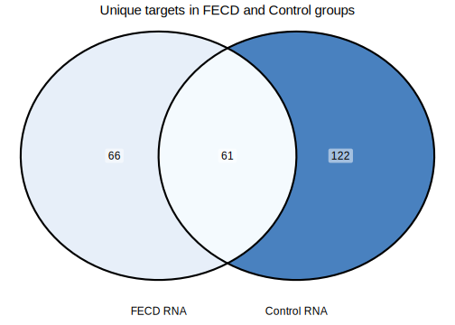<!-- -->

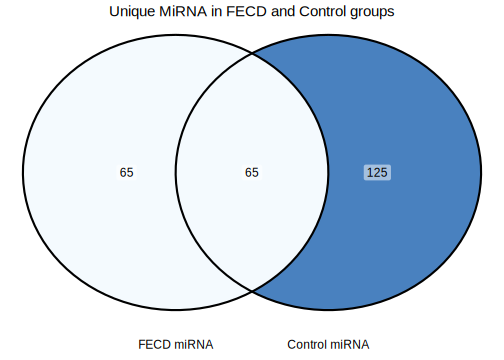<!-- -->

All Venn:

``` r
venn_list_all <- list(
  `All miRNA` = rownames(norm_data),
  `FECD miRNA` = final_FECD_MIMAT$miRNA,
  `Control miRNA` = final_control_MIMAT$miRNA,
  `Diffexpressed \nmiRNA` = diffexpressed_mirna_HGNC$miRNA)

ggVennDiagram(venn_list_all, label = "count" ) + 
  scale_fill_gradient(low = "#F4FAFE", high = "#4981BF")  +
  theme(plot.title = element_text(size = 20, hjust = 0.5), legend.position = "none") +
  labs(title = 'Intersections of the found groups with each other')
```

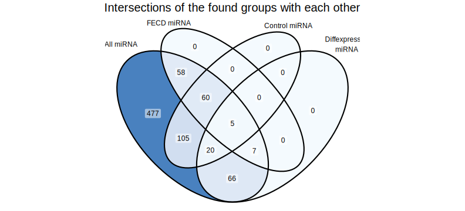<!-- -->

## 6.1 Intersection with DE miRNA

Lets intersect our results with diffexpressed miRNAs.

| RNA     | miRNA           | MIMAT_ID     | Correlation | p_value |     p_adj |   Ctrl.nar |   Ctrl.our | FECD_exp.nar | FECD_noexp.nar | FECD_exp.our | FECD_noexp.our |       HCEC |    nar.fe |    nar.fne |    HCEC.fe |   HCEC.fne | check_HCEC | dups_miRNA | dups_mimat | miRNA.y         | HGNC_name | mir_strand | seqnames |     start |       end | width | strand | type  | ID             | Derives_from | uniq_pos                  |
|:--------|:----------------|:-------------|------------:|--------:|----------:|-----------:|-----------:|-------------:|---------------:|-------------:|---------------:|-----------:|----------:|-----------:|-----------:|-----------:|:-----------|-----------:|-----------:|:----------------|:----------|:-----------|:---------|----------:|----------:|------:|:-------|:------|:---------------|:-------------|:--------------------------|
| ADM     | hsa-miR-329-5p  | MIMAT0026555 |  -0.7637626 |    0.03 | 0.0353612 |  8.5969350 |  8.3072188 |     5.861211 |       6.093377 |     6.988206 |       6.166485 |  3.7117574 | -2.735724 | -2.5035577 |  2.1494537 |  2.3816199 | yes        |          2 |          2 | hsa-miR-329-5p  | MIR329    | 5P         | chr14    | 101027114 | 101027136 |    23 | \+     | miRNA | MIMAT0026555_1 | MI0001726    | chr14_101027114_101027136 |
| ADM     | hsa-miR-329-5p  | MIMAT0026555 |  -0.7637626 |    0.03 | 0.0353612 |  8.5969350 |  8.3072188 |     5.861211 |       6.093377 |     6.988206 |       6.166485 |  3.7117574 | -2.735724 | -2.5035577 |  2.1494537 |  2.3816199 | yes        |          2 |          2 | hsa-miR-329-5p  | MIR329    | 5P         | chr14    | 101026797 | 101026819 |    23 | \+     | miRNA | MIMAT0026555   | MI0001725    | chr14_101026797_101026819 |
| ADM     | hsa-miR-380-3p  | MIMAT0000735 |  -0.7092081 |    0.05 | 0.0515479 |  8.5969350 |  8.3072188 |     5.861211 |       6.093377 |     6.988206 |       6.166485 |  3.7117574 | -2.735724 | -2.5035577 |  2.1494537 |  2.3816199 | yes        |          1 |          1 | hsa-miR-380-3p  | MIR380    | 3P         | chr14    | 101025056 | 101025077 |    22 | \+     | miRNA | MIMAT0000735   | MI0000788    | chr14_101025056_101025077 |
| APOL4   | hsa-miR-1303    | MIMAT0005891 |  -0.7142857 |    0.02 | 0.0281685 |  3.6221370 |  3.5131523 |     5.674869 |       4.583016 |     5.321522 |       3.845440 |         NA |  2.052732 |  0.9608786 |         NA |         NA | NA         |          1 |          1 | hsa-miR-1303    | MIR1303   | 5P         | chr5     | 154685827 | 154685848 |    22 | \+     | miRNA | MIMAT0005891   | MI0006370    | chr5_154685827_154685848  |
| APOL4   | hsa-miR-4455    | MIMAT0018977 |  -0.9047619 |    0.00 | 0.0000000 |  3.6221370 |  3.5131523 |     5.674869 |       4.583016 |     5.321522 |       3.845440 |         NA |  2.052732 |  0.9608786 |         NA |         NA | NA         |          1 |          1 | hsa-miR-4455    | MIR4455   | 5P         | chr4     | 184938421 | 184938437 |    17 | \-     | miRNA | MIMAT0018977   | MI0016801    | chr4_184938421_184938437  |
| APOL4   | hsa-miR-548n    | MIMAT0005916 |  -0.8571429 |    0.01 | 0.0197650 |  3.6221370 |  3.5131523 |     5.674869 |       4.583016 |     5.321522 |       3.845440 |         NA |  2.052732 |  0.9608786 |         NA |         NA | NA         |          1 |          1 | hsa-miR-548n    | MIR548N   | 5P         | chr7     |  34940804 |  34940825 |    22 | \-     | miRNA | MIMAT0005916   | MI0006399    | chr7_34940804_34940825    |
| ATP11A  | hsa-miR-1248    | MIMAT0005900 |  -0.7325886 |    0.03 | 0.0353612 |  4.0422134 |  4.7041567 |     6.522910 |       6.117516 |     6.926322 |       6.896304 |  7.2865138 |  2.480696 |  2.0753031 | -0.7636041 | -1.1689973 | no         |          1 |          1 | hsa-miR-1248    | MIR1248   | 5P         | chr3     | 186786675 | 186786701 |    27 | \+     | miRNA | MIMAT0005900   | MI0006383    | chr3_186786675_186786701  |
| ATP11A  | hsa-miR-3144-5p | MIMAT0015014 |  -0.7863867 |    0.01 | 0.0197650 |  4.0422134 |  4.7041567 |     6.522910 |       6.117516 |     6.926322 |       6.896304 |  7.2865138 |  2.480696 |  2.0753031 | -0.7636041 | -1.1689973 | no         |          1 |          1 | hsa-miR-3144-5p | MIR3144   | 5P         | chr6     | 120015191 | 120015212 |    22 | \+     | miRNA | MIMAT0015014   | MI0014169    | chr6_120015191_120015212  |
| BCL2    | hsa-miR-630     | MIMAT0003299 |  -0.8095238 |    0.01 | 0.0197650 |  1.6538746 |  3.3196874 |     4.459298 |       3.349574 |     4.631545 |       5.235366 |  4.7285989 |  2.805423 |  1.6956997 | -0.2693012 | -1.3790246 | no         |          1 |          1 | hsa-miR-630     | MIR630    | 5P         | chr15    |  72587277 |  72587298 |    22 | \+     | miRNA | MIMAT0003299   | MI0003644    | chr15_72587277_72587298   |
| BGN     | hsa-miR-4455    | MIMAT0018977 |  -0.7619048 |    0.01 | 0.0197650 |  4.8504099 |  5.3489535 |     8.115935 |       7.289242 |     8.782294 |       9.471014 |  2.1308541 |  3.265525 |  2.4388323 |  5.9850805 |  5.1583881 | yes        |          1 |          1 | hsa-miR-4455    | MIR4455   | 5P         | chr4     | 184938421 | 184938437 |    17 | \-     | miRNA | MIMAT0018977   | MI0016801    | chr4_184938421_184938437  |
| CDH11   | hsa-miR-181a-5p | MIMAT0000256 |  -0.7619048 |    0.00 | 0.0000000 |  5.8699227 |  6.4623213 |     8.347220 |       7.739861 |     8.622253 |       8.625492 | -3.7037091 |  2.477297 |  1.8699382 | 12.0509289 | 11.4435700 | yes        |          2 |          2 | hsa-miR-181a-5p | MIR181A   | 5P         | chr9     | 124692480 | 124692502 |    23 | \+     | miRNA | MIMAT0000256_1 | MI0000269    | chr9_124692480_124692502  |
| CDH11   | hsa-miR-181a-5p | MIMAT0000256 |  -0.7619048 |    0.00 | 0.0000000 |  5.8699227 |  6.4623213 |     8.347220 |       7.739861 |     8.622253 |       8.625492 | -3.7037091 |  2.477297 |  1.8699382 | 12.0509289 | 11.4435700 | yes        |          2 |          2 | hsa-miR-181a-5p | MIR181A   | 5P         | chr1     | 198859108 | 198859130 |    23 | \-     | miRNA | MIMAT0000256   | MI0000289    | chr1_198859108_198859130  |
| CDH11   | hsa-miR-200c-3p | MIMAT0000617 |  -0.7619048 |    0.00 | 0.0000000 |  5.8699227 |  6.4623213 |     8.347220 |       7.739861 |     8.622253 |       8.625492 | -3.7037091 |  2.477297 |  1.8699382 | 12.0509289 | 11.4435700 | yes        |          1 |          1 | hsa-miR-200c-3p | MIR200C   | 3P         | chr12    |   6963742 |   6963764 |    23 | \+     | miRNA | MIMAT0000617   | MI0000650    | chr12_6963742_6963764     |
| CHST11  | hsa-miR-654-5p  | MIMAT0003330 |  -0.7325886 |    0.05 | 0.0515479 | -0.6816881 |  2.9726625 |     3.167416 |       3.099848 |     3.282445 |       5.072248 |  3.1966762 |  3.849104 |  3.7815366 | -0.0292600 | -0.0968277 | no         |          1 |          1 | hsa-miR-654-5p  | MIR654    | 5P         | chr14    | 101040234 | 101040255 |    22 | \+     | miRNA | MIMAT0003330   | MI0003676    | chr14_101040234_101040255 |
| COL5A1  | hsa-miR-654-5p  | MIMAT0003330 |  -0.7637626 |    0.02 | 0.0281685 |  2.2324863 |  4.6288415 |     7.126937 |       8.122474 |     7.798703 |       9.579623 |  1.9497452 |  4.894450 |  5.8899877 |  5.1771914 |  6.1727288 | yes        |          1 |          1 | hsa-miR-654-5p  | MIR654    | 5P         | chr14    | 101040234 | 101040255 |    22 | \+     | miRNA | MIMAT0003330   | MI0003676    | chr14_101040234_101040255 |
| COL6A2  | hsa-miR-3158-3p | MIMAT0015032 |  -0.7142857 |    0.01 | 0.0197650 |  1.6879448 |  5.5780856 |     6.765640 |       6.899300 |     6.692953 |       9.481885 |  3.9022627 |  5.077695 |  5.2113553 |  2.8633770 |  2.9970374 | yes        |          2 |          2 | hsa-miR-3158-3p | MIR3158   | 3P         | chr10    | 101601427 | 101601448 |    22 | \-     | miRNA | MIMAT0015032_1 | MI0014187    | chr10_101601427_101601448 |
| COL6A2  | hsa-miR-3158-3p | MIMAT0015032 |  -0.7142857 |    0.01 | 0.0197650 |  1.6879448 |  5.5780856 |     6.765640 |       6.899300 |     6.692953 |       9.481885 |  3.9022627 |  5.077695 |  5.2113553 |  2.8633770 |  2.9970374 | yes        |          2 |          2 | hsa-miR-3158-3p | MIR3158   | 3P         | chr10    | 101601466 | 101601487 |    22 | \+     | miRNA | MIMAT0015032   | MI0014186    | chr10_101601466_101601487 |
| CSMD2   | hsa-miR-3180-5p | MIMAT0015057 |  -0.9132233 |    0.00 | 0.0000000 |  5.5153358 |  6.3406760 |     3.470503 |       5.731391 |     4.410533 |       5.563599 | -1.4747524 | -2.044833 |  0.2160557 |  4.9452552 |  7.2061439 | yes        |          3 |          3 | hsa-miR-3180-5p | MIR3180   | 5P         | chr16    |  14911237 |  14911261 |    25 | \+     | miRNA | MIMAT0015057   | MI0014214    | chr16_14911237_14911261   |
| CSMD2   | hsa-miR-3180-5p | MIMAT0015057 |  -0.9132233 |    0.00 | 0.0000000 |  5.5153358 |  6.3406760 |     3.470503 |       5.731391 |     4.410533 |       5.563599 | -1.4747524 | -2.044833 |  0.2160557 |  4.9452552 |  7.2061439 | yes        |          3 |          3 | hsa-miR-3180-5p | MIR3180   | 5P         | chr16    |  18402230 |  18402254 |    25 | \-     | miRNA | MIMAT0015057_2 | MI0014217    | chr16_18402230_18402254   |
| CSMD2   | hsa-miR-3180-5p | MIMAT0015057 |  -0.9132233 |    0.00 | 0.0000000 |  5.5153358 |  6.3406760 |     3.470503 |       5.731391 |     4.410533 |       5.563599 | -1.4747524 | -2.044833 |  0.2160557 |  4.9452552 |  7.2061439 | yes        |          3 |          3 | hsa-miR-3180-5p | MIR3180   | 5P         | chr16    |  16309892 |  16309916 |    25 | \+     | miRNA | MIMAT0015057_1 | MI0014215    | chr16_16309892_16309916   |
| DRAM1   | hsa-miR-1827    | MIMAT0006767 |  -0.7075276 |    0.01 | 0.0197650 |  0.2188802 |  0.4781008 |     2.639977 |       3.422996 |     2.917062 |       5.412302 |  4.2353092 |  2.421097 |  3.2041161 | -1.5953321 | -0.8123129 | no         |          1 |          1 | hsa-miR-1827    | MIR1827   | 5P         | chr12    | 100189932 | 100189949 |    18 | \+     | miRNA | MIMAT0006767   | MI0008195    | chr12_100189932_100189949 |
| ENC1    | hsa-miR-876-5p  | MIMAT0004924 |  -0.7325886 |    0.07 | 0.0702497 |  0.3755497 |  0.3595031 |     3.754760 |       6.089576 |     4.203551 |       6.570522 |  6.7973937 |  3.379210 |  5.7140262 | -3.0426342 | -0.7078178 | yes        |          1 |          1 | hsa-miR-876-5p  | MIR876    | 5P         | chr9     |  28863675 |  28863696 |    22 | \-     | miRNA | MIMAT0004924   | MI0005542    | chr9_28863675_28863696    |
| FAT4    | hsa-miR-1305    | MIMAT0005893 |  -0.8333333 |    0.01 | 0.0197650 |  2.9808087 |  4.2570258 |     4.994954 |       4.218489 |     4.732487 |       5.322740 |  6.1026175 |  2.014145 |  1.2376808 | -1.1076637 | -1.8841280 | no         |          1 |          1 | hsa-miR-1305    | MIR1305   | 5P         | chr4     | 182169343 | 182169364 |    22 | \+     | miRNA | MIMAT0005893   | MI0006372    | chr4_182169343_182169364  |
| FMNL3   | hsa-miR-515-3p  | MIMAT0002827 |  -0.8624887 |    0.02 | 0.0281685 |  0.5210427 |  2.6436234 |     5.371993 |       5.078751 |     4.424294 |       6.249742 |  6.5174409 |  4.850951 |  4.5577081 | -1.1454476 | -1.4386901 | no         |          2 |          2 | hsa-miR-515-3p  | MIR515    | 3P         | chr19    |  53685059 |  53685080 |    22 | \+     | miRNA | MIMAT0002827_1 | MI0003147    | chr19_53685059_53685080   |
| FMNL3   | hsa-miR-515-3p  | MIMAT0002827 |  -0.8624887 |    0.02 | 0.0281685 |  0.5210427 |  2.6436234 |     5.371993 |       5.078751 |     4.424294 |       6.249742 |  6.5174409 |  4.850951 |  4.5577081 | -1.1454476 | -1.4386901 | no         |          2 |          2 | hsa-miR-515-3p  | MIR515    | 3P         | chr19    |  53679053 |  53679074 |    22 | \+     | miRNA | MIMAT0002827   | MI0003144    | chr19_53679053_53679074   |
| FRAS1   | hsa-miR-637     | MIMAT0003307 |  -0.8455943 |    0.01 | 0.0197650 | -0.4252206 |  1.5478708 |     2.199995 |       1.904029 |     2.540119 |       5.010538 |  3.2522744 |  2.625216 |  2.3292497 | -1.0522793 | -1.3482453 | no         |          1 |          1 | hsa-miR-637     | MIR637    | 5P         | chr19    |   3961429 |   3961452 |    24 | \-     | miRNA | MIMAT0003307   | MI0003652    | chr19_3961429_3961452     |
| GLIPR1  | hsa-miR-626     | MIMAT0003295 |  -0.7863867 |    0.02 | 0.0281685 | -1.5268170 |  2.3292575 |     4.757805 |       6.694038 |     5.309696 |       7.404917 |  3.8175325 |  6.284622 |  8.2208551 |  0.9402724 |  2.8765056 | no         |          1 |          1 | hsa-miR-626     | MIR626    | 5P         | chr15    |  41691645 |  41691663 |    19 | \+     | miRNA | MIMAT0003295   | MI0003640    | chr15_41691645_41691663   |
| HHIPL1  | hsa-miR-891b    | MIMAT0004913 |  -0.7229685 |    0.01 | 0.0197650 |  0.3603595 |  1.7308092 |     3.301319 |       2.559763 |     3.863967 |       3.651497 | -2.2907965 |  2.940960 |  2.1994035 |  5.5921158 |  4.8505595 | yes        |          1 |          1 | hsa-miR-891b    | MIR891B   | 5P         | chrX     | 146001100 | 146001121 |    22 | \-     | miRNA | MIMAT0004913   | MI0005534    | chrX_146001100_146001121  |
| JMJD6   | hsa-miR-1248    | MIMAT0005900 |  -0.7637626 |    0.03 | 0.0353612 |  6.6863329 |  5.3528418 |     3.578144 |       3.815286 |     3.664703 |       4.036824 |  4.7700894 | -3.108189 | -2.8710468 | -1.1919456 | -0.9548033 | no         |          1 |          1 | hsa-miR-1248    | MIR1248   | 5P         | chr3     | 186786675 | 186786701 |    27 | \+     | miRNA | MIMAT0005900   | MI0006383    | chr3_186786675_186786701  |
| KLF4    | hsa-miR-548n    | MIMAT0005916 |  -0.7380952 |    0.02 | 0.0281685 |  5.9406580 |  4.7885188 |     2.147193 |       2.084288 |     1.210163 |       3.648523 |  3.2483602 | -3.793465 | -3.8563697 | -1.1011671 | -1.1640718 | no         |          1 |          1 | hsa-miR-548n    | MIR548N   | 5P         | chr7     |  34940804 |  34940825 |    22 | \-     | miRNA | MIMAT0005916   | MI0006399    | chr7_34940804_34940825    |
| NOP2    | hsa-miR-1305    | MIMAT0005893 |  -0.7380952 |    0.04 | 0.0432093 |  6.0184896 |  4.5962480 |     3.951738 |       4.045703 |     4.080723 |       4.273731 |  6.5335186 | -2.066752 | -1.9727865 | -2.5817807 | -2.4878155 | yes        |          1 |          1 | hsa-miR-1305    | MIR1305   | 5P         | chr4     | 182169343 | 182169364 |    22 | \+     | miRNA | MIMAT0005893   | MI0006372    | chr4_182169343_182169364  |
| NOX4    | hsa-miR-1303    | MIMAT0005891 |  -0.8539126 |    0.01 | 0.0197650 | -2.1102220 | -0.0259643 |     4.737868 |       4.647115 |     5.010927 |       5.369867 | -1.3838305 |  6.848090 |  6.7573367 |  6.1216986 |  6.0309451 | yes        |          1 |          1 | hsa-miR-1303    | MIR1303   | 5P         | chr5     | 154685827 | 154685848 |    22 | \+     | miRNA | MIMAT0005891   | MI0006370    | chr5_154685827_154685848  |
| PMEPA1  | hsa-miR-3180-5p | MIMAT0015057 |  -0.8498050 |    0.01 | 0.0197650 |  1.1060161 |  3.7636135 |     3.710602 |       4.617737 |     5.358731 |       6.754397 |  4.8626169 |  2.604586 |  3.5117213 | -1.1520150 | -0.2448795 | no         |          3 |          3 | hsa-miR-3180-5p | MIR3180   | 5P         | chr16    |  14911237 |  14911261 |    25 | \+     | miRNA | MIMAT0015057   | MI0014214    | chr16_14911237_14911261   |
| PMEPA1  | hsa-miR-3180-5p | MIMAT0015057 |  -0.8498050 |    0.01 | 0.0197650 |  1.1060161 |  3.7636135 |     3.710602 |       4.617737 |     5.358731 |       6.754397 |  4.8626169 |  2.604586 |  3.5117213 | -1.1520150 | -0.2448795 | no         |          3 |          3 | hsa-miR-3180-5p | MIR3180   | 5P         | chr16    |  18402230 |  18402254 |    25 | \-     | miRNA | MIMAT0015057_2 | MI0014217    | chr16_18402230_18402254   |
| PMEPA1  | hsa-miR-3180-5p | MIMAT0015057 |  -0.8498050 |    0.01 | 0.0197650 |  1.1060161 |  3.7636135 |     3.710602 |       4.617737 |     5.358731 |       6.754397 |  4.8626169 |  2.604586 |  3.5117213 | -1.1520150 | -0.2448795 | no         |          3 |          3 | hsa-miR-3180-5p | MIR3180   | 5P         | chr16    |  16309892 |  16309916 |    25 | \+     | miRNA | MIMAT0015057_1 | MI0014215    | chr16_16309892_16309916   |
| PMEPA1  | hsa-miR-637     | MIMAT0003307 |  -0.7092081 |    0.02 | 0.0281685 |  1.1060161 |  3.7636135 |     3.710602 |       4.617737 |     5.358731 |       6.754397 |  4.8626169 |  2.604586 |  3.5117213 | -1.1520150 | -0.2448795 | no         |          1 |          1 | hsa-miR-637     | MIR637    | 5P         | chr19    |   3961429 |   3961452 |    24 | \-     | miRNA | MIMAT0003307   | MI0003652    | chr19_3961429_3961452     |
| RASAL2  | hsa-miR-1193    | MIMAT0015049 |  -0.7637626 |    0.00 | 0.0000000 |  1.6733554 |  2.8339298 |     4.475193 |       4.699185 |     4.489611 |       6.038296 |  6.5813989 |  2.801838 |  3.0258291 | -2.1062056 | -1.8822144 | yes        |          1 |          1 | hsa-miR-1193    | MIR1193   | 5P         | chr14    | 101030061 | 101030083 |    23 | \+     | miRNA | MIMAT0015049   | MI0014205    | chr14_101030061_101030083 |
| RPL9    | hsa-miR-186-5p  | MIMAT0000456 |  -0.7857143 |    0.00 | 0.0000000 |  8.0753001 |  7.3415867 |     5.703935 |       6.587729 |     6.516241 |       5.679564 |  3.9395296 | -2.371366 | -1.4875710 |  1.7644050 |  2.6481995 | no         |          1 |          1 | hsa-miR-186-5p  | MIR186    | 5P         | chr1     |  71067681 |  71067702 |    22 | \-     | miRNA | MIMAT0000456   | MI0000483    | chr1_71067681_71067702    |
| SEZ6L2  | hsa-miR-1972    | MIMAT0009447 |  -0.8571429 |    0.00 | 0.0000000 | -1.5702632 | -0.3317148 |     4.105265 |       3.350301 |     4.036857 |       4.674993 |  5.4523956 |  5.675528 |  4.9205645 | -1.3471310 | -2.1020942 | no         |          2 |          2 | hsa-miR-1972    | MIR1972   | 5P         | chr16    |  70030393 |  70030414 |    22 | \+     | miRNA | MIMAT0009447_1 | MI0015977    | chr16_70030393_70030414   |
| SEZ6L2  | hsa-miR-1972    | MIMAT0009447 |  -0.8571429 |    0.00 | 0.0000000 | -1.5702632 | -0.3317148 |     4.105265 |       3.350301 |     4.036857 |       4.674993 |  5.4523956 |  5.675528 |  4.9205645 | -1.3471310 | -2.1020942 | no         |          2 |          2 | hsa-miR-1972    | MIR1972   | 5P         | chr16    |  15010329 |  15010350 |    22 | \-     | miRNA | MIMAT0009447   | MI0009982    | chr16_15010329_15010350   |
| SHROOM4 | hsa-miR-891b    | MIMAT0004913 |  -0.7229685 |    0.04 | 0.0432093 |  0.8380381 |  1.9194220 |     3.881213 |       3.251639 |     4.255538 |       4.495965 |  3.3771229 |  3.043175 |  2.4136007 |  0.5040904 | -0.1254842 | no         |          1 |          1 | hsa-miR-891b    | MIR891B   | 5P         | chrX     | 146001100 | 146001121 |    22 | \-     | miRNA | MIMAT0004913   | MI0005534    | chrX_146001100_146001121  |
| SLC7A2  | hsa-miR-1279    | MIMAT0005937 |  -0.7325886 |    0.03 | 0.0353612 | -2.6784842 |  1.2589233 |     2.948968 |       3.462427 |     3.600321 |       5.958565 |  4.9030102 |  5.627452 |  6.1409114 | -1.9540420 | -1.4405830 | no         |          1 |          1 | hsa-miR-1279    | MIR1279   | 5P         | chr12    |  69273188 |  69273204 |    17 | \-     | miRNA | MIMAT0005937   | MI0006426    | chr12_69273188_69273204   |
| SLC7A5  | hsa-miR-3144-5p | MIMAT0015014 |  -0.7610194 |    0.03 | 0.0353612 |  2.9998130 |  2.9107597 |     5.237253 |       5.123063 |     5.958753 |       6.510596 |  6.2569932 |  2.237439 |  2.1232496 | -1.0197407 | -1.1339305 | no         |          1 |          1 | hsa-miR-3144-5p | MIR3144   | 5P         | chr6     | 120015191 | 120015212 |    22 | \+     | miRNA | MIMAT0015014   | MI0014169    | chr6_120015191_120015212  |
| SLC7A5  | hsa-miR-626     | MIMAT0003295 |  -0.7102848 |    0.01 | 0.0197650 |  2.9998130 |  2.9107597 |     5.237253 |       5.123063 |     5.958753 |       6.510596 |  6.2569932 |  2.237439 |  2.1232496 | -1.0197407 | -1.1339305 | no         |          1 |          1 | hsa-miR-626     | MIR626    | 5P         | chr15    |  41691645 |  41691663 |    19 | \+     | miRNA | MIMAT0003295   | MI0003640    | chr15_41691645_41691663   |
| SLC8A1  | hsa-miR-1305    | MIMAT0005893 |  -0.7857143 |    0.02 | 0.0281685 | -1.2644404 |  0.7229647 |     4.355273 |       3.893373 |     4.184611 |       5.747341 |  3.9352125 |  5.619713 |  5.1578133 |  0.4200603 | -0.0418396 | no         |          1 |          1 | hsa-miR-1305    | MIR1305   | 5P         | chr4     | 182169343 | 182169364 |    22 | \+     | miRNA | MIMAT0005893   | MI0006372    | chr4_182169343_182169364  |
| SLC9A9  | hsa-miR-630     | MIMAT0003299 |  -0.7857143 |    0.01 | 0.0197650 | -2.5680506 |  1.4485162 |     2.498933 |       2.987014 |     2.016389 |       3.745102 | -0.7385534 |  5.066983 |  5.5550646 |  3.2374862 |  3.7255673 | yes        |          1 |          1 | hsa-miR-630     | MIR630    | 5P         | chr15    |  72587277 |  72587298 |    22 | \+     | miRNA | MIMAT0003299   | MI0003644    | chr15_72587277_72587298   |
| THSD4   | hsa-miR-1193    | MIMAT0015049 |  -0.7637626 |    0.01 | 0.0197650 |  1.8478669 |  4.1838969 |     5.386349 |       4.941345 |     5.319740 |       6.165400 |  7.0232925 |  3.538483 |  3.0934778 | -1.6369430 | -2.0819477 | no         |          1 |          1 | hsa-miR-1193    | MIR1193   | 5P         | chr14    | 101030061 | 101030083 |    23 | \+     | miRNA | MIMAT0015049   | MI0014205    | chr14_101030061_101030083 |
| THSD4   | hsa-miR-637     | MIMAT0003307 |  -0.8728716 |    0.01 | 0.0197650 |  1.8478669 |  4.1838969 |     5.386349 |       4.941345 |     5.319740 |       6.165400 |  7.0232925 |  3.538483 |  3.0934778 | -1.6369430 | -2.0819477 | no         |          1 |          1 | hsa-miR-637     | MIR637    | 5P         | chr19    |   3961429 |   3961452 |    24 | \-     | miRNA | MIMAT0003307   | MI0003652    | chr19_3961429_3961452     |
| VASH1   | hsa-miR-665     | MIMAT0004952 |  -0.7325886 |    0.03 | 0.0353612 |  1.0239933 |  2.0898299 |     4.484559 |       3.574768 |     4.128432 |       5.320850 |  4.2244342 |  3.460565 |  2.5507743 |  0.2601244 | -0.6496666 | no         |          1 |          1 | hsa-miR-665     | MIR665    | 5P         | chr14    | 100875075 | 100875094 |    20 | \+     | miRNA | MIMAT0004952   | MI0005563    | chr14_100875075_100875094 |

Control

| RNA      | miRNA           | MIMAT_ID     | Correlation | p_value |     p_adj |   Ctrl.nar |   Ctrl.our | FECD_exp.nar | FECD_noexp.nar | FECD_exp.our | FECD_noexp.our |       HCEC |    nar.fe |    nar.fne |    HCEC.fe |   HCEC.fne | check_HCEC | dups_miRNA | dups_mimat | HGNC_name | mir_strand | seqnames |     start |       end | width | strand | type  | ID             | Name            | Derives_from | uniq_pos                  |
|:---------|:----------------|:-------------|------------:|--------:|----------:|-----------:|-----------:|-------------:|---------------:|-------------:|---------------:|-----------:|----------:|-----------:|-----------:|-----------:|:-----------|-----------:|-----------:|:----------|:-----------|:---------|----------:|----------:|------:|:-------|:------|:---------------|:----------------|:-------------|:--------------------------|
| ADM      | hsa-miR-1248    | MIMAT0005900 |  -0.7380952 |    0.03 | 0.0348964 |  8.5969350 |  8.3072188 |     5.861211 |       6.093377 |     6.988206 |       6.166485 |  3.7117574 | -2.735724 | -2.5035577 |  2.1494537 |  2.3816199 | yes        |          1 |          1 | MIR1248   | 5P         | chr3     | 186786675 | 186786701 |    27 | \+     | miRNA | MIMAT0005900   | hsa-miR-1248    | MI0006383    | chr3_186786675_186786701  |
| ANKRD33B | hsa-miR-519d-3p | MIMAT0002853 |  -0.7305520 |    0.03 | 0.0348964 |  2.0936710 |  2.8613259 |     5.072975 |       4.180774 |     4.961280 |       5.683353 |  6.5367804 |  2.979304 |  2.0871028 | -1.4638052 | -2.3560066 | no         |          1 |          1 | MIR519D   | 3P         | chr19    |  53713400 |  53713421 |    22 | \+     | miRNA | MIMAT0002853   | hsa-miR-519d-3p | MI0003162    | chr19_53713400_53713421   |
| CD163    | hsa-miR-802     | MIMAT0004185 |  -0.7142857 |    0.07 | 0.0701993 | -0.0468395 |  3.2747591 |     4.101638 |       5.454772 |     4.115174 |       6.235750 |         NA |  4.148478 |  5.5016116 |         NA |         NA | NA         |          1 |          1 | MIR802    | 5P         | chr21    |  35720732 |  35720754 |    23 | \+     | miRNA | MIMAT0004185   | hsa-miR-802     | MI0003906    | chr21_35720732_35720754   |
| CRABP2   | hsa-miR-1303    | MIMAT0005891 |  -0.7380952 |    0.02 | 0.0279423 |  5.4056698 |  6.3180321 |     2.783267 |       5.021890 |     3.424799 |       4.240306 |  3.5345986 | -2.622403 | -0.3837803 | -0.7513319 |  1.4872909 | no         |          1 |          1 | MIR1303   | 5P         | chr5     | 154685827 | 154685848 |    22 | \+     | miRNA | MIMAT0005891   | hsa-miR-1303    | MI0006370    | chr5_154685827_154685848  |
| CTSS     | hsa-miR-519d-3p | MIMAT0002853 |  -0.7065995 |    0.00 | 0.0000000 |  0.4636065 |  1.1854888 |     4.168127 |       4.443182 |     4.361592 |       7.203049 |         NA |  3.704521 |  3.9795758 |         NA |         NA | NA         |          1 |          1 | MIR519D   | 3P         | chr19    |  53713400 |  53713421 |    22 | \+     | miRNA | MIMAT0002853   | hsa-miR-519d-3p | MI0003162    | chr19_53713400_53713421   |
| EPHB1    | hsa-miR-1248    | MIMAT0005900 |  -0.7619048 |    0.01 | 0.0195559 |  6.3534129 |  6.8944751 |     4.217931 |       6.464076 |     4.595875 |       5.063719 | -2.2151448 | -2.135482 |  0.1106628 |  6.4330755 |  8.6792206 | yes        |          1 |          1 | MIR1248   | 5P         | chr3     | 186786675 | 186786701 |    27 | \+     | miRNA | MIMAT0005900   | hsa-miR-1248    | MI0006383    | chr3_186786675_186786701  |
| FGD4     | hsa-miR-617     | MIMAT0003286 |  -0.8333333 |    0.02 | 0.0279423 |  1.9498097 |  3.6254949 |     4.274169 |       4.456774 |     4.052086 |       5.734811 |  6.8762358 |  2.324359 |  2.5069639 | -2.6020666 | -2.4194622 | yes        |          1 |          1 | MIR617    | 5P         | chr12    |  80832593 |  80832614 |    22 | \-     | miRNA | MIMAT0003286   | hsa-miR-617     | MI0003631    | chr12_80832593_80832614   |
| FMNL3    | hsa-miR-519d-3p | MIMAT0002853 |  -0.7065995 |    0.04 | 0.0425788 |  0.5210427 |  2.6436234 |     5.371993 |       5.078751 |     4.424294 |       6.249742 |  6.5174409 |  4.850951 |  4.5577081 | -1.1454476 | -1.4386901 | no         |          1 |          1 | MIR519D   | 3P         | chr19    |  53713400 |  53713421 |    22 | \+     | miRNA | MIMAT0002853   | hsa-miR-519d-3p | MI0003162    | chr19_53713400_53713421   |
| GBP4     | hsa-miR-576-3p  | MIMAT0004796 |  -0.7857143 |    0.01 | 0.0195559 |  0.3458418 |  1.9004527 |     3.746100 |       3.488974 |     3.079179 |       4.761262 | -3.7037091 |  3.400259 |  3.1431319 |  7.4498094 |  7.1926828 | yes        |          1 |          1 | MIR576    | 3P         | chr4     | 109488752 | 109488773 |    22 | \+     | miRNA | MIMAT0004796   | hsa-miR-576-3p  | MI0003583    | chr4_109488752_109488773  |
| GPRIN3   | hsa-miR-519d-3p | MIMAT0002853 |  -0.7305520 |    0.00 | 0.0000000 | -3.1393021 |  0.5566820 |     4.428890 |       4.046678 |     4.271996 |       5.574813 |         NA |  7.568192 |  7.1859797 |         NA |         NA | NA         |          1 |          1 | MIR519D   | 3P         | chr19    |  53713400 |  53713421 |    22 | \+     | miRNA | MIMAT0002853   | hsa-miR-519d-3p | MI0003162    | chr19_53713400_53713421   |
| HLA-DPB1 | hsa-miR-617     | MIMAT0003286 |  -0.7619048 |    0.03 | 0.0348964 |  4.8232709 |  4.7148863 |     6.857175 |       6.283787 |     6.641555 |       7.664328 | -3.7037091 |  2.033905 |  1.4605163 | 10.5608845 |  9.9874962 | yes        |          1 |          1 | MIR617    | 5P         | chr12    |  80832593 |  80832614 |    22 | \-     | miRNA | MIMAT0003286   | hsa-miR-617     | MI0003631    | chr12_80832593_80832614   |
| ICOSLG   | hsa-miR-617     | MIMAT0003286 |  -0.8095238 |    0.02 | 0.0279423 |  0.6634372 |  1.6130994 |     3.222630 |       2.704964 |     3.096369 |       4.055471 |  3.7774083 |  2.559192 |  2.0415267 | -0.5547789 | -1.0724445 | no         |          1 |          1 | MIR617    | 5P         | chr12    |  80832593 |  80832614 |    22 | \-     | miRNA | MIMAT0003286   | hsa-miR-617     | MI0003631    | chr12_80832593_80832614   |
| KLF10    | hsa-miR-1305    | MIMAT0005893 |  -0.7380952 |    0.02 | 0.0279423 |  8.8939090 |  6.9142060 |     5.813086 |       6.105018 |     5.216665 |       5.817640 |  5.0612940 | -3.080823 | -2.7888909 |  0.7517917 |  1.0437241 | no         |          1 |          1 | MIR1305   | 5P         | chr4     | 182169343 | 182169364 |    22 | \+     | miRNA | MIMAT0005893   | hsa-miR-1305    | MI0006372    | chr4_182169343_182169364  |
| MEST     | hsa-miR-654-5p  | MIMAT0003330 |  -0.7857143 |    0.01 | 0.0195559 |  2.8179136 |  3.5381601 |     5.314878 |       5.682663 |     5.882645 |       6.134583 |  5.1037515 |  2.496965 |  2.8647493 |  0.2111269 |  0.5789114 | no         |          1 |          1 | MIR654    | 5P         | chr14    | 101040234 | 101040255 |    22 | \+     | miRNA | MIMAT0003330   | hsa-miR-654-5p  | MI0003676    | chr14_101040234_101040255 |
| MMP16    | hsa-miR-1205    | MIMAT0005869 |  -0.7142857 |    0.04 | 0.0425788 |  0.4373262 |  1.6393027 |     3.641129 |       3.688112 |     3.445401 |       3.958268 | -0.2630127 |  3.203803 |  3.2507854 |  3.9041415 |  3.9511243 | yes        |          1 |          1 | MIR1205   | 5P         | chr8     | 127960640 | 127960659 |    20 | \+     | miRNA | MIMAT0005869   | hsa-miR-1205    | MI0006338    | chr8_127960640_127960659  |
| MOXD1    | hsa-miR-513a-5p | MIMAT0002877 |  -0.7142857 |    0.03 | 0.0348964 |  2.2833887 |  1.5276661 |     4.625519 |       3.693746 |     3.765312 |       5.437960 |  2.6133696 |  2.342131 |  1.4103575 |  2.0121498 |  1.0803765 | yes        |          2 |          2 | MIR513A   | 5P         | chrX     | 147225900 | 147225917 |    18 | \-     | miRNA | MIMAT0002877_1 | hsa-miR-513a-5p | MI0003192    | chrX_147225900_147225917  |
| MOXD1    | hsa-miR-513a-5p | MIMAT0002877 |  -0.7142857 |    0.03 | 0.0348964 |  2.2833887 |  1.5276661 |     4.625519 |       3.693746 |     3.765312 |       5.437960 |  2.6133696 |  2.342131 |  1.4103575 |  2.0121498 |  1.0803765 | yes        |          2 |          2 | MIR513A   | 5P         | chrX     | 147213538 | 147213555 |    18 | \-     | miRNA | MIMAT0002877   | hsa-miR-513a-5p | MI0003191    | chrX_147213538_147213555  |
| MYO1F    | hsa-miR-519d-3p | MIMAT0002853 |  -0.7305520 |    0.02 | 0.0279423 | -0.3304903 |  1.3412820 |     3.013733 |       2.763762 |     3.506992 |       5.853141 |         NA |  3.344223 |  3.0942525 |         NA |         NA | NA         |          1 |          1 | MIR519D   | 3P         | chr19    |  53713400 |  53713421 |    22 | \+     | miRNA | MIMAT0002853   | hsa-miR-519d-3p | MI0003162    | chr19_53713400_53713421   |
| PPP1R15B | hsa-miR-30d-5p  | MIMAT0000245 |  -0.8571429 |    0.00 | 0.0000000 |  8.2307129 |  7.0766158 |     5.885284 |       6.030790 |     6.240820 |       6.240737 |  5.3806662 | -2.345429 | -2.1999228 |  0.5046180 |  0.6501239 | no         |          1 |          1 | MIR30D    | 5P         | chr8     | 134804919 | 134804940 |    22 | \-     | miRNA | MIMAT0000245   | hsa-miR-30d-5p  | MI0000255    | chr8_134804919_134804940  |
| PRSS23   | hsa-miR-617     | MIMAT0003286 |  -0.7380952 |    0.05 | 0.0512567 |  2.2501285 |  3.0747454 |     5.985207 |       5.310395 |     5.823798 |       7.402995 |  7.2733367 |  3.735078 |  3.0602662 | -1.2881301 | -1.9629420 | no         |          1 |          1 | MIR617    | 5P         | chr12    |  80832593 |  80832614 |    22 | \-     | miRNA | MIMAT0003286   | hsa-miR-617     | MI0003631    | chr12_80832593_80832614   |
| SLC7A5   | hsa-miR-30d-5p  | MIMAT0000245 |  -0.7619048 |    0.01 | 0.0195559 |  2.9998130 |  2.9107597 |     5.237253 |       5.123063 |     5.958753 |       6.510596 |  6.2569932 |  2.237439 |  2.1232496 | -1.0197407 | -1.1339305 | no         |          1 |          1 | MIR30D    | 5P         | chr8     | 134804919 | 134804940 |    22 | \-     | miRNA | MIMAT0000245   | hsa-miR-30d-5p  | MI0000255    | chr8_134804919_134804940  |
| SYK      | hsa-miR-617     | MIMAT0003286 |  -0.7380952 |    0.01 | 0.0195559 | -2.4753725 | -0.2290492 |     3.967697 |       3.982701 |     3.278043 |       5.284614 | -2.9767893 |  6.443069 |  6.4580737 |  6.9444860 |  6.9594904 | yes        |          1 |          1 | MIR617    | 5P         | chr12    |  80832593 |  80832614 |    22 | \-     | miRNA | MIMAT0003286   | hsa-miR-617     | MI0003631    | chr12_80832593_80832614   |
| TIAM1    | hsa-miR-617     | MIMAT0003286 |  -0.8095238 |    0.00 | 0.0000000 | -0.5541903 |  4.1288796 |     3.174689 |       3.002488 |     2.735225 |       4.697443 |  6.4899393 |  3.728880 |  3.5566780 | -3.3152497 | -3.4874516 | yes        |          1 |          1 | MIR617    | 5P         | chr12    |  80832593 |  80832614 |    22 | \-     | miRNA | MIMAT0003286   | hsa-miR-617     | MI0003631    | chr12_80832593_80832614   |
| TNFAIP3  | hsa-miR-626     | MIMAT0003295 |  -0.8862434 |    0.00 | 0.0000000 |  5.9209953 |  4.5683751 |     3.823333 |       4.042545 |     2.542018 |       4.702009 |  4.9430516 | -2.097662 | -1.8784503 | -1.1197182 | -0.9005066 | no         |          1 |          1 | MIR626    | 5P         | chr15    |  41691645 |  41691663 |    19 | \+     | miRNA | MIMAT0003295   | hsa-miR-626     | MI0003640    | chr15_41691645_41691663   |
| VANGL1   | hsa-miR-802     | MIMAT0004185 |  -0.7380952 |    0.00 | 0.0000000 |  0.6859967 |  1.8170797 |     3.059374 |       2.775319 |     3.442649 |       4.322116 |  6.2065601 |  2.373377 |  2.0893219 | -3.1471860 | -3.4312414 | yes        |          1 |          1 | MIR802    | 5P         | chr21    |  35720732 |  35720754 |    23 | \+     | miRNA | MIMAT0004185   | hsa-miR-802     | MI0003906    | chr21_35720732_35720754   |
| ZBTB8A   | hsa-miR-617     | MIMAT0003286 |  -0.7619048 |    0.01 | 0.0195559 | -1.7055155 |  1.1771266 |     2.653433 |       1.973518 |     2.563618 |       3.311289 |  4.3864422 |  4.358948 |  3.6790331 | -1.7330095 | -2.4129246 | no         |          1 |          1 | MIR617    | 5P         | chr12    |  80832593 |  80832614 |    22 | \-     | miRNA | MIMAT0003286   | hsa-miR-617     | MI0003631    | chr12_80832593_80832614   |

FECD

``` r
length(intersect(final_FECD_MIMAT$RNA, final_FECD_HGNC$RNA))
```

    ## [1] 127

``` r
length(intersect(final_control_MIMAT$RNA, final_control_HGNC$RNA))
```

    ## [1] 183

``` r
length(intersect(final_FECD_MIMAT$miRNA, final_FECD_HGNC$miRNA))
```

    ## [1] 130

``` r
length(intersect(final_control_MIMAT$miRNA, final_control_HGNC$miRNA))
```

    ## [1] 190

**Verdict:** The tables turned out to be virtually identical. It was
decided to use the option with MIMAT identification, as it was more
reliable.

## 6.2 Target expression level

To confirm regulation, we will construct boxplots by group.

``` r
final_FECD_MIMAT <- readRDS('/data7a/bio/human_genomics/fuchs_dystrophy/nanostring/analisys/RDS/final_FECD_MIMAT.RDS')
# get genes
hkgs <- c('TBP', 'GPI', 'GAPDH')
to_check <- c('COL1A1', 'COL4A1', 'LAMC1', 'DICER1')
genes_control <- c(unique(final_control_HGNC$RNA), hkgs)
genes_FECD <- c(unique(final_FECD_MIMAT$RNA), hkgs)

bp_control <- cpm.symbol[rownames(cpm.symbol) %in% genes_control,]
bp_FECD <- cpm.symbol[rownames(cpm.symbol) %in% genes_FECD,]
```

**Boxplots of FECD gene expression**

``` r
for_box_long <- bp_FECD %>%
  rownames_to_column(var = "Gene") %>% 
  pivot_longer(cols = -Gene, names_to = "Sample", values_to = "Expression") %>% 
  mutate(fecd_group = case_when(
    str_detect(Sample, "C") ~ "Control",
    str_detect(Sample, "D") ~ "FECD"
  )) %>% 
  group_by(Gene, fecd_group) %>%
  mutate(
    Q1 = quantile(Expression, 0.25),
    Q3 = quantile(Expression, 0.75),
    IQR = Q3 - Q1,
    is_outlier = ifelse(Expression < (Q1 - 1.5 * IQR) | Expression > (Q3 + 1.5 * IQR), TRUE, FALSE)
  ) %>% ungroup()

for_box_long$Expression <- log(for_box_long$Expression)
for_box_long <- for_box_long %>% rename(Group = fecd_group)

ggplot(for_box_long,  aes(x = Group, y = Expression, fill = Group)) +
  geom_boxplot(show.legend = T)+
  geom_jitter(position=position_jitter(0.3), cex=1.3) +
  geom_text(
    data = filter(for_box_long, is_outlier),
    aes(label = Sample),
    position = position_jitter(width = 0.2),
    vjust = -1,
    size = 3,
    color = "black") +

  theme(axis.text.x = element_text(angle = 90, hjust = 1),
        plot.title = element_text(size = 35, hjust = 0.5),
        strip.text = element_text(size = 15)) +
  labs(
    title = expression("Expression of genes negatively correlated with miRNAs in the FECD group (" * log[2] * ")"),
    y = expression(Log[2]~"Expression Level"), x='') +
  facet_wrap(~Gene)
```

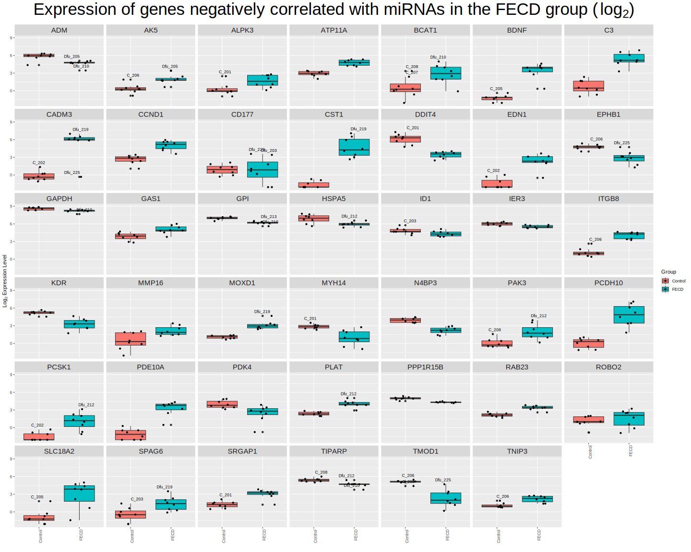<!-- -->
