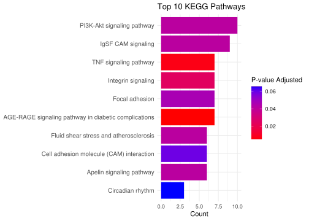
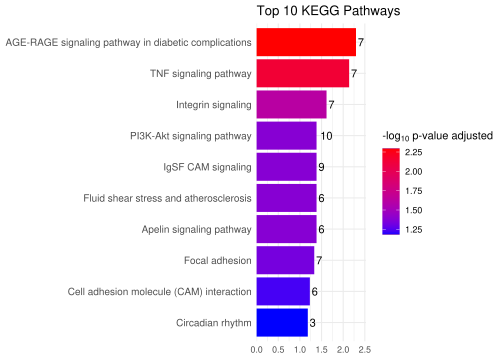
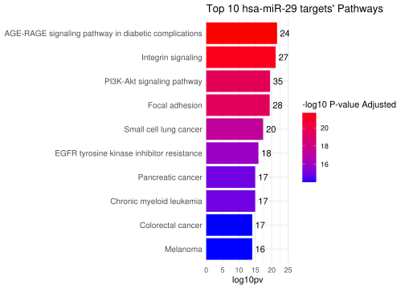

04_miRNA_analysis: KEGG pathway search
================
D. Ryazantsev, E. Sharova
2026-04-21

- [1 Analyze gene presence in KEGG
  pathways](#1-analyze-gene-presence-in-kegg-pathways)
  - [1.0.1 KEGG results](#101-kegg-results)
  - [1.0.2 Plot p-value](#102-plot-p-value)
  - [1.0.3 mir-29 kegg](#103-mir-29-kegg)
- [2 Visualisation with pathview](#2-visualisation-with-pathview)

# 1 Analyze gene presence in KEGG pathways

To assess the potential regulatory role of target genes, we examine
their presence in KEGG pathway maps.

**What we need to find:**

1.  Genes present in many pathways — the most ambiguous ones
2.  Genes with the highest co-occurrence within a single pathway —
    members of the same pathway

`pathview` works with Entrez IDs, so gene names need to be converted.

``` r
final_FECD_MIMAT <- readRDS("/data7a/bio/human_genomics/fuchs_dystrophy/nanostring/analisys/RDS/final_FECD_MIMAT_v3.RDS")

downcorr_genes <- final_FECD_MIMAT$RNA %>% unique()

# from symbol -> entrez_id
entrez_ids_f <- bitr(downcorr_genes, fromType = "SYMBOL", 
                   toType = "ENTREZID", 
                   OrgDb = org.Hs.eg.db)
```

    ## 'select()' returned 1:1 mapping between keys and columns

    ## Warning in bitr(downcorr_genes, fromType = "SYMBOL", toType = "ENTREZID", :
    ## 0.79% of input gene IDs are fail to map...

``` r
# all kegg cards
all_cards <- getGeneKEGGLinks(species.KEGG = "hsa", convert = FALSE)
```

ENTREZID enrichment into big list.

``` r
kegg_results_f <- enrichKEGG(gene = entrez_ids_f$ENTREZID, organism = "hsa", pvalueCutoff = 0.05)
```

    ## Reading KEGG annotation online: "https://rest.kegg.jp/link/hsa/pathway"...

    ## Reading KEGG annotation online: "https://rest.kegg.jp/list/pathway/hsa"...

``` r
kegg_results_f
```

    ## #
    ## # over-representation test
    ## #
    ## #...@organism     hsa 
    ## #...@ontology     KEGG 
    ## #...@keytype      kegg 
    ## #...@gene     chr [1:126] "133" "26289" "57538" "651746" "367" "467" "23250" "79895" ...
    ## #...pvalues adjusted by 'BH' with cutoff <0.05 
    ## #...8 enriched terms found
    ## 'data.frame':    8 obs. of  11 variables:
    ##  $ category   : chr  "Human Diseases" "Environmental Information Processing" NA NA ...
    ##  $ subcategory: chr  "Endocrine and metabolic disease" "Signal transduction" NA NA ...
    ##  $ ID         : chr  "hsa04933" "hsa04668" "hsa04518" "hsa04517" ...
    ##  $ Description: chr  "AGE-RAGE signaling pathway in diabetic complications" "TNF signaling pathway" "Integrin signaling" "IgSF CAM signaling" ...
    ##  $ GeneRatio  : chr  "7/80" "7/80" "7/80" "9/80" ...
    ##  $ BgRatio    : chr  "101/9376" "119/9376" "154/9376" "299/9376" ...
    ##  $ pvalue     : num  2.28e-05 6.56e-05 3.28e-04 9.61e-04 9.62e-04 ...
    ##  $ p.adjust   : num  0.00506 0.00729 0.02424 0.04125 0.04125 ...
    ##  $ qvalue     : num  0.00437 0.00629 0.02092 0.03559 0.03559 ...
    ##  $ geneID     : chr  "595/1284/1906/5292/23236/7412/7422" "1906/3726/1326/9021/7128/7133/7412" "595/1284/2200/3696/6696/7412/7422" "940/8832/23136/3556/79784/4916/5063/57522/10451" ...
    ##  $ Count      : int  7 7 7 9 10 6 6 7
    ## #...Citation
    ##  T Wu, E Hu, S Xu, M Chen, P Guo, Z Dai, T Feng, L Zhou, W Tang, L Zhan, X Fu, S Liu, X Bo, and G Yu.
    ##  clusterProfiler 4.0: A universal enrichment tool for interpreting omics data.
    ##  The Innovation. 2021, 2(3):100141

### 1.0.1 KEGG results

``` r
# kegg_results@result[["Description"]]
kegg_fecd_all <- kegg_results_f@result

# get signiff
kegg_fecd <- kegg_fecd_all %>% dplyr::filter(p.adjust <= 0.05)

saveRDS(kegg_fecd, file="/data7a/bio/human_genomics/fuchs_dystrophy/nanostring/analisys/RDS/kegg_fecd_result.RDS")
#DT::datatable(kegg_fecd, filter = 'top', caption = "All cards")
kegg_fecd
```

    ##                                      category                     subcategory
    ## hsa04933                       Human Diseases Endocrine and metabolic disease
    ## hsa04668 Environmental Information Processing             Signal transduction
    ## hsa04518                                 <NA>                            <NA>
    ## hsa04517                                 <NA>                            <NA>
    ## hsa04151 Environmental Information Processing             Signal transduction
    ## hsa04371 Environmental Information Processing             Signal transduction
    ## hsa05418                       Human Diseases          Cardiovascular disease
    ## hsa04510                   Cellular Processes Cellular community - eukaryotes
    ##                ID                                          Description
    ## hsa04933 hsa04933 AGE-RAGE signaling pathway in diabetic complications
    ## hsa04668 hsa04668                                TNF signaling pathway
    ## hsa04518 hsa04518                                   Integrin signaling
    ## hsa04517 hsa04517                                   IgSF CAM signaling
    ## hsa04151 hsa04151                           PI3K-Akt signaling pathway
    ## hsa04371 hsa04371                             Apelin signaling pathway
    ## hsa05418 hsa05418               Fluid shear stress and atherosclerosis
    ## hsa04510 hsa04510                                       Focal adhesion
    ##          GeneRatio  BgRatio       pvalue    p.adjust      qvalue
    ## hsa04933      7/80 101/9376 2.279054e-05 0.005059499 0.004366187
    ## hsa04668      7/80 119/9376 6.564598e-05 0.007286704 0.006288194
    ## hsa04518      7/80 154/9376 3.276321e-04 0.024244774 0.020922470
    ## hsa04517      9/80 299/9376 9.609728e-04 0.041245641 0.035593678
    ## hsa04151     10/80 362/9376 9.617402e-04 0.041245641 0.035593678
    ## hsa04371      6/80 140/9376 1.208749e-03 0.041245641 0.035593678
    ## hsa05418      6/80 142/9376 1.300538e-03 0.041245641 0.035593678
    ## hsa04510      7/80 203/9376 1.678958e-03 0.046591088 0.040206628
    ##                                                       geneID Count
    ## hsa04933                  595/1284/1906/5292/23236/7412/7422     7
    ## hsa04668                  1906/3726/1326/9021/7128/7133/7412     7
    ## hsa04518                   595/1284/2200/3696/6696/7412/7422     7
    ## hsa04517     940/8832/23136/3556/79784/4916/5063/57522/10451     9
    ## hsa04151 627/595/1284/54541/59345/3696/118788/6696/6850/7422    10
    ## hsa04371                      595/59345/4208/5327/23236/6696     6
    ## hsa05418                        652/1906/4208/5327/7412/7422     6
    ## hsa04510                  595/1284/3696/5063/6696/10451/7422     7

### 1.0.2 Plot p-value

We will build a horizontal barplot with adjusted p-values and pathway
names to visualize the identified KEGG maps. We will also include the
number of gene occurrences (n).

``` r
for_plot <- kegg_fecd_all %>% arrange(p.adjust) %>% slice_head(n=10) %>% dplyr::select(Description, pvalue, p.adjust, Count) %>% mutate(log10pv = -log10(p.adjust)) %>% 
    arrange(Count)


ggplot(for_plot, aes(x=reorder(Description, Count), y=Count, fill=p.adjust)) + geom_col(show.legend =T)  + coord_flip() +  
 # geom_label(aes(label = Count, hjust = 3, colour = "green")) + 
  labs(title = "Top 10 KEGG Pathways") +
  theme_minimal() +
  theme(axis.text.y = element_text(size = 10), legend.position = "right",
            axis.title.y = element_blank()) + 
  scale_fill_gradientn(colours = c("#ff0000", "#0000ff"),  
    name = "P-value Adjusted" ) 
```

<!-- -->

``` r
#only pval
ggplot(for_plot, aes(x=reorder(Description, log10pv), y=log10pv, fill=log10pv)) + geom_col(show.legend =T)  + coord_flip() +  
  labs(title = "Top 10 KEGG Pathways") +
    geom_text(aes(label = Count), hjust = -0.3) +
  theme_minimal() +
  theme(axis.text.y = element_text(size = 10), legend.position = "right",
            axis.title.y = element_blank(), axis.title.x = element_blank()) + 
  scale_fill_gradientn(colours = c( "#0000ff", "#ff0000"),  
    name = expression(paste("-", log[10], " p-value adjusted")) ) +
    scale_y_continuous(expand = expansion(mult = c(0, 0.1)))
```

<!-- -->

``` r
#ggsave("./plots/kegg_top10.png",dpi=500)
```

### 1.0.3 mir-29 kegg

Same plot for mir-29 targets.

``` r
mir29_all <- readRDS("/data7a/bio/human_genomics/fuchs_dystrophy/nanostring/analisys/RDS/mir29_targets.RDS")
mir29 <- mir29_all$gene %>% unique()
# from symbol -> entrez_id
mir29 <- bitr(mir29, fromType = "SYMBOL", toType = "ENTREZID", OrgDb = org.Hs.eg.db)
```

    ## 'select()' returned 1:1 mapping between keys and columns

``` r
mir29_kegg <- enrichKEGG(gene = mir29$ENTREZID, organism = "hsa", pvalueCutoff = 0.05)@result

mir29_kegg_sign <- mir29_kegg %>% dplyr::filter(p.adjust <= 0.05)

#DT::datatable(mir29_kegg_sign, filter = 'top', caption = "All cards")
mir29_kegg_sign
```

    ##                                      category
    ## hsa04933                       Human Diseases
    ## hsa04518                                 <NA>
    ## hsa04151 Environmental Information Processing
    ## hsa04510                   Cellular Processes
    ## hsa05222                       Human Diseases
    ## hsa01521                       Human Diseases
    ## hsa05212                       Human Diseases
    ## hsa05220                       Human Diseases
    ## hsa05210                       Human Diseases
    ## hsa05218                       Human Diseases
    ## hsa05165                       Human Diseases
    ## hsa05215                       Human Diseases
    ## hsa05206                       Human Diseases
    ## hsa04068 Environmental Information Processing
    ## hsa05214                       Human Diseases
    ## hsa01522                       Human Diseases
    ## hsa05205                       Human Diseases
    ## hsa04218                   Cellular Processes
    ## hsa05162                       Human Diseases
    ## hsa05166                       Human Diseases
    ## hsa04115                   Cellular Processes
    ## hsa05161                       Human Diseases
    ## hsa05146                       Human Diseases
    ## hsa05167                       Human Diseases
    ## hsa05224                       Human Diseases
    ## hsa05169                       Human Diseases
    ## hsa05415                       Human Diseases
    ## hsa05145                       Human Diseases
    ## hsa05225                       Human Diseases
    ## hsa05226                       Human Diseases
    ## hsa04926                   Organismal Systems
    ## hsa05160                       Human Diseases
    ## hsa05211                       Human Diseases
    ## hsa04110                   Cellular Processes
    ## hsa05223                       Human Diseases
    ## hsa05213                       Human Diseases
    ## hsa05163                       Human Diseases
    ## hsa05203                       Human Diseases
    ## hsa04010 Environmental Information Processing
    ## hsa04015 Environmental Information Processing
    ## hsa04917                   Organismal Systems
    ## hsa04810                   Cellular Processes
    ## hsa04722                   Organismal Systems
    ## hsa05231                       Human Diseases
    ## hsa04974                   Organismal Systems
    ## hsa04630 Environmental Information Processing
    ## hsa05418                       Human Diseases
    ## hsa04550                   Cellular Processes
    ## hsa04014 Environmental Information Processing
    ## hsa04919                   Organismal Systems
    ## hsa01524                       Human Diseases
    ## hsa04611                   Organismal Systems
    ## hsa05417                       Human Diseases
    ## hsa04210                   Cellular Processes
    ## hsa04066 Environmental Information Processing
    ## hsa04512 Environmental Information Processing
    ## hsa05164                       Human Diseases
    ## hsa04935                   Organismal Systems
    ## hsa04932                       Human Diseases
    ## hsa04820                                 <NA>
    ## hsa04915                   Organismal Systems
    ## hsa04370 Environmental Information Processing
    ## hsa05219                       Human Diseases
    ## hsa04213                   Organismal Systems
    ## hsa04211                   Organismal Systems
    ## hsa05235                       Human Diseases
    ## hsa05131                       Human Diseases
    ## hsa04072 Environmental Information Processing
    ## hsa05207                       Human Diseases
    ## hsa04668 Environmental Information Processing
    ## hsa05221                       Human Diseases
    ## hsa04152 Environmental Information Processing
    ## hsa04660                   Organismal Systems
    ## hsa04390 Environmental Information Processing
    ## hsa05230                       Human Diseases
    ## hsa04062                   Organismal Systems
    ## hsa05410                       Human Diseases
    ## hsa05142                       Human Diseases
    ## hsa04215                   Cellular Processes
    ## hsa05414                       Human Diseases
    ## hsa05135                       Human Diseases
    ## hsa04350 Environmental Information Processing
    ## hsa04914                   Organismal Systems
    ## hsa04725                   Organismal Systems
    ## hsa04012 Environmental Information Processing
    ## hsa04670                   Organismal Systems
    ## hsa05170                       Human Diseases
    ## hsa04517                                 <NA>
    ## hsa04371 Environmental Information Processing
    ## hsa04310 Environmental Information Processing
    ## hsa05168                       Human Diseases
    ## hsa04931                       Human Diseases
    ## hsa05152                       Human Diseases
    ## hsa04360                   Organismal Systems
    ## hsa05208                       Human Diseases
    ## hsa04934                       Human Diseases
    ## hsa04150 Environmental Information Processing
    ## hsa04540                   Cellular Processes
    ## hsa05202                       Human Diseases
    ## hsa04662                   Organismal Systems
    ## hsa04071 Environmental Information Processing
    ## hsa05132                       Human Diseases
    ## hsa05010                       Human Diseases
    ## hsa04657                   Organismal Systems
    ## hsa05323                       Human Diseases
    ## hsa04929                   Organismal Systems
    ## hsa05321                       Human Diseases
    ## hsa04666                   Organismal Systems
    ## hsa05416                       Human Diseases
    ## hsa04380                   Organismal Systems
    ## hsa04936                       Human Diseases
    ## hsa04659                   Organismal Systems
    ## hsa05100                       Human Diseases
    ## hsa05140                       Human Diseases
    ## hsa04973                   Organismal Systems
    ## hsa04613                   Organismal Systems
    ## hsa05144                       Human Diseases
    ## hsa05130                       Human Diseases
    ## hsa05412                       Human Diseases
    ## hsa04020 Environmental Information Processing
    ## hsa04217                   Cellular Processes
    ## hsa04340 Environmental Information Processing
    ## hsa04140                   Cellular Processes
    ## hsa04923                   Organismal Systems
    ## hsa05020                       Human Diseases
    ## hsa04910                   Organismal Systems
    ## hsa05017                       Human Diseases
    ## hsa04625                   Organismal Systems
    ## hsa04664                   Organismal Systems
    ## hsa04960                   Organismal Systems
    ## hsa04620                   Organismal Systems
    ## hsa04148                   Cellular Processes
    ## hsa04928                   Organismal Systems
    ## hsa04022 Environmental Information Processing
    ## hsa04530                   Cellular Processes
    ## hsa04930                       Human Diseases
    ## hsa04024 Environmental Information Processing
    ## hsa04728                   Organismal Systems
    ## hsa04520                   Cellular Processes
    ## hsa04114                   Cellular Processes
    ##                                  subcategory       ID
    ## hsa04933     Endocrine and metabolic disease hsa04933
    ## hsa04518                                <NA> hsa04518
    ## hsa04151                 Signal transduction hsa04151
    ## hsa04510     Cellular community - eukaryotes hsa04510
    ## hsa05222              Cancer: specific types hsa05222
    ## hsa01521     Drug resistance: antineoplastic hsa01521
    ## hsa05212              Cancer: specific types hsa05212
    ## hsa05220              Cancer: specific types hsa05220
    ## hsa05210              Cancer: specific types hsa05210
    ## hsa05218              Cancer: specific types hsa05218
    ## hsa05165           Infectious disease: viral hsa05165
    ## hsa05215              Cancer: specific types hsa05215
    ## hsa05206                    Cancer: overview hsa05206
    ## hsa04068                 Signal transduction hsa04068
    ## hsa05214              Cancer: specific types hsa05214
    ## hsa01522     Drug resistance: antineoplastic hsa01522
    ## hsa05205                    Cancer: overview hsa05205
    ## hsa04218               Cell growth and death hsa04218
    ## hsa05162           Infectious disease: viral hsa05162
    ## hsa05166           Infectious disease: viral hsa05166
    ## hsa04115               Cell growth and death hsa04115
    ## hsa05161           Infectious disease: viral hsa05161
    ## hsa05146       Infectious disease: parasitic hsa05146
    ## hsa05167           Infectious disease: viral hsa05167
    ## hsa05224              Cancer: specific types hsa05224
    ## hsa05169           Infectious disease: viral hsa05169
    ## hsa05415              Cardiovascular disease hsa05415
    ## hsa05145       Infectious disease: parasitic hsa05145
    ## hsa05225              Cancer: specific types hsa05225
    ## hsa05226              Cancer: specific types hsa05226
    ## hsa04926                    Endocrine system hsa04926
    ## hsa05160           Infectious disease: viral hsa05160
    ## hsa05211              Cancer: specific types hsa05211
    ## hsa04110               Cell growth and death hsa04110
    ## hsa05223              Cancer: specific types hsa05223
    ## hsa05213              Cancer: specific types hsa05213
    ## hsa05163           Infectious disease: viral hsa05163
    ## hsa05203                    Cancer: overview hsa05203
    ## hsa04010                 Signal transduction hsa04010
    ## hsa04015                 Signal transduction hsa04015
    ## hsa04917                    Endocrine system hsa04917
    ## hsa04810                       Cell motility hsa04810
    ## hsa04722                      Nervous system hsa04722
    ## hsa05231                    Cancer: overview hsa05231
    ## hsa04974                    Digestive system hsa04974
    ## hsa04630                 Signal transduction hsa04630
    ## hsa05418              Cardiovascular disease hsa05418
    ## hsa04550     Cellular community - eukaryotes hsa04550
    ## hsa04014                 Signal transduction hsa04014
    ## hsa04919                    Endocrine system hsa04919
    ## hsa01524     Drug resistance: antineoplastic hsa01524
    ## hsa04611                       Immune system hsa04611
    ## hsa05417              Cardiovascular disease hsa05417
    ## hsa04210               Cell growth and death hsa04210
    ## hsa04066                 Signal transduction hsa04066
    ## hsa04512 Signaling molecules and interaction hsa04512
    ## hsa05164           Infectious disease: viral hsa05164
    ## hsa04935                    Endocrine system hsa04935
    ## hsa04932     Endocrine and metabolic disease hsa04932
    ## hsa04820                                <NA> hsa04820
    ## hsa04915                    Endocrine system hsa04915
    ## hsa04370                 Signal transduction hsa04370
    ## hsa05219              Cancer: specific types hsa05219
    ## hsa04213                               Aging hsa04213
    ## hsa04211                               Aging hsa04211
    ## hsa05235                    Cancer: overview hsa05235
    ## hsa05131       Infectious disease: bacterial hsa05131
    ## hsa04072                 Signal transduction hsa04072
    ## hsa05207                    Cancer: overview hsa05207
    ## hsa04668                 Signal transduction hsa04668
    ## hsa05221              Cancer: specific types hsa05221
    ## hsa04152                 Signal transduction hsa04152
    ## hsa04660                       Immune system hsa04660
    ## hsa04390                 Signal transduction hsa04390
    ## hsa05230                    Cancer: overview hsa05230
    ## hsa04062                       Immune system hsa04062
    ## hsa05410              Cardiovascular disease hsa05410
    ## hsa05142       Infectious disease: parasitic hsa05142
    ## hsa04215               Cell growth and death hsa04215
    ## hsa05414              Cardiovascular disease hsa05414
    ## hsa05135       Infectious disease: bacterial hsa05135
    ## hsa04350                 Signal transduction hsa04350
    ## hsa04914                    Endocrine system hsa04914
    ## hsa04725                      Nervous system hsa04725
    ## hsa04012                 Signal transduction hsa04012
    ## hsa04670                       Immune system hsa04670
    ## hsa05170           Infectious disease: viral hsa05170
    ## hsa04517                                <NA> hsa04517
    ## hsa04371                 Signal transduction hsa04371
    ## hsa04310                 Signal transduction hsa04310
    ## hsa05168           Infectious disease: viral hsa05168
    ## hsa04931     Endocrine and metabolic disease hsa04931
    ## hsa05152       Infectious disease: bacterial hsa05152
    ## hsa04360        Development and regeneration hsa04360
    ## hsa05208                    Cancer: overview hsa05208
    ## hsa04934     Endocrine and metabolic disease hsa04934
    ## hsa04150                 Signal transduction hsa04150
    ## hsa04540     Cellular community - eukaryotes hsa04540
    ## hsa05202                    Cancer: overview hsa05202
    ## hsa04662                       Immune system hsa04662
    ## hsa04071                 Signal transduction hsa04071
    ## hsa05132       Infectious disease: bacterial hsa05132
    ## hsa05010           Neurodegenerative disease hsa05010
    ## hsa04657                       Immune system hsa04657
    ## hsa05323                      Immune disease hsa05323
    ## hsa04929                    Endocrine system hsa04929
    ## hsa05321                      Immune disease hsa05321
    ## hsa04666                       Immune system hsa04666
    ## hsa05416              Cardiovascular disease hsa05416
    ## hsa04380        Development and regeneration hsa04380
    ## hsa04936     Endocrine and metabolic disease hsa04936
    ## hsa04659                       Immune system hsa04659
    ## hsa05100       Infectious disease: bacterial hsa05100
    ## hsa05140       Infectious disease: parasitic hsa05140
    ## hsa04973                    Digestive system hsa04973
    ## hsa04613                       Immune system hsa04613
    ## hsa05144       Infectious disease: parasitic hsa05144
    ## hsa05130       Infectious disease: bacterial hsa05130
    ## hsa05412              Cardiovascular disease hsa05412
    ## hsa04020                 Signal transduction hsa04020
    ## hsa04217               Cell growth and death hsa04217
    ## hsa04340                 Signal transduction hsa04340
    ## hsa04140            Transport and catabolism hsa04140
    ## hsa04923                    Endocrine system hsa04923
    ## hsa05020           Neurodegenerative disease hsa05020
    ## hsa04910                    Endocrine system hsa04910
    ## hsa05017           Neurodegenerative disease hsa05017
    ## hsa04625                       Immune system hsa04625
    ## hsa04664                       Immune system hsa04664
    ## hsa04960                    Excretory system hsa04960
    ## hsa04620                       Immune system hsa04620
    ## hsa04148            Transport and catabolism hsa04148
    ## hsa04928                    Endocrine system hsa04928
    ## hsa04022                 Signal transduction hsa04022
    ## hsa04530     Cellular community - eukaryotes hsa04530
    ## hsa04930     Endocrine and metabolic disease hsa04930
    ## hsa04024                 Signal transduction hsa04024
    ## hsa04728                      Nervous system hsa04728
    ## hsa04520     Cellular community - eukaryotes hsa04520
    ## hsa04114               Cell growth and death hsa04114
    ##                                                       Description GeneRatio
    ## hsa04933     AGE-RAGE signaling pathway in diabetic complications    24/118
    ## hsa04518                                       Integrin signaling    27/118
    ## hsa04151                               PI3K-Akt signaling pathway    35/118
    ## hsa04510                                           Focal adhesion    28/118
    ## hsa05222                                   Small cell lung cancer    20/118
    ## hsa01521                EGFR tyrosine kinase inhibitor resistance    18/118
    ## hsa05212                                        Pancreatic cancer    17/118
    ## hsa05220                                 Chronic myeloid leukemia    17/118
    ## hsa05210                                        Colorectal cancer    17/118
    ## hsa05218                                                 Melanoma    16/118
    ## hsa05165                           Human papillomavirus infection    28/118
    ## hsa05215                                          Prostate cancer    18/118
    ## hsa05206                                      MicroRNAs in cancer    27/118
    ## hsa04068                                   FoxO signaling pathway    19/118
    ## hsa05214                                                   Glioma    15/118
    ## hsa01522                                     Endocrine resistance    16/118
    ## hsa05205                                  Proteoglycans in cancer    20/118
    ## hsa04218                                      Cellular senescence    18/118
    ## hsa05162                                                  Measles    17/118
    ## hsa05166                  Human T-cell leukemia virus 1 infection    20/118
    ## hsa04115                                    p53 signaling pathway    13/118
    ## hsa05161                                              Hepatitis B    17/118
    ## hsa05146                                               Amoebiasis    14/118
    ## hsa05167          Kaposi sarcoma-associated herpesvirus infection    18/118
    ## hsa05224                                            Breast cancer    16/118
    ## hsa05169                             Epstein-Barr virus infection    18/118
    ## hsa05415                                  Diabetic cardiomyopathy    18/118
    ## hsa05145                                            Toxoplasmosis    14/118
    ## hsa05225                                 Hepatocellular carcinoma    16/118
    ## hsa05226                                           Gastric cancer    15/118
    ## hsa04926                                Relaxin signaling pathway    14/118
    ## hsa05160                                              Hepatitis C    15/118
    ## hsa05211                                     Renal cell carcinoma    11/118
    ## hsa04110                                               Cell cycle    15/118
    ## hsa05223                               Non-small cell lung cancer    11/118
    ## hsa05213                                       Endometrial cancer    10/118
    ## hsa05163                          Human cytomegalovirus infection    17/118
    ## hsa05203                                     Viral carcinogenesis    16/118
    ## hsa04010                                   MAPK signaling pathway    19/118
    ## hsa04015                                   Rap1 signaling pathway    16/118
    ## hsa04917                              Prolactin signaling pathway    10/118
    ## hsa04810                         Regulation of actin cytoskeleton    16/118
    ## hsa04722                           Neurotrophin signaling pathway    12/118
    ## hsa05231                             Choline metabolism in cancer    11/118
    ## hsa04974                         Protein digestion and absorption    11/118
    ## hsa04630                               JAK-STAT signaling pathway    13/118
    ## hsa05418                   Fluid shear stress and atherosclerosis    12/118
    ## hsa04550 Signaling pathways regulating pluripotency of stem cells    12/118
    ## hsa04014                                    Ras signaling pathway    15/118
    ## hsa04919                        Thyroid hormone signaling pathway    11/118
    ## hsa01524                                 Platinum drug resistance     9/118
    ## hsa04611                                      Platelet activation    11/118
    ## hsa05417                                Lipid and atherosclerosis    14/118
    ## hsa04210                                                Apoptosis    11/118
    ## hsa04066                                  HIF-1 signaling pathway    10/118
    ## hsa04512                                 ECM-receptor interaction     9/118
    ## hsa05164                                              Influenza A    12/118
    ## hsa04935           Growth hormone synthesis, secretion and action    10/118
    ## hsa04932                        Non-alcoholic fatty liver disease    11/118
    ## hsa04820                             Cytoskeleton in muscle cells    13/118
    ## hsa04915                               Estrogen signaling pathway    10/118
    ## hsa04370                                   VEGF signaling pathway     7/118
    ## hsa05219                                           Bladder cancer     6/118
    ## hsa04213          Longevity regulating pathway - multiple species     7/118
    ## hsa04211                             Longevity regulating pathway     8/118
    ## hsa05235   PD-L1 expression and PD-1 checkpoint pathway in cancer     8/118
    ## hsa05131                                              Shigellosis    13/118
    ## hsa04072                        Phospholipase D signaling pathway    10/118
    ## hsa05207            Chemical carcinogenesis - receptor activation    12/118
    ## hsa04668                                    TNF signaling pathway     9/118
    ## hsa05221                                   Acute myeloid leukemia     7/118
    ## hsa04152                                   AMPK signaling pathway     9/118
    ## hsa04660                        T cell receptor signaling pathway     9/118
    ## hsa04390                                  Hippo signaling pathway    10/118
    ## hsa05230                      Central carbon metabolism in cancer     7/118
    ## hsa04062                              Chemokine signaling pathway    11/118
    ## hsa05410                              Hypertrophic cardiomyopathy     8/118
    ## hsa05142                                           Chagas disease     8/118
    ## hsa04215                             Apoptosis - multiple species     5/118
    ## hsa05414                                   Dilated cardiomyopathy     8/118
    ## hsa05135                                       Yersinia infection     9/118
    ## hsa04350                               TGF-beta signaling pathway     8/118
    ## hsa04914                  Progesterone-mediated oocyte maturation     8/118
    ## hsa04725                                      Cholinergic synapse     8/118
    ## hsa04012                                   ErbB signaling pathway     7/118
    ## hsa04670                     Leukocyte transendothelial migration     8/118
    ## hsa05170                 Human immunodeficiency virus 1 infection    10/118
    ## hsa04517                                       IgSF CAM signaling    12/118
    ## hsa04371                                 Apelin signaling pathway     8/118
    ## hsa04310                                    Wnt signaling pathway     9/118
    ## hsa05168                         Herpes simplex virus 1 infection     9/118
    ## hsa04931                                       Insulin resistance     7/118
    ## hsa05152                                             Tuberculosis     9/118
    ## hsa04360                                            Axon guidance     9/118
    ## hsa05208        Chemical carcinogenesis - reactive oxygen species    10/118
    ## hsa04934                                         Cushing syndrome     8/118
    ## hsa04150                                   mTOR signaling pathway     8/118
    ## hsa04540                                             Gap junction     6/118
    ## hsa05202                  Transcriptional misregulation in cancer     9/118
    ## hsa04662                        B cell receptor signaling pathway     6/118
    ## hsa04071                           Sphingolipid signaling pathway     7/118
    ## hsa05132                                     Salmonella infection    10/118
    ## hsa05010                                        Alzheimer disease    13/118
    ## hsa04657                                  IL-17 signaling pathway     6/118
    ## hsa05323                                     Rheumatoid arthritis     6/118
    ## hsa04929                                           GnRH secretion     5/118
    ## hsa05321                               Inflammatory bowel disease     5/118
    ## hsa04666                         Fc gamma R-mediated phagocytosis     6/118
    ## hsa05416                                        Viral myocarditis     5/118
    ## hsa04380                               Osteoclast differentiation     7/118
    ## hsa04936                                  Alcoholic liver disease     7/118
    ## hsa04659                                Th17 cell differentiation     6/118
    ## hsa05100                   Bacterial invasion of epithelial cells     5/118
    ## hsa05140                                            Leishmaniasis     5/118
    ## hsa04973                    Carbohydrate digestion and absorption     4/118
    ## hsa04613                  Neutrophil extracellular trap formation     8/118
    ## hsa05144                                                  Malaria     4/118
    ## hsa05130                    Pathogenic Escherichia coli infection     8/118
    ## hsa05412          Arrhythmogenic right ventricular cardiomyopathy     5/118
    ## hsa04020                                Calcium signaling pathway     9/118
    ## hsa04217                                              Necroptosis     7/118
    ## hsa04340                               Hedgehog signaling pathway     4/118
    ## hsa04140                                       Autophagy - animal     7/118
    ## hsa04923                    Regulation of lipolysis in adipocytes     4/118
    ## hsa05020                                            Prion disease     9/118
    ## hsa04910                                Insulin signaling pathway     6/118
    ## hsa05017                                   Spinocerebellar ataxia     6/118
    ## hsa04625                 C-type lectin receptor signaling pathway     5/118
    ## hsa04664                          Fc epsilon RI signaling pathway     4/118
    ## hsa04960                Aldosterone-regulated sodium reabsorption     3/118
    ## hsa04620                     Toll-like receptor signaling pathway     5/118
    ## hsa04148                                            Efferocytosis     6/118
    ## hsa04928      Parathyroid hormone synthesis, secretion and action     5/118
    ## hsa04022                               cGMP-PKG signaling pathway     6/118
    ## hsa04530                                           Tight junction     6/118
    ## hsa04930                                Type II diabetes mellitus     3/118
    ## hsa04024                                   cAMP signaling pathway     7/118
    ## hsa04728                                     Dopaminergic synapse     5/118
    ## hsa04520                                        Adherens junction     4/118
    ## hsa04114                                           Oocyte meiosis     5/118
    ##           BgRatio       pvalue     p.adjust       qvalue
    ## hsa04933 101/9376 1.030484e-24 2.308284e-22 8.677758e-23
    ## hsa04518 154/9376 5.785425e-24 6.479676e-22 2.435969e-22
    ## hsa04151 362/9376 4.288787e-22 3.202295e-20 1.203870e-20
    ## hsa04510 203/9376 7.278991e-22 4.076235e-20 1.532419e-20
    ## hsa05222  93/9376 9.392812e-20 4.207980e-18 1.581947e-18
    ## hsa01521  80/9376 3.071402e-18 1.146657e-16 4.310740e-17
    ## hsa05212  77/9376 3.995080e-17 1.118622e-15 4.205347e-16
    ## hsa05220  77/9376 3.995080e-17 1.118622e-15 4.205347e-16
    ## hsa05210  87/9376 3.635059e-16 9.047257e-15 3.401224e-15
    ## hsa05218  73/9376 4.048636e-16 9.068945e-15 3.409378e-15
    ## hsa05165 333/9376 4.811572e-16 9.798111e-15 3.683500e-15
    ## hsa05215 106/9376 6.397009e-16 1.194108e-14 4.489129e-15
    ## hsa05206 323/9376 2.036136e-15 3.508419e-14 1.318955e-14
    ## hsa04068 133/9376 2.629092e-15 4.206548e-14 1.581409e-14
    ## hsa05214  76/9376 1.895597e-14 2.830758e-13 1.064195e-13
    ## hsa01522  99/9376 6.632944e-14 9.286121e-13 3.491023e-13
    ## hsa05205 204/9376 7.018850e-13 9.248367e-12 3.476830e-12
    ## hsa04218 157/9376 7.483146e-13 9.312359e-12 3.500887e-12
    ## hsa05162 136/9376 8.181760e-13 9.645865e-12 3.626265e-12
    ## hsa05166 224/9376 4.061633e-12 4.549029e-11 1.710161e-11
    ## hsa04115  75/9376 6.672036e-12 7.116838e-11 2.675503e-11
    ## hsa05161 163/9376 1.608580e-11 1.637827e-10 6.157246e-11
    ## hsa05146 103/9376 3.074258e-11 2.994060e-10 1.125586e-10
    ## hsa05167 196/9376 3.345998e-11 3.122932e-10 1.174035e-10
    ## hsa05224 148/9376 3.854947e-11 3.454032e-10 1.298508e-10
    ## hsa05169 205/9376 7.095964e-11 5.887022e-10 2.213166e-10
    ## hsa05415 205/9376 7.095964e-11 5.887022e-10 2.213166e-10
    ## hsa05145 112/9376 9.768606e-11 7.814885e-10 2.937927e-10
    ## hsa05225 170/9376 3.150815e-10 2.433733e-09 9.149372e-10
    ## hsa05226 150/9376 5.009480e-10 3.740412e-09 1.406170e-09
    ## hsa04926 130/9376 7.360866e-10 5.318819e-09 1.999556e-09
    ## hsa05160 156/9376 8.720732e-10 6.104512e-09 2.294929e-09
    ## hsa05211  70/9376 9.070250e-10 6.156776e-09 2.314577e-09
    ## hsa04110 158/9376 1.043296e-09 6.873476e-09 2.584014e-09
    ## hsa05223  73/9376 1.445192e-09 9.249228e-09 3.477154e-09
    ## hsa05213  59/9376 2.537106e-09 1.578644e-08 5.934751e-09
    ## hsa05163 227/9376 2.965419e-09 1.795280e-08 6.749174e-09
    ## hsa05203 205/9376 4.970420e-09 2.929932e-08 1.101478e-08
    ## hsa04010 300/9376 5.271409e-09 3.027681e-08 1.138226e-08
    ## hsa04015 212/9376 8.069224e-09 4.518766e-08 1.698784e-08
    ## hsa04917  71/9376 1.643023e-08 8.976515e-08 3.374630e-08
    ## hsa04810 232/9376 2.916347e-08 1.555385e-07 5.847313e-08
    ## hsa04722 120/9376 3.017390e-08 1.571849e-07 5.909209e-08
    ## hsa05231  99/9376 3.891735e-08 1.981247e-07 7.448296e-08
    ## hsa04974 103/9376 5.903635e-08 2.938699e-07 1.104774e-07
    ## hsa04630 168/9376 1.679041e-07 8.176201e-07 3.073760e-07
    ## hsa05418 142/9376 1.974877e-07 9.412179e-07 3.538413e-07
    ## hsa04550 144/9376 2.302685e-07 1.074586e-06 4.039798e-07
    ## hsa04014 238/9376 2.664432e-07 1.218026e-06 4.579045e-07
    ## hsa04919 122/9376 3.399271e-07 1.522873e-06 5.725087e-07
    ## hsa01524  75/9376 3.647494e-07 1.602037e-06 6.022695e-07
    ## hsa04611 126/9376 4.718118e-07 2.032420e-06 7.640676e-07
    ## hsa05417 216/9376 4.898430e-07 2.070280e-06 7.783007e-07
    ## hsa04210 137/9376 1.094729e-06 4.505639e-06 1.693849e-06
    ## hsa04066 110/9376 1.106295e-06 4.505639e-06 1.693849e-06
    ## hsa04512  89/9376 1.593284e-06 6.373134e-06 2.395915e-06
    ## hsa05164 173/9376 1.662195e-06 6.532136e-06 2.455690e-06
    ## hsa04935 122/9376 2.864935e-06 1.106458e-05 4.159615e-06
    ## hsa04932 157/9376 4.187645e-06 1.589886e-05 5.977014e-06
    ## hsa04820 233/9376 6.805632e-06 2.540769e-05 9.551764e-06
    ## hsa04915 139/9376 9.257034e-06 3.361856e-05 1.263856e-05
    ## hsa04370  60/9376 9.305138e-06 3.361856e-05 1.263856e-05
    ## hsa05219  41/9376 1.097653e-05 3.902767e-05 1.467206e-05
    ## hsa04213  62/9376 1.160583e-05 4.062041e-05 1.527083e-05
    ## hsa04211  90/9376 1.626681e-05 5.520857e-05 2.075510e-05
    ## hsa05235  90/9376 1.626681e-05 5.520857e-05 2.075510e-05
    ## hsa05131 253/9376 1.652156e-05 5.523625e-05 2.076551e-05
    ## hsa04072 149/9376 1.707288e-05 5.576460e-05 2.096413e-05
    ## hsa05207 217/9376 1.717749e-05 5.576460e-05 2.096413e-05
    ## hsa04668 119/9376 1.768964e-05 5.660686e-05 2.128077e-05
    ## hsa05221  68/9376 2.149755e-05 6.632366e-05 2.493371e-05
    ## hsa04152 122/9376 2.161441e-05 6.632366e-05 2.493371e-05
    ## hsa04660 122/9376 2.161441e-05 6.632366e-05 2.493371e-05
    ## hsa04390 157/9376 2.690403e-05 8.143923e-05 3.061625e-05
    ## hsa05230  71/9376 2.858747e-05 8.538124e-05 3.209821e-05
    ## hsa04062 193/9376 2.970450e-05 8.755012e-05 3.291358e-05
    ## hsa05410  99/9376 3.270244e-05 9.513438e-05 3.576480e-05
    ## hsa05142 103/9376 4.355854e-05 1.250912e-04 4.702676e-05
    ## hsa04215  32/9376 4.450424e-05 1.261892e-04 4.743956e-05
    ## hsa05414 105/9376 5.002453e-05 1.400687e-04 5.265740e-05
    ## hsa05135 138/9376 5.741298e-05 1.587717e-04 5.968860e-05
    ## hsa04350 110/9376 6.976911e-05 1.882925e-04 7.078667e-05
    ## hsa04914 110/9376 6.976911e-05 1.882925e-04 7.078667e-05
    ## hsa04725 115/9376 9.560351e-05 2.549427e-04 9.584312e-05
    ## hsa04012  86/9376 9.888266e-05 2.605849e-04 9.796424e-05
    ## hsa04670 116/9376 1.016194e-04 2.646831e-04 9.950492e-05
    ## hsa05170 214/9376 3.537962e-04 9.109237e-04 3.424525e-04
    ## hsa04517 299/9376 3.688024e-04 9.359454e-04 3.518592e-04
    ## hsa04371 140/9376 3.718712e-04 9.359454e-04 3.518592e-04
    ## hsa04310 178/9376 3.964199e-04 9.866450e-04 3.709192e-04
    ## hsa05168 180/9376 4.302668e-04 1.052604e-03 3.957159e-04
    ## hsa04931 109/9376 4.323196e-04 1.052604e-03 3.957159e-04
    ## hsa05152 181/9376 4.480632e-04 1.079206e-03 4.057165e-04
    ## hsa04360 184/9376 5.051281e-04 1.203710e-03 4.525224e-04
    ## hsa05208 227/9376 5.634953e-04 1.328663e-03 4.994972e-04
    ## hsa04934 155/9376 7.326842e-04 1.709596e-03 6.427054e-04
    ## hsa04150 158/9376 8.308210e-04 1.918597e-03 7.212771e-04
    ## hsa04540  89/9376 8.688114e-04 1.985855e-03 7.465619e-04
    ## hsa05202 201/9376 9.526547e-04 2.155501e-03 8.103389e-04
    ## hsa04662  91/9376 9.765055e-04 2.175575e-03 8.178854e-04
    ## hsa04071 125/9376 9.809513e-04 2.175575e-03 8.178854e-04
    ## hsa05132 248/9376 1.113767e-03 2.445919e-03 9.195184e-04
    ## hsa05010 388/9376 1.150074e-03 2.491946e-03 9.368218e-04
    ## hsa04657  94/9376 1.156975e-03 2.491946e-03 9.368218e-04
    ## hsa05323  95/9376 1.222483e-03 2.607963e-03 9.804372e-04
    ## hsa04929  65/9376 1.312103e-03 2.772747e-03 1.042386e-03
    ## hsa05321  66/9376 1.405576e-03 2.942514e-03 1.106208e-03
    ## hsa04666  98/9376 1.436151e-03 2.978684e-03 1.119806e-03
    ## hsa05416  70/9376 1.829191e-03 3.759071e-03 1.413185e-03
    ## hsa04380 142/9376 2.052736e-03 4.180118e-03 1.571473e-03
    ## hsa04936 144/9376 2.222505e-03 4.485056e-03 1.686111e-03
    ## hsa04659 109/9376 2.471006e-03 4.942012e-03 1.857899e-03
    ## hsa05100  78/9376 2.946643e-03 5.789894e-03 2.176652e-03
    ## hsa05140  78/9376 2.946643e-03 5.789894e-03 2.176652e-03
    ## hsa04973  48/9376 3.027063e-03 5.896193e-03 2.216614e-03
    ## hsa04613 195/9376 3.153043e-03 6.088636e-03 2.288961e-03
    ## hsa05144  50/9376 3.514423e-03 6.728468e-03 2.529499e-03
    ## hsa05130 200/9376 3.679538e-03 6.984885e-03 2.625897e-03
    ## hsa05412  86/9376 4.490009e-03 8.451781e-03 3.177361e-03
    ## hsa04020 254/9376 4.676810e-03 8.730045e-03 3.281972e-03
    ## hsa04217 168/9376 5.221749e-03 9.666708e-03 3.634101e-03
    ## hsa04340  56/9376 5.290754e-03 9.714172e-03 3.651944e-03
    ## hsa04140 169/9376 5.391861e-03 9.819324e-03 3.691475e-03
    ## hsa04923  59/9376 6.369948e-03 1.150700e-02 4.325941e-03
    ## hsa05020 275/9376 7.767201e-03 1.390182e-02 5.226247e-03
    ## hsa04910 138/9376 7.819772e-03 1.390182e-02 5.226247e-03
    ## hsa05017 144/9376 9.546807e-03 1.683846e-02 6.330249e-03
    ## hsa04625 105/9376 1.031704e-02 1.805482e-02 6.787524e-03
    ## hsa04664  69/9376 1.099499e-02 1.909207e-02 7.177470e-03
    ## hsa04960  38/9376 1.190010e-02 2.050478e-02 7.708564e-03
    ## hsa04620 109/9376 1.200003e-02 2.051913e-02 7.713958e-03
    ## hsa04148 157/9376 1.419536e-02 2.408910e-02 9.056054e-03
    ## hsa04928 115/9376 1.486043e-02 2.502809e-02 9.409057e-03
    ## hsa04022 166/9376 1.821745e-02 3.045305e-02 1.144852e-02
    ## hsa04530 170/9376 2.023367e-02 3.357290e-02 1.262139e-02
    ## hsa04930  47/9376 2.108602e-02 3.472991e-02 1.305636e-02
    ## hsa04024 226/9376 2.381081e-02 3.893154e-02 1.463592e-02
    ## hsa04728 133/9376 2.608451e-02 4.234007e-02 1.591732e-02
    ## hsa04520  93/9376 2.955842e-02 4.763371e-02 1.790741e-02
    ## hsa04114 138/9376 2.995793e-02 4.793268e-02 1.801981e-02
    ##                                                                                                                                                                                 geneID
    ## hsa04933                                                            208/10000/581/596/836/595/998/1019/1277/1278/1281/1282/1284/3383/4313/5290/5295/4088/4089/6774/7040/7042/7043/7422
    ## hsa04518                                         208/10000/595/894/998/1277/1278/1282/1284/2200/2932/3383/3479/22801/3655/3688/3915/3918/5154/5155/56034/5156/5159/5290/5295/7040/7422
    ## hsa04151 208/10000/596/10018/842/595/894/1017/1019/1021/1277/1278/1282/1284/2309/2932/3479/22801/3655/3688/3915/3918/4170/4193/5154/5155/56034/5156/5159/5290/5294/5295/5728/7422/7531
    ## hsa04510                                     208/10000/596/595/894/998/1277/1278/1282/1284/1399/2932/3479/22801/3655/3688/3915/3918/4638/5154/5155/56034/5156/5159/5290/5295/5728/7422
    ## hsa05222                                                                                208/10000/581/596/836/842/595/1017/1019/1021/1282/1284/3655/3688/3915/3918/5290/5295/5728/9618
    ## hsa01521                                                                                     208/10000/581/596/10018/2309/2932/3479/5154/5155/56034/5156/5159/5290/5295/5728/6774/7422
    ## hsa05212                                                                                              208/10000/581/842/595/998/1019/1021/5290/5295/4088/4089/6774/7040/7042/7043/7422
    ## hsa05220                                                                                               25/208/10000/581/595/1019/1021/1399/4193/5290/5295/861/4088/4089/7040/7042/7043
    ## hsa05210                                                                                              208/10000/581/596/10018/836/842/595/2353/2932/5290/5295/4088/4089/7040/7042/7043
    ## hsa05218                                                                                                208/10000/581/595/1019/1021/3479/4193/5154/5155/56034/5156/5159/5290/5295/5728
    ## hsa05165                                      208/10000/581/836/595/894/998/1017/1019/1021/1277/1278/1282/1284/2932/22801/3655/3688/3915/3918/4193/4853/5159/5290/5295/5728/7422/54361
    ## hsa05215                                                                                       208/10000/596/842/595/1017/2932/3479/4193/4318/5154/5155/56034/5156/5159/5290/5295/5728
    ## hsa05206                                           25/596/10018/836/595/894/1021/1399/23405/1786/1788/9759/4170/4193/4318/4853/5154/5155/5156/5159/5290/5295/5728/23411/6774/7042/7422
    ## hsa04068                                                                                208/10000/10018/595/894/1017/2309/3479/4193/5290/5295/5728/23411/4088/4089/6774/7040/7042/7043
    ## hsa05214                                                                                                      208/10000/581/595/1019/1021/3479/4193/5154/5155/5156/5159/5290/5295/5728
    ## hsa01522                                                                                                  208/10000/581/596/595/1019/2353/3479/4193/4313/4318/8202/4853/5290/5295/6667
    ## hsa05205                                                                             208/10000/836/595/998/1277/1278/3479/3688/4193/4313/4318/5290/5295/6774/7040/7042/7074/7422/54361
    ## hsa04218                                                                                      208/10000/595/894/1017/1019/1021/2309/4193/5290/5295/5728/23411/4088/7040/7042/7043/7416
    ## hsa05162                                                                                                208/10000/581/596/836/842/595/894/1017/1019/1021/2353/2932/5290/5295/6774/7128
    ## hsa05166                                                                              208/10000/581/595/894/1017/1019/2353/3383/4055/5290/5295/5728/4088/4089/7040/7042/7043/7416/7538
    ## hsa04115                                                                                                                    581/596/836/842/595/894/1017/1019/1021/3479/4193/8493/5728
    ## hsa05161                                                                                              208/10000/581/596/836/842/1017/2353/4318/5290/5295/4088/4089/6774/7040/7042/7043
    ## hsa05146                                                                                                          836/1277/1278/1281/1282/1284/3915/3918/5290/5295/5272/7040/7042/7043
    ## hsa05167                                                                                         208/10000/581/836/842/595/1019/1021/2353/2932/3383/5155/5290/5294/5295/6774/7422/7538
    ## hsa05224                                                                                                208/10000/581/595/1019/1021/2353/2932/3479/8202/4853/5290/5295/5728/6667/54361
    ## hsa05169                                                                                          208/10000/581/596/10018/836/842/595/894/1017/1019/1021/3383/4193/5290/5295/6774/7128
    ## hsa05415                                                                                     208/10000/1277/1278/1281/2597/2932/4313/4318/5290/5295/5728/4088/6667/7040/7042/7043/7416
    ## hsa05145                                                                                                            208/10000/596/836/842/3655/3688/3915/3918/5294/6774/7040/7042/7043
    ## hsa05225                                                                                                208/10000/581/595/1019/1021/2932/5290/5295/5728/4088/4089/7040/7042/7043/54361
    ## hsa05226                                                                                                      208/10000/581/596/595/1017/2932/5290/5295/4088/4089/7040/7042/7043/54361
    ## hsa04926                                                                                                         208/10000/1277/1278/1281/1282/1284/2353/4313/4318/5290/5295/7040/7422
    ## hsa05160                                                                                                        208/10000/581/836/842/595/1017/1019/1021/2932/5290/5295/6041/6774/7531
    ## hsa05211                                                                                                                         208/10000/998/1399/5155/5290/5295/7040/7042/7043/7422
    ## hsa04110                                                                                                        25/595/894/8317/1017/1019/1021/2932/4193/4088/4089/7040/7042/7043/7531
    ## hsa05223                                                                                                                           208/10000/581/842/595/1019/1021/2309/5290/5295/6774
    ## hsa05213                                                                                                                                208/10000/581/842/595/2309/2932/5290/5295/5728
    ## hsa05163                                                                                              208/10000/581/836/842/595/1019/1021/1399/2932/4193/5156/5290/5295/6667/6774/7422
    ## hsa05203                                                                                                    581/836/595/894/998/1017/1019/1021/9759/9734/4055/4193/5290/5295/6774/7531
    ## hsa04010                                                                                 208/10000/775/836/998/1399/1844/2353/3479/5154/5155/56034/5156/5159/10125/7040/7042/7043/7422
    ## hsa04015                                                                                               208/10000/998/1399/1500/3479/3688/5154/5155/56034/5156/5159/5290/5295/7074/7422
    ## hsa04917                                                                                                                               208/10000/595/894/2353/2309/2932/5290/5295/6774
    ## hsa04810                                                                                              208/10000/998/1399/22801/3655/3688/4638/5154/5155/56034/5156/5159/5290/5295/7074
    ## hsa04722                                                                                                                        25/208/10000/581/596/998/1399/2309/2932/5290/5295/7531
    ## hsa05231                                                                                                                       208/10000/2353/5154/5155/56034/5156/5159/5290/5295/6667
    ## hsa04974                                                                                                                      1300/1277/1278/81578/1281/1282/1284/1289/1290/50509/1294
    ## hsa04630                                                                                                                 208/10000/596/595/894/4170/5154/5155/5156/5159/5290/5295/6774
    ## hsa05418                                                                                                                    208/10000/596/2353/3383/4313/4318/5154/5155/5290/5295/7422
    ## hsa04550                                                                                                                  208/10000/2932/3479/9314/5290/5295/9869/4088/4089/6774/54361
    ## hsa04014                                                                                                     25/208/10000/998/3479/5154/5155/56034/5156/5159/5290/5295/10125/7074/7422
    ## hsa04919                                                                                                                         208/10000/842/595/2932/4193/8202/4853/5290/5295/54361
    ## hsa01524                                                                                                                                      208/10000/581/596/836/842/4193/5290/5295
    ## hsa04611                                                                                                                       208/10000/1277/1278/1281/3688/4638/5290/5294/5295/10125
    ## hsa05417                                                                                                              208/10000/581/596/836/842/998/2353/2932/3383/4318/5290/5295/6774
    ## hsa04210                                                                                                                           208/10000/581/596/10018/836/842/2353/4170/5290/5295
    ## hsa04066                                                                                                                              208/10000/596/2597/3479/4055/5290/5295/6774/7422
    ## hsa04512                                                                                                                                 1277/1278/1282/1284/22801/3655/3688/3915/3918
    ## hsa05164                                                                                                                      208/10000/581/836/842/1019/1021/3383/5290/5295/6041/7416
    ## hsa04935                                                                                                                              208/10000/775/1399/2353/2932/3479/5290/5295/6774
    ## hsa04932                                                                                                                          208/10000/581/10018/836/998/2353/2932/5290/5295/7040
    ## hsa04820                                                                                                            1277/1278/1281/1282/1284/1289/1290/50509/2200/22801/3655/3688/4811
    ## hsa04915                                                                                                                              208/10000/596/2353/4313/4318/8202/5290/5295/6667
    ## hsa04370                                                                                                                                              208/10000/842/998/5290/5295/7422
    ## hsa05219                                                                                                                                                  595/1019/4193/4313/4318/7422
    ## hsa04213                                                                                                                                           208/10000/2309/3479/5290/5295/23411
    ## hsa04211                                                                                                                                       208/10000/581/2309/3479/5290/5295/23411
    ## hsa05235                                                                                                                                      208/10000/2353/5290/5295/5728/10125/6774
    ## hsa05131                                                                                                                 208/10000/581/596/998/1399/2309/2932/3688/4193/5290/5295/7416
    ## hsa04072                                                                                                                            208/10000/5154/5155/56034/5156/5159/5290/5294/5295
    ## hsa05207                                                                                                                      208/10000/596/775/595/2353/9314/4853/5290/5295/6774/7422
    ## hsa04668                                                                                                                                   208/10000/836/2353/3383/4318/5290/5295/7128
    ## hsa05221                                                                                                                                              208/10000/595/5290/5295/861/6774
    ## hsa04152                                                                                                                                  208/10000/595/2309/3156/3479/5290/5295/23411
    ## hsa04660                                                                                                                                  208/10000/998/1019/2353/2932/5290/5295/10125
    ## hsa04390                                                                                                                              595/894/2932/4088/4089/7040/7042/7043/54361/7531
    ## hsa05230                                                                                                                                            208/10000/5156/5159/5290/5295/5728
    ## hsa04062                                                                                                                         208/10000/998/1399/2309/2932/5290/5294/5295/6774/7074
    ## hsa05410                                                                                                                                       775/3479/22801/3655/3688/7040/7042/7043
    ## hsa05142                                                                                                                                       208/10000/2353/5290/5295/7040/7042/7043
    ## hsa04215                                                                                                                                                         581/596/10018/836/842
    ## hsa05414                                                                                                                                       775/3479/22801/3655/3688/7040/7042/7043
    ## hsa05135                                                                                                                                   208/10000/998/1399/2353/2932/3688/5290/5295
    ## hsa04350                                                                                                                                      2200/4088/4089/6667/7040/7042/7043/60436
    ## hsa04914                                                                                                                                     208/10000/1017/22849/80315/3479/5290/5295
    ## hsa04725                                                                                                                                         208/10000/596/775/2353/5290/5294/5295
    ## hsa04012                                                                                                                                              25/208/10000/1399/2932/5290/5295
    ## hsa04670                                                                                                                                        998/1500/3383/3688/4313/4318/5290/5295
    ## hsa05170                                                                                                                                 208/10000/581/596/836/842/1399/2353/5290/5295
    ## hsa04517                                                                                                                     25/208/10000/998/2932/3383/3688/4638/5290/5295/6091/23380
    ## hsa04371                                                                                                                                        208/10000/595/9759/4638/5294/4088/4089
    ## hsa04310                                                                                                                                595/894/56998/22943/2932/23411/4088/4089/54361
    ## hsa05168                                                                                                                                      208/10000/581/596/836/842/5290/5295/6041
    ## hsa04931                                                                                                                                            208/10000/2932/5290/5295/5728/6774
    ## hsa05152                                                                                                                                      208/10000/581/596/836/842/7040/7042/7043
    ## hsa04360                                                                                                                                   25/998/2932/3688/5290/5295/6091/23380/54361
    ## hsa05208                                                                                                                               25/208/10000/2353/2309/5290/5295/5728/7416/7422
    ## hsa04934                                                                                                                                        775/595/1017/1019/1021/2932/6667/54361
    ## hsa04150                                                                                                                                      208/10000/2932/3479/5290/5295/5728/54361
    ## hsa04540                                                                                                                                                2697/5154/5155/56034/5156/5159
    ## hsa05202                                                                                                                                      581/894/905/3479/4193/4318/5154/861/6667
    ## hsa04662                                                                                                                                                 208/10000/2353/2932/5290/5295
    ## hsa04071                                                                                                                                              208/10000/581/596/5290/5295/5728
    ## hsa05132                                                                                                                                 208/10000/581/596/836/998/2353/2597/5290/5294
    ## hsa05010                                                                                                              208/10000/23621/775/836/842/22943/2597/2932/5290/5295/7416/54361
    ## hsa04657                                                                                                                                                  836/2353/2932/4318/7128/9618
    ## hsa05323                                                                                                                                                 2353/3383/7040/7042/7043/7422
    ## hsa04929                                                                                                                                                       208/10000/775/5290/5295
    ## hsa05321                                                                                                                                                      4088/6774/7040/7042/7043
    ## hsa04666                                                                                                                                                  208/10000/998/1399/5290/5295
    ## hsa05416                                                                                                                                                           25/836/842/595/3383
    ## hsa04380                                                                                                                                            208/10000/2353/5290/5295/7040/7042
    ## hsa04936                                                                                                                                             208/10000/836/595/2309/2932/23411
    ## hsa04659                                                                                                                                                  2353/861/4088/4089/6774/7040
    ## hsa05100                                                                                                                                                       998/1399/3688/5290/5295
    ## hsa05140                                                                                                                                                      2353/3688/7040/7042/7043
    ## hsa04973                                                                                                                                                           208/10000/5290/5295
    ## hsa04613                                                                                                                                       208/10000/9759/9734/3146/5290/5295/7416
    ## hsa05144                                                                                                                                                           3383/7040/7042/7043
    ## hsa05130                                                                                                                                             25/581/836/842/998/2353/2597/3688
    ## hsa05412                                                                                                                                                      775/2697/22801/3655/3688
    ## hsa04020                                                                                                                                  775/4638/5154/5155/56034/5156/5159/7416/7422
    ## hsa04217                                                                                                                                              581/596/2752/3146/6774/7128/7416
    ## hsa04340                                                                                                                                                              596/595/894/2932
    ## hsa04140                                                                                                                                             208/10000/596/3146/5290/5295/5728
    ## hsa04923                                                                                                                                                           208/10000/5290/5295
    ## hsa05020                                                                                                                                      581/775/836/842/2932/3915/5290/5295/7416
    ## hsa04910                                                                                                                                                 208/10000/1399/2932/5290/5295
    ## hsa05017                                                                                                                                                 208/10000/5290/5295/6667/7416
    ## hsa04625                                                                                                                                                      208/10000/4193/5290/5295
    ## hsa04664                                                                                                                                                           208/10000/5290/5295
    ## hsa04960                                                                                                                                                                3479/5290/5295
    ## hsa04620                                                                                                                                                      208/10000/2353/5290/5295
    ## hsa04148                                                                                                                                                 836/1399/1788/1844/23411/7040
    ## hsa04928                                                                                                                                                      596/2353/4324/10893/6667
    ## hsa04022                                                                                                                                                  208/10000/775/4638/5294/7416
    ## hsa04530                                                                                                                                                    595/998/1019/3688/861/7074
    ## hsa04930                                                                                                                                                                 775/5290/5295
    ## hsa04024                                                                                                                                             208/10000/775/2353/5290/5295/7074
    ## hsa04728                                                                                                                                                       208/10000/775/2353/2932
    ## hsa04520                                                                                                                                                            998/1500/4088/4089
    ## hsa04114                                                                                                                                                    1017/22849/80315/3479/7531
    ##          Count
    ## hsa04933    24
    ## hsa04518    27
    ## hsa04151    35
    ## hsa04510    28
    ## hsa05222    20
    ## hsa01521    18
    ## hsa05212    17
    ## hsa05220    17
    ## hsa05210    17
    ## hsa05218    16
    ## hsa05165    28
    ## hsa05215    18
    ## hsa05206    27
    ## hsa04068    19
    ## hsa05214    15
    ## hsa01522    16
    ## hsa05205    20
    ## hsa04218    18
    ## hsa05162    17
    ## hsa05166    20
    ## hsa04115    13
    ## hsa05161    17
    ## hsa05146    14
    ## hsa05167    18
    ## hsa05224    16
    ## hsa05169    18
    ## hsa05415    18
    ## hsa05145    14
    ## hsa05225    16
    ## hsa05226    15
    ## hsa04926    14
    ## hsa05160    15
    ## hsa05211    11
    ## hsa04110    15
    ## hsa05223    11
    ## hsa05213    10
    ## hsa05163    17
    ## hsa05203    16
    ## hsa04010    19
    ## hsa04015    16
    ## hsa04917    10
    ## hsa04810    16
    ## hsa04722    12
    ## hsa05231    11
    ## hsa04974    11
    ## hsa04630    13
    ## hsa05418    12
    ## hsa04550    12
    ## hsa04014    15
    ## hsa04919    11
    ## hsa01524     9
    ## hsa04611    11
    ## hsa05417    14
    ## hsa04210    11
    ## hsa04066    10
    ## hsa04512     9
    ## hsa05164    12
    ## hsa04935    10
    ## hsa04932    11
    ## hsa04820    13
    ## hsa04915    10
    ## hsa04370     7
    ## hsa05219     6
    ## hsa04213     7
    ## hsa04211     8
    ## hsa05235     8
    ## hsa05131    13
    ## hsa04072    10
    ## hsa05207    12
    ## hsa04668     9
    ## hsa05221     7
    ## hsa04152     9
    ## hsa04660     9
    ## hsa04390    10
    ## hsa05230     7
    ## hsa04062    11
    ## hsa05410     8
    ## hsa05142     8
    ## hsa04215     5
    ## hsa05414     8
    ## hsa05135     9
    ## hsa04350     8
    ## hsa04914     8
    ## hsa04725     8
    ## hsa04012     7
    ## hsa04670     8
    ## hsa05170    10
    ## hsa04517    12
    ## hsa04371     8
    ## hsa04310     9
    ## hsa05168     9
    ## hsa04931     7
    ## hsa05152     9
    ## hsa04360     9
    ## hsa05208    10
    ## hsa04934     8
    ## hsa04150     8
    ## hsa04540     6
    ## hsa05202     9
    ## hsa04662     6
    ## hsa04071     7
    ## hsa05132    10
    ## hsa05010    13
    ## hsa04657     6
    ## hsa05323     6
    ## hsa04929     5
    ## hsa05321     5
    ## hsa04666     6
    ## hsa05416     5
    ## hsa04380     7
    ## hsa04936     7
    ## hsa04659     6
    ## hsa05100     5
    ## hsa05140     5
    ## hsa04973     4
    ## hsa04613     8
    ## hsa05144     4
    ## hsa05130     8
    ## hsa05412     5
    ## hsa04020     9
    ## hsa04217     7
    ## hsa04340     4
    ## hsa04140     7
    ## hsa04923     4
    ## hsa05020     9
    ## hsa04910     6
    ## hsa05017     6
    ## hsa04625     5
    ## hsa04664     4
    ## hsa04960     3
    ## hsa04620     5
    ## hsa04148     6
    ## hsa04928     5
    ## hsa04022     6
    ## hsa04530     6
    ## hsa04930     3
    ## hsa04024     7
    ## hsa04728     5
    ## hsa04520     4
    ## hsa04114     5

``` r
for_plot <- mir29_kegg_sign %>% arrange(p.adjust) %>% slice_head(n=10) %>% dplyr::select(Description, pvalue, p.adjust, Count) %>% mutate(log10pv = -log10(p.adjust)) %>% 
    arrange(Count)

ggplot(for_plot, aes(x=reorder(Description, log10pv), y=log10pv, fill=log10pv)) + geom_col(show.legend =T)  + coord_flip() +  
  labs(title = "Top 10 hsa-miR-29 targets' Pathways") +
    geom_text(aes(label = Count), hjust = -0.3) +
  theme_minimal() +
  theme(axis.text.y = element_text(size = 10), legend.position = "right",
            axis.title.y = element_blank()) + 
  scale_fill_gradientn(colours = c( "#0000ff", "#ff0000"),  
    name = "-log10 P-value Adjusted" ) +
    scale_y_continuous(expand = expansion(mult = c(0, 0.17)))
```

<!-- -->

Top 10 filled cards

``` r
#DT::datatable(kegg_fecd[1:10,], filter = 'top', caption = "Top 10 cards")
kegg_fecd[1:10,]
```

    ##                                      category                     subcategory
    ## hsa04933                       Human Diseases Endocrine and metabolic disease
    ## hsa04668 Environmental Information Processing             Signal transduction
    ## hsa04518                                 <NA>                            <NA>
    ## hsa04517                                 <NA>                            <NA>
    ## hsa04151 Environmental Information Processing             Signal transduction
    ## hsa04371 Environmental Information Processing             Signal transduction
    ## hsa05418                       Human Diseases          Cardiovascular disease
    ## hsa04510                   Cellular Processes Cellular community - eukaryotes
    ## NA                                       <NA>                            <NA>
    ## NA.1                                     <NA>                            <NA>
    ##                ID                                          Description
    ## hsa04933 hsa04933 AGE-RAGE signaling pathway in diabetic complications
    ## hsa04668 hsa04668                                TNF signaling pathway
    ## hsa04518 hsa04518                                   Integrin signaling
    ## hsa04517 hsa04517                                   IgSF CAM signaling
    ## hsa04151 hsa04151                           PI3K-Akt signaling pathway
    ## hsa04371 hsa04371                             Apelin signaling pathway
    ## hsa05418 hsa05418               Fluid shear stress and atherosclerosis
    ## hsa04510 hsa04510                                       Focal adhesion
    ## NA           <NA>                                                 <NA>
    ## NA.1         <NA>                                                 <NA>
    ##          GeneRatio  BgRatio       pvalue    p.adjust      qvalue
    ## hsa04933      7/80 101/9376 2.279054e-05 0.005059499 0.004366187
    ## hsa04668      7/80 119/9376 6.564598e-05 0.007286704 0.006288194
    ## hsa04518      7/80 154/9376 3.276321e-04 0.024244774 0.020922470
    ## hsa04517      9/80 299/9376 9.609728e-04 0.041245641 0.035593678
    ## hsa04151     10/80 362/9376 9.617402e-04 0.041245641 0.035593678
    ## hsa04371      6/80 140/9376 1.208749e-03 0.041245641 0.035593678
    ## hsa05418      6/80 142/9376 1.300538e-03 0.041245641 0.035593678
    ## hsa04510      7/80 203/9376 1.678958e-03 0.046591088 0.040206628
    ## NA            <NA>     <NA>           NA          NA          NA
    ## NA.1          <NA>     <NA>           NA          NA          NA
    ##                                                       geneID Count
    ## hsa04933                  595/1284/1906/5292/23236/7412/7422     7
    ## hsa04668                  1906/3726/1326/9021/7128/7133/7412     7
    ## hsa04518                   595/1284/2200/3696/6696/7412/7422     7
    ## hsa04517     940/8832/23136/3556/79784/4916/5063/57522/10451     9
    ## hsa04151 627/595/1284/54541/59345/3696/118788/6696/6850/7422    10
    ## hsa04371                      595/59345/4208/5327/23236/6696     6
    ## hsa05418                        652/1906/4208/5327/7412/7422     6
    ## hsa04510                  595/1284/3696/5063/6696/10451/7422     7
    ## NA                                                      <NA>    NA
    ## NA.1                                                    <NA>    NA

We will identify genes that appear most frequently across different
pathways.

``` r
kegg_merged_f <- left_join(all_cards, entrez_ids_f, by = c("GeneID" = "ENTREZID"))
frequent_counts_f <- kegg_merged_f %>% dplyr::count(SYMBOL, sort = TRUE) %>% drop_na()
frequent_counts_f <- frequent_counts_f %>%
  left_join(kegg_merged_f, by = "SYMBOL") %>%
  left_join(kegg_fecd %>% dplyr::select(ID, Description), by = c("PathwayID" = "ID"))

#DT::datatable(frequent_counts_f, filter = 'top')
frequent_counts_f
```

    ##        SYMBOL  n GeneID PathwayID
    ## 1       PLCB1 63  23236  hsa00562
    ## 2       PLCB1 63  23236  hsa01100
    ## 3       PLCB1 63  23236  hsa04015
    ## 4       PLCB1 63  23236  hsa04020
    ## 5       PLCB1 63  23236  hsa04022
    ## 6       PLCB1 63  23236  hsa04062
    ## 7       PLCB1 63  23236  hsa04070
    ## 8       PLCB1 63  23236  hsa04071
    ## 9       PLCB1 63  23236  hsa04072
    ## 10      PLCB1 63  23236  hsa04081
    ## 11      PLCB1 63  23236  hsa04082
    ## 12      PLCB1 63  23236  hsa04261
    ## 13      PLCB1 63  23236  hsa04270
    ## 14      PLCB1 63  23236  hsa04310
    ## 15      PLCB1 63  23236  hsa04371
    ## 16      PLCB1 63  23236  hsa04540
    ## 17      PLCB1 63  23236  hsa04611
    ## 18      PLCB1 63  23236  hsa04613
    ## 19      PLCB1 63  23236  hsa04621
    ## 20      PLCB1 63  23236  hsa04713
    ## 21      PLCB1 63  23236  hsa04720
    ## 22      PLCB1 63  23236  hsa04723
    ## 23      PLCB1 63  23236  hsa04724
    ## 24      PLCB1 63  23236  hsa04725
    ## 25      PLCB1 63  23236  hsa04726
    ## 26      PLCB1 63  23236  hsa04728
    ## 27      PLCB1 63  23236  hsa04730
    ## 28      PLCB1 63  23236  hsa04742
    ## 29      PLCB1 63  23236  hsa04750
    ## 30      PLCB1 63  23236  hsa04911
    ## 31      PLCB1 63  23236  hsa04912
    ## 32      PLCB1 63  23236  hsa04915
    ## 33      PLCB1 63  23236  hsa04916
    ## 34      PLCB1 63  23236  hsa04918
    ## 35      PLCB1 63  23236  hsa04919
    ## 36      PLCB1 63  23236  hsa04921
    ## 37      PLCB1 63  23236  hsa04922
    ## 38      PLCB1 63  23236  hsa04924
    ## 39      PLCB1 63  23236  hsa04925
    ## 40      PLCB1 63  23236  hsa04926
    ## 41      PLCB1 63  23236  hsa04927
    ## 42      PLCB1 63  23236  hsa04928
    ## 43      PLCB1 63  23236  hsa04929
    ## 44      PLCB1 63  23236  hsa04933
    ## 45      PLCB1 63  23236  hsa04934
    ## 46      PLCB1 63  23236  hsa04935
    ## 47      PLCB1 63  23236  hsa04961
    ## 48      PLCB1 63  23236  hsa04970
    ## 49      PLCB1 63  23236  hsa04971
    ## 50      PLCB1 63  23236  hsa04972
    ## 51      PLCB1 63  23236  hsa04973
    ## 52      PLCB1 63  23236  hsa05010
    ## 53      PLCB1 63  23236  hsa05016
    ## 54      PLCB1 63  23236  hsa05017
    ## 55      PLCB1 63  23236  hsa05022
    ## 56      PLCB1 63  23236  hsa05131
    ## 57      PLCB1 63  23236  hsa05142
    ## 58      PLCB1 63  23236  hsa05143
    ## 59      PLCB1 63  23236  hsa05146
    ## 60      PLCB1 63  23236  hsa05163
    ## 61      PLCB1 63  23236  hsa05200
    ## 62      PLCB1 63  23236  hsa05415
    ## 63      PLCB1 63  23236  hsa05417
    ## 64      CCND1 49    595  hsa01522
    ## 65      CCND1 49    595  hsa04068
    ## 66      CCND1 49    595  hsa04110
    ## 67      CCND1 49    595  hsa04115
    ## 68      CCND1 49    595  hsa04151
    ## 69      CCND1 49    595  hsa04152
    ## 70      CCND1 49    595  hsa04218
    ## 71      CCND1 49    595  hsa04310
    ## 72      CCND1 49    595  hsa04340
    ## 73      CCND1 49    595  hsa04371
    ## 74      CCND1 49    595  hsa04390
    ## 75      CCND1 49    595  hsa04510
    ## 76      CCND1 49    595  hsa04518
    ## 77      CCND1 49    595  hsa04530
    ## 78      CCND1 49    595  hsa04630
    ## 79      CCND1 49    595  hsa04917
    ## 80      CCND1 49    595  hsa04919
    ## 81      CCND1 49    595  hsa04921
    ## 82      CCND1 49    595  hsa04933
    ## 83      CCND1 49    595  hsa04934
    ## 84      CCND1 49    595  hsa04936
    ## 85      CCND1 49    595  hsa05160
    ## 86      CCND1 49    595  hsa05162
    ## 87      CCND1 49    595  hsa05163
    ## 88      CCND1 49    595  hsa05165
    ## 89      CCND1 49    595  hsa05166
    ## 90      CCND1 49    595  hsa05167
    ## 91      CCND1 49    595  hsa05169
    ## 92      CCND1 49    595  hsa05200
    ## 93      CCND1 49    595  hsa05203
    ## 94      CCND1 49    595  hsa05205
    ## 95      CCND1 49    595  hsa05206
    ## 96      CCND1 49    595  hsa05207
    ## 97      CCND1 49    595  hsa05210
    ## 98      CCND1 49    595  hsa05212
    ## 99      CCND1 49    595  hsa05213
    ## 100     CCND1 49    595  hsa05214
    ## 101     CCND1 49    595  hsa05215
    ## 102     CCND1 49    595  hsa05216
    ## 103     CCND1 49    595  hsa05218
    ## 104     CCND1 49    595  hsa05219
    ## 105     CCND1 49    595  hsa05220
    ## 106     CCND1 49    595  hsa05221
    ## 107     CCND1 49    595  hsa05222
    ## 108     CCND1 49    595  hsa05223
    ## 109     CCND1 49    595  hsa05224
    ## 110     CCND1 49    595  hsa05225
    ## 111     CCND1 49    595  hsa05226
    ## 112     CCND1 49    595  hsa05416
    ## 113     VEGFA 25   7422  hsa01521
    ## 114     VEGFA 25   7422  hsa04010
    ## 115     VEGFA 25   7422  hsa04014
    ## 116     VEGFA 25   7422  hsa04015
    ## 117     VEGFA 25   7422  hsa04020
    ## 118     VEGFA 25   7422  hsa04066
    ## 119     VEGFA 25   7422  hsa04151
    ## 120     VEGFA 25   7422  hsa04370
    ## 121     VEGFA 25   7422  hsa04510
    ## 122     VEGFA 25   7422  hsa04518
    ## 123     VEGFA 25   7422  hsa04926
    ## 124     VEGFA 25   7422  hsa04933
    ## 125     VEGFA 25   7422  hsa05163
    ## 126     VEGFA 25   7422  hsa05165
    ## 127     VEGFA 25   7422  hsa05167
    ## 128     VEGFA 25   7422  hsa05200
    ## 129     VEGFA 25   7422  hsa05205
    ## 130     VEGFA 25   7422  hsa05206
    ## 131     VEGFA 25   7422  hsa05207
    ## 132     VEGFA 25   7422  hsa05208
    ## 133     VEGFA 25   7422  hsa05211
    ## 134     VEGFA 25   7422  hsa05212
    ## 135     VEGFA 25   7422  hsa05219
    ## 136     VEGFA 25   7422  hsa05323
    ## 137     VEGFA 25   7422  hsa05418
    ## 138  HLA-DPB1 24   3115  hsa04145
    ## 139  HLA-DPB1 24   3115  hsa04514
    ## 140  HLA-DPB1 24   3115  hsa04612
    ## 141  HLA-DPB1 24   3115  hsa04640
    ## 142  HLA-DPB1 24   3115  hsa04658
    ## 143  HLA-DPB1 24   3115  hsa04659
    ## 144  HLA-DPB1 24   3115  hsa04672
    ## 145  HLA-DPB1 24   3115  hsa04940
    ## 146  HLA-DPB1 24   3115  hsa05140
    ## 147  HLA-DPB1 24   3115  hsa05145
    ## 148  HLA-DPB1 24   3115  hsa05150
    ## 149  HLA-DPB1 24   3115  hsa05152
    ## 150  HLA-DPB1 24   3115  hsa05164
    ## 151  HLA-DPB1 24   3115  hsa05166
    ## 152  HLA-DPB1 24   3115  hsa05168
    ## 153  HLA-DPB1 24   3115  hsa05169
    ## 154  HLA-DPB1 24   3115  hsa05310
    ## 155  HLA-DPB1 24   3115  hsa05320
    ## 156  HLA-DPB1 24   3115  hsa05321
    ## 157  HLA-DPB1 24   3115  hsa05322
    ## 158  HLA-DPB1 24   3115  hsa05323
    ## 159  HLA-DPB1 24   3115  hsa05330
    ## 160  HLA-DPB1 24   3115  hsa05332
    ## 161  HLA-DPB1 24   3115  hsa05416
    ## 162      GNB4 20  59345  hsa04014
    ## 163      GNB4 20  59345  hsa04062
    ## 164      GNB4 20  59345  hsa04081
    ## 165      GNB4 20  59345  hsa04082
    ## 166      GNB4 20  59345  hsa04151
    ## 167      GNB4 20  59345  hsa04371
    ## 168      GNB4 20  59345  hsa04713
    ## 169      GNB4 20  59345  hsa04723
    ## 170      GNB4 20  59345  hsa04724
    ## 171      GNB4 20  59345  hsa04725
    ## 172      GNB4 20  59345  hsa04726
    ## 173      GNB4 20  59345  hsa04727
    ## 174      GNB4 20  59345  hsa04728
    ## 175      GNB4 20  59345  hsa04926
    ## 176      GNB4 20  59345  hsa05032
    ## 177      GNB4 20  59345  hsa05034
    ## 178      GNB4 20  59345  hsa05163
    ## 179      GNB4 20  59345  hsa05167
    ## 180      GNB4 20  59345  hsa05170
    ## 181      GNB4 20  59345  hsa05200
    ## 182       SYK 17   6850  hsa04064
    ## 183       SYK 17   6850  hsa04072
    ## 184       SYK 17   6850  hsa04151
    ## 185       SYK 17   6850  hsa04380
    ## 186       SYK 17   6850  hsa04611
    ## 187       SYK 17   6850  hsa04613
    ## 188       SYK 17   6850  hsa04625
    ## 189       SYK 17   6850  hsa04650
    ## 190       SYK 17   6850  hsa04662
    ## 191       SYK 17   6850  hsa04664
    ## 192       SYK 17   6850  hsa04666
    ## 193       SYK 17   6850  hsa05152
    ## 194       SYK 17   6850  hsa05167
    ## 195       SYK 17   6850  hsa05168
    ## 196       SYK 17   6850  hsa05169
    ## 197       SYK 17   6850  hsa05171
    ## 198       SYK 17   6850  hsa05203
    ## 199      VAV3 16  10451  hsa04015
    ## 200      VAV3 16  10451  hsa04024
    ## 201      VAV3 16  10451  hsa04062
    ## 202      VAV3 16  10451  hsa04510
    ## 203      VAV3 16  10451  hsa04517
    ## 204      VAV3 16  10451  hsa04519
    ## 205      VAV3 16  10451  hsa04650
    ## 206      VAV3 16  10451  hsa04660
    ## 207      VAV3 16  10451  hsa04662
    ## 208      VAV3 16  10451  hsa04664
    ## 209      VAV3 16  10451  hsa04666
    ## 210      VAV3 16  10451  hsa04670
    ## 211      VAV3 16  10451  hsa04810
    ## 212      VAV3 16  10451  hsa05135
    ## 213      VAV3 16  10451  hsa05205
    ## 214      VAV3 16  10451  hsa05417
    ## 215       CD4 14    920  hsa03250
    ## 216       CD4 14    920  hsa03260
    ## 217       CD4 14    920  hsa04060
    ## 218       CD4 14    920  hsa04514
    ## 219       CD4 14    920  hsa04612
    ## 220       CD4 14    920  hsa04640
    ## 221       CD4 14    920  hsa04658
    ## 222       CD4 14    920  hsa04659
    ## 223       CD4 14    920  hsa04660
    ## 224       CD4 14    920  hsa05135
    ## 225       CD4 14    920  hsa05166
    ## 226       CD4 14    920  hsa05170
    ## 227       CD4 14    920  hsa05235
    ## 228       CD4 14    920  hsa05340
    ## 229     SOCS3 14   9021  hsa04120
    ## 230     SOCS3 14   9021  hsa04380
    ## 231     SOCS3 14   9021  hsa04630
    ## 232     SOCS3 14   9021  hsa04668
    ## 233     SOCS3 14   9021  hsa04910
    ## 234     SOCS3 14   9021  hsa04917
    ## 235     SOCS3 14   9021  hsa04920
    ## 236     SOCS3 14   9021  hsa04930
    ## 237     SOCS3 14   9021  hsa04931
    ## 238     SOCS3 14   9021  hsa04932
    ## 239     SOCS3 14   9021  hsa04935
    ## 240     SOCS3 14   9021  hsa05160
    ## 241     SOCS3 14   9021  hsa05164
    ## 242     SOCS3 14   9021  hsa05168
    ## 243      CD28 13    940  hsa04514
    ## 244      CD28 13    940  hsa04517
    ## 245      CD28 13    940  hsa04660
    ## 246      CD28 13    940  hsa04672
    ## 247      CD28 13    940  hsa04940
    ## 248      CD28 13    940  hsa05162
    ## 249      CD28 13    940  hsa05235
    ## 250      CD28 13    940  hsa05320
    ## 251      CD28 13    940  hsa05322
    ## 252      CD28 13    940  hsa05323
    ## 253      CD28 13    940  hsa05330
    ## 254      CD28 13    940  hsa05332
    ## 255      CD28 13    940  hsa05416
    ## 256    COL4A2 13   1284  hsa04151
    ## 257    COL4A2 13   1284  hsa04382
    ## 258    COL4A2 13   1284  hsa04510
    ## 259    COL4A2 13   1284  hsa04512
    ## 260    COL4A2 13   1284  hsa04518
    ## 261    COL4A2 13   1284  hsa04820
    ## 262    COL4A2 13   1284  hsa04926
    ## 263    COL4A2 13   1284  hsa04933
    ## 264    COL4A2 13   1284  hsa04974
    ## 265    COL4A2 13   1284  hsa05146
    ## 266    COL4A2 13   1284  hsa05165
    ## 267    COL4A2 13   1284  hsa05200
    ## 268    COL4A2 13   1284  hsa05222
    ## 269      EDN1 12   1906  hsa04024
    ## 270      EDN1 12   1906  hsa04066
    ## 271      EDN1 12   1906  hsa04080
    ## 272      EDN1 12   1906  hsa04270
    ## 273      EDN1 12   1906  hsa04668
    ## 274      EDN1 12   1906  hsa04916
    ## 275      EDN1 12   1906  hsa04924
    ## 276      EDN1 12   1906  hsa04926
    ## 277      EDN1 12   1906  hsa04933
    ## 278      EDN1 12   1906  hsa05200
    ## 279      EDN1 12   1906  hsa05410
    ## 280      EDN1 12   1906  hsa05418
    ## 281     ITGB8 11   3696  hsa04151
    ## 282     ITGB8 11   3696  hsa04510
    ## 283     ITGB8 11   3696  hsa04512
    ## 284     ITGB8 11   3696  hsa04514
    ## 285     ITGB8 11   3696  hsa04518
    ## 286     ITGB8 11   3696  hsa04810
    ## 287     ITGB8 11   3696  hsa04820
    ## 288     ITGB8 11   3696  hsa05165
    ## 289     ITGB8 11   3696  hsa05410
    ## 290     ITGB8 11   3696  hsa05412
    ## 291     ITGB8 11   3696  hsa05414
    ## 292      PAK3 11   5063  hsa04012
    ## 293      PAK3 11   5063  hsa04014
    ## 294      PAK3 11   5063  hsa04360
    ## 295      PAK3 11   5063  hsa04510
    ## 296      PAK3 11   5063  hsa04517
    ## 297      PAK3 11   5063  hsa04660
    ## 298      PAK3 11   5063  hsa04810
    ## 299      PAK3 11   5063  hsa05130
    ## 300      PAK3 11   5063  hsa05132
    ## 301      PAK3 11   5063  hsa05170
    ## 302      PAK3 11   5063  hsa05211
    ## 303    CDKN2B 10   1030  hsa04068
    ## 304    CDKN2B 10   1030  hsa04110
    ## 305    CDKN2B 10   1030  hsa04218
    ## 306    CDKN2B 10   1030  hsa04350
    ## 307    CDKN2B 10   1030  hsa04934
    ## 308    CDKN2B 10   1030  hsa05166
    ## 309    CDKN2B 10   1030  hsa05200
    ## 310    CDKN2B 10   1030  hsa05203
    ## 311    CDKN2B 10   1030  hsa05222
    ## 312    CDKN2B 10   1030  hsa05226
    ## 313     KCNJ3 10   3760  hsa04713
    ## 314     KCNJ3 10   3760  hsa04723
    ## 315     KCNJ3 10   3760  hsa04724
    ## 316     KCNJ3 10   3760  hsa04725
    ## 317     KCNJ3 10   3760  hsa04726
    ## 318     KCNJ3 10   3760  hsa04728
    ## 319     KCNJ3 10   3760  hsa04915
    ## 320     KCNJ3 10   3760  hsa04921
    ## 321     KCNJ3 10   3760  hsa04929
    ## 322     KCNJ3 10   3760  hsa05032
    ## 323     VCAM1 10   7412  hsa04064
    ## 324     VCAM1 10   7412  hsa04514
    ## 325     VCAM1 10   7412  hsa04518
    ## 326     VCAM1 10   7412  hsa04668
    ## 327     VCAM1 10   7412  hsa04670
    ## 328     VCAM1 10   7412  hsa04933
    ## 329     VCAM1 10   7412  hsa05143
    ## 330     VCAM1 10   7412  hsa05144
    ## 331     VCAM1 10   7412  hsa05417
    ## 332     VCAM1 10   7412  hsa05418
    ## 333      BDNF  9    627  hsa04010
    ## 334      BDNF  9    627  hsa04014
    ## 335      BDNF  9    627  hsa04024
    ## 336      BDNF  9    627  hsa04151
    ## 337      BDNF  9    627  hsa04722
    ## 338      BDNF  9    627  hsa05016
    ## 339      BDNF  9    627  hsa05022
    ## 340      BDNF  9    627  hsa05030
    ## 341      BDNF  9    627  hsa05034
    ## 342     HSPA5  9   3309  hsa03060
    ## 343     HSPA5  9   3309  hsa04141
    ## 344     HSPA5  9   3309  hsa04612
    ## 345     HSPA5  9   3309  hsa04918
    ## 346     HSPA5  9   3309  hsa05012
    ## 347     HSPA5  9   3309  hsa05014
    ## 348     HSPA5  9   3309  hsa05020
    ## 349     HSPA5  9   3309  hsa05022
    ## 350     HSPA5  9   3309  hsa05417
    ## 351     BCAT1  8    586  hsa00270
    ## 352     BCAT1  8    586  hsa00280
    ## 353     BCAT1  8    586  hsa00290
    ## 354     BCAT1  8    586  hsa00770
    ## 355     BCAT1  8    586  hsa01100
    ## 356     BCAT1  8    586  hsa01210
    ## 357     BCAT1  8    586  hsa01230
    ## 358     BCAT1  8    586  hsa01240
    ## 359      BMP4  8    652  hsa04060
    ## 360      BMP4  8    652  hsa04350
    ## 361      BMP4  8    652  hsa04390
    ## 362      BMP4  8    652  hsa04550
    ## 363      BMP4  8    652  hsa04919
    ## 364      BMP4  8    652  hsa05200
    ## 365      BMP4  8    652  hsa05217
    ## 366      BMP4  8    652  hsa05418
    ## 367     MYH14  8  79784  hsa03273
    ## 368     MYH14  8  79784  hsa04270
    ## 369     MYH14  8  79784  hsa04517
    ## 370     MYH14  8  79784  hsa04530
    ## 371     MYH14  8  79784  hsa04810
    ## 372     MYH14  8  79784  hsa04814
    ## 373     MYH14  8  79784  hsa04820
    ## 374     MYH14  8  79784  hsa05130
    ## 375   SLC18A2  8   6571  hsa04082
    ## 376   SLC18A2  8   6571  hsa04721
    ## 377   SLC18A2  8   6571  hsa04726
    ## 378   SLC18A2  8   6571  hsa04728
    ## 379   SLC18A2  8   6571  hsa05012
    ## 380   SLC18A2  8   6571  hsa05030
    ## 381   SLC18A2  8   6571  hsa05031
    ## 382   SLC18A2  8   6571  hsa05034
    ## 383      SPP1  8   6696  hsa04151
    ## 384      SPP1  8   6696  hsa04371
    ## 385      SPP1  8   6696  hsa04510
    ## 386      SPP1  8   6696  hsa04512
    ## 387      SPP1  8   6696  hsa04518
    ## 388      SPP1  8   6696  hsa04620
    ## 389      SPP1  8   6696  hsa04929
    ## 390      SPP1  8   6696  hsa05165
    ## 391     MEF2C  7   4208  hsa04010
    ## 392     MEF2C  7   4208  hsa04022
    ## 393     MEF2C  7   4208  hsa04371
    ## 394     MEF2C  7   4208  hsa04921
    ## 395     MEF2C  7   4208  hsa04928
    ## 396     MEF2C  7   4208  hsa05202
    ## 397     MEF2C  7   4208  hsa05418
    ## 398     TIAM1  7   7074  hsa04014
    ## 399     TIAM1  7   7074  hsa04015
    ## 400     TIAM1  7   7074  hsa04024
    ## 401     TIAM1  7   7074  hsa04062
    ## 402     TIAM1  7   7074  hsa04530
    ## 403     TIAM1  7   7074  hsa04810
    ## 404     TIAM1  7   7074  hsa05205
    ## 405   TNFAIP3  7   7128  hsa04064
    ## 406   TNFAIP3  7   7128  hsa04217
    ## 407   TNFAIP3  7   7128  hsa04621
    ## 408   TNFAIP3  7   7128  hsa04657
    ## 409   TNFAIP3  7   7128  hsa04668
    ## 410   TNFAIP3  7   7128  hsa05162
    ## 411   TNFAIP3  7   7128  hsa05169
    ## 412  TNFRSF1B  7   7133  hsa04060
    ## 413  TNFRSF1B  7   7133  hsa04061
    ## 414  TNFRSF1B  7   7133  hsa04668
    ## 415  TNFRSF1B  7   7133  hsa04920
    ## 416  TNFRSF1B  7   7133  hsa05014
    ## 417  TNFRSF1B  7   7133  hsa05022
    ## 418  TNFRSF1B  7   7133  hsa05170
    ## 419      DGKI  6   9162  hsa00561
    ## 420      DGKI  6   9162  hsa00564
    ## 421      DGKI  6   9162  hsa01100
    ## 422      DGKI  6   9162  hsa04070
    ## 423      DGKI  6   9162  hsa04072
    ## 424      DGKI  6   9162  hsa05231
    ## 425      TLR7  6  51284  hsa04142
    ## 426      TLR7  6  51284  hsa04613
    ## 427      TLR7  6  51284  hsa04620
    ## 428      TLR7  6  51284  hsa05162
    ## 429      TLR7  6  51284  hsa05164
    ## 430      TLR7  6  51284  hsa05171
    ## 431      TSHR  6   7253  hsa04024
    ## 432      TSHR  6   7253  hsa04080
    ## 433      TSHR  6   7253  hsa04081
    ## 434      TSHR  6   7253  hsa04918
    ## 435      TSHR  6   7253  hsa04923
    ## 436      TSHR  6   7253  hsa05320
    ## 437       AK5  5  26289  hsa00230
    ## 438       AK5  5  26289  hsa00730
    ## 439       AK5  5  26289  hsa01100
    ## 440       AK5  5  26289  hsa01232
    ## 441       AK5  5  26289  hsa01240
    ## 442      CTSS  5   1520  hsa04142
    ## 443      CTSS  5   1520  hsa04145
    ## 444      CTSS  5   1520  hsa04210
    ## 445      CTSS  5   1520  hsa04612
    ## 446      CTSS  5   1520  hsa05152
    ## 447    IL1RAP  5   3556  hsa04010
    ## 448    IL1RAP  5   3556  hsa04060
    ## 449    IL1RAP  5   3556  hsa04517
    ## 450    IL1RAP  5   3556  hsa04659
    ## 451    IL1RAP  5   3556  hsa04750
    ## 452      NT5E  5   4907  hsa00230
    ## 453      NT5E  5   4907  hsa00240
    ## 454      NT5E  5   4907  hsa00760
    ## 455      NT5E  5   4907  hsa01100
    ## 456      NT5E  5   4907  hsa01232
    ## 457      PIM1  5   5292  hsa04630
    ## 458      PIM1  5   5292  hsa04933
    ## 459      PIM1  5   5292  hsa05200
    ## 460      PIM1  5   5292  hsa05206
    ## 461      PIM1  5   5292  hsa05221
    ## 462      PLAT  5   5327  hsa04371
    ## 463      PLAT  5   5327  hsa04610
    ## 464      PLAT  5   5327  hsa05202
    ## 465      PLAT  5   5327  hsa05215
    ## 466      PLAT  5   5327  hsa05418
    ## 467    SLC1A2  5   6506  hsa04082
    ## 468    SLC1A2  5   6506  hsa04721
    ## 469    SLC1A2  5   6506  hsa04724
    ## 470    SLC1A2  5   6506  hsa05014
    ## 471    SLC1A2  5   6506  hsa05016
    ## 472        AR  4    367  hsa04114
    ## 473        AR  4    367  hsa05200
    ## 474        AR  4    367  hsa05207
    ## 475        AR  4    367  hsa05215
    ## 476    CLEC7A  4  64581  hsa04145
    ## 477    CLEC7A  4  64581  hsa04613
    ## 478    CLEC7A  4  64581  hsa04625
    ## 479    CLEC7A  4  64581  hsa05152
    ## 480     DDIT4  4  54541  hsa04140
    ## 481     DDIT4  4  54541  hsa04150
    ## 482     DDIT4  4  54541  hsa04151
    ## 483     DDIT4  4  54541  hsa05206
    ## 484    MAP3K8  4   1326  hsa04010
    ## 485    MAP3K8  4   1326  hsa04620
    ## 486    MAP3K8  4   1326  hsa04660
    ## 487    MAP3K8  4   1326  hsa04668
    ## 488     NTRK3  4   4916  hsa04020
    ## 489     NTRK3  4   4916  hsa04517
    ## 490     NTRK3  4   4916  hsa04722
    ## 491     NTRK3  4   4916  hsa05230
    ## 492      FBN1  3   2200  hsa04350
    ## 493      FBN1  3   2200  hsa04518
    ## 494      FBN1  3   2200  hsa04820
    ## 495      JUNB  3   3726  hsa04380
    ## 496      JUNB  3   3726  hsa04668
    ## 497      JUNB  3   3726  hsa04935
    ## 498    LPCAT2  3  54947  hsa00564
    ## 499    LPCAT2  3  54947  hsa00565
    ## 500    LPCAT2  3  54947  hsa01100
    ## 501     MYO1F  3   4542  hsa04519
    ## 502     MYO1F  3   4542  hsa04814
    ## 503     MYO1F  3   4542  hsa05130
    ## 504      PLD4  3 122618  hsa00564
    ## 505      PLD4  3 122618  hsa00565
    ## 506      PLD4  3 122618  hsa01100
    ## 507     PTAFR  3   5724  hsa04020
    ## 508     PTAFR  3   5724  hsa04080
    ## 509     PTAFR  3   5724  hsa05150
    ## 510   SLC40A1  3  30061  hsa04081
    ## 511   SLC40A1  3  30061  hsa04216
    ## 512   SLC40A1  3  30061  hsa04978
    ## 513       ADM  2    133  hsa04080
    ## 514       ADM  2    133  hsa04270
    ## 515      BIN1  2    274  hsa04144
    ## 516      BIN1  2    274  hsa04666
    ## 517      FAT4  2  79633  hsa04392
    ## 518      FAT4  2  79633  hsa04519
    ## 519    ICOSLG  2  23308  hsa04514
    ## 520    ICOSLG  2  23308  hsa04672
    ## 521    MARCKS  2   4082  hsa04666
    ## 522    MARCKS  2   4082  hsa05206
    ## 523     MMP16  2   4325  hsa04928
    ## 524     MMP16  2   4325  hsa05206
    ## 525   PIK3AP1  2 118788  hsa04151
    ## 526   PIK3AP1  2 118788  hsa04662
    ## 527    SLC7A5  2   8140  hsa04150
    ## 528    SLC7A5  2   8140  hsa05230
    ## 529    SRGAP1  2  57522  hsa04360
    ## 530    SRGAP1  2  57522  hsa04517
    ## 531 TNFRSF11B  2   4982  hsa04060
    ## 532 TNFRSF11B  2   4982  hsa04380
    ## 533    VANGL1  2  81839  hsa04310
    ## 534    VANGL1  2  81839  hsa04519
    ## 535     ZFP36  2   7538  hsa05166
    ## 536     ZFP36  2   7538  hsa05167
    ## 537    ATP11A  1  23250  hsa04148
    ## 538   BHLHE40  1   8553  hsa04710
    ## 539      CD68  1    968  hsa04142
    ## 540      CD84  1   8832  hsa04517
    ## 541   COL18A1  1  80781  hsa04974
    ## 542   EPB41L3  1  23136  hsa04517
    ## 543     EPHB1  1   2047  hsa04360
    ## 544      FLNC  1   2318  hsa04820
    ## 545      FMN1  1 342184  hsa04519
    ## 546     FMNL3  1  91010  hsa04820
    ## 547      GAS1  1   2619  hsa04340
    ## 548      GBP4  1 115361  hsa04621
    ## 549     NR1D1  1   9572  hsa04710
    ## 550    PCDH10  1  57575  hsa04519
    ## 551      RORB  1   6096  hsa04710
    ## 552     SKAP2  1   8935  hsa05135
    ## 553     TMOD1  1   7111  hsa04820
    ## 554      ZEB2  1   9839  hsa05206
    ##                                              Description
    ## 1                                                   <NA>
    ## 2                                                   <NA>
    ## 3                                                   <NA>
    ## 4                                                   <NA>
    ## 5                                                   <NA>
    ## 6                                                   <NA>
    ## 7                                                   <NA>
    ## 8                                                   <NA>
    ## 9                                                   <NA>
    ## 10                                                  <NA>
    ## 11                                                  <NA>
    ## 12                                                  <NA>
    ## 13                                                  <NA>
    ## 14                                                  <NA>
    ## 15                              Apelin signaling pathway
    ## 16                                                  <NA>
    ## 17                                                  <NA>
    ## 18                                                  <NA>
    ## 19                                                  <NA>
    ## 20                                                  <NA>
    ## 21                                                  <NA>
    ## 22                                                  <NA>
    ## 23                                                  <NA>
    ## 24                                                  <NA>
    ## 25                                                  <NA>
    ## 26                                                  <NA>
    ## 27                                                  <NA>
    ## 28                                                  <NA>
    ## 29                                                  <NA>
    ## 30                                                  <NA>
    ## 31                                                  <NA>
    ## 32                                                  <NA>
    ## 33                                                  <NA>
    ## 34                                                  <NA>
    ## 35                                                  <NA>
    ## 36                                                  <NA>
    ## 37                                                  <NA>
    ## 38                                                  <NA>
    ## 39                                                  <NA>
    ## 40                                                  <NA>
    ## 41                                                  <NA>
    ## 42                                                  <NA>
    ## 43                                                  <NA>
    ## 44  AGE-RAGE signaling pathway in diabetic complications
    ## 45                                                  <NA>
    ## 46                                                  <NA>
    ## 47                                                  <NA>
    ## 48                                                  <NA>
    ## 49                                                  <NA>
    ## 50                                                  <NA>
    ## 51                                                  <NA>
    ## 52                                                  <NA>
    ## 53                                                  <NA>
    ## 54                                                  <NA>
    ## 55                                                  <NA>
    ## 56                                                  <NA>
    ## 57                                                  <NA>
    ## 58                                                  <NA>
    ## 59                                                  <NA>
    ## 60                                                  <NA>
    ## 61                                                  <NA>
    ## 62                                                  <NA>
    ## 63                                                  <NA>
    ## 64                                                  <NA>
    ## 65                                                  <NA>
    ## 66                                                  <NA>
    ## 67                                                  <NA>
    ## 68                            PI3K-Akt signaling pathway
    ## 69                                                  <NA>
    ## 70                                                  <NA>
    ## 71                                                  <NA>
    ## 72                                                  <NA>
    ## 73                              Apelin signaling pathway
    ## 74                                                  <NA>
    ## 75                                        Focal adhesion
    ## 76                                    Integrin signaling
    ## 77                                                  <NA>
    ## 78                                                  <NA>
    ## 79                                                  <NA>
    ## 80                                                  <NA>
    ## 81                                                  <NA>
    ## 82  AGE-RAGE signaling pathway in diabetic complications
    ## 83                                                  <NA>
    ## 84                                                  <NA>
    ## 85                                                  <NA>
    ## 86                                                  <NA>
    ## 87                                                  <NA>
    ## 88                                                  <NA>
    ## 89                                                  <NA>
    ## 90                                                  <NA>
    ## 91                                                  <NA>
    ## 92                                                  <NA>
    ## 93                                                  <NA>
    ## 94                                                  <NA>
    ## 95                                                  <NA>
    ## 96                                                  <NA>
    ## 97                                                  <NA>
    ## 98                                                  <NA>
    ## 99                                                  <NA>
    ## 100                                                 <NA>
    ## 101                                                 <NA>
    ## 102                                                 <NA>
    ## 103                                                 <NA>
    ## 104                                                 <NA>
    ## 105                                                 <NA>
    ## 106                                                 <NA>
    ## 107                                                 <NA>
    ## 108                                                 <NA>
    ## 109                                                 <NA>
    ## 110                                                 <NA>
    ## 111                                                 <NA>
    ## 112                                                 <NA>
    ## 113                                                 <NA>
    ## 114                                                 <NA>
    ## 115                                                 <NA>
    ## 116                                                 <NA>
    ## 117                                                 <NA>
    ## 118                                                 <NA>
    ## 119                           PI3K-Akt signaling pathway
    ## 120                                                 <NA>
    ## 121                                       Focal adhesion
    ## 122                                   Integrin signaling
    ## 123                                                 <NA>
    ## 124 AGE-RAGE signaling pathway in diabetic complications
    ## 125                                                 <NA>
    ## 126                                                 <NA>
    ## 127                                                 <NA>
    ## 128                                                 <NA>
    ## 129                                                 <NA>
    ## 130                                                 <NA>
    ## 131                                                 <NA>
    ## 132                                                 <NA>
    ## 133                                                 <NA>
    ## 134                                                 <NA>
    ## 135                                                 <NA>
    ## 136                                                 <NA>
    ## 137               Fluid shear stress and atherosclerosis
    ## 138                                                 <NA>
    ## 139                                                 <NA>
    ## 140                                                 <NA>
    ## 141                                                 <NA>
    ## 142                                                 <NA>
    ## 143                                                 <NA>
    ## 144                                                 <NA>
    ## 145                                                 <NA>
    ## 146                                                 <NA>
    ## 147                                                 <NA>
    ## 148                                                 <NA>
    ## 149                                                 <NA>
    ## 150                                                 <NA>
    ## 151                                                 <NA>
    ## 152                                                 <NA>
    ## 153                                                 <NA>
    ## 154                                                 <NA>
    ## 155                                                 <NA>
    ## 156                                                 <NA>
    ## 157                                                 <NA>
    ## 158                                                 <NA>
    ## 159                                                 <NA>
    ## 160                                                 <NA>
    ## 161                                                 <NA>
    ## 162                                                 <NA>
    ## 163                                                 <NA>
    ## 164                                                 <NA>
    ## 165                                                 <NA>
    ## 166                           PI3K-Akt signaling pathway
    ## 167                             Apelin signaling pathway
    ## 168                                                 <NA>
    ## 169                                                 <NA>
    ## 170                                                 <NA>
    ## 171                                                 <NA>
    ## 172                                                 <NA>
    ## 173                                                 <NA>
    ## 174                                                 <NA>
    ## 175                                                 <NA>
    ## 176                                                 <NA>
    ## 177                                                 <NA>
    ## 178                                                 <NA>
    ## 179                                                 <NA>
    ## 180                                                 <NA>
    ## 181                                                 <NA>
    ## 182                                                 <NA>
    ## 183                                                 <NA>
    ## 184                           PI3K-Akt signaling pathway
    ## 185                                                 <NA>
    ## 186                                                 <NA>
    ## 187                                                 <NA>
    ## 188                                                 <NA>
    ## 189                                                 <NA>
    ## 190                                                 <NA>
    ## 191                                                 <NA>
    ## 192                                                 <NA>
    ## 193                                                 <NA>
    ## 194                                                 <NA>
    ## 195                                                 <NA>
    ## 196                                                 <NA>
    ## 197                                                 <NA>
    ## 198                                                 <NA>
    ## 199                                                 <NA>
    ## 200                                                 <NA>
    ## 201                                                 <NA>
    ## 202                                       Focal adhesion
    ## 203                                   IgSF CAM signaling
    ## 204                                                 <NA>
    ## 205                                                 <NA>
    ## 206                                                 <NA>
    ## 207                                                 <NA>
    ## 208                                                 <NA>
    ## 209                                                 <NA>
    ## 210                                                 <NA>
    ## 211                                                 <NA>
    ## 212                                                 <NA>
    ## 213                                                 <NA>
    ## 214                                                 <NA>
    ## 215                                                 <NA>
    ## 216                                                 <NA>
    ## 217                                                 <NA>
    ## 218                                                 <NA>
    ## 219                                                 <NA>
    ## 220                                                 <NA>
    ## 221                                                 <NA>
    ## 222                                                 <NA>
    ## 223                                                 <NA>
    ## 224                                                 <NA>
    ## 225                                                 <NA>
    ## 226                                                 <NA>
    ## 227                                                 <NA>
    ## 228                                                 <NA>
    ## 229                                                 <NA>
    ## 230                                                 <NA>
    ## 231                                                 <NA>
    ## 232                                TNF signaling pathway
    ## 233                                                 <NA>
    ## 234                                                 <NA>
    ## 235                                                 <NA>
    ## 236                                                 <NA>
    ## 237                                                 <NA>
    ## 238                                                 <NA>
    ## 239                                                 <NA>
    ## 240                                                 <NA>
    ## 241                                                 <NA>
    ## 242                                                 <NA>
    ## 243                                                 <NA>
    ## 244                                   IgSF CAM signaling
    ## 245                                                 <NA>
    ## 246                                                 <NA>
    ## 247                                                 <NA>
    ## 248                                                 <NA>
    ## 249                                                 <NA>
    ## 250                                                 <NA>
    ## 251                                                 <NA>
    ## 252                                                 <NA>
    ## 253                                                 <NA>
    ## 254                                                 <NA>
    ## 255                                                 <NA>
    ## 256                           PI3K-Akt signaling pathway
    ## 257                                                 <NA>
    ## 258                                       Focal adhesion
    ## 259                                                 <NA>
    ## 260                                   Integrin signaling
    ## 261                                                 <NA>
    ## 262                                                 <NA>
    ## 263 AGE-RAGE signaling pathway in diabetic complications
    ## 264                                                 <NA>
    ## 265                                                 <NA>
    ## 266                                                 <NA>
    ## 267                                                 <NA>
    ## 268                                                 <NA>
    ## 269                                                 <NA>
    ## 270                                                 <NA>
    ## 271                                                 <NA>
    ## 272                                                 <NA>
    ## 273                                TNF signaling pathway
    ## 274                                                 <NA>
    ## 275                                                 <NA>
    ## 276                                                 <NA>
    ## 277 AGE-RAGE signaling pathway in diabetic complications
    ## 278                                                 <NA>
    ## 279                                                 <NA>
    ## 280               Fluid shear stress and atherosclerosis
    ## 281                           PI3K-Akt signaling pathway
    ## 282                                       Focal adhesion
    ## 283                                                 <NA>
    ## 284                                                 <NA>
    ## 285                                   Integrin signaling
    ## 286                                                 <NA>
    ## 287                                                 <NA>
    ## 288                                                 <NA>
    ## 289                                                 <NA>
    ## 290                                                 <NA>
    ## 291                                                 <NA>
    ## 292                                                 <NA>
    ## 293                                                 <NA>
    ## 294                                                 <NA>
    ## 295                                       Focal adhesion
    ## 296                                   IgSF CAM signaling
    ## 297                                                 <NA>
    ## 298                                                 <NA>
    ## 299                                                 <NA>
    ## 300                                                 <NA>
    ## 301                                                 <NA>
    ## 302                                                 <NA>
    ## 303                                                 <NA>
    ## 304                                                 <NA>
    ## 305                                                 <NA>
    ## 306                                                 <NA>
    ## 307                                                 <NA>
    ## 308                                                 <NA>
    ## 309                                                 <NA>
    ## 310                                                 <NA>
    ## 311                                                 <NA>
    ## 312                                                 <NA>
    ## 313                                                 <NA>
    ## 314                                                 <NA>
    ## 315                                                 <NA>
    ## 316                                                 <NA>
    ## 317                                                 <NA>
    ## 318                                                 <NA>
    ## 319                                                 <NA>
    ## 320                                                 <NA>
    ## 321                                                 <NA>
    ## 322                                                 <NA>
    ## 323                                                 <NA>
    ## 324                                                 <NA>
    ## 325                                   Integrin signaling
    ## 326                                TNF signaling pathway
    ## 327                                                 <NA>
    ## 328 AGE-RAGE signaling pathway in diabetic complications
    ## 329                                                 <NA>
    ## 330                                                 <NA>
    ## 331                                                 <NA>
    ## 332               Fluid shear stress and atherosclerosis
    ## 333                                                 <NA>
    ## 334                                                 <NA>
    ## 335                                                 <NA>
    ## 336                           PI3K-Akt signaling pathway
    ## 337                                                 <NA>
    ## 338                                                 <NA>
    ## 339                                                 <NA>
    ## 340                                                 <NA>
    ## 341                                                 <NA>
    ## 342                                                 <NA>
    ## 343                                                 <NA>
    ## 344                                                 <NA>
    ## 345                                                 <NA>
    ## 346                                                 <NA>
    ## 347                                                 <NA>
    ## 348                                                 <NA>
    ## 349                                                 <NA>
    ## 350                                                 <NA>
    ## 351                                                 <NA>
    ## 352                                                 <NA>
    ## 353                                                 <NA>
    ## 354                                                 <NA>
    ## 355                                                 <NA>
    ## 356                                                 <NA>
    ## 357                                                 <NA>
    ## 358                                                 <NA>
    ## 359                                                 <NA>
    ## 360                                                 <NA>
    ## 361                                                 <NA>
    ## 362                                                 <NA>
    ## 363                                                 <NA>
    ## 364                                                 <NA>
    ## 365                                                 <NA>
    ## 366               Fluid shear stress and atherosclerosis
    ## 367                                                 <NA>
    ## 368                                                 <NA>
    ## 369                                   IgSF CAM signaling
    ## 370                                                 <NA>
    ## 371                                                 <NA>
    ## 372                                                 <NA>
    ## 373                                                 <NA>
    ## 374                                                 <NA>
    ## 375                                                 <NA>
    ## 376                                                 <NA>
    ## 377                                                 <NA>
    ## 378                                                 <NA>
    ## 379                                                 <NA>
    ## 380                                                 <NA>
    ## 381                                                 <NA>
    ## 382                                                 <NA>
    ## 383                           PI3K-Akt signaling pathway
    ## 384                             Apelin signaling pathway
    ## 385                                       Focal adhesion
    ## 386                                                 <NA>
    ## 387                                   Integrin signaling
    ## 388                                                 <NA>
    ## 389                                                 <NA>
    ## 390                                                 <NA>
    ## 391                                                 <NA>
    ## 392                                                 <NA>
    ## 393                             Apelin signaling pathway
    ## 394                                                 <NA>
    ## 395                                                 <NA>
    ## 396                                                 <NA>
    ## 397               Fluid shear stress and atherosclerosis
    ## 398                                                 <NA>
    ## 399                                                 <NA>
    ## 400                                                 <NA>
    ## 401                                                 <NA>
    ## 402                                                 <NA>
    ## 403                                                 <NA>
    ## 404                                                 <NA>
    ## 405                                                 <NA>
    ## 406                                                 <NA>
    ## 407                                                 <NA>
    ## 408                                                 <NA>
    ## 409                                TNF signaling pathway
    ## 410                                                 <NA>
    ## 411                                                 <NA>
    ## 412                                                 <NA>
    ## 413                                                 <NA>
    ## 414                                TNF signaling pathway
    ## 415                                                 <NA>
    ## 416                                                 <NA>
    ## 417                                                 <NA>
    ## 418                                                 <NA>
    ## 419                                                 <NA>
    ## 420                                                 <NA>
    ## 421                                                 <NA>
    ## 422                                                 <NA>
    ## 423                                                 <NA>
    ## 424                                                 <NA>
    ## 425                                                 <NA>
    ## 426                                                 <NA>
    ## 427                                                 <NA>
    ## 428                                                 <NA>
    ## 429                                                 <NA>
    ## 430                                                 <NA>
    ## 431                                                 <NA>
    ## 432                                                 <NA>
    ## 433                                                 <NA>
    ## 434                                                 <NA>
    ## 435                                                 <NA>
    ## 436                                                 <NA>
    ## 437                                                 <NA>
    ## 438                                                 <NA>
    ## 439                                                 <NA>
    ## 440                                                 <NA>
    ## 441                                                 <NA>
    ## 442                                                 <NA>
    ## 443                                                 <NA>
    ## 444                                                 <NA>
    ## 445                                                 <NA>
    ## 446                                                 <NA>
    ## 447                                                 <NA>
    ## 448                                                 <NA>
    ## 449                                   IgSF CAM signaling
    ## 450                                                 <NA>
    ## 451                                                 <NA>
    ## 452                                                 <NA>
    ## 453                                                 <NA>
    ## 454                                                 <NA>
    ## 455                                                 <NA>
    ## 456                                                 <NA>
    ## 457                                                 <NA>
    ## 458 AGE-RAGE signaling pathway in diabetic complications
    ## 459                                                 <NA>
    ## 460                                                 <NA>
    ## 461                                                 <NA>
    ## 462                             Apelin signaling pathway
    ## 463                                                 <NA>
    ## 464                                                 <NA>
    ## 465                                                 <NA>
    ## 466               Fluid shear stress and atherosclerosis
    ## 467                                                 <NA>
    ## 468                                                 <NA>
    ## 469                                                 <NA>
    ## 470                                                 <NA>
    ## 471                                                 <NA>
    ## 472                                                 <NA>
    ## 473                                                 <NA>
    ## 474                                                 <NA>
    ## 475                                                 <NA>
    ## 476                                                 <NA>
    ## 477                                                 <NA>
    ## 478                                                 <NA>
    ## 479                                                 <NA>
    ## 480                                                 <NA>
    ## 481                                                 <NA>
    ## 482                           PI3K-Akt signaling pathway
    ## 483                                                 <NA>
    ## 484                                                 <NA>
    ## 485                                                 <NA>
    ## 486                                                 <NA>
    ## 487                                TNF signaling pathway
    ## 488                                                 <NA>
    ## 489                                   IgSF CAM signaling
    ## 490                                                 <NA>
    ## 491                                                 <NA>
    ## 492                                                 <NA>
    ## 493                                   Integrin signaling
    ## 494                                                 <NA>
    ## 495                                                 <NA>
    ## 496                                TNF signaling pathway
    ## 497                                                 <NA>
    ## 498                                                 <NA>
    ## 499                                                 <NA>
    ## 500                                                 <NA>
    ## 501                                                 <NA>
    ## 502                                                 <NA>
    ## 503                                                 <NA>
    ## 504                                                 <NA>
    ## 505                                                 <NA>
    ## 506                                                 <NA>
    ## 507                                                 <NA>
    ## 508                                                 <NA>
    ## 509                                                 <NA>
    ## 510                                                 <NA>
    ## 511                                                 <NA>
    ## 512                                                 <NA>
    ## 513                                                 <NA>
    ## 514                                                 <NA>
    ## 515                                                 <NA>
    ## 516                                                 <NA>
    ## 517                                                 <NA>
    ## 518                                                 <NA>
    ## 519                                                 <NA>
    ## 520                                                 <NA>
    ## 521                                                 <NA>
    ## 522                                                 <NA>
    ## 523                                                 <NA>
    ## 524                                                 <NA>
    ## 525                           PI3K-Akt signaling pathway
    ## 526                                                 <NA>
    ## 527                                                 <NA>
    ## 528                                                 <NA>
    ## 529                                                 <NA>
    ## 530                                   IgSF CAM signaling
    ## 531                                                 <NA>
    ## 532                                                 <NA>
    ## 533                                                 <NA>
    ## 534                                                 <NA>
    ## 535                                                 <NA>
    ## 536                                                 <NA>
    ## 537                                                 <NA>
    ## 538                                                 <NA>
    ## 539                                                 <NA>
    ## 540                                   IgSF CAM signaling
    ## 541                                                 <NA>
    ## 542                                   IgSF CAM signaling
    ## 543                                                 <NA>
    ## 544                                                 <NA>
    ## 545                                                 <NA>
    ## 546                                                 <NA>
    ## 547                                                 <NA>
    ## 548                                                 <NA>
    ## 549                                                 <NA>
    ## 550                                                 <NA>
    ## 551                                                 <NA>
    ## 552                                                 <NA>
    ## 553                                                 <NA>
    ## 554                                                 <NA>

# 2 Visualisation with pathview

``` r
cpm.symbol.group <- readRDS("/data7a/bio/human_genomics/fuchs_dystrophy/illumina/Fuchs_transcriptomes/analysis/transcript_analysis/RDS/expression/cpm.symbol.group_list.RDS")[[1]] %>% as.data.frame() %>% mutate_all(~ 2^.) %>% rownames_to_column('SYMBOL') 

# get ENTREZID for cpm
cpm_entrez <- bitr(cpm.symbol.group$SYMBOL, fromType = "SYMBOL", 
                   toType = "ENTREZID", OrgDb = org.Hs.eg.db)

# maps id
kegg_ids <- kegg_fecd %>% pull(ID)
kegg_ids
```

Plot for 1 card:

``` r
id_for_cpm <- kegg_fecd$geneID %>% str_split("/") %>% unlist() %>% unique()

for_card <-  cpm_entrez %>% left_join(cpm.symbol.group, by='SYMBOL') %>% 
    dplyr::filter((ENTREZID %in% id_for_cpm)) %>% na.omit() %>% 
  column_to_rownames(var="ENTREZID") %>% 
    dplyr::mutate(FC = (FECD_exp / Ctrl), logFC = log2(FC))

# cpm or FC
gene_vec <- for_card$FECD_exp  
names(gene_vec) <- rownames(for_card)  
card = 'hsa04510'

pathview(
  gene.data = gene_vec,  
  pathway.id = card,
  gene.idtype = "entrez",
  kegg.native = TRUE,
  limit = list(gene = c(min(gene_vec), max(gene_vec))),
  bins = list(gene = 20),
  species = "hsa",
  
  low = list(gene = "blue"),
  #mid = list(gene = "lightblue"),
  mid = list(gene = "pink"),
  high = list(gene = "red")
  )
```

Flot for all with coloring and scale.

``` r
for_card <-  cpm_entrez %>% left_join(cpm.symbol.group, by='SYMBOL') %>% 
    dplyr::filter((ENTREZID %in% id_for_cpm)) %>% na.omit() %>% 
  column_to_rownames(var="ENTREZID") %>% 
    dplyr::mutate(FC = (FECD_exp / Ctrl), logFC = log2(FC))


for (card in kegg_ids) {
    selected_genes <- kegg_fecd %>% filter(ID == card) %>% dplyr::select(geneID) %>% str_split("/") %>% unlist() %>% unique()
    
    for_card2 <- for_card %>% dplyr::filter(rownames(for_card) %in% selected_genes)
gene_vec <- for_card2$FECD_exp  
names(gene_vec) <- rownames(for_card2)  
    
  pathview(
  gene.data = gene_vec,  
  pathway.id = card,
  gene.idtype = "entrez",
  kegg.native = TRUE,
  limit = list(gene = c(min(gene_vec), max(gene_vec))),
  bins = list(gene = 30),
  species = "hsa",
  
  low = list(gene = "lightblue1"),
  #mid = list(gene = "lightblue"),
  mid = list(gene = "pink"),
  high = list(gene = "red")
  )
}
```
